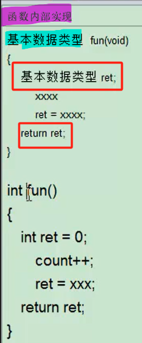
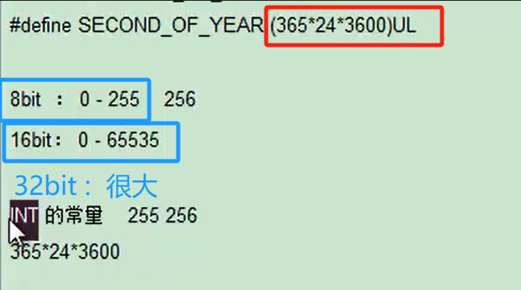
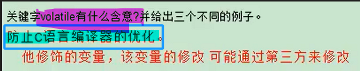

# 备注(声明)：

- 3 要做到： when to do? how to do? why to do?

- 1 双引号一定要把它理解成`const char `
# 一、编译和预处理

## 二进制
### 1 、进制转换
[[RK3568（linux学习）/linux基础知识学习/assets/嵌入式C语言/file-20250810171628893.png|Open: Pasted image 20250706135257.png]]

### 2 、2的n次方（二进制）

| 2的n次方 |       |     |     |
| ----- | ----- | --- | --- |
| 1     | 2     |     |     |
| 2     | 4     |     |     |
| 3     | 8     |     |     |
| 4     | 16    |     |     |
| 5     | 32    |     |     |
| 6     | 64    |     |     |
| 7     | 128   |     |     |
| 8     | 256   |     |     |
| 9     | 512   |     |     |
| 10    | 1024  |     |     |
| 16    | 65535 | 2B  | int |
|       |       |     |     |

### 3 、进制表示
[[RK3568（linux学习）/linux基础知识学习/assets/嵌入式C语言/file-20250810171628981.png|Open: Pasted image 20250706152603.png]]


## 对c语言的本质了解
### 1 、C语言工具的特性:内存操作
[[RK3568（linux学习）/linux基础知识学习/assets/嵌入式C语言/file-20250810171629106.png|Open: Pasted image 20250706135850.png]]


### 2 、对c语言的想法
> 什么时候用?
> 怎么用?
> 为什么要这样设计?

- 1 人和人之间交流的一种什么高级语言

- 3 在学完c语言过后，把这些关键字和常用符号啊，都能够呃看到过后立刻想到诶，我在什么场景下用过这样的符号，而且呢确实很好地解决了这样的问题。

### 3 、推荐教材
[[RK3568（linux学习）/linux基础知识学习/assets/嵌入式C语言/file-20250810171629166.png|Open: Pasted image 20250706135758.png]]


### 4、c操作对象 - 资源/内存(内存类型的资源,LCD缓存,LED灯)


## gcc概述
### 1 、翻译官
- 1 高级语言向机器语言翻译的一个工具

### 2 、查看gcc版本（ gcc -v）
[“02 gcc概述”页上的图片](onenote:#02%20gcc概述&section-id={2C7898E3-CF4E-4DD6-BB38-515BCA6A7286}&page-id={F20956CC-824F-47BF-B415-2AC1FC61B17E}&object-id={1A24562D-03F8-423C-9B59-162B1B98FBD7}&65&base-path=https://d.docs.live.net/52d4b76bb0ffcf51/Documents/\(RK3568\)Linux驱动开发/嵌入式C语言/嵌入式C语言.one)

### 3 、gcc -o 输出 输入 （gcc编译）
[“02 gcc概述”页上的图片](onenote:#02%20gcc概述&section-id={2C7898E3-CF4E-4DD6-BB38-515BCA6A7286}&page-id={F20956CC-824F-47BF-B415-2AC1FC61B17E}&object-id={1A24562D-03F8-423C-9B59-162B1B98FBD7}&6A&base-path=https://d.docs.live.net/52d4b76bb0ffcf51/Documents/\(RK3568\)Linux驱动开发/嵌入式C语言/嵌入式C语言.one)

### 4 、gcc编译时增加-v选项
[“02 gcc概述”页上的图片](onenote:#02%20gcc概述&section-id={2C7898E3-CF4E-4DD6-BB38-515BCA6A7286}&page-id={F20956CC-824F-47BF-B415-2AC1FC61B17E}&object-id={1A24562D-03F8-423C-9B59-162B1B98FBD7}&B7&base-path=https://d.docs.live.net/52d4b76bb0ffcf51/Documents/\(RK3568\)Linux驱动开发/嵌入式C语言/嵌入式C语言.one)

- 2 为我们服务，那么这个时候它就会打开一个开关，把我们gcc中设计的所有组织，都进行一个展现啊。

### 5、return 0；（代表成功）
- 2 非零值都代表失败


## C语言编译过程介绍
- 3 后面的命令在运行的时候会自动运行完前面要用的命令
### 1 、预处理（gcc -E）（生成.i文件）
- 3 预处理：去掉注释、加载头文件、替换宏定义，注意预处理不会进行语法检查

- 2 gcc -E -o app.i app.c

### 2 、编译（gcc -S）（生成.s文件）
- 2 gcc -S -o app.s app.c

### 3 、汇编（gcc -c）（生成.o文件）
- 2 gcc -c -o app.o app.c

### 4 、链接（gcc -o）（生成可执行文件）
- 2 gcc -o app app.c


## C语言编译常见错误举例
### 1 、预处理错误（not find）（-I）
```
#include <stdio.h> 
#include "stdio.h"
```
- 3 尖括号都是系统库
- 2 直接在我们系统的环境变量中去寻找

- 3 双引号都是我们自定义的头文件
- 2 在我们的当前目录下开始去寻找名字
- 2 `-I` 选项用于指定头文件（header files）的搜索路径


### 2 、编译错误（语法问题）
- 3 有多个原材料的时候，先把每个原材料编译（汇编）过后，再进行链接。


### 3 、链接错误（原材料多或少了）
- 3  undefined reference to ‘fun'（原材料不够）
- 2 寻找标签是否实现了，链接时是否加入一起链接

- 3 multiple definition of fun （原材料多了）
- 2 多次实现了标签，只保留一个标签实现

### 4 、


## C语言预处理介绍
### 1 、 include - 在当前的位置上进行一个展开

### 2 、#define 宏名 宏体
- 1 宏名一般都是用大写字母来写，尽量加括号。

[“05 C语言预处理介绍”页上的图片](onenote:#05%20C语言预处理介绍&section-id={2C7898E3-CF4E-4DD6-BB38-515BCA6A7286}&page-id={01B164D4-DF74-4C42-A279-6DD0D76F0013}&object-id={D93DADC8-79BE-4405-9113-C27067B25944}&53&base-path=https://d.docs.live.net/52d4b76bb0ffcf51/Documents/\(RK3568\)Linux驱动开发/嵌入式C语言/嵌入式C语言.one)

### 3 、宏函数
`#define ABC(x) (5+(x))`

### 4 、预定义宏（gcc自带的）
```
__FUNCTION__      函数名

__LINE__           行号

__FINE__           文件名

```
[举例使用](onenote:#05%20C语言预处理介绍&section-id={2C7898E3-CF4E-4DD6-BB38-515BCA6A7286}&page-id={01B164D4-DF74-4C42-A279-6DD0D76F0013}&object-id={D93DADC8-79BE-4405-9113-C27067B25944}&6F&base-path=https://d.docs.live.net/52d4b76bb0ffcf51/Documents/\(RK3568\)Linux驱动开发/嵌入式C语言/嵌入式C语言.one)

### 5、


## 条件预处理的应用
### 1 、条件预处理的作用
- 1 实现两个版本（调试和发行）之间的切换，借助我们编译器之前的预处理器。

### 2 、实际举例运用
```
#ifdef ABC
	printf("123%s",__FINE__);
	
#else AAA
	printf("222");
	
#endif 
```

### 3 、gcc -DXXX（在命令行定义宏）
[“06 条件预处理的应用”页上的图片](onenote:#06%20条件预处理的应用&section-id={2C7898E3-CF4E-4DD6-BB38-515BCA6A7286}&page-id={C360F865-5BA4-458C-ADEB-E90F6940E804}&object-id={33803EB0-0A81-4AC2-9AAF-06FE2046BA6F}&62&base-path=https://d.docs.live.net/52d4b76bb0ffcf51/Documents/\(RK3568\)Linux驱动开发/嵌入式C语言/嵌入式C语言.one)

- 2 gcc -DABC1 === #define ABC1

### 4 、


## 宏展开下的#、##使用
### 1 、# 字符串化
[“07 宏展开下的、使用”页上的图片](onenote:#07%20宏展开下的、使用&section-id={2C7898E3-CF4E-4DD6-BB38-515BCA6A7286}&page-id={482F50DE-0E6C-4C4A-B84B-268F665D91E6}&object-id={0B54FA0C-77BE-4A78-B0D4-B6BB18B2275E}&30&base-path=https://d.docs.live.net/52d4b76bb0ffcf51/Documents/\(RK3568\)Linux驱动开发/嵌入式C语言/嵌入式C语言.one)

### 2 、## 连接符号
[“07 宏展开下的、使用”页上的图片](onenote:#07%20宏展开下的、使用&section-id={2C7898E3-CF4E-4DD6-BB38-515BCA6A7286}&page-id={482F50DE-0E6C-4C4A-B84B-268F665D91E6}&object-id={0B54FA0C-77BE-4A78-B0D4-B6BB18B2275E}&3D&base-path=https://d.docs.live.net/52d4b76bb0ffcf51/Documents/\(RK3568\)Linux驱动开发/嵌入式C语言/嵌入式C语言.one)

- 2 前缀啊或后缀
- 2 隐藏的方法来实现
- 2 一些函数的父子啊
- 2 函数的调用啊的一些技巧性的赋值

- 1 实际举例：    [“07 宏展开下的、使用”页上的图片](onenote:#07%20宏展开下的、使用&section-id={2C7898E3-CF4E-4DD6-BB38-515BCA6A7286}&page-id={482F50DE-0E6C-4C4A-B84B-268F665D91E6}&object-id={0B54FA0C-77BE-4A78-B0D4-B6BB18B2275E}&5F&base-path=https://d.docs.live.net/52d4b76bb0ffcf51/Documents/\(RK3568\)Linux驱动开发/嵌入式C语言/嵌入式C语言.one)

### 3 、


# 二、关键字 - 编译器预先定义了一定意义的字符串（32个）
- 3 在任何环境下都可以使用

## 数据类型（对资源大小进行限制）
### 1 、总揽
[[RK3568（linux学习）/linux基础知识学习/assets/嵌入式C语言/file-20250810171629301.png|Open: Pasted image 20250706150719.png]]


### 2 、数据类型 - 限制内存(土地)的大小
- 1 c语言用来描述资源的属性。

- 2 数据类型的大小是跟编译器有关的，但是有默认值
### 3 、char（1B=8bit）（软件操作的最小单位）
[“10 数据类型关键字介绍及char类型”页上的图片](onenote:#10%20数据类型关键字介绍及char类型&section-id={2C7898E3-CF4E-4DD6-BB38-515BCA6A7286}&page-id={60456CD9-C9F4-46B2-87C6-F6845E9C6A38}&object-id={7F01788B-4E35-4BA0-9AAC-D0758DA14594}&3D&base-path=https://d.docs.live.net/52d4b76bb0ffcf51/Documents/\(RK3568\)Linux驱动开发/嵌入式C语言/嵌入式C语言.one)

### 4 、int（编译器最优的处理大小）（64位、32位系统中都为4B）
- 2 2B=65535


### 5、short（大多系统上为2B）
[“11 数据类型之int、long、short”页上的图片](onenote:#11%20数据类型之int、long、short&section-id={2C7898E3-CF4E-4DD6-BB38-515BCA6A7286}&page-id={92804773-9174-4437-A155-A88C10EC8182}&object-id={CA5F1483-B31F-41A1-B50F-65CD963659DB}&36&base-path=https://d.docs.live.net/52d4b76bb0ffcf51/Documents/\(RK3568\)Linux驱动开发/嵌入式C语言/嵌入式C语言.one)

### 6、long（大多系统上为8B）
[“11 数据类型之int、long、short”页上的图片](onenote:#11%20数据类型之int、long、short&section-id={2C7898E3-CF4E-4DD6-BB38-515BCA6A7286}&page-id={92804773-9174-4437-A155-A88C10EC8182}&object-id={CA5F1483-B31F-41A1-B50F-65CD963659DB}&36&base-path=https://d.docs.live.net/52d4b76bb0ffcf51/Documents/\(RK3568\)Linux驱动开发/嵌入式C语言/嵌入式C语言.one)

### 7、无符号数 - unsigned（数据）
[“12 数据类型之符号数(unsigned ,signed)、浮点类型(float ,double)、void”页上的图片](onenote:#12%20数据类型之符号数\(unsigned%20,signed\)、浮点类型\(float%20,double\)、void&section-id={2C7898E3-CF4E-4DD6-BB38-515BCA6A7286}&page-id={512AEE79-1675-4587-BD34-A4429F249875}&object-id={58A89822-FC44-4F7F-BB3D-8A8AE083EF68}&38&base-path=https://d.docs.live.net/52d4b76bb0ffcf51/Documents/\(RK3568\)Linux驱动开发/嵌入式C语言/嵌入式C语言.one)

### 8、有符号数 - signed（数字）（默认）
- 3 内存空间的最高字节是符号位
- 2 有符号数的最高位是符号位是无法右移成零
[“12 数据类型之符号数(unsigned ,signed)、浮点类型(float ,double)、void”页上的图片](onenote:#12%20数据类型之符号数\(unsigned%20,signed\)、浮点类型\(float%20,double\)、void&section-id={2C7898E3-CF4E-4DD6-BB38-515BCA6A7286}&page-id={512AEE79-1675-4587-BD34-A4429F249875}&object-id={58A89822-FC44-4F7F-BB3D-8A8AE083EF68}&38&base-path=https://d.docs.live.net/52d4b76bb0ffcf51/Documents/\(RK3568\)Linux驱动开发/嵌入式C语言/嵌入式C语言.one)

### 9、浮点类型 - float（4B）（耗内存）
[“12 数据类型之符号数(unsigned ,signed)、浮点类型(float ,double)、void”页上的图片](onenote:#12%20数据类型之符号数\(unsigned%20,signed\)、浮点类型\(float%20,double\)、void&section-id={2C7898E3-CF4E-4DD6-BB38-515BCA6A7286}&page-id={512AEE79-1675-4587-BD34-A4429F249875}&object-id={58A89822-FC44-4F7F-BB3D-8A8AE083EF68}&43&base-path=https://d.docs.live.net/52d4b76bb0ffcf51/Documents/\(RK3568\)Linux驱动开发/嵌入式C语言/嵌入式C语言.one)

### 10、浮点类型 - double（8B）（耗内存）
[“12 数据类型之符号数(unsigned ,signed)、浮点类型(float ,double)、void”页上的图片](onenote:#12%20数据类型之符号数\(unsigned%20,signed\)、浮点类型\(float%20,double\)、void&section-id={2C7898E3-CF4E-4DD6-BB38-515BCA6A7286}&page-id={512AEE79-1675-4587-BD34-A4429F249875}&object-id={58A89822-FC44-4F7F-BB3D-8A8AE083EF68}&43&base-path=https://d.docs.live.net/52d4b76bb0ffcf51/Documents/\(RK3568\)Linux驱动开发/嵌入式C语言/嵌入式C语言.one)


### 11、void（语义符）（并未申请内存）
[“12 数据类型之符号数(unsigned ,signed)、浮点类型(float ,double)、void”页上的图片](onenote:#12%20数据类型之符号数\(unsigned%20,signed\)、浮点类型\(float%20,double\)、void&section-id={2C7898E3-CF4E-4DD6-BB38-515BCA6A7286}&page-id={512AEE79-1675-4587-BD34-A4429F249875}&object-id={58A89822-FC44-4F7F-BB3D-8A8AE083EF68}&4E&base-path=https://d.docs.live.net/52d4b76bb0ffcf51/Documents/\(RK3568\)Linux驱动开发/嵌入式C语言/嵌入式C语言.one)

### 12、


## 自定义数据类型（基本元素的集合）
### 1 、总揽
[[RK3568（linux学习）/linux基础知识学习/assets/嵌入式C语言/file-20250810171629418.png|Open: Pasted image 20250706150752.png]]


### 2 、结构体 - struct
[“13 自定义数据类型struct、union”页上的图片](onenote:#13%20自定义数据类型struct、union&section-id={2C7898E3-CF4E-4DD6-BB38-515BCA6A7286}&page-id={7B6E5E10-84A3-42FE-9A7B-F5CC9B56592C}&object-id={7C3D0F36-EA3C-4DC8-9C44-A300DD6BE64B}&18&base-path=https://d.docs.live.net/52d4b76bb0ffcf51/Documents/\(RK3568\)Linux驱动开发/嵌入式C语言/嵌入式C语言.one)

```
// 定义了一个名为'myabc'的结构体数据类型。
// 该结构体包含四个无符号整型成员：a、b、c和d。
// 注意原代码中的'unsignek int d;'是一个拼写错误，应为'unsigned int d;'
struct myabc {
    unsigned int a; // 成员变量a，用于存储无符号整数
    unsigned int b; // 成员变量b，用于存储无符号整数
    unsigned int c; // 成员变量c，用于存储无符号整数
    unsigned int d; // 成员变量d，用于存储无符号整数，注意更正了原始代码中的拼写错误
};

// 声明一个'myabc'结构体类型的变量'mybuf'
// 这个变量可以用来存储一组数据，这些数据由四个无符号整数组成
struct myabc mybuf;
```

- 2 每一个变量的起始地址，都是上一个变量的什么未地址啊

### 3 、union - 共用起始地址的一段内存（定义同结构体）
[“13 自定义数据类型struct、union”页上的图片](onenote:#13%20自定义数据类型struct、union&section-id={2C7898E3-CF4E-4DD6-BB38-515BCA6A7286}&page-id={7B6E5E10-84A3-42FE-9A7B-F5CC9B56592C}&object-id={7C3D0F36-EA3C-4DC8-9C44-A300DD6BE64B}&7D&base-path=https://d.docs.live.net/52d4b76bb0ffcf51/Documents/\(RK3568\)Linux驱动开发/嵌入式C语言/嵌入式C语言.one)

- 2 在内核中，一些技巧性的代码啊，能够理解到就可以啊
### 4 、enum（一一列举）（被命名的整型常数的集合）
[“14 自定义数据类型enum”页上的图片](onenote:#14%20自定义数据类型enum&section-id={2C7898E3-CF4E-4DD6-BB38-515BCA6A7286}&page-id={FFAB0191-DA96-48D3-816A-4F61E263365F}&object-id={A3E883FE-0E76-436C-877A-15DAA4E8C17C}&29&base-path=https://d.docs.live.net/52d4b76bb0ffcf51/Documents/\(RK3568\)Linux驱动开发/嵌入式C语言/嵌入式C语言.one)

- 3 enum 枚举名称{常里列表};

- 2 这个东西啊实际上就是在描述一个整形
- 2 不管你里头定义了多少个常量，最终来说它只能什么取其中一个
- 2 我们程序员和程序员之间，交流上更加便利的一种什么打包的常量集合的一种概念

- 1 实际举例： [“14 自定义数据类型enum”页上的图片](onenote:#14%20自定义数据类型enum&section-id={2C7898E3-CF4E-4DD6-BB38-515BCA6A7286}&page-id={FFAB0191-DA96-48D3-816A-4F61E263365F}&object-id={A3E883FE-0E76-436C-877A-15DAA4E8C17C}&B9&base-path=https://d.docs.live.net/52d4b76bb0ffcf51/Documents/\(RK3568\)Linux驱动开发/嵌入式C语言/嵌入式C语言.one)
### 5、typedef（重命名）
[“15 自定义数据类型typedef”页上的图片](onenote:#15%20自定义数据类型typedef&section-id={2C7898E3-CF4E-4DD6-BB38-515BCA6A7286}&page-id={645B1E1D-3052-4780-ACAB-7F0AF0CCD2AB}&object-id={7F91BB18-C052-4B4C-9BA5-5868E37A33DF}&12&base-path=https://d.docs.live.net/52d4b76bb0ffcf51/Documents/\(RK3568\)Linux驱动开发/嵌入式C语言/嵌入式C语言.one)

`typedef unsigned int u_int;`

### 6、


## 逻辑结构
### 1 、总揽
[[RK3568（linux学习）/linux基础知识学习/assets/嵌入式C语言/file-20250810171629508.png|Open: Pasted image 20250706150757.png]]


### 2 、if、else（条件分支）

```
if(a>3){
	pintf("1111");
}if else(a<1){
	pintf("2222");
}else{
	printf("3333");
}
```
[“16 逻辑结构关键字”页上的图片](onenote:#16%20逻辑结构关键字&section-id={2C7898E3-CF4E-4DD6-BB38-515BCA6A7286}&page-id={2F69F800-4CF8-4A93-A513-99ABFECE3964}&object-id={18D469AA-F2BB-46E4-A181-46464616186C}&29&base-path=https://d.docs.live.net/52d4b76bb0ffcf51/Documents/\(RK3568\)Linux驱动开发/嵌入式C语言/嵌入式C语言.one)

### 3 、switch、case、default（多分支）
```
switch(a){
	case 1:
		printf("1111");
		break;
	case 2:
		printf("2222");
		break;

	default:
		printf("3333");
}

```

[“16 逻辑结构关键字”页上的图片](onenote:#16%20逻辑结构关键字&section-id={2C7898E3-CF4E-4DD6-BB38-515BCA6A7286}&page-id={2F69F800-4CF8-4A93-A513-99ABFECE3964}&object-id={18D469AA-F2BB-46E4-A181-46464616186C}&3B&base-path=https://d.docs.live.net/52d4b76bb0ffcf51/Documents/\(RK3568\)Linux驱动开发/嵌入式C语言/嵌入式C语言.one)

### 4 、do、while（循环）（先执行一次循环体内的代码）
```
do{
	printf("1111");
}while(a>4);
```
[“16 逻辑结构关键字”页上的图片](onenote:#16%20逻辑结构关键字&section-id={2C7898E3-CF4E-4DD6-BB38-515BCA6A7286}&page-id={2F69F800-4CF8-4A93-A513-99ABFECE3964}&object-id={18D469AA-F2BB-46E4-A181-46464616186C}&59&base-path=https://d.docs.live.net/52d4b76bb0ffcf51/Documents/\(RK3568\)Linux驱动开发/嵌入式C语言/嵌入式C语言.one)

### 5、for（循环）（通常用于已知循环次数的情况。）
 ```
for(int a=1;a<5;a++){


}
```
[“16 逻辑结构关键字”页上的图片](onenote:#16%20逻辑结构关键字&section-id={2C7898E3-CF4E-4DD6-BB38-515BCA6A7286}&page-id={2F69F800-4CF8-4A93-A513-99ABFECE3964}&object-id={18D469AA-F2BB-46E4-A181-46464616186C}&59&base-path=https://d.docs.live.net/52d4b76bb0ffcf51/Documents/\(RK3568\)Linux驱动开发/嵌入式C语言/嵌入式C语言.one)


### 6、continue（跳过当前循环体中剩余的部分并继续下一次循环）
[“16 逻辑结构关键字”页上的图片](onenote:#16%20逻辑结构关键字&section-id={2C7898E3-CF4E-4DD6-BB38-515BCA6A7286}&page-id={2F69F800-4CF8-4A93-A513-99ABFECE3964}&object-id={18D469AA-F2BB-46E4-A181-46464616186C}&64&base-path=https://d.docs.live.net/52d4b76bb0ffcf51/Documents/\(RK3568\)Linux驱动开发/嵌入式C语言/嵌入式C语言.one)

### 7、break（立即退出最近的循环或 switch 语句）
- 2 程序将继续从该结构之后的第一条语句开始执行

[“16 逻辑结构关键字”页上的图片](onenote:#16%20逻辑结构关键字&section-id={2C7898E3-CF4E-4DD6-BB38-515BCA6A7286}&page-id={2F69F800-4CF8-4A93-A513-99ABFECE3964}&object-id={18D469AA-F2BB-46E4-A181-46464616186C}&6F&base-path=https://d.docs.live.net/52d4b76bb0ffcf51/Documents/\(RK3568\)Linux驱动开发/嵌入式C语言/嵌入式C语言.one)
### 8、goto（使程序跳转到标记了相应标签的位置）
[“16 逻辑结构关键字”页上的图片](onenote:#16%20逻辑结构关键字&section-id={2C7898E3-CF4E-4DD6-BB38-515BCA6A7286}&page-id={2F69F800-4CF8-4A93-A513-99ABFECE3964}&object-id={18D469AA-F2BB-46E4-A181-46464616186C}&77&base-path=https://d.docs.live.net/52d4b76bb0ffcf51/Documents/\(RK3568\)Linux驱动开发/嵌入式C语言/嵌入式C语言.one)

- 2 一般都在同一个函数内使用,不进行跨函数使用

## 类型修饰符 - 对内存资源存放位置的限定
### 1 、总揽
[[RK3568（linux学习）/linux基础知识学习/assets/嵌入式C语言/file-20250810171629745.png|Open: Pasted image 20250706150804.png]]


### 2 、register（尽量限制变量定义在寄存器上）
[“17 类型修饰符(一)_register ,auto”页上的图片](onenote:#17%20类型修饰符\(一\)_register%20,auto&section-id={2C7898E3-CF4E-4DD6-BB38-515BCA6A7286}&page-id={9B92E7A0-88A3-4335-8026-DFE85AA86FBE}&object-id={7F558D21-0876-4F56-835D-D062E0A42655}&6C&base-path=https://d.docs.live.net/52d4b76bb0ffcf51/Documents/\(RK3568\)Linux驱动开发/嵌入式C语言/嵌入式C语言.one)

- 2 CPU直接访问寄存器是比访问内存要快的效率更高的
- 2 适用于频繁使用的局部变量，如循环计数器
- 2 给我们人和人之间交流的时候，带来一种思想，原来a访问比较频繁。

- 3 错误使用会在编译时报错
[“17 类型修饰符(一)_register ,auto”页上的图片](onenote:#17%20类型修饰符\(一\)_register%20,auto&section-id={2C7898E3-CF4E-4DD6-BB38-515BCA6A7286}&page-id={9B92E7A0-88A3-4335-8026-DFE85AA86FBE}&object-id={7F558D21-0876-4F56-835D-D062E0A42655}&7B&base-path=https://d.docs.live.net/52d4b76bb0ffcf51/Documents/\(RK3568\)Linux驱动开发/嵌入式C语言/嵌入式C语言.one)

### 3 、auto（默认）
- 3 普通内存可读可写空间中分配的一段区域（栈空间）
[“17 类型修饰符(一)_register ,auto”页上的图片](onenote:#17%20类型修饰符\(一\)_register%20,auto&section-id={2C7898E3-CF4E-4DD6-BB38-515BCA6A7286}&page-id={9B92E7A0-88A3-4335-8026-DFE85AA86FBE}&object-id={7F558D21-0876-4F56-835D-D062E0A42655}&48&base-path=https://d.docs.live.net/52d4b76bb0ffcf51/Documents/\(RK3568\)Linux驱动开发/嵌入式C语言/嵌入式C语言.one)

### 4 、static（静态）
[“18 类型修饰符(二)_static_const”页上的图片](onenote:#18%20类型修饰符\(二\)_static_const&section-id={2C7898E3-CF4E-4DD6-BB38-515BCA6A7286}&page-id={CF81B6CA-5F59-4891-AF7E-5AEE8AFCFCEB}&object-id={7D6A1ACE-E9E8-4001-94F8-E5573BCA796D}&16&base-path=https://d.docs.live.net/52d4b76bb0ffcf51/Documents/\(RK3568\)Linux驱动开发/嵌入式C语言/嵌入式C语言.one)

- 3 全局变量        限制了该变量的作用域仅限于声明它的源文件内
[“18 类型修饰符(二)_static_const”页上的图片](onenote:#18%20类型修饰符\(二\)_static_const&section-id={2C7898E3-CF4E-4DD6-BB38-515BCA6A7286}&page-id={CF81B6CA-5F59-4891-AF7E-5AEE8AFCFCEB}&object-id={7D6A1ACE-E9E8-4001-94F8-E5573BCA796D}&64&base-path=https://d.docs.live.net/52d4b76bb0ffcf51/Documents/\(RK3568\)Linux驱动开发/嵌入式C语言/嵌入式C语言.one)

- 3 局部变量         函数结束，静态局部变量的值仍然保留
[“18 类型修饰符(二)_static_const”页上的图片](onenote:#18%20类型修饰符\(二\)_static_const&section-id={2C7898E3-CF4E-4DD6-BB38-515BCA6A7286}&page-id={CF81B6CA-5F59-4891-AF7E-5AEE8AFCFCEB}&object-id={7D6A1ACE-E9E8-4001-94F8-E5573BCA796D}&6A&base-path=https://d.docs.live.net/52d4b76bb0ffcf51/Documents/\(RK3568\)Linux驱动开发/嵌入式C语言/嵌入式C语言.one)

- 3 函数                  限制了函数只能在定义它的文件内部被调用
[“18 类型修饰符(二)_static_const”页上的图片](onenote:#18%20类型修饰符\(二\)_static_const&section-id={2C7898E3-CF4E-4DD6-BB38-515BCA6A7286}&page-id={CF81B6CA-5F59-4891-AF7E-5AEE8AFCFCEB}&object-id={7D6A1ACE-E9E8-4001-94F8-E5573BCA796D}&6A&base-path=https://d.docs.live.net/52d4b76bb0ffcf51/Documents/\(RK3568\)Linux驱动开发/嵌入式C语言/嵌入式C语言.one)


### 5、const（常量）（只读）
[“18 类型修饰符(二)_static_const”页上的图片](onenote:#18%20类型修饰符\(二\)_static_const&section-id={2C7898E3-CF4E-4DD6-BB38-515BCA6A7286}&page-id={CF81B6CA-5F59-4891-AF7E-5AEE8AFCFCEB}&object-id={7D6A1ACE-E9E8-4001-94F8-E5573BCA796D}&FC&base-path=https://d.docs.live.net/52d4b76bb0ffcf51/Documents/\(RK3568\)Linux驱动开发/嵌入式C语言/嵌入式C语言.one)

#### const与指针定义
[“18 类型修饰符(二)_static_const”页上的图片](onenote:#18%20类型修饰符\(二\)_static_const&section-id={2C7898E3-CF4E-4DD6-BB38-515BCA6A7286}&page-id={CF81B6CA-5F59-4891-AF7E-5AEE8AFCFCEB}&object-id={7D6A1ACE-E9E8-4001-94F8-E5573BCA796D}&FE&base-path=https://d.docs.live.net/52d4b76bb0ffcf51/Documents/\(RK3568\)Linux驱动开发/嵌入式C语言/嵌入式C语言.one)

```
#include <stdio.h>

int main() {
    // 指向的内容不可修改
    const char* p = "Hello";
    // p是一个指向常量字符串"Hello"的指针，可以改变p指向的位置，但不能修改其所指向的内容

    // 指针本身不可修改
    char * const q = "World"; // 不建议这样写，因为试图修改*q可能导致未定义行为
    // q是一个常量指针，初始化后不能更改其指向的地址，但如果指向的数据不是常量，则可以通过*q修改数据

    // 两者都不可修改
    const char* const r = "Immutable";
    // r是一个指向常量字符串"Immutable"的常量指针，r不能被重新赋值，且*r也不能被修改

    printf("%s\n", p); // 输出: Hello
    printf("%s\n", q); // 输出: World
    printf("%s\n", r); // 输出: Immutable

    return 0;
}
```


#### const与函数（保证传入的数据不会被函数内部修改）（返回只读变量）
[“18 类型修饰符(二)_static_const”页上的图片](onenote:#18%20类型修饰符\(二\)_static_const&section-id={2C7898E3-CF4E-4DD6-BB38-515BCA6A7286}&page-id={CF81B6CA-5F59-4891-AF7E-5AEE8AFCFCEB}&object-id={19FD547C-EB91-49E9-88E1-27D54ABE475A}&A&base-path=https://d.docs.live.net/52d4b76bb0ffcf51/Documents/\(RK3568\)Linux驱动开发/嵌入式C语言/嵌入式C语言.one)


### 6、volatile（不优化编译）
[“19 类型修饰符(三)_volatile”页上的图片](onenote:#19%20类型修饰符\(三\)_volatile&section-id={2C7898E3-CF4E-4DD6-BB38-515BCA6A7286}&page-id={8FD51D8E-B429-4698-9DCD-E2E24C5D4312}&object-id={A2081200-C60E-497C-BE50-930497E40174}&16&base-path=https://d.docs.live.net/52d4b76bb0ffcf51/Documents/\(RK3568\)Linux驱动开发/嵌入式C语言/嵌入式C语言.one)

#### 使用场景（硬件寄存器访问）（可能在程序逻辑之外被修改的变量上）
[“19 类型修饰符(三)_volatile”页上的图片](onenote:#19%20类型修饰符\(三\)_volatile&section-id={2C7898E3-CF4E-4DD6-BB38-515BCA6A7286}&page-id={8FD51D8E-B429-4698-9DCD-E2E24C5D4312}&object-id={A2081200-C60E-497C-BE50-930497E40174}&44&base-path=https://d.docs.live.net/52d4b76bb0ffcf51/Documents/\(RK3568\)Linux驱动开发/嵌入式C语言/嵌入式C语言.one)


### 7、


## 杂项
### 1 、总揽
[[RK3568（linux学习）/linux基础知识学习/assets/嵌入式C语言/file-20250810171630075.png|Open: Pasted image 20250706150811.png]]


### 2 、sizeof
- 3 查看内存容量的工具。              `sizeof a;`

### 3 、return
- 2 返回的概念。

### 4 、

# 三、运算符
- 3 熟悉常用运算符的典型操作，总结什么时候使用什么运算符

## 算术操作运算
### 1 、总揽
![[Pasted image 20250706165056.png]]

### 2 、+、-


### 3 、* 、/、%
[“20 常用运算符(一) + - * / %”页上的图片](onenote:#20%20常用运算符\(一\)%20+%20%20-%20%20*%20%20\%20%20%25&section-id={2C7898E3-CF4E-4DD6-BB38-515BCA6A7286}&page-id={0AFFCDDC-879B-4D5B-B234-35EB55F33D3B}&object-id={53AEB6C5-BD68-43B8-9DFA-2264C8CD83E2}&32&base-path=https://d.docs.live.net/52d4b76bb0ffcf51/Documents/\(RK3568\)Linux驱动开发/嵌入式C语言/嵌入式C语言.one)

- 2 * 耗资源
- 2 % 取一个范围的数  n%m = res【0 - m-1】

### 4 、


## 逻辑运算
### 1 、总揽
[[RK3568（linux学习）/linux基础知识学习/assets/嵌入式C语言/file-20250810171630413.png|Open: Pasted image 20250706165107.png]]


### 2 、|| 、&&
[“21 常用运算符(二)_逻辑运算符”页上的图片](onenote:#21%20常用运算符\(二\)_逻辑运算符&section-id={2C7898E3-CF4E-4DD6-BB38-515BCA6A7286}&page-id={535722AC-DD20-429C-ADE3-9859A1335733}&object-id={020BCF94-FF9D-4D9B-94BC-46CFE6606EA9}&5E&base-path=https://d.docs.live.net/52d4b76bb0ffcf51/Documents/\(RK3568\)Linux驱动开发/嵌入式C语言/嵌入式C语言.one)

- 1 ||    有1为1

- 3 执行有先后顺序
[“21 常用运算符(二)_逻辑运算符”页上的图片](onenote:#21%20常用运算符\(二\)_逻辑运算符&section-id={2C7898E3-CF4E-4DD6-BB38-515BCA6A7286}&page-id={535722AC-DD20-429C-ADE3-9859A1335733}&object-id={020BCF94-FF9D-4D9B-94BC-46CFE6606EA9}&1C&base-path=https://d.docs.live.net/52d4b76bb0ffcf51/Documents/\(RK3568\)Linux驱动开发/嵌入式C语言/嵌入式C语言.one)

### 3 、>、>= 、<   、 <=


### 4 、！（结果取反）


### 5、？ ： （三目运算符）
[“21 常用运算符(二)_逻辑运算符”页上的图片](onenote:#21%20常用运算符\(二\)_逻辑运算符&section-id={2C7898E3-CF4E-4DD6-BB38-515BCA6A7286}&page-id={535722AC-DD20-429C-ADE3-9859A1335733}&object-id={020BCF94-FF9D-4D9B-94BC-46CFE6606EA9}&80&base-path=https://d.docs.live.net/52d4b76bb0ffcf51/Documents/\(RK3568\)Linux驱动开发/嵌入式C语言/嵌入式C语言.one)

### 6、


## 位运算
### 1 、总揽
[[RK3568（linux学习）/linux基础知识学习/assets/嵌入式C语言/file-20250810171630580.png|Open: Pasted image 20250706165113.png]]


### 2 、<<（左移）（高位丢弃，低位补0）
[“22位运算符(一)移位运算符”页上的图片](onenote:#22位运算符\(一\)移位运算符&section-id={2C7898E3-CF4E-4DD6-BB38-515BCA6A7286}&page-id={6B467C5A-C3CA-485A-BFC8-3310D073C2F8}&object-id={FF970EBB-3516-4468-9143-3EAD9756D5D5}&16&base-path=https://d.docs.live.net/52d4b76bb0ffcf51/Documents/\(RK3568\)Linux驱动开发/嵌入式C语言/嵌入式C语言.one)

- 2 等价于将x乘以2的n次方(但更高效)

### 3 、>>（右移）（底位丢弃）
[“22位运算符(一)移位运算符”页上的图片](onenote:#22位运算符\(一\)移位运算符&section-id={2C7898E3-CF4E-4DD6-BB38-515BCA6A7286}&page-id={6B467C5A-C3CA-485A-BFC8-3310D073C2F8}&object-id={FF970EBB-3516-4468-9143-3EAD9756D5D5}&52&base-path=https://d.docs.live.net/52d4b76bb0ffcf51/Documents/\(RK3568\)Linux驱动开发/嵌入式C语言/嵌入式C语言.one)

- 1 高位正数补零，负数补1（有符号整数而言）

- 3 涉及到乘除法，移位操作能操作得了的，我们尽量用移位操作。
### 4 、&（清零器）
[“23 位运算符(二)与或运算符”页上的图片](onenote:#23%20位运算符\(二\)与或运算符&section-id={2C7898E3-CF4E-4DD6-BB38-515BCA6A7286}&page-id={87F284D4-D45D-4769-AC69-4A2AC399E1A1}&object-id={8EBF8F17-FE2A-4DA1-A330-09DFAEA3DB41}&16&base-path=https://d.docs.live.net/52d4b76bb0ffcf51/Documents/\(RK3568\)Linux驱动开发/嵌入式C语言/嵌入式C语言.one)


### 5、|（置1器）
[“23 位运算符(二)与或运算符”页上的图片](onenote:#23%20位运算符\(二\)与或运算符&section-id={2C7898E3-CF4E-4DD6-BB38-515BCA6A7286}&page-id={87F284D4-D45D-4769-AC69-4A2AC399E1A1}&object-id={8EBF8F17-FE2A-4DA1-A330-09DFAEA3DB41}&7A&base-path=https://d.docs.live.net/52d4b76bb0ffcf51/Documents/\(RK3568\)Linux驱动开发/嵌入式C语言/嵌入式C语言.one)


### 6、`^`（相同为零，不同为一）（异或）
[“24 位运算符(三)取反,异或运算符”页上的图片](onenote:#24%20位运算符\(三\)取反,异或运算符&section-id={2C7898E3-CF4E-4DD6-BB38-515BCA6A7286}&page-id={C3BBD4CF-0D69-4769-A0B6-01C1CB1F7268}&object-id={48942FF3-6B32-4685-998D-FE2BF3E05E41}&20&base-path=https://d.docs.live.net/52d4b76bb0ffcf51/Documents/\(RK3568\)Linux驱动开发/嵌入式C语言/嵌入式C语言.one)


### 7、~（取反）
[“24 位运算符(三)取反,异或运算符”页上的图片](onenote:#24%20位运算符\(三\)取反,异或运算符&section-id={2C7898E3-CF4E-4DD6-BB38-515BCA6A7286}&page-id={C3BBD4CF-0D69-4769-A0B6-01C1CB1F7268}&object-id={48942FF3-6B32-4685-998D-FE2BF3E05E41}&3A&base-path=https://d.docs.live.net/52d4b76bb0ffcf51/Documents/\(RK3568\)Linux驱动开发/嵌入式C语言/嵌入式C语言.one)


### 8、


## 内存访问符号
### 1 、总揽
[[RK3568（linux学习）/linux基础知识学习/assets/嵌入式C语言/file-20250810171630675.png|Open: Pasted image 20250706165119.png]]


### 2 、()  （限制符）（限制优先级）
[“25 常用运算符(三)_内存访问符”页上的图片](onenote:#25%20常用运算符\(三\)_内存访问符&section-id={2C7898E3-CF4E-4DD6-BB38-515BCA6A7286}&page-id={EDE206E3-456F-4FD0-BACD-4CF59CAFF370}&object-id={C7CCB882-6A2D-420F-A370-ADCDC0D0EAC3}&2B&base-path=https://d.docs.live.net/52d4b76bb0ffcf51/Documents/\(RK3568\)Linux驱动开发/嵌入式C语言/嵌入式C语言.one)

### 3 、`[ ]`（内存访问的D符号）
[“25 常用运算符(三)_内存访问符”页上的图片](onenote:#25%20常用运算符\(三\)_内存访问符&section-id={2C7898E3-CF4E-4DD6-BB38-515BCA6A7286}&page-id={EDE206E3-456F-4FD0-BACD-4CF59CAFF370}&object-id={C7CCB882-6A2D-420F-A370-ADCDC0D0EAC3}&36&base-path=https://d.docs.live.net/52d4b76bb0ffcf51/Documents/\(RK3568\)Linux驱动开发/嵌入式C语言/嵌入式C语言.one)

- 2 a[1]
### 4 、`{ } `(函数体的限制符)


### 5、`->`（访问该结构体或类的成员）（地址访问符）
[“25 常用运算符(三)_内存访问符”页上的图片](onenote:#25%20常用运算符\(三\)_内存访问符&section-id={2C7898E3-CF4E-4DD6-BB38-515BCA6A7286}&page-id={EDE206E3-456F-4FD0-BACD-4CF59CAFF370}&object-id={C7CCB882-6A2D-420F-A370-ADCDC0D0EAC3}&55&base-path=https://d.docs.live.net/52d4b76bb0ffcf51/Documents/\(RK3568\)Linux驱动开发/嵌入式C语言/嵌入式C语言.one)


### 6、` . `（成员访问符）（访问对象的属性或方法。）
[“25 常用运算符(三)_内存访问符”页上的图片](onenote:#25%20常用运算符\(三\)_内存访问符&section-id={2C7898E3-CF4E-4DD6-BB38-515BCA6A7286}&page-id={EDE206E3-456F-4FD0-BACD-4CF59CAFF370}&object-id={C7CCB882-6A2D-420F-A370-ADCDC0D0EAC3}&5A&base-path=https://d.docs.live.net/52d4b76bb0ffcf51/Documents/\(RK3568\)Linux驱动开发/嵌入式C语言/嵌入式C语言.one)

### 7、& （取地址运算符）
[“25 常用运算符(三)_内存访问符”页上的图片](onenote:#25%20常用运算符\(三\)_内存访问符&section-id={2C7898E3-CF4E-4DD6-BB38-515BCA6A7286}&page-id={EDE206E3-456F-4FD0-BACD-4CF59CAFF370}&object-id={C7CCB882-6A2D-420F-A370-ADCDC0D0EAC3}&86&base-path=https://d.docs.live.net/52d4b76bb0ffcf51/Documents/\(RK3568\)Linux驱动开发/嵌入式C语言/嵌入式C语言.one)

### 8、* （解引用运算符）（访问指针所指向的变量的值）
[“25 常用运算符(三)_内存访问符”页上的图片](onenote:#25%20常用运算符\(三\)_内存访问符&section-id={2C7898E3-CF4E-4DD6-BB38-515BCA6A7286}&page-id={EDE206E3-456F-4FD0-BACD-4CF59CAFF370}&object-id={C7CCB882-6A2D-420F-A370-ADCDC0D0EAC3}&8E&base-path=https://d.docs.live.net/52d4b76bb0ffcf51/Documents/\(RK3568\)Linux驱动开发/嵌入式C语言/嵌入式C语言.one)

## 赋值运算
### 1 、总揽
[[RK3568（linux学习）/linux基础知识学习/assets/嵌入式C语言/file-20250810171630800.png|Open: Pasted image 20250706165123.png]]


### 2 、=


### 3 、+=、-=、&=、|=


# 四、C语言内存空间的使用（指针）
[[RK3568（linux学习）/linux基础知识学习/assets/嵌入式C语言/file-20250810171631278.png|Open: Pasted image 20250706214738.png]]


## 指针概述
### 1 、
- 1 地址的一个代名词、    内存资源的门牌号

### 2 、指针大小（32位系统4B）（64位系统8B）


### 3 、指针也就是地址
[“01 指针概述1”页上的图片](onenote:#01%20指针概述1&section-id={2C7898E3-CF4E-4DD6-BB38-515BCA6A7286}&page-id={C5A04AA9-D2EE-419B-9EE9-7152CA0C4A73}&object-id={4DC01927-8B1A-4A31-9BF0-61C21F5A0BD2}&11&base-path=https://d.docs.live.net/52d4b76bb0ffcf51/Documents/\(RK3568\)Linux驱动开发/嵌入式C语言/嵌入式C语言.one)

- 2  指针变量存放指针这个概念的盒子

### 4 、指针变量类型（内存的读取方法）


### 5、pc机是小端字节（高在高，低在低）
[“02 指针概述2_举例1”页上的图片](onenote:#02%20指针概述2_举例1&section-id={2C7898E3-CF4E-4DD6-BB38-515BCA6A7286}&page-id={A6BA3102-E56B-402B-B390-170260F87FD6}&object-id={6E5A0A4E-8089-4DB6-87AF-A2324E10BBB3}&3A&base-path=https://d.docs.live.net/52d4b76bb0ffcf51/Documents/\(RK3568\)Linux驱动开发/嵌入式C语言/嵌入式C语言.one)

- 1 从地址低位开始读

### 6、


## 指针+修饰符
### 1 、指针与 const
[“04 针修饰符const介绍”页上的图片](onenote:#04%20针修饰符const介绍&section-id={2C7898E3-CF4E-4DD6-BB38-515BCA6A7286}&page-id={AF3E83EC-2AC8-47AD-BFB0-11A8F8D05BF7}&object-id={A1220846-2C20-4482-8E5D-E877BDE29E19}&12&base-path=https://d.docs.live.net/52d4b76bb0ffcf51/Documents/\(RK3568\)Linux驱动开发/嵌入式C语言/嵌入式C语言.one)

- 1 实例分析
[“05 指针修饰符const举例”页上的图片](onenote:#05%20指针修饰符const举例&section-id={2C7898E3-CF4E-4DD6-BB38-515BCA6A7286}&page-id={321D7BBD-EBA6-446B-8C85-E1B5455C371E}&object-id={0134AA87-6B86-4344-A372-72F99E1701B1}&16&base-path=https://d.docs.live.net/52d4b76bb0ffcf51/Documents/\(RK3568\)Linux驱动开发/嵌入式C语言/嵌入式C语言.one)

- 2 写指针赋值的时候，一定要想办法去了解到，我们指针指向的这段内存真正的属性是什么
### 2 、指针与volatile（防止优化指向内存地址）
[“06 指针修饰符volatile、typedef”页上的图片](onenote:#06%20指针修饰符volatile、typedef&section-id={2C7898E3-CF4E-4DD6-BB38-515BCA6A7286}&page-id={1F0530AA-51A3-44F8-99C7-1FC3F7705F1E}&object-id={D015A40E-D05B-4EA5-90A6-C4777D1800F2}&16&base-path=https://d.docs.live.net/52d4b76bb0ffcf51/Documents/\(RK3568\)Linux驱动开发/嵌入式C语言/嵌入式C语言.one)

### 3 、指针与typedef（重命名）
[“06 指针修饰符volatile、typedef”页上的图片](onenote:#06%20指针修饰符volatile、typedef&section-id={2C7898E3-CF4E-4DD6-BB38-515BCA6A7286}&page-id={1F0530AA-51A3-44F8-99C7-1FC3F7705F1E}&object-id={D015A40E-D05B-4EA5-90A6-C4777D1800F2}&27&base-path=https://d.docs.live.net/52d4b76bb0ffcf51/Documents/\(RK3568\)Linux驱动开发/嵌入式C语言/嵌入式C语言.one)

- 1 更复杂的一些声明，给他别名化
- [“06 指针修饰符volatile、typedef”页上的图片](onenote:#06%20指针修饰符volatile、typedef&section-id={2C7898E3-CF4E-4DD6-BB38-515BCA6A7286}&page-id={1F0530AA-51A3-44F8-99C7-1FC3F7705F1E}&object-id={D015A40E-D05B-4EA5-90A6-C4777D1800F2}&69&base-path=https://d.docs.live.net/52d4b76bb0ffcf51/Documents/\(RK3568\)Linux驱动开发/嵌入式C语言/嵌入式C语言.one)


## 指针+运算符

### 1、指针与++、--、+、-
[“07 指针运算符加减标签操作”页上的图片](onenote:#07%20指针运算符加减标签操作&section-id={2C7898E3-CF4E-4DD6-BB38-515BCA6A7286}&page-id={0AC375D6-8789-447C-95A4-98E0FAA3E05D}&object-id={62B6C23C-158C-428E-896A-DC1DC339DC36}&12&base-path=https://d.docs.live.net/52d4b76bb0ffcf51/Documents/\(RK3568\)Linux驱动开发/嵌入式C语言/嵌入式C语言.one)

- 1 p++ 、p--      更新地址  会把P的值也改变
- 1 指针的加法、减法运算，实际上加的是一个单位（指针变量）
### 2、`变量名[n]`的使用（会取出内容）
[“07 指针运算符加减标签操作”页上的图片](onenote:#07%20指针运算符加减标签操作&section-id={2C7898E3-CF4E-4DD6-BB38-515BCA6A7286}&page-id={0AC375D6-8789-447C-95A4-98E0FAA3E05D}&object-id={62B6C23C-158C-428E-896A-DC1DC339DC36}&3F&base-path=https://d.docs.live.net/52d4b76bb0ffcf51/Documents/\(RK3568\)Linux驱动开发/嵌入式C语言/嵌入式C语言.one)

### 3、指针运算符加减举例
[“08 指针运算符加减举例1”页上的图片](onenote:#08%20指针运算符加减举例1&section-id={2C7898E3-CF4E-4DD6-BB38-515BCA6A7286}&page-id={E661947D-DB45-4823-BE4B-A945477A30C2}&object-id={AE9E74FE-14B4-440E-B296-87D0267412A6}&16&base-path=https://d.docs.live.net/52d4b76bb0ffcf51/Documents/\(RK3568\)Linux驱动开发/嵌入式C语言/嵌入式C语言.one)

### 4、指针越界访问举例（对const变量操作）
[“09 指针越界访问举例1”页上的图片](onenote:#09%20指针越界访问举例1&section-id={2C7898E3-CF4E-4DD6-BB38-515BCA6A7286}&page-id={62CC0EBF-97EE-451E-8995-3EBB72BBDC03}&object-id={6F4A3D1F-EADD-4D8C-B5FB-68E6F83A7050}&46&base-path=https://d.docs.live.net/52d4b76bb0ffcf51/Documents/\(RK3568\)Linux驱动开发/嵌入式C语言/嵌入式C语言.one)


### 5、指针逻辑运算符（>=、 <= 、== 、 !=）（比较）
[“10 指针逻辑运算符操作”页上的图片](onenote:#10%20指针逻辑运算符操作&section-id={2C7898E3-CF4E-4DD6-BB38-515BCA6A7286}&page-id={1E11029B-2F2F-4A40-89FE-F354D47F6055}&object-id={A7BE3722-A639-4E97-A115-98831ED9F812}&16&base-path=https://d.docs.live.net/52d4b76bb0ffcf51/Documents/\(RK3568\)Linux驱动开发/嵌入式C语言/嵌入式C语言.one)

- 1 指针必须是同类型的比较才有意义

### 6、


## 多级指针
### 1 、二级指针（存放地址的地址空间）（NULL结束）
[“11 多级指针概述”页上的图片](onenote:#11%20多级指针概述&section-id={2C7898E3-CF4E-4DD6-BB38-515BCA6A7286}&page-id={7A489594-5D3E-4007-B427-1FF5AED25B2F}&object-id={D95A857A-BBC2-46FD-A028-445983C56186}&20&base-path=https://d.docs.live.net/52d4b76bb0ffcf51/Documents/\(RK3568\)Linux驱动开发/嵌入式C语言/嵌入式C语言.one)

- 1 通过多级指针把不相关的几个内存组，合成一种线性关系
- [“11 多级指针概述”页上的图片](onenote:#11%20多级指针概述&section-id={2C7898E3-CF4E-4DD6-BB38-515BCA6A7286}&page-id={7A489594-5D3E-4007-B427-1FF5AED25B2F}&object-id={F4CD5345-8258-4BBD-A03B-023DCFBD2ABB}&30&base-path=https://d.docs.live.net/52d4b76bb0ffcf51/Documents/\(RK3568\)Linux驱动开发/嵌入式C语言/嵌入式C语言.one)

[[RK3568（linux学习）/linux基础知识学习/assets/嵌入式C语言/file-20250810171631510.png|Open: Pasted image 20250708170542.png]]


### 2 、多级指针举例分析
[“12 多级指针举例”页上的图片](onenote:#12%20多级指针举例&section-id={2C7898E3-CF4E-4DD6-BB38-515BCA6A7286}&page-id={BA80FCA7-84B8-4428-ABF8-CA6C5D24BCDE}&object-id={22C1E702-AFE8-4DF1-9E75-D1AEF6087EBC}&15&base-path=https://d.docs.live.net/52d4b76bb0ffcf51/Documents/\(RK3568\)Linux驱动开发/嵌入式C语言/嵌入式C语言.one)

- 1 图解分析
[“12 多级指针举例”页上的图片](onenote:#12%20多级指针举例&section-id={2C7898E3-CF4E-4DD6-BB38-515BCA6A7286}&page-id={BA80FCA7-84B8-4428-ABF8-CA6C5D24BCDE}&object-id={22C1E702-AFE8-4DF1-9E75-D1AEF6087EBC}&3D&base-path=https://d.docs.live.net/52d4b76bb0ffcf51/Documents/\(RK3568\)Linux驱动开发/嵌入式C语言/嵌入式C语言.one)

- 2 实际开发中来说，我们我们大部分能用到二维指针就可以了
- 2 读代码的时候，其实就是在读什么一个人，他在设计这个问题的解决方案
### 3 、


# 五、数组（特殊的指针）（用`[]`解引用）
[[RK3568（linux学习）/linux基础知识学习/assets/嵌入式C语言/file-20250810171631667.png|Open: Pasted image 20250706222458.png]]


## 数组的定义（内存分配的一种形式）
### 1 、`数据类型 数组名[m]  `
[“13 数组的定义”页上的图片](onenote:#13%20数组的定义&section-id={2C7898E3-CF4E-4DD6-BB38-515BCA6A7286}&page-id={1DA6B4B6-5316-46A9-90C0-908500764415}&object-id={DA4FE507-33D4-4179-BD3D-287E1D8B3344}&1C&base-path=https://d.docs.live.net/52d4b76bb0ffcf51/Documents/\(RK3568\)Linux驱动开发/嵌入式C语言/嵌入式C语言.one)

- 1 m的作用域是在申请的时候
- 1 数组名是首地址，是常量
### 2 、


## 数组空间的初始化
### 1 、空间的赋值
- 1 按照标签逐一处理
- 
[“14 数组空间的初始化1”页上的图片](onenote:#14%20数组空间的初始化1&section-id={2C7898E3-CF4E-4DD6-BB38-515BCA6A7286}&page-id={2C6CEEDE-1139-49A7-8BC9-9276583AE492}&object-id={650104A5-A375-4377-ABF7-ACEFEECF83FC}&3D&base-path=https://d.docs.live.net/52d4b76bb0ffcf51/Documents/\(RK3568\)Linux驱动开发/嵌入式C语言/嵌入式C语言.one)
### 2 、char+数组
- 1 char buf1[10] = {"abc"}; // 写法1：使用初始化列表（大括号） 
 - 1 char buf2[10] = "abc"; // 写法2：直接使用字符串字面量 ，只可以在定义时用。
- 2 两种写法最终生成的机器码完全相同。
- 2 `buf[3]` 会自动存储 `\0`，数组大小必须至少为 `字符串长度 + 1`。


- 1 char buf[10]= {'a','b','c'};        非字符串
- 2 如果希望 `buf` 成为一个完整的字符串，必须手动确保末尾有 `\0`

- 1 剩余的未初始化元素会自动初始化为 `\0`（空字符），因为C语言规定未显式初始化的数组元素会被默认初始化为0（即`\0`）。

- 1 字符串数组未尾需有/0。
### 3 、strcpy（字符串拷贝函数）
[“15 数组空间的初始化2”页上的图片](onenote:#15%20数组空间的初始化2&section-id={2C7898E3-CF4E-4DD6-BB38-515BCA6A7286}&page-id={C6147DB4-4C2D-401A-8333-11D221B56474}&object-id={B3D601AB-493E-4804-A0B9-5F20122C09EB}&50&base-path=https://d.docs.live.net/52d4b76bb0ffcf51/Documents/\(RK3568\)Linux驱动开发/嵌入式C语言/嵌入式C语言.one)

- 1 一般用于char类型的数组
### 4 、strncpy（字符串拷贝函数）
[“15 数组空间的初始化2”页上的图片](onenote:#15%20数组空间的初始化2&section-id={2C7898E3-CF4E-4DD6-BB38-515BCA6A7286}&page-id={C6147DB4-4C2D-401A-8333-11D221B56474}&object-id={B3D601AB-493E-4804-A0B9-5F20122C09EB}&5B&base-path=https://d.docs.live.net/52d4b76bb0ffcf51/Documents/\(RK3568\)Linux驱动开发/嵌入式C语言/嵌入式C语言.one)

### 5、字符空间（给人看，定义字符串）（\0作为结束标志）
- 1 char buf[10]；


### 6、非字符空间（数据采集）
- 1 unsigned char buff[10];

### 7、memcpy函数（在内存中复制一块指定大小的数据）
[“16 数组空间的初始化3”页上的图片](onenote:#16%20数组空间的初始化3&section-id={2C7898E3-CF4E-4DD6-BB38-515BCA6A7286}&page-id={891C2DE3-ED59-4049-A445-54D6090EBC3C}&object-id={97043F7B-F006-4E8C-A17D-98FBC7796B62}&E&base-path=https://d.docs.live.net/52d4b76bb0ffcf51/Documents/\(RK3568\)Linux驱动开发/嵌入式C语言/嵌入式C语言.one)

- 1 一般用于int等类型的数组
### 8、注意
> c语言的目的
> 其实就是对资源进行操作
> 而资源就是我们的内存回收我们分配的东西
> 主要把它分成两种
> 一个是字符类的啊
> 一个是非字符类的。

> 你找这个对象过后
> 我们第一个反应是什么
> 这个对象到底是什么
> 是有符号/无符号
> 然后我们再来看其他的啊
## 数组与指针
### 1 、指针数组（相当于二维指针）（`*a[100]`）
[[RK3568（linux学习）/linux基础知识学习/assets/嵌入式C语言/file-20250810171631781.png|Open: Pasted image 20250707221149.png]]


- 1 指针数组的话是有好多指针然后指向不同的块


### 2 、二维数组与二维指针（没有任何关系）

- 1 二维指针只是在描述什么数，把描述地址的线性关系的一种。实际上是地址的一个存储器。


### 3 、二维数组
[[RK3568（linux学习）/linux基础知识学习/assets/嵌入式C语言/file-20250810171631911.png|Open: Pasted image 20250707221436.png]]


- 1 一行一块读内存的
### 4 、数组与指针的辨别方式
[[RK3568（linux学习）/linux基础知识学习/assets/嵌入式C语言/file-20250810171632052.png|Open: Pasted image 20250707221644.png]]


### 5、数组指针（`(*a)[100]`）
- 1 一个指针读取多个块，这个相当于是一个指针，然后可以一次性读取100个块

[[RK3568（linux学习）/linux基础知识学习/assets/嵌入式C语言/file-20250810171632168.png|Open: Pasted image 20250707222100.png]]


### 6、


## 多维数组
### 1 、二维数组
[[RK3568（linux学习）/linux基础知识学习/assets/嵌入式C语言/file-20250810171631911.png|Open: Pasted image 20250707221436.png]]


- 1 一行一块读内存的


### 2 、定义二维数组
[[RK3568（linux学习）/linux基础知识学习/assets/嵌入式C语言/file-20250810171632302.png|Open: Pasted image 20250708205555.png]]


### 3、指针与二维数组
[[RK3568（linux学习）/linux基础知识学习/assets/嵌入式C语言/file-20250810171632696.png|Open: Pasted image 20250708205625.png]]

[[RK3568（linux学习）/linux基础知识学习/assets/嵌入式C语言/file-20250810171632981.png|Open: Pasted image 20250708205702.png]]

[[RK3568（linux学习）/linux基础知识学习/assets/嵌入式C语言/file-20250810171633129.png|Open: Pasted image 20250708205709.png]]


### 4、定义三维数组
[[RK3568（linux学习）/linux基础知识学习/assets/嵌入式C语言/file-20250810171633636.png|Open: Pasted image 20250708205741.png]]

[[RK3568（linux学习）/linux基础知识学习/assets/嵌入式C语言/file-20250810171633758.png|Open: Pasted image 20250708205808.png]]

### 5、访问三维数组元素
[[RK3568（linux学习）/linux基础知识学习/assets/嵌入式C语言/file-20250810171633962.png|Open: Pasted image 20250708205824.png]]

[[RK3568（linux学习）/linux基础知识学习/assets/嵌入式C语言/file-20250810171634098.png|Open: Pasted image 20250708205836.png]]


### 6、


# 六、结构体
[[RK3568（linux学习）/linux基础知识学习/assets/嵌入式C语言/file-20250810171634235.png|Open: Pasted image 20250707222305.png]]


## 字节对齐
### 1 、提高性能，牺牲空间
[[RK3568（linux学习）/linux基础知识学习/assets/嵌入式C语言/file-20250810171634328.png|Open: Pasted image 20250707222336.png]]


- 1 四个字节对齐
- 1 这个结构体的sizeof，最终的结果一定是四的倍数

### 2 、结论
[[RK3568（linux学习）/linux基础知识学习/assets/嵌入式C语言/file-20250810171634481.png|Open: Pasted image 20250707222458.png]]


### 3 、


## 位域
### 1 、


### 2 、


### 3 、

### 4 、
### 5、


### 6、


### 7、


### 8、


# 七、内存分布图
[[RK3568（linux学习）/linux基础知识学习/assets/嵌入式C语言/file-20250810171634611.png|Open: Pasted image 20250707222531.png]]


## 内存分布思想概述
### 1 、内存的属性
[[RK3568（linux学习）/linux基础知识学习/assets/嵌入式C语言/file-20250810171634749.png|Open: Pasted image 20250707222640.png]]


### 2 、对main函数名分析（地址）
- 1 函数名其实就是这一块代码的什么代名词，也就是称之为有点像数组的什么标签
- 2 标签其实实质上就是什么，就是个地址啊

### 3 、内存分布思想（代码定义在内存中的位置）
[[RK3568（linux学习）/linux基础知识学习/assets/嵌入式C语言/file-20250810171634829.png|Open: Pasted image 20250707223021.png]]


- 1 代码段好像都很低啊，都在   低     这个位置上
- 1 局部变量也就是我们所说的定义的，int a啊，所以它比较   高
- 1 全局变量跟我们代码段的地址靠的非常非常的近，  低   端地址上
### 4 、总结（内存分布图）
[[RK3568（linux学习）/linux基础知识学习/assets/嵌入式C语言/file-20250810171635399.png|Open: Pasted image 20250707223422.png]]


### 5、


## 栈空间（局部变量）
### 1 、栈空间定义

- 1 认为系统就会在内存中，专门开辟一段区间。去保存大括号里写的变量的所有局部变量
- 2 当我们的什么这个函数执行完过后，这里面的空间，可以简单的认为它就销毁了。
### 2 、static静态化局部变量（在数据段中）
[[RK3568（linux学习）/linux基础知识学习/assets/嵌入式C语言/file-20250810171635480.png|Open: Pasted image 20250707225538.png]]


- 1 只改变生命周期，不改变作用域，仍然是只在该函数内有效
- 2 仍可在另一个函数中定义该变量
### 3 、nm命令（查看可执行文件、目标文件或库文件中的符号表）
[[RK3568（linux学习）/linux基础知识学习/assets/嵌入式C语言/file-20250810171635648.png|Open: Pasted image 20250707225757.png]]


### 4 、


## 堆空间（自我管理）
### 1 、堆空间定义
[[RK3568（linux学习）/linux基础知识学习/assets/嵌入式C语言/file-20250810171636033.png|Open: Pasted image 20250707230052.png]]


- 1 生存在某一个时间段内，就该用到堆空间。
### 2 、malloc()分配好内存
[“23 内存分布之堆空间”页上的图片](onenote:#23%20内存分布之堆空间&section-id={2C7898E3-CF4E-4DD6-BB38-515BCA6A7286}&page-id={E4E356C9-523F-4D50-86F5-553EB495D691}&object-id={E4EBD079-5A75-40C7-AA17-8F5F15F93936}&12&base-path=https://d.docs.live.net/52d4b76bb0ffcf51/Documents/\(RK3568\)Linux驱动开发/嵌入式C语言/嵌入式C语言.one)

### 3 、free（）释放内存
[“23 内存分布之堆空间”页上的图片](onenote:#23%20内存分布之堆空间&section-id={2C7898E3-CF4E-4DD6-BB38-515BCA6A7286}&page-id={E4E356C9-523F-4D50-86F5-553EB495D691}&object-id={E4EBD079-5A75-40C7-AA17-8F5F15F93936}&56&base-path=https://d.docs.live.net/52d4b76bb0ffcf51/Documents/\(RK3568\)Linux驱动开发/嵌入式C语言/嵌入式C语言.one)


## 只读空间(代码段  只读数据段  全局变量(?))
### 1 、定义
[[RK3568（linux学习）/linux基础知识学习/assets/嵌入式C语言/file-20250810171636441.png|Open: Pasted image 20250707223546.png]]


- 1 你只能读这段空间内容，这个属性操作系统已经完全给你保护好了

### 2 、汇编文件中的组成进化为可执行文件的过程。
[[RK3568（linux学习）/linux基础知识学习/assets/嵌入式C语言/file-20250810171636868.png|Open: Pasted image 20250707224035.png]]


- 1 所谓链接，我们把它打包成静态数据，打包成一个最终的可执行程序。

### 3 、只读空间内容分析(代码段  只读数据段)
[[RK3568（linux学习）/linux基础知识学习/assets/嵌入式C语言/file-20250810171637411.png|Open: Pasted image 20250707224245.png]]


- 1 这三个段就是我们所说的什么所说的静态数据
- 2 可以认为这几个段，在我们程序运行之前啊，可能内存中已经有了。随着整个程序的消失才会消失
### 4 、size命令（查看可执行文件的内存分布）
[[RK3568（linux学习）/linux基础知识学习/assets/嵌入式C语言/file-20250810171637503.png|Open: Pasted image 20250707224742.png]]


### 5、


# 八、C语言函数的使用
## 函数概述
### 1 、总揽
[[RK3568（linux学习）/linux基础知识学习/assets/嵌入式C语言/file-20250810171637644.png|Open: Pasted image 20250708135953.png]]


### 2 、函数概述
- 1 一堆代码的集合，用一个标签（函数名）去描述它
- 1 复用化

- 1 其实读代码，为了提高效率，往往是先看声明，然后我们再说你觉得哪个函数有必要读。
### 3 、函数三要素
[[RK3568（linux学习）/linux基础知识学习/assets/嵌入式C语言/file-20250810171637776.png|Open: Pasted image 20250708140608.png]]


### 4 、用指针保存函数
[[RK3568（linux学习）/linux基础知识学习/assets/嵌入式C语言/file-20250810171638025.png|Open: Pasted image 20250708140631.png]]


#### 函数名就是地址，知道地址我们就可以调用它
[[RK3568（linux学习）/linux基础知识学习/assets/嵌入式C语言/file-20250810171638254.png|Open: Pasted image 20250708141107.png]]


### 5、定义函数，调用函数
[[RK3568（linux学习）/linux基础知识学习/assets/嵌入式C语言/file-20250810171638724.png|Open: Pasted image 20250708140732.png]]


### 6、实例分析 - 指针当函数用
[“第2章 函数名举例”页上的图片](onenote:#第2章%20函数名举例&section-id={2C7898E3-CF4E-4DD6-BB38-515BCA6A7286}&page-id={8A4E3A91-D6D2-4576-96FF-E58FDE732640}&object-id={83073A6B-CFFD-0722-1447-2F24E6B13841}&12&base-path=https://d.docs.live.net/52d4b76bb0ffcf51/Documents/\(RK3568\)Linux驱动开发/嵌入式C语言/嵌入式C语言.one)

### 7、实例分析 - 指针数组与函数指针的结合使用
[[RK3568（linux学习）/linux基础知识学习/assets/嵌入式C语言/file-20250810171638853.png|Open: Pasted image 20250708141340.png]]


### 8、


## 输入参数
### 1 、总揽
[[RK3568（linux学习）/linux基础知识学习/assets/嵌入式C语言/file-20250810171639444.png|Open: Pasted image 20250708140118.png]]


### 2 、输入参数分析
- 1 承上启下的功能

- 1 形参：只是大小作用，没有定义这个变量。
- 2 他是不会管你语法，直接怎么来，就怎么接收而已
- 2 [“第4章 函数实参形参拷贝举例”页上的图片](onenote:#第4章%20函数实参形参拷贝举例&section-id={2C7898E3-CF4E-4DD6-BB38-515BCA6A7286}&page-id={B899C15D-0DF9-44D0-B2F2-9BDF44236936}&object-id={EFE18F33-3025-4485-A3F4-2614FF081D5B}&35&base-path=https://d.docs.live.net/52d4b76bb0ffcf51/Documents/\(RK3568\)Linux驱动开发/嵌入式C语言/嵌入式C语言.one)
### 3 、实参传递给形参的方式 - 拷贝
- 1 按位逐一逐一的赋值

### 4 、值传递（上层调用者保护自己空间不被修改的能力）
[“第5章 函数值传递概述”页上的图片](onenote:#第5章%20函数值传递概述&section-id={2C7898E3-CF4E-4DD6-BB38-515BCA6A7286}&page-id={C584A471-A5E1-416D-A1CD-822A9AD1E856}&object-id={75EC8E0E-E25D-4516-BD45-63099A0BFE19}&1F&base-path=https://d.docs.live.net/52d4b76bb0ffcf51/Documents/\(RK3568\)Linux驱动开发/嵌入式C语言/嵌入式C语言.one)

### 5、地址传递（调用者下层子函数修改自己空间值的方式）
[“第6章 函数地址传递概述”页上的图片](onenote:#第6章%20函数地址传递概述&section-id={2C7898E3-CF4E-4DD6-BB38-515BCA6A7286}&page-id={27D9E878-359C-49C5-8EE1-CC410C720975}&object-id={AA4B4701-5597-4A17-8F90-84F9663F2671}&30&base-path=https://d.docs.live.net/52d4b76bb0ffcf51/Documents/\(RK3568\)Linux驱动开发/嵌入式C语言/嵌入式C语言.one)

### 6、地址传递 - 连续空间的传递
#### 结构体变量（更省空间）
[[RK3568（linux学习）/linux基础知识学习/assets/嵌入式C语言/file-20250810171639792.png|Open: Pasted image 20250708145702.png]]


#### 数组名（标签）
[[RK3568（linux学习）/linux基础知识学习/assets/嵌入式C语言/file-20250810171640340.png|Open: Pasted image 20250708145828.png]]


### 7、连续空间只读性（const）
[[RK3568（linux学习）/linux基础知识学习/assets/嵌入式C语言/file-20250810171641033.png|Open: Pasted image 20250708150246.png]]


### 8、对空间操作的二要素（空间首地址、结束标志）
[[RK3568（linux学习）/linux基础知识学习/assets/嵌入式C语言/file-20250810171641205.png|Open: Pasted image 20250708150630.png]]


### 9、字符空间传递（char * 等）
- 1 常见处理举例
[[RK3568（linux学习）/linux基础知识学习/assets/嵌入式C语言/file-20250810171641585.png|Open: Pasted image 20250708150910.png]]


### 10、非字符空间操作（void * 等）
[[RK3568（linux学习）/linux基础知识学习/assets/嵌入式C语言/file-20250810171641661.png|Open: Pasted image 20250708151424.png]]

- 1 零不能作为结束标志

- 1 void 指针作为函数形参时，可以接受任何类型指针传入
- 2 最终的操作一定要把void * 转换成具体类型

#### 非字符空间中的一种标准声明
[[RK3568（linux学习）/linux基础知识学习/assets/嵌入式C语言/file-20250810171642240.png|Open: Pasted image 20250708151526.png]]

- 1 字符空间结束标志是：0x00，非字符空间要添加数量来表示空间大小

### 11、函数地址传递总结
[[RK3568（linux学习）/linux基础知识学习/assets/嵌入式C语言/file-20250810171642554.png|Open: Pasted image 20250708152913.png]]


### 12、输入参数是二维指针
- 1 上层函数，希望这个子函数帮我们更新一下什么地址空间
[[RK3568（linux学习）/linux基础知识学习/assets/嵌入式C语言/file-20250810171643062.png|Open: Pasted image 20250708165820.png]]


### 13、


## 返回值 - 返回基本数据类型（提供启下功能的一种表现形式）
### 1 、总揽 
[[RK3568（linux学习）/linux基础知识学习/assets/嵌入式C语言/file-20250810171643524.png|Open: Pasted image 20250708140214.png]]


### 2 、基本语法
[[RK3568（linux学习）/linux基础知识学习/assets/嵌入式C语言/file-20250810171625198.png|Open: Pasted image 20250708165458.png]]


- 1 不能返回数组
### 3 、


## 返回值 - 返回连续空间类型（指针类型）
### 1 、总揽
[[RK3568（linux学习）/linux基础知识学习/assets/嵌入式C语言/file-20250810171625475.png|Open: Pasted image 20250708140254.png]]


### 2 、注意
- 1 地址:指向的合法性，不要指向局部变量
- 2 指针指向堆区或者静态存储区

- 1 返回什么空间类型，就定义一个一模一样的空间类型接收
### 3 、函数返回类型内部实现概述
- 1 这就是有的人写什么功能的函数能直接先把具体框架定下来
[[RK3568（linux学习）/linux基础知识学习/assets/嵌入式C语言/file-20250810171625782.png|Open: Pasted image 20250708170313.png]]

### 4 、


# 九、面试题讲解
[想成为嵌入式程序员应知道的0x10个基本问题（面试必备）_想成为嵌入式工程师0x10-CSDN博客](https://blog.csdn.net/weixin_41034400/article/details/113844418)

[[RK3568（linux学习）/linux基础知识学习/assets/嵌入式C语言/file-20250810171626116.png|Open: Pasted image 20250708170619.png]]


## 常见面试题_宏定义
### 1 、宏使用注意
[[RK3568（linux学习）/linux基础知识学习/assets/嵌入式C语言/file-20250810171627078.png|Open: Pasted image 20250708170804.png]]


- 1 红名和红体，红体和defi之间，至少一个什么空格或者是table键

### 2 、在宏定义时用乘法
[[RK3568（linux学习）/linux基础知识学习/assets/嵌入式C语言/file-20250810171627407.png|Open: Pasted image 20250708171058.png]]

- 1 用下划线，把每一个那个单词之间做一个区分符

- 1 在宏定义时用乘法，编译的过程中就把它计算好了。运行时候cpu就不用计算了。
- 2 小括号圆括号啊做一个保护措施

- 1 加这个UL，移植到别的平台上再在运行，也不会因大小问题而出错。
### 3 、


## 常见面试题_数据申明

[[RK3568（linux学习）/linux基础知识学习/assets/嵌入式C语言/file-20250810171627725.png|Open: Pasted image 20250708171701.png]]


- 1 右边的优优先级要高一点

- 1 以a为中心节点右边啊右边是方括号，读内存的方式是块。
- 1 如果右边啊是小括号，读内存的方式是按照函数三要素的方式一块一块读。

## 常见面试题_static

[[RK3568（linux学习）/linux基础知识学习/assets/嵌入式C语言/file-20250810171627922.png|Open: Pasted image 20250708171953.png]]


## 常见面试题_其他
### 1 、关键字const有什么含意?
[[RK3568（linux学习）/linux基础知识学习/assets/嵌入式C语言/file-20250810171628114.png|Open: Pasted image 20250708172018.png]]


### 2 、关键字volatile有什么含意?
[[RK3568（linux学习）/linux基础知识学习/assets/嵌入式C语言/file-20250810171628217.png|Open: Pasted image 20250708172027.png]]


### 3 、位操作
[[RK3568（linux学习）/linux基础知识学习/assets/嵌入式C语言/file-20250810171628398.png|Open: Pasted image 20250708172112.png]]


### 4 、访问固定内存位置
[[RK3568（linux学习）/linux基础知识学习/assets/嵌入式C语言/file-20250810171628569.png|Open: Pasted image 20250708172137.png]]


- 1 觉得看起来方便就可以
### 5、


## 想成为嵌入式程序员应知道的0x10个基本问题（面试必备）
[想成为嵌入式程序员应知道的0x10个基本问题（面试必备）想成为嵌入式工程师0x10-CSDN博客](https://blog.csdn.net/weixin_41034400/article/details/113844418)
### 1 、


### 2 、


### 3 、

### 4 、

### 5、


### 6、


### 7、


### 8、

