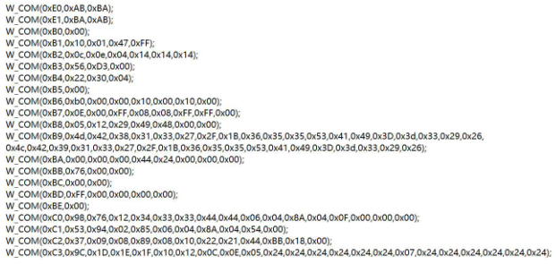

# 随记：


# 一、Android11 配置 485
> [!PDF|important] [[【北京迅为】itop-rk3568开发板官方android11移植教程.pdf#page=184&selection=20,0,24,3&color=important|【北京迅为】itop-rk3568开发板官方android11移植教程, p.184]]
> > Android11 配置 485
> 
> 
## 1、硬件原理分析
> [!PDF|red] [[底板硬件引脚原理图_rk3568_v1_7.pdf#page=17&selection=40,0,44,5&color=red|底板硬件引脚原理图_rk3568_v1_7, p.17]]
> > UART7_M1 To RS485
> 
> 

[[RK3568（linux学习）/rk3568芯片开发/Android系统开发（未）/assets/底板外设适配篇②/file-20250810171714610.png|Open: Pasted image 20250730234415.png]]


- 2 GPIO 
### 信号转换​
> - ​**​发送端​**​：将微控制器（MCU）的​**​单端信号（DI引脚）​**​ → 转换为 ​**​差分信号（A/B引脚）​**​
> - ​**​接收端​**​：将总线 ​**​差分信号（A/B引脚）​**​ → 转换为 ​**​单端信号（RO引脚）​**​  


### RS485_DIR_GPIO0_C6引脚的使用
- 1 DIR=0 接收
- 1 DIR=1 发送


### 只是控制 GPIO 比较简单，使用一个杂项设备即可


## 2、编写驱动

### 关联上一级的Makefile
- 1 kernel/drivers/misc/Makefile
> obj-y				+= eeprom/
obj-y				+= cb710/
`obj-y				+= 485_ctrl/

### 创建驱动文件
> topeet@ubuntu:~/rk3568/rk_android11.0_sdk_211130/kernel/drivers/misc$ `mkdir 485_ctrl
topeet@ubuntu:~/rk3568/rk_android11.0_sdk_211130/kernel/drivers/misc$ cd 485_ctrl/
topeet@ubuntu:~/rk3568/rk_android11.0_sdk_211130/kernel/drivers/misc/485_ctrl$ ls
topeet@ubuntu:~/rk3568/rk_android11.0_sdk_211130/kernel/drivers/misc/485_ctrl$ `touch rs485_ctl.c
topeet@ubuntu:~/rk3568/rk_android11.0_sdk_211130/kernel/drivers/misc/485_ctrl$ `touch Makefile


### 实践 - 编写驱动
[[RK3568（linux学习）/rk3568芯片开发/linux驱动入门/实践总结扩展/杂项设备#一、rs485_ctl.c杂项设备驱动]]


## 3、设备树配置
### kernel/arch/arm64/boot/dts/rockchip/itop_rk3568-evb1-ddr4-v10.dts

```bash
    /{
        rk_485_ctl: rk-485-crl{
            compatible="topeet,rs485_ctl";
            ctrl-gpios=<&gpio0 RK_PC6 GPIO_ACTIVE_HIGH>;
            pinctrl-names="default";
            pinctrl-0=<&rk_485_gpio>;
            
        };
    

};

&pinctrl{
    rk_485{
        rk_485_gpio: rk-485-gpio{
            rockchip,pins=<0 RK_PC6 RK_FUNC_GPIO &pcfg_pull_none>;

        };
    };
};

&uart7{
    status="okay";
    pinctrl-names = "default";
    pinctrl-0=<&uart7m1_xfer>;

};
```


## 4、烧写验证
### 


### 


### 


## 5、编写安卓应用程序 APP（还不会）
### 


### 


### 


# 二、Android 11 GPIO 常用调试方法
> [!PDF|important] [[【北京迅为】itop-rk3568开发板官方android11移植教程.pdf#page=193&selection=14,0,26,6&color=important|【北京迅为】itop-rk3568开发板官方android11移植教程, p.193]]
> > 第 17 章 Android 11 GPIO 常用调试方法
> 
> 

## 1、GPIO 简介
### 
- 1 所有的 GPIO 在上电后的初始状态都是输入模式

### 


### 


## 2、

### 


### 


### 


## 3、
### 


### 


### 


## 4、
### 


### 


### 


## 5、使用 io 命令查引脚复用
> [!PDF|red] [[【北京迅为】itop-rk3568开发板官方android11移植教程.pdf#page=197&selection=75,0,81,7&color=red|【北京迅为】itop-rk3568开发板官方android11移植教程, p.197]]
> > 17.2.5 使用 io 命令查引脚复用
> 
> 
### 


### 


### 


# 三、 Android11 中 LED 使用
> [!PDF|important] [[【北京迅为】itop-rk3568开发板官方android11移植教程.pdf#page=202&selection=14,0,26,2&color=important|【北京迅为】itop-rk3568开发板官方android11移植教程, p.202]]
> > 第 18 章 Android11 中 LED 使用
> 
> 

## 1、
### 


### 


### 


## 2、

### 


### 


### 


## 3、
### 


### 


### 


## 4、
### 


### 


### 


## 5、
### 


### 


### 


# 四、 rk3568 支持屏幕接口
> [!PDF|important] [[【北京迅为】itop-rk3568开发板官方android11移植教程.pdf#page=212&selection=14,0,22,6&color=important|【北京迅为】itop-rk3568开发板官方android11移植教程, p.212]]
> > 第 19 章 rk3568 支持屏幕接口
> 
> 

> [!PDF|important] [[数据手册(中文)_rk3568_V1.0-20201210.pdf#page=15&selection=369,0,375,4&color=important|数据手册(中文)_rk3568_V1.0-20201210, p.15]]
> > 一.二.十二显示界面
> 
> 
## 1、MIPI DSI TX 接口 
◼ 兼容 MIPI 联盟接口规范 v1.2 
◼ 支持 2 通道 DSI 
◼ 每个通道支持 4 个数据通道
◼ 支持每通道 2.5Gbps 的最大数据速率 
◼ 单 MIPI 模式高达 1920x1080@60Hz 个显示输出，双 MIPI 模式高达 2560* 1440@60Hz 个 
◼ 支持 RGB（最高 8bit）格式


## 2、

### 


### 


### 


## 3、
### 


### 


### 


## 4、
### 


### 


### 


## 5、
### 


### 


### 


# 五、RK 通用 Android 平台显示方案
> [!PDF|important] [[【北京迅为】itop-rk3568开发板官方android11移植教程.pdf#page=215&selection=14,0,26,6&color=important|【北京迅为】itop-rk3568开发板官方android11移植教程, p.215]]
> > 第 20 章 RK 通用 Android 平台显示方案
> 
> 

## 1、硬件模块 VOP
### rk3568 采用的是 vop2 模块。


### rk3568 有三个 3 个 Video ports
- 1 三个 video port 共享六个图层，rk3568 分为三类图层，一类是 Cluster0/1（视频层），一类是 ESMART0/1（图形层），一类是 SMART0/1（鼠标层）。每一类图层各有俩个

- 1 视频层和图形层支持多通道操作，每个图层可以灵活绑定到显示输出设备上，默认的绑定关系如下表：
[[RK3568（linux学习）/rk3568芯片开发/Android系统开发（未）/assets/底板外设适配篇②/file-20250810171715508.png|Open: Pasted image 20250801165911.png]]


### 图层性能如下图所示
[[RK3568（linux学习）/rk3568芯片开发/Android系统开发（未）/assets/底板外设适配篇②/file-20250810171715724.png|Open: Pasted image 20250801165927.png]]


## 2、DRM 显示框架（管理显示输出）

### DRM 显示框架如下所示：（把用户的绘图输出到显示屏上）
[[RK3568（linux学习）/rk3568芯片开发/Android系统开发（未）/assets/底板外设适配篇②/file-20250810171715817.png|Open: Pasted image 20250801171409.png]]


### 关键概念理解
> **DRM framebuffer** 是一块内存区域，我们可以把它理解为一块<span style="background:#d3f8b6">画布</span>，驱动和应用层都可以访问它。画画之前需要将它格式化，我们需要设定你要画油画还是国画 （色彩模式，比如 RGB24 YUV 等等），画布需要多大(分辨率)

> **CRTC** 直译是阴极摄像管上下文，它的作用是读取当前扫描缓冲区的像素数据并借助于 PLL 电路从其生成视频模式定时信号。简单来说，它就是显示输出的上下文，可以理解为扫描仪，它对内连接 Framebuffer 地址，对外连接 Encoder。它会<span style="background:#d3f8b6">扫描你的画布(Framebuffer)上的内容，然后叠加上 planes 的内容，传给 Encoder</span>。是<span style="background:#affad1">显示控制器</span>，CRTC 在 rockchip 平台是 SOC 内部 Video Port(VP)模块的抽象。

> **Planes** 直译为平面，它和 framebuffer 一样是内存地址。它的作用是什么呢？想象这样一个场景，作者正在很不专心的一边看动作大片一边写文章。动作大片每一帧的变化都很大，需要全幅更新，而写文章半天挤不出一个字，基本上不需要更新。作者将显卡的使用拉上了俩个极端，一种是全幅高速更新的 Video Mode ,一种是文字交互这种小范围的 Graphics Mode。此时就轮到 Planes 出马了，它<span style="background:#d3f8b6">给 Video 刷新提供了高速通道</span>。<span style="background:#d3f8b6">使 Video 单独为一个图层，可以叠加在 Graphic 图层上或者下， 并且具有缩放等功能。</span>Plane 是图层在 Rockchip 平台是 SOC 内部 VOP 模块 win 图层的抽象

> **Encoder** 直译为编码器，它的作用就是<span style="background:#d3f8b6">将内存的 pixel 像素编码(转换)为显示器所需要的信号</span>。你可以把它想象为现在要将你的画在全世界不同的显示设备(Display Device)上显示，自然需要将其转化为不同的电信号，比如 DVID VGA MIPI EDP 等。所以我们需要这样一个 Encoder 来进行<span style="background:#affad1">信号转换</span>的工作。它和 CRTC 之间的交互就是我们所说的 ModeSetting，其中包含了前面提供的色彩模式，还有时序(Timing) 等。如果我们需要转换屏幕信号，需要在 Encoder 后面加 Bridge（桥接设备），一般是用于注册 Encoder 后面另外再接的转换芯片。

> **Connector** 直译为连接器，Connector 常常<span style="background:#d3f8b6">对应于物理连接器（VGA，DVI， FPD-Link，HDMI....）</span>
> 它会连接将一个物理显示输出设备与当前物理连接的输出设备相关的信息也存储在 Connector 内。


### 简化框图
[[RK3568（linux学习）/rk3568芯片开发/Android系统开发（未）/assets/底板外设适配篇②/file-20250810171715938.png|Open: Pasted image 20250801172604.png]]

- 1 Rockchip 平台的 LCD Controller 叫做 VOP(视频输出处理器)


### VOP 输出接口与 VOdev 的连接关系
[[RK3568（linux学习）/rk3568芯片开发/Android系统开发（未）/assets/底板外设适配篇②/file-20250810171716037.png|Open: Pasted image 20250801173003.png]]

[[RK3568（linux学习）/rk3568芯片开发/Android系统开发（未）/assets/底板外设适配篇②/file-20250810171716149.png|Open: Pasted image 20250801173033.png]]


## 3、DRM 驱动和 libdrm 交互过程
### libdrm 库
>  libdrm 库提供了一系列友好的控制封装，使得用户可以<span style="background:#d3f8b6">方便的进行显示的控制和 buffer 申请</span>。

> DRM 的<span style="background:#d3f8b6">设备节点为“/dev/dri/cardX”</span>,X 为 0-15 的数值，默认使用的是/dev/dri/card0


### DRM 驱动和 libdrm 库交互的过程
[[RK3568（linux学习）/rk3568芯片开发/Android系统开发（未）/assets/底板外设适配篇②/file-20250810171716269.png|Open: Pasted image 20250802133309.png]]


### GEM（管理内核中的图形缓存区）
> [!PDF|note] [[【北京迅为】itop-rk3568开发板官方android11移植教程.pdf#page=221&selection=98,0,99,0&color=note|【北京迅为】itop-rk3568开发板官方android11移植教程, p.221]]
> > GEM
> 
> 


### KMS（mode-setting ）
> [!PDF|note] [[【北京迅为】itop-rk3568开发板官方android11移植教程.pdf#page=222&selection=298,0,299,1&color=note|【北京迅为】itop-rk3568开发板官方android11移植教程, p.222]]
> > KMS：
> 
> 


## 4、DRM 驱动路径
### uboot 驱动目录及驱动文件分析
> [!PDF|note] [[【北京迅为】itop-rk3568开发板官方android11移植教程.pdf#page=223&selection=66,0,68,2&color=note|【北京迅为】itop-rk3568开发板官方android11移植教程, p.223]]
> > 驱动文件
> 
> 

> topeet@ubuntu:~/rk3568/rk_android11.0_sdk_211130/`u-boot/drivers/video/drm`$ `ls
analogix_dp.c       built-in.o        dw_mipi_dsi.c            inno_video_phy.c   rockchip_bridge.h     rockchip_display.su       rockchip_panel.c   rockchip_vop2.c
analogix_dp.h       drm_dp_helper.c   dw_mipi_dsi.o            Kconfig            rockchip_bridge.o     rockchip_drm_tve.c        rockchip_panel.h   rockchip_vop2.o
analogix_dp.o       drm_dp_helper.o   dw_mipi_dsi.su           Makefile           rockchip_bridge.su    rockchip_drm_tve.h        rockchip_panel.o   rockchip_vop2.su
analogix_dp_reg.c   drm_dp_helper.su  inno_hdmi.c              rk1000.c           rockchip_connector.h  rockchip_dw_hdmi.c        rockchip_panel.su  rockchip_vop.c
analogix_dp_reg.o   drm_mipi_dsi.c    inno_hdmi.h              rk1000.h           rockchip_crtc.c       rockchip_dw_hdmi.h        rockchip_phy.c     rockchip_vop.h
analogix_dp_reg.su  drm_mipi_dsi.o    inno_mipi_phy.c          rk1000_tve.c       rockchip_crtc.h       rockchip_dw_hdmi.o        rockchip_phy.h     rockchip_vop.o
analogix_dp.su      drm_mipi_dsi.su   inno_mipi_phy.o          rk618.c            rockchip_crtc.o       rockchip_dw_hdmi.su       rockchip_phy.o     rockchip_vop_reg.c
bmp_helper.c        dw_hdmi.c         inno_mipi_phy.su         rk618_dsi.c        rockchip_crtc.su      rockchip-inno-hdmi-phy.c  rockchip_phy.su    rockchip_vop_reg.h
bmp_helper.h        dw_hdmi.h         inno_video_combo_phy.c   rk618.h            rockchip_display.c    rockchip_lvds.c           rockchip_rgb.c     rockchip_vop_reg.o
bmp_helper.o        dw_hdmi.o         inno_video_combo_phy.o   rk618_lvds.c       rockchip_display.h    rockchip_lvds.o           rockchip_rgb.o     rockchip_vop_reg.su
bmp_helper.su       dw_hdmi.su        inno_video_combo_phy.su  rockchip_bridge.c  rockchip_display.o    rockchip_lvds.su          rockchip_rgb.su    rockchip_vop.su

### 内核驱动目录及驱动文件分析
> [!PDF|note] [[【北京迅为】itop-rk3568开发板官方android11移植教程.pdf#page=224&selection=16,0,20,4&color=note|【北京迅为】itop-rk3568开发板官方android11移植教程, p.224]]
> > 驱动   文件     参考文档
> 
> 

> topeet@ubuntu:~/rk3568/rk_android11.0_sdk_211130/`kernel/drivers/gpu/drm/rockchip`$ `ls`
analogix_dp-rockchip.c  dw_hdmi-rockchip.c  modules.order             rockchip_drm_fbdev.c  rockchip_drm_tve.c   rockchip-mipi-csi-tx.c
analogix_dp-rockchip.o  dw_hdmi-rockchip.o  rk3066_hdmi.c             rockchip_drm_fbdev.h  rockchip_drm_tve.h   rockchip-mipi-csi-tx.h
built-in.a              dw-mipi-dsi.c       rk3066_hdmi.h             rockchip_drm_fbdev.o  rockchip_drm_tve.o   rockchip_rgb.c
cdn-dp-core.c           dw-mipi-dsi.o       rk618                     rockchip_drm_fb.h     rockchip_drm_vop2.c  rockchip_rgb.o
cdn-dp-core.h           ebc-dev             rk628                     rockchip_drm_fb.o     rockchip_drm_vop2.o  rockchip_vop2_reg.c
cdn-dp-core.o           inno_hdmi.c         rockchip_drm_backlight.c  rockchip_drm_gem.c    rockchip_drm_vop.c   rockchip_vop2_reg.o
cdn-dp-link-training.c  inno_hdmi.h         rockchip_drm_backlight.h  rockchip_drm_gem.h    rockchip_drm_vop.h   rockchip_vop_reg.c
cdn-dp-link-training.o  inno_hdmi.o         rockchip_drm_drv.c        rockchip_drm_gem.o    rockchip_drm_vop.o   rockchip_vop_reg.h
cdn-dp-reg.c            Kconfig             rockchip_drm_drv.h        rockchip_drm_psr.c    rockchip_drm_vvop.c  rockchip_vop_reg.o
cdn-dp-reg.h            Makefile            rockchip_drm_drv.o        rockchip_drm_psr.h    rockchip_lvds.c
cdn-dp-reg.o            modules.builtin     rockchip_drm_fb.c         rockchip_drm_psr.o    rockchip_lvds.o


### 


## 5、
### 


### 


### 


# 六、 Android11 适配 MIPI 屏幕
> [!PDF|important] [[【北京迅为】itop-rk3568开发板官方android11移植教程.pdf#page=226&selection=14,0,26,2&color=important|【北京迅为】itop-rk3568开发板官方android11移植教程, p.226]]
> > 第 21 章 Android11 适配 MIPI 屏幕
> 
> 

> 如果是其他的 MIPI 屏幕想要适配，首先要看的是屏幕的线序是否和接口一致，如果一致，理论上是可以点亮屏幕的，如果不一致，则不支持这款屏幕。
## 1、硬件原理图分析
### MIPI 接口原理图,用的是 dsi1
[[RK3568（linux学习）/rk3568芯片开发/Android系统开发（未）/assets/底板外设适配篇②/file-20250810171716625.png|Open: Pasted image 20250802155849.png]]


### 


### 


## 2、屏幕点亮流程

### 点亮屏幕基本的流程是一致
- 1 背光使能---->背光点亮---->屏幕使能 ---->reset 引脚按照指定的时序/波形拉高或者拉低---->初始化序列命令发送。

### 流程主要是以下几步
>  需要向屏幕厂商要一些<span style="background:#affad1">屏幕关键参数和资料 </span>
>  进行<span style="background:#d3f8b6">关键引脚对应 </span>
>  进行<span style="background:#d3f8b6">设备树</span>配置 
>  进行<span style="background:#d3f8b6">驱动</span>配置 
>  源码编译，烧写镜像测试

### 关键引脚对应
- 1 MIPI_DSI_TX1      mipi信号线引脚
> MIPI_DSI_TX1_D0P 
> MIPI_DSI_TX1_D0N 
> 
> MIPI_DSI_TX1_D1P
> MIPI_DSI_TX1_D1N
> 
> MIPI_DSI_TX1_D2P 
> MIPI_DSI_TX1_D2N 
> 
> MIPI_DSI_TX1_CLKP
> MIPI_DSI_TX1_CLKN
> 
> MIPI_DSI_TX1_D3P 
> MIPI_DSI_TX1_D3N

- 1 背光
> LCD1_BL_PWM5    --->   GPIO0_C4_d

- 1 使能、复位
> LCD_EN_H_GPIO3_C6     --->   GPIO3_C6 
> LCD_RST_L_GPIO3_C7    --->    GPIO3_C7


###  屏幕关键参数
#### 关键参数主要包括
- 1 初始化序列 reset 波形，时序参数等等
> <span style="background:#d3f8b6">在屏幕厂商给的数据手册中可以找到</span>。但是文档大多数是引文并且含有较多专业词汇，<span style="background:#affad1">这部分内容厂商应该提供了具体的参数</span>，使用厂商提供的可以减少时间花费， 也更准确。

#### 在厂家给出的 datasheet 中扣除关键信息
> [!PDF|yellow] [[【北京迅为】itop-rk3568开发板官方android11移植教程.pdf#page=231&selection=55,0,59,8&color=yellow|【北京迅为】itop-rk3568开发板官方android11移植教程, p.231]]
> > 接下来介绍如何在厂家给出的 datasheet 中扣除关键信息。
> 
> 
##### 我们最需要关注的是
[[RK3568（linux学习）/rk3568芯片开发/Android系统开发（未）/assets/底板外设适配篇②/file-20250810171716797.png|Open: Pasted image 20250802165743.png]]

##### 要提炼出来关键信息
- 1 General Specification 如下图所示：
[[RK3568（linux学习）/rk3568芯片开发/Android系统开发（未）/assets/底板外设适配篇②/file-20250810171716939.png|Open: Pasted image 20250802165802.png]]

> Hactive = 800 ，水平分辨率 
> Vactive = 1280 ，垂直分辨率
> Lanes = 4 ，Mipi data 信号线通道数


- 1 4 Power on/off sequence
- 1 5 Singnal Timing Spec
[[RK3568（linux学习）/rk3568芯片开发/Android系统开发（未）/assets/底板外设适配篇②/file-20250810171717017.png|Open: Pasted image 20250802170031.png]]

- 2 由上表中将关键信息提炼出来：
> Hactive = 800 
> HFP = 48 
> HBP = 48 
> Hsync =20
> Vactive = 1280 
> VFP = 16 
> VBP = 15 
> VSync = 6 
> Pixel Clock Frequency（Pclk）= 68MHZ


### 详细说一下各个参数的含义
[[RK3568（linux学习）/rk3568芯片开发/Android系统开发（未）/assets/底板外设适配篇②/file-20250810171717132.png|Open: Pasted image 20250802170300.png]]


> **Horizontal** 代表水平方向，**HBP** 是行同步信号后肩，**HFP** 是行同步信号前肩， 单位是 clocks，什么是 clock? 也就是 Pixel Clock Frequency（Pclk）是像素时钟频率。
> **Vertical** 代表垂直方向，**VBP** 是帧同步信号后肩，**VFP** 是帧同步信号前肩， 单位是 lines。

> 另外根据以上的信息，我们还能计算出 Mipi Dsi Clock 。
><span style="background:#b1ffff"> DCLK = 100 + H_total × V_total × fps × 3 × 8 / lanes_nums </span>
> 
> total 这里指的是 sync + front + back + active
> 比如 **H_total** = Hsync + HFP(hfront-proch) + HBP(hback-porch) + Hactive
> 
> **fps** 指的是帧率，一般我们按照 60 帧来计算
> **3 × 8** 代表一个 RGB 为 3 个字节，每个字节 8 bit
>  **lanes** 代表 mipi data 通道

- 1 所以对于我这个屏
> **DCLK** 
> = 100Mbps + H_Total × V_Total x fps x 3 x 8 / lanes_nums 
> = 100 + ( 800 + 20 + 48 + 48 ) x ( 1280 + 16 + 15 + 60 ) x 60 帧 x 3 字节 x 8 bit / 4 lanes 
> = 100Mbps + 434Mbps 
> = `534 Mbps`
> 


### 屏幕初始化序列改写
- 1 屏幕在点亮后会涉及初始化序列发送，这部分序列屏幕厂家会提供
[[RK3568（linux学习）/rk3568芯片开发/Android系统开发（未）/assets/底板外设适配篇②/file-20250810171717224.png|Open: Pasted image 20250802170837.png]]

- 2 我们需要把厂家给我的初始化命令转化成对应的 DCS 格式,为接下来设备树里面添加初始化序列做准备。


#### Android 提供了配置初始化代码的接口，相应的设备树里面也支持了
- 1 kernel/Documentation/devicetree/bindings/display/panel/simple-panel.txt
> - panel-init-sequence:
> - panel-exit-sequence:
>   A byte stream formed by simple multiple dcs packets.
> 	byte 0: dcs data type
> 	byte 1: wait number of specified ms after dcs command transmitted
> 	byte 2: packet payload length
> 	byte 3 and beyond: number byte of payload
> 
> - power-invert: power invert control
> - rockchip,cmd-type: default is DSI cmd, or "spi", "mcu" cmd type
> - spi-sdi: spi init panel for spi-sdi io
> - spi-scl: spi init panel for spi-scl io
> - spi-cs: spi init pael for spi-cs io
- 2 翻译过来意思是
> 初始化序列
> 退出序列
> 由简单的多个 dcs 数据包形成的字节流
> 第 0 个字节：**dcs 数据类型**
> 第 1 个字节：发送 dcs 命令后**等待指定的毫秒数**
> 第 2 个字节：**数据包有效载荷长度**
> 第 3 个字节以及以后：有**效载荷的字节数**
> 

#### 设备树里面初始化序列实例分析
- 1 39 00 03 E0 AB BA
> 39 代表 dcs 数据类型，00 代表发送 dcs 命令后等待指定的毫秒数 
> 03 代表数据包有效载荷长度， E0 AB BA 代表有效载荷的字节数
[[RK3568（linux学习）/rk3568芯片开发/Android系统开发（未）/assets/底板外设适配篇②/file-20250810171717340.png|Open: Pasted image 20250802172057.png]]


#### dcs 数据类型
[[RK3568（linux学习）/rk3568芯片开发/Android系统开发（未）/assets/底板外设适配篇②/file-20250810171717436.png|Open: Pasted image 20250802172137.png]]


> 如果只有**一个数据**，dcs 数据类型是 `0x05 `
> 如果有**俩个数据**，dcs 数据类型是 `0x15 `
> 如果**多于俩个数据**，对应的命令类型是 `0x39`
> 

### 据厂家给的资料，我们整理出初始化序列
```
panel-init-sequence = [
    39 00 03 E0 AB BA
    39 00 03 E1 BA AB
    15 00 02 B0 00
    39 00 05 B1 10 01 47 FF
    39 00 07 B2 0C 0E 04 14 14 14
    39 00 04 B3 56 D3 00
    39 00 04 B4 22 30 04
    15 00 02 B5 00
    39 00 08 B6 B0 00 00 10 00 10 00
    39 00 09 B7 0E 00 FF 08 08 FF FF 00
    39 00 08 B8 05 12 29 49 48 00 00
    39 00 27 B9 4D 42 38 31 33 27 2F 1B 36 35 35 53 41 49 3D 3D 33 29 26 4C 42 39 31 33 27 2F 1B 36 35 35 53 41 49 3D 3D 33 29 26
    39 00 09 BA 00 00 00 44 24 00 00 00
    39 00 04 BB 76 00 00
    39 00 03 BC 00 00
    39 00 06 BD FF 00 00 00 00
    15 00 02 BE 00
    39 00 11 C0 98 76 12 34 33 33 44 44 06 04 8A 04 0F 00 00 00
    39 00 0B C1 53 94 02 85 06 04 8A 04 54 00
    39 00 0D C2 37 09 08 89 08 10 22 21 44 BB 18 00
    39 00 17 C3 9C 1D 1E 1F 10 12 0C 0E 05 24 24 24 24 24 24 07 24 24 24 24 24 24
    39 00 17 C4 1C 1D 1E 1F 11 13 0D 0F 04 24 24 24 24 24 24 06 24 24 24 24 24 24
    39 00 04 C5 E8 85 76
    39 00 03 C6 20 20
    39 00 17 C7 41 01 0D 11 09 15 19 4F 10 D7 CF 19 1B 1D 03 02 25 30 00 03 FF 00  
    39 00 07 C8 61 00 31 42 54 16
    39 00 06 C9 A1 22 FF CD 23  
    39 00 03 CA 4B 43
    39 00 05 CC 2E 02 04 08
    39 00 09 CD 0E 64 64 20 1E 6B 06 83
    39 00 04 D0 27 10 80
    39 00 05 D1 00 0D FF 0F
    39 00 05 D2 E3 2B 38 00
    39 00 0C D4 00 01 00 0E 04 44 08 10 00 07 00
    15 00 02 D5 00
    39 00 03 D6 00 00
    39 00 05 D7 00 00 00 00
    39 00 04 E4 08 55 03
    39 00 09 E6 00 01 FF FF FF FF FF FF
    39 00 04 E7 00 00 00
    39 00 08 E8 D5 FF FF FF 00 00 00
    15 00 02 E9 FF
    39 00 06 F0 12 03 20 00 FF
    39 00 1B F1 A6 C8 EA E6 E4 CC E4 BE F0 B2 AA C7 FF 66 98 E3 87 C8 99 C8 8C BE 96 91 8F FF
    15 00 02 F3 03
    39 00 1B F4 FF FE FC FA F8 F4 F0 E8 E0 D0 C0 A0 80 7F 5F 3F 2F 1F 17 0F 0B 07 05 03 01 00
    39 00 1B F5 FF FE FC FA F8 F4 F0 E8 E0 D0 C0 A0 80 7F 5F 3F 2F 1F 17 0F 0B 07 05 03 01 00
    39 00 1B F6 FF FE FC FA F8 F4 F0 E8 E0 D0 C0 A0 80 7F 5F 3F 2F 1F 17 0F 0B 07 05 03 01 00
    39 00 08 F7 00 00 00 00 00 00 00
    39 00 08 F8 00 00 00 00 00 00 00
    39 00 08 F9 00 00 00 00 00 00 00
    39 00 1A FA 00 84 12 21 48 48 21 12 84 69 69 5A A5 96 96 A5 5A B7 DE ED 7B 7B ED DE B7
    39 00 18 FB 00 12 0F FF FF FF 00 38 40 08 70 0B 40 19 50 21 C0 27 60 2D 00 00 0F
    39 00 03 E3 20 21
    05 C8 01 11   
    05 14 01 29  
];
```

- 1 根据厂家给的资料，我们整理出退出序列，如下所示：
```
panel-exit-sequence = [ 
	05 05 01 28 
	05 78 01 10 
];
```


## 3、根据屏参和硬件设计填写 dts

### 新建一个 dtsi 文件（特意放屏幕相关的）
> topeet@ubuntu:~/rk3568/rk_android11.0_sdk_211130$ `touch kernel/arch/arm64/boot/dts/rockchip/itop_rk3568_lcds.dtsi
> 
- 1 kernel/arch/arm64/boot/dts/rockchip/itop_rk3568-evb1-ddr4-v10.dts
```
#include "itop_rk3568_lcds.dtsi"
```


>  DTS 文件设计到层层包含（<span style="background:#d3f8b6">DTS 文件可以包含后缀为.dtsi 的文件</span>，作用就像 C 语言中的.h 文件）
>  建议<span style="background:#affad1">重要配置及板卡特性配置写到最后一级的 DTS 文件中</span>，防止由于在较高层级的 dtsi 配置后手误在后面又进行了配置，导致配置被错误覆盖。
>  共需要以下几个重点内容：`dsi, route_dsi, backlight, vcc_lcd, dsi_in_vopb, dsi_in_vopl,vopb。`

### dsi 节点
#### 查找 dsi 节点
- 1 mipi 屏幕我们使用 dsi1 接口，所以需要在设备树里面查找 dsi 节点
>topeet@ubuntu:~/rk3568/rk_android11.0_sdk_211130/kernel/arch/arm64/boot/dts/rockchip$ `grep "dsi1" -rw
> rk3566-evb5-lp4x-v10.dtsi:&dsi1 {
rk3566-evb5-lp4x-v10.dtsi: * when mipi panel is connected to dsi1.
`rk3568.dtsi:		dsi1 = &dsi1;
rk3568.dtsi:			route_dsi1: route-dsi1 {
`rk3568.dtsi:	dsi1: dsi@fe070000 {

- 1 kernel/arch/arm64/boot/dts/rockchip/rk3568.dtsi （瑞芯微写好的）
```
/ {
	compatible = "rockchip,rk3568";

	interrupt-parent = <&gic>;
	#address-cells = <2>;
	#size-cells = <2>;

	aliases {
		csi2dphy0 = &csi2_dphy0;
		csi2dphy1 = &csi2_dphy1;
		csi2dphy2 = &csi2_dphy2;
		dsi0 = &dsi0;
		dsi1 = &dsi1;
```

- 1 kernel/arch/arm64/boot/dts/rockchip/rk3568.dtsi （瑞芯微写好的）
```
	dsi1: dsi@fe070000 {
		compatible = "rockchip,rk3568-mipi-dsi";
		reg = <0x0 0xfe070000 0x0 0x10000>;
		interrupts = <GIC_SPI 69 IRQ_TYPE_LEVEL_HIGH>;
		clocks = <&cru PCLK_DSITX_1>, <&cru HCLK_VO>, <&video_phy1>;
		clock-names = "pclk", "hclk", "hs_clk";
		resets = <&cru SRST_P_DSITX_1>;
		reset-names = "apb";
		phys = <&video_phy1>;
		phy-names = "mipi_dphy";
		power-domains = <&power RK3568_PD_VO>;
		rockchip,grf = <&grf>;
		#address-cells = <1>;
		#size-cells = <0>;
		status = "disabled";

		ports {
			#address-cells = <1>;
			#size-cells = <0>;

			dsi1_in: port@0 {
				reg = <0>;
				#address-cells = <1>;
				#size-cells = <0>;

				dsi1_in_vp0: endpoint@0 {
					reg = <0>;
					remote-endpoint = <&vp0_out_dsi1>;
					status = "disabled";
				};

				dsi1_in_vp1: endpoint@1 {
					reg = <1>;
					remote-endpoint = <&vp1_out_dsi1>;
					status = "disabled";
				};
			};
		};
	};
```


#### 注释掉瑞芯微之前适配的屏幕节点
> 默认的源码中是配置了 dsi1 节点的，是适配的瑞芯微的屏幕。现在我们要适配迅为的 MIPI 7 寸屏，所以我们在修改之前，要<span style="background:#affad1">删掉瑞芯微之前适配的屏幕节点。</span>

- 1 在下图的设备树中找到&dsi1 以及和 dsi1 相关的注释掉。
[[RK3568（linux学习）/rk3568芯片开发/Android系统开发（未）/assets/底板外设适配篇②/file-20250810171717560.png|Open: Pasted image 20250802204915.png]]

- 2 用查找命令，有rk3568、evb1、ddr4、v10、rk3568-android.dtsi和dsi1的注释掉相关内容

- 1 rk3568.dtsi 设备树中的所有内容不用更改。

#### 在 itop_rk3568_lcds.dtsi 中配置迅为的屏幕（dsi1节点）

> &dsi1 {
>     status = "okay";
>     
>     dsi1_panel: panel@0 {
>         status = "okay";
>         compatible = "simple-panel-dsi";
>         reg = <0>;
>         `//供电电压是 3.3V
>         power-supply = <&vcc3v3_lcd1_n>;
>         `/* 背光控制 * /
>         backlight = <&backlight>;
>         <span style="background:#b1ffff">//reset-gpios 表示屏幕 reset 引脚，拉低，具体的拉高或者拉低要根据内核配置和时序要求来进行对应的修改</span>
>         reset-gpios = <&gpio3 RK_PC7 GPIO_ACTIVE_LOW>;
>         // enable-gpios = <&gpio3 RK_PC6 GPIO_ACTIVE_HIGH>;  // 可选配置
> 
>         /* 时序延迟配置（单位：ms） * /
>         `//下述配置中有一些延时，reset-delay-ms 是在屏幕初始化过程中，第一次操作 reset 引脚之前的延时。init-delay-ms，是在屏幕初始化过程中， 第一次操作 reset 引脚之后的延时。
>         reset-delay-ms = <60>;
>         enable-delay-ms = <60>;//<35>; //<60>;
>         prepare-delay-ms = <60>;//<6>; //<60>;
>         unprepare-delay-ms = <60>;//<0>; //<60>;
>         disable-delay-ms = <60>;//<20>; //<60>;
> 
>         /* DSI协议参数 * /
>         dsi,flags = <(MIPI_DSI_MODE_VIDEO | MIPI_DSI_MODE_VIDEO_BURST 
>                      | MIPI_DSI_MODE_LPM | MIPI_DSI_MODE_EOT_PACKET)>;
>         dsi,format = <MIPI_DSI_FMT_RGB888>;
>         <span style="background:#b1ffff">//dsi,lanes = 4;是配置当前 mipi 是几通道的，需根据屏幕实际情况配置</span>。
>         dsi,lanes = <4>;  // MIPI通道数
> 
>         // <span style="background:#b1ffff">panel-init-sequence 填写刚刚改写好的初始化序列</span>
>         panel-init-sequence = [
>             39 00 03 E0 AB BA
>             39 00 03 E1 BA AB
>             ..............
>             05 C8 01 11   // 退出睡眠模式，延时200ms
>             05 14 01 29   // 开启显示，延时20ms
>         ];
>         
>         /* 关闭序列 * /
>         //<span style="background:#b1ffff">panel-exit-sequence 填写 display off 序列，一般为两条，也需要厂家提供。</span>
>         panel-exit-sequence = [
>             05 05 01 28   // 关闭显示，延时5ms
>             05 78 01 10   // 进入睡眠模式，延时120ms
>         ];
> 
>         /* 屏幕时序参数 * / 
>         //<span style="background:#b1ffff">这一部分也很重要，是屏幕的一些参数。hactive 和 vactive 就是水平数值的像素， 也就是屏幕分辨率了。 hback-porch,hfront-porch,vback-porch,vfront-porch 按顺序简写为 HBP,HFP,VBP,VFP,这个跟厂家讨要后，根据简写字母对应即可。这个在之前的章节中已经讲解过了。</span>
>         disp_timings1: display-timings {
>             native-mode = <&dsi1_timing0>;
>             dsi1_timing0: timing0 {
>             <span style="background:#b1ffff">//像素时钟频率 = （hactive+hbp+hfp+hsync-len）x (vactive+vbp+vfp+vsync-len)xfps </span>
>             // <span style="background:#b1ffff">然后保留两位有效数字（不要四舍五入），后面数据直接填 0 即可。</span>
>                 clock-frequency = <72000000>;  // 像素时钟频率（72MHz）
>                 hactive = <800>;               // 水平有效像素
>                 vactive = <1280>;              // 垂直有效像素
>                 hfront-porch = <48>;          // 水平前消隐
>                 hback-porch = <48>;            // 水平后消隐
>                 hsync-len = <20>;              // 水平同步脉宽
>                 vfront-porch = <16>;           // 垂直前消隐
>                 vback-porch = <15>;            // 垂直后消隐
>                 vsync-len = <6>;               // 垂直同步脉宽
>                 hsync-active = <0>;            // 水平同步极性（低有效）
>                 vsync-active = <0>;             // 垂直同步极性（低有效）
>                 de-active = <0>;               // 数据使能极性
>                 pixelclk-active = <0>;         // 像素时钟极性
>             };
>         };
> 
        // 端口连接（） 
        //配置 ports
		ports {
			#address-cells = <1>;
> 			#size-cells = <0>;
> 
> 			port@0 {
> 				reg = <0>;
> 				panel_in_dsi1: endpoint {
> 					remote-endpoint = <&dsi1_out_panel>;
> 				};
> 			};
> 		};
> 	};
>     //DSI控制器输出端口 
> 	ports {
> 		#address-cells = <1>;
> 		#size-cells = <0>;
> 
> 		port@1 {
> 			reg = <1>;
> 			dsi1_out_panel: endpoint {
> 				remote-endpoint = <&panel_in_dsi1>;
> 			};
> 		};
> 	};
> 
> };

```
&dsi1 {
    status = "okay";
    
    dsi1_panel: panel@0 {
        status = "okay";
        compatible = "simple-panel-dsi";
        reg = <0>;
        /* 供电配置：3.3V */
        power-supply = <&vcc3v3_lcd1_n>;
        /* 背光控制 */
        backlight = <&backlight>;
        /* Reset引脚配置（低电平有效） */
        reset-gpios = <&gpio3 RK_PC7 GPIO_ACTIVE_LOW>;
        // enable-gpios = <&gpio3 RK_PC6 GPIO_ACTIVE_HIGH>;  // 可选配置

        /* 时序延迟配置（单位：ms） */
        reset-delay-ms = <60>;
        enable-delay-ms = <60>;
        prepare-delay-ms = <60>;
        unprepare-delay-ms = <60>;
        disable-delay-ms = <60>;

        /* DSI协议参数 */
        dsi,flags = <(MIPI_DSI_MODE_VIDEO | MIPI_DSI_MODE_VIDEO_BURST 
                     | MIPI_DSI_MODE_LPM | MIPI_DSI_MODE_EOT_PACKET)>;
        dsi,format = <MIPI_DSI_FMT_RGB888>;
        dsi,lanes = <4>;  // MIPI通道数

        /* 初始化序列（） */
        panel-init-sequence = [
            39 00 03 E0 AB BA
            39 00 03 E1 BA AB
            15 00 02 B0 00
            39 00 05 B1 10 01 47 FF
            39 00 07 B2 0C 0E 04 14 14 14
            39 00 04 B3 56 D3 00
            39 00 04 B4 22 30 04
            15 00 02 B5 00
            39 00 08 B6 B0 00 00 10 00 10 00
            39 00 09 B7 0E 00 FF 08 08 FF FF 00
            39 00 08 B8 05 12 29 49 48 00 00
            39 00 27 B9 4D 42 38 31 33 27 2F 1B 36 35 35 53 41 49 3D 3D 33 29 26 4C 42 39 31 33 27 2F 1B 36 35 35 53 41 49 3D 3D 33 29 26
            39 00 09 BA 00 00 00 44 24 00 00 00
            39 00 04 BB 76 00 00
            39 00 03 BC 00 00
            39 00 06 BD FF 00 00 00 00
            15 00 02 BE 00
            39 00 11 C0 98 76 12 34 33 33 44 44 06 04 8A 04 0F 00 00 00
            39 00 0B C1 53 94 02 85 06 04 8A 04 54 00
            39 00 0D C2 37 09 08 89 08 10 22 21 44 BB 18 00
            39 00 17 C3 9C 1D 1E 1F 10 12 0C 0E 05 24 24 24 24 24 24 07 24 24 24 24 24 24
            39 00 17 C4 1C 1D 1E 1F 11 13 0D 0F 04 24 24 24 24 24 24 06 24 24 24 24 24 24
            39 00 04 C5 E8 85 76
            39 00 03 C6 20 20
            39 00 17 C7 41 01 0D 11 09 15 19 4F 10 D7 CF 19 1B 1D 03 02 25 30 00 03 FF 00  
            39 00 07 C8 61 00 31 42 54 16
            39 00 06 C9 A1 22 FF CD 23  
            39 00 03 CA 4B 43
            39 00 05 CC 2E 02 04 08
            39 00 09 CD 0E 64 64 20 1E 6B 06 83
            39 00 04 D0 27 10 80
            39 00 05 D1 00 0D FF 0F
            39 00 05 D2 E3 2B 38 00
            39 00 0C D4 00 01 00 0E 04 44 08 10 00 07 00
            15 00 02 D5 00
            39 00 03 D6 00 00
            39 00 05 D7 00 00 00 00
            39 00 04 E4 08 55 03
            39 00 09 E6 00 01 FF FF FF FF FF FF
            39 00 04 E7 00 00 00
            39 00 08 E8 D5 FF FF FF 00 00 00
            15 00 02 E9 FF
            39 00 06 F0 12 03 20 00 FF
            39 00 1B F1 A6 C8 EA E6 E4 CC E4 BE F0 B2 AA C7 FF 66 98 E3 87 C8 99 C8 8C BE 96 91 8F FF
            15 00 02 F3 03
            39 00 1B F4 FF FE FC FA F8 F4 F0 E8 E0 D0 C0 A0 80 7F 5F 3F 2F 1F 17 0F 0B 07 05 03 01 00
            39 00 1B F5 FF FE FC FA F8 F4 F0 E8 E0 D0 C0 A0 80 7F 5F 3F 2F 1F 17 0F 0B 07 05 03 01 00
            39 00 1B F6 FF FE FC FA F8 F4 F0 E8 E0 D0 C0 A0 80 7F 5F 3F 2F 1F 17 0F 0B 07 05 03 01 00
            39 00 08 F7 00 00 00 00 00 00 00
            39 00 08 F8 00 00 00 00 00 00 00
            39 00 08 F9 00 00 00 00 00 00 00
            39 00 1A FA 00 84 12 21 48 48 21 12 84 69 69 5A A5 96 96 A5 5A B7 DE ED 7B 7B ED DE B7
            39 00 18 FB 00 12 0F FF FF FF 00 38 40 08 70 0B 40 19 50 21 C0 27 60 2D 00 00 0F
            39 00 03 E3 20 21
            05 C8 01 11   
            05 14 01 29  
        ];
        
        /* 关闭序列 */
        panel-exit-sequence = [
            05 05 01 28   // 关闭显示，延时5ms
            05 78 01 10   // 进入睡眠模式，延时120ms
        ];

        /* 屏幕时序参数 */
        disp_timings1: display-timings {
            native-mode = <&dsi1_timing0>;
            dsi1_timing0: timing0 {
                clock-frequency = <72000000>;  // 像素时钟频率（72MHz）
                hactive = <800>;               // 水平有效像素
                vactive = <1280>;              // 垂直有效像素
                hfront-porch = <48>;          // 水平前消隐
                hback-porch = <48>;            // 水平后消隐
                hsync-len = <20>;              // 水平同步脉宽
                vfront-porch = <16>;           // 垂直前消隐
                vback-porch = <15>;            // 垂直后消隐
                vsync-len = <6>;               // 垂直同步脉宽
                hsync-active = <0>;            // 水平同步极性（低有效）
                vsync-active = <0>;             // 垂直同步极性（低有效）
                de-active = <0>;               // 数据使能极性
                pixelclk-active = <0>;         // 像素时钟极性
            };
        };
        // 端口连接（） 
        //配置 ports
		ports {
			#address-cells = <1>;
			#size-cells = <0>;

			port@0 {
				reg = <0>;
				panel_in_dsi1: endpoint {
					remote-endpoint = <&dsi1_out_panel>;
				};
			};
		};
	};
    //DSI控制器输出端口 
	ports {
		#address-cells = <1>;
		#size-cells = <0>;

		port@1 {
			reg = <1>;
			dsi1_out_panel: endpoint {
				remote-endpoint = <&panel_in_dsi1>;
			};
		};
	};

};
```
#### 在 itop_rk3568_lcds.dtsi 中配置迅为的屏幕（处理节点之间的关系）
- 1 我们使用 dsi1 绑定到 vp1 上，所以 dsi1_in_vp0 节点为 disabled，dsi1_in_vp1 节点为 okay 当 dsi1 使能的时候 ， video_phy1 要使能 ， video_phy0 要关闭。

```
&dsi1_in_vp0 {
    status = "disabled";  // 禁用DSI1与VP0的绑定（主图层）
};

&dsi1_in_vp1 {
    status = "okay";     // 启用DSI1与VP1的绑定（镜像图层）
};

&video_phy1 {
    status = "okay";     // 启用DSI1的物理层（PHY）
};

&video_phy0 {
    status = "disabled"; // 禁用未使用的DSI0物理层（PHY）
};

```

### Backlight
####  背光常用的三种情况
> 背光常用的有三种情况：
>  一是常开。
>  二是背光 IC 使能后，输入 PWM 信号调光。
>  三是背光 IC 使能后，通过 FB 获得反馈自动进行调光。


#### 添加背光节点
- 1 kernel/arch/arm64/boot/dts/rockchip/rk3568-evb.dtsi文件里面backlight1节点如下
```
	backlight1: backlight1 {
		compatible = "pwm-backlight";
		pwms = <&pwm5 0 25000 0>;
		brightness-levels = <
			  0  20  20  21  21  22  22  23
			  ..........
			232 233 234 235 236 237 238 239
			240 241 242 243 244 245 246 247
			248 249 250 251 252 253 254 255
		>;
		default-brightness-level = <200>;
	};

```

- 1 添加背光节点        itop_rk3568_lcds.dtsi
```
&backlight { 
	status = "okay"; 
	pwm = <&pwm5 0 25000 0>; 
};
```
> **pwms = <&pwm5 0 25000 0>;** 配置 pwm,使用 pwm5,`25000 是周期，pwm 为正极`性。
>  **brightness-levels 属性**：<span style="background:#d3f8b6">配置背光亮度数组</span>，一般以值 255 为一个 scale，当 pwm 设置为正极时，从 0~255 表示背光为正极，占空比从 0%~100%变化，，255~0 为负极性，占空比从 100%~0%变化，当 pwm 设置为负极性时，反之。 default-brightness-level 属性，时开机时默认背光亮度，<span style="background:#d3f8b6">范围是 0~255</span>

### logo 显示
- 1  kernel/scripts/dtc/include-prefixes/arm64/rockchip/rk3568.dtsi 中节点如下：
> reserved_memory: reserved-memory {
>     #address-cells = <2>;
>     #size-cells = <2>;
>     ranges;
> 
>     `//在 reserved-memory 划一块内存作为 logo 使用
>     drm_logo: drm-logo@00000000 {
>         compatible = "rockchip,drm-logo";
>         `//size 填 0，uboot 将会根据实际 logo 占用 buffer 的大小分配
>         reg = <0x0 0x0 0x0 0x0>;
>     };
> 
>     drm_cubic_lut: drm-cubic-lut@00000000 {
>         compatible = "rockchip,drm-cubic-lut";
>         reg = <0x0 0x0 0x0 0x0>;
>     };
> };
> 
> display_subsystem: display-subsystem {
>     compatible = "rockchip,display-subsystem";
>     `// drm 驱动将解析 drm_logo 的 buffer, 用于 logo 显示
>     memory-region = <&drm_logo>, <&drm_cubic_lut>;
>     memory-region-names = "drm-logo", "drm-cubic-lut";
>     ports = <&vop_out>;
>     devfreq = <&dmc>;
>     
>     route {
>         `//每一组 route_xxx 代表一路显示输出
>         route_dsi0: route-dsi0 {
>             `//在 uboot loader 阶段所使用的图片, 名称可根据 resource.img 打包的 logo 图片名称定义.
>             `//当该属性留空或者指定的图片找不到时, uboot 将不显示
>             status = "disabled";
>             logo,uboot = "logo.bmp";
>             `//在 uboot loader 阶段所使用的图片, 名称可根据 resource.img 打包的 logo 图片名称定义.
>             `//当该属性留空或者指定的图片找不到时, 内核将不显示
>             logo,kernel = "logo_kernel.bmp";
>             `//支持两种显示模式: "fullscreen"全屏和"center'居中
>             logo,mode = "center";
>             `//充电 logo, 支持两种显示模式: "fullscreen"全屏和"center'居中
>             charge_logo,mode = "center";
>             `//指定具体的显示通路, 如下, 为 dsi1 使用 vp0 输出
>             connect = <&vp0_out_dsi0>;
>         };
>         
>         `route_dsi1: route-dsi1 {
>             status = "disabled";  // 启用DSI1显示路由
>             logo,uboot = "logo.bmp";
>             logo,kernel = "logo_kernel.bmp";
>             logo,mode = "center";
>             charge_logo,mode = "center";
>             connect = <&vp0_out_dsi1>;  // VP0输出到DSI1
>         };
>         
>         route_edp: route-edp {
>             status = "disabled";
>             logo,uboot = "logo.bmp";
>             logo,kernel = "logo_kernel.bmp";
>             logo,mode = "center";
>             charge_logo,mode = "center";
>             connect = <&vp0_out_edp>;
>         };
>         
>         route_hdmi: route-hdmi {
>             status = "disabled";
>             logo,uboot = "logo.bmp";
>             logo,kernel = "logo_kernel.bmp";
>             logo,mode = "center";
>             charge_logo,mode = "center";
>             connect = <&vp1_out_hdmi>;
>         };
>         
>         route_lvds: route-lvds {
>             status = "disabled";
>             logo,uboot = "logo.bmp";
>             logo,kernel = "logo_kernel.bmp";
>             logo,mode = "center";
>             charge_logo,mode = "center";
>             connect = <&vp1_out_lvds>;
>         };
>         
>         route_rgb: route-rgb {
>             status = "disabled";
>             logo,uboot = "logo.bmp";
>             logo,kernel = "logo_kernel.bmp";
>             logo,mode = "center";
>             charge_logo,mode = "center";
>             connect = <&vp2_out_rgb>;
>         };
>     };
> };
> 

- 1 所以我们要使用 route_dsi1 显示通路，绑定到 vp1上       itop_rk3568_lcds.dtsi
```
&route_dsi1 { 
    status = "okay"; 
    connect = <&vp1_out_dsi1>; 
};
```


## 4、Config 配置
- 1 RK3568 SDK 下 kernel/arch/arm64/configs/* _ defconfig 已经把 LCD 相关的配置设置好了


- 1 如果自己做了修改，修改 kernel/arch/arm64/configs/rockchip_defconfig 配置文件，增加如下所示：
> CONFIG_DRM_ROCKCHIP=y 
> CONFIG_ROCKCHIP_DW_MIPI_DSI=y 
> CONFIG_DRM_PANEL_SIMPLE=y

## 5、烧写验证
### 重新编译 android 源码，烧写镜像


### 背光亮度调节测试
> 目前还没有配置屏幕触摸，我们可以在开发板上插上鼠标，进入”设置”APP， 依次点击“显示”，“亮度”，拖动滑条可以调节亮度。

- 1 也可以使用命令行来设置屏幕亮度,数值可以在 0~250 中设置，数字越大，亮度越高。
- 2 echo 100 > /sys/class/backlight/backlight/brightness


# 七、屏幕调试常用的 debug 方法
> [!PDF|important] [[【北京迅为】itop-rk3568开发板官方android11移植教程.pdf#page=254&selection=14,0,24,2&color=important|【北京迅为】itop-rk3568开发板官方android11移植教程, p.254]]
> > 第 22 章屏幕调试常用的 debug 方法
> 
> 
## 1、查看屏幕的显示状态
### 


### 


### 


## 2、查看当前的显示时钟

### 


### 


### 


## 3、强行开关 mipi 屏
### 


### 


### 


## 4、查看 DRM buffer
### 


### 


### 


## 5、查看 GPIO 的状态
### 


### 


### 


# 八、Android11 触摸移植
> [!PDF|important] [[【北京迅为】itop-rk3568开发板官方android11移植教程.pdf#page=258&selection=14,0,22,4&color=important|【北京迅为】itop-rk3568开发板官方android11移植教程, p.258]]
> > 第 23 章 Android11 触摸移植
> 
> 

- 1 mipi 屏幕的触摸芯片是 ft5x06

## 1、硬件原理图分析

### 引脚对应
- 1 触摸
> I2C1_SCL_TP     --->    GPIO0_B3_u
> I2C1_SDA_TP     --->   GPIO0_B4_u
> TP_RST_L_GPIO0_B6    --->   GIO0_B6_u                                        <span style="background:#affad1">重置引脚</span>
> TP_INT_L_GPIO3_A5   --->   是TP_INT_L_GPIO0_B5，写错了。     <span style="background:#affad1">中断引脚</span>

- 2 ft5x06 芯片是通过 i2c 总线同 cpu 进行数据交互的
- 2 当用户触摸到屏幕时候，产生中断，在中断服务程序中读 I2c,这样就完成了一次数据上报
### 


## 2、配置设备树（itop_rk3568_lcds.dtsi）
- 1 kernel/arch/arm64/boot/dts/rockchip/itop_rk3568_lcds.dtsi
### 在设备树中添加 IO 相关的信息
- 1  4 个 IO，一个复位 IO，一个中断 IO，I2C1 的 SCL 和 SDA，

```
&i2c1 {
    status = "okay";
    
    // 触摸屏控制器配置 (FT5x06)
    ft5x06@38 {
    
        status = "okay";
        compatible = "edt,edt-ft5306";
        reg = <0x38>;  // I2C地址0x38
        
    //中断引脚
	    touch-gpio = <&gpio3 RK_PA5 IRQ_TYPE_EDGE_RISING>;
        interrupt-parent = <&gpio3>;
        interrupts = <RK_PA5 IRQ_TYPE_LEVEL_LOW>;  // GPIO3_A5 = RK_PA5
        
    //复位引脚
        reset-gpios = <&gpio0 RK_PB6 GPIO_ACTIVE_LOW>;  // GPIO0_B6 = RK_PB6
        
        // 触摸屏分辨率（匹配800x1280屏幕）
        touchscreen-size-x = <800>;
        touchscreen-size-y = <1280>;
        
        touch_type = <1>;  // 触摸协议类型
    };
};
```
> status = "okay";设置节点为 OK 
> compatible = "edt,edt-ft5306";与驱动匹配的值 
> reg = <0x38>;触摸屏所使用的 FT5x06 芯片挂载在啊 I2c1 上，器件地址是 0x38 
> touch-gpio = <&gpio0 RK_PB5 IRQ_TYPE_EDGE_RISING>; 配置触摸 GPIO 
> interrupt-parent = <&gpio0>; 
> interrupts = <RK_PB5 IRQ_TYPE_LEVEL_LOW>; 配置中断
>  reset-gpios = <&gpio0 RK_PB6 GPIO_ACTIVE_LOW>;配置复位 GPIO 
>  touchscreen-size-x = <800>; 
>  touchscreen-size-y = <1280>; 配置触摸屏的分辨率 
>  touch_type = <1>;


## 3、内核配置
### 源码自带驱动
- 1  Android11 源码里面自带 ft5x06 芯片的驱动 
- 2 kernel/drivers/input/touchscreen/edt-ft5x06.c

### 添加FT5X06节点到内核（config文件）
- 1 kernel/arch/arm64/configs/itop_rockchip_defconfig     文件中添加
- 2 CONFIG_TOUCHSCREEN_EDT_FT5X06=y

### 


## 4、烧写验证
### 查看触摸校准节点，查找 ft5x06 对应的节点
- 1 cat /proc/bus/input/devices


### 触摸屏幕，串口打印屏幕触摸的上报信息
- 1 busybox hexdump /dev/input/event2


### 


## 5、
### 


### 


### 


