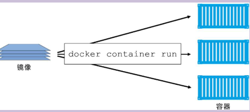

# 随记：


# 一、Docker开发环境塔建
> [!PDF|important] [[26【北京迅为】itop-3568开发板ubuntu安装docker使用手册【底板1.7版】v1.0.pdf#page=9&selection=32,0,36,2&color=important|26【北京迅为】itop-3568开发板ubuntu安装docker使用手册【底板1.7版】v1.0, p.9]]
> > 1.1 docker 简介
> 
> 

## 1、了解Dockker
- 1  Docker 是基于 Linux 内核的虚拟技术，所以消耗资源十分少

### 了解Docker 基础概念
#### 镜像（应用运行的环境）
- 1 面向 Docker 引擎的只读模板，包含了文件系统。
- 2 镜像是创建 Docker 容器的基础


#### 容器（镜像运行实例）
- 1 负责应⽤程序的运⾏。是从镜像创建的运⾏实例，互相隔离，安全的平台。
- 2 镜像只读 :容器在启动时创建⼀层可写层作为最上层。（类似overlayfs） 
[[RK3568（linux学习）/rk3568芯片开发/assets/Docker开发环境搭建与命令/file-20250810171724327.png|Open: Pasted image 20250714165304.png]]



#### 仓库 （集中存放镜像的地⽅，和github类似）
https://hub.docker.com/


## 2、docker下载安装

```cardlink
url: https://blog.csdn.net/ylfmsn/article/details/129894101
title: "如何在Ubuntu 18.04上安装Docker_ubuntu18.04安装docker-CSDN博客"
description: "文章浏览阅读1.5w次，点赞18次，收藏116次。本文详细介绍了如何在Ubuntu18.04系统上安装Docker，包括使用默认存储库、官方存储库和.deb包三种方式，涉及更新软件库、安装依赖、添加GPG密钥、启动和启用Docker服务等步骤。"
host: blog.csdn.net
```


### 用选项1（使用默认存储库在Ubuntu上安装Docker）

```bash
sudo apt-get update

sudo apt-get remove docker docker-engine docker.io

sudo apt install docker.io

//将 Docker 服务设置为在启动时运行
sudo systemctl start docker
sudo systemctl enable docker


```

- 1 选项2：从官方存储库安装 Docker不行。在ubuntu18下载源过旧或者docker官方不维护了。

- 1 这种格式不行，会报无法定位软件包  apt-transport-https
- 2 sudo apt-get install \ apt-transport-https \ ca-certificates \ curl \ gnupg-agent \ software-properties-common

### 使用默认存储库在Ubuntu上安装Docker和从官方存储库安装Docker有什么区别？

- 1 Ubuntu 官方仓库（docker.io）
- 2 版本通常滞后，Ubuntu 发布周期内只会进行安全修复，不会添加新功能,- - 版本稳定但较旧 。


- 1 官方 Docker 仓库（docker‑ce）
- 2 提供最新稳定版（stable）、以及 edge/nightly（功能先出，但不稳定）。


## 3、 把⽤⼾加⼊到docker组。
- 1 报错：connect: permission denied

- 1 sudo groupadd docker
- 1 sudo usermod -aG docker topeet           将用户添加到组中
- 1 newgrp docker                            重新加载用户组，使新的组成员关系立即生效
- 2 sudo systemctl enable docker      重启 docker 服务：
- 2 sudo systemctl restart docker


## 4、


## 5、


# 二、docker的使用

## 1、docker拉取荔枝派docker镜像

### 安装荔枝派开发镜像
> [!PDF|important] [[RK3568（linux学习）/rk3568芯片开发/assets/Docker开发环境搭建与命令/file-20250810171724570.pdf#page=2&selection=173,0,183,1&color=important|docker安装 - Sipeed Wiki, p.2]]
> > 三、安装荔枝派开发镜像
> 
> 

- 1 docker pull zepan/licheepi 
- 1 docker run -d -p 6666:22 zepan/licheepi /usr/sbin/sshd -D


## 2、Docker 安装 Ubuntu 18.04（要翻墙）

### 安装 Ubuntu 18.04
```
sudo apt update
docker pull ubuntu:18.04
```

### 启动Ubuntu 18.04容器
- 1 docker container run -p 8000:3000 -it ubuntu:18.04 /bin/bash

- 2 -p 参数：容器的 3000 端口映射到本机的 8000 端口。
- 2 -it 参数：容器的 Shell 映射到当前的 Shell，然后你在本机窗口输入的命令，就会传入容器。
- 2 ubuntu:18.04：image 文件的名字
- 2 /bin/bash：容器启动以后，内部第一个执行的命令。这里是启动 Bash，保证用户可以使用 Shell。


#### 容器名
> topeet@eff5542b4799:~/app$ pwd
/home/topeet/app

- 1 eff5542b4799

### Ubuntu 18.04容器初始化设置
> [!PDF|note] [[26【北京迅为】itop-3568开发板ubuntu安装docker使用手册【底板1.7版】v1.0.pdf#page=16&selection=73,1,76,6&color=note|26【北京迅为】itop-3568开发板ubuntu安装docker使用手册【底板1.7版】v1.0, p.16]]
> > Docker 安装常用工具
> 
> 

> 过程中需要配置地区，选择亚洲上海：`6   70   19


### 下载文件到 docker（编译静态git）
> topeet@ubuntu:~/app$ `sudo docker cp git-2.40.1.tar.gz eff5542b4799:/home/topeet/app
[sudo] topeet 的密码： 
- 2 有时候需要root权限才行

### 从容器中拷出文件
> topeet@ubuntu:~/app$ `sudo docker cp eff5542b4799:/home/topeet/app/git-2.40.1 ./
> topeet@ubuntu:~/app$ 


## 3、Docker常用命令
> [!PDF|important] [[RK3568（linux学习）/rk3568芯片开发/assets/Docker开发环境搭建与命令/file-20250810171724675.pdf#page=1&selection=302,0,306,1&color=important|Docker命令速查 - Sipeed Wiki, p.1]]
> > Docker容器操作

> [!PDF|note] [[26【北京迅为】itop-3568开发板ubuntu安装docker使用手册【底板1.7版】v1.0.pdf#page=20&selection=121,1,125,4&color=note|26【北京迅为】itop-3568开发板ubuntu安装docker使用手册【底板1.7版】v1.0, p.20]]
> > .6 Docker 常用命令
> 
> 

### 运⾏交互式的容器
- 1 docker run -i -t learn/tutorial /bin/bash       //开启一个交互式虚拟终端
- 1 -i 交互式 -t 虚拟终端 -d 后台 -P 端口映射

- 1 docker port id //查看端口映射情况
- 1 docker inspect id //查看容器详细状态

### 启动容器（后台模式）
- 1 docker run -d learn/tutorial /bin/sh -c "while true; do echo hello world; sleep 1; done"


- 1 docker start eff5542b4799

### 通过ps查看正在运⾏的容器实例
- 1 docker ps

### 停⽌/开始/重启容器：
- 1 docker stop 3508                         //通过发送信号方式停止 
- 1 docker kill c2e90ab8e4c4                          //kill方式停止 
- 1 docker start 3508          //start -i          交互式执行 
- 1 docker restart 3508                      重启容器

### 进入容器
- 1 docker exec -it c2e90ab8e4c4 /bin/bash

### 退出容器
- 1 exit

### 删除容器
- 1 docker remove 3508 
- 1 docker rm \`docker ps -a -q\`                 //删除所有容器

### 主机容器互拷数据
- 1 docker cp id:/xxx/xx /yyy/yy/            容器才有id
- 1 docker cp /yyy/yy/ id:/xxx/xx

### 开启容器的ssh
- 1 docker run -d -p 6666:22 zepan/licheepi /usr/sbin/sshd -D


### 导入容器快照
- 1 docker export bc1d9b59bc0b > ubuntu.tar


### 导出容器
- 1 cat docker/ubuntu.tar | docker import - test/ubuntu:v1


## 4、
### 


### 


### 


## 5、报错与解决

### 拉取镜像时等待超时
- 1 报错：waiting for connection (Client.Timeout exceeded while awaiting headers)

```cardlink
url: https://www.cnblogs.com/Faquir/p/18787293
title: "docker 使用过程中网络连接失败request canceled while waiting for connection - Faquir - 博客园"
description: "Get &quot;https://registry-1.docker.io/v2/&quot;: net/http: request canceled while waiting for connection (Client.Timeout exceeded while awaiting head"
host: www.cnblogs.com
favicon: https://assets.cnblogs.com/favicon_v3_2.ico
```

> [!note] 在daemon.json文件中插入源地址信息
> {
>     "registry-mirrors": ["https://docker.registry.cyou",
>     "https://docker-cf.registry.cyou",
>     "https://dockercf.jsdelivr.fyi",
>     "https://docker.jsdelivr.fyi",
>     "https://dockertest.jsdelivr.fyi",
>     "https://mirror.aliyuncs.com",
>     "https://dockerproxy.com",
>     "https://mirror.baidubce.com",
>     "https://docker.m.daocloud.io",
>     "https://docker.nju.edu.cn",
>     "https://docker.mirrors.sjtug.sjtu.edu.cn",
>     "https://docker.mirrors.ustc.edu.cn",
>     "https://mirror.iscas.ac.cn",
>     "https://docker.rainbond.cc"]
> }


