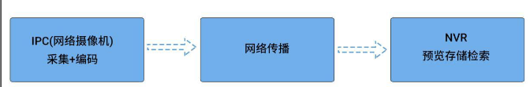
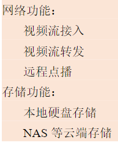
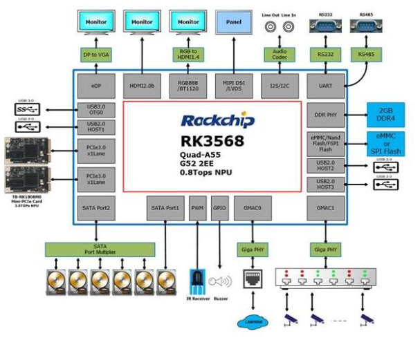
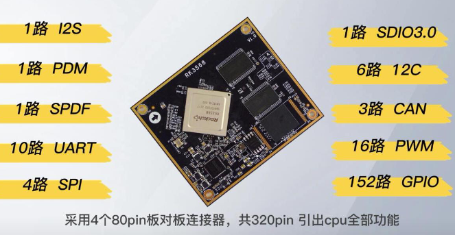
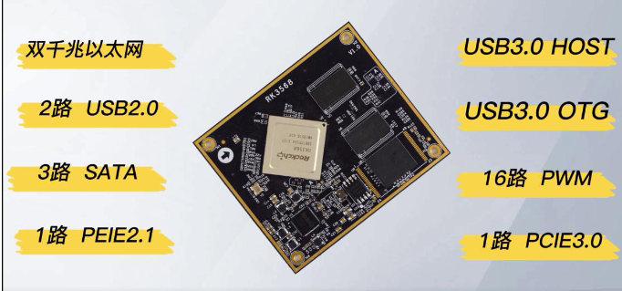

# 随记：

- 1 NVR开发可以参考

# 一、RK3568 赋能 AI 硬盘录像机 NVR/XVR

## 1、NVR 简介（网络视频录像机）
> [!PDF|important] [[12_【北京迅为】itop-3568开发板linux_nvr_sdk开发手册【底板V1.7版】.pdf#page=9&selection=35,0,39,2&color=important|12_【北京迅为】itop-3568开发板linux_nvr_sdk开发手册【底板V1.7版】, p.9]]
> > 1.1 NVR 简介
> 
> 

### NVR的了解
- 1 通过网络摄像机设备传输的数字视频码流，并进行存储， 管理，从而实现网络化带来的分散式架构优势

- 1 NVR 和网络摄像机(或者编码器)一起构成网络视频监控方案的核心产品
[[RK3568（linux学习）/rk3568芯片开发/Linux系统开发（未）/assets/NVR系统开发/file-20250810171801251.png|Open: Pasted image 20250720214509.png]]

### NVR 主要功能
[[RK3568（linux学习）/rk3568芯片开发/Linux系统开发（未）/assets/NVR系统开发/file-20250810171801412.png|Open: Pasted image 20250720214418.png]]

[[RK3568（linux学习）/rk3568芯片开发/Linux系统开发（未）/assets/NVR系统开发/file-20250810171801516.png|Open: Pasted image 20250720214430.png]]

### 

## 2、 RK3568 赋能 NVR
> [!PDF|important] [[12_【北京迅为】itop-3568开发板linux_nvr_sdk开发手册【底板V1.7版】.pdf#page=10&selection=71,0,77,3&color=important|12_【北京迅为】itop-3568开发板linux_nvr_sdk开发手册【底板V1.7版】, p.10]]
> > 1.2 RK3568 赋能 NVR
> 
> 

### RK3568 NVR 应用框图
[[RK3568（linux学习）/rk3568芯片开发/Linux系统开发（未）/assets/NVR系统开发/file-20250810171801657.png|Open: Pasted image 20250720214719.png]]

### RK3568 四大特性赋能 NVR/XVR 的全面硬件升级。
- 1 RK3568 具备强大的核心处理能力,确保后端设备数据处理的稳定性及高效性
- 2 内置瑞芯微自研第三代 NPU RKNN,算力达 0.8Tops。
- 2 RK3568 CPU 搭载全新 Arm v8.2-A 架构

[[RK3568（linux学习）/rk3568芯片开发/Linux系统开发（未）/assets/NVR系统开发/file-20250810171801812.png|Open: Pasted image 20250720215256.png]]

[[RK3568（linux学习）/rk3568芯片开发/Linux系统开发（未）/assets/NVR系统开发/file-20250810171801968.png|Open: Pasted image 20250720215325.png]]

### 

# 二、编译 Linux_NVR_SDK 源码
[[系统编译与烧写#编译 Linux_NVR_SDK 源码]]

# 三、Linux_NVR_SDK 系统开发
> [!PDF|important] [[12_【北京迅为】itop-3568开发板linux_nvr_sdk开发手册【底板V1.7版】.pdf#page=14&selection=19,0,27,4&color=important|12_【北京迅为】itop-3568开发板linux_nvr_sdk开发手册【底板V1.7版】, p.14]]
> > 第 2 章 Linux_NVR_SDK 系统开发
> 
> 

## 1、编译 rootfs 提示分区小（解决方法）
> [!PDF|red] [[12_【北京迅为】itop-3568开发板linux_nvr_sdk开发手册【底板V1.7版】.pdf#page=14&selection=30,1,35,5&color=red|12_【北京迅为】itop-3568开发板linux_nvr_sdk开发手册【底板V1.7版】, p.14]]
> > 编译 rootfs 提示分区小
> 
> 
### 

### 

### 

## 2、扩展根文件系统
> [!PDF|red] [[12_【北京迅为】itop-3568开发板linux_nvr_sdk开发手册【底板V1.7版】.pdf#page=15&selection=31,0,33,7&color=red|12_【北京迅为】itop-3568开发板linux_nvr_sdk开发手册【底板V1.7版】, p.15]]
> > 2.2 扩展根文件系统
> 
> 

### 

### 

### 

## 3、查看 NPU/GPU/CPU 频率使用率（√）
> [!PDF|red] [[12_【北京迅为】itop-3568开发板linux_nvr_sdk开发手册【底板V1.7版】.pdf#page=15&selection=63,0,69,5&color=red|12_【北京迅为】itop-3568开发板linux_nvr_sdk开发手册【底板V1.7版】, p.15]]
> > 2.3 查看 NPU/GPU/CPU 频率使用率

- 1 挂载 debug，只有挂载 debug 才可以查看 NPU/GPU/CPU 频率使用率。
> [root@RK356X:/]# `mount -t debugfs debugfs /sys/kernel/debug
> mount: /sys/kernel/debug: debugfs already mounted or mount point busy.
> [root@RK356X:/]# `mount | grep debug
> debug on /sys/kernel/debug type debugfs (rw,relatime)
-

> [root@RK356X:/]# `cat /sys/kernel/debug/clk/clk_scmi_npu/clk_rate   查看 NPU 频率
> 0
> [root@RK356X:/]# `cat /sys/kernel/debug/clk/clk_scmi_gpu/clk_rate   查看 GPU 频率
> 0
> [root@RK356X:/]# `cat /sys/devices/platform/fde60000.gpu/devfreq/fde60000.gpu/cur_freq   查看 GPU 频率
> 600000000
> [root@RK356X:/]# `cat /sys/devices/platform/fde60000.gpu/utilisation  查看 GPU 负载
> 0
> [root@RK356X:/]# `cat /sys/devices/system/cpu/cpu0/cpufreq/scaling_cur_freq 查看 CPU 频率
> 1416000
> [root@RK356X:/]# `cat /sys/devices/system/cpu/cpu0/cpufreq/scaling_available_freq  查看 CPU 可用的频率表
> uencies
> 1416000 1608000 1800000
> [root@RK356X:/]# `echo performance > /sys/devices/system/cpu/cpufreq/policy0/scal   使能 CPU 性能模式,跑最高频
> ing_governor
> [root@RK356X:/]# `cat /sys/devices/system/cpu/cpu0/cpufreq/scaling_cur_freq   CPU 频率
> 1800000
> [root@RK356X:/]#

## 4、
### 

### 

### 

## 5、
### 

### 

### 

# 四、

## 1、
### 

### 

### 

## 2、

### 

### 

### 

## 3、
### 

### 

### 

## 4、
### 

### 

### 

## 5、
### 

### 

### 

# 五、

## 1、
### 

### 

### 

## 2、

### 

### 

### 

## 3、
### 

### 

### 

## 4、
### 

### 

### 

## 5、
### 

### 

### 

# 六、

## 1、
### 

### 

### 

## 2、

### 

### 

### 

## 3、
### 

### 

### 

## 4、
### 

### 

### 

## 5、
### 

### 

### 
