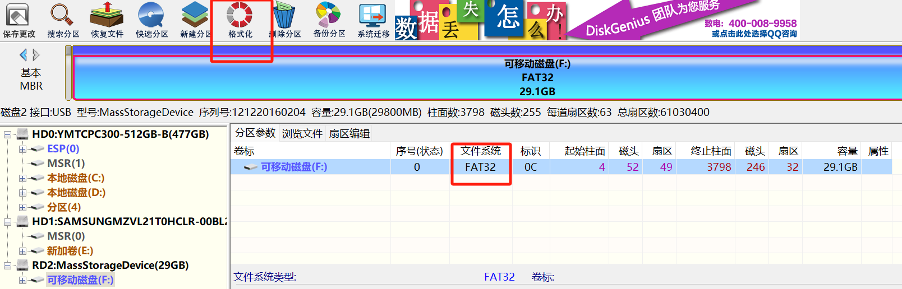

# 随记：

# 一、开发板与ubuntu通过nfs实现共享目录

- 1 NFS服务器搭建以及开发板NFS实现共享目录
- 1 通过 nfs 共享目录可以实现虚拟机 Ubuntu 与开发板互传文件。
- 
- 1 NFS 是 Network FileSystem 的缩写，基于 UDP/IP 协议的应用。可以通过网络让不同的机器，不同的操作系统彼此共享文件。所以使用 NFS 服务可以提高调试的效率。
## 1、搭建环境介绍
> [!PDF|important] [[10_【北京迅为】itop-3568开发板nfs实现共享目录【底板V1.7版】.pdf#page=9&selection=82,0,84,6&color=important|10_【北京迅为】itop-3568开发板nfs实现共享目录【底板V1.7版】, p.9]]
> > 1.1 搭建环境介绍
> 
> 

### 

### 

### 

## 2、搭建 NFS 服务器
> [!PDF|important] [[10_【北京迅为】itop-3568开发板nfs实现共享目录【底板V1.7版】.pdf#page=9&selection=106,0,112,3&color=important|10_【北京迅为】itop-3568开发板nfs实现共享目录【底板V1.7版】, p.9]]
> > 1.2 搭建 NFS 服务器
> 
> 

### 

### 

### 

## 3、共享目录使用
> [!PDF|important] [[10_【北京迅为】itop-3568开发板nfs实现共享目录【底板V1.7版】.pdf#page=11&selection=66,0,71,6&color=important|10_【北京迅为】itop-3568开发板nfs实现共享目录【底板V1.7版】, p.11]]
> > 1.3 NFS 共享目录使用
> 
> 

### 

### 

### 

## 4、
### 

### 

### 

## 5、
### 

### 

### 

# 二、开发板linux系统模拟成U盘或 USB 网卡设备使用

- 1 将3568开发板模拟成U盘

## 1、将 Linux 板卡虚拟成 U 盘(Mass Storage Gadget )
> [!PDF|important] [[28_【北京迅为】itop-3568 开发板linux系统模拟U盘或USB网卡设备使用手册【底板1.7版】 v1.1.pdf#page=9&selection=23,0,44,1&color=important|28_【北京迅为】itop-3568 开发板linux系统模拟U盘或USB网卡设备使用手册【底板1.7版】 v1.1, p.9]]
> > 第 1 章将 Linux 板卡虚拟成 U 盘(Mass Storage Gadget )
> 
> 

### 

### 

### 

## 2、将 Linux 板卡虚拟为 USB 网卡设备（Ethernet Gadget） - 共享网络
> [!PDF|important] [[28_【北京迅为】itop-3568 开发板linux系统模拟U盘或USB网卡设备使用手册【底板1.7版】 v1.1.pdf#page=11&selection=37,0,55,1&color=important|28_【北京迅为】itop-3568 开发板linux系统模拟U盘或USB网卡设备使用手册【底板1.7版】 v1.1, p.11]]
> > 第 2 章将 Linux 板卡虚拟为 USB 网卡设备（Ethernet Gadget）
> 
> 

- 1 做过
[[第二十五期_USB#Gadget驱动：把开发板模拟成USB网卡(通过USB 3.0实现开发板共享主机网络)]]

## 3、
### 

### 

### 

## 4、
### 

### 

### 

## 5、
### 

### 

### 

# 三、linux系统导出文件系统镜像
- 1 在开发过程中，可以在开发板上验证开发完毕后，将开发之后的系统导出镜像  

> [!PDF|important] [[29_【北京迅为】itop-3568 开发板linux系统导出系统镜像使用手册【底板1.7版】 v1.0.pdf#page=9&selection=19,0,25,11&color=important|29_【北京迅为】itop-3568 开发板linux系统导出系统镜像使用手册【底板1.7版】 v1.0, p.9]]
> > 第 1 章导出开发板文件系统镜像
> 
> 

- 1 创建的各种文件，和所做的各种配置，想要将调试好的系统打包发布，进行批量生产，就可以通过以下方法导出系统镜像。

## 1、挂载 U 盘
### U 盘的格式
- 1  U 盘（TF 卡以及 nfs 挂载也可）(U 盘的格式必须为 FAT32 格式，大小在 32G 以下)插到开发板的 usb 接口

[[RK3568（linux学习）/rk3568芯片开发/Linux系统开发（未）/assets/linux系统扩展功能开发（未）/file-20250810171800681.png|Open: Pasted image 20250718210738.png]]

### 挂载 U 盘

> [root@topeet:/]# `mount /dev/sda1 /mnt/
> [root@topeet:/]# cd /mnt/
> [root@topeet:/mnt]# ls
> 'System Volume Information'   rk3568

- 1 记得取消挂载
- 2 umount /mnt

## 2、导出文件系统镜像

> 
> [root@topeet:/mnt]# cd rk3568
> [root@topeet:/mnt/rk3568]# cd buildroot/
> [root@topeet:/mnt/rk3568/buildroot]# `dd if=/dev/mmcblk0p6 | gzip > rootfs.img.gz
> 25165824+0 records in
> 25165824+0 records out
> 12884901888 bytes (13 GB, 12 GiB) copied, `1321.55 s`, 9.7 MB/s
> 

## 3、使用导出的文件系统镜像
### 解压获取文件系统镜像
- 1 镜像压缩包拷贝到虚拟机 Ubuntu 端，使用以下命令解压
> topeet@ubuntu:~/Linux/rooft_img$ `gzip -d rootfs.img.gz 
> topeet@ubuntu:~/Linux/rooft_img$ `e2fsck -f rootfs.img 
> e2fsck 1.44.1 (24-Mar-2018)
> rootfs：正在修复日志
> 第 1 步：检查inode、块和大小
> 第 2 步：检查目录结构
> 第 3 步：检查目录连接性
> 第 4 步：检查引用计数
> 第 5 步：检查组概要信息
> 可用块数错误（0，实际为0）
> 处理<y? `是
> 可用inode数错误（771764，实际为771752）
> 处理 y? `是
> 
> rootfs： 文件系统已修改 
> rootfs：14680/786432 文件（0.1% 为非连续的）， 282282/3145728 块
> topeet@ubuntu:~/Linux/rooft_img$ `resize2fs -M rootfs.img
> resize2fs 1.44.1 (24-Mar-2018)
> 将 rootfs.img 上的文件系统调整为 411251 个块（每块 4k）。
> rootfs.img 上的文件系统现在为 411251 个块（每块 4k）。
> topeet@ubuntu:~/Linux/rooft_img$ 
-

- 2 最后 rootfs.img 就是可以进行单独烧写的文件系统镜像。

### 烧写扩容

- 1 单独烧写文件系统完成进入到系统后输入以下命令进行扩容
- 2 resize2fs /dev/mmcblk0p6

> [root@topeet:/]# `df -h
> Filesystem      Size  Used Avail Use% Mounted on
> /dev/root       1.5G  845M  591M  59% /
> devtmpfs        976M     0  976M   0% /dev
> tmpfs           985M     0  985M   0% /dev/shm
> tmpfs           985M  336K  985M   1% /tmp
> tmpfs           985M  288K  985M   1% /run
> /dev/mmcblk0p7  184M   13M  162M   7% /oem
> /dev/mmcblk0p8  2.2G   56K  2.2G   1% /userdata
> 
> [root@topeet:/]# `resize2fs /dev/mmcblk0p6
> resize2fs 1.46.5 (30-Dec-2021)
> Filesystem at /dev/mmcblk0p6 is mounted on /; on-line resizing required
> old_desc_blocks = 1, new_desc_blocks = 1
> [   38.937951] EXT4-fs (mmcblk0p6): resizing filesystem from 411251 to 3145728 blocks
> [   38.996377] EXT4-fs (mmcblk0p6): resized filesystem to 3145728
> The filesystem on /dev/mmcblk0p6 is now 3145728 (4k) blocks long.
> 
> [root@topeet:/]# `df -h
> Filesystem      Size  Used Avail Use% Mounted on
> /dev/root        12G  847M   11G   8% /
> devtmpfs        976M     0  976M   0% /dev
> tmpfs           985M     0  985M   0% /dev/shm
> tmpfs           985M  340K  985M   1% /tmp
> tmpfs           985M  288K  985M   1% /run
> /dev/mmcblk0p7  184M   13M  162M   7% /oem
> /dev/mmcblk0p8  2.2G   56K  2.2G   1% /userdata

# 四、开发板使用ADB工具

- 1 在开发过程中，ADB工具是非常方便的，ADB的使用参考

## 1、adb 简介
> [!PDF|important] [[30_【北京迅为】itop-3568开发板adb使用手册【底板v1.7版】v1.1.pdf#page=9&selection=47,0,51,2&color=important|30_【北京迅为】itop-3568开发板adb使用手册【底板v1.7版】v1.1, p.9]]
> > 1.1 adb 简介
> 
> 

- 1 。Adb 是 Android 设备和电脑端连接的一个桥梁，它可以让开发者通过网络或 USB 和 Android 设备进行通信，所以说 ADB 是 Android 设备的调试工具。

- 1 注！iTOP-RK3568 开发板的 Android 和 Linux 系统都支持 ADB。
### 

### 

### 

## 2、Windows 下安装 ADB 工具
> [!PDF|important] [[30_【北京迅为】itop-3568开发板adb使用手册【底板v1.7版】v1.1.pdf#page=9&selection=200,0,208,2&color=important|30_【北京迅为】itop-3568开发板adb使用手册【底板v1.7版】v1.1, p.9]]
> > 1.2 Windows 下安装 ADB 工具
> 
> 

### 

### 

### 

## 3、Ubuntu 下安装 ADB 工具
> [!PDF|important] [[30_【北京迅为】itop-3568开发板adb使用手册【底板v1.7版】v1.1.pdf#page=12&selection=21,0,29,2&color=important|30_【北京迅为】itop-3568开发板adb使用手册【底板v1.7版】v1.1, p.12]]
> > 1.3 Ubuntu 下安装 ADB 工具
> 
> 

### 

### 

### 

## 4、使用 adb 工具
> [!PDF|important] [[30_【北京迅为】itop-3568开发板adb使用手册【底板v1.7版】v1.1.pdf#page=13&selection=21,0,31,2&color=important|30_【北京迅为】itop-3568开发板adb使用手册【底板v1.7版】v1.1, p.13]]
> > 第 2 章使用 adb 工具
> 
> 

### 

### 

### 

## 5、
### 

### 

### 

# 五、

## 1、
### 

### 

### 

## 2、

### 

### 

### 

## 3、
### 

### 

### 

## 4、
### 

### 

### 

## 5、
### 

### 

### 

# 六、

## 1、
### 

### 

### 

## 2、

### 

### 

### 

## 3、
### 

### 

### 

## 4、
### 

### 

### 

## 5、
### 

### 

### 
