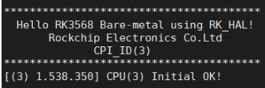
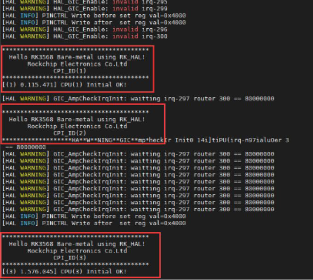
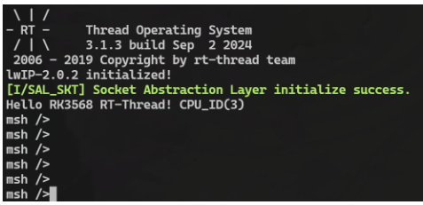

# 随记：

# 一、编译 AMP 镜像
> [!PDF|important] [[RK3568（linux学习）/rk3568芯片开发/Linux系统开发（未）/assets/开发板AMP系统开发/file-20250810171756140.pdf#page=9&selection=19,0,29,2&color=important|【北京迅为】itop-3568 开发板AMP使用手册 v1.1, p.9]]
> > 第 1 章编译 AMP 镜像
> 
> 
## 1、开发环境搭建（ 64 位的 Ubuntu）
### 安装编译所需依赖
- 1 sudo apt-get update 
- 1 sudo apt-get install clang-format astyle libncurses5-dev build-essential python-configparser scons

### RK3568 为 4 核 Cortex-A55，编号 0~3

### 

## 2、SDK 解压和编译

### SDK 解压

> (base) topeet@ubuntu:~/AMP$ `tar -vxf rk356x_amp_20240902.tar.xz

### 整体编译
> `./build.sh all
在 rockdev 目录下生成 update.img

### 单独编译
> ./build.sh uboot               //单独编译 uboot 
> ./build.sh kernel                //单独编译内核 
> ./build.sh amp                  //单独编译 amp 
> ./build.sh updateimg       //打包整体 update.img 镜像

- 2 进行单独编译前需进行过全编译

### 编译 RT-Thread 镜像
- 1 编译 rtthread 文件，这里的 3 表示 rtthread 将运行在 CPU3 上
> `./build.sh rtthread 3

- 2 编译过程中会进入 rtthread 的配置界面，在这个配置可以对 rtthread 进行配置
> (base) topeet@ubuntu:~/AMP/rk356x_amp$ `ls rockdev/amp/ -al
[[RK3568（linux学习）/rk3568芯片开发/Linux系统开发（未）/assets/开发板AMP系统开发/file-20250810171756635.png|Open: Pasted image 20250721155139.png]]

- 1 重新编译 amp 镜像
> ` ./build.sh ampimg

- 1 打包整体 update.img 镜像
> `./build.sh updateimg

- 2 在 rockdev 目录下生成打包完成的 update.img 镜像
- 2 编译 RT-Thread 镜像前首先需要使用./build.sh all 进行全编译
### 清除编译
> `./build.sh cleanall

### 编译脚本命令总结

#### **基础操作**

| 命令                     | 功能说明                                        |
| ---------------------- | ------------------------------------------- |
| `./build.sh`           | 默认执行 `allsave`，构建所有组件并保存镜像、补丁和日志（适合首次完整构建）。 |
| `./build.sh all`       | 构建 U-Boot、内核、RootFS、RT-Thread、HAL 层。        |
| `./build.sh cleanall`  | 清理所有构建产物（用于重新构建）。                           |
| `./build.sh firmware`  | 打包完整启动镜像（包含所有分区文件）。                         |
| `./build.sh updateimg` | 生成升级镜像（用于 OTA 更新）。                          |
| `./build.sh save`      | 保存当前构建的镜像、补丁和操作命令（便于调试和复现）。                 |

#### **增量构建**

|命令|功能说明|
|---|---|
|`./build.sh uboot`|仅构建 U-Boot（需确保环境已初始化）。|
|`./build.sh kernel`|仅构建内核（需先完成完整构建，否则可能失败）。|
|`./build.sh rootfs`|仅构建根文件系统（默认使用 Buildroot）。|
|`./build.sh rtthread`|构建 RT-Thread 实时操作系统。|

#### **配置管理**

|命令|功能说明|
|---|---|
|`./build.sh lunch`|列出所有支持的开发板配置，并切换当前配置（如 `rk3568_evb1_ddr4_v10`）。|
|`./build.sh BoardConfigX.mk`|直接切换到指定的开发板配置文件（如 `BoardConfig-rk3568_evb1_ddr4_v10.mk`）。|
|`./build.sh menuconfig`|调整内核配置（修改内核模块开关、驱动选项等）。|

## 3、启动方案修改
### AMP 混合架构设计
- 1 SDK ⽀持 AMP 混合架构设计，使得不同的 CPU 可以运⾏不同的系统，以满⾜灵活的产品设计需求。
- 2 ⽬前⽀持 RTT、Linux、HAL 的混合结构模型，允许这三种系统相互组合或者独 ⽴运⾏，提供的源码使用的默认配置为 3Linux（CPU0、1、2）+1HAL（CPU3）

### 方案一：3Linux+1HAL（默认配置）
[[RK3568（linux学习）/rk3568芯片开发/Linux系统开发（未）/assets/开发板AMP系统开发/file-20250810171756767.png|Open: Pasted image 20250721155355.png]]

- 1 vi device/rockchip/rk3568/rk3568_amp_linux.its      查看 its 配置文件
[[RK3568（linux学习）/rk3568芯片开发/Linux系统开发（未）/assets/开发板AMP系统开发/file-20250810171756870.png|Open: Pasted image 20250721155627.png]]

- 1 vi kernel/arch/arm64/boot/dts/rockchip/rk3568-evb1-ddr4-v10-linux-amp.dts    查看修改内核设备树文件
[[RK3568（linux学习）/rk3568芯片开发/Linux系统开发（未）/assets/开发板AMP系统开发/file-20250810171757031.png|Open: Pasted image 20250721155755.png]]

### 方案二：1Linux+3HAL
[[RK3568（linux学习）/rk3568芯片开发/Linux系统开发（未）/assets/开发板AMP系统开发/file-20250810171757187.png|Open: Pasted image 20250721160626.png]]

- 1 修改 its 配置文件
> `vi device/rockchip/rk3568/rk3568_amp_linux.its
[[RK3568（linux学习）/rk3568芯片开发/Linux系统开发（未）/assets/开发板AMP系统开发/file-20250810171757332.png|Open: Pasted image 20250721160317.png]]

[[RK3568（linux学习）/rk3568芯片开发/Linux系统开发（未）/assets/开发板AMP系统开发/file-20250810171757469.png|Open: Pasted image 20250721160419.png]]

- 1 修改内核设备树文件
> `vi kernel/arch/arm64/boot/dts/rockchip/rk3568-evb1-ddr4-v10-linux-amp.dts
[[RK3568（linux学习）/rk3568芯片开发/Linux系统开发（未）/assets/开发板AMP系统开发/file-20250810171757570.png|Open: Pasted image 20250721160116.png]]

#### 改完后编译
- 1 先编译 RT-Thread 镜像
> ` ./build.sh rtthread 1      
`./build.sh rtthread 2
`./build.sh rtthread 3

> ` ./build.sh ampimg

> `./build.sh updateimg

- 1 再重新整体编译
> `./build.sh all
在 rockdev 目录下生成 update.img

## 4、
### 

### 

### 

# 二、烧写 AMP 镜像
> [!PDF|important] [[RK3568（linux学习）/rk3568芯片开发/Linux系统开发（未）/assets/开发板AMP系统开发/file-20250810171756140.pdf#page=18&selection=19,0,29,2&color=important|【北京迅为】itop-3568 开发板AMP使用手册 v1.1, p.18]]
> > 第 2 章烧写 AMP 镜像
> 
> 

## 1、同之前的镜像一样烧写

## 2、单独烧写 - 注意

### 镜像的配置文件（rk3568_amp.cfg ）
- 2   在烧写之前需要先导入镜像的配置文件，将烧写工具下面的 rk3568_amp.cfg 文件导入进去

- 1 如果 linux.cfg 导入不成功，可以手动修改地址，名字，路径，修改成和下图一样。
[[RK3568（linux学习）/rk3568芯片开发/Linux系统开发（未）/assets/开发板AMP系统开发/file-20250810171757719.png|Open: Pasted image 20250721161157.png]]

### 

### 

# 三、启动测试
> [!PDF|important] [[RK3568（linux学习）/rk3568芯片开发/Linux系统开发（未）/assets/开发板AMP系统开发/file-20250810171756140.pdf#page=31&selection=19,0,25,4&color=important|【北京迅为】itop-3568 开发板AMP使用手册 v1.1, p.31]]
> > 第 3 章启动测试
> 
> 

## 1、3Linux+1HAL（提供镜像默认配置为 3Linux+1HAL。）
### Linux 串口（调试串口）打印
> root@rk356x:/# `cat /proc/cpuinfo
> processor       : 0
> BogoMIPS        : 48.00
> Features        : fp asimd evtstrm aes pmull sha1 sha2 crc32 atomics fphp asimdhp cpuid asimdrdm lrcpc dcpop asimddp
> CPU implementer : 0x41
> CPU architecture: 8
> CPU variant     : 0x2
> CPU part        : 0xd05
> CPU revision    : 0
> 
> processor       : 1
> BogoMIPS        : 48.00
> Features        : fp asimd evtstrm aes pmull sha1 sha2 crc32 atomics fphp asimdhp cpuid asimdrdm lrcpc dcpop asimddp
> CPU implementer : 0x41
> CPU architecture: 8
> CPU variant     : 0x2
> CPU part        : 0xd05
> CPU revision    : 0
> 
> processor       : 2
> BogoMIPS        : 48.00
> Features        : fp asimd evtstrm aes pmull sha1 sha2 crc32 atomics fphp asimdhp cpuid asimdrdm lrcpc dcpop asimddp
> CPU implementer : 0x41
> CPU architecture: 8
> CPU variant     : 0x2
> CPU part        : 0xd05
> CPU revision    : 0
> 
> Hardware        : Rockchip RK3568 EVB1 DDR4 V10 Board
> Serial          : b8455659e9d734f2
> 

### HAL（uart4）串口打印
[[RK3568（linux学习）/rk3568芯片开发/Linux系统开发（未）/assets/开发板AMP系统开发/file-20250810171757871.png|Open: Pasted image 20250721170503.png]]

### 

## 2、1Linux+3HAL

### Linux 串口（调试串口）打印
> root@rk356x:/# `cat /proc/cpuinfo
> processor       : 0
> BogoMIPS        : 48.00
> Features        : fp asimd evtstrm aes pmull sha1 sha2 crc32 atomics fphp asimdhp cpuid asimdrdm lrcpc dcpop asimddp
> CPU implementer : 0x41
> CPU architecture: 8
> CPU variant     : 0x2
> CPU part        : 0xd05
> CPU revision    : 0
> 
> Hardware        : Rockchip RK3568 EVB1 DDR4 V10 Board
> Serial          : b8455659e9d734f2

### HAL（uart4）串口打印
[[RK3568（linux学习）/rk3568芯片开发/Linux系统开发（未）/assets/开发板AMP系统开发/file-20250810171757953.png|Open: Pasted image 20250721170538.png]]

### 

## 3、3Linux+1RTT
- 1 提供的RTT镜像默认配置为 3Linux+1RTT。
### Linux 串口（调试串口）打印
[[RK3568（linux学习）/rk3568芯片开发/Linux系统开发（未）/assets/开发板AMP系统开发/file-20250810171758114.png|Open: Pasted image 20250721170628.png]]

### RTT（uart4）串口打印
[[RK3568（linux学习）/rk3568芯片开发/Linux系统开发（未）/assets/开发板AMP系统开发/file-20250810171758260.png|Open: Pasted image 20250721170647.png]]

- 1 在该终端可以进行类似 linux 的 shell 终端操作，例如输入 help 即可打印帮助信息：
[[RK3568（linux学习）/rk3568芯片开发/Linux系统开发（未）/assets/开发板AMP系统开发/file-20250810171758399.png|Open: Pasted image 20250721170727.png]]

- 1 输入 version 即可打印当前的 RT-Thread 版本号

- 1 输入 ps 即可打印当前正在运行的进程

### 

## 4、
### 

### 

### 

# 四、裸核开发（uart4）（未）
> [!PDF|important] [[RK3568（linux学习）/rk3568芯片开发/Linux系统开发（未）/assets/开发板AMP系统开发/file-20250810171756140.pdf#page=35&selection=19,0,25,4&color=important|【北京迅为】itop-3568 开发板AMP使用手册 v1.1, p.35]]
> > 第 4 章裸核开发
> 
> 
- 1 测试代码默认在源码 hal/project/rk3568/src/topeet_demo 目录下添加好，只需在 main 函数中添加要测试的实例函数
- 2 main 函数在hal/project/rk3568/src/main.c 

## 1、GPIO 测试
> [!PDF|red] [[RK3568（linux学习）/rk3568芯片开发/Linux系统开发（未）/assets/开发板AMP系统开发/file-20250810171756140.pdf#page=35&selection=44,0,46,2&color=red|【北京迅为】itop-3568 开发板AMP使用手册 v1.1, p.35]]
> > GPIO 测试
> 
> 
### 

### 

### 

## 2、PWM 测试
> [!PDF|red] [[RK3568（linux学习）/rk3568芯片开发/Linux系统开发（未）/assets/开发板AMP系统开发/file-20250810171756140.pdf#page=36&selection=119,1,122,2&color=red|【北京迅为】itop-3568 开发板AMP使用手册 v1.1, p.36]]
> > PWM 测试
> 
> 

### 

### 

### 

## 3、UART 测试
> [!PDF|red] [[RK3568（linux学习）/rk3568芯片开发/Linux系统开发（未）/assets/开发板AMP系统开发/file-20250810171756140.pdf#page=38&selection=26,0,30,2&color=red|【北京迅为】itop-3568 开发板AMP使用手册 v1.1, p.38]]
> > 4.3 UART 测试
> 
> 
### 

### 

### 

## 4、 SPI 测试
> [!PDF|red] [[RK3568（linux学习）/rk3568芯片开发/Linux系统开发（未）/assets/开发板AMP系统开发/file-20250810171756140.pdf#page=42&selection=19,0,23,2&color=red|【北京迅为】itop-3568 开发板AMP使用手册 v1.1, p.42]]
> > 4.4 SPI 测试
> 
> 
### 

### 

### 

## 5、开关核测试
> [!PDF|red] [[RK3568（linux学习）/rk3568芯片开发/Linux系统开发（未）/assets/开发板AMP系统开发/file-20250810171756140.pdf#page=44&selection=74,0,76,5&color=red|【北京迅为】itop-3568 开发板AMP使用手册 v1.1, p.44]]
> > 4.5 开关核测试
> 
> 
### 

### 

### 

# 五、

## 1、
### 

### 

### 

## 2、

### 

### 

### 

## 3、
### 

### 

### 

## 4、
### 

### 

### 

## 5、
### 

### 

### 

# 六、

## 1、
### 

### 

### 

## 2、

### 

### 

### 

## 3、
### 

### 

### 

## 4、
### 

### 

### 

## 5、
### 

### 

### 
