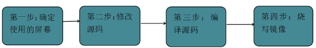

# 随记：

# 一、了解实时系统
## 1、实时系统简介
> [!PDF|important] [[【北京迅为】itop-3568开发板实时系统使用手册【底板1.7版】v1.0.pdf#page=9&selection=7,0,11,6&color=important|【北京迅为】itop-3568开发板实时系统使用手册【底板1.7版】v1.0, p.9]]
> > 第1章实时系统简介
> 
> 

### 实时系统特点及应用场景
- 1 主要特点是对任务的响应时间有严格的要求
- 2 实时系统广泛应用于航空航天，交通运输，工业控制，医疗设备和通信系统等领域。

- 1 硬实时系统
- 2 交通运输、工业控制、医疗设备、通信系统

- 1 软实时系统
- 2 嵌入式系统、多媒体处理、游戏开发

### 硬实时和软实时
- 1 硬实时系统要求任务在严格的时间约束下完成，如果任务未能在预定的时间内完成，系统将被认为是失败。

- 1 软实时系统允许任务偶尔超过时间限制，但在大多数情况下，任务必须能够及时完成。在软实时系统中，性能的可预测性和平均响应时间的保证是关键因素。
- 2 软实时系统相比硬实时系统更具灵活性和容错性，适用于对实时性能要求较高但允许一定的时间容忍度的应用场景。
### 实时系统的设计和开发需要考虑以下几个关键方面。
>  `任务调度`：实时系统的任务调度算法必须能够合理分配系统资源，确保任务按照其优先级和时间约束进行调度。
> 
> `响应时间分析`：对于硬实时系统，必须进行响应时间分析来验证任务的可调度性。
> 
> `硬件支持`：实时系统通常需要专门的硬件支持，例如实时时钟、硬件中断和定时器等。
> 
> `容错和可靠性`：实时系统的容错和可靠性对于一些关键应用至关重要

## 2、实时系统选择 - 翼辉系统（收费）
- 1 SylixOS 国产实时操作系统是翼辉信息旗下的软件产品，诞生于2006年，是一款功能完善、性能卓越、可靠稳定的大型嵌入式实时操作系统。

> [!PDF|important] [[【北京迅为】itop-3568开发板实时系统使用手册【底板1.7版】v1.0.pdf#page=12&selection=34,0,36,4&color=important|【北京迅为】itop-3568开发板实时系统使用手册【底板1.7版】v1.0, p.12]]
> > 2.1 翼辉系统
> 
> 

## 3、实时系统选择 -Preemption 和 Xenomai 系统（基于特定的内核）
> [!PDF|important] [[【北京迅为】itop-3568开发板实时系统使用手册【底板1.7版】v1.0.pdf#page=12&selection=80,0,88,2&color=important|【北京迅为】itop-3568开发板实时系统使用手册【底板1.7版】v1.0, p.12]]
> > 2.2 Preemption 和 Xenomai 系统
> 
> 

- 1 由于Linux系统本身并不提供硬实时性，为了解决这个问题，出现了几种基于Linux的硬实时解决方案。
### 直接修改Linux内核源码（Preemption）
- 1 直接修改内核源码将Linux改造成一个完全可抢占的实时系统
- 2 如RT-patch(Real Preemption Patch)实时系统

- 2 缺点是通过修改Linux内核，难以保证实时进程的执行不会遭到非实时进程所进行的不可预测活动的干扰。

- 1 支持Preemption内核的实时系统有buildroot，debian和ubuntu
### 双内核法（较好的实时性）（Xenomai ）
- 1 添加一个实时内核，在内核空间与Linux内核并存，把标准的Linux内核作为一个普通进程在实时内核上调度。

- 2 常用的双内核法有RT-Linux，RTAl(Real-Time Application Interface)和Xenomai

### 

## 4、
### 

### 

### 

# 二、编译构建实时系统（以Preemption 系统为例）

## 1、实时系统编译 - 翼辉系统编译
> [!PDF|important] [[【北京迅为】itop-3568开发板实时系统使用手册【底板1.7版】v1.0.pdf#page=14&selection=13,0,15,6&color=important|【北京迅为】itop-3568开发板实时系统使用手册【底板1.7版】v1.0, p.14]]
> > 3.1 翼辉系统编译
> 
> 

### 

## 2、实时系统编译 - Preemption 系统/ Xenomai 系统编译（buildroot ）
> [!PDF|important] [[【北京迅为】itop-3568开发板实时系统使用手册【底板1.7版】v1.0.pdf#page=14&selection=27,1,35,4&color=important|【北京迅为】itop-3568开发板实时系统使用手册【底板1.7版】v1.0, p.14]]
> > Preemption 系统/ Xenomai 系统编译
> 
> 
### 源码位置与解压
- 1 "E:\RK3568\src\02_Xenomai实时系统源码\3568-linux_Xenomai.tar.gz"
> (base) topeet@ubuntu:~`/Linux/beijing`$ `tar -vxf 3568-linux_Xenomai.tar.gz`

- 1 "E:\RK3568\src\01_Preemption实时系统源码\3568-linux_Preemption.tar.gz"
> (base) topeet@ubuntu:~`/Linux/beijing`$ `tar -vxf 3568-linux_Preemption.tar.gz

### 实时系统源码与瑞芯微Linux系统源码区别
- 1 实时系统源码是在瑞芯微Linux系统源码的基础之上进行打补丁，将Linux改造成一个完全可抢占的实时系统。
- 2 网盘提供的Linux源码不支持实时系统补丁。

### 实验步骤
[[RK3568（linux学习）/rk3568芯片开发/Linux系统开发（未）/assets/开发板使用实时系统/file-20250810171754750.png|Open: Pasted image 20250719140850.png]]

### 设置屏幕配置（ 迅为 MIPI 7 寸屏幕）
- 1 kernel/arch/arm64/boot/dts/rockchip/topeet_screen_choose.dtsi

[[RK3568（linux学习）/rk3568芯片开发/Linux系统开发（未）/assets/开发板使用实时系统/file-20250810171754889.png|Open: Pasted image 20250719141329.png]]

### 编译 Buildroot
- 1 注意 ：编译系统时一定要使用普通权限编译。

#### 全自动编译
> (base) topeet@ubuntu:~/Xenomai/3568-linux$ `export RK_ROOTFS_SYSTEM=buildroot
(base) topeet@ubuntu:~/Xenomai/3568-linux$ `./build.sh all
> Log saved at /home/topeet/Xenomai/3568-linux/output/sessions/2025-07-18_23-15-36
> 
> WARN: /home/topeet/Xenomai/3568-linux/output/defconfig not exists
> Pick a defconfig:
> 
> 1. rockchip_defconfig
> 2. rockchip_rk3566_evb2_lp4x_v10_32bit_defconfig
> 3. rockchip_rk3566_evb2_lp4x_v10_defconfig
> 4. rockchip_rk3568_evb1_ddr4_v10_32bit_defconfig
> 5. rockchip_rk3568_evb1_ddr4_v10_defconfig
> 6. rockchip_rk3568_uvc_evb1_ddr4_v10_defconfig
> Which would you like? [1]: `5
- 2 EVB1是RK3568的标准评估板，DDR4内存是该开发板的典型配置

> `./build.sh firmware
> `./build.sh updateimg
> 会自动编译 uboot kernel recovery buildroot 打包。打包完成会在 `rockdev 目录`下生成 update.img。

#### 单独编译uboot、kernel、recovery、buildroot
- 1 编译u-boot
>  `./build.sh uboot
编译完成后生成 uboot.img 到 u-boot 目录

- 1 编译kernel
>  `./build.sh kernel
映像文件 kernel.img、resource.img 会打包成 boot.img 放到 kernel 目录

- 1 编译recovery
>  `./build.sh recovery

- 1 编译rootfs
> 选择 RK3568 搭配 DDR4 开发板的板级配置
`./build.sh BoardConfig-rk3568-evb1-ddr4-v10.mk
`./build.sh rootfs

- 1 打包镜像
> `./build.sh firmware
自动完成所有固件打包到 rockdev 目录下。

- 1 输入以下命令，打包 update.img 镜像。
> `./build.sh updateimg
打包完成会在 rockdev 目录下生成 update.img

### 编译命令总结
### **build.sh 常用命令汇总表**

| **功能分类**    | **命令格式**                           | **示例**                                                           | **说明**                                   |
| ----------- | ---------------------------------- | ---------------------------------------------------------------- | ---------------------------------------- |
| **芯片与配置选择** | `chip:<chip>:<defconfig>`          | `./build.sh chip:rk3568:rockchip_rk3568_evb1_ddr4_v10_defconfig` | 指定芯片型号和默认配置文件                            |
|             | `<defconfig>`                      | `./build.sh rockchip_rk3568_evb1_ddr4_v10_defconfig`             | 直接切换到指定开发板的默认配置                          |
| **内核操作**    | `kernel[:<cmd>]`                   | `./build.sh kernel` `./build.sh kernel:clean`                 | 构建/清理内核（支持 `clean`、`menuconfig` 等附加命令）   |
|             | `kernel-config`                    | `./build.sh kernel-config`                                       | 修改内核配置（交互式界面）                            |
| **根文件系统构建** | `rootfs[:<type>]`                  | `./build.sh rootfs` `./build.sh buildroot`                    | 构建默认根文件系统或指定类型（如 Buildroot、Yocto、Debian） |
| **镜像生成**    | `all` / `allsave`                  | `./build.sh all` `./build.sh allsave`                         | 构建所有镜像（`allsave` 同时保存结果到 `output/` 目录）   |
| **清理与保存**   | `cleanall`                         | `./build.sh cleanall`                                            | 清理所有构建产物                                 |
|             | `save`                             | `./build.sh save`                                                | 保存当前构建结果（镜像文件和配置）                        |
| **分区管理**    | `print-parts`                      | `./build.sh print-parts`                                         | 查看当前分区表                                  |
|             | `mod-parts`                        | `./build.sh mod-parts`                                           | 交互式修改分区表                                 |
| **安全功能构建**  | `createkeys`                       | `./build.sh createkeys`                                          | 生成安全启动所需的密钥                              |
|             | `security_uboot` / `security_boot` | `./build.sh security_uboot` `./build.sh security_boot`        | 构建带安全功能的 U-Boot 和内核                      |
| **OTA 升级包** | `otapackage` / `sdpackage`         | `./build.sh otapackage` `./build.sh sdpackage`                | 构建 A/B 分区 OTA 包或 SD 卡升级包                 |
| **其他功能**    | `loader` / `uboot`                 | `./build.sh loader` `./build.sh uboot`                        | 构建 U-Boot 引导程序                           |
|             | `firmware`                         | `./build.sh firmware`                                            | 打包并检查固件文件                                |

---

### 有一些文件的链接丢失，但是没问题？

### E盘空间不够了，Xenomai 系统就不编译测试了。

### 

## 3、构建定制Ubuntu和Debian实时系统
> [!PDF|important] [[【北京迅为】itop-3568开发板实时系统使用手册【底板1.7版】v1.0.pdf#page=33&selection=7,0,15,2&color=important|【北京迅为】itop-3568开发板实时系统使用手册【底板1.7版】v1.0, p.33]]
> > 第5章构建定制Ubuntu和Debian系统
> 
> 

### 

### 

### 

# 三、实时系统烧写与测试

## 1、实时系统烧写 - Preemption 系统/ Xenomai系统烧写
> [!PDF|important] [[【北京迅为】itop-3568开发板实时系统使用手册【底板1.7版】v1.0.pdf#page=23&selection=27,0,35,4&color=important|【北京迅为】itop-3568开发板实时系统使用手册【底板1.7版】v1.0, p.23]]
> > 4.2 Preemption 系统/ Xenomai系统烧写
> 
> 

### 同之前的镜像一样烧写

### 镜像获取
[[RK3568（linux学习）/rk3568芯片开发/Linux系统开发（未）/assets/开发板使用实时系统/file-20250810171755066.png|Open: Pasted image 20250721220237.png]]

## 2、实时系统测试
> [!PDF|important] [[【北京迅为】itop-3568开发板实时系统使用手册【底板1.7版】v1.0.pdf#page=39&selection=7,0,11,6&color=important|【北京迅为】itop-3568开发板实时系统使用手册【底板1.7版】v1.0, p.39]]
> > 第6章实时系统测试
> 
> 

### 测试指标
- 1  `延时`，周期性，可靠性，吞吐量，优先级调度，死线
- 2 中断延时指的是从中断触发到中断服务函数执行完毕的时间
- 2 调度延时指的是进程在队列中等待获取CPU控制权并执行的时间

### cyclictest 工具
- 1 测量中断延时和调度延时
- 1 可以准确且重复地测量线程的预期唤醒时间与它实际唤醒的时间之间的差异，以提供有关系统延迟的统计数据。

#### cyclictest工具参数介绍
[[RK3568（linux学习）/rk3568芯片开发/Linux系统开发（未）/assets/开发板使用实时系统/file-20250810171755239.png|Open: Pasted image 20250721221850.png]]

[[RK3568（linux学习）/rk3568芯片开发/Linux系统开发（未）/assets/开发板使用实时系统/file-20250810171755399.png|Open: Pasted image 20250721221917.png]]

#### 命令使用举例
[[RK3568（linux学习）/rk3568芯片开发/Linux系统开发（未）/assets/开发板使用实时系统/file-20250810171755502.png|Open: Pasted image 20250721222055.png]]

#### 输出参数介绍
[[RK3568（linux学习）/rk3568芯片开发/Linux系统开发（未）/assets/开发板使用实时系统/file-20250810171755649.png|Open: Pasted image 20250721222103.png]]

### Preemption 测试
#### 获取cyclictest 工具
- 1 在buildroot系统中自带 cyclictest 

- 1 ubuntu系统或者debian系统，可以在开发板联网之后，使用apt安装
> `apt-get install rt-tests

#### 用到的命令总结
- 1 用cyclictest测试，执行以下命令：
> `cyclictest -S -p 99 -m

- 1 模拟一些负载类型，我们可以采用官方提供的 hackbench工具
> `hackbench -l -1 -g 15 -f 25 -P &

#### 非实时内核的buildroot - 实验打印

> [root@topeet:/]# `cyclictest -S -p 99 -m
> # /dev/cpu_dma_latency set to 0us
> policy: fifo: loadavg: 0.43 0.18 0.06 1/158 751
> 
> T: 0 (  748) P:99 I:1000 C:   1530 Min:      6 Act:    7 Avg:    9 `Max:    1272`
> T: 1 (  749) P:99 I:1500 C:   1016 Min:      6 Act:   11 Avg:    8 Max:     481
> T: 2 (  750) P:99 I:2000 C:    758 Min:      6 Act:   14 Avg:  175 Max:    1385
> ^CT: 3 (  751) P:99 I:2500 C:    603 Min:      6 Act:  113 Avg:  273 Max:    1383
> [root@topeet:/]#
> 

> [root@topeet:/]# `hackbench -l -1 -g 15 -f 25 -P &
> [root@topeet:/]# Running in process mode with 15 groups using 50 file descriptors each (== 750 tasks)
> Each sender will pass -1 messages of 100 bytes
> 
> [root@topeet:/]# `cyclictest -S -p 99 -m
> # /dev/cpu_dma_latency set to 0us
> policy: fifo: loadavg: 26.64 6.07 2.00 87/909 1507
> 
> T: 0 ( 1504) P:99 I:1000 C:   5768 Min:     11 Act:   23 Avg:   32 Max:    1139
> T: 1 ( 1505) P:99 I:1500 C:   3908 Min:     17 Act:   34 Avg:   31 `Max:    1086`
> T: 2 ( 1506) P:99 I:2000 C:   2660 Min:     20 Act:   27 Avg:   31 Max:     913
> T: 3 ( 1507) P:99 I:2500 C:   1918 Min:     19 Act:   31 Avg:   32 Max:     558
> ^C[root@topeet:/]#
> 

#### 烧写Preemption内核的buildroot - 实验打印
> 
> root@rk3568-buildroot:/# `cyclictest -S -p 99 -m
> # /dev/cpu_dma_latency set to 0us
> policy: fifo: loadavg: 0.31 0.14 0.05 1/229 1451
> 
> T: 0 ( 1448) P:99 I:1000 C:   1844 Min:      6 Act:    7 Avg:    6 Max:      11
> T: 1 ( 1449) P:99 I:1500 C:   1220 Min:      6 Act:    7 Avg:    7 Max:      `12`
> T: 2 ( 1450) P:99 I:2000 C:    909 Min:      6 Act:    7 Avg:    7 Max:      17
> T: 3 ( 1451) P:99 I:2500 C:    721 Min:      6 Act:    7 Avg:    7 Max:      16
> 
> 

> root@rk3568-buildroot:/# `hackbench -l -1 -g 15 -f 25 -P &
> [1] 1452
> root@rk3568-buildroot:/# Running in process mode with 15 groups using 50 file descriptors each (== 750 tasks)
> Each sender will pass -1 messages of 100 bytes
> 
> root@rk3568-buildroot:/# `cyclictest -S -p 99 -m
> # /dev/cpu_dma_latency set to 0us
> policy: fifo: loadavg: 81.45 18.97 6.27 94/980 2207
> 
> T: 0 ( 2204) P:99 I:1000 C:   6395 Min:     12 Act:   19 Avg:   21 Max:      46
> T: 1 ( 2205) P:99 I:1500 C:   3474 Min:     14 Act:   23 Avg:   21 Max:      `34`
> T: 2 ( 2206) P:99 I:2000 C:   2267 Min:     15 Act:   22 Avg:   20 Max:      30
> T: 3 ( 2207) P:99 I:2500 C:   1435 Min:     14 Act:   17 Avg:   19 Max:      32
> 
> 
> 

#### 对比总结实时效果
- 1 在这里，我们重点比较三组数据的最大延迟（max）参数，因为系统的实时性能取决于最大延迟时间。
[[RK3568（linux学习）/rk3568芯片开发/Linux系统开发（未）/assets/开发板使用实时系统/file-20250810171755780.png|Open: Pasted image 20250722001022.png]]

### Xenomai测试

#### 

#### 

#### 

## 3、提高实时方法
> [!PDF|important] [[【北京迅为】itop-3568开发板实时系统使用手册【底板1.7版】v1.0.pdf#page=47&selection=7,0,11,6&color=important|【北京迅为】itop-3568开发板实时系统使用手册【底板1.7版】v1.0, p.47]]
> > 第7章提高实时方法
> 
> 

### 方法一: 抑制串口终端打印
> `echo 1 > /proc/sys/kernel/printk

### 方法二：禁止内存过度使用
> `echo 2 > /proc/sys/vm/overcommit_memory

> /proc/sys/vm/overcommit_memory内核参数接受三种取值。 
> 0 - 意思是内核利用某种算法猜测内存申请是否合理，如果认为不合理就会拒绝 
> 1- 意思是对于内存申请来者不拒，使用这个设置会增加内存超载的可能性 
> 2- 意思是内存拒绝等于或者大于总可用交换内存

### 方法三：使用轻量级窗口管理器代替桌面或者不使用桌面
> [!PDF|note] [[【北京迅为】itop-3568开发板实时系统使用手册【底板1.7版】v1.0.pdf#page=47&selection=56,0,57,22&color=note|【北京迅为】itop-3568开发板实时系统使用手册【底板1.7版】v1.0, p.47]]
> > 方法三：使用轻量级窗口管理器代替桌面或者不使用桌面
> 
> 

### 方法四： 绑定核心
> [!PDF|note] [[【北京迅为】itop-3568开发板实时系统使用手册【底板1.7版】v1.0.pdf#page=48&selection=7,0,10,4&color=note|【北京迅为】itop-3568开发板实时系统使用手册【底板1.7版】v1.0, p.48]]
> > 方法四： 绑定核心
> 
> 

### 方法五： 使用smp+amp方案
> [!PDF|note] [[【北京迅为】itop-3568开发板实时系统使用手册【底板1.7版】v1.0.pdf#page=49&selection=7,0,12,2&color=note|【北京迅为】itop-3568开发板实时系统使用手册【底板1.7版】v1.0, p.49]]
> > 方法五： 使用smp+amp方案
> 
> 

## 4、
### 

### 

### 

## 5、
### 

### 

### 

# 四、

## 1、
### 

### 

### 

## 2、

### 

### 

### 

## 3、
### 

### 

### 

## 4、
### 

### 

### 

## 5、
### 

### 

### 

# 五、

## 1、
### 

### 

### 

## 2、

### 

### 

### 

## 3、
### 

### 

### 

## 4、
### 

### 

### 

## 5、
### 

### 

### 

# 六、

## 1、
### 

### 

### 

## 2、

### 

### 

### 

## 3、
### 

### 

### 

## 4、
### 

### 

### 

## 5、
### 

### 

### 
