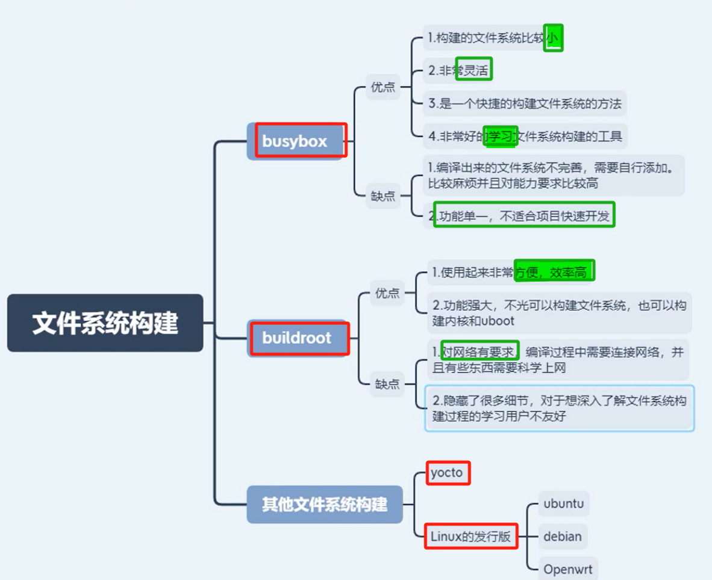

# 备注：

# 一、总结、回顾并引入其他文件系统

## 总结框图
 [10-总结、回顾并引入其他文件系统](onenote:https://d.docs.live.net/52d4b76bb0ffcf51/Documents/\(RK3568\)Linux驱动开发/文件系统构建_基于RK3568.one#10-总结、回顾并引入其他文件系统&section-id={D274A68A-A696-4F4A-B6FE-98047B597794}&page-id={364297E6-6EE2-48E5-BA90-E4C145CB79E3}&end)  ([Web 视图](https://onedrive.live.com/view.aspx?resid=52D4B76BB0FFCF51%21se8c325913f784bf694d429e5ee2ab2be&id=documents&wd=target%28%E6%96%87%E4%BB%B6%E7%B3%BB%E7%BB%9F%E6%9E%84%E5%BB%BA_%E5%9F%BA%E4%BA%8ERK3568.one%7CD274A68A-A696-4F4A-B6FE-98047B597794%2F10-%E6%80%BB%E7%BB%93%E3%80%81%E5%9B%9E%E9%A1%BE%E5%B9%B6%E5%BC%95%E5%85%A5%E5%85%B6%E4%BB%96%E6%96%87%E4%BB%B6%E7%B3%BB%E7%BB%9F%7C364297E6-6EE2-48E5-BA90-E4C145CB79E3%2F%29))

# 二、报错与解决

## 1、libstdc++.so.6报错
[“libstdc++.so.6报错”页上的图片](onenote:https://d.docs.live.net/52d4b76bb0ffcf51/Documents/\(RK3568\)Linux驱动开发/文件系统构建_基于RK3568.one#libstdc++.so.6报错&section-id={D274A68A-A696-4F4A-B6FE-98047B597794}&page-id={AF87356B-605E-4619-870C-9EC498BB7905}&object-id={A2BBCEAC-DCAD-4DCE-92AD-ECCE20978112}&4C)  ([Web 视图](https://onedrive.live.com/view.aspx?resid=52D4B76BB0FFCF51%21se8c325913f784bf694d429e5ee2ab2be&id=documents&wd=target%28%E6%96%87%E4%BB%B6%E7%B3%BB%E7%BB%9F%E6%9E%84%E5%BB%BA_%E5%9F%BA%E4%BA%8ERK3568.one%7CD274A68A-A696-4F4A-B6FE-98047B597794%2Flibstdc%2B%2B.so.6%E6%8A%A5%E9%94%99%7CAF87356B-605E-4619-870C-9EC498BB7905%2F%29&wdpartid=%7b0C4F91C7-F0CC-4DE9-95DF-AEA5CAF03ECC%7d%7b1%7d&wdsectionfileid=52D4B76BB0FFCF51!s3210484a72894f69a6a7a2deed6a881c))

## 2、

## 3、

## 4、

## 5、

