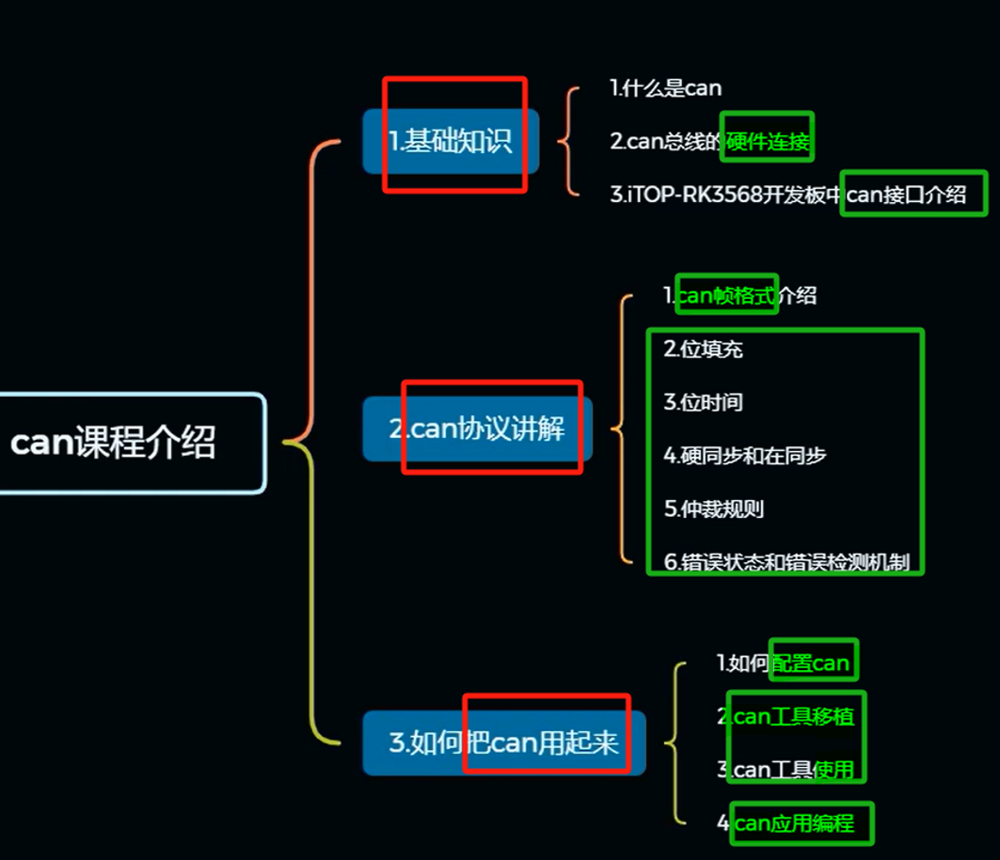

# 备注(声明)：

# 一、基础知识 - 两根线

## can基础知识
### 1 、can 介绍
[“1.can基础知识”页上的图片](onenote:https://d.docs.live.net/52d4b76bb0ffcf51/Documents/\(RK3568\)Linux驱动开发/第二十一期_CAN.one#1.can基础知识&section-id={3E3C5C7E-6AAD-42D9-8C3C-1A10B95E5E78}&page-id={3AA96842-5D45-4C49-B0DB-56052DBDCBB1}&object-id={3A89F7F6-C130-080C-0B9E-B5698F0C8795}&37)  ([Web 视图](https://onedrive.live.com/view.aspx?resid=52D4B76BB0FFCF51%21se8c325913f784bf694d429e5ee2ab2be&id=documents&wd=target%28%E7%AC%AC%E4%BA%8C%E5%8D%81%E4%B8%80%E6%9C%9F_CAN.one%7C3E3C5C7E-6AAD-42D9-8C3C-1A10B95E5E78%2F1.can%E5%9F%BA%E7%A1%80%E7%9F%A5%E8%AF%86%7C3AA96842-5D45-4C49-B0DB-56052DBDCBB1%2F%29&wdpartid=%7b34D600B3-CEFB-4968-9D04-BB91F68B4FE3%7d%7b1%7d&wdsectionfileid=52D4B76BB0FFCF51!s61ee53f41ca34280abc336f967164858))

- 1 只讨论经典can里面的高速can。可以实现多主控之间互相通讯。

### 2 、can 的硬件连接 - can控制器和can收发器
[“1.can基础知识”页上的图片](onenote:https://d.docs.live.net/52d4b76bb0ffcf51/Documents/\(RK3568\)Linux驱动开发/第二十一期_CAN.one#1.can基础知识&section-id={3E3C5C7E-6AAD-42D9-8C3C-1A10B95E5E78}&page-id={3AA96842-5D45-4C49-B0DB-56052DBDCBB1}&object-id={3A89F7F6-C130-080C-0B9E-B5698F0C8795}&89)  ([Web 视图](https://onedrive.live.com/view.aspx?resid=52D4B76BB0FFCF51%21se8c325913f784bf694d429e5ee2ab2be&id=documents&wd=target%28%E7%AC%AC%E4%BA%8C%E5%8D%81%E4%B8%80%E6%9C%9F_CAN.one%7C3E3C5C7E-6AAD-42D9-8C3C-1A10B95E5E78%2F1.can%E5%9F%BA%E7%A1%80%E7%9F%A5%E8%AF%86%7C3AA96842-5D45-4C49-B0DB-56052DBDCBB1%2F%29&wdpartid=%7b34D600B3-CEFB-4968-9D04-BB91F68B4FE3%7d%7b1%7d&wdsectionfileid=52D4B76BB0FFCF51!s61ee53f41ca34280abc336f967164858))

### 3 、电气属性 - 差分信号
[“1.can基础知识”页上的图片](onenote:https://d.docs.live.net/52d4b76bb0ffcf51/Documents/\(RK3568\)Linux驱动开发/第二十一期_CAN.one#1.can基础知识&section-id={3E3C5C7E-6AAD-42D9-8C3C-1A10B95E5E78}&page-id={3AA96842-5D45-4C49-B0DB-56052DBDCBB1}&object-id={3A89F7F6-C130-080C-0B9E-B5698F0C8795}&A0)  ([Web 视图](https://onedrive.live.com/view.aspx?resid=52D4B76BB0FFCF51%21se8c325913f784bf694d429e5ee2ab2be&id=documents&wd=target%28%E7%AC%AC%E4%BA%8C%E5%8D%81%E4%B8%80%E6%9C%9F_CAN.one%7C3E3C5C7E-6AAD-42D9-8C3C-1A10B95E5E78%2F1.can%E5%9F%BA%E7%A1%80%E7%9F%A5%E8%AF%86%7C3AA96842-5D45-4C49-B0DB-56052DBDCBB1%2F%29&wdpartid=%7b34D600B3-CEFB-4968-9D04-BB91F68B4FE3%7d%7b1%7d&wdsectionfileid=52D4B76BB0FFCF51!s61ee53f41ca34280abc336f967164858))

### 4 、

## iTOP-RK3568开发板can接口介绍
### 1 、can接口实物图
[“2.iTOP-RK3568开发板can接口介绍”页上的图片](onenote:https://d.docs.live.net/52d4b76bb0ffcf51/Documents/\(RK3568\)Linux驱动开发/第二十一期_CAN.one#2.iTOP-RK3568开发板can接口介绍&section-id={3E3C5C7E-6AAD-42D9-8C3C-1A10B95E5E78}&page-id={BBBC46AB-54D8-433C-95B2-D1998DC993A1}&object-id={129CBB9C-B9E9-0775-2A4C-E368DB82D909}&1C)  ([Web 视图](https://onedrive.live.com/view.aspx?resid=52D4B76BB0FFCF51%21se8c325913f784bf694d429e5ee2ab2be&id=documents&wd=target%28%E7%AC%AC%E4%BA%8C%E5%8D%81%E4%B8%80%E6%9C%9F_CAN.one%7C3E3C5C7E-6AAD-42D9-8C3C-1A10B95E5E78%2F2.iTOP-RK3568%E5%BC%80%E5%8F%91%E6%9D%BFcan%E6%8E%A5%E5%8F%A3%E4%BB%8B%E7%BB%8D%7CBBBC46AB-54D8-433C-95B2-D1998DC993A1%2F%29&wdpartid=%7b87D4463A-FBFF-477E-9A04-94BE001F43F9%7d%7b1%7d&wdsectionfileid=52D4B76BB0FFCF51!s61ee53f41ca34280abc336f967164858))

[“2.iTOP-RK3568开发板can接口介绍”页上的图片](onenote:https://d.docs.live.net/52d4b76bb0ffcf51/Documents/\(RK3568\)Linux驱动开发/第二十一期_CAN.one#2.iTOP-RK3568开发板can接口介绍&section-id={3E3C5C7E-6AAD-42D9-8C3C-1A10B95E5E78}&page-id={BBBC46AB-54D8-433C-95B2-D1998DC993A1}&object-id={129CBB9C-B9E9-0775-2A4C-E368DB82D909}&67)  ([Web 视图](https://onedrive.live.com/view.aspx?resid=52D4B76BB0FFCF51%21se8c325913f784bf694d429e5ee2ab2be&id=documents&wd=target%28%E7%AC%AC%E4%BA%8C%E5%8D%81%E4%B8%80%E6%9C%9F_CAN.one%7C3E3C5C7E-6AAD-42D9-8C3C-1A10B95E5E78%2F2.iTOP-RK3568%E5%BC%80%E5%8F%91%E6%9D%BFcan%E6%8E%A5%E5%8F%A3%E4%BB%8B%E7%BB%8D%7CBBBC46AB-54D8-433C-95B2-D1998DC993A1%2F%29&wdpartid=%7b87D4463A-FBFF-477E-9A04-94BE001F43F9%7d%7b1%7d&wdsectionfileid=52D4B76BB0FFCF51!s61ee53f41ca34280abc336f967164858))
### 2 、can接口原理图
[“2.iTOP-RK3568开发板can接口介绍”页上的图片](onenote:https://d.docs.live.net/52d4b76bb0ffcf51/Documents/\(RK3568\)Linux驱动开发/第二十一期_CAN.one#2.iTOP-RK3568开发板can接口介绍&section-id={3E3C5C7E-6AAD-42D9-8C3C-1A10B95E5E78}&page-id={BBBC46AB-54D8-433C-95B2-D1998DC993A1}&object-id={129CBB9C-B9E9-0775-2A4C-E368DB82D909}&4D)  ([Web 视图](https://onedrive.live.com/view.aspx?resid=52D4B76BB0FFCF51%21se8c325913f784bf694d429e5ee2ab2be&id=documents&wd=target%28%E7%AC%AC%E4%BA%8C%E5%8D%81%E4%B8%80%E6%9C%9F_CAN.one%7C3E3C5C7E-6AAD-42D9-8C3C-1A10B95E5E78%2F2.iTOP-RK3568%E5%BC%80%E5%8F%91%E6%9D%BFcan%E6%8E%A5%E5%8F%A3%E4%BB%8B%E7%BB%8D%7CBBBC46AB-54D8-433C-95B2-D1998DC993A1%2F%29&wdpartid=%7b87D4463A-FBFF-477E-9A04-94BE001F43F9%7d%7b1%7d&wdsectionfileid=52D4B76BB0FFCF51!s61ee53f41ca34280abc336f967164858))

### 3 、CAN收发器特点
[“2.iTOP-RK3568开发板can接口介绍”页上的图片](onenote:https://d.docs.live.net/52d4b76bb0ffcf51/Documents/\(RK3568\)Linux驱动开发/第二十一期_CAN.one#2.iTOP-RK3568开发板can接口介绍&section-id={3E3C5C7E-6AAD-42D9-8C3C-1A10B95E5E78}&page-id={BBBC46AB-54D8-433C-95B2-D1998DC993A1}&object-id={492E6896-6360-01EB-2FE3-025FE46F5823}&12)  ([Web 视图](https://onedrive.live.com/view.aspx?resid=52D4B76BB0FFCF51%21se8c325913f784bf694d429e5ee2ab2be&id=documents&wd=target%28%E7%AC%AC%E4%BA%8C%E5%8D%81%E4%B8%80%E6%9C%9F_CAN.one%7C3E3C5C7E-6AAD-42D9-8C3C-1A10B95E5E78%2F2.iTOP-RK3568%E5%BC%80%E5%8F%91%E6%9D%BFcan%E6%8E%A5%E5%8F%A3%E4%BB%8B%E7%BB%8D%7CBBBC46AB-54D8-433C-95B2-D1998DC993A1%2F%29&wdpartid=%7b87D4463A-FBFF-477E-9A04-94BE001F43F9%7d%7b1%7d&wdsectionfileid=52D4B76BB0FFCF51!s61ee53f41ca34280abc336f967164858))

### 4 、CAN收发器引脚解析
[“2.iTOP-RK3568开发板can接口介绍”页上的图片](onenote:https://d.docs.live.net/52d4b76bb0ffcf51/Documents/\(RK3568\)Linux驱动开发/第二十一期_CAN.one#2.iTOP-RK3568开发板can接口介绍&section-id={3E3C5C7E-6AAD-42D9-8C3C-1A10B95E5E78}&page-id={BBBC46AB-54D8-433C-95B2-D1998DC993A1}&object-id={492E6896-6360-01EB-2FE3-025FE46F5823}&1D)  ([Web 视图](https://onedrive.live.com/view.aspx?resid=52D4B76BB0FFCF51%21se8c325913f784bf694d429e5ee2ab2be&id=documents&wd=target%28%E7%AC%AC%E4%BA%8C%E5%8D%81%E4%B8%80%E6%9C%9F_CAN.one%7C3E3C5C7E-6AAD-42D9-8C3C-1A10B95E5E78%2F2.iTOP-RK3568%E5%BC%80%E5%8F%91%E6%9D%BFcan%E6%8E%A5%E5%8F%A3%E4%BB%8B%E7%BB%8D%7CBBBC46AB-54D8-433C-95B2-D1998DC993A1%2F%29&wdpartid=%7b87D4463A-FBFF-477E-9A04-94BE001F43F9%7d%7b1%7d&wdsectionfileid=52D4B76BB0FFCF51!s61ee53f41ca34280abc336f967164858))

### 5、

# 二、can协议讲解

- 1 同学们自己读一下这个can参考资料
## can标准数据帧帧格式
### 1 、什么是数据帧? - 发送数据
[“3.can标准数据帧帧格式”页上的图片](onenote:https://d.docs.live.net/52d4b76bb0ffcf51/Documents/\(RK3568\)Linux驱动开发/第二十一期_CAN.one#3.can标准数据帧帧格式&section-id={3E3C5C7E-6AAD-42D9-8C3C-1A10B95E5E78}&page-id={9EA40995-9371-4BD0-988E-FC3A8711829C}&object-id={877E74A2-5DBE-0656-3BDC-19FB08A18047}&2F)  ([Web 视图](https://onedrive.live.com/view.aspx?resid=52D4B76BB0FFCF51%21se8c325913f784bf694d429e5ee2ab2be&id=documents&wd=target%28%E7%AC%AC%E4%BA%8C%E5%8D%81%E4%B8%80%E6%9C%9F_CAN.one%7C3E3C5C7E-6AAD-42D9-8C3C-1A10B95E5E78%2F3.can%E6%A0%87%E5%87%86%E6%95%B0%E6%8D%AE%E5%B8%A7%E5%B8%A7%E6%A0%BC%E5%BC%8F%7C9EA40995-9371-4BD0-988E-FC3A8711829C%2F%29&wdpartid=%7bC43F7964-A630-4BCE-BD3E-3E4126436F07%7d%7b1%7d&wdsectionfileid=52D4B76BB0FFCF51!s61ee53f41ca34280abc336f967164858))

### 2 、数据帧的种类 - 扩展和标准
[“3.can标准数据帧帧格式”页上的图片](onenote:https://d.docs.live.net/52d4b76bb0ffcf51/Documents/\(RK3568\)Linux驱动开发/第二十一期_CAN.one#3.can标准数据帧帧格式&section-id={3E3C5C7E-6AAD-42D9-8C3C-1A10B95E5E78}&page-id={9EA40995-9371-4BD0-988E-FC3A8711829C}&object-id={877E74A2-5DBE-0656-3BDC-19FB08A18047}&2F)  ([Web 视图](https://onedrive.live.com/view.aspx?resid=52D4B76BB0FFCF51%21se8c325913f784bf694d429e5ee2ab2be&id=documents&wd=target%28%E7%AC%AC%E4%BA%8C%E5%8D%81%E4%B8%80%E6%9C%9F_CAN.one%7C3E3C5C7E-6AAD-42D9-8C3C-1A10B95E5E78%2F3.can%E6%A0%87%E5%87%86%E6%95%B0%E6%8D%AE%E5%B8%A7%E5%B8%A7%E6%A0%BC%E5%BC%8F%7C9EA40995-9371-4BD0-988E-FC3A8711829C%2F%29&wdpartid=%7bC43F7964-A630-4BCE-BD3E-3E4126436F07%7d%7b1%7d&wdsectionfileid=52D4B76BB0FFCF51!s61ee53f41ca34280abc336f967164858))

### 3 、标准数据帧格式 - 7个位场
[“3.can标准数据帧帧格式”页上的图片](onenote:https://d.docs.live.net/52d4b76bb0ffcf51/Documents/\(RK3568\)Linux驱动开发/第二十一期_CAN.one#3.can标准数据帧帧格式&section-id={3E3C5C7E-6AAD-42D9-8C3C-1A10B95E5E78}&page-id={9EA40995-9371-4BD0-988E-FC3A8711829C}&object-id={877E74A2-5DBE-0656-3BDC-19FB08A18047}&39)  ([Web 视图](https://onedrive.live.com/view.aspx?resid=52D4B76BB0FFCF51%21se8c325913f784bf694d429e5ee2ab2be&id=documents&wd=target%28%E7%AC%AC%E4%BA%8C%E5%8D%81%E4%B8%80%E6%9C%9F_CAN.one%7C3E3C5C7E-6AAD-42D9-8C3C-1A10B95E5E78%2F3.can%E6%A0%87%E5%87%86%E6%95%B0%E6%8D%AE%E5%B8%A7%E5%B8%A7%E6%A0%BC%E5%BC%8F%7C9EA40995-9371-4BD0-988E-FC3A8711829C%2F%29&wdpartid=%7bC43F7964-A630-4BCE-BD3E-3E4126436F07%7d%7b1%7d&wdsectionfileid=52D4B76BB0FFCF51!s61ee53f41ca34280abc336f967164858))

### 4 、标准数据帧分析
[“3.can标准数据帧帧格式”页上的图片](onenote:https://d.docs.live.net/52d4b76bb0ffcf51/Documents/\(RK3568\)Linux驱动开发/第二十一期_CAN.one#3.can标准数据帧帧格式&section-id={3E3C5C7E-6AAD-42D9-8C3C-1A10B95E5E78}&page-id={9EA40995-9371-4BD0-988E-FC3A8711829C}&object-id={877E74A2-5DBE-0656-3BDC-19FB08A18047}&BE)  ([Web 视图](https://onedrive.live.com/view.aspx?resid=52D4B76BB0FFCF51%21se8c325913f784bf694d429e5ee2ab2be&id=documents&wd=target%28%E7%AC%AC%E4%BA%8C%E5%8D%81%E4%B8%80%E6%9C%9F_CAN.one%7C3E3C5C7E-6AAD-42D9-8C3C-1A10B95E5E78%2F3.can%E6%A0%87%E5%87%86%E6%95%B0%E6%8D%AE%E5%B8%A7%E5%B8%A7%E6%A0%BC%E5%BC%8F%7C9EA40995-9371-4BD0-988E-FC3A8711829C%2F%29&wdpartid=%7bC43F7964-A630-4BCE-BD3E-3E4126436F07%7d%7b1%7d&wdsectionfileid=52D4B76BB0FFCF51!s61ee53f41ca34280abc336f967164858))

- 1 RTR--->数据帧/遥控帧(1)          PB0 保留位
- 1 IDE---->标准/扩展(1)

### 5、

## can扩展数据帧帧格式
### 1 、为什么会有扩展数据帧?- 扩展ID位
[“4.can扩展数据帧帧格式”页上的图片](onenote:https://d.docs.live.net/52d4b76bb0ffcf51/Documents/\(RK3568\)Linux驱动开发/第二十一期_CAN.one#4.can扩展数据帧帧格式&section-id={3E3C5C7E-6AAD-42D9-8C3C-1A10B95E5E78}&page-id={5A350859-2D1F-4557-9D7D-181643C23923}&object-id={03E4F875-DA9F-06DB-3546-7BAEEEB1CE65}&14)  ([Web 视图](https://onedrive.live.com/view.aspx?resid=52D4B76BB0FFCF51%21se8c325913f784bf694d429e5ee2ab2be&id=documents&wd=target%28%E7%AC%AC%E4%BA%8C%E5%8D%81%E4%B8%80%E6%9C%9F_CAN.one%7C3E3C5C7E-6AAD-42D9-8C3C-1A10B95E5E78%2F4.can%E6%89%A9%E5%B1%95%E6%95%B0%E6%8D%AE%E5%B8%A7%E5%B8%A7%E6%A0%BC%E5%BC%8F%7C5A350859-2D1F-4557-9D7D-181643C23923%2F%29&wdpartid=%7b6C7F0DF9-14BA-406B-9C5A-F3B0ECE8CDEC%7d%7b1%7d&wdsectionfileid=52D4B76BB0FFCF51!s61ee53f41ca34280abc336f967164858))

### 2 、与标准数据帧对比分析
[“4.can扩展数据帧帧格式”页上的图片](onenote:https://d.docs.live.net/52d4b76bb0ffcf51/Documents/\(RK3568\)Linux驱动开发/第二十一期_CAN.one#4.can扩展数据帧帧格式&section-id={3E3C5C7E-6AAD-42D9-8C3C-1A10B95E5E78}&page-id={5A350859-2D1F-4557-9D7D-181643C23923}&object-id={8C8BA1E2-F88A-06C0-2497-205D2103C46B}&1E)  ([Web 视图](https://onedrive.live.com/view.aspx?resid=52D4B76BB0FFCF51%21se8c325913f784bf694d429e5ee2ab2be&id=documents&wd=target%28%E7%AC%AC%E4%BA%8C%E5%8D%81%E4%B8%80%E6%9C%9F_CAN.one%7C3E3C5C7E-6AAD-42D9-8C3C-1A10B95E5E78%2F4.can%E6%89%A9%E5%B1%95%E6%95%B0%E6%8D%AE%E5%B8%A7%E5%B8%A7%E6%A0%BC%E5%BC%8F%7C5A350859-2D1F-4557-9D7D-181643C23923%2F%29&wdpartid=%7b6C7F0DF9-14BA-406B-9C5A-F3B0ECE8CDEC%7d%7b1%7d&wdsectionfileid=52D4B76BB0FFCF51!s61ee53f41ca34280abc336f967164858))

### 3 、扩展数据帧分析
[“4.can扩展数据帧帧格式”页上的图片](onenote:https://d.docs.live.net/52d4b76bb0ffcf51/Documents/\(RK3568\)Linux驱动开发/第二十一期_CAN.one#4.can扩展数据帧帧格式&section-id={3E3C5C7E-6AAD-42D9-8C3C-1A10B95E5E78}&page-id={5A350859-2D1F-4557-9D7D-181643C23923}&object-id={8C8BA1E2-F88A-06C0-2497-205D2103C46B}&29)  ([Web 视图](https://onedrive.live.com/view.aspx?resid=52D4B76BB0FFCF51%21se8c325913f784bf694d429e5ee2ab2be&id=documents&wd=target%28%E7%AC%AC%E4%BA%8C%E5%8D%81%E4%B8%80%E6%9C%9F_CAN.one%7C3E3C5C7E-6AAD-42D9-8C3C-1A10B95E5E78%2F4.can%E6%89%A9%E5%B1%95%E6%95%B0%E6%8D%AE%E5%B8%A7%E5%B8%A7%E6%A0%BC%E5%BC%8F%7C5A350859-2D1F-4557-9D7D-181643C23923%2F%29&wdpartid=%7b6C7F0DF9-14BA-406B-9C5A-F3B0ECE8CDEC%7d%7b1%7d&wdsectionfileid=52D4B76BB0FFCF51!s61ee53f41ca34280abc336f967164858))

- 1 PB0 ,PB1保留位、
### 4 、

## can遥控帧帧格式
### 1 、遥控帧 - 主动请求数据
[“5.can遥控帧帧格式”页上的图片](onenote:https://d.docs.live.net/52d4b76bb0ffcf51/Documents/\(RK3568\)Linux驱动开发/第二十一期_CAN.one#5.can遥控帧帧格式&section-id={3E3C5C7E-6AAD-42D9-8C3C-1A10B95E5E78}&page-id={5648F7FA-484B-4DC2-A7A9-934B308754AC}&object-id={0BBDBC2E-BB63-03F8-0045-5B7A5F2913C8}&A8)  ([Web 视图](https://onedrive.live.com/view.aspx?resid=52D4B76BB0FFCF51%21se8c325913f784bf694d429e5ee2ab2be&id=documents&wd=target%28%E7%AC%AC%E4%BA%8C%E5%8D%81%E4%B8%80%E6%9C%9F_CAN.one%7C3E3C5C7E-6AAD-42D9-8C3C-1A10B95E5E78%2F5.can%E9%81%A5%E6%8E%A7%E5%B8%A7%E5%B8%A7%E6%A0%BC%E5%BC%8F%7C5648F7FA-484B-4DC2-A7A9-934B308754AC%2F%29&wdpartid=%7b33D7193B-6D74-4BC7-9BCC-96388E11E226%7d%7b1%7d&wdsectionfileid=52D4B76BB0FFCF51!s61ee53f41ca34280abc336f967164858))

### 2 、遥控帧帧格式 - 去掉数据段
[“5.can遥控帧帧格式”页上的图片](onenote:https://d.docs.live.net/52d4b76bb0ffcf51/Documents/\(RK3568\)Linux驱动开发/第二十一期_CAN.one#5.can遥控帧帧格式&section-id={3E3C5C7E-6AAD-42D9-8C3C-1A10B95E5E78}&page-id={5648F7FA-484B-4DC2-A7A9-934B308754AC}&object-id={0BBDBC2E-BB63-03F8-0045-5B7A5F2913C8}&B3)  ([Web 视图](https://onedrive.live.com/view.aspx?resid=52D4B76BB0FFCF51%21se8c325913f784bf694d429e5ee2ab2be&id=documents&wd=target%28%E7%AC%AC%E4%BA%8C%E5%8D%81%E4%B8%80%E6%9C%9F_CAN.one%7C3E3C5C7E-6AAD-42D9-8C3C-1A10B95E5E78%2F5.can%E9%81%A5%E6%8E%A7%E5%B8%A7%E5%B8%A7%E6%A0%BC%E5%BC%8F%7C5648F7FA-484B-4DC2-A7A9-934B308754AC%2F%29&wdpartid=%7b33D7193B-6D74-4BC7-9BCC-96388E11E226%7d%7b1%7d&wdsectionfileid=52D4B76BB0FFCF51!s61ee53f41ca34280abc336f967164858))

### 3 、与标准数据帧对比分析
[“5.can遥控帧帧格式”页上的图片](onenote:https://d.docs.live.net/52d4b76bb0ffcf51/Documents/\(RK3568\)Linux驱动开发/第二十一期_CAN.one#5.can遥控帧帧格式&section-id={3E3C5C7E-6AAD-42D9-8C3C-1A10B95E5E78}&page-id={5648F7FA-484B-4DC2-A7A9-934B308754AC}&object-id={0BBDBC2E-BB63-03F8-0045-5B7A5F2913C8}&BE)  ([Web 视图](https://onedrive.live.com/view.aspx?resid=52D4B76BB0FFCF51%21se8c325913f784bf694d429e5ee2ab2be&id=documents&wd=target%28%E7%AC%AC%E4%BA%8C%E5%8D%81%E4%B8%80%E6%9C%9F_CAN.one%7C3E3C5C7E-6AAD-42D9-8C3C-1A10B95E5E78%2F5.can%E9%81%A5%E6%8E%A7%E5%B8%A7%E5%B8%A7%E6%A0%BC%E5%BC%8F%7C5648F7FA-484B-4DC2-A7A9-934B308754AC%2F%29&wdpartid=%7b33D7193B-6D74-4BC7-9BCC-96388E11E226%7d%7b1%7d&wdsectionfileid=52D4B76BB0FFCF51!s61ee53f41ca34280abc336f967164858))
### 4 、

## can错误帧-过载帧-帧间隔帧格式
### 1 、错误帧帧格式 - 告知错误
[“6.can错误帧-过载帧-帧间隔帧格式”页上的图片](onenote:https://d.docs.live.net/52d4b76bb0ffcf51/Documents/\(RK3568\)Linux驱动开发/第二十一期_CAN.one#6.can错误帧-过载帧-帧间隔帧格式&section-id={3E3C5C7E-6AAD-42D9-8C3C-1A10B95E5E78}&page-id={C2CA59DD-FE8F-4E0F-B581-452C29D73033}&object-id={AA8DD5CA-4CA9-09CE-2B9A-27C94E4CFEBF}&17)  ([Web 视图](https://onedrive.live.com/view.aspx?resid=52D4B76BB0FFCF51%21se8c325913f784bf694d429e5ee2ab2be&id=documents&wd=target%28%E7%AC%AC%E4%BA%8C%E5%8D%81%E4%B8%80%E6%9C%9F_CAN.one%7C3E3C5C7E-6AAD-42D9-8C3C-1A10B95E5E78%2F6.can%E9%94%99%E8%AF%AF%E5%B8%A7-%E8%BF%87%E8%BD%BD%E5%B8%A7-%E5%B8%A7%E9%97%B4%E9%9A%94%E5%B8%A7%E6%A0%BC%E5%BC%8F%7CC2CA59DD-FE8F-4E0F-B581-452C29D73033%2F%29&wdpartid=%7b9078FEC2-FA59-4974-8968-47B63F874002%7d%7b1%7d&wdsectionfileid=52D4B76BB0FFCF51!s61ee53f41ca34280abc336f967164858))

- 1 在接收或者发送数据的时候产生的
### 2 、过载帧帧格式- 提示延时发送
[“6.can错误帧-过载帧-帧间隔帧格式”页上的图片](onenote:https://d.docs.live.net/52d4b76bb0ffcf51/Documents/\(RK3568\)Linux驱动开发/第二十一期_CAN.one#6.can错误帧-过载帧-帧间隔帧格式&section-id={3E3C5C7E-6AAD-42D9-8C3C-1A10B95E5E78}&page-id={C2CA59DD-FE8F-4E0F-B581-452C29D73033}&object-id={AA8DD5CA-4CA9-09CE-2B9A-27C94E4CFEBF}&39)  ([Web 视图](https://onedrive.live.com/view.aspx?resid=52D4B76BB0FFCF51%21se8c325913f784bf694d429e5ee2ab2be&id=documents&wd=target%28%E7%AC%AC%E4%BA%8C%E5%8D%81%E4%B8%80%E6%9C%9F_CAN.one%7C3E3C5C7E-6AAD-42D9-8C3C-1A10B95E5E78%2F6.can%E9%94%99%E8%AF%AF%E5%B8%A7-%E8%BF%87%E8%BD%BD%E5%B8%A7-%E5%B8%A7%E9%97%B4%E9%9A%94%E5%B8%A7%E6%A0%BC%E5%BC%8F%7CC2CA59DD-FE8F-4E0F-B581-452C29D73033%2F%29&wdpartid=%7b9078FEC2-FA59-4974-8968-47B63F874002%7d%7b1%7d&wdsectionfileid=52D4B76BB0FFCF51!s61ee53f41ca34280abc336f967164858))

- 1 一般是在总线空闲状态时发出的
### 3 、帧间隔 - 分隔数据帧和遥控帧
[“6.can错误帧-过载帧-帧间隔帧格式”页上的图片](onenote:https://d.docs.live.net/52d4b76bb0ffcf51/Documents/\(RK3568\)Linux驱动开发/第二十一期_CAN.one#6.can错误帧-过载帧-帧间隔帧格式&section-id={3E3C5C7E-6AAD-42D9-8C3C-1A10B95E5E78}&page-id={C2CA59DD-FE8F-4E0F-B581-452C29D73033}&object-id={AA8DD5CA-4CA9-09CE-2B9A-27C94E4CFEBF}&6B)  ([Web 视图](https://onedrive.live.com/view.aspx?resid=52D4B76BB0FFCF51%21se8c325913f784bf694d429e5ee2ab2be&id=documents&wd=target%28%E7%AC%AC%E4%BA%8C%E5%8D%81%E4%B8%80%E6%9C%9F_CAN.one%7C3E3C5C7E-6AAD-42D9-8C3C-1A10B95E5E78%2F6.can%E9%94%99%E8%AF%AF%E5%B8%A7-%E8%BF%87%E8%BD%BD%E5%B8%A7-%E5%B8%A7%E9%97%B4%E9%9A%94%E5%B8%A7%E6%A0%BC%E5%BC%8F%7CC2CA59DD-FE8F-4E0F-B581-452C29D73033%2F%29&wdpartid=%7b9078FEC2-FA59-4974-8968-47B63F874002%7d%7b1%7d&wdsectionfileid=52D4B76BB0FFCF51!s61ee53f41ca34280abc336f967164858))

### 4 、

## 位填充
### 1 、填充规则 - 5同加反一
[“7.位填充”页上的图片](onenote:https://d.docs.live.net/52d4b76bb0ffcf51/Documents/\(RK3568\)Linux驱动开发/第二十一期_CAN.one#7.位填充&section-id={3E3C5C7E-6AAD-42D9-8C3C-1A10B95E5E78}&page-id={74798A73-5C5B-45B8-9445-706153C4BC37}&object-id={2AC12A76-B71D-02BD-02ED-8A20004B876B}&14)  ([Web 视图](https://onedrive.live.com/view.aspx?resid=52D4B76BB0FFCF51%21se8c325913f784bf694d429e5ee2ab2be&id=documents&wd=target%28%E7%AC%AC%E4%BA%8C%E5%8D%81%E4%B8%80%E6%9C%9F_CAN.one%7C3E3C5C7E-6AAD-42D9-8C3C-1A10B95E5E78%2F7.%E4%BD%8D%E5%A1%AB%E5%85%85%7C74798A73-5C5B-45B8-9445-706153C4BC37%2F%29&wdpartid=%7bE096CD70-A0E5-4CA9-82B9-B93531B38844%7d%7b1%7d&wdsectionfileid=52D4B76BB0FFCF51!s61ee53f41ca34280abc336f967164858))

### 2 、位填充作用
[那是不是很容易就跟错误帧搞混呀](onenote:https://d.docs.live.net/52d4b76bb0ffcf51/Documents/\(RK3568\)Linux驱动开发/第二十一期_CAN.one#7.位填充&section-id={3E3C5C7E-6AAD-42D9-8C3C-1A10B95E5E78}&page-id={74798A73-5C5B-45B8-9445-706153C4BC37}&object-id={2AC12A76-B71D-02BD-02ED-8A20004B876B}&3D)  ([Web 视图](https://onedrive.live.com/view.aspx?resid=52D4B76BB0FFCF51%21se8c325913f784bf694d429e5ee2ab2be&id=documents&wd=target%28%E7%AC%AC%E4%BA%8C%E5%8D%81%E4%B8%80%E6%9C%9F_CAN.one%7C3E3C5C7E-6AAD-42D9-8C3C-1A10B95E5E78%2F7.%E4%BD%8D%E5%A1%AB%E5%85%85%7C74798A73-5C5B-45B8-9445-706153C4BC37%2F%29&wdpartid=%7bE096CD70-A0E5-4CA9-82B9-B93531B38844%7d%7b1%7d&wdsectionfileid=52D4B76BB0FFCF51!s61ee53f41ca34280abc336f967164858))

### 3 、举例
[“7.位填充”页上的图片](onenote:https://d.docs.live.net/52d4b76bb0ffcf51/Documents/\(RK3568\)Linux驱动开发/第二十一期_CAN.one#7.位填充&section-id={3E3C5C7E-6AAD-42D9-8C3C-1A10B95E5E78}&page-id={74798A73-5C5B-45B8-9445-706153C4BC37}&object-id={2AC12A76-B71D-02BD-02ED-8A20004B876B}&5A)  ([Web 视图](https://onedrive.live.com/view.aspx?resid=52D4B76BB0FFCF51%21se8c325913f784bf694d429e5ee2ab2be&id=documents&wd=target%28%E7%AC%AC%E4%BA%8C%E5%8D%81%E4%B8%80%E6%9C%9F_CAN.one%7C3E3C5C7E-6AAD-42D9-8C3C-1A10B95E5E78%2F7.%E4%BD%8D%E5%A1%AB%E5%85%85%7C74798A73-5C5B-45B8-9445-706153C4BC37%2F%29&wdpartid=%7bE096CD70-A0E5-4CA9-82B9-B93531B38844%7d%7b1%7d&wdsectionfileid=52D4B76BB0FFCF51!s61ee53f41ca34280abc336f967164858))

### 4 、

## 硬同步和再同步
### 1 、硬件同步- 检测出帧起始而进行的同步调整
[“10.硬同步和再同步”页上的图片](onenote:https://d.docs.live.net/52d4b76bb0ffcf51/Documents/\(RK3568\)Linux驱动开发/第二十一期_CAN.one#10.硬同步和再同步&section-id={3E3C5C7E-6AAD-42D9-8C3C-1A10B95E5E78}&page-id={B2DEF7B9-CDDD-4D35-9C11-951CDD45B416}&object-id={6A961206-248D-0EAA-17E0-4F75E0FE8EBA}&14)  ([Web 视图](https://onedrive.live.com/view.aspx?resid=52D4B76BB0FFCF51%21se8c325913f784bf694d429e5ee2ab2be&id=documents&wd=target%28%E7%AC%AC%E4%BA%8C%E5%8D%81%E4%B8%80%E6%9C%9F_CAN.one%7C3E3C5C7E-6AAD-42D9-8C3C-1A10B95E5E78%2F10.%E7%A1%AC%E5%90%8C%E6%AD%A5%E5%92%8C%E5%86%8D%E5%90%8C%E6%AD%A5%7CB2DEF7B9-CDDD-4D35-9C11-951CDD45B416%2F%29&wdpartid=%7b1BD4000B-C242-4A36-BD0C-3DC6A8C75D25%7d%7b1%7d&wdsectionfileid=52D4B76BB0FFCF51!s61ee53f41ca34280abc336f967164858))

### 2 、再同步 - 检测出边沿时，根据 SJW 值加长 PBS1 段，或缩短 PBS2 段，以调整同步。
[“10.硬同步和再同步”页上的图片](onenote:https://d.docs.live.net/52d4b76bb0ffcf51/Documents/\(RK3568\)Linux驱动开发/第二十一期_CAN.one#10.硬同步和再同步&section-id={3E3C5C7E-6AAD-42D9-8C3C-1A10B95E5E78}&page-id={B2DEF7B9-CDDD-4D35-9C11-951CDD45B416}&object-id={6A961206-248D-0EAA-17E0-4F75E0FE8EBA}&21)  ([Web 视图](https://onedrive.live.com/view.aspx?resid=52D4B76BB0FFCF51%21se8c325913f784bf694d429e5ee2ab2be&id=documents&wd=target%28%E7%AC%AC%E4%BA%8C%E5%8D%81%E4%B8%80%E6%9C%9F_CAN.one%7C3E3C5C7E-6AAD-42D9-8C3C-1A10B95E5E78%2F10.%E7%A1%AC%E5%90%8C%E6%AD%A5%E5%92%8C%E5%86%8D%E5%90%8C%E6%AD%A5%7CB2DEF7B9-CDDD-4D35-9C11-951CDD45B416%2F%29&wdpartid=%7b1BD4000B-C242-4A36-BD0C-3DC6A8C75D25%7d%7b1%7d&wdsectionfileid=52D4B76BB0FFCF51!s61ee53f41ca34280abc336f967164858))

### 3 、调整同步的规则
[“10.硬同步和再同步”页上的图片](onenote:https://d.docs.live.net/52d4b76bb0ffcf51/Documents/\(RK3568\)Linux驱动开发/第二十一期_CAN.one#10.硬同步和再同步&section-id={3E3C5C7E-6AAD-42D9-8C3C-1A10B95E5E78}&page-id={B2DEF7B9-CDDD-4D35-9C11-951CDD45B416}&object-id={6A961206-248D-0EAA-17E0-4F75E0FE8EBA}&59)  ([Web 视图](https://onedrive.live.com/view.aspx?resid=52D4B76BB0FFCF51%21se8c325913f784bf694d429e5ee2ab2be&id=documents&wd=target%28%E7%AC%AC%E4%BA%8C%E5%8D%81%E4%B8%80%E6%9C%9F_CAN.one%7C3E3C5C7E-6AAD-42D9-8C3C-1A10B95E5E78%2F10.%E7%A1%AC%E5%90%8C%E6%AD%A5%E5%92%8C%E5%86%8D%E5%90%8C%E6%AD%A5%7CB2DEF7B9-CDDD-4D35-9C11-951CDD45B416%2F%29&wdpartid=%7b1BD4000B-C242-4A36-BD0C-3DC6A8C75D25%7d%7b1%7d&wdsectionfileid=52D4B76BB0FFCF51!s61ee53f41ca34280abc336f967164858))

### 4 、

## 仲裁规则
### 1 、仲裁方式
[“11.仲裁规则”页上的图片](onenote:https://d.docs.live.net/52d4b76bb0ffcf51/Documents/\(RK3568\)Linux驱动开发/第二十一期_CAN.one#11.仲裁规则&section-id={3E3C5C7E-6AAD-42D9-8C3C-1A10B95E5E78}&page-id={06908286-6979-4D5E-88C4-EAD7F24E161A}&object-id={352266C0-924C-089D-1DDC-218B494E739B}&26)  ([Web 视图](https://onedrive.live.com/view.aspx?resid=52D4B76BB0FFCF51%21se8c325913f784bf694d429e5ee2ab2be&id=documents&wd=target%28%E7%AC%AC%E4%BA%8C%E5%8D%81%E4%B8%80%E6%9C%9F_CAN.one%7C3E3C5C7E-6AAD-42D9-8C3C-1A10B95E5E78%2F11.%E4%BB%B2%E8%A3%81%E8%A7%84%E5%88%99%7C06908286-6979-4D5E-88C4-EAD7F24E161A%2F%29&wdpartid=%7b53D1FAE7-B6AB-4025-B95E-9BD98E963A3C%7d%7b1%7d&wdsectionfileid=52D4B76BB0FFCF51!s61ee53f41ca34280abc336f967164858))

- 1 总结规则一：先来后到
### 2 、优先级的判定规则- 显性电平多的优先
[“11.仲裁规则”页上的图片](onenote:https://d.docs.live.net/52d4b76bb0ffcf51/Documents/\(RK3568\)Linux驱动开发/第二十一期_CAN.one#11.仲裁规则&section-id={3E3C5C7E-6AAD-42D9-8C3C-1A10B95E5E78}&page-id={06908286-6979-4D5E-88C4-EAD7F24E161A}&object-id={352266C0-924C-089D-1DDC-218B494E739B}&5E)  ([Web 视图](https://onedrive.live.com/view.aspx?resid=52D4B76BB0FFCF51%21se8c325913f784bf694d429e5ee2ab2be&id=documents&wd=target%28%E7%AC%AC%E4%BA%8C%E5%8D%81%E4%B8%80%E6%9C%9F_CAN.one%7C3E3C5C7E-6AAD-42D9-8C3C-1A10B95E5E78%2F11.%E4%BB%B2%E8%A3%81%E8%A7%84%E5%88%99%7C06908286-6979-4D5E-88C4-EAD7F24E161A%2F%29&wdpartid=%7b53D1FAE7-B6AB-4025-B95E-9BD98E963A3C%7d%7b1%7d&wdsectionfileid=52D4B76BB0FFCF51!s61ee53f41ca34280abc336f967164858))

### 3 、数据帧和遥控帧的仲裁过程
[“11.仲裁规则”页上的图片](onenote:https://d.docs.live.net/52d4b76bb0ffcf51/Documents/\(RK3568\)Linux驱动开发/第二十一期_CAN.one#11.仲裁规则&section-id={3E3C5C7E-6AAD-42D9-8C3C-1A10B95E5E78}&page-id={06908286-6979-4D5E-88C4-EAD7F24E161A}&object-id={352266C0-924C-089D-1DDC-218B494E739B}&72)  ([Web 视图](https://onedrive.live.com/view.aspx?resid=52D4B76BB0FFCF51%21se8c325913f784bf694d429e5ee2ab2be&id=documents&wd=target%28%E7%AC%AC%E4%BA%8C%E5%8D%81%E4%B8%80%E6%9C%9F_CAN.one%7C3E3C5C7E-6AAD-42D9-8C3C-1A10B95E5E78%2F11.%E4%BB%B2%E8%A3%81%E8%A7%84%E5%88%99%7C06908286-6979-4D5E-88C4-EAD7F24E161A%2F%29&wdpartid=%7b53D1FAE7-B6AB-4025-B95E-9BD98E963A3C%7d%7b1%7d&wdsectionfileid=52D4B76BB0FFCF51!s61ee53f41ca34280abc336f967164858))

- 1 数据帧的优先级，要大于遥控帧的优先级

### 4 、标准格式与扩展格式的仲裁过程
[“11.仲裁规则”页上的图片](onenote:https://d.docs.live.net/52d4b76bb0ffcf51/Documents/\(RK3568\)Linux驱动开发/第二十一期_CAN.one#11.仲裁规则&section-id={3E3C5C7E-6AAD-42D9-8C3C-1A10B95E5E78}&page-id={06908286-6979-4D5E-88C4-EAD7F24E161A}&object-id={352266C0-924C-089D-1DDC-218B494E739B}&7D)  ([Web 视图](https://onedrive.live.com/view.aspx?resid=52D4B76BB0FFCF51%21se8c325913f784bf694d429e5ee2ab2be&id=documents&wd=target%28%E7%AC%AC%E4%BA%8C%E5%8D%81%E4%B8%80%E6%9C%9F_CAN.one%7C3E3C5C7E-6AAD-42D9-8C3C-1A10B95E5E78%2F11.%E4%BB%B2%E8%A3%81%E8%A7%84%E5%88%99%7C06908286-6979-4D5E-88C4-EAD7F24E161A%2F%29&wdpartid=%7b53D1FAE7-B6AB-4025-B95E-9BD98E963A3C%7d%7b1%7d&wdsectionfileid=52D4B76BB0FFCF51!s61ee53f41ca34280abc336f967164858))

- 1 标准格式的优先级，要大于扩展格式的优先级

### 5、

## 错误状态和错误检测机制（了解）
### 1 、错误状态的种类（三种）
[“12.错误状态和错误检测机制（了解）”页上的图片](onenote:https://d.docs.live.net/52d4b76bb0ffcf51/Documents/\(RK3568\)Linux驱动开发/第二十一期_CAN.one#12.错误状态和错误检测机制（了解）&section-id={3E3C5C7E-6AAD-42D9-8C3C-1A10B95E5E78}&page-id={A9C06FE2-9F80-430B-87AA-8B11E0EDED5C}&object-id={F01BD584-C5F7-0FDD-2709-E361234079B8}&14)  ([Web 视图](https://onedrive.live.com/view.aspx?resid=52D4B76BB0FFCF51%21se8c325913f784bf694d429e5ee2ab2be&id=documents&wd=target%28%E7%AC%AC%E4%BA%8C%E5%8D%81%E4%B8%80%E6%9C%9F_CAN.one%7C3E3C5C7E-6AAD-42D9-8C3C-1A10B95E5E78%2F12.%E9%94%99%E8%AF%AF%E7%8A%B6%E6%80%81%E5%92%8C%E9%94%99%E8%AF%AF%E6%A3%80%E6%B5%8B%E6%9C%BA%E5%88%B6%EF%BC%88%E4%BA%86%E8%A7%A3%EF%BC%89%7CA9C06FE2-9F80-430B-87AA-8B11E0EDED5C%2F%29&wdpartid=%7bCF1BC159-3AF6-4761-BAB2-0E249570D754%7d%7b1%7d&wdsectionfileid=52D4B76BB0FFCF51!s61ee53f41ca34280abc336f967164858))

### 2 、错误状态之间的关系
[“12.错误状态和错误检测机制（了解）”页上的图片](onenote:https://d.docs.live.net/52d4b76bb0ffcf51/Documents/\(RK3568\)Linux驱动开发/第二十一期_CAN.one#12.错误状态和错误检测机制（了解）&section-id={3E3C5C7E-6AAD-42D9-8C3C-1A10B95E5E78}&page-id={A9C06FE2-9F80-430B-87AA-8B11E0EDED5C}&object-id={F01BD584-C5F7-0FDD-2709-E361234079B8}&2C)  ([Web 视图](https://onedrive.live.com/view.aspx?resid=52D4B76BB0FFCF51%21se8c325913f784bf694d429e5ee2ab2be&id=documents&wd=target%28%E7%AC%AC%E4%BA%8C%E5%8D%81%E4%B8%80%E6%9C%9F_CAN.one%7C3E3C5C7E-6AAD-42D9-8C3C-1A10B95E5E78%2F12.%E9%94%99%E8%AF%AF%E7%8A%B6%E6%80%81%E5%92%8C%E9%94%99%E8%AF%AF%E6%A3%80%E6%B5%8B%E6%9C%BA%E5%88%B6%EF%BC%88%E4%BA%86%E8%A7%A3%EF%BC%89%7CA9C06FE2-9F80-430B-87AA-8B11E0EDED5C%2F%29&wdpartid=%7bCF1BC159-3AF6-4761-BAB2-0E249570D754%7d%7b1%7d&wdsectionfileid=52D4B76BB0FFCF51!s61ee53f41ca34280abc336f967164858))

### 3 、错误的种类
[“12.错误状态和错误检测机制（了解）”页上的图片](onenote:https://d.docs.live.net/52d4b76bb0ffcf51/Documents/\(RK3568\)Linux驱动开发/第二十一期_CAN.one#12.错误状态和错误检测机制（了解）&section-id={3E3C5C7E-6AAD-42D9-8C3C-1A10B95E5E78}&page-id={A9C06FE2-9F80-430B-87AA-8B11E0EDED5C}&object-id={F01BD584-C5F7-0FDD-2709-E361234079B8}&50)  ([Web 视图](https://onedrive.live.com/view.aspx?resid=52D4B76BB0FFCF51%21se8c325913f784bf694d429e5ee2ab2be&id=documents&wd=target%28%E7%AC%AC%E4%BA%8C%E5%8D%81%E4%B8%80%E6%9C%9F_CAN.one%7C3E3C5C7E-6AAD-42D9-8C3C-1A10B95E5E78%2F12.%E9%94%99%E8%AF%AF%E7%8A%B6%E6%80%81%E5%92%8C%E9%94%99%E8%AF%AF%E6%A3%80%E6%B5%8B%E6%9C%BA%E5%88%B6%EF%BC%88%E4%BA%86%E8%A7%A3%EF%BC%89%7CA9C06FE2-9F80-430B-87AA-8B11E0EDED5C%2F%29&wdpartid=%7bCF1BC159-3AF6-4761-BAB2-0E249570D754%7d%7b1%7d&wdsectionfileid=52D4B76BB0FFCF51!s61ee53f41ca34280abc336f967164858))

### 4 、

## 数据帧中名词介绍（了解）
[“13.数据帧中名词介绍（了解）”页上的图片](onenote:https://d.docs.live.net/52d4b76bb0ffcf51/Documents/\(RK3568\)Linux驱动开发/第二十一期_CAN.one#13.数据帧中名词介绍（了解）&section-id={3E3C5C7E-6AAD-42D9-8C3C-1A10B95E5E78}&page-id={53A145FA-7368-4AA7-8C1B-EE2E9D010A4D}&object-id={3343242A-698D-0FA2-2A01-E4D89B72D9E9}&14)  ([Web 视图](https://onedrive.live.com/view.aspx?resid=52D4B76BB0FFCF51%21se8c325913f784bf694d429e5ee2ab2be&id=documents&wd=target%28%E7%AC%AC%E4%BA%8C%E5%8D%81%E4%B8%80%E6%9C%9F_CAN.one%7C3E3C5C7E-6AAD-42D9-8C3C-1A10B95E5E78%2F13.%E6%95%B0%E6%8D%AE%E5%B8%A7%E4%B8%AD%E5%90%8D%E8%AF%8D%E4%BB%8B%E7%BB%8D%EF%BC%88%E4%BA%86%E8%A7%A3%EF%BC%89%7C53A145FA-7368-4AA7-8C1B-EE2E9D010A4D%2F%29&wdpartid=%7bC5F3A3C5-FB7B-4C81-A01F-BE47769B8EF9%7d%7b1%7d&wdsectionfileid=52D4B76BB0FFCF51!s61ee53f41ca34280abc336f967164858))

## can总线协议和标准规格（了解）
### 1 、CAN 协议的基本概念
[“14.can总线协议和标准规格（了解）”页上的图片](onenote:https://d.docs.live.net/52d4b76bb0ffcf51/Documents/\(RK3568\)Linux驱动开发/第二十一期_CAN.one#14.can总线协议和标准规格（了解）&section-id={3E3C5C7E-6AAD-42D9-8C3C-1A10B95E5E78}&page-id={3CA0A2A2-92AB-4613-AF34-54E5714B0571}&object-id={E603604F-EBB4-0D85-013B-DF982939E27D}&14)  ([Web 视图](https://onedrive.live.com/view.aspx?resid=52D4B76BB0FFCF51%21se8c325913f784bf694d429e5ee2ab2be&id=documents&wd=target%28%E7%AC%AC%E4%BA%8C%E5%8D%81%E4%B8%80%E6%9C%9F_CAN.one%7C3E3C5C7E-6AAD-42D9-8C3C-1A10B95E5E78%2F14.can%E6%80%BB%E7%BA%BF%E5%8D%8F%E8%AE%AE%E5%92%8C%E6%A0%87%E5%87%86%E8%A7%84%E6%A0%BC%EF%BC%88%E4%BA%86%E8%A7%A3%EF%BC%89%7C3CA0A2A2-92AB-4613-AF34-54E5714B0571%2F%29&wdpartid=%7b805CCBCF-56CA-4530-B5F0-90B4EF3B8EE1%7d%7b1%7d&wdsectionfileid=52D4B76BB0FFCF51!s61ee53f41ca34280abc336f967164858))

### 2 、ISO 标准化的 CAN 协议
[“14.can总线协议和标准规格（了解）”页上的图片](onenote:https://d.docs.live.net/52d4b76bb0ffcf51/Documents/\(RK3568\)Linux驱动开发/第二十一期_CAN.one#14.can总线协议和标准规格（了解）&section-id={3E3C5C7E-6AAD-42D9-8C3C-1A10B95E5E78}&page-id={3CA0A2A2-92AB-4613-AF34-54E5714B0571}&object-id={E603604F-EBB4-0D85-013B-DF982939E27D}&32)  ([Web 视图](https://onedrive.live.com/view.aspx?resid=52D4B76BB0FFCF51%21se8c325913f784bf694d429e5ee2ab2be&id=documents&wd=target%28%E7%AC%AC%E4%BA%8C%E5%8D%81%E4%B8%80%E6%9C%9F_CAN.one%7C3E3C5C7E-6AAD-42D9-8C3C-1A10B95E5E78%2F14.can%E6%80%BB%E7%BA%BF%E5%8D%8F%E8%AE%AE%E5%92%8C%E6%A0%87%E5%87%86%E8%A7%84%E6%A0%BC%EF%BC%88%E4%BA%86%E8%A7%A3%EF%BC%89%7C3CA0A2A2-92AB-4613-AF34-54E5714B0571%2F%29&wdpartid=%7b805CCBCF-56CA-4530-B5F0-90B4EF3B8EE1%7d%7b1%7d&wdsectionfileid=52D4B76BB0FFCF51!s61ee53f41ca34280abc336f967164858))

### 3 、

# 三、如何把can用起来

## 配置can（如何把can用起来）
### 1 、分析can控制器的driver源码
[net_device的结构体](onenote:https://d.docs.live.net/52d4b76bb0ffcf51/Documents/\(RK3568\)Linux驱动开发/第二十一期_CAN.one#15.如何配置can（如何把can用起来）&section-id={3E3C5C7E-6AAD-42D9-8C3C-1A10B95E5E78}&page-id={1291CFD7-29EC-44C7-BF9D-90836879572E}&object-id={9F0A18FE-4A86-0CFA-2476-26E3CC2B17FD}&35)  ([Web 视图](https://onedrive.live.com/view.aspx?resid=52D4B76BB0FFCF51%21se8c325913f784bf694d429e5ee2ab2be&id=documents&wd=target%28%E7%AC%AC%E4%BA%8C%E5%8D%81%E4%B8%80%E6%9C%9F_CAN.one%7C3E3C5C7E-6AAD-42D9-8C3C-1A10B95E5E78%2F15.%E5%A6%82%E4%BD%95%E9%85%8D%E7%BD%AEcan%EF%BC%88%E5%A6%82%E4%BD%95%E6%8A%8Acan%E7%94%A8%E8%B5%B7%E6%9D%A5%EF%BC%89%7C1291CFD7-29EC-44C7-BF9D-90836879572E%2F%29&wdpartid=%7bC04E85FF-62D8-46EB-8B77-304D5012166D%7d%7b1%7d&wdsectionfileid=52D4B76BB0FFCF51!s61ee53f41ca34280abc336f967164858))

- 1 net_device的结构体，在LINUX中这个结构体表示一个网络设备
### 2 、分析can 控制器的设备树节点
[“15.如何配置can（如何把can用起来）”页上的图片](onenote:https://d.docs.live.net/52d4b76bb0ffcf51/Documents/\(RK3568\)Linux驱动开发/第二十一期_CAN.one#15.如何配置can（如何把can用起来）&section-id={3E3C5C7E-6AAD-42D9-8C3C-1A10B95E5E78}&page-id={1291CFD7-29EC-44C7-BF9D-90836879572E}&object-id={9F0A18FE-4A86-0CFA-2476-26E3CC2B17FD}&6B)  ([Web 视图](https://onedrive.live.com/view.aspx?resid=52D4B76BB0FFCF51%21se8c325913f784bf694d429e5ee2ab2be&id=documents&wd=target%28%E7%AC%AC%E4%BA%8C%E5%8D%81%E4%B8%80%E6%9C%9F_CAN.one%7C3E3C5C7E-6AAD-42D9-8C3C-1A10B95E5E78%2F15.%E5%A6%82%E4%BD%95%E9%85%8D%E7%BD%AEcan%EF%BC%88%E5%A6%82%E4%BD%95%E6%8A%8Acan%E7%94%A8%E8%B5%B7%E6%9D%A5%EF%BC%89%7C1291CFD7-29EC-44C7-BF9D-90836879572E%2F%29&wdpartid=%7bC04E85FF-62D8-46EB-8B77-304D5012166D%7d%7b1%7d&wdsectionfileid=52D4B76BB0FFCF51!s61ee53f41ca34280abc336f967164858))

### 3 、开发板上can1硬件原理图
[“15.如何配置can（如何把can用起来）”页上的图片](onenote:https://d.docs.live.net/52d4b76bb0ffcf51/Documents/\(RK3568\)Linux驱动开发/第二十一期_CAN.one#15.如何配置can（如何把can用起来）&section-id={3E3C5C7E-6AAD-42D9-8C3C-1A10B95E5E78}&page-id={1291CFD7-29EC-44C7-BF9D-90836879572E}&object-id={9F0A18FE-4A86-0CFA-2476-26E3CC2B17FD}&CB)  ([Web 视图](https://onedrive.live.com/view.aspx?resid=52D4B76BB0FFCF51%21se8c325913f784bf694d429e5ee2ab2be&id=documents&wd=target%28%E7%AC%AC%E4%BA%8C%E5%8D%81%E4%B8%80%E6%9C%9F_CAN.one%7C3E3C5C7E-6AAD-42D9-8C3C-1A10B95E5E78%2F15.%E5%A6%82%E4%BD%95%E9%85%8D%E7%BD%AEcan%EF%BC%88%E5%A6%82%E4%BD%95%E6%8A%8Acan%E7%94%A8%E8%B5%B7%E6%9D%A5%EF%BC%89%7C1291CFD7-29EC-44C7-BF9D-90836879572E%2F%29&wdpartid=%7bC04E85FF-62D8-46EB-8B77-304D5012166D%7d%7b1%7d&wdsectionfileid=52D4B76BB0FFCF51!s61ee53f41ca34280abc336f967164858))

### 4 、修改时钟/配置引脚/使能 - 修改can1节点
[“15.如何配置can（如何把can用起来）”页上的图片](onenote:https://d.docs.live.net/52d4b76bb0ffcf51/Documents/\(RK3568\)Linux驱动开发/第二十一期_CAN.one#15.如何配置can（如何把can用起来）&section-id={3E3C5C7E-6AAD-42D9-8C3C-1A10B95E5E78}&page-id={1291CFD7-29EC-44C7-BF9D-90836879572E}&object-id={9F0A18FE-4A86-0CFA-2476-26E3CC2B17FD}&D3)  ([Web 视图](https://onedrive.live.com/view.aspx?resid=52D4B76BB0FFCF51%21se8c325913f784bf694d429e5ee2ab2be&id=documents&wd=target%28%E7%AC%AC%E4%BA%8C%E5%8D%81%E4%B8%80%E6%9C%9F_CAN.one%7C3E3C5C7E-6AAD-42D9-8C3C-1A10B95E5E78%2F15.%E5%A6%82%E4%BD%95%E9%85%8D%E7%BD%AEcan%EF%BC%88%E5%A6%82%E4%BD%95%E6%8A%8Acan%E7%94%A8%E8%B5%B7%E6%9D%A5%EF%BC%89%7C1291CFD7-29EC-44C7-BF9D-90836879572E%2F%29&wdpartid=%7bC04E85FF-62D8-46EB-8B77-304D5012166D%7d%7b1%7d&wdsectionfileid=52D4B76BB0FFCF51!s61ee53f41ca34280abc336f967164858))

### 5、rk3568-pinctrl.dtsi  设备树
[“15.如何配置can（如何把can用起来）”页上的图片](onenote:https://d.docs.live.net/52d4b76bb0ffcf51/Documents/\(RK3568\)Linux驱动开发/第二十一期_CAN.one#15.如何配置can（如何把can用起来）&section-id={3E3C5C7E-6AAD-42D9-8C3C-1A10B95E5E78}&page-id={1291CFD7-29EC-44C7-BF9D-90836879572E}&object-id={525A2A1C-87BC-043C-1555-2ED32C43A9D7}&5A)  ([Web 视图](https://onedrive.live.com/view.aspx?resid=52D4B76BB0FFCF51%21se8c325913f784bf694d429e5ee2ab2be&id=documents&wd=target%28%E7%AC%AC%E4%BA%8C%E5%8D%81%E4%B8%80%E6%9C%9F_CAN.one%7C3E3C5C7E-6AAD-42D9-8C3C-1A10B95E5E78%2F15.%E5%A6%82%E4%BD%95%E9%85%8D%E7%BD%AEcan%EF%BC%88%E5%A6%82%E4%BD%95%E6%8A%8Acan%E7%94%A8%E8%B5%B7%E6%9D%A5%EF%BC%89%7C1291CFD7-29EC-44C7-BF9D-90836879572E%2F%29&wdpartid=%7bC04E85FF-62D8-46EB-8B77-304D5012166D%7d%7b1%7d&wdsectionfileid=52D4B76BB0FFCF51!s61ee53f41ca34280abc336f967164858))

- 1 原厂的工程师帮忙写的，非常规整的整理了每个引脚的复用
### 6、内核驱动使能 - menuconfig
[“15.如何配置can（如何把can用起来）”页上的图片](onenote:https://d.docs.live.net/52d4b76bb0ffcf51/Documents/\(RK3568\)Linux驱动开发/第二十一期_CAN.one#15.如何配置can（如何把can用起来）&section-id={3E3C5C7E-6AAD-42D9-8C3C-1A10B95E5E78}&page-id={1291CFD7-29EC-44C7-BF9D-90836879572E}&object-id={525A2A1C-87BC-043C-1555-2ED32C43A9D7}&92)  ([Web 视图](https://onedrive.live.com/view.aspx?resid=52D4B76BB0FFCF51%21se8c325913f784bf694d429e5ee2ab2be&id=documents&wd=target%28%E7%AC%AC%E4%BA%8C%E5%8D%81%E4%B8%80%E6%9C%9F_CAN.one%7C3E3C5C7E-6AAD-42D9-8C3C-1A10B95E5E78%2F15.%E5%A6%82%E4%BD%95%E9%85%8D%E7%BD%AEcan%EF%BC%88%E5%A6%82%E4%BD%95%E6%8A%8Acan%E7%94%A8%E8%B5%B7%E6%9D%A5%EF%BC%89%7C1291CFD7-29EC-44C7-BF9D-90836879572E%2F%29&wdpartid=%7bC04E85FF-62D8-46EB-8B77-304D5012166D%7d%7b1%7d&wdsectionfileid=52D4B76BB0FFCF51!s61ee53f41ca34280abc336f967164858))

### 7、

## can工具的移植 - iproute2
- 1 iproute2 是 Linux 的 TCP/IP 网络工具。
### 1 、查看can接口的节点
[“16.iproute2工具移植”页上的图片](onenote:https://d.docs.live.net/52d4b76bb0ffcf51/Documents/\(RK3568\)Linux驱动开发/第二十一期_CAN.one#16.iproute2工具移植&section-id={3E3C5C7E-6AAD-42D9-8C3C-1A10B95E5E78}&page-id={C1CF7A15-9D5D-40B1-A4A1-64487FC2A8A5}&object-id={8568E8C6-1101-069A-200E-3CB86D45E077}&1A)  ([Web 视图](https://onedrive.live.com/view.aspx?resid=52D4B76BB0FFCF51%21se8c325913f784bf694d429e5ee2ab2be&id=documents&wd=target%28%E7%AC%AC%E4%BA%8C%E5%8D%81%E4%B8%80%E6%9C%9F_CAN.one%7C3E3C5C7E-6AAD-42D9-8C3C-1A10B95E5E78%2F16.iproute2%E5%B7%A5%E5%85%B7%E7%A7%BB%E6%A4%8D%7CC1CF7A15-9D5D-40B1-A4A1-64487FC2A8A5%2F%29&wdpartid=%7b2166D2DE-59C5-4D0C-825F-81E6FA4E758B%7d%7b1%7d&wdsectionfileid=52D4B76BB0FFCF51!s61ee53f41ca34280abc336f967164858))

- 1 ifconfig -a

### 2 、第一种方法 - 适用于bzbox
#### 下载 iproute2 源码
[“16.iproute2工具移植”页上的图片](onenote:https://d.docs.live.net/52d4b76bb0ffcf51/Documents/\(RK3568\)Linux驱动开发/第二十一期_CAN.one#16.iproute2工具移植&section-id={3E3C5C7E-6AAD-42D9-8C3C-1A10B95E5E78}&page-id={C1CF7A15-9D5D-40B1-A4A1-64487FC2A8A5}&object-id={8568E8C6-1101-069A-200E-3CB86D45E077}&58)  ([Web 视图](https://onedrive.live.com/view.aspx?resid=52D4B76BB0FFCF51%21se8c325913f784bf694d429e5ee2ab2be&id=documents&wd=target%28%E7%AC%AC%E4%BA%8C%E5%8D%81%E4%B8%80%E6%9C%9F_CAN.one%7C3E3C5C7E-6AAD-42D9-8C3C-1A10B95E5E78%2F16.iproute2%E5%B7%A5%E5%85%B7%E7%A7%BB%E6%A4%8D%7CC1CF7A15-9D5D-40B1-A4A1-64487FC2A8A5%2F%29&wdpartid=%7b2166D2DE-59C5-4D0C-825F-81E6FA4E758B%7d%7b1%7d&wdsectionfileid=52D4B76BB0FFCF51!s61ee53f41ca34280abc336f967164858))

#### 运行./configure
[“16.iproute2工具移植”页上的图片](onenote:https://d.docs.live.net/52d4b76bb0ffcf51/Documents/\(RK3568\)Linux驱动开发/第二十一期_CAN.one#16.iproute2工具移植&section-id={3E3C5C7E-6AAD-42D9-8C3C-1A10B95E5E78}&page-id={C1CF7A15-9D5D-40B1-A4A1-64487FC2A8A5}&object-id={728EA8E1-F746-0DB7-029A-CE4B69BFEF9D}&11)  ([Web 视图](https://onedrive.live.com/view.aspx?resid=52D4B76BB0FFCF51%21se8c325913f784bf694d429e5ee2ab2be&id=documents&wd=target%28%E7%AC%AC%E4%BA%8C%E5%8D%81%E4%B8%80%E6%9C%9F_CAN.one%7C3E3C5C7E-6AAD-42D9-8C3C-1A10B95E5E78%2F16.iproute2%E5%B7%A5%E5%85%B7%E7%A7%BB%E6%A4%8D%7CC1CF7A15-9D5D-40B1-A4A1-64487FC2A8A5%2F%29&wdpartid=%7b2166D2DE-59C5-4D0C-825F-81E6FA4E758B%7d%7b1%7d&wdsectionfileid=52D4B76BB0FFCF51!s61ee53f41ca34280abc336f967164858))

#### 修改Makefile
[“16.iproute2工具移植”页上的图片](onenote:https://d.docs.live.net/52d4b76bb0ffcf51/Documents/\(RK3568\)Linux驱动开发/第二十一期_CAN.one#16.iproute2工具移植&section-id={3E3C5C7E-6AAD-42D9-8C3C-1A10B95E5E78}&page-id={C1CF7A15-9D5D-40B1-A4A1-64487FC2A8A5}&object-id={728EA8E1-F746-0DB7-029A-CE4B69BFEF9D}&11)  ([Web 视图](https://onedrive.live.com/view.aspx?resid=52D4B76BB0FFCF51%21se8c325913f784bf694d429e5ee2ab2be&id=documents&wd=target%28%E7%AC%AC%E4%BA%8C%E5%8D%81%E4%B8%80%E6%9C%9F_CAN.one%7C3E3C5C7E-6AAD-42D9-8C3C-1A10B95E5E78%2F16.iproute2%E5%B7%A5%E5%85%B7%E7%A7%BB%E6%A4%8D%7CC1CF7A15-9D5D-40B1-A4A1-64487FC2A8A5%2F%29&wdpartid=%7b2166D2DE-59C5-4D0C-825F-81E6FA4E758B%7d%7b1%7d&wdsectionfileid=52D4B76BB0FFCF51!s61ee53f41ca34280abc336f967164858))

#### 编译 - 交叉编译器
[“16.iproute2工具移植”页上的图片](onenote:https://d.docs.live.net/52d4b76bb0ffcf51/Documents/\(RK3568\)Linux驱动开发/第二十一期_CAN.one#16.iproute2工具移植&section-id={3E3C5C7E-6AAD-42D9-8C3C-1A10B95E5E78}&page-id={C1CF7A15-9D5D-40B1-A4A1-64487FC2A8A5}&object-id={728EA8E1-F746-0DB7-029A-CE4B69BFEF9D}&22)  ([Web 视图](https://onedrive.live.com/view.aspx?resid=52D4B76BB0FFCF51%21se8c325913f784bf694d429e5ee2ab2be&id=documents&wd=target%28%E7%AC%AC%E4%BA%8C%E5%8D%81%E4%B8%80%E6%9C%9F_CAN.one%7C3E3C5C7E-6AAD-42D9-8C3C-1A10B95E5E78%2F16.iproute2%E5%B7%A5%E5%85%B7%E7%A7%BB%E6%A4%8D%7CC1CF7A15-9D5D-40B1-A4A1-64487FC2A8A5%2F%29&wdpartid=%7b2166D2DE-59C5-4D0C-825F-81E6FA4E758B%7d%7b1%7d&wdsectionfileid=52D4B76BB0FFCF51!s61ee53f41ca34280abc336f967164858))

#### 把可执行文件拷贝到开发板，直接执行就可以使用
[“16.iproute2工具移植”页上的图片](onenote:https://d.docs.live.net/52d4b76bb0ffcf51/Documents/\(RK3568\)Linux驱动开发/第二十一期_CAN.one#16.iproute2工具移植&section-id={3E3C5C7E-6AAD-42D9-8C3C-1A10B95E5E78}&page-id={C1CF7A15-9D5D-40B1-A4A1-64487FC2A8A5}&object-id={728EA8E1-F746-0DB7-029A-CE4B69BFEF9D}&30)  ([Web 视图](https://onedrive.live.com/view.aspx?resid=52D4B76BB0FFCF51%21se8c325913f784bf694d429e5ee2ab2be&id=documents&wd=target%28%E7%AC%AC%E4%BA%8C%E5%8D%81%E4%B8%80%E6%9C%9F_CAN.one%7C3E3C5C7E-6AAD-42D9-8C3C-1A10B95E5E78%2F16.iproute2%E5%B7%A5%E5%85%B7%E7%A7%BB%E6%A4%8D%7CC1CF7A15-9D5D-40B1-A4A1-64487FC2A8A5%2F%29&wdpartid=%7b2166D2DE-59C5-4D0C-825F-81E6FA4E758B%7d%7b1%7d&wdsectionfileid=52D4B76BB0FFCF51!s61ee53f41ca34280abc336f967164858))

#### 

### 3 、第二种方法 - 适用于buildroot文件系统
#### menuconfig配置
[“16.iproute2工具移植”页上的图片](onenote:https://d.docs.live.net/52d4b76bb0ffcf51/Documents/\(RK3568\)Linux驱动开发/第二十一期_CAN.one#16.iproute2工具移植&section-id={3E3C5C7E-6AAD-42D9-8C3C-1A10B95E5E78}&page-id={C1CF7A15-9D5D-40B1-A4A1-64487FC2A8A5}&object-id={88AF370A-EFBC-05A4-08BA-EE91A92093CC}&15)  ([Web 视图](https://onedrive.live.com/view.aspx?resid=52D4B76BB0FFCF51%21se8c325913f784bf694d429e5ee2ab2be&id=documents&wd=target%28%E7%AC%AC%E4%BA%8C%E5%8D%81%E4%B8%80%E6%9C%9F_CAN.one%7C3E3C5C7E-6AAD-42D9-8C3C-1A10B95E5E78%2F16.iproute2%E5%B7%A5%E5%85%B7%E7%A7%BB%E6%A4%8D%7CC1CF7A15-9D5D-40B1-A4A1-64487FC2A8A5%2F%29&wdpartid=%7b2166D2DE-59C5-4D0C-825F-81E6FA4E758B%7d%7b1%7d&wdsectionfileid=52D4B76BB0FFCF51!s61ee53f41ca34280abc336f967164858))

- 1 编译文件系统的时候集成进去

### 4 、总结
- 1 使用的是我们的RK3568开发版，工具已经集成进去了。

> [!can工具的移植]
> 第一种方法适用于b z box这种文件系统，
> 第二种方法适用于build root这种文件系统，
> 乌班图和dban，直接使用apt命令，你去下载安装就可以了。
> 安卓系统，可以使用这个第一种方法
> 
> 

### 5、

##  can工具的移植 - canutils

### 1、 canutils工具中几个程序的功能简述
[“17.canutils工具移植”页上的图片](onenote:https://d.docs.live.net/52d4b76bb0ffcf51/Documents/\(RK3568\)Linux驱动开发/第二十一期_CAN.one#17.canutils工具移植&section-id={3E3C5C7E-6AAD-42D9-8C3C-1A10B95E5E78}&page-id={7A0FA7CA-3A40-49C2-B9C2-D4D511679D6F}&object-id={14E5265B-C85F-0E16-0D1E-5EA25505BF2F}&14)  ([Web 视图](https://onedrive.live.com/view.aspx?resid=52D4B76BB0FFCF51%21se8c325913f784bf694d429e5ee2ab2be&id=documents&wd=target%28%E7%AC%AC%E4%BA%8C%E5%8D%81%E4%B8%80%E6%9C%9F_CAN.one%7C3E3C5C7E-6AAD-42D9-8C3C-1A10B95E5E78%2F17.canutils%E5%B7%A5%E5%85%B7%E7%A7%BB%E6%A4%8D%7C7A0FA7CA-3A40-49C2-B9C2-D4D511679D6F%2F%29&wdpartid=%7b46A0C08E-F795-48F0-AC07-3399FF026683%7d%7b1%7d&wdsectionfileid=52D4B76BB0FFCF51!s61ee53f41ca34280abc336f967164858))

### 2 、第一种方法 - 适用于bzbox
#### 获取socketcan 库源码
[“17.canutils工具移植”页上的图片](onenote:https://d.docs.live.net/52d4b76bb0ffcf51/Documents/\(RK3568\)Linux驱动开发/第二十一期_CAN.one#17.canutils工具移植&section-id={3E3C5C7E-6AAD-42D9-8C3C-1A10B95E5E78}&page-id={7A0FA7CA-3A40-49C2-B9C2-D4D511679D6F}&object-id={14E5265B-C85F-0E16-0D1E-5EA25505BF2F}&2C)  ([Web 视图](https://onedrive.live.com/view.aspx?resid=52D4B76BB0FFCF51%21se8c325913f784bf694d429e5ee2ab2be&id=documents&wd=target%28%E7%AC%AC%E4%BA%8C%E5%8D%81%E4%B8%80%E6%9C%9F_CAN.one%7C3E3C5C7E-6AAD-42D9-8C3C-1A10B95E5E78%2F17.canutils%E5%B7%A5%E5%85%B7%E7%A7%BB%E6%A4%8D%7C7A0FA7CA-3A40-49C2-B9C2-D4D511679D6F%2F%29&wdpartid=%7b46A0C08E-F795-48F0-AC07-3399FF026683%7d%7b1%7d&wdsectionfileid=52D4B76BB0FFCF51!s61ee53f41ca34280abc336f967164858))

#### 设置交叉编译器到环境变量中
[“17.canutils工具移植”页上的图片](onenote:https://d.docs.live.net/52d4b76bb0ffcf51/Documents/\(RK3568\)Linux驱动开发/第二十一期_CAN.one#17.canutils工具移植&section-id={3E3C5C7E-6AAD-42D9-8C3C-1A10B95E5E78}&page-id={7A0FA7CA-3A40-49C2-B9C2-D4D511679D6F}&object-id={14E5265B-C85F-0E16-0D1E-5EA25505BF2F}&1F)  ([Web 视图](https://onedrive.live.com/view.aspx?resid=52D4B76BB0FFCF51%21se8c325913f784bf694d429e5ee2ab2be&id=documents&wd=target%28%E7%AC%AC%E4%BA%8C%E5%8D%81%E4%B8%80%E6%9C%9F_CAN.one%7C3E3C5C7E-6AAD-42D9-8C3C-1A10B95E5E78%2F17.canutils%E5%B7%A5%E5%85%B7%E7%A7%BB%E6%A4%8D%7C7A0FA7CA-3A40-49C2-B9C2-D4D511679D6F%2F%29&wdpartid=%7b46A0C08E-F795-48F0-AC07-3399FF026683%7d%7b1%7d&wdsectionfileid=52D4B76BB0FFCF51!s61ee53f41ca34280abc336f967164858))

#### 创建out 日录，运行./configure
[“17.canutils工具移植”页上的图片](onenote:https://d.docs.live.net/52d4b76bb0ffcf51/Documents/\(RK3568\)Linux驱动开发/第二十一期_CAN.one#17.canutils工具移植&section-id={3E3C5C7E-6AAD-42D9-8C3C-1A10B95E5E78}&page-id={7A0FA7CA-3A40-49C2-B9C2-D4D511679D6F}&object-id={14E5265B-C85F-0E16-0D1E-5EA25505BF2F}&8E)  ([Web 视图](https://onedrive.live.com/view.aspx?resid=52D4B76BB0FFCF51%21se8c325913f784bf694d429e5ee2ab2be&id=documents&wd=target%28%E7%AC%AC%E4%BA%8C%E5%8D%81%E4%B8%80%E6%9C%9F_CAN.one%7C3E3C5C7E-6AAD-42D9-8C3C-1A10B95E5E78%2F17.canutils%E5%B7%A5%E5%85%B7%E7%A7%BB%E6%A4%8D%7C7A0FA7CA-3A40-49C2-B9C2-D4D511679D6F%2F%29&wdpartid=%7b46A0C08E-F795-48F0-AC07-3399FF026683%7d%7b1%7d&wdsectionfileid=52D4B76BB0FFCF51!s61ee53f41ca34280abc336f967164858))

- **参数介绍**
[--host是指定我们使用的交叉编译器](onenote:https://d.docs.live.net/52d4b76bb0ffcf51/Documents/\(RK3568\)Linux驱动开发/第二十一期_CAN.one#17.canutils工具移植&section-id={3E3C5C7E-6AAD-42D9-8C3C-1A10B95E5E78}&page-id={7A0FA7CA-3A40-49C2-B9C2-D4D511679D6F}&object-id={14E5265B-C85F-0E16-0D1E-5EA25505BF2F}&AC)  ([Web 视图](https://onedrive.live.com/view.aspx?resid=52D4B76BB0FFCF51%21se8c325913f784bf694d429e5ee2ab2be&id=documents&wd=target%28%E7%AC%AC%E4%BA%8C%E5%8D%81%E4%B8%80%E6%9C%9F_CAN.one%7C3E3C5C7E-6AAD-42D9-8C3C-1A10B95E5E78%2F17.canutils%E5%B7%A5%E5%85%B7%E7%A7%BB%E6%A4%8D%7C7A0FA7CA-3A40-49C2-B9C2-D4D511679D6F%2F%29&wdpartid=%7b46A0C08E-F795-48F0-AC07-3399FF026683%7d%7b1%7d&wdsectionfileid=52D4B76BB0FFCF51!s61ee53f41ca34280abc336f967164858))
#### 编译安装并检查
[“17.canutils工具移植”页上的图片](onenote:https://d.docs.live.net/52d4b76bb0ffcf51/Documents/\(RK3568\)Linux驱动开发/第二十一期_CAN.one#17.canutils工具移植&section-id={3E3C5C7E-6AAD-42D9-8C3C-1A10B95E5E78}&page-id={7A0FA7CA-3A40-49C2-B9C2-D4D511679D6F}&object-id={14E5265B-C85F-0E16-0D1E-5EA25505BF2F}&8E)  ([Web 视图](https://onedrive.live.com/view.aspx?resid=52D4B76BB0FFCF51%21se8c325913f784bf694d429e5ee2ab2be&id=documents&wd=target%28%E7%AC%AC%E4%BA%8C%E5%8D%81%E4%B8%80%E6%9C%9F_CAN.one%7C3E3C5C7E-6AAD-42D9-8C3C-1A10B95E5E78%2F17.canutils%E5%B7%A5%E5%85%B7%E7%A7%BB%E6%A4%8D%7C7A0FA7CA-3A40-49C2-B9C2-D4D511679D6F%2F%29&wdpartid=%7b46A0C08E-F795-48F0-AC07-3399FF026683%7d%7b1%7d&wdsectionfileid=52D4B76BB0FFCF51!s61ee53f41ca34280abc336f967164858))

#### 报错与解决
##### 先清除配置
[“17.canutils工具移植”页上的图片](onenote:https://d.docs.live.net/52d4b76bb0ffcf51/Documents/\(RK3568\)Linux驱动开发/第二十一期_CAN.one#17.canutils工具移植&section-id={3E3C5C7E-6AAD-42D9-8C3C-1A10B95E5E78}&page-id={7A0FA7CA-3A40-49C2-B9C2-D4D511679D6F}&object-id={14E5265B-C85F-0E16-0D1E-5EA25505BF2F}&EA)  ([Web 视图](https://onedrive.live.com/view.aspx?resid=52D4B76BB0FFCF51%21se8c325913f784bf694d429e5ee2ab2be&id=documents&wd=target%28%E7%AC%AC%E4%BA%8C%E5%8D%81%E4%B8%80%E6%9C%9F_CAN.one%7C3E3C5C7E-6AAD-42D9-8C3C-1A10B95E5E78%2F17.canutils%E5%B7%A5%E5%85%B7%E7%A7%BB%E6%A4%8D%7C7A0FA7CA-3A40-49C2-B9C2-D4D511679D6F%2F%29&wdpartid=%7b46A0C08E-F795-48F0-AC07-3399FF026683%7d%7b1%7d&wdsectionfileid=52D4B76BB0FFCF51!s61ee53f41ca34280abc336f967164858))

##### 探究原因 - 环境变量出错
[我们再检查一下这个交叉变形器](onenote:https://d.docs.live.net/52d4b76bb0ffcf51/Documents/\(RK3568\)Linux驱动开发/第二十一期_CAN.one#17.canutils工具移植&section-id={3E3C5C7E-6AAD-42D9-8C3C-1A10B95E5E78}&page-id={7A0FA7CA-3A40-49C2-B9C2-D4D511679D6F}&object-id={22C836CA-A072-051A-32AE-E0C8DF49C520}&24)  ([Web 视图](https://onedrive.live.com/view.aspx?resid=52D4B76BB0FFCF51%21se8c325913f784bf694d429e5ee2ab2be&id=documents&wd=target%28%E7%AC%AC%E4%BA%8C%E5%8D%81%E4%B8%80%E6%9C%9F_CAN.one%7C3E3C5C7E-6AAD-42D9-8C3C-1A10B95E5E78%2F17.canutils%E5%B7%A5%E5%85%B7%E7%A7%BB%E6%A4%8D%7C7A0FA7CA-3A40-49C2-B9C2-D4D511679D6F%2F%29&wdpartid=%7b46A0C08E-F795-48F0-AC07-3399FF026683%7d%7b1%7d&wdsectionfileid=52D4B76BB0FFCF51!s61ee53f41ca34280abc336f967164858))

> [!note] 分析问题并解决
> 我们设置完这个环境变量以后，我们需要重启一下这个终端，
> 对于这个终端来说，环境变量才会生效。
> 
> 刚才我们设置了这个环境变量，只对当全终端生效。
> 
> 

##### 把刚才编译步骤再重复一遍就可

#### 下载 canutils 源码
[“17.canutils工具移植”页上的图片](onenote:https://d.docs.live.net/52d4b76bb0ffcf51/Documents/\(RK3568\)Linux驱动开发/第二十一期_CAN.one#17.canutils工具移植&section-id={3E3C5C7E-6AAD-42D9-8C3C-1A10B95E5E78}&page-id={7A0FA7CA-3A40-49C2-B9C2-D4D511679D6F}&object-id={22C836CA-A072-051A-32AE-E0C8DF49C520}&74)  ([Web 视图](https://onedrive.live.com/view.aspx?resid=52D4B76BB0FFCF51%21se8c325913f784bf694d429e5ee2ab2be&id=documents&wd=target%28%E7%AC%AC%E4%BA%8C%E5%8D%81%E4%B8%80%E6%9C%9F_CAN.one%7C3E3C5C7E-6AAD-42D9-8C3C-1A10B95E5E78%2F17.canutils%E5%B7%A5%E5%85%B7%E7%A7%BB%E6%A4%8D%7C7A0FA7CA-3A40-49C2-B9C2-D4D511679D6F%2F%29&wdpartid=%7b46A0C08E-F795-48F0-AC07-3399FF026683%7d%7b1%7d&wdsectionfileid=52D4B76BB0FFCF51!s61ee53f41ca34280abc336f967164858))

#### 修改config.sub - 增加对aarch64 的支持
[“17.canutils工具移植”页上的图片](onenote:https://d.docs.live.net/52d4b76bb0ffcf51/Documents/\(RK3568\)Linux驱动开发/第二十一期_CAN.one#17.canutils工具移植&section-id={3E3C5C7E-6AAD-42D9-8C3C-1A10B95E5E78}&page-id={7A0FA7CA-3A40-49C2-B9C2-D4D511679D6F}&object-id={22C836CA-A072-051A-32AE-E0C8DF49C520}&A9)  ([Web 视图](https://onedrive.live.com/view.aspx?resid=52D4B76BB0FFCF51%21se8c325913f784bf694d429e5ee2ab2be&id=documents&wd=target%28%E7%AC%AC%E4%BA%8C%E5%8D%81%E4%B8%80%E6%9C%9F_CAN.one%7C3E3C5C7E-6AAD-42D9-8C3C-1A10B95E5E78%2F17.canutils%E5%B7%A5%E5%85%B7%E7%A7%BB%E6%A4%8D%7C7A0FA7CA-3A40-49C2-B9C2-D4D511679D6F%2F%29&wdpartid=%7b46A0C08E-F795-48F0-AC07-3399FF026683%7d%7b1%7d&wdsectionfileid=52D4B76BB0FFCF51!s61ee53f41ca34280abc336f967164858))

- 1 同时修改configure文件
#### 创建out 日录，运行./configure - 设置环境变量
[“17.canutils工具移植”页上的图片](onenote:https://d.docs.live.net/52d4b76bb0ffcf51/Documents/\(RK3568\)Linux驱动开发/第二十一期_CAN.one#17.canutils工具移植&section-id={3E3C5C7E-6AAD-42D9-8C3C-1A10B95E5E78}&page-id={7A0FA7CA-3A40-49C2-B9C2-D4D511679D6F}&object-id={A89CC40E-68AB-07F4-1CCE-9EC33AE11601}&38)  ([Web 视图](https://onedrive.live.com/view.aspx?resid=52D4B76BB0FFCF51%21se8c325913f784bf694d429e5ee2ab2be&id=documents&wd=target%28%E7%AC%AC%E4%BA%8C%E5%8D%81%E4%B8%80%E6%9C%9F_CAN.one%7C3E3C5C7E-6AAD-42D9-8C3C-1A10B95E5E78%2F17.canutils%E5%B7%A5%E5%85%B7%E7%A7%BB%E6%A4%8D%7C7A0FA7CA-3A40-49C2-B9C2-D4D511679D6F%2F%29&wdpartid=%7b46A0C08E-F795-48F0-AC07-3399FF026683%7d%7b1%7d&wdsectionfileid=52D4B76BB0FFCF51!s61ee53f41ca34280abc336f967164858))

#### 编译安装
[“17.canutils工具移植”页上的图片](onenote:https://d.docs.live.net/52d4b76bb0ffcf51/Documents/\(RK3568\)Linux驱动开发/第二十一期_CAN.one#17.canutils工具移植&section-id={3E3C5C7E-6AAD-42D9-8C3C-1A10B95E5E78}&page-id={7A0FA7CA-3A40-49C2-B9C2-D4D511679D6F}&object-id={A89CC40E-68AB-07F4-1CCE-9EC33AE11601}&38)  ([Web 视图](https://onedrive.live.com/view.aspx?resid=52D4B76BB0FFCF51%21se8c325913f784bf694d429e5ee2ab2be&id=documents&wd=target%28%E7%AC%AC%E4%BA%8C%E5%8D%81%E4%B8%80%E6%9C%9F_CAN.one%7C3E3C5C7E-6AAD-42D9-8C3C-1A10B95E5E78%2F17.canutils%E5%B7%A5%E5%85%B7%E7%A7%BB%E6%A4%8D%7C7A0FA7CA-3A40-49C2-B9C2-D4D511679D6F%2F%29&wdpartid=%7b46A0C08E-F795-48F0-AC07-3399FF026683%7d%7b1%7d&wdsectionfileid=52D4B76BB0FFCF51!s61ee53f41ca34280abc336f967164858))

#### 报错与解决
##### 报错：没有找到这个头文件和socketcan库
[然后我们再编译一下](onenote:https://d.docs.live.net/52d4b76bb0ffcf51/Documents/\(RK3568\)Linux驱动开发/第二十一期_CAN.one#17.canutils工具移植&section-id={3E3C5C7E-6AAD-42D9-8C3C-1A10B95E5E78}&page-id={7A0FA7CA-3A40-49C2-B9C2-D4D511679D6F}&object-id={C028D2EA-7F31-05CE-1618-EFCFEFF4B1CB}&32)  ([Web 视图](https://onedrive.live.com/view.aspx?resid=52D4B76BB0FFCF51%21se8c325913f784bf694d429e5ee2ab2be&id=documents&wd=target%28%E7%AC%AC%E4%BA%8C%E5%8D%81%E4%B8%80%E6%9C%9F_CAN.one%7C3E3C5C7E-6AAD-42D9-8C3C-1A10B95E5E78%2F17.canutils%E5%B7%A5%E5%85%B7%E7%A7%BB%E6%A4%8D%7C7A0FA7CA-3A40-49C2-B9C2-D4D511679D6F%2F%29&wdpartid=%7b46A0C08E-F795-48F0-AC07-3399FF026683%7d%7b1%7d&wdsectionfileid=52D4B76BB0FFCF51!s61ee53f41ca34280abc336f967164858))

##### 解决：补充完整参数路经
[./configure --host=aarch64-linux-gnu](onenote:https://d.docs.live.net/52d4b76bb0ffcf51/Documents/\(RK3568\)Linux驱动开发/第二十一期_CAN.one#17.canutils工具移植&section-id={3E3C5C7E-6AAD-42D9-8C3C-1A10B95E5E78}&page-id={7A0FA7CA-3A40-49C2-B9C2-D4D511679D6F}&object-id={C028D2EA-7F31-05CE-1618-EFCFEFF4B1CB}&6F)   ([Web 视图](https://onedrive.live.com/view.aspx?resid=52D4B76BB0FFCF51%21se8c325913f784bf694d429e5ee2ab2be&id=documents&wd=target%28%E7%AC%AC%E4%BA%8C%E5%8D%81%E4%B8%80%E6%9C%9F_CAN.one%7C3E3C5C7E-6AAD-42D9-8C3C-1A10B95E5E78%2F17.canutils%E5%B7%A5%E5%85%B7%E7%A7%BB%E6%A4%8D%7C7A0FA7CA-3A40-49C2-B9C2-D4D511679D6F%2F%29&wdpartid=%7b46A0C08E-F795-48F0-AC07-3399FF026683%7d%7b1%7d&wdsectionfileid=52D4B76BB0FFCF51!s61ee53f41ca34280abc336f967164858))

#### 测试程序所在路经
[还有一个测试程序是在sbin目录下](onenote:https://d.docs.live.net/52d4b76bb0ffcf51/Documents/\(RK3568\)Linux驱动开发/第二十一期_CAN.one#17.canutils工具移植&section-id={3E3C5C7E-6AAD-42D9-8C3C-1A10B95E5E78}&page-id={7A0FA7CA-3A40-49C2-B9C2-D4D511679D6F}&object-id={C028D2EA-7F31-05CE-1618-EFCFEFF4B1CB}&AC)  ([Web 视图](https://onedrive.live.com/view.aspx?resid=52D4B76BB0FFCF51%21se8c325913f784bf694d429e5ee2ab2be&id=documents&wd=target%28%E7%AC%AC%E4%BA%8C%E5%8D%81%E4%B8%80%E6%9C%9F_CAN.one%7C3E3C5C7E-6AAD-42D9-8C3C-1A10B95E5E78%2F17.canutils%E5%B7%A5%E5%85%B7%E7%A7%BB%E6%A4%8D%7C7A0FA7CA-3A40-49C2-B9C2-D4D511679D6F%2F%29&wdpartid=%7b46A0C08E-F795-48F0-AC07-3399FF026683%7d%7b1%7d&wdsectionfileid=52D4B76BB0FFCF51!s61ee53f41ca34280abc336f967164858))

### 3 、第二种方法 - 适用于buildroot文件系统
#### menuconfig配置
[“17.canutils工具移植”页上的图片](onenote:https://d.docs.live.net/52d4b76bb0ffcf51/Documents/\(RK3568\)Linux驱动开发/第二十一期_CAN.one#17.canutils工具移植&section-id={3E3C5C7E-6AAD-42D9-8C3C-1A10B95E5E78}&page-id={7A0FA7CA-3A40-49C2-B9C2-D4D511679D6F}&object-id={C028D2EA-7F31-05CE-1618-EFCFEFF4B1CB}&D3)  ([Web 视图](https://onedrive.live.com/view.aspx?resid=52D4B76BB0FFCF51%21se8c325913f784bf694d429e5ee2ab2be&id=documents&wd=target%28%E7%AC%AC%E4%BA%8C%E5%8D%81%E4%B8%80%E6%9C%9F_CAN.one%7C3E3C5C7E-6AAD-42D9-8C3C-1A10B95E5E78%2F17.canutils%E5%B7%A5%E5%85%B7%E7%A7%BB%E6%A4%8D%7C7A0FA7CA-3A40-49C2-B9C2-D4D511679D6F%2F%29&wdpartid=%7b46A0C08E-F795-48F0-AC07-3399FF026683%7d%7b1%7d&wdsectionfileid=52D4B76BB0FFCF51!s61ee53f41ca34280abc336f967164858))

### 4、总结
- 1 使用的是我们的RK3568开发版，工具已经集成进去了。

> [!can工具的移植]
> 一种方法适用于b z box这种文件系统，
> 第二种方法适用于build root这种文件系统，
> 乌班图和dban，直接使用apt命令，你去下载安装就可以了。
> 安卓系统，可以使用这个第一种方法
> 
> 

## can工具的使用 - canutils和 iproute2

### 1 、设置 can0 的波特率
[“18.can工具的使用（iproute2和canutils）”页上的图片](onenote:https://d.docs.live.net/52d4b76bb0ffcf51/Documents/\(RK3568\)Linux驱动开发/第二十一期_CAN.one#18.can工具的使用（iproute2和canutils）&section-id={3E3C5C7E-6AAD-42D9-8C3C-1A10B95E5E78}&page-id={FCC8D733-64CE-4656-9F4C-6F370659B28D}&object-id={F38ACD2B-644A-08AB-3E31-D25EA52AB2FE}&72)  ([Web 视图](https://onedrive.live.com/view.aspx?resid=52D4B76BB0FFCF51%21se8c325913f784bf694d429e5ee2ab2be&id=documents&wd=target%28%E7%AC%AC%E4%BA%8C%E5%8D%81%E4%B8%80%E6%9C%9F_CAN.one%7C3E3C5C7E-6AAD-42D9-8C3C-1A10B95E5E78%2F18.can%E5%B7%A5%E5%85%B7%E7%9A%84%E4%BD%BF%E7%94%A8%EF%BC%88iproute2%E5%92%8Ccanutils%EF%BC%89%7CFCC8D733-64CE-4656-9F4C-6F370659B28D%2F%29&wdpartid=%7bF152E5C0-FDDC-44E9-AB1B-9849B106B9BE%7d%7b1%7d&wdsectionfileid=52D4B76BB0FFCF51!s61ee53f41ca34280abc336f967164858))

### 2 、启动 cano
[“18.can工具的使用（iproute2和canutils）”页上的图片](onenote:https://d.docs.live.net/52d4b76bb0ffcf51/Documents/\(RK3568\)Linux驱动开发/第二十一期_CAN.one#18.can工具的使用（iproute2和canutils）&section-id={3E3C5C7E-6AAD-42D9-8C3C-1A10B95E5E78}&page-id={FCC8D733-64CE-4656-9F4C-6F370659B28D}&object-id={F38ACD2B-644A-08AB-3E31-D25EA52AB2FE}&72)  ([Web 视图](https://onedrive.live.com/view.aspx?resid=52D4B76BB0FFCF51%21se8c325913f784bf694d429e5ee2ab2be&id=documents&wd=target%28%E7%AC%AC%E4%BA%8C%E5%8D%81%E4%B8%80%E6%9C%9F_CAN.one%7C3E3C5C7E-6AAD-42D9-8C3C-1A10B95E5E78%2F18.can%E5%B7%A5%E5%85%B7%E7%9A%84%E4%BD%BF%E7%94%A8%EF%BC%88iproute2%E5%92%8Ccanutils%EF%BC%89%7CFCC8D733-64CE-4656-9F4C-6F370659B28D%2F%29&wdpartid=%7bF152E5C0-FDDC-44E9-AB1B-9849B106B9BE%7d%7b1%7d&wdsectionfileid=52D4B76BB0FFCF51!s61ee53f41ca34280abc336f967164858))

### 3 、打印 can0 信息
[“18.can工具的使用（iproute2和canutils）”页上的图片](onenote:https://d.docs.live.net/52d4b76bb0ffcf51/Documents/\(RK3568\)Linux驱动开发/第二十一期_CAN.one#18.can工具的使用（iproute2和canutils）&section-id={3E3C5C7E-6AAD-42D9-8C3C-1A10B95E5E78}&page-id={FCC8D733-64CE-4656-9F4C-6F370659B28D}&object-id={F38ACD2B-644A-08AB-3E31-D25EA52AB2FE}&7E)  ([Web 视图](https://onedrive.live.com/view.aspx?resid=52D4B76BB0FFCF51%21se8c325913f784bf694d429e5ee2ab2be&id=documents&wd=target%28%E7%AC%AC%E4%BA%8C%E5%8D%81%E4%B8%80%E6%9C%9F_CAN.one%7C3E3C5C7E-6AAD-42D9-8C3C-1A10B95E5E78%2F18.can%E5%B7%A5%E5%85%B7%E7%9A%84%E4%BD%BF%E7%94%A8%EF%BC%88iproute2%E5%92%8Ccanutils%EF%BC%89%7CFCC8D733-64CE-4656-9F4C-6F370659B28D%2F%29&wdpartid=%7bF152E5C0-FDDC-44E9-AB1B-9849B106B9BE%7d%7b1%7d&wdsectionfileid=52D4B76BB0FFCF51!s61ee53f41ca34280abc336f967164858))

### 4 、关闭 can0
[“18.can工具的使用（iproute2和canutils）”页上的图片](onenote:https://d.docs.live.net/52d4b76bb0ffcf51/Documents/\(RK3568\)Linux驱动开发/第二十一期_CAN.one#18.can工具的使用（iproute2和canutils）&section-id={3E3C5C7E-6AAD-42D9-8C3C-1A10B95E5E78}&page-id={FCC8D733-64CE-4656-9F4C-6F370659B28D}&object-id={F38ACD2B-644A-08AB-3E31-D25EA52AB2FE}&7E)  ([Web 视图](https://onedrive.live.com/view.aspx?resid=52D4B76BB0FFCF51%21se8c325913f784bf694d429e5ee2ab2be&id=documents&wd=target%28%E7%AC%AC%E4%BA%8C%E5%8D%81%E4%B8%80%E6%9C%9F_CAN.one%7C3E3C5C7E-6AAD-42D9-8C3C-1A10B95E5E78%2F18.can%E5%B7%A5%E5%85%B7%E7%9A%84%E4%BD%BF%E7%94%A8%EF%BC%88iproute2%E5%92%8Ccanutils%EF%BC%89%7CFCC8D733-64CE-4656-9F4C-6F370659B28D%2F%29&wdpartid=%7bF152E5C0-FDDC-44E9-AB1B-9849B106B9BE%7d%7b1%7d&wdsectionfileid=52D4B76BB0FFCF51!s61ee53f41ca34280abc336f967164858))

### 5、其他命令
[“18.can工具的使用（iproute2和canutils）”页上的图片](onenote:https://d.docs.live.net/52d4b76bb0ffcf51/Documents/\(RK3568\)Linux驱动开发/第二十一期_CAN.one#18.can工具的使用（iproute2和canutils）&section-id={3E3C5C7E-6AAD-42D9-8C3C-1A10B95E5E78}&page-id={FCC8D733-64CE-4656-9F4C-6F370659B28D}&object-id={F38ACD2B-644A-08AB-3E31-D25EA52AB2FE}&7E)  ([Web 视图](https://onedrive.live.com/view.aspx?resid=52D4B76BB0FFCF51%21se8c325913f784bf694d429e5ee2ab2be&id=documents&wd=target%28%E7%AC%AC%E4%BA%8C%E5%8D%81%E4%B8%80%E6%9C%9F_CAN.one%7C3E3C5C7E-6AAD-42D9-8C3C-1A10B95E5E78%2F18.can%E5%B7%A5%E5%85%B7%E7%9A%84%E4%BD%BF%E7%94%A8%EF%BC%88iproute2%E5%92%8Ccanutils%EF%BC%89%7CFCC8D733-64CE-4656-9F4C-6F370659B28D%2F%29&wdpartid=%7bF152E5C0-FDDC-44E9-AB1B-9849B106B9BE%7d%7b1%7d&wdsectionfileid=52D4B76BB0FFCF51!s61ee53f41ca34280abc336f967164858))

### 6 、candump查看帮助信息- （-h）
[“18.can工具的使用（iproute2和canutils）”页上的图片](onenote:https://d.docs.live.net/52d4b76bb0ffcf51/Documents/\(RK3568\)Linux驱动开发/第二十一期_CAN.one#18.can工具的使用（iproute2和canutils）&section-id={3E3C5C7E-6AAD-42D9-8C3C-1A10B95E5E78}&page-id={FCC8D733-64CE-4656-9F4C-6F370659B28D}&object-id={F38ACD2B-644A-08AB-3E31-D25EA52AB2FE}&EC)  ([Web 视图](https://onedrive.live.com/view.aspx?resid=52D4B76BB0FFCF51%21se8c325913f784bf694d429e5ee2ab2be&id=documents&wd=target%28%E7%AC%AC%E4%BA%8C%E5%8D%81%E4%B8%80%E6%9C%9F_CAN.one%7C3E3C5C7E-6AAD-42D9-8C3C-1A10B95E5E78%2F18.can%E5%B7%A5%E5%85%B7%E7%9A%84%E4%BD%BF%E7%94%A8%EF%BC%88iproute2%E5%92%8Ccanutils%EF%BC%89%7CFCC8D733-64CE-4656-9F4C-6F370659B28D%2F%29&wdpartid=%7bF152E5C0-FDDC-44E9-AB1B-9849B106B9BE%7d%7b1%7d&wdsectionfileid=52D4B76BB0FFCF51!s61ee53f41ca34280abc336f967164858))

### 7 、开发板作为数据的接收端
[开发板作为数据的接收端](onenote:https://d.docs.live.net/52d4b76bb0ffcf51/Documents/\(RK3568\)Linux驱动开发/第二十一期_CAN.one#18.can工具的使用（iproute2和canutils）&section-id={3E3C5C7E-6AAD-42D9-8C3C-1A10B95E5E78}&page-id={FCC8D733-64CE-4656-9F4C-6F370659B28D}&object-id={2BAB12A6-9CDF-0C29-2261-31B38A915059}&24)  ([Web 视图](https://onedrive.live.com/view.aspx?resid=52D4B76BB0FFCF51%21se8c325913f784bf694d429e5ee2ab2be&id=documents&wd=target%28%E7%AC%AC%E4%BA%8C%E5%8D%81%E4%B8%80%E6%9C%9F_CAN.one%7C3E3C5C7E-6AAD-42D9-8C3C-1A10B95E5E78%2F18.can%E5%B7%A5%E5%85%B7%E7%9A%84%E4%BD%BF%E7%94%A8%EF%BC%88iproute2%E5%92%8Ccanutils%EF%BC%89%7CFCC8D733-64CE-4656-9F4C-6F370659B28D%2F%29&wdpartid=%7bF152E5C0-FDDC-44E9-AB1B-9849B106B9BE%7d%7b1%7d&wdsectionfileid=52D4B76BB0FFCF51!s61ee53f41ca34280abc336f967164858))

- 1 candump can0 -L &
### 8 、电脑端软件配置
[“18.can工具的使用（iproute2和canutils）”页上的图片](onenote:https://d.docs.live.net/52d4b76bb0ffcf51/Documents/\(RK3568\)Linux驱动开发/第二十一期_CAN.one#18.can工具的使用（iproute2和canutils）&section-id={3E3C5C7E-6AAD-42D9-8C3C-1A10B95E5E78}&page-id={FCC8D733-64CE-4656-9F4C-6F370659B28D}&object-id={2BAB12A6-9CDF-0C29-2261-31B38A915059}&2E)  ([Web 视图](https://onedrive.live.com/view.aspx?resid=52D4B76BB0FFCF51%21se8c325913f784bf694d429e5ee2ab2be&id=documents&wd=target%28%E7%AC%AC%E4%BA%8C%E5%8D%81%E4%B8%80%E6%9C%9F_CAN.one%7C3E3C5C7E-6AAD-42D9-8C3C-1A10B95E5E78%2F18.can%E5%B7%A5%E5%85%B7%E7%9A%84%E4%BD%BF%E7%94%A8%EF%BC%88iproute2%E5%92%8Ccanutils%EF%BC%89%7CFCC8D733-64CE-4656-9F4C-6F370659B28D%2F%29&wdpartid=%7bF152E5C0-FDDC-44E9-AB1B-9849B106B9BE%7d%7b1%7d&wdsectionfileid=52D4B76BB0FFCF51!s61ee53f41ca34280abc336f967164858))

### 9 、实验现象
[“18.can工具的使用（iproute2和canutils）”页上的图片](onenote:https://d.docs.live.net/52d4b76bb0ffcf51/Documents/\(RK3568\)Linux驱动开发/第二十一期_CAN.one#18.can工具的使用（iproute2和canutils）&section-id={3E3C5C7E-6AAD-42D9-8C3C-1A10B95E5E78}&page-id={FCC8D733-64CE-4656-9F4C-6F370659B28D}&object-id={2BAB12A6-9CDF-0C29-2261-31B38A915059}&6C)  ([Web 视图](https://onedrive.live.com/view.aspx?resid=52D4B76BB0FFCF51%21se8c325913f784bf694d429e5ee2ab2be&id=documents&wd=target%28%E7%AC%AC%E4%BA%8C%E5%8D%81%E4%B8%80%E6%9C%9F_CAN.one%7C3E3C5C7E-6AAD-42D9-8C3C-1A10B95E5E78%2F18.can%E5%B7%A5%E5%85%B7%E7%9A%84%E4%BD%BF%E7%94%A8%EF%BC%88iproute2%E5%92%8Ccanutils%EF%BC%89%7CFCC8D733-64CE-4656-9F4C-6F370659B28D%2F%29&wdpartid=%7bF152E5C0-FDDC-44E9-AB1B-9849B106B9BE%7d%7b1%7d&wdsectionfileid=52D4B76BB0FFCF51!s61ee53f41ca34280abc336f967164858))

### 10、candump 和 cansend 使用命令总结
[“18.can工具的使用（iproute2和canutils）”页上的图片](onenote:https://d.docs.live.net/52d4b76bb0ffcf51/Documents/\(RK3568\)Linux驱动开发/第二十一期_CAN.one#18.can工具的使用（iproute2和canutils）&section-id={3E3C5C7E-6AAD-42D9-8C3C-1A10B95E5E78}&page-id={FCC8D733-64CE-4656-9F4C-6F370659B28D}&object-id={0909F040-4318-0A3C-0B40-E5F1AAEBFFAA}&E)  ([Web 视图](https://onedrive.live.com/view.aspx?resid=52D4B76BB0FFCF51%21se8c325913f784bf694d429e5ee2ab2be&id=documents&wd=target%28%E7%AC%AC%E4%BA%8C%E5%8D%81%E4%B8%80%E6%9C%9F_CAN.one%7C3E3C5C7E-6AAD-42D9-8C3C-1A10B95E5E78%2F18.can%E5%B7%A5%E5%85%B7%E7%9A%84%E4%BD%BF%E7%94%A8%EF%BC%88iproute2%E5%92%8Ccanutils%EF%BC%89%7CFCC8D733-64CE-4656-9F4C-6F370659B28D%2F%29&wdpartid=%7bF152E5C0-FDDC-44E9-AB1B-9849B106B9BE%7d%7b1%7d&wdsectionfileid=52D4B76BB0FFCF51!s61ee53f41ca34280abc336f967164858))

## can应用编程-创建socket（创建套接字）

### 1 、socket函数定义
[“19.can应用编程-创建socket”页上的图片](onenote:https://d.docs.live.net/52d4b76bb0ffcf51/Documents/\(RK3568\)Linux驱动开发/第二十一期_CAN.one#19.can应用编程-创建socket&section-id={3E3C5C7E-6AAD-42D9-8C3C-1A10B95E5E78}&page-id={F6E51B1E-6FD0-400F-BD4C-26714476861F}&object-id={0433D85D-D485-0616-01E8-06D1BDC12ACE}&25)  ([Web 视图](https://onedrive.live.com/view.aspx?resid=52D4B76BB0FFCF51%21se8c325913f784bf694d429e5ee2ab2be&id=documents&wd=target%28%E7%AC%AC%E4%BA%8C%E5%8D%81%E4%B8%80%E6%9C%9F_CAN.one%7C3E3C5C7E-6AAD-42D9-8C3C-1A10B95E5E78%2F19.can%E5%BA%94%E7%94%A8%E7%BC%96%E7%A8%8B-%E5%88%9B%E5%BB%BAsocket%7CF6E51B1E-6FD0-400F-BD4C-26714476861F%2F%29&wdpartid=%7b6D3EC4AD-2F4D-45C9-9E4B-6CAB969AF8CF%7d%7b1%7d&wdsectionfileid=52D4B76BB0FFCF51!s61ee53f41ca34280abc336f967164858))

- 1 int socket(int domain,int type ,int protocol);
### 2 、domain参数 - 协议族常用参数有
[“19.can应用编程-创建socket”页上的图片](onenote:https://d.docs.live.net/52d4b76bb0ffcf51/Documents/\(RK3568\)Linux驱动开发/第二十一期_CAN.one#19.can应用编程-创建socket&section-id={3E3C5C7E-6AAD-42D9-8C3C-1A10B95E5E78}&page-id={F6E51B1E-6FD0-400F-BD4C-26714476861F}&object-id={0433D85D-D485-0616-01E8-06D1BDC12ACE}&30)  ([Web 视图](https://onedrive.live.com/view.aspx?resid=52D4B76BB0FFCF51%21se8c325913f784bf694d429e5ee2ab2be&id=documents&wd=target%28%E7%AC%AC%E4%BA%8C%E5%8D%81%E4%B8%80%E6%9C%9F_CAN.one%7C3E3C5C7E-6AAD-42D9-8C3C-1A10B95E5E78%2F19.can%E5%BA%94%E7%94%A8%E7%BC%96%E7%A8%8B-%E5%88%9B%E5%BB%BAsocket%7CF6E51B1E-6FD0-400F-BD4C-26714476861F%2F%29&wdpartid=%7b6D3EC4AD-2F4D-45C9-9E4B-6CAB969AF8CF%7d%7b1%7d&wdsectionfileid=52D4B76BB0FFCF51!s61ee53f41ca34280abc336f967164858))

### 3 、type - 套接字的类型有
[“19.can应用编程-创建socket”页上的图片](onenote:https://d.docs.live.net/52d4b76bb0ffcf51/Documents/\(RK3568\)Linux驱动开发/第二十一期_CAN.one#19.can应用编程-创建socket&section-id={3E3C5C7E-6AAD-42D9-8C3C-1A10B95E5E78}&page-id={F6E51B1E-6FD0-400F-BD4C-26714476861F}&object-id={0433D85D-D485-0616-01E8-06D1BDC12ACE}&4A)  ([Web 视图](https://onedrive.live.com/view.aspx?resid=52D4B76BB0FFCF51%21se8c325913f784bf694d429e5ee2ab2be&id=documents&wd=target%28%E7%AC%AC%E4%BA%8C%E5%8D%81%E4%B8%80%E6%9C%9F_CAN.one%7C3E3C5C7E-6AAD-42D9-8C3C-1A10B95E5E78%2F19.can%E5%BA%94%E7%94%A8%E7%BC%96%E7%A8%8B-%E5%88%9B%E5%BB%BAsocket%7CF6E51B1E-6FD0-400F-BD4C-26714476861F%2F%29&wdpartid=%7b6D3EC4AD-2F4D-45C9-9E4B-6CAB969AF8CF%7d%7b1%7d&wdsectionfileid=52D4B76BB0FFCF51!s61ee53f41ca34280abc336f967164858))

### 4 、protocol - 指定协议:
[“19.can应用编程-创建socket”页上的图片](onenote:https://d.docs.live.net/52d4b76bb0ffcf51/Documents/\(RK3568\)Linux驱动开发/第二十一期_CAN.one#19.can应用编程-创建socket&section-id={3E3C5C7E-6AAD-42D9-8C3C-1A10B95E5E78}&page-id={F6E51B1E-6FD0-400F-BD4C-26714476861F}&object-id={0433D85D-D485-0616-01E8-06D1BDC12ACE}&97)  ([Web 视图](https://onedrive.live.com/view.aspx?resid=52D4B76BB0FFCF51%21se8c325913f784bf694d429e5ee2ab2be&id=documents&wd=target%28%E7%AC%AC%E4%BA%8C%E5%8D%81%E4%B8%80%E6%9C%9F_CAN.one%7C3E3C5C7E-6AAD-42D9-8C3C-1A10B95E5E78%2F19.can%E5%BA%94%E7%94%A8%E7%BC%96%E7%A8%8B-%E5%88%9B%E5%BB%BAsocket%7CF6E51B1E-6FD0-400F-BD4C-26714476861F%2F%29&wdpartid=%7b6D3EC4AD-2F4D-45C9-9E4B-6CAB969AF8CF%7d%7b1%7d&wdsectionfileid=52D4B76BB0FFCF51!s61ee53f41ca34280abc336f967164858))

### 5、返回值 - 套接字
[“19.can应用编程-创建socket”页上的图片](onenote:https://d.docs.live.net/52d4b76bb0ffcf51/Documents/\(RK3568\)Linux驱动开发/第二十一期_CAN.one#19.can应用编程-创建socket&section-id={3E3C5C7E-6AAD-42D9-8C3C-1A10B95E5E78}&page-id={F6E51B1E-6FD0-400F-BD4C-26714476861F}&object-id={0433D85D-D485-0616-01E8-06D1BDC12ACE}&AE)  ([Web 视图](https://onedrive.live.com/view.aspx?resid=52D4B76BB0FFCF51%21se8c325913f784bf694d429e5ee2ab2be&id=documents&wd=target%28%E7%AC%AC%E4%BA%8C%E5%8D%81%E4%B8%80%E6%9C%9F_CAN.one%7C3E3C5C7E-6AAD-42D9-8C3C-1A10B95E5E78%2F19.can%E5%BA%94%E7%94%A8%E7%BC%96%E7%A8%8B-%E5%88%9B%E5%BB%BAsocket%7CF6E51B1E-6FD0-400F-BD4C-26714476861F%2F%29&wdpartid=%7b6D3EC4AD-2F4D-45C9-9E4B-6CAB969AF8CF%7d%7b1%7d&wdsectionfileid=52D4B76BB0FFCF51!s61ee53f41ca34280abc336f967164858))

### 6、举例
[“19.can应用编程-创建socket”页上的图片](onenote:https://d.docs.live.net/52d4b76bb0ffcf51/Documents/\(RK3568\)Linux驱动开发/第二十一期_CAN.one#19.can应用编程-创建socket&section-id={3E3C5C7E-6AAD-42D9-8C3C-1A10B95E5E78}&page-id={F6E51B1E-6FD0-400F-BD4C-26714476861F}&object-id={0433D85D-D485-0616-01E8-06D1BDC12ACE}&AE)  ([Web 视图](https://onedrive.live.com/view.aspx?resid=52D4B76BB0FFCF51%21se8c325913f784bf694d429e5ee2ab2be&id=documents&wd=target%28%E7%AC%AC%E4%BA%8C%E5%8D%81%E4%B8%80%E6%9C%9F_CAN.one%7C3E3C5C7E-6AAD-42D9-8C3C-1A10B95E5E78%2F19.can%E5%BA%94%E7%94%A8%E7%BC%96%E7%A8%8B-%E5%88%9B%E5%BB%BAsocket%7CF6E51B1E-6FD0-400F-BD4C-26714476861F%2F%29&wdpartid=%7b6D3EC4AD-2F4D-45C9-9E4B-6CAB969AF8CF%7d%7b1%7d&wdsectionfileid=52D4B76BB0FFCF51!s61ee53f41ca34280abc336f967164858))

### 7、代码编写
[#include <stdio.h>          /* 包含标准输入输出库，用于printf等函数 *](onenote:https://d.docs.live.net/52d4b76bb0ffcf51/Documents/\(RK3568\)Linux驱动开发/第二十一期_CAN.one#19.can应用编程-创建socket&section-id={3E3C5C7E-6AAD-42D9-8C3C-1A10B95E5E78}&page-id={F6E51B1E-6FD0-400F-BD4C-26714476861F}&object-id={0433D85D-D485-0616-01E8-06D1BDC12ACE}&D2)  ([Web 视图](https://onedrive.live.com/view.aspx?resid=52D4B76BB0FFCF51%21se8c325913f784bf694d429e5ee2ab2be&id=documents&wd=target%28%E7%AC%AC%E4%BA%8C%E5%8D%81%E4%B8%80%E6%9C%9F_CAN.one%7C3E3C5C7E-6AAD-42D9-8C3C-1A10B95E5E78%2F19.can%E5%BA%94%E7%94%A8%E7%BC%96%E7%A8%8B-%E5%88%9B%E5%BB%BAsocket%7CF6E51B1E-6FD0-400F-BD4C-26714476861F%2F%29&wdpartid=%7b6D3EC4AD-2F4D-45C9-9E4B-6CAB969AF8CF%7d%7b1%7d&wdsectionfileid=52D4B76BB0FFCF51!s61ee53f41ca34280abc336f967164858))

- 1 s = socket(PF_CAN,SOCK_RAW,CAN_RAW);
### 8、

## can应用编程-bind套接字（把套接字和can设备绑定）
### 1 、bind函数原型
[“20.can应用编程-bind套接字”页上的图片](onenote:https://d.docs.live.net/52d4b76bb0ffcf51/Documents/\(RK3568\)Linux驱动开发/第二十一期_CAN.one#20.can应用编程-bind套接字&section-id={3E3C5C7E-6AAD-42D9-8C3C-1A10B95E5E78}&page-id={A419BED4-F33B-4F7B-A357-C58391397473}&object-id={05BD14EA-5972-010D-2FD1-F1ED8003AEDA}&14)  ([Web 视图](https://onedrive.live.com/view.aspx?resid=52D4B76BB0FFCF51%21se8c325913f784bf694d429e5ee2ab2be&id=documents&wd=target%28%E7%AC%AC%E4%BA%8C%E5%8D%81%E4%B8%80%E6%9C%9F_CAN.one%7C3E3C5C7E-6AAD-42D9-8C3C-1A10B95E5E78%2F20.can%E5%BA%94%E7%94%A8%E7%BC%96%E7%A8%8B-bind%E5%A5%97%E6%8E%A5%E5%AD%97%7CA419BED4-F33B-4F7B-A357-C58391397473%2F%29&wdpartid=%7b95C445D8-7B08-47B2-A751-3FAF35D86AAD%7d%7b1%7d&wdsectionfileid=52D4B76BB0FFCF51!s61ee53f41ca34280abc336f967164858))

### 2 、函数参数
[“20.can应用编程-bind套接字”页上的图片](onenote:https://d.docs.live.net/52d4b76bb0ffcf51/Documents/\(RK3568\)Linux驱动开发/第二十一期_CAN.one#20.can应用编程-bind套接字&section-id={3E3C5C7E-6AAD-42D9-8C3C-1A10B95E5E78}&page-id={A419BED4-F33B-4F7B-A357-C58391397473}&object-id={05BD14EA-5972-010D-2FD1-F1ED8003AEDA}&14)  ([Web 视图](https://onedrive.live.com/view.aspx?resid=52D4B76BB0FFCF51%21se8c325913f784bf694d429e5ee2ab2be&id=documents&wd=target%28%E7%AC%AC%E4%BA%8C%E5%8D%81%E4%B8%80%E6%9C%9F_CAN.one%7C3E3C5C7E-6AAD-42D9-8C3C-1A10B95E5E78%2F20.can%E5%BA%94%E7%94%A8%E7%BC%96%E7%A8%8B-bind%E5%A5%97%E6%8E%A5%E5%AD%97%7CA419BED4-F33B-4F7B-A357-C58391397473%2F%29&wdpartid=%7b95C445D8-7B08-47B2-A751-3FAF35D86AAD%7d%7b1%7d&wdsectionfileid=52D4B76BB0FFCF51!s61ee53f41ca34280abc336f967164858))

### 3 、函数作用- 将 addr 指定的地址分配给文件描述符 sockfd 所指的套接字
[“20.can应用编程-bind套接字”页上的图片](onenote:https://d.docs.live.net/52d4b76bb0ffcf51/Documents/\(RK3568\)Linux驱动开发/第二十一期_CAN.one#20.can应用编程-bind套接字&section-id={3E3C5C7E-6AAD-42D9-8C3C-1A10B95E5E78}&page-id={A419BED4-F33B-4F7B-A357-C58391397473}&object-id={05BD14EA-5972-010D-2FD1-F1ED8003AEDA}&37)  ([Web 视图](https://onedrive.live.com/view.aspx?resid=52D4B76BB0FFCF51%21se8c325913f784bf694d429e5ee2ab2be&id=documents&wd=target%28%E7%AC%AC%E4%BA%8C%E5%8D%81%E4%B8%80%E6%9C%9F_CAN.one%7C3E3C5C7E-6AAD-42D9-8C3C-1A10B95E5E78%2F20.can%E5%BA%94%E7%94%A8%E7%BC%96%E7%A8%8B-bind%E5%A5%97%E6%8E%A5%E5%AD%97%7CA419BED4-F33B-4F7B-A357-C58391397473%2F%29&wdpartid=%7b95C445D8-7B08-47B2-A751-3FAF35D86AAD%7d%7b1%7d&wdsectionfileid=52D4B76BB0FFCF51!s61ee53f41ca34280abc336f967164858))

### 4 、struct ifreg 结构体 - 获取和设置网络接口的属性
- 1 传给sockaddr_can addr结构体

#### 一些主要成员和用途:
[“20.can应用编程-bind套接字”页上的图片](onenote:https://d.docs.live.net/52d4b76bb0ffcf51/Documents/\(RK3568\)Linux驱动开发/第二十一期_CAN.one#20.can应用编程-bind套接字&section-id={3E3C5C7E-6AAD-42D9-8C3C-1A10B95E5E78}&page-id={A419BED4-F33B-4F7B-A357-C58391397473}&object-id={05BD14EA-5972-010D-2FD1-F1ED8003AEDA}&B1)  ([Web 视图](https://onedrive.live.com/view.aspx?resid=52D4B76BB0FFCF51%21se8c325913f784bf694d429e5ee2ab2be&id=documents&wd=target%28%E7%AC%AC%E4%BA%8C%E5%8D%81%E4%B8%80%E6%9C%9F_CAN.one%7C3E3C5C7E-6AAD-42D9-8C3C-1A10B95E5E78%2F20.can%E5%BA%94%E7%94%A8%E7%BC%96%E7%A8%8B-bind%E5%A5%97%E6%8E%A5%E5%AD%97%7CA419BED4-F33B-4F7B-A357-C58391397473%2F%29&wdpartid=%7b95C445D8-7B08-47B2-A751-3FAF35D86AAD%7d%7b1%7d&wdsectionfileid=52D4B76BB0FFCF51!s61ee53f41ca34280abc336f967164858))

#### 和 ioctl 函数搭配使用 - 相关命令
[“20.can应用编程-bind套接字”页上的图片](onenote:https://d.docs.live.net/52d4b76bb0ffcf51/Documents/\(RK3568\)Linux驱动开发/第二十一期_CAN.one#20.can应用编程-bind套接字&section-id={3E3C5C7E-6AAD-42D9-8C3C-1A10B95E5E78}&page-id={A419BED4-F33B-4F7B-A357-C58391397473}&object-id={05BD14EA-5972-010D-2FD1-F1ED8003AEDA}&CB)  ([Web 视图](https://onedrive.live.com/view.aspx?resid=52D4B76BB0FFCF51%21se8c325913f784bf694d429e5ee2ab2be&id=documents&wd=target%28%E7%AC%AC%E4%BA%8C%E5%8D%81%E4%B8%80%E6%9C%9F_CAN.one%7C3E3C5C7E-6AAD-42D9-8C3C-1A10B95E5E78%2F20.can%E5%BA%94%E7%94%A8%E7%BC%96%E7%A8%8B-bind%E5%A5%97%E6%8E%A5%E5%AD%97%7CA419BED4-F33B-4F7B-A357-C58391397473%2F%29&wdpartid=%7b95C445D8-7B08-47B2-A751-3FAF35D86AAD%7d%7b1%7d&wdsectionfileid=52D4B76BB0FFCF51!s61ee53f41ca34280abc336f967164858))

### 5、通过索引号找到网络设备
[那通过这个索引号](onenote:https://d.docs.live.net/52d4b76bb0ffcf51/Documents/\(RK3568\)Linux驱动开发/第二十一期_CAN.one#20.can应用编程-bind套接字&section-id={3E3C5C7E-6AAD-42D9-8C3C-1A10B95E5E78}&page-id={A419BED4-F33B-4F7B-A357-C58391397473}&object-id={05BD14EA-5972-010D-2FD1-F1ED8003AEDA}&FE)  ([Web 视图](https://onedrive.live.com/view.aspx?resid=52D4B76BB0FFCF51%21se8c325913f784bf694d429e5ee2ab2be&id=documents&wd=target%28%E7%AC%AC%E4%BA%8C%E5%8D%81%E4%B8%80%E6%9C%9F_CAN.one%7C3E3C5C7E-6AAD-42D9-8C3C-1A10B95E5E78%2F20.can%E5%BA%94%E7%94%A8%E7%BC%96%E7%A8%8B-bind%E5%A5%97%E6%8E%A5%E5%AD%97%7CA419BED4-F33B-4F7B-A357-C58391397473%2F%29&wdpartid=%7b95C445D8-7B08-47B2-A751-3FAF35D86AAD%7d%7b1%7d&wdsectionfileid=52D4B76BB0FFCF51!s61ee53f41ca34280abc336f967164858))

### 6、代码编写
[#include <stdio.h>          /* 包含标准输入输出库，用于printf等函数 *](onenote:https://d.docs.live.net/52d4b76bb0ffcf51/Documents/\(RK3568\)Linux驱动开发/第二十一期_CAN.one#20.can应用编程-bind套接字&section-id={3E3C5C7E-6AAD-42D9-8C3C-1A10B95E5E78}&page-id={A419BED4-F33B-4F7B-A357-C58391397473}&object-id={D4ACC634-2FD0-0765-3316-17595A1233DE}&3E)  ([Web 视图](https://onedrive.live.com/view.aspx?resid=52D4B76BB0FFCF51%21se8c325913f784bf694d429e5ee2ab2be&id=documents&wd=target%28%E7%AC%AC%E4%BA%8C%E5%8D%81%E4%B8%80%E6%9C%9F_CAN.one%7C3E3C5C7E-6AAD-42D9-8C3C-1A10B95E5E78%2F20.can%E5%BA%94%E7%94%A8%E7%BC%96%E7%A8%8B-bind%E5%A5%97%E6%8E%A5%E5%AD%97%7CA419BED4-F33B-4F7B-A357-C58391397473%2F%29&wdpartid=%7b95C445D8-7B08-47B2-A751-3FAF35D86AAD%7d%7b1%7d&wdsectionfileid=52D4B76BB0FFCF51!s61ee53f41ca34280abc336f967164858))

- 1     // bind函数会将套接字与特定的本地地址关联起来，在这里就是CAN接口
    - 1 bind(s, (struct sockaddr *)&addr, sizeof(addr));

### 7、

### 8、

## can应用编程-发送数据
### 1 、struct can_frame结构体 - 存放要发送的数据帧
[“21.can应用编程-发送数据”页上的图片](onenote:https://d.docs.live.net/52d4b76bb0ffcf51/Documents/\(RK3568\)Linux驱动开发/第二十一期_CAN.one#21.can应用编程-发送数据&section-id={3E3C5C7E-6AAD-42D9-8C3C-1A10B95E5E78}&page-id={7C6ED53B-06E1-4446-A993-853F1EB3FF73}&object-id={C1E7698B-AB68-0AE1-27DD-6E2B708CE57A}&17)  ([Web 视图](https://onedrive.live.com/view.aspx?resid=52D4B76BB0FFCF51%21se8c325913f784bf694d429e5ee2ab2be&id=documents&wd=target%28%E7%AC%AC%E4%BA%8C%E5%8D%81%E4%B8%80%E6%9C%9F_CAN.one%7C3E3C5C7E-6AAD-42D9-8C3C-1A10B95E5E78%2F21.can%E5%BA%94%E7%94%A8%E7%BC%96%E7%A8%8B-%E5%8F%91%E9%80%81%E6%95%B0%E6%8D%AE%7C7C6ED53B-06E1-4446-A993-853F1EB3FF73%2F%29&wdpartid=%7bD360A403-AA6D-46C4-87F3-96653713B342%7d%7b1%7d&wdsectionfileid=52D4B76BB0FFCF51!s61ee53f41ca34280abc336f967164858))

- 1 通过这个can_id来确定他发的是哪种类型的帧
### 2 、数据帧的宏定义
[“21.can应用编程-发送数据”页上的图片](onenote:https://d.docs.live.net/52d4b76bb0ffcf51/Documents/\(RK3568\)Linux驱动开发/第二十一期_CAN.one#21.can应用编程-发送数据&section-id={3E3C5C7E-6AAD-42D9-8C3C-1A10B95E5E78}&page-id={7C6ED53B-06E1-4446-A993-853F1EB3FF73}&object-id={C1E7698B-AB68-0AE1-27DD-6E2B708CE57A}&51)  ([Web 视图](https://onedrive.live.com/view.aspx?resid=52D4B76BB0FFCF51%21se8c325913f784bf694d429e5ee2ab2be&id=documents&wd=target%28%E7%AC%AC%E4%BA%8C%E5%8D%81%E4%B8%80%E6%9C%9F_CAN.one%7C3E3C5C7E-6AAD-42D9-8C3C-1A10B95E5E78%2F21.can%E5%BA%94%E7%94%A8%E7%BC%96%E7%A8%8B-%E5%8F%91%E9%80%81%E6%95%B0%E6%8D%AE%7C7C6ED53B-06E1-4446-A993-853F1EB3FF73%2F%29&wdpartid=%7bD360A403-AA6D-46C4-87F3-96653713B342%7d%7b1%7d&wdsectionfileid=52D4B76BB0FFCF51!s61ee53f41ca34280abc336f967164858))

### 3 、实验硬件连接
[“21.can应用编程-发送数据”页上的图片](onenote:https://d.docs.live.net/52d4b76bb0ffcf51/Documents/\(RK3568\)Linux驱动开发/第二十一期_CAN.one#21.can应用编程-发送数据&section-id={3E3C5C7E-6AAD-42D9-8C3C-1A10B95E5E78}&page-id={7C6ED53B-06E1-4446-A993-853F1EB3FF73}&object-id={58CAD0E8-3161-0E68-2480-D32277D1B379}&12)  ([Web 视图](https://onedrive.live.com/view.aspx?resid=52D4B76BB0FFCF51%21se8c325913f784bf694d429e5ee2ab2be&id=documents&wd=target%28%E7%AC%AC%E4%BA%8C%E5%8D%81%E4%B8%80%E6%9C%9F_CAN.one%7C3E3C5C7E-6AAD-42D9-8C3C-1A10B95E5E78%2F21.can%E5%BA%94%E7%94%A8%E7%BC%96%E7%A8%8B-%E5%8F%91%E9%80%81%E6%95%B0%E6%8D%AE%7C7C6ED53B-06E1-4446-A993-853F1EB3FF73%2F%29&wdpartid=%7bD360A403-AA6D-46C4-87F3-96653713B342%7d%7b1%7d&wdsectionfileid=52D4B76BB0FFCF51!s61ee53f41ca34280abc336f967164858))

### 4 、运行程序实验现象
[“21.can应用编程-发送数据”页上的图片](onenote:https://d.docs.live.net/52d4b76bb0ffcf51/Documents/\(RK3568\)Linux驱动开发/第二十一期_CAN.one#21.can应用编程-发送数据&section-id={3E3C5C7E-6AAD-42D9-8C3C-1A10B95E5E78}&page-id={7C6ED53B-06E1-4446-A993-853F1EB3FF73}&object-id={58CAD0E8-3161-0E68-2480-D32277D1B379}&22)  ([Web 视图](https://onedrive.live.com/view.aspx?resid=52D4B76BB0FFCF51%21se8c325913f784bf694d429e5ee2ab2be&id=documents&wd=target%28%E7%AC%AC%E4%BA%8C%E5%8D%81%E4%B8%80%E6%9C%9F_CAN.one%7C3E3C5C7E-6AAD-42D9-8C3C-1A10B95E5E78%2F21.can%E5%BA%94%E7%94%A8%E7%BC%96%E7%A8%8B-%E5%8F%91%E9%80%81%E6%95%B0%E6%8D%AE%7C7C6ED53B-06E1-4446-A993-853F1EB3FF73%2F%29&wdpartid=%7bD360A403-AA6D-46C4-87F3-96653713B342%7d%7b1%7d&wdsectionfileid=52D4B76BB0FFCF51!s61ee53f41ca34280abc336f967164858))

> [!note] 报错与解决
> 在发送这个数据的时候是不是太快了呀
> 所以说我们这里加一个延迟
> 

### 5、代码编写
[#include <stdio.h>          /* 包含标准输入输出库，用于printf等函数 *](onenote:https://d.docs.live.net/52d4b76bb0ffcf51/Documents/\(RK3568\)Linux驱动开发/第二十一期_CAN.one#21.can应用编程-发送数据&section-id={3E3C5C7E-6AAD-42D9-8C3C-1A10B95E5E78}&page-id={7C6ED53B-06E1-4446-A993-853F1EB3FF73}&object-id={58CAD0E8-3161-0E68-2480-D32277D1B379}&97)  ([Web 视图](https://onedrive.live.com/view.aspx?resid=52D4B76BB0FFCF51%21se8c325913f784bf694d429e5ee2ab2be&id=documents&wd=target%28%E7%AC%AC%E4%BA%8C%E5%8D%81%E4%B8%80%E6%9C%9F_CAN.one%7C3E3C5C7E-6AAD-42D9-8C3C-1A10B95E5E78%2F21.can%E5%BA%94%E7%94%A8%E7%BC%96%E7%A8%8B-%E5%8F%91%E9%80%81%E6%95%B0%E6%8D%AE%7C7C6ED53B-06E1-4446-A993-853F1EB3FF73%2F%29&wdpartid=%7bD360A403-AA6D-46C4-87F3-96653713B342%7d%7b1%7d&wdsectionfileid=52D4B76BB0FFCF51!s61ee53f41ca34280abc336f967164858))

- 1 // 发送第一个CAN帧，并检查写入的字节数是否等于预期大小
- 1 ret = write(s, &frame[0], sizeof(frame[0]));
### 6、

## can应用编程-接收数据
### 1 、snprintf函数讲解
[“22.can应用编程-接收数据”页上的图片](onenote:https://d.docs.live.net/52d4b76bb0ffcf51/Documents/\(RK3568\)Linux驱动开发/第二十一期_CAN.one#22.can应用编程-接收数据&section-id={3E3C5C7E-6AAD-42D9-8C3C-1A10B95E5E78}&page-id={E7F2CA45-4F7E-4E65-8830-EFC02D280C55}&object-id={B325538F-81E7-0FF9-14D6-523AB0797764}&76)  ([Web 视图](https://onedrive.live.com/view.aspx?resid=52D4B76BB0FFCF51%21se8c325913f784bf694d429e5ee2ab2be&id=documents&wd=target%28%E7%AC%AC%E4%BA%8C%E5%8D%81%E4%B8%80%E6%9C%9F_CAN.one%7C3E3C5C7E-6AAD-42D9-8C3C-1A10B95E5E78%2F22.can%E5%BA%94%E7%94%A8%E7%BC%96%E7%A8%8B-%E6%8E%A5%E6%94%B6%E6%95%B0%E6%8D%AE%7CE7F2CA45-4F7E-4E65-8830-EFC02D280C55%2F%29&wdpartid=%7b2AAFB480-B32D-4DDC-8E6E-2ED454F2EAC7%7d%7b1%7d&wdsectionfileid=52D4B76BB0FFCF51!s61ee53f41ca34280abc336f967164858))

### 2 、函数编写
[#include <stdio.h>          /* 包含标准输入输出库，用于printf等函数 *](onenote:https://d.docs.live.net/52d4b76bb0ffcf51/Documents/\(RK3568\)Linux驱动开发/第二十一期_CAN.one#22.can应用编程-接收数据&section-id={3E3C5C7E-6AAD-42D9-8C3C-1A10B95E5E78}&page-id={E7F2CA45-4F7E-4E65-8830-EFC02D280C55}&object-id={49CE9799-680E-0456-10AE-DDB9E5BB08F3}&41)  ([Web 视图](https://onedrive.live.com/view.aspx?resid=52D4B76BB0FFCF51%21se8c325913f784bf694d429e5ee2ab2be&id=documents&wd=target%28%E7%AC%AC%E4%BA%8C%E5%8D%81%E4%B8%80%E6%9C%9F_CAN.one%7C3E3C5C7E-6AAD-42D9-8C3C-1A10B95E5E78%2F22.can%E5%BA%94%E7%94%A8%E7%BC%96%E7%A8%8B-%E6%8E%A5%E6%94%B6%E6%95%B0%E6%8D%AE%7CE7F2CA45-4F7E-4E65-8830-EFC02D280C55%2F%29&wdpartid=%7b2AAFB480-B32D-4DDC-8E6E-2ED454F2EAC7%7d%7b1%7d&wdsectionfileid=52D4B76BB0FFCF51!s61ee53f41ca34280abc336f967164858))

> [!关键代码]
>     FILE *out = stdout;      // 指定文件指针out指向标准输出
> 
>         // 接收CAN帧，读取的数据量由ret保存
>         ret = read(s, &frame, sizeof(frame));

### 3 、实验现象及操作
[“22.can应用编程-接收数据”页上的图片](onenote:https://d.docs.live.net/52d4b76bb0ffcf51/Documents/\(RK3568\)Linux驱动开发/第二十一期_CAN.one#22.can应用编程-接收数据&section-id={3E3C5C7E-6AAD-42D9-8C3C-1A10B95E5E78}&page-id={E7F2CA45-4F7E-4E65-8830-EFC02D280C55}&object-id={49CE9799-680E-0456-10AE-DDB9E5BB08F3}&14)  ([Web 视图](https://onedrive.live.com/view.aspx?resid=52D4B76BB0FFCF51%21se8c325913f784bf694d429e5ee2ab2be&id=documents&wd=target%28%E7%AC%AC%E4%BA%8C%E5%8D%81%E4%B8%80%E6%9C%9F_CAN.one%7C3E3C5C7E-6AAD-42D9-8C3C-1A10B95E5E78%2F22.can%E5%BA%94%E7%94%A8%E7%BC%96%E7%A8%8B-%E6%8E%A5%E6%94%B6%E6%95%B0%E6%8D%AE%7CE7F2CA45-4F7E-4E65-8830-EFC02D280C55%2F%29&wdpartid=%7b2AAFB480-B32D-4DDC-8E6E-2ED454F2EAC7%7d%7b1%7d&wdsectionfileid=52D4B76BB0FFCF51!s61ee53f41ca34280abc336f967164858))

### 4 、

## 通过can工具设置过滤规则
### 1 、candump工具的过滤公式:
[“23.通过can工具设置过滤规则”页上的图片](onenote:https://d.docs.live.net/52d4b76bb0ffcf51/Documents/\(RK3568\)Linux驱动开发/第二十一期_CAN.one#23.通过can工具设置过滤规则&section-id={3E3C5C7E-6AAD-42D9-8C3C-1A10B95E5E78}&page-id={D4F96560-3DAD-4F91-B0C8-6FBF0B63828B}&object-id={D02B6E63-DF3A-07CE-2E01-200780EA9BA1}&39)  ([Web 视图](https://onedrive.live.com/view.aspx?resid=52D4B76BB0FFCF51%21se8c325913f784bf694d429e5ee2ab2be&id=documents&wd=target%28%E7%AC%AC%E4%BA%8C%E5%8D%81%E4%B8%80%E6%9C%9F_CAN.one%7C3E3C5C7E-6AAD-42D9-8C3C-1A10B95E5E78%2F23.%E9%80%9A%E8%BF%87can%E5%B7%A5%E5%85%B7%E8%AE%BE%E7%BD%AE%E8%BF%87%E6%BB%A4%E8%A7%84%E5%88%99%7CD4F96560-3DAD-4F91-B0C8-6FBF0B63828B%2F%29&wdpartid=%7b5A48C167-97B8-475B-81D7-F9D0FF05A68B%7d%7b1%7d&wdsectionfileid=52D4B76BB0FFCF51!s61ee53f41ca34280abc336f967164858))

### 2 、can软件过滤设置
[“23.通过can工具设置过滤规则”页上的图片](onenote:https://d.docs.live.net/52d4b76bb0ffcf51/Documents/\(RK3568\)Linux驱动开发/第二十一期_CAN.one#23.通过can工具设置过滤规则&section-id={3E3C5C7E-6AAD-42D9-8C3C-1A10B95E5E78}&page-id={D4F96560-3DAD-4F91-B0C8-6FBF0B63828B}&object-id={D02B6E63-DF3A-07CE-2E01-200780EA9BA1}&44)  ([Web 视图](https://onedrive.live.com/view.aspx?resid=52D4B76BB0FFCF51%21se8c325913f784bf694d429e5ee2ab2be&id=documents&wd=target%28%E7%AC%AC%E4%BA%8C%E5%8D%81%E4%B8%80%E6%9C%9F_CAN.one%7C3E3C5C7E-6AAD-42D9-8C3C-1A10B95E5E78%2F23.%E9%80%9A%E8%BF%87can%E5%B7%A5%E5%85%B7%E8%AE%BE%E7%BD%AE%E8%BF%87%E6%BB%A4%E8%A7%84%E5%88%99%7CD4F96560-3DAD-4F91-B0C8-6FBF0B63828B%2F%29&wdpartid=%7b5A48C167-97B8-475B-81D7-F9D0FF05A68B%7d%7b1%7d&wdsectionfileid=52D4B76BB0FFCF51!s61ee53f41ca34280abc336f967164858))

### 3 、举例 - can工具过滤
[“23.通过can工具设置过滤规则”页上的图片](onenote:https://d.docs.live.net/52d4b76bb0ffcf51/Documents/\(RK3568\)Linux驱动开发/第二十一期_CAN.one#23.通过can工具设置过滤规则&section-id={3E3C5C7E-6AAD-42D9-8C3C-1A10B95E5E78}&page-id={D4F96560-3DAD-4F91-B0C8-6FBF0B63828B}&object-id={D02B6E63-DF3A-07CE-2E01-200780EA9BA1}&57)  ([Web 视图](https://onedrive.live.com/view.aspx?resid=52D4B76BB0FFCF51%21se8c325913f784bf694d429e5ee2ab2be&id=documents&wd=target%28%E7%AC%AC%E4%BA%8C%E5%8D%81%E4%B8%80%E6%9C%9F_CAN.one%7C3E3C5C7E-6AAD-42D9-8C3C-1A10B95E5E78%2F23.%E9%80%9A%E8%BF%87can%E5%B7%A5%E5%85%B7%E8%AE%BE%E7%BD%AE%E8%BF%87%E6%BB%A4%E8%A7%84%E5%88%99%7CD4F96560-3DAD-4F91-B0C8-6FBF0B63828B%2F%29&wdpartid=%7b5A48C167-97B8-475B-81D7-F9D0FF05A68B%7d%7b1%7d&wdsectionfileid=52D4B76BB0FFCF51!s61ee53f41ca34280abc336f967164858))

[“23.通过can工具设置过滤规则”页上的图片](onenote:https://d.docs.live.net/52d4b76bb0ffcf51/Documents/\(RK3568\)Linux驱动开发/第二十一期_CAN.one#23.通过can工具设置过滤规则&section-id={3E3C5C7E-6AAD-42D9-8C3C-1A10B95E5E78}&page-id={D4F96560-3DAD-4F91-B0C8-6FBF0B63828B}&object-id={D02B6E63-DF3A-07CE-2E01-200780EA9BA1}&80)  ([Web 视图](https://onedrive.live.com/view.aspx?resid=52D4B76BB0FFCF51%21se8c325913f784bf694d429e5ee2ab2be&id=documents&wd=target%28%E7%AC%AC%E4%BA%8C%E5%8D%81%E4%B8%80%E6%9C%9F_CAN.one%7C3E3C5C7E-6AAD-42D9-8C3C-1A10B95E5E78%2F23.%E9%80%9A%E8%BF%87can%E5%B7%A5%E5%85%B7%E8%AE%BE%E7%BD%AE%E8%BF%87%E6%BB%A4%E8%A7%84%E5%88%99%7CD4F96560-3DAD-4F91-B0C8-6FBF0B63828B%2F%29&wdpartid=%7b5A48C167-97B8-475B-81D7-F9D0FF05A68B%7d%7b1%7d&wdsectionfileid=52D4B76BB0FFCF51!s61ee53f41ca34280abc336f967164858))
### 4 、举例 - can工具同时设置多个过滤规则
[“23.通过can工具设置过滤规则”页上的图片](onenote:https://d.docs.live.net/52d4b76bb0ffcf51/Documents/\(RK3568\)Linux驱动开发/第二十一期_CAN.one#23.通过can工具设置过滤规则&section-id={3E3C5C7E-6AAD-42D9-8C3C-1A10B95E5E78}&page-id={D4F96560-3DAD-4F91-B0C8-6FBF0B63828B}&object-id={D02B6E63-DF3A-07CE-2E01-200780EA9BA1}&B7)  ([Web 视图](https://onedrive.live.com/view.aspx?resid=52D4B76BB0FFCF51%21se8c325913f784bf694d429e5ee2ab2be&id=documents&wd=target%28%E7%AC%AC%E4%BA%8C%E5%8D%81%E4%B8%80%E6%9C%9F_CAN.one%7C3E3C5C7E-6AAD-42D9-8C3C-1A10B95E5E78%2F23.%E9%80%9A%E8%BF%87can%E5%B7%A5%E5%85%B7%E8%AE%BE%E7%BD%AE%E8%BF%87%E6%BB%A4%E8%A7%84%E5%88%99%7CD4F96560-3DAD-4F91-B0C8-6FBF0B63828B%2F%29&wdpartid=%7b5A48C167-97B8-475B-81D7-F9D0FF05A68B%7d%7b1%7d&wdsectionfileid=52D4B76BB0FFCF51!s61ee53f41ca34280abc336f967164858))

- 1 加个逗号
### 5、

## 通过应用程序设置过滤规则
### 1 、struct can_filter结构体设置过滤规则
[“24.通过应用程序设置过滤规则”页上的图片](onenote:https://d.docs.live.net/52d4b76bb0ffcf51/Documents/\(RK3568\)Linux驱动开发/第二十一期_CAN.one#24.通过应用程序设置过滤规则&section-id={3E3C5C7E-6AAD-42D9-8C3C-1A10B95E5E78}&page-id={53778F2B-E7D1-46D4-A732-D6B1108F5C77}&object-id={623878C8-B11A-05F3-3FFE-ED5A4E0CA522}&14)  ([Web 视图](https://onedrive.live.com/view.aspx?resid=52D4B76BB0FFCF51%21se8c325913f784bf694d429e5ee2ab2be&id=documents&wd=target%28%E7%AC%AC%E4%BA%8C%E5%8D%81%E4%B8%80%E6%9C%9F_CAN.one%7C3E3C5C7E-6AAD-42D9-8C3C-1A10B95E5E78%2F24.%E9%80%9A%E8%BF%87%E5%BA%94%E7%94%A8%E7%A8%8B%E5%BA%8F%E8%AE%BE%E7%BD%AE%E8%BF%87%E6%BB%A4%E8%A7%84%E5%88%99%7C53778F2B-E7D1-46D4-A732-D6B1108F5C77%2F%29&wdpartid=%7b099BC5CE-7974-4441-9FE1-D16AAF314727%7d%7b1%7d&wdsectionfileid=52D4B76BB0FFCF51!s61ee53f41ca34280abc336f967164858))

### 2 、setsockopt函数 - 应用过滤规则到套接字选项上
[“24.通过应用程序设置过滤规则”页上的图片](onenote:https://d.docs.live.net/52d4b76bb0ffcf51/Documents/\(RK3568\)Linux驱动开发/第二十一期_CAN.one#24.通过应用程序设置过滤规则&section-id={3E3C5C7E-6AAD-42D9-8C3C-1A10B95E5E78}&page-id={53778F2B-E7D1-46D4-A732-D6B1108F5C77}&object-id={9153774B-6464-0EF7-3C52-EBE829EDBC2B}&12)  ([Web 视图](https://onedrive.live.com/view.aspx?resid=52D4B76BB0FFCF51%21se8c325913f784bf694d429e5ee2ab2be&id=documents&wd=target%28%E7%AC%AC%E4%BA%8C%E5%8D%81%E4%B8%80%E6%9C%9F_CAN.one%7C3E3C5C7E-6AAD-42D9-8C3C-1A10B95E5E78%2F24.%E9%80%9A%E8%BF%87%E5%BA%94%E7%94%A8%E7%A8%8B%E5%BA%8F%E8%AE%BE%E7%BD%AE%E8%BF%87%E6%BB%A4%E8%A7%84%E5%88%99%7C53778F2B-E7D1-46D4-A732-D6B1108F5C77%2F%29&wdpartid=%7b099BC5CE-7974-4441-9FE1-D16AAF314727%7d%7b1%7d&wdsectionfileid=52D4B76BB0FFCF51!s61ee53f41ca34280abc336f967164858))

### 3 、代码编写
[struct can_filter rfilter[2];  // 定义一个包含两个元素的can_filter数组，用于设置接收过滤规则](onenote:https://d.docs.live.net/52d4b76bb0ffcf51/Documents/\(RK3568\)Linux驱动开发/第二十一期_CAN.one#24.通过应用程序设置过滤规则&section-id={3E3C5C7E-6AAD-42D9-8C3C-1A10B95E5E78}&page-id={53778F2B-E7D1-46D4-A732-D6B1108F5C77}&object-id={21C31DF7-9C48-0028-38EE-CE2EC3773443}&8A)  ([Web 视图](https://onedrive.live.com/view.aspx?resid=52D4B76BB0FFCF51%21se8c325913f784bf694d429e5ee2ab2be&id=documents&wd=target%28%E7%AC%AC%E4%BA%8C%E5%8D%81%E4%B8%80%E6%9C%9F_CAN.one%7C3E3C5C7E-6AAD-42D9-8C3C-1A10B95E5E78%2F24.%E9%80%9A%E8%BF%87%E5%BA%94%E7%94%A8%E7%A8%8B%E5%BA%8F%E8%AE%BE%E7%BD%AE%E8%BF%87%E6%BB%A4%E8%A7%84%E5%88%99%7C53778F2B-E7D1-46D4-A732-D6B1108F5C77%2F%29&wdpartid=%7b099BC5CE-7974-4441-9FE1-D16AAF314727%7d%7b1%7d&wdsectionfileid=52D4B76BB0FFCF51!s61ee53f41ca34280abc336f967164858))

> [!关键代码]
>     //只要这个标准帧 |不要这个扩展帧 |不想接收这个远程帧
>     rfilter[0].can_id = 0x123;
>     rfilter[0].can_mask = CAN_SFF_MASK | CAN_EFF_FLAG | CAN_RTR_FLAG;
> 
>     // 第二条规则：只接受ID为0x456的扩展帧或远程请求帧
>     //接收这个扩展战 |不想接受这个远程针
>     rfilter[1].can_id = 0x456;
>     rfilter[1].can_mask = CAN_EFF_MASK | CAN_RTR_FLAG;
>     // 应用过滤规则到套接字选项CAN_RAW_FILTER上
>     setsockopt(s, SOL_CAN_RAW, CAN_RAW_FILTER, &rfilter, sizeof(rfilter));
> 

### 4 、实验现象
[“24.通过应用程序设置过滤规则”页上的图片](onenote:https://d.docs.live.net/52d4b76bb0ffcf51/Documents/\(RK3568\)Linux驱动开发/第二十一期_CAN.one#24.通过应用程序设置过滤规则&section-id={3E3C5C7E-6AAD-42D9-8C3C-1A10B95E5E78}&page-id={53778F2B-E7D1-46D4-A732-D6B1108F5C77}&object-id={623878C8-B11A-05F3-3FFE-ED5A4E0CA522}&DA)  ([Web 视图](https://onedrive.live.com/view.aspx?resid=52D4B76BB0FFCF51%21se8c325913f784bf694d429e5ee2ab2be&id=documents&wd=target%28%E7%AC%AC%E4%BA%8C%E5%8D%81%E4%B8%80%E6%9C%9F_CAN.one%7C3E3C5C7E-6AAD-42D9-8C3C-1A10B95E5E78%2F24.%E9%80%9A%E8%BF%87%E5%BA%94%E7%94%A8%E7%A8%8B%E5%BA%8F%E8%AE%BE%E7%BD%AE%E8%BF%87%E6%BB%A4%E8%A7%84%E5%88%99%7C53778F2B-E7D1-46D4-A732-D6B1108F5C77%2F%29&wdpartid=%7b099BC5CE-7974-4441-9FE1-D16AAF314727%7d%7b1%7d&wdsectionfileid=52D4B76BB0FFCF51!s61ee53f41ca34280abc336f967164858))

### 5、

## 通过setsockopt函数设置其他选项（了解）
### 1 、函数参数
[“25.通过setsockopt设置其他选项（了解）”页上的图片](onenote:https://d.docs.live.net/52d4b76bb0ffcf51/Documents/\(RK3568\)Linux驱动开发/第二十一期_CAN.one#25.通过setsockopt设置其他选项（了解）&section-id={3E3C5C7E-6AAD-42D9-8C3C-1A10B95E5E78}&page-id={A9CBA658-C6A7-4B5C-B1C5-AAA4E9547D2F}&object-id={7CBC816E-2161-065E-00B9-10CBC778E865}&20)  ([Web 视图](https://onedrive.live.com/view.aspx?resid=52D4B76BB0FFCF51%21se8c325913f784bf694d429e5ee2ab2be&id=documents&wd=target%28%E7%AC%AC%E4%BA%8C%E5%8D%81%E4%B8%80%E6%9C%9F_CAN.one%7C3E3C5C7E-6AAD-42D9-8C3C-1A10B95E5E78%2F25.%E9%80%9A%E8%BF%87setsockopt%E8%AE%BE%E7%BD%AE%E5%85%B6%E4%BB%96%E9%80%89%E9%A1%B9%EF%BC%88%E4%BA%86%E8%A7%A3%EF%BC%89%7CA9CBA658-C6A7-4B5C-B1C5-AAA4E9547D2F%2F%29&wdpartid=%7b477C2AB1-91A4-47E4-AAD4-2DBC7AADA0A2%7d%7b1%7d&wdsectionfileid=52D4B76BB0FFCF51!s61ee53f41ca34280abc336f967164858))

### 2 、选项表
[“25.通过setsockopt设置其他选项（了解）”页上的图片](onenote:https://d.docs.live.net/52d4b76bb0ffcf51/Documents/\(RK3568\)Linux驱动开发/第二十一期_CAN.one#25.通过setsockopt设置其他选项（了解）&section-id={3E3C5C7E-6AAD-42D9-8C3C-1A10B95E5E78}&page-id={A9CBA658-C6A7-4B5C-B1C5-AAA4E9547D2F}&object-id={7CBC816E-2161-065E-00B9-10CBC778E865}&43)  ([Web 视图](https://onedrive.live.com/view.aspx?resid=52D4B76BB0FFCF51%21se8c325913f784bf694d429e5ee2ab2be&id=documents&wd=target%28%E7%AC%AC%E4%BA%8C%E5%8D%81%E4%B8%80%E6%9C%9F_CAN.one%7C3E3C5C7E-6AAD-42D9-8C3C-1A10B95E5E78%2F25.%E9%80%9A%E8%BF%87setsockopt%E8%AE%BE%E7%BD%AE%E5%85%B6%E4%BB%96%E9%80%89%E9%A1%B9%EF%BC%88%E4%BA%86%E8%A7%A3%EF%BC%89%7CA9CBA658-C6A7-4B5C-B1C5-AAA4E9547D2F%2F%29&wdpartid=%7b477C2AB1-91A4-47E4-AAD4-2DBC7AADA0A2%7d%7b1%7d&wdsectionfileid=52D4B76BB0FFCF51!s61ee53f41ca34280abc336f967164858))

### 3 、can 通信中如何设置选项
[“25.通过setsockopt设置其他选项（了解）”页上的图片](onenote:https://d.docs.live.net/52d4b76bb0ffcf51/Documents/\(RK3568\)Linux驱动开发/第二十一期_CAN.one#25.通过setsockopt设置其他选项（了解）&section-id={3E3C5C7E-6AAD-42D9-8C3C-1A10B95E5E78}&page-id={A9CBA658-C6A7-4B5C-B1C5-AAA4E9547D2F}&object-id={7CBC816E-2161-065E-00B9-10CBC778E865}&9A)  ([Web 视图](https://onedrive.live.com/view.aspx?resid=52D4B76BB0FFCF51%21se8c325913f784bf694d429e5ee2ab2be&id=documents&wd=target%28%E7%AC%AC%E4%BA%8C%E5%8D%81%E4%B8%80%E6%9C%9F_CAN.one%7C3E3C5C7E-6AAD-42D9-8C3C-1A10B95E5E78%2F25.%E9%80%9A%E8%BF%87setsockopt%E8%AE%BE%E7%BD%AE%E5%85%B6%E4%BB%96%E9%80%89%E9%A1%B9%EF%BC%88%E4%BA%86%E8%A7%A3%EF%BC%89%7CA9CBA658-C6A7-4B5C-B1C5-AAA4E9547D2F%2F%29&wdpartid=%7b477C2AB1-91A4-47E4-AAD4-2DBC7AADA0A2%7d%7b1%7d&wdsectionfileid=52D4B76BB0FFCF51!s61ee53f41ca34280abc336f967164858))

### 4 、举例
[“25.通过setsockopt设置其他选项（了解）”页上的图片](onenote:https://d.docs.live.net/52d4b76bb0ffcf51/Documents/\(RK3568\)Linux驱动开发/第二十一期_CAN.one#25.通过setsockopt设置其他选项（了解）&section-id={3E3C5C7E-6AAD-42D9-8C3C-1A10B95E5E78}&page-id={A9CBA658-C6A7-4B5C-B1C5-AAA4E9547D2F}&object-id={7CBC816E-2161-065E-00B9-10CBC778E865}&C4)  ([Web 视图](https://onedrive.live.com/view.aspx?resid=52D4B76BB0FFCF51%21se8c325913f784bf694d429e5ee2ab2be&id=documents&wd=target%28%E7%AC%AC%E4%BA%8C%E5%8D%81%E4%B8%80%E6%9C%9F_CAN.one%7C3E3C5C7E-6AAD-42D9-8C3C-1A10B95E5E78%2F25.%E9%80%9A%E8%BF%87setsockopt%E8%AE%BE%E7%BD%AE%E5%85%B6%E4%BB%96%E9%80%89%E9%A1%B9%EF%BC%88%E4%BA%86%E8%A7%A3%EF%BC%89%7CA9CBA658-C6A7-4B5C-B1C5-AAA4E9547D2F%2F%29&wdpartid=%7b477C2AB1-91A4-47E4-AAD4-2DBC7AADA0A2%7d%7b1%7d&wdsectionfileid=52D4B76BB0FFCF51!s61ee53f41ca34280abc336f967164858))

## can应用编程框架图
[[can应用编程-发送和接受can帧.canvas|can应用编程-发送和接受can帧]]

