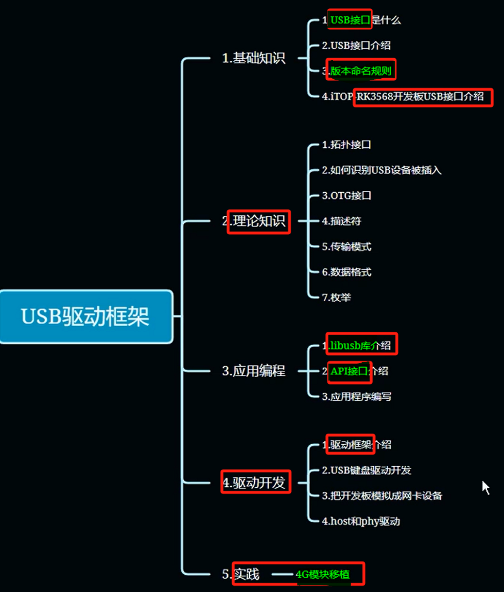
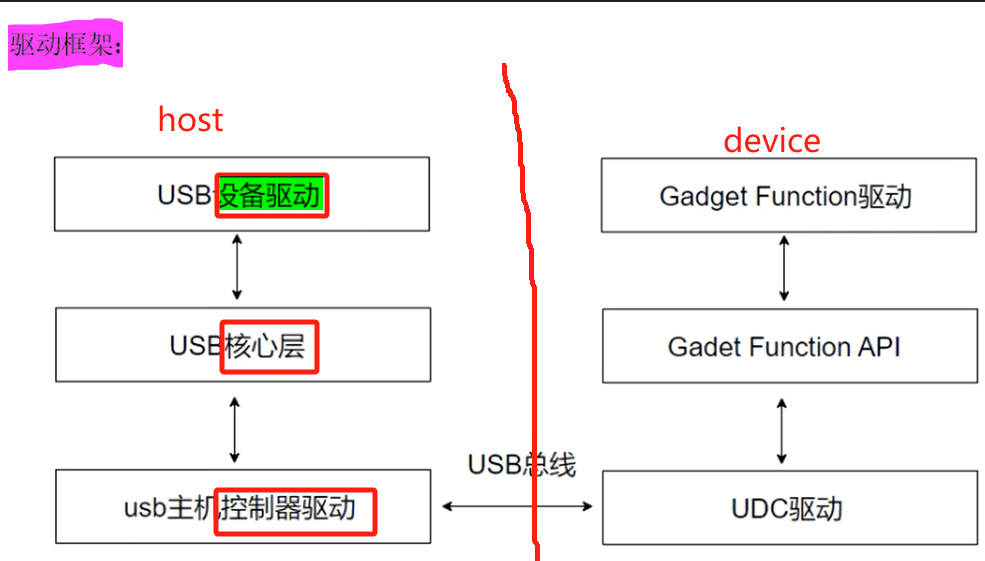

# 备注(声明)：

# 一、.基础知识

## USB接口是什么？
### 1 、什么是 USB - 通用串行总线
[“1.USB接口是什么？”页上的图片](onenote:https://d.docs.live.net/52d4b76bb0ffcf51/Documents/\(RK3568\)Linux驱动开发/第二十五期_USB.one#1.USB接口是什么？&section-id={0B15B5B5-78C4-4878-BD85-64CA3B00F1BA}&page-id={5B8332AC-2781-4395-BAF7-4D7BA33537B2}&object-id={82079B6C-1D43-44B8-8572-567BBF45EB1D}&12)  ([Web 视图](https://onedrive.live.com/view.aspx?resid=52D4B76BB0FFCF51%21se8c325913f784bf694d429e5ee2ab2be&id=documents&wd=target%28%E7%AC%AC%E4%BA%8C%E5%8D%81%E4%BA%94%E6%9C%9F_USB.one%7C0B15B5B5-78C4-4878-BD85-64CA3B00F1BA%2F1.USB%E6%8E%A5%E5%8F%A3%E6%98%AF%E4%BB%80%E4%B9%88%EF%BC%9F%7C5B8332AC-2781-4395-BAF7-4D7BA33537B2%2F%29&wdpartid=%7bDECF6B0E-52B8-4A6F-9B15-7D8C27FFCE2F%7d%7b1%7d&wdsectionfileid=52D4B76BB0FFCF51!sc0c270e295634930b2f0b46e3a6950a8))

> [!note] USB是一个标准
> USB是一个标准
> 它和我们啊日常生活中见到的
> 比如和2.0的接口
> 3.0的接口啊
> 没有什么强关联的这样的一个关系
> 

### 2 、诞生背景和发展背景
[“1.USB接口是什么？”页上的图片](onenote:https://d.docs.live.net/52d4b76bb0ffcf51/Documents/\(RK3568\)Linux驱动开发/第二十五期_USB.one#1.USB接口是什么？&section-id={0B15B5B5-78C4-4878-BD85-64CA3B00F1BA}&page-id={5B8332AC-2781-4395-BAF7-4D7BA33537B2}&object-id={82079B6C-1D43-44B8-8572-567BBF45EB1D}&38)  ([Web 视图](https://onedrive.live.com/view.aspx?resid=52D4B76BB0FFCF51%21se8c325913f784bf694d429e5ee2ab2be&id=documents&wd=target%28%E7%AC%AC%E4%BA%8C%E5%8D%81%E4%BA%94%E6%9C%9F_USB.one%7C0B15B5B5-78C4-4878-BD85-64CA3B00F1BA%2F1.USB%E6%8E%A5%E5%8F%A3%E6%98%AF%E4%BB%80%E4%B9%88%EF%BC%9F%7C5B8332AC-2781-4395-BAF7-4D7BA33537B2%2F%29&wdpartid=%7bDECF6B0E-52B8-4A6F-9B15-7D8C27FFCE2F%7d%7b1%7d&wdsectionfileid=52D4B76BB0FFCF51!sc0c270e295634930b2f0b46e3a6950a8))

### 3 、

## USB接口介绍
### 1 、常见 USB 接口 - A型、B型、C型
[“2.USB接口介绍”页上的图片](onenote:https://d.docs.live.net/52d4b76bb0ffcf51/Documents/\(RK3568\)Linux驱动开发/第二十五期_USB.one#2.USB接口介绍&section-id={0B15B5B5-78C4-4878-BD85-64CA3B00F1BA}&page-id={4A24588C-B6C4-4571-8577-6F7A38DA0BD1}&object-id={F0A18A07-0E68-4D7A-A596-DA5BB154C5D2}&12)  ([Web 视图](https://onedrive.live.com/view.aspx?resid=52D4B76BB0FFCF51%21se8c325913f784bf694d429e5ee2ab2be&id=documents&wd=target%28%E7%AC%AC%E4%BA%8C%E5%8D%81%E4%BA%94%E6%9C%9F_USB.one%7C0B15B5B5-78C4-4878-BD85-64CA3B00F1BA%2F2.USB%E6%8E%A5%E5%8F%A3%E4%BB%8B%E7%BB%8D%7C4A24588C-B6C4-4571-8577-6F7A38DA0BD1%2F%29&wdpartid=%7b2E9BEFDC-B938-481A-A3F6-5162888F69F0%7d%7b1%7d&wdsectionfileid=52D4B76BB0FFCF51!sc0c270e295634930b2f0b46e3a6950a8))

### 2 、USB 一览表
[“2.USB接口介绍”页上的图片](onenote:https://d.docs.live.net/52d4b76bb0ffcf51/Documents/\(RK3568\)Linux驱动开发/第二十五期_USB.one#2.USB接口介绍&section-id={0B15B5B5-78C4-4878-BD85-64CA3B00F1BA}&page-id={4A24588C-B6C4-4571-8577-6F7A38DA0BD1}&object-id={F0A18A07-0E68-4D7A-A596-DA5BB154C5D2}&3D)  ([Web 视图](https://onedrive.live.com/view.aspx?resid=52D4B76BB0FFCF51%21se8c325913f784bf694d429e5ee2ab2be&id=documents&wd=target%28%E7%AC%AC%E4%BA%8C%E5%8D%81%E4%BA%94%E6%9C%9F_USB.one%7C0B15B5B5-78C4-4878-BD85-64CA3B00F1BA%2F2.USB%E6%8E%A5%E5%8F%A3%E4%BB%8B%E7%BB%8D%7C4A24588C-B6C4-4571-8577-6F7A38DA0BD1%2F%29&wdpartid=%7b2E9BEFDC-B938-481A-A3F6-5162888F69F0%7d%7b1%7d&wdsectionfileid=52D4B76BB0FFCF51!sc0c270e295634930b2f0b46e3a6950a8))

- 1 usb接口速度取决于USB协议
### 3 、USB 接口颜色与USB协议的关系
[“2.USB接口介绍”页上的图片](onenote:https://d.docs.live.net/52d4b76bb0ffcf51/Documents/\(RK3568\)Linux驱动开发/第二十五期_USB.one#2.USB接口介绍&section-id={0B15B5B5-78C4-4878-BD85-64CA3B00F1BA}&page-id={4A24588C-B6C4-4571-8577-6F7A38DA0BD1}&object-id={F0A18A07-0E68-4D7A-A596-DA5BB154C5D2}&4F)  ([Web 视图](https://onedrive.live.com/view.aspx?resid=52D4B76BB0FFCF51%21se8c325913f784bf694d429e5ee2ab2be&id=documents&wd=target%28%E7%AC%AC%E4%BA%8C%E5%8D%81%E4%BA%94%E6%9C%9F_USB.one%7C0B15B5B5-78C4-4878-BD85-64CA3B00F1BA%2F2.USB%E6%8E%A5%E5%8F%A3%E4%BB%8B%E7%BB%8D%7C4A24588C-B6C4-4571-8577-6F7A38DA0BD1%2F%29&wdpartid=%7b2E9BEFDC-B938-481A-A3F6-5162888F69F0%7d%7b1%7d&wdsectionfileid=52D4B76BB0FFCF51!sc0c270e295634930b2f0b46e3a6950a8))

- 1 不是绝对
### 4 、

## USB版本命名规则
### 1 、USB版本图
[“3.USB版本命名规则”页上的图片](onenote:https://d.docs.live.net/52d4b76bb0ffcf51/Documents/\(RK3568\)Linux驱动开发/第二十五期_USB.one#3.USB版本命名规则&section-id={0B15B5B5-78C4-4878-BD85-64CA3B00F1BA}&page-id={25A72B0E-DC34-4ACC-8D92-ECFB2ABB25D9}&object-id={71197CDD-A098-459E-B2D6-BD2349B548BE}&37)  ([Web 视图](https://onedrive.live.com/view.aspx?resid=52D4B76BB0FFCF51%21se8c325913f784bf694d429e5ee2ab2be&id=documents&wd=target%28%E7%AC%AC%E4%BA%8C%E5%8D%81%E4%BA%94%E6%9C%9F_USB.one%7C0B15B5B5-78C4-4878-BD85-64CA3B00F1BA%2F3.USB%E7%89%88%E6%9C%AC%E5%91%BD%E5%90%8D%E8%A7%84%E5%88%99%7C25A72B0E-DC34-4ACC-8D92-ECFB2ABB25D9%2F%29&wdpartid=%7b78B9F1E4-21B4-4F89-9783-EED8D44D0B39%7d%7b1%7d&wdsectionfileid=52D4B76BB0FFCF51!sc0c270e295634930b2f0b46e3a6950a8))

### 2 、USB版本命名修改
[“3.USB版本命名规则”页上的图片](onenote:https://d.docs.live.net/52d4b76bb0ffcf51/Documents/\(RK3568\)Linux驱动开发/第二十五期_USB.one#3.USB版本命名规则&section-id={0B15B5B5-78C4-4878-BD85-64CA3B00F1BA}&page-id={25A72B0E-DC34-4ACC-8D92-ECFB2ABB25D9}&object-id={71197CDD-A098-459E-B2D6-BD2349B548BE}&2A)  ([Web 视图](https://onedrive.live.com/view.aspx?resid=52D4B76BB0FFCF51%21se8c325913f784bf694d429e5ee2ab2be&id=documents&wd=target%28%E7%AC%AC%E4%BA%8C%E5%8D%81%E4%BA%94%E6%9C%9F_USB.one%7C0B15B5B5-78C4-4878-BD85-64CA3B00F1BA%2F3.USB%E7%89%88%E6%9C%AC%E5%91%BD%E5%90%8D%E8%A7%84%E5%88%99%7C25A72B0E-DC34-4ACC-8D92-ECFB2ABB25D9%2F%29&wdpartid=%7b78B9F1E4-21B4-4F89-9783-EED8D44D0B39%7d%7b1%7d&wdsectionfileid=52D4B76BB0FFCF51!sc0c270e295634930b2f0b46e3a6950a8))

### 3 、

## RK3568开发板USB接口介绍
### 1 、HOST（主机） 和 OTG（主从切换）概念介绍
[“4.RK3568开发板USB接口介绍-usb2.0”页上的图片](onenote:https://d.docs.live.net/52d4b76bb0ffcf51/Documents/\(RK3568\)Linux驱动开发/第二十五期_USB.one#4.RK3568开发板USB接口介绍-usb2.0&section-id={0B15B5B5-78C4-4878-BD85-64CA3B00F1BA}&page-id={4F36986D-52EF-458D-8ECA-27E85D5BC198}&object-id={C7194A38-6902-460A-AD42-B9887F4630ED}&27)  ([Web 视图](https://onedrive.live.com/view.aspx?resid=52D4B76BB0FFCF51%21se8c325913f784bf694d429e5ee2ab2be&id=documents&wd=target%28%E7%AC%AC%E4%BA%8C%E5%8D%81%E4%BA%94%E6%9C%9F_USB.one%7C0B15B5B5-78C4-4878-BD85-64CA3B00F1BA%2F4.RK3568%E5%BC%80%E5%8F%91%E6%9D%BFUSB%E6%8E%A5%E5%8F%A3%E4%BB%8B%E7%BB%8D-usb2.0%7C4F36986D-52EF-458D-8ECA-27E85D5BC198%2F%29&wdpartid=%7b7269AB04-1663-42CD-A881-A90CF063A8C1%7d%7b1%7d&wdsectionfileid=52D4B76BB0FFCF51!sc0c270e295634930b2f0b46e3a6950a8))

### 2 、USB2.0 HOST x2 概述 - 完全支持USB2.0功能
[“4.RK3568开发板USB接口介绍-usb2.0”页上的图片](onenote:https://d.docs.live.net/52d4b76bb0ffcf51/Documents/\(RK3568\)Linux驱动开发/第二十五期_USB.one#4.RK3568开发板USB接口介绍-usb2.0&section-id={0B15B5B5-78C4-4878-BD85-64CA3B00F1BA}&page-id={4F36986D-52EF-458D-8ECA-27E85D5BC198}&object-id={C7194A38-6902-460A-AD42-B9887F4630ED}&4E)  ([Web 视图](https://onedrive.live.com/view.aspx?resid=52D4B76BB0FFCF51%21se8c325913f784bf694d429e5ee2ab2be&id=documents&wd=target%28%E7%AC%AC%E4%BA%8C%E5%8D%81%E4%BA%94%E6%9C%9F_USB.one%7C0B15B5B5-78C4-4878-BD85-64CA3B00F1BA%2F4.RK3568%E5%BC%80%E5%8F%91%E6%9D%BFUSB%E6%8E%A5%E5%8F%A3%E4%BB%8B%E7%BB%8D-usb2.0%7C4F36986D-52EF-458D-8ECA-27E85D5BC198%2F%29&wdpartid=%7b7269AB04-1663-42CD-A881-A90CF063A8C1%7d%7b1%7d&wdsectionfileid=52D4B76BB0FFCF51!sc0c270e295634930b2f0b46e3a6950a8))

### 3 、USB2.0主机控制器框图
[“4.RK3568开发板USB接口介绍-usb2.0”页上的图片](onenote:https://d.docs.live.net/52d4b76bb0ffcf51/Documents/\(RK3568\)Linux驱动开发/第二十五期_USB.one#4.RK3568开发板USB接口介绍-usb2.0&section-id={0B15B5B5-78C4-4878-BD85-64CA3B00F1BA}&page-id={4F36986D-52EF-458D-8ECA-27E85D5BC198}&object-id={C7194A38-6902-460A-AD42-B9887F4630ED}&71)  ([Web 视图](https://onedrive.live.com/view.aspx?resid=52D4B76BB0FFCF51%21se8c325913f784bf694d429e5ee2ab2be&id=documents&wd=target%28%E7%AC%AC%E4%BA%8C%E5%8D%81%E4%BA%94%E6%9C%9F_USB.one%7C0B15B5B5-78C4-4878-BD85-64CA3B00F1BA%2F4.RK3568%E5%BC%80%E5%8F%91%E6%9D%BFUSB%E6%8E%A5%E5%8F%A3%E4%BB%8B%E7%BB%8D-usb2.0%7C4F36986D-52EF-458D-8ECA-27E85D5BC198%2F%29&wdpartid=%7b7269AB04-1663-42CD-A881-A90CF063A8C1%7d%7b1%7d&wdsectionfileid=52D4B76BB0FFCF51!sc0c270e295634930b2f0b46e3a6950a8))

### 4 、USB3.0控制器概述（USB3 HOST x1、USB3 OTG x1）
[“5.RK3568开发板USB接口介绍-usb3.0”页上的图片](onenote:https://d.docs.live.net/52d4b76bb0ffcf51/Documents/\(RK3568\)Linux驱动开发/第二十五期_USB.one#5.RK3568开发板USB接口介绍-usb3.0&section-id={0B15B5B5-78C4-4878-BD85-64CA3B00F1BA}&page-id={9E0187ED-B40B-4908-A74B-6EC5C435C10C}&object-id={7B2B57A6-3084-4E79-B209-22C671A18533}&12)  ([Web 视图](https://onedrive.live.com/view.aspx?resid=52D4B76BB0FFCF51%21se8c325913f784bf694d429e5ee2ab2be&id=documents&wd=target%28%E7%AC%AC%E4%BA%8C%E5%8D%81%E4%BA%94%E6%9C%9F_USB.one%7C0B15B5B5-78C4-4878-BD85-64CA3B00F1BA%2F5.RK3568%E5%BC%80%E5%8F%91%E6%9D%BFUSB%E6%8E%A5%E5%8F%A3%E4%BB%8B%E7%BB%8D-usb3.0%7C9E0187ED-B40B-4908-A74B-6EC5C435C10C%2F%29&wdpartid=%7b486F87D6-0F12-41D4-BF75-63F0F16ACC96%7d%7b1%7d&wdsectionfileid=52D4B76BB0FFCF51!sc0c270e295634930b2f0b46e3a6950a8))

### 5、USB3.0 OTG控制器功能
[“5.RK3568开发板USB接口介绍-usb3.0”页上的图片](onenote:https://d.docs.live.net/52d4b76bb0ffcf51/Documents/\(RK3568\)Linux驱动开发/第二十五期_USB.one#5.RK3568开发板USB接口介绍-usb3.0&section-id={0B15B5B5-78C4-4878-BD85-64CA3B00F1BA}&page-id={9E0187ED-B40B-4908-A74B-6EC5C435C10C}&object-id={7B2B57A6-3084-4E79-B209-22C671A18533}&30)  ([Web 视图](https://onedrive.live.com/view.aspx?resid=52D4B76BB0FFCF51%21se8c325913f784bf694d429e5ee2ab2be&id=documents&wd=target%28%E7%AC%AC%E4%BA%8C%E5%8D%81%E4%BA%94%E6%9C%9F_USB.one%7C0B15B5B5-78C4-4878-BD85-64CA3B00F1BA%2F5.RK3568%E5%BC%80%E5%8F%91%E6%9D%BFUSB%E6%8E%A5%E5%8F%A3%E4%BB%8B%E7%BB%8D-usb3.0%7C9E0187ED-B40B-4908-A74B-6EC5C435C10C%2F%29&wdpartid=%7b486F87D6-0F12-41D4-BF75-63F0F16ACC96%7d%7b1%7d&wdsectionfileid=52D4B76BB0FFCF51!sc0c270e295634930b2f0b46e3a6950a8))

[“5.RK3568开发板USB接口介绍-usb3.0”页上的图片](onenote:https://d.docs.live.net/52d4b76bb0ffcf51/Documents/\(RK3568\)Linux驱动开发/第二十五期_USB.one#5.RK3568开发板USB接口介绍-usb3.0&section-id={0B15B5B5-78C4-4878-BD85-64CA3B00F1BA}&page-id={9E0187ED-B40B-4908-A74B-6EC5C435C10C}&object-id={7B2B57A6-3084-4E79-B209-22C671A18533}&97)  ([Web 视图](https://onedrive.live.com/view.aspx?resid=52D4B76BB0FFCF51%21se8c325913f784bf694d429e5ee2ab2be&id=documents&wd=target%28%E7%AC%AC%E4%BA%8C%E5%8D%81%E4%BA%94%E6%9C%9F_USB.one%7C0B15B5B5-78C4-4878-BD85-64CA3B00F1BA%2F5.RK3568%E5%BC%80%E5%8F%91%E6%9D%BFUSB%E6%8E%A5%E5%8F%A3%E4%BB%8B%E7%BB%8D-usb3.0%7C9E0187ED-B40B-4908-A74B-6EC5C435C10C%2F%29&wdpartid=%7b486F87D6-0F12-41D4-BF75-63F0F16ACC96%7d%7b1%7d&wdsectionfileid=52D4B76BB0FFCF51!sc0c270e295634930b2f0b46e3a6950a8))
### 6、USB3.0 OTG控制器框图
[“5.RK3568开发板USB接口介绍-usb3.0”页上的图片](onenote:https://d.docs.live.net/52d4b76bb0ffcf51/Documents/\(RK3568\)Linux驱动开发/第二十五期_USB.one#5.RK3568开发板USB接口介绍-usb3.0&section-id={0B15B5B5-78C4-4878-BD85-64CA3B00F1BA}&page-id={9E0187ED-B40B-4908-A74B-6EC5C435C10C}&object-id={7B2B57A6-3084-4E79-B209-22C671A18533}&40)  ([Web 视图](https://onedrive.live.com/view.aspx?resid=52D4B76BB0FFCF51%21se8c325913f784bf694d429e5ee2ab2be&id=documents&wd=target%28%E7%AC%AC%E4%BA%8C%E5%8D%81%E4%BA%94%E6%9C%9F_USB.one%7C0B15B5B5-78C4-4878-BD85-64CA3B00F1BA%2F5.RK3568%E5%BC%80%E5%8F%91%E6%9D%BFUSB%E6%8E%A5%E5%8F%A3%E4%BB%8B%E7%BB%8D-usb3.0%7C9E0187ED-B40B-4908-A74B-6EC5C435C10C%2F%29&wdpartid=%7b486F87D6-0F12-41D4-BF75-63F0F16ACC96%7d%7b1%7d&wdsectionfileid=52D4B76BB0FFCF51!sc0c270e295634930b2f0b46e3a6950a8))

### 7、USB3.0可视化复用框图
[“5.RK3568开发板USB接口介绍-usb3.0”页上的图片](onenote:https://d.docs.live.net/52d4b76bb0ffcf51/Documents/\(RK3568\)Linux驱动开发/第二十五期_USB.one#5.RK3568开发板USB接口介绍-usb3.0&section-id={0B15B5B5-78C4-4878-BD85-64CA3B00F1BA}&page-id={9E0187ED-B40B-4908-A74B-6EC5C435C10C}&object-id={7B2B57A6-3084-4E79-B209-22C671A18533}&A2)  ([Web 视图](https://onedrive.live.com/view.aspx?resid=52D4B76BB0FFCF51%21se8c325913f784bf694d429e5ee2ab2be&id=documents&wd=target%28%E7%AC%AC%E4%BA%8C%E5%8D%81%E4%BA%94%E6%9C%9F_USB.one%7C0B15B5B5-78C4-4878-BD85-64CA3B00F1BA%2F5.RK3568%E5%BC%80%E5%8F%91%E6%9D%BFUSB%E6%8E%A5%E5%8F%A3%E4%BB%8B%E7%BB%8D-usb3.0%7C9E0187ED-B40B-4908-A74B-6EC5C435C10C%2F%29&wdpartid=%7b486F87D6-0F12-41D4-BF75-63F0F16ACC96%7d%7b1%7d&wdsectionfileid=52D4B76BB0FFCF51!sc0c270e295634930b2f0b46e3a6950a8))

### 8、开发板上USB接口位置
[“6.RK3568开发板USB接口介绍-硬件原理图”页上的图片](onenote:https://d.docs.live.net/52d4b76bb0ffcf51/Documents/\(RK3568\)Linux驱动开发/第二十五期_USB.one#6.RK3568开发板USB接口介绍-硬件原理图&section-id={0B15B5B5-78C4-4878-BD85-64CA3B00F1BA}&page-id={3EC4B77E-E3B9-4181-AEA7-D479DAF56B24}&object-id={580697BD-48A7-4917-B606-EEC9257D3C0F}&12)  ([Web 视图](https://onedrive.live.com/view.aspx?resid=52D4B76BB0FFCF51%21se8c325913f784bf694d429e5ee2ab2be&id=documents&wd=target%28%E7%AC%AC%E4%BA%8C%E5%8D%81%E4%BA%94%E6%9C%9F_USB.one%7C0B15B5B5-78C4-4878-BD85-64CA3B00F1BA%2F6.RK3568%E5%BC%80%E5%8F%91%E6%9D%BFUSB%E6%8E%A5%E5%8F%A3%E4%BB%8B%E7%BB%8D-%E7%A1%AC%E4%BB%B6%E5%8E%9F%E7%90%86%E5%9B%BE%7C3EC4B77E-E3B9-4181-AEA7-D479DAF56B24%2F%29&wdpartid=%7b6FE6283F-FF9C-4354-9E6A-EDD8A1399E00%7d%7b1%7d&wdsectionfileid=52D4B76BB0FFCF51!sc0c270e295634930b2f0b46e3a6950a8))

### 9、USB2.0 HOST 硬件原理图 - 一个连接wifi一个作普通的USB2.0接口
[“6.RK3568开发板USB接口介绍-硬件原理图”页上的图片](onenote:https://d.docs.live.net/52d4b76bb0ffcf51/Documents/\(RK3568\)Linux驱动开发/第二十五期_USB.one#6.RK3568开发板USB接口介绍-硬件原理图&section-id={0B15B5B5-78C4-4878-BD85-64CA3B00F1BA}&page-id={3EC4B77E-E3B9-4181-AEA7-D479DAF56B24}&object-id={580697BD-48A7-4917-B606-EEC9257D3C0F}&2C)  ([Web 视图](https://onedrive.live.com/view.aspx?resid=52D4B76BB0FFCF51%21se8c325913f784bf694d429e5ee2ab2be&id=documents&wd=target%28%E7%AC%AC%E4%BA%8C%E5%8D%81%E4%BA%94%E6%9C%9F_USB.one%7C0B15B5B5-78C4-4878-BD85-64CA3B00F1BA%2F6.RK3568%E5%BC%80%E5%8F%91%E6%9D%BFUSB%E6%8E%A5%E5%8F%A3%E4%BB%8B%E7%BB%8D-%E7%A1%AC%E4%BB%B6%E5%8E%9F%E7%90%86%E5%9B%BE%7C3EC4B77E-E3B9-4181-AEA7-D479DAF56B24%2F%29&wdpartid=%7b6FE6283F-FF9C-4354-9E6A-EDD8A1399E00%7d%7b1%7d&wdsectionfileid=52D4B76BB0FFCF51!sc0c270e295634930b2f0b46e3a6950a8))

### 10、USB3.0 OTG硬件原理图 - 烧录接口
[“6.RK3568开发板USB接口介绍-硬件原理图”页上的图片](onenote:https://d.docs.live.net/52d4b76bb0ffcf51/Documents/\(RK3568\)Linux驱动开发/第二十五期_USB.one#6.RK3568开发板USB接口介绍-硬件原理图&section-id={0B15B5B5-78C4-4878-BD85-64CA3B00F1BA}&page-id={3EC4B77E-E3B9-4181-AEA7-D479DAF56B24}&object-id={28822C07-FF06-4944-B0F0-DB4D2E395911}&14)  ([Web 视图](https://onedrive.live.com/view.aspx?resid=52D4B76BB0FFCF51%21se8c325913f784bf694d429e5ee2ab2be&id=documents&wd=target%28%E7%AC%AC%E4%BA%8C%E5%8D%81%E4%BA%94%E6%9C%9F_USB.one%7C0B15B5B5-78C4-4878-BD85-64CA3B00F1BA%2F6.RK3568%E5%BC%80%E5%8F%91%E6%9D%BFUSB%E6%8E%A5%E5%8F%A3%E4%BB%8B%E7%BB%8D-%E7%A1%AC%E4%BB%B6%E5%8E%9F%E7%90%86%E5%9B%BE%7C3EC4B77E-E3B9-4181-AEA7-D479DAF56B24%2F%29&wdpartid=%7b6FE6283F-FF9C-4354-9E6A-EDD8A1399E00%7d%7b1%7d&wdsectionfileid=52D4B76BB0FFCF51!sc0c270e295634930b2f0b46e3a6950a8))

[“6.RK3568开发板USB接口介绍-硬件原理图”页上的图片](onenote:https://d.docs.live.net/52d4b76bb0ffcf51/Documents/\(RK3568\)Linux驱动开发/第二十五期_USB.one#6.RK3568开发板USB接口介绍-硬件原理图&section-id={0B15B5B5-78C4-4878-BD85-64CA3B00F1BA}&page-id={3EC4B77E-E3B9-4181-AEA7-D479DAF56B24}&object-id={28822C07-FF06-4944-B0F0-DB4D2E395911}&5B)  ([Web 视图](https://onedrive.live.com/view.aspx?resid=52D4B76BB0FFCF51%21se8c325913f784bf694d429e5ee2ab2be&id=documents&wd=target%28%E7%AC%AC%E4%BA%8C%E5%8D%81%E4%BA%94%E6%9C%9F_USB.one%7C0B15B5B5-78C4-4878-BD85-64CA3B00F1BA%2F6.RK3568%E5%BC%80%E5%8F%91%E6%9D%BFUSB%E6%8E%A5%E5%8F%A3%E4%BB%8B%E7%BB%8D-%E7%A1%AC%E4%BB%B6%E5%8E%9F%E7%90%86%E5%9B%BE%7C3EC4B77E-E3B9-4181-AEA7-D479DAF56B24%2F%29&wdpartid=%7b6FE6283F-FF9C-4354-9E6A-EDD8A1399E00%7d%7b1%7d&wdsectionfileid=52D4B76BB0FFCF51!sc0c270e295634930b2f0b46e3a6950a8))
#### **引脚电平与usb模式的关系**
[“6.RK3568开发板USB接口介绍-硬件原理图”页上的图片](onenote:https://d.docs.live.net/52d4b76bb0ffcf51/Documents/\(RK3568\)Linux驱动开发/第二十五期_USB.one#6.RK3568开发板USB接口介绍-硬件原理图&section-id={0B15B5B5-78C4-4878-BD85-64CA3B00F1BA}&page-id={3EC4B77E-E3B9-4181-AEA7-D479DAF56B24}&object-id={28822C07-FF06-4944-B0F0-DB4D2E395911}&50)  ([Web 视图](https://onedrive.live.com/view.aspx?resid=52D4B76BB0FFCF51%21se8c325913f784bf694d429e5ee2ab2be&id=documents&wd=target%28%E7%AC%AC%E4%BA%8C%E5%8D%81%E4%BA%94%E6%9C%9F_USB.one%7C0B15B5B5-78C4-4878-BD85-64CA3B00F1BA%2F6.RK3568%E5%BC%80%E5%8F%91%E6%9D%BFUSB%E6%8E%A5%E5%8F%A3%E4%BB%8B%E7%BB%8D-%E7%A1%AC%E4%BB%B6%E5%8E%9F%E7%90%86%E5%9B%BE%7C3EC4B77E-E3B9-4181-AEA7-D479DAF56B24%2F%29&wdpartid=%7b6FE6283F-FF9C-4354-9E6A-EDD8A1399E00%7d%7b1%7d&wdsectionfileid=52D4B76BB0FFCF51!sc0c270e295634930b2f0b46e3a6950a8))

### 11、USB3.0  HOST硬件原理图 - 5G/4G模块
[“6.RK3568开发板USB接口介绍-硬件原理图”页上的图片](onenote:https://d.docs.live.net/52d4b76bb0ffcf51/Documents/\(RK3568\)Linux驱动开发/第二十五期_USB.one#6.RK3568开发板USB接口介绍-硬件原理图&section-id={0B15B5B5-78C4-4878-BD85-64CA3B00F1BA}&page-id={3EC4B77E-E3B9-4181-AEA7-D479DAF56B24}&object-id={28822C07-FF06-4944-B0F0-DB4D2E395911}&66)  ([Web 视图](https://onedrive.live.com/view.aspx?resid=52D4B76BB0FFCF51%21se8c325913f784bf694d429e5ee2ab2be&id=documents&wd=target%28%E7%AC%AC%E4%BA%8C%E5%8D%81%E4%BA%94%E6%9C%9F_USB.one%7C0B15B5B5-78C4-4878-BD85-64CA3B00F1BA%2F6.RK3568%E5%BC%80%E5%8F%91%E6%9D%BFUSB%E6%8E%A5%E5%8F%A3%E4%BB%8B%E7%BB%8D-%E7%A1%AC%E4%BB%B6%E5%8E%9F%E7%90%86%E5%9B%BE%7C3EC4B77E-E3B9-4181-AEA7-D479DAF56B24%2F%29&wdpartid=%7b6FE6283F-FF9C-4354-9E6A-EDD8A1399E00%7d%7b1%7d&wdsectionfileid=52D4B76BB0FFCF51!sc0c270e295634930b2f0b46e3a6950a8))

- 1 我们在实际应用的时候，我们要根据自己的实际需求去设置它们的复用
### 12、

## 补充：TYPEC接口介绍
### 1 、Typec 接口优势 - 可充电、无正反
[“35.补充：TYPEC接口介绍”页上的图片](onenote:https://d.docs.live.net/52d4b76bb0ffcf51/Documents/\(RK3568\)Linux驱动开发/第二十五期_USB.one#35.补充：TYPEC接口介绍&section-id={0B15B5B5-78C4-4878-BD85-64CA3B00F1BA}&page-id={415A6BAC-6E5A-4BF8-94CA-C3DA97B50CEC}&object-id={D2608063-4804-45D6-8D1D-CAE199977200}&12)  ([Web 视图](https://onedrive.live.com/view.aspx?resid=52D4B76BB0FFCF51%21se8c325913f784bf694d429e5ee2ab2be&id=documents&wd=target%28%E7%AC%AC%E4%BA%8C%E5%8D%81%E4%BA%94%E6%9C%9F_USB.one%7C0B15B5B5-78C4-4878-BD85-64CA3B00F1BA%2F35.%E8%A1%A5%E5%85%85%EF%BC%9ATYPEC%E6%8E%A5%E5%8F%A3%E4%BB%8B%E7%BB%8D%7C415A6BAC-6E5A-4BF8-94CA-C3DA97B50CEC%2F%29&wdpartid=%7b9A66A7C8-6FBF-4E87-B763-3127CAB776D6%7d%7b1%7d&wdsectionfileid=52D4B76BB0FFCF51!sc0c270e295634930b2f0b46e3a6950a8))

### 2 、Typec 接口的多种封装
[“35.补充：TYPEC接口介绍”页上的图片](onenote:https://d.docs.live.net/52d4b76bb0ffcf51/Documents/\(RK3568\)Linux驱动开发/第二十五期_USB.one#35.补充：TYPEC接口介绍&section-id={0B15B5B5-78C4-4878-BD85-64CA3B00F1BA}&page-id={415A6BAC-6E5A-4BF8-94CA-C3DA97B50CEC}&object-id={D2608063-4804-45D6-8D1D-CAE199977200}&1D)  ([Web 视图](https://onedrive.live.com/view.aspx?resid=52D4B76BB0FFCF51%21se8c325913f784bf694d429e5ee2ab2be&id=documents&wd=target%28%E7%AC%AC%E4%BA%8C%E5%8D%81%E4%BA%94%E6%9C%9F_USB.one%7C0B15B5B5-78C4-4878-BD85-64CA3B00F1BA%2F35.%E8%A1%A5%E5%85%85%EF%BC%9ATYPEC%E6%8E%A5%E5%8F%A3%E4%BB%8B%E7%BB%8D%7C415A6BAC-6E5A-4BF8-94CA-C3DA97B50CEC%2F%29&wdpartid=%7b9A66A7C8-6FBF-4E87-B763-3127CAB776D6%7d%7b1%7d&wdsectionfileid=52D4B76BB0FFCF51!sc0c270e295634930b2f0b46e3a6950a8))

### 3 、引脚功能说明
[“35.补充：TYPEC接口介绍”页上的图片](onenote:https://d.docs.live.net/52d4b76bb0ffcf51/Documents/\(RK3568\)Linux驱动开发/第二十五期_USB.one#35.补充：TYPEC接口介绍&section-id={0B15B5B5-78C4-4878-BD85-64CA3B00F1BA}&page-id={415A6BAC-6E5A-4BF8-94CA-C3DA97B50CEC}&object-id={D2608063-4804-45D6-8D1D-CAE199977200}&2A)  ([Web 视图](https://onedrive.live.com/view.aspx?resid=52D4B76BB0FFCF51%21se8c325913f784bf694d429e5ee2ab2be&id=documents&wd=target%28%E7%AC%AC%E4%BA%8C%E5%8D%81%E4%BA%94%E6%9C%9F_USB.one%7C0B15B5B5-78C4-4878-BD85-64CA3B00F1BA%2F35.%E8%A1%A5%E5%85%85%EF%BC%9ATYPEC%E6%8E%A5%E5%8F%A3%E4%BB%8B%E7%BB%8D%7C415A6BAC-6E5A-4BF8-94CA-C3DA97B50CEC%2F%29&wdpartid=%7b9A66A7C8-6FBF-4E87-B763-3127CAB776D6%7d%7b1%7d&wdsectionfileid=52D4B76BB0FFCF51!sc0c270e295634930b2f0b46e3a6950a8))

### 4 、母头/公口接口定义
[“35.补充：TYPEC接口介绍”页上的图片](onenote:https://d.docs.live.net/52d4b76bb0ffcf51/Documents/\(RK3568\)Linux驱动开发/第二十五期_USB.one#35.补充：TYPEC接口介绍&section-id={0B15B5B5-78C4-4878-BD85-64CA3B00F1BA}&page-id={415A6BAC-6E5A-4BF8-94CA-C3DA97B50CEC}&object-id={D2608063-4804-45D6-8D1D-CAE199977200}&30)  ([Web 视图](https://onedrive.live.com/view.aspx?resid=52D4B76BB0FFCF51%21se8c325913f784bf694d429e5ee2ab2be&id=documents&wd=target%28%E7%AC%AC%E4%BA%8C%E5%8D%81%E4%BA%94%E6%9C%9F_USB.one%7C0B15B5B5-78C4-4878-BD85-64CA3B00F1BA%2F35.%E8%A1%A5%E5%85%85%EF%BC%9ATYPEC%E6%8E%A5%E5%8F%A3%E4%BB%8B%E7%BB%8D%7C415A6BAC-6E5A-4BF8-94CA-C3DA97B50CEC%2F%29&wdpartid=%7b9A66A7C8-6FBF-4E87-B763-3127CAB776D6%7d%7b1%7d&wdsectionfileid=52D4B76BB0FFCF51!sc0c270e295634930b2f0b46e3a6950a8))

### 5、引脚功能介绍
[“35.补充：TYPEC接口介绍”页上的图片](onenote:https://d.docs.live.net/52d4b76bb0ffcf51/Documents/\(RK3568\)Linux驱动开发/第二十五期_USB.one#35.补充：TYPEC接口介绍&section-id={0B15B5B5-78C4-4878-BD85-64CA3B00F1BA}&page-id={415A6BAC-6E5A-4BF8-94CA-C3DA97B50CEC}&object-id={D2608063-4804-45D6-8D1D-CAE199977200}&36)  ([Web 视图](https://onedrive.live.com/view.aspx?resid=52D4B76BB0FFCF51%21se8c325913f784bf694d429e5ee2ab2be&id=documents&wd=target%28%E7%AC%AC%E4%BA%8C%E5%8D%81%E4%BA%94%E6%9C%9F_USB.one%7C0B15B5B5-78C4-4878-BD85-64CA3B00F1BA%2F35.%E8%A1%A5%E5%85%85%EF%BC%9ATYPEC%E6%8E%A5%E5%8F%A3%E4%BB%8B%E7%BB%8D%7C415A6BAC-6E5A-4BF8-94CA-C3DA97B50CEC%2F%29&wdpartid=%7b9A66A7C8-6FBF-4E87-B763-3127CAB776D6%7d%7b1%7d&wdsectionfileid=52D4B76BB0FFCF51!sc0c270e295634930b2f0b46e3a6950a8))

### 6、16p 接口 - 去掉高速传输
[“35.补充：TYPEC接口介绍”页上的图片](onenote:https://d.docs.live.net/52d4b76bb0ffcf51/Documents/\(RK3568\)Linux驱动开发/第二十五期_USB.one#35.补充：TYPEC接口介绍&section-id={0B15B5B5-78C4-4878-BD85-64CA3B00F1BA}&page-id={415A6BAC-6E5A-4BF8-94CA-C3DA97B50CEC}&object-id={D2608063-4804-45D6-8D1D-CAE199977200}&42)  ([Web 视图](https://onedrive.live.com/view.aspx?resid=52D4B76BB0FFCF51%21se8c325913f784bf694d429e5ee2ab2be&id=documents&wd=target%28%E7%AC%AC%E4%BA%8C%E5%8D%81%E4%BA%94%E6%9C%9F_USB.one%7C0B15B5B5-78C4-4878-BD85-64CA3B00F1BA%2F35.%E8%A1%A5%E5%85%85%EF%BC%9ATYPEC%E6%8E%A5%E5%8F%A3%E4%BB%8B%E7%BB%8D%7C415A6BAC-6E5A-4BF8-94CA-C3DA97B50CEC%2F%29&wdpartid=%7b9A66A7C8-6FBF-4E87-B763-3127CAB776D6%7d%7b1%7d&wdsectionfileid=52D4B76BB0FFCF51!sc0c270e295634930b2f0b46e3a6950a8))

### 7、6p 接口 - 不需要USB通信
[“35.补充：TYPEC接口介绍”页上的图片](onenote:https://d.docs.live.net/52d4b76bb0ffcf51/Documents/\(RK3568\)Linux驱动开发/第二十五期_USB.one#35.补充：TYPEC接口介绍&section-id={0B15B5B5-78C4-4878-BD85-64CA3B00F1BA}&page-id={415A6BAC-6E5A-4BF8-94CA-C3DA97B50CEC}&object-id={D2608063-4804-45D6-8D1D-CAE199977200}&48)  ([Web 视图](https://onedrive.live.com/view.aspx?resid=52D4B76BB0FFCF51%21se8c325913f784bf694d429e5ee2ab2be&id=documents&wd=target%28%E7%AC%AC%E4%BA%8C%E5%8D%81%E4%BA%94%E6%9C%9F_USB.one%7C0B15B5B5-78C4-4878-BD85-64CA3B00F1BA%2F35.%E8%A1%A5%E5%85%85%EF%BC%9ATYPEC%E6%8E%A5%E5%8F%A3%E4%BB%8B%E7%BB%8D%7C415A6BAC-6E5A-4BF8-94CA-C3DA97B50CEC%2F%29&wdpartid=%7b9A66A7C8-6FBF-4E87-B763-3127CAB776D6%7d%7b1%7d&wdsectionfileid=52D4B76BB0FFCF51!sc0c270e295634930b2f0b46e3a6950a8))

### 8、

# 二、理论知识

## USB拓扑结构
### 1 、USB拓扑结构 - 从机都必须经过集线器(hub)才能与主机连接
[“7.USB拓扑结构”页上的图片](onenote:https://d.docs.live.net/52d4b76bb0ffcf51/Documents/\(RK3568\)Linux驱动开发/第二十五期_USB.one#7.USB拓扑结构&section-id={0B15B5B5-78C4-4878-BD85-64CA3B00F1BA}&page-id={946E74E0-BBF0-4816-99FC-9B67864FB5AD}&object-id={53DCAED9-6B90-49E1-98EC-72271FCA119E}&18)  ([Web 视图](https://onedrive.live.com/view.aspx?resid=52D4B76BB0FFCF51%21se8c325913f784bf694d429e5ee2ab2be&id=documents&wd=target%28%E7%AC%AC%E4%BA%8C%E5%8D%81%E4%BA%94%E6%9C%9F_USB.one%7C0B15B5B5-78C4-4878-BD85-64CA3B00F1BA%2F7.USB%E6%8B%93%E6%89%91%E7%BB%93%E6%9E%84%7C946E74E0-BBF0-4816-99FC-9B67864FB5AD%2F%29&wdpartid=%7b229FE67A-0A52-4518-8CB4-0F0D631D36EC%7d%7b1%7d&wdsectionfileid=52D4B76BB0FFCF51!sc0c270e295634930b2f0b46e3a6950a8))

- 1 USB通信只能发生在主从设备之间。

### 2 、集线器框图 - 最多7层
[“7.USB拓扑结构”页上的图片](onenote:https://d.docs.live.net/52d4b76bb0ffcf51/Documents/\(RK3568\)Linux驱动开发/第二十五期_USB.one#7.USB拓扑结构&section-id={0B15B5B5-78C4-4878-BD85-64CA3B00F1BA}&page-id={946E74E0-BBF0-4816-99FC-9B67864FB5AD}&object-id={53DCAED9-6B90-49E1-98EC-72271FCA119E}&25)  ([Web 视图](https://onedrive.live.com/view.aspx?resid=52D4B76BB0FFCF51%21se8c325913f784bf694d429e5ee2ab2be&id=documents&wd=target%28%E7%AC%AC%E4%BA%8C%E5%8D%81%E4%BA%94%E6%9C%9F_USB.one%7C0B15B5B5-78C4-4878-BD85-64CA3B00F1BA%2F7.USB%E6%8B%93%E6%89%91%E7%BB%93%E6%9E%84%7C946E74E0-BBF0-4816-99FC-9B67864FB5AD%2F%29&wdpartid=%7b229FE67A-0A52-4518-8CB4-0F0D631D36EC%7d%7b1%7d&wdsectionfileid=52D4B76BB0FFCF51!sc0c270e295634930b2f0b46e3a6950a8))

### 3 、

## 如何识别USB设备被插入？
### 1 、设备的6种状态
[“8.如何识别USB设备被插入？”页上的图片](onenote:https://d.docs.live.net/52d4b76bb0ffcf51/Documents/\(RK3568\)Linux驱动开发/第二十五期_USB.one#8.如何识别USB设备被插入？&section-id={0B15B5B5-78C4-4878-BD85-64CA3B00F1BA}&page-id={F314ACF7-4A68-4870-AC9F-369D5C14222B}&object-id={82720673-806D-4D54-AEE5-8C8CFF9E01C3}&12)  ([Web 视图](https://onedrive.live.com/view.aspx?resid=52D4B76BB0FFCF51%21se8c325913f784bf694d429e5ee2ab2be&id=documents&wd=target%28%E7%AC%AC%E4%BA%8C%E5%8D%81%E4%BA%94%E6%9C%9F_USB.one%7C0B15B5B5-78C4-4878-BD85-64CA3B00F1BA%2F8.%E5%A6%82%E4%BD%95%E8%AF%86%E5%88%ABUSB%E8%AE%BE%E5%A4%87%E8%A2%AB%E6%8F%92%E5%85%A5%EF%BC%9F%7CF314ACF7-4A68-4870-AC9F-369D5C14222B%2F%29&wdpartid=%7bEA999CCE-1C0C-4337-B7C4-2A1BCDCAE8C8%7d%7b1%7d&wdsectionfileid=52D4B76BB0FFCF51!sc0c270e295634930b2f0b46e3a6950a8))

- **相互切换的框图**
[“8.如何识别USB设备被插入？”页上的图片](onenote:https://d.docs.live.net/52d4b76bb0ffcf51/Documents/\(RK3568\)Linux驱动开发/第二十五期_USB.one#8.如何识别USB设备被插入？&section-id={0B15B5B5-78C4-4878-BD85-64CA3B00F1BA}&page-id={F314ACF7-4A68-4870-AC9F-369D5C14222B}&object-id={82720673-806D-4D54-AEE5-8C8CFF9E01C3}&21)  ([Web 视图](https://onedrive.live.com/view.aspx?resid=52D4B76BB0FFCF51%21se8c325913f784bf694d429e5ee2ab2be&id=documents&wd=target%28%E7%AC%AC%E4%BA%8C%E5%8D%81%E4%BA%94%E6%9C%9F_USB.one%7C0B15B5B5-78C4-4878-BD85-64CA3B00F1BA%2F8.%E5%A6%82%E4%BD%95%E8%AF%86%E5%88%ABUSB%E8%AE%BE%E5%A4%87%E8%A2%AB%E6%8F%92%E5%85%A5%EF%BC%9F%7CF314ACF7-4A68-4870-AC9F-369D5C14222B%2F%29&wdpartid=%7bEA999CCE-1C0C-4337-B7C4-2A1BCDCAE8C8%7d%7b1%7d&wdsectionfileid=52D4B76BB0FFCF51!sc0c270e295634930b2f0b46e3a6950a8))
### 2 、如何检测USB设备插入
#### Full-speed 设备:
[“8.如何识别USB设备被插入？”页上的图片](onenote:https://d.docs.live.net/52d4b76bb0ffcf51/Documents/\(RK3568\)Linux驱动开发/第二十五期_USB.one#8.如何识别USB设备被插入？&section-id={0B15B5B5-78C4-4878-BD85-64CA3B00F1BA}&page-id={F314ACF7-4A68-4870-AC9F-369D5C14222B}&object-id={82720673-806D-4D54-AEE5-8C8CFF9E01C3}&34)  ([Web 视图](https://onedrive.live.com/view.aspx?resid=52D4B76BB0FFCF51%21se8c325913f784bf694d429e5ee2ab2be&id=documents&wd=target%28%E7%AC%AC%E4%BA%8C%E5%8D%81%E4%BA%94%E6%9C%9F_USB.one%7C0B15B5B5-78C4-4878-BD85-64CA3B00F1BA%2F8.%E5%A6%82%E4%BD%95%E8%AF%86%E5%88%ABUSB%E8%AE%BE%E5%A4%87%E8%A2%AB%E6%8F%92%E5%85%A5%EF%BC%9F%7CF314ACF7-4A68-4870-AC9F-369D5C14222B%2F%29&wdpartid=%7bEA999CCE-1C0C-4337-B7C4-2A1BCDCAE8C8%7d%7b1%7d&wdsectionfileid=52D4B76BB0FFCF51!sc0c270e295634930b2f0b46e3a6950a8))

####  Low-speed 设备:
[“8.如何识别USB设备被插入？”页上的图片](onenote:https://d.docs.live.net/52d4b76bb0ffcf51/Documents/\(RK3568\)Linux驱动开发/第二十五期_USB.one#8.如何识别USB设备被插入？&section-id={0B15B5B5-78C4-4878-BD85-64CA3B00F1BA}&page-id={F314ACF7-4A68-4870-AC9F-369D5C14222B}&object-id={82720673-806D-4D54-AEE5-8C8CFF9E01C3}&34)  ([Web 视图](https://onedrive.live.com/view.aspx?resid=52D4B76BB0FFCF51%21se8c325913f784bf694d429e5ee2ab2be&id=documents&wd=target%28%E7%AC%AC%E4%BA%8C%E5%8D%81%E4%BA%94%E6%9C%9F_USB.one%7C0B15B5B5-78C4-4878-BD85-64CA3B00F1BA%2F8.%E5%A6%82%E4%BD%95%E8%AF%86%E5%88%ABUSB%E8%AE%BE%E5%A4%87%E8%A2%AB%E6%8F%92%E5%85%A5%EF%BC%9F%7CF314ACF7-4A68-4870-AC9F-369D5C14222B%2F%29&wdpartid=%7bEA999CCE-1C0C-4337-B7C4-2A1BCDCAE8C8%7d%7b1%7d&wdsectionfileid=52D4B76BB0FFCF51!sc0c270e295634930b2f0b46e3a6950a8))

#### USB 高速设备
[“8.如何识别USB设备被插入？”页上的图片](onenote:https://d.docs.live.net/52d4b76bb0ffcf51/Documents/\(RK3568\)Linux驱动开发/第二十五期_USB.one#8.如何识别USB设备被插入？&section-id={0B15B5B5-78C4-4878-BD85-64CA3B00F1BA}&page-id={F314ACF7-4A68-4870-AC9F-369D5C14222B}&object-id={82720673-806D-4D54-AEE5-8C8CFF9E01C3}&5F)  ([Web 视图](https://onedrive.live.com/view.aspx?resid=52D4B76BB0FFCF51%21se8c325913f784bf694d429e5ee2ab2be&id=documents&wd=target%28%E7%AC%AC%E4%BA%8C%E5%8D%81%E4%BA%94%E6%9C%9F_USB.one%7C0B15B5B5-78C4-4878-BD85-64CA3B00F1BA%2F8.%E5%A6%82%E4%BD%95%E8%AF%86%E5%88%ABUSB%E8%AE%BE%E5%A4%87%E8%A2%AB%E6%8F%92%E5%85%A5%EF%BC%9F%7CF314ACF7-4A68-4870-AC9F-369D5C14222B%2F%29&wdpartid=%7bEA999CCE-1C0C-4337-B7C4-2A1BCDCAE8C8%7d%7b1%7d&wdsectionfileid=52D4B76BB0FFCF51!sc0c270e295634930b2f0b46e3a6950a8))

#### USB3.0
[“8.如何识别USB设备被插入？”页上的图片](onenote:https://d.docs.live.net/52d4b76bb0ffcf51/Documents/\(RK3568\)Linux驱动开发/第二十五期_USB.one#8.如何识别USB设备被插入？&section-id={0B15B5B5-78C4-4878-BD85-64CA3B00F1BA}&page-id={F314ACF7-4A68-4870-AC9F-369D5C14222B}&object-id={82720673-806D-4D54-AEE5-8C8CFF9E01C3}&E0)  ([Web 视图](https://onedrive.live.com/view.aspx?resid=52D4B76BB0FFCF51%21se8c325913f784bf694d429e5ee2ab2be&id=documents&wd=target%28%E7%AC%AC%E4%BA%8C%E5%8D%81%E4%BA%94%E6%9C%9F_USB.one%7C0B15B5B5-78C4-4878-BD85-64CA3B00F1BA%2F8.%E5%A6%82%E4%BD%95%E8%AF%86%E5%88%ABUSB%E8%AE%BE%E5%A4%87%E8%A2%AB%E6%8F%92%E5%85%A5%EF%BC%9F%7CF314ACF7-4A68-4870-AC9F-369D5C14222B%2F%29&wdpartid=%7bEA999CCE-1C0C-4337-B7C4-2A1BCDCAE8C8%7d%7b1%7d&wdsectionfileid=52D4B76BB0FFCF51!sc0c270e295634930b2f0b46e3a6950a8))

### 3 、USB2.0  PDF
[“8.如何识别USB设备被插入？”页上的图片](onenote:https://d.docs.live.net/52d4b76bb0ffcf51/Documents/\(RK3568\)Linux驱动开发/第二十五期_USB.one#8.如何识别USB设备被插入？&section-id={0B15B5B5-78C4-4878-BD85-64CA3B00F1BA}&page-id={F314ACF7-4A68-4870-AC9F-369D5C14222B}&object-id={82720673-806D-4D54-AEE5-8C8CFF9E01C3}&81)  ([Web 视图](https://onedrive.live.com/view.aspx?resid=52D4B76BB0FFCF51%21se8c325913f784bf694d429e5ee2ab2be&id=documents&wd=target%28%E7%AC%AC%E4%BA%8C%E5%8D%81%E4%BA%94%E6%9C%9F_USB.one%7C0B15B5B5-78C4-4878-BD85-64CA3B00F1BA%2F8.%E5%A6%82%E4%BD%95%E8%AF%86%E5%88%ABUSB%E8%AE%BE%E5%A4%87%E8%A2%AB%E6%8F%92%E5%85%A5%EF%BC%9F%7CF314ACF7-4A68-4870-AC9F-369D5C14222B%2F%29&wdpartid=%7bEA999CCE-1C0C-4337-B7C4-2A1BCDCAE8C8%7d%7b1%7d&wdsectionfileid=52D4B76BB0FFCF51!sc0c270e295634930b2f0b46e3a6950a8))

- 1 研究的就是主机和这个设备，他们两个是怎么互相确认
### 4 、USB3.0  PDF
[“8.如何识别USB设备被插入？”页上的图片](onenote:https://d.docs.live.net/52d4b76bb0ffcf51/Documents/\(RK3568\)Linux驱动开发/第二十五期_USB.one#8.如何识别USB设备被插入？&section-id={0B15B5B5-78C4-4878-BD85-64CA3B00F1BA}&page-id={F314ACF7-4A68-4870-AC9F-369D5C14222B}&object-id={82720673-806D-4D54-AEE5-8C8CFF9E01C3}&EB)  ([Web 视图](https://onedrive.live.com/view.aspx?resid=52D4B76BB0FFCF51%21se8c325913f784bf694d429e5ee2ab2be&id=documents&wd=target%28%E7%AC%AC%E4%BA%8C%E5%8D%81%E4%BA%94%E6%9C%9F_USB.one%7C0B15B5B5-78C4-4878-BD85-64CA3B00F1BA%2F8.%E5%A6%82%E4%BD%95%E8%AF%86%E5%88%ABUSB%E8%AE%BE%E5%A4%87%E8%A2%AB%E6%8F%92%E5%85%A5%EF%BC%9F%7CF314ACF7-4A68-4870-AC9F-369D5C14222B%2F%29&wdpartid=%7bEA999CCE-1C0C-4337-B7C4-2A1BCDCAE8C8%7d%7b1%7d&wdsectionfileid=52D4B76BB0FFCF51!sc0c270e295634930b2f0b46e3a6950a8))

### 5、

### 6、

### 7、

### 8、

## OTG自动切换
### 1 、分析6ULL上的OTG接口硬件原理图 - ID引脚
[“9.OTG自动切换”页上的图片](onenote:https://d.docs.live.net/52d4b76bb0ffcf51/Documents/\(RK3568\)Linux驱动开发/第二十五期_USB.one#9.OTG自动切换&section-id={0B15B5B5-78C4-4878-BD85-64CA3B00F1BA}&page-id={AEE4804C-E450-4C24-A60B-32BDB48E25AE}&object-id={44DCC9AD-1523-4DB2-919E-07E14830D4E7}&18)  ([Web 视图](https://onedrive.live.com/view.aspx?resid=52D4B76BB0FFCF51%21se8c325913f784bf694d429e5ee2ab2be&id=documents&wd=target%28%E7%AC%AC%E4%BA%8C%E5%8D%81%E4%BA%94%E6%9C%9F_USB.one%7C0B15B5B5-78C4-4878-BD85-64CA3B00F1BA%2F9.OTG%E8%87%AA%E5%8A%A8%E5%88%87%E6%8D%A2%7CAEE4804C-E450-4C24-A60B-32BDB48E25AE%2F%29&wdpartid=%7bFAD05625-2C14-40CF-8463-443867EDCDD5%7d%7b1%7d&wdsectionfileid=52D4B76BB0FFCF51!sc0c270e295634930b2f0b46e3a6950a8))

### 2 、

## 描述符
### 1 、设备描述符
[“10.描述符”页上的图片](onenote:https://d.docs.live.net/52d4b76bb0ffcf51/Documents/\(RK3568\)Linux驱动开发/第二十五期_USB.one#10.描述符&section-id={0B15B5B5-78C4-4878-BD85-64CA3B00F1BA}&page-id={3219FACF-FE8C-43C9-BBEF-F2B743A99C74}&object-id={DAD2ADCB-6013-4B97-9883-62942E6395E1}&13)  ([Web 视图](https://onedrive.live.com/view.aspx?resid=52D4B76BB0FFCF51%21se8c325913f784bf694d429e5ee2ab2be&id=documents&wd=target%28%E7%AC%AC%E4%BA%8C%E5%8D%81%E4%BA%94%E6%9C%9F_USB.one%7C0B15B5B5-78C4-4878-BD85-64CA3B00F1BA%2F10.%E6%8F%8F%E8%BF%B0%E7%AC%A6%7C3219FACF-FE8C-43C9-BBEF-F2B743A99C74%2F%29&wdpartid=%7b8D0FA8F9-DF2A-425F-BD1F-F2DC3345613E%7d%7b1%7d&wdsectionfileid=52D4B76BB0FFCF51!sc0c270e295634930b2f0b46e3a6950a8))

### 2 、与USB设备有关的描述符
[“10.描述符”页上的图片](onenote:https://d.docs.live.net/52d4b76bb0ffcf51/Documents/\(RK3568\)Linux驱动开发/第二十五期_USB.one#10.描述符&section-id={0B15B5B5-78C4-4878-BD85-64CA3B00F1BA}&page-id={3219FACF-FE8C-43C9-BBEF-F2B743A99C74}&object-id={DAD2ADCB-6013-4B97-9883-62942E6395E1}&1D)  ([Web 视图](https://onedrive.live.com/view.aspx?resid=52D4B76BB0FFCF51%21se8c325913f784bf694d429e5ee2ab2be&id=documents&wd=target%28%E7%AC%AC%E4%BA%8C%E5%8D%81%E4%BA%94%E6%9C%9F_USB.one%7C0B15B5B5-78C4-4878-BD85-64CA3B00F1BA%2F10.%E6%8F%8F%E8%BF%B0%E7%AC%A6%7C3219FACF-FE8C-43C9-BBEF-F2B743A99C74%2F%29&wdpartid=%7b8D0FA8F9-DF2A-425F-BD1F-F2DC3345613E%7d%7b1%7d&wdsectionfileid=52D4B76BB0FFCF51!sc0c270e295634930b2f0b46e3a6950a8))

### 3 、查看USB设备的描述符
[“10.描述符”页上的图片](onenote:https://d.docs.live.net/52d4b76bb0ffcf51/Documents/\(RK3568\)Linux驱动开发/第二十五期_USB.one#10.描述符&section-id={0B15B5B5-78C4-4878-BD85-64CA3B00F1BA}&page-id={3219FACF-FE8C-43C9-BBEF-F2B743A99C74}&object-id={DAD2ADCB-6013-4B97-9883-62942E6395E1}&2A)  ([Web 视图](https://onedrive.live.com/view.aspx?resid=52D4B76BB0FFCF51%21se8c325913f784bf694d429e5ee2ab2be&id=documents&wd=target%28%E7%AC%AC%E4%BA%8C%E5%8D%81%E4%BA%94%E6%9C%9F_USB.one%7C0B15B5B5-78C4-4878-BD85-64CA3B00F1BA%2F10.%E6%8F%8F%E8%BF%B0%E7%AC%A6%7C3219FACF-FE8C-43C9-BBEF-F2B743A99C74%2F%29&wdpartid=%7b8D0FA8F9-DF2A-425F-BD1F-F2DC3345613E%7d%7b1%7d&wdsectionfileid=52D4B76BB0FFCF51!sc0c270e295634930b2f0b46e3a6950a8))

- **包含关系**
[“10.描述符”页上的图片](onenote:https://d.docs.live.net/52d4b76bb0ffcf51/Documents/\(RK3568\)Linux驱动开发/第二十五期_USB.one#10.描述符&section-id={0B15B5B5-78C4-4878-BD85-64CA3B00F1BA}&page-id={3219FACF-FE8C-43C9-BBEF-F2B743A99C74}&object-id={DAD2ADCB-6013-4B97-9883-62942E6395E1}&47)  ([Web 视图](https://onedrive.live.com/view.aspx?resid=52D4B76BB0FFCF51%21se8c325913f784bf694d429e5ee2ab2be&id=documents&wd=target%28%E7%AC%AC%E4%BA%8C%E5%8D%81%E4%BA%94%E6%9C%9F_USB.one%7C0B15B5B5-78C4-4878-BD85-64CA3B00F1BA%2F10.%E6%8F%8F%E8%BF%B0%E7%AC%A6%7C3219FACF-FE8C-43C9-BBEF-F2B743A99C74%2F%29&wdpartid=%7b8D0FA8F9-DF2A-425F-BD1F-F2DC3345613E%7d%7b1%7d&wdsectionfileid=52D4B76BB0FFCF51!sc0c270e295634930b2f0b46e3a6950a8))

- 1 设备描述符--->配置描述符--->接口描述符--->端点描述符
### 4 、描述符里面有什么？- 设备描述符为例
[“10.描述符”页上的图片](onenote:https://d.docs.live.net/52d4b76bb0ffcf51/Documents/\(RK3568\)Linux驱动开发/第二十五期_USB.one#10.描述符&section-id={0B15B5B5-78C4-4878-BD85-64CA3B00F1BA}&page-id={3219FACF-FE8C-43C9-BBEF-F2B743A99C74}&object-id={DAD2ADCB-6013-4B97-9883-62942E6395E1}&52)  ([Web 视图](https://onedrive.live.com/view.aspx?resid=52D4B76BB0FFCF51%21se8c325913f784bf694d429e5ee2ab2be&id=documents&wd=target%28%E7%AC%AC%E4%BA%8C%E5%8D%81%E4%BA%94%E6%9C%9F_USB.one%7C0B15B5B5-78C4-4878-BD85-64CA3B00F1BA%2F10.%E6%8F%8F%E8%BF%B0%E7%AC%A6%7C3219FACF-FE8C-43C9-BBEF-F2B743A99C74%2F%29&wdpartid=%7b8D0FA8F9-DF2A-425F-BD1F-F2DC3345613E%7d%7b1%7d&wdsectionfileid=52D4B76BB0FFCF51!sc0c270e295634930b2f0b46e3a6950a8))

### 5、标准配置描述符的解析
[“10.描述符”页上的图片](onenote:https://d.docs.live.net/52d4b76bb0ffcf51/Documents/\(RK3568\)Linux驱动开发/第二十五期_USB.one#10.描述符&section-id={0B15B5B5-78C4-4878-BD85-64CA3B00F1BA}&page-id={3219FACF-FE8C-43C9-BBEF-F2B743A99C74}&object-id={DAD2ADCB-6013-4B97-9883-62942E6395E1}&5D)  ([Web 视图](https://onedrive.live.com/view.aspx?resid=52D4B76BB0FFCF51%21se8c325913f784bf694d429e5ee2ab2be&id=documents&wd=target%28%E7%AC%AC%E4%BA%8C%E5%8D%81%E4%BA%94%E6%9C%9F_USB.one%7C0B15B5B5-78C4-4878-BD85-64CA3B00F1BA%2F10.%E6%8F%8F%E8%BF%B0%E7%AC%A6%7C3219FACF-FE8C-43C9-BBEF-F2B743A99C74%2F%29&wdpartid=%7b8D0FA8F9-DF2A-425F-BD1F-F2DC3345613E%7d%7b1%7d&wdsectionfileid=52D4B76BB0FFCF51!sc0c270e295634930b2f0b46e3a6950a8))

### 6、

## 传输模式
### 1 、USB 的四种传输模式
[“11.传输模式”页上的图片](onenote:https://d.docs.live.net/52d4b76bb0ffcf51/Documents/\(RK3568\)Linux驱动开发/第二十五期_USB.one#11.传输模式&section-id={0B15B5B5-78C4-4878-BD85-64CA3B00F1BA}&page-id={B5B9F9B9-4D64-4879-B290-BC749108001B}&object-id={E6A7295A-AB77-4F0B-AAFD-4D51F2AB3483}&12)  ([Web 视图](https://onedrive.live.com/view.aspx?resid=52D4B76BB0FFCF51%21se8c325913f784bf694d429e5ee2ab2be&id=documents&wd=target%28%E7%AC%AC%E4%BA%8C%E5%8D%81%E4%BA%94%E6%9C%9F_USB.one%7C0B15B5B5-78C4-4878-BD85-64CA3B00F1BA%2F11.%E4%BC%A0%E8%BE%93%E6%A8%A1%E5%BC%8F%7CB5B9F9B9-4D64-4879-B290-BC749108001B%2F%29&wdpartid=%7bE1E11ECF-DC94-4829-A182-67CCCDFD09B5%7d%7b1%7d&wdsectionfileid=52D4B76BB0FFCF51!sc0c270e295634930b2f0b46e3a6950a8))

- 1 所有的这个请求他都是由主机发起的，然后从机来应答的
### 2 、批量传输框图
[“11.传输模式”页上的图片](onenote:https://d.docs.live.net/52d4b76bb0ffcf51/Documents/\(RK3568\)Linux驱动开发/第二十五期_USB.one#11.传输模式&section-id={0B15B5B5-78C4-4878-BD85-64CA3B00F1BA}&page-id={B5B9F9B9-4D64-4879-B290-BC749108001B}&object-id={E6A7295A-AB77-4F0B-AAFD-4D51F2AB3483}&38)  ([Web 视图](https://onedrive.live.com/view.aspx?resid=52D4B76BB0FFCF51%21se8c325913f784bf694d429e5ee2ab2be&id=documents&wd=target%28%E7%AC%AC%E4%BA%8C%E5%8D%81%E4%BA%94%E6%9C%9F_USB.one%7C0B15B5B5-78C4-4878-BD85-64CA3B00F1BA%2F11.%E4%BC%A0%E8%BE%93%E6%A8%A1%E5%BC%8F%7CB5B9F9B9-4D64-4879-B290-BC749108001B%2F%29&wdpartid=%7bE1E11ECF-DC94-4829-A182-67CCCDFD09B5%7d%7b1%7d&wdsectionfileid=52D4B76BB0FFCF51!sc0c270e295634930b2f0b46e3a6950a8))

### 3 、中断传输框图
[“11.传输模式”页上的图片](onenote:https://d.docs.live.net/52d4b76bb0ffcf51/Documents/\(RK3568\)Linux驱动开发/第二十五期_USB.one#11.传输模式&section-id={0B15B5B5-78C4-4878-BD85-64CA3B00F1BA}&page-id={B5B9F9B9-4D64-4879-B290-BC749108001B}&object-id={E6A7295A-AB77-4F0B-AAFD-4D51F2AB3483}&48)  ([Web 视图](https://onedrive.live.com/view.aspx?resid=52D4B76BB0FFCF51%21se8c325913f784bf694d429e5ee2ab2be&id=documents&wd=target%28%E7%AC%AC%E4%BA%8C%E5%8D%81%E4%BA%94%E6%9C%9F_USB.one%7C0B15B5B5-78C4-4878-BD85-64CA3B00F1BA%2F11.%E4%BC%A0%E8%BE%93%E6%A8%A1%E5%BC%8F%7CB5B9F9B9-4D64-4879-B290-BC749108001B%2F%29&wdpartid=%7bE1E11ECF-DC94-4829-A182-67CCCDFD09B5%7d%7b1%7d&wdsectionfileid=52D4B76BB0FFCF51!sc0c270e295634930b2f0b46e3a6950a8))

### 4 、实时传输框图
[“11.传输模式”页上的图片](onenote:https://d.docs.live.net/52d4b76bb0ffcf51/Documents/\(RK3568\)Linux驱动开发/第二十五期_USB.one#11.传输模式&section-id={0B15B5B5-78C4-4878-BD85-64CA3B00F1BA}&page-id={B5B9F9B9-4D64-4879-B290-BC749108001B}&object-id={E6A7295A-AB77-4F0B-AAFD-4D51F2AB3483}&65)  ([Web 视图](https://onedrive.live.com/view.aspx?resid=52D4B76BB0FFCF51%21se8c325913f784bf694d429e5ee2ab2be&id=documents&wd=target%28%E7%AC%AC%E4%BA%8C%E5%8D%81%E4%BA%94%E6%9C%9F_USB.one%7C0B15B5B5-78C4-4878-BD85-64CA3B00F1BA%2F11.%E4%BC%A0%E8%BE%93%E6%A8%A1%E5%BC%8F%7CB5B9F9B9-4D64-4879-B290-BC749108001B%2F%29&wdpartid=%7bE1E11ECF-DC94-4829-A182-67CCCDFD09B5%7d%7b1%7d&wdsectionfileid=52D4B76BB0FFCF51!sc0c270e295634930b2f0b46e3a6950a8))

### 5、控制传输框图
[“11.传输模式”页上的图片](onenote:https://d.docs.live.net/52d4b76bb0ffcf51/Documents/\(RK3568\)Linux驱动开发/第二十五期_USB.one#11.传输模式&section-id={0B15B5B5-78C4-4878-BD85-64CA3B00F1BA}&page-id={B5B9F9B9-4D64-4879-B290-BC749108001B}&object-id={E6A7295A-AB77-4F0B-AAFD-4D51F2AB3483}&3D)  ([Web 视图](https://onedrive.live.com/view.aspx?resid=52D4B76BB0FFCF51%21se8c325913f784bf694d429e5ee2ab2be&id=documents&wd=target%28%E7%AC%AC%E4%BA%8C%E5%8D%81%E4%BA%94%E6%9C%9F_USB.one%7C0B15B5B5-78C4-4878-BD85-64CA3B00F1BA%2F11.%E4%BC%A0%E8%BE%93%E6%A8%A1%E5%BC%8F%7CB5B9F9B9-4D64-4879-B290-BC749108001B%2F%29&wdpartid=%7bE1E11ECF-DC94-4829-A182-67CCCDFD09B5%7d%7b1%7d&wdsectionfileid=52D4B76BB0FFCF51!sc0c270e295634930b2f0b46e3a6950a8))

### 6、

## USB数据格式(了解)
### 1 、USB 的数据格式组成 - 域、包、事务
[“12.USB数据格式（1）(了解)”页上的图片](onenote:https://d.docs.live.net/52d4b76bb0ffcf51/Documents/\(RK3568\)Linux驱动开发/第二十五期_USB.one#12.USB数据格式（1）\(了解\)&section-id={0B15B5B5-78C4-4878-BD85-64CA3B00F1BA}&page-id={37C8E7FD-DCB3-462A-B4DC-868108C96F2A}&object-id={7E12E966-E7DC-477B-8867-6C54C8BBB4AD}&AD)  ([Web 视图](https://onedrive.live.com/view.aspx?resid=52D4B76BB0FFCF51%21se8c325913f784bf694d429e5ee2ab2be&id=documents&wd=target%28%E7%AC%AC%E4%BA%8C%E5%8D%81%E4%BA%94%E6%9C%9F_USB.one%7C0B15B5B5-78C4-4878-BD85-64CA3B00F1BA%2F12.USB%E6%95%B0%E6%8D%AE%E6%A0%BC%E5%BC%8F%EF%BC%881%EF%BC%89%28%E4%BA%86%E8%A7%A3%5C%29%7C37C8E7FD-DCB3-462A-B4DC-868108C96F2A%2F%29&wdpartid=%7b2E91CA6E-A1DD-4C0D-B0E5-A61E4742A7BB%7d%7b1%7d&wdsectionfileid=52D4B76BB0FFCF51!sc0c270e295634930b2f0b46e3a6950a8))

### 2 、地址零
[地址零它有特殊的作用](onenote:https://d.docs.live.net/52d4b76bb0ffcf51/Documents/\(RK3568\)Linux驱动开发/第二十五期_USB.one#12.USB数据格式（1）\(了解\)&section-id={0B15B5B5-78C4-4878-BD85-64CA3B00F1BA}&page-id={37C8E7FD-DCB3-462A-B4DC-868108C96F2A}&object-id={7E12E966-E7DC-477B-8867-6C54C8BBB4AD}&E)  ([Web 视图](https://onedrive.live.com/view.aspx?resid=52D4B76BB0FFCF51%21se8c325913f784bf694d429e5ee2ab2be&id=documents&wd=target%28%E7%AC%AC%E4%BA%8C%E5%8D%81%E4%BA%94%E6%9C%9F_USB.one%7C0B15B5B5-78C4-4878-BD85-64CA3B00F1BA%2F12.USB%E6%95%B0%E6%8D%AE%E6%A0%BC%E5%BC%8F%EF%BC%881%EF%BC%89%28%E4%BA%86%E8%A7%A3%5C%29%7C37C8E7FD-DCB3-462A-B4DC-868108C96F2A%2F%29&wdpartid=%7b2E91CA6E-A1DD-4C0D-B0E5-A61E4742A7BB%7d%7b1%7d&wdsectionfileid=52D4B76BB0FFCF51!sc0c270e295634930b2f0b46e3a6950a8))

> [!note] 地址零
> 地址零它有特殊的作用
> 因为任何一个设备第一次连接主机的时候
> 在被主机配置的时候
> 他使用的是这个特殊的地址0

### 3 、数据包标识符字段（PID格式）
[“13.USB数据格式（2）”页上的图片](onenote:https://d.docs.live.net/52d4b76bb0ffcf51/Documents/\(RK3568\)Linux驱动开发/第二十五期_USB.one#13.USB数据格式（2）&section-id={0B15B5B5-78C4-4878-BD85-64CA3B00F1BA}&page-id={D6CA7040-6803-4179-9C24-88B3330DE80A}&object-id={E47C20BC-5A0F-469F-B6DE-1BD0DEAEB600}&12)  ([Web 视图](https://onedrive.live.com/view.aspx?resid=52D4B76BB0FFCF51%21se8c325913f784bf694d429e5ee2ab2be&id=documents&wd=target%28%E7%AC%AC%E4%BA%8C%E5%8D%81%E4%BA%94%E6%9C%9F_USB.one%7C0B15B5B5-78C4-4878-BD85-64CA3B00F1BA%2F13.USB%E6%95%B0%E6%8D%AE%E6%A0%BC%E5%BC%8F%EF%BC%882%EF%BC%89%7CD6CA7040-6803-4179-9C24-88B3330DE80A%2F%29&wdpartid=%7bE7C1860D-376F-4F3D-92DA-21F6C2D4F560%7d%7b1%7d&wdsectionfileid=52D4B76BB0FFCF51!sc0c270e295634930b2f0b46e3a6950a8))

### 4 、PID类型
[“13.USB数据格式（2）”页上的图片](onenote:https://d.docs.live.net/52d4b76bb0ffcf51/Documents/\(RK3568\)Linux驱动开发/第二十五期_USB.one#13.USB数据格式（2）&section-id={0B15B5B5-78C4-4878-BD85-64CA3B00F1BA}&page-id={D6CA7040-6803-4179-9C24-88B3330DE80A}&object-id={E47C20BC-5A0F-469F-B6DE-1BD0DEAEB600}&18)  ([Web 视图](https://onedrive.live.com/view.aspx?resid=52D4B76BB0FFCF51%21se8c325913f784bf694d429e5ee2ab2be&id=documents&wd=target%28%E7%AC%AC%E4%BA%8C%E5%8D%81%E4%BA%94%E6%9C%9F_USB.one%7C0B15B5B5-78C4-4878-BD85-64CA3B00F1BA%2F13.USB%E6%95%B0%E6%8D%AE%E6%A0%BC%E5%BC%8F%EF%BC%882%EF%BC%89%7CD6CA7040-6803-4179-9C24-88B3330DE80A%2F%29&wdpartid=%7bE7C1860D-376F-4F3D-92DA-21F6C2D4F560%7d%7b1%7d&wdsectionfileid=52D4B76BB0FFCF51!sc0c270e295634930b2f0b46e3a6950a8))

### 5、波形分析
[“13.USB数据格式（2）”页上的图片](onenote:https://d.docs.live.net/52d4b76bb0ffcf51/Documents/\(RK3568\)Linux驱动开发/第二十五期_USB.one#13.USB数据格式（2）&section-id={0B15B5B5-78C4-4878-BD85-64CA3B00F1BA}&page-id={D6CA7040-6803-4179-9C24-88B3330DE80A}&object-id={E47C20BC-5A0F-469F-B6DE-1BD0DEAEB600}&25)  ([Web 视图](https://onedrive.live.com/view.aspx?resid=52D4B76BB0FFCF51%21se8c325913f784bf694d429e5ee2ab2be&id=documents&wd=target%28%E7%AC%AC%E4%BA%8C%E5%8D%81%E4%BA%94%E6%9C%9F_USB.one%7C0B15B5B5-78C4-4878-BD85-64CA3B00F1BA%2F13.USB%E6%95%B0%E6%8D%AE%E6%A0%BC%E5%BC%8F%EF%BC%882%EF%BC%89%7CD6CA7040-6803-4179-9C24-88B3330DE80A%2F%29&wdpartid=%7bE7C1860D-376F-4F3D-92DA-21F6C2D4F560%7d%7b1%7d&wdsectionfileid=52D4B76BB0FFCF51!sc0c270e295634930b2f0b46e3a6950a8))

### 6、

## USB枚举
- 1 USB设备连接到主机以后，主机进行识别配置并建立通讯的过程
### 1 、控制读取和写入序列
[“14.USB枚举”页上的图片](onenote:https://d.docs.live.net/52d4b76bb0ffcf51/Documents/\(RK3568\)Linux驱动开发/第二十五期_USB.one#14.USB枚举&section-id={0B15B5B5-78C4-4878-BD85-64CA3B00F1BA}&page-id={42F430B9-3303-4224-A4AC-39861962BD77}&object-id={962FE27F-3527-4BAC-ACEC-F26C070BB29E}&2C)  ([Web 视图](https://onedrive.live.com/view.aspx?resid=52D4B76BB0FFCF51%21se8c325913f784bf694d429e5ee2ab2be&id=documents&wd=target%28%E7%AC%AC%E4%BA%8C%E5%8D%81%E4%BA%94%E6%9C%9F_USB.one%7C0B15B5B5-78C4-4878-BD85-64CA3B00F1BA%2F14.USB%E6%9E%9A%E4%B8%BE%7C42F430B9-3303-4224-A4AC-39861962BD77%2F%29&wdpartid=%7bB18CABEB-D441-4248-BB66-6A53584175DC%7d%7b1%7d&wdsectionfileid=52D4B76BB0FFCF51!sc0c270e295634930b2f0b46e3a6950a8))

### 2 、固定的八个字节的数据结构
[固定的八个字节的数据结构](onenote:https://d.docs.live.net/52d4b76bb0ffcf51/Documents/\(RK3568\)Linux驱动开发/第二十五期_USB.one#14.USB枚举&section-id={0B15B5B5-78C4-4878-BD85-64CA3B00F1BA}&page-id={42F430B9-3303-4224-A4AC-39861962BD77}&object-id={962FE27F-3527-4BAC-ACEC-F26C070BB29E}&8F)  ([Web 视图](https://onedrive.live.com/view.aspx?resid=52D4B76BB0FFCF51%21se8c325913f784bf694d429e5ee2ab2be&id=documents&wd=target%28%E7%AC%AC%E4%BA%8C%E5%8D%81%E4%BA%94%E6%9C%9F_USB.one%7C0B15B5B5-78C4-4878-BD85-64CA3B00F1BA%2F14.USB%E6%9E%9A%E4%B8%BE%7C42F430B9-3303-4224-A4AC-39861962BD77%2F%29&wdpartid=%7bB18CABEB-D441-4248-BB66-6A53584175DC%7d%7b1%7d&wdsectionfileid=52D4B76BB0FFCF51!sc0c270e295634930b2f0b46e3a6950a8))

### 3 、描述符类型
[“14.USB枚举”页上的图片](onenote:https://d.docs.live.net/52d4b76bb0ffcf51/Documents/\(RK3568\)Linux驱动开发/第二十五期_USB.one#14.USB枚举&section-id={0B15B5B5-78C4-4878-BD85-64CA3B00F1BA}&page-id={42F430B9-3303-4224-A4AC-39861962BD77}&object-id={962FE27F-3527-4BAC-ACEC-F26C070BB29E}&DA)  ([Web 视图](https://onedrive.live.com/view.aspx?resid=52D4B76BB0FFCF51%21se8c325913f784bf694d429e5ee2ab2be&id=documents&wd=target%28%E7%AC%AC%E4%BA%8C%E5%8D%81%E4%BA%94%E6%9C%9F_USB.one%7C0B15B5B5-78C4-4878-BD85-64CA3B00F1BA%2F14.USB%E6%9E%9A%E4%B8%BE%7C42F430B9-3303-4224-A4AC-39861962BD77%2F%29&wdpartid=%7bB18CABEB-D441-4248-BB66-6A53584175DC%7d%7b1%7d&wdsectionfileid=52D4B76BB0FFCF51!sc0c270e295634930b2f0b46e3a6950a8))

### 4 、USB枚举整个过程分析
[所以最后呢我们就可以总结出来他枚举的这个过程](onenote:https://d.docs.live.net/52d4b76bb0ffcf51/Documents/\(RK3568\)Linux驱动开发/第二十五期_USB.one#14.USB枚举&section-id={0B15B5B5-78C4-4878-BD85-64CA3B00F1BA}&page-id={42F430B9-3303-4224-A4AC-39861962BD77}&object-id={8A4A4B20-1C5C-47CF-AF05-123B864BFF7A}&87)  ([Web 视图](https://onedrive.live.com/view.aspx?resid=52D4B76BB0FFCF51%21se8c325913f784bf694d429e5ee2ab2be&id=documents&wd=target%28%E7%AC%AC%E4%BA%8C%E5%8D%81%E4%BA%94%E6%9C%9F_USB.one%7C0B15B5B5-78C4-4878-BD85-64CA3B00F1BA%2F14.USB%E6%9E%9A%E4%B8%BE%7C42F430B9-3303-4224-A4AC-39861962BD77%2F%29&wdpartid=%7bB18CABEB-D441-4248-BB66-6A53584175DC%7d%7b1%7d&wdsectionfileid=52D4B76BB0FFCF51!sc0c270e295634930b2f0b46e3a6950a8))

### 5、

# 三、应用编程

## libusb库介绍与获取-使用(X86平台)
### 1 、libusb库介绍 - API简单
[“15.libusb库介绍与获取-使用(X86平台)”页上的图片](onenote:https://d.docs.live.net/52d4b76bb0ffcf51/Documents/\(RK3568\)Linux驱动开发/第二十五期_USB.one#15.libusb库介绍与获取-使用\(X86平台\)&section-id={0B15B5B5-78C4-4878-BD85-64CA3B00F1BA}&page-id={DBBB76DA-0A8E-4941-AE5E-928C19A604A0}&object-id={87A39779-11EB-4D92-84C8-F3D6D5084576}&12)  ([Web 视图](https://onedrive.live.com/view.aspx?resid=52D4B76BB0FFCF51%21se8c325913f784bf694d429e5ee2ab2be&id=documents&wd=target%28%E7%AC%AC%E4%BA%8C%E5%8D%81%E4%BA%94%E6%9C%9F_USB.one%7C0B15B5B5-78C4-4878-BD85-64CA3B00F1BA%2F15.libusb%E5%BA%93%E4%BB%8B%E7%BB%8D%E4%B8%8E%E8%8E%B7%E5%8F%96-%E4%BD%BF%E7%94%A8%28X86%E5%B9%B3%E5%8F%B0%5C%29%7CDBBB76DA-0A8E-4941-AE5E-928C19A604A0%2F%29&wdpartid=%7bF2C4CF9B-D5E8-4996-A4F9-9A416CD640CC%7d%7b1%7d&wdsectionfileid=52D4B76BB0FFCF51!sc0c270e295634930b2f0b46e3a6950a8))

### 2 、在哪里获得 libusb 库? - 官网
[“15.libusb库介绍与获取-使用(X86平台)”页上的图片](onenote:https://d.docs.live.net/52d4b76bb0ffcf51/Documents/\(RK3568\)Linux驱动开发/第二十五期_USB.one#15.libusb库介绍与获取-使用\(X86平台\)&section-id={0B15B5B5-78C4-4878-BD85-64CA3B00F1BA}&page-id={DBBB76DA-0A8E-4941-AE5E-928C19A604A0}&object-id={87A39779-11EB-4D92-84C8-F3D6D5084576}&2A)  ([Web 视图](https://onedrive.live.com/view.aspx?resid=52D4B76BB0FFCF51%21se8c325913f784bf694d429e5ee2ab2be&id=documents&wd=target%28%E7%AC%AC%E4%BA%8C%E5%8D%81%E4%BA%94%E6%9C%9F_USB.one%7C0B15B5B5-78C4-4878-BD85-64CA3B00F1BA%2F15.libusb%E5%BA%93%E4%BB%8B%E7%BB%8D%E4%B8%8E%E8%8E%B7%E5%8F%96-%E4%BD%BF%E7%94%A8%28X86%E5%B9%B3%E5%8F%B0%5C%29%7CDBBB76DA-0A8E-4941-AE5E-928C19A604A0%2F%29&wdpartid=%7bF2C4CF9B-D5E8-4996-A4F9-9A416CD640CC%7d%7b1%7d&wdsectionfileid=52D4B76BB0FFCF51!sc0c270e295634930b2f0b46e3a6950a8))

### 3 、安装依赖包
[“15.libusb库介绍与获取-使用(X86平台)”页上的图片](onenote:https://d.docs.live.net/52d4b76bb0ffcf51/Documents/\(RK3568\)Linux驱动开发/第二十五期_USB.one#15.libusb库介绍与获取-使用\(X86平台\)&section-id={0B15B5B5-78C4-4878-BD85-64CA3B00F1BA}&page-id={DBBB76DA-0A8E-4941-AE5E-928C19A604A0}&object-id={E9ABA7A4-AB1C-4F3E-9C99-EDC14DDDE627}&40)  ([Web 视图](https://onedrive.live.com/view.aspx?resid=52D4B76BB0FFCF51%21se8c325913f784bf694d429e5ee2ab2be&id=documents&wd=target%28%E7%AC%AC%E4%BA%8C%E5%8D%81%E4%BA%94%E6%9C%9F_USB.one%7C0B15B5B5-78C4-4878-BD85-64CA3B00F1BA%2F15.libusb%E5%BA%93%E4%BB%8B%E7%BB%8D%E4%B8%8E%E8%8E%B7%E5%8F%96-%E4%BD%BF%E7%94%A8%28X86%E5%B9%B3%E5%8F%B0%5C%29%7CDBBB76DA-0A8E-4941-AE5E-928C19A604A0%2F%29&wdpartid=%7bF2C4CF9B-D5E8-4996-A4F9-9A416CD640CC%7d%7b1%7d&wdsectionfileid=52D4B76BB0FFCF51!sc0c270e295634930b2f0b46e3a6950a8))

### 4 、配置并编译安装
[“15.libusb库介绍与获取-使用(X86平台)”页上的图片](onenote:https://d.docs.live.net/52d4b76bb0ffcf51/Documents/\(RK3568\)Linux驱动开发/第二十五期_USB.one#15.libusb库介绍与获取-使用\(X86平台\)&section-id={0B15B5B5-78C4-4878-BD85-64CA3B00F1BA}&page-id={DBBB76DA-0A8E-4941-AE5E-928C19A604A0}&object-id={E9ABA7A4-AB1C-4F3E-9C99-EDC14DDDE627}&4B)  ([Web 视图](https://onedrive.live.com/view.aspx?resid=52D4B76BB0FFCF51%21se8c325913f784bf694d429e5ee2ab2be&id=documents&wd=target%28%E7%AC%AC%E4%BA%8C%E5%8D%81%E4%BA%94%E6%9C%9F_USB.one%7C0B15B5B5-78C4-4878-BD85-64CA3B00F1BA%2F15.libusb%E5%BA%93%E4%BB%8B%E7%BB%8D%E4%B8%8E%E8%8E%B7%E5%8F%96-%E4%BD%BF%E7%94%A8%28X86%E5%B9%B3%E5%8F%B0%5C%29%7CDBBB76DA-0A8E-4941-AE5E-928C19A604A0%2F%29&wdpartid=%7bF2C4CF9B-D5E8-4996-A4F9-9A416CD640CC%7d%7b1%7d&wdsectionfileid=52D4B76BB0FFCF51!sc0c270e295634930b2f0b46e3a6950a8))

### 5、编译example
[所以如果我们想体验一下这些例子的话](onenote:https://d.docs.live.net/52d4b76bb0ffcf51/Documents/\(RK3568\)Linux驱动开发/第二十五期_USB.one#15.libusb库介绍与获取-使用\(X86平台\)&section-id={0B15B5B5-78C4-4878-BD85-64CA3B00F1BA}&page-id={DBBB76DA-0A8E-4941-AE5E-928C19A604A0}&object-id={E9ABA7A4-AB1C-4F3E-9C99-EDC14DDDE627}&96)  ([Web 视图](https://onedrive.live.com/view.aspx?resid=52D4B76BB0FFCF51%21se8c325913f784bf694d429e5ee2ab2be&id=documents&wd=target%28%E7%AC%AC%E4%BA%8C%E5%8D%81%E4%BA%94%E6%9C%9F_USB.one%7C0B15B5B5-78C4-4878-BD85-64CA3B00F1BA%2F15.libusb%E5%BA%93%E4%BB%8B%E7%BB%8D%E4%B8%8E%E8%8E%B7%E5%8F%96-%E4%BD%BF%E7%94%A8%28X86%E5%B9%B3%E5%8F%B0%5C%29%7CDBBB76DA-0A8E-4941-AE5E-928C19A604A0%2F%29&wdpartid=%7bF2C4CF9B-D5E8-4996-A4F9-9A416CD640CC%7d%7b1%7d&wdsectionfileid=52D4B76BB0FFCF51!sc0c270e295634930b2f0b46e3a6950a8))

### 6、运行example测试
[“15.libusb库介绍与获取-使用(X86平台)”页上的图片](onenote:https://d.docs.live.net/52d4b76bb0ffcf51/Documents/\(RK3568\)Linux驱动开发/第二十五期_USB.one#15.libusb库介绍与获取-使用\(X86平台\)&section-id={0B15B5B5-78C4-4878-BD85-64CA3B00F1BA}&page-id={DBBB76DA-0A8E-4941-AE5E-928C19A604A0}&object-id={E9ABA7A4-AB1C-4F3E-9C99-EDC14DDDE627}&61)  ([Web 视图](https://onedrive.live.com/view.aspx?resid=52D4B76BB0FFCF51%21se8c325913f784bf694d429e5ee2ab2be&id=documents&wd=target%28%E7%AC%AC%E4%BA%8C%E5%8D%81%E4%BA%94%E6%9C%9F_USB.one%7C0B15B5B5-78C4-4878-BD85-64CA3B00F1BA%2F15.libusb%E5%BA%93%E4%BB%8B%E7%BB%8D%E4%B8%8E%E8%8E%B7%E5%8F%96-%E4%BD%BF%E7%94%A8%28X86%E5%B9%B3%E5%8F%B0%5C%29%7CDBBB76DA-0A8E-4941-AE5E-928C19A604A0%2F%29&wdpartid=%7bF2C4CF9B-D5E8-4996-A4F9-9A416CD640CC%7d%7b1%7d&wdsectionfileid=52D4B76BB0FFCF51!sc0c270e295634930b2f0b46e3a6950a8))

### 7、

## 交叉编译libusb库(arm64平台)
### 1 、配置环境
[“16.交叉编译libusb库(arm64平台)”页上的图片](onenote:https://d.docs.live.net/52d4b76bb0ffcf51/Documents/\(RK3568\)Linux驱动开发/第二十五期_USB.one#16.交叉编译libusb库\(arm64平台\)&section-id={0B15B5B5-78C4-4878-BD85-64CA3B00F1BA}&page-id={F225F6BF-B121-476A-AE8A-07AF6496BCBF}&object-id={41084BD7-79E3-4878-AA62-29FCA9891B74}&1F)  ([Web 视图](https://onedrive.live.com/view.aspx?resid=52D4B76BB0FFCF51%21se8c325913f784bf694d429e5ee2ab2be&id=documents&wd=target%28%E7%AC%AC%E4%BA%8C%E5%8D%81%E4%BA%94%E6%9C%9F_USB.one%7C0B15B5B5-78C4-4878-BD85-64CA3B00F1BA%2F16.%E4%BA%A4%E5%8F%89%E7%BC%96%E8%AF%91libusb%E5%BA%93%28arm64%E5%B9%B3%E5%8F%B0%5C%29%7CF225F6BF-B121-476A-AE8A-07AF6496BCBF%2F%29&wdpartid=%7b45F7B57B-03C5-4AE6-AA5F-A8A37C9983FF%7d%7b1%7d&wdsectionfileid=52D4B76BB0FFCF51!sc0c270e295634930b2f0b46e3a6950a8))

- **命令解析**
[./configure --build=x86_64-linux](onenote:https://d.docs.live.net/52d4b76bb0ffcf51/Documents/\(RK3568\)Linux驱动开发/第二十五期_USB.one#16.交叉编译libusb库\(arm64平台\)&section-id={0B15B5B5-78C4-4878-BD85-64CA3B00F1BA}&page-id={F225F6BF-B121-476A-AE8A-07AF6496BCBF}&object-id={41084BD7-79E3-4878-AA62-29FCA9891B74}&47)   ([Web 视图](https://onedrive.live.com/view.aspx?resid=52D4B76BB0FFCF51%21se8c325913f784bf694d429e5ee2ab2be&id=documents&wd=target%28%E7%AC%AC%E4%BA%8C%E5%8D%81%E4%BA%94%E6%9C%9F_USB.one%7C0B15B5B5-78C4-4878-BD85-64CA3B00F1BA%2F16.%E4%BA%A4%E5%8F%89%E7%BC%96%E8%AF%91libusb%E5%BA%93%28arm64%E5%B9%B3%E5%8F%B0%5C%29%7CF225F6BF-B121-476A-AE8A-07AF6496BCBF%2F%29&wdpartid=%7b45F7B57B-03C5-4AE6-AA5F-A8A37C9983FF%7d%7b1%7d&wdsectionfileid=52D4B76BB0FFCF51!sc0c270e295634930b2f0b46e3a6950a8))
### 2 、编译安装
[“16.交叉编译libusb库(arm64平台)”页上的图片](onenote:https://d.docs.live.net/52d4b76bb0ffcf51/Documents/\(RK3568\)Linux驱动开发/第二十五期_USB.one#16.交叉编译libusb库\(arm64平台\)&section-id={0B15B5B5-78C4-4878-BD85-64CA3B00F1BA}&page-id={F225F6BF-B121-476A-AE8A-07AF6496BCBF}&object-id={41084BD7-79E3-4878-AA62-29FCA9891B74}&24)  ([Web 视图](https://onedrive.live.com/view.aspx?resid=52D4B76BB0FFCF51%21se8c325913f784bf694d429e5ee2ab2be&id=documents&wd=target%28%E7%AC%AC%E4%BA%8C%E5%8D%81%E4%BA%94%E6%9C%9F_USB.one%7C0B15B5B5-78C4-4878-BD85-64CA3B00F1BA%2F16.%E4%BA%A4%E5%8F%89%E7%BC%96%E8%AF%91libusb%E5%BA%93%28arm64%E5%B9%B3%E5%8F%B0%5C%29%7CF225F6BF-B121-476A-AE8A-07AF6496BCBF%2F%29&wdpartid=%7b45F7B57B-03C5-4AE6-AA5F-A8A37C9983FF%7d%7b1%7d&wdsectionfileid=52D4B76BB0FFCF51!sc0c270e295634930b2f0b46e3a6950a8))

### 3 、创建test目录 - 用于交叉编译examples文件
[“16.交叉编译libusb库(arm64平台)”页上的图片](onenote:https://d.docs.live.net/52d4b76bb0ffcf51/Documents/\(RK3568\)Linux驱动开发/第二十五期_USB.one#16.交叉编译libusb库\(arm64平台\)&section-id={0B15B5B5-78C4-4878-BD85-64CA3B00F1BA}&page-id={F225F6BF-B121-476A-AE8A-07AF6496BCBF}&object-id={41084BD7-79E3-4878-AA62-29FCA9891B74}&2F)  ([Web 视图](https://onedrive.live.com/view.aspx?resid=52D4B76BB0FFCF51%21se8c325913f784bf694d429e5ee2ab2be&id=documents&wd=target%28%E7%AC%AC%E4%BA%8C%E5%8D%81%E4%BA%94%E6%9C%9F_USB.one%7C0B15B5B5-78C4-4878-BD85-64CA3B00F1BA%2F16.%E4%BA%A4%E5%8F%89%E7%BC%96%E8%AF%91libusb%E5%BA%93%28arm64%E5%B9%B3%E5%8F%B0%5C%29%7CF225F6BF-B121-476A-AE8A-07AF6496BCBF%2F%29&wdpartid=%7b45F7B57B-03C5-4AE6-AA5F-A8A37C9983FF%7d%7b1%7d&wdsectionfileid=52D4B76BB0FFCF51!sc0c270e295634930b2f0b46e3a6950a8))

### 4 、复制所需文件到test目录
[“16.交叉编译libusb库(arm64平台)”页上的图片](onenote:https://d.docs.live.net/52d4b76bb0ffcf51/Documents/\(RK3568\)Linux驱动开发/第二十五期_USB.one#16.交叉编译libusb库\(arm64平台\)&section-id={0B15B5B5-78C4-4878-BD85-64CA3B00F1BA}&page-id={F225F6BF-B121-476A-AE8A-07AF6496BCBF}&object-id={04F63A88-D4A9-48B0-87B3-7FA9D1419CC6}&E)  ([Web 视图](https://onedrive.live.com/view.aspx?resid=52D4B76BB0FFCF51%21se8c325913f784bf694d429e5ee2ab2be&id=documents&wd=target%28%E7%AC%AC%E4%BA%8C%E5%8D%81%E4%BA%94%E6%9C%9F_USB.one%7C0B15B5B5-78C4-4878-BD85-64CA3B00F1BA%2F16.%E4%BA%A4%E5%8F%89%E7%BC%96%E8%AF%91libusb%E5%BA%93%28arm64%E5%B9%B3%E5%8F%B0%5C%29%7CF225F6BF-B121-476A-AE8A-07AF6496BCBF%2F%29&wdpartid=%7b45F7B57B-03C5-4AE6-AA5F-A8A37C9983FF%7d%7b1%7d&wdsectionfileid=52D4B76BB0FFCF51!sc0c270e295634930b2f0b46e3a6950a8))

### 5、交叉编译test目录下内容 - 得到可执行文件
[“16.交叉编译libusb库(arm64平台)”页上的图片](onenote:https://d.docs.live.net/52d4b76bb0ffcf51/Documents/\(RK3568\)Linux驱动开发/第二十五期_USB.one#16.交叉编译libusb库\(arm64平台\)&section-id={0B15B5B5-78C4-4878-BD85-64CA3B00F1BA}&page-id={F225F6BF-B121-476A-AE8A-07AF6496BCBF}&object-id={41084BD7-79E3-4878-AA62-29FCA9891B74}&3D)  ([Web 视图](https://onedrive.live.com/view.aspx?resid=52D4B76BB0FFCF51%21se8c325913f784bf694d429e5ee2ab2be&id=documents&wd=target%28%E7%AC%AC%E4%BA%8C%E5%8D%81%E4%BA%94%E6%9C%9F_USB.one%7C0B15B5B5-78C4-4878-BD85-64CA3B00F1BA%2F16.%E4%BA%A4%E5%8F%89%E7%BC%96%E8%AF%91libusb%E5%BA%93%28arm64%E5%B9%B3%E5%8F%B0%5C%29%7CF225F6BF-B121-476A-AE8A-07AF6496BCBF%2F%29&wdpartid=%7b45F7B57B-03C5-4AE6-AA5F-A8A37C9983FF%7d%7b1%7d&wdsectionfileid=52D4B76BB0FFCF51!sc0c270e295634930b2f0b46e3a6950a8))

- **命令解析**
[/usr/local/arm64/gcc-linaro-6.3.1-2017](onenote:https://d.docs.live.net/52d4b76bb0ffcf51/Documents/\(RK3568\)Linux驱动开发/第二十五期_USB.one#16.交叉编译libusb库\(arm64平台\)&section-id={0B15B5B5-78C4-4878-BD85-64CA3B00F1BA}&page-id={F225F6BF-B121-476A-AE8A-07AF6496BCBF}&object-id={41084BD7-79E3-4878-AA62-29FCA9891B74}&79)  ([Web 视图](https://onedrive.live.com/view.aspx?resid=52D4B76BB0FFCF51%21se8c325913f784bf694d429e5ee2ab2be&id=documents&wd=target%28%E7%AC%AC%E4%BA%8C%E5%8D%81%E4%BA%94%E6%9C%9F_USB.one%7C0B15B5B5-78C4-4878-BD85-64CA3B00F1BA%2F16.%E4%BA%A4%E5%8F%89%E7%BC%96%E8%AF%91libusb%E5%BA%93%28arm64%E5%B9%B3%E5%8F%B0%5C%29%7CF225F6BF-B121-476A-AE8A-07AF6496BCBF%2F%29&wdpartid=%7b45F7B57B-03C5-4AE6-AA5F-A8A37C9983FF%7d%7b1%7d&wdsectionfileid=52D4B76BB0FFCF51!sc0c270e295634930b2f0b46e3a6950a8))
### 6、实验操作及现象
[“16.交叉编译libusb库(arm64平台)”页上的图片](onenote:https://d.docs.live.net/52d4b76bb0ffcf51/Documents/\(RK3568\)Linux驱动开发/第二十五期_USB.one#16.交叉编译libusb库\(arm64平台\)&section-id={0B15B5B5-78C4-4878-BD85-64CA3B00F1BA}&page-id={F225F6BF-B121-476A-AE8A-07AF6496BCBF}&object-id={2756764F-A259-4EC4-B7FC-0717F39244B7}&11)  ([Web 视图](https://onedrive.live.com/view.aspx?resid=52D4B76BB0FFCF51%21se8c325913f784bf694d429e5ee2ab2be&id=documents&wd=target%28%E7%AC%AC%E4%BA%8C%E5%8D%81%E4%BA%94%E6%9C%9F_USB.one%7C0B15B5B5-78C4-4878-BD85-64CA3B00F1BA%2F16.%E4%BA%A4%E5%8F%89%E7%BC%96%E8%AF%91libusb%E5%BA%93%28arm64%E5%B9%B3%E5%8F%B0%5C%29%7CF225F6BF-B121-476A-AE8A-07AF6496BCBF%2F%29&wdpartid=%7b45F7B57B-03C5-4AE6-AA5F-A8A37C9983FF%7d%7b1%7d&wdsectionfileid=52D4B76BB0FFCF51!sc0c270e295634930b2f0b46e3a6950a8))

## 使用libusb库编写应用程序
### 1 、在内核中分析libusb_init函数
[“17.使用libusb库编写应用程序（1）”页上的图片](onenote:https://d.docs.live.net/52d4b76bb0ffcf51/Documents/\(RK3568\)Linux驱动开发/第二十五期_USB.one#17.使用libusb库编写应用程序（1）&section-id={0B15B5B5-78C4-4878-BD85-64CA3B00F1BA}&page-id={A0F89814-76C5-4765-BA03-3A9226242E06}&object-id={65391337-401E-4023-A5ED-5ACA50000A79}&12)  ([Web 视图](https://onedrive.live.com/view.aspx?resid=52D4B76BB0FFCF51%21se8c325913f784bf694d429e5ee2ab2be&id=documents&wd=target%28%E7%AC%AC%E4%BA%8C%E5%8D%81%E4%BA%94%E6%9C%9F_USB.one%7C0B15B5B5-78C4-4878-BD85-64CA3B00F1BA%2F17.%E4%BD%BF%E7%94%A8libusb%E5%BA%93%E7%BC%96%E5%86%99%E5%BA%94%E7%94%A8%E7%A8%8B%E5%BA%8F%EF%BC%881%EF%BC%89%7CA0F89814-76C5-4765-BA03-3A9226242E06%2F%29&wdpartid=%7bCEC8720C-D714-40F4-91EB-BAC600AD611A%7d%7b1%7d&wdsectionfileid=52D4B76BB0FFCF51!sc0c270e295634930b2f0b46e3a6950a8))

### 2 、代码编写 -- 获取当前设备的描述符
[#include <stdio.h>](onenote:https://d.docs.live.net/52d4b76bb0ffcf51/Documents/\(RK3568\)Linux驱动开发/第二十五期_USB.one#17.使用libusb库编写应用程序（1）&section-id={0B15B5B5-78C4-4878-BD85-64CA3B00F1BA}&page-id={A0F89814-76C5-4765-BA03-3A9226242E06}&object-id={64F0FFAF-CA42-4464-97F1-0F61CA4374F7}&1E)  ([Web 视图](https://onedrive.live.com/view.aspx?resid=52D4B76BB0FFCF51%21se8c325913f784bf694d429e5ee2ab2be&id=documents&wd=target%28%E7%AC%AC%E4%BA%8C%E5%8D%81%E4%BA%94%E6%9C%9F_USB.one%7C0B15B5B5-78C4-4878-BD85-64CA3B00F1BA%2F17.%E4%BD%BF%E7%94%A8libusb%E5%BA%93%E7%BC%96%E5%86%99%E5%BA%94%E7%94%A8%E7%A8%8B%E5%BA%8F%EF%BC%881%EF%BC%89%7CA0F89814-76C5-4765-BA03-3A9226242E06%2F%29&wdpartid=%7bCEC8720C-D714-40F4-91EB-BAC600AD611A%7d%7b1%7d&wdsectionfileid=52D4B76BB0FFCF51!sc0c270e295634930b2f0b46e3a6950a8))

> [!note] 关键代码
>     // 初始化libusb库，NULL表示使用默认上下文
>     ret = libusb_init(NULL);
> 
>     // 获取连接到系统的USB设备列表，并将其存储在'device'中
>     cnt = libusb_get_device_list(NULL, &device);
> 
>     // 遍历所有获取到的USB设备
>     while((dev = device[i++]) != NULL){
> 
>         // 获取当前设备的描述符
>         ret = libusb_get_device_descriptor(dev, &desc);
> 
>         // 打印出厂商ID和产品ID，格式化输出确保十六进制显示
>         printf("%04x:%04x\n", desc.idVendor, desc.iProduct);

### 3 、描述符关系框图
[“18.使用libusb库编写应用程序（2）”页上的图片](onenote:https://d.docs.live.net/52d4b76bb0ffcf51/Documents/\(RK3568\)Linux驱动开发/第二十五期_USB.one#18.使用libusb库编写应用程序（2）&section-id={0B15B5B5-78C4-4878-BD85-64CA3B00F1BA}&page-id={A8F6B443-447C-4520-B29A-1C2C77E6329E}&object-id={C02DFCB6-E7D7-4D52-949B-8C3F054FA965}&3A)  ([Web 视图](https://onedrive.live.com/view.aspx?resid=52D4B76BB0FFCF51%21se8c325913f784bf694d429e5ee2ab2be&id=documents&wd=target%28%E7%AC%AC%E4%BA%8C%E5%8D%81%E4%BA%94%E6%9C%9F_USB.one%7C0B15B5B5-78C4-4878-BD85-64CA3B00F1BA%2F18.%E4%BD%BF%E7%94%A8libusb%E5%BA%93%E7%BC%96%E5%86%99%E5%BA%94%E7%94%A8%E7%A8%8B%E5%BA%8F%EF%BC%882%EF%BC%89%7CA8F6B443-447C-4520-B29A-1C2C77E6329E%2F%29&wdpartid=%7b50ACC2FC-D66D-4D57-A78C-A266906963C8%7d%7b1%7d&wdsectionfileid=52D4B76BB0FFCF51!sc0c270e295634930b2f0b46e3a6950a8))

- 1 一步一步的去获取这个描述符，最终获取这个端点描述符，我们就可以找到哪个设备是这个USB设备。

### 4 、代码编写 -- 找到对应USB设备的端点描述符
[#include <stdio.h>](onenote:https://d.docs.live.net/52d4b76bb0ffcf51/Documents/\(RK3568\)Linux驱动开发/第二十五期_USB.one#18.使用libusb库编写应用程序（2）&section-id={0B15B5B5-78C4-4878-BD85-64CA3B00F1BA}&page-id={A8F6B443-447C-4520-B29A-1C2C77E6329E}&object-id={C02DFCB6-E7D7-4D52-949B-8C3F054FA965}&80)  ([Web 视图](https://onedrive.live.com/view.aspx?resid=52D4B76BB0FFCF51%21se8c325913f784bf694d429e5ee2ab2be&id=documents&wd=target%28%E7%AC%AC%E4%BA%8C%E5%8D%81%E4%BA%94%E6%9C%9F_USB.one%7C0B15B5B5-78C4-4878-BD85-64CA3B00F1BA%2F18.%E4%BD%BF%E7%94%A8libusb%E5%BA%93%E7%BC%96%E5%86%99%E5%BA%94%E7%94%A8%E7%A8%8B%E5%BA%8F%EF%BC%882%EF%BC%89%7CA8F6B443-447C-4520-B29A-1C2C77E6329E%2F%29&wdpartid=%7b50ACC2FC-D66D-4D57-A78C-A266906963C8%7d%7b1%7d&wdsectionfileid=52D4B76BB0FFCF51!sc0c270e295634930b2f0b46e3a6950a8))

> [!note] 关键代码
>     // 遍历所有的USB设备
>     while((dev = device[i++])!=NULL){
> 
>         // 获取指定设备的第一个配置描述符,因为是普通USB设备一般只有一个配置描述符，故第二个参数填零 
>         ret =libusb_get_config_descriptor(dev,0,&config_desc);
> 
>         // 遍历当前配置下的所有接口
>         for(k=0;k<config_desc->bNumInterfaces;k++){
> 
>             //访问当前USB设备配置描述符中第k个接口的默认（或第一个）备用设置
>             interface_descriptor = &config_desc->interface[k].altsetting[0];
> 
>             // 要求接口类别为人机接口设备（HID）（bInterfaceClass等于3）
>             // 接口协议为1（表明此接口可能代表一个键盘设备）
>             if(interface_descriptor->bInterfaceClass ==3 || interface_descriptor->bInterfaceProtocol == 1){
> 
>                 // 遍历当前接口下的所有端点
>                 for(j=0;j<interface_descriptor->bNumEndpoints;j++){
> 
>                     // 判断端点属性是否为中断传输，一般为鼠标键盘之类。并且为输入方向
>                     if((interface_descriptor->endpoint[j].bmAttributes & 3) == LIBUSB_TRANSFER_TYPE_INTERRUPT ||
>                        (interface_descriptor->endpoint[j].bmAttributes & 0x80)==LIBUSB_ENDPOINT_IN){
>                         // 记录符合条件的端点地址并跳出循环
>                         endpoint = interface_descriptor->endpoint[j].bEndpointAddress;
> 

### 5、代码编写 -- 读取来自设备的数据（中断传输）
[#include <stdio.h>](onenote:https://d.docs.live.net/52d4b76bb0ffcf51/Documents/\(RK3568\)Linux驱动开发/第二十五期_USB.one#19.使用libusb库编写应用程序（3）&section-id={0B15B5B5-78C4-4878-BD85-64CA3B00F1BA}&page-id={FDBC906A-D3D3-4186-9F40-3A01CAF6B13F}&object-id={9CD932CB-AD45-4D3A-AA42-D02C056E33CE}&E)  ([Web 视图](https://onedrive.live.com/view.aspx?resid=52D4B76BB0FFCF51%21se8c325913f784bf694d429e5ee2ab2be&id=documents&wd=target%28%E7%AC%AC%E4%BA%8C%E5%8D%81%E4%BA%94%E6%9C%9F_USB.one%7C0B15B5B5-78C4-4878-BD85-64CA3B00F1BA%2F19.%E4%BD%BF%E7%94%A8libusb%E5%BA%93%E7%BC%96%E5%86%99%E5%BA%94%E7%94%A8%E7%A8%8B%E5%BA%8F%EF%BC%883%EF%BC%89%7CFDBC906A-D3D3-4186-9F40-3A01CAF6B13F%2F%29&wdpartid=%7bD830D498-89D2-492B-96FE-1205D039B188%7d%7b1%7d&wdsectionfileid=52D4B76BB0FFCF51!sc0c270e295634930b2f0b46e3a6950a8))

> [!note] 关键代码编写
>     // 打开找到的设备
>     ret = libusb_open(dev,&dev_handle); 
> 
>     // 自动分离内核驱动程序，以便用户空间应用可以直接与设备通信,这个函数只是做了一个分离的标志而已并没有执行分离的操作 
>     libusb_set_auto_detach_kernel_driver(dev_handle,1);
>     // 声明要使用的接口编号，分离内核驱动程序
>     libusb_claim_interface(dev_handle,interface_descriptor->bInterfaceNumber);
> 
>     // 进入无限循环，读取来自设备的数据
>     while (1){
> 
>         //执行一次中断传输
>         ret = libusb_interrupt_transfer(
>             dev_handle,      // 已打开的USB设备句柄，通过libusb_open获得。
>             endpoint,        // 目标端点地址。每个USB设备都有多个端点用于不同的数据传输类型；此处指定了将要通信的特定端点。
>             buffer,          // 发送或接收的数据缓冲区。对于发送操作，这是源缓冲区；对于接收操作，这是目标缓冲区。
>             16,             // 要传输的数据字节数。这里指定为16，意味着将尝试发送或接收最多16个字节的数据。
>             &transferred,   // 指向一个整型变量的指针，用于存储实际传输的字节数。即使请求传输16字节，也可能因为各种原因导致传输的字节数少于请求的数量。
>             5000            // 超时时间，单位为毫秒(ms)。这里是5000ms，即如果在5秒内没有完成传输，函数将会超时返回。
>         );
> 
>         if(!ret){ // 如果没有错误发生
>             for(i=0;i<transferred;i++){
>                 printf("%02x",buffer[i]); // 打印接收到的数据

### 6、实验--通过键盘验证应用程序
[“20.使用libusb库编写应用程序（4）”页上的图片](onenote:https://d.docs.live.net/52d4b76bb0ffcf51/Documents/\(RK3568\)Linux驱动开发/第二十五期_USB.one#20.使用libusb库编写应用程序（4）&section-id={0B15B5B5-78C4-4878-BD85-64CA3B00F1BA}&page-id={6BBD7171-0063-4A79-BDD2-398164BBD999}&object-id={B12FB08D-D9A7-45D4-9A00-2BCFCE489317}&15)  ([Web 视图](https://onedrive.live.com/view.aspx?resid=52D4B76BB0FFCF51%21se8c325913f784bf694d429e5ee2ab2be&id=documents&wd=target%28%E7%AC%AC%E4%BA%8C%E5%8D%81%E4%BA%94%E6%9C%9F_USB.one%7C0B15B5B5-78C4-4878-BD85-64CA3B00F1BA%2F20.%E4%BD%BF%E7%94%A8libusb%E5%BA%93%E7%BC%96%E5%86%99%E5%BA%94%E7%94%A8%E7%A8%8B%E5%BA%8F%EF%BC%884%EF%BC%89%7C6BBD7171-0063-4A79-BDD2-398164BBD999%2F%29&wdpartid=%7b015DBB91-E208-45F3-B4DD-FC9CB86C3E2F%7d%7b1%7d&wdsectionfileid=52D4B76BB0FFCF51!sc0c270e295634930b2f0b46e3a6950a8))

### 7、什么是异步？ - 一边玩手机一边说话
[异步呢](onenote:https://d.docs.live.net/52d4b76bb0ffcf51/Documents/\(RK3568\)Linux驱动开发/第二十五期_USB.one#21.使用libusb库编写应用程序（5）&section-id={0B15B5B5-78C4-4878-BD85-64CA3B00F1BA}&page-id={1864E53C-6BC4-4FA7-944B-11DF3285B7F7}&object-id={35B869F8-9501-46FA-9B5D-26765896ED08}&E)  ([Web 视图](https://onedrive.live.com/view.aspx?resid=52D4B76BB0FFCF51%21se8c325913f784bf694d429e5ee2ab2be&id=documents&wd=target%28%E7%AC%AC%E4%BA%8C%E5%8D%81%E4%BA%94%E6%9C%9F_USB.one%7C0B15B5B5-78C4-4878-BD85-64CA3B00F1BA%2F21.%E4%BD%BF%E7%94%A8libusb%E5%BA%93%E7%BC%96%E5%86%99%E5%BA%94%E7%94%A8%E7%A8%8B%E5%BA%8F%EF%BC%885%EF%BC%89%7C1864E53C-6BC4-4FA7-944B-11DF3285B7F7%2F%29&wdpartid=%7b40B84968-EE71-478B-9A8B-97B9903639A1%7d%7b1%7d&wdsectionfileid=52D4B76BB0FFCF51!sc0c270e295634930b2f0b46e3a6950a8))

描述符
### 8、通用USB传输结构体 - libusb_transfer
[“21.使用libusb库编写应用程序（5）”页上的图片](onenote:https://d.docs.live.net/52d4b76bb0ffcf51/Documents/\(RK3568\)Linux驱动开发/第二十五期_USB.one#21.使用libusb库编写应用程序（5）&section-id={0B15B5B5-78C4-4878-BD85-64CA3B00F1BA}&page-id={1864E53C-6BC4-4FA7-944B-11DF3285B7F7}&object-id={35B869F8-9501-46FA-9B5D-26765896ED08}&60)  ([Web 视图](https://onedrive.live.com/view.aspx?resid=52D4B76BB0FFCF51%21se8c325913f784bf694d429e5ee2ab2be&id=documents&wd=target%28%E7%AC%AC%E4%BA%8C%E5%8D%81%E4%BA%94%E6%9C%9F_USB.one%7C0B15B5B5-78C4-4878-BD85-64CA3B00F1BA%2F21.%E4%BD%BF%E7%94%A8libusb%E5%BA%93%E7%BC%96%E5%86%99%E5%BA%94%E7%94%A8%E7%A8%8B%E5%BA%8F%EF%BC%885%EF%BC%89%7C1864E53C-6BC4-4FA7-944B-11DF3285B7F7%2F%29&wdpartid=%7b40B84968-EE71-478B-9A8B-97B9903639A1%7d%7b1%7d&wdsectionfileid=52D4B76BB0FFCF51!sc0c270e295634930b2f0b46e3a6950a8))

### 9、代码编写 -- 用异步去获取USB键盘数据
[#include <stdio.h>](onenote:https://d.docs.live.net/52d4b76bb0ffcf51/Documents/\(RK3568\)Linux驱动开发/第二十五期_USB.one#21.使用libusb库编写应用程序（5）&section-id={0B15B5B5-78C4-4878-BD85-64CA3B00F1BA}&page-id={1864E53C-6BC4-4FA7-944B-11DF3285B7F7}&object-id={35B869F8-9501-46FA-9B5D-26765896ED08}&A0)  ([Web 视图](https://onedrive.live.com/view.aspx?resid=52D4B76BB0FFCF51%21se8c325913f784bf694d429e5ee2ab2be&id=documents&wd=target%28%E7%AC%AC%E4%BA%8C%E5%8D%81%E4%BA%94%E6%9C%9F_USB.one%7C0B15B5B5-78C4-4878-BD85-64CA3B00F1BA%2F21.%E4%BD%BF%E7%94%A8libusb%E5%BA%93%E7%BC%96%E5%86%99%E5%BA%94%E7%94%A8%E7%A8%8B%E5%BA%8F%EF%BC%885%EF%BC%89%7C1864E53C-6BC4-4FA7-944B-11DF3285B7F7%2F%29&wdpartid=%7b40B84968-EE71-478B-9A8B-97B9903639A1%7d%7b1%7d&wdsectionfileid=52D4B76BB0FFCF51!sc0c270e295634930b2f0b46e3a6950a8))

> [!note] 关键代码
> // 回调函数，当异步传输完成时被调用
> void callback_revc(struct libusb_transfer *transfer) {
> 
>     if (transfer->status == LIBUSB_TRANSFER_COMPLETED) { // 检查传输是否成功完成
> 
>     ret = libusb_submit_transfer(keyboard_transfer); // 再次提交传输请求
> 
>     //分配一个新的libusb传输对象，参数0表示这是一个默认设置的异步传输
>     keyboard_transfer = libusb_alloc_transfer(0); 
> 
>     // 使用libusb_fill_interrupt_transfer函数为keyboard_transfer对象填充必要的参数，
>     // 以准备进行USB中断传输。
>     // 参数说明：
>     // keyboard_transfer: 指向之前通过libusb_alloc_transfer分配的传输对象的指针。
>     // dev_handle: USB设备的句柄，表示与哪个设备通信。
>     // endpoint: 目标端点地址，用于指定数据传输的方向（输入或输出）和端点号。
>     // buffer: 数据缓冲区，存储将要发送的数据或者接收数据的存储位置。
>     // 16: 缓冲区大小(字节数)，这里设置为16字节，意味着每次传输最多处理16个字节的数据。
>     // callback_revc: 回调函数，在传输完成时被调用。此函数负责处理传输结果。
>     // keyboard_transfer: 传递给回调函数的用户数据，通常为传输对象本身，方便在回调中使用。
>     // 0: 超时时间，单位是毫秒。设置为0表示没有超时限制，即无限等待直到传输完成。
>     libusb_fill_interrupt_transfer(keyboard_transfer, dev_handle, endpoint, buffer, 16, callback_revc, keyboard_transfer, 0);
> 
> 		// 提交传输请求
>     ret = libusb_submit_transfer(keyboard_transfer);  
> 
>     while (1) {
>         //处理libusb事件循环，确保程序保持运行状态以监听来自USB设备的事件
>         libusb_handle_events(NULL);
> 

### 10、实验操作及现象

[“21.使用libusb库编写应用程序（5）”页上的图片](onenote:https://d.docs.live.net/52d4b76bb0ffcf51/Documents/\(RK3568\)Linux驱动开发/第二十五期_USB.one#21.使用libusb库编写应用程序（5）&section-id={0B15B5B5-78C4-4878-BD85-64CA3B00F1BA}&page-id={1864E53C-6BC4-4FA7-944B-11DF3285B7F7}&object-id={35B869F8-9501-46FA-9B5D-26765896ED08}&96)  ([Web 视图](https://onedrive.live.com/view.aspx?resid=52D4B76BB0FFCF51%21se8c325913f784bf694d429e5ee2ab2be&id=documents&wd=target%28%E7%AC%AC%E4%BA%8C%E5%8D%81%E4%BA%94%E6%9C%9F_USB.one%7C0B15B5B5-78C4-4878-BD85-64CA3B00F1BA%2F21.%E4%BD%BF%E7%94%A8libusb%E5%BA%93%E7%BC%96%E5%86%99%E5%BA%94%E7%94%A8%E7%A8%8B%E5%BA%8F%EF%BC%885%EF%BC%89%7C1864E53C-6BC4-4FA7-944B-11DF3285B7F7%2F%29&wdpartid=%7b40B84968-EE71-478B-9A8B-97B9903639A1%7d%7b1%7d&wdsectionfileid=52D4B76BB0FFCF51!sc0c270e295634930b2f0b46e3a6950a8))

## 总结：libusb库API函数
### 1 、对libusb库初始化,
[“22.总结：libusb库API函数”页上的图片](onenote:https://d.docs.live.net/52d4b76bb0ffcf51/Documents/\(RK3568\)Linux驱动开发/第二十五期_USB.one#22.总结：libusb库API函数&section-id={0B15B5B5-78C4-4878-BD85-64CA3B00F1BA}&page-id={69FB37A7-D1BE-4997-B21C-746599D8F16A}&object-id={4FB34C36-1CD0-4E57-A2FC-248F284DA281}&15)  ([Web 视图](https://onedrive.live.com/view.aspx?resid=52D4B76BB0FFCF51%21se8c325913f784bf694d429e5ee2ab2be&id=documents&wd=target%28%E7%AC%AC%E4%BA%8C%E5%8D%81%E4%BA%94%E6%9C%9F_USB.one%7C0B15B5B5-78C4-4878-BD85-64CA3B00F1BA%2F22.%E6%80%BB%E7%BB%93%EF%BC%9Alibusb%E5%BA%93API%E5%87%BD%E6%95%B0%7C69FB37A7-D1BE-4997-B21C-746599D8F16A%2F%29&wdpartid=%7b3D67856B-01FF-4849-8309-AA99A212EBEE%7d%7b1%7d&wdsectionfileid=52D4B76BB0FFCF51!sc0c270e295634930b2f0b46e3a6950a8))

### 2 、返回连接到系统的 USB 设备的列表
[“22.总结：libusb库API函数”页上的图片](onenote:https://d.docs.live.net/52d4b76bb0ffcf51/Documents/\(RK3568\)Linux驱动开发/第二十五期_USB.one#22.总结：libusb库API函数&section-id={0B15B5B5-78C4-4878-BD85-64CA3B00F1BA}&page-id={69FB37A7-D1BE-4997-B21C-746599D8F16A}&object-id={4FB34C36-1CD0-4E57-A2FC-248F284DA281}&1F)  ([Web 视图](https://onedrive.live.com/view.aspx?resid=52D4B76BB0FFCF51%21se8c325913f784bf694d429e5ee2ab2be&id=documents&wd=target%28%E7%AC%AC%E4%BA%8C%E5%8D%81%E4%BA%94%E6%9C%9F_USB.one%7C0B15B5B5-78C4-4878-BD85-64CA3B00F1BA%2F22.%E6%80%BB%E7%BB%93%EF%BC%9Alibusb%E5%BA%93API%E5%87%BD%E6%95%B0%7C69FB37A7-D1BE-4997-B21C-746599D8F16A%2F%29&wdpartid=%7b3D67856B-01FF-4849-8309-AA99A212EBEE%7d%7b1%7d&wdsectionfileid=52D4B76BB0FFCF51!sc0c270e295634930b2f0b46e3a6950a8))

### 3 、根据 idVendor 和 idProduct 的值打开对应 USB 设备
[“22.总结：libusb库API函数”页上的图片](onenote:https://d.docs.live.net/52d4b76bb0ffcf51/Documents/\(RK3568\)Linux驱动开发/第二十五期_USB.one#22.总结：libusb库API函数&section-id={0B15B5B5-78C4-4878-BD85-64CA3B00F1BA}&page-id={69FB37A7-D1BE-4997-B21C-746599D8F16A}&object-id={4FB34C36-1CD0-4E57-A2FC-248F284DA281}&2C)  ([Web 视图](https://onedrive.live.com/view.aspx?resid=52D4B76BB0FFCF51%21se8c325913f784bf694d429e5ee2ab2be&id=documents&wd=target%28%E7%AC%AC%E4%BA%8C%E5%8D%81%E4%BA%94%E6%9C%9F_USB.one%7C0B15B5B5-78C4-4878-BD85-64CA3B00F1BA%2F22.%E6%80%BB%E7%BB%93%EF%BC%9Alibusb%E5%BA%93API%E5%87%BD%E6%95%B0%7C69FB37A7-D1BE-4997-B21C-746599D8F16A%2F%29&wdpartid=%7b3D67856B-01FF-4849-8309-AA99A212EBEE%7d%7b1%7d&wdsectionfileid=52D4B76BB0FFCF51!sc0c270e295634930b2f0b46e3a6950a8))

### 4 、打开一个 USB 设备，并返回设备句柄
[“22.总结：libusb库API函数”页上的图片](onenote:https://d.docs.live.net/52d4b76bb0ffcf51/Documents/\(RK3568\)Linux驱动开发/第二十五期_USB.one#22.总结：libusb库API函数&section-id={0B15B5B5-78C4-4878-BD85-64CA3B00F1BA}&page-id={69FB37A7-D1BE-4997-B21C-746599D8F16A}&object-id={4FB34C36-1CD0-4E57-A2FC-248F284DA281}&3C)  ([Web 视图](https://onedrive.live.com/view.aspx?resid=52D4B76BB0FFCF51%21se8c325913f784bf694d429e5ee2ab2be&id=documents&wd=target%28%E7%AC%AC%E4%BA%8C%E5%8D%81%E4%BA%94%E6%9C%9F_USB.one%7C0B15B5B5-78C4-4878-BD85-64CA3B00F1BA%2F22.%E6%80%BB%E7%BB%93%EF%BC%9Alibusb%E5%BA%93API%E5%87%BD%E6%95%B0%7C69FB37A7-D1BE-4997-B21C-746599D8F16A%2F%29&wdpartid=%7b3D67856B-01FF-4849-8309-AA99A212EBEE%7d%7b1%7d&wdsectionfileid=52D4B76BB0FFCF51!sc0c270e295634930b2f0b46e3a6950a8))

### 5、USB 批量传输
[“22.总结：libusb库API函数”页上的图片](onenote:https://d.docs.live.net/52d4b76bb0ffcf51/Documents/\(RK3568\)Linux驱动开发/第二十五期_USB.one#22.总结：libusb库API函数&section-id={0B15B5B5-78C4-4878-BD85-64CA3B00F1BA}&page-id={69FB37A7-D1BE-4997-B21C-746599D8F16A}&object-id={4FB34C36-1CD0-4E57-A2FC-248F284DA281}&48)  ([Web 视图](https://onedrive.live.com/view.aspx?resid=52D4B76BB0FFCF51%21se8c325913f784bf694d429e5ee2ab2be&id=documents&wd=target%28%E7%AC%AC%E4%BA%8C%E5%8D%81%E4%BA%94%E6%9C%9F_USB.one%7C0B15B5B5-78C4-4878-BD85-64CA3B00F1BA%2F22.%E6%80%BB%E7%BB%93%EF%BC%9Alibusb%E5%BA%93API%E5%87%BD%E6%95%B0%7C69FB37A7-D1BE-4997-B21C-746599D8F16A%2F%29&wdpartid=%7b3D67856B-01FF-4849-8309-AA99A212EBEE%7d%7b1%7d&wdsectionfileid=52D4B76BB0FFCF51!sc0c270e295634930b2f0b46e3a6950a8))

### 6、中断传输
[“22.总结：libusb库API函数”页上的图片](onenote:https://d.docs.live.net/52d4b76bb0ffcf51/Documents/\(RK3568\)Linux驱动开发/第二十五期_USB.one#22.总结：libusb库API函数&section-id={0B15B5B5-78C4-4878-BD85-64CA3B00F1BA}&page-id={69FB37A7-D1BE-4997-B21C-746599D8F16A}&object-id={4FB34C36-1CD0-4E57-A2FC-248F284DA281}&4E)  ([Web 视图](https://onedrive.live.com/view.aspx?resid=52D4B76BB0FFCF51%21se8c325913f784bf694d429e5ee2ab2be&id=documents&wd=target%28%E7%AC%AC%E4%BA%8C%E5%8D%81%E4%BA%94%E6%9C%9F_USB.one%7C0B15B5B5-78C4-4878-BD85-64CA3B00F1BA%2F22.%E6%80%BB%E7%BB%93%EF%BC%9Alibusb%E5%BA%93API%E5%87%BD%E6%95%B0%7C69FB37A7-D1BE-4997-B21C-746599D8F16A%2F%29&wdpartid=%7b3D67856B-01FF-4849-8309-AA99A212EBEE%7d%7b1%7d&wdsectionfileid=52D4B76BB0FFCF51!sc0c270e295634930b2f0b46e3a6950a8))

### 7、根据索引值获取配置描述符。
[“22.总结：libusb库API函数”页上的图片](onenote:https://d.docs.live.net/52d4b76bb0ffcf51/Documents/\(RK3568\)Linux驱动开发/第二十五期_USB.one#22.总结：libusb库API函数&section-id={0B15B5B5-78C4-4878-BD85-64CA3B00F1BA}&page-id={69FB37A7-D1BE-4997-B21C-746599D8F16A}&object-id={4FB34C36-1CD0-4E57-A2FC-248F284DA281}&5F)  ([Web 视图](https://onedrive.live.com/view.aspx?resid=52D4B76BB0FFCF51%21se8c325913f784bf694d429e5ee2ab2be&id=documents&wd=target%28%E7%AC%AC%E4%BA%8C%E5%8D%81%E4%BA%94%E6%9C%9F_USB.one%7C0B15B5B5-78C4-4878-BD85-64CA3B00F1BA%2F22.%E6%80%BB%E7%BB%93%EF%BC%9Alibusb%E5%BA%93API%E5%87%BD%E6%95%B0%7C69FB37A7-D1BE-4997-B21C-746599D8F16A%2F%29&wdpartid=%7b3D67856B-01FF-4849-8309-AA99A212EBEE%7d%7b1%7d&wdsectionfileid=52D4B76BB0FFCF51!sc0c270e295634930b2f0b46e3a6950a8))

### 8、获取 USB 的设备描述符
[“22.总结：libusb库API函数”页上的图片](onenote:https://d.docs.live.net/52d4b76bb0ffcf51/Documents/\(RK3568\)Linux驱动开发/第二十五期_USB.one#22.总结：libusb库API函数&section-id={0B15B5B5-78C4-4878-BD85-64CA3B00F1BA}&page-id={69FB37A7-D1BE-4997-B21C-746599D8F16A}&object-id={4FB34C36-1CD0-4E57-A2FC-248F284DA281}&65)  ([Web 视图](https://onedrive.live.com/view.aspx?resid=52D4B76BB0FFCF51%21se8c325913f784bf694d429e5ee2ab2be&id=documents&wd=target%28%E7%AC%AC%E4%BA%8C%E5%8D%81%E4%BA%94%E6%9C%9F_USB.one%7C0B15B5B5-78C4-4878-BD85-64CA3B00F1BA%2F22.%E6%80%BB%E7%BB%93%EF%BC%9Alibusb%E5%BA%93API%E5%87%BD%E6%95%B0%7C69FB37A7-D1BE-4997-B21C-746599D8F16A%2F%29&wdpartid=%7b3D67856B-01FF-4849-8309-AA99A212EBEE%7d%7b1%7d&wdsectionfileid=52D4B76BB0FFCF51!sc0c270e295634930b2f0b46e3a6950a8))

### 9、释放设备列表
[“22.总结：libusb库API函数”页上的图片](onenote:https://d.docs.live.net/52d4b76bb0ffcf51/Documents/\(RK3568\)Linux驱动开发/第二十五期_USB.one#22.总结：libusb库API函数&section-id={0B15B5B5-78C4-4878-BD85-64CA3B00F1BA}&page-id={69FB37A7-D1BE-4997-B21C-746599D8F16A}&object-id={4FB34C36-1CD0-4E57-A2FC-248F284DA281}&6B)  ([Web 视图](https://onedrive.live.com/view.aspx?resid=52D4B76BB0FFCF51%21se8c325913f784bf694d429e5ee2ab2be&id=documents&wd=target%28%E7%AC%AC%E4%BA%8C%E5%8D%81%E4%BA%94%E6%9C%9F_USB.one%7C0B15B5B5-78C4-4878-BD85-64CA3B00F1BA%2F22.%E6%80%BB%E7%BB%93%EF%BC%9Alibusb%E5%BA%93API%E5%87%BD%E6%95%B0%7C69FB37A7-D1BE-4997-B21C-746599D8F16A%2F%29&wdpartid=%7b3D67856B-01FF-4849-8309-AA99A212EBEE%7d%7b1%7d&wdsectionfileid=52D4B76BB0FFCF51!sc0c270e295634930b2f0b46e3a6950a8))

### 10、释放设备描述符
[“22.总结：libusb库API函数”页上的图片](onenote:https://d.docs.live.net/52d4b76bb0ffcf51/Documents/\(RK3568\)Linux驱动开发/第二十五期_USB.one#22.总结：libusb库API函数&section-id={0B15B5B5-78C4-4878-BD85-64CA3B00F1BA}&page-id={69FB37A7-D1BE-4997-B21C-746599D8F16A}&object-id={4FB34C36-1CD0-4E57-A2FC-248F284DA281}&77)  ([Web 视图](https://onedrive.live.com/view.aspx?resid=52D4B76BB0FFCF51%21se8c325913f784bf694d429e5ee2ab2be&id=documents&wd=target%28%E7%AC%AC%E4%BA%8C%E5%8D%81%E4%BA%94%E6%9C%9F_USB.one%7C0B15B5B5-78C4-4878-BD85-64CA3B00F1BA%2F22.%E6%80%BB%E7%BB%93%EF%BC%9Alibusb%E5%BA%93API%E5%87%BD%E6%95%B0%7C69FB37A7-D1BE-4997-B21C-746599D8F16A%2F%29&wdpartid=%7b3D67856B-01FF-4849-8309-AA99A212EBEE%7d%7b1%7d&wdsectionfileid=52D4B76BB0FFCF51!sc0c270e295634930b2f0b46e3a6950a8))

### 11、设置自动卸载内核驱动
[“22.总结：libusb库API函数”页上的图片](onenote:https://d.docs.live.net/52d4b76bb0ffcf51/Documents/\(RK3568\)Linux驱动开发/第二十五期_USB.one#22.总结：libusb库API函数&section-id={0B15B5B5-78C4-4878-BD85-64CA3B00F1BA}&page-id={69FB37A7-D1BE-4997-B21C-746599D8F16A}&object-id={4FB34C36-1CD0-4E57-A2FC-248F284DA281}&84)  ([Web 视图](https://onedrive.live.com/view.aspx?resid=52D4B76BB0FFCF51%21se8c325913f784bf694d429e5ee2ab2be&id=documents&wd=target%28%E7%AC%AC%E4%BA%8C%E5%8D%81%E4%BA%94%E6%9C%9F_USB.one%7C0B15B5B5-78C4-4878-BD85-64CA3B00F1BA%2F22.%E6%80%BB%E7%BB%93%EF%BC%9Alibusb%E5%BA%93API%E5%87%BD%E6%95%B0%7C69FB37A7-D1BE-4997-B21C-746599D8F16A%2F%29&wdpartid=%7b3D67856B-01FF-4849-8309-AA99A212EBEE%7d%7b1%7d&wdsectionfileid=52D4B76BB0FFCF51!sc0c270e295634930b2f0b46e3a6950a8))

### 12、给设备申请接口
[“22.总结：libusb库API函数”页上的图片](onenote:https://d.docs.live.net/52d4b76bb0ffcf51/Documents/\(RK3568\)Linux驱动开发/第二十五期_USB.one#22.总结：libusb库API函数&section-id={0B15B5B5-78C4-4878-BD85-64CA3B00F1BA}&page-id={69FB37A7-D1BE-4997-B21C-746599D8F16A}&object-id={4FB34C36-1CD0-4E57-A2FC-248F284DA281}&8A)  ([Web 视图](https://onedrive.live.com/view.aspx?resid=52D4B76BB0FFCF51%21se8c325913f784bf694d429e5ee2ab2be&id=documents&wd=target%28%E7%AC%AC%E4%BA%8C%E5%8D%81%E4%BA%94%E6%9C%9F_USB.one%7C0B15B5B5-78C4-4878-BD85-64CA3B00F1BA%2F22.%E6%80%BB%E7%BB%93%EF%BC%9Alibusb%E5%BA%93API%E5%87%BD%E6%95%B0%7C69FB37A7-D1BE-4997-B21C-746599D8F16A%2F%29&wdpartid=%7b3D67856B-01FF-4849-8309-AA99A212EBEE%7d%7b1%7d&wdsectionfileid=52D4B76BB0FFCF51!sc0c270e295634930b2f0b46e3a6950a8))

### 13、分配一个用于异步传输的结构体
[“22.总结：libusb库API函数”页上的图片](onenote:https://d.docs.live.net/52d4b76bb0ffcf51/Documents/\(RK3568\)Linux驱动开发/第二十五期_USB.one#22.总结：libusb库API函数&section-id={0B15B5B5-78C4-4878-BD85-64CA3B00F1BA}&page-id={69FB37A7-D1BE-4997-B21C-746599D8F16A}&object-id={4FB34C36-1CD0-4E57-A2FC-248F284DA281}&90)  ([Web 视图](https://onedrive.live.com/view.aspx?resid=52D4B76BB0FFCF51%21se8c325913f784bf694d429e5ee2ab2be&id=documents&wd=target%28%E7%AC%AC%E4%BA%8C%E5%8D%81%E4%BA%94%E6%9C%9F_USB.one%7C0B15B5B5-78C4-4878-BD85-64CA3B00F1BA%2F22.%E6%80%BB%E7%BB%93%EF%BC%9Alibusb%E5%BA%93API%E5%87%BD%E6%95%B0%7C69FB37A7-D1BE-4997-B21C-746599D8F16A%2F%29&wdpartid=%7b3D67856B-01FF-4849-8309-AA99A212EBEE%7d%7b1%7d&wdsectionfileid=52D4B76BB0FFCF51!sc0c270e295634930b2f0b46e3a6950a8))

### 14、异步传输
[“22.总结：libusb库API函数”页上的图片](onenote:https://d.docs.live.net/52d4b76bb0ffcf51/Documents/\(RK3568\)Linux驱动开发/第二十五期_USB.one#22.总结：libusb库API函数&section-id={0B15B5B5-78C4-4878-BD85-64CA3B00F1BA}&page-id={69FB37A7-D1BE-4997-B21C-746599D8F16A}&object-id={4FB34C36-1CD0-4E57-A2FC-248F284DA281}&96)  ([Web 视图](https://onedrive.live.com/view.aspx?resid=52D4B76BB0FFCF51%21se8c325913f784bf694d429e5ee2ab2be&id=documents&wd=target%28%E7%AC%AC%E4%BA%8C%E5%8D%81%E4%BA%94%E6%9C%9F_USB.one%7C0B15B5B5-78C4-4878-BD85-64CA3B00F1BA%2F22.%E6%80%BB%E7%BB%93%EF%BC%9Alibusb%E5%BA%93API%E5%87%BD%E6%95%B0%7C69FB37A7-D1BE-4997-B21C-746599D8F16A%2F%29&wdpartid=%7b3D67856B-01FF-4849-8309-AA99A212EBEE%7d%7b1%7d&wdsectionfileid=52D4B76BB0FFCF51!sc0c270e295634930b2f0b46e3a6950a8))

### 15、提交一个异步传输请求
[“22.总结：libusb库API函数”页上的图片](onenote:https://d.docs.live.net/52d4b76bb0ffcf51/Documents/\(RK3568\)Linux驱动开发/第二十五期_USB.one#22.总结：libusb库API函数&section-id={0B15B5B5-78C4-4878-BD85-64CA3B00F1BA}&page-id={69FB37A7-D1BE-4997-B21C-746599D8F16A}&object-id={4FB34C36-1CD0-4E57-A2FC-248F284DA281}&BA)  ([Web 视图](https://onedrive.live.com/view.aspx?resid=52D4B76BB0FFCF51%21se8c325913f784bf694d429e5ee2ab2be&id=documents&wd=target%28%E7%AC%AC%E4%BA%8C%E5%8D%81%E4%BA%94%E6%9C%9F_USB.one%7C0B15B5B5-78C4-4878-BD85-64CA3B00F1BA%2F22.%E6%80%BB%E7%BB%93%EF%BC%9Alibusb%E5%BA%93API%E5%87%BD%E6%95%B0%7C69FB37A7-D1BE-4997-B21C-746599D8F16A%2F%29&wdpartid=%7b3D67856B-01FF-4849-8309-AA99A212EBEE%7d%7b1%7d&wdsectionfileid=52D4B76BB0FFCF51!sc0c270e295634930b2f0b46e3a6950a8))

### 16、取消传输
[“22.总结：libusb库API函数”页上的图片](onenote:https://d.docs.live.net/52d4b76bb0ffcf51/Documents/\(RK3568\)Linux驱动开发/第二十五期_USB.one#22.总结：libusb库API函数&section-id={0B15B5B5-78C4-4878-BD85-64CA3B00F1BA}&page-id={69FB37A7-D1BE-4997-B21C-746599D8F16A}&object-id={4FB34C36-1CD0-4E57-A2FC-248F284DA281}&C0)  ([Web 视图](https://onedrive.live.com/view.aspx?resid=52D4B76BB0FFCF51%21se8c325913f784bf694d429e5ee2ab2be&id=documents&wd=target%28%E7%AC%AC%E4%BA%8C%E5%8D%81%E4%BA%94%E6%9C%9F_USB.one%7C0B15B5B5-78C4-4878-BD85-64CA3B00F1BA%2F22.%E6%80%BB%E7%BB%93%EF%BC%9Alibusb%E5%BA%93API%E5%87%BD%E6%95%B0%7C69FB37A7-D1BE-4997-B21C-746599D8F16A%2F%29&wdpartid=%7b3D67856B-01FF-4849-8309-AA99A212EBEE%7d%7b1%7d&wdsectionfileid=52D4B76BB0FFCF51!sc0c270e295634930b2f0b46e3a6950a8))

### 17、释放传输结构
[“22.总结：libusb库API函数”页上的图片](onenote:https://d.docs.live.net/52d4b76bb0ffcf51/Documents/\(RK3568\)Linux驱动开发/第二十五期_USB.one#22.总结：libusb库API函数&section-id={0B15B5B5-78C4-4878-BD85-64CA3B00F1BA}&page-id={69FB37A7-D1BE-4997-B21C-746599D8F16A}&object-id={4FB34C36-1CD0-4E57-A2FC-248F284DA281}&C6)  ([Web 视图](https://onedrive.live.com/view.aspx?resid=52D4B76BB0FFCF51%21se8c325913f784bf694d429e5ee2ab2be&id=documents&wd=target%28%E7%AC%AC%E4%BA%8C%E5%8D%81%E4%BA%94%E6%9C%9F_USB.one%7C0B15B5B5-78C4-4878-BD85-64CA3B00F1BA%2F22.%E6%80%BB%E7%BB%93%EF%BC%9Alibusb%E5%BA%93API%E5%87%BD%E6%95%B0%7C69FB37A7-D1BE-4997-B21C-746599D8F16A%2F%29&wdpartid=%7b3D67856B-01FF-4849-8309-AA99A212EBEE%7d%7b1%7d&wdsectionfileid=52D4B76BB0FFCF51!sc0c270e295634930b2f0b46e3a6950a8))

### 18、在阻塞模式下处理任何待处理事件
[“22.总结：libusb库API函数”页上的图片](onenote:https://d.docs.live.net/52d4b76bb0ffcf51/Documents/\(RK3568\)Linux驱动开发/第二十五期_USB.one#22.总结：libusb库API函数&section-id={0B15B5B5-78C4-4878-BD85-64CA3B00F1BA}&page-id={69FB37A7-D1BE-4997-B21C-746599D8F16A}&object-id={4FB34C36-1CD0-4E57-A2FC-248F284DA281}&CC)  ([Web 视图](https://onedrive.live.com/view.aspx?resid=52D4B76BB0FFCF51%21se8c325913f784bf694d429e5ee2ab2be&id=documents&wd=target%28%E7%AC%AC%E4%BA%8C%E5%8D%81%E4%BA%94%E6%9C%9F_USB.one%7C0B15B5B5-78C4-4878-BD85-64CA3B00F1BA%2F22.%E6%80%BB%E7%BB%93%EF%BC%9Alibusb%E5%BA%93API%E5%87%BD%E6%95%B0%7C69FB37A7-D1BE-4997-B21C-746599D8F16A%2F%29&wdpartid=%7b3D67856B-01FF-4849-8309-AA99A212EBEE%7d%7b1%7d&wdsectionfileid=52D4B76BB0FFCF51!sc0c270e295634930b2f0b46e3a6950a8))

# 四、驱动开发

## USB驱动框架
### 1 、USB 驱动开发（分主机和设备两种）
[“23.USB驱动框架”页上的图片](onenote:https://d.docs.live.net/52d4b76bb0ffcf51/Documents/\(RK3568\)Linux驱动开发/第二十五期_USB.one#23.USB驱动框架&section-id={0B15B5B5-78C4-4878-BD85-64CA3B00F1BA}&page-id={C08A17DC-CC6D-435A-B021-8B318F9F8B50}&object-id={654BC7E4-9E98-4184-A46D-D09A55EC1219}&12)  ([Web 视图](https://onedrive.live.com/view.aspx?resid=52D4B76BB0FFCF51%21se8c325913f784bf694d429e5ee2ab2be&id=documents&wd=target%28%E7%AC%AC%E4%BA%8C%E5%8D%81%E4%BA%94%E6%9C%9F_USB.one%7C0B15B5B5-78C4-4878-BD85-64CA3B00F1BA%2F23.USB%E9%A9%B1%E5%8A%A8%E6%A1%86%E6%9E%B6%7CC08A17DC-CC6D-435A-B021-8B318F9F8B50%2F%29&wdpartid=%7b482FEC68-DDD1-4BDD-A0B5-903217E0D7EA%7d%7b1%7d&wdsectionfileid=52D4B76BB0FFCF51!sc0c270e295634930b2f0b46e3a6950a8))

### 2 、驱动框架:
[“23.USB驱动框架”页上的图片](onenote:https://d.docs.live.net/52d4b76bb0ffcf51/Documents/\(RK3568\)Linux驱动开发/第二十五期_USB.one#23.USB驱动框架&section-id={0B15B5B5-78C4-4878-BD85-64CA3B00F1BA}&page-id={C08A17DC-CC6D-435A-B021-8B318F9F8B50}&object-id={654BC7E4-9E98-4184-A46D-D09A55EC1219}&2A)  ([Web 视图](https://onedrive.live.com/view.aspx?resid=52D4B76BB0FFCF51%21se8c325913f784bf694d429e5ee2ab2be&id=documents&wd=target%28%E7%AC%AC%E4%BA%8C%E5%8D%81%E4%BA%94%E6%9C%9F_USB.one%7C0B15B5B5-78C4-4878-BD85-64CA3B00F1BA%2F23.USB%E9%A9%B1%E5%8A%A8%E6%A1%86%E6%9E%B6%7CC08A17DC-CC6D-435A-B021-8B318F9F8B50%2F%29&wdpartid=%7b482FEC68-DDD1-4BDD-A0B5-903217E0D7EA%7d%7b1%7d&wdsectionfileid=52D4B76BB0FFCF51!sc0c270e295634930b2f0b46e3a6950a8))

### 3 、Linux USB 驱动架构
[“23.USB驱动框架”页上的图片](onenote:https://d.docs.live.net/52d4b76bb0ffcf51/Documents/\(RK3568\)Linux驱动开发/第二十五期_USB.one#23.USB驱动框架&section-id={0B15B5B5-78C4-4878-BD85-64CA3B00F1BA}&page-id={C08A17DC-CC6D-435A-B021-8B318F9F8B50}&object-id={654BC7E4-9E98-4184-A46D-D09A55EC1219}&44)  ([Web 视图](https://onedrive.live.com/view.aspx?resid=52D4B76BB0FFCF51%21se8c325913f784bf694d429e5ee2ab2be&id=documents&wd=target%28%E7%AC%AC%E4%BA%8C%E5%8D%81%E4%BA%94%E6%9C%9F_USB.one%7C0B15B5B5-78C4-4878-BD85-64CA3B00F1BA%2F23.USB%E9%A9%B1%E5%8A%A8%E6%A1%86%E6%9E%B6%7CC08A17DC-CC6D-435A-B021-8B318F9F8B50%2F%29&wdpartid=%7b482FEC68-DDD1-4BDD-A0B5-903217E0D7EA%7d%7b1%7d&wdsectionfileid=52D4B76BB0FFCF51!sc0c270e295634930b2f0b46e3a6950a8))

- 1 主要写的驱动就是这个host上的驱动程序，也就是给鼠标或者给键盘开发一个驱动程序
### 4 、

## USB键盘驱动程序开发（未）
### 1 、

### 2 、

### 3 、

### 4 、
### 5、

### 6、

### 7、

### 8、

# 五、实践

## Gadget驱动：把开发板模拟成USB网卡(通过USB 3.0实现开发板共享主机网络)

### 1 、RK支持的Gadget功能
[“31.Gadget驱动：把开发板模拟成USB网卡(通过USB 3.0实现开发板共享主机网络)”页上的图片](onenote:https://d.docs.live.net/52d4b76bb0ffcf51/Documents/\(RK3568\)Linux驱动开发/第二十五期_USB.one#31.Gadget驱动：把开发板模拟成USB网卡\(通过USB%203.0实现开发板共享主机网络\)&section-id={0B15B5B5-78C4-4878-BD85-64CA3B00F1BA}&page-id={44C80C35-2E0C-4162-9455-3FB91FD0BA67}&object-id={81B9A9BC-52AE-4A61-96D6-1970E6C30C89}&12)  ([Web 视图](https://onedrive.live.com/view.aspx?resid=52D4B76BB0FFCF51%21se8c325913f784bf694d429e5ee2ab2be&id=documents&wd=target%28%E7%AC%AC%E4%BA%8C%E5%8D%81%E4%BA%94%E6%9C%9F_USB.one%7C0B15B5B5-78C4-4878-BD85-64CA3B00F1BA%2F31.Gadget%E9%A9%B1%E5%8A%A8%EF%BC%9A%E6%8A%8A%E5%BC%80%E5%8F%91%E6%9D%BF%E6%A8%A1%E6%8B%9F%E6%88%90USB%E7%BD%91%E5%8D%A1%28%E9%80%9A%E8%BF%87USB%203.0%E5%AE%9E%E7%8E%B0%E5%BC%80%E5%8F%91%E6%9D%BF%E5%85%B1%E4%BA%AB%E4%B8%BB%E6%9C%BA%E7%BD%91%E7%BB%9C%5C%29%7C44C80C35-2E0C-4162-9455-3FB91FD0BA67%2F%29&wdpartid=%7b2B134ECD-3E3E-4249-A460-E5E139607CAC%7d%7b1%7d&wdsectionfileid=52D4B76BB0FFCF51!sc0c270e295634930b2f0b46e3a6950a8))

### 2 、迅为提供USB网卡开发手册
> [!PDF|important] [[嵌入式linux(rk3568)/linux开发资料库/rk3568迅为开发pdf/28_【北京迅为】itop-3568 开发板linux系统模拟U盘或USB网卡设备使用手册【底板1.7版】 v1.1.pdf#page=11&selection=37,0,55,1&color=important|28_【北京迅为】itop-3568 开发板linux系统模拟U盘或USB网卡设备使用手册【底板1.7版】 v1.1, p.11]]
> > 第 2 章将 Linux 板卡虚拟为 USB 网卡设备（Ethernet Gadget）
> 
> 

### 3 、内核配置 - 将 RNDIS 编译进内核等
[“31.Gadget驱动：把开发板模拟成USB网卡(通过USB 3.0实现开发板共享主机网络)”页上的图片](onenote:https://d.docs.live.net/52d4b76bb0ffcf51/Documents/\(RK3568\)Linux驱动开发/第二十五期_USB.one#31.Gadget驱动：把开发板模拟成USB网卡\(通过USB%203.0实现开发板共享主机网络\)&section-id={0B15B5B5-78C4-4878-BD85-64CA3B00F1BA}&page-id={44C80C35-2E0C-4162-9455-3FB91FD0BA67}&object-id={81B9A9BC-52AE-4A61-96D6-1970E6C30C89}&3C)  ([Web 视图](https://onedrive.live.com/view.aspx?resid=52D4B76BB0FFCF51%21se8c325913f784bf694d429e5ee2ab2be&id=documents&wd=target%28%E7%AC%AC%E4%BA%8C%E5%8D%81%E4%BA%94%E6%9C%9F_USB.one%7C0B15B5B5-78C4-4878-BD85-64CA3B00F1BA%2F31.Gadget%E9%A9%B1%E5%8A%A8%EF%BC%9A%E6%8A%8A%E5%BC%80%E5%8F%91%E6%9D%BF%E6%A8%A1%E6%8B%9F%E6%88%90USB%E7%BD%91%E5%8D%A1%28%E9%80%9A%E8%BF%87USB%203.0%E5%AE%9E%E7%8E%B0%E5%BC%80%E5%8F%91%E6%9D%BF%E5%85%B1%E4%BA%AB%E4%B8%BB%E6%9C%BA%E7%BD%91%E7%BB%9C%5C%29%7C44C80C35-2E0C-4162-9455-3FB91FD0BA67%2F%29&wdpartid=%7b2B134ECD-3E3E-4249-A460-E5E139607CAC%7d%7b1%7d&wdsectionfileid=52D4B76BB0FFCF51!sc0c270e295634930b2f0b46e3a6950a8))

- **成功就可查看usb0节点**
[“31.Gadget驱动：把开发板模拟成USB网卡(通过USB 3.0实现开发板共享主机网络)”页上的图片](onenote:https://d.docs.live.net/52d4b76bb0ffcf51/Documents/\(RK3568\)Linux驱动开发/第二十五期_USB.one#31.Gadget驱动：把开发板模拟成USB网卡\(通过USB%203.0实现开发板共享主机网络\)&section-id={0B15B5B5-78C4-4878-BD85-64CA3B00F1BA}&page-id={44C80C35-2E0C-4162-9455-3FB91FD0BA67}&object-id={F7C0AEC8-BD91-408F-AFB5-41810BB4FC30}&11)  ([Web 视图](https://onedrive.live.com/view.aspx?resid=52D4B76BB0FFCF51%21se8c325913f784bf694d429e5ee2ab2be&id=documents&wd=target%28%E7%AC%AC%E4%BA%8C%E5%8D%81%E4%BA%94%E6%9C%9F_USB.one%7C0B15B5B5-78C4-4878-BD85-64CA3B00F1BA%2F31.Gadget%E9%A9%B1%E5%8A%A8%EF%BC%9A%E6%8A%8A%E5%BC%80%E5%8F%91%E6%9D%BF%E6%A8%A1%E6%8B%9F%E6%88%90USB%E7%BD%91%E5%8D%A1%28%E9%80%9A%E8%BF%87USB%203.0%E5%AE%9E%E7%8E%B0%E5%BC%80%E5%8F%91%E6%9D%BF%E5%85%B1%E4%BA%AB%E4%B8%BB%E6%9C%BA%E7%BD%91%E7%BB%9C%5C%29%7C44C80C35-2E0C-4162-9455-3FB91FD0BA67%2F%29&wdpartid=%7b2B134ECD-3E3E-4249-A460-E5E139607CAC%7d%7b1%7d&wdsectionfileid=52D4B76BB0FFCF51!sc0c270e295634930b2f0b46e3a6950a8))

### 4 、设置USB为device
[“31.Gadget驱动：把开发板模拟成USB网卡(通过USB 3.0实现开发板共享主机网络)”页上的图片](onenote:https://d.docs.live.net/52d4b76bb0ffcf51/Documents/\(RK3568\)Linux驱动开发/第二十五期_USB.one#31.Gadget驱动：把开发板模拟成USB网卡\(通过USB%203.0实现开发板共享主机网络\)&section-id={0B15B5B5-78C4-4878-BD85-64CA3B00F1BA}&page-id={44C80C35-2E0C-4162-9455-3FB91FD0BA67}&object-id={F7C0AEC8-BD91-408F-AFB5-41810BB4FC30}&11)  ([Web 视图](https://onedrive.live.com/view.aspx?resid=52D4B76BB0FFCF51%21se8c325913f784bf694d429e5ee2ab2be&id=documents&wd=target%28%E7%AC%AC%E4%BA%8C%E5%8D%81%E4%BA%94%E6%9C%9F_USB.one%7C0B15B5B5-78C4-4878-BD85-64CA3B00F1BA%2F31.Gadget%E9%A9%B1%E5%8A%A8%EF%BC%9A%E6%8A%8A%E5%BC%80%E5%8F%91%E6%9D%BF%E6%A8%A1%E6%8B%9F%E6%88%90USB%E7%BD%91%E5%8D%A1%28%E9%80%9A%E8%BF%87USB%203.0%E5%AE%9E%E7%8E%B0%E5%BC%80%E5%8F%91%E6%9D%BF%E5%85%B1%E4%BA%AB%E4%B8%BB%E6%9C%BA%E7%BD%91%E7%BB%9C%5C%29%7C44C80C35-2E0C-4162-9455-3FB91FD0BA67%2F%29&wdpartid=%7b2B134ECD-3E3E-4249-A460-E5E139607CAC%7d%7b1%7d&wdsectionfileid=52D4B76BB0FFCF51!sc0c270e295634930b2f0b46e3a6950a8))

### 5、Windows电脑配置以太网2节点
[“31.Gadget驱动：把开发板模拟成USB网卡(通过USB 3.0实现开发板共享主机网络)”页上的图片](onenote:https://d.docs.live.net/52d4b76bb0ffcf51/Documents/\(RK3568\)Linux驱动开发/第二十五期_USB.one#31.Gadget驱动：把开发板模拟成USB网卡\(通过USB%203.0实现开发板共享主机网络\)&section-id={0B15B5B5-78C4-4878-BD85-64CA3B00F1BA}&page-id={44C80C35-2E0C-4162-9455-3FB91FD0BA67}&object-id={F7C0AEC8-BD91-408F-AFB5-41810BB4FC30}&1F)  ([Web 视图](https://onedrive.live.com/view.aspx?resid=52D4B76BB0FFCF51%21se8c325913f784bf694d429e5ee2ab2be&id=documents&wd=target%28%E7%AC%AC%E4%BA%8C%E5%8D%81%E4%BA%94%E6%9C%9F_USB.one%7C0B15B5B5-78C4-4878-BD85-64CA3B00F1BA%2F31.Gadget%E9%A9%B1%E5%8A%A8%EF%BC%9A%E6%8A%8A%E5%BC%80%E5%8F%91%E6%9D%BF%E6%A8%A1%E6%8B%9F%E6%88%90USB%E7%BD%91%E5%8D%A1%28%E9%80%9A%E8%BF%87USB%203.0%E5%AE%9E%E7%8E%B0%E5%BC%80%E5%8F%91%E6%9D%BF%E5%85%B1%E4%BA%AB%E4%B8%BB%E6%9C%BA%E7%BD%91%E7%BB%9C%5C%29%7C44C80C35-2E0C-4162-9455-3FB91FD0BA67%2F%29&wdpartid=%7b2B134ECD-3E3E-4249-A460-E5E139607CAC%7d%7b1%7d&wdsectionfileid=52D4B76BB0FFCF51!sc0c270e295634930b2f0b46e3a6950a8))

### 6、实验操作及现象 - 实现网络共享
[“31.Gadget驱动：把开发板模拟成USB网卡(通过USB 3.0实现开发板共享主机网络)”页上的图片](onenote:https://d.docs.live.net/52d4b76bb0ffcf51/Documents/\(RK3568\)Linux驱动开发/第二十五期_USB.one#31.Gadget驱动：把开发板模拟成USB网卡\(通过USB%203.0实现开发板共享主机网络\)&section-id={0B15B5B5-78C4-4878-BD85-64CA3B00F1BA}&page-id={44C80C35-2E0C-4162-9455-3FB91FD0BA67}&object-id={F7C0AEC8-BD91-408F-AFB5-41810BB4FC30}&49)  ([Web 视图](https://onedrive.live.com/view.aspx?resid=52D4B76BB0FFCF51%21se8c325913f784bf694d429e5ee2ab2be&id=documents&wd=target%28%E7%AC%AC%E4%BA%8C%E5%8D%81%E4%BA%94%E6%9C%9F_USB.one%7C0B15B5B5-78C4-4878-BD85-64CA3B00F1BA%2F31.Gadget%E9%A9%B1%E5%8A%A8%EF%BC%9A%E6%8A%8A%E5%BC%80%E5%8F%91%E6%9D%BF%E6%A8%A1%E6%8B%9F%E6%88%90USB%E7%BD%91%E5%8D%A1%28%E9%80%9A%E8%BF%87USB%203.0%E5%AE%9E%E7%8E%B0%E5%BC%80%E5%8F%91%E6%9D%BF%E5%85%B1%E4%BA%AB%E4%B8%BB%E6%9C%BA%E7%BD%91%E7%BB%9C%5C%29%7C44C80C35-2E0C-4162-9455-3FB91FD0BA67%2F%29&wdpartid=%7b2B134ECD-3E3E-4249-A460-E5E139607CAC%7d%7b1%7d&wdsectionfileid=52D4B76BB0FFCF51!sc0c270e295634930b2f0b46e3a6950a8))

### 7、

## hots和phy驱动
### 1 、phy驱动设备树节点分析
[“32.hots和phy驱动”页上的图片](onenote:https://d.docs.live.net/52d4b76bb0ffcf51/Documents/\(RK3568\)Linux驱动开发/第二十五期_USB.one#32.hots和phy驱动&section-id={0B15B5B5-78C4-4878-BD85-64CA3B00F1BA}&page-id={17C6BCC0-B895-4915-8B1F-0431AED92A36}&object-id={35D5AA55-2FFF-46EB-ABDB-3AF757BB0CE4}&24)  ([Web 视图](https://onedrive.live.com/view.aspx?resid=52D4B76BB0FFCF51%21se8c325913f784bf694d429e5ee2ab2be&id=documents&wd=target%28%E7%AC%AC%E4%BA%8C%E5%8D%81%E4%BA%94%E6%9C%9F_USB.one%7C0B15B5B5-78C4-4878-BD85-64CA3B00F1BA%2F32.hots%E5%92%8Cphy%E9%A9%B1%E5%8A%A8%7C17C6BCC0-B895-4915-8B1F-0431AED92A36%2F%29&wdpartid=%7bA372C396-1CFF-4B23-BD30-069EA666DBD4%7d%7b1%7d&wdsectionfileid=52D4B76BB0FFCF51!sc0c270e295634930b2f0b46e3a6950a8))

- 1 USB控制器和phy驱动程序，这部分的驱动程序我们不用去编写，甚至连设备数都不用自己写。
### 2 、打开原厂的USB资料 - 参考节点对应的驱动程序配置
[“32.hots和phy驱动”页上的图片](onenote:https://d.docs.live.net/52d4b76bb0ffcf51/Documents/\(RK3568\)Linux驱动开发/第二十五期_USB.one#32.hots和phy驱动&section-id={0B15B5B5-78C4-4878-BD85-64CA3B00F1BA}&page-id={17C6BCC0-B895-4915-8B1F-0431AED92A36}&object-id={35D5AA55-2FFF-46EB-ABDB-3AF757BB0CE4}&83)  ([Web 视图](https://onedrive.live.com/view.aspx?resid=52D4B76BB0FFCF51%21se8c325913f784bf694d429e5ee2ab2be&id=documents&wd=target%28%E7%AC%AC%E4%BA%8C%E5%8D%81%E4%BA%94%E6%9C%9F_USB.one%7C0B15B5B5-78C4-4878-BD85-64CA3B00F1BA%2F32.hots%E5%92%8Cphy%E9%A9%B1%E5%8A%A8%7C17C6BCC0-B895-4915-8B1F-0431AED92A36%2F%29&wdpartid=%7bA372C396-1CFF-4B23-BD30-069EA666DBD4%7d%7b1%7d&wdsectionfileid=52D4B76BB0FFCF51!sc0c270e295634930b2f0b46e3a6950a8))

- 1 我们用哪个控制器，我们就把它从disable改成OK就可以了
### 3 、这个资料同学们也可以从头到尾读一下 --Rockchip_Developer_Guide_USB_CN.pdf
[“32.hots和phy驱动”页上的图片](onenote:https://d.docs.live.net/52d4b76bb0ffcf51/Documents/\(RK3568\)Linux驱动开发/第二十五期_USB.one#32.hots和phy驱动&section-id={0B15B5B5-78C4-4878-BD85-64CA3B00F1BA}&page-id={17C6BCC0-B895-4915-8B1F-0431AED92A36}&object-id={35D5AA55-2FFF-46EB-ABDB-3AF757BB0CE4}&12)  ([Web 视图](https://onedrive.live.com/view.aspx?resid=52D4B76BB0FFCF51%21se8c325913f784bf694d429e5ee2ab2be&id=documents&wd=target%28%E7%AC%AC%E4%BA%8C%E5%8D%81%E4%BA%94%E6%9C%9F_USB.one%7C0B15B5B5-78C4-4878-BD85-64CA3B00F1BA%2F32.hots%E5%92%8Cphy%E9%A9%B1%E5%8A%A8%7C17C6BCC0-B895-4915-8B1F-0431AED92A36%2F%29&wdpartid=%7bA372C396-1CFF-4B23-BD30-069EA666DBD4%7d%7b1%7d&wdsectionfileid=52D4B76BB0FFCF51!sc0c270e295634930b2f0b46e3a6950a8))

### 4 、

## 实践：4G模块移植-移植驱动
### 1 、4G模块与开发板连接的硬件原理图
[“33.实践：4G模块移植-移植驱动”页上的图片](onenote:https://d.docs.live.net/52d4b76bb0ffcf51/Documents/\(RK3568\)Linux驱动开发/第二十五期_USB.one#33.实践：4G模块移植-移植驱动&section-id={0B15B5B5-78C4-4878-BD85-64CA3B00F1BA}&page-id={A7712154-7F24-419E-A9FD-47D454ACA087}&object-id={AB447E52-380E-4DFF-9CA8-01E0C7538D29}&12)  ([Web 视图](https://onedrive.live.com/view.aspx?resid=52D4B76BB0FFCF51%21se8c325913f784bf694d429e5ee2ab2be&id=documents&wd=target%28%E7%AC%AC%E4%BA%8C%E5%8D%81%E4%BA%94%E6%9C%9F_USB.one%7C0B15B5B5-78C4-4878-BD85-64CA3B00F1BA%2F33.%E5%AE%9E%E8%B7%B5%EF%BC%9A4G%E6%A8%A1%E5%9D%97%E7%A7%BB%E6%A4%8D-%E7%A7%BB%E6%A4%8D%E9%A9%B1%E5%8A%A8%7CA7712154-7F24-419E-A9FD-47D454ACA087%2F%29&wdpartid=%7bC34573DA-ACE2-4360-9030-A28A97D2042F%7d%7b1%7d&wdsectionfileid=52D4B76BB0FFCF51!sc0c270e295634930b2f0b46e3a6950a8))

### 2 、选择的是已远的4G模块 - 按照它的技术文档来移植（第3.2章节）
[比如我们选择的是已远的4G模块](onenote:https://d.docs.live.net/52d4b76bb0ffcf51/Documents/\(RK3568\)Linux驱动开发/第二十五期_USB.one#33.实践：4G模块移植-移植驱动&section-id={0B15B5B5-78C4-4878-BD85-64CA3B00F1BA}&page-id={A7712154-7F24-419E-A9FD-47D454ACA087}&object-id={AB447E52-380E-4DFF-9CA8-01E0C7538D29}&57)  ([Web 视图](https://onedrive.live.com/view.aspx?resid=52D4B76BB0FFCF51%21se8c325913f784bf694d429e5ee2ab2be&id=documents&wd=target%28%E7%AC%AC%E4%BA%8C%E5%8D%81%E4%BA%94%E6%9C%9F_USB.one%7C0B15B5B5-78C4-4878-BD85-64CA3B00F1BA%2F33.%E5%AE%9E%E8%B7%B5%EF%BC%9A4G%E6%A8%A1%E5%9D%97%E7%A7%BB%E6%A4%8D-%E7%A7%BB%E6%A4%8D%E9%A9%B1%E5%8A%A8%7CA7712154-7F24-419E-A9FD-47D454ACA087%2F%29&wdpartid=%7bC34573DA-ACE2-4360-9030-A28A97D2042F%7d%7b1%7d&wdsectionfileid=52D4B76BB0FFCF51!sc0c270e295634930b2f0b46e3a6950a8))

- 1 迅为的内核源码中已经支持了这个4G模块
### 3 、添加VID和PID
[“33.实践：4G模块移植-移植驱动”页上的图片](onenote:https://d.docs.live.net/52d4b76bb0ffcf51/Documents/\(RK3568\)Linux驱动开发/第二十五期_USB.one#33.实践：4G模块移植-移植驱动&section-id={0B15B5B5-78C4-4878-BD85-64CA3B00F1BA}&page-id={A7712154-7F24-419E-A9FD-47D454ACA087}&object-id={AB447E52-380E-4DFF-9CA8-01E0C7538D29}&95)  ([Web 视图](https://onedrive.live.com/view.aspx?resid=52D4B76BB0FFCF51%21se8c325913f784bf694d429e5ee2ab2be&id=documents&wd=target%28%E7%AC%AC%E4%BA%8C%E5%8D%81%E4%BA%94%E6%9C%9F_USB.one%7C0B15B5B5-78C4-4878-BD85-64CA3B00F1BA%2F33.%E5%AE%9E%E8%B7%B5%EF%BC%9A4G%E6%A8%A1%E5%9D%97%E7%A7%BB%E6%A4%8D-%E7%A7%BB%E6%A4%8D%E9%A9%B1%E5%8A%A8%7CA7712154-7F24-419E-A9FD-47D454ACA087%2F%29&wdpartid=%7bC34573DA-ACE2-4360-9030-A28A97D2042F%7d%7b1%7d&wdsectionfileid=52D4B76BB0FFCF51!sc0c270e295634930b2f0b46e3a6950a8))

### 4 、增加零包机制
[“33.实践：4G模块移植-移植驱动”页上的图片](onenote:https://d.docs.live.net/52d4b76bb0ffcf51/Documents/\(RK3568\)Linux驱动开发/第二十五期_USB.one#33.实践：4G模块移植-移植驱动&section-id={0B15B5B5-78C4-4878-BD85-64CA3B00F1BA}&page-id={A7712154-7F24-419E-A9FD-47D454ACA087}&object-id={AB447E52-380E-4DFF-9CA8-01E0C7538D29}&C5)  ([Web 视图](https://onedrive.live.com/view.aspx?resid=52D4B76BB0FFCF51%21se8c325913f784bf694d429e5ee2ab2be&id=documents&wd=target%28%E7%AC%AC%E4%BA%8C%E5%8D%81%E4%BA%94%E6%9C%9F_USB.one%7C0B15B5B5-78C4-4878-BD85-64CA3B00F1BA%2F33.%E5%AE%9E%E8%B7%B5%EF%BC%9A4G%E6%A8%A1%E5%9D%97%E7%A7%BB%E6%A4%8D-%E7%A7%BB%E6%A4%8D%E9%A9%B1%E5%8A%A8%7CA7712154-7F24-419E-A9FD-47D454ACA087%2F%29&wdpartid=%7bC34573DA-ACE2-4360-9030-A28A97D2042F%7d%7b1%7d&wdsectionfileid=52D4B76BB0FFCF51!sc0c270e295634930b2f0b46e3a6950a8))

### 5、添加重置-恢复机制
[“33.实践：4G模块移植-移植驱动”页上的图片](onenote:https://d.docs.live.net/52d4b76bb0ffcf51/Documents/\(RK3568\)Linux驱动开发/第二十五期_USB.one#33.实践：4G模块移植-移植驱动&section-id={0B15B5B5-78C4-4878-BD85-64CA3B00F1BA}&page-id={A7712154-7F24-419E-A9FD-47D454ACA087}&object-id={AB447E52-380E-4DFF-9CA8-01E0C7538D29}&E1)  ([Web 视图](https://onedrive.live.com/view.aspx?resid=52D4B76BB0FFCF51%21se8c325913f784bf694d429e5ee2ab2be&id=documents&wd=target%28%E7%AC%AC%E4%BA%8C%E5%8D%81%E4%BA%94%E6%9C%9F_USB.one%7C0B15B5B5-78C4-4878-BD85-64CA3B00F1BA%2F33.%E5%AE%9E%E8%B7%B5%EF%BC%9A4G%E6%A8%A1%E5%9D%97%E7%A7%BB%E6%A4%8D-%E7%A7%BB%E6%A4%8D%E9%A9%B1%E5%8A%A8%7CA7712154-7F24-419E-A9FD-47D454ACA087%2F%29&wdpartid=%7bC34573DA-ACE2-4360-9030-A28A97D2042F%7d%7b1%7d&wdsectionfileid=52D4B76BB0FFCF51!sc0c270e295634930b2f0b46e3a6950a8))

### 6、menuconfig配置
[“33.实践：4G模块移植-移植驱动”页上的图片](onenote:https://d.docs.live.net/52d4b76bb0ffcf51/Documents/\(RK3568\)Linux驱动开发/第二十五期_USB.one#33.实践：4G模块移植-移植驱动&section-id={0B15B5B5-78C4-4878-BD85-64CA3B00F1BA}&page-id={A7712154-7F24-419E-A9FD-47D454ACA087}&object-id={AB447E52-380E-4DFF-9CA8-01E0C7538D29}&FE)  ([Web 视图](https://onedrive.live.com/view.aspx?resid=52D4B76BB0FFCF51%21se8c325913f784bf694d429e5ee2ab2be&id=documents&wd=target%28%E7%AC%AC%E4%BA%8C%E5%8D%81%E4%BA%94%E6%9C%9F_USB.one%7C0B15B5B5-78C4-4878-BD85-64CA3B00F1BA%2F33.%E5%AE%9E%E8%B7%B5%EF%BC%9A4G%E6%A8%A1%E5%9D%97%E7%A7%BB%E6%A4%8D-%E7%A7%BB%E6%A4%8D%E9%A9%B1%E5%8A%A8%7CA7712154-7F24-419E-A9FD-47D454ACA087%2F%29&wdpartid=%7bC34573DA-ACE2-4360-9030-A28A97D2042F%7d%7b1%7d&wdsectionfileid=52D4B76BB0FFCF51!sc0c270e295634930b2f0b46e3a6950a8))

- **配置内核支持PPP拨号**
[“34..实践：4G模块移植-配置拨号上网”页上的图片](onenote:https://d.docs.live.net/52d4b76bb0ffcf51/Documents/\(RK3568\)Linux驱动开发/第二十五期_USB.one#34..实践：4G模块移植-配置拨号上网&section-id={0B15B5B5-78C4-4878-BD85-64CA3B00F1BA}&page-id={564B400D-5589-4E9A-9CD4-0C2520470247}&object-id={2DFF01D2-D949-42BC-A8FF-EA4E7AA367D2}&2D)  ([Web 视图](https://onedrive.live.com/view.aspx?resid=52D4B76BB0FFCF51%21se8c325913f784bf694d429e5ee2ab2be&id=documents&wd=target%28%E7%AC%AC%E4%BA%8C%E5%8D%81%E4%BA%94%E6%9C%9F_USB.one%7C0B15B5B5-78C4-4878-BD85-64CA3B00F1BA%2F34..%E5%AE%9E%E8%B7%B5%EF%BC%9A4G%E6%A8%A1%E5%9D%97%E7%A7%BB%E6%A4%8D-%E9%85%8D%E7%BD%AE%E6%8B%A8%E5%8F%B7%E4%B8%8A%E7%BD%91%7C564B400D-5589-4E9A-9CD4-0C2520470247%2F%29&wdpartid=%7b1E58E3C8-2D8C-4BC8-9EC0-ED122659CEE7%7d%7b1%7d&wdsectionfileid=52D4B76BB0FFCF51!sc0c270e295634930b2f0b46e3a6950a8))

### 7、方式一 ：ECM接口进行拨号 - 系统启动的时候会自动进行拨号
[“34..实践：4G模块移植-配置拨号上网”页上的图片](onenote:https://d.docs.live.net/52d4b76bb0ffcf51/Documents/\(RK3568\)Linux驱动开发/第二十五期_USB.one#34..实践：4G模块移植-配置拨号上网&section-id={0B15B5B5-78C4-4878-BD85-64CA3B00F1BA}&page-id={564B400D-5589-4E9A-9CD4-0C2520470247}&object-id={2DFF01D2-D949-42BC-A8FF-EA4E7AA367D2}&7A)  ([Web 视图](https://onedrive.live.com/view.aspx?resid=52D4B76BB0FFCF51%21se8c325913f784bf694d429e5ee2ab2be&id=documents&wd=target%28%E7%AC%AC%E4%BA%8C%E5%8D%81%E4%BA%94%E6%9C%9F_USB.one%7C0B15B5B5-78C4-4878-BD85-64CA3B00F1BA%2F34..%E5%AE%9E%E8%B7%B5%EF%BC%9A4G%E6%A8%A1%E5%9D%97%E7%A7%BB%E6%A4%8D-%E9%85%8D%E7%BD%AE%E6%8B%A8%E5%8F%B7%E4%B8%8A%E7%BD%91%7C564B400D-5589-4E9A-9CD4-0C2520470247%2F%29&wdpartid=%7b1E58E3C8-2D8C-4BC8-9EC0-ED122659CEE7%7d%7b1%7d&wdsectionfileid=52D4B76BB0FFCF51!sc0c270e295634930b2f0b46e3a6950a8))

#### 查看支持哪些at指令 - pdf资料中
[“34..实践：4G模块移植-配置拨号上网”页上的图片](onenote:https://d.docs.live.net/52d4b76bb0ffcf51/Documents/\(RK3568\)Linux驱动开发/第二十五期_USB.one#34..实践：4G模块移植-配置拨号上网&section-id={0B15B5B5-78C4-4878-BD85-64CA3B00F1BA}&page-id={564B400D-5589-4E9A-9CD4-0C2520470247}&object-id={2DFF01D2-D949-42BC-A8FF-EA4E7AA367D2}&94)  ([Web 视图](https://onedrive.live.com/view.aspx?resid=52D4B76BB0FFCF51%21se8c325913f784bf694d429e5ee2ab2be&id=documents&wd=target%28%E7%AC%AC%E4%BA%8C%E5%8D%81%E4%BA%94%E6%9C%9F_USB.one%7C0B15B5B5-78C4-4878-BD85-64CA3B00F1BA%2F34..%E5%AE%9E%E8%B7%B5%EF%BC%9A4G%E6%A8%A1%E5%9D%97%E7%A7%BB%E6%A4%8D-%E9%85%8D%E7%BD%AE%E6%8B%A8%E5%8F%B7%E4%B8%8A%E7%BD%91%7C564B400D-5589-4E9A-9CD4-0C2520470247%2F%29&wdpartid=%7b1E58E3C8-2D8C-4BC8-9EC0-ED122659CEE7%7d%7b1%7d&wdsectionfileid=52D4B76BB0FFCF51!sc0c270e295634930b2f0b46e3a6950a8))

#### 实验操作及现象
[我们重启成功之后](onenote:https://d.docs.live.net/52d4b76bb0ffcf51/Documents/\(RK3568\)Linux驱动开发/第二十五期_USB.one#34..实践：4G模块移植-配置拨号上网&section-id={0B15B5B5-78C4-4878-BD85-64CA3B00F1BA}&page-id={564B400D-5589-4E9A-9CD4-0C2520470247}&object-id={2DFF01D2-D949-42BC-A8FF-EA4E7AA367D2}&E0)  ([Web 视图](https://onedrive.live.com/view.aspx?resid=52D4B76BB0FFCF51%21se8c325913f784bf694d429e5ee2ab2be&id=documents&wd=target%28%E7%AC%AC%E4%BA%8C%E5%8D%81%E4%BA%94%E6%9C%9F_USB.one%7C0B15B5B5-78C4-4878-BD85-64CA3B00F1BA%2F34..%E5%AE%9E%E8%B7%B5%EF%BC%9A4G%E6%A8%A1%E5%9D%97%E7%A7%BB%E6%A4%8D-%E9%85%8D%E7%BD%AE%E6%8B%A8%E5%8F%B7%E4%B8%8A%E7%BD%91%7C564B400D-5589-4E9A-9CD4-0C2520470247%2F%29&wdpartid=%7b1E58E3C8-2D8C-4BC8-9EC0-ED122659CEE7%7d%7b1%7d&wdsectionfileid=52D4B76BB0FFCF51!sc0c270e295634930b2f0b46e3a6950a8))

- **实验硬件连接图**
[“34..实践：4G模块移植-配置拨号上网”页上的图片](onenote:https://d.docs.live.net/52d4b76bb0ffcf51/Documents/\(RK3568\)Linux驱动开发/第二十五期_USB.one#34..实践：4G模块移植-配置拨号上网&section-id={0B15B5B5-78C4-4878-BD85-64CA3B00F1BA}&page-id={564B400D-5589-4E9A-9CD4-0C2520470247}&object-id={2DFF01D2-D949-42BC-A8FF-EA4E7AA367D2}&6F)  ([Web 视图](https://onedrive.live.com/view.aspx?resid=52D4B76BB0FFCF51%21se8c325913f784bf694d429e5ee2ab2be&id=documents&wd=target%28%E7%AC%AC%E4%BA%8C%E5%8D%81%E4%BA%94%E6%9C%9F_USB.one%7C0B15B5B5-78C4-4878-BD85-64CA3B00F1BA%2F34..%E5%AE%9E%E8%B7%B5%EF%BC%9A4G%E6%A8%A1%E5%9D%97%E7%A7%BB%E6%A4%8D-%E9%85%8D%E7%BD%AE%E6%8B%A8%E5%8F%B7%E4%B8%8A%E7%BD%91%7C564B400D-5589-4E9A-9CD4-0C2520470247%2F%29&wdpartid=%7b1E58E3C8-2D8C-4BC8-9EC0-ED122659CEE7%7d%7b1%7d&wdsectionfileid=52D4B76BB0FFCF51!sc0c270e295634930b2f0b46e3a6950a8))

### 8、方式二 ：用拨号脚本 - RmNET拨号
#### 解压并编译以远提供的网络管理工具源码
[“34..实践：4G模块移植-配置拨号上网”页上的图片](onenote:https://d.docs.live.net/52d4b76bb0ffcf51/Documents/\(RK3568\)Linux驱动开发/第二十五期_USB.one#34..实践：4G模块移植-配置拨号上网&section-id={0B15B5B5-78C4-4878-BD85-64CA3B00F1BA}&page-id={564B400D-5589-4E9A-9CD4-0C2520470247}&object-id={B6504D40-9338-4BC3-8402-B87528256E63}&12)  ([Web 视图](https://onedrive.live.com/view.aspx?resid=52D4B76BB0FFCF51%21se8c325913f784bf694d429e5ee2ab2be&id=documents&wd=target%28%E7%AC%AC%E4%BA%8C%E5%8D%81%E4%BA%94%E6%9C%9F_USB.one%7C0B15B5B5-78C4-4878-BD85-64CA3B00F1BA%2F34..%E5%AE%9E%E8%B7%B5%EF%BC%9A4G%E6%A8%A1%E5%9D%97%E7%A7%BB%E6%A4%8D-%E9%85%8D%E7%BD%AE%E6%8B%A8%E5%8F%B7%E4%B8%8A%E7%BD%91%7C564B400D-5589-4E9A-9CD4-0C2520470247%2F%29&wdpartid=%7b1E58E3C8-2D8C-4BC8-9EC0-ED122659CEE7%7d%7b1%7d&wdsectionfileid=52D4B76BB0FFCF51!sc0c270e295634930b2f0b46e3a6950a8))

- **将得到的拨号脚本文件拷贝到开发板上**
[那我们把它拷贝到开发板上](onenote:https://d.docs.live.net/52d4b76bb0ffcf51/Documents/\(RK3568\)Linux驱动开发/第二十五期_USB.one#34..实践：4G模块移植-配置拨号上网&section-id={0B15B5B5-78C4-4878-BD85-64CA3B00F1BA}&page-id={564B400D-5589-4E9A-9CD4-0C2520470247}&object-id={B6504D40-9338-4BC3-8402-B87528256E63}&47)  ([Web 视图](https://onedrive.live.com/view.aspx?resid=52D4B76BB0FFCF51%21se8c325913f784bf694d429e5ee2ab2be&id=documents&wd=target%28%E7%AC%AC%E4%BA%8C%E5%8D%81%E4%BA%94%E6%9C%9F_USB.one%7C0B15B5B5-78C4-4878-BD85-64CA3B00F1BA%2F34..%E5%AE%9E%E8%B7%B5%EF%BC%9A4G%E6%A8%A1%E5%9D%97%E7%A7%BB%E6%A4%8D-%E9%85%8D%E7%BD%AE%E6%8B%A8%E5%8F%B7%E4%B8%8A%E7%BD%91%7C564B400D-5589-4E9A-9CD4-0C2520470247%2F%29&wdpartid=%7b1E58E3C8-2D8C-4BC8-9EC0-ED122659CEE7%7d%7b1%7d&wdsectionfileid=52D4B76BB0FFCF51!sc0c270e295634930b2f0b46e3a6950a8))
#### 切换成RmNET拨号
[“34..实践：4G模块移植-配置拨号上网”页上的图片](onenote:https://d.docs.live.net/52d4b76bb0ffcf51/Documents/\(RK3568\)Linux驱动开发/第二十五期_USB.one#34..实践：4G模块移植-配置拨号上网&section-id={0B15B5B5-78C4-4878-BD85-64CA3B00F1BA}&page-id={564B400D-5589-4E9A-9CD4-0C2520470247}&object-id={B6504D40-9338-4BC3-8402-B87528256E63}&5E)  ([Web 视图](https://onedrive.live.com/view.aspx?resid=52D4B76BB0FFCF51%21se8c325913f784bf694d429e5ee2ab2be&id=documents&wd=target%28%E7%AC%AC%E4%BA%8C%E5%8D%81%E4%BA%94%E6%9C%9F_USB.one%7C0B15B5B5-78C4-4878-BD85-64CA3B00F1BA%2F34..%E5%AE%9E%E8%B7%B5%EF%BC%9A4G%E6%A8%A1%E5%9D%97%E7%A7%BB%E6%A4%8D-%E9%85%8D%E7%BD%AE%E6%8B%A8%E5%8F%B7%E4%B8%8A%E7%BD%91%7C564B400D-5589-4E9A-9CD4-0C2520470247%2F%29&wdpartid=%7b1E58E3C8-2D8C-4BC8-9EC0-ED122659CEE7%7d%7b1%7d&wdsectionfileid=52D4B76BB0FFCF51!sc0c270e295634930b2f0b46e3a6950a8))

#### 实验操作及现象
[“34..实践：4G模块移植-配置拨号上网”页上的图片](onenote:https://d.docs.live.net/52d4b76bb0ffcf51/Documents/\(RK3568\)Linux驱动开发/第二十五期_USB.one#34..实践：4G模块移植-配置拨号上网&section-id={0B15B5B5-78C4-4878-BD85-64CA3B00F1BA}&page-id={564B400D-5589-4E9A-9CD4-0C2520470247}&object-id={B6504D40-9338-4BC3-8402-B87528256E63}&98)  ([Web 视图](https://onedrive.live.com/view.aspx?resid=52D4B76BB0FFCF51%21se8c325913f784bf694d429e5ee2ab2be&id=documents&wd=target%28%E7%AC%AC%E4%BA%8C%E5%8D%81%E4%BA%94%E6%9C%9F_USB.one%7C0B15B5B5-78C4-4878-BD85-64CA3B00F1BA%2F34..%E5%AE%9E%E8%B7%B5%EF%BC%9A4G%E6%A8%A1%E5%9D%97%E7%A7%BB%E6%A4%8D-%E9%85%8D%E7%BD%AE%E6%8B%A8%E5%8F%B7%E4%B8%8A%E7%BD%91%7C564B400D-5589-4E9A-9CD4-0C2520470247%2F%29&wdpartid=%7b1E58E3C8-2D8C-4BC8-9EC0-ED122659CEE7%7d%7b1%7d&wdsectionfileid=52D4B76BB0FFCF51!sc0c270e295634930b2f0b46e3a6950a8))

