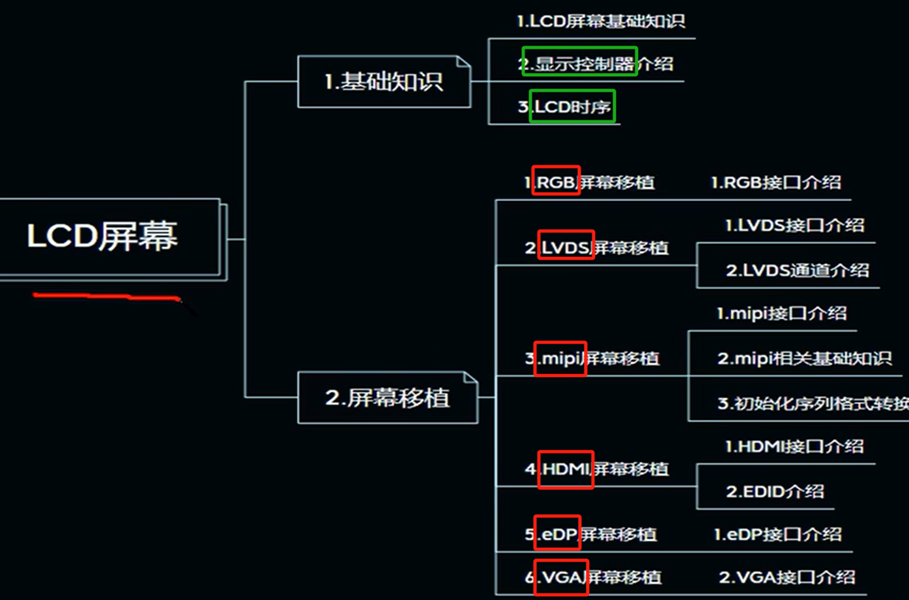
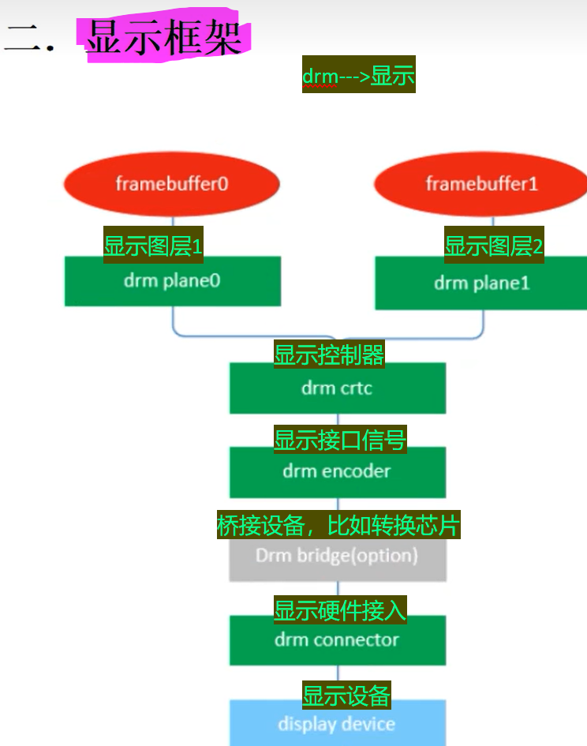
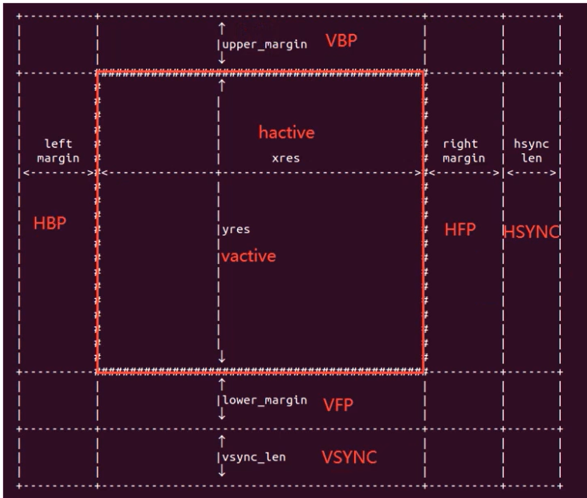
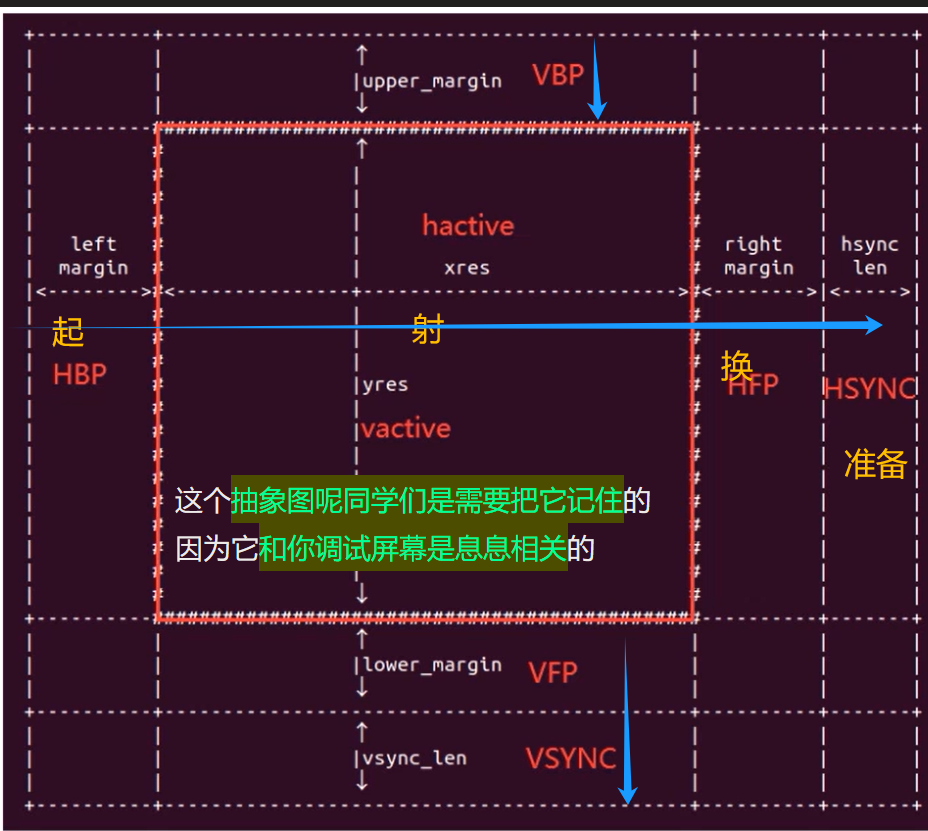
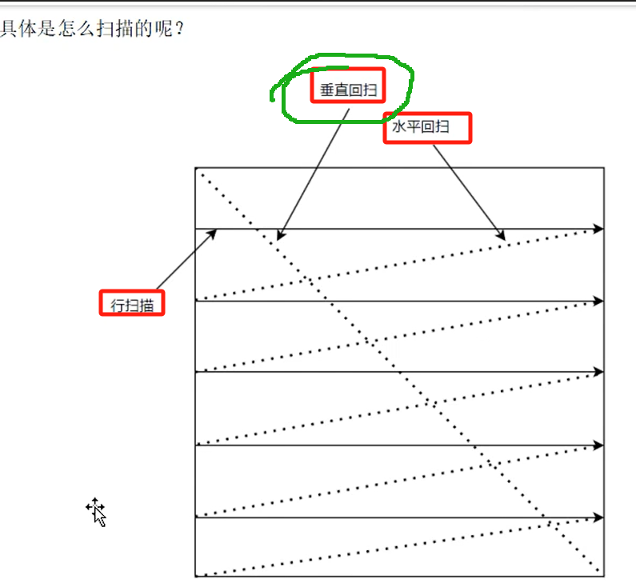
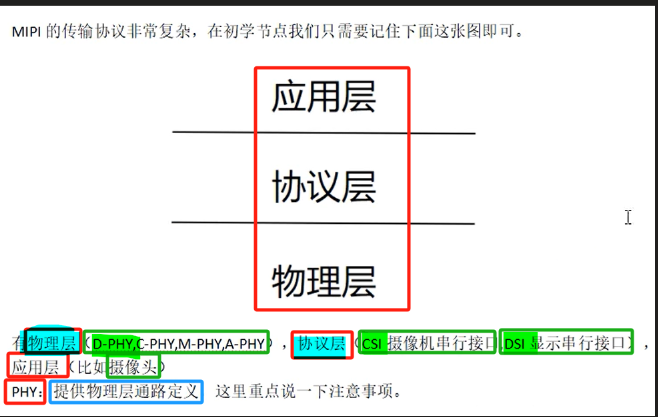
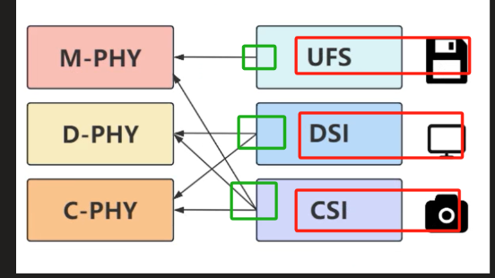

缺少迅为编写的LCD屏幕设备树节点，总觉得缺少什么。后面再仔细探究一下。

# 备注(声明)：

# 一、基础知识

## LCD屏幕基础知识介绍
### 1 、CRT 屏幕介绍 - 少见
[“1.LCD屏幕基础知识介绍”页上的图片](onenote:https://d.docs.live.net/52d4b76bb0ffcf51/Documents/\(RK3568\)Linux驱动开发/第二十六期_LCD.one#1.LCD屏幕基础知识介绍&section-id={941C41F9-0C10-42B9-BBD5-4E4ABC5B7873}&page-id={A12CEF7C-AB03-4153-B527-B51CC5175484}&object-id={C42CE894-0EC7-4A5D-A6A1-8744C0851DED}&1C)  ([Web 视图](https://onedrive.live.com/view.aspx?resid=52D4B76BB0FFCF51%21se8c325913f784bf694d429e5ee2ab2be&id=documents&wd=target%28%E7%AC%AC%E4%BA%8C%E5%8D%81%E5%85%AD%E6%9C%9F_LCD.one%7C941C41F9-0C10-42B9-BBD5-4E4ABC5B7873%2F1.LCD%E5%B1%8F%E5%B9%95%E5%9F%BA%E7%A1%80%E7%9F%A5%E8%AF%86%E4%BB%8B%E7%BB%8D%7CA12CEF7C-AB03-4153-B527-B51CC5175484%2F%29&wdpartid=%7b86ABEF4F-BB2B-4723-AADD-25DA13AB3E09%7d%7b1%7d&wdsectionfileid=52D4B76BB0FFCF51!s70abb153b86e4f5dbc7f8b1f144f1014))

### 2 、LCD屏幕介绍 - 液晶显示屏
[“1.LCD屏幕基础知识介绍”页上的图片](onenote:https://d.docs.live.net/52d4b76bb0ffcf51/Documents/\(RK3568\)Linux驱动开发/第二十六期_LCD.one#1.LCD屏幕基础知识介绍&section-id={941C41F9-0C10-42B9-BBD5-4E4ABC5B7873}&page-id={A12CEF7C-AB03-4153-B527-B51CC5175484}&object-id={C42CE894-0EC7-4A5D-A6A1-8744C0851DED}&12)  ([Web 视图](https://onedrive.live.com/view.aspx?resid=52D4B76BB0FFCF51%21se8c325913f784bf694d429e5ee2ab2be&id=documents&wd=target%28%E7%AC%AC%E4%BA%8C%E5%8D%81%E5%85%AD%E6%9C%9F_LCD.one%7C941C41F9-0C10-42B9-BBD5-4E4ABC5B7873%2F1.LCD%E5%B1%8F%E5%B9%95%E5%9F%BA%E7%A1%80%E7%9F%A5%E8%AF%86%E4%BB%8B%E7%BB%8D%7CA12CEF7C-AB03-4153-B527-B51CC5175484%2F%29&wdpartid=%7b86ABEF4F-BB2B-4723-AADD-25DA13AB3E09%7d%7b1%7d&wdsectionfileid=52D4B76BB0FFCF51!s70abb153b86e4f5dbc7f8b1f144f1014))

### 3 、OLED 屏幕介绍 - 无需背光灯
[“1.LCD屏幕基础知识介绍”页上的图片](onenote:https://d.docs.live.net/52d4b76bb0ffcf51/Documents/\(RK3568\)Linux驱动开发/第二十六期_LCD.one#1.LCD屏幕基础知识介绍&section-id={941C41F9-0C10-42B9-BBD5-4E4ABC5B7873}&page-id={A12CEF7C-AB03-4153-B527-B51CC5175484}&object-id={C42CE894-0EC7-4A5D-A6A1-8744C0851DED}&2D)  ([Web 视图](https://onedrive.live.com/view.aspx?resid=52D4B76BB0FFCF51%21se8c325913f784bf694d429e5ee2ab2be&id=documents&wd=target%28%E7%AC%AC%E4%BA%8C%E5%8D%81%E5%85%AD%E6%9C%9F_LCD.one%7C941C41F9-0C10-42B9-BBD5-4E4ABC5B7873%2F1.LCD%E5%B1%8F%E5%B9%95%E5%9F%BA%E7%A1%80%E7%9F%A5%E8%AF%86%E4%BB%8B%E7%BB%8D%7CA12CEF7C-AB03-4153-B527-B51CC5175484%2F%29&wdpartid=%7b86ABEF4F-BB2B-4723-AADD-25DA13AB3E09%7d%7b1%7d&wdsectionfileid=52D4B76BB0FFCF51!s70abb153b86e4f5dbc7f8b1f144f1014))

### 4 、像素 - RGB 小灯
[“1.LCD屏幕基础知识介绍”页上的图片](onenote:https://d.docs.live.net/52d4b76bb0ffcf51/Documents/\(RK3568\)Linux驱动开发/第二十六期_LCD.one#1.LCD屏幕基础知识介绍&section-id={941C41F9-0C10-42B9-BBD5-4E4ABC5B7873}&page-id={A12CEF7C-AB03-4153-B527-B51CC5175484}&object-id={C42CE894-0EC7-4A5D-A6A1-8744C0851DED}&3C)  ([Web 视图](https://onedrive.live.com/view.aspx?resid=52D4B76BB0FFCF51%21se8c325913f784bf694d429e5ee2ab2be&id=documents&wd=target%28%E7%AC%AC%E4%BA%8C%E5%8D%81%E5%85%AD%E6%9C%9F_LCD.one%7C941C41F9-0C10-42B9-BBD5-4E4ABC5B7873%2F1.LCD%E5%B1%8F%E5%B9%95%E5%9F%BA%E7%A1%80%E7%9F%A5%E8%AF%86%E4%BB%8B%E7%BB%8D%7CA12CEF7C-AB03-4153-B527-B51CC5175484%2F%29&wdpartid=%7b86ABEF4F-BB2B-4723-AADD-25DA13AB3E09%7d%7b1%7d&wdsectionfileid=52D4B76BB0FFCF51!s70abb153b86e4f5dbc7f8b1f144f1014))

### 5、分辨率 - 构成屏幕的像素数
[“1.LCD屏幕基础知识介绍”页上的图片](onenote:https://d.docs.live.net/52d4b76bb0ffcf51/Documents/\(RK3568\)Linux驱动开发/第二十六期_LCD.one#1.LCD屏幕基础知识介绍&section-id={941C41F9-0C10-42B9-BBD5-4E4ABC5B7873}&page-id={A12CEF7C-AB03-4153-B527-B51CC5175484}&object-id={C42CE894-0EC7-4A5D-A6A1-8744C0851DED}&49)  ([Web 视图](https://onedrive.live.com/view.aspx?resid=52D4B76BB0FFCF51%21se8c325913f784bf694d429e5ee2ab2be&id=documents&wd=target%28%E7%AC%AC%E4%BA%8C%E5%8D%81%E5%85%AD%E6%9C%9F_LCD.one%7C941C41F9-0C10-42B9-BBD5-4E4ABC5B7873%2F1.LCD%E5%B1%8F%E5%B9%95%E5%9F%BA%E7%A1%80%E7%9F%A5%E8%AF%86%E4%BB%8B%E7%BB%8D%7CA12CEF7C-AB03-4153-B527-B51CC5175484%2F%29&wdpartid=%7b86ABEF4F-BB2B-4723-AADD-25DA13AB3E09%7d%7b1%7d&wdsectionfileid=52D4B76BB0FFCF51!s70abb153b86e4f5dbc7f8b1f144f1014))

### 6、PPI 像素密度 - 一英寸对角线上的像素数
[“1.LCD屏幕基础知识介绍”页上的图片](onenote:https://d.docs.live.net/52d4b76bb0ffcf51/Documents/\(RK3568\)Linux驱动开发/第二十六期_LCD.one#1.LCD屏幕基础知识介绍&section-id={941C41F9-0C10-42B9-BBD5-4E4ABC5B7873}&page-id={A12CEF7C-AB03-4153-B527-B51CC5175484}&object-id={C42CE894-0EC7-4A5D-A6A1-8744C0851DED}&53)  ([Web 视图](https://onedrive.live.com/view.aspx?resid=52D4B76BB0FFCF51%21se8c325913f784bf694d429e5ee2ab2be&id=documents&wd=target%28%E7%AC%AC%E4%BA%8C%E5%8D%81%E5%85%AD%E6%9C%9F_LCD.one%7C941C41F9-0C10-42B9-BBD5-4E4ABC5B7873%2F1.LCD%E5%B1%8F%E5%B9%95%E5%9F%BA%E7%A1%80%E7%9F%A5%E8%AF%86%E4%BB%8B%E7%BB%8D%7CA12CEF7C-AB03-4153-B527-B51CC5175484%2F%29&wdpartid=%7b86ABEF4F-BB2B-4723-AADD-25DA13AB3E09%7d%7b1%7d&wdsectionfileid=52D4B76BB0FFCF51!s70abb153b86e4f5dbc7f8b1f144f1014))

### 7、像素格式 - 常用RGB888
[“1.LCD屏幕基础知识介绍”页上的图片](onenote:https://d.docs.live.net/52d4b76bb0ffcf51/Documents/\(RK3568\)Linux驱动开发/第二十六期_LCD.one#1.LCD屏幕基础知识介绍&section-id={941C41F9-0C10-42B9-BBD5-4E4ABC5B7873}&page-id={A12CEF7C-AB03-4153-B527-B51CC5175484}&object-id={C42CE894-0EC7-4A5D-A6A1-8744C0851DED}&64)  ([Web 视图](https://onedrive.live.com/view.aspx?resid=52D4B76BB0FFCF51%21se8c325913f784bf694d429e5ee2ab2be&id=documents&wd=target%28%E7%AC%AC%E4%BA%8C%E5%8D%81%E5%85%AD%E6%9C%9F_LCD.one%7C941C41F9-0C10-42B9-BBD5-4E4ABC5B7873%2F1.LCD%E5%B1%8F%E5%B9%95%E5%9F%BA%E7%A1%80%E7%9F%A5%E8%AF%86%E4%BB%8B%E7%BB%8D%7CA12CEF7C-AB03-4153-B527-B51CC5175484%2F%29&wdpartid=%7b86ABEF4F-BB2B-4723-AADD-25DA13AB3E09%7d%7b1%7d&wdsectionfileid=52D4B76BB0FFCF51!s70abb153b86e4f5dbc7f8b1f144f1014))

### 8、

## RK3568处理器显示控制器VOP介绍
### 1 、VOP介绍 - lcd控制器
[“2.RK3568处理器显示控制器VOP介绍”页上的图片](onenote:https://d.docs.live.net/52d4b76bb0ffcf51/Documents/\(RK3568\)Linux驱动开发/第二十六期_LCD.one#2.RK3568处理器显示控制器VOP介绍&section-id={941C41F9-0C10-42B9-BBD5-4E4ABC5B7873}&page-id={81207709-FD79-43D6-8864-E0136742337F}&object-id={566346D7-908E-498D-A42E-55B1984B54E5}&28)  ([Web 视图](https://onedrive.live.com/view.aspx?resid=52D4B76BB0FFCF51%21se8c325913f784bf694d429e5ee2ab2be&id=documents&wd=target%28%E7%AC%AC%E4%BA%8C%E5%8D%81%E5%85%AD%E6%9C%9F_LCD.one%7C941C41F9-0C10-42B9-BBD5-4E4ABC5B7873%2F2.RK3568%E5%A4%84%E7%90%86%E5%99%A8%E6%98%BE%E7%A4%BA%E6%8E%A7%E5%88%B6%E5%99%A8VOP%E4%BB%8B%E7%BB%8D%7C81207709-FD79-43D6-8864-E0136742337F%2F%29&wdpartid=%7bAB476EFD-2EA5-4A7F-BA2E-2424D323E0B9%7d%7b1%7d&wdsectionfileid=52D4B76BB0FFCF51!s70abb153b86e4f5dbc7f8b1f144f1014))

### 2 、VOP1（一个 VOP只能在同一时刻驱动一个屏幕独立显示） - RK3399
[“2.RK3568处理器显示控制器VOP介绍”页上的图片](onenote:https://d.docs.live.net/52d4b76bb0ffcf51/Documents/\(RK3568\)Linux驱动开发/第二十六期_LCD.one#2.RK3568处理器显示控制器VOP介绍&section-id={941C41F9-0C10-42B9-BBD5-4E4ABC5B7873}&page-id={81207709-FD79-43D6-8864-E0136742337F}&object-id={566346D7-908E-498D-A42E-55B1984B54E5}&4C)  ([Web 视图](https://onedrive.live.com/view.aspx?resid=52D4B76BB0FFCF51%21se8c325913f784bf694d429e5ee2ab2be&id=documents&wd=target%28%E7%AC%AC%E4%BA%8C%E5%8D%81%E5%85%AD%E6%9C%9F_LCD.one%7C941C41F9-0C10-42B9-BBD5-4E4ABC5B7873%2F2.RK3568%E5%A4%84%E7%90%86%E5%99%A8%E6%98%BE%E7%A4%BA%E6%8E%A7%E5%88%B6%E5%99%A8VOP%E4%BB%8B%E7%BB%8D%7C81207709-FD79-43D6-8864-E0136742337F%2F%29&wdpartid=%7bAB476EFD-2EA5-4A7F-BA2E-2424D323E0B9%7d%7b1%7d&wdsectionfileid=52D4B76BB0FFCF51!s70abb153b86e4f5dbc7f8b1f144f1014))

### 3 、VOP2（仅有一个 VOP， 后端设计多路独立的 VP） - RK3568
[“2.RK3568处理器显示控制器VOP介绍”页上的图片](onenote:https://d.docs.live.net/52d4b76bb0ffcf51/Documents/\(RK3568\)Linux驱动开发/第二十六期_LCD.one#2.RK3568处理器显示控制器VOP介绍&section-id={941C41F9-0C10-42B9-BBD5-4E4ABC5B7873}&page-id={81207709-FD79-43D6-8864-E0136742337F}&object-id={566346D7-908E-498D-A42E-55B1984B54E5}&69)  ([Web 视图](https://onedrive.live.com/view.aspx?resid=52D4B76BB0FFCF51%21se8c325913f784bf694d429e5ee2ab2be&id=documents&wd=target%28%E7%AC%AC%E4%BA%8C%E5%8D%81%E5%85%AD%E6%9C%9F_LCD.one%7C941C41F9-0C10-42B9-BBD5-4E4ABC5B7873%2F2.RK3568%E5%A4%84%E7%90%86%E5%99%A8%E6%98%BE%E7%A4%BA%E6%8E%A7%E5%88%B6%E5%99%A8VOP%E4%BB%8B%E7%BB%8D%7C81207709-FD79-43D6-8864-E0136742337F%2F%29&wdpartid=%7bAB476EFD-2EA5-4A7F-BA2E-2424D323E0B9%7d%7b1%7d&wdsectionfileid=52D4B76BB0FFCF51!s70abb153b86e4f5dbc7f8b1f144f1014))

- 1 几个 VP 就可以实现几路同显或异显

### 4 、RK3568 VP 总览（三个VP接口） - 可知每个VP都支持那些屏幕接口
[“2.RK3568处理器显示控制器VOP介绍”页上的图片](onenote:https://d.docs.live.net/52d4b76bb0ffcf51/Documents/\(RK3568\)Linux驱动开发/第二十六期_LCD.one#2.RK3568处理器显示控制器VOP介绍&section-id={941C41F9-0C10-42B9-BBD5-4E4ABC5B7873}&page-id={81207709-FD79-43D6-8864-E0136742337F}&object-id={566346D7-908E-498D-A42E-55B1984B54E5}&8E)  ([Web 视图](https://onedrive.live.com/view.aspx?resid=52D4B76BB0FFCF51%21se8c325913f784bf694d429e5ee2ab2be&id=documents&wd=target%28%E7%AC%AC%E4%BA%8C%E5%8D%81%E5%85%AD%E6%9C%9F_LCD.one%7C941C41F9-0C10-42B9-BBD5-4E4ABC5B7873%2F2.RK3568%E5%A4%84%E7%90%86%E5%99%A8%E6%98%BE%E7%A4%BA%E6%8E%A7%E5%88%B6%E5%99%A8VOP%E4%BB%8B%E7%BB%8D%7C81207709-FD79-43D6-8864-E0136742337F%2F%29&wdpartid=%7bAB476EFD-2EA5-4A7F-BA2E-2424D323E0B9%7d%7b1%7d&wdsectionfileid=52D4B76BB0FFCF51!s70abb153b86e4f5dbc7f8b1f144f1014))

#### **在设备树上的体现**
[“2.RK3568处理器显示控制器VOP介绍”页上的图片](onenote:https://d.docs.live.net/52d4b76bb0ffcf51/Documents/\(RK3568\)Linux驱动开发/第二十六期_LCD.one#2.RK3568处理器显示控制器VOP介绍&section-id={941C41F9-0C10-42B9-BBD5-4E4ABC5B7873}&page-id={81207709-FD79-43D6-8864-E0136742337F}&object-id={566346D7-908E-498D-A42E-55B1984B54E5}&94)  ([Web 视图](https://onedrive.live.com/view.aspx?resid=52D4B76BB0FFCF51%21se8c325913f784bf694d429e5ee2ab2be&id=documents&wd=target%28%E7%AC%AC%E4%BA%8C%E5%8D%81%E5%85%AD%E6%9C%9F_LCD.one%7C941C41F9-0C10-42B9-BBD5-4E4ABC5B7873%2F2.RK3568%E5%A4%84%E7%90%86%E5%99%A8%E6%98%BE%E7%A4%BA%E6%8E%A7%E5%88%B6%E5%99%A8VOP%E4%BB%8B%E7%BB%8D%7C81207709-FD79-43D6-8864-E0136742337F%2F%29&wdpartid=%7bAB476EFD-2EA5-4A7F-BA2E-2424D323E0B9%7d%7b1%7d&wdsectionfileid=52D4B76BB0FFCF51!s70abb153b86e4f5dbc7f8b1f144f1014))

- 1 设备数是对硬件的描述文件，那在设备数中你应该就有所体现
### 5、开发板上各个屏幕接口位置
[“2.RK3568处理器显示控制器VOP介绍”页上的图片](onenote:https://d.docs.live.net/52d4b76bb0ffcf51/Documents/\(RK3568\)Linux驱动开发/第二十六期_LCD.one#2.RK3568处理器显示控制器VOP介绍&section-id={941C41F9-0C10-42B9-BBD5-4E4ABC5B7873}&page-id={81207709-FD79-43D6-8864-E0136742337F}&object-id={566346D7-908E-498D-A42E-55B1984B54E5}&DE)  ([Web 视图](https://onedrive.live.com/view.aspx?resid=52D4B76BB0FFCF51%21se8c325913f784bf694d429e5ee2ab2be&id=documents&wd=target%28%E7%AC%AC%E4%BA%8C%E5%8D%81%E5%85%AD%E6%9C%9F_LCD.one%7C941C41F9-0C10-42B9-BBD5-4E4ABC5B7873%2F2.RK3568%E5%A4%84%E7%90%86%E5%99%A8%E6%98%BE%E7%A4%BA%E6%8E%A7%E5%88%B6%E5%99%A8VOP%E4%BB%8B%E7%BB%8D%7C81207709-FD79-43D6-8864-E0136742337F%2F%29&wdpartid=%7bAB476EFD-2EA5-4A7F-BA2E-2424D323E0B9%7d%7b1%7d&wdsectionfileid=52D4B76BB0FFCF51!s70abb153b86e4f5dbc7f8b1f144f1014))

### 6、

### 7、

### 8、

## 显示控制器相关概念
### 1 、基本的名词概念解释
[“3.显示控制器相关概念”页上的图片](onenote:https://d.docs.live.net/52d4b76bb0ffcf51/Documents/\(RK3568\)Linux驱动开发/第二十六期_LCD.one#3.显示控制器相关概念&section-id={941C41F9-0C10-42B9-BBD5-4E4ABC5B7873}&page-id={664009B2-DD58-4486-8487-86EFEF8292C4}&object-id={82A2C4DF-C83F-4D5E-A8BF-E67506839FB4}&12)  ([Web 视图](https://onedrive.live.com/view.aspx?resid=52D4B76BB0FFCF51%21se8c325913f784bf694d429e5ee2ab2be&id=documents&wd=target%28%E7%AC%AC%E4%BA%8C%E5%8D%81%E5%85%AD%E6%9C%9F_LCD.one%7C941C41F9-0C10-42B9-BBD5-4E4ABC5B7873%2F3.%E6%98%BE%E7%A4%BA%E6%8E%A7%E5%88%B6%E5%99%A8%E7%9B%B8%E5%85%B3%E6%A6%82%E5%BF%B5%7C664009B2-DD58-4486-8487-86EFEF8292C4%2F%29&wdpartid=%7bE4592C5C-35F5-44F1-A531-8170D0CBD860%7d%7b1%7d&wdsectionfileid=52D4B76BB0FFCF51!s70abb153b86e4f5dbc7f8b1f144f1014))

### 2 、显示框架

### 3 、VOP 2.0 架构下的多屏显示
[“3.显示控制器相关概念”页上的图片](onenote:https://d.docs.live.net/52d4b76bb0ffcf51/Documents/\(RK3568\)Linux驱动开发/第二十六期_LCD.one#3.显示控制器相关概念&section-id={941C41F9-0C10-42B9-BBD5-4E4ABC5B7873}&page-id={664009B2-DD58-4486-8487-86EFEF8292C4}&object-id={247A8C11-F1CC-43E5-BB8F-CFCA351F02C2}&65)  ([Web 视图](https://onedrive.live.com/view.aspx?resid=52D4B76BB0FFCF51%21se8c325913f784bf694d429e5ee2ab2be&id=documents&wd=target%28%E7%AC%AC%E4%BA%8C%E5%8D%81%E5%85%AD%E6%9C%9F_LCD.one%7C941C41F9-0C10-42B9-BBD5-4E4ABC5B7873%2F3.%E6%98%BE%E7%A4%BA%E6%8E%A7%E5%88%B6%E5%99%A8%E7%9B%B8%E5%85%B3%E6%A6%82%E5%BF%B5%7C664009B2-DD58-4486-8487-86EFEF8292C4%2F%29&wdpartid=%7bE4592C5C-35F5-44F1-A531-8170D0CBD860%7d%7b1%7d&wdsectionfileid=52D4B76BB0FFCF51!s70abb153b86e4f5dbc7f8b1f144f1014))

#### Connector-mirror 技术 - 同一个 Vdeo Port 上接两个显示接口，输出的显示时序相同，且显示内容相同，
[“3.显示控制器相关概念”页上的图片](onenote:https://d.docs.live.net/52d4b76bb0ffcf51/Documents/\(RK3568\)Linux驱动开发/第二十六期_LCD.one#3.显示控制器相关概念&section-id={941C41F9-0C10-42B9-BBD5-4E4ABC5B7873}&page-id={664009B2-DD58-4486-8487-86EFEF8292C4}&object-id={247A8C11-F1CC-43E5-BB8F-CFCA351F02C2}&6D)  ([Web 视图](https://onedrive.live.com/view.aspx?resid=52D4B76BB0FFCF51%21se8c325913f784bf694d429e5ee2ab2be&id=documents&wd=target%28%E7%AC%AC%E4%BA%8C%E5%8D%81%E5%85%AD%E6%9C%9F_LCD.one%7C941C41F9-0C10-42B9-BBD5-4E4ABC5B7873%2F3.%E6%98%BE%E7%A4%BA%E6%8E%A7%E5%88%B6%E5%99%A8%E7%9B%B8%E5%85%B3%E6%A6%82%E5%BF%B5%7C664009B2-DD58-4486-8487-86EFEF8292C4%2F%29&wdpartid=%7bE4592C5C-35F5-44F1-A531-8170D0CBD860%7d%7b1%7d&wdsectionfileid=52D4B76BB0FFCF51!s70abb153b86e4f5dbc7f8b1f144f1014))

#### vop-split 功能 - 让一路VP输出按照水平方向平分成左右两路，同时驱动两个显示接口，显示时序相同，内容独立
[“3.显示控制器相关概念”页上的图片](onenote:https://d.docs.live.net/52d4b76bb0ffcf51/Documents/\(RK3568\)Linux驱动开发/第二十六期_LCD.one#3.显示控制器相关概念&section-id={941C41F9-0C10-42B9-BBD5-4E4ABC5B7873}&page-id={664009B2-DD58-4486-8487-86EFEF8292C4}&object-id={247A8C11-F1CC-43E5-BB8F-CFCA351F02C2}&7C)  ([Web 视图](https://onedrive.live.com/view.aspx?resid=52D4B76BB0FFCF51%21se8c325913f784bf694d429e5ee2ab2be&id=documents&wd=target%28%E7%AC%AC%E4%BA%8C%E5%8D%81%E5%85%AD%E6%9C%9F_LCD.one%7C941C41F9-0C10-42B9-BBD5-4E4ABC5B7873%2F3.%E6%98%BE%E7%A4%BA%E6%8E%A7%E5%88%B6%E5%99%A8%E7%9B%B8%E5%85%B3%E6%A6%82%E5%BF%B5%7C664009B2-DD58-4486-8487-86EFEF8292C4%2F%29&wdpartid=%7bE4592C5C-35F5-44F1-A531-8170D0CBD860%7d%7b1%7d&wdsectionfileid=52D4B76BB0FFCF51!s70abb153b86e4f5dbc7f8b1f144f1014))

## LCD时序(抽象图)
### 1 、Linux 中对LCD 的抽象图
[“4.LCD时序(抽象图)”页上的图片](onenote:https://d.docs.live.net/52d4b76bb0ffcf51/Documents/\(RK3568\)Linux驱动开发/第二十六期_LCD.one#4.LCD时序\(抽象图\)&section-id={941C41F9-0C10-42B9-BBD5-4E4ABC5B7873}&page-id={C8177DB2-79A8-47FA-A7E2-5C7174CE3E0F}&object-id={3ECC8630-3185-448F-8A0B-4914128066C1}&22)  ([Web 视图](https://onedrive.live.com/view.aspx?resid=52D4B76BB0FFCF51%21se8c325913f784bf694d429e5ee2ab2be&id=documents&wd=target%28%E7%AC%AC%E4%BA%8C%E5%8D%81%E5%85%AD%E6%9C%9F_LCD.one%7C941C41F9-0C10-42B9-BBD5-4E4ABC5B7873%2F4.LCD%E6%97%B6%E5%BA%8F%28%E6%8A%BD%E8%B1%A1%E5%9B%BE%5C%29%7CC8177DB2-79A8-47FA-A7E2-5C7174CE3E0F%2F%29&wdpartid=%7b156E406E-2202-4DA7-AA61-81F4D1151E68%7d%7b1%7d&wdsectionfileid=52D4B76BB0FFCF51!s70abb153b86e4f5dbc7f8b1f144f1014))

- 1 红色区域所表示的是屏幕有效显示范围，区域外的其他部分此时就相当于屏幕黑边

### 2 、抽象图上名词介绍
[“4.LCD时序(抽象图)”页上的图片](onenote:https://d.docs.live.net/52d4b76bb0ffcf51/Documents/\(RK3568\)Linux驱动开发/第二十六期_LCD.one#4.LCD时序\(抽象图\)&section-id={941C41F9-0C10-42B9-BBD5-4E4ABC5B7873}&page-id={C8177DB2-79A8-47FA-A7E2-5C7174CE3E0F}&object-id={3ECC8630-3185-448F-8A0B-4914128066C1}&4B)  ([Web 视图](https://onedrive.live.com/view.aspx?resid=52D4B76BB0FFCF51%21se8c325913f784bf694d429e5ee2ab2be&id=documents&wd=target%28%E7%AC%AC%E4%BA%8C%E5%8D%81%E5%85%AD%E6%9C%9F_LCD.one%7C941C41F9-0C10-42B9-BBD5-4E4ABC5B7873%2F4.LCD%E6%97%B6%E5%BA%8F%28%E6%8A%BD%E8%B1%A1%E5%9B%BE%5C%29%7CC8177DB2-79A8-47FA-A7E2-5C7174CE3E0F%2F%29&wdpartid=%7b156E406E-2202-4DA7-AA61-81F4D1151E68%7d%7b1%7d&wdsectionfileid=52D4B76BB0FFCF51!s70abb153b86e4f5dbc7f8b1f144f1014))

### 3 、扫描画面过程图
[“4.LCD时序(抽象图)”页上的图片](onenote:https://d.docs.live.net/52d4b76bb0ffcf51/Documents/\(RK3568\)Linux驱动开发/第二十六期_LCD.one#4.LCD时序\(抽象图\)&section-id={941C41F9-0C10-42B9-BBD5-4E4ABC5B7873}&page-id={C8177DB2-79A8-47FA-A7E2-5C7174CE3E0F}&object-id={3ECC8630-3185-448F-8A0B-4914128066C1}&C1)  ([Web 视图](https://onedrive.live.com/view.aspx?resid=52D4B76BB0FFCF51%21se8c325913f784bf694d429e5ee2ab2be&id=documents&wd=target%28%E7%AC%AC%E4%BA%8C%E5%8D%81%E5%85%AD%E6%9C%9F_LCD.one%7C941C41F9-0C10-42B9-BBD5-4E4ABC5B7873%2F4.LCD%E6%97%B6%E5%BA%8F%28%E6%8A%BD%E8%B1%A1%E5%9B%BE%5C%29%7CC8177DB2-79A8-47FA-A7E2-5C7174CE3E0F%2F%29&wdpartid=%7b156E406E-2202-4DA7-AA61-81F4D1151E68%7d%7b1%7d&wdsectionfileid=52D4B76BB0FFCF51!s70abb153b86e4f5dbc7f8b1f144f1014))

- 1 画面显示有错位，那往往就是你这几个部分的参数没有设置好

- 1 参数对应的大小就不一样，一般呢我们是需要通过屏幕的数据手册来确定
### 4 、4412的LCD时序图
[“4.LCD时序(抽象图)”页上的图片](onenote:https://d.docs.live.net/52d4b76bb0ffcf51/Documents/\(RK3568\)Linux驱动开发/第二十六期_LCD.one#4.LCD时序\(抽象图\)&section-id={941C41F9-0C10-42B9-BBD5-4E4ABC5B7873}&page-id={C8177DB2-79A8-47FA-A7E2-5C7174CE3E0F}&object-id={9064DBFA-6935-4B77-B587-C4BA87C8B246}&30)  ([Web 视图](https://onedrive.live.com/view.aspx?resid=52D4B76BB0FFCF51%21se8c325913f784bf694d429e5ee2ab2be&id=documents&wd=target%28%E7%AC%AC%E4%BA%8C%E5%8D%81%E5%85%AD%E6%9C%9F_LCD.one%7C941C41F9-0C10-42B9-BBD5-4E4ABC5B7873%2F4.LCD%E6%97%B6%E5%BA%8F%28%E6%8A%BD%E8%B1%A1%E5%9B%BE%5C%29%7CC8177DB2-79A8-47FA-A7E2-5C7174CE3E0F%2F%29&wdpartid=%7b156E406E-2202-4DA7-AA61-81F4D1151E68%7d%7b1%7d&wdsectionfileid=52D4B76BB0FFCF51!s70abb153b86e4f5dbc7f8b1f144f1014))

### 5、

### 6、

### 7、

### 8、

# 二、RGB屏幕移植

## RGB接口
### 1 、RGB 接口信号线对应的作用
[“5.RGB接口”页上的图片](onenote:https://d.docs.live.net/52d4b76bb0ffcf51/Documents/\(RK3568\)Linux驱动开发/第二十六期_LCD.one#5.RGB接口&section-id={941C41F9-0C10-42B9-BBD5-4E4ABC5B7873}&page-id={EDFBFB5D-FC96-4EB2-AA7B-96D378F099A2}&object-id={5879B78B-DE2B-4E6F-8367-58C5A41C117B}&18)  ([Web 视图](https://onedrive.live.com/view.aspx?resid=52D4B76BB0FFCF51%21se8c325913f784bf694d429e5ee2ab2be&id=documents&wd=target%28%E7%AC%AC%E4%BA%8C%E5%8D%81%E5%85%AD%E6%9C%9F_LCD.one%7C941C41F9-0C10-42B9-BBD5-4E4ABC5B7873%2F5.RGB%E6%8E%A5%E5%8F%A3%7CEDFBFB5D-FC96-4EB2-AA7B-96D378F099A2%2F%29&wdpartid=%7bC5393359-415E-4F20-B112-268CEA96C17C%7d%7b1%7d&wdsectionfileid=52D4B76BB0FFCF51!s70abb153b86e4f5dbc7f8b1f144f1014))

### 2 、硬件连接定义 - 从数据手册中确定（imx6ull举例）
[“5.RGB接口”页上的图片](onenote:https://d.docs.live.net/52d4b76bb0ffcf51/Documents/\(RK3568\)Linux驱动开发/第二十六期_LCD.one#5.RGB接口&section-id={941C41F9-0C10-42B9-BBD5-4E4ABC5B7873}&page-id={EDFBFB5D-FC96-4EB2-AA7B-96D378F099A2}&object-id={5879B78B-DE2B-4E6F-8367-58C5A41C117B}&2B)  ([Web 视图](https://onedrive.live.com/view.aspx?resid=52D4B76BB0FFCF51%21se8c325913f784bf694d429e5ee2ab2be&id=documents&wd=target%28%E7%AC%AC%E4%BA%8C%E5%8D%81%E5%85%AD%E6%9C%9F_LCD.one%7C941C41F9-0C10-42B9-BBD5-4E4ABC5B7873%2F5.RGB%E6%8E%A5%E5%8F%A3%7CEDFBFB5D-FC96-4EB2-AA7B-96D378F099A2%2F%29&wdpartid=%7bC5393359-415E-4F20-B112-268CEA96C17C%7d%7b1%7d&wdsectionfileid=52D4B76BB0FFCF51!s70abb153b86e4f5dbc7f8b1f144f1014))

### 3 、rK3568核心版支持RGB接口的硬件原理图
[“5.RGB接口”页上的图片](onenote:https://d.docs.live.net/52d4b76bb0ffcf51/Documents/\(RK3568\)Linux驱动开发/第二十六期_LCD.one#5.RGB接口&section-id={941C41F9-0C10-42B9-BBD5-4E4ABC5B7873}&page-id={EDFBFB5D-FC96-4EB2-AA7B-96D378F099A2}&object-id={5879B78B-DE2B-4E6F-8367-58C5A41C117B}&6B)  ([Web 视图](https://onedrive.live.com/view.aspx?resid=52D4B76BB0FFCF51%21se8c325913f784bf694d429e5ee2ab2be&id=documents&wd=target%28%E7%AC%AC%E4%BA%8C%E5%8D%81%E5%85%AD%E6%9C%9F_LCD.one%7C941C41F9-0C10-42B9-BBD5-4E4ABC5B7873%2F5.RGB%E6%8E%A5%E5%8F%A3%7CEDFBFB5D-FC96-4EB2-AA7B-96D378F099A2%2F%29&wdpartid=%7bC5393359-415E-4F20-B112-268CEA96C17C%7d%7b1%7d&wdsectionfileid=52D4B76BB0FFCF51!s70abb153b86e4f5dbc7f8b1f144f1014))

- **其他**
[“5.RGB接口”页上的图片](onenote:https://d.docs.live.net/52d4b76bb0ffcf51/Documents/\(RK3568\)Linux驱动开发/第二十六期_LCD.one#5.RGB接口&section-id={941C41F9-0C10-42B9-BBD5-4E4ABC5B7873}&page-id={EDFBFB5D-FC96-4EB2-AA7B-96D378F099A2}&object-id={5879B78B-DE2B-4E6F-8367-58C5A41C117B}&98)  ([Web 视图](https://onedrive.live.com/view.aspx?resid=52D4B76BB0FFCF51%21se8c325913f784bf694d429e5ee2ab2be&id=documents&wd=target%28%E7%AC%AC%E4%BA%8C%E5%8D%81%E5%85%AD%E6%9C%9F_LCD.one%7C941C41F9-0C10-42B9-BBD5-4E4ABC5B7873%2F5.RGB%E6%8E%A5%E5%8F%A3%7CEDFBFB5D-FC96-4EB2-AA7B-96D378F099A2%2F%29&wdpartid=%7bC5393359-415E-4F20-B112-268CEA96C17C%7d%7b1%7d&wdsectionfileid=52D4B76BB0FFCF51!s70abb153b86e4f5dbc7f8b1f144f1014))
### 4 、转接板的作用
[LCD屏幕的RGB接口它并不是直接和处理器相连的](onenote:https://d.docs.live.net/52d4b76bb0ffcf51/Documents/\(RK3568\)Linux驱动开发/第二十六期_LCD.one#5.RGB接口&section-id={941C41F9-0C10-42B9-BBD5-4E4ABC5B7873}&page-id={EDFBFB5D-FC96-4EB2-AA7B-96D378F099A2}&object-id={5879B78B-DE2B-4E6F-8367-58C5A41C117B}&DB)  ([Web 视图](https://onedrive.live.com/view.aspx?resid=52D4B76BB0FFCF51%21se8c325913f784bf694d429e5ee2ab2be&id=documents&wd=target%28%E7%AC%AC%E4%BA%8C%E5%8D%81%E5%85%AD%E6%9C%9F_LCD.one%7C941C41F9-0C10-42B9-BBD5-4E4ABC5B7873%2F5.RGB%E6%8E%A5%E5%8F%A3%7CEDFBFB5D-FC96-4EB2-AA7B-96D378F099A2%2F%29&wdpartid=%7bC5393359-415E-4F20-B112-268CEA96C17C%7d%7b1%7d&wdsectionfileid=52D4B76BB0FFCF51!s70abb153b86e4f5dbc7f8b1f144f1014))

### 5、开发板硬件连接原理图（imx6ull举例）
[“5.RGB接口”页上的图片](onenote:https://d.docs.live.net/52d4b76bb0ffcf51/Documents/\(RK3568\)Linux驱动开发/第二十六期_LCD.one#5.RGB接口&section-id={941C41F9-0C10-42B9-BBD5-4E4ABC5B7873}&page-id={EDFBFB5D-FC96-4EB2-AA7B-96D378F099A2}&object-id={ED9FDCE0-2DEA-4788-8611-73F15F781BE9}&3D)  ([Web 视图](https://onedrive.live.com/view.aspx?resid=52D4B76BB0FFCF51%21se8c325913f784bf694d429e5ee2ab2be&id=documents&wd=target%28%E7%AC%AC%E4%BA%8C%E5%8D%81%E5%85%AD%E6%9C%9F_LCD.one%7C941C41F9-0C10-42B9-BBD5-4E4ABC5B7873%2F5.RGB%E6%8E%A5%E5%8F%A3%7CEDFBFB5D-FC96-4EB2-AA7B-96D378F099A2%2F%29&wdpartid=%7bC5393359-415E-4F20-B112-268CEA96C17C%7d%7b1%7d&wdsectionfileid=52D4B76BB0FFCF51!s70abb153b86e4f5dbc7f8b1f144f1014))

### 6、

### 7、

### 8、

## RGB接口同步模式
### 1 、DE 信号线 - 与HV、DE 模式的关系
[“6.RGB接口同步模式”页上的图片](onenote:https://d.docs.live.net/52d4b76bb0ffcf51/Documents/\(RK3568\)Linux驱动开发/第二十六期_LCD.one#6.RGB接口同步模式&section-id={941C41F9-0C10-42B9-BBD5-4E4ABC5B7873}&page-id={0FE3461D-A742-4573-A46B-D4984FB841F7}&object-id={B1BF6EDA-0477-4DDF-8137-AED0CEC80C56}&28)  ([Web 视图](https://onedrive.live.com/view.aspx?resid=52D4B76BB0FFCF51%21se8c325913f784bf694d429e5ee2ab2be&id=documents&wd=target%28%E7%AC%AC%E4%BA%8C%E5%8D%81%E5%85%AD%E6%9C%9F_LCD.one%7C941C41F9-0C10-42B9-BBD5-4E4ABC5B7873%2F6.RGB%E6%8E%A5%E5%8F%A3%E5%90%8C%E6%AD%A5%E6%A8%A1%E5%BC%8F%7C0FE3461D-A742-4573-A46B-D4984FB841F7%2F%29&wdpartid=%7bE87B3040-1CB9-4C72-94F5-262E841100EE%7d%7b1%7d&wdsectionfileid=52D4B76BB0FFCF51!s70abb153b86e4f5dbc7f8b1f144f1014))

### 2 、如何切换 - 通过 LCD 屏幕的 MODE 引脚切换
[“6.RGB接口同步模式”页上的图片](onenote:https://d.docs.live.net/52d4b76bb0ffcf51/Documents/\(RK3568\)Linux驱动开发/第二十六期_LCD.one#6.RGB接口同步模式&section-id={941C41F9-0C10-42B9-BBD5-4E4ABC5B7873}&page-id={0FE3461D-A742-4573-A46B-D4984FB841F7}&object-id={B1BF6EDA-0477-4DDF-8137-AED0CEC80C56}&38)  ([Web 视图](https://onedrive.live.com/view.aspx?resid=52D4B76BB0FFCF51%21se8c325913f784bf694d429e5ee2ab2be&id=documents&wd=target%28%E7%AC%AC%E4%BA%8C%E5%8D%81%E5%85%AD%E6%9C%9F_LCD.one%7C941C41F9-0C10-42B9-BBD5-4E4ABC5B7873%2F6.RGB%E6%8E%A5%E5%8F%A3%E5%90%8C%E6%AD%A5%E6%A8%A1%E5%BC%8F%7C0FE3461D-A742-4573-A46B-D4984FB841F7%2F%29&wdpartid=%7bE87B3040-1CB9-4C72-94F5-262E841100EE%7d%7b1%7d&wdsectionfileid=52D4B76BB0FFCF51!s70abb153b86e4f5dbc7f8b1f144f1014))

- 1 不建议同学们自己切换
### 3 、DE 模式讲解
[“6.RGB接口同步模式”页上的图片](onenote:https://d.docs.live.net/52d4b76bb0ffcf51/Documents/\(RK3568\)Linux驱动开发/第二十六期_LCD.one#6.RGB接口同步模式&section-id={941C41F9-0C10-42B9-BBD5-4E4ABC5B7873}&page-id={0FE3461D-A742-4573-A46B-D4984FB841F7}&object-id={B1BF6EDA-0477-4DDF-8137-AED0CEC80C56}&40)  ([Web 视图](https://onedrive.live.com/view.aspx?resid=52D4B76BB0FFCF51%21se8c325913f784bf694d429e5ee2ab2be&id=documents&wd=target%28%E7%AC%AC%E4%BA%8C%E5%8D%81%E5%85%AD%E6%9C%9F_LCD.one%7C941C41F9-0C10-42B9-BBD5-4E4ABC5B7873%2F6.RGB%E6%8E%A5%E5%8F%A3%E5%90%8C%E6%AD%A5%E6%A8%A1%E5%BC%8F%7C0FE3461D-A742-4573-A46B-D4984FB841F7%2F%29&wdpartid=%7bE87B3040-1CB9-4C72-94F5-262E841100EE%7d%7b1%7d&wdsectionfileid=52D4B76BB0FFCF51!s70abb153b86e4f5dbc7f8b1f144f1014))

### 4 、HV模式讲解
[“6.RGB接口同步模式”页上的图片](onenote:https://d.docs.live.net/52d4b76bb0ffcf51/Documents/\(RK3568\)Linux驱动开发/第二十六期_LCD.one#6.RGB接口同步模式&section-id={941C41F9-0C10-42B9-BBD5-4E4ABC5B7873}&page-id={0FE3461D-A742-4573-A46B-D4984FB841F7}&object-id={B1BF6EDA-0477-4DDF-8137-AED0CEC80C56}&45)  ([Web 视图](https://onedrive.live.com/view.aspx?resid=52D4B76BB0FFCF51%21se8c325913f784bf694d429e5ee2ab2be&id=documents&wd=target%28%E7%AC%AC%E4%BA%8C%E5%8D%81%E5%85%AD%E6%9C%9F_LCD.one%7C941C41F9-0C10-42B9-BBD5-4E4ABC5B7873%2F6.RGB%E6%8E%A5%E5%8F%A3%E5%90%8C%E6%AD%A5%E6%A8%A1%E5%BC%8F%7C0FE3461D-A742-4573-A46B-D4984FB841F7%2F%29&wdpartid=%7bE87B3040-1CB9-4C72-94F5-262E841100EE%7d%7b1%7d&wdsectionfileid=52D4B76BB0FFCF51!s70abb153b86e4f5dbc7f8b1f144f1014))

### 5、

### 6、

### 7、

### 8、

## RGB屏幕移植（1）- 配置设备树
- 1 缺少讲义和设备树的文件

### 1 、 确定用哪路 VP
[“7.RGB屏幕移植（1）”页上的图片](onenote:https://d.docs.live.net/52d4b76bb0ffcf51/Documents/\(RK3568\)Linux驱动开发/第二十六期_LCD.one#7.RGB屏幕移植（1）&section-id={941C41F9-0C10-42B9-BBD5-4E4ABC5B7873}&page-id={7B3BCF9C-C9FF-43DF-B561-511F47D353FA}&object-id={33ADB971-FF62-4BF7-BBB6-08FD2343B229}&2D)  ([Web 视图](https://onedrive.live.com/view.aspx?resid=52D4B76BB0FFCF51%21se8c325913f784bf694d429e5ee2ab2be&id=documents&wd=target%28%E7%AC%AC%E4%BA%8C%E5%8D%81%E5%85%AD%E6%9C%9F_LCD.one%7C941C41F9-0C10-42B9-BBD5-4E4ABC5B7873%2F7.RGB%E5%B1%8F%E5%B9%95%E7%A7%BB%E6%A4%8D%EF%BC%881%EF%BC%89%7C7B3BCF9C-C9FF-43DF-B561-511F47D353FA%2F%29&wdpartid=%7b10BAF5D9-14C8-4131-9872-8CBA375BB7C6%7d%7b1%7d&wdsectionfileid=52D4B76BB0FFCF51!s70abb153b86e4f5dbc7f8b1f144f1014))

### 2 、打开VOP节点（vop）
[“7.RGB屏幕移植（1）”页上的图片](onenote:https://d.docs.live.net/52d4b76bb0ffcf51/Documents/\(RK3568\)Linux驱动开发/第二十六期_LCD.one#7.RGB屏幕移植（1）&section-id={941C41F9-0C10-42B9-BBD5-4E4ABC5B7873}&page-id={7B3BCF9C-C9FF-43DF-B561-511F47D353FA}&object-id={56B6DBC5-732F-416A-9BB0-4D3B4C9956AD}&1E)  ([Web 视图](https://onedrive.live.com/view.aspx?resid=52D4B76BB0FFCF51%21se8c325913f784bf694d429e5ee2ab2be&id=documents&wd=target%28%E7%AC%AC%E4%BA%8C%E5%8D%81%E5%85%AD%E6%9C%9F_LCD.one%7C941C41F9-0C10-42B9-BBD5-4E4ABC5B7873%2F7.RGB%E5%B1%8F%E5%B9%95%E7%A7%BB%E6%A4%8D%EF%BC%881%EF%BC%89%7C7B3BCF9C-C9FF-43DF-B561-511F47D353FA%2F%29&wdpartid=%7b10BAF5D9-14C8-4131-9872-8CBA375BB7C6%7d%7b1%7d&wdsectionfileid=52D4B76BB0FFCF51!s70abb153b86e4f5dbc7f8b1f144f1014))

### 3 、先配置显示通路
[“7.RGB屏幕移植（1）”页上的图片](onenote:https://d.docs.live.net/52d4b76bb0ffcf51/Documents/\(RK3568\)Linux驱动开发/第二十六期_LCD.one#7.RGB屏幕移植（1）&section-id={941C41F9-0C10-42B9-BBD5-4E4ABC5B7873}&page-id={7B3BCF9C-C9FF-43DF-B561-511F47D353FA}&object-id={B7285F2A-B2A1-4BE4-840A-C658BC5CDB18}&B8)  ([Web 视图](https://onedrive.live.com/view.aspx?resid=52D4B76BB0FFCF51%21se8c325913f784bf694d429e5ee2ab2be&id=documents&wd=target%28%E7%AC%AC%E4%BA%8C%E5%8D%81%E5%85%AD%E6%9C%9F_LCD.one%7C941C41F9-0C10-42B9-BBD5-4E4ABC5B7873%2F7.RGB%E5%B1%8F%E5%B9%95%E7%A7%BB%E6%A4%8D%EF%BC%881%EF%BC%89%7C7B3BCF9C-C9FF-43DF-B561-511F47D353FA%2F%29&wdpartid=%7b10BAF5D9-14C8-4131-9872-8CBA375BB7C6%7d%7b1%7d&wdsectionfileid=52D4B76BB0FFCF51!s70abb153b86e4f5dbc7f8b1f144f1014))

### 4 、使能 VP2 的 RGB 接口（rgb_in_vp2） 
[“7.RGB屏幕移植（1）”页上的图片](onenote:https://d.docs.live.net/52d4b76bb0ffcf51/Documents/\(RK3568\)Linux驱动开发/第二十六期_LCD.one#7.RGB屏幕移植（1）&section-id={941C41F9-0C10-42B9-BBD5-4E4ABC5B7873}&page-id={7B3BCF9C-C9FF-43DF-B561-511F47D353FA}&object-id={470EB1C9-5F50-45FB-A23A-907E4BECD30F}&F1)  ([Web 视图](https://onedrive.live.com/view.aspx?resid=52D4B76BB0FFCF51%21se8c325913f784bf694d429e5ee2ab2be&id=documents&wd=target%28%E7%AC%AC%E4%BA%8C%E5%8D%81%E5%85%AD%E6%9C%9F_LCD.one%7C941C41F9-0C10-42B9-BBD5-4E4ABC5B7873%2F7.RGB%E5%B1%8F%E5%B9%95%E7%A7%BB%E6%A4%8D%EF%BC%881%EF%BC%89%7C7B3BCF9C-C9FF-43DF-B561-511F47D353FA%2F%29&wdpartid=%7b10BAF5D9-14C8-4131-9872-8CBA375BB7C6%7d%7b1%7d&wdsectionfileid=52D4B76BB0FFCF51!s70abb153b86e4f5dbc7f8b1f144f1014))

### 5、配置显示器相关参数
[“7.RGB屏幕移植（1）”页上的图片](onenote:https://d.docs.live.net/52d4b76bb0ffcf51/Documents/\(RK3568\)Linux驱动开发/第二十六期_LCD.one#7.RGB屏幕移植（1）&section-id={941C41F9-0C10-42B9-BBD5-4E4ABC5B7873}&page-id={7B3BCF9C-C9FF-43DF-B561-511F47D353FA}&object-id={56B6DBC5-732F-416A-9BB0-4D3B4C9956AD}&41)  ([Web 视图](https://onedrive.live.com/view.aspx?resid=52D4B76BB0FFCF51%21se8c325913f784bf694d429e5ee2ab2be&id=documents&wd=target%28%E7%AC%AC%E4%BA%8C%E5%8D%81%E5%85%AD%E6%9C%9F_LCD.one%7C941C41F9-0C10-42B9-BBD5-4E4ABC5B7873%2F7.RGB%E5%B1%8F%E5%B9%95%E7%A7%BB%E6%A4%8D%EF%BC%881%EF%BC%89%7C7B3BCF9C-C9FF-43DF-B561-511F47D353FA%2F%29&wdpartid=%7b10BAF5D9-14C8-4131-9872-8CBA375BB7C6%7d%7b1%7d&wdsectionfileid=52D4B76BB0FFCF51!s70abb153b86e4f5dbc7f8b1f144f1014))

- 1 这些参数的值具体是多少，你可以去通过数据手册去确定
### 6、使能 RGB 接囗（rgb）
[“7.RGB屏幕移植（1）”页上的图片](onenote:https://d.docs.live.net/52d4b76bb0ffcf51/Documents/\(RK3568\)Linux驱动开发/第二十六期_LCD.one#7.RGB屏幕移植（1）&section-id={941C41F9-0C10-42B9-BBD5-4E4ABC5B7873}&page-id={7B3BCF9C-C9FF-43DF-B561-511F47D353FA}&object-id={56B6DBC5-732F-416A-9BB0-4D3B4C9956AD}&AB)  ([Web 视图](https://onedrive.live.com/view.aspx?resid=52D4B76BB0FFCF51%21se8c325913f784bf694d429e5ee2ab2be&id=documents&wd=target%28%E7%AC%AC%E4%BA%8C%E5%8D%81%E5%85%AD%E6%9C%9F_LCD.one%7C941C41F9-0C10-42B9-BBD5-4E4ABC5B7873%2F7.RGB%E5%B1%8F%E5%B9%95%E7%A7%BB%E6%A4%8D%EF%BC%881%EF%BC%89%7C7B3BCF9C-C9FF-43DF-B561-511F47D353FA%2F%29&wdpartid=%7b10BAF5D9-14C8-4131-9872-8CBA375BB7C6%7d%7b1%7d&wdsectionfileid=52D4B76BB0FFCF51!s70abb153b86e4f5dbc7f8b1f144f1014))

### 7、不使用的通路设置为 disabled状态
[“7.RGB屏幕移植（1）”页上的图片](onenote:https://d.docs.live.net/52d4b76bb0ffcf51/Documents/\(RK3568\)Linux驱动开发/第二十六期_LCD.one#7.RGB屏幕移植（1）&section-id={941C41F9-0C10-42B9-BBD5-4E4ABC5B7873}&page-id={7B3BCF9C-C9FF-43DF-B561-511F47D353FA}&object-id={784D08EE-A3F6-4FEE-A3F7-A02A85D2F9F6}&47)  ([Web 视图](https://onedrive.live.com/view.aspx?resid=52D4B76BB0FFCF51%21se8c325913f784bf694d429e5ee2ab2be&id=documents&wd=target%28%E7%AC%AC%E4%BA%8C%E5%8D%81%E5%85%AD%E6%9C%9F_LCD.one%7C941C41F9-0C10-42B9-BBD5-4E4ABC5B7873%2F7.RGB%E5%B1%8F%E5%B9%95%E7%A7%BB%E6%A4%8D%EF%BC%881%EF%BC%89%7C7B3BCF9C-C9FF-43DF-B561-511F47D353FA%2F%29&wdpartid=%7b10BAF5D9-14C8-4131-9872-8CBA375BB7C6%7d%7b1%7d&wdsectionfileid=52D4B76BB0FFCF51!s70abb153b86e4f5dbc7f8b1f144f1014))

### 8、设置 LOGO 显示，背光，触摸
[“7.RGB屏幕移植（1）”页上的图片](onenote:https://d.docs.live.net/52d4b76bb0ffcf51/Documents/\(RK3568\)Linux驱动开发/第二十六期_LCD.one#7.RGB屏幕移植（1）&section-id={941C41F9-0C10-42B9-BBD5-4E4ABC5B7873}&page-id={7B3BCF9C-C9FF-43DF-B561-511F47D353FA}&object-id={784D08EE-A3F6-4FEE-A3F7-A02A85D2F9F6}&55)  ([Web 视图](https://onedrive.live.com/view.aspx?resid=52D4B76BB0FFCF51%21se8c325913f784bf694d429e5ee2ab2be&id=documents&wd=target%28%E7%AC%AC%E4%BA%8C%E5%8D%81%E5%85%AD%E6%9C%9F_LCD.one%7C941C41F9-0C10-42B9-BBD5-4E4ABC5B7873%2F7.RGB%E5%B1%8F%E5%B9%95%E7%A7%BB%E6%A4%8D%EF%BC%881%EF%BC%89%7C7B3BCF9C-C9FF-43DF-B561-511F47D353FA%2F%29&wdpartid=%7b10BAF5D9-14C8-4131-9872-8CBA375BB7C6%7d%7b1%7d&wdsectionfileid=52D4B76BB0FFCF51!s70abb153b86e4f5dbc7f8b1f144f1014))

### 9、设置支持触摸 - ft5x063
[“7.RGB屏幕移植（1）”页上的图片](onenote:https://d.docs.live.net/52d4b76bb0ffcf51/Documents/\(RK3568\)Linux驱动开发/第二十六期_LCD.one#7.RGB屏幕移植（1）&section-id={941C41F9-0C10-42B9-BBD5-4E4ABC5B7873}&page-id={7B3BCF9C-C9FF-43DF-B561-511F47D353FA}&object-id={784D08EE-A3F6-4FEE-A3F7-A02A85D2F9F6}&8F)  ([Web 视图](https://onedrive.live.com/view.aspx?resid=52D4B76BB0FFCF51%21se8c325913f784bf694d429e5ee2ab2be&id=documents&wd=target%28%E7%AC%AC%E4%BA%8C%E5%8D%81%E5%85%AD%E6%9C%9F_LCD.one%7C941C41F9-0C10-42B9-BBD5-4E4ABC5B7873%2F7.RGB%E5%B1%8F%E5%B9%95%E7%A7%BB%E6%A4%8D%EF%BC%881%EF%BC%89%7C7B3BCF9C-C9FF-43DF-B561-511F47D353FA%2F%29&wdpartid=%7b10BAF5D9-14C8-4131-9872-8CBA375BB7C6%7d%7b1%7d&wdsectionfileid=52D4B76BB0FFCF51!s70abb153b86e4f5dbc7f8b1f144f1014))

### 10、RGB设备树节点之间的关系
[[RK3568（linux学习）/驱动子系统思维导图/RGB设备树节点之间的关系.canvas|RGB设备树节点之间的关系]]

## RGB屏幕移植（2）- 配置具体的管脚
### 1 、用宏控制设备数节点
[需要配置的设备节点都带着同学们看过了](onenote:https://d.docs.live.net/52d4b76bb0ffcf51/Documents/\(RK3568\)Linux驱动开发/第二十六期_LCD.one#8.RGB屏幕移植（2）&section-id={941C41F9-0C10-42B9-BBD5-4E4ABC5B7873}&page-id={C892D321-660E-4DBB-BBAF-784DF7EE38EF}&object-id={1C12E03F-D17B-4327-A4C8-5E3721419045}&1B)  ([Web 视图](https://onedrive.live.com/view.aspx?resid=52D4B76BB0FFCF51%21se8c325913f784bf694d429e5ee2ab2be&id=documents&wd=target%28%E7%AC%AC%E4%BA%8C%E5%8D%81%E5%85%AD%E6%9C%9F_LCD.one%7C941C41F9-0C10-42B9-BBD5-4E4ABC5B7873%2F8.RGB%E5%B1%8F%E5%B9%95%E7%A7%BB%E6%A4%8D%EF%BC%882%EF%BC%89%7CC892D321-660E-4DBB-BBAF-784DF7EE38EF%2F%29&wdpartid=%7bEBB8742F-4172-4EA2-83AF-841D39270E95%7d%7b1%7d&wdsectionfileid=52D4B76BB0FFCF51!s70abb153b86e4f5dbc7f8b1f144f1014))

### 2 、引脚复用设置
[“8.RGB屏幕移植（2）”页上的图片](onenote:https://d.docs.live.net/52d4b76bb0ffcf51/Documents/\(RK3568\)Linux驱动开发/第二十六期_LCD.one#8.RGB屏幕移植（2）&section-id={941C41F9-0C10-42B9-BBD5-4E4ABC5B7873}&page-id={C892D321-660E-4DBB-BBAF-784DF7EE38EF}&object-id={1C12E03F-D17B-4327-A4C8-5E3721419045}&BC)  ([Web 视图](https://onedrive.live.com/view.aspx?resid=52D4B76BB0FFCF51%21se8c325913f784bf694d429e5ee2ab2be&id=documents&wd=target%28%E7%AC%AC%E4%BA%8C%E5%8D%81%E5%85%AD%E6%9C%9F_LCD.one%7C941C41F9-0C10-42B9-BBD5-4E4ABC5B7873%2F8.RGB%E5%B1%8F%E5%B9%95%E7%A7%BB%E6%A4%8D%EF%BC%882%EF%BC%89%7CC892D321-660E-4DBB-BBAF-784DF7EE38EF%2F%29&wdpartid=%7bEBB8742F-4172-4EA2-83AF-841D39270E95%7d%7b1%7d&wdsectionfileid=52D4B76BB0FFCF51!s70abb153b86e4f5dbc7f8b1f144f1014))

- **把引脚设置成RGB功能在这个设备树文件就已经写好了，直接调用即可**
[“8.RGB屏幕移植（2）”页上的图片](onenote:https://d.docs.live.net/52d4b76bb0ffcf51/Documents/\(RK3568\)Linux驱动开发/第二十六期_LCD.one#8.RGB屏幕移植（2）&section-id={941C41F9-0C10-42B9-BBD5-4E4ABC5B7873}&page-id={C892D321-660E-4DBB-BBAF-784DF7EE38EF}&object-id={1C12E03F-D17B-4327-A4C8-5E3721419045}&C6)  ([Web 视图](https://onedrive.live.com/view.aspx?resid=52D4B76BB0FFCF51%21se8c325913f784bf694d429e5ee2ab2be&id=documents&wd=target%28%E7%AC%AC%E4%BA%8C%E5%8D%81%E5%85%AD%E6%9C%9F_LCD.one%7C941C41F9-0C10-42B9-BBD5-4E4ABC5B7873%2F8.RGB%E5%B1%8F%E5%B9%95%E7%A7%BB%E6%A4%8D%EF%BC%882%EF%BC%89%7CC892D321-660E-4DBB-BBAF-784DF7EE38EF%2F%29&wdpartid=%7bEBB8742F-4172-4EA2-83AF-841D39270E95%7d%7b1%7d&wdsectionfileid=52D4B76BB0FFCF51!s70abb153b86e4f5dbc7f8b1f144f1014))
### 3 、VOP2.0 RGB 连接方式
[“8.RGB屏幕移植（2）”页上的图片](onenote:https://d.docs.live.net/52d4b76bb0ffcf51/Documents/\(RK3568\)Linux驱动开发/第二十六期_LCD.one#8.RGB屏幕移植（2）&section-id={941C41F9-0C10-42B9-BBD5-4E4ABC5B7873}&page-id={C892D321-660E-4DBB-BBAF-784DF7EE38EF}&object-id={1C12E03F-D17B-4327-A4C8-5E3721419045}&E1)  ([Web 视图](https://onedrive.live.com/view.aspx?resid=52D4B76BB0FFCF51%21se8c325913f784bf694d429e5ee2ab2be&id=documents&wd=target%28%E7%AC%AC%E4%BA%8C%E5%8D%81%E5%85%AD%E6%9C%9F_LCD.one%7C941C41F9-0C10-42B9-BBD5-4E4ABC5B7873%2F8.RGB%E5%B1%8F%E5%B9%95%E7%A7%BB%E6%A4%8D%EF%BC%882%EF%BC%89%7CC892D321-660E-4DBB-BBAF-784DF7EE38EF%2F%29&wdpartid=%7bEBB8742F-4172-4EA2-83AF-841D39270E95%7d%7b1%7d&wdsectionfileid=52D4B76BB0FFCF51!s70abb153b86e4f5dbc7f8b1f144f1014))

### 4 、设置RGB 格式
[“8.RGB屏幕移植（2）”页上的图片](onenote:https://d.docs.live.net/52d4b76bb0ffcf51/Documents/\(RK3568\)Linux驱动开发/第二十六期_LCD.one#8.RGB屏幕移植（2）&section-id={941C41F9-0C10-42B9-BBD5-4E4ABC5B7873}&page-id={C892D321-660E-4DBB-BBAF-784DF7EE38EF}&object-id={9D894ACB-C1F8-48C6-9AFF-20C80C8DDDC0}&16)  ([Web 视图](https://onedrive.live.com/view.aspx?resid=52D4B76BB0FFCF51%21se8c325913f784bf694d429e5ee2ab2be&id=documents&wd=target%28%E7%AC%AC%E4%BA%8C%E5%8D%81%E5%85%AD%E6%9C%9F_LCD.one%7C941C41F9-0C10-42B9-BBD5-4E4ABC5B7873%2F8.RGB%E5%B1%8F%E5%B9%95%E7%A7%BB%E6%A4%8D%EF%BC%882%EF%BC%89%7CC892D321-660E-4DBB-BBAF-784DF7EE38EF%2F%29&wdpartid=%7bEBB8742F-4172-4EA2-83AF-841D39270E95%7d%7b1%7d&wdsectionfileid=52D4B76BB0FFCF51!s70abb153b86e4f5dbc7f8b1f144f1014))

- 1 调试这个RGB屏幕的时候，这些属性值一般都是默认就可
### 5、

### 6、

### 7、

### 8、

## 
### 1 、

### 2 、

### 3 、

### 4 、

### 5、

### 6、

### 7、

### 8、

# 三、LVDS屏幕移植

## LVDS接口
### 1 、LVDS 接口介绍 - 底电压差分信号
[“9.LVDS接口”页上的图片](onenote:https://d.docs.live.net/52d4b76bb0ffcf51/Documents/\(RK3568\)Linux驱动开发/第二十六期_LCD.one#9.LVDS接口&section-id={941C41F9-0C10-42B9-BBD5-4E4ABC5B7873}&page-id={694AAE51-18AB-47D3-B061-F575EEDFAB86}&object-id={C1819931-A628-0D87-1DD2-B51BE2025771}&12)  ([Web 视图](https://onedrive.live.com/view.aspx?resid=52D4B76BB0FFCF51%21se8c325913f784bf694d429e5ee2ab2be&id=documents&wd=target%28%E7%AC%AC%E4%BA%8C%E5%8D%81%E5%85%AD%E6%9C%9F_LCD.one%7C941C41F9-0C10-42B9-BBD5-4E4ABC5B7873%2F9.LVDS%E6%8E%A5%E5%8F%A3%7C694AAE51-18AB-47D3-B061-F575EEDFAB86%2F%29&wdpartid=%7b942B657F-DA44-47AB-B0FD-DEDF0E725A86%7d%7b1%7d&wdsectionfileid=52D4B76BB0FFCF51!s70abb153b86e4f5dbc7f8b1f144f1014))

### 2 、LVDS 的基础工作原理图解
[“9.LVDS接口”页上的图片](onenote:https://d.docs.live.net/52d4b76bb0ffcf51/Documents/\(RK3568\)Linux驱动开发/第二十六期_LCD.one#9.LVDS接口&section-id={941C41F9-0C10-42B9-BBD5-4E4ABC5B7873}&page-id={694AAE51-18AB-47D3-B061-F575EEDFAB86}&object-id={C1819931-A628-0D87-1DD2-B51BE2025771}&2B)  ([Web 视图](https://onedrive.live.com/view.aspx?resid=52D4B76BB0FFCF51%21se8c325913f784bf694d429e5ee2ab2be&id=documents&wd=target%28%E7%AC%AC%E4%BA%8C%E5%8D%81%E5%85%AD%E6%9C%9F_LCD.one%7C941C41F9-0C10-42B9-BBD5-4E4ABC5B7873%2F9.LVDS%E6%8E%A5%E5%8F%A3%7C694AAE51-18AB-47D3-B061-F575EEDFAB86%2F%29&wdpartid=%7b942B657F-DA44-47AB-B0FD-DEDF0E725A86%7d%7b1%7d&wdsectionfileid=52D4B76BB0FFCF51!s70abb153b86e4f5dbc7f8b1f144f1014))

### 3 、

### 4 、

### 5、

### 6、

### 7、

### 8、

## LVDS通道
### 1 、LVDS 屏幕接口分类介绍
[“10.LVDS通道”页上的图片](onenote:https://d.docs.live.net/52d4b76bb0ffcf51/Documents/\(RK3568\)Linux驱动开发/第二十六期_LCD.one#10.LVDS通道&section-id={941C41F9-0C10-42B9-BBD5-4E4ABC5B7873}&page-id={50A5300A-D04F-4B41-B7DE-1CFC54BF7299}&object-id={DB8F9BA9-89FE-0855-251B-6BB90865E4A8}&11)  ([Web 视图](https://onedrive.live.com/view.aspx?resid=52D4B76BB0FFCF51%21se8c325913f784bf694d429e5ee2ab2be&id=documents&wd=target%28%E7%AC%AC%E4%BA%8C%E5%8D%81%E5%85%AD%E6%9C%9F_LCD.one%7C941C41F9-0C10-42B9-BBD5-4E4ABC5B7873%2F10.LVDS%E9%80%9A%E9%81%93%7C50A5300A-D04F-4B41-B7DE-1CFC54BF7299%2F%29&wdpartid=%7bE5A6A5C7-2760-4325-9F0D-230DA283052B%7d%7b1%7d&wdsectionfileid=52D4B76BB0FFCF51!s70abb153b86e4f5dbc7f8b1f144f1014))

### 2 、区分6位和8位？
[“10.LVDS通道”页上的图片](onenote:https://d.docs.live.net/52d4b76bb0ffcf51/Documents/\(RK3568\)Linux驱动开发/第二十六期_LCD.one#10.LVDS通道&section-id={941C41F9-0C10-42B9-BBD5-4E4ABC5B7873}&page-id={50A5300A-D04F-4B41-B7DE-1CFC54BF7299}&object-id={DB8F9BA9-89FE-0855-251B-6BB90865E4A8}&17)  ([Web 视图](https://onedrive.live.com/view.aspx?resid=52D4B76BB0FFCF51%21se8c325913f784bf694d429e5ee2ab2be&id=documents&wd=target%28%E7%AC%AC%E4%BA%8C%E5%8D%81%E5%85%AD%E6%9C%9F_LCD.one%7C941C41F9-0C10-42B9-BBD5-4E4ABC5B7873%2F10.LVDS%E9%80%9A%E9%81%93%7C50A5300A-D04F-4B41-B7DE-1CFC54BF7299%2F%29&wdpartid=%7bE5A6A5C7-2760-4325-9F0D-230DA283052B%7d%7b1%7d&wdsectionfileid=52D4B76BB0FFCF51!s70abb153b86e4f5dbc7f8b1f144f1014))

### 3 、区分双路和单路?
[“10.LVDS通道”页上的图片](onenote:https://d.docs.live.net/52d4b76bb0ffcf51/Documents/\(RK3568\)Linux驱动开发/第二十六期_LCD.one#10.LVDS通道&section-id={941C41F9-0C10-42B9-BBD5-4E4ABC5B7873}&page-id={50A5300A-D04F-4B41-B7DE-1CFC54BF7299}&object-id={DB8F9BA9-89FE-0855-251B-6BB90865E4A8}&22)  ([Web 视图](https://onedrive.live.com/view.aspx?resid=52D4B76BB0FFCF51%21se8c325913f784bf694d429e5ee2ab2be&id=documents&wd=target%28%E7%AC%AC%E4%BA%8C%E5%8D%81%E5%85%AD%E6%9C%9F_LCD.one%7C941C41F9-0C10-42B9-BBD5-4E4ABC5B7873%2F10.LVDS%E9%80%9A%E9%81%93%7C50A5300A-D04F-4B41-B7DE-1CFC54BF7299%2F%29&wdpartid=%7bE5A6A5C7-2760-4325-9F0D-230DA283052B%7d%7b1%7d&wdsectionfileid=52D4B76BB0FFCF51!s70abb153b86e4f5dbc7f8b1f144f1014))

### 4 、十通道(双 8)
[“10.LVDS通道”页上的图片](onenote:https://d.docs.live.net/52d4b76bb0ffcf51/Documents/\(RK3568\)Linux驱动开发/第二十六期_LCD.one#10.LVDS通道&section-id={941C41F9-0C10-42B9-BBD5-4E4ABC5B7873}&page-id={50A5300A-D04F-4B41-B7DE-1CFC54BF7299}&object-id={DB8F9BA9-89FE-0855-251B-6BB90865E4A8}&31)  ([Web 视图](https://onedrive.live.com/view.aspx?resid=52D4B76BB0FFCF51%21se8c325913f784bf694d429e5ee2ab2be&id=documents&wd=target%28%E7%AC%AC%E4%BA%8C%E5%8D%81%E5%85%AD%E6%9C%9F_LCD.one%7C941C41F9-0C10-42B9-BBD5-4E4ABC5B7873%2F10.LVDS%E9%80%9A%E9%81%93%7C50A5300A-D04F-4B41-B7DE-1CFC54BF7299%2F%29&wdpartid=%7bE5A6A5C7-2760-4325-9F0D-230DA283052B%7d%7b1%7d&wdsectionfileid=52D4B76BB0FFCF51!s70abb153b86e4f5dbc7f8b1f144f1014))

### 5、五通道(单8)
[“10.LVDS通道”页上的图片](onenote:https://d.docs.live.net/52d4b76bb0ffcf51/Documents/\(RK3568\)Linux驱动开发/第二十六期_LCD.one#10.LVDS通道&section-id={941C41F9-0C10-42B9-BBD5-4E4ABC5B7873}&page-id={50A5300A-D04F-4B41-B7DE-1CFC54BF7299}&object-id={DB8F9BA9-89FE-0855-251B-6BB90865E4A8}&41)  ([Web 视图](https://onedrive.live.com/view.aspx?resid=52D4B76BB0FFCF51%21se8c325913f784bf694d429e5ee2ab2be&id=documents&wd=target%28%E7%AC%AC%E4%BA%8C%E5%8D%81%E5%85%AD%E6%9C%9F_LCD.one%7C941C41F9-0C10-42B9-BBD5-4E4ABC5B7873%2F10.LVDS%E9%80%9A%E9%81%93%7C50A5300A-D04F-4B41-B7DE-1CFC54BF7299%2F%29&wdpartid=%7bE5A6A5C7-2760-4325-9F0D-230DA283052B%7d%7b1%7d&wdsectionfileid=52D4B76BB0FFCF51!s70abb153b86e4f5dbc7f8b1f144f1014))

### 6、四通道(单 6)
[“10.LVDS通道”页上的图片](onenote:https://d.docs.live.net/52d4b76bb0ffcf51/Documents/\(RK3568\)Linux驱动开发/第二十六期_LCD.one#10.LVDS通道&section-id={941C41F9-0C10-42B9-BBD5-4E4ABC5B7873}&page-id={50A5300A-D04F-4B41-B7DE-1CFC54BF7299}&object-id={DB8F9BA9-89FE-0855-251B-6BB90865E4A8}&39)  ([Web 视图](https://onedrive.live.com/view.aspx?resid=52D4B76BB0FFCF51%21se8c325913f784bf694d429e5ee2ab2be&id=documents&wd=target%28%E7%AC%AC%E4%BA%8C%E5%8D%81%E5%85%AD%E6%9C%9F_LCD.one%7C941C41F9-0C10-42B9-BBD5-4E4ABC5B7873%2F10.LVDS%E9%80%9A%E9%81%93%7C50A5300A-D04F-4B41-B7DE-1CFC54BF7299%2F%29&wdpartid=%7bE5A6A5C7-2760-4325-9F0D-230DA283052B%7d%7b1%7d&wdsectionfileid=52D4B76BB0FFCF51!s70abb153b86e4f5dbc7f8b1f144f1014))

### 7、RK3568底板原理图 - 单8
[“10.LVDS通道”页上的图片](onenote:https://d.docs.live.net/52d4b76bb0ffcf51/Documents/\(RK3568\)Linux驱动开发/第二十六期_LCD.one#10.LVDS通道&section-id={941C41F9-0C10-42B9-BBD5-4E4ABC5B7873}&page-id={50A5300A-D04F-4B41-B7DE-1CFC54BF7299}&object-id={DB8F9BA9-89FE-0855-251B-6BB90865E4A8}&46)  ([Web 视图](https://onedrive.live.com/view.aspx?resid=52D4B76BB0FFCF51%21se8c325913f784bf694d429e5ee2ab2be&id=documents&wd=target%28%E7%AC%AC%E4%BA%8C%E5%8D%81%E5%85%AD%E6%9C%9F_LCD.one%7C941C41F9-0C10-42B9-BBD5-4E4ABC5B7873%2F10.LVDS%E9%80%9A%E9%81%93%7C50A5300A-D04F-4B41-B7DE-1CFC54BF7299%2F%29&wdpartid=%7bE5A6A5C7-2760-4325-9F0D-230DA283052B%7d%7b1%7d&wdsectionfileid=52D4B76BB0FFCF51!s70abb153b86e4f5dbc7f8b1f144f1014))

### 8、

## iTOP-RK3568开发板LVDS接口介绍
### 1 、高清 LVDS 屏幕接口引脚功能分析
[“11.iTOP-RK3568开发板LVDS接口介绍”页上的图片](onenote:https://d.docs.live.net/52d4b76bb0ffcf51/Documents/\(RK3568\)Linux驱动开发/第二十六期_LCD.one#11.iTOP-RK3568开发板LVDS接口介绍&section-id={941C41F9-0C10-42B9-BBD5-4E4ABC5B7873}&page-id={98276983-8D94-4032-8AAA-564C866BA2AD}&object-id={CA3960BA-0969-0B88-33E1-5D2131105837}&13)  ([Web 视图](https://onedrive.live.com/view.aspx?resid=52D4B76BB0FFCF51%21se8c325913f784bf694d429e5ee2ab2be&id=documents&wd=target%28%E7%AC%AC%E4%BA%8C%E5%8D%81%E5%85%AD%E6%9C%9F_LCD.one%7C941C41F9-0C10-42B9-BBD5-4E4ABC5B7873%2F11.iTOP-RK3568%E5%BC%80%E5%8F%91%E6%9D%BFLVDS%E6%8E%A5%E5%8F%A3%E4%BB%8B%E7%BB%8D%7C98276983-8D94-4032-8AAA-564C866BA2AD%2F%29&wdpartid=%7b78C38D7A-EC46-4EFF-A6D4-6D3B2A2505E7%7d%7b1%7d&wdsectionfileid=52D4B76BB0FFCF51!s70abb153b86e4f5dbc7f8b1f144f1014))

### 2 、RK3568 开发板LVDS 接口介绍
[“11.iTOP-RK3568开发板LVDS接口介绍”页上的图片](onenote:https://d.docs.live.net/52d4b76bb0ffcf51/Documents/\(RK3568\)Linux驱动开发/第二十六期_LCD.one#11.iTOP-RK3568开发板LVDS接口介绍&section-id={941C41F9-0C10-42B9-BBD5-4E4ABC5B7873}&page-id={98276983-8D94-4032-8AAA-564C866BA2AD}&object-id={CA3960BA-0969-0B88-33E1-5D2131105837}&7F)  ([Web 视图](https://onedrive.live.com/view.aspx?resid=52D4B76BB0FFCF51%21se8c325913f784bf694d429e5ee2ab2be&id=documents&wd=target%28%E7%AC%AC%E4%BA%8C%E5%8D%81%E5%85%AD%E6%9C%9F_LCD.one%7C941C41F9-0C10-42B9-BBD5-4E4ABC5B7873%2F11.iTOP-RK3568%E5%BC%80%E5%8F%91%E6%9D%BFLVDS%E6%8E%A5%E5%8F%A3%E4%BB%8B%E7%BB%8D%7C98276983-8D94-4032-8AAA-564C866BA2AD%2F%29&wdpartid=%7b78C38D7A-EC46-4EFF-A6D4-6D3B2A2505E7%7d%7b1%7d&wdsectionfileid=52D4B76BB0FFCF51!s70abb153b86e4f5dbc7f8b1f144f1014))

### 3 、实际屏幕硬件连接
[“11.iTOP-RK3568开发板LVDS接口介绍”页上的图片](onenote:https://d.docs.live.net/52d4b76bb0ffcf51/Documents/\(RK3568\)Linux驱动开发/第二十六期_LCD.one#11.iTOP-RK3568开发板LVDS接口介绍&section-id={941C41F9-0C10-42B9-BBD5-4E4ABC5B7873}&page-id={98276983-8D94-4032-8AAA-564C866BA2AD}&object-id={5BAD389B-3CAA-4ED0-98B2-E28C8D13A37C}&11)  ([Web 视图](https://onedrive.live.com/view.aspx?resid=52D4B76BB0FFCF51%21se8c325913f784bf694d429e5ee2ab2be&id=documents&wd=target%28%E7%AC%AC%E4%BA%8C%E5%8D%81%E5%85%AD%E6%9C%9F_LCD.one%7C941C41F9-0C10-42B9-BBD5-4E4ABC5B7873%2F11.iTOP-RK3568%E5%BC%80%E5%8F%91%E6%9D%BFLVDS%E6%8E%A5%E5%8F%A3%E4%BB%8B%E7%BB%8D%7C98276983-8D94-4032-8AAA-564C866BA2AD%2F%29&wdpartid=%7b78C38D7A-EC46-4EFF-A6D4-6D3B2A2505E7%7d%7b1%7d&wdsectionfileid=52D4B76BB0FFCF51!s70abb153b86e4f5dbc7f8b1f144f1014))

### 4 、

### 5、

### 6、

### 7、

### 8、
## LVDS屏幕移植 - 配置好设备树就可
### 1 、确实用哪路 VP
[“12.LVDS屏幕移植”页上的图片](onenote:https://d.docs.live.net/52d4b76bb0ffcf51/Documents/\(RK3568\)Linux驱动开发/第二十六期_LCD.one#12.LVDS屏幕移植&section-id={941C41F9-0C10-42B9-BBD5-4E4ABC5B7873}&page-id={171CAD40-B7D2-43EF-861D-35F9E7A467A0}&object-id={54D5C949-CF5E-4BEF-ADE6-15DA701DEA19}&4A)  ([Web 视图](https://onedrive.live.com/view.aspx?resid=52D4B76BB0FFCF51%21se8c325913f784bf694d429e5ee2ab2be&id=documents&wd=target%28%E7%AC%AC%E4%BA%8C%E5%8D%81%E5%85%AD%E6%9C%9F_LCD.one%7C941C41F9-0C10-42B9-BBD5-4E4ABC5B7873%2F12.LVDS%E5%B1%8F%E5%B9%95%E7%A7%BB%E6%A4%8D%7C171CAD40-B7D2-43EF-861D-35F9E7A467A0%2F%29&wdpartid=%7b749DFE9E-783C-4E6A-B7BB-4C37AC02DDD7%7d%7b1%7d&wdsectionfileid=52D4B76BB0FFCF51!s70abb153b86e4f5dbc7f8b1f144f1014))

### 2 、使能 VOP 节点。
[“12.LVDS屏幕移植”页上的图片](onenote:https://d.docs.live.net/52d4b76bb0ffcf51/Documents/\(RK3568\)Linux驱动开发/第二十六期_LCD.one#12.LVDS屏幕移植&section-id={941C41F9-0C10-42B9-BBD5-4E4ABC5B7873}&page-id={171CAD40-B7D2-43EF-861D-35F9E7A467A0}&object-id={54D5C949-CF5E-4BEF-ADE6-15DA701DEA19}&5D)  ([Web 视图](https://onedrive.live.com/view.aspx?resid=52D4B76BB0FFCF51%21se8c325913f784bf694d429e5ee2ab2be&id=documents&wd=target%28%E7%AC%AC%E4%BA%8C%E5%8D%81%E5%85%AD%E6%9C%9F_LCD.one%7C941C41F9-0C10-42B9-BBD5-4E4ABC5B7873%2F12.LVDS%E5%B1%8F%E5%B9%95%E7%A7%BB%E6%A4%8D%7C171CAD40-B7D2-43EF-861D-35F9E7A467A0%2F%29&wdpartid=%7b749DFE9E-783C-4E6A-B7BB-4C37AC02DDD7%7d%7b1%7d&wdsectionfileid=52D4B76BB0FFCF51!s70abb153b86e4f5dbc7f8b1f144f1014))

### 3 、用宏控制设备数节点
[#endif](onenote:https://d.docs.live.net/52d4b76bb0ffcf51/Documents/\(RK3568\)Linux驱动开发/第二十六期_LCD.one#12.LVDS屏幕移植&section-id={941C41F9-0C10-42B9-BBD5-4E4ABC5B7873}&page-id={171CAD40-B7D2-43EF-861D-35F9E7A467A0}&object-id={54D5C949-CF5E-4BEF-ADE6-15DA701DEA19}&69)  ([Web 视图](https://onedrive.live.com/view.aspx?resid=52D4B76BB0FFCF51%21se8c325913f784bf694d429e5ee2ab2be&id=documents&wd=target%28%E7%AC%AC%E4%BA%8C%E5%8D%81%E5%85%AD%E6%9C%9F_LCD.one%7C941C41F9-0C10-42B9-BBD5-4E4ABC5B7873%2F12.LVDS%E5%B1%8F%E5%B9%95%E7%A7%BB%E6%A4%8D%7C171CAD40-B7D2-43EF-861D-35F9E7A467A0%2F%29&wdpartid=%7b749DFE9E-783C-4E6A-B7BB-4C37AC02DDD7%7d%7b1%7d&wdsectionfileid=52D4B76BB0FFCF51!s70abb153b86e4f5dbc7f8b1f144f1014))

- 1 他们的显示通路的配置方法是不是都是一样的呀，都是这个条件编译所控制的这块区域中，对应的代码。

### 4 、使能关键节点
[“12.LVDS屏幕移植”页上的图片](onenote:https://d.docs.live.net/52d4b76bb0ffcf51/Documents/\(RK3568\)Linux驱动开发/第二十六期_LCD.one#12.LVDS屏幕移植&section-id={941C41F9-0C10-42B9-BBD5-4E4ABC5B7873}&page-id={171CAD40-B7D2-43EF-861D-35F9E7A467A0}&object-id={D295D427-B662-4628-B54B-DF087E82C293}&4C)  ([Web 视图](https://onedrive.live.com/view.aspx?resid=52D4B76BB0FFCF51%21se8c325913f784bf694d429e5ee2ab2be&id=documents&wd=target%28%E7%AC%AC%E4%BA%8C%E5%8D%81%E5%85%AD%E6%9C%9F_LCD.one%7C941C41F9-0C10-42B9-BBD5-4E4ABC5B7873%2F12.LVDS%E5%B1%8F%E5%B9%95%E7%A7%BB%E6%A4%8D%7C171CAD40-B7D2-43EF-861D-35F9E7A467A0%2F%29&wdpartid=%7b749DFE9E-783C-4E6A-B7BB-4C37AC02DDD7%7d%7b1%7d&wdsectionfileid=52D4B76BB0FFCF51!s70abb153b86e4f5dbc7f8b1f144f1014))

### 5、屏幕设备的节点编写
[“12.LVDS屏幕移植”页上的图片](onenote:https://d.docs.live.net/52d4b76bb0ffcf51/Documents/\(RK3568\)Linux驱动开发/第二十六期_LCD.one#12.LVDS屏幕移植&section-id={941C41F9-0C10-42B9-BBD5-4E4ABC5B7873}&page-id={171CAD40-B7D2-43EF-861D-35F9E7A467A0}&object-id={D295D427-B662-4628-B54B-DF087E82C293}&70)  ([Web 视图](https://onedrive.live.com/view.aspx?resid=52D4B76BB0FFCF51%21se8c325913f784bf694d429e5ee2ab2be&id=documents&wd=target%28%E7%AC%AC%E4%BA%8C%E5%8D%81%E5%85%AD%E6%9C%9F_LCD.one%7C941C41F9-0C10-42B9-BBD5-4E4ABC5B7873%2F12.LVDS%E5%B1%8F%E5%B9%95%E7%A7%BB%E6%A4%8D%7C171CAD40-B7D2-43EF-861D-35F9E7A467A0%2F%29&wdpartid=%7b749DFE9E-783C-4E6A-B7BB-4C37AC02DDD7%7d%7b1%7d&wdsectionfileid=52D4B76BB0FFCF51!s70abb153b86e4f5dbc7f8b1f144f1014))

### 6、选择不同的屏幕则要选择不同的触摸芯片
[“12.LVDS屏幕移植”页上的图片](onenote:https://d.docs.live.net/52d4b76bb0ffcf51/Documents/\(RK3568\)Linux驱动开发/第二十六期_LCD.one#12.LVDS屏幕移植&section-id={941C41F9-0C10-42B9-BBD5-4E4ABC5B7873}&page-id={171CAD40-B7D2-43EF-861D-35F9E7A467A0}&object-id={D295D427-B662-4628-B54B-DF087E82C293}&B8)  ([Web 视图](https://onedrive.live.com/view.aspx?resid=52D4B76BB0FFCF51%21se8c325913f784bf694d429e5ee2ab2be&id=documents&wd=target%28%E7%AC%AC%E4%BA%8C%E5%8D%81%E5%85%AD%E6%9C%9F_LCD.one%7C941C41F9-0C10-42B9-BBD5-4E4ABC5B7873%2F12.LVDS%E5%B1%8F%E5%B9%95%E7%A7%BB%E6%A4%8D%7C171CAD40-B7D2-43EF-861D-35F9E7A467A0%2F%29&wdpartid=%7b749DFE9E-783C-4E6A-B7BB-4C37AC02DDD7%7d%7b1%7d&wdsectionfileid=52D4B76BB0FFCF51!s70abb153b86e4f5dbc7f8b1f144f1014))

### 7、

### 8、

# 四、mipi屏幕移植
## 补充：
[[嵌入式linux(rk3568)/linux开发笔记整理-迅为rk3568/LCD/mipi/大纲框架图|大纲框架图]]

## iTOP-RK3568开发板MIPI接口介绍
[14.iTOP-RK3568开发板MIPI接口介绍](onenote:https://d.docs.live.net/52d4b76bb0ffcf51/Documents/\(RK3568\)Linux驱动开发/第二十六期_LCD.one#14.iTOP-RK3568开发板MIPI接口介绍&section-id={941C41F9-0C10-42B9-BBD5-4E4ABC5B7873}&page-id={41335DD2-167B-4F5E-9C57-DA21EB399438}&end)  ([Web 视图](https://onedrive.live.com/view.aspx?resid=52D4B76BB0FFCF51%21se8c325913f784bf694d429e5ee2ab2be&id=documents&wd=target%28%E7%AC%AC%E4%BA%8C%E5%8D%81%E5%85%AD%E6%9C%9F_LCD.one%7C941C41F9-0C10-42B9-BBD5-4E4ABC5B7873%2F14.iTOP-RK3568%E5%BC%80%E5%8F%91%E6%9D%BFMIPI%E6%8E%A5%E5%8F%A3%E4%BB%8B%E7%BB%8D%7C41335DD2-167B-4F5E-9C57-DA21EB399438%2F%29))

## MIPI知识讲解
### 1.DBI DPI DSI接口
[15.DBI DPI DSI接口](onenote:https://d.docs.live.net/52d4b76bb0ffcf51/Documents/\(RK3568\)Linux驱动开发/第二十六期_LCD.one#15.DBI%20DPI%20DSI接口&section-id={941C41F9-0C10-42B9-BBD5-4E4ABC5B7873}&page-id={3666F299-BA7F-4F03-ACEF-7127B3FCE09A}&end)  ([Web 视图](https://onedrive.live.com/view.aspx?resid=52D4B76BB0FFCF51%21se8c325913f784bf694d429e5ee2ab2be&id=documents&wd=target%28%E7%AC%AC%E4%BA%8C%E5%8D%81%E5%85%AD%E6%9C%9F_LCD.one%7C941C41F9-0C10-42B9-BBD5-4E4ABC5B7873%2F15.DBI%20DPI%20DSI%E6%8E%A5%E5%8F%A3%7C3666F299-BA7F-4F03-ACEF-7127B3FCE09A%2F%29))

### 2.D-PHY硬件框架图
[16.D-PHY硬件框架图](onenote:https://d.docs.live.net/52d4b76bb0ffcf51/Documents/\(RK3568\)Linux驱动开发/第二十六期_LCD.one#16.D-PHY硬件框架图&section-id={941C41F9-0C10-42B9-BBD5-4E4ABC5B7873}&page-id={542AB692-1953-40B0-A781-1F0DC199D046}&end)  ([Web 视图](https://onedrive.live.com/view.aspx?resid=52D4B76BB0FFCF51%21se8c325913f784bf694d429e5ee2ab2be&id=documents&wd=target%28%E7%AC%AC%E4%BA%8C%E5%8D%81%E5%85%AD%E6%9C%9F_LCD.one%7C941C41F9-0C10-42B9-BBD5-4E4ABC5B7873%2F16.D-PHY%E7%A1%AC%E4%BB%B6%E6%A1%86%E6%9E%B6%E5%9B%BE%7C542AB692-1953-40B0-A781-1F0DC199D046%2F%29))

### 3.物理层：HS和LP模式
[17.物理层：HS和LP模式](onenote:https://d.docs.live.net/52d4b76bb0ffcf51/Documents/\(RK3568\)Linux驱动开发/第二十六期_LCD.one#17.物理层：HS和LP模式&section-id={941C41F9-0C10-42B9-BBD5-4E4ABC5B7873}&page-id={859B0631-A232-4B62-B79A-193F4410B21D}&end)  ([Web 视图](https://onedrive.live.com/view.aspx?resid=52D4B76BB0FFCF51%21se8c325913f784bf694d429e5ee2ab2be&id=documents&wd=target%28%E7%AC%AC%E4%BA%8C%E5%8D%81%E5%85%AD%E6%9C%9F_LCD.one%7C941C41F9-0C10-42B9-BBD5-4E4ABC5B7873%2F17.%E7%89%A9%E7%90%86%E5%B1%82%EF%BC%9AHS%E5%92%8CLP%E6%A8%A1%E5%BC%8F%7C859B0631-A232-4B62-B79A-193F4410B21D%2F%29))

### 4.通道状态转换
[18.通道状态转换](onenote:https://d.docs.live.net/52d4b76bb0ffcf51/Documents/\(RK3568\)Linux驱动开发/第二十六期_LCD.one#18.通道状态转换&section-id={941C41F9-0C10-42B9-BBD5-4E4ABC5B7873}&page-id={A7B08BF5-9B2C-49D9-BD94-75C2692F7ABE}&end)  ([Web 视图](https://onedrive.live.com/view.aspx?resid=52D4B76BB0FFCF51%21se8c325913f784bf694d429e5ee2ab2be&id=documents&wd=target%28%E7%AC%AC%E4%BA%8C%E5%8D%81%E5%85%AD%E6%9C%9F_LCD.one%7C941C41F9-0C10-42B9-BBD5-4E4ABC5B7873%2F18.%E9%80%9A%E9%81%93%E7%8A%B6%E6%80%81%E8%BD%AC%E6%8D%A2%7CA7B08BF5-9B2C-49D9-BD94-75C2692F7ABE%2F%29))

### 5、视频和命令模式（DSI）(协议层)
#### 5.1 视频和命令模式简介
[19.视频和命令模式](onenote:https://d.docs.live.net/52d4b76bb0ffcf51/Documents/\(RK3568\)Linux驱动开发/第二十六期_LCD.one#19.视频和命令模式&section-id={941C41F9-0C10-42B9-BBD5-4E4ABC5B7873}&page-id={4AE3565F-1A28-418D-97FB-6C119D23C562}&end)  ([Web 视图](https://onedrive.live.com/view.aspx?resid=52D4B76BB0FFCF51%21se8c325913f784bf694d429e5ee2ab2be&id=documents&wd=target%28%E7%AC%AC%E4%BA%8C%E5%8D%81%E5%85%AD%E6%9C%9F_LCD.one%7C941C41F9-0C10-42B9-BBD5-4E4ABC5B7873%2F19.%E8%A7%86%E9%A2%91%E5%92%8C%E5%91%BD%E4%BB%A4%E6%A8%A1%E5%BC%8F%7C4AE3565F-1A28-418D-97FB-6C119D23C562%2F%29))

#### 5.2 视频模式下的3种状态
[20.视频模式下的3种状态](onenote:https://d.docs.live.net/52d4b76bb0ffcf51/Documents/\(RK3568\)Linux驱动开发/第二十六期_LCD.one#20.视频模式下的3种状态&section-id={941C41F9-0C10-42B9-BBD5-4E4ABC5B7873}&page-id={09E8C93C-672D-4E94-B143-6C6D1AAB390B}&end)  ([Web 视图](https://onedrive.live.com/view.aspx?resid=52D4B76BB0FFCF51%21se8c325913f784bf694d429e5ee2ab2be&id=documents&wd=target%28%E7%AC%AC%E4%BA%8C%E5%8D%81%E5%85%AD%E6%9C%9F_LCD.one%7C941C41F9-0C10-42B9-BBD5-4E4ABC5B7873%2F20.%E8%A7%86%E9%A2%91%E6%A8%A1%E5%BC%8F%E4%B8%8B%E7%9A%843%E7%A7%8D%E7%8A%B6%E6%80%81%7C09E8C93C-672D-4E94-B143-6C6D1AAB390B%2F%29))

#### 5.3 命令模式下的TE信号
[21.命令模式下的TE信号](onenote:https://d.docs.live.net/52d4b76bb0ffcf51/Documents/\(RK3568\)Linux驱动开发/第二十六期_LCD.one#21.命令模式下的TE信号&section-id={941C41F9-0C10-42B9-BBD5-4E4ABC5B7873}&page-id={D6844533-4C5F-430B-86D5-D347B07B167F}&end)  ([Web 视图](https://onedrive.live.com/view.aspx?resid=52D4B76BB0FFCF51%21se8c325913f784bf694d429e5ee2ab2be&id=documents&wd=target%28%E7%AC%AC%E4%BA%8C%E5%8D%81%E5%85%AD%E6%9C%9F_LCD.one%7C941C41F9-0C10-42B9-BBD5-4E4ABC5B7873%2F21.%E5%91%BD%E4%BB%A4%E6%A8%A1%E5%BC%8F%E4%B8%8B%E7%9A%84TE%E4%BF%A1%E5%8F%B7%7CD6844533-4C5F-430B-86D5-D347B07B167F%2F%29))

### 6、长包和短包格式
[22.长包和短包格式](onenote:https://d.docs.live.net/52d4b76bb0ffcf51/Documents/\(RK3568\)Linux驱动开发/第二十六期_LCD.one#22.长包和短包格式&section-id={941C41F9-0C10-42B9-BBD5-4E4ABC5B7873}&page-id={E80C39F0-A7ED-46B0-B0BB-5ABD91CECFC8}&end)  ([Web 视图](https://onedrive.live.com/view.aspx?resid=52D4B76BB0FFCF51%21se8c325913f784bf694d429e5ee2ab2be&id=documents&wd=target%28%E7%AC%AC%E4%BA%8C%E5%8D%81%E5%85%AD%E6%9C%9F_LCD.one%7C941C41F9-0C10-42B9-BBD5-4E4ABC5B7873%2F22.%E9%95%BF%E5%8C%85%E5%92%8C%E7%9F%AD%E5%8C%85%E6%A0%BC%E5%BC%8F%7CE80C39F0-A7ED-46B0-B0BB-5ABD91CECFC8%2F%29))

### 7、传输策略
[23.传输策略](onenote:https://d.docs.live.net/52d4b76bb0ffcf51/Documents/\(RK3568\)Linux驱动开发/第二十六期_LCD.one#23.传输策略&section-id={941C41F9-0C10-42B9-BBD5-4E4ABC5B7873}&page-id={F9691864-8EB8-4A3F-B774-69907AC64A7C}&end)  ([Web 视图](https://onedrive.live.com/view.aspx?resid=52D4B76BB0FFCF51%21se8c325913f784bf694d429e5ee2ab2be&id=documents&wd=target%28%E7%AC%AC%E4%BA%8C%E5%8D%81%E5%85%AD%E6%9C%9F_LCD.one%7C941C41F9-0C10-42B9-BBD5-4E4ABC5B7873%2F23.%E4%BC%A0%E8%BE%93%E7%AD%96%E7%95%A5%7CF9691864-8EB8-4A3F-B774-69907AC64A7C%2F%29))

### 8、

## mipi屏幕移植
### 1 、初始化序列格式转换
屏幕的初始化序列，也就是对寄存器的操作

[25.初始化序列格式转换](onenote:https://d.docs.live.net/52d4b76bb0ffcf51/Documents/\(RK3568\)Linux驱动开发/第二十六期_LCD.one#25.初始化序列格式转换&section-id={941C41F9-0C10-42B9-BBD5-4E4ABC5B7873}&page-id={99F1B3D2-9E21-4AF6-B394-7830AD811FDE}&end)  ([Web 视图](https://onedrive.live.com/view.aspx?resid=52D4B76BB0FFCF51%21se8c325913f784bf694d429e5ee2ab2be&id=documents&wd=target%28%E7%AC%AC%E4%BA%8C%E5%8D%81%E5%85%AD%E6%9C%9F_LCD.one%7C941C41F9-0C10-42B9-BBD5-4E4ABC5B7873%2F25.%E5%88%9D%E5%A7%8B%E5%8C%96%E5%BA%8F%E5%88%97%E6%A0%BC%E5%BC%8F%E8%BD%AC%E6%8D%A2%7C99F1B3D2-9E21-4AF6-B394-7830AD811FDE%2F%29))

### 2 、 配置VOP (显示通路)
[配置VOP (显示通路)](onenote:https://d.docs.live.net/52d4b76bb0ffcf51/Documents/\(RK3568\)Linux驱动开发/第二十六期_LCD.one#24.mipi屏幕移植&section-id={941C41F9-0C10-42B9-BBD5-4E4ABC5B7873}&page-id={D25A410F-9F6B-409E-9A6F-AB8E0BBC613F}&object-id={62D1602F-ABC2-43E9-80F9-44719FA19225}&D)  ([Web 视图](https://onedrive.live.com/view.aspx?resid=52D4B76BB0FFCF51%21se8c325913f784bf694d429e5ee2ab2be&id=documents&wd=target%28%E7%AC%AC%E4%BA%8C%E5%8D%81%E5%85%AD%E6%9C%9F_LCD.one%7C941C41F9-0C10-42B9-BBD5-4E4ABC5B7873%2F24.mipi%E5%B1%8F%E5%B9%95%E7%A7%BB%E6%A4%8D%7CD25A410F-9F6B-409E-9A6F-AB8E0BBC613F%2F%29))

### 3 、使能mipi屏幕用到的各个结点
[使能mipi屏幕用到的各个结点](onenote:https://d.docs.live.net/52d4b76bb0ffcf51/Documents/\(RK3568\)Linux驱动开发/第二十六期_LCD.one#24.mipi屏幕移植&section-id={941C41F9-0C10-42B9-BBD5-4E4ABC5B7873}&page-id={D25A410F-9F6B-409E-9A6F-AB8E0BBC613F}&object-id={62D1602F-ABC2-43E9-80F9-44719FA19225}&22)  ([Web 视图](https://onedrive.live.com/view.aspx?resid=52D4B76BB0FFCF51%21se8c325913f784bf694d429e5ee2ab2be&id=documents&wd=target%28%E7%AC%AC%E4%BA%8C%E5%8D%81%E5%85%AD%E6%9C%9F_LCD.one%7C941C41F9-0C10-42B9-BBD5-4E4ABC5B7873%2F24.mipi%E5%B1%8F%E5%B9%95%E7%A7%BB%E6%A4%8D%7CD25A410F-9F6B-409E-9A6F-AB8E0BBC613F%2F%29))

### 4 、配置屏幕常数的节点
[配置屏幕常数的节点](onenote:https://d.docs.live.net/52d4b76bb0ffcf51/Documents/\(RK3568\)Linux驱动开发/第二十六期_LCD.one#24.mipi屏幕移植&section-id={941C41F9-0C10-42B9-BBD5-4E4ABC5B7873}&page-id={D25A410F-9F6B-409E-9A6F-AB8E0BBC613F}&object-id={62D1602F-ABC2-43E9-80F9-44719FA19225}&32)  ([Web 视图](https://onedrive.live.com/view.aspx?resid=52D4B76BB0FFCF51%21se8c325913f784bf694d429e5ee2ab2be&id=documents&wd=target%28%E7%AC%AC%E4%BA%8C%E5%8D%81%E5%85%AD%E6%9C%9F_LCD.one%7C941C41F9-0C10-42B9-BBD5-4E4ABC5B7873%2F24.mipi%E5%B1%8F%E5%B9%95%E7%A7%BB%E6%A4%8D%7CD25A410F-9F6B-409E-9A6F-AB8E0BBC613F%2F%29))

### 5、

## MIPI的传输协议框图

# 五、HDMI屏幕移植

## 
### 1 、

### 2 、

### 3 、

### 4 、

### 5、

### 6、

### 7、

### 8、

## 
### 1 、

### 2 、

### 3 、

### 4 、
### 5、

### 6、

### 7、

### 8、

## 
### 1 、

### 2 、

### 3 、

### 4 、

### 5、

### 6、

### 7、

### 8、

# 六、eDP屏幕移植

## 
### 1 、

### 2 、

### 3 、

### 4 、

### 5、

### 6、

### 7、

### 8、

## 
### 1 、

### 2 、

### 3 、

### 4 、
### 5、

### 6、

### 7、

### 8、

## 
### 1 、

### 2 、

### 3 、

### 4 、

### 5、

### 6、

### 7、

### 8、

# 七、VGA屏幕移植

## 
### 1 、

### 2 、

### 3 、

### 4 、

### 5、

### 6、

### 7、

### 8、

## 
### 1 、

### 2 、

### 3 、

### 4 、
### 5、

### 6、

### 7、

### 8、

## 
### 1 、

### 2 、

### 3 、

### 4 、

### 5、

### 6、

### 7、

### 8、
