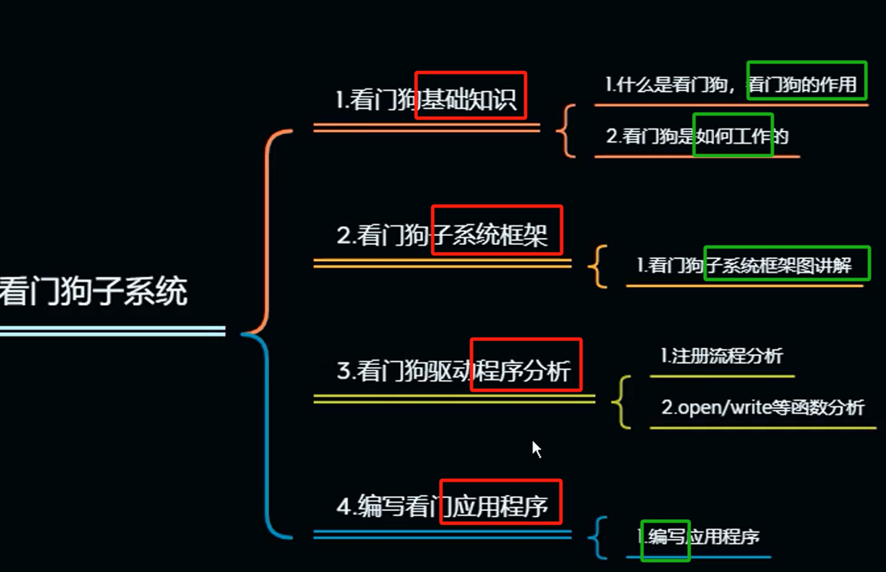
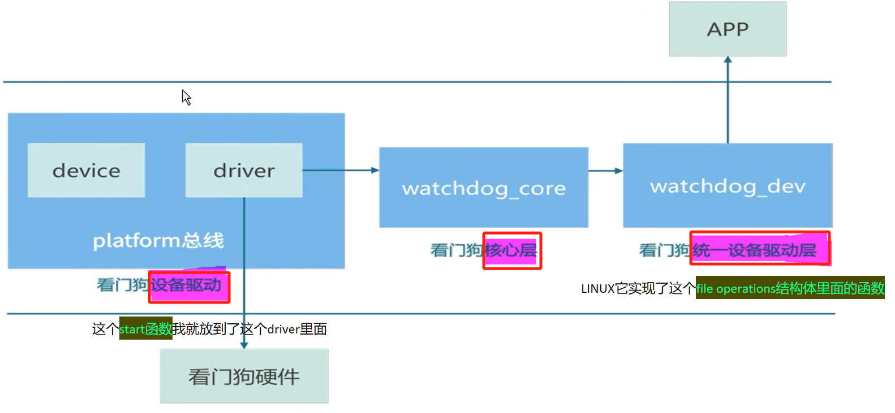

# 备注(声明)：

# 一、看门狗基础知识

## 看门狗基础知识
### 1 、什么是看门狗 - 定时器
[“1.看门狗基础知识”页上的图片](onenote:https://d.docs.live.net/52d4b76bb0ffcf51/Documents/\(RK3568\)Linux驱动开发/第二十期_看门狗.one#1.看门狗基础知识&section-id={68958101-5967-4C70-A4D0-465327B4C937}&page-id={389A3A49-9B62-44AC-A9A8-2654EBEDB96A}&object-id={1CE7BEF1-6F28-0CAF-1545-B8B67550D269}&14)  ([Web 视图](https://onedrive.live.com/view.aspx?resid=52D4B76BB0FFCF51%21se8c325913f784bf694d429e5ee2ab2be&id=documents&wd=target%28%E7%AC%AC%E4%BA%8C%E5%8D%81%E6%9C%9F_%E7%9C%8B%E9%97%A8%E7%8B%97.one%7C68958101-5967-4C70-A4D0-465327B4C937%2F1.%E7%9C%8B%E9%97%A8%E7%8B%97%E5%9F%BA%E7%A1%80%E7%9F%A5%E8%AF%86%7C389A3A49-9B62-44AC-A9A8-2654EBEDB96A%2F%29&wdpartid=%7b76339420-F388-4AE8-BD11-8394FE2DD66C%7d%7b1%7d&wdsectionfileid=52D4B76BB0FFCF51!s0fc8c51dac874a0cb5c21a615963ed59))

### 2 、看门狗有什么用 - 复位
[“1.看门狗基础知识”页上的图片](onenote:https://d.docs.live.net/52d4b76bb0ffcf51/Documents/\(RK3568\)Linux驱动开发/第二十期_看门狗.one#1.看门狗基础知识&section-id={68958101-5967-4C70-A4D0-465327B4C937}&page-id={389A3A49-9B62-44AC-A9A8-2654EBEDB96A}&object-id={1CE7BEF1-6F28-0CAF-1545-B8B67550D269}&14)  ([Web 视图](https://onedrive.live.com/view.aspx?resid=52D4B76BB0FFCF51%21se8c325913f784bf694d429e5ee2ab2be&id=documents&wd=target%28%E7%AC%AC%E4%BA%8C%E5%8D%81%E6%9C%9F_%E7%9C%8B%E9%97%A8%E7%8B%97.one%7C68958101-5967-4C70-A4D0-465327B4C937%2F1.%E7%9C%8B%E9%97%A8%E7%8B%97%E5%9F%BA%E7%A1%80%E7%9F%A5%E8%AF%86%7C389A3A49-9B62-44AC-A9A8-2654EBEDB96A%2F%29&wdpartid=%7b76339420-F388-4AE8-BD11-8394FE2DD66C%7d%7b1%7d&wdsectionfileid=52D4B76BB0FFCF51!s0fc8c51dac874a0cb5c21a615963ed59))

### 3 、看门狗工作方式
[“1.看门狗基础知识”页上的图片](onenote:https://d.docs.live.net/52d4b76bb0ffcf51/Documents/\(RK3568\)Linux驱动开发/第二十期_看门狗.one#1.看门狗基础知识&section-id={68958101-5967-4C70-A4D0-465327B4C937}&page-id={389A3A49-9B62-44AC-A9A8-2654EBEDB96A}&object-id={1CE7BEF1-6F28-0CAF-1545-B8B67550D269}&2F)  ([Web 视图](https://onedrive.live.com/view.aspx?resid=52D4B76BB0FFCF51%21se8c325913f784bf694d429e5ee2ab2be&id=documents&wd=target%28%E7%AC%AC%E4%BA%8C%E5%8D%81%E6%9C%9F_%E7%9C%8B%E9%97%A8%E7%8B%97.one%7C68958101-5967-4C70-A4D0-465327B4C937%2F1.%E7%9C%8B%E9%97%A8%E7%8B%97%E5%9F%BA%E7%A1%80%E7%9F%A5%E8%AF%86%7C389A3A49-9B62-44AC-A9A8-2654EBEDB96A%2F%29&wdpartid=%7b76339420-F388-4AE8-BD11-8394FE2DD66C%7d%7b1%7d&wdsectionfileid=52D4B76BB0FFCF51!s0fc8c51dac874a0cb5c21a615963ed59))

### 4 、看门狗位置
[“1.看门狗基础知识”页上的图片](onenote:https://d.docs.live.net/52d4b76bb0ffcf51/Documents/\(RK3568\)Linux驱动开发/第二十期_看门狗.one#1.看门狗基础知识&section-id={68958101-5967-4C70-A4D0-465327B4C937}&page-id={389A3A49-9B62-44AC-A9A8-2654EBEDB96A}&object-id={1CE7BEF1-6F28-0CAF-1545-B8B67550D269}&46)  ([Web 视图](https://onedrive.live.com/view.aspx?resid=52D4B76BB0FFCF51%21se8c325913f784bf694d429e5ee2ab2be&id=documents&wd=target%28%E7%AC%AC%E4%BA%8C%E5%8D%81%E6%9C%9F_%E7%9C%8B%E9%97%A8%E7%8B%97.one%7C68958101-5967-4C70-A4D0-465327B4C937%2F1.%E7%9C%8B%E9%97%A8%E7%8B%97%E5%9F%BA%E7%A1%80%E7%9F%A5%E8%AF%86%7C389A3A49-9B62-44AC-A9A8-2654EBEDB96A%2F%29&wdpartid=%7b76339420-F388-4AE8-BD11-8394FE2DD66C%7d%7b1%7d&wdsectionfileid=52D4B76BB0FFCF51!s0fc8c51dac874a0cb5c21a615963ed59))

> [!note] rK3568上的看门狗
> 在rK3568这颗处理器中就有两个看门狗
> 一个是普通看门狗
> 一个是安全看门狗

### 5、

# 二、看门狗子系统框架

## 看门狗子系统框架
### 1 、框架图

### 2 、看门狗特点
[看门狗外设他是一个高度统一的外设](onenote:https://d.docs.live.net/52d4b76bb0ffcf51/Documents/\(RK3568\)Linux驱动开发/第二十期_看门狗.one#2.看门狗子系统框架&section-id={68958101-5967-4C70-A4D0-465327B4C937}&page-id={96836479-2FB0-4E69-80DC-F2AF7BFAE5B3}&object-id={20B3C661-3E85-07E7-10D9-66A0CEE70009}&13)  ([Web 视图](https://onedrive.live.com/view.aspx?resid=52D4B76BB0FFCF51%21se8c325913f784bf694d429e5ee2ab2be&id=documents&wd=target%28%E7%AC%AC%E4%BA%8C%E5%8D%81%E6%9C%9F_%E7%9C%8B%E9%97%A8%E7%8B%97.one%7C68958101-5967-4C70-A4D0-465327B4C937%2F2.%E7%9C%8B%E9%97%A8%E7%8B%97%E5%AD%90%E7%B3%BB%E7%BB%9F%E6%A1%86%E6%9E%B6%7C96836479-2FB0-4E69-80DC-F2AF7BFAE5B3%2F%29&wdpartid=%7bEC4F9ADF-2C60-492D-A2F4-8B3B11F55118%7d%7b1%7d&wdsectionfileid=52D4B76BB0FFCF51!s0fc8c51dac874a0cb5c21a615963ed59))

- 1 高度统一的外设。字符设备驱动。

### 3 、

# 三、看门狗驱动程序分析

## 看门狗驱动程序分析
[(未)3.看门狗驱动程序分析（1）](onenote:https://d.docs.live.net/52d4b76bb0ffcf51/Documents/\(RK3568\)Linux驱动开发/第二十期_看门狗.one#\(未\)3.看门狗驱动程序分析（1）&section-id={68958101-5967-4C70-A4D0-465327B4C937}&page-id={619144D0-1407-4163-89BA-143AC5DA170C}&end)  ([Web 视图](https://onedrive.live.com/view.aspx?resid=52D4B76BB0FFCF51%21se8c325913f784bf694d429e5ee2ab2be&id=documents&wd=target%28%E7%AC%AC%E4%BA%8C%E5%8D%81%E6%9C%9F_%E7%9C%8B%E9%97%A8%E7%8B%97.one%7C68958101-5967-4C70-A4D0-465327B4C937%2F%28%E6%9C%AA%5C%293.%E7%9C%8B%E9%97%A8%E7%8B%97%E9%A9%B1%E5%8A%A8%E7%A8%8B%E5%BA%8F%E5%88%86%E6%9E%90%EF%BC%881%EF%BC%89%7C619144D0-1407-4163-89BA-143AC5DA170C%2F%29&wdpartid=%7bDB5F0E69-84C6-4E93-84D9-3B42F98F5FC7%7d%7b1%7d&wdsectionfileid=52D4B76BB0FFCF51!s0fc8c51dac874a0cb5c21a615963ed59))
### 1 、

### 2 、

### 3 、

### 4 、

### 5、

### 6、

### 7、

### 8、

## 
### 1 、

### 2 、

### 3 、

### 4 、
### 5、

### 6、

### 7、

### 8、

## 
### 1 、

### 2 、

### 3 、

### 4 、

### 5、

### 6、

### 7、

### 8、

# 四、编写看门狗应用程序

## 编写看门狗应用程序
### 1 、使用ioctl系统调用设置看门狗超时时间
[// 使用ioctl系统调用设置看门狗超时时间](onenote:https://d.docs.live.net/52d4b76bb0ffcf51/Documents/\(RK3568\)Linux驱动开发/第二十期_看门狗.one#10.编写看门狗应用程序&section-id={68958101-5967-4C70-A4D0-465327B4C937}&page-id={987C7890-FFE0-47D4-B116-82506B0508B7}&object-id={F08D6CB7-4376-0EE1-3BC8-7B3CEE05B099}&49)  ([Web 视图](https://onedrive.live.com/view.aspx?resid=52D4B76BB0FFCF51%21se8c325913f784bf694d429e5ee2ab2be&id=documents&wd=target%28%E7%AC%AC%E4%BA%8C%E5%8D%81%E6%9C%9F_%E7%9C%8B%E9%97%A8%E7%8B%97.one%7C68958101-5967-4C70-A4D0-465327B4C937%2F10.%E7%BC%96%E5%86%99%E7%9C%8B%E9%97%A8%E7%8B%97%E5%BA%94%E7%94%A8%E7%A8%8B%E5%BA%8F%7C987C7890-FFE0-47D4-B116-82506B0508B7%2F%29&wdpartid=%7bF6279752-DA3A-4CC1-88EC-AE3091F412AC%7d%7b1%7d&wdsectionfileid=52D4B76BB0FFCF51!s0fc8c51dac874a0cb5c21a615963ed59))

### 2 、进入循环，模拟定期喂狗（即告诉看门狗程序还活着）
[// 进入循环，模拟定期喂狗（即告诉看门狗程序还活着）](onenote:https://d.docs.live.net/52d4b76bb0ffcf51/Documents/\(RK3568\)Linux驱动开发/第二十期_看门狗.one#10.编写看门狗应用程序&section-id={68958101-5967-4C70-A4D0-465327B4C937}&page-id={987C7890-FFE0-47D4-B116-82506B0508B7}&object-id={F08D6CB7-4376-0EE1-3BC8-7B3CEE05B099}&56)  ([Web 视图](https://onedrive.live.com/view.aspx?resid=52D4B76BB0FFCF51%21se8c325913f784bf694d429e5ee2ab2be&id=documents&wd=target%28%E7%AC%AC%E4%BA%8C%E5%8D%81%E6%9C%9F_%E7%9C%8B%E9%97%A8%E7%8B%97.one%7C68958101-5967-4C70-A4D0-465327B4C937%2F10.%E7%BC%96%E5%86%99%E7%9C%8B%E9%97%A8%E7%8B%97%E5%BA%94%E7%94%A8%E7%A8%8B%E5%BA%8F%7C987C7890-FFE0-47D4-B116-82506B0508B7%2F%29&wdpartid=%7bF6279752-DA3A-4CC1-88EC-AE3091F412AC%7d%7b1%7d&wdsectionfileid=52D4B76BB0FFCF51!s0fc8c51dac874a0cb5c21a615963ed59))

### 3 、当循环结束，表示没有再喂狗，理论上如果看门狗没有被禁用，它将会触发重启。
[// 当循环结束，表示没有再喂狗，理论上如果看门狗没有被禁用，它将会触发重启。](onenote:https://d.docs.live.net/52d4b76bb0ffcf51/Documents/\(RK3568\)Linux驱动开发/第二十期_看门狗.one#10.编写看门狗应用程序&section-id={68958101-5967-4C70-A4D0-465327B4C937}&page-id={987C7890-FFE0-47D4-B116-82506B0508B7}&object-id={F08D6CB7-4376-0EE1-3BC8-7B3CEE05B099}&6C)  ([Web 视图](https://onedrive.live.com/view.aspx?resid=52D4B76BB0FFCF51%21se8c325913f784bf694d429e5ee2ab2be&id=documents&wd=target%28%E7%AC%AC%E4%BA%8C%E5%8D%81%E6%9C%9F_%E7%9C%8B%E9%97%A8%E7%8B%97.one%7C68958101-5967-4C70-A4D0-465327B4C937%2F10.%E7%BC%96%E5%86%99%E7%9C%8B%E9%97%A8%E7%8B%97%E5%BA%94%E7%94%A8%E7%A8%8B%E5%BA%8F%7C987C7890-FFE0-47D4-B116-82506B0508B7%2F%29&wdpartid=%7bF6279752-DA3A-4CC1-88EC-AE3091F412AC%7d%7b1%7d&wdsectionfileid=52D4B76BB0FFCF51!s0fc8c51dac874a0cb5c21a615963ed59))

### 4 、实验现象
[“10.编写看门狗应用程序”页上的图片](onenote:https://d.docs.live.net/52d4b76bb0ffcf51/Documents/\(RK3568\)Linux驱动开发/第二十期_看门狗.one#10.编写看门狗应用程序&section-id={68958101-5967-4C70-A4D0-465327B4C937}&page-id={987C7890-FFE0-47D4-B116-82506B0508B7}&object-id={F08D6CB7-4376-0EE1-3BC8-7B3CEE05B099}&99)  ([Web 视图](https://onedrive.live.com/view.aspx?resid=52D4B76BB0FFCF51%21se8c325913f784bf694d429e5ee2ab2be&id=documents&wd=target%28%E7%AC%AC%E4%BA%8C%E5%8D%81%E6%9C%9F_%E7%9C%8B%E9%97%A8%E7%8B%97.one%7C68958101-5967-4C70-A4D0-465327B4C937%2F10.%E7%BC%96%E5%86%99%E7%9C%8B%E9%97%A8%E7%8B%97%E5%BA%94%E7%94%A8%E7%A8%8B%E5%BA%8F%7C987C7890-FFE0-47D4-B116-82506B0508B7%2F%29&wdpartid=%7bF6279752-DA3A-4CC1-88EC-AE3091F412AC%7d%7b1%7d&wdsectionfileid=52D4B76BB0FFCF51!s0fc8c51dac874a0cb5c21a615963ed59))

### 5、

