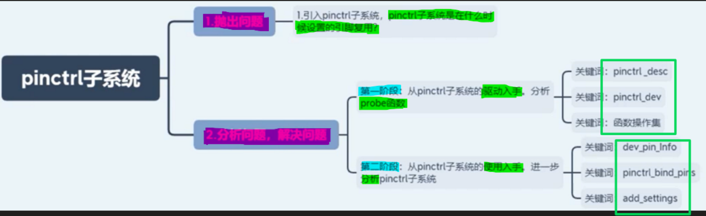

# 备注(声明)：

# 一、前置基础理论

## 寻找pinctrl节点的驱动
### 1 pinctrl节点
[“2.pinctrl子系统课程引入”页上的图片](onenote:#2.pinctrl子系统课程引入&section-id={54355E76-04A8-43E9-B176-E38130686C79}&page-id={2E63F18F-8E1A-4DB1-9BC1-F59738F06442}&object-id={EB4DCCEF-52EA-4628-904D-0AD7D1F694AD}&19&base-path=https://d.docs.live.net/52D4B76BB0FFCF51/Documents/\(RK3568\)Linux驱动开发/第十一期_pinctrl子系统.one)

- 1 rk3568.dtsi        设备树中

### 2 pinctrl 的使用
[“2.pinctrl子系统课程引入”页上的图片](onenote:#2.pinctrl子系统课程引入&section-id={54355E76-04A8-43E9-B176-E38130686C79}&page-id={2E63F18F-8E1A-4DB1-9BC1-F59738F06442}&object-id={EB4DCCEF-52EA-4628-904D-0AD7D1F694AD}&28&base-path=https://d.docs.live.net/52D4B76BB0FFCF51/Documents/\(RK3568\)Linux驱动开发/第十一期_pinctrl子系统.one)

### 3 确定 pinctrl  节点对应驱动的位置
[“2.pinctrl子系统课程引入”页上的图片](onenote:https://d.docs.live.net/52D4B76BB0FFCF51/Documents/\(RK3568\)Linux驱动开发/第十一期_pinctrl子系统.one#2.pinctrl子系统课程引入&section-id={54355E76-04A8-43E9-B176-E38130686C79}&page-id={2E63F18F-8E1A-4DB1-9BC1-F59738F06442}&object-id={A496F0F3-525F-4A6E-B0EC-16C33C408CB5}&1F)  ([Web 视图](https://onedrive.live.com/view.aspx?resid=52D4B76BB0FFCF51%21se8c325913f784bf694d429e5ee2ab2be&id=documents&wd=target%28%E7%AC%AC%E5%8D%81%E4%B8%80%E6%9C%9F_pinctrl%E5%AD%90%E7%B3%BB%E7%BB%9F.one%7C54355E76-04A8-43E9-B176-E38130686C79%2F2.pinctrl%E5%AD%90%E7%B3%BB%E7%BB%9F%E8%AF%BE%E7%A8%8B%E5%BC%95%E5%85%A5%7C2E63F18F-8E1A-4DB1-9BC1-F59738F06442%2F%29&wdpartid=%7b85BF4417-7D52-49D9-BAD9-F1A8CD7AB89B%7d%7b1%7d&wdsectionfileid=52D4B76BB0FFCF51!saa465ea666664bbc81290f944df94f36))

- **具体操作**
[我们使用grep命令搜一下](onenote:https://d.docs.live.net/52D4B76BB0FFCF51/Documents/\(RK3568\)Linux驱动开发/第十一期_pinctrl子系统.one#2.pinctrl子系统课程引入&section-id={54355E76-04A8-43E9-B176-E38130686C79}&page-id={2E63F18F-8E1A-4DB1-9BC1-F59738F06442}&object-id={A496F0F3-525F-4A6E-B0EC-16C33C408CB5}&C4)  ([Web 视图](https://onedrive.live.com/view.aspx?resid=52D4B76BB0FFCF51%21se8c325913f784bf694d429e5ee2ab2be&id=documents&wd=target%28%E7%AC%AC%E5%8D%81%E4%B8%80%E6%9C%9F_pinctrl%E5%AD%90%E7%B3%BB%E7%BB%9F.one%7C54355E76-04A8-43E9-B176-E38130686C79%2F2.pinctrl%E5%AD%90%E7%B3%BB%E7%BB%9F%E8%AF%BE%E7%A8%8B%E5%BC%95%E5%85%A5%7C2E63F18F-8E1A-4DB1-9BC1-F59738F06442%2F%29&wdpartid=%7b85BF4417-7D52-49D9-BAD9-F1A8CD7AB89B%7d%7b1%7d&wdsectionfileid=52D4B76BB0FFCF51!saa465ea666664bbc81290f944df94f36))

### 4 分析驱动
- **不用modelinit，因为他要控制驱动的加载顺序** 
[他为什么不用model init呢](onenote:https://d.docs.live.net/52D4B76BB0FFCF51/Documents/\(RK3568\)Linux驱动开发/第十一期_pinctrl子系统.one#2.pinctrl子系统课程引入&section-id={54355E76-04A8-43E9-B176-E38130686C79}&page-id={2E63F18F-8E1A-4DB1-9BC1-F59738F06442}&object-id={A496F0F3-525F-4A6E-B0EC-16C33C408CB5}&E3)  ([Web 视图](https://onedrive.live.com/view.aspx?resid=52D4B76BB0FFCF51%21se8c325913f784bf694d429e5ee2ab2be&id=documents&wd=target%28%E7%AC%AC%E5%8D%81%E4%B8%80%E6%9C%9F_pinctrl%E5%AD%90%E7%B3%BB%E7%BB%9F.one%7C54355E76-04A8-43E9-B176-E38130686C79%2F2.pinctrl%E5%AD%90%E7%B3%BB%E7%BB%9F%E8%AF%BE%E7%A8%8B%E5%BC%95%E5%85%A5%7C2E63F18F-8E1A-4DB1-9BC1-F59738F06442%2F%29&wdpartid=%7b85BF4417-7D52-49D9-BAD9-F1A8CD7AB89B%7d%7b1%7d&wdsectionfileid=52D4B76BB0FFCF51!saa465ea666664bbc81290f944df94f36))
[因为他要控制驱动的加载顺序](onenote:https://d.docs.live.net/52D4B76BB0FFCF51/Documents/\(RK3568\)Linux驱动开发/第十一期_pinctrl子系统.one#2.pinctrl子系统课程引入&section-id={54355E76-04A8-43E9-B176-E38130686C79}&page-id={2E63F18F-8E1A-4DB1-9BC1-F59738F06442}&object-id={A496F0F3-525F-4A6E-B0EC-16C33C408CB5}&E5)  ([Web 视图](https://onedrive.live.com/view.aspx?resid=52D4B76BB0FFCF51%21se8c325913f784bf694d429e5ee2ab2be&id=documents&wd=target%28%E7%AC%AC%E5%8D%81%E4%B8%80%E6%9C%9F_pinctrl%E5%AD%90%E7%B3%BB%E7%BB%9F.one%7C54355E76-04A8-43E9-B176-E38130686C79%2F2.pinctrl%E5%AD%90%E7%B3%BB%E7%BB%9F%E8%AF%BE%E7%A8%8B%E5%BC%95%E5%85%A5%7C2E63F18F-8E1A-4DB1-9BC1-F59738F06442%2F%29&wdpartid=%7b85BF4417-7D52-49D9-BAD9-F1A8CD7AB89B%7d%7b1%7d&wdsectionfileid=52D4B76BB0FFCF51!saa465ea666664bbc81290f944df94f36))

- **找到 probe 函数**
[“2.pinctrl子系统课程引入”页上的图片](onenote:https://d.docs.live.net/52D4B76BB0FFCF51/Documents/\(RK3568\)Linux驱动开发/第十一期_pinctrl子系统.one#2.pinctrl子系统课程引入&section-id={54355E76-04A8-43E9-B176-E38130686C79}&page-id={2E63F18F-8E1A-4DB1-9BC1-F59738F06442}&object-id={A496F0F3-525F-4A6E-B0EC-16C33C408CB5}&36)  ([Web 视图](https://onedrive.live.com/view.aspx?resid=52D4B76BB0FFCF51%21se8c325913f784bf694d429e5ee2ab2be&id=documents&wd=target%28%E7%AC%AC%E5%8D%81%E4%B8%80%E6%9C%9F_pinctrl%E5%AD%90%E7%B3%BB%E7%BB%9F.one%7C54355E76-04A8-43E9-B176-E38130686C79%2F2.pinctrl%E5%AD%90%E7%B3%BB%E7%BB%9F%E8%AF%BE%E7%A8%8B%E5%BC%95%E5%85%A5%7C2E63F18F-8E1A-4DB1-9BC1-F59738F06442%2F%29&wdpartid=%7b85BF4417-7D52-49D9-BAD9-F1A8CD7AB89B%7d%7b1%7d&wdsectionfileid=52D4B76BB0FFCF51!saa465ea666664bbc81290f944df94f36))

### 5、

## pinctrl_desc结构体--定义和描述 Pin Controller 的结构体

### 1 pinctrl_desc结构体的定义与解析
[“3.前置理论-pinctrl_desc结构体”页上的图片](onenote:https://d.docs.live.net/52d4b76bb0ffcf51/Documents/\(RK3568\)Linux驱动开发/第十一期_pinctrl子系统.one#3.前置理论-pinctrl_desc结构体&section-id={54355E76-04A8-43E9-B176-E38130686C79}&page-id={B5DD8C4B-8574-4F16-BBC6-2C321AF50293}&object-id={85639D18-70F8-4A32-96FA-C701C953A136}&24)  ([Web 视图](https://onedrive.live.com/view.aspx?resid=52D4B76BB0FFCF51%21se8c325913f784bf694d429e5ee2ab2be&id=documents&wd=target%28%E7%AC%AC%E5%8D%81%E4%B8%80%E6%9C%9F_pinctrl%E5%AD%90%E7%B3%BB%E7%BB%9F.one%7C54355E76-04A8-43E9-B176-E38130686C79%2F3.%E5%89%8D%E7%BD%AE%E7%90%86%E8%AE%BA-pinctrl_desc%E7%BB%93%E6%9E%84%E4%BD%93%7CB5DD8C4B-8574-4F16-BBC6-2C321AF50293%2F%29&wdpartid=%7bAC5CA785-B5AC-473B-A172-19BC89FE1854%7d%7b1%7d&wdsectionfileid=52D4B76BB0FFCF51!saa465ea666664bbc81290f944df94f36))

### 2 pinctrl_pin_desc结构体--描述单个引脚的属性
[“3.前置理论-pinctrl_desc结构体”页上的图片](onenote:https://d.docs.live.net/52d4b76bb0ffcf51/Documents/\(RK3568\)Linux驱动开发/第十一期_pinctrl子系统.one#3.前置理论-pinctrl_desc结构体&section-id={54355E76-04A8-43E9-B176-E38130686C79}&page-id={B5DD8C4B-8574-4F16-BBC6-2C321AF50293}&object-id={85639D18-70F8-4A32-96FA-C701C953A136}&42)  ([Web 视图](https://onedrive.live.com/view.aspx?resid=52D4B76BB0FFCF51%21se8c325913f784bf694d429e5ee2ab2be&id=documents&wd=target%28%E7%AC%AC%E5%8D%81%E4%B8%80%E6%9C%9F_pinctrl%E5%AD%90%E7%B3%BB%E7%BB%9F.one%7C54355E76-04A8-43E9-B176-E38130686C79%2F3.%E5%89%8D%E7%BD%AE%E7%90%86%E8%AE%BA-pinctrl_desc%E7%BB%93%E6%9E%84%E4%BD%93%7CB5DD8C4B-8574-4F16-BBC6-2C321AF50293%2F%29&wdpartid=%7bAC5CA785-B5AC-473B-A172-19BC89FE1854%7d%7b1%7d&wdsectionfileid=52D4B76BB0FFCF51!saa465ea666664bbc81290f944df94f36))

### 3 pinctrl_register 函数
[“3.前置理论-pinctrl_desc结构体”页上的图片](onenote:https://d.docs.live.net/52d4b76bb0ffcf51/Documents/\(RK3568\)Linux驱动开发/第十一期_pinctrl子系统.one#3.前置理论-pinctrl_desc结构体&section-id={54355E76-04A8-43E9-B176-E38130686C79}&page-id={B5DD8C4B-8574-4F16-BBC6-2C321AF50293}&object-id={85639D18-70F8-4A32-96FA-C701C953A136}&66)  ([Web 视图](https://onedrive.live.com/view.aspx?resid=52D4B76BB0FFCF51%21se8c325913f784bf694d429e5ee2ab2be&id=documents&wd=target%28%E7%AC%AC%E5%8D%81%E4%B8%80%E6%9C%9F_pinctrl%E5%AD%90%E7%B3%BB%E7%BB%9F.one%7C54355E76-04A8-43E9-B176-E38130686C79%2F3.%E5%89%8D%E7%BD%AE%E7%90%86%E8%AE%BA-pinctrl_desc%E7%BB%93%E6%9E%84%E4%BD%93%7CB5DD8C4B-8574-4F16-BBC6-2C321AF50293%2F%29&wdpartid=%7bAC5CA785-B5AC-473B-A172-19BC89FE1854%7d%7b1%7d&wdsectionfileid=52D4B76BB0FFCF51!saa465ea666664bbc81290f944df94f36))

### 4 

### 5、

### 6、

### 7、

### 8、

## 
### 1 

### 2 

### 3 

### 4 

### 5、

### 6、

### 7、

### 8、

# 二、

## 实践-讲解pinctrl_desc结构体实际应用--代码跟踪分析
[4.实践-讲解pinctrl_desc结构体实际应用](onenote:https://d.docs.live.net/52d4b76bb0ffcf51/Documents/\(RK3568\)Linux驱动开发/第十一期_pinctrl子系统.one#4.实践-讲解pinctrl_desc结构体实际应用&section-id={54355E76-04A8-43E9-B176-E38130686C79}&page-id={3A74CBD0-415C-49EF-979E-8E86EE32910B}&end)  ([Web 视图](https://onedrive.live.com/view.aspx?resid=52D4B76BB0FFCF51%21se8c325913f784bf694d429e5ee2ab2be&id=documents&wd=target%28%E7%AC%AC%E5%8D%81%E4%B8%80%E6%9C%9F_pinctrl%E5%AD%90%E7%B3%BB%E7%BB%9F.one%7C54355E76-04A8-43E9-B176-E38130686C79%2F4.%E5%AE%9E%E8%B7%B5-%E8%AE%B2%E8%A7%A3pinctrl_desc%E7%BB%93%E6%9E%84%E4%BD%93%E5%AE%9E%E9%99%85%E5%BA%94%E7%94%A8%7C3A74CBD0-415C-49EF-979E-8E86EE32910B%2F%29&wdpartid=%7b0DAB620D-CC7D-472B-A6DE-90564B8896BC%7d%7b1%7d&wdsectionfileid=52D4B76BB0FFCF51!saa465ea666664bbc81290f944df94f36))
### 1 

### 2 

### 3 

### 4 

### 5、

### 6、

### 7、

### 8、

## 

### 1 

### 2 

### 3 

### 4 

### 5、

### 6、

### 7、

### 8、

## 
### 1 

### 2 

### 3 

### 4 

### 5、

### 6、

### 7、

### 8、

# 三、

## 
### 1 

### 2 

### 3 

### 4 

### 5、

### 6、

### 7、

### 8、

## 

### 1 

### 2 

### 3 

### 4 

### 5、

### 6、

### 7、

### 8、

## 
### 1 

### 2 

### 3 

### 4 

### 5、

### 6、

### 7、

### 8、

# 四、

## 
### 1 

### 2 

### 3 

### 4 

### 5、

### 6、

### 7、

### 8、

## 

### 1 

### 2 

### 3 

### 4 

### 5、

### 6、

### 7、

### 8、

## 
### 1 

### 2 

### 3 

### 4 

### 5、

### 6、

### 7、

### 8、

# 五、

## 
### 1 

### 2 

### 3 

### 4 

### 5、

### 6、

### 7、

### 8、

## 

### 1 

### 2 

### 3 

### 4 

### 5、

### 6、

### 7、

### 8、

## 
### 1 

### 2 

### 3 

### 4 

### 5、

### 6、

### 7、

### 8、

# 六、

## 
### 1 

### 2 

### 3 

### 4 

### 5、

### 6、

### 7、

### 8、

## 

### 1 

### 2 

### 3 

### 4 

### 5、

### 6、

### 7、

### 8、

## 
### 1 

### 2 

### 3 

### 4 

### 5、

### 6、

### 7、

### 8、

