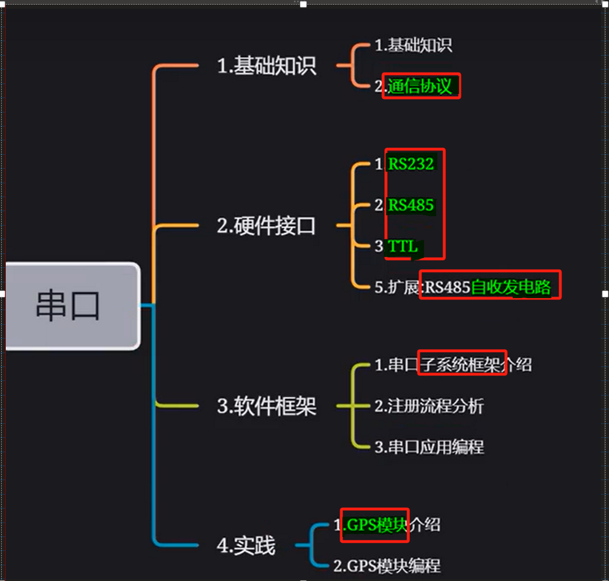
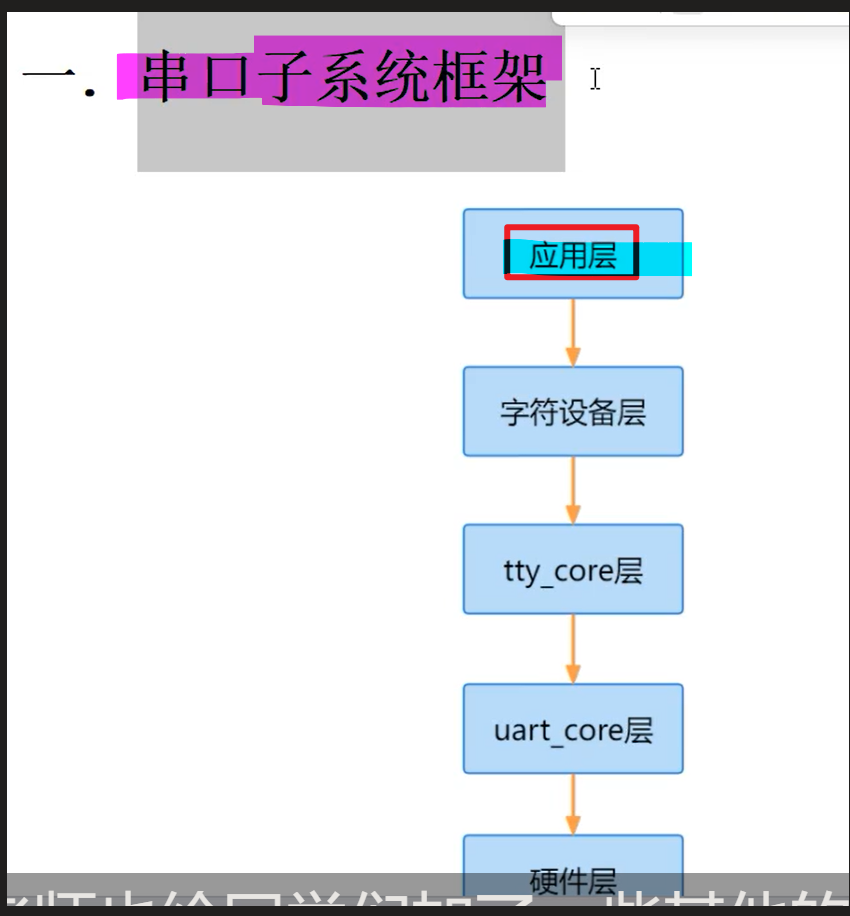

# 备注(声明)：

# 一、基础知识

## 串口基础知识
### 1 、串口特性和连线 - 异步，全双工
[“1.串口基础知识”页上的图片](onenote:https://d.docs.live.net/52d4b76bb0ffcf51/Documents/\(RK3568\)Linux驱动开发/第十七期_串口.one#1.串口基础知识&section-id={5D160B85-47D3-49D4-BB6E-1E2A961B36AF}&page-id={6B2BC0CF-A70A-4C79-A36A-CB0A629DB9E8}&object-id={BB3990DA-9733-03A3-1BFE-37307CD9CD16}&2E)  ([Web 视图](https://onedrive.live.com/view.aspx?resid=52D4B76BB0FFCF51%21se8c325913f784bf694d429e5ee2ab2be&id=documents&wd=target%28%E7%AC%AC%E5%8D%81%E4%B8%83%E6%9C%9F_%E4%B8%B2%E5%8F%A3.one%7C5D160B85-47D3-49D4-BB6E-1E2A961B36AF%2F1.%E4%B8%B2%E5%8F%A3%E5%9F%BA%E7%A1%80%E7%9F%A5%E8%AF%86%7C6B2BC0CF-A70A-4C79-A36A-CB0A629DB9E8%2F%29&wdpartid=%7b0E07D1BB-565C-4D1C-B3FD-2B20A339283A%7d%7b1%7d&wdsectionfileid=52D4B76BB0FFCF51!s2668982515b14bed8b0f2b075cc27af1))

### 2 、波特率
[“1.串口基础知识”页上的图片](onenote:https://d.docs.live.net/52d4b76bb0ffcf51/Documents/\(RK3568\)Linux驱动开发/第十七期_串口.one#1.串口基础知识&section-id={5D160B85-47D3-49D4-BB6E-1E2A961B36AF}&page-id={6B2BC0CF-A70A-4C79-A36A-CB0A629DB9E8}&object-id={BB3990DA-9733-03A3-1BFE-37307CD9CD16}&41)  ([Web 视图](https://onedrive.live.com/view.aspx?resid=52D4B76BB0FFCF51%21se8c325913f784bf694d429e5ee2ab2be&id=documents&wd=target%28%E7%AC%AC%E5%8D%81%E4%B8%83%E6%9C%9F_%E4%B8%B2%E5%8F%A3.one%7C5D160B85-47D3-49D4-BB6E-1E2A961B36AF%2F1.%E4%B8%B2%E5%8F%A3%E5%9F%BA%E7%A1%80%E7%9F%A5%E8%AF%86%7C6B2BC0CF-A70A-4C79-A36A-CB0A629DB9E8%2F%29&wdpartid=%7b0E07D1BB-565C-4D1C-B3FD-2B20A339283A%7d%7b1%7d&wdsectionfileid=52D4B76BB0FFCF51!s2668982515b14bed8b0f2b075cc27af1))

### 3 、比特率
[“1.串口基础知识”页上的图片](onenote:https://d.docs.live.net/52d4b76bb0ffcf51/Documents/\(RK3568\)Linux驱动开发/第十七期_串口.one#1.串口基础知识&section-id={5D160B85-47D3-49D4-BB6E-1E2A961B36AF}&page-id={6B2BC0CF-A70A-4C79-A36A-CB0A629DB9E8}&object-id={BB3990DA-9733-03A3-1BFE-37307CD9CD16}&76)  ([Web 视图](https://onedrive.live.com/view.aspx?resid=52D4B76BB0FFCF51%21se8c325913f784bf694d429e5ee2ab2be&id=documents&wd=target%28%E7%AC%AC%E5%8D%81%E4%B8%83%E6%9C%9F_%E4%B8%B2%E5%8F%A3.one%7C5D160B85-47D3-49D4-BB6E-1E2A961B36AF%2F1.%E4%B8%B2%E5%8F%A3%E5%9F%BA%E7%A1%80%E7%9F%A5%E8%AF%86%7C6B2BC0CF-A70A-4C79-A36A-CB0A629DB9E8%2F%29&wdpartid=%7b0E07D1BB-565C-4D1C-B3FD-2B20A339283A%7d%7b1%7d&wdsectionfileid=52D4B76BB0FFCF51!s2668982515b14bed8b0f2b075cc27af1))

### 4 、串口接口的样子
[“1.串口基础知识”页上的图片](onenote:https://d.docs.live.net/52d4b76bb0ffcf51/Documents/\(RK3568\)Linux驱动开发/第十七期_串口.one#1.串口基础知识&section-id={5D160B85-47D3-49D4-BB6E-1E2A961B36AF}&page-id={6B2BC0CF-A70A-4C79-A36A-CB0A629DB9E8}&object-id={BB3990DA-9733-03A3-1BFE-37307CD9CD16}&8C)  ([Web 视图](https://onedrive.live.com/view.aspx?resid=52D4B76BB0FFCF51%21se8c325913f784bf694d429e5ee2ab2be&id=documents&wd=target%28%E7%AC%AC%E5%8D%81%E4%B8%83%E6%9C%9F_%E4%B8%B2%E5%8F%A3.one%7C5D160B85-47D3-49D4-BB6E-1E2A961B36AF%2F1.%E4%B8%B2%E5%8F%A3%E5%9F%BA%E7%A1%80%E7%9F%A5%E8%AF%86%7C6B2BC0CF-A70A-4C79-A36A-CB0A629DB9E8%2F%29&wdpartid=%7b0E07D1BB-565C-4D1C-B3FD-2B20A339283A%7d%7b1%7d&wdsectionfileid=52D4B76BB0FFCF51!s2668982515b14bed8b0f2b075cc27af1))

### 5、

## 串口通信协议
### 1 、一帧数据11位，LSB传输
[“2.串口通信协议”页上的图片](onenote:https://d.docs.live.net/52d4b76bb0ffcf51/Documents/\(RK3568\)Linux驱动开发/第十七期_串口.one#2.串口通信协议&section-id={5D160B85-47D3-49D4-BB6E-1E2A961B36AF}&page-id={993F328C-F475-4D65-B0E5-7BDBB382287B}&object-id={EC91A215-313F-035B-22D2-152F1775F87E}&19)  ([Web 视图](https://onedrive.live.com/view.aspx?resid=52D4B76BB0FFCF51%21se8c325913f784bf694d429e5ee2ab2be&id=documents&wd=target%28%E7%AC%AC%E5%8D%81%E4%B8%83%E6%9C%9F_%E4%B8%B2%E5%8F%A3.one%7C5D160B85-47D3-49D4-BB6E-1E2A961B36AF%2F2.%E4%B8%B2%E5%8F%A3%E9%80%9A%E4%BF%A1%E5%8D%8F%E8%AE%AE%7C993F328C-F475-4D65-B0E5-7BDBB382287B%2F%29&wdpartid=%7b631D006C-59B9-4DAB-B433-6E6445C1A436%7d%7b1%7d&wdsectionfileid=52D4B76BB0FFCF51!s2668982515b14bed8b0f2b075cc27af1))

### 2 、校验方式
[“2.串口通信协议”页上的图片](onenote:https://d.docs.live.net/52d4b76bb0ffcf51/Documents/\(RK3568\)Linux驱动开发/第十七期_串口.one#2.串口通信协议&section-id={5D160B85-47D3-49D4-BB6E-1E2A961B36AF}&page-id={993F328C-F475-4D65-B0E5-7BDBB382287B}&object-id={EC91A215-313F-035B-22D2-152F1775F87E}&4B)  ([Web 视图](https://onedrive.live.com/view.aspx?resid=52D4B76BB0FFCF51%21se8c325913f784bf694d429e5ee2ab2be&id=documents&wd=target%28%E7%AC%AC%E5%8D%81%E4%B8%83%E6%9C%9F_%E4%B8%B2%E5%8F%A3.one%7C5D160B85-47D3-49D4-BB6E-1E2A961B36AF%2F2.%E4%B8%B2%E5%8F%A3%E9%80%9A%E4%BF%A1%E5%8D%8F%E8%AE%AE%7C993F328C-F475-4D65-B0E5-7BDBB382287B%2F%29&wdpartid=%7b631D006C-59B9-4DAB-B433-6E6445C1A436%7d%7b1%7d&wdsectionfileid=52D4B76BB0FFCF51!s2668982515b14bed8b0f2b075cc27af1))

### 3 、

# 二、硬件接口

## 串口通信接口介绍
### 1 、TTL 引脚- 处理器直接引出（两根线）
[“3.RS232RS485TTL接口介绍”页上的图片](onenote:https://d.docs.live.net/52d4b76bb0ffcf51/Documents/\(RK3568\)Linux驱动开发/第十七期_串口.one#3.RS232RS485TTL接口介绍&section-id={5D160B85-47D3-49D4-BB6E-1E2A961B36AF}&page-id={D648D27E-D7DF-4EFE-B1FC-2E029947647C}&object-id={72661D76-27CD-074D-0B2C-00D527E2B3CD}&14)  ([Web 视图](https://onedrive.live.com/view.aspx?resid=52D4B76BB0FFCF51%21se8c325913f784bf694d429e5ee2ab2be&id=documents&wd=target%28%E7%AC%AC%E5%8D%81%E4%B8%83%E6%9C%9F_%E4%B8%B2%E5%8F%A3.one%7C5D160B85-47D3-49D4-BB6E-1E2A961B36AF%2F3.RS232%26RS485%26TTL%E6%8E%A5%E5%8F%A3%E4%BB%8B%E7%BB%8D%7CD648D27E-D7DF-4EFE-B1FC-2E029947647C%2F%29&wdpartid=%7b35B47070-B9F9-4D19-9BD1-E39528CC15DB%7d%7b1%7d&wdsectionfileid=52D4B76BB0FFCF51!s2668982515b14bed8b0f2b075cc27af1))

### 2 、RS232接口协议 - 九根线
[“3.RS232RS485TTL接口介绍”页上的图片](onenote:https://d.docs.live.net/52d4b76bb0ffcf51/Documents/\(RK3568\)Linux驱动开发/第十七期_串口.one#3.RS232RS485TTL接口介绍&section-id={5D160B85-47D3-49D4-BB6E-1E2A961B36AF}&page-id={D648D27E-D7DF-4EFE-B1FC-2E029947647C}&object-id={72661D76-27CD-074D-0B2C-00D527E2B3CD}&4B)  ([Web 视图](https://onedrive.live.com/view.aspx?resid=52D4B76BB0FFCF51%21se8c325913f784bf694d429e5ee2ab2be&id=documents&wd=target%28%E7%AC%AC%E5%8D%81%E4%B8%83%E6%9C%9F_%E4%B8%B2%E5%8F%A3.one%7C5D160B85-47D3-49D4-BB6E-1E2A961B36AF%2F3.RS232%26RS485%26TTL%E6%8E%A5%E5%8F%A3%E4%BB%8B%E7%BB%8D%7CD648D27E-D7DF-4EFE-B1FC-2E029947647C%2F%29&wdpartid=%7b35B47070-B9F9-4D19-9BD1-E39528CC15DB%7d%7b1%7d&wdsectionfileid=52D4B76BB0FFCF51!s2668982515b14bed8b0f2b075cc27af1))

- **电平特性**
[“3.RS232RS485TTL接口介绍”页上的图片](onenote:https://d.docs.live.net/52d4b76bb0ffcf51/Documents/\(RK3568\)Linux驱动开发/第十七期_串口.one#3.RS232RS485TTL接口介绍&section-id={5D160B85-47D3-49D4-BB6E-1E2A961B36AF}&page-id={D648D27E-D7DF-4EFE-B1FC-2E029947647C}&object-id={72661D76-27CD-074D-0B2C-00D527E2B3CD}&5B)  ([Web 视图](https://onedrive.live.com/view.aspx?resid=52D4B76BB0FFCF51%21se8c325913f784bf694d429e5ee2ab2be&id=documents&wd=target%28%E7%AC%AC%E5%8D%81%E4%B8%83%E6%9C%9F_%E4%B8%B2%E5%8F%A3.one%7C5D160B85-47D3-49D4-BB6E-1E2A961B36AF%2F3.RS232%26RS485%26TTL%E6%8E%A5%E5%8F%A3%E4%BB%8B%E7%BB%8D%7CD648D27E-D7DF-4EFE-B1FC-2E029947647C%2F%29&wdpartid=%7b35B47070-B9F9-4D19-9BD1-E39528CC15DB%7d%7b1%7d&wdsectionfileid=52D4B76BB0FFCF51!s2668982515b14bed8b0f2b075cc27af1))

### 3 、RS485接口协议 - 没有规定标准的连接器（超远距离传输）
[“3.RS232RS485TTL接口介绍”页上的图片](onenote:https://d.docs.live.net/52d4b76bb0ffcf51/Documents/\(RK3568\)Linux驱动开发/第十七期_串口.one#3.RS232RS485TTL接口介绍&section-id={5D160B85-47D3-49D4-BB6E-1E2A961B36AF}&page-id={D648D27E-D7DF-4EFE-B1FC-2E029947647C}&object-id={72661D76-27CD-074D-0B2C-00D527E2B3CD}&66)  ([Web 视图](https://onedrive.live.com/view.aspx?resid=52D4B76BB0FFCF51%21se8c325913f784bf694d429e5ee2ab2be&id=documents&wd=target%28%E7%AC%AC%E5%8D%81%E4%B8%83%E6%9C%9F_%E4%B8%B2%E5%8F%A3.one%7C5D160B85-47D3-49D4-BB6E-1E2A961B36AF%2F3.RS232%26RS485%26TTL%E6%8E%A5%E5%8F%A3%E4%BB%8B%E7%BB%8D%7CD648D27E-D7DF-4EFE-B1FC-2E029947647C%2F%29&wdpartid=%7b35B47070-B9F9-4D19-9BD1-E39528CC15DB%7d%7b1%7d&wdsectionfileid=52D4B76BB0FFCF51!s2668982515b14bed8b0f2b075cc27af1))

- **电平特性**
[“3.RS232RS485TTL接口介绍”页上的图片](onenote:https://d.docs.live.net/52d4b76bb0ffcf51/Documents/\(RK3568\)Linux驱动开发/第十七期_串口.one#3.RS232RS485TTL接口介绍&section-id={5D160B85-47D3-49D4-BB6E-1E2A961B36AF}&page-id={D648D27E-D7DF-4EFE-B1FC-2E029947647C}&object-id={72661D76-27CD-074D-0B2C-00D527E2B3CD}&76)  ([Web 视图](https://onedrive.live.com/view.aspx?resid=52D4B76BB0FFCF51%21se8c325913f784bf694d429e5ee2ab2be&id=documents&wd=target%28%E7%AC%AC%E5%8D%81%E4%B8%83%E6%9C%9F_%E4%B8%B2%E5%8F%A3.one%7C5D160B85-47D3-49D4-BB6E-1E2A961B36AF%2F3.RS232%26RS485%26TTL%E6%8E%A5%E5%8F%A3%E4%BB%8B%E7%BB%8D%7CD648D27E-D7DF-4EFE-B1FC-2E029947647C%2F%29&wdpartid=%7b35B47070-B9F9-4D19-9BD1-E39528CC15DB%7d%7b1%7d&wdsectionfileid=52D4B76BB0FFCF51!s2668982515b14bed8b0f2b075cc27af1))
### 4 、

## 扩展-RS485自收发电路 
- 1 通过硬件来自动切换接收或发送
### 1 、RS485原理图
[“4.扩展-RS485自收发电路”页上的图片](onenote:https://d.docs.live.net/52d4b76bb0ffcf51/Documents/\(RK3568\)Linux驱动开发/第十七期_串口.one#4.扩展-RS485自收发电路&section-id={5D160B85-47D3-49D4-BB6E-1E2A961B36AF}&page-id={4586FDFE-0E72-460E-AD53-71CCB13F8C4A}&object-id={C8676F44-9FF9-0B39-3AF8-9E06868463F2}&30)  ([Web 视图](https://onedrive.live.com/view.aspx?resid=52D4B76BB0FFCF51%21se8c325913f784bf694d429e5ee2ab2be&id=documents&wd=target%28%E7%AC%AC%E5%8D%81%E4%B8%83%E6%9C%9F_%E4%B8%B2%E5%8F%A3.one%7C5D160B85-47D3-49D4-BB6E-1E2A961B36AF%2F4.%E6%89%A9%E5%B1%95-RS485%E8%87%AA%E6%94%B6%E5%8F%91%E7%94%B5%E8%B7%AF%7C4586FDFE-0E72-460E-AD53-71CCB13F8C4A%2F%29&wdpartid=%7bEB6F00FD-8F29-44DD-9A5B-575C3BB5ECD5%7d%7b1%7d&wdsectionfileid=52D4B76BB0FFCF51!s2668982515b14bed8b0f2b075cc27af1))

- 1 当 BUF XURTS1 引脚拉低，接收数据。     当 BUF XURTS1引脚拉高，发送数据。

### 2 、SIT3485E芯片引脚定义 - TTL转RS485
[“4.扩展-RS485自收发电路”页上的图片](onenote:https://d.docs.live.net/52d4b76bb0ffcf51/Documents/\(RK3568\)Linux驱动开发/第十七期_串口.one#4.扩展-RS485自收发电路&section-id={5D160B85-47D3-49D4-BB6E-1E2A961B36AF}&page-id={4586FDFE-0E72-460E-AD53-71CCB13F8C4A}&object-id={C8676F44-9FF9-0B39-3AF8-9E06868463F2}&3B)  ([Web 视图](https://onedrive.live.com/view.aspx?resid=52D4B76BB0FFCF51%21se8c325913f784bf694d429e5ee2ab2be&id=documents&wd=target%28%E7%AC%AC%E5%8D%81%E4%B8%83%E6%9C%9F_%E4%B8%B2%E5%8F%A3.one%7C5D160B85-47D3-49D4-BB6E-1E2A961B36AF%2F4.%E6%89%A9%E5%B1%95-RS485%E8%87%AA%E6%94%B6%E5%8F%91%E7%94%B5%E8%B7%AF%7C4586FDFE-0E72-460E-AD53-71CCB13F8C4A%2F%29&wdpartid=%7bEB6F00FD-8F29-44DD-9A5B-575C3BB5ECD5%7d%7b1%7d&wdsectionfileid=52D4B76BB0FFCF51!s2668982515b14bed8b0f2b075cc27af1))

- 2 把第二脚和第三脚同时拉低，那就是接收数据
- 
### 3 、分析开发板上RS485原理图
[“4.扩展-RS485自收发电路”页上的图片](onenote:https://d.docs.live.net/52d4b76bb0ffcf51/Documents/\(RK3568\)Linux驱动开发/第十七期_串口.one#4.扩展-RS485自收发电路&section-id={5D160B85-47D3-49D4-BB6E-1E2A961B36AF}&page-id={4586FDFE-0E72-460E-AD53-71CCB13F8C4A}&object-id={C8676F44-9FF9-0B39-3AF8-9E06868463F2}&51)  ([Web 视图](https://onedrive.live.com/view.aspx?resid=52D4B76BB0FFCF51%21se8c325913f784bf694d429e5ee2ab2be&id=documents&wd=target%28%E7%AC%AC%E5%8D%81%E4%B8%83%E6%9C%9F_%E4%B8%B2%E5%8F%A3.one%7C5D160B85-47D3-49D4-BB6E-1E2A961B36AF%2F4.%E6%89%A9%E5%B1%95-RS485%E8%87%AA%E6%94%B6%E5%8F%91%E7%94%B5%E8%B7%AF%7C4586FDFE-0E72-460E-AD53-71CCB13F8C4A%2F%29&wdpartid=%7bEB6F00FD-8F29-44DD-9A5B-575C3BB5ECD5%7d%7b1%7d&wdsectionfileid=52D4B76BB0FFCF51!s2668982515b14bed8b0f2b075cc27af1))

### 4 、

# 三、软件框架

## 串口子系统
### 1 、框架图

### 2 、不需要写驱动程序
> [!note] 不需要写驱动程序
> 那我们把一个串口外设接到串口上，
> 它不需要驱动程序，
> 直接写这个外设的应用程序就可以了呀

### 3 、

## 串口驱动程序
### 1 、串口驱动程序位置 - 8250通用串口驱动
[“串口驱动程序”页上的图片](onenote:https://d.docs.live.net/52d4b76bb0ffcf51/Documents/\(RK3568\)Linux驱动开发/第十七期_串口.one#串口驱动程序&section-id={5D160B85-47D3-49D4-BB6E-1E2A961B36AF}&page-id={DC62C6F7-EF57-4221-A652-0830DE7C69C9}&object-id={80EEDE46-8F47-074F-11EB-269B37C7A302}&21)  ([Web 视图](https://onedrive.live.com/view.aspx?resid=52D4B76BB0FFCF51%21se8c325913f784bf694d429e5ee2ab2be&id=documents&wd=target%28%E7%AC%AC%E5%8D%81%E4%B8%83%E6%9C%9F_%E4%B8%B2%E5%8F%A3.one%7C5D160B85-47D3-49D4-BB6E-1E2A961B36AF%2F%E4%B8%B2%E5%8F%A3%E9%A9%B1%E5%8A%A8%E7%A8%8B%E5%BA%8F%7CDC62C6F7-EF57-4221-A652-0830DE7C69C9%2F%29&wdpartid=%7bE3DF55D3-0517-0ADB-361E-1328286186CF%7d%7b1%7d&wdsectionfileid=52D4B76BB0FFCF51!s2668982515b14bed8b0f2b075cc27af1))

### 2 、menuconfig配置使用8250驱动
[“串口驱动程序”页上的图片](onenote:https://d.docs.live.net/52d4b76bb0ffcf51/Documents/\(RK3568\)Linux驱动开发/第十七期_串口.one#串口驱动程序&section-id={5D160B85-47D3-49D4-BB6E-1E2A961B36AF}&page-id={DC62C6F7-EF57-4221-A652-0830DE7C69C9}&object-id={80EEDE46-8F47-074F-11EB-269B37C7A302}&23)  ([Web 视图](https://onedrive.live.com/view.aspx?resid=52D4B76BB0FFCF51%21se8c325913f784bf694d429e5ee2ab2be&id=documents&wd=target%28%E7%AC%AC%E5%8D%81%E4%B8%83%E6%9C%9F_%E4%B8%B2%E5%8F%A3.one%7C5D160B85-47D3-49D4-BB6E-1E2A961B36AF%2F%E4%B8%B2%E5%8F%A3%E9%A9%B1%E5%8A%A8%E7%A8%8B%E5%BA%8F%7CDC62C6F7-EF57-4221-A652-0830DE7C69C9%2F%29&wdpartid=%7bE3DF55D3-0517-0ADB-361E-1328286186CF%7d%7b1%7d&wdsectionfileid=52D4B76BB0FFCF51!s2668982515b14bed8b0f2b075cc27af1))

### 3 、查看串口控制器节点
[“串口驱动程序”页上的图片](onenote:https://d.docs.live.net/52d4b76bb0ffcf51/Documents/\(RK3568\)Linux驱动开发/第十七期_串口.one#串口驱动程序&section-id={5D160B85-47D3-49D4-BB6E-1E2A961B36AF}&page-id={DC62C6F7-EF57-4221-A652-0830DE7C69C9}&object-id={80EEDE46-8F47-074F-11EB-269B37C7A302}&25)  ([Web 视图](https://onedrive.live.com/view.aspx?resid=52D4B76BB0FFCF51%21se8c325913f784bf694d429e5ee2ab2be&id=documents&wd=target%28%E7%AC%AC%E5%8D%81%E4%B8%83%E6%9C%9F_%E4%B8%B2%E5%8F%A3.one%7C5D160B85-47D3-49D4-BB6E-1E2A961B36AF%2F%E4%B8%B2%E5%8F%A3%E9%A9%B1%E5%8A%A8%E7%A8%8B%E5%BA%8F%7CDC62C6F7-EF57-4221-A652-0830DE7C69C9%2F%29&wdpartid=%7bE3DF55D3-0517-0ADB-361E-1328286186CF%7d%7b1%7d&wdsectionfileid=52D4B76BB0FFCF51!s2668982515b14bed8b0f2b075cc27af1))

### 4 、dts配置中允许修改的参数
[“串口驱动程序”页上的图片](onenote:https://d.docs.live.net/52d4b76bb0ffcf51/Documents/\(RK3568\)Linux驱动开发/第十七期_串口.one#串口驱动程序&section-id={5D160B85-47D3-49D4-BB6E-1E2A961B36AF}&page-id={DC62C6F7-EF57-4221-A652-0830DE7C69C9}&object-id={80EEDE46-8F47-074F-11EB-269B37C7A302}&27)  ([Web 视图](https://onedrive.live.com/view.aspx?resid=52D4B76BB0FFCF51%21se8c325913f784bf694d429e5ee2ab2be&id=documents&wd=target%28%E7%AC%AC%E5%8D%81%E4%B8%83%E6%9C%9F_%E4%B8%B2%E5%8F%A3.one%7C5D160B85-47D3-49D4-BB6E-1E2A961B36AF%2F%E4%B8%B2%E5%8F%A3%E9%A9%B1%E5%8A%A8%E7%A8%8B%E5%BA%8F%7CDC62C6F7-EF57-4221-A652-0830DE7C69C9%2F%29&wdpartid=%7bE3DF55D3-0517-0ADB-361E-1328286186CF%7d%7b1%7d&wdsectionfileid=52D4B76BB0FFCF51!s2668982515b14bed8b0f2b075cc27af1))

## uart_driver注册流程分析（未）
[6.uart_driver注册流程分析（一）](onenote:https://d.docs.live.net/52d4b76bb0ffcf51/Documents/\(RK3568\)Linux驱动开发/第十七期_串口.one#6.uart_driver注册流程分析（一）&section-id={5D160B85-47D3-49D4-BB6E-1E2A961B36AF}&page-id={5F450D6B-5512-4F11-9250-8B33D33A7351}&end)  ([Web 视图](https://onedrive.live.com/view.aspx?resid=52D4B76BB0FFCF51%21se8c325913f784bf694d429e5ee2ab2be&id=documents&wd=target%28%E7%AC%AC%E5%8D%81%E4%B8%83%E6%9C%9F_%E4%B8%B2%E5%8F%A3.one%7C5D160B85-47D3-49D4-BB6E-1E2A961B36AF%2F6.uart_driver%E6%B3%A8%E5%86%8C%E6%B5%81%E7%A8%8B%E5%88%86%E6%9E%90%EF%BC%88%E4%B8%80%EF%BC%89%7C5F450D6B-5512-4F11-9250-8B33D33A7351%2F%29&wdpartid=%7b705AFD6C-66C6-43B5-9D06-1D3BB597C67C%7d%7b1%7d&wdsectionfileid=52D4B76BB0FFCF51!s2668982515b14bed8b0f2b075cc27af1))
### 1 、

### 2 、

### 3 、

### 4 、

### 5、

### 6、

### 7、

### 8、

## 端口注册流程分析（未）
[9.端口注册流程分析](onenote:https://d.docs.live.net/52d4b76bb0ffcf51/Documents/\(RK3568\)Linux驱动开发/第十七期_串口.one#9.端口注册流程分析&section-id={5D160B85-47D3-49D4-BB6E-1E2A961B36AF}&page-id={B2AB9620-F73B-41A2-88D8-5CAFE14A15D0}&end)  ([Web 视图](https://onedrive.live.com/view.aspx?resid=52D4B76BB0FFCF51%21se8c325913f784bf694d429e5ee2ab2be&id=documents&wd=target%28%E7%AC%AC%E5%8D%81%E4%B8%83%E6%9C%9F_%E4%B8%B2%E5%8F%A3.one%7C5D160B85-47D3-49D4-BB6E-1E2A961B36AF%2F9.%E7%AB%AF%E5%8F%A3%E6%B3%A8%E5%86%8C%E6%B5%81%E7%A8%8B%E5%88%86%E6%9E%90%7CB2AB9620-F73B-41A2-88D8-5CAFE14A15D0%2F%29&wdpartid=%7b01381AFE-31E1-40D0-8621-E7B4300D23D4%7d%7b1%7d&wdsectionfileid=52D4B76BB0FFCF51!s2668982515b14bed8b0f2b075cc27af1))
### 1 、

### 2 、

### 3 、

### 4 、

### 5、

### 6、

### 7、

### 8、

# 四、实践

## 串口应用编程
### 1 、struct termios 结构体 - 对串口进行设置
[“10.串口应用编程(理论)”页上的图片](onenote:https://d.docs.live.net/52d4b76bb0ffcf51/Documents/\(RK3568\)Linux驱动开发/第十七期_串口.one#10.串口应用编程\(理论\)&section-id={5D160B85-47D3-49D4-BB6E-1E2A961B36AF}&page-id={38D564C8-A4D4-4C64-B467-982D0BE52069}&object-id={5BE2D0AD-6384-0BDE-2080-456253C26943}&19)  ([Web 视图](https://onedrive.live.com/view.aspx?resid=52D4B76BB0FFCF51%21se8c325913f784bf694d429e5ee2ab2be&id=documents&wd=target%28%E7%AC%AC%E5%8D%81%E4%B8%83%E6%9C%9F_%E4%B8%B2%E5%8F%A3.one%7C5D160B85-47D3-49D4-BB6E-1E2A961B36AF%2F10.%E4%B8%B2%E5%8F%A3%E5%BA%94%E7%94%A8%E7%BC%96%E7%A8%8B%28%E7%90%86%E8%AE%BA%5C%29%7C38D564C8-A4D4-4C64-B467-982D0BE52069%2F%29&wdpartid=%7bAAF0570B-33D7-47A3-8051-6E0C49A43175%7d%7b1%7d&wdsectionfileid=52D4B76BB0FFCF51!s2668982515b14bed8b0f2b075cc27af1))

### 2 、c_cflag 成员中主要设置
[“10.串口应用编程(理论)”页上的图片](onenote:https://d.docs.live.net/52d4b76bb0ffcf51/Documents/\(RK3568\)Linux驱动开发/第十七期_串口.one#10.串口应用编程\(理论\)&section-id={5D160B85-47D3-49D4-BB6E-1E2A961B36AF}&page-id={38D564C8-A4D4-4C64-B467-982D0BE52069}&object-id={5BE2D0AD-6384-0BDE-2080-456253C26943}&34)  ([Web 视图](https://onedrive.live.com/view.aspx?resid=52D4B76BB0FFCF51%21se8c325913f784bf694d429e5ee2ab2be&id=documents&wd=target%28%E7%AC%AC%E5%8D%81%E4%B8%83%E6%9C%9F_%E4%B8%B2%E5%8F%A3.one%7C5D160B85-47D3-49D4-BB6E-1E2A961B36AF%2F10.%E4%B8%B2%E5%8F%A3%E5%BA%94%E7%94%A8%E7%BC%96%E7%A8%8B%28%E7%90%86%E8%AE%BA%5C%29%7C38D564C8-A4D4-4C64-B467-982D0BE52069%2F%29&wdpartid=%7bAAF0570B-33D7-47A3-8051-6E0C49A43175%7d%7b1%7d&wdsectionfileid=52D4B76BB0FFCF51!s2668982515b14bed8b0f2b075cc27af1))

### 3 、c_iflag 成员中主要设置
[“10.串口应用编程(理论)”页上的图片](onenote:https://d.docs.live.net/52d4b76bb0ffcf51/Documents/\(RK3568\)Linux驱动开发/第十七期_串口.one#10.串口应用编程\(理论\)&section-id={5D160B85-47D3-49D4-BB6E-1E2A961B36AF}&page-id={38D564C8-A4D4-4C64-B467-982D0BE52069}&object-id={5BE2D0AD-6384-0BDE-2080-456253C26943}&34)  ([Web 视图](https://onedrive.live.com/view.aspx?resid=52D4B76BB0FFCF51%21se8c325913f784bf694d429e5ee2ab2be&id=documents&wd=target%28%E7%AC%AC%E5%8D%81%E4%B8%83%E6%9C%9F_%E4%B8%B2%E5%8F%A3.one%7C5D160B85-47D3-49D4-BB6E-1E2A961B36AF%2F10.%E4%B8%B2%E5%8F%A3%E5%BA%94%E7%94%A8%E7%BC%96%E7%A8%8B%28%E7%90%86%E8%AE%BA%5C%29%7C38D564C8-A4D4-4C64-B467-982D0BE52069%2F%29&wdpartid=%7bAAF0570B-33D7-47A3-8051-6E0C49A43175%7d%7b1%7d&wdsectionfileid=52D4B76BB0FFCF51!s2668982515b14bed8b0f2b075cc27af1))

### 4 、man命令查找函数
[“10.串口应用编程(理论)”页上的图片](onenote:https://d.docs.live.net/52d4b76bb0ffcf51/Documents/\(RK3568\)Linux驱动开发/第十七期_串口.one#10.串口应用编程\(理论\)&section-id={5D160B85-47D3-49D4-BB6E-1E2A961B36AF}&page-id={38D564C8-A4D4-4C64-B467-982D0BE52069}&object-id={5BE2D0AD-6384-0BDE-2080-456253C26943}&41)  ([Web 视图](https://onedrive.live.com/view.aspx?resid=52D4B76BB0FFCF51%21se8c325913f784bf694d429e5ee2ab2be&id=documents&wd=target%28%E7%AC%AC%E5%8D%81%E4%B8%83%E6%9C%9F_%E4%B8%B2%E5%8F%A3.one%7C5D160B85-47D3-49D4-BB6E-1E2A961B36AF%2F10.%E4%B8%B2%E5%8F%A3%E5%BA%94%E7%94%A8%E7%BC%96%E7%A8%8B%28%E7%90%86%E8%AE%BA%5C%29%7C38D564C8-A4D4-4C64-B467-982D0BE52069%2F%29&wdpartid=%7bAAF0570B-33D7-47A3-8051-6E0C49A43175%7d%7b1%7d&wdsectionfileid=52D4B76BB0FFCF51!s2668982515b14bed8b0f2b075cc27af1))

> [!note] man手册
> 想了解这个结构体中的这些成员
> 都可以设置哪些参数
> 以及这些参数的作用是什么啊
> 同学们就看这个慢手册就可以了
> 

### 5、常用串口控制函数
[“10.串口应用编程(理论)”页上的图片](onenote:https://d.docs.live.net/52d4b76bb0ffcf51/Documents/\(RK3568\)Linux驱动开发/第十七期_串口.one#10.串口应用编程\(理论\)&section-id={5D160B85-47D3-49D4-BB6E-1E2A961B36AF}&page-id={38D564C8-A4D4-4C64-B467-982D0BE52069}&object-id={5BE2D0AD-6384-0BDE-2080-456253C26943}&62)  ([Web 视图](https://onedrive.live.com/view.aspx?resid=52D4B76BB0FFCF51%21se8c325913f784bf694d429e5ee2ab2be&id=documents&wd=target%28%E7%AC%AC%E5%8D%81%E4%B8%83%E6%9C%9F_%E4%B8%B2%E5%8F%A3.one%7C5D160B85-47D3-49D4-BB6E-1E2A961B36AF%2F10.%E4%B8%B2%E5%8F%A3%E5%BA%94%E7%94%A8%E7%BC%96%E7%A8%8B%28%E7%90%86%E8%AE%BA%5C%29%7C38D564C8-A4D4-4C64-B467-982D0BE52069%2F%29&wdpartid=%7bAAF0570B-33D7-47A3-8051-6E0C49A43175%7d%7b1%7d&wdsectionfileid=52D4B76BB0FFCF51!s2668982515b14bed8b0f2b075cc27af1))

### 6、串口操作流程（九个步骤）
[“10.串口应用编程(理论)”页上的图片](onenote:https://d.docs.live.net/52d4b76bb0ffcf51/Documents/\(RK3568\)Linux驱动开发/第十七期_串口.one#10.串口应用编程\(理论\)&section-id={5D160B85-47D3-49D4-BB6E-1E2A961B36AF}&page-id={38D564C8-A4D4-4C64-B467-982D0BE52069}&object-id={5BE2D0AD-6384-0BDE-2080-456253C26943}&6D)  ([Web 视图](https://onedrive.live.com/view.aspx?resid=52D4B76BB0FFCF51%21se8c325913f784bf694d429e5ee2ab2be&id=documents&wd=target%28%E7%AC%AC%E5%8D%81%E4%B8%83%E6%9C%9F_%E4%B8%B2%E5%8F%A3.one%7C5D160B85-47D3-49D4-BB6E-1E2A961B36AF%2F10.%E4%B8%B2%E5%8F%A3%E5%BA%94%E7%94%A8%E7%BC%96%E7%A8%8B%28%E7%90%86%E8%AE%BA%5C%29%7C38D564C8-A4D4-4C64-B467-982D0BE52069%2F%29&wdpartid=%7bAAF0570B-33D7-47A3-8051-6E0C49A43175%7d%7b1%7d&wdsectionfileid=52D4B76BB0FFCF51!s2668982515b14bed8b0f2b075cc27af1))

### 7、uart9-设备树配置
[“uart9-设备树配置”页上的图片](onenote:https://d.docs.live.net/52d4b76bb0ffcf51/Documents/\(RK3568\)Linux驱动开发/第十七期_串口.one#uart9-设备树配置&section-id={5D160B85-47D3-49D4-BB6E-1E2A961B36AF}&page-id={DEBD1D2E-F71D-4E89-B061-833BA2AD8589}&object-id={CB9FEC49-F784-0967-211F-957A3CF673B8}&1C)  ([Web 视图](https://onedrive.live.com/view.aspx?resid=52D4B76BB0FFCF51%21se8c325913f784bf694d429e5ee2ab2be&id=documents&wd=target%28%E7%AC%AC%E5%8D%81%E4%B8%83%E6%9C%9F_%E4%B8%B2%E5%8F%A3.one%7C5D160B85-47D3-49D4-BB6E-1E2A961B36AF%2Fuart9-%E8%AE%BE%E5%A4%87%E6%A0%91%E9%85%8D%E7%BD%AE%7CDEBD1D2E-F71D-4E89-B061-833BA2AD8589%2F%29&wdpartid=%7b718212C7-EAED-4EBD-8DEA-60B427CFD9CF%7d%7b1%7d&wdsectionfileid=52D4B76BB0FFCF51!s2668982515b14bed8b0f2b075cc27af1))

### 8、代码编写
[#include <stdio.h>](onenote:https://d.docs.live.net/52d4b76bb0ffcf51/Documents/\(RK3568\)Linux驱动开发/第十七期_串口.one#11.串口应用编程\(实践\)&section-id={5D160B85-47D3-49D4-BB6E-1E2A961B36AF}&page-id={84E91198-BF6F-4C7A-8EE7-01AA25E2DAFF}&object-id={887624BD-7AE7-03B4-1D17-B288DE6E5EF8}&10)  ([Web 视图](https://onedrive.live.com/view.aspx?resid=52D4B76BB0FFCF51%21se8c325913f784bf694d429e5ee2ab2be&id=documents&wd=target%28%E7%AC%AC%E5%8D%81%E4%B8%83%E6%9C%9F_%E4%B8%B2%E5%8F%A3.one%7C5D160B85-47D3-49D4-BB6E-1E2A961B36AF%2F11.%E4%B8%B2%E5%8F%A3%E5%BA%94%E7%94%A8%E7%BC%96%E7%A8%8B%28%E5%AE%9E%E8%B7%B5%5C%29%7C84E91198-BF6F-4C7A-8EE7-01AA25E2DAFF%2F%29&wdpartid=%7b2604D9D3-DA20-4945-853C-2E17A4D6AFE5%7d%7b1%7d&wdsectionfileid=52D4B76BB0FFCF51!s2668982515b14bed8b0f2b075cc27af1))

### 9、要打开的串口节点
[“11.串口应用编程(实践)”页上的图片](onenote:https://d.docs.live.net/52d4b76bb0ffcf51/Documents/\(RK3568\)Linux驱动开发/第十七期_串口.one#11.串口应用编程\(实践\)&section-id={5D160B85-47D3-49D4-BB6E-1E2A961B36AF}&page-id={84E91198-BF6F-4C7A-8EE7-01AA25E2DAFF}&object-id={4559923C-38D0-00F9-1D3E-2BCBD67B072E}&11)  ([Web 视图](https://onedrive.live.com/view.aspx?resid=52D4B76BB0FFCF51%21se8c325913f784bf694d429e5ee2ab2be&id=documents&wd=target%28%E7%AC%AC%E5%8D%81%E4%B8%83%E6%9C%9F_%E4%B8%B2%E5%8F%A3.one%7C5D160B85-47D3-49D4-BB6E-1E2A961B36AF%2F11.%E4%B8%B2%E5%8F%A3%E5%BA%94%E7%94%A8%E7%BC%96%E7%A8%8B%28%E5%AE%9E%E8%B7%B5%5C%29%7C84E91198-BF6F-4C7A-8EE7-01AA25E2DAFF%2F%29&wdpartid=%7b2604D9D3-DA20-4945-853C-2E17A4D6AFE5%7d%7b1%7d&wdsectionfileid=52D4B76BB0FFCF51!s2668982515b14bed8b0f2b075cc27af1))

### 10、实验现象
[“11.串口应用编程(实践)”页上的图片](onenote:https://d.docs.live.net/52d4b76bb0ffcf51/Documents/\(RK3568\)Linux驱动开发/第十七期_串口.one#11.串口应用编程\(实践\)&section-id={5D160B85-47D3-49D4-BB6E-1E2A961B36AF}&page-id={84E91198-BF6F-4C7A-8EE7-01AA25E2DAFF}&object-id={4559923C-38D0-00F9-1D3E-2BCBD67B072E}&27)  ([Web 视图](https://onedrive.live.com/view.aspx?resid=52D4B76BB0FFCF51%21se8c325913f784bf694d429e5ee2ab2be&id=documents&wd=target%28%E7%AC%AC%E5%8D%81%E4%B8%83%E6%9C%9F_%E4%B8%B2%E5%8F%A3.one%7C5D160B85-47D3-49D4-BB6E-1E2A961B36AF%2F11.%E4%B8%B2%E5%8F%A3%E5%BA%94%E7%94%A8%E7%BC%96%E7%A8%8B%28%E5%AE%9E%E8%B7%B5%5C%29%7C84E91198-BF6F-4C7A-8EE7-01AA25E2DAFF%2F%29&wdpartid=%7b2604D9D3-DA20-4945-853C-2E17A4D6AFE5%7d%7b1%7d&wdsectionfileid=52D4B76BB0FFCF51!s2668982515b14bed8b0f2b075cc27af1))

## 实践-GPS模块
### 1 、UBX-G7020 定位模组引脚定义
[“13.实践-GPS模块介绍和数据帧”页上的图片](onenote:https://d.docs.live.net/52d4b76bb0ffcf51/Documents/\(RK3568\)Linux驱动开发/第十七期_串口.one#13.实践-GPS模块介绍和数据帧&section-id={5D160B85-47D3-49D4-BB6E-1E2A961B36AF}&page-id={5A7CE2EA-6D7E-46E2-9CB9-03979D13EF38}&object-id={B4D8B956-FEF6-0A41-148B-CE5E91B94157}&30)  ([Web 视图](https://onedrive.live.com/view.aspx?resid=52D4B76BB0FFCF51%21se8c325913f784bf694d429e5ee2ab2be&id=documents&wd=target%28%E7%AC%AC%E5%8D%81%E4%B8%83%E6%9C%9F_%E4%B8%B2%E5%8F%A3.one%7C5D160B85-47D3-49D4-BB6E-1E2A961B36AF%2F13.%E5%AE%9E%E8%B7%B5-GPS%E6%A8%A1%E5%9D%97%E4%BB%8B%E7%BB%8D%E5%92%8C%E6%95%B0%E6%8D%AE%E5%B8%A7%7C5A7CE2EA-6D7E-46E2-9CB9-03979D13EF38%2F%29&wdpartid=%7bC09F71BC-DCE0-48AB-A196-C28F78FCF8C0%7d%7b1%7d&wdsectionfileid=52D4B76BB0FFCF51!s2668982515b14bed8b0f2b075cc27af1))

### 2 、硬件引脚连接
[“13.实践-GPS模块介绍和数据帧”页上的图片](onenote:https://d.docs.live.net/52d4b76bb0ffcf51/Documents/\(RK3568\)Linux驱动开发/第十七期_串口.one#13.实践-GPS模块介绍和数据帧&section-id={5D160B85-47D3-49D4-BB6E-1E2A961B36AF}&page-id={5A7CE2EA-6D7E-46E2-9CB9-03979D13EF38}&object-id={B4D8B956-FEF6-0A41-148B-CE5E91B94157}&3D)  ([Web 视图](https://onedrive.live.com/view.aspx?resid=52D4B76BB0FFCF51%21se8c325913f784bf694d429e5ee2ab2be&id=documents&wd=target%28%E7%AC%AC%E5%8D%81%E4%B8%83%E6%9C%9F_%E4%B8%B2%E5%8F%A3.one%7C5D160B85-47D3-49D4-BB6E-1E2A961B36AF%2F13.%E5%AE%9E%E8%B7%B5-GPS%E6%A8%A1%E5%9D%97%E4%BB%8B%E7%BB%8D%E5%92%8C%E6%95%B0%E6%8D%AE%E5%B8%A7%7C5A7CE2EA-6D7E-46E2-9CB9-03979D13EF38%2F%29&wdpartid=%7bC09F71BC-DCE0-48AB-A196-C28F78FCF8C0%7d%7b1%7d&wdsectionfileid=52D4B76BB0FFCF51!s2668982515b14bed8b0f2b075cc27af1))

### 3 、查看GPS模块发送的数据
[“13.实践-GPS模块介绍和数据帧”页上的图片](onenote:https://d.docs.live.net/52d4b76bb0ffcf51/Documents/\(RK3568\)Linux驱动开发/第十七期_串口.one#13.实践-GPS模块介绍和数据帧&section-id={5D160B85-47D3-49D4-BB6E-1E2A961B36AF}&page-id={5A7CE2EA-6D7E-46E2-9CB9-03979D13EF38}&object-id={B4D8B956-FEF6-0A41-148B-CE5E91B94157}&68)  ([Web 视图](https://onedrive.live.com/view.aspx?resid=52D4B76BB0FFCF51%21se8c325913f784bf694d429e5ee2ab2be&id=documents&wd=target%28%E7%AC%AC%E5%8D%81%E4%B8%83%E6%9C%9F_%E4%B8%B2%E5%8F%A3.one%7C5D160B85-47D3-49D4-BB6E-1E2A961B36AF%2F13.%E5%AE%9E%E8%B7%B5-GPS%E6%A8%A1%E5%9D%97%E4%BB%8B%E7%BB%8D%E5%92%8C%E6%95%B0%E6%8D%AE%E5%B8%A7%7C5A7CE2EA-6D7E-46E2-9CB9-03979D13EF38%2F%29&wdpartid=%7bC09F71BC-DCE0-48AB-A196-C28F78FCF8C0%7d%7b1%7d&wdsectionfileid=52D4B76BB0FFCF51!s2668982515b14bed8b0f2b075cc27af1))

- 1 microcom -s 9600 /dev/ttyS9

### 4 、gps数据帧介绍
[“13.实践-GPS模块介绍和数据帧”页上的图片](onenote:https://d.docs.live.net/52d4b76bb0ffcf51/Documents/\(RK3568\)Linux驱动开发/第十七期_串口.one#13.实践-GPS模块介绍和数据帧&section-id={5D160B85-47D3-49D4-BB6E-1E2A961B36AF}&page-id={5A7CE2EA-6D7E-46E2-9CB9-03979D13EF38}&object-id={B4D8B956-FEF6-0A41-148B-CE5E91B94157}&93)  ([Web 视图](https://onedrive.live.com/view.aspx?resid=52D4B76BB0FFCF51%21se8c325913f784bf694d429e5ee2ab2be&id=documents&wd=target%28%E7%AC%AC%E5%8D%81%E4%B8%83%E6%9C%9F_%E4%B8%B2%E5%8F%A3.one%7C5D160B85-47D3-49D4-BB6E-1E2A961B36AF%2F13.%E5%AE%9E%E8%B7%B5-GPS%E6%A8%A1%E5%9D%97%E4%BB%8B%E7%BB%8D%E5%92%8C%E6%95%B0%E6%8D%AE%E5%B8%A7%7C5A7CE2EA-6D7E-46E2-9CB9-03979D13EF38%2F%29&wdpartid=%7bC09F71BC-DCE0-48AB-A196-C28F78FCF8C0%7d%7b1%7d&wdsectionfileid=52D4B76BB0FFCF51!s2668982515b14bed8b0f2b075cc27af1))

### 5、GPS模块应用编程
#### gps.h
[gps.h](onenote:https://d.docs.live.net/52d4b76bb0ffcf51/Documents/\(RK3568\)Linux驱动开发/第十七期_串口.one#14.实践-GPS模块编程-gps.h&section-id={5D160B85-47D3-49D4-BB6E-1E2A961B36AF}&page-id={5D62EBB0-13FF-4A1F-8B77-F831C1AEFFF9}&object-id={08842566-B448-0840-15C5-F703EF05F1A0}&56)  ([Web 视图](https://onedrive.live.com/view.aspx?resid=52D4B76BB0FFCF51%21se8c325913f784bf694d429e5ee2ab2be&id=documents&wd=target%28%E7%AC%AC%E5%8D%81%E4%B8%83%E6%9C%9F_%E4%B8%B2%E5%8F%A3.one%7C5D160B85-47D3-49D4-BB6E-1E2A961B36AF%2F14.%E5%AE%9E%E8%B7%B5-GPS%E6%A8%A1%E5%9D%97%E7%BC%96%E7%A8%8B-gps.h%7C5D62EBB0-13FF-4A1F-8B77-F831C1AEFFF9%2F%29&wdpartid=%7bAAD16908-37C4-45BB-9481-60D4435503D7%7d%7b1%7d&wdsectionfileid=52D4B76BB0FFCF51!s2668982515b14bed8b0f2b075cc27af1))

#### gps.c
[gps.c](onenote:https://d.docs.live.net/52d4b76bb0ffcf51/Documents/\(RK3568\)Linux驱动开发/第十七期_串口.one#14.实践-GPS模块编程-gps.h&section-id={5D160B85-47D3-49D4-BB6E-1E2A961B36AF}&page-id={5D62EBB0-13FF-4A1F-8B77-F831C1AEFFF9}&object-id={AF764778-95A7-0AFB-22F4-554B9EE8AFE6}&25)  ([Web 视图](https://onedrive.live.com/view.aspx?resid=52D4B76BB0FFCF51%21se8c325913f784bf694d429e5ee2ab2be&id=documents&wd=target%28%E7%AC%AC%E5%8D%81%E4%B8%83%E6%9C%9F_%E4%B8%B2%E5%8F%A3.one%7C5D160B85-47D3-49D4-BB6E-1E2A961B36AF%2F14.%E5%AE%9E%E8%B7%B5-GPS%E6%A8%A1%E5%9D%97%E7%BC%96%E7%A8%8B-gps.h%7C5D62EBB0-13FF-4A1F-8B77-F831C1AEFFF9%2F%29&wdpartid=%7bAAD16908-37C4-45BB-9481-60D4435503D7%7d%7b1%7d&wdsectionfileid=52D4B76BB0FFCF51!s2668982515b14bed8b0f2b075cc27af1))

#### Main.c
[#include <stdio.h>](onenote:https://d.docs.live.net/52d4b76bb0ffcf51/Documents/\(RK3568\)Linux驱动开发/第十七期_串口.one#15.实践-GPS模块编程-main.c-Makefile&section-id={5D160B85-47D3-49D4-BB6E-1E2A961B36AF}&page-id={35016374-BC15-4163-843E-965AEE217BBF}&object-id={4FDD5DA1-4520-08BA-3D48-0A4D28BA2919}&10)  ([Web 视图](https://onedrive.live.com/view.aspx?resid=52D4B76BB0FFCF51%21se8c325913f784bf694d429e5ee2ab2be&id=documents&wd=target%28%E7%AC%AC%E5%8D%81%E4%B8%83%E6%9C%9F_%E4%B8%B2%E5%8F%A3.one%7C5D160B85-47D3-49D4-BB6E-1E2A961B36AF%2F15.%E5%AE%9E%E8%B7%B5-GPS%E6%A8%A1%E5%9D%97%E7%BC%96%E7%A8%8B-main.c-Makefile%7C35016374-BC15-4163-843E-965AEE217BBF%2F%29&wdpartid=%7b0C04AFE7-AA89-4940-A022-8A16DE2F198D%7d%7b1%7d&wdsectionfileid=52D4B76BB0FFCF51!s2668982515b14bed8b0f2b075cc27af1))

#### Makefile
[Makefile](onenote:https://d.docs.live.net/52d4b76bb0ffcf51/Documents/\(RK3568\)Linux驱动开发/第十七期_串口.one#15.实践-GPS模块编程-main.c-Makefile&section-id={5D160B85-47D3-49D4-BB6E-1E2A961B36AF}&page-id={35016374-BC15-4163-843E-965AEE217BBF}&object-id={C216A006-C52E-02A8-07EE-399A6EEB4AD6}&B)  ([Web 视图](https://onedrive.live.com/view.aspx?resid=52D4B76BB0FFCF51%21se8c325913f784bf694d429e5ee2ab2be&id=documents&wd=target%28%E7%AC%AC%E5%8D%81%E4%B8%83%E6%9C%9F_%E4%B8%B2%E5%8F%A3.one%7C5D160B85-47D3-49D4-BB6E-1E2A961B36AF%2F15.%E5%AE%9E%E8%B7%B5-GPS%E6%A8%A1%E5%9D%97%E7%BC%96%E7%A8%8B-main.c-Makefile%7C35016374-BC15-4163-843E-965AEE217BBF%2F%29&wdpartid=%7b0C04AFE7-AA89-4940-A022-8A16DE2F198D%7d%7b1%7d&wdsectionfileid=52D4B76BB0FFCF51!s2668982515b14bed8b0f2b075cc27af1))

### 6、运行程序 - 解析gps模块发送的信息
[“15.实践-GPS模块编程-main.c-Makefile”页上的图片](onenote:https://d.docs.live.net/52d4b76bb0ffcf51/Documents/\(RK3568\)Linux驱动开发/第十七期_串口.one#15.实践-GPS模块编程-main.c-Makefile&section-id={5D160B85-47D3-49D4-BB6E-1E2A961B36AF}&page-id={35016374-BC15-4163-843E-965AEE217BBF}&object-id={C216A006-C52E-02A8-07EE-399A6EEB4AD6}&1C)  ([Web 视图](https://onedrive.live.com/view.aspx?resid=52D4B76BB0FFCF51%21se8c325913f784bf694d429e5ee2ab2be&id=documents&wd=target%28%E7%AC%AC%E5%8D%81%E4%B8%83%E6%9C%9F_%E4%B8%B2%E5%8F%A3.one%7C5D160B85-47D3-49D4-BB6E-1E2A961B36AF%2F15.%E5%AE%9E%E8%B7%B5-GPS%E6%A8%A1%E5%9D%97%E7%BC%96%E7%A8%8B-main.c-Makefile%7C35016374-BC15-4163-843E-965AEE217BBF%2F%29&wdpartid=%7b0C04AFE7-AA89-4940-A022-8A16DE2F198D%7d%7b1%7d&wdsectionfileid=52D4B76BB0FFCF51!s2668982515b14bed8b0f2b075cc27af1))

### 7、

