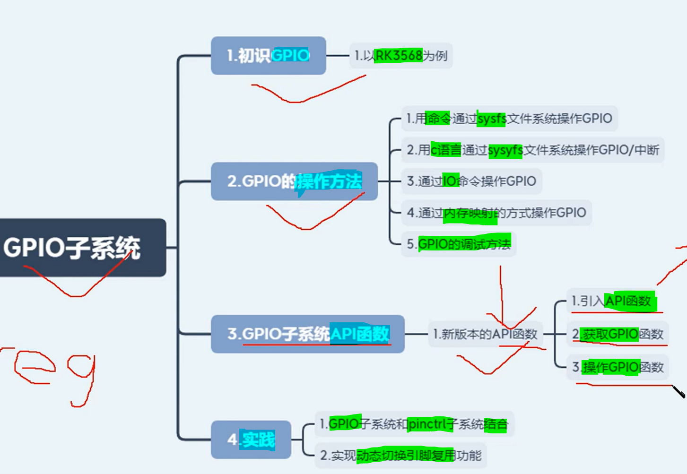

# 备注(声明)：

# 一、初识GPIO

## 初识RK3568处理器GPIO
### 1 什么是 GPIO? --通用输入输出端口
[“2-初识RK3568处理器GPIO”页上的图片](onenote:https://d.docs.live.net/52d4b76bb0ffcf51/Documents/\(RK3568\)Linux驱动开发/第十二期_GPIO子系统.one#2-初识RK3568处理器GPIO&section-id={70166D78-0FC7-4512-B1CF-4A4481F8C206}&page-id={07CB6425-8371-4FC4-BE75-D209E97581B2}&object-id={496A4B86-8977-4762-B002-7D0673495F1F}&16)  ([Web 视图](https://onedrive.live.com/view.aspx?resid=52D4B76BB0FFCF51%21se8c325913f784bf694d429e5ee2ab2be&id=documents&wd=target%28%E7%AC%AC%E5%8D%81%E4%BA%8C%E6%9C%9F_GPIO%E5%AD%90%E7%B3%BB%E7%BB%9F.one%7C70166D78-0FC7-4512-B1CF-4A4481F8C206%2F2-%E5%88%9D%E8%AF%86RK3568%E5%A4%84%E7%90%86%E5%99%A8GPIO%7C07CB6425-8371-4FC4-BE75-D209E97581B2%2F%29&wdpartid=%7b2FDB1346-6559-46D2-8645-59A7AEF5F24C%7d%7b1%7d&wdsectionfileid=52D4B76BB0FFCF51!s379e81f769634ad2a8a457194a5b5af6))

### 2 GPIO引脚分布
[“2-初识RK3568处理器GPIO”页上的图片](onenote:https://d.docs.live.net/52d4b76bb0ffcf51/Documents/\(RK3568\)Linux驱动开发/第十二期_GPIO子系统.one#2-初识RK3568处理器GPIO&section-id={70166D78-0FC7-4512-B1CF-4A4481F8C206}&page-id={07CB6425-8371-4FC4-BE75-D209E97581B2}&object-id={496A4B86-8977-4762-B002-7D0673495F1F}&32)  ([Web 视图](https://onedrive.live.com/view.aspx?resid=52D4B76BB0FFCF51%21se8c325913f784bf694d429e5ee2ab2be&id=documents&wd=target%28%E7%AC%AC%E5%8D%81%E4%BA%8C%E6%9C%9F_GPIO%E5%AD%90%E7%B3%BB%E7%BB%9F.one%7C70166D78-0FC7-4512-B1CF-4A4481F8C206%2F2-%E5%88%9D%E8%AF%86RK3568%E5%A4%84%E7%90%86%E5%99%A8GPIO%7C07CB6425-8371-4FC4-BE75-D209E97581B2%2F%29&wdpartid=%7b2FDB1346-6559-46D2-8645-59A7AEF5F24C%7d%7b1%7d&wdsectionfileid=52D4B76BB0FFCF51!s379e81f769634ad2a8a457194a5b5af6))

### 3 GPIO电气属性
[“2-初识RK3568处理器GPIO”页上的图片](onenote:https://d.docs.live.net/52d4b76bb0ffcf51/Documents/\(RK3568\)Linux驱动开发/第十二期_GPIO子系统.one#2-初识RK3568处理器GPIO&section-id={70166D78-0FC7-4512-B1CF-4A4481F8C206}&page-id={07CB6425-8371-4FC4-BE75-D209E97581B2}&object-id={496A4B86-8977-4762-B002-7D0673495F1F}&43)  ([Web 视图](https://onedrive.live.com/view.aspx?resid=52D4B76BB0FFCF51%21se8c325913f784bf694d429e5ee2ab2be&id=documents&wd=target%28%E7%AC%AC%E5%8D%81%E4%BA%8C%E6%9C%9F_GPIO%E5%AD%90%E7%B3%BB%E7%BB%9F.one%7C70166D78-0FC7-4512-B1CF-4A4481F8C206%2F2-%E5%88%9D%E8%AF%86RK3568%E5%A4%84%E7%90%86%E5%99%A8GPIO%7C07CB6425-8371-4FC4-BE75-D209E97581B2%2F%29&wdpartid=%7b2FDB1346-6559-46D2-8645-59A7AEF5F24C%7d%7b1%7d&wdsectionfileid=52D4B76BB0FFCF51!s379e81f769634ad2a8a457194a5b5af6))

### 4 原理图上GPIO引脚
[这个D是down](onenote:https://d.docs.live.net/52d4b76bb0ffcf51/Documents/\(RK3568\)Linux驱动开发/第十二期_GPIO子系统.one#2-初识RK3568处理器GPIO&section-id={70166D78-0FC7-4512-B1CF-4A4481F8C206}&page-id={07CB6425-8371-4FC4-BE75-D209E97581B2}&object-id={13320D84-6CBA-4B2C-A481-2EAEC57E5F80}&24)  ([Web 视图](https://onedrive.live.com/view.aspx?resid=52D4B76BB0FFCF51%21se8c325913f784bf694d429e5ee2ab2be&id=documents&wd=target%28%E7%AC%AC%E5%8D%81%E4%BA%8C%E6%9C%9F_GPIO%E5%AD%90%E7%B3%BB%E7%BB%9F.one%7C70166D78-0FC7-4512-B1CF-4A4481F8C206%2F2-%E5%88%9D%E8%AF%86RK3568%E5%A4%84%E7%90%86%E5%99%A8GPIO%7C07CB6425-8371-4FC4-BE75-D209E97581B2%2F%29&wdpartid=%7b2FDB1346-6559-46D2-8645-59A7AEF5F24C%7d%7b1%7d&wdsectionfileid=52D4B76BB0FFCF51!s379e81f769634ad2a8a457194a5b5af6))

### 5、GPIO 电气特性
[“2-初识RK3568处理器GPIO”页上的图片](onenote:https://d.docs.live.net/52d4b76bb0ffcf51/Documents/\(RK3568\)Linux驱动开发/第十二期_GPIO子系统.one#2-初识RK3568处理器GPIO&section-id={70166D78-0FC7-4512-B1CF-4A4481F8C206}&page-id={07CB6425-8371-4FC4-BE75-D209E97581B2}&object-id={496A4B86-8977-4762-B002-7D0673495F1F}&73)  ([Web 视图](https://onedrive.live.com/view.aspx?resid=52D4B76BB0FFCF51%21se8c325913f784bf694d429e5ee2ab2be&id=documents&wd=target%28%E7%AC%AC%E5%8D%81%E4%BA%8C%E6%9C%9F_GPIO%E5%AD%90%E7%B3%BB%E7%BB%9F.one%7C70166D78-0FC7-4512-B1CF-4A4481F8C206%2F2-%E5%88%9D%E8%AF%86RK3568%E5%A4%84%E7%90%86%E5%99%A8GPIO%7C07CB6425-8371-4FC4-BE75-D209E97581B2%2F%29&wdpartid=%7b2FDB1346-6559-46D2-8645-59A7AEF5F24C%7d%7b1%7d&wdsectionfileid=52D4B76BB0FFCF51!s379e81f769634ad2a8a457194a5b5af6))

- **在设备数中使用pin control去配置它的驱动强度、上拉和下拉以及银角的复用**
[“2-初识RK3568处理器GPIO”页上的图片](onenote:https://d.docs.live.net/52d4b76bb0ffcf51/Documents/\(RK3568\)Linux驱动开发/第十二期_GPIO子系统.one#2-初识RK3568处理器GPIO&section-id={70166D78-0FC7-4512-B1CF-4A4481F8C206}&page-id={07CB6425-8371-4FC4-BE75-D209E97581B2}&object-id={496A4B86-8977-4762-B002-7D0673495F1F}&7E)  ([Web 视图](https://onedrive.live.com/view.aspx?resid=52D4B76BB0FFCF51%21se8c325913f784bf694d429e5ee2ab2be&id=documents&wd=target%28%E7%AC%AC%E5%8D%81%E4%BA%8C%E6%9C%9F_GPIO%E5%AD%90%E7%B3%BB%E7%BB%9F.one%7C70166D78-0FC7-4512-B1CF-4A4481F8C206%2F2-%E5%88%9D%E8%AF%86RK3568%E5%A4%84%E7%90%86%E5%99%A8GPIO%7C07CB6425-8371-4FC4-BE75-D209E97581B2%2F%29&wdpartid=%7b2FDB1346-6559-46D2-8645-59A7AEF5F24C%7d%7b1%7d&wdsectionfileid=52D4B76BB0FFCF51!s379e81f769634ad2a8a457194a5b5af6))

##

### 1 

### 2 

### 3 

### 4 

### 5、

### 6、

### 7、

### 8、

## 
### 1 

### 2 

### 3 

### 4 

### 5、

### 6、

### 7、

### 8、

# 二、 GPIO的操作方法

## 使用命令通过sysfs文件系统控制GPIO
### 1 配置内核支持--使用 sysfs 方式控制 gpio,
[“3-使用命令通过sysfs文件系统控制GPIO”页上的图片](onenote:https://d.docs.live.net/52d4b76bb0ffcf51/Documents/\(RK3568\)Linux驱动开发/第十二期_GPIO子系统.one#3-使用命令通过sysfs文件系统控制GPIO&section-id={70166D78-0FC7-4512-B1CF-4A4481F8C206}&page-id={471F55C3-0F87-4888-BC65-7A714608E9A3}&object-id={331BA611-E4FC-4770-A685-F8310D1EE287}&16)  ([Web 视图](https://onedrive.live.com/view.aspx?resid=52D4B76BB0FFCF51%21se8c325913f784bf694d429e5ee2ab2be&id=documents&wd=target%28%E7%AC%AC%E5%8D%81%E4%BA%8C%E6%9C%9F_GPIO%E5%AD%90%E7%B3%BB%E7%BB%9F.one%7C70166D78-0FC7-4512-B1CF-4A4481F8C206%2F3-%E4%BD%BF%E7%94%A8%E5%91%BD%E4%BB%A4%E9%80%9A%E8%BF%87sysfs%E6%96%87%E4%BB%B6%E7%B3%BB%E7%BB%9F%E6%8E%A7%E5%88%B6GPIO%7C471F55C3-0F87-4888-BC65-7A714608E9A3%2F%29&wdpartid=%7b6260DF4F-45D8-47AA-89D1-7DBACA718547%7d%7b1%7d&wdsectionfileid=52D4B76BB0FFCF51!s379e81f769634ad2a8a457194a5b5af6))

### 2 sysfs控制接口--属性文件及其含义
[“3-使用命令通过sysfs文件系统控制GPIO”页上的图片](onenote:https://d.docs.live.net/52d4b76bb0ffcf51/Documents/\(RK3568\)Linux驱动开发/第十二期_GPIO子系统.one#3-使用命令通过sysfs文件系统控制GPIO&section-id={70166D78-0FC7-4512-B1CF-4A4481F8C206}&page-id={471F55C3-0F87-4888-BC65-7A714608E9A3}&object-id={CCA847EF-F0E2-4605-9C75-58C0EFD602CE}&1C)  ([Web 视图](https://onedrive.live.com/view.aspx?resid=52D4B76BB0FFCF51%21se8c325913f784bf694d429e5ee2ab2be&id=documents&wd=target%28%E7%AC%AC%E5%8D%81%E4%BA%8C%E6%9C%9F_GPIO%E5%AD%90%E7%B3%BB%E7%BB%9F.one%7C70166D78-0FC7-4512-B1CF-4A4481F8C206%2F3-%E4%BD%BF%E7%94%A8%E5%91%BD%E4%BB%A4%E9%80%9A%E8%BF%87sysfs%E6%96%87%E4%BB%B6%E7%B3%BB%E7%BB%9F%E6%8E%A7%E5%88%B6GPIO%7C471F55C3-0F87-4888-BC65-7A714608E9A3%2F%29&wdpartid=%7b6260DF4F-45D8-47AA-89D1-7DBACA718547%7d%7b1%7d&wdsectionfileid=52D4B76BB0FFCF51!s379e81f769634ad2a8a457194a5b5af6))

- 1 cd /sys/class/gpio/
### 3 gpio 控制接口--属性文件及其含义
[“3-使用命令通过sysfs文件系统控制GPIO”页上的图片](onenote:https://d.docs.live.net/52d4b76bb0ffcf51/Documents/\(RK3568\)Linux驱动开发/第十二期_GPIO子系统.one#3-使用命令通过sysfs文件系统控制GPIO&section-id={70166D78-0FC7-4512-B1CF-4A4481F8C206}&page-id={471F55C3-0F87-4888-BC65-7A714608E9A3}&object-id={CCA847EF-F0E2-4605-9C75-58C0EFD602CE}&24)  ([Web 视图](https://onedrive.live.com/view.aspx?resid=52D4B76BB0FFCF51%21se8c325913f784bf694d429e5ee2ab2be&id=documents&wd=target%28%E7%AC%AC%E5%8D%81%E4%BA%8C%E6%9C%9F_GPIO%E5%AD%90%E7%B3%BB%E7%BB%9F.one%7C70166D78-0FC7-4512-B1CF-4A4481F8C206%2F3-%E4%BD%BF%E7%94%A8%E5%91%BD%E4%BB%A4%E9%80%9A%E8%BF%87sysfs%E6%96%87%E4%BB%B6%E7%B3%BB%E7%BB%9F%E6%8E%A7%E5%88%B6GPIO%7C471F55C3-0F87-4888-BC65-7A714608E9A3%2F%29&wdpartid=%7b6260DF4F-45D8-47AA-89D1-7DBACA718547%7d%7b1%7d&wdsectionfileid=52D4B76BB0FFCF51!s379e81f769634ad2a8a457194a5b5af6))

- 1 /sys/class/gpio/gpioN/下有多种属性

### 4 使用sysfs 控制 gpio 的方法--命令
[“3-使用命令通过sysfs文件系统控制GPIO”页上的图片](onenote:https://d.docs.live.net/52d4b76bb0ffcf51/Documents/\(RK3568\)Linux驱动开发/第十二期_GPIO子系统.one#3-使用命令通过sysfs文件系统控制GPIO&section-id={70166D78-0FC7-4512-B1CF-4A4481F8C206}&page-id={471F55C3-0F87-4888-BC65-7A714608E9A3}&object-id={CCA847EF-F0E2-4605-9C75-58C0EFD602CE}&47)  ([Web 视图](https://onedrive.live.com/view.aspx?resid=52D4B76BB0FFCF51%21se8c325913f784bf694d429e5ee2ab2be&id=documents&wd=target%28%E7%AC%AC%E5%8D%81%E4%BA%8C%E6%9C%9F_GPIO%E5%AD%90%E7%B3%BB%E7%BB%9F.one%7C70166D78-0FC7-4512-B1CF-4A4481F8C206%2F3-%E4%BD%BF%E7%94%A8%E5%91%BD%E4%BB%A4%E9%80%9A%E8%BF%87sysfs%E6%96%87%E4%BB%B6%E7%B3%BB%E7%BB%9F%E6%8E%A7%E5%88%B6GPIO%7C471F55C3-0F87-4888-BC65-7A714608E9A3%2F%29&wdpartid=%7b6260DF4F-45D8-47AA-89D1-7DBACA718547%7d%7b1%7d&wdsectionfileid=52D4B76BB0FFCF51!s379e81f769634ad2a8a457194a5b5af6))

### 5、报错与处理：sh: write error: Device or resource busy
[“3-使用命令通过sysfs文件系统控制GPIO”页上的图片](onenote:https://d.docs.live.net/52d4b76bb0ffcf51/Documents/\(RK3568\)Linux驱动开发/第十二期_GPIO子系统.one#3-使用命令通过sysfs文件系统控制GPIO&section-id={70166D78-0FC7-4512-B1CF-4A4481F8C206}&page-id={471F55C3-0F87-4888-BC65-7A714608E9A3}&object-id={CCA847EF-F0E2-4605-9C75-58C0EFD602CE}&4F)  ([Web 视图](https://onedrive.live.com/view.aspx?resid=52D4B76BB0FFCF51%21se8c325913f784bf694d429e5ee2ab2be&id=documents&wd=target%28%E7%AC%AC%E5%8D%81%E4%BA%8C%E6%9C%9F_GPIO%E5%AD%90%E7%B3%BB%E7%BB%9F.one%7C70166D78-0FC7-4512-B1CF-4A4481F8C206%2F3-%E4%BD%BF%E7%94%A8%E5%91%BD%E4%BB%A4%E9%80%9A%E8%BF%87sysfs%E6%96%87%E4%BB%B6%E7%B3%BB%E7%BB%9F%E6%8E%A7%E5%88%B6GPIO%7C471F55C3-0F87-4888-BC65-7A714608E9A3%2F%29&wdpartid=%7b6260DF4F-45D8-47AA-89D1-7DBACA718547%7d%7b1%7d&wdsectionfileid=52D4B76BB0FFCF51!s379e81f769634ad2a8a457194a5b5af6))

### 6、

## 使用C程序通过sysfs文件系统控制GPIO

### 1 通过man手册查找头文件
[头文件你不用去背](onenote:https://d.docs.live.net/52d4b76bb0ffcf51/Documents/\(RK3568\)Linux驱动开发/第十二期_GPIO子系统.one#4-使用C程序通过sysfs文件系统控制GPIO（一）&section-id={70166D78-0FC7-4512-B1CF-4A4481F8C206}&page-id={9A1992B5-1AD4-4B65-93CB-71BC78110341}&object-id={D0D690BC-94FB-485B-9BE6-C6DD13036848}&26)  ([Web 视图](https://onedrive.live.com/view.aspx?resid=52D4B76BB0FFCF51%21se8c325913f784bf694d429e5ee2ab2be&id=documents&wd=target%28%E7%AC%AC%E5%8D%81%E4%BA%8C%E6%9C%9F_GPIO%E5%AD%90%E7%B3%BB%E7%BB%9F.one%7C70166D78-0FC7-4512-B1CF-4A4481F8C206%2F4-%E4%BD%BF%E7%94%A8C%E7%A8%8B%E5%BA%8F%E9%80%9A%E8%BF%87sysfs%E6%96%87%E4%BB%B6%E7%B3%BB%E7%BB%9F%E6%8E%A7%E5%88%B6GPIO%EF%BC%88%E4%B8%80%EF%BC%89%7C9A1992B5-1AD4-4B65-93CB-71BC78110341%2F%29&wdpartid=%7b741056BA-DE22-4038-843A-2EEF1FC430E8%7d%7b1%7d&wdsectionfileid=52D4B76BB0FFCF51!s379e81f769634ad2a8a457194a5b5af6))
[你直接去查看这个man手册就可以了](onenote:https://d.docs.live.net/52d4b76bb0ffcf51/Documents/\(RK3568\)Linux驱动开发/第十二期_GPIO子系统.one#4-使用C程序通过sysfs文件系统控制GPIO（一）&section-id={70166D78-0FC7-4512-B1CF-4A4481F8C206}&page-id={9A1992B5-1AD4-4B65-93CB-71BC78110341}&object-id={D0D690BC-94FB-485B-9BE6-C6DD13036848}&28)  ([Web 视图](https://onedrive.live.com/view.aspx?resid=52D4B76BB0FFCF51%21se8c325913f784bf694d429e5ee2ab2be&id=documents&wd=target%28%E7%AC%AC%E5%8D%81%E4%BA%8C%E6%9C%9F_GPIO%E5%AD%90%E7%B3%BB%E7%BB%9F.one%7C70166D78-0FC7-4512-B1CF-4A4481F8C206%2F4-%E4%BD%BF%E7%94%A8C%E7%A8%8B%E5%BA%8F%E9%80%9A%E8%BF%87sysfs%E6%96%87%E4%BB%B6%E7%B3%BB%E7%BB%9F%E6%8E%A7%E5%88%B6GPIO%EF%BC%88%E4%B8%80%EF%BC%89%7C9A1992B5-1AD4-4B65-93CB-71BC78110341%2F%29&wdpartid=%7b741056BA-DE22-4038-843A-2EEF1FC430E8%7d%7b1%7d&wdsectionfileid=52D4B76BB0FFCF51!s379e81f769634ad2a8a457194a5b5af6))

### 2 导出GPIO引脚函数--gpio_export
[“4-使用C程序通过sysfs文件系统控制GPIO（一）”页上的图片](onenote:https://d.docs.live.net/52d4b76bb0ffcf51/Documents/\(RK3568\)Linux驱动开发/第十二期_GPIO子系统.one#4-使用C程序通过sysfs文件系统控制GPIO（一）&section-id={70166D78-0FC7-4512-B1CF-4A4481F8C206}&page-id={9A1992B5-1AD4-4B65-93CB-71BC78110341}&object-id={D0D690BC-94FB-485B-9BE6-C6DD13036848}&3F)  ([Web 视图](https://onedrive.live.com/view.aspx?resid=52D4B76BB0FFCF51%21se8c325913f784bf694d429e5ee2ab2be&id=documents&wd=target%28%E7%AC%AC%E5%8D%81%E4%BA%8C%E6%9C%9F_GPIO%E5%AD%90%E7%B3%BB%E7%BB%9F.one%7C70166D78-0FC7-4512-B1CF-4A4481F8C206%2F4-%E4%BD%BF%E7%94%A8C%E7%A8%8B%E5%BA%8F%E9%80%9A%E8%BF%87sysfs%E6%96%87%E4%BB%B6%E7%B3%BB%E7%BB%9F%E6%8E%A7%E5%88%B6GPIO%EF%BC%88%E4%B8%80%EF%BC%89%7C9A1992B5-1AD4-4B65-93CB-71BC78110341%2F%29&wdpartid=%7b741056BA-DE22-4038-843A-2EEF1FC430E8%7d%7b1%7d&wdsectionfileid=52D4B76BB0FFCF51!s379e81f769634ad2a8a457194a5b5af6))

- 1 fd --->  /sys/class/gpio/export
- 1 write(fd，argv，len);// 将参数字符串写入文件，导出GPIO引脚

- 1 gpio_export(argv[1]);
### 3 取消导出GPIO引脚函数
[“4-使用C程序通过sysfs文件系统控制GPIO（一）”页上的图片](onenote:https://d.docs.live.net/52d4b76bb0ffcf51/Documents/\(RK3568\)Linux驱动开发/第十二期_GPIO子系统.one#4-使用C程序通过sysfs文件系统控制GPIO（一）&section-id={70166D78-0FC7-4512-B1CF-4A4481F8C206}&page-id={9A1992B5-1AD4-4B65-93CB-71BC78110341}&object-id={D0D690BC-94FB-485B-9BE6-C6DD13036848}&44)  ([Web 视图](https://onedrive.live.com/view.aspx?resid=52D4B76BB0FFCF51%21se8c325913f784bf694d429e5ee2ab2be&id=documents&wd=target%28%E7%AC%AC%E5%8D%81%E4%BA%8C%E6%9C%9F_GPIO%E5%AD%90%E7%B3%BB%E7%BB%9F.one%7C70166D78-0FC7-4512-B1CF-4A4481F8C206%2F4-%E4%BD%BF%E7%94%A8C%E7%A8%8B%E5%BA%8F%E9%80%9A%E8%BF%87sysfs%E6%96%87%E4%BB%B6%E7%B3%BB%E7%BB%9F%E6%8E%A7%E5%88%B6GPIO%EF%BC%88%E4%B8%80%EF%BC%89%7C9A1992B5-1AD4-4B65-93CB-71BC78110341%2F%29&wdpartid=%7b741056BA-DE22-4038-843A-2EEF1FC430E8%7d%7b1%7d&wdsectionfileid=52D4B76BB0FFCF51!s379e81f769634ad2a8a457194a5b5af6))

### 4 控制GPIO引脚的属性函数
[“4-使用C程序通过sysfs文件系统控制GPIO（一）”页上的图片](onenote:https://d.docs.live.net/52d4b76bb0ffcf51/Documents/\(RK3568\)Linux驱动开发/第十二期_GPIO子系统.one#4-使用C程序通过sysfs文件系统控制GPIO（一）&section-id={70166D78-0FC7-4512-B1CF-4A4481F8C206}&page-id={9A1992B5-1AD4-4B65-93CB-71BC78110341}&object-id={D0D690BC-94FB-485B-9BE6-C6DD13036848}&49)  ([Web 视图](https://onedrive.live.com/view.aspx?resid=52D4B76BB0FFCF51%21se8c325913f784bf694d429e5ee2ab2be&id=documents&wd=target%28%E7%AC%AC%E5%8D%81%E4%BA%8C%E6%9C%9F_GPIO%E5%AD%90%E7%B3%BB%E7%BB%9F.one%7C70166D78-0FC7-4512-B1CF-4A4481F8C206%2F4-%E4%BD%BF%E7%94%A8C%E7%A8%8B%E5%BA%8F%E9%80%9A%E8%BF%87sysfs%E6%96%87%E4%BB%B6%E7%B3%BB%E7%BB%9F%E6%8E%A7%E5%88%B6GPIO%EF%BC%88%E4%B8%80%EF%BC%89%7C9A1992B5-1AD4-4B65-93CB-71BC78110341%2F%29&wdpartid=%7b741056BA-DE22-4038-843A-2EEF1FC430E8%7d%7b1%7d&wdsectionfileid=52D4B76BB0FFCF51!s379e81f769634ad2a8a457194a5b5af6))

- 1 gpio_ctrl("direction""out");// 配置GPIO为输出模式
- 1 gpio_ctrl("value"argv[2]);// 控制GPIO输出高低电平

### 5、实验操作及现象
[“4-使用C程序通过sysfs文件系统控制GPIO（一）”页上的图片](onenote:https://d.docs.live.net/52d4b76bb0ffcf51/Documents/\(RK3568\)Linux驱动开发/第十二期_GPIO子系统.one#4-使用C程序通过sysfs文件系统控制GPIO（一）&section-id={70166D78-0FC7-4512-B1CF-4A4481F8C206}&page-id={9A1992B5-1AD4-4B65-93CB-71BC78110341}&object-id={9CE09E76-C889-4A73-9C9E-1BC595C851BB}&11)  ([Web 视图](https://onedrive.live.com/view.aspx?resid=52D4B76BB0FFCF51%21se8c325913f784bf694d429e5ee2ab2be&id=documents&wd=target%28%E7%AC%AC%E5%8D%81%E4%BA%8C%E6%9C%9F_GPIO%E5%AD%90%E7%B3%BB%E7%BB%9F.one%7C70166D78-0FC7-4512-B1CF-4A4481F8C206%2F4-%E4%BD%BF%E7%94%A8C%E7%A8%8B%E5%BA%8F%E9%80%9A%E8%BF%87sysfs%E6%96%87%E4%BB%B6%E7%B3%BB%E7%BB%9F%E6%8E%A7%E5%88%B6GPIO%EF%BC%88%E4%B8%80%EF%BC%89%7C9A1992B5-1AD4-4B65-93CB-71BC78110341%2F%29&wdpartid=%7b741056BA-DE22-4038-843A-2EEF1FC430E8%7d%7b1%7d&wdsectionfileid=52D4B76BB0FFCF51!s379e81f769634ad2a8a457194a5b5af6))

### 6、读取 GPIO 引脚的值
[“5-使用C程序通过sysfs文件系统控制GPIO（二）”页上的图片](onenote:https://d.docs.live.net/52d4b76bb0ffcf51/Documents/\(RK3568\)Linux驱动开发/第十二期_GPIO子系统.one#5-使用C程序通过sysfs文件系统控制GPIO（二）&section-id={70166D78-0FC7-4512-B1CF-4A4481F8C206}&page-id={948A85FB-3204-4B6D-B155-F736389F14F4}&object-id={446DA9E5-AE33-4B69-8A8B-883DA57751CE}&16)  ([Web 视图](https://onedrive.live.com/view.aspx?resid=52D4B76BB0FFCF51%21se8c325913f784bf694d429e5ee2ab2be&id=documents&wd=target%28%E7%AC%AC%E5%8D%81%E4%BA%8C%E6%9C%9F_GPIO%E5%AD%90%E7%B3%BB%E7%BB%9F.one%7C70166D78-0FC7-4512-B1CF-4A4481F8C206%2F5-%E4%BD%BF%E7%94%A8C%E7%A8%8B%E5%BA%8F%E9%80%9A%E8%BF%87sysfs%E6%96%87%E4%BB%B6%E7%B3%BB%E7%BB%9F%E6%8E%A7%E5%88%B6GPIO%EF%BC%88%E4%BA%8C%EF%BC%89%7C948A85FB-3204-4B6D-B155-F736389F14F4%2F%29&wdpartid=%7b42E05D14-EE14-4307-9757-D759BAD78E2C%7d%7b1%7d&wdsectionfileid=52D4B76BB0FFCF51!s379e81f769634ad2a8a457194a5b5af6))

 - 1 value = gpio_read_value("value");// 读取 GPIO 引脚的值

### 7、poll函数定义及解析
[“6-使用C程序通过sysfs文件系统使用GPIO中断”页上的图片](onenote:https://d.docs.live.net/52d4b76bb0ffcf51/Documents/\(RK3568\)Linux驱动开发/第十二期_GPIO子系统.one#6-使用C程序通过sysfs文件系统使用GPIO中断&section-id={70166D78-0FC7-4512-B1CF-4A4481F8C206}&page-id={91453141-EED0-461F-8A53-3337696AF46D}&object-id={02B7D2D7-21A5-48FD-A81E-3968198DE6F4}&2A)  ([Web 视图](https://onedrive.live.com/view.aspx?resid=52D4B76BB0FFCF51%21se8c325913f784bf694d429e5ee2ab2be&id=documents&wd=target%28%E7%AC%AC%E5%8D%81%E4%BA%8C%E6%9C%9F_GPIO%E5%AD%90%E7%B3%BB%E7%BB%9F.one%7C70166D78-0FC7-4512-B1CF-4A4481F8C206%2F6-%E4%BD%BF%E7%94%A8C%E7%A8%8B%E5%BA%8F%E9%80%9A%E8%BF%87sysfs%E6%96%87%E4%BB%B6%E7%B3%BB%E7%BB%9F%E4%BD%BF%E7%94%A8GPIO%E4%B8%AD%E6%96%AD%7C91453141-EED0-461F-8A53-3337696AF46D%2F%29&wdpartid=%7bBA8B2226-4036-46BE-85EC-C7CF51EE1615%7d%7b1%7d&wdsectionfileid=52D4B76BB0FFCF51!s379e81f769634ad2a8a457194a5b5af6))

### 8、监听GPIO引脚的中断事件 
[“6-使用C程序通过sysfs文件系统使用GPIO中断”页上的图片](onenote:https://d.docs.live.net/52d4b76bb0ffcf51/Documents/\(RK3568\)Linux驱动开发/第十二期_GPIO子系统.one#6-使用C程序通过sysfs文件系统使用GPIO中断&section-id={70166D78-0FC7-4512-B1CF-4A4481F8C206}&page-id={91453141-EED0-461F-8A53-3337696AF46D}&object-id={02B7D2D7-21A5-48FD-A81E-3968198DE6F4}&3C)  ([Web 视图](https://onedrive.live.com/view.aspx?resid=52D4B76BB0FFCF51%21se8c325913f784bf694d429e5ee2ab2be&id=documents&wd=target%28%E7%AC%AC%E5%8D%81%E4%BA%8C%E6%9C%9F_GPIO%E5%AD%90%E7%B3%BB%E7%BB%9F.one%7C70166D78-0FC7-4512-B1CF-4A4481F8C206%2F6-%E4%BD%BF%E7%94%A8C%E7%A8%8B%E5%BA%8F%E9%80%9A%E8%BF%87sysfs%E6%96%87%E4%BB%B6%E7%B3%BB%E7%BB%9F%E4%BD%BF%E7%94%A8GPIO%E4%B8%AD%E6%96%AD%7C91453141-EED0-461F-8A53-3337696AF46D%2F%29&wdpartid=%7bBA8B2226-4036-46BE-85EC-C7CF51EE1615%7d%7b1%7d&wdsectionfileid=52D4B76BB0FFCF51!s379e81f769634ad2a8a457194a5b5af6))

- 1 gpio_interrupt("value"),  //监听GPIO引脚的中断事件

### 9、实验操作及现象
[“6-使用C程序通过sysfs文件系统使用GPIO中断”页上的图片](onenote:https://d.docs.live.net/52d4b76bb0ffcf51/Documents/\(RK3568\)Linux驱动开发/第十二期_GPIO子系统.one#6-使用C程序通过sysfs文件系统使用GPIO中断&section-id={70166D78-0FC7-4512-B1CF-4A4481F8C206}&page-id={91453141-EED0-461F-8A53-3337696AF46D}&object-id={02B7D2D7-21A5-48FD-A81E-3968198DE6F4}&65)  ([Web 视图](https://onedrive.live.com/view.aspx?resid=52D4B76BB0FFCF51%21se8c325913f784bf694d429e5ee2ab2be&id=documents&wd=target%28%E7%AC%AC%E5%8D%81%E4%BA%8C%E6%9C%9F_GPIO%E5%AD%90%E7%B3%BB%E7%BB%9F.one%7C70166D78-0FC7-4512-B1CF-4A4481F8C206%2F6-%E4%BD%BF%E7%94%A8C%E7%A8%8B%E5%BA%8F%E9%80%9A%E8%BF%87sysfs%E6%96%87%E4%BB%B6%E7%B3%BB%E7%BB%9F%E4%BD%BF%E7%94%A8GPIO%E4%B8%AD%E6%96%AD%7C91453141-EED0-461F-8A53-3337696AF46D%2F%29&wdpartid=%7bBA8B2226-4036-46BE-85EC-C7CF51EE1615%7d%7b1%7d&wdsectionfileid=52D4B76BB0FFCF51!s379e81f769634ad2a8a457194a5b5af6))

## GPIO的调试方法--debugfs
### 1 挂载debugfs
[“9-授人以渔-GPIO的调试方法”页上的图片](onenote:https://d.docs.live.net/52d4b76bb0ffcf51/Documents/\(RK3568\)Linux驱动开发/第十二期_GPIO子系统.one#9-授人以渔-GPIO的调试方法&section-id={70166D78-0FC7-4512-B1CF-4A4481F8C206}&page-id={6F8408B0-1FC3-4550-AD7C-02C6ACBA170B}&object-id={DA9E0D8F-127D-4A88-8A43-9044819D2B94}&2D)  ([Web 视图](https://onedrive.live.com/view.aspx?resid=52D4B76BB0FFCF51%21se8c325913f784bf694d429e5ee2ab2be&id=documents&wd=target%28%E7%AC%AC%E5%8D%81%E4%BA%8C%E6%9C%9F_GPIO%E5%AD%90%E7%B3%BB%E7%BB%9F.one%7C70166D78-0FC7-4512-B1CF-4A4481F8C206%2F9-%E6%8E%88%E4%BA%BA%E4%BB%A5%E6%B8%94-GPIO%E7%9A%84%E8%B0%83%E8%AF%95%E6%96%B9%E6%B3%95%7C6F8408B0-1FC3-4550-AD7C-02C6ACBA170B%2F%29&wdpartid=%7b7D4CB57A-D3FE-4E87-92AE-58DA9C77E1F1%7d%7b1%7d&wdsectionfileid=52D4B76BB0FFCF51!s379e81f769634ad2a8a457194a5b5af6))

### 2 查看 gpio 的使用情况
[“9-授人以渔-GPIO的调试方法”页上的图片](onenote:https://d.docs.live.net/52d4b76bb0ffcf51/Documents/\(RK3568\)Linux驱动开发/第十二期_GPIO子系统.one#9-授人以渔-GPIO的调试方法&section-id={70166D78-0FC7-4512-B1CF-4A4481F8C206}&page-id={6F8408B0-1FC3-4550-AD7C-02C6ACBA170B}&object-id={DA9E0D8F-127D-4A88-8A43-9044819D2B94}&4E)  ([Web 视图](https://onedrive.live.com/view.aspx?resid=52D4B76BB0FFCF51%21se8c325913f784bf694d429e5ee2ab2be&id=documents&wd=target%28%E7%AC%AC%E5%8D%81%E4%BA%8C%E6%9C%9F_GPIO%E5%AD%90%E7%B3%BB%E7%BB%9F.one%7C70166D78-0FC7-4512-B1CF-4A4481F8C206%2F9-%E6%8E%88%E4%BA%BA%E4%BB%A5%E6%B8%94-GPIO%E7%9A%84%E8%B0%83%E8%AF%95%E6%96%B9%E6%B3%95%7C6F8408B0-1FC3-4550-AD7C-02C6ACBA170B%2F%29&wdpartid=%7b7D4CB57A-D3FE-4E87-92AE-58DA9C77E1F1%7d%7b1%7d&wdsectionfileid=52D4B76BB0FFCF51!s379e81f769634ad2a8a457194a5b5af6))

- 1 cat /sys/kernel/debug/gpio

### 3 查看 gpio的所有配置--命令
[“9-授人以渔-GPIO的调试方法”页上的图片](onenote:https://d.docs.live.net/52d4b76bb0ffcf51/Documents/\(RK3568\)Linux驱动开发/第十二期_GPIO子系统.one#9-授人以渔-GPIO的调试方法&section-id={70166D78-0FC7-4512-B1CF-4A4481F8C206}&page-id={6F8408B0-1FC3-4550-AD7C-02C6ACBA170B}&object-id={DA9E0D8F-127D-4A88-8A43-9044819D2B94}&5B)  ([Web 视图](https://onedrive.live.com/view.aspx?resid=52D4B76BB0FFCF51%21se8c325913f784bf694d429e5ee2ab2be&id=documents&wd=target%28%E7%AC%AC%E5%8D%81%E4%BA%8C%E6%9C%9F_GPIO%E5%AD%90%E7%B3%BB%E7%BB%9F.one%7C70166D78-0FC7-4512-B1CF-4A4481F8C206%2F9-%E6%8E%88%E4%BA%BA%E4%BB%A5%E6%B8%94-GPIO%E7%9A%84%E8%B0%83%E8%AF%95%E6%96%B9%E6%B3%95%7C6F8408B0-1FC3-4550-AD7C-02C6ACBA170B%2F%29&wdpartid=%7b7D4CB57A-D3FE-4E87-92AE-58DA9C77E1F1%7d%7b1%7d&wdsectionfileid=52D4B76BB0FFCF51!s379e81f769634ad2a8a457194a5b5af6))

- 1 进入到pinctrl-rockchip-pinctrl目录下

# 三、GPIO子系统API函数

## 新的 gpio 子系统接口介绍
### 1 旧的接口仍然被支持。
[“10-引入GPIO子系统API函数”页上的图片](onenote:https://d.docs.live.net/52d4b76bb0ffcf51/Documents/\(RK3568\)Linux驱动开发/第十二期_GPIO子系统.one#10-引入GPIO子系统API函数&section-id={70166D78-0FC7-4512-B1CF-4A4481F8C206}&page-id={43DF1CFA-6A97-4410-82EE-A039A1AAD47E}&object-id={78F3FE99-04F9-4579-9BBC-4121A980A9D4}&16)  ([Web 视图](https://onedrive.live.com/view.aspx?resid=52D4B76BB0FFCF51%21se8c325913f784bf694d429e5ee2ab2be&id=documents&wd=target%28%E7%AC%AC%E5%8D%81%E4%BA%8C%E6%9C%9F_GPIO%E5%AD%90%E7%B3%BB%E7%BB%9F.one%7C70166D78-0FC7-4512-B1CF-4A4481F8C206%2F10-%E5%BC%95%E5%85%A5GPIO%E5%AD%90%E7%B3%BB%E7%BB%9FAPI%E5%87%BD%E6%95%B0%7C43DF1CFA-6A97-4410-82EE-A039A1AAD47E%2F%29&wdpartid=%7b3978C2F3-E99B-400D-B22B-AED68CCEA6E9%7d%7b1%7d&wdsectionfileid=52D4B76BB0FFCF51!s379e81f769634ad2a8a457194a5b5af6))

### 2 新的 gpio 子系统接口介绍
[“10-引入GPIO子系统API函数”页上的图片](onenote:https://d.docs.live.net/52d4b76bb0ffcf51/Documents/\(RK3568\)Linux驱动开发/第十二期_GPIO子系统.one#10-引入GPIO子系统API函数&section-id={70166D78-0FC7-4512-B1CF-4A4481F8C206}&page-id={43DF1CFA-6A97-4410-82EE-A039A1AAD47E}&object-id={78F3FE99-04F9-4579-9BBC-4121A980A9D4}&36)  ([Web 视图](https://onedrive.live.com/view.aspx?resid=52D4B76BB0FFCF51%21se8c325913f784bf694d429e5ee2ab2be&id=documents&wd=target%28%E7%AC%AC%E5%8D%81%E4%BA%8C%E6%9C%9F_GPIO%E5%AD%90%E7%B3%BB%E7%BB%9F.one%7C70166D78-0FC7-4512-B1CF-4A4481F8C206%2F10-%E5%BC%95%E5%85%A5GPIO%E5%AD%90%E7%B3%BB%E7%BB%9FAPI%E5%87%BD%E6%95%B0%7C43DF1CFA-6A97-4410-82EE-A039A1AAD47E%2F%29&wdpartid=%7b3978C2F3-E99B-400D-B22B-AED68CCEA6E9%7d%7b1%7d&wdsectionfileid=52D4B76BB0FFCF51!s379e81f769634ad2a8a457194a5b5af6))

### 3 struct gpio_desc结构体
[“10-引入GPIO子系统API函数”页上的图片](onenote:https://d.docs.live.net/52d4b76bb0ffcf51/Documents/\(RK3568\)Linux驱动开发/第十二期_GPIO子系统.one#10-引入GPIO子系统API函数&section-id={70166D78-0FC7-4512-B1CF-4A4481F8C206}&page-id={43DF1CFA-6A97-4410-82EE-A039A1AAD47E}&object-id={78F3FE99-04F9-4579-9BBC-4121A980A9D4}&29)  ([Web 视图](https://onedrive.live.com/view.aspx?resid=52D4B76BB0FFCF51%21se8c325913f784bf694d429e5ee2ab2be&id=documents&wd=target%28%E7%AC%AC%E5%8D%81%E4%BA%8C%E6%9C%9F_GPIO%E5%AD%90%E7%B3%BB%E7%BB%9F.one%7C70166D78-0FC7-4512-B1CF-4A4481F8C206%2F10-%E5%BC%95%E5%85%A5GPIO%E5%AD%90%E7%B3%BB%E7%BB%9FAPI%E5%87%BD%E6%95%B0%7C43DF1CFA-6A97-4410-82EE-A039A1AAD47E%2F%29&wdpartid=%7b3978C2F3-E99B-400D-B22B-AED68CCEA6E9%7d%7b1%7d&wdsectionfileid=52D4B76BB0FFCF51!s379e81f769634ad2a8a457194a5b5af6))

- 1 新版本是基于描述实现的，所以它涉及到了这个结构体
### 4 struct gpio_chip结构体:
[些实现是由原厂的工程师去实现的，我们作为二次开发的嵌入式开发工程师，我们需要掌握它的使用方法，](onenote:https://d.docs.live.net/52d4b76bb0ffcf51/Documents/\(RK3568\)Linux驱动开发/第十二期_GPIO子系统.one#10-引入GPIO子系统API函数&section-id={70166D78-0FC7-4512-B1CF-4A4481F8C206}&page-id={43DF1CFA-6A97-4410-82EE-A039A1AAD47E}&object-id={D192A769-B8FF-4366-9A0D-6B47D51D3454}&25)  ([Web 视图](https://onedrive.live.com/view.aspx?resid=52D4B76BB0FFCF51%21se8c325913f784bf694d429e5ee2ab2be&id=documents&wd=target%28%E7%AC%AC%E5%8D%81%E4%BA%8C%E6%9C%9F_GPIO%E5%AD%90%E7%B3%BB%E7%BB%9F.one%7C70166D78-0FC7-4512-B1CF-4A4481F8C206%2F10-%E5%BC%95%E5%85%A5GPIO%E5%AD%90%E7%B3%BB%E7%BB%9FAPI%E5%87%BD%E6%95%B0%7C43DF1CFA-6A97-4410-82EE-A039A1AAD47E%2F%29&wdpartid=%7b3978C2F3-E99B-400D-B22B-AED68CCEA6E9%7d%7b1%7d&wdsectionfileid=52D4B76BB0FFCF51!s379e81f769634ad2a8a457194a5b5af6))

- 1 具体的 gpio 的 api 函数的实现方法
### 5、

### 6、

### 7、

### 8、

## 获取GPIO函数

### 1 获取单个 gpio 结构描述函数
[“11-获取单个gpio描述函数(新API函数)”页上的图片](onenote:https://d.docs.live.net/52d4b76bb0ffcf51/Documents/\(RK3568\)Linux驱动开发/第十二期_GPIO子系统.one#11-获取单个gpio描述函数\(新API函数\)&section-id={70166D78-0FC7-4512-B1CF-4A4481F8C206}&page-id={5E5A4E96-DA38-4E66-9FE9-FC1D7881B853}&object-id={33B78107-6352-429A-AF48-4EA2D113CB8A}&2E)  ([Web 视图](https://onedrive.live.com/view.aspx?resid=52D4B76BB0FFCF51%21se8c325913f784bf694d429e5ee2ab2be&id=documents&wd=target%28%E7%AC%AC%E5%8D%81%E4%BA%8C%E6%9C%9F_GPIO%E5%AD%90%E7%B3%BB%E7%BB%9F.one%7C70166D78-0FC7-4512-B1CF-4A4481F8C206%2F11-%E8%8E%B7%E5%8F%96%E5%8D%95%E4%B8%AAgpio%E6%8F%8F%E8%BF%B0%E5%87%BD%E6%95%B0%28%E6%96%B0API%E5%87%BD%E6%95%B0%5C%29%7C5E5A4E96-DA38-4E66-9FE9-FC1D7881B853%2F%29&wdpartid=%7b2FC776C2-3E87-46E6-877C-BE4E9FAD271A%7d%7b1%7d&wdsectionfileid=52D4B76BB0FFCF51!s379e81f769634ad2a8a457194a5b5af6))

### 2 释放一个gpio
[“11-获取单个gpio描述函数(新API函数)”页上的图片](onenote:https://d.docs.live.net/52d4b76bb0ffcf51/Documents/\(RK3568\)Linux驱动开发/第十二期_GPIO子系统.one#11-获取单个gpio描述函数\(新API函数\)&section-id={70166D78-0FC7-4512-B1CF-4A4481F8C206}&page-id={5E5A4E96-DA38-4E66-9FE9-FC1D7881B853}&object-id={33B78107-6352-429A-AF48-4EA2D113CB8A}&74)  ([Web 视图](https://onedrive.live.com/view.aspx?resid=52D4B76BB0FFCF51%21se8c325913f784bf694d429e5ee2ab2be&id=documents&wd=target%28%E7%AC%AC%E5%8D%81%E4%BA%8C%E6%9C%9F_GPIO%E5%AD%90%E7%B3%BB%E7%BB%9F.one%7C70166D78-0FC7-4512-B1CF-4A4481F8C206%2F11-%E8%8E%B7%E5%8F%96%E5%8D%95%E4%B8%AAgpio%E6%8F%8F%E8%BF%B0%E5%87%BD%E6%95%B0%28%E6%96%B0API%E5%87%BD%E6%95%B0%5C%29%7C5E5A4E96-DA38-4E66-9FE9-FC1D7881B853%2F%29&wdpartid=%7b2FC776C2-3E87-46E6-877C-BE4E9FAD271A%7d%7b1%7d&wdsectionfileid=52D4B76BB0FFCF51!s379e81f769634ad2a8a457194a5b5af6))

## 操作GPIO函数

### GPIO操作函数
[12-GPIO操作函数](onenote:https://d.docs.live.net/52d4b76bb0ffcf51/Documents/\(RK3568\)Linux驱动开发/第十二期_GPIO子系统.one#12-GPIO操作函数&section-id={70166D78-0FC7-4512-B1CF-4A4481F8C206}&page-id={613AAE88-F248-44BE-9B09-E05C3712AE60}&end)  ([Web 视图](https://onedrive.live.com/view.aspx?resid=52D4B76BB0FFCF51%21se8c325913f784bf694d429e5ee2ab2be&id=documents&wd=target%28%E7%AC%AC%E5%8D%81%E4%BA%8C%E6%9C%9F_GPIO%E5%AD%90%E7%B3%BB%E7%BB%9F.one%7C70166D78-0FC7-4512-B1CF-4A4481F8C206%2F12-GPIO%E6%93%8D%E4%BD%9C%E5%87%BD%E6%95%B0%7C613AAE88-F248-44BE-9B09-E05C3712AE60%2F%29&wdpartid=%7b12031510-10C0-470A-94E2-CE2F5C0C3CE2%7d%7b1%7d&wdsectionfileid=52D4B76BB0FFCF51!s379e81f769634ad2a8a457194a5b5af6))

### 三级节点操作函数
[“13-三级节点操作函数”页上的图片](onenote:https://d.docs.live.net/52d4b76bb0ffcf51/Documents/\(RK3568\)Linux驱动开发/第十二期_GPIO子系统.one#13-三级节点操作函数&section-id={70166D78-0FC7-4512-B1CF-4A4481F8C206}&page-id={EEAE0C7E-2EA1-4C93-9182-370B65A7034E}&object-id={80767D58-26FB-4A9D-B1EF-D8E8A7F47A74}&1E)  ([Web 视图](https://onedrive.live.com/view.aspx?resid=52D4B76BB0FFCF51%21se8c325913f784bf694d429e5ee2ab2be&id=documents&wd=target%28%E7%AC%AC%E5%8D%81%E4%BA%8C%E6%9C%9F_GPIO%E5%AD%90%E7%B3%BB%E7%BB%9F.one%7C70166D78-0FC7-4512-B1CF-4A4481F8C206%2F13-%E4%B8%89%E7%BA%A7%E8%8A%82%E7%82%B9%E6%93%8D%E4%BD%9C%E5%87%BD%E6%95%B0%7CEEAE0C7E-2EA1-4C93-9182-370B65A7034E%2F%29&wdpartid=%7bE3A30C2D-D6C3-4D98-8AB7-78E95B7A5001%7d%7b1%7d&wdsectionfileid=52D4B76BB0FFCF51!s379e81f769634ad2a8a457194a5b5af6))

# 四、实验

## 获取单个gpio描述
### 1 分析原理图所用到的引脚
[分析原理图所用到的引脚](onenote:https://d.docs.live.net/52d4b76bb0ffcf51/Documents/\(RK3568\)Linux驱动开发/第十二期_GPIO子系统.one#11-获取单个gpio描述函数\(新API函数\)&section-id={70166D78-0FC7-4512-B1CF-4A4481F8C206}&page-id={5E5A4E96-DA38-4E66-9FE9-FC1D7881B853}&object-id={17FDC321-CDBA-0817-245E-7F8D40267A9C}&E)  ([Web 视图](https://onedrive.live.com/view.aspx?resid=52D4B76BB0FFCF51%21se8c325913f784bf694d429e5ee2ab2be&id=documents&wd=target%28%E7%AC%AC%E5%8D%81%E4%BA%8C%E6%9C%9F_GPIO%E5%AD%90%E7%B3%BB%E7%BB%9F.one%7C70166D78-0FC7-4512-B1CF-4A4481F8C206%2F11-%E8%8E%B7%E5%8F%96%E5%8D%95%E4%B8%AAgpio%E6%8F%8F%E8%BF%B0%E5%87%BD%E6%95%B0%28%E6%96%B0API%E5%87%BD%E6%95%B0%5C%29%7C5E5A4E96-DA38-4E66-9FE9-FC1D7881B853%2F%29&wdpartid=%7b2FC776C2-3E87-46E6-877C-BE4E9FAD271A%7d%7b1%7d&wdsectionfileid=52D4B76BB0FFCF51!s379e81f769634ad2a8a457194a5b5af6))

### 2 设备树的编写--参考其他节点
[设备树的编写--参考其他节点](onenote:https://d.docs.live.net/52d4b76bb0ffcf51/Documents/\(RK3568\)Linux驱动开发/第十二期_GPIO子系统.one#11-获取单个gpio描述函数\(新API函数\)&section-id={70166D78-0FC7-4512-B1CF-4A4481F8C206}&page-id={5E5A4E96-DA38-4E66-9FE9-FC1D7881B853}&object-id={17FDC321-CDBA-0817-245E-7F8D40267A9C}&17)  ([Web 视图](https://onedrive.live.com/view.aspx?resid=52D4B76BB0FFCF51%21se8c325913f784bf694d429e5ee2ab2be&id=documents&wd=target%28%E7%AC%AC%E5%8D%81%E4%BA%8C%E6%9C%9F_GPIO%E5%AD%90%E7%B3%BB%E7%BB%9F.one%7C70166D78-0FC7-4512-B1CF-4A4481F8C206%2F11-%E8%8E%B7%E5%8F%96%E5%8D%95%E4%B8%AAgpio%E6%8F%8F%E8%BF%B0%E5%87%BD%E6%95%B0%28%E6%96%B0API%E5%87%BD%E6%95%B0%5C%29%7C5E5A4E96-DA38-4E66-9FE9-FC1D7881B853%2F%29&wdpartid=%7b2FC776C2-3E87-46E6-877C-BE4E9FAD271A%7d%7b1%7d&wdsectionfileid=52D4B76BB0FFCF51!s379e81f769634ad2a8a457194a5b5af6))

### 3 代码编写及实验现象
[获取单个gpio描述函数](onenote:https://d.docs.live.net/52d4b76bb0ffcf51/Documents/\(RK3568\)Linux驱动开发/第十二期_GPIO子系统.one#代码举例&section-id={70166D78-0FC7-4512-B1CF-4A4481F8C206}&page-id={4BFA9318-B28D-4E55-AFB6-0095875492D8}&object-id={9C740FD1-EBEF-0B35-28E5-392D77CDD1D8}&3A)  ([Web 视图](https://onedrive.live.com/view.aspx?resid=52D4B76BB0FFCF51%21se8c325913f784bf694d429e5ee2ab2be&id=documents&wd=target%28%E7%AC%AC%E5%8D%81%E4%BA%8C%E6%9C%9F_GPIO%E5%AD%90%E7%B3%BB%E7%BB%9F.one%7C70166D78-0FC7-4512-B1CF-4A4481F8C206%2F%E4%BB%A3%E7%A0%81%E4%B8%BE%E4%BE%8B%7C4BFA9318-B28D-4E55-AFB6-0095875492D8%2F%29&wdpartid=%7b1A28D1BD-C22E-4C5C-8D09-6EFB70C32562%7d%7b1%7d&wdsectionfileid=52D4B76BB0FFCF51!s379e81f769634ad2a8a457194a5b5af6))

[[RK3568（linux学习）/驱动子系统思维导图/实验--获取GPIO编号-GPIO操作函数.canvas|实验--获取GPIO编号-GPIO操作函数]]

### 4 

## 获取三级节点gpio描述

### 1 引入
[引入](onenote:https://d.docs.live.net/52d4b76bb0ffcf51/Documents/\(RK3568\)Linux驱动开发/第十二期_GPIO子系统.one#13-三级节点操作函数&section-id={70166D78-0FC7-4512-B1CF-4A4481F8C206}&page-id={EEAE0C7E-2EA1-4C93-9182-370B65A7034E}&object-id={74508CB4-3129-02F5-3C1D-D26924251497}&99)  ([Web 视图](https://onedrive.live.com/view.aspx?resid=52D4B76BB0FFCF51%21se8c325913f784bf694d429e5ee2ab2be&id=documents&wd=target%28%E7%AC%AC%E5%8D%81%E4%BA%8C%E6%9C%9F_GPIO%E5%AD%90%E7%B3%BB%E7%BB%9F.one%7C70166D78-0FC7-4512-B1CF-4A4481F8C206%2F13-%E4%B8%89%E7%BA%A7%E8%8A%82%E7%82%B9%E6%93%8D%E4%BD%9C%E5%87%BD%E6%95%B0%7CEEAE0C7E-2EA1-4C93-9182-370B65A7034E%2F%29&wdpartid=%7bE3A30C2D-D6C3-4D98-8AB7-78E95B7A5001%7d%7b1%7d&wdsectionfileid=52D4B76BB0FFCF51!s379e81f769634ad2a8a457194a5b5af6))

- 1 使用 gpiod_get 等函数只能获取二级节点下的 gpio结构描述
### 2 设备树的编写
[“代码举例”页上的图片](onenote:https://d.docs.live.net/52d4b76bb0ffcf51/Documents/\(RK3568\)Linux驱动开发/第十二期_GPIO子系统.one#代码举例&section-id={70166D78-0FC7-4512-B1CF-4A4481F8C206}&page-id={4BFA9318-B28D-4E55-AFB6-0095875492D8}&object-id={6F4861DB-409E-0AE2-16E3-9B076759D629}&69)  ([Web 视图](https://onedrive.live.com/view.aspx?resid=52D4B76BB0FFCF51%21se8c325913f784bf694d429e5ee2ab2be&id=documents&wd=target%28%E7%AC%AC%E5%8D%81%E4%BA%8C%E6%9C%9F_GPIO%E5%AD%90%E7%B3%BB%E7%BB%9F.one%7C70166D78-0FC7-4512-B1CF-4A4481F8C206%2F%E4%BB%A3%E7%A0%81%E4%B8%BE%E4%BE%8B%7C4BFA9318-B28D-4E55-AFB6-0095875492D8%2F%29&wdpartid=%7b1A28D1BD-C22E-4C5C-8D09-6EFB70C32562%7d%7b1%7d&wdsectionfileid=52D4B76BB0FFCF51!s379e81f769634ad2a8a457194a5b5af6))

### 3 代码编写及实验现象
[“代码举例”页上的图片](onenote:https://d.docs.live.net/52d4b76bb0ffcf51/Documents/\(RK3568\)Linux驱动开发/第十二期_GPIO子系统.one#代码举例&section-id={70166D78-0FC7-4512-B1CF-4A4481F8C206}&page-id={4BFA9318-B28D-4E55-AFB6-0095875492D8}&object-id={6F4861DB-409E-0AE2-16E3-9B076759D629}&88)  ([Web 视图](https://onedrive.live.com/view.aspx?resid=52D4B76BB0FFCF51%21se8c325913f784bf694d429e5ee2ab2be&id=documents&wd=target%28%E7%AC%AC%E5%8D%81%E4%BA%8C%E6%9C%9F_GPIO%E5%AD%90%E7%B3%BB%E7%BB%9F.one%7C70166D78-0FC7-4512-B1CF-4A4481F8C206%2F%E4%BB%A3%E7%A0%81%E4%B8%BE%E4%BE%8B%7C4BFA9318-B28D-4E55-AFB6-0095875492D8%2F%29&wdpartid=%7b1A28D1BD-C22E-4C5C-8D09-6EFB70C32562%7d%7b1%7d&wdsectionfileid=52D4B76BB0FFCF51!s379e81f769634ad2a8a457194a5b5af6))

## GPIO子系统与pinctrl子系统相结合
[[RK3568（linux学习）/驱动子系统思维导图/自定义pinctrl节点设置引脚复用为gpio.canvas|自定义pinctrl节点设置引脚复用为gpio]]

> [!note] pinctrl-names=?
> pinctrl-names=?
> 如果是他的名字是default或者是其他的系统自带的名字，在加载设备数时，它会自动把它转换成设备，也就不需要我们在驱动里面进行转换。
> 若是你用自己的名字的话，就需要你自己用函数把它转换成设备才行，就是本节课所用到的这几个pinctrl函数，本节课pinctrl-names=myled1
> 

### 1 驱动中使用 pinctrl步骤
[“14-GPIO子系统与pinctrl子系统相结合”页上的图片](onenote:https://d.docs.live.net/52d4b76bb0ffcf51/Documents/\(RK3568\)Linux驱动开发/第十二期_GPIO子系统.one#14-GPIO子系统与pinctrl子系统相结合&section-id={70166D78-0FC7-4512-B1CF-4A4481F8C206}&page-id={6746E8A8-E236-4BAE-9700-FA6C61290625}&object-id={73A5B7C6-5FEF-4DC7-A338-F7696406ED64}&12)  ([Web 视图](https://onedrive.live.com/view.aspx?resid=52D4B76BB0FFCF51%21se8c325913f784bf694d429e5ee2ab2be&id=documents&wd=target%28%E7%AC%AC%E5%8D%81%E4%BA%8C%E6%9C%9F_GPIO%E5%AD%90%E7%B3%BB%E7%BB%9F.one%7C70166D78-0FC7-4512-B1CF-4A4481F8C206%2F14-GPIO%E5%AD%90%E7%B3%BB%E7%BB%9F%E4%B8%8Epinctrl%E5%AD%90%E7%B3%BB%E7%BB%9F%E7%9B%B8%E7%BB%93%E5%90%88%7C6746E8A8-E236-4BAE-9700-FA6C61290625%2F%29&wdpartid=%7b048D1610-AB00-49D1-9F59-5381DCBDA042%7d%7b1%7d&wdsectionfileid=52D4B76BB0FFCF51!s379e81f769634ad2a8a457194a5b5af6))

### 2 获取设备对应指针函数pinctrl 结构体
[“14-GPIO子系统与pinctrl子系统相结合”页上的图片](onenote:https://d.docs.live.net/52d4b76bb0ffcf51/Documents/\(RK3568\)Linux驱动开发/第十二期_GPIO子系统.one#14-GPIO子系统与pinctrl子系统相结合&section-id={70166D78-0FC7-4512-B1CF-4A4481F8C206}&page-id={6746E8A8-E236-4BAE-9700-FA6C61290625}&object-id={73A5B7C6-5FEF-4DC7-A338-F7696406ED64}&18)  ([Web 视图](https://onedrive.live.com/view.aspx?resid=52D4B76BB0FFCF51%21se8c325913f784bf694d429e5ee2ab2be&id=documents&wd=target%28%E7%AC%AC%E5%8D%81%E4%BA%8C%E6%9C%9F_GPIO%E5%AD%90%E7%B3%BB%E7%BB%9F.one%7C70166D78-0FC7-4512-B1CF-4A4481F8C206%2F14-GPIO%E5%AD%90%E7%B3%BB%E7%BB%9F%E4%B8%8Epinctrl%E5%AD%90%E7%B3%BB%E7%BB%9F%E7%9B%B8%E7%BB%93%E5%90%88%7C6746E8A8-E236-4BAE-9700-FA6C61290625%2F%29&wdpartid=%7b048D1610-AB00-49D1-9F59-5381DCBDA042%7d%7b1%7d&wdsectionfileid=52D4B76BB0FFCF51!s379e81f769634ad2a8a457194a5b5af6))

### 3 释放 pinctrl 指针函数
[“14-GPIO子系统与pinctrl子系统相结合”页上的图片](onenote:https://d.docs.live.net/52d4b76bb0ffcf51/Documents/\(RK3568\)Linux驱动开发/第十二期_GPIO子系统.one#14-GPIO子系统与pinctrl子系统相结合&section-id={70166D78-0FC7-4512-B1CF-4A4481F8C206}&page-id={6746E8A8-E236-4BAE-9700-FA6C61290625}&object-id={73A5B7C6-5FEF-4DC7-A338-F7696406ED64}&29)  ([Web 视图](https://onedrive.live.com/view.aspx?resid=52D4B76BB0FFCF51%21se8c325913f784bf694d429e5ee2ab2be&id=documents&wd=target%28%E7%AC%AC%E5%8D%81%E4%BA%8C%E6%9C%9F_GPIO%E5%AD%90%E7%B3%BB%E7%BB%9F.one%7C70166D78-0FC7-4512-B1CF-4A4481F8C206%2F14-GPIO%E5%AD%90%E7%B3%BB%E7%BB%9F%E4%B8%8Epinctrl%E5%AD%90%E7%B3%BB%E7%BB%9F%E7%9B%B8%E7%BB%93%E5%90%88%7C6746E8A8-E236-4BAE-9700-FA6C61290625%2F%29&wdpartid=%7b048D1610-AB00-49D1-9F59-5381DCBDA042%7d%7b1%7d&wdsectionfileid=52D4B76BB0FFCF51!s379e81f769634ad2a8a457194a5b5af6))

### 4 查找状态函数
[“14-GPIO子系统与pinctrl子系统相结合”页上的图片](onenote:https://d.docs.live.net/52d4b76bb0ffcf51/Documents/\(RK3568\)Linux驱动开发/第十二期_GPIO子系统.one#14-GPIO子系统与pinctrl子系统相结合&section-id={70166D78-0FC7-4512-B1CF-4A4481F8C206}&page-id={6746E8A8-E236-4BAE-9700-FA6C61290625}&object-id={73A5B7C6-5FEF-4DC7-A338-F7696406ED64}&40)  ([Web 视图](https://onedrive.live.com/view.aspx?resid=52D4B76BB0FFCF51%21se8c325913f784bf694d429e5ee2ab2be&id=documents&wd=target%28%E7%AC%AC%E5%8D%81%E4%BA%8C%E6%9C%9F_GPIO%E5%AD%90%E7%B3%BB%E7%BB%9F.one%7C70166D78-0FC7-4512-B1CF-4A4481F8C206%2F14-GPIO%E5%AD%90%E7%B3%BB%E7%BB%9F%E4%B8%8Epinctrl%E5%AD%90%E7%B3%BB%E7%BB%9F%E7%9B%B8%E7%BB%93%E5%90%88%7C6746E8A8-E236-4BAE-9700-FA6C61290625%2F%29&wdpartid=%7b048D1610-AB00-49D1-9F59-5381DCBDA042%7d%7b1%7d&wdsectionfileid=52D4B76BB0FFCF51!s379e81f769634ad2a8a457194a5b5af6))

### 5、设置状态到硬件
[“14-GPIO子系统与pinctrl子系统相结合”页上的图片](onenote:https://d.docs.live.net/52d4b76bb0ffcf51/Documents/\(RK3568\)Linux驱动开发/第十二期_GPIO子系统.one#14-GPIO子系统与pinctrl子系统相结合&section-id={70166D78-0FC7-4512-B1CF-4A4481F8C206}&page-id={6746E8A8-E236-4BAE-9700-FA6C61290625}&object-id={73A5B7C6-5FEF-4DC7-A338-F7696406ED64}&36)  ([Web 视图](https://onedrive.live.com/view.aspx?resid=52D4B76BB0FFCF51%21se8c325913f784bf694d429e5ee2ab2be&id=documents&wd=target%28%E7%AC%AC%E5%8D%81%E4%BA%8C%E6%9C%9F_GPIO%E5%AD%90%E7%B3%BB%E7%BB%9F.one%7C70166D78-0FC7-4512-B1CF-4A4481F8C206%2F14-GPIO%E5%AD%90%E7%B3%BB%E7%BB%9F%E4%B8%8Epinctrl%E5%AD%90%E7%B3%BB%E7%BB%9F%E7%9B%B8%E7%BB%93%E5%90%88%7C6746E8A8-E236-4BAE-9700-FA6C61290625%2F%29&wdpartid=%7b048D1610-AB00-49D1-9F59-5381DCBDA042%7d%7b1%7d&wdsectionfileid=52D4B76BB0FFCF51!s379e81f769634ad2a8a457194a5b5af6))

### 6、设备树转换规则
[(未)19_理论：device_node展开成platform_devic](onenote:https://d.docs.live.net/52d4b76bb0ffcf51/Documents/\(RK3568\)Linux驱动开发/第七期_设备树.one#\(未\)19_理论：device_node展开成platform_devic&section-id={80573545-B553-4D68-95BF-8DF5F9A6A788}&page-id={487175DF-4DCE-47B4-85BC-05EA4825E2DD}&end)  ([Web 视图](https://onedrive.live.com/view.aspx?resid=52D4B76BB0FFCF51%21se8c325913f784bf694d429e5ee2ab2be&id=documents&wd=target%28%E7%AC%AC%E4%B8%83%E6%9C%9F_%E8%AE%BE%E5%A4%87%E6%A0%91.one%7C80573545-B553-4D68-95BF-8DF5F9A6A788%2F%28%E6%9C%AA%5C%2919_%E7%90%86%E8%AE%BA%EF%BC%9Adevice_node%E5%B1%95%E5%BC%80%E6%88%90platform_devic%7C487175DF-4DCE-47B4-85BC-05EA4825E2DD%2F%29&wdpartid=%7b9413C555-374B-4F17-8FB5-3DD8396D8CEA%7d%7b1%7d&wdsectionfileid=52D4B76BB0FFCF51!se4473fabec994a46a25c72bcae96ee8e))

### 7、

## 实战-实现动态切换引脚复用功能
### 1 复用寄存器
[“15-实战-实现动态切换引脚复用功能”页上的图片](onenote:#15-实战-实现动态切换引脚复用功能&section-id={70166D78-0FC7-4512-B1CF-4A4481F8C206}&page-id={28072B3F-D34F-45D0-AAED-6E8ACE294BD4}&object-id={E1C0D53D-D55C-4C5D-A8A7-F312E915A834}&B&base-path=https://d.docs.live.net/52D4B76BB0FFCF51/Documents/\(RK3568\)Linux驱动开发/第十二期_GPIO子系统.one)

- 1 前面的数字可以代表它在在pinctrl系统中所用的复用的宏定义的名字

### 2 设备树的编写
[“15-实战-实现动态切换引脚复用功能”页上的图片](onenote:#15-实战-实现动态切换引脚复用功能&section-id={70166D78-0FC7-4512-B1CF-4A4481F8C206}&page-id={28072B3F-D34F-45D0-AAED-6E8ACE294BD4}&object-id={E1C0D53D-D55C-4C5D-A8A7-F312E915A834}&3D&base-path=https://d.docs.live.net/52D4B76BB0FFCF51/Documents/\(RK3568\)Linux驱动开发/第十二期_GPIO子系统.one)

### 3 定义可写的设备属性 selectmux
[“15-实战-实现动态切换引脚复用功能”页上的图片](onenote:#15-实战-实现动态切换引脚复用功能&section-id={70166D78-0FC7-4512-B1CF-4A4481F8C206}&page-id={28072B3F-D34F-45D0-AAED-6E8ACE294BD4}&object-id={150ADAD2-A5E5-464F-9AD6-16E282F3CC98}&E&base-path=https://d.docs.live.net/52D4B76BB0FFCF51/Documents/\(RK3568\)Linux驱动开发/第十二期_GPIO子系统.one)

### 4 在设备上创建属性文件--device_create_file

[“15-实战-实现动态切换引脚复用功能”页上的图片](onenote:#15-实战-实现动态切换引脚复用功能&section-id={70166D78-0FC7-4512-B1CF-4A4481F8C206}&page-id={28072B3F-D34F-45D0-AAED-6E8ACE294BD4}&object-id={150ADAD2-A5E5-464F-9AD6-16E282F3CC98}&1E&base-path=https://d.docs.live.net/52D4B76BB0FFCF51/Documents/\(RK3568\)Linux驱动开发/第十二期_GPIO子系统.one)

### 5、分析device_create_file函数参数如何填写
[“15-实战-实现动态切换引脚复用功能”页上的图片](onenote:#15-实战-实现动态切换引脚复用功能&section-id={70166D78-0FC7-4512-B1CF-4A4481F8C206}&page-id={28072B3F-D34F-45D0-AAED-6E8ACE294BD4}&object-id={150ADAD2-A5E5-464F-9AD6-16E282F3CC98}&3A&base-path=https://d.docs.live.net/52D4B76BB0FFCF51/Documents/\(RK3568\)Linux驱动开发/第十二期_GPIO子系统.one)

- 1 那它是不是和dev_attr_会进行一个拼接的操作呀，那也就是这个结构体的名字是他
### 6、通过自定义pinctrl节点设置引脚复用
[“15-实战-实现动态切换引脚复用功能”页上的图片](onenote:#15-实战-实现动态切换引脚复用功能&section-id={70166D78-0FC7-4512-B1CF-4A4481F8C206}&page-id={28072B3F-D34F-45D0-AAED-6E8ACE294BD4}&object-id={46F97979-18DE-41D9-9578-CE091C29DD7F}&14&base-path=https://d.docs.live.net/52D4B76BB0FFCF51/Documents/\(RK3568\)Linux驱动开发/第十二期_GPIO子系统.one)

### 7、用户空间和内核空间的数据交互操做引脚复用
[“15-实战-实现动态切换引脚复用功能”页上的图片](onenote:#15-实战-实现动态切换引脚复用功能&section-id={70166D78-0FC7-4512-B1CF-4A4481F8C206}&page-id={28072B3F-D34F-45D0-AAED-6E8ACE294BD4}&object-id={46F97979-18DE-41D9-9578-CE091C29DD7F}&42&base-path=https://d.docs.live.net/52D4B76BB0FFCF51/Documents/\(RK3568\)Linux驱动开发/第十二期_GPIO子系统.one)

### 8、实验操作及现象
[“15-实战-实现动态切换引脚复用功能”页上的图片](onenote:#15-实战-实现动态切换引脚复用功能&section-id={70166D78-0FC7-4512-B1CF-4A4481F8C206}&page-id={28072B3F-D34F-45D0-AAED-6E8ACE294BD4}&object-id={46F97979-18DE-41D9-9578-CE091C29DD7F}&68&base-path=https://d.docs.live.net/52D4B76BB0FFCF51/Documents/\(RK3568\)Linux驱动开发/第十二期_GPIO子系统.one)

# 五、

## 
### 1 

### 2 

### 3 

### 4 

### 5、

### 6、

### 7、

### 8、

## 

### 1 

### 2 

### 3 

### 4 

### 5、

### 6、

### 7、

### 8、

## 
### 1 

### 2 

### 3 

### 4 

### 5、

### 6、

### 7、

### 8、

# 六、

## 
### 1 

### 2 

### 3 

### 4 

### 5、

### 6、

### 7、

### 8、

## 

### 1 

### 2 

### 3 

### 4 

### 5、

### 6、

### 7、

### 8、

## 
### 1 

### 2 

### 3 

### 4 

### 5、

### 6、

### 7、

### 8、

