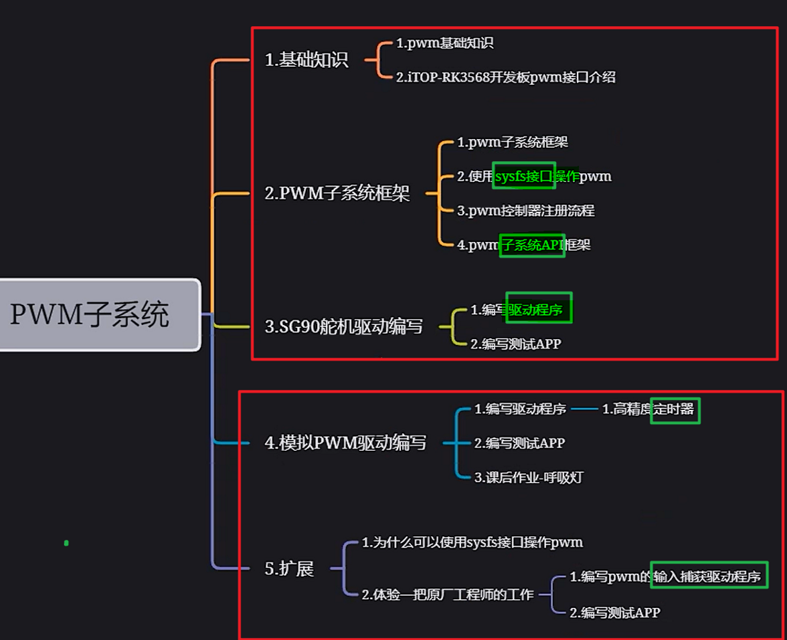
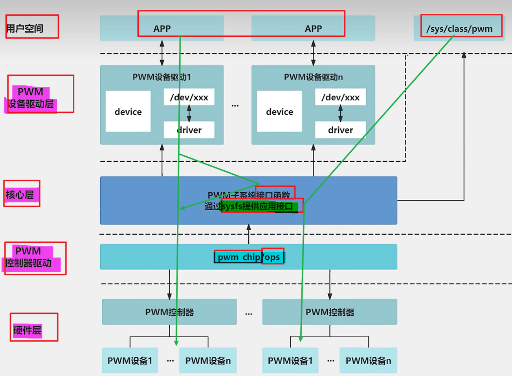

# 备注(声明)：

> [!note] 上手PWM
> 如果说你想快速上手PWM
> 快速的把它用起来
> 你学第一部分，第二部分， 第三部分就可以了

# 一、基础知识
## PWM介绍
### 1 、什么是PWM - 占空比
[“1.PWM介绍”页上的图片](onenote:https://d.docs.live.net/52d4b76bb0ffcf51/Documents/\(RK3568\)Linux驱动开发/第十八期_PWM.one#1.PWM介绍&section-id={8DD134BB-D1A9-4D53-BF9D-0870D4E81CAF}&page-id={0CFA7217-6E68-408C-83E7-68BEB7913799}&object-id={9BD22F6E-564D-0426-06F3-25B0DD4AD564}&14)  ([Web 视图](https://onedrive.live.com/view.aspx?resid=52D4B76BB0FFCF51%21se8c325913f784bf694d429e5ee2ab2be&id=documents&wd=target%28%E7%AC%AC%E5%8D%81%E5%85%AB%E6%9C%9F_PWM.one%7C8DD134BB-D1A9-4D53-BF9D-0870D4E81CAF%2F1.PWM%E4%BB%8B%E7%BB%8D%7C0CFA7217-6E68-408C-83E7-68BEB7913799%2F%29&wdpartid=%7b4BB91F2D-31FF-49EF-84F1-A7F945945F31%7d%7b1%7d&wdsectionfileid=52D4B76BB0FFCF51!s728676b55b744b9190f3d6fab0523e87))

### 2 、pwm频率和占空比
[“1.PWM介绍”页上的图片](onenote:https://d.docs.live.net/52d4b76bb0ffcf51/Documents/\(RK3568\)Linux驱动开发/第十八期_PWM.one#1.PWM介绍&section-id={8DD134BB-D1A9-4D53-BF9D-0870D4E81CAF}&page-id={0CFA7217-6E68-408C-83E7-68BEB7913799}&object-id={9BD22F6E-564D-0426-06F3-25B0DD4AD564}&32)  ([Web 视图](https://onedrive.live.com/view.aspx?resid=52D4B76BB0FFCF51%21se8c325913f784bf694d429e5ee2ab2be&id=documents&wd=target%28%E7%AC%AC%E5%8D%81%E5%85%AB%E6%9C%9F_PWM.one%7C8DD134BB-D1A9-4D53-BF9D-0870D4E81CAF%2F1.PWM%E4%BB%8B%E7%BB%8D%7C0CFA7217-6E68-408C-83E7-68BEB7913799%2F%29&wdpartid=%7b4BB91F2D-31FF-49EF-84F1-A7F945945F31%7d%7b1%7d&wdsectionfileid=52D4B76BB0FFCF51!s728676b55b744b9190f3d6fab0523e87))

### 3 、PWM 应用
[“1.PWM介绍”页上的图片](onenote:https://d.docs.live.net/52d4b76bb0ffcf51/Documents/\(RK3568\)Linux驱动开发/第十八期_PWM.one#1.PWM介绍&section-id={8DD134BB-D1A9-4D53-BF9D-0870D4E81CAF}&page-id={0CFA7217-6E68-408C-83E7-68BEB7913799}&object-id={9BD22F6E-564D-0426-06F3-25B0DD4AD564}&5D)  ([Web 视图](https://onedrive.live.com/view.aspx?resid=52D4B76BB0FFCF51%21se8c325913f784bf694d429e5ee2ab2be&id=documents&wd=target%28%E7%AC%AC%E5%8D%81%E5%85%AB%E6%9C%9F_PWM.one%7C8DD134BB-D1A9-4D53-BF9D-0870D4E81CAF%2F1.PWM%E4%BB%8B%E7%BB%8D%7C0CFA7217-6E68-408C-83E7-68BEB7913799%2F%29&wdpartid=%7b4BB91F2D-31FF-49EF-84F1-A7F945945F31%7d%7b1%7d&wdsectionfileid=52D4B76BB0FFCF51!s728676b55b744b9190f3d6fab0523e87))

### 4 、

### 5、

### 6、

### 7、

### 8、

## RK3568开发板PWM接口介绍 - 16路PWM
### 1 、PWM三种模式
[第一种模式是捕获模式](onenote:https://d.docs.live.net/52d4b76bb0ffcf51/Documents/\(RK3568\)Linux驱动开发/第十八期_PWM.one#2.RK3568开发板PWM接口介绍&section-id={8DD134BB-D1A9-4D53-BF9D-0870D4E81CAF}&page-id={036D8740-5DDA-4440-9833-855B3AA692E3}&object-id={A8D9A9FB-C2DF-0A96-1B0C-98E12A397FDA}&3E)  ([Web 视图](https://onedrive.live.com/view.aspx?resid=52D4B76BB0FFCF51%21se8c325913f784bf694d429e5ee2ab2be&id=documents&wd=target%28%E7%AC%AC%E5%8D%81%E5%85%AB%E6%9C%9F_PWM.one%7C8DD134BB-D1A9-4D53-BF9D-0870D4E81CAF%2F2.RK3568%E5%BC%80%E5%8F%91%E6%9D%BFPWM%E6%8E%A5%E5%8F%A3%E4%BB%8B%E7%BB%8D%7C036D8740-5DDA-4440-9833-855B3AA692E3%2F%29&wdpartid=%7b68E42EB8-64F8-4342-88E7-F3E2D74F5B8C%7d%7b1%7d&wdsectionfileid=52D4B76BB0FFCF51!s728676b55b744b9190f3d6fab0523e87))

### 2 、开发板中pwm 使用情况
[“2.RK3568开发板PWM接口介绍”页上的图片](onenote:https://d.docs.live.net/52d4b76bb0ffcf51/Documents/\(RK3568\)Linux驱动开发/第十八期_PWM.one#2.RK3568开发板PWM接口介绍&section-id={8DD134BB-D1A9-4D53-BF9D-0870D4E81CAF}&page-id={036D8740-5DDA-4440-9833-855B3AA692E3}&object-id={A8D9A9FB-C2DF-0A96-1B0C-98E12A397FDA}&8C)  ([Web 视图](https://onedrive.live.com/view.aspx?resid=52D4B76BB0FFCF51%21se8c325913f784bf694d429e5ee2ab2be&id=documents&wd=target%28%E7%AC%AC%E5%8D%81%E5%85%AB%E6%9C%9F_PWM.one%7C8DD134BB-D1A9-4D53-BF9D-0870D4E81CAF%2F2.RK3568%E5%BC%80%E5%8F%91%E6%9D%BFPWM%E6%8E%A5%E5%8F%A3%E4%BB%8B%E7%BB%8D%7C036D8740-5DDA-4440-9833-855B3AA692E3%2F%29&wdpartid=%7b68E42EB8-64F8-4342-88E7-F3E2D74F5B8C%7d%7b1%7d&wdsectionfileid=52D4B76BB0FFCF51!s728676b55b744b9190f3d6fab0523e87))

### 3 、PWM0引脚原理图分析
[PWM0引脚](onenote:https://d.docs.live.net/52d4b76bb0ffcf51/Documents/\(RK3568\)Linux驱动开发/第十八期_PWM.one#2.RK3568开发板PWM接口介绍&section-id={8DD134BB-D1A9-4D53-BF9D-0870D4E81CAF}&page-id={036D8740-5DDA-4440-9833-855B3AA692E3}&object-id={4474A973-5291-0915-3DFB-48CD88F4F0D2}&E3)  ([Web 视图](https://onedrive.live.com/view.aspx?resid=52D4B76BB0FFCF51%21se8c325913f784bf694d429e5ee2ab2be&id=documents&wd=target%28%E7%AC%AC%E5%8D%81%E5%85%AB%E6%9C%9F_PWM.one%7C8DD134BB-D1A9-4D53-BF9D-0870D4E81CAF%2F2.RK3568%E5%BC%80%E5%8F%91%E6%9D%BFPWM%E6%8E%A5%E5%8F%A3%E4%BB%8B%E7%BB%8D%7C036D8740-5DDA-4440-9833-855B3AA692E3%2F%29&wdpartid=%7b68E42EB8-64F8-4342-88E7-F3E2D74F5B8C%7d%7b1%7d&wdsectionfileid=52D4B76BB0FFCF51!s728676b55b744b9190f3d6fab0523e87))

### 4 、

### 5、

### 6、

### 7、

### 8、

## 
### 1 、

### 2 、

### 3 、

### 4 、

### 5、

### 6、

### 7、

### 8、

# 二、PWM子系统

## PWM子系统框架
### 1 、框架图

### 2 、PWM 子系统API 接口函数
[“7.pwm子系统API框架”页上的图片](onenote:https://d.docs.live.net/52d4b76bb0ffcf51/Documents/\(RK3568\)Linux驱动开发/第十八期_PWM.one#7.pwm子系统API框架&section-id={8DD134BB-D1A9-4D53-BF9D-0870D4E81CAF}&page-id={55F86864-E8C1-49AB-B6D6-0C4206629D42}&object-id={D1D767F5-0EB3-0596-07C1-B72270176BB6}&6D)  ([Web 视图](https://onedrive.live.com/view.aspx?resid=52D4B76BB0FFCF51%21se8c325913f784bf694d429e5ee2ab2be&id=documents&wd=target%28%E7%AC%AC%E5%8D%81%E5%85%AB%E6%9C%9F_PWM.one%7C8DD134BB-D1A9-4D53-BF9D-0870D4E81CAF%2F7.pwm%E5%AD%90%E7%B3%BB%E7%BB%9FAPI%E6%A1%86%E6%9E%B6%7C55F86864-E8C1-49AB-B6D6-0C4206629D42%2F%29&wdpartid=%7bF53CD148-785B-40D7-B300-9A07CF61B340%7d%7b1%7d&wdsectionfileid=52D4B76BB0FFCF51!s728676b55b744b9190f3d6fab0523e87))

### 3 、API 函数调用关系
[“7.pwm子系统API框架”页上的图片](onenote:https://d.docs.live.net/52d4b76bb0ffcf51/Documents/\(RK3568\)Linux驱动开发/第十八期_PWM.one#7.pwm子系统API框架&section-id={8DD134BB-D1A9-4D53-BF9D-0870D4E81CAF}&page-id={55F86864-E8C1-49AB-B6D6-0C4206629D42}&object-id={B8B9BF1C-ACE8-0716-0A70-5C1AFE43DDB9}&12)  ([Web 视图](https://onedrive.live.com/view.aspx?resid=52D4B76BB0FFCF51%21se8c325913f784bf694d429e5ee2ab2be&id=documents&wd=target%28%E7%AC%AC%E5%8D%81%E5%85%AB%E6%9C%9F_PWM.one%7C8DD134BB-D1A9-4D53-BF9D-0870D4E81CAF%2F7.pwm%E5%AD%90%E7%B3%BB%E7%BB%9FAPI%E6%A1%86%E6%9E%B6%7C55F86864-E8C1-49AB-B6D6-0C4206629D42%2F%29&wdpartid=%7bF53CD148-785B-40D7-B300-9A07CF61B340%7d%7b1%7d&wdsectionfileid=52D4B76BB0FFCF51!s728676b55b744b9190f3d6fab0523e87))

### 4 、PWM驱动程序框架
[[PWM驱动程序框架.canvas|PWM驱动程序框架]]

### 5、

## 使用sysfs接口操作pwm
### 1 、设备树中配置 PWM12
[“5.使用sysfs接口操作pwm”页上的图片](onenote:https://d.docs.live.net/52d4b76bb0ffcf51/Documents/\(RK3568\)Linux驱动开发/第十八期_PWM.one#5.使用sysfs接口操作pwm&section-id={8DD134BB-D1A9-4D53-BF9D-0870D4E81CAF}&page-id={96C97C8A-2C5C-4487-94B2-30B2508B3D6A}&object-id={FBDCE007-9462-0824-2274-7F00551702FB}&14)  ([Web 视图](https://onedrive.live.com/view.aspx?resid=52D4B76BB0FFCF51%21se8c325913f784bf694d429e5ee2ab2be&id=documents&wd=target%28%E7%AC%AC%E5%8D%81%E5%85%AB%E6%9C%9F_PWM.one%7C8DD134BB-D1A9-4D53-BF9D-0870D4E81CAF%2F5.%E4%BD%BF%E7%94%A8sysfs%E6%8E%A5%E5%8F%A3%E6%93%8D%E4%BD%9Cpwm%7C96C97C8A-2C5C-4487-94B2-30B2508B3D6A%2F%29&wdpartid=%7bE6103BD8-322B-4DDE-9F83-36651310943B%7d%7b1%7d&wdsectionfileid=52D4B76BB0FFCF51!s728676b55b744b9190f3d6fab0523e87))

> [!abstract] 修改设备节点注意
> 一般不要在rk368.dtsi文件修改设备节点，
> 而是在rk3568-evb1-ddr4-v10-linux.dtsi设备树上进行修改节点进行覆盖
> 

- **pwms属性讲解**
[“设备树中PWM的使用”页上的图片](onenote:https://d.docs.live.net/52d4b76bb0ffcf51/Documents/\(RK3568\)Linux驱动开发/第十八期_PWM.one#设备树中PWM的使用&section-id={8DD134BB-D1A9-4D53-BF9D-0870D4E81CAF}&page-id={27094F76-08CE-4293-9A8A-5F64147C2C37}&object-id={7B2C0C02-D625-0790-2FA3-95A5DBF104E7}&26)  ([Web 视图](https://onedrive.live.com/view.aspx?resid=52D4B76BB0FFCF51%21se8c325913f784bf694d429e5ee2ab2be&id=documents&wd=target%28%E7%AC%AC%E5%8D%81%E5%85%AB%E6%9C%9F_PWM.one%7C8DD134BB-D1A9-4D53-BF9D-0870D4E81CAF%2F%E8%AE%BE%E5%A4%87%E6%A0%91%E4%B8%ADPWM%E7%9A%84%E4%BD%BF%E7%94%A8%7C27094F76-08CE-4293-9A8A-5F64147C2C37%2F%29&wdpartid=%7b62BA0EC5-F2EC-0C9A-3840-00B62CF4A465%7d%7b1%7d&wdsectionfileid=52D4B76BB0FFCF51!s728676b55b744b9190f3d6fab0523e87))

### 2 、通过 sysfs 接口使用 pwm
[“5.使用sysfs接口操作pwm”页上的图片](onenote:https://d.docs.live.net/52d4b76bb0ffcf51/Documents/\(RK3568\)Linux驱动开发/第十八期_PWM.one#5.使用sysfs接口操作pwm&section-id={8DD134BB-D1A9-4D53-BF9D-0870D4E81CAF}&page-id={96C97C8A-2C5C-4487-94B2-30B2508B3D6A}&object-id={980E9526-3B5C-04E3-0C7E-08ADF0A4036B}&38)  ([Web 视图](https://onedrive.live.com/view.aspx?resid=52D4B76BB0FFCF51%21se8c325913f784bf694d429e5ee2ab2be&id=documents&wd=target%28%E7%AC%AC%E5%8D%81%E5%85%AB%E6%9C%9F_PWM.one%7C8DD134BB-D1A9-4D53-BF9D-0870D4E81CAF%2F5.%E4%BD%BF%E7%94%A8sysfs%E6%8E%A5%E5%8F%A3%E6%93%8D%E4%BD%9Cpwm%7C96C97C8A-2C5C-4487-94B2-30B2508B3D6A%2F%29&wdpartid=%7bE6103BD8-322B-4DDE-9F83-36651310943B%7d%7b1%7d&wdsectionfileid=52D4B76BB0FFCF51!s728676b55b744b9190f3d6fab0523e87))

[“5.使用sysfs接口操作pwm”页上的图片](onenote:https://d.docs.live.net/52d4b76bb0ffcf51/Documents/\(RK3568\)Linux驱动开发/第十八期_PWM.one#5.使用sysfs接口操作pwm&section-id={8DD134BB-D1A9-4D53-BF9D-0870D4E81CAF}&page-id={96C97C8A-2C5C-4487-94B2-30B2508B3D6A}&object-id={980E9526-3B5C-04E3-0C7E-08ADF0A4036B}&1F)  ([Web 视图](https://onedrive.live.com/view.aspx?resid=52D4B76BB0FFCF51%21se8c325913f784bf694d429e5ee2ab2be&id=documents&wd=target%28%E7%AC%AC%E5%8D%81%E5%85%AB%E6%9C%9F_PWM.one%7C8DD134BB-D1A9-4D53-BF9D-0870D4E81CAF%2F5.%E4%BD%BF%E7%94%A8sysfs%E6%8E%A5%E5%8F%A3%E6%93%8D%E4%BD%9Cpwm%7C96C97C8A-2C5C-4487-94B2-30B2508B3D6A%2F%29&wdpartid=%7bE6103BD8-322B-4DDE-9F83-36651310943B%7d%7b1%7d&wdsectionfileid=52D4B76BB0FFCF51!s728676b55b744b9190f3d6fab0523e87))
### 3 、查看PWM的调试信息
[“5.使用sysfs接口操作pwm”页上的图片](onenote:https://d.docs.live.net/52d4b76bb0ffcf51/Documents/\(RK3568\)Linux驱动开发/第十八期_PWM.one#5.使用sysfs接口操作pwm&section-id={8DD134BB-D1A9-4D53-BF9D-0870D4E81CAF}&page-id={96C97C8A-2C5C-4487-94B2-30B2508B3D6A}&object-id={980E9526-3B5C-04E3-0C7E-08ADF0A4036B}&5E)  ([Web 视图](https://onedrive.live.com/view.aspx?resid=52D4B76BB0FFCF51%21se8c325913f784bf694d429e5ee2ab2be&id=documents&wd=target%28%E7%AC%AC%E5%8D%81%E5%85%AB%E6%9C%9F_PWM.one%7C8DD134BB-D1A9-4D53-BF9D-0870D4E81CAF%2F5.%E4%BD%BF%E7%94%A8sysfs%E6%8E%A5%E5%8F%A3%E6%93%8D%E4%BD%9Cpwm%7C96C97C8A-2C5C-4487-94B2-30B2508B3D6A%2F%29&wdpartid=%7bE6103BD8-322B-4DDE-9F83-36651310943B%7d%7b1%7d&wdsectionfileid=52D4B76BB0FFCF51!s728676b55b744b9190f3d6fab0523e87))

- 1 cat /sys/kernel/debug/pwm

### 4 、

### 5、

### 6、

### 7、

### 8、

## pwm控制器注册流程分析（未）
[6.pwm控制器注册流程分析](onenote:https://d.docs.live.net/52d4b76bb0ffcf51/Documents/\(RK3568\)Linux驱动开发/第十八期_PWM.one#6.pwm控制器注册流程分析&section-id={8DD134BB-D1A9-4D53-BF9D-0870D4E81CAF}&page-id={18625E8D-1F4B-425C-BC71-C7CC52BB70ED}&end)  ([Web 视图](https://onedrive.live.com/view.aspx?resid=52D4B76BB0FFCF51%21se8c325913f784bf694d429e5ee2ab2be&id=documents&wd=target%28%E7%AC%AC%E5%8D%81%E5%85%AB%E6%9C%9F_PWM.one%7C8DD134BB-D1A9-4D53-BF9D-0870D4E81CAF%2F6.pwm%E6%8E%A7%E5%88%B6%E5%99%A8%E6%B3%A8%E5%86%8C%E6%B5%81%E7%A8%8B%E5%88%86%E6%9E%90%7C18625E8D-1F4B-425C-BC71-C7CC52BB70ED%2F%29&wdpartid=%7b15AA2E2C-743D-40C7-872A-0270A87427D2%7d%7b1%7d&wdsectionfileid=52D4B76BB0FFCF51!s728676b55b744b9190f3d6fab0523e87))
### 1 、

### 2 、

### 3 、

### 4 、

### 5、

### 6、

### 7、

### 8、

# 三、SG90舵机驱动编写

## SG90舵机介绍-硬件连接
### 1 、舵机介绍
[“4.SG90舵机介绍-硬件连接”页上的图片](onenote:https://d.docs.live.net/52d4b76bb0ffcf51/Documents/\(RK3568\)Linux驱动开发/第十八期_PWM.one#4.SG90舵机介绍-硬件连接&section-id={8DD134BB-D1A9-4D53-BF9D-0870D4E81CAF}&page-id={D24DD90B-EC72-4674-925E-3AD9E7801016}&object-id={C561FBBE-697D-04D1-30DE-BBB5A0AF1495}&14)  ([Web 视图](https://onedrive.live.com/view.aspx?resid=52D4B76BB0FFCF51%21se8c325913f784bf694d429e5ee2ab2be&id=documents&wd=target%28%E7%AC%AC%E5%8D%81%E5%85%AB%E6%9C%9F_PWM.one%7C8DD134BB-D1A9-4D53-BF9D-0870D4E81CAF%2F4.SG90%E8%88%B5%E6%9C%BA%E4%BB%8B%E7%BB%8D-%E7%A1%AC%E4%BB%B6%E8%BF%9E%E6%8E%A5%7CD24DD90B-EC72-4674-925E-3AD9E7801016%2F%29&wdpartid=%7b7B75E9AA-2F2B-4B5C-9A7E-2A97047AD0C7%7d%7b1%7d&wdsectionfileid=52D4B76BB0FFCF51!s728676b55b744b9190f3d6fab0523e87))

### 2 、硬件连接
[“4.SG90舵机介绍-硬件连接”页上的图片](onenote:https://d.docs.live.net/52d4b76bb0ffcf51/Documents/\(RK3568\)Linux驱动开发/第十八期_PWM.one#4.SG90舵机介绍-硬件连接&section-id={8DD134BB-D1A9-4D53-BF9D-0870D4E81CAF}&page-id={D24DD90B-EC72-4674-925E-3AD9E7801016}&object-id={C561FBBE-697D-04D1-30DE-BBB5A0AF1495}&14)  ([Web 视图](https://onedrive.live.com/view.aspx?resid=52D4B76BB0FFCF51%21se8c325913f784bf694d429e5ee2ab2be&id=documents&wd=target%28%E7%AC%AC%E5%8D%81%E5%85%AB%E6%9C%9F_PWM.one%7C8DD134BB-D1A9-4D53-BF9D-0870D4E81CAF%2F4.SG90%E8%88%B5%E6%9C%BA%E4%BB%8B%E7%BB%8D-%E7%A1%AC%E4%BB%B6%E8%BF%9E%E6%8E%A5%7CD24DD90B-EC72-4674-925E-3AD9E7801016%2F%29&wdpartid=%7b7B75E9AA-2F2B-4B5C-9A7E-2A97047AD0C7%7d%7b1%7d&wdsectionfileid=52D4B76BB0FFCF51!s728676b55b744b9190f3d6fab0523e87))

### 3 、SG90占空比与角度的关系
[“4.SG90舵机介绍-硬件连接”页上的图片](onenote:https://d.docs.live.net/52d4b76bb0ffcf51/Documents/\(RK3568\)Linux驱动开发/第十八期_PWM.one#4.SG90舵机介绍-硬件连接&section-id={8DD134BB-D1A9-4D53-BF9D-0870D4E81CAF}&page-id={D24DD90B-EC72-4674-925E-3AD9E7801016}&object-id={C561FBBE-697D-04D1-30DE-BBB5A0AF1495}&39)  ([Web 视图](https://onedrive.live.com/view.aspx?resid=52D4B76BB0FFCF51%21se8c325913f784bf694d429e5ee2ab2be&id=documents&wd=target%28%E7%AC%AC%E5%8D%81%E5%85%AB%E6%9C%9F_PWM.one%7C8DD134BB-D1A9-4D53-BF9D-0870D4E81CAF%2F4.SG90%E8%88%B5%E6%9C%BA%E4%BB%8B%E7%BB%8D-%E7%A1%AC%E4%BB%B6%E8%BF%9E%E6%8E%A5%7CD24DD90B-EC72-4674-925E-3AD9E7801016%2F%29&wdpartid=%7b7B75E9AA-2F2B-4B5C-9A7E-2A97047AD0C7%7d%7b1%7d&wdsectionfileid=52D4B76BB0FFCF51!s728676b55b744b9190f3d6fab0523e87))

### 4 、

### 5、

### 6、

### 7、

### 8、

## 编写SG90舵机驱动程序
### 1 、设备树节点编写
[“8.编写SG90舵机驱动程序（一）”页上的图片](onenote:https://d.docs.live.net/52d4b76bb0ffcf51/Documents/\(RK3568\)Linux驱动开发/第十八期_PWM.one#8.编写SG90舵机驱动程序（一）&section-id={8DD134BB-D1A9-4D53-BF9D-0870D4E81CAF}&page-id={34D93A37-1BFC-46AB-95C2-44F2684FD7AA}&object-id={EE47B563-D406-0151-20FF-F27F1CD0DD6E}&37)  ([Web 视图](https://onedrive.live.com/view.aspx?resid=52D4B76BB0FFCF51%21se8c325913f784bf694d429e5ee2ab2be&id=documents&wd=target%28%E7%AC%AC%E5%8D%81%E5%85%AB%E6%9C%9F_PWM.one%7C8DD134BB-D1A9-4D53-BF9D-0870D4E81CAF%2F8.%E7%BC%96%E5%86%99SG90%E8%88%B5%E6%9C%BA%E9%A9%B1%E5%8A%A8%E7%A8%8B%E5%BA%8F%EF%BC%88%E4%B8%80%EF%BC%89%7C34D93A37-1BFC-46AB-95C2-44F2684FD7AA%2F%29&wdpartid=%7b1BCEDE95-4C06-4ABC-8D64-E4C5F0E00F41%7d%7b1%7d&wdsectionfileid=52D4B76BB0FFCF51!s728676b55b744b9190f3d6fab0523e87))

### 2 、初始化PWM配置并启动PWM输出函数
[static int cdev_test_open(struct inode *inode, struct](onenote:https://d.docs.live.net/52d4b76bb0ffcf51/Documents/\(RK3568\)Linux驱动开发/第十八期_PWM.one#8.编写SG90舵机驱动程序（一）&section-id={8DD134BB-D1A9-4D53-BF9D-0870D4E81CAF}&page-id={34D93A37-1BFC-46AB-95C2-44F2684FD7AA}&object-id={26488321-896D-0CAD-26AE-736AC26D9AE7}&AE)  ([Web 视图](https://onedrive.live.com/view.aspx?resid=52D4B76BB0FFCF51%21se8c325913f784bf694d429e5ee2ab2be&id=documents&wd=target%28%E7%AC%AC%E5%8D%81%E5%85%AB%E6%9C%9F_PWM.one%7C8DD134BB-D1A9-4D53-BF9D-0870D4E81CAF%2F8.%E7%BC%96%E5%86%99SG90%E8%88%B5%E6%9C%BA%E9%A9%B1%E5%8A%A8%E7%A8%8B%E5%BA%8F%EF%BC%88%E4%B8%80%EF%BC%89%7C34D93A37-1BFC-46AB-95C2-44F2684FD7AA%2F%29&wdpartid=%7b1BCEDE95-4C06-4ABC-8D64-E4C5F0E00F41%7d%7b1%7d&wdsectionfileid=52D4B76BB0FFCF51!s728676b55b744b9190f3d6fab0523e87))

### 3 、获取PWM设备
[// 获取PWM设备](onenote:https://d.docs.live.net/52d4b76bb0ffcf51/Documents/\(RK3568\)Linux驱动开发/第十八期_PWM.one#8.编写SG90舵机驱动程序（一）&section-id={8DD134BB-D1A9-4D53-BF9D-0870D4E81CAF}&page-id={34D93A37-1BFC-46AB-95C2-44F2684FD7AA}&object-id={69AA0CC8-3E16-0588-1B6E-2F02EB04A515}&14)  ([Web 视图](https://onedrive.live.com/view.aspx?resid=52D4B76BB0FFCF51%21se8c325913f784bf694d429e5ee2ab2be&id=documents&wd=target%28%E7%AC%AC%E5%8D%81%E5%85%AB%E6%9C%9F_PWM.one%7C8DD134BB-D1A9-4D53-BF9D-0870D4E81CAF%2F8.%E7%BC%96%E5%86%99SG90%E8%88%B5%E6%9C%BA%E9%A9%B1%E5%8A%A8%E7%A8%8B%E5%BA%8F%EF%BC%88%E4%B8%80%EF%BC%89%7C34D93A37-1BFC-46AB-95C2-44F2684FD7AA%2F%29&wdpartid=%7b1BCEDE95-4C06-4ABC-8D64-E4C5F0E00F41%7d%7b1%7d&wdsectionfileid=52D4B76BB0FFCF51!s728676b55b744b9190f3d6fab0523e87))

### 4 、写入设备时调用的函数：根据用户输入调整PWM脉冲宽度
[// 写入设备时调用的函数：根据用户输入调整PWM脉冲宽度](onenote:https://d.docs.live.net/52d4b76bb0ffcf51/Documents/\(RK3568\)Linux驱动开发/第十八期_PWM.one#9.编写SG90舵机驱动程序（二）&section-id={8DD134BB-D1A9-4D53-BF9D-0870D4E81CAF}&page-id={39099B41-8D22-49FD-AF04-9285A38E294D}&object-id={00EA9E00-AE98-04DC-395F-615CC15F2B3E}&76)  ([Web 视图](https://onedrive.live.com/view.aspx?resid=52D4B76BB0FFCF51%21se8c325913f784bf694d429e5ee2ab2be&id=documents&wd=target%28%E7%AC%AC%E5%8D%81%E5%85%AB%E6%9C%9F_PWM.one%7C8DD134BB-D1A9-4D53-BF9D-0870D4E81CAF%2F9.%E7%BC%96%E5%86%99SG90%E8%88%B5%E6%9C%BA%E9%A9%B1%E5%8A%A8%E7%A8%8B%E5%BA%8F%EF%BC%88%E4%BA%8C%EF%BC%89%7C39099B41-8D22-49FD-AF04-9285A38E294D%2F%29&wdpartid=%7b56FBC09F-A152-451D-994C-35C5B836B04C%7d%7b1%7d&wdsectionfileid=52D4B76BB0FFCF51!s728676b55b744b9190f3d6fab0523e87))

### 5、释放设备时调用的函数：停止PWM输出并恢复默认配置
[// 释放设备时调用的函数：停止PWM输出并恢复默认配置](onenote:https://d.docs.live.net/52d4b76bb0ffcf51/Documents/\(RK3568\)Linux驱动开发/第十八期_PWM.one#9.编写SG90舵机驱动程序（二）&section-id={8DD134BB-D1A9-4D53-BF9D-0870D4E81CAF}&page-id={39099B41-8D22-49FD-AF04-9285A38E294D}&object-id={00EA9E00-AE98-04DC-395F-615CC15F2B3E}&A1)  ([Web 视图](https://onedrive.live.com/view.aspx?resid=52D4B76BB0FFCF51%21se8c325913f784bf694d429e5ee2ab2be&id=documents&wd=target%28%E7%AC%AC%E5%8D%81%E5%85%AB%E6%9C%9F_PWM.one%7C8DD134BB-D1A9-4D53-BF9D-0870D4E81CAF%2F9.%E7%BC%96%E5%86%99SG90%E8%88%B5%E6%9C%BA%E9%A9%B1%E5%8A%A8%E7%A8%8B%E5%BA%8F%EF%BC%88%E4%BA%8C%EF%BC%89%7C39099B41-8D22-49FD-AF04-9285A38E294D%2F%29&wdpartid=%7b56FBC09F-A152-451D-994C-35C5B836B04C%7d%7b1%7d&wdsectionfileid=52D4B76BB0FFCF51!s728676b55b744b9190f3d6fab0523e87))

### 6、

### 7、

### 8、

## 编写SG90驱动程序测试APP
### 1 、代码编写
[App.c](onenote:https://d.docs.live.net/52d4b76bb0ffcf51/Documents/\(RK3568\)Linux驱动开发/第十八期_PWM.one#10.编写SG90驱动程序测试APP&section-id={8DD134BB-D1A9-4D53-BF9D-0870D4E81CAF}&page-id={FB696621-50D7-41BB-902F-191A2D8EA8A7}&object-id={296E3EE1-C600-0C0B-0D7B-D0546E0E1A75}&AF)  ([Web 视图](https://onedrive.live.com/view.aspx?resid=52D4B76BB0FFCF51%21se8c325913f784bf694d429e5ee2ab2be&id=documents&wd=target%28%E7%AC%AC%E5%8D%81%E5%85%AB%E6%9C%9F_PWM.one%7C8DD134BB-D1A9-4D53-BF9D-0870D4E81CAF%2F10.%E7%BC%96%E5%86%99SG90%E9%A9%B1%E5%8A%A8%E7%A8%8B%E5%BA%8F%E6%B5%8B%E8%AF%95APP%7CFB696621-50D7-41BB-902F-191A2D8EA8A7%2F%29&wdpartid=%7b3993B9E1-A768-4DEE-B42F-7D2BDE9B10EC%7d%7b1%7d&wdsectionfileid=52D4B76BB0FFCF51!s728676b55b744b9190f3d6fab0523e87))

> [!note] 写一些简单的测试程序
> 呃应用的话同学们啊了解一些就可以了
> 能够写一些简单的测试程序
> 那对于学驱动的同学来说就足够了

### 2 、

### 3 、

### 4 、

### 5、

### 6、

### 7、

### 8、

# 四、模拟PWM驱动编写（未）

## 模拟PWM
[(未)（既可）11.模拟PWM（一）](onenote:https://d.docs.live.net/52d4b76bb0ffcf51/Documents/\(RK3568\)Linux驱动开发/第十八期_PWM.one#\(未\)（既可）11.模拟PWM（一）&section-id={8DD134BB-D1A9-4D53-BF9D-0870D4E81CAF}&page-id={54A6CFC7-A8A9-432F-97B9-D598F7F33954}&end)  ([Web 视图](https://onedrive.live.com/view.aspx?resid=52D4B76BB0FFCF51%21se8c325913f784bf694d429e5ee2ab2be&id=documents&wd=target%28%E7%AC%AC%E5%8D%81%E5%85%AB%E6%9C%9F_PWM.one%7C8DD134BB-D1A9-4D53-BF9D-0870D4E81CAF%2F%28%E6%9C%AA%5C%29%EF%BC%88%E6%97%A2%E5%8F%AF%EF%BC%8911.%E6%A8%A1%E6%8B%9FPWM%EF%BC%88%E4%B8%80%EF%BC%89%7C54A6CFC7-A8A9-432F-97B9-D598F7F33954%2F%29&wdpartid=%7b1E7CCFEC-EF6D-4E6A-98E6-9CE8E31750FC%7d%7b1%7d&wdsectionfileid=52D4B76BB0FFCF51!s728676b55b744b9190f3d6fab0523e87))
### 1 、

### 2 、

### 3 、

### 4 、

### 5、

### 6、

### 7、

### 8、

## 
### 1 、

### 2 、

### 3 、

### 4 、
### 5、

### 6、

### 7、

### 8、

## 
### 1 、

### 2 、

### 3 、

### 4 、

### 5、

### 6、

### 7、

### 8、

# 五、扩展

## 体验一把原厂驱动工程师工作（未）
[(未)17.体验一把原厂驱动工程师工作-输入捕获驱动](onenote:https://d.docs.live.net/52d4b76bb0ffcf51/Documents/\(RK3568\)Linux驱动开发/第十八期_PWM.one#\(未\)17.体验一把原厂驱动工程师工作-输入捕获驱动&section-id={8DD134BB-D1A9-4D53-BF9D-0870D4E81CAF}&page-id={C31AC00A-4E8A-4C8F-B951-099DC36D7021}&end)  ([Web 视图](https://onedrive.live.com/view.aspx?resid=52D4B76BB0FFCF51%21se8c325913f784bf694d429e5ee2ab2be&id=documents&wd=target%28%E7%AC%AC%E5%8D%81%E5%85%AB%E6%9C%9F_PWM.one%7C8DD134BB-D1A9-4D53-BF9D-0870D4E81CAF%2F%28%E6%9C%AA%5C%2917.%E4%BD%93%E9%AA%8C%E4%B8%80%E6%8A%8A%E5%8E%9F%E5%8E%82%E9%A9%B1%E5%8A%A8%E5%B7%A5%E7%A8%8B%E5%B8%88%E5%B7%A5%E4%BD%9C-%E8%BE%93%E5%85%A5%E6%8D%95%E8%8E%B7%E9%A9%B1%E5%8A%A8%7CC31AC00A-4E8A-4C8F-B951-099DC36D7021%2F%29&wdpartid=%7b6503A6EE-601D-433B-ABDC-FEC8961C8D9F%7d%7b1%7d&wdsectionfileid=52D4B76BB0FFCF51!s728676b55b744b9190f3d6fab0523e87))
### 1 、

### 2 、

### 3 、

### 4 、

### 5、

### 6、

### 7、

### 8、

## 
### 1 、

### 2 、

### 3 、

### 4 、
### 5、

### 6、

### 7、

### 8、

## 
### 1 、

### 2 、

### 3 、

### 4 、

### 5、

### 6、

### 7、

### 8、

