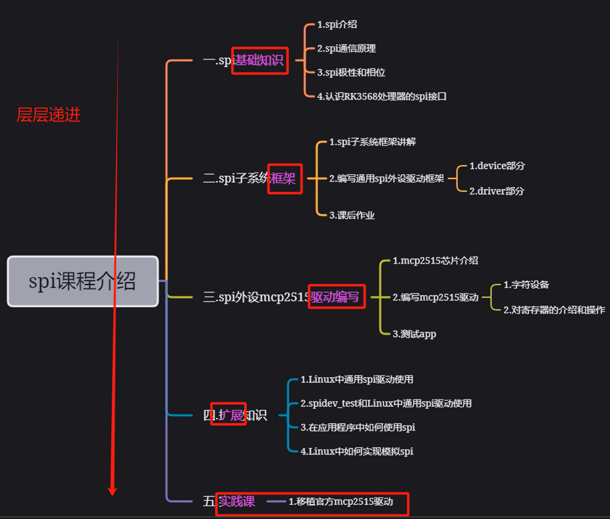
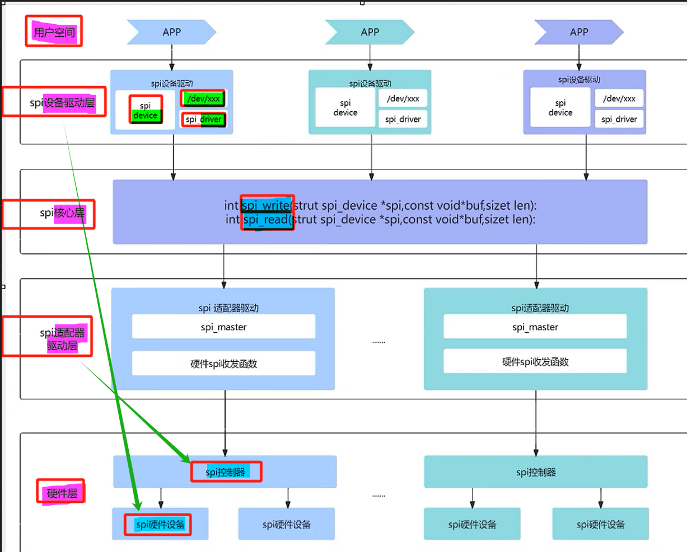

# 备注(声明)：

# 一、基础知识

## SPI基础知识
### 1 、特点 - 高速、全双工、同步串行
[“1.SPI基础知识”页上的图片](onenote:https://d.docs.live.net/52d4b76bb0ffcf51/Documents/\(RK3568\)Linux驱动开发/第十六期_SPI.one#1.SPI基础知识&section-id={C479F167-042D-4091-9FA6-5CAAFAD5036D}&page-id={32D7B7DC-C281-4A95-A5EA-CB5C34B1A38F}&object-id={5383E0CF-EB16-0F4D-12EB-4EA191973D1F}&14)  ([Web 视图](https://onedrive.live.com/view.aspx?resid=52D4B76BB0FFCF51%21se8c325913f784bf694d429e5ee2ab2be&id=documents&wd=target%28%E7%AC%AC%E5%8D%81%E5%85%AD%E6%9C%9F_SPI.one%7CC479F167-042D-4091-9FA6-5CAAFAD5036D%2F1.SPI%E5%9F%BA%E7%A1%80%E7%9F%A5%E8%AF%86%7C32D7B7DC-C281-4A95-A5EA-CB5C34B1A38F%2F%29&wdpartid=%7b09A2A2F0-39BD-4B16-B904-51F4FB8642B8%7d%7b1%7d&wdsectionfileid=52D4B76BB0FFCF51!sb03ababd0f9447e585a2657c750c1e3d))

### 2 、硬件连接(通信方式) - 四根信号线
[“1.SPI基础知识”页上的图片](onenote:https://d.docs.live.net/52d4b76bb0ffcf51/Documents/\(RK3568\)Linux驱动开发/第十六期_SPI.one#1.SPI基础知识&section-id={C479F167-042D-4091-9FA6-5CAAFAD5036D}&page-id={32D7B7DC-C281-4A95-A5EA-CB5C34B1A38F}&object-id={5383E0CF-EB16-0F4D-12EB-4EA191973D1F}&8D)  ([Web 视图](https://onedrive.live.com/view.aspx?resid=52D4B76BB0FFCF51%21se8c325913f784bf694d429e5ee2ab2be&id=documents&wd=target%28%E7%AC%AC%E5%8D%81%E5%85%AD%E6%9C%9F_SPI.one%7CC479F167-042D-4091-9FA6-5CAAFAD5036D%2F1.SPI%E5%9F%BA%E7%A1%80%E7%9F%A5%E8%AF%86%7C32D7B7DC-C281-4A95-A5EA-CB5C34B1A38F%2F%29&wdpartid=%7b09A2A2F0-39BD-4B16-B904-51F4FB8642B8%7d%7b1%7d&wdsectionfileid=52D4B76BB0FFCF51!sb03ababd0f9447e585a2657c750c1e3d))

### 3 、通信过程 - 先高后低
[“2.SPI通信原理”页上的图片](onenote:https://d.docs.live.net/52d4b76bb0ffcf51/Documents/\(RK3568\)Linux驱动开发/第十六期_SPI.one#2.SPI通信原理&section-id={C479F167-042D-4091-9FA6-5CAAFAD5036D}&page-id={E38A2B56-DC23-411A-931D-A7DEA71778EB}&object-id={17A46388-82DA-0F96-370E-B7A9389C4324}&14)  ([Web 视图](https://onedrive.live.com/view.aspx?resid=52D4B76BB0FFCF51%21se8c325913f784bf694d429e5ee2ab2be&id=documents&wd=target%28%E7%AC%AC%E5%8D%81%E5%85%AD%E6%9C%9F_SPI.one%7CC479F167-042D-4091-9FA6-5CAAFAD5036D%2F2.SPI%E9%80%9A%E4%BF%A1%E5%8E%9F%E7%90%86%7CE38A2B56-DC23-411A-931D-A7DEA71778EB%2F%29&wdpartid=%7b6AC94464-17B7-40FF-B90B-313BCC0CFCA1%7d%7b1%7d&wdsectionfileid=52D4B76BB0FFCF51!sb03ababd0f9447e585a2657c750c1e3d))

### 4 、串行移位寄存器 - 收发同时进行
[“2.SPI通信原理”页上的图片](onenote:https://d.docs.live.net/52d4b76bb0ffcf51/Documents/\(RK3568\)Linux驱动开发/第十六期_SPI.one#2.SPI通信原理&section-id={C479F167-042D-4091-9FA6-5CAAFAD5036D}&page-id={E38A2B56-DC23-411A-931D-A7DEA71778EB}&object-id={17A46388-82DA-0F96-370E-B7A9389C4324}&29)  ([Web 视图](https://onedrive.live.com/view.aspx?resid=52D4B76BB0FFCF51%21se8c325913f784bf694d429e5ee2ab2be&id=documents&wd=target%28%E7%AC%AC%E5%8D%81%E5%85%AD%E6%9C%9F_SPI.one%7CC479F167-042D-4091-9FA6-5CAAFAD5036D%2F2.SPI%E9%80%9A%E4%BF%A1%E5%8E%9F%E7%90%86%7CE38A2B56-DC23-411A-931D-A7DEA71778EB%2F%29&wdpartid=%7b6AC94464-17B7-40FF-B90B-313BCC0CFCA1%7d%7b1%7d&wdsectionfileid=52D4B76BB0FFCF51!sb03ababd0f9447e585a2657c750c1e3d))

### 5、时钟极性(CPOL)和时钟相位(CPLA)
[“3.SPI极性和相位”页上的图片](onenote:https://d.docs.live.net/52d4b76bb0ffcf51/Documents/\(RK3568\)Linux驱动开发/第十六期_SPI.one#3.SPI极性和相位&section-id={C479F167-042D-4091-9FA6-5CAAFAD5036D}&page-id={2A9A65D7-EEB7-4582-A1B7-64F10306AE4C}&object-id={0B54E1BD-761C-0B17-1D91-E2AFD170C553}&14)  ([Web 视图](https://onedrive.live.com/view.aspx?resid=52D4B76BB0FFCF51%21se8c325913f784bf694d429e5ee2ab2be&id=documents&wd=target%28%E7%AC%AC%E5%8D%81%E5%85%AD%E6%9C%9F_SPI.one%7CC479F167-042D-4091-9FA6-5CAAFAD5036D%2F3.SPI%E6%9E%81%E6%80%A7%E5%92%8C%E7%9B%B8%E4%BD%8D%7C2A9A65D7-EEB7-4582-A1B7-64F10306AE4C%2F%29&wdpartid=%7b0E291F51-FD9A-4C51-A070-21A15AEDC9B4%7d%7b1%7d&wdsectionfileid=52D4B76BB0FFCF51!sb03ababd0f9447e585a2657c750c1e3d))

### 6、SPL四种工作模式
[“3.SPI极性和相位”页上的图片](onenote:https://d.docs.live.net/52d4b76bb0ffcf51/Documents/\(RK3568\)Linux驱动开发/第十六期_SPI.one#3.SPI极性和相位&section-id={C479F167-042D-4091-9FA6-5CAAFAD5036D}&page-id={2A9A65D7-EEB7-4582-A1B7-64F10306AE4C}&object-id={0B54E1BD-761C-0B17-1D91-E2AFD170C553}&32)  ([Web 视图](https://onedrive.live.com/view.aspx?resid=52D4B76BB0FFCF51%21se8c325913f784bf694d429e5ee2ab2be&id=documents&wd=target%28%E7%AC%AC%E5%8D%81%E5%85%AD%E6%9C%9F_SPI.one%7CC479F167-042D-4091-9FA6-5CAAFAD5036D%2F3.SPI%E6%9E%81%E6%80%A7%E5%92%8C%E7%9B%B8%E4%BD%8D%7C2A9A65D7-EEB7-4582-A1B7-64F10306AE4C%2F%29&wdpartid=%7b0E291F51-FD9A-4C51-A070-21A15AEDC9B4%7d%7b1%7d&wdsectionfileid=52D4B76BB0FFCF51!sb03ababd0f9447e585a2657c750c1e3d))

### 7、

## RK3568处理器中的SPI接口 - 四路
### 1 、spi接口特性
[“4.认识RK3568处理器中的SPI接口”页上的图片](onenote:https://d.docs.live.net/52d4b76bb0ffcf51/Documents/\(RK3568\)Linux驱动开发/第十六期_SPI.one#4.认识RK3568处理器中的SPI接口&section-id={C479F167-042D-4091-9FA6-5CAAFAD5036D}&page-id={D0B33B2F-6298-436C-B63C-7FEDDEE6C007}&object-id={B3A52B17-EAF5-0AD6-218D-A32F2CCE5E14}&20)  ([Web 视图](https://onedrive.live.com/view.aspx?resid=52D4B76BB0FFCF51%21se8c325913f784bf694d429e5ee2ab2be&id=documents&wd=target%28%E7%AC%AC%E5%8D%81%E5%85%AD%E6%9C%9F_SPI.one%7CC479F167-042D-4091-9FA6-5CAAFAD5036D%2F4.%E8%AE%A4%E8%AF%86RK3568%E5%A4%84%E7%90%86%E5%99%A8%E4%B8%AD%E7%9A%84SPI%E6%8E%A5%E5%8F%A3%7CD0B33B2F-6298-436C-B63C-7FEDDEE6C007%2F%29&wdpartid=%7bAD3410A0-5BC5-46C4-A9D7-6E394545F78E%7d%7b1%7d&wdsectionfileid=52D4B76BB0FFCF51!sb03ababd0f9447e585a2657c750c1e3d))

### 2 、iTOP-RK3568开发板SPI 使用情况
[“4.认识RK3568处理器中的SPI接口”页上的图片](onenote:https://d.docs.live.net/52d4b76bb0ffcf51/Documents/\(RK3568\)Linux驱动开发/第十六期_SPI.one#4.认识RK3568处理器中的SPI接口&section-id={C479F167-042D-4091-9FA6-5CAAFAD5036D}&page-id={D0B33B2F-6298-436C-B63C-7FEDDEE6C007}&object-id={B3A52B17-EAF5-0AD6-218D-A32F2CCE5E14}&2B)  ([Web 视图](https://onedrive.live.com/view.aspx?resid=52D4B76BB0FFCF51%21se8c325913f784bf694d429e5ee2ab2be&id=documents&wd=target%28%E7%AC%AC%E5%8D%81%E5%85%AD%E6%9C%9F_SPI.one%7CC479F167-042D-4091-9FA6-5CAAFAD5036D%2F4.%E8%AE%A4%E8%AF%86RK3568%E5%A4%84%E7%90%86%E5%99%A8%E4%B8%AD%E7%9A%84SPI%E6%8E%A5%E5%8F%A3%7CD0B33B2F-6298-436C-B63C-7FEDDEE6C007%2F%29&wdpartid=%7bAD3410A0-5BC5-46C4-A9D7-6E394545F78E%7d%7b1%7d&wdsectionfileid=52D4B76BB0FFCF51!sb03ababd0f9447e585a2657c750c1e3d))

### 3 、SPI0硬件原理图
[“4.认识RK3568处理器中的SPI接口”页上的图片](onenote:https://d.docs.live.net/52d4b76bb0ffcf51/Documents/\(RK3568\)Linux驱动开发/第十六期_SPI.one#4.认识RK3568处理器中的SPI接口&section-id={C479F167-042D-4091-9FA6-5CAAFAD5036D}&page-id={D0B33B2F-6298-436C-B63C-7FEDDEE6C007}&object-id={B3A52B17-EAF5-0AD6-218D-A32F2CCE5E14}&98)  ([Web 视图](https://onedrive.live.com/view.aspx?resid=52D4B76BB0FFCF51%21se8c325913f784bf694d429e5ee2ab2be&id=documents&wd=target%28%E7%AC%AC%E5%8D%81%E5%85%AD%E6%9C%9F_SPI.one%7CC479F167-042D-4091-9FA6-5CAAFAD5036D%2F4.%E8%AE%A4%E8%AF%86RK3568%E5%A4%84%E7%90%86%E5%99%A8%E4%B8%AD%E7%9A%84SPI%E6%8E%A5%E5%8F%A3%7CD0B33B2F-6298-436C-B63C-7FEDDEE6C007%2F%29&wdpartid=%7bAD3410A0-5BC5-46C4-A9D7-6E394545F78E%7d%7b1%7d&wdsectionfileid=52D4B76BB0FFCF51!sb03ababd0f9447e585a2657c750c1e3d))

### 4 、

## SPI子系统
### 1 、SPI子系统框架

### 2 、

## 实验硬件：mcp2515介绍
### 1 、特性
[“9.实验硬件：mcp2515介绍”页上的图片](onenote:https://d.docs.live.net/52d4b76bb0ffcf51/Documents/\(RK3568\)Linux驱动开发/第十六期_SPI.one#9.实验硬件：mcp2515介绍&section-id={C479F167-042D-4091-9FA6-5CAAFAD5036D}&page-id={6355A1CE-1FD6-4670-BC13-2F14D26CFDE4}&object-id={C9E493CF-A100-073B-071D-84B34ED9685A}&14)  ([Web 视图](https://onedrive.live.com/view.aspx?resid=52D4B76BB0FFCF51%21se8c325913f784bf694d429e5ee2ab2be&id=documents&wd=target%28%E7%AC%AC%E5%8D%81%E5%85%AD%E6%9C%9F_SPI.one%7CC479F167-042D-4091-9FA6-5CAAFAD5036D%2F9.%E5%AE%9E%E9%AA%8C%E7%A1%AC%E4%BB%B6%EF%BC%9Amcp2515%E4%BB%8B%E7%BB%8D%7C6355A1CE-1FD6-4670-BC13-2F14D26CFDE4%2F%29&wdpartid=%7bAB097B67-FACD-4CC9-B4B1-B16733C9D550%7d%7b1%7d&wdsectionfileid=52D4B76BB0FFCF51!sb03ababd0f9447e585a2657c750c1e3d))

### 2 、硬件连接 - SPI转CAN
[“9.实验硬件：mcp2515介绍”页上的图片](onenote:https://d.docs.live.net/52d4b76bb0ffcf51/Documents/\(RK3568\)Linux驱动开发/第十六期_SPI.one#9.实验硬件：mcp2515介绍&section-id={C479F167-042D-4091-9FA6-5CAAFAD5036D}&page-id={6355A1CE-1FD6-4670-BC13-2F14D26CFDE4}&object-id={C9E493CF-A100-073B-071D-84B34ED9685A}&2F)  ([Web 视图](https://onedrive.live.com/view.aspx?resid=52D4B76BB0FFCF51%21se8c325913f784bf694d429e5ee2ab2be&id=documents&wd=target%28%E7%AC%AC%E5%8D%81%E5%85%AD%E6%9C%9F_SPI.one%7CC479F167-042D-4091-9FA6-5CAAFAD5036D%2F9.%E5%AE%9E%E9%AA%8C%E7%A1%AC%E4%BB%B6%EF%BC%9Amcp2515%E4%BB%8B%E7%BB%8D%7C6355A1CE-1FD6-4670-BC13-2F14D26CFDE4%2F%29&wdpartid=%7bAB097B67-FACD-4CC9-B4B1-B16733C9D550%7d%7b1%7d&wdsectionfileid=52D4B76BB0FFCF51!sb03ababd0f9447e585a2657c750c1e3d))

### 3 、内部框图
[“9.实验硬件：mcp2515介绍”页上的图片](onenote:https://d.docs.live.net/52d4b76bb0ffcf51/Documents/\(RK3568\)Linux驱动开发/第十六期_SPI.one#9.实验硬件：mcp2515介绍&section-id={C479F167-042D-4091-9FA6-5CAAFAD5036D}&page-id={6355A1CE-1FD6-4670-BC13-2F14D26CFDE4}&object-id={C9E493CF-A100-073B-071D-84B34ED9685A}&43)  ([Web 视图](https://onedrive.live.com/view.aspx?resid=52D4B76BB0FFCF51%21se8c325913f784bf694d429e5ee2ab2be&id=documents&wd=target%28%E7%AC%AC%E5%8D%81%E5%85%AD%E6%9C%9F_SPI.one%7CC479F167-042D-4091-9FA6-5CAAFAD5036D%2F9.%E5%AE%9E%E9%AA%8C%E7%A1%AC%E4%BB%B6%EF%BC%9Amcp2515%E4%BB%8B%E7%BB%8D%7C6355A1CE-1FD6-4670-BC13-2F14D26CFDE4%2F%29&wdpartid=%7bAB097B67-FACD-4CC9-B4B1-B16733C9D550%7d%7b1%7d&wdsectionfileid=52D4B76BB0FFCF51!sb03ababd0f9447e585a2657c750c1e3d))

### 4 、引脚说明
[“9.实验硬件：mcp2515介绍”页上的图片](onenote:https://d.docs.live.net/52d4b76bb0ffcf51/Documents/\(RK3568\)Linux驱动开发/第十六期_SPI.one#9.实验硬件：mcp2515介绍&section-id={C479F167-042D-4091-9FA6-5CAAFAD5036D}&page-id={6355A1CE-1FD6-4670-BC13-2F14D26CFDE4}&object-id={C9E493CF-A100-073B-071D-84B34ED9685A}&50)  ([Web 视图](https://onedrive.live.com/view.aspx?resid=52D4B76BB0FFCF51%21se8c325913f784bf694d429e5ee2ab2be&id=documents&wd=target%28%E7%AC%AC%E5%8D%81%E5%85%AD%E6%9C%9F_SPI.one%7CC479F167-042D-4091-9FA6-5CAAFAD5036D%2F9.%E5%AE%9E%E9%AA%8C%E7%A1%AC%E4%BB%B6%EF%BC%9Amcp2515%E4%BB%8B%E7%BB%8D%7C6355A1CE-1FD6-4670-BC13-2F14D26CFDE4%2F%29&wdpartid=%7bAB097B67-FACD-4CC9-B4B1-B16733C9D550%7d%7b1%7d&wdsectionfileid=52D4B76BB0FFCF51!sb03ababd0f9447e585a2657c750c1e3d))

### 5、五种工作模式
[“9.实验硬件：mcp2515介绍”页上的图片](onenote:https://d.docs.live.net/52d4b76bb0ffcf51/Documents/\(RK3568\)Linux驱动开发/第十六期_SPI.one#9.实验硬件：mcp2515介绍&section-id={C479F167-042D-4091-9FA6-5CAAFAD5036D}&page-id={6355A1CE-1FD6-4670-BC13-2F14D26CFDE4}&object-id={C9E493CF-A100-073B-071D-84B34ED9685A}&5D)  ([Web 视图](https://onedrive.live.com/view.aspx?resid=52D4B76BB0FFCF51%21se8c325913f784bf694d429e5ee2ab2be&id=documents&wd=target%28%E7%AC%AC%E5%8D%81%E5%85%AD%E6%9C%9F_SPI.one%7CC479F167-042D-4091-9FA6-5CAAFAD5036D%2F9.%E5%AE%9E%E9%AA%8C%E7%A1%AC%E4%BB%B6%EF%BC%9Amcp2515%E4%BB%8B%E7%BB%8D%7C6355A1CE-1FD6-4670-BC13-2F14D26CFDE4%2F%29&wdpartid=%7bAB097B67-FACD-4CC9-B4B1-B16733C9D550%7d%7b1%7d&wdsectionfileid=52D4B76BB0FFCF51!sb03ababd0f9447e585a2657c750c1e3d))

### 6、操作指令
[“9.实验硬件：mcp2515介绍”页上的图片](onenote:https://d.docs.live.net/52d4b76bb0ffcf51/Documents/\(RK3568\)Linux驱动开发/第十六期_SPI.one#9.实验硬件：mcp2515介绍&section-id={C479F167-042D-4091-9FA6-5CAAFAD5036D}&page-id={6355A1CE-1FD6-4670-BC13-2F14D26CFDE4}&object-id={C9E493CF-A100-073B-071D-84B34ED9685A}&B9)  ([Web 视图](https://onedrive.live.com/view.aspx?resid=52D4B76BB0FFCF51%21se8c325913f784bf694d429e5ee2ab2be&id=documents&wd=target%28%E7%AC%AC%E5%8D%81%E5%85%AD%E6%9C%9F_SPI.one%7CC479F167-042D-4091-9FA6-5CAAFAD5036D%2F9.%E5%AE%9E%E9%AA%8C%E7%A1%AC%E4%BB%B6%EF%BC%9Amcp2515%E4%BB%8B%E7%BB%8D%7C6355A1CE-1FD6-4670-BC13-2F14D26CFDE4%2F%29&wdpartid=%7bAB097B67-FACD-4CC9-B4B1-B16733C9D550%7d%7b1%7d&wdsectionfileid=52D4B76BB0FFCF51!sb03ababd0f9447e585a2657c750c1e3d))

### 7、

# 二、理论讲解和实验操作

## 通用SPI外设代码框架编写：device部分(mcp2515)
### 1 、使用SPI0
[“6.通用SPI外设代码框架编写：device部分(mcp2515)”页上的图片](onenote:https://d.docs.live.net/52d4b76bb0ffcf51/Documents/\(RK3568\)Linux驱动开发/第十六期_SPI.one#6.通用SPI外设代码框架编写：device部分\(mcp2515\)&section-id={C479F167-042D-4091-9FA6-5CAAFAD5036D}&page-id={C88F17E7-A115-4C2E-B399-7C52D0E76D68}&object-id={6F6EB2B7-3887-0EE6-040D-1B703E859C25}&17)  ([Web 视图](https://onedrive.live.com/view.aspx?resid=52D4B76BB0FFCF51%21se8c325913f784bf694d429e5ee2ab2be&id=documents&wd=target%28%E7%AC%AC%E5%8D%81%E5%85%AD%E6%9C%9F_SPI.one%7CC479F167-042D-4091-9FA6-5CAAFAD5036D%2F6.%E9%80%9A%E7%94%A8SPI%E5%A4%96%E8%AE%BE%E4%BB%A3%E7%A0%81%E6%A1%86%E6%9E%B6%E7%BC%96%E5%86%99%EF%BC%9Adevice%E9%83%A8%E5%88%86%28mcp2515%5C%29%7CC88F17E7-A115-4C2E-B399-7C52D0E76D68%2F%29&wdpartid=%7bFE16005B-F5D2-4E8A-BC8D-E37BB6161543%7d%7b1%7d&wdsectionfileid=52D4B76BB0FFCF51!sb03ababd0f9447e585a2657c750c1e3d))

### 2 、使用M1 - 在这个SPI控制器的设备树里面进行修改
[“6.通用SPI外设代码框架编写：device部分(mcp2515)”页上的图片](onenote:https://d.docs.live.net/52d4b76bb0ffcf51/Documents/\(RK3568\)Linux驱动开发/第十六期_SPI.one#6.通用SPI外设代码框架编写：device部分\(mcp2515\)&section-id={C479F167-042D-4091-9FA6-5CAAFAD5036D}&page-id={C88F17E7-A115-4C2E-B399-7C52D0E76D68}&object-id={E03AD766-2281-0B1D-3B7D-491DAD687F4B}&11)  ([Web 视图](https://onedrive.live.com/view.aspx?resid=52D4B76BB0FFCF51%21se8c325913f784bf694d429e5ee2ab2be&id=documents&wd=target%28%E7%AC%AC%E5%8D%81%E5%85%AD%E6%9C%9F_SPI.one%7CC479F167-042D-4091-9FA6-5CAAFAD5036D%2F6.%E9%80%9A%E7%94%A8SPI%E5%A4%96%E8%AE%BE%E4%BB%A3%E7%A0%81%E6%A1%86%E6%9E%B6%E7%BC%96%E5%86%99%EF%BC%9Adevice%E9%83%A8%E5%88%86%28mcp2515%5C%29%7CC88F17E7-A115-4C2E-B399-7C52D0E76D68%2F%29&wdpartid=%7bFE16005B-F5D2-4E8A-BC8D-E37BB6161543%7d%7b1%7d&wdsectionfileid=52D4B76BB0FFCF51!sb03ababd0f9447e585a2657c750c1e3d))

### 3 、根据compatible属性来查找对应的驱动程序
[我们是不是可以根据这个COMPETABLE属性来查找呢](onenote:https://d.docs.live.net/52d4b76bb0ffcf51/Documents/\(RK3568\)Linux驱动开发/第十六期_SPI.one#6.通用SPI外设代码框架编写：device部分\(mcp2515\)&section-id={C479F167-042D-4091-9FA6-5CAAFAD5036D}&page-id={C88F17E7-A115-4C2E-B399-7C52D0E76D68}&object-id={E03AD766-2281-0B1D-3B7D-491DAD687F4B}&30)  ([Web 视图](https://onedrive.live.com/view.aspx?resid=52D4B76BB0FFCF51%21se8c325913f784bf694d429e5ee2ab2be&id=documents&wd=target%28%E7%AC%AC%E5%8D%81%E5%85%AD%E6%9C%9F_SPI.one%7CC479F167-042D-4091-9FA6-5CAAFAD5036D%2F6.%E9%80%9A%E7%94%A8SPI%E5%A4%96%E8%AE%BE%E4%BB%A3%E7%A0%81%E6%A1%86%E6%9E%B6%E7%BC%96%E5%86%99%EF%BC%9Adevice%E9%83%A8%E5%88%86%28mcp2515%5C%29%7CC88F17E7-A115-4C2E-B399-7C52D0E76D68%2F%29&wdpartid=%7bFE16005B-F5D2-4E8A-BC8D-E37BB6161543%7d%7b1%7d&wdsectionfileid=52D4B76BB0FFCF51!sb03ababd0f9447e585a2657c750c1e3d))

- 1 grep “rockchip” -rw

### 4 、mcp2515设备树节点编写
[“6.通用SPI外设代码框架编写：device部分(mcp2515)”页上的图片](onenote:https://d.docs.live.net/52d4b76bb0ffcf51/Documents/\(RK3568\)Linux驱动开发/第十六期_SPI.one#6.通用SPI外设代码框架编写：device部分\(mcp2515\)&section-id={C479F167-042D-4091-9FA6-5CAAFAD5036D}&page-id={C88F17E7-A115-4C2E-B399-7C52D0E76D68}&object-id={0A662418-6D2F-0AD3-23D7-1B59A0B3AF77}&E)  ([Web 视图](https://onedrive.live.com/view.aspx?resid=52D4B76BB0FFCF51%21se8c325913f784bf694d429e5ee2ab2be&id=documents&wd=target%28%E7%AC%AC%E5%8D%81%E5%85%AD%E6%9C%9F_SPI.one%7CC479F167-042D-4091-9FA6-5CAAFAD5036D%2F6.%E9%80%9A%E7%94%A8SPI%E5%A4%96%E8%AE%BE%E4%BB%A3%E7%A0%81%E6%A1%86%E6%9E%B6%E7%BC%96%E5%86%99%EF%BC%9Adevice%E9%83%A8%E5%88%86%28mcp2515%5C%29%7CC88F17E7-A115-4C2E-B399-7C52D0E76D68%2F%29&wdpartid=%7bFE16005B-F5D2-4E8A-BC8D-E37BB6161543%7d%7b1%7d&wdsectionfileid=52D4B76BB0FFCF51!sb03ababd0f9447e585a2657c750c1e3d))

### 5、

## 通用SPI外设代码框架编写：driver部分
### 1 、实验现象
[“7.通用SPI外设代码框架编写：driver部分”页上的图片](onenote:https://d.docs.live.net/52d4b76bb0ffcf51/Documents/\(RK3568\)Linux驱动开发/第十六期_SPI.one#7.通用SPI外设代码框架编写：driver部分&section-id={C479F167-042D-4091-9FA6-5CAAFAD5036D}&page-id={688907CB-08D5-425E-B517-BD718092EDC2}&object-id={473877ED-353C-0817-21A4-38843FD1722B}&14)  ([Web 视图](https://onedrive.live.com/view.aspx?resid=52D4B76BB0FFCF51%21se8c325913f784bf694d429e5ee2ab2be&id=documents&wd=target%28%E7%AC%AC%E5%8D%81%E5%85%AD%E6%9C%9F_SPI.one%7CC479F167-042D-4091-9FA6-5CAAFAD5036D%2F7.%E9%80%9A%E7%94%A8SPI%E5%A4%96%E8%AE%BE%E4%BB%A3%E7%A0%81%E6%A1%86%E6%9E%B6%E7%BC%96%E5%86%99%EF%BC%9Adriver%E9%83%A8%E5%88%86%7C688907CB-08D5-425E-B517-BD718092EDC2%2F%29&wdpartid=%7bBE20186A-4E08-4C50-8599-EC9E41B03CF3%7d%7b1%7d&wdsectionfileid=52D4B76BB0FFCF51!sb03ababd0f9447e585a2657c750c1e3d))

### 2 、查看引脚复用
[“7.通用SPI外设代码框架编写：driver部分”页上的图片](onenote:https://d.docs.live.net/52d4b76bb0ffcf51/Documents/\(RK3568\)Linux驱动开发/第十六期_SPI.one#7.通用SPI外设代码框架编写：driver部分&section-id={C479F167-042D-4091-9FA6-5CAAFAD5036D}&page-id={688907CB-08D5-425E-B517-BD718092EDC2}&object-id={473877ED-353C-0817-21A4-38843FD1722B}&41)  ([Web 视图](https://onedrive.live.com/view.aspx?resid=52D4B76BB0FFCF51%21se8c325913f784bf694d429e5ee2ab2be&id=documents&wd=target%28%E7%AC%AC%E5%8D%81%E5%85%AD%E6%9C%9F_SPI.one%7CC479F167-042D-4091-9FA6-5CAAFAD5036D%2F7.%E9%80%9A%E7%94%A8SPI%E5%A4%96%E8%AE%BE%E4%BB%A3%E7%A0%81%E6%A1%86%E6%9E%B6%E7%BC%96%E5%86%99%EF%BC%9Adriver%E9%83%A8%E5%88%86%7C688907CB-08D5-425E-B517-BD718092EDC2%2F%29&wdpartid=%7bBE20186A-4E08-4C50-8599-EC9E41B03CF3%7d%7b1%7d&wdsectionfileid=52D4B76BB0FFCF51!sb03ababd0f9447e585a2657c750c1e3d))

### 3 、通用SPI外设代码
[#include <linux/init.h>](onenote:https://d.docs.live.net/52d4b76bb0ffcf51/Documents/\(RK3568\)Linux驱动开发/第十六期_SPI.one#7.通用SPI外设代码框架编写：driver部分&section-id={C479F167-042D-4091-9FA6-5CAAFAD5036D}&page-id={688907CB-08D5-425E-B517-BD718092EDC2}&object-id={473877ED-353C-0817-21A4-38843FD1722B}&95)  ([Web 视图](https://onedrive.live.com/view.aspx?resid=52D4B76BB0FFCF51%21se8c325913f784bf694d429e5ee2ab2be&id=documents&wd=target%28%E7%AC%AC%E5%8D%81%E5%85%AD%E6%9C%9F_SPI.one%7CC479F167-042D-4091-9FA6-5CAAFAD5036D%2F7.%E9%80%9A%E7%94%A8SPI%E5%A4%96%E8%AE%BE%E4%BB%A3%E7%A0%81%E6%A1%86%E6%9E%B6%E7%BC%96%E5%86%99%EF%BC%9Adriver%E9%83%A8%E5%88%86%7C688907CB-08D5-425E-B517-BD718092EDC2%2F%29&wdpartid=%7bBE20186A-4E08-4C50-8599-EC9E41B03CF3%7d%7b1%7d&wdsectionfileid=52D4B76BB0FFCF51!sb03ababd0f9447e585a2657c750c1e3d))

### 4 、通用SPI外设代码框架
[[通用SPI外设代码框架.canvas|通用SPI外设代码框架]]

### 5、

## mcp2515驱动编写
### 1 、注册字符设备
[10.mcp2515驱动编写：注册字符设备](onenote:https://d.docs.live.net/52d4b76bb0ffcf51/Documents/\(RK3568\)Linux驱动开发/第十六期_SPI.one#10.mcp2515驱动编写：注册字符设备&section-id={C479F167-042D-4091-9FA6-5CAAFAD5036D}&page-id={4E3F7228-721C-4F23-B5C2-8E77CE190725}&end)  ([Web 视图](https://onedrive.live.com/view.aspx?resid=52D4B76BB0FFCF51%21se8c325913f784bf694d429e5ee2ab2be&id=documents&wd=target%28%E7%AC%AC%E5%8D%81%E5%85%AD%E6%9C%9F_SPI.one%7CC479F167-042D-4091-9FA6-5CAAFAD5036D%2F10.mcp2515%E9%A9%B1%E5%8A%A8%E7%BC%96%E5%86%99%EF%BC%9A%E6%B3%A8%E5%86%8C%E5%AD%97%E7%AC%A6%E8%AE%BE%E5%A4%87%7C4E3F7228-721C-4F23-B5C2-8E77CE190725%2F%29&wdpartid=%7bAC9550C9-3650-486E-AE7E-7CC2F3693117%7d%7b1%7d&wdsectionfileid=52D4B76BB0FFCF51!sb03ababd0f9447e585a2657c750c1e3d))

### 2 、复位函数

#### 复位指令
[“11.mcp2515驱动编写：复位函数”页上的图片](onenote:https://d.docs.live.net/52d4b76bb0ffcf51/Documents/\(RK3568\)Linux驱动开发/第十六期_SPI.one#11.mcp2515驱动编写：复位函数&section-id={C479F167-042D-4091-9FA6-5CAAFAD5036D}&page-id={10C9E18A-F2D5-49B8-A94F-3188F4D04F3A}&object-id={D48C78A3-5153-00AA-3DDF-73FFED15B0A1}&DD)  ([Web 视图](https://onedrive.live.com/view.aspx?resid=52D4B76BB0FFCF51%21se8c325913f784bf694d429e5ee2ab2be&id=documents&wd=target%28%E7%AC%AC%E5%8D%81%E5%85%AD%E6%9C%9F_SPI.one%7CC479F167-042D-4091-9FA6-5CAAFAD5036D%2F11.mcp2515%E9%A9%B1%E5%8A%A8%E7%BC%96%E5%86%99%EF%BC%9A%E5%A4%8D%E4%BD%8D%E5%87%BD%E6%95%B0%7C10C9E18A-F2D5-49B8-A94F-3188F4D04F3A%2F%29&wdpartid=%7b70739D3B-655A-4EE5-8562-121117A2F56F%7d%7b1%7d&wdsectionfileid=52D4B76BB0FFCF51!sb03ababd0f9447e585a2657c750c1e3d))

#### 在设备树中设置SPI工作模式为11
[“11.mcp2515驱动编写：复位函数”页上的图片](onenote:https://d.docs.live.net/52d4b76bb0ffcf51/Documents/\(RK3568\)Linux驱动开发/第十六期_SPI.one#11.mcp2515驱动编写：复位函数&section-id={C479F167-042D-4091-9FA6-5CAAFAD5036D}&page-id={10C9E18A-F2D5-49B8-A94F-3188F4D04F3A}&object-id={D48C78A3-5153-00AA-3DDF-73FFED15B0A1}&E5)  ([Web 视图](https://onedrive.live.com/view.aspx?resid=52D4B76BB0FFCF51%21se8c325913f784bf694d429e5ee2ab2be&id=documents&wd=target%28%E7%AC%AC%E5%8D%81%E5%85%AD%E6%9C%9F_SPI.one%7CC479F167-042D-4091-9FA6-5CAAFAD5036D%2F11.mcp2515%E9%A9%B1%E5%8A%A8%E7%BC%96%E5%86%99%EF%BC%9A%E5%A4%8D%E4%BD%8D%E5%87%BD%E6%95%B0%7C10C9E18A-F2D5-49B8-A94F-3188F4D04F3A%2F%29&wdpartid=%7b70739D3B-655A-4EE5-8562-121117A2F56F%7d%7b1%7d&wdsectionfileid=52D4B76BB0FFCF51!sb03ababd0f9447e585a2657c750c1e3d))

#### 在设备树中设置片选和先传高位
[“11.mcp2515驱动编写：复位函数”页上的图片](onenote:https://d.docs.live.net/52d4b76bb0ffcf51/Documents/\(RK3568\)Linux驱动开发/第十六期_SPI.one#11.mcp2515驱动编写：复位函数&section-id={C479F167-042D-4091-9FA6-5CAAFAD5036D}&page-id={10C9E18A-F2D5-49B8-A94F-3188F4D04F3A}&object-id={A869AADA-D4A5-0AF7-1A8A-E3CC948F42B5}&14)  ([Web 视图](https://onedrive.live.com/view.aspx?resid=52D4B76BB0FFCF51%21se8c325913f784bf694d429e5ee2ab2be&id=documents&wd=target%28%E7%AC%AC%E5%8D%81%E5%85%AD%E6%9C%9F_SPI.one%7CC479F167-042D-4091-9FA6-5CAAFAD5036D%2F11.mcp2515%E9%A9%B1%E5%8A%A8%E7%BC%96%E5%86%99%EF%BC%9A%E5%A4%8D%E4%BD%8D%E5%87%BD%E6%95%B0%7C10C9E18A-F2D5-49B8-A94F-3188F4D04F3A%2F%29&wdpartid=%7b70739D3B-655A-4EE5-8562-121117A2F56F%7d%7b1%7d&wdsectionfileid=52D4B76BB0FFCF51!sb03ababd0f9447e585a2657c750c1e3d))

#### 在设备树中增强引脚驱动能力
[实际上这两个它的引脚复用配置是一样的](onenote:https://d.docs.live.net/52d4b76bb0ffcf51/Documents/\(RK3568\)Linux驱动开发/第十六期_SPI.one#11.mcp2515驱动编写：复位函数&section-id={C479F167-042D-4091-9FA6-5CAAFAD5036D}&page-id={10C9E18A-F2D5-49B8-A94F-3188F4D04F3A}&object-id={A869AADA-D4A5-0AF7-1A8A-E3CC948F42B5}&66)  ([Web 视图](https://onedrive.live.com/view.aspx?resid=52D4B76BB0FFCF51%21se8c325913f784bf694d429e5ee2ab2be&id=documents&wd=target%28%E7%AC%AC%E5%8D%81%E5%85%AD%E6%9C%9F_SPI.one%7CC479F167-042D-4091-9FA6-5CAAFAD5036D%2F11.mcp2515%E9%A9%B1%E5%8A%A8%E7%BC%96%E5%86%99%EF%BC%9A%E5%A4%8D%E4%BD%8D%E5%87%BD%E6%95%B0%7C10C9E18A-F2D5-49B8-A94F-3188F4D04F3A%2F%29&wdpartid=%7b70739D3B-655A-4EE5-8562-121117A2F56F%7d%7b1%7d&wdsectionfileid=52D4B76BB0FFCF51!sb03ababd0f9447e585a2657c750c1e3d))

> [!note] 设备树配置作用
> 配完模式之后
> 我们才可以进行SPI通讯

#### MCP2515芯片复位函数
[// MCP2515芯片复位函数](onenote:https://d.docs.live.net/52d4b76bb0ffcf51/Documents/\(RK3568\)Linux驱动开发/第十六期_SPI.one#11.mcp2515驱动编写：复位函数&section-id={C479F167-042D-4091-9FA6-5CAAFAD5036D}&page-id={10C9E18A-F2D5-49B8-A94F-3188F4D04F3A}&object-id={A869AADA-D4A5-0AF7-1A8A-E3CC948F42B5}&96)  ([Web 视图](https://onedrive.live.com/view.aspx?resid=52D4B76BB0FFCF51%21se8c325913f784bf694d429e5ee2ab2be&id=documents&wd=target%28%E7%AC%AC%E5%8D%81%E5%85%AD%E6%9C%9F_SPI.one%7CC479F167-042D-4091-9FA6-5CAAFAD5036D%2F11.mcp2515%E9%A9%B1%E5%8A%A8%E7%BC%96%E5%86%99%EF%BC%9A%E5%A4%8D%E4%BD%8D%E5%87%BD%E6%95%B0%7C10C9E18A-F2D5-49B8-A94F-3188F4D04F3A%2F%29&wdpartid=%7b70739D3B-655A-4EE5-8562-121117A2F56F%7d%7b1%7d&wdsectionfileid=52D4B76BB0FFCF51!sb03ababd0f9447e585a2657c750c1e3d))

> [!summary] spi_write
>     char write_buf[] = {0xc0}; // 复位指令，二进制表示为0x11000000即0xc0
>     ret = spi_write(spi_dev, write_buf, sizeof(write_buf)); // 发送复位命令到SPI设备

#### 

### 3 、读寄存器函数
#### CAN 状态寄存器
[“13.mcp2515驱动编写：读寄存器函数”页上的图片](onenote:https://d.docs.live.net/52d4b76bb0ffcf51/Documents/\(RK3568\)Linux驱动开发/第十六期_SPI.one#13.mcp2515驱动编写：读寄存器函数&section-id={C479F167-042D-4091-9FA6-5CAAFAD5036D}&page-id={85F3BE20-DFDF-450E-9565-452F437B0935}&object-id={E343EB17-6684-035B-21B2-1F26C3C6CD76}&14)  ([Web 视图](https://onedrive.live.com/view.aspx?resid=52D4B76BB0FFCF51%21se8c325913f784bf694d429e5ee2ab2be&id=documents&wd=target%28%E7%AC%AC%E5%8D%81%E5%85%AD%E6%9C%9F_SPI.one%7CC479F167-042D-4091-9FA6-5CAAFAD5036D%2F13.mcp2515%E9%A9%B1%E5%8A%A8%E7%BC%96%E5%86%99%EF%BC%9A%E8%AF%BB%E5%AF%84%E5%AD%98%E5%99%A8%E5%87%BD%E6%95%B0%7C85F3BE20-DFDF-450E-9565-452F437B0935%2F%29&wdpartid=%7bF00A7C44-E00B-467F-8035-E18B6AE1C313%7d%7b1%7d&wdsectionfileid=52D4B76BB0FFCF51!sb03ababd0f9447e585a2657c750c1e3d))

#### 读/写指令（spi指令集）
[“13.mcp2515驱动编写：读寄存器函数”页上的图片](onenote:https://d.docs.live.net/52d4b76bb0ffcf51/Documents/\(RK3568\)Linux驱动开发/第十六期_SPI.one#13.mcp2515驱动编写：读寄存器函数&section-id={C479F167-042D-4091-9FA6-5CAAFAD5036D}&page-id={85F3BE20-DFDF-450E-9565-452F437B0935}&object-id={E343EB17-6684-035B-21B2-1F26C3C6CD76}&26)  ([Web 视图](https://onedrive.live.com/view.aspx?resid=52D4B76BB0FFCF51%21se8c325913f784bf694d429e5ee2ab2be&id=documents&wd=target%28%E7%AC%AC%E5%8D%81%E5%85%AD%E6%9C%9F_SPI.one%7CC479F167-042D-4091-9FA6-5CAAFAD5036D%2F13.mcp2515%E9%A9%B1%E5%8A%A8%E7%BC%96%E5%86%99%EF%BC%9A%E8%AF%BB%E5%AF%84%E5%AD%98%E5%99%A8%E5%87%BD%E6%95%B0%7C85F3BE20-DFDF-450E-9565-452F437B0935%2F%29&wdpartid=%7bF00A7C44-E00B-467F-8035-E18B6AE1C313%7d%7b1%7d&wdsectionfileid=52D4B76BB0FFCF51!sb03ababd0f9447e585a2657c750c1e3d))

#### spi0在开发板上的实际位置
[“13.mcp2515驱动编写：读寄存器函数”页上的图片](onenote:https://d.docs.live.net/52d4b76bb0ffcf51/Documents/\(RK3568\)Linux驱动开发/第十六期_SPI.one#13.mcp2515驱动编写：读寄存器函数&section-id={C479F167-042D-4091-9FA6-5CAAFAD5036D}&page-id={85F3BE20-DFDF-450E-9565-452F437B0935}&object-id={64B54DF0-8516-00C7-07A7-5E65A706A54D}&E)  ([Web 视图](https://onedrive.live.com/view.aspx?resid=52D4B76BB0FFCF51%21se8c325913f784bf694d429e5ee2ab2be&id=documents&wd=target%28%E7%AC%AC%E5%8D%81%E5%85%AD%E6%9C%9F_SPI.one%7CC479F167-042D-4091-9FA6-5CAAFAD5036D%2F13.mcp2515%E9%A9%B1%E5%8A%A8%E7%BC%96%E5%86%99%EF%BC%9A%E8%AF%BB%E5%AF%84%E5%AD%98%E5%99%A8%E5%87%BD%E6%95%B0%7C85F3BE20-DFDF-450E-9565-452F437B0935%2F%29&wdpartid=%7bF00A7C44-E00B-467F-8035-E18B6AE1C313%7d%7b1%7d&wdsectionfileid=52D4B76BB0FFCF51!sb03ababd0f9447e585a2657c750c1e3d))

####  MCP2515读寄存器函数
[// MCP2515读寄存器函数](onenote:https://d.docs.live.net/52d4b76bb0ffcf51/Documents/\(RK3568\)Linux驱动开发/第十六期_SPI.one#13.mcp2515驱动编写：读寄存器函数&section-id={C479F167-042D-4091-9FA6-5CAAFAD5036D}&page-id={85F3BE20-DFDF-450E-9565-452F437B0935}&object-id={CCFB90B5-52CB-02D7-0EF0-90F47A66B941}&11)  ([Web 视图](https://onedrive.live.com/view.aspx?resid=52D4B76BB0FFCF51%21se8c325913f784bf694d429e5ee2ab2be&id=documents&wd=target%28%E7%AC%AC%E5%8D%81%E5%85%AD%E6%9C%9F_SPI.one%7CC479F167-042D-4091-9FA6-5CAAFAD5036D%2F13.mcp2515%E9%A9%B1%E5%8A%A8%E7%BC%96%E5%86%99%EF%BC%9A%E8%AF%BB%E5%AF%84%E5%AD%98%E5%99%A8%E5%87%BD%E6%95%B0%7C85F3BE20-DFDF-450E-9565-452F437B0935%2F%29&wdpartid=%7bF00A7C44-E00B-467F-8035-E18B6AE1C313%7d%7b1%7d&wdsectionfileid=52D4B76BB0FFCF51!sb03ababd0f9447e585a2657c750c1e3d))

#### 

### 4 、(理论讲解)配置cnf1 cnf2 cnf3等寄存器(can位时间)
#### can位时间组成（四个段）
[“14.(理论)配置cnf1 cnf2 cnf3等寄存器(can位时间)”页上的图片](onenote:https://d.docs.live.net/52d4b76bb0ffcf51/Documents/\(RK3568\)Linux驱动开发/第十六期_SPI.one#14.\(理论\)配置cnf1%20cnf2%20cnf3等寄存器\(can位时间\)&section-id={C479F167-042D-4091-9FA6-5CAAFAD5036D}&page-id={BEDF6372-DEE6-49E4-A248-05A1392EDECD}&object-id={B4D6C529-6BC9-0D9B-282C-8DEAB38F2EA0}&C)  ([Web 视图](https://onedrive.live.com/view.aspx?resid=52D4B76BB0FFCF51%21se8c325913f784bf694d429e5ee2ab2be&id=documents&wd=target%28%E7%AC%AC%E5%8D%81%E5%85%AD%E6%9C%9F_SPI.one%7CC479F167-042D-4091-9FA6-5CAAFAD5036D%2F14.%28%E7%90%86%E8%AE%BA%5C%29%E9%85%8D%E7%BD%AEcnf1%20cnf2%20cnf3%E7%AD%89%E5%AF%84%E5%AD%98%E5%99%A8%28can%E4%BD%8D%E6%97%B6%E9%97%B4%5C%29%7CBEDF6372-DEE6-49E4-A248-05A1392EDECD%2F%29&wdpartid=%7b6B3B6726-A091-46BD-905B-979FB18C5B59%7d%7b1%7d&wdsectionfileid=52D4B76BB0FFCF51!sb03ababd0f9447e585a2657c750c1e3d))

#### CNF1-配置寄存器1（地址:2Ah）
[这个BRP的值是我们自己去设置的](onenote:https://d.docs.live.net/52d4b76bb0ffcf51/Documents/\(RK3568\)Linux驱动开发/第十六期_SPI.one#14.\(理论\)配置cnf1%20cnf2%20cnf3等寄存器\(can位时间\)&section-id={C479F167-042D-4091-9FA6-5CAAFAD5036D}&page-id={BEDF6372-DEE6-49E4-A248-05A1392EDECD}&object-id={B4D6C529-6BC9-0D9B-282C-8DEAB38F2EA0}&2A)  ([Web 视图](https://onedrive.live.com/view.aspx?resid=52D4B76BB0FFCF51%21se8c325913f784bf694d429e5ee2ab2be&id=documents&wd=target%28%E7%AC%AC%E5%8D%81%E5%85%AD%E6%9C%9F_SPI.one%7CC479F167-042D-4091-9FA6-5CAAFAD5036D%2F14.%28%E7%90%86%E8%AE%BA%5C%29%E9%85%8D%E7%BD%AEcnf1%20cnf2%20cnf3%E7%AD%89%E5%AF%84%E5%AD%98%E5%99%A8%28can%E4%BD%8D%E6%97%B6%E9%97%B4%5C%29%7CBEDF6372-DEE6-49E4-A248-05A1392EDECD%2F%29&wdpartid=%7b6B3B6726-A091-46BD-905B-979FB18C5B59%7d%7b1%7d&wdsectionfileid=52D4B76BB0FFCF51!sb03ababd0f9447e585a2657c750c1e3d))

#### 举例-根据频率求can位时间
[“14.(理论)配置cnf1 cnf2 cnf3等寄存器(can位时间)”页上的图片](onenote:https://d.docs.live.net/52d4b76bb0ffcf51/Documents/\(RK3568\)Linux驱动开发/第十六期_SPI.one#14.\(理论\)配置cnf1%20cnf2%20cnf3等寄存器\(can位时间\)&section-id={C479F167-042D-4091-9FA6-5CAAFAD5036D}&page-id={BEDF6372-DEE6-49E4-A248-05A1392EDECD}&object-id={B4D6C529-6BC9-0D9B-282C-8DEAB38F2EA0}&47)  ([Web 视图](https://onedrive.live.com/view.aspx?resid=52D4B76BB0FFCF51%21se8c325913f784bf694d429e5ee2ab2be&id=documents&wd=target%28%E7%AC%AC%E5%8D%81%E5%85%AD%E6%9C%9F_SPI.one%7CC479F167-042D-4091-9FA6-5CAAFAD5036D%2F14.%28%E7%90%86%E8%AE%BA%5C%29%E9%85%8D%E7%BD%AEcnf1%20cnf2%20cnf3%E7%AD%89%E5%AF%84%E5%AD%98%E5%99%A8%28can%E4%BD%8D%E6%97%B6%E9%97%B4%5C%29%7CBEDF6372-DEE6-49E4-A248-05A1392EDECD%2F%29&wdpartid=%7b6B3B6726-A091-46BD-905B-979FB18C5B59%7d%7b1%7d&wdsectionfileid=52D4B76BB0FFCF51!sb03ababd0f9447e585a2657c750c1e3d))

#### 时间段编程的要求
[“14.(理论)配置cnf1 cnf2 cnf3等寄存器(can位时间)”页上的图片](onenote:https://d.docs.live.net/52d4b76bb0ffcf51/Documents/\(RK3568\)Linux驱动开发/第十六期_SPI.one#14.\(理论\)配置cnf1%20cnf2%20cnf3等寄存器\(can位时间\)&section-id={C479F167-042D-4091-9FA6-5CAAFAD5036D}&page-id={BEDF6372-DEE6-49E4-A248-05A1392EDECD}&object-id={B4D6C529-6BC9-0D9B-282C-8DEAB38F2EA0}&3C)  ([Web 视图](https://onedrive.live.com/view.aspx?resid=52D4B76BB0FFCF51%21se8c325913f784bf694d429e5ee2ab2be&id=documents&wd=target%28%E7%AC%AC%E5%8D%81%E5%85%AD%E6%9C%9F_SPI.one%7CC479F167-042D-4091-9FA6-5CAAFAD5036D%2F14.%28%E7%90%86%E8%AE%BA%5C%29%E9%85%8D%E7%BD%AEcnf1%20cnf2%20cnf3%E7%AD%89%E5%AF%84%E5%AD%98%E5%99%A8%28can%E4%BD%8D%E6%97%B6%E9%97%B4%5C%29%7CBEDF6372-DEE6-49E4-A248-05A1392EDECD%2F%29&wdpartid=%7b6B3B6726-A091-46BD-905B-979FB18C5B59%7d%7b1%7d&wdsectionfileid=52D4B76BB0FFCF51!sb03ababd0f9447e585a2657c750c1e3d))

#### 计算mcp2515的can位时间分配
[“14.(理论)配置cnf1 cnf2 cnf3等寄存器(can位时间)”页上的图片](onenote:https://d.docs.live.net/52d4b76bb0ffcf51/Documents/\(RK3568\)Linux驱动开发/第十六期_SPI.one#14.\(理论\)配置cnf1%20cnf2%20cnf3等寄存器\(can位时间\)&section-id={C479F167-042D-4091-9FA6-5CAAFAD5036D}&page-id={BEDF6372-DEE6-49E4-A248-05A1392EDECD}&object-id={B4D6C529-6BC9-0D9B-282C-8DEAB38F2EA0}&52)  ([Web 视图](https://onedrive.live.com/view.aspx?resid=52D4B76BB0FFCF51%21se8c325913f784bf694d429e5ee2ab2be&id=documents&wd=target%28%E7%AC%AC%E5%8D%81%E5%85%AD%E6%9C%9F_SPI.one%7CC479F167-042D-4091-9FA6-5CAAFAD5036D%2F14.%28%E7%90%86%E8%AE%BA%5C%29%E9%85%8D%E7%BD%AEcnf1%20cnf2%20cnf3%E7%AD%89%E5%AF%84%E5%AD%98%E5%99%A8%28can%E4%BD%8D%E6%97%B6%E9%97%B4%5C%29%7CBEDF6372-DEE6-49E4-A248-05A1392EDECD%2F%29&wdpartid=%7b6B3B6726-A091-46BD-905B-979FB18C5B59%7d%7b1%7d&wdsectionfileid=52D4B76BB0FFCF51!sb03ababd0f9447e585a2657c750c1e3d))

### 5、(代码实践)配置cnf1 cnf2 cnf3等寄存器(can位时间)
#### 根据手册配置寄存器分配16个QT-确定三个寄存器的值
[“15.(代码实践)配置cnf1 cnf2 cnf3等寄存器(can位时间)”页上的图片](onenote:https://d.docs.live.net/52d4b76bb0ffcf51/Documents/\(RK3568\)Linux驱动开发/第十六期_SPI.one#15.\(代码实践\)配置cnf1%20cnf2%20cnf3等寄存器\(can位时间\)&section-id={C479F167-042D-4091-9FA6-5CAAFAD5036D}&page-id={2CAC0862-AB60-4307-B247-6B8086A1D576}&object-id={D65876D5-E962-09F6-0CDB-442A774A95C0}&14)  ([Web 视图](https://onedrive.live.com/view.aspx?resid=52D4B76BB0FFCF51%21se8c325913f784bf694d429e5ee2ab2be&id=documents&wd=target%28%E7%AC%AC%E5%8D%81%E5%85%AD%E6%9C%9F_SPI.one%7CC479F167-042D-4091-9FA6-5CAAFAD5036D%2F15.%28%E4%BB%A3%E7%A0%81%E5%AE%9E%E8%B7%B5%5C%29%E9%85%8D%E7%BD%AEcnf1%20cnf2%20cnf3%E7%AD%89%E5%AF%84%E5%AD%98%E5%99%A8%28can%E4%BD%8D%E6%97%B6%E9%97%B4%5C%29%7C2CAC0862-AB60-4307-B247-6B8086A1D576%2F%29&wdpartid=%7bC3B96E71-89C8-42FD-907D-BC270EBF0A39%7d%7b1%7d&wdsectionfileid=52D4B76BB0FFCF51!sb03ababd0f9447e585a2657c750c1e3d))

#### 实现写寄存器函数
[// MCP2515写寄存器函数，向指定寄存器写入单个字节数据](onenote:https://d.docs.live.net/52d4b76bb0ffcf51/Documents/\(RK3568\)Linux驱动开发/第十六期_SPI.one#15.\(代码实践\)配置cnf1%20cnf2%20cnf3等寄存器\(can位时间\)&section-id={C479F167-042D-4091-9FA6-5CAAFAD5036D}&page-id={2CAC0862-AB60-4307-B247-6B8086A1D576}&object-id={D65876D5-E962-09F6-0CDB-442A774A95C0}&86)  ([Web 视图](https://onedrive.live.com/view.aspx?resid=52D4B76BB0FFCF51%21se8c325913f784bf694d429e5ee2ab2be&id=documents&wd=target%28%E7%AC%AC%E5%8D%81%E5%85%AD%E6%9C%9F_SPI.one%7CC479F167-042D-4091-9FA6-5CAAFAD5036D%2F15.%28%E4%BB%A3%E7%A0%81%E5%AE%9E%E8%B7%B5%5C%29%E9%85%8D%E7%BD%AEcnf1%20cnf2%20cnf3%E7%AD%89%E5%AF%84%E5%AD%98%E5%99%A8%28can%E4%BD%8D%E6%97%B6%E9%97%B4%5C%29%7C2CAC0862-AB60-4307-B247-6B8086A1D576%2F%29&wdpartid=%7bC3B96E71-89C8-42FD-907D-BC270EBF0A39%7d%7b1%7d&wdsectionfileid=52D4B76BB0FFCF51!sb03ababd0f9447e585a2657c750c1e3d))

#### 配置MCP2515工作模式和波特率等参数- can位时间
[// 配置MCP2515工作模式和波特率等参数](onenote:https://d.docs.live.net/52d4b76bb0ffcf51/Documents/\(RK3568\)Linux驱动开发/第十六期_SPI.one#15.\(代码实践\)配置cnf1%20cnf2%20cnf3等寄存器\(can位时间\)&section-id={C479F167-042D-4091-9FA6-5CAAFAD5036D}&page-id={2CAC0862-AB60-4307-B247-6B8086A1D576}&object-id={D65876D5-E962-09F6-0CDB-442A774A95C0}&AF)  ([Web 视图](https://onedrive.live.com/view.aspx?resid=52D4B76BB0FFCF51%21se8c325913f784bf694d429e5ee2ab2be&id=documents&wd=target%28%E7%AC%AC%E5%8D%81%E5%85%AD%E6%9C%9F_SPI.one%7CC479F167-042D-4091-9FA6-5CAAFAD5036D%2F15.%28%E4%BB%A3%E7%A0%81%E5%AE%9E%E8%B7%B5%5C%29%E9%85%8D%E7%BD%AEcnf1%20cnf2%20cnf3%E7%AD%89%E5%AF%84%E5%AD%98%E5%99%A8%28can%E4%BD%8D%E6%97%B6%E9%97%B4%5C%29%7C2CAC0862-AB60-4307-B247-6B8086A1D576%2F%29&wdpartid=%7bC3B96E71-89C8-42FD-907D-BC270EBF0A39%7d%7b1%7d&wdsectionfileid=52D4B76BB0FFCF51!sb03ababd0f9447e585a2657c750c1e3d))

#### 

### 6、(理论+代码编写)配置RXB0CTRL、CANINTE寄存器(都支持使用位修改指令和屏蔽字节)
#### 位修改指令
[“16.(理论+代码编写)配置RXB0CTRL CANINTE寄存器(支持使用位修改指令和屏蔽字节)”页上的图片](onenote:https://d.docs.live.net/52d4b76bb0ffcf51/Documents/\(RK3568\)Linux驱动开发/第十六期_SPI.one#16.\(理论+代码编写\)配置RXB0CTRL%20CANINTE寄存器\(支持使用位修改指令和屏蔽字节\)&section-id={C479F167-042D-4091-9FA6-5CAAFAD5036D}&page-id={40436857-B356-4797-9571-B130DCBA35EE}&object-id={A349CF4B-2804-0B18-3D4E-600752BADB5C}&13)  ([Web 视图](https://onedrive.live.com/view.aspx?resid=52D4B76BB0FFCF51%21se8c325913f784bf694d429e5ee2ab2be&id=documents&wd=target%28%E7%AC%AC%E5%8D%81%E5%85%AD%E6%9C%9F_SPI.one%7CC479F167-042D-4091-9FA6-5CAAFAD5036D%2F16.%28%E7%90%86%E8%AE%BA%2B%E4%BB%A3%E7%A0%81%E7%BC%96%E5%86%99%5C%29%E9%85%8D%E7%BD%AERXB0CTRL%20CANINTE%E5%AF%84%E5%AD%98%E5%99%A8%28%E6%94%AF%E6%8C%81%E4%BD%BF%E7%94%A8%E4%BD%8D%E4%BF%AE%E6%94%B9%E6%8C%87%E4%BB%A4%E5%92%8C%E5%B1%8F%E8%94%BD%E5%AD%97%E8%8A%82%5C%29%7C40436857-B356-4797-9571-B130DCBA35EE%2F%29&wdpartid=%7bB805EF08-25D7-4140-BB78-BFDD22F6FBE6%7d%7b1%7d&wdsectionfileid=52D4B76BB0FFCF51!sb03ababd0f9447e585a2657c750c1e3d))

#### 位修改指令的使用
[“16.(理论+代码编写)配置RXB0CTRL CANINTE寄存器(支持使用位修改指令和屏蔽字节)”页上的图片](onenote:https://d.docs.live.net/52d4b76bb0ffcf51/Documents/\(RK3568\)Linux驱动开发/第十六期_SPI.one#16.\(理论+代码编写\)配置RXB0CTRL%20CANINTE寄存器\(支持使用位修改指令和屏蔽字节\)&section-id={C479F167-042D-4091-9FA6-5CAAFAD5036D}&page-id={40436857-B356-4797-9571-B130DCBA35EE}&object-id={A349CF4B-2804-0B18-3D4E-600752BADB5C}&53)  ([Web 视图](https://onedrive.live.com/view.aspx?resid=52D4B76BB0FFCF51%21se8c325913f784bf694d429e5ee2ab2be&id=documents&wd=target%28%E7%AC%AC%E5%8D%81%E5%85%AD%E6%9C%9F_SPI.one%7CC479F167-042D-4091-9FA6-5CAAFAD5036D%2F16.%28%E7%90%86%E8%AE%BA%2B%E4%BB%A3%E7%A0%81%E7%BC%96%E5%86%99%5C%29%E9%85%8D%E7%BD%AERXB0CTRL%20CANINTE%E5%AF%84%E5%AD%98%E5%99%A8%28%E6%94%AF%E6%8C%81%E4%BD%BF%E7%94%A8%E4%BD%8D%E4%BF%AE%E6%94%B9%E6%8C%87%E4%BB%A4%E5%92%8C%E5%B1%8F%E8%94%BD%E5%AD%97%E8%8A%82%5C%29%7C40436857-B356-4797-9571-B130DCBA35EE%2F%29&wdpartid=%7bB805EF08-25D7-4140-BB78-BFDD22F6FBE6%7d%7b1%7d&wdsectionfileid=52D4B76BB0FFCF51!sb03ababd0f9447e585a2657c750c1e3d))

#### RXB0CTRL寄存器 - 接收缓冲器 0控制寄存器
[“16.(理论+代码编写)配置RXB0CTRL CANINTE寄存器(支持使用位修改指令和屏蔽字节)”页上的图片](onenote:https://d.docs.live.net/52d4b76bb0ffcf51/Documents/\(RK3568\)Linux驱动开发/第十六期_SPI.one#16.\(理论+代码编写\)配置RXB0CTRL%20CANINTE寄存器\(支持使用位修改指令和屏蔽字节\)&section-id={C479F167-042D-4091-9FA6-5CAAFAD5036D}&page-id={40436857-B356-4797-9571-B130DCBA35EE}&object-id={A349CF4B-2804-0B18-3D4E-600752BADB5C}&60)  ([Web 视图](https://onedrive.live.com/view.aspx?resid=52D4B76BB0FFCF51%21se8c325913f784bf694d429e5ee2ab2be&id=documents&wd=target%28%E7%AC%AC%E5%8D%81%E5%85%AD%E6%9C%9F_SPI.one%7CC479F167-042D-4091-9FA6-5CAAFAD5036D%2F16.%28%E7%90%86%E8%AE%BA%2B%E4%BB%A3%E7%A0%81%E7%BC%96%E5%86%99%5C%29%E9%85%8D%E7%BD%AERXB0CTRL%20CANINTE%E5%AF%84%E5%AD%98%E5%99%A8%28%E6%94%AF%E6%8C%81%E4%BD%BF%E7%94%A8%E4%BD%8D%E4%BF%AE%E6%94%B9%E6%8C%87%E4%BB%A4%E5%92%8C%E5%B1%8F%E8%94%BD%E5%AD%97%E8%8A%82%5C%29%7C40436857-B356-4797-9571-B130DCBA35EE%2F%29&wdpartid=%7bB805EF08-25D7-4140-BB78-BFDD22F6FBE6%7d%7b1%7d&wdsectionfileid=52D4B76BB0FFCF51!sb03ababd0f9447e585a2657c750c1e3d))

#### CANINTE寄存器 - 中断使能寄存器
[“16.(理论+代码编写)配置RXB0CTRL CANINTE寄存器(支持使用位修改指令和屏蔽字节)”页上的图片](onenote:https://d.docs.live.net/52d4b76bb0ffcf51/Documents/\(RK3568\)Linux驱动开发/第十六期_SPI.one#16.\(理论+代码编写\)配置RXB0CTRL%20CANINTE寄存器\(支持使用位修改指令和屏蔽字节\)&section-id={C479F167-042D-4091-9FA6-5CAAFAD5036D}&page-id={40436857-B356-4797-9571-B130DCBA35EE}&object-id={A349CF4B-2804-0B18-3D4E-600752BADB5C}&B1)  ([Web 视图](https://onedrive.live.com/view.aspx?resid=52D4B76BB0FFCF51%21se8c325913f784bf694d429e5ee2ab2be&id=documents&wd=target%28%E7%AC%AC%E5%8D%81%E5%85%AD%E6%9C%9F_SPI.one%7CC479F167-042D-4091-9FA6-5CAAFAD5036D%2F16.%28%E7%90%86%E8%AE%BA%2B%E4%BB%A3%E7%A0%81%E7%BC%96%E5%86%99%5C%29%E9%85%8D%E7%BD%AERXB0CTRL%20CANINTE%E5%AF%84%E5%AD%98%E5%99%A8%28%E6%94%AF%E6%8C%81%E4%BD%BF%E7%94%A8%E4%BD%8D%E4%BF%AE%E6%94%B9%E6%8C%87%E4%BB%A4%E5%92%8C%E5%B1%8F%E8%94%BD%E5%AD%97%E8%8A%82%5C%29%7C40436857-B356-4797-9571-B130DCBA35EE%2F%29&wdpartid=%7bB805EF08-25D7-4140-BB78-BFDD22F6FBE6%7d%7b1%7d&wdsectionfileid=52D4B76BB0FFCF51!sb03ababd0f9447e585a2657c750c1e3d))

#### CAN 控制器的寄存器映射表
[阴影对应的这个寄存器](onenote:https://d.docs.live.net/52d4b76bb0ffcf51/Documents/\(RK3568\)Linux驱动开发/第十六期_SPI.one#16.\(理论+代码编写\)配置RXB0CTRL%20CANINTE寄存器\(支持使用位修改指令和屏蔽字节\)&section-id={C479F167-042D-4091-9FA6-5CAAFAD5036D}&page-id={40436857-B356-4797-9571-B130DCBA35EE}&object-id={A349CF4B-2804-0B18-3D4E-600752BADB5C}&AA)  ([Web 视图](https://onedrive.live.com/view.aspx?resid=52D4B76BB0FFCF51%21se8c325913f784bf694d429e5ee2ab2be&id=documents&wd=target%28%E7%AC%AC%E5%8D%81%E5%85%AD%E6%9C%9F_SPI.one%7CC479F167-042D-4091-9FA6-5CAAFAD5036D%2F16.%28%E7%90%86%E8%AE%BA%2B%E4%BB%A3%E7%A0%81%E7%BC%96%E5%86%99%5C%29%E9%85%8D%E7%BD%AERXB0CTRL%20CANINTE%E5%AF%84%E5%AD%98%E5%99%A8%28%E6%94%AF%E6%8C%81%E4%BD%BF%E7%94%A8%E4%BD%8D%E4%BF%AE%E6%94%B9%E6%8C%87%E4%BB%A4%E5%92%8C%E5%B1%8F%E8%94%BD%E5%AD%97%E8%8A%82%5C%29%7C40436857-B356-4797-9571-B130DCBA35EE%2F%29&wdpartid=%7bB805EF08-25D7-4140-BB78-BFDD22F6FBE6%7d%7b1%7d&wdsectionfileid=52D4B76BB0FFCF51!sb03ababd0f9447e585a2657c750c1e3d))
[它就是支持位修改指令](onenote:https://d.docs.live.net/52d4b76bb0ffcf51/Documents/\(RK3568\)Linux驱动开发/第十六期_SPI.one#16.\(理论+代码编写\)配置RXB0CTRL%20CANINTE寄存器\(支持使用位修改指令和屏蔽字节\)&section-id={C479F167-042D-4091-9FA6-5CAAFAD5036D}&page-id={40436857-B356-4797-9571-B130DCBA35EE}&object-id={A349CF4B-2804-0B18-3D4E-600752BADB5C}&AC)  ([Web 视图](https://onedrive.live.com/view.aspx?resid=52D4B76BB0FFCF51%21se8c325913f784bf694d429e5ee2ab2be&id=documents&wd=target%28%E7%AC%AC%E5%8D%81%E5%85%AD%E6%9C%9F_SPI.one%7CC479F167-042D-4091-9FA6-5CAAFAD5036D%2F16.%28%E7%90%86%E8%AE%BA%2B%E4%BB%A3%E7%A0%81%E7%BC%96%E5%86%99%5C%29%E9%85%8D%E7%BD%AERXB0CTRL%20CANINTE%E5%AF%84%E5%AD%98%E5%99%A8%28%E6%94%AF%E6%8C%81%E4%BD%BF%E7%94%A8%E4%BD%8D%E4%BF%AE%E6%94%B9%E6%8C%87%E4%BB%A4%E5%92%8C%E5%B1%8F%E8%94%BD%E5%AD%97%E8%8A%82%5C%29%7C40436857-B356-4797-9571-B130DCBA35EE%2F%29&wdpartid=%7bB805EF08-25D7-4140-BB78-BFDD22F6FBE6%7d%7b1%7d&wdsectionfileid=52D4B76BB0FFCF51!sb03ababd0f9447e585a2657c750c1e3d))

#### 位修改函数的编写
[// MCP2515修改寄存器位函数，允许只更改寄存器中的某些位而不影响其他位](onenote:https://d.docs.live.net/52d4b76bb0ffcf51/Documents/\(RK3568\)Linux驱动开发/第十六期_SPI.one#16.\(理论+代码编写\)配置RXB0CTRL%20CANINTE寄存器\(支持使用位修改指令和屏蔽字节\)&section-id={C479F167-042D-4091-9FA6-5CAAFAD5036D}&page-id={40436857-B356-4797-9571-B130DCBA35EE}&object-id={A349CF4B-2804-0B18-3D4E-600752BADB5C}&D9)  ([Web 视图](https://onedrive.live.com/view.aspx?resid=52D4B76BB0FFCF51%21se8c325913f784bf694d429e5ee2ab2be&id=documents&wd=target%28%E7%AC%AC%E5%8D%81%E5%85%AD%E6%9C%9F_SPI.one%7CC479F167-042D-4091-9FA6-5CAAFAD5036D%2F16.%28%E7%90%86%E8%AE%BA%2B%E4%BB%A3%E7%A0%81%E7%BC%96%E5%86%99%5C%29%E9%85%8D%E7%BD%AERXB0CTRL%20CANINTE%E5%AF%84%E5%AD%98%E5%99%A8%28%E6%94%AF%E6%8C%81%E4%BD%BF%E7%94%A8%E4%BD%8D%E4%BF%AE%E6%94%B9%E6%8C%87%E4%BB%A4%E5%92%8C%E5%B1%8F%E8%94%BD%E5%AD%97%E8%8A%82%5C%29%7C40436857-B356-4797-9571-B130DCBA35EE%2F%29&wdpartid=%7bB805EF08-25D7-4140-BB78-BFDD22F6FBE6%7d%7b1%7d&wdsectionfileid=52D4B76BB0FFCF51!sb03ababd0f9447e585a2657c750c1e3d))

### 7、(理论+代码编写)修改工作模式
#### CANCTRL--CAN 控制寄存器（设定工作模式）
[“17.(理论+代码编写)修改工作模式”页上的图片](onenote:https://d.docs.live.net/52d4b76bb0ffcf51/Documents/\(RK3568\)Linux驱动开发/第十六期_SPI.one#17.\(理论+代码编写\)修改工作模式&section-id={C479F167-042D-4091-9FA6-5CAAFAD5036D}&page-id={EB55F6F8-244B-4AD5-B4DA-EAA324EC5E27}&object-id={15252499-71D0-0882-06A4-C24B0413AC30}&1B)  ([Web 视图](https://onedrive.live.com/view.aspx?resid=52D4B76BB0FFCF51%21se8c325913f784bf694d429e5ee2ab2be&id=documents&wd=target%28%E7%AC%AC%E5%8D%81%E5%85%AD%E6%9C%9F_SPI.one%7CC479F167-042D-4091-9FA6-5CAAFAD5036D%2F17.%28%E7%90%86%E8%AE%BA%2B%E4%BB%A3%E7%A0%81%E7%BC%96%E5%86%99%5C%29%E4%BF%AE%E6%94%B9%E5%B7%A5%E4%BD%9C%E6%A8%A1%E5%BC%8F%7CEB55F6F8-244B-4AD5-B4DA-EAA324EC5E27%2F%29&wdpartid=%7b3CD6298D-5EFD-4E06-89D9-A5FEE818DD31%7d%7b1%7d&wdsectionfileid=52D4B76BB0FFCF51!sb03ababd0f9447e585a2657c750c1e3d))

#### 启动回环操作模式
[// 修改CAN控制寄存器中的某些位，例如启动回环操作模式](onenote:https://d.docs.live.net/52d4b76bb0ffcf51/Documents/\(RK3568\)Linux驱动开发/第十六期_SPI.one#17.\(理论+代码编写\)修改工作模式&section-id={C479F167-042D-4091-9FA6-5CAAFAD5036D}&page-id={EB55F6F8-244B-4AD5-B4DA-EAA324EC5E27}&object-id={CEBC964A-47F9-00EB-20F5-C06101FEBC61}&39)  ([Web 视图](https://onedrive.live.com/view.aspx?resid=52D4B76BB0FFCF51%21se8c325913f784bf694d429e5ee2ab2be&id=documents&wd=target%28%E7%AC%AC%E5%8D%81%E5%85%AD%E6%9C%9F_SPI.one%7CC479F167-042D-4091-9FA6-5CAAFAD5036D%2F17.%28%E7%90%86%E8%AE%BA%2B%E4%BB%A3%E7%A0%81%E7%BC%96%E5%86%99%5C%29%E4%BF%AE%E6%94%B9%E5%B7%A5%E4%BD%9C%E6%A8%A1%E5%BC%8F%7CEB55F6F8-244B-4AD5-B4DA-EAA324EC5E27%2F%29&wdpartid=%7b3CD6298D-5EFD-4E06-89D9-A5FEE818DD31%7d%7b1%7d&wdsectionfileid=52D4B76BB0FFCF51!sb03ababd0f9447e585a2657c750c1e3d))

> [!note] 启动回环操作模式
>  // 修改CAN控制寄存器中的某些位，例如启动回环操作模式
>     mcp2515_change_regbit(CANCTRL, 0xe0, 0x40);

#### 

### 8、(理论+代码编写)编写write函数 - 发送数据
#### 发送优先级
[“18.(理论+代码编写)编写write函数”页上的图片](onenote:https://d.docs.live.net/52d4b76bb0ffcf51/Documents/\(RK3568\)Linux驱动开发/第十六期_SPI.one#18.\(理论+代码编写\)编写write函数&section-id={C479F167-042D-4091-9FA6-5CAAFAD5036D}&page-id={D41ED8C5-279C-4FEF-9E99-1FD03D5F9745}&object-id={B51E8249-8ECE-084E-3207-7BF3970E5796}&17)  ([Web 视图](https://onedrive.live.com/view.aspx?resid=52D4B76BB0FFCF51%21se8c325913f784bf694d429e5ee2ab2be&id=documents&wd=target%28%E7%AC%AC%E5%8D%81%E5%85%AD%E6%9C%9F_SPI.one%7CC479F167-042D-4091-9FA6-5CAAFAD5036D%2F18.%28%E7%90%86%E8%AE%BA%2B%E4%BB%A3%E7%A0%81%E7%BC%96%E5%86%99%5C%29%E7%BC%96%E5%86%99write%E5%87%BD%E6%95%B0%7CD41ED8C5-279C-4FEF-9E99-1FD03D5F9745%2F%29&wdpartid=%7b517590A4-0AC3-43B5-93C4-CFA0E3C3260F%7d%7b1%7d&wdsectionfileid=52D4B76BB0FFCF51!sb03ababd0f9447e585a2657c750c1e3d))

#### TXBnCTRL--发送缓冲器n控制寄存器
[“18.(理论+代码编写)编写write函数”页上的图片](onenote:https://d.docs.live.net/52d4b76bb0ffcf51/Documents/\(RK3568\)Linux驱动开发/第十六期_SPI.one#18.\(理论+代码编写\)编写write函数&section-id={C479F167-042D-4091-9FA6-5CAAFAD5036D}&page-id={D41ED8C5-279C-4FEF-9E99-1FD03D5F9745}&object-id={B51E8249-8ECE-084E-3207-7BF3970E5796}&1F)  ([Web 视图](https://onedrive.live.com/view.aspx?resid=52D4B76BB0FFCF51%21se8c325913f784bf694d429e5ee2ab2be&id=documents&wd=target%28%E7%AC%AC%E5%8D%81%E5%85%AD%E6%9C%9F_SPI.one%7CC479F167-042D-4091-9FA6-5CAAFAD5036D%2F18.%28%E7%90%86%E8%AE%BA%2B%E4%BB%A3%E7%A0%81%E7%BC%96%E5%86%99%5C%29%E7%BC%96%E5%86%99write%E5%87%BD%E6%95%B0%7CD41ED8C5-279C-4FEF-9E99-1FD03D5F9745%2F%29&wdpartid=%7b517590A4-0AC3-43B5-93C4-CFA0E3C3260F%7d%7b1%7d&wdsectionfileid=52D4B76BB0FFCF51!sb03ababd0f9447e585a2657c750c1e3d))

#### 发送缓冲器-接受数据并发送
[“18.(理论+代码编写)编写write函数”页上的图片](onenote:https://d.docs.live.net/52d4b76bb0ffcf51/Documents/\(RK3568\)Linux驱动开发/第十六期_SPI.one#18.\(理论+代码编写\)编写write函数&section-id={C479F167-042D-4091-9FA6-5CAAFAD5036D}&page-id={D41ED8C5-279C-4FEF-9E99-1FD03D5F9745}&object-id={B51E8249-8ECE-084E-3207-7BF3970E5796}&2A)  ([Web 视图](https://onedrive.live.com/view.aspx?resid=52D4B76BB0FFCF51%21se8c325913f784bf694d429e5ee2ab2be&id=documents&wd=target%28%E7%AC%AC%E5%8D%81%E5%85%AD%E6%9C%9F_SPI.one%7CC479F167-042D-4091-9FA6-5CAAFAD5036D%2F18.%28%E7%90%86%E8%AE%BA%2B%E4%BB%A3%E7%A0%81%E7%BC%96%E5%86%99%5C%29%E7%BC%96%E5%86%99write%E5%87%BD%E6%95%B0%7CD41ED8C5-279C-4FEF-9E99-1FD03D5F9745%2F%29&wdpartid=%7b517590A4-0AC3-43B5-93C4-CFA0E3C3260F%7d%7b1%7d&wdsectionfileid=52D4B76BB0FFCF51!sb03ababd0f9447e585a2657c750c1e3d))

> [!note] 发送缓冲器寄存器
> 他们的寄存器的地址是连续的，
> 给这些寄存器写数据的时候，可以使用循环的操作去写。
> 

#### 启动发送 - 将TXBnCTRL.TXREQ 位置 1
[“18.(理论+代码编写)编写write函数”页上的图片](onenote:https://d.docs.live.net/52d4b76bb0ffcf51/Documents/\(RK3568\)Linux驱动开发/第十六期_SPI.one#18.\(理论+代码编写\)编写write函数&section-id={C479F167-042D-4091-9FA6-5CAAFAD5036D}&page-id={D41ED8C5-279C-4FEF-9E99-1FD03D5F9745}&object-id={B51E8249-8ECE-084E-3207-7BF3970E5796}&38)  ([Web 视图](https://onedrive.live.com/view.aspx?resid=52D4B76BB0FFCF51%21se8c325913f784bf694d429e5ee2ab2be&id=documents&wd=target%28%E7%AC%AC%E5%8D%81%E5%85%AD%E6%9C%9F_SPI.one%7CC479F167-042D-4091-9FA6-5CAAFAD5036D%2F18.%28%E7%90%86%E8%AE%BA%2B%E4%BB%A3%E7%A0%81%E7%BC%96%E5%86%99%5C%29%E7%BC%96%E5%86%99write%E5%87%BD%E6%95%B0%7CD41ED8C5-279C-4FEF-9E99-1FD03D5F9745%2F%29&wdpartid=%7b517590A4-0AC3-43B5-93C4-CFA0E3C3260F%7d%7b1%7d&wdsectionfileid=52D4B76BB0FFCF51!sb03ababd0f9447e585a2657c750c1e3d))

#### CANINTF-中断标志寄存器（软件清零，方便下一次发送）
[“18.(理论+代码编写)编写write函数”页上的图片](onenote:https://d.docs.live.net/52d4b76bb0ffcf51/Documents/\(RK3568\)Linux驱动开发/第十六期_SPI.one#18.\(理论+代码编写\)编写write函数&section-id={C479F167-042D-4091-9FA6-5CAAFAD5036D}&page-id={D41ED8C5-279C-4FEF-9E99-1FD03D5F9745}&object-id={B51E8249-8ECE-084E-3207-7BF3970E5796}&6E)  ([Web 视图](https://onedrive.live.com/view.aspx?resid=52D4B76BB0FFCF51%21se8c325913f784bf694d429e5ee2ab2be&id=documents&wd=target%28%E7%AC%AC%E5%8D%81%E5%85%AD%E6%9C%9F_SPI.one%7CC479F167-042D-4091-9FA6-5CAAFAD5036D%2F18.%28%E7%90%86%E8%AE%BA%2B%E4%BB%A3%E7%A0%81%E7%BC%96%E5%86%99%5C%29%E7%BC%96%E5%86%99write%E5%87%BD%E6%95%B0%7CD41ED8C5-279C-4FEF-9E99-1FD03D5F9745%2F%29&wdpartid=%7b517590A4-0AC3-43B5-93C4-CFA0E3C3260F%7d%7b1%7d&wdsectionfileid=52D4B76BB0FFCF51!sb03ababd0f9447e585a2657c750c1e3d))

#### 写设备操作函数- 将用户缓冲区的数据写入MCP2515发送缓冲区
[// 写设备操作函数，将用户缓冲区的数据写入MCP2515发送缓冲区](onenote:https://d.docs.live.net/52d4b76bb0ffcf51/Documents/\(RK3568\)Linux驱动开发/第十六期_SPI.one#18.\(理论+代码编写\)编写write函数&section-id={C479F167-042D-4091-9FA6-5CAAFAD5036D}&page-id={D41ED8C5-279C-4FEF-9E99-1FD03D5F9745}&object-id={B51E8249-8ECE-084E-3207-7BF3970E5796}&C2)  ([Web 视图](https://onedrive.live.com/view.aspx?resid=52D4B76BB0FFCF51%21se8c325913f784bf694d429e5ee2ab2be&id=documents&wd=target%28%E7%AC%AC%E5%8D%81%E5%85%AD%E6%9C%9F_SPI.one%7CC479F167-042D-4091-9FA6-5CAAFAD5036D%2F18.%28%E7%90%86%E8%AE%BA%2B%E4%BB%A3%E7%A0%81%E7%BC%96%E5%86%99%5C%29%E7%BC%96%E5%86%99write%E5%87%BD%E6%95%B0%7CD41ED8C5-279C-4FEF-9E99-1FD03D5F9745%2F%29&wdpartid=%7b517590A4-0AC3-43B5-93C4-CFA0E3C3260F%7d%7b1%7d&wdsectionfileid=52D4B76BB0FFCF51!sb03ababd0f9447e585a2657c750c1e3d))

### 9、(理论+代码编写)编写read函数 - 接受数据
#### 接收标志/中断 - MCU清零
[“19.(理论+代码编写)编写read函数”页上的图片](onenote:https://d.docs.live.net/52d4b76bb0ffcf51/Documents/\(RK3568\)Linux驱动开发/第十六期_SPI.one#19.\(理论+代码编写\)编写read函数&section-id={C479F167-042D-4091-9FA6-5CAAFAD5036D}&page-id={6FB02330-CB62-403A-A018-BF271C62D11D}&object-id={E55A0AB4-D797-073C-23E9-F471EEA99396}&14)  ([Web 视图](https://onedrive.live.com/view.aspx?resid=52D4B76BB0FFCF51%21se8c325913f784bf694d429e5ee2ab2be&id=documents&wd=target%28%E7%AC%AC%E5%8D%81%E5%85%AD%E6%9C%9F_SPI.one%7CC479F167-042D-4091-9FA6-5CAAFAD5036D%2F19.%28%E7%90%86%E8%AE%BA%2B%E4%BB%A3%E7%A0%81%E7%BC%96%E5%86%99%5C%29%E7%BC%96%E5%86%99read%E5%87%BD%E6%95%B0%7C6FB02330-CB62-403A-A018-BF271C62D11D%2F%29&wdpartid=%7bF99D5786-40BF-47C7-B614-CE186F01E9FB%7d%7b1%7d&wdsectionfileid=52D4B76BB0FFCF51!sb03ababd0f9447e585a2657c750c1e3d))

#### RXBnSIDH - 接收缓冲器
[“19.(理论+代码编写)编写read函数”页上的图片](onenote:https://d.docs.live.net/52d4b76bb0ffcf51/Documents/\(RK3568\)Linux驱动开发/第十六期_SPI.one#19.\(理论+代码编写\)编写read函数&section-id={C479F167-042D-4091-9FA6-5CAAFAD5036D}&page-id={6FB02330-CB62-403A-A018-BF271C62D11D}&object-id={E55A0AB4-D797-073C-23E9-F471EEA99396}&3A)  ([Web 视图](https://onedrive.live.com/view.aspx?resid=52D4B76BB0FFCF51%21se8c325913f784bf694d429e5ee2ab2be&id=documents&wd=target%28%E7%AC%AC%E5%8D%81%E5%85%AD%E6%9C%9F_SPI.one%7CC479F167-042D-4091-9FA6-5CAAFAD5036D%2F19.%28%E7%90%86%E8%AE%BA%2B%E4%BB%A3%E7%A0%81%E7%BC%96%E5%86%99%5C%29%E7%BC%96%E5%86%99read%E5%87%BD%E6%95%B0%7C6FB02330-CB62-403A-A018-BF271C62D11D%2F%29&wdpartid=%7bF99D5786-40BF-47C7-B614-CE186F01E9FB%7d%7b1%7d&wdsectionfileid=52D4B76BB0FFCF51!sb03ababd0f9447e585a2657c750c1e3d))

- 1 地址也是连续的
####  读设备操作函数 - 从MCP2515接收缓冲区读取数据到用户缓冲区
[// 读设备操作函数，从MCP2515接收缓冲区读取数据到用户缓冲区](onenote:https://d.docs.live.net/52d4b76bb0ffcf51/Documents/\(RK3568\)Linux驱动开发/第十六期_SPI.one#19.\(理论+代码编写\)编写read函数&section-id={C479F167-042D-4091-9FA6-5CAAFAD5036D}&page-id={6FB02330-CB62-403A-A018-BF271C62D11D}&object-id={E55A0AB4-D797-073C-23E9-F471EEA99396}&59)  ([Web 视图](https://onedrive.live.com/view.aspx?resid=52D4B76BB0FFCF51%21se8c325913f784bf694d429e5ee2ab2be&id=documents&wd=target%28%E7%AC%AC%E5%8D%81%E5%85%AD%E6%9C%9F_SPI.one%7CC479F167-042D-4091-9FA6-5CAAFAD5036D%2F19.%28%E7%90%86%E8%AE%BA%2B%E4%BB%A3%E7%A0%81%E7%BC%96%E5%86%99%5C%29%E7%BC%96%E5%86%99read%E5%87%BD%E6%95%B0%7C6FB02330-CB62-403A-A018-BF271C62D11D%2F%29&wdpartid=%7bF99D5786-40BF-47C7-B614-CE186F01E9FB%7d%7b1%7d&wdsectionfileid=52D4B76BB0FFCF51!sb03ababd0f9447e585a2657c750c1e3d))

#### 

### 10、mcp2515驱动程序(完整版)
[mcp2515驱动程序(完整版)](onenote:https://d.docs.live.net/52d4b76bb0ffcf51/Documents/\(RK3568\)Linux驱动开发/第十六期_SPI.one#mcp2515驱动程序\(完整版\)&section-id={C479F167-042D-4091-9FA6-5CAAFAD5036D}&page-id={22CC4092-DD44-4422-A08C-6760E7C8B742}&end)  ([Web 视图](https://onedrive.live.com/view.aspx?resid=52D4B76BB0FFCF51%21se8c325913f784bf694d429e5ee2ab2be&id=documents&wd=target%28%E7%AC%AC%E5%8D%81%E5%85%AD%E6%9C%9F_SPI.one%7CC479F167-042D-4091-9FA6-5CAAFAD5036D%2Fmcp2515%E9%A9%B1%E5%8A%A8%E7%A8%8B%E5%BA%8F%28%E5%AE%8C%E6%95%B4%E7%89%88%5C%29%7C22CC4092-DD44-4422-A08C-6760E7C8B742%2F%29&wdpartid=%7b2D138E67-EE1C-0871-09F6-49DA16F46A12%7d%7b1%7d&wdsectionfileid=52D4B76BB0FFCF51!sb03ababd0f9447e585a2657c750c1e3d))

### 11、(理论+代码编写)编写测试APP
#### 确定发送缓冲器的值 - 自己定
[“20.(理论+代码编写)编写测试APP”页上的图片](onenote:https://d.docs.live.net/52d4b76bb0ffcf51/Documents/\(RK3568\)Linux驱动开发/第十六期_SPI.one#20.\(理论+代码编写\)编写测试APP&section-id={C479F167-042D-4091-9FA6-5CAAFAD5036D}&page-id={7E531F13-2BC0-48D3-A43B-B4F11AF47433}&object-id={FF3B26D8-76AB-04E8-107E-81CA74594E76}&13)  ([Web 视图](https://onedrive.live.com/view.aspx?resid=52D4B76BB0FFCF51%21se8c325913f784bf694d429e5ee2ab2be&id=documents&wd=target%28%E7%AC%AC%E5%8D%81%E5%85%AD%E6%9C%9F_SPI.one%7CC479F167-042D-4091-9FA6-5CAAFAD5036D%2F20.%28%E7%90%86%E8%AE%BA%2B%E4%BB%A3%E7%A0%81%E7%BC%96%E5%86%99%5C%29%E7%BC%96%E5%86%99%E6%B5%8B%E8%AF%95APP%7C7E531F13-2BC0-48D3-A43B-B4F11AF47433%2F%29&wdpartid=%7b6C6C8825-1EE8-4540-9C80-DB398780498C%7d%7b1%7d&wdsectionfileid=52D4B76BB0FFCF51!sb03ababd0f9447e585a2657c750c1e3d))

#### 测试APP代码的编写 - 写入后读取
[#include <stdio.h>](onenote:https://d.docs.live.net/52d4b76bb0ffcf51/Documents/\(RK3568\)Linux驱动开发/第十六期_SPI.one#20.\(理论+代码编写\)编写测试APP&section-id={C479F167-042D-4091-9FA6-5CAAFAD5036D}&page-id={7E531F13-2BC0-48D3-A43B-B4F11AF47433}&object-id={521E8222-7956-0212-1FC8-9C6F7FD958D4}&36)  ([Web 视图](https://onedrive.live.com/view.aspx?resid=52D4B76BB0FFCF51%21se8c325913f784bf694d429e5ee2ab2be&id=documents&wd=target%28%E7%AC%AC%E5%8D%81%E5%85%AD%E6%9C%9F_SPI.one%7CC479F167-042D-4091-9FA6-5CAAFAD5036D%2F20.%28%E7%90%86%E8%AE%BA%2B%E4%BB%A3%E7%A0%81%E7%BC%96%E5%86%99%5C%29%E7%BC%96%E5%86%99%E6%B5%8B%E8%AF%95APP%7C7E531F13-2BC0-48D3-A43B-B4F11AF47433%2F%29&wdpartid=%7b6C6C8825-1EE8-4540-9C80-DB398780498C%7d%7b1%7d&wdsectionfileid=52D4B76BB0FFCF51!sb03ababd0f9447e585a2657c750c1e3d))

#### 

# 三、扩展分析解析

## 课后作业 - 加载完通用SPI外设代码框架KO文件后，没有去执行probe函数（未）
### 1 、

### 2 、

### 3 、

### 4 、

### 5、

### 6、

### 7、

### 8、结论- 设备树缺少reg和spi-max-frequency属性
[“8.课后作业讲解”页上的图片](onenote:https://d.docs.live.net/52d4b76bb0ffcf51/Documents/\(RK3568\)Linux驱动开发/第十六期_SPI.one#8.课后作业讲解&section-id={C479F167-042D-4091-9FA6-5CAAFAD5036D}&page-id={AC6B169D-B8A8-462F-9D3C-89709662D077}&object-id={1EB6E856-2354-00DD-03AD-AF042D4C7533}&6F)  ([Web 视图](https://onedrive.live.com/view.aspx?resid=52D4B76BB0FFCF51%21se8c325913f784bf694d429e5ee2ab2be&id=documents&wd=target%28%E7%AC%AC%E5%8D%81%E5%85%AD%E6%9C%9F_SPI.one%7CC479F167-042D-4091-9FA6-5CAAFAD5036D%2F8.%E8%AF%BE%E5%90%8E%E4%BD%9C%E4%B8%9A%E8%AE%B2%E8%A7%A3%7CAC6B169D-B8A8-462F-9D3C-89709662D077%2F%29&wdpartid=%7b23B5ECCE-64D0-45A6-9B24-A5EA77393D1D%7d%7b1%7d&wdsectionfileid=52D4B76BB0FFCF51!sb03ababd0f9447e585a2657c750c1e3d))

## 探究：SPI的通信流程（未）
[12.探究：SPI的通信流程](onenote:https://d.docs.live.net/52d4b76bb0ffcf51/Documents/\(RK3568\)Linux驱动开发/第十六期_SPI.one#12.探究：SPI的通信流程&section-id={C479F167-042D-4091-9FA6-5CAAFAD5036D}&page-id={32390238-B602-4B91-9E00-79833B4F31D4}&end)  ([Web 视图](https://onedrive.live.com/view.aspx?resid=52D4B76BB0FFCF51%21se8c325913f784bf694d429e5ee2ab2be&id=documents&wd=target%28%E7%AC%AC%E5%8D%81%E5%85%AD%E6%9C%9F_SPI.one%7CC479F167-042D-4091-9FA6-5CAAFAD5036D%2F12.%E6%8E%A2%E7%A9%B6%EF%BC%9ASPI%E7%9A%84%E9%80%9A%E4%BF%A1%E6%B5%81%E7%A8%8B%7C32390238-B602-4B91-9E00-79833B4F31D4%2F%29&wdpartid=%7bFDEB8432-BED7-435A-B40B-3B7EAE277E5F%7d%7b1%7d&wdsectionfileid=52D4B76BB0FFCF51!sb03ababd0f9447e585a2657c750c1e3d))
### 1 、

### 2 、

### 3 、

### 4 、
### 5、

### 6、

### 7、

### 8、

# 四、扩展-工作中常用的

## Linux中通用SPI驱动以及spidev的使用
### 1 、通用SPI驱动使用配置
[“21.Linux中通用SPI驱动以及spidev的使用”页上的图片](onenote:https://d.docs.live.net/52d4b76bb0ffcf51/Documents/\(RK3568\)Linux驱动开发/第十六期_SPI.one#21.Linux中通用SPI驱动以及spidev的使用&section-id={C479F167-042D-4091-9FA6-5CAAFAD5036D}&page-id={18B17CEF-3CCB-4F83-AE9F-8C7B08A0B88F}&object-id={C653C6B0-A14E-0756-365C-C1463AF9A65F}&E)  ([Web 视图](https://onedrive.live.com/view.aspx?resid=52D4B76BB0FFCF51%21se8c325913f784bf694d429e5ee2ab2be&id=documents&wd=target%28%E7%AC%AC%E5%8D%81%E5%85%AD%E6%9C%9F_SPI.one%7CC479F167-042D-4091-9FA6-5CAAFAD5036D%2F21.Linux%E4%B8%AD%E9%80%9A%E7%94%A8SPI%E9%A9%B1%E5%8A%A8%E4%BB%A5%E5%8F%8Aspidev%E7%9A%84%E4%BD%BF%E7%94%A8%7C18B17CEF-3CCB-4F83-AE9F-8C7B08A0B88F%2F%29&wdpartid=%7bB5BEFC12-B783-44AF-A927-22B0CAC50105%7d%7b1%7d&wdsectionfileid=52D4B76BB0FFCF51!sb03ababd0f9447e585a2657c750c1e3d))

### 2 、通用SPI驱动源码位置
[“21.Linux中通用SPI驱动以及spidev的使用”页上的图片](onenote:https://d.docs.live.net/52d4b76bb0ffcf51/Documents/\(RK3568\)Linux驱动开发/第十六期_SPI.one#21.Linux中通用SPI驱动以及spidev的使用&section-id={C479F167-042D-4091-9FA6-5CAAFAD5036D}&page-id={18B17CEF-3CCB-4F83-AE9F-8C7B08A0B88F}&object-id={EFA3503B-CFD2-08E0-0236-594D071AA845}&23)  ([Web 视图](https://onedrive.live.com/view.aspx?resid=52D4B76BB0FFCF51%21se8c325913f784bf694d429e5ee2ab2be&id=documents&wd=target%28%E7%AC%AC%E5%8D%81%E5%85%AD%E6%9C%9F_SPI.one%7CC479F167-042D-4091-9FA6-5CAAFAD5036D%2F21.Linux%E4%B8%AD%E9%80%9A%E7%94%A8SPI%E9%A9%B1%E5%8A%A8%E4%BB%A5%E5%8F%8Aspidev%E7%9A%84%E4%BD%BF%E7%94%A8%7C18B17CEF-3CCB-4F83-AE9F-8C7B08A0B88F%2F%29&wdpartid=%7bB5BEFC12-B783-44AF-A927-22B0CAC50105%7d%7b1%7d&wdsectionfileid=52D4B76BB0FFCF51!sb03ababd0f9447e585a2657c750c1e3d))

### 3 、spidev工具的位置
[“21.Linux中通用SPI驱动以及spidev的使用”页上的图片](onenote:https://d.docs.live.net/52d4b76bb0ffcf51/Documents/\(RK3568\)Linux驱动开发/第十六期_SPI.one#21.Linux中通用SPI驱动以及spidev的使用&section-id={C479F167-042D-4091-9FA6-5CAAFAD5036D}&page-id={18B17CEF-3CCB-4F83-AE9F-8C7B08A0B88F}&object-id={EFA3503B-CFD2-08E0-0236-594D071AA845}&65)  ([Web 视图](https://onedrive.live.com/view.aspx?resid=52D4B76BB0FFCF51%21se8c325913f784bf694d429e5ee2ab2be&id=documents&wd=target%28%E7%AC%AC%E5%8D%81%E5%85%AD%E6%9C%9F_SPI.one%7CC479F167-042D-4091-9FA6-5CAAFAD5036D%2F21.Linux%E4%B8%AD%E9%80%9A%E7%94%A8SPI%E9%A9%B1%E5%8A%A8%E4%BB%A5%E5%8F%8Aspidev%E7%9A%84%E4%BD%BF%E7%94%A8%7C18B17CEF-3CCB-4F83-AE9F-8C7B08A0B88F%2F%29&wdpartid=%7bB5BEFC12-B783-44AF-A927-22B0CAC50105%7d%7b1%7d&wdsectionfileid=52D4B76BB0FFCF51!sb03ababd0f9447e585a2657c750c1e3d))

### 4 、spidev_test的使用
[“21.Linux中通用SPI驱动以及spidev的使用”页上的图片](onenote:https://d.docs.live.net/52d4b76bb0ffcf51/Documents/\(RK3568\)Linux驱动开发/第十六期_SPI.one#21.Linux中通用SPI驱动以及spidev的使用&section-id={C479F167-042D-4091-9FA6-5CAAFAD5036D}&page-id={18B17CEF-3CCB-4F83-AE9F-8C7B08A0B88F}&object-id={EFA3503B-CFD2-08E0-0236-594D071AA845}&9B)  ([Web 视图](https://onedrive.live.com/view.aspx?resid=52D4B76BB0FFCF51%21se8c325913f784bf694d429e5ee2ab2be&id=documents&wd=target%28%E7%AC%AC%E5%8D%81%E5%85%AD%E6%9C%9F_SPI.one%7CC479F167-042D-4091-9FA6-5CAAFAD5036D%2F21.Linux%E4%B8%AD%E9%80%9A%E7%94%A8SPI%E9%A9%B1%E5%8A%A8%E4%BB%A5%E5%8F%8Aspidev%E7%9A%84%E4%BD%BF%E7%94%A8%7C18B17CEF-3CCB-4F83-AE9F-8C7B08A0B88F%2F%29&wdpartid=%7bB5BEFC12-B783-44AF-A927-22B0CAC50105%7d%7b1%7d&wdsectionfileid=52D4B76BB0FFCF51!sb03ababd0f9447e585a2657c750c1e3d))

- 1 -h 帮助信息
[“21.Linux中通用SPI驱动以及spidev的使用”页上的图片](onenote:https://d.docs.live.net/52d4b76bb0ffcf51/Documents/\(RK3568\)Linux驱动开发/第十六期_SPI.one#21.Linux中通用SPI驱动以及spidev的使用&section-id={C479F167-042D-4091-9FA6-5CAAFAD5036D}&page-id={18B17CEF-3CCB-4F83-AE9F-8C7B08A0B88F}&object-id={EFA3503B-CFD2-08E0-0236-594D071AA845}&C4)  ([Web 视图](https://onedrive.live.com/view.aspx?resid=52D4B76BB0FFCF51%21se8c325913f784bf694d429e5ee2ab2be&id=documents&wd=target%28%E7%AC%AC%E5%8D%81%E5%85%AD%E6%9C%9F_SPI.one%7CC479F167-042D-4091-9FA6-5CAAFAD5036D%2F21.Linux%E4%B8%AD%E9%80%9A%E7%94%A8SPI%E9%A9%B1%E5%8A%A8%E4%BB%A5%E5%8F%8Aspidev%E7%9A%84%E4%BD%BF%E7%94%A8%7C18B17CEF-3CCB-4F83-AE9F-8C7B08A0B88F%2F%29&wdpartid=%7bB5BEFC12-B783-44AF-A927-22B0CAC50105%7d%7b1%7d&wdsectionfileid=52D4B76BB0FFCF51!sb03ababd0f9447e585a2657c750c1e3d))

### 5、回环测试
[“21.Linux中通用SPI驱动以及spidev的使用”页上的图片](onenote:https://d.docs.live.net/52d4b76bb0ffcf51/Documents/\(RK3568\)Linux驱动开发/第十六期_SPI.one#21.Linux中通用SPI驱动以及spidev的使用&section-id={C479F167-042D-4091-9FA6-5CAAFAD5036D}&page-id={18B17CEF-3CCB-4F83-AE9F-8C7B08A0B88F}&object-id={422A7E77-E752-0468-1BA2-98A145C74921}&18)  ([Web 视图](https://onedrive.live.com/view.aspx?resid=52D4B76BB0FFCF51%21se8c325913f784bf694d429e5ee2ab2be&id=documents&wd=target%28%E7%AC%AC%E5%8D%81%E5%85%AD%E6%9C%9F_SPI.one%7CC479F167-042D-4091-9FA6-5CAAFAD5036D%2F21.Linux%E4%B8%AD%E9%80%9A%E7%94%A8SPI%E9%A9%B1%E5%8A%A8%E4%BB%A5%E5%8F%8Aspidev%E7%9A%84%E4%BD%BF%E7%94%A8%7C18B17CEF-3CCB-4F83-AE9F-8C7B08A0B88F%2F%29&wdpartid=%7bB5BEFC12-B783-44AF-A927-22B0CAC50105%7d%7b1%7d&wdsectionfileid=52D4B76BB0FFCF51!sb03ababd0f9447e585a2657c750c1e3d))

### 6、

## 仿造spidev_test完善自己的应用程序
### 1 、分析spidev_test源码
[“22.应用程序中使用通用SPI”页上的图片](onenote:https://d.docs.live.net/52d4b76bb0ffcf51/Documents/\(RK3568\)Linux驱动开发/第十六期_SPI.one#22.应用程序中使用通用SPI&section-id={C479F167-042D-4091-9FA6-5CAAFAD5036D}&page-id={B9289A15-93CC-4E35-83F6-F3C95D8EB2A8}&object-id={5B64AA5E-52CF-0FDE-2F43-5FC6D8DB6BBE}&2D)  ([Web 视图](https://onedrive.live.com/view.aspx?resid=52D4B76BB0FFCF51%21se8c325913f784bf694d429e5ee2ab2be&id=documents&wd=target%28%E7%AC%AC%E5%8D%81%E5%85%AD%E6%9C%9F_SPI.one%7CC479F167-042D-4091-9FA6-5CAAFAD5036D%2F22.%E5%BA%94%E7%94%A8%E7%A8%8B%E5%BA%8F%E4%B8%AD%E4%BD%BF%E7%94%A8%E9%80%9A%E7%94%A8SPI%7CB9289A15-93CC-4E35-83F6-F3C95D8EB2A8%2F%29&wdpartid=%7b179DADBF-8ED9-43AF-AE13-1969E4A16255%7d%7b1%7d&wdsectionfileid=52D4B76BB0FFCF51!sb03ababd0f9447e585a2657c750c1e3d))

> [!note] main
> 打开了设备节点以后
> 我们是不是也得按照他的这种方法去设置呢
> 那所以我们就直接复制他的代码
> 换个角度去想
> 这些代码是不是也是通用的代码呀， 所以我们直接拿来用就可以了

### 2 、使用ioctrl初始化 SPI 通信
[* 初始化 SPI 通信.](onenote:https://d.docs.live.net/52d4b76bb0ffcf51/Documents/\(RK3568\)Linux驱动开发/第十六期_SPI.one#22.应用程序中使用通用SPI&section-id={C479F167-042D-4091-9FA6-5CAAFAD5036D}&page-id={B9289A15-93CC-4E35-83F6-F3C95D8EB2A8}&object-id={8855FB52-8CFC-0BD2-1EA2-B9825294B93D}&4E)  ([Web 视图](https://onedrive.live.com/view.aspx?resid=52D4B76BB0FFCF51%21se8c325913f784bf694d429e5ee2ab2be&id=documents&wd=target%28%E7%AC%AC%E5%8D%81%E5%85%AD%E6%9C%9F_SPI.one%7CC479F167-042D-4091-9FA6-5CAAFAD5036D%2F22.%E5%BA%94%E7%94%A8%E7%A8%8B%E5%BA%8F%E4%B8%AD%E4%BD%BF%E7%94%A8%E9%80%9A%E7%94%A8SPI%7CB9289A15-93CC-4E35-83F6-F3C95D8EB2A8%2F%29&wdpartid=%7b179DADBF-8ED9-43AF-AE13-1969E4A16255%7d%7b1%7d&wdsectionfileid=52D4B76BB0FFCF51!sb03ababd0f9447e585a2657c750c1e3d))

### 3 、执行 SPI 数据传输
[* 执行 SPI 数据传输.](onenote:https://d.docs.live.net/52d4b76bb0ffcf51/Documents/\(RK3568\)Linux驱动开发/第十六期_SPI.one#22.应用程序中使用通用SPI&section-id={C479F167-042D-4091-9FA6-5CAAFAD5036D}&page-id={B9289A15-93CC-4E35-83F6-F3C95D8EB2A8}&object-id={8855FB52-8CFC-0BD2-1EA2-B9825294B93D}&AB)  ([Web 视图](https://onedrive.live.com/view.aspx?resid=52D4B76BB0FFCF51%21se8c325913f784bf694d429e5ee2ab2be&id=documents&wd=target%28%E7%AC%AC%E5%8D%81%E5%85%AD%E6%9C%9F_SPI.one%7CC479F167-042D-4091-9FA6-5CAAFAD5036D%2F22.%E5%BA%94%E7%94%A8%E7%A8%8B%E5%BA%8F%E4%B8%AD%E4%BD%BF%E7%94%A8%E9%80%9A%E7%94%A8SPI%7CB9289A15-93CC-4E35-83F6-F3C95D8EB2A8%2F%29&wdpartid=%7b179DADBF-8ED9-43AF-AE13-1969E4A16255%7d%7b1%7d&wdsectionfileid=52D4B76BB0FFCF51!sb03ababd0f9447e585a2657c750c1e3d))

### 4 、实验现象
[“22.应用程序中使用通用SPI”页上的图片](onenote:https://d.docs.live.net/52d4b76bb0ffcf51/Documents/\(RK3568\)Linux驱动开发/第十六期_SPI.one#22.应用程序中使用通用SPI&section-id={C479F167-042D-4091-9FA6-5CAAFAD5036D}&page-id={B9289A15-93CC-4E35-83F6-F3C95D8EB2A8}&object-id={3C37F81C-3D63-08DA-10C0-610A84D5D1C6}&40)  ([Web 视图](https://onedrive.live.com/view.aspx?resid=52D4B76BB0FFCF51%21se8c325913f784bf694d429e5ee2ab2be&id=documents&wd=target%28%E7%AC%AC%E5%8D%81%E5%85%AD%E6%9C%9F_SPI.one%7CC479F167-042D-4091-9FA6-5CAAFAD5036D%2F22.%E5%BA%94%E7%94%A8%E7%A8%8B%E5%BA%8F%E4%B8%AD%E4%BD%BF%E7%94%A8%E9%80%9A%E7%94%A8SPI%7CB9289A15-93CC-4E35-83F6-F3C95D8EB2A8%2F%29&wdpartid=%7b179DADBF-8ED9-43AF-AE13-1969E4A16255%7d%7b1%7d&wdsectionfileid=52D4B76BB0FFCF51!sb03ababd0f9447e585a2657c750c1e3d))

### 5、

## 在Linux中使用模拟SPI(是gpio都可以转化)
### 1 、模拟spi驱动位置
[“23.在Linux中使用模拟SPI(是gpio都可以转化)”页上的图片](onenote:https://d.docs.live.net/52d4b76bb0ffcf51/Documents/\(RK3568\)Linux驱动开发/第十六期_SPI.one#23.在Linux中使用模拟SPI\(是gpio都可以转化\)&section-id={C479F167-042D-4091-9FA6-5CAAFAD5036D}&page-id={C30DD082-B465-45B7-B496-CA97841CFDAB}&object-id={025E1BE6-59A6-0C30-3D71-BD906668C74D}&11)  ([Web 视图](https://onedrive.live.com/view.aspx?resid=52D4B76BB0FFCF51%21se8c325913f784bf694d429e5ee2ab2be&id=documents&wd=target%28%E7%AC%AC%E5%8D%81%E5%85%AD%E6%9C%9F_SPI.one%7CC479F167-042D-4091-9FA6-5CAAFAD5036D%2F23.%E5%9C%A8Linux%E4%B8%AD%E4%BD%BF%E7%94%A8%E6%A8%A1%E6%8B%9FSPI%28%E6%98%AFgpio%E9%83%BD%E5%8F%AF%E4%BB%A5%E8%BD%AC%E5%8C%96%5C%29%7CC30DD082-B465-45B7-B496-CA97841CFDAB%2F%29&wdpartid=%7bD8B5A36A-35D5-4823-9EE0-FC9945DBD647%7d%7b1%7d&wdsectionfileid=52D4B76BB0FFCF51!sb03ababd0f9447e585a2657c750c1e3d))

### 2 、make menuconfig中打开模拟spi
[“23.在Linux中使用模拟SPI(是gpio都可以转化)”页上的图片](onenote:https://d.docs.live.net/52d4b76bb0ffcf51/Documents/\(RK3568\)Linux驱动开发/第十六期_SPI.one#23.在Linux中使用模拟SPI\(是gpio都可以转化\)&section-id={C479F167-042D-4091-9FA6-5CAAFAD5036D}&page-id={C30DD082-B465-45B7-B496-CA97841CFDAB}&object-id={025E1BE6-59A6-0C30-3D71-BD906668C74D}&11)  ([Web 视图](https://onedrive.live.com/view.aspx?resid=52D4B76BB0FFCF51%21se8c325913f784bf694d429e5ee2ab2be&id=documents&wd=target%28%E7%AC%AC%E5%8D%81%E5%85%AD%E6%9C%9F_SPI.one%7CC479F167-042D-4091-9FA6-5CAAFAD5036D%2F23.%E5%9C%A8Linux%E4%B8%AD%E4%BD%BF%E7%94%A8%E6%A8%A1%E6%8B%9FSPI%28%E6%98%AFgpio%E9%83%BD%E5%8F%AF%E4%BB%A5%E8%BD%AC%E5%8C%96%5C%29%7CC30DD082-B465-45B7-B496-CA97841CFDAB%2F%29&wdpartid=%7bD8B5A36A-35D5-4823-9EE0-FC9945DBD647%7d%7b1%7d&wdsectionfileid=52D4B76BB0FFCF51!sb03ababd0f9447e585a2657c750c1e3d))

### 3 、编写 spi 控制器节点
- 1 模拟SPI，需要去编写SPI控制器

[“23.在Linux中使用模拟SPI(是gpio都可以转化)”页上的图片](onenote:https://d.docs.live.net/52d4b76bb0ffcf51/Documents/\(RK3568\)Linux驱动开发/第十六期_SPI.one#23.在Linux中使用模拟SPI\(是gpio都可以转化\)&section-id={C479F167-042D-4091-9FA6-5CAAFAD5036D}&page-id={C30DD082-B465-45B7-B496-CA97841CFDAB}&object-id={8B6812F5-1584-0DAC-0F8A-20A6AD081426}&2F)  ([Web 视图](https://onedrive.live.com/view.aspx?resid=52D4B76BB0FFCF51%21se8c325913f784bf694d429e5ee2ab2be&id=documents&wd=target%28%E7%AC%AC%E5%8D%81%E5%85%AD%E6%9C%9F_SPI.one%7CC479F167-042D-4091-9FA6-5CAAFAD5036D%2F23.%E5%9C%A8Linux%E4%B8%AD%E4%BD%BF%E7%94%A8%E6%A8%A1%E6%8B%9FSPI%28%E6%98%AFgpio%E9%83%BD%E5%8F%AF%E4%BB%A5%E8%BD%AC%E5%8C%96%5C%29%7CC30DD082-B465-45B7-B496-CA97841CFDAB%2F%29&wdpartid=%7bD8B5A36A-35D5-4823-9EE0-FC9945DBD647%7d%7b1%7d&wdsectionfileid=52D4B76BB0FFCF51!sb03ababd0f9447e585a2657c750c1e3d))

### 4 、选择使用的模拟spi引脚
[“23.在Linux中使用模拟SPI(是gpio都可以转化)”页上的图片](onenote:https://d.docs.live.net/52d4b76bb0ffcf51/Documents/\(RK3568\)Linux驱动开发/第十六期_SPI.one#23.在Linux中使用模拟SPI\(是gpio都可以转化\)&section-id={C479F167-042D-4091-9FA6-5CAAFAD5036D}&page-id={C30DD082-B465-45B7-B496-CA97841CFDAB}&object-id={8B6812F5-1584-0DAC-0F8A-20A6AD081426}&83)  ([Web 视图](https://onedrive.live.com/view.aspx?resid=52D4B76BB0FFCF51%21se8c325913f784bf694d429e5ee2ab2be&id=documents&wd=target%28%E7%AC%AC%E5%8D%81%E5%85%AD%E6%9C%9F_SPI.one%7CC479F167-042D-4091-9FA6-5CAAFAD5036D%2F23.%E5%9C%A8Linux%E4%B8%AD%E4%BD%BF%E7%94%A8%E6%A8%A1%E6%8B%9FSPI%28%E6%98%AFgpio%E9%83%BD%E5%8F%AF%E4%BB%A5%E8%BD%AC%E5%8C%96%5C%29%7CC30DD082-B465-45B7-B496-CA97841CFDAB%2F%29&wdpartid=%7bD8B5A36A-35D5-4823-9EE0-FC9945DBD647%7d%7b1%7d&wdsectionfileid=52D4B76BB0FFCF51!sb03ababd0f9447e585a2657c750c1e3d))

### 5、在 spi5 这个spi控制器挂载 spi 设备
[“23.在Linux中使用模拟SPI(是gpio都可以转化)”页上的图片](onenote:https://d.docs.live.net/52d4b76bb0ffcf51/Documents/\(RK3568\)Linux驱动开发/第十六期_SPI.one#23.在Linux中使用模拟SPI\(是gpio都可以转化\)&section-id={C479F167-042D-4091-9FA6-5CAAFAD5036D}&page-id={C30DD082-B465-45B7-B496-CA97841CFDAB}&object-id={8B6812F5-1584-0DAC-0F8A-20A6AD081426}&91)  ([Web 视图](https://onedrive.live.com/view.aspx?resid=52D4B76BB0FFCF51%21se8c325913f784bf694d429e5ee2ab2be&id=documents&wd=target%28%E7%AC%AC%E5%8D%81%E5%85%AD%E6%9C%9F_SPI.one%7CC479F167-042D-4091-9FA6-5CAAFAD5036D%2F23.%E5%9C%A8Linux%E4%B8%AD%E4%BD%BF%E7%94%A8%E6%A8%A1%E6%8B%9FSPI%28%E6%98%AFgpio%E9%83%BD%E5%8F%AF%E4%BB%A5%E8%BD%AC%E5%8C%96%5C%29%7CC30DD082-B465-45B7-B496-CA97841CFDAB%2F%29&wdpartid=%7bD8B5A36A-35D5-4823-9EE0-FC9945DBD647%7d%7b1%7d&wdsectionfileid=52D4B76BB0FFCF51!sb03ababd0f9447e585a2657c750c1e3d))

### 6、总的设备树代码
[spi5: spi@gpio { // 定义一个名为spi5的节点，使用GPIO来模拟SPI通信](onenote:https://d.docs.live.net/52d4b76bb0ffcf51/Documents/\(RK3568\)Linux驱动开发/第十六期_SPI.one#23.在Linux中使用模拟SPI\(是gpio都可以转化\)&section-id={C479F167-042D-4091-9FA6-5CAAFAD5036D}&page-id={C30DD082-B465-45B7-B496-CA97841CFDAB}&object-id={5B80ADBB-6D4F-0AC4-0AC6-7F967B0BB878}&2F)  ([Web 视图](https://onedrive.live.com/view.aspx?resid=52D4B76BB0FFCF51%21se8c325913f784bf694d429e5ee2ab2be&id=documents&wd=target%28%E7%AC%AC%E5%8D%81%E5%85%AD%E6%9C%9F_SPI.one%7CC479F167-042D-4091-9FA6-5CAAFAD5036D%2F23.%E5%9C%A8Linux%E4%B8%AD%E4%BD%BF%E7%94%A8%E6%A8%A1%E6%8B%9FSPI%28%E6%98%AFgpio%E9%83%BD%E5%8F%AF%E4%BB%A5%E8%BD%AC%E5%8C%96%5C%29%7CC30DD082-B465-45B7-B496-CA97841CFDAB%2F%29&wdpartid=%7bD8B5A36A-35D5-4823-9EE0-FC9945DBD647%7d%7b1%7d&wdsectionfileid=52D4B76BB0FFCF51!sb03ababd0f9447e585a2657c750c1e3d))

### 7、回环测试
[“23.在Linux中使用模拟SPI(是gpio都可以转化)”页上的图片](onenote:https://d.docs.live.net/52d4b76bb0ffcf51/Documents/\(RK3568\)Linux驱动开发/第十六期_SPI.one#23.在Linux中使用模拟SPI\(是gpio都可以转化\)&section-id={C479F167-042D-4091-9FA6-5CAAFAD5036D}&page-id={C30DD082-B465-45B7-B496-CA97841CFDAB}&object-id={44727FD3-1156-002D-3247-5291352154B4}&1D)  ([Web 视图](https://onedrive.live.com/view.aspx?resid=52D4B76BB0FFCF51%21se8c325913f784bf694d429e5ee2ab2be&id=documents&wd=target%28%E7%AC%AC%E5%8D%81%E5%85%AD%E6%9C%9F_SPI.one%7CC479F167-042D-4091-9FA6-5CAAFAD5036D%2F23.%E5%9C%A8Linux%E4%B8%AD%E4%BD%BF%E7%94%A8%E6%A8%A1%E6%8B%9FSPI%28%E6%98%AFgpio%E9%83%BD%E5%8F%AF%E4%BB%A5%E8%BD%AC%E5%8C%96%5C%29%7CC30DD082-B465-45B7-B496-CA97841CFDAB%2F%29&wdpartid=%7bD8B5A36A-35D5-4823-9EE0-FC9945DBD647%7d%7b1%7d&wdsectionfileid=52D4B76BB0FFCF51!sb03ababd0f9447e585a2657c750c1e3d))

### 8、

## 实践：移植官方mcp2515驱动
### 1 、移植 MCP2515 驱动
[“24.实践：移植官方mcp2515驱动”页上的图片](onenote:https://d.docs.live.net/52d4b76bb0ffcf51/Documents/\(RK3568\)Linux驱动开发/第十六期_SPI.one#24.实践：移植官方mcp2515驱动&section-id={C479F167-042D-4091-9FA6-5CAAFAD5036D}&page-id={6F3DC7CF-91C9-4F12-9DD9-D7C5DE1D6943}&object-id={DEFB58AA-7659-0485-2004-D3C30E8D78F9}&37)  ([Web 视图](https://onedrive.live.com/view.aspx?resid=52D4B76BB0FFCF51%21se8c325913f784bf694d429e5ee2ab2be&id=documents&wd=target%28%E7%AC%AC%E5%8D%81%E5%85%AD%E6%9C%9F_SPI.one%7CC479F167-042D-4091-9FA6-5CAAFAD5036D%2F24.%E5%AE%9E%E8%B7%B5%EF%BC%9A%E7%A7%BB%E6%A4%8D%E5%AE%98%E6%96%B9mcp2515%E9%A9%B1%E5%8A%A8%7C6F3DC7CF-91C9-4F12-9DD9-D7C5DE1D6943%2F%29&wdpartid=%7b5AD64076-F029-4693-8690-AC91574DFBD2%7d%7b1%7d&wdsectionfileid=52D4B76BB0FFCF51!sb03ababd0f9447e585a2657c750c1e3d))

- 1 对于MCP2515来说，在LINUX内核源码里默认就有驱动程序了，打开就可
### 2 、MCP2515的驱动源码位置
[“24.实践：移植官方mcp2515驱动”页上的图片](onenote:https://d.docs.live.net/52d4b76bb0ffcf51/Documents/\(RK3568\)Linux驱动开发/第十六期_SPI.one#24.实践：移植官方mcp2515驱动&section-id={C479F167-042D-4091-9FA6-5CAAFAD5036D}&page-id={6F3DC7CF-91C9-4F12-9DD9-D7C5DE1D6943}&object-id={DEFB58AA-7659-0485-2004-D3C30E8D78F9}&42)  ([Web 视图](https://onedrive.live.com/view.aspx?resid=52D4B76BB0FFCF51%21se8c325913f784bf694d429e5ee2ab2be&id=documents&wd=target%28%E7%AC%AC%E5%8D%81%E5%85%AD%E6%9C%9F_SPI.one%7CC479F167-042D-4091-9FA6-5CAAFAD5036D%2F24.%E5%AE%9E%E8%B7%B5%EF%BC%9A%E7%A7%BB%E6%A4%8D%E5%AE%98%E6%96%B9mcp2515%E9%A9%B1%E5%8A%A8%7C6F3DC7CF-91C9-4F12-9DD9-D7C5DE1D6943%2F%29&wdpartid=%7b5AD64076-F029-4693-8690-AC91574DFBD2%7d%7b1%7d&wdsectionfileid=52D4B76BB0FFCF51!sb03ababd0f9447e585a2657c750c1e3d))

### 3 、编写设备树
[“24.实践：移植官方mcp2515驱动”页上的图片](onenote:https://d.docs.live.net/52d4b76bb0ffcf51/Documents/\(RK3568\)Linux驱动开发/第十六期_SPI.one#24.实践：移植官方mcp2515驱动&section-id={C479F167-042D-4091-9FA6-5CAAFAD5036D}&page-id={6F3DC7CF-91C9-4F12-9DD9-D7C5DE1D6943}&object-id={DA0BF5E6-7EA9-0301-2CB4-174AB2286AA4}&24)  ([Web 视图](https://onedrive.live.com/view.aspx?resid=52D4B76BB0FFCF51%21se8c325913f784bf694d429e5ee2ab2be&id=documents&wd=target%28%E7%AC%AC%E5%8D%81%E5%85%AD%E6%9C%9F_SPI.one%7CC479F167-042D-4091-9FA6-5CAAFAD5036D%2F24.%E5%AE%9E%E8%B7%B5%EF%BC%9A%E7%A7%BB%E6%A4%8D%E5%AE%98%E6%96%B9mcp2515%E9%A9%B1%E5%8A%A8%7C6F3DC7CF-91C9-4F12-9DD9-D7C5DE1D6943%2F%29&wdpartid=%7b5AD64076-F029-4693-8690-AC91574DFBD2%7d%7b1%7d&wdsectionfileid=52D4B76BB0FFCF51!sb03ababd0f9447e585a2657c750c1e3d))

> [!note] 参考
> 而且上MCP2515这种芯片用的也非常多
> 大家在网上一搜也能找到很多的例子
> 你也可以去参考

- 1 做完实验后可以把用到的节点先注释掉，防止影响后面的实验
### 4 、查看can1节点
[“24.实践：移植官方mcp2515驱动”页上的图片](onenote:https://d.docs.live.net/52d4b76bb0ffcf51/Documents/\(RK3568\)Linux驱动开发/第十六期_SPI.one#24.实践：移植官方mcp2515驱动&section-id={C479F167-042D-4091-9FA6-5CAAFAD5036D}&page-id={6F3DC7CF-91C9-4F12-9DD9-D7C5DE1D6943}&object-id={DA0BF5E6-7EA9-0301-2CB4-174AB2286AA4}&C4)  ([Web 视图](https://onedrive.live.com/view.aspx?resid=52D4B76BB0FFCF51%21se8c325913f784bf694d429e5ee2ab2be&id=documents&wd=target%28%E7%AC%AC%E5%8D%81%E5%85%AD%E6%9C%9F_SPI.one%7CC479F167-042D-4091-9FA6-5CAAFAD5036D%2F24.%E5%AE%9E%E8%B7%B5%EF%BC%9A%E7%A7%BB%E6%A4%8D%E5%AE%98%E6%96%B9mcp2515%E9%A9%B1%E5%8A%A8%7C6F3DC7CF-91C9-4F12-9DD9-D7C5DE1D6943%2F%29&wdpartid=%7b5AD64076-F029-4693-8690-AC91574DFBD2%7d%7b1%7d&wdsectionfileid=52D4B76BB0FFCF51!sb03ababd0f9447e585a2657c750c1e3d))

### 5、回环测试
[“24.实践：移植官方mcp2515驱动”页上的图片](onenote:https://d.docs.live.net/52d4b76bb0ffcf51/Documents/\(RK3568\)Linux驱动开发/第十六期_SPI.one#24.实践：移植官方mcp2515驱动&section-id={C479F167-042D-4091-9FA6-5CAAFAD5036D}&page-id={6F3DC7CF-91C9-4F12-9DD9-D7C5DE1D6943}&object-id={DA0BF5E6-7EA9-0301-2CB4-174AB2286AA4}&F1)  ([Web 视图](https://onedrive.live.com/view.aspx?resid=52D4B76BB0FFCF51%21se8c325913f784bf694d429e5ee2ab2be&id=documents&wd=target%28%E7%AC%AC%E5%8D%81%E5%85%AD%E6%9C%9F_SPI.one%7CC479F167-042D-4091-9FA6-5CAAFAD5036D%2F24.%E5%AE%9E%E8%B7%B5%EF%BC%9A%E7%A7%BB%E6%A4%8D%E5%AE%98%E6%96%B9mcp2515%E9%A9%B1%E5%8A%A8%7C6F3DC7CF-91C9-4F12-9DD9-D7C5DE1D6943%2F%29&wdpartid=%7b5AD64076-F029-4693-8690-AC91574DFBD2%7d%7b1%7d&wdsectionfileid=52D4B76BB0FFCF51!sb03ababd0f9447e585a2657c750c1e3d))

### 6、
