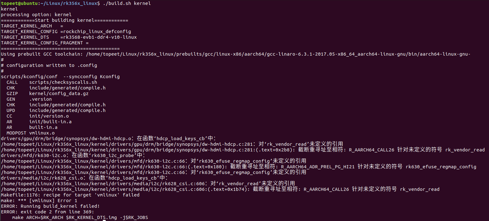
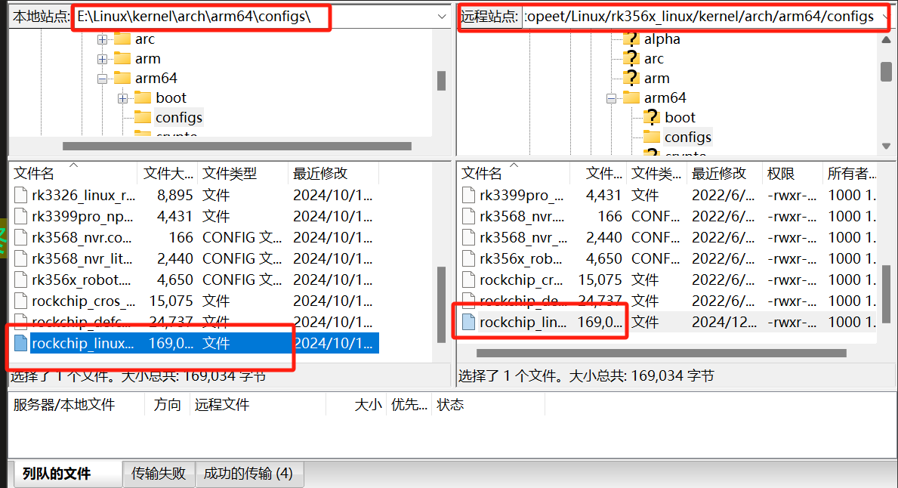

# 随记：

# 一、看视频学习过程中报错
## 1、编译内核出错（make menuconfig）
### 报错

### 原因
- 1 最终是发现.configure文件出现问题了，而幸好在Windows电脑上有备份

### 解决
- 1 解决了，我把.config文件覆盖更新，后面就可以内核编译成功了

## 2、打开不了ssh
### 报错现象

### 原因

### 解决
- 1 最终是发现.configure文件出现问题了，而幸好在Windows电脑上有备份

## 3、内核源码出现了问题
### 报错现象

### 原因

### 解决
- 1 我自己用的也是4.19的版本

## 4、QT打包程序运行后弹出CMD命令窗口的问题
### 报错现象

### 原因

### 解决

## 5、在设备数中冒号两边不允许有空格
### 报错现象

### 原因

### 解决

- 1   最后发现是一个字母写错了，尽量以后不要再用提词软件来进行写代码

# 二、看视频学习过程中报错
## 1、Ubuntu上不了网：ifconfig查看只有lo,没有ens33问题解决参考方法
### 报错现象

### 原因

### 解决
[Ubuntu上不了网：ifconfig查看只有lo,没有ens33问题解决参考方法_ifconfig -a 没有ens-CSDN博客](https://blog.csdn.net/qq_41969790/article/details/103222251)

## 2、运行应用程序没有打印，没有反应
### 报错现象

### 原因
- 1 发现是文件太大在传输的时候出现问题即传输过来显示的文件大小是零也就是传输出现问题了

### 解决

## 3、尝试执行的程序 app 没有执行权限
### 报错现象

### 原因

### 解决
- 1 C语言程序在开发板上要显示成绿色才能正常运行

## 4、把驱动模块下载到开发板
### 报错现象

### 原因
- 1 注意防火墙可能会阻挡数据的传输，再进行数据传输的时候一定要关闭防火墙

### 解决

- 1 如果开发板没和电脑ping通的话可以重启开发板多试几次
- 1 用sftp算了，记得把ip设置为192.168.1.4，通过Windows电脑传输数据给开发板

[开发板连接网络_开发板怎么联网-CSDN博客](https://blog.csdn.net/qq_43584707/article/details/135186581)

[终端SSH连接Ubuntu、开发板NFS连接Ubuntu_终端连接ubuntu 需要配置吗-CSDN博客](https://blog.csdn.net/weixin_42842270/article/details/107974902)

[04_【北京迅为】itop-3568开发板网络环境配置手册【底板V1.7版】v1.0..pdf](file:///D:/%E6%A1%8C%E9%9D%A2/%E5%AD%A6%E4%B9%A0%E8%B5%84%E6%96%99/%E3%80%90%E5%8C%97%E4%BA%AC%E8%BF%85%E4%B8%BA%E3%80%91%E5%B5%8C%E5%85%A5%E5%BC%8F%E5%AD%A6%E4%B9%A0/RK3568%E5%BC%80%E5%8F%91%E6%9D%BF/3.%E5%BC%80%E5%8F%91%E7%8E%AF%E5%A2%83%E6%90%AD%E5%BB%BA/04_%E3%80%90%E5%8C%97%E4%BA%AC%E8%BF%85%E4%B8%BA%E3%80%91itop-3568%E5%BC%80%E5%8F%91%E6%9D%BF%E7%BD%91%E7%BB%9C%E7%8E%AF%E5%A2%83%E9%85%8D%E7%BD%AE%E6%89%8B%E5%86%8C%E3%80%90%E5%BA%95%E6%9D%BFV1.7%E7%89%88%E3%80%91v1.0..pdf)D:\桌面\学习资料\【北京迅为】嵌入式学习\RK3568开发板\3.开发环境搭建

## 5、开发板烧写的内核和编译驱动的内核源码保持一致
### 报错现象

### 原因

### 解决
[Linux内核版本不一致解决_linux启动后,查看内核不是已安装的最新的内核-CSDN博客](https://blog.csdn.net/2301_79485441/article/details/135285926)

# 三、看视频学习过程中报错
## 1、Qt 应用程序试图使用 Wayland 作为平台插件，但无法创建一个 Wayland 显示连接
### 报错现象
[Qt 应用程序试图使用 Wayland 作为平台插件，但无法创建一个 Wayland 显示连接](onenote:https://d.docs.live.net/52d4b76bb0ffcf51/Documents/\(RK3568\)Linux驱动开发/报错与解决.one#Qt%20应用程序试图使用%20Wayland%20作为平台插件，但无法创建一个%20Wayland%20显示连接&section-id={F667161B-E9F9-4523-BC24-9C2C6297FA7B}&page-id={CC2E22F2-C0DA-451C-AA28-5FED672DB7A7}&end)  ([Web 视图](https://onedrive.live.com/view.aspx?resid=52D4B76BB0FFCF51%21se8c325913f784bf694d429e5ee2ab2be&id=documents&wd=target%28%E6%8A%A5%E9%94%99%E4%B8%8E%E8%A7%A3%E5%86%B3.one%7CF667161B-E9F9-4523-BC24-9C2C6297FA7B%2FQt%20%E5%BA%94%E7%94%A8%E7%A8%8B%E5%BA%8F%E8%AF%95%E5%9B%BE%E4%BD%BF%E7%94%A8%20Wayland%20%E4%BD%9C%E4%B8%BA%E5%B9%B3%E5%8F%B0%E6%8F%92%E4%BB%B6%EF%BC%8C%E4%BD%86%E6%97%A0%E6%B3%95%E5%88%9B%E5%BB%BA%E4%B8%80%E4%B8%AA%20Wayland%20%E6%98%BE%E7%A4%BA%E8%BF%9E%E6%8E%A5%7CCC2E22F2-C0DA-451C-AA28-5FED672DB7A7%2F%29&wdpartid=%7bAEA54883-B4A9-0DA5-0C19-D1F631FD09F7%7d%7b1%7d&wdsectionfileid=52D4B76BB0FFCF51!se64a27561a8942fda81f7de4281f11fd))

### 原因

### 解决
[Qt 应用程序试图使用 Wayland 作为平台插件，但无法创建一个 Wayland 显示连接](onenote:https://d.docs.live.net/52d4b76bb0ffcf51/Documents/\(RK3568\)Linux驱动开发/报错与解决.one#Qt%20应用程序试图使用%20Wayland%20作为平台插件，但无法创建一个%20Wayland%20显示连接&section-id={F667161B-E9F9-4523-BC24-9C2C6297FA7B}&page-id={CC2E22F2-C0DA-451C-AA28-5FED672DB7A7}&end)  ([Web 视图](https://onedrive.live.com/view.aspx?resid=52D4B76BB0FFCF51%21se8c325913f784bf694d429e5ee2ab2be&id=documents&wd=target%28%E6%8A%A5%E9%94%99%E4%B8%8E%E8%A7%A3%E5%86%B3.one%7CF667161B-E9F9-4523-BC24-9C2C6297FA7B%2FQt%20%E5%BA%94%E7%94%A8%E7%A8%8B%E5%BA%8F%E8%AF%95%E5%9B%BE%E4%BD%BF%E7%94%A8%20Wayland%20%E4%BD%9C%E4%B8%BA%E5%B9%B3%E5%8F%B0%E6%8F%92%E4%BB%B6%EF%BC%8C%E4%BD%86%E6%97%A0%E6%B3%95%E5%88%9B%E5%BB%BA%E4%B8%80%E4%B8%AA%20Wayland%20%E6%98%BE%E7%A4%BA%E8%BF%9E%E6%8E%A5%7CCC2E22F2-C0DA-451C-AA28-5FED672DB7A7%2F%29&wdpartid=%7bAEA54883-B4A9-0DA5-0C19-D1F631FD09F7%7d%7b1%7d&wdsectionfileid=52D4B76BB0FFCF51!se64a27561a8942fda81f7de4281f11fd))

## 2、不小心改错了没有备份
### 报错现象

### 原因

### 解决

## 3、开发板连接wifi
### 报错现象

### 原因

### 解决

## 4、ubuntu支持SSH服务
### 报错现象

### 原因

### 解决
[如何在 Ubuntu 20.04 启用 SSH,并且通过局域网登录Ubuntu机器_ubuntu20.0.4开启ssh-CSDN博客](https://blog.csdn.net/jaken_xie/article/details/110329684)

[如何删除服务器中的ssh公钥 • Worktile社区](https://worktile.com/kb/ask/1307446.html)

[【Linux】1.配置本地电脑与Ubuntu虚拟机的SSH连接_ubuntu ssh-CSDN博客](https://blog.csdn.net/txh1013/article/details/141038243?ops_request_misc=%257B%2522request%255Fid%2522%253A%2522bda20a26f617ae329083a11a4c02233c%2522%252C%2522scm%2522%253A%252220140713.130102334.pc%255Fall.%2522%257D&request_id=bda20a26f617ae329083a11a4c02233c&biz_id=0&utm_medium=distribute.pc_search_result.none-task-blog-2~all~first_rank_ecpm_v1~rank_v31_ecpm-1-141038243-null-null.142%5ev101%5epc_search_result_base4&utm_term=%E9%85%8D%E7%BD%AE%E6%9C%AC%E5%9C%B0%E7%94%B5%E8%84%91%E4%B8%8EUbuntu%E8%99%9A%E6%8B%9F%E6%9C%BA%E7%9A%84SSH%E8%BF%9E%E6%8E%A5&spm=1018.2226.3001.4187)

## 5、ubuntu打不开vs code
### 报错现象

### 原因

### 解决
[Ubuntu下安装vscode，并解决终端打不开vscode的问题_apt vscode-CSDN博客](https://blog.csdn.net/m0_62919535/article/details/134198172)

[ubuntu下安装vscode、修改字体、远程连接服务器、远程debug python工程_ubuntu vscode-CSDN博客](https://blog.csdn.net/magic_ll/article/details/119679279?utm_medium=distribute.pc_relevant.none-task-blog-2~default~baidujs_baidulandingword~default-2-119679279-blog-134198172.235%5ev43%5epc_blog_bottom_relevance_base8&spm=1001.2101.3001.4242.1&utm_relevant_index=4)

[tonsky/FiraCode: Free monospaced font with programming ligatures](https://github.com/tonsky/FiraCode?tab=readme-ov-file)

# 四、看视频学习过程中报错
## 1、开发板ubuntu连接wifi
### 报错现象

### 原因

### 解决

[ubuntu命令行连接wifi-CSDN博客](https://blog.csdn.net/weixin_39699362/article/details/142630395)

- 1 能用，但是网速很慢

## 2、解决linux 上网速度慢的问题
### 报错现象

### 原因

### 解决
[解决linux 上网速度慢的问题Ubuntu 20.04设置DNS解析（解决resolve.conf被覆盖问题）-CSDN博客](onenote:https://d.docs.live.net/52d4b76bb0ffcf51/Documents/\(RK3568\)Linux驱动开发/报错与解决.one#解决linux%20上网速度慢的问题Ubuntu%2020.04设置DNS解析（解决resolve.conf被覆盖问题）-CSDN博客&section-id={F667161B-E9F9-4523-BC24-9C2C6297FA7B}&page-id={AB981C77-D2D4-4822-B6D6-7456494009BF}&end)  ([Web 视图](https://onedrive.live.com/view.aspx?resid=52D4B76BB0FFCF51%21se8c325913f784bf694d429e5ee2ab2be&id=documents&wd=target%28%E6%8A%A5%E9%94%99%E4%B8%8E%E8%A7%A3%E5%86%B3.one%7CF667161B-E9F9-4523-BC24-9C2C6297FA7B%2F%E8%A7%A3%E5%86%B3linux%20%E4%B8%8A%E7%BD%91%E9%80%9F%E5%BA%A6%E6%85%A2%E7%9A%84%E9%97%AE%E9%A2%98Ubuntu%2020.04%E8%AE%BE%E7%BD%AEDNS%E8%A7%A3%E6%9E%90%EF%BC%88%E8%A7%A3%E5%86%B3resolve.conf%E8%A2%AB%E8%A6%86%E7%9B%96%E9%97%AE%E9%A2%98%EF%BC%89-CSDN%E5%8D%9A%E5%AE%A2%7CAB981C77-D2D4-4822-B6D6-7456494009BF%2F%29&wdpartid=%7bA2BBA749-0739-04B9-1F32-8B7284517039%7d%7b1%7d&wdsectionfileid=52D4B76BB0FFCF51!se64a27561a8942fda81f7de4281f11fd))

[关于ubuntu系统无线网络网速慢的解决方法_ubuntu22 wifi 网速-CSDN博客](https://blog.csdn.net/asdfgh0077/article/details/108972962)

## 3、
### 报错现象

### 原因

### 解决

## 4、
### 报错现象

### 原因

### 解决

## 5、
### 报错现象

### 原因

### 解决

