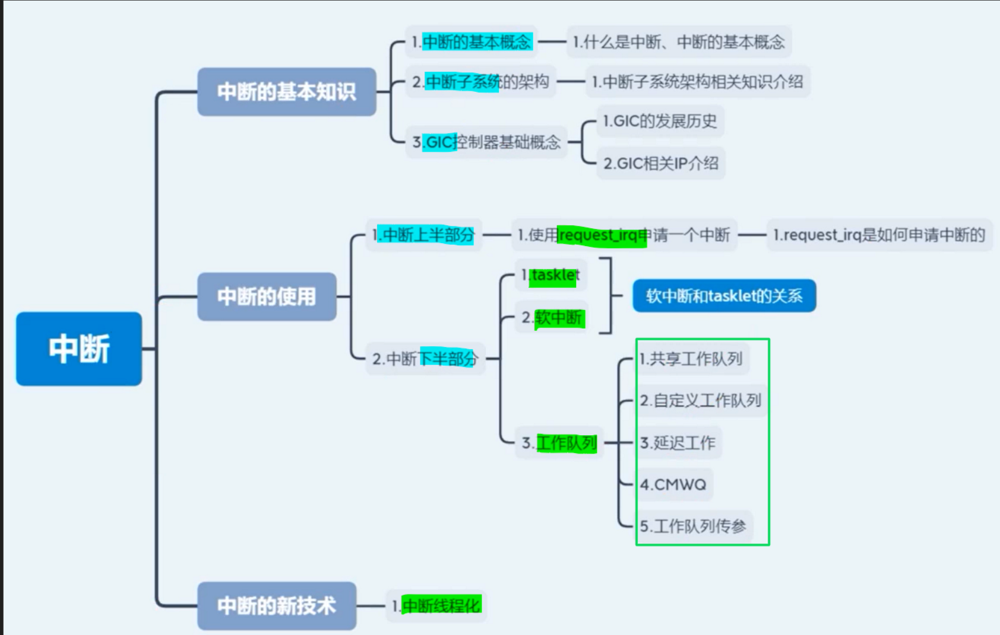

# 备注(声明)：框架

# 一、中断的使用(项目) - 知识总揽

[24.中断课程总结和回顾(框架)](onenote:https://d.docs.live.net/52d4b76bb0ffcf51/Documents/\(RK3568\)Linux驱动开发/第五期_中断.one#24.中断课程总结和回顾\(框架\)&section-id={9D192FA8-F2FD-49EF-9726-3608BD9EE156}&page-id={EA94AE59-6726-4297-98F9-FA8284D12A8E}&end)  ([Web 视图](https://onedrive.live.com/view.aspx?resid=52D4B76BB0FFCF51%21se8c325913f784bf694d429e5ee2ab2be&id=documents&wd=target%28%E7%AC%AC%E4%BA%94%E6%9C%9F_%E4%B8%AD%E6%96%AD.one%7C9D192FA8-F2FD-49EF-9726-3608BD9EE156%2F24.%E4%B8%AD%E6%96%AD%E8%AF%BE%E7%A8%8B%E6%80%BB%E7%BB%93%E5%92%8C%E5%9B%9E%E9%A1%BE%28%E6%A1%86%E6%9E%B6%5C%29%7CEA94AE59-6726-4297-98F9-FA8284D12A8E%2F%29))
#### 2.4.1中断上半部分-request_irq
[4.申请一个gpio中断-函数](onenote:https://d.docs.live.net/52d4b76bb0ffcf51/Documents/\(RK3568\)Linux驱动开发/第五期_中断.one#4.申请一个gpio中断-函数&section-id={9D192FA8-F2FD-49EF-9726-3608BD9EE156}&page-id={FA7A3BB1-3BDE-41FA-8717-BD5855C2B2D3}&end)  ([Web 视图](https://onedrive.live.com/view.aspx?resid=52D4B76BB0FFCF51%21se8c325913f784bf694d429e5ee2ab2be&id=documents&wd=target%28%E7%AC%AC%E4%BA%94%E6%9C%9F_%E4%B8%AD%E6%96%AD.one%7C9D192FA8-F2FD-49EF-9726-3608BD9EE156%2F4.%E7%94%B3%E8%AF%B7%E4%B8%80%E4%B8%AAgpio%E4%B8%AD%E6%96%AD-%E5%87%BD%E6%95%B0%7CFA7A3BB1-3BDE-41FA-8717-BD5855C2B2D3%2F%29))
[5.申请一个gpio中断实验操作](onenote:https://d.docs.live.net/52d4b76bb0ffcf51/Documents/\(RK3568\)Linux驱动开发/第五期_中断.one#5.申请一个gpio中断实验操作&section-id={9D192FA8-F2FD-49EF-9726-3608BD9EE156}&page-id={0140CA6C-668C-4D8E-9759-151E9ED13ABB}&end)  ([Web 视图](https://onedrive.live.com/view.aspx?resid=52D4B76BB0FFCF51%21se8c325913f784bf694d429e5ee2ab2be&id=documents&wd=target%28%E7%AC%AC%E4%BA%94%E6%9C%9F_%E4%B8%AD%E6%96%AD.one%7C9D192FA8-F2FD-49EF-9726-3608BD9EE156%2F5.%E7%94%B3%E8%AF%B7%E4%B8%80%E4%B8%AAgpio%E4%B8%AD%E6%96%AD%E5%AE%9E%E9%AA%8C%E6%93%8D%E4%BD%9C%7C0140CA6C-668C-4D8E-9759-151E9ED13ABB%2F%29))

[[申请一个gpio中断.canvas|申请一个gpio中断]]
#### 2.4.2 中断下半部分
##### 2.4.2.1 tasklet
[7.中断下文_tasklet](onenote:https://d.docs.live.net/52d4b76bb0ffcf51/Documents/\(RK3568\)Linux驱动开发/第五期_中断.one#7.中断下文_tasklet&section-id={9D192FA8-F2FD-49EF-9726-3608BD9EE156}&page-id={C6D2E500-E2AF-4AC0-836F-0527E1A080D3}&end)  ([Web 视图](https://onedrive.live.com/view.aspx?resid=52D4B76BB0FFCF51%21se8c325913f784bf694d429e5ee2ab2be&id=documents&wd=target%28%E7%AC%AC%E4%BA%94%E6%9C%9F_%E4%B8%AD%E6%96%AD.one%7C9D192FA8-F2FD-49EF-9726-3608BD9EE156%2F7.%E4%B8%AD%E6%96%AD%E4%B8%8B%E6%96%87_tasklet%7CC6D2E500-E2AF-4AC0-836F-0527E1A080D3%2F%29))
[8.中断下文_tasklet实验操作](onenote:https://d.docs.live.net/52d4b76bb0ffcf51/Documents/\(RK3568\)Linux驱动开发/第五期_中断.one#8.中断下文_tasklet实验操作&section-id={9D192FA8-F2FD-49EF-9726-3608BD9EE156}&page-id={8CC905B9-387C-405D-A5CE-3D25A93E7716}&end)  ([Web 视图](https://onedrive.live.com/view.aspx?resid=52D4B76BB0FFCF51%21se8c325913f784bf694d429e5ee2ab2be&id=documents&wd=target%28%E7%AC%AC%E4%BA%94%E6%9C%9F_%E4%B8%AD%E6%96%AD.one%7C9D192FA8-F2FD-49EF-9726-3608BD9EE156%2F8.%E4%B8%AD%E6%96%AD%E4%B8%8B%E6%96%87_tasklet%E5%AE%9E%E9%AA%8C%E6%93%8D%E4%BD%9C%7C8CC905B9-387C-405D-A5CE-3D25A93E7716%2F%29))
##### 2.4.2.2 软中断
[9.软中断](onenote:https://d.docs.live.net/52d4b76bb0ffcf51/Documents/\(RK3568\)Linux驱动开发/第五期_中断.one#9.软中断&section-id={9D192FA8-F2FD-49EF-9726-3608BD9EE156}&page-id={9E531D16-1EFE-4CEE-8928-72230B5CE368}&end)  ([Web 视图](https://onedrive.live.com/view.aspx?resid=52D4B76BB0FFCF51%21se8c325913f784bf694d429e5ee2ab2be&id=documents&wd=target%28%E7%AC%AC%E4%BA%94%E6%9C%9F_%E4%B8%AD%E6%96%AD.one%7C9D192FA8-F2FD-49EF-9726-3608BD9EE156%2F9.%E8%BD%AF%E4%B8%AD%E6%96%AD%7C9E531D16-1EFE-4CEE-8928-72230B5CE368%2F%29))
[10.软中断实验_基于RK3568](onenote:https://d.docs.live.net/52d4b76bb0ffcf51/Documents/\(RK3568\)Linux驱动开发/第五期_中断.one#10.软中断实验_基于RK3568&section-id={9D192FA8-F2FD-49EF-9726-3608BD9EE156}&page-id={D9414242-7A73-4A94-9988-28BEC1AD8119}&end)  ([Web 视图](https://onedrive.live.com/view.aspx?resid=52D4B76BB0FFCF51%21se8c325913f784bf694d429e5ee2ab2be&id=documents&wd=target%28%E7%AC%AC%E4%BA%94%E6%9C%9F_%E4%B8%AD%E6%96%AD.one%7C9D192FA8-F2FD-49EF-9726-3608BD9EE156%2F10.%E8%BD%AF%E4%B8%AD%E6%96%AD%E5%AE%9E%E9%AA%8C_%E5%9F%BA%E4%BA%8ERK3568%7CD9414242-7A73-4A94-9988-28BEC1AD8119%2F%29))
##### 2.4.2.3 工作队列
[12.共享工作队列](onenote:https://d.docs.live.net/52d4b76bb0ffcf51/Documents/\(RK3568\)Linux驱动开发/第五期_中断.one#12.共享工作队列&section-id={9D192FA8-F2FD-49EF-9726-3608BD9EE156}&page-id={4CA84459-AC95-411B-8292-1AFCC8337339}&end)  ([Web 视图](https://onedrive.live.com/view.aspx?resid=52D4B76BB0FFCF51%21se8c325913f784bf694d429e5ee2ab2be&id=documents&wd=target%28%E7%AC%AC%E4%BA%94%E6%9C%9F_%E4%B8%AD%E6%96%AD.one%7C9D192FA8-F2FD-49EF-9726-3608BD9EE156%2F12.%E5%85%B1%E4%BA%AB%E5%B7%A5%E4%BD%9C%E9%98%9F%E5%88%97%7C4CA84459-AC95-411B-8292-1AFCC8337339%2F%29))
[13.共享工作队列实验_基于RK3568](onenote:https://d.docs.live.net/52d4b76bb0ffcf51/Documents/\(RK3568\)Linux驱动开发/第五期_中断.one#13.共享工作队列实验_基于RK3568&section-id={9D192FA8-F2FD-49EF-9726-3608BD9EE156}&page-id={369B7A81-5561-4F91-9C7E-AAC050407D9D}&end)  ([Web 视图](https://onedrive.live.com/view.aspx?resid=52D4B76BB0FFCF51%21se8c325913f784bf694d429e5ee2ab2be&id=documents&wd=target%28%E7%AC%AC%E4%BA%94%E6%9C%9F_%E4%B8%AD%E6%96%AD.one%7C9D192FA8-F2FD-49EF-9726-3608BD9EE156%2F13.%E5%85%B1%E4%BA%AB%E5%B7%A5%E4%BD%9C%E9%98%9F%E5%88%97%E5%AE%9E%E9%AA%8C_%E5%9F%BA%E4%BA%8ERK3568%7C369B7A81-5561-4F91-9C7E-AAC050407D9D%2F%29))

[[中断下文-共享工作队列.canvas|共享工作队列]]

[14.自定义工作队列](onenote:https://d.docs.live.net/52d4b76bb0ffcf51/Documents/\(RK3568\)Linux驱动开发/第五期_中断.one#14.自定义工作队列&section-id={9D192FA8-F2FD-49EF-9726-3608BD9EE156}&page-id={C0A3BF9A-E85E-4148-A8C7-A6F617C1DB61}&end)  ([Web 视图](https://onedrive.live.com/view.aspx?resid=52D4B76BB0FFCF51%21se8c325913f784bf694d429e5ee2ab2be&id=documents&wd=target%28%E7%AC%AC%E4%BA%94%E6%9C%9F_%E4%B8%AD%E6%96%AD.one%7C9D192FA8-F2FD-49EF-9726-3608BD9EE156%2F14.%E8%87%AA%E5%AE%9A%E4%B9%89%E5%B7%A5%E4%BD%9C%E9%98%9F%E5%88%97%7CC0A3BF9A-E85E-4148-A8C7-A6F617C1DB61%2F%29))
[15.自定义工作队列实验_基于RK3568](onenote:https://d.docs.live.net/52d4b76bb0ffcf51/Documents/\(RK3568\)Linux驱动开发/第五期_中断.one#15.自定义工作队列实验_基于RK3568&section-id={9D192FA8-F2FD-49EF-9726-3608BD9EE156}&page-id={619289E2-1145-45F3-A1BD-EE91FC823F82}&end)  ([Web 视图](https://onedrive.live.com/view.aspx?resid=52D4B76BB0FFCF51%21se8c325913f784bf694d429e5ee2ab2be&id=documents&wd=target%28%E7%AC%AC%E4%BA%94%E6%9C%9F_%E4%B8%AD%E6%96%AD.one%7C9D192FA8-F2FD-49EF-9726-3608BD9EE156%2F15.%E8%87%AA%E5%AE%9A%E4%B9%89%E5%B7%A5%E4%BD%9C%E9%98%9F%E5%88%97%E5%AE%9E%E9%AA%8C_%E5%9F%BA%E4%BA%8ERK3568%7C619289E2-1145-45F3-A1BD-EE91FC823F82%2F%29))

[16.延迟工作](onenote:https://d.docs.live.net/52d4b76bb0ffcf51/Documents/\(RK3568\)Linux驱动开发/第五期_中断.one#16.延迟工作&section-id={9D192FA8-F2FD-49EF-9726-3608BD9EE156}&page-id={FF80075C-18E1-4B1D-8B45-CF4FFB6C8DBA}&end)  ([Web 视图](https://onedrive.live.com/view.aspx?resid=52D4B76BB0FFCF51%21se8c325913f784bf694d429e5ee2ab2be&id=documents&wd=target%28%E7%AC%AC%E4%BA%94%E6%9C%9F_%E4%B8%AD%E6%96%AD.one%7C9D192FA8-F2FD-49EF-9726-3608BD9EE156%2F16.%E5%BB%B6%E8%BF%9F%E5%B7%A5%E4%BD%9C%7CFF80075C-18E1-4B1D-8B45-CF4FFB6C8DBA%2F%29))
[17.延迟工作实验_基于RK3568](onenote:https://d.docs.live.net/52d4b76bb0ffcf51/Documents/\(RK3568\)Linux驱动开发/第五期_中断.one#17.延迟工作实验_基于RK3568&section-id={9D192FA8-F2FD-49EF-9726-3608BD9EE156}&page-id={99E761B4-D92F-42CE-977E-950B56B15D2B}&end)  ([Web 视图](https://onedrive.live.com/view.aspx?resid=52D4B76BB0FFCF51%21se8c325913f784bf694d429e5ee2ab2be&id=documents&wd=target%28%E7%AC%AC%E4%BA%94%E6%9C%9F_%E4%B8%AD%E6%96%AD.one%7C9D192FA8-F2FD-49EF-9726-3608BD9EE156%2F17.%E5%BB%B6%E8%BF%9F%E5%B7%A5%E4%BD%9C%E5%AE%9E%E9%AA%8C_%E5%9F%BA%E4%BA%8ERK3568%7C99E761B4-D92F-42CE-977E-950B56B15D2B%2F%29))

[20.并发管理工作队列(CMWQ)](onenote:https://d.docs.live.net/52d4b76bb0ffcf51/Documents/\(RK3568\)Linux驱动开发/第五期_中断.one#20.并发管理工作队列\(CMWQ\)&section-id={9D192FA8-F2FD-49EF-9726-3608BD9EE156}&page-id={15EDD31C-20BE-47E4-BF13-519611D8AAEF}&end)  ([Web 视图](https://onedrive.live.com/view.aspx?resid=52D4B76BB0FFCF51%21se8c325913f784bf694d429e5ee2ab2be&id=documents&wd=target%28%E7%AC%AC%E4%BA%94%E6%9C%9F_%E4%B8%AD%E6%96%AD.one%7C9D192FA8-F2FD-49EF-9726-3608BD9EE156%2F20.%E5%B9%B6%E5%8F%91%E7%AE%A1%E7%90%86%E5%B7%A5%E4%BD%9C%E9%98%9F%E5%88%97%28CMWQ%5C%29%7C15EDD31C-20BE-47E4-BF13-519611D8AAEF%2F%29))
[21.并发管理工作队列（CMWQ）实验_基于RK3568](onenote:https://d.docs.live.net/52d4b76bb0ffcf51/Documents/\(RK3568\)Linux驱动开发/第五期_中断.one#21.并发管理工作队列（CMWQ）实验_基于RK3568&section-id={9D192FA8-F2FD-49EF-9726-3608BD9EE156}&page-id={16DA0F04-523B-45BA-AB56-D5DF656E246B}&end)  ([Web 视图](https://onedrive.live.com/view.aspx?resid=52D4B76BB0FFCF51%21se8c325913f784bf694d429e5ee2ab2be&id=documents&wd=target%28%E7%AC%AC%E4%BA%94%E6%9C%9F_%E4%B8%AD%E6%96%AD.one%7C9D192FA8-F2FD-49EF-9726-3608BD9EE156%2F21.%E5%B9%B6%E5%8F%91%E7%AE%A1%E7%90%86%E5%B7%A5%E4%BD%9C%E9%98%9F%E5%88%97%EF%BC%88CMWQ%EF%BC%89%E5%AE%9E%E9%AA%8C_%E5%9F%BA%E4%BA%8ERK3568%7C16DA0F04-523B-45BA-AB56-D5DF656E246B%2F%29))

[18.工作队列传参](onenote:https://d.docs.live.net/52d4b76bb0ffcf51/Documents/\(RK3568\)Linux驱动开发/第五期_中断.one#18.工作队列传参&section-id={9D192FA8-F2FD-49EF-9726-3608BD9EE156}&page-id={8D632FA5-165A-4F16-A3B3-1F9F95144F2E}&end)  ([Web 视图](https://onedrive.live.com/view.aspx?resid=52D4B76BB0FFCF51%21se8c325913f784bf694d429e5ee2ab2be&id=documents&wd=target%28%E7%AC%AC%E4%BA%94%E6%9C%9F_%E4%B8%AD%E6%96%AD.one%7C9D192FA8-F2FD-49EF-9726-3608BD9EE156%2F18.%E5%B7%A5%E4%BD%9C%E9%98%9F%E5%88%97%E4%BC%A0%E5%8F%82%7C8D632FA5-165A-4F16-A3B3-1F9F95144F2E%2F%29))
[19.工作队列传参实验_基于RK3568](onenote:https://d.docs.live.net/52d4b76bb0ffcf51/Documents/\(RK3568\)Linux驱动开发/第五期_中断.one#19.工作队列传参实验_基于RK3568&section-id={9D192FA8-F2FD-49EF-9726-3608BD9EE156}&page-id={0DB3B440-5CE2-4AC1-A193-D5E661D7CC96}&end)  ([Web 视图](https://onedrive.live.com/view.aspx?resid=52D4B76BB0FFCF51%21se8c325913f784bf694d429e5ee2ab2be&id=documents&wd=target%28%E7%AC%AC%E4%BA%94%E6%9C%9F_%E4%B8%AD%E6%96%AD.one%7C9D192FA8-F2FD-49EF-9726-3608BD9EE156%2F19.%E5%B7%A5%E4%BD%9C%E9%98%9F%E5%88%97%E4%BC%A0%E5%8F%82%E5%AE%9E%E9%AA%8C_%E5%9F%BA%E4%BA%8ERK3568%7C0DB3B440-5CE2-4AC1-A193-D5E661D7CC96%2F%29))

#### 2.4.3 中断的新技术
[22.中断线程化](onenote:https://d.docs.live.net/52d4b76bb0ffcf51/Documents/\(RK3568\)Linux驱动开发/第五期_中断.one#22.中断线程化&section-id={9D192FA8-F2FD-49EF-9726-3608BD9EE156}&page-id={FE4C669C-CF1D-4A8F-B94A-4F55DADFDA05}&end)  ([Web 视图](https://onedrive.live.com/view.aspx?resid=52D4B76BB0FFCF51%21se8c325913f784bf694d429e5ee2ab2be&id=documents&wd=target%28%E7%AC%AC%E4%BA%94%E6%9C%9F_%E4%B8%AD%E6%96%AD.one%7C9D192FA8-F2FD-49EF-9726-3608BD9EE156%2F22.%E4%B8%AD%E6%96%AD%E7%BA%BF%E7%A8%8B%E5%8C%96%7CFE4C669C-CF1D-4A8F-B94A-4F55DADFDA05%2F%29))

# 二、中断的知识扩展

## 引脚编号计算|计算GPIO口所对应的标号

[引脚编号计算](onenote:#基本知识&section-id={9D192FA8-F2FD-49EF-9726-3608BD9EE156}&page-id={C9AB0BFA-05FE-4E8D-8396-38F07D85D694}&object-id={351A3B84-7161-076F-3C6A-50EC7BE8B234}&80&base-path=https://d.docs.live.net/52D4B76BB0FFCF51/Documents/\(RK3568\)Linux驱动开发/第五期_中断.one)

[“3-使用命令通过sysfs文件系统控制GPIO”页上的图片](onenote:https://d.docs.live.net/52d4b76bb0ffcf51/Documents/\(RK3568\)Linux驱动开发/第十二期_GPIO子系统.one#3-使用命令通过sysfs文件系统控制GPIO&section-id={70166D78-0FC7-4512-B1CF-4A4481F8C206}&page-id={471F55C3-0F87-4888-BC65-7A714608E9A3}&object-id={CCA847EF-F0E2-4605-9C75-58C0EFD602CE}&34)  ([Web 视图](https://onedrive.live.com/view.aspx?resid=52D4B76BB0FFCF51%21se8c325913f784bf694d429e5ee2ab2be&id=documents&wd=target%28%E7%AC%AC%E5%8D%81%E4%BA%8C%E6%9C%9F_GPIO%E5%AD%90%E7%B3%BB%E7%BB%9F.one%7C70166D78-0FC7-4512-B1CF-4A4481F8C206%2F3-%E4%BD%BF%E7%94%A8%E5%91%BD%E4%BB%A4%E9%80%9A%E8%BF%87sysfs%E6%96%87%E4%BB%B6%E7%B3%BB%E7%BB%9F%E6%8E%A7%E5%88%B6GPIO%7C471F55C3-0F87-4888-BC65-7A714608E9A3%2F%29&wdpartid=%7b6260DF4F-45D8-47AA-89D1-7DBACA718547%7d%7b1%7d&wdsectionfileid=52D4B76BB0FFCF51!s379e81f769634ad2a8a457194a5b5af6))

## 工作队列传参-传参给中断下文使用

### 1 、步骤一:打包数据包- work_date结构体

[“18.工作队列传参”页上的绘图](onenote:#18.工作队列传参&section-id={9D192FA8-F2FD-49EF-9726-3608BD9EE156}&page-id={8D632FA5-165A-4F16-A3B3-1F9F95144F2E}&object-id={877B14C5-4197-4E13-929E-F5D93AFAA981}&A&base-path=https://d.docs.live.net/52d4b76bb0ffcf51/Documents/\(RK3568\)Linux驱动开发/第五期_中断.one)
### 2 、步骤二:在中断的下半部分拆包
[“18.工作队列传参”页上的绘图](onenote:#18.工作队列传参&section-id={9D192FA8-F2FD-49EF-9726-3608BD9EE156}&page-id={8D632FA5-165A-4F16-A3B3-1F9F95144F2E}&object-id={877B14C5-4197-4E13-929E-F5D93AFAA981}&E&base-path=https://d.docs.live.net/52d4b76bb0ffcf51/Documents/\(RK3568\)Linux驱动开发/第五期_中断.one)

### 3 、实验代码编写及现象
[19.工作队列传参实验_基于RK3568](onenote:#19.工作队列传参实验_基于RK3568&section-id={9D192FA8-F2FD-49EF-9726-3608BD9EE156}&page-id={0DB3B440-5CE2-4AC1-A193-D5E661D7CC96}&end&base-path=https://d.docs.live.net/52d4b76bb0ffcf51/Documents/\(RK3568\)Linux驱动开发/第五期_中断.one)

## request_irq是如何向内核申请中断的
[6.request _irq是如何向内核申请中断的？](onenote:#6.request%20_irq是如何向内核申请中断的？&section-id={9D192FA8-F2FD-49EF-9726-3608BD9EE156}&page-id={8C394E27-B957-4EE8-BD7B-030E77B2864E}&end&base-path=https://d.docs.live.net/52D4B76BB0FFCF51/Documents/\(RK3568\)Linux驱动开发/第五期_中断.one)
### 1 、

### 2 、

### 3 、

### 4 、

### 5、

### 6、

### 7、

### 8、

## 为什么说tasklet是一种特殊的软中断？
### 1 、

### 2 、

### 3 、

### 4 、

### 5、

### 6、

### 7、

### 8、

# 三、中断的实现机制

## 中断上文- 申请一个gpio中断
### 1 、申请中断函数-request_irq
[“4.申请一个gpio中断-函数”页上的绘图](onenote:#4.申请一个gpio中断-函数&section-id={9D192FA8-F2FD-49EF-9726-3608BD9EE156}&page-id={FA7A3BB1-3BDE-41FA-8717-BD5855C2B2D3}&object-id={F5E09C77-ECD7-4415-88AB-A93FF907C267}&11&base-path=https://d.docs.live.net/52D4B76BB0FFCF51/Documents/\(RK3568\)Linux驱动开发/第五期_中断.one)

### 2 、获取中断号函数
[“4.申请一个gpio中断-函数”页上的图片](onenote:#4.申请一个gpio中断-函数&section-id={9D192FA8-F2FD-49EF-9726-3608BD9EE156}&page-id={FA7A3BB1-3BDE-41FA-8717-BD5855C2B2D3}&object-id={DC6A1EFC-A06C-4020-82AC-139B2E6453B1}&1B&base-path=https://d.docs.live.net/52D4B76BB0FFCF51/Documents/\(RK3568\)Linux驱动开发/第五期_中断.one)

### 3 、开发板屏幕对应的中断引脚
[中断引脚](onenote:#4.申请一个gpio中断-函数&section-id={9D192FA8-F2FD-49EF-9726-3608BD9EE156}&page-id={FA7A3BB1-3BDE-41FA-8717-BD5855C2B2D3}&object-id={6CC236D7-1958-006B-3B27-C046565B3DFB}&2D&base-path=https://d.docs.live.net/52D4B76BB0FFCF51/Documents/\(RK3568\)Linux驱动开发/第五期_中断.one)

### 4 、中断标志-触发方式
[“4.申请一个gpio中断-函数”页上的绘图](onenote:#4.申请一个gpio中断-函数&section-id={9D192FA8-F2FD-49EF-9726-3608BD9EE156}&page-id={FA7A3BB1-3BDE-41FA-8717-BD5855C2B2D3}&object-id={FF308EB3-6DE7-0FD7-16A7-EF5D55F75E5F}&99&base-path=https://d.docs.live.net/52D4B76BB0FFCF51/Documents/\(RK3568\)Linux驱动开发/第五期_中断.one)

### 5、中断服务函数
[“4.申请一个gpio中断-函数”页上的图片](onenote:#4.申请一个gpio中断-函数&section-id={9D192FA8-F2FD-49EF-9726-3608BD9EE156}&page-id={FA7A3BB1-3BDE-41FA-8717-BD5855C2B2D3}&object-id={1A3D071E-D4AF-4211-A85C-BFEFD6CFF644}&87&base-path=https://d.docs.live.net/52D4B76BB0FFCF51/Documents/\(RK3568\)Linux驱动开发/第五期_中断.one)

- **返回值类型**
[“4.申请一个gpio中断-函数”页上的图片](onenote:#4.申请一个gpio中断-函数&section-id={9D192FA8-F2FD-49EF-9726-3608BD9EE156}&page-id={FA7A3BB1-3BDE-41FA-8717-BD5855C2B2D3}&object-id={1A3D071E-D4AF-4211-A85C-BFEFD6CFF644}&A1&base-path=https://d.docs.live.net/52D4B76BB0FFCF51/Documents/\(RK3568\)Linux驱动开发/第五期_中断.one)

### 6、注销中断函数
[“4.申请一个gpio中断-函数”页上的图片](onenote:#4.申请一个gpio中断-函数&section-id={9D192FA8-F2FD-49EF-9726-3608BD9EE156}&page-id={FA7A3BB1-3BDE-41FA-8717-BD5855C2B2D3}&object-id={1A3D071E-D4AF-4211-A85C-BFEFD6CFF644}&A1&base-path=https://d.docs.live.net/52D4B76BB0FFCF51/Documents/\(RK3568\)Linux驱动开发/第五期_中断.one)

### 7、实验代码编写
[5.申请一个gpio中断实验操作](onenote:#5.申请一个gpio中断实验操作&section-id={9D192FA8-F2FD-49EF-9726-3608BD9EE156}&page-id={0140CA6C-668C-4D8E-9759-151E9ED13ABB}&end&base-path=https://d.docs.live.net/52D4B76BB0FFCF51/Documents/\(RK3568\)Linux驱动开发/第五期_中断.one)

- **去掉ft5x06这个触摸芯片的驱动**
[驱动给它拿掉](onenote:#5.申请一个gpio中断实验操作&section-id={9D192FA8-F2FD-49EF-9726-3608BD9EE156}&page-id={0140CA6C-668C-4D8E-9759-151E9ED13ABB}&object-id={B4B7EC15-667A-0E5A-32CA-29438438A259}&E7&base-path=https://d.docs.live.net/52D4B76BB0FFCF51/Documents/\(RK3568\)Linux驱动开发/第五期_中断.one)

### 8、实验现象
[现象](onenote:#现象&section-id={9D192FA8-F2FD-49EF-9726-3608BD9EE156}&page-id={CE49A0C2-F769-4BAC-965E-C4CD35B3512A}&end&base-path=https://d.docs.live.net/52D4B76BB0FFCF51/Documents/\(RK3568\)Linux驱动开发/第五期_中断.one)

## 中断下文-tasklet
在task lt里面,我们不能调用引起休眠的函数
### 1 、tasklet结构体- tasklet_struct
[“7.中断下文_tasklet”页上的图片](onenote:#7.中断下文_tasklet&section-id={9D192FA8-F2FD-49EF-9726-3608BD9EE156}&page-id={C6D2E500-E2AF-4AC0-836F-0527E1A080D3}&object-id={B26222F3-9805-47AD-8536-B82F408E7249}&2A&base-path=https://d.docs.live.net/52d4b76bb0ffcf51/Documents/\(RK3568\)Linux驱动开发/第五期_中断.one)

### 2 、tasklet接口函数
[“7.中断下文_tasklet”页上的图片](onenote:#7.中断下文_tasklet&section-id={9D192FA8-F2FD-49EF-9726-3608BD9EE156}&page-id={C6D2E500-E2AF-4AC0-836F-0527E1A080D3}&object-id={B26222F3-9805-47AD-8536-B82F408E7249}&32&base-path=https://d.docs.live.net/52d4b76bb0ffcf51/Documents/\(RK3568\)Linux驱动开发/第五期_中断.one)

### 3 、实验代码编写
[代码](onenote:#7.中断下文_tasklet&section-id={9D192FA8-F2FD-49EF-9726-3608BD9EE156}&page-id={C6D2E500-E2AF-4AC0-836F-0527E1A080D3}&object-id={217C4231-098F-0478-3647-322B353A2D29}&DE&base-path=https://d.docs.live.net/52d4b76bb0ffcf51/Documents/\(RK3568\)Linux驱动开发/第五期_中断.one)

### 4 、实验现象
[8.中断下文_tasklet实验操作](onenote:#8.中断下文_tasklet实验操作&section-id={9D192FA8-F2FD-49EF-9726-3608BD9EE156}&page-id={8CC905B9-387C-405D-A5CE-3D25A93E7716}&end&base-path=https://d.docs.live.net/52d4b76bb0ffcf51/Documents/\(RK3568\)Linux驱动开发/第五期_中断.one)

## 中断下文-软中断
### 1 、软中断类型及含义
[“9.软中断”页上的图片](onenote:#9.软中断&section-id={9D192FA8-F2FD-49EF-9726-3608BD9EE156}&page-id={9E531D16-1EFE-4CEE-8928-72230B5CE368}&object-id={7B67EFF4-9E28-4E3F-8D56-8BDA910C8E1A}&12&base-path=https://d.docs.live.net/52d4b76bb0ffcf51/Documents/\(RK3568\)Linux驱动开发/第五期_中断.one)

[“9.软中断”页上的图片](onenote:#9.软中断&section-id={9D192FA8-F2FD-49EF-9726-3608BD9EE156}&page-id={9E531D16-1EFE-4CEE-8928-72230B5CE368}&object-id={7B67EFF4-9E28-4E3F-8D56-8BDA910C8E1A}&51&base-path=https://d.docs.live.net/52d4b76bb0ffcf51/Documents/\(RK3568\)Linux驱动开发/第五期_中断.one)
### 2 、自己添加软中断
[“9.软中断”页上的图片](onenote:#9.软中断&section-id={9D192FA8-F2FD-49EF-9726-3608BD9EE156}&page-id={9E531D16-1EFE-4CEE-8928-72230B5CE368}&object-id={7B67EFF4-9E28-4E3F-8D56-8BDA910C8E1A}&44&base-path=https://d.docs.live.net/52d4b76bb0ffcf51/Documents/\(RK3568\)Linux驱动开发/第五期_中断.one)

我们要用软中断，建议使用 tasklet
### 3 、软中断的接口函数
[“9.软中断”页上的图片](onenote:#9.软中断&section-id={9D192FA8-F2FD-49EF-9726-3608BD9EE156}&page-id={9E531D16-1EFE-4CEE-8928-72230B5CE368}&object-id={7B67EFF4-9E28-4E3F-8D56-8BDA910C8E1A}&51&base-path=https://d.docs.live.net/52d4b76bb0ffcf51/Documents/\(RK3568\)Linux驱动开发/第五期_中断.one)

- **导出接口函数**
[这两个函数它就没有在内核里面](onenote:#9.软中断&section-id={9D192FA8-F2FD-49EF-9726-3608BD9EE156}&page-id={9E531D16-1EFE-4CEE-8928-72230B5CE368}&object-id={CAE7C711-8435-4C1C-80DA-397FF2AA44AE}&74&base-path=https://d.docs.live.net/52d4b76bb0ffcf51/Documents/\(RK3568\)Linux驱动开发/第五期_中断.one)
[我们把这些函数给导出到符号表里](onenote:#9.软中断&section-id={9D192FA8-F2FD-49EF-9726-3608BD9EE156}&page-id={9E531D16-1EFE-4CEE-8928-72230B5CE368}&object-id={CAE7C711-8435-4C1C-80DA-397FF2AA44AE}&76&base-path=https://d.docs.live.net/52d4b76bb0ffcf51/Documents/\(RK3568\)Linux驱动开发/第五期_中断.one)
### 4 、实验代码编写及现象
[10.软中断实验_基于RK3568](onenote:#10.软中断实验_基于RK3568&section-id={9D192FA8-F2FD-49EF-9726-3608BD9EE156}&page-id={D9414242-7A73-4A94-9988-28BEC1AD8119}&end&base-path=https://d.docs.live.net/52d4b76bb0ffcf51/Documents/\(RK3568\)Linux驱动开发/第五期_中断.one)

## 中断下文- 共享工作队列（内核帮我们创建好了）
### 1 、什么是工作队列-共享与自定义工作队列的区分
[共享工作队列](onenote:#12.共享工作队列&section-id={9D192FA8-F2FD-49EF-9726-3608BD9EE156}&page-id={4CA84459-AC95-411B-8292-1AFCC8337339}&object-id={E05C56E2-902A-4E8F-AD23-B241B4F84D53}&2F&base-path=https://d.docs.live.net/52d4b76bb0ffcf51/Documents/\(RK3568\)Linux驱动开发/第五期_中断.one)

[自定义工作队列是不是跟他正好是反着的](onenote:#12.共享工作队列&section-id={9D192FA8-F2FD-49EF-9726-3608BD9EE156}&page-id={4CA84459-AC95-411B-8292-1AFCC8337339}&object-id={E05C56E2-902A-4E8F-AD23-B241B4F84D53}&3B&base-path=https://d.docs.live.net/52d4b76bb0ffcf51/Documents/\(RK3568\)Linux驱动开发/第五期_中断.one)
### 2 、描述还要延迟执行的工作的结构体- work_struct
[“12.共享工作队列”页上的图片](onenote:#12.共享工作队列&section-id={9D192FA8-F2FD-49EF-9726-3608BD9EE156}&page-id={4CA84459-AC95-411B-8292-1AFCC8337339}&object-id={84BDA8B8-D060-4967-B1B2-28CDA62C02B0}&31&base-path=https://d.docs.live.net/52d4b76bb0ffcf51/Documents/\(RK3568\)Linux驱动开发/第五期_中断.one)

### 3 、工作队列相关接口函数
[“12.共享工作队列”页上的图片](onenote:#12.共享工作队列&section-id={9D192FA8-F2FD-49EF-9726-3608BD9EE156}&page-id={4CA84459-AC95-411B-8292-1AFCC8337339}&object-id={84BDA8B8-D060-4967-B1B2-28CDA62C02B0}&37&base-path=https://d.docs.live.net/52d4b76bb0ffcf51/Documents/\(RK3568\)Linux驱动开发/第五期_中断.one)

[“14.自定义工作队列”页上的图片](onenote:#14.自定义工作队列&section-id={9D192FA8-F2FD-49EF-9726-3608BD9EE156}&page-id={C0A3BF9A-E85E-4148-A8C7-A6F617C1DB61}&object-id={A42D0BD1-0593-4508-9E16-AD81F9ECC906}&43&base-path=https://d.docs.live.net/52d4b76bb0ffcf51/Documents/\(RK3568\)Linux驱动开发/第五期_中断.one)
### 4 、实验代码编写及现象
[13.共享工作队列实验_基于RK3568](onenote:#13.共享工作队列实验_基于RK3568&section-id={9D192FA8-F2FD-49EF-9726-3608BD9EE156}&page-id={369B7A81-5561-4F91-9C7E-AAC050407D9D}&end&base-path=https://d.docs.live.net/52d4b76bb0ffcf51/Documents/\(RK3568\)Linux驱动开发/第五期_中断.one)

## 中断下文- 自定义工作队列（自创工作队列）
### 1 、描述一个工作队列的结构体- struct_workqueue
[“14.自定义工作队列”页上的图片](onenote:#14.自定义工作队列&section-id={9D192FA8-F2FD-49EF-9726-3608BD9EE156}&page-id={C0A3BF9A-E85E-4148-A8C7-A6F617C1DB61}&object-id={A42D0BD1-0593-4508-9E16-AD81F9ECC906}&12&base-path=https://d.docs.live.net/52d4b76bb0ffcf51/Documents/\(RK3568\)Linux驱动开发/第五期_中断.one)

### 2 、创建工作队列函数:
[“14.自定义工作队列”页上的图片](onenote:#14.自定义工作队列&section-id={9D192FA8-F2FD-49EF-9726-3608BD9EE156}&page-id={C0A3BF9A-E85E-4148-A8C7-A6F617C1DB61}&object-id={A42D0BD1-0593-4508-9E16-AD81F9ECC906}&34&base-path=https://d.docs.live.net/52d4b76bb0ffcf51/Documents/\(RK3568\)Linux驱动开发/第五期_中断.one)

### 3 、刷新/删除工作队列函数:
[“14.自定义工作队列”页上的图片](onenote:#14.自定义工作队列&section-id={9D192FA8-F2FD-49EF-9726-3608BD9EE156}&page-id={C0A3BF9A-E85E-4148-A8C7-A6F617C1DB61}&object-id={A42D0BD1-0593-4508-9E16-AD81F9ECC906}&43&base-path=https://d.docs.live.net/52d4b76bb0ffcf51/Documents/\(RK3568\)Linux驱动开发/第五期_中断.one)

### 4 、实验代码编写及现象
[15.自定义工作队列实验_基于RK3568](onenote:#15.自定义工作队列实验_基于RK3568&section-id={9D192FA8-F2FD-49EF-9726-3608BD9EE156}&page-id={619289E2-1145-45F3-A1BD-EE91FC823F82}&end&base-path=https://d.docs.live.net/52d4b76bb0ffcf51/Documents/\(RK3568\)Linux驱动开发/第五期_中断.one)

## 中断下文- 延迟工作
延迟工作是不是主要跟这个物料有关系啊
它和我们这个生产线没有关系
### 1 、描述一个延迟工作的结构体- delayed_work
[“16.延迟工作”页上的图片](onenote:#16.延迟工作&section-id={9D192FA8-F2FD-49EF-9726-3608BD9EE156}&page-id={FF80075C-18E1-4B1D-8B45-CF4FFB6C8DBA}&object-id={2468889F-A836-49B7-B7A6-B007D1A92001}&12&base-path=https://d.docs.live.net/52d4b76bb0ffcf51/Documents/\(RK3568\)Linux驱动开发/第五期_中断.one)

**多了一个时间的属性**
### 2 、延迟工作相关接口函数
[“16.延迟工作”页上的图片](onenote:#16.延迟工作&section-id={9D192FA8-F2FD-49EF-9726-3608BD9EE156}&page-id={FF80075C-18E1-4B1D-8B45-CF4FFB6C8DBA}&object-id={2468889F-A836-49B7-B7A6-B007D1A92001}&2D&base-path=https://d.docs.live.net/52d4b76bb0ffcf51/Documents/\(RK3568\)Linux驱动开发/第五期_中断.one)

### 3 、实验代码编写及现象
[17.延迟工作实验_基于RK3568](onenote:#17.延迟工作实验_基于RK3568&section-id={9D192FA8-F2FD-49EF-9726-3608BD9EE156}&page-id={99E761B4-D92F-42CE-977E-950B56B15D2B}&end&base-path=https://d.docs.live.net/52d4b76bb0ffcf51/Documents/\(RK3568\)Linux驱动开发/第五期_中断.one)

## 中断下文- 并发管理工作队列(CMWQ)
### 1 、传统工作队列- 串行的处理
[“20.并发管理工作队列(CMWQ)”页上的图片](onenote:#20.并发管理工作队列\(CMWQ\)&section-id={9D192FA8-F2FD-49EF-9726-3608BD9EE156}&page-id={15EDD31C-20BE-47E4-BF13-519611D8AAEF}&object-id={EECDEE39-137D-4EEB-8194-48AF98450C4A}&1A&base-path=https://d.docs.live.net/52d4b76bb0ffcf51/Documents/\(RK3568\)Linux驱动开发/第五期_中断.one)

**它还会引发死锁的问题**
### 2 、如何实现- 三种线程池
将工作队列和线程进行了分离

[“20.并发管理工作队列(CMWQ)”页上的图片](onenote:#20.并发管理工作队列\(CMWQ\)&section-id={9D192FA8-F2FD-49EF-9726-3608BD9EE156}&page-id={15EDD31C-20BE-47E4-BF13-519611D8AAEF}&object-id={EECDEE39-137D-4EEB-8194-48AF98450C4A}&3E&base-path=https://d.docs.live.net/52d4b76bb0ffcf51/Documents/\(RK3568\)Linux驱动开发/第五期_中断.one)

### 3 、并发管理工作队列API函数
和我们之前学的传统工作队列的api函数，它是兼容的，只有创建工作队列的api函数不一样

[“20.并发管理工作队列(CMWQ)”页上的图片](onenote:#20.并发管理工作队列\(CMWQ\)&section-id={9D192FA8-F2FD-49EF-9726-3608BD9EE156}&page-id={15EDD31C-20BE-47E4-BF13-519611D8AAEF}&object-id={8FB7A918-5926-4A23-AC6C-0BD7378778D1}&11&base-path=https://d.docs.live.net/52d4b76bb0ffcf51/Documents/\(RK3568\)Linux驱动开发/第五期_中断.one)

### 4 、实验代码编写及现象
[21.并发管理工作队列（CMWQ）实验_基于RK3568](onenote:#21.并发管理工作队列（CMWQ）实验_基于RK3568&section-id={9D192FA8-F2FD-49EF-9726-3608BD9EE156}&page-id={16DA0F04-523B-45BA-AB56-D5DF656E246B}&end&base-path=https://d.docs.live.net/52d4b76bb0ffcf51/Documents/\(RK3568\)Linux驱动开发/第五期_中断.one)

## 中断线程化
使用中断线程化，就可以不用工作队列实现中断的下半部分了。
### 1 、什么是中断线程化
[“22.中断线程化”页上的图片](onenote:#22.中断线程化&section-id={9D192FA8-F2FD-49EF-9726-3608BD9EE156}&page-id={FE4C669C-CF1D-4A8F-B94A-4F55DADFDA05}&object-id={8A1D3CDE-1D6A-4741-B3E5-D75F5826B6FE}&16&base-path=https://d.docs.live.net/52d4b76bb0ffcf51/Documents/\(RK3568\)Linux驱动开发/第五期_中断.one)

### 2 、中断线程化API函数
[“22.中断线程化”页上的图片](onenote:#22.中断线程化&section-id={9D192FA8-F2FD-49EF-9726-3608BD9EE156}&page-id={FE4C669C-CF1D-4A8F-B94A-4F55DADFDA05}&object-id={8A1D3CDE-1D6A-4741-B3E5-D75F5826B6FE}&22&base-path=https://d.docs.live.net/52d4b76bb0ffcf51/Documents/\(RK3568\)Linux驱动开发/第五期_中断.one)

### 3 、实验代码编写及现象
[23.中断线程化实验_基于RK3568](onenote:#23.中断线程化实验_基于RK3568&section-id={9D192FA8-F2FD-49EF-9726-3608BD9EE156}&page-id={A4B60B2E-F57E-448A-982A-56EA6BA65D0E}&end&base-path=https://d.docs.live.net/52d4b76bb0ffcf51/Documents/\(RK3568\)Linux驱动开发/第五期_中断.one)

