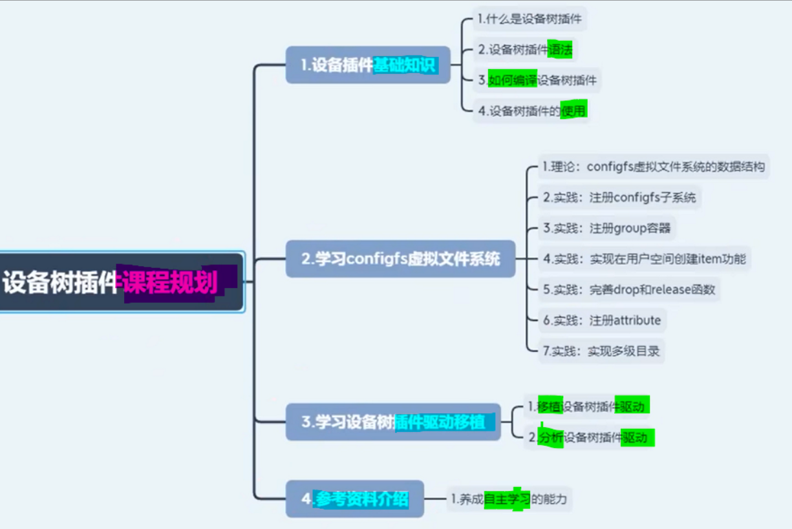

# 备注(声明)：

# 一、设备插件的运用
可以在系统运行期间动态的修改设备数，你就不用重启系统了。

## 设备树插件的基础知识
### 1 应用场景
[“2_设备树新技术：Dynamic DeviceTree”页上的图片](onenote:#2_设备树新技术：Dynamic%20DeviceTree&section-id={951D2BFB-3DD0-4B4D-B5B7-D7DAD35449EE}&page-id={216ECB70-64E0-4436-9AC1-929F7547EBEB}&object-id={2804B97F-61F8-4925-B519-9117C2DC1FD9}&15&base-path=https://d.docs.live.net/52d4b76bb0ffcf51/Documents/\(RK3568\)Linux驱动开发/第八期_设备树插件.one)

### 2 设备树插件语法
设备数插件的语法和设备数语法基本一致

- **三种动态修改节点的写法**
[三种动态修改节点的写法](onenote:#3_设备树插件语法以及如何编译设备树插件&section-id={951D2BFB-3DD0-4B4D-B5B7-D7DAD35449EE}&page-id={4076E992-302C-4EE0-92FE-775126A51E07}&object-id={6FD61C29-028E-0037-0912-D05975BCE17E}&14&base-path=https://d.docs.live.net/52d4b76bb0ffcf51/Documents/\(RK3568\)Linux驱动开发/第八期_设备树插件.one)

### 3 编译设备树插件
方法是和编译设备数的方法是一样的，我们可以把它编译成.dtbo

[方法是和编译设备数的方法是一样的](onenote:#3_设备树插件语法以及如何编译设备树插件&section-id={951D2BFB-3DD0-4B4D-B5B7-D7DAD35449EE}&page-id={4076E992-302C-4EE0-92FE-775126A51E07}&object-id={CF1C88C3-F3E7-03DD-0C59-F15840143EE0}&E8&base-path=https://d.docs.live.net/52d4b76bb0ffcf51/Documents/\(RK3568\)Linux驱动开发/第八期_设备树插件.one)

## 实验-设备树插件的使用

### 1 移植设备数插件的驱动
[你需要自己去移植设备数插件的驱动](onenote:#4_设备树插件的使用&section-id={951D2BFB-3DD0-4B4D-B5B7-D7DAD35449EE}&page-id={841BD99A-1BB7-4ACB-ABA1-181156DAC3AC}&object-id={725A6839-16BF-4CC2-AF2E-7A7BF4138627}&6C&base-path=https://d.docs.live.net/52d4b76bb0ffcf51/Documents/\(RK3568\)Linux驱动开发/第八期_设备树插件.one)

### 2 检查configfs是否挂载成功
[“4_设备树插件的使用”页上的图片](onenote:#4_设备树插件的使用&section-id={951D2BFB-3DD0-4B4D-B5B7-D7DAD35449EE}&page-id={841BD99A-1BB7-4ACB-ABA1-181156DAC3AC}&object-id={B4C4048D-20AF-4064-8000-D06AA95B9D53}&11&base-path=https://d.docs.live.net/52d4b76bb0ffcf51/Documents/\(RK3568\)Linux驱动开发/第八期_设备树插件.one)

cat proc/filesystems
### 3 设备树插件的使用- 加载单个dtbo
[/sys/kernel/config/device-tree/overlays](onenote:#4_设备树插件的使用&section-id={951D2BFB-3DD0-4B4D-B5B7-D7DAD35449EE}&page-id={841BD99A-1BB7-4ACB-ABA1-181156DAC3AC}&object-id={725A6839-16BF-4CC2-AF2E-7A7BF4138627}&25&base-path=https://d.docs.live.net/52d4b76bb0ffcf51/Documents/\(RK3568\)Linux驱动开发/第八期_设备树插件.one)

cat /overlay.dtbo> dtbo
### 4 加载多个dtbo
[“4_设备树插件的使用”页上的图片](onenote:#4_设备树插件的使用&section-id={951D2BFB-3DD0-4B4D-B5B7-D7DAD35449EE}&page-id={841BD99A-1BB7-4ACB-ABA1-181156DAC3AC}&object-id={725A6839-16BF-4CC2-AF2E-7A7BF4138627}&33&base-path=https://d.docs.live.net/52d4b76bb0ffcf51/Documents/\(RK3568\)Linux驱动开发/第八期_设备树插件.one)

## 移植设备树插件驱动
### 1 内核配置- 挂载 configfs 虚拟文件系统
[“13_移植设备树插件驱动”页上的图片](onenote:#13_移植设备树插件驱动&section-id={951D2BFB-3DD0-4B4D-B5B7-D7DAD35449EE}&page-id={667EC765-C643-4716-A0B2-1A060EE586B6}&object-id={029FE9E5-EC3E-4FFE-9A9C-33F402BBD11F}&12&base-path=https://d.docs.live.net/52d4b76bb0ffcf51/Documents/\(RK3568\)Linux驱动开发/第八期_设备树插件.one)

- **命令挂载configfs虚拟文件系统**
[“13_移植设备树插件驱动”页上的图片](onenote:#13_移植设备树插件驱动&section-id={951D2BFB-3DD0-4B4D-B5B7-D7DAD35449EE}&page-id={667EC765-C643-4716-A0B2-1A060EE586B6}&object-id={029FE9E5-EC3E-4FFE-9A9C-33F402BBD11F}&25&base-path=https://d.docs.live.net/52d4b76bb0ffcf51/Documents/\(RK3568\)Linux驱动开发/第八期_设备树插件.one)
### 2 获取编译内核config文件名字的方法
[我们编译内核](onenote:#13_移植设备树插件驱动&section-id={951D2BFB-3DD0-4B4D-B5B7-D7DAD35449EE}&page-id={667EC765-C643-4716-A0B2-1A060EE586B6}&object-id={42680633-A950-48D0-88FD-F707B0E096F4}&7B&base-path=https://d.docs.live.net/52d4b76bb0ffcf51/Documents/\(RK3568\)Linux驱动开发/第八期_设备树插件.one)
[我们编译的时候立马按ctrl c打断](onenote:#13_移植设备树插件驱动&section-id={951D2BFB-3DD0-4B4D-B5B7-D7DAD35449EE}&page-id={667EC765-C643-4716-A0B2-1A060EE586B6}&object-id={42680633-A950-48D0-88FD-F707B0E096F4}&7D&base-path=https://d.docs.live.net/52d4b76bb0ffcf51/Documents/\(RK3568\)Linux驱动开发/第八期_设备树插件.one)
[这里是不是就告诉了我们编译时候啊](onenote:#13_移植设备树插件驱动&section-id={951D2BFB-3DD0-4B4D-B5B7-D7DAD35449EE}&page-id={667EC765-C643-4716-A0B2-1A060EE586B6}&object-id={42680633-A950-48D0-88FD-F707B0E096F4}&83&base-path=https://d.docs.live.net/52d4b76bb0ffcf51/Documents/\(RK3568\)Linux驱动开发/第八期_设备树插件.one)
[用的这个configure文件的名字啊](onenote:#13_移植设备树插件驱动&section-id={951D2BFB-3DD0-4B4D-B5B7-D7DAD35449EE}&page-id={667EC765-C643-4716-A0B2-1A060EE586B6}&object-id={42680633-A950-48D0-88FD-F707B0E096F4}&85&base-path=https://d.docs.live.net/52d4b76bb0ffcf51/Documents/\(RK3568\)Linux驱动开发/第八期_设备树插件.one)

### 3 移植驱动
[“13_移植设备树插件驱动”页上的图片](onenote:#13_移植设备树插件驱动&section-id={951D2BFB-3DD0-4B4D-B5B7-D7DAD35449EE}&page-id={667EC765-C643-4716-A0B2-1A060EE586B6}&object-id={42680633-A950-48D0-88FD-F707B0E096F4}&4D&base-path=https://d.docs.live.net/52d4b76bb0ffcf51/Documents/\(RK3568\)Linux驱动开发/第八期_设备树插件.one)

# 二、扩展

## 内核虚拟文件系统configfs介绍
虚拟文件系统的作用，是linux内核和用户空间进行数据交换
### 1 Linux系统启动时对dts的处理
[“5_内核虚拟文件系统configfs介绍”页上的图片](onenote:#5_内核虚拟文件系统configfs介绍&section-id={951D2BFB-3DD0-4B4D-B5B7-D7DAD35449EE}&page-id={533735DF-462B-4EE3-B466-B34E5C25933A}&object-id={14DB8ED1-F549-41EF-A4DC-3077010DFD8E}&30&base-path=https://d.docs.live.net/52d4b76bb0ffcf51/Documents/\(RK3568\)Linux驱动开发/第八期_设备树插件.one)

### 2 configfs与sysfs的对比区分
[“5_内核虚拟文件系统configfs介绍”页上的图片](onenote:#5_内核虚拟文件系统configfs介绍&section-id={951D2BFB-3DD0-4B4D-B5B7-D7DAD35449EE}&page-id={533735DF-462B-4EE3-B466-B34E5C25933A}&object-id={14DB8ED1-F549-41EF-A4DC-3077010DFD8E}&3A&base-path=https://d.docs.live.net/52d4b76bb0ffcf51/Documents/\(RK3568\)Linux驱动开发/第八期_设备树插件.one)

configure fs这个虚拟文件系统的作用是
可以从用户空间中去创建内核对象
### 3 举例分析 configfs的作用
[我们创建了这个目录以后](onenote:#5_内核虚拟文件系统configfs介绍&section-id={951D2BFB-3DD0-4B4D-B5B7-D7DAD35449EE}&page-id={533735DF-462B-4EE3-B466-B34E5C25933A}&object-id={14DB8ED1-F549-41EF-A4DC-3077010DFD8E}&FA&base-path=https://d.docs.live.net/52d4b76bb0ffcf51/Documents/\(RK3568\)Linux驱动开发/第八期_设备树插件.one)
[实际上就是创建了一个内核对象](onenote:#5_内核虚拟文件系统configfs介绍&section-id={951D2BFB-3DD0-4B4D-B5B7-D7DAD35449EE}&page-id={533735DF-462B-4EE3-B466-B34E5C25933A}&object-id={14DB8ED1-F549-41EF-A4DC-3077010DFD8E}&FC&base-path=https://d.docs.live.net/52d4b76bb0ffcf51/Documents/\(RK3568\)Linux驱动开发/第八期_设备树插件.one)

## 理论：configfs虚拟文件系统数据结构
[6_理论：configfs虚拟文件系统数据结构](onenote:#6_理论：configfs虚拟文件系统数据结构&section-id={951D2BFB-3DD0-4B4D-B5B7-D7DAD35449EE}&page-id={8C577651-BA36-4CB6-B40F-3146891A357B}&end&base-path=https://d.docs.live.net/52d4b76bb0ffcf51/Documents/\(RK3568\)Linux驱动开发/第八期_设备树插件.one)

### 1 

### 2 

### 3 

### 4 

### 5、

### 6、

### 7、

### 8、

## configfs 虚拟文件系统参考资料介绍
大家可以先看一下老师的视频,把我的视频看完
然后你再去学习官方的这个configure，fs的t xt文档
然后你再去看那个t叉t t叉t，你看个大概以后，你再去分析这个demo程序

### 1 configfs.txt
[这个txt文档是官方对configure fs](onenote:#15_参考资料介绍&section-id={951D2BFB-3DD0-4B4D-B5B7-D7DAD35449EE}&page-id={04278146-0575-4781-8717-F490DF1524AF}&object-id={68E8257F-0DD6-47CB-A8E2-B8954E57A133}&3A&base-path=https://d.docs.live.net/52d4b76bb0ffcf51/Documents/\(RK3568\)Linux驱动开发/第八期_设备树插件.one)
[虚拟文件系统的介绍](onenote:#15_参考资料介绍&section-id={951D2BFB-3DD0-4B4D-B5B7-D7DAD35449EE}&page-id={04278146-0575-4781-8717-F490DF1524AF}&object-id={68E8257F-0DD6-47CB-A8E2-B8954E57A133}&3C&base-path=https://d.docs.live.net/52d4b76bb0ffcf51/Documents/\(RK3568\)Linux驱动开发/第八期_设备树插件.one)

### 2 configfs_sample.c
[“15_参考资料介绍”页上的图片](onenote:#15_参考资料介绍&section-id={951D2BFB-3DD0-4B4D-B5B7-D7DAD35449EE}&page-id={04278146-0575-4781-8717-F490DF1524AF}&object-id={68E8257F-0DD6-47CB-A8E2-B8954E57A133}&1E&base-path=https://d.docs.live.net/52d4b76bb0ffcf51/Documents/\(RK3568\)Linux驱动开发/第八期_设备树插件.one)

### 3 

### 4 

### 5、

### 6、

### 7、

### 8、

# 三、

## 
### 1 

### 2 

### 3 

### 4 

### 5、

### 6、

### 7、

### 8、

## 

### 1 

### 2 

### 3 

### 4 

### 5、

### 6、

### 7、

### 8、

## 
### 1 

### 2 

### 3 

### 4 

### 5、

### 6、

### 7、

### 8、

# 四、

## 
### 1 

### 2 

### 3 

### 4 

### 5、

### 6、

### 7、

### 8、

## 

### 1 

### 2 

### 3 

### 4 

### 5、

### 6、

### 7、

### 8、

## 
### 1 

### 2 

### 3 

### 4 

### 5、

### 6、

### 7、

### 8、

# 五、

## 
### 1 

### 2 

### 3 

### 4 

### 5、

### 6、

### 7、

### 8、

## 

### 1 

### 2 

### 3 

### 4 

### 5、

### 6、

### 7、

### 8、

## 
### 1 

### 2 

### 3 

### 4 

### 5、

### 6、

### 7、

### 8、

# 六、

## 
### 1 

### 2 

### 3 

### 4 

### 5、

### 6、

### 7、

### 8、

## 

### 1 

### 2 

### 3 

### 4 

### 5、

### 6、

### 7、

### 8、

## 
### 1 

### 2 

### 3 

### 4 

### 5、

### 6、

### 7、

### 8、

