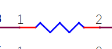
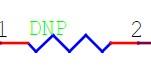
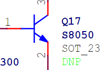
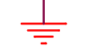
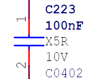
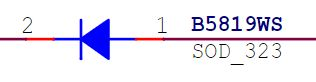
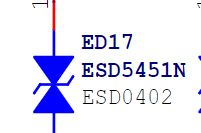
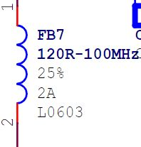
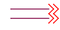

# 一、

## 电阻
[[RK3568（linux学习）/rk3568芯片开发/开发板硬件开发/assets/电路原理图符号解析/file-20250810171700431.png|Open: Pasted image 20250730222852.png]]

### 1、作用
- 1 电阻器的作用是 **限制电流流动**，根据欧姆定律 I=V/RI = V/RI=V/R 控制电路中电压与电流的关系。

### 2、标上DNP
[[RK3568（linux学习）/rk3568芯片开发/开发板硬件开发/assets/电路原理图符号解析/file-20250810171700649.png|Open: Pasted image 20250730223342.png]]

- 1 图中所画的电阻或其他元件实际不会被焊上，焊盘保持空白，因此对应线路也就**是开路**状态

### 3、

## 晶体管
[[RK3568（linux学习）/rk3568芯片开发/开发板硬件开发/assets/电路原理图符号解析/file-20250810171700797.png|Open: Pasted image 20250730223517.png]]

- 1 ①b基极      ②e放大极     ③c集电极

### 1、Q17 (S8050, SOT‑23)（NPN 型晶体管）

### 2、工作模式一：开关（Switch）

- **基极电流 Ib = 0 mA** → 晶体管处于截断区，集电极不导电，OFF 状态。
    
- **基极电流足够大** → 晶体管进入饱和区，Ic ≈ β·Ib，集电极电流达最大，晶体管导通，ON 状态。此时 V_CE 降至最低（饱和压降 ≈ 0.1–0.2 V）。[Basic Electronics Tutorials](https://www.electronics-tutorials.ws/transistor/tran_4.html?utm_source=chatgpt.com)[Electrical Engineering Stack Exchange](https://electronics.stackexchange.com/questions/501156/when-does-a-transistor-act-as-a-switch-and-when-as-an-amplifier?utm_source=chatgpt.com)

### 3、工作模式二：放大（Amplifier）

- 在 **共射极（Common‑Emitter）结构下**，晶体管可将基极的小量模拟信号放大为集电极输出的更强信号。
    
- **偏置电流 Ib** 控制集电极电流 Ic，且 Ic = β × Ib（β 即直流电流放大倍数）。
    
- 输出电压随 Ic 而变化，通常与输入信号 **反向（相位反转 180°）**，电压增益 Av ≈ –β·RC/RB（简化版本）。

### 4. 对比总结

| 模式       | 状态区域         | 基极电流 Ib | 集电极电流 Ic    | 应用场景         |
| -------- | ------------ | ------- | ----------- | ------------ |
| **开关模式** | 截断 or 饱和     | 0 或 很高  | 0 或 最大化     | 驱动负载（灯、继电器）  |
| **放大模式** | 放大线性区 Active | 小电流连续变化 | Ic ∝ Ib × β | 信号增强（音频、传感器） |

## 接地符号
[[RK3568（linux学习）/rk3568芯片开发/开发板硬件开发/assets/电路原理图符号解析/file-20250810171701045.png|Open: Pasted image 20250730223710.png]]

### 1、

##  电容​
[[RK3568（linux学习）/rk3568芯片开发/开发板硬件开发/assets/电路原理图符号解析/file-20250810171701158.png|Open: Pasted image 20250730224601.png]]

### 1、**双红线引线​**​：实体电路中的物理引脚

### 2、**引脚编号​**​：

- ​**​①​**​：标注"1" → 通常定义为​**​高电位端​**​
- ​**​②​**​：标注"2" → 通常定义为​**​低电位端或接地端​**

### 3、 **参数深度解读​**​

| 参数项           | 含义       | 技术细节                         |
| ------------- | -------- | ---------------------------- |
| ​**​C223​**​  | 元件位号     | 设计图中唯一标识符（C=电容，223=序列号）      |
| ​**​100nF​**​ | 电容值      | = 0.1μF（±20%容差，除非另有标注）       |
| ​**​X5R​**​   | 介质材料温度特性 | 工作范围：-55℃~+85℃（ΔC/C₀ ≤ ±15%） |
| ​**​10V​**​   | 额定直流电压   | 超出此值可能击穿（实际使用需30%降额）         |
| ​**​C0402​**​ | 封装尺寸     | 公制1005（1.0×0.5mm），贴片焊接专用     |

### 4、**封装尺寸对照​**​

| 封装代码  | 公制尺寸(mm) | 英制(mil) | 适用场景        |
| ----- | -------- | ------- | ----------- |
| C0402 | 1.0×0.5  | 0402    | 手机/穿戴设备高密度板 |
| C0603 | 1.6×0.8  | 0603    | 消费电子通用设计    |
| C0805 | 2.0×1.25 | 0805    | 电源模块/工业设备   |

## ### 单向TVS二极管
[[RK3568（linux学习）/rk3568芯片开发/开发板硬件开发/assets/电路原理图符号解析/file-20250810171701418.png|Open: Pasted image 20250730225325.png]]

### 1、符号解析​
> - **阴极（引脚2·红色线）​**​：连接​**​电路低电位端​**​（如GND或电源负极）
> - ​**​阳极（引脚1·蓝色线）​**​：连接​**​信号/电源正端​**​（需整流的电路）
> - ​**​箭头方向​**​：指示​**​电流流动方向​**​（从阳极→阴极）

### 2、​整流功能（核心）​
> - ​**​正向导通​**​：电流从阳极→阴极（低压降0.55V）
> - ​**​反向截止​**​：阻断反向电流（耐压100V）

### 3、

## 双向TVS/ESD保护器件
[[RK3568（linux学习）/rk3568芯片开发/开发板硬件开发/assets/电路原理图符号解析/file-20250810171701543.png|Open: Pasted image 20250730225345.png]]

### 1、可同时抑制​**​正向浪涌​**​（+电压冲击）与​**​负向浪涌​**​（-电压冲击），适用于：
> - 差分信号线（USB、HDMI）
> - 交流电源端口（如RS-485）

### 2、符号解析​
> - ​**​双箭头结构​**​：无极性设计，可双向导通（正/负电压冲击均有效）
> - ​**​核心作用​**​：​**​静电防护（ESD）​**​ 与 ​**​瞬态电压抑制（TVS）​**​

### 3、关键参数解析​​

|参数|值/含义|工程意义|
|---|---|---|
|​**​型号​**​|ESD5451N|4通道阵列（可同时保护4路信号）|
|​**​封装​**​|ESD0402|超小尺寸（1.0×0.5mm），高频适用|
|​**​工作电压​**​|Vrwm=17V (ED17)|正常信号电压≤17V时保持高阻态|
|​**​钳位电压​**​|Vc=30V@8kV ESD|将静电电压强制压缩至30V以下|
|​**​结电容​**​|0.3pF（典型值）|几乎不影响高速信号（USB3.0适用）|

## 电感器
[[RK3568（linux学习）/rk3568芯片开发/开发板硬件开发/assets/电路原理图符号解析/file-20250810171701779.png|Open: Pasted image 20250730230711.png]]

### 1、核心作用​

1. ​**​高频滤波（核心功能）​**​
    
    - 对 ​**​＞100MHz​**​ 高频噪声呈现 ​**​高阻抗（120Ω）​**​ → 阻挡射频干扰
    - 允许 ​**​直流和低频信号​**​ 无障碍通过（损耗＜2%）  
        ​**​典型应用​**​：  
        → 开关电源输出滤波（抑制EMI）  
        → 射频模块的阻抗匹配
2. ​**​能量缓冲​**​
    
    - 电流突变时释放储能 → 稳定电路电流（尤其应对 ​**​2A脉冲负载​**​）

### 2、

### 3、

## 

### 1、

### 2、

### 3、

# 二、

## 平行双线​锯齿箭头​
[[RK3568（linux学习）/rk3568芯片开发/开发板硬件开发/assets/电路原理图符号解析/file-20250810171701888.png|Open: Pasted image 20250802152040.png]]

### 1、
> 1. 平行双线 + 锯齿箭头 = ​**​主动驱动的差分信号​**​。
> 2. 箭头方向 = ​**​信号流向​**​。

### 2、

### 3、

## 功能分类标注
[[RK3568（linux学习）/rk3568芯片开发/开发板硬件开发/assets/电路原理图符号解析/file-20250810171702181.png|Open: Pasted image 20250802155814.png]]

### 1、

### 2、

### 3、
## 

### 1、

### 2、

### 3、

## 

### 1、

### 2、

### 3、

## 

### 1、

### 2、

### 3、

## 

### 1、

### 2、

### 3、

## 

### 1、

### 2、

### 3、

## 

### 1、

### 2、

### 3、

# 三、

## 

### 1、

### 2、

### 3、

## 

### 1、

### 2、

### 3、
## 

### 1、

### 2、

### 3、

## 

### 1、

### 2、

### 3、

## 

### 1、

### 2、

### 3、

## 

### 1、

### 2、

### 3、

## 

### 1、

### 2、

### 3、

## 

### 1、

### 2、

### 3、

# 四、

## 

### 1、

### 2、

### 3、

## 

### 1、

### 2、

### 3、
## 

### 1、

### 2、

### 3、

## 

### 1、

### 2、

### 3、

## 

### 1、

### 2、

### 3、

## 

### 1、

### 2、

### 3、

## 

### 1、

### 2、

### 3、

## 

### 1、

### 2、

### 3、

# 一、

## 

### 1、

### 2、

### 3、

## 

### 1、

### 2、

### 3、
## 

### 1、

### 2、

### 3、

## 

### 1、

### 2、

### 3、

## 

### 1、

### 2、

### 3、

## 

### 1、

### 2、

### 3、

## 

### 1、

### 2、

### 3、

## 

### 1、

### 2、

### 3、

