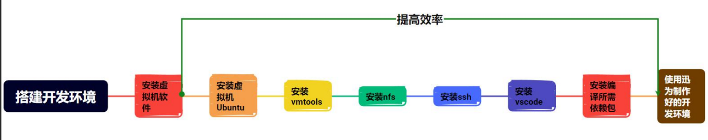
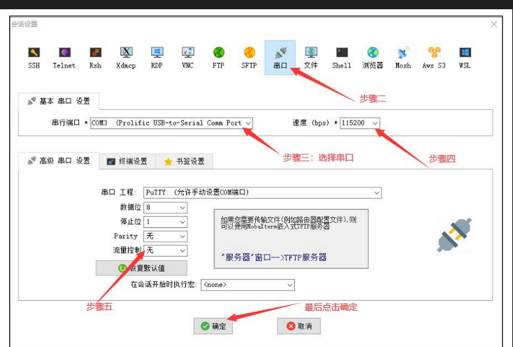
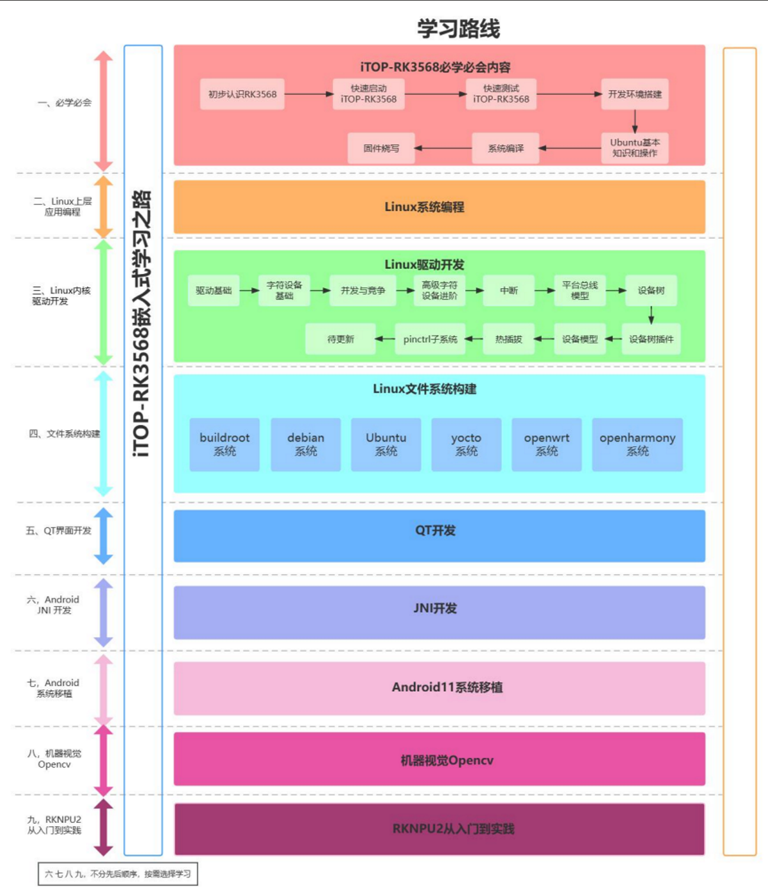

# 备注(声明)：

# 一、基本环境配置

## RK3568开发板-开发环境搭建
### 1 、搭建开发环境

#### 使用迅为提供 Ubuntu18要做的基础配置及功能使用教程
> [!PDF|important] [[03_【北京迅为】itop-3568开发板快速使用编译环境ubuntu18.04【底板v1.7】 v1.1_wrapper.pdf#page=11&selection=19,0,27,8&color=important|03_【北京迅为】itop-3568开发板快速使用编译环境ubuntu18.04【底板v1.7】 v1.1_wrapper, p.11]]
> > 第 2 章加载迅为提供 Ubuntu18
> 
> 

- 1 ubuntu18不要装搜狗。
- 1 编译linux源码时，记得把rk356x_linux文件夹去掉才行，不然会编译出错。

> 默认 ubuntu 安装 vscode,方便阅读和编辑代码  
> 2 默认 ubuntu 安装 ftp  
> 3 默认 ubuntu 安装 samba,共享文件夹位置是 /home/topeet/share， 用户名和密码均为  
> topeet  
> 4 默认 ubuntu 安装 ssh  
> 5 默认 ubuntu 安装代码对比软件 meld  
> 6 默认 ubuntu 设置数据源为阿里云  
> 7 默认 ubuntu 安装 nfs， nfs 目录为： /home/nfs  
> 8 默认 ubuntu 设置系统默认语言为中文  
> 9 默认 ubuntu 安装中文输入法， 方便客户编写代码注释  
> 10 默认 ubuntu 安装交叉编译工具， 交叉编译器的路径为： /home/topeet/topeet-qt5.14.2，  
> 单独的交叉编译器， 方便客户交叉编译 C 程序或者 QT 程序  
> 11 默认 ubuntu 安装 qtcreator， 并设置编译套件 kits， 方便客户开发 QT 程序。  
> 12 默认 ubuntu 安装编译依赖包， 客户只需要拷贝源码到 ubuntu 中， 可直接编译。  
> 13 默认 ubuntu 默认支持联网， 设置为桥接模式  
> 14 默认 ubuntu 内置交叉编译工具器， 可交叉编译 C 程序  
> 15 默认 ubuntu 默认设置内存为 8GB， 处理器内核总数为 4， 硬盘为 50GB。 这些选项需  
> 要客户根据自身电脑的配置进行修改。 以下的章节也会介绍修改方法

#### 从零搭建rk3568-ubuntu开发环境手册

> [!PDF|important] [[11_【北京迅为】itop-3568开发板从零搭建ubuntu开发环境手册【底板V1.7版】v1.0.pdf#page=10&selection=21,0,31,2&color=important|11_【北京迅为】itop-3568开发板从零搭建ubuntu开发环境手册【底板V1.7版】v1.0, p.10]]
> > 第 1 章安装虚拟机 VM 软件
> 
> 

### 2 、串口终端配置

### 3 、CSDN博客文章
[开发板，pc,ubuntu(虚拟机，vmware)通过网络互相连接-CSDN博客](https://blog.csdn.net/liannaiyuyi/article/details/142771435?ops_request_misc=&request_id=&biz_id=102&utm_term=%E8%AE%A9%E5%BC%80%E5%8F%91%E6%9D%BF%E5%92%8Cpc%E7%AB%AF%E4%BA%92%E8%81%94&utm_medium=distribute.pc_search_result.none-task-blog-2~all~sobaiduweb~default-1-142771435.142%5ev100%5epc_search_result_base8&spm=1018.2226.3001.4187)

### 4 、学习路线

### 5、

## 交叉编译 C 程序
> [!PDF|important] [[03_【北京迅为】itop-3568开发板快速使用编译环境ubuntu18.04【底板v1.7】 v1.1_wrapper.pdf#page=86&selection=19,0,31,2&color=important|03_【北京迅为】itop-3568开发板快速使用编译环境ubuntu18.04【底板v1.7】 v1.1_wrapper, p.86]]
> > 第 11 章 Ubuntu 交叉编译 C 程序
> 

### 1 、直接使用绝对路径编译
[“Ubuntu 交叉编译 C 程序”页上的图片](onenote:https://d.docs.live.net/52d4b76bb0ffcf51/Documents/\(RK3568\)Linux驱动开发/RK3568开发板环境配置.one#Ubuntu%20交叉编译%20C%20程序&section-id={038AA812-2861-466E-8EB6-C7105A8D3369}&page-id={7E5B9E4F-7ADB-4364-820D-E7404DF96DD9}&object-id={F006497C-08F3-4B40-85AA-82A373B9C169}&21)  ([Web 视图](https://onedrive.live.com/view.aspx?resid=52D4B76BB0FFCF51%21se8c325913f784bf694d429e5ee2ab2be&id=documents&wd=target%28RK3568%E5%BC%80%E5%8F%91%E6%9D%BF%E7%8E%AF%E5%A2%83%E9%85%8D%E7%BD%AE.one%7C038AA812-2861-466E-8EB6-C7105A8D3369%2FUbuntu%20%E4%BA%A4%E5%8F%89%E7%BC%96%E8%AF%91%20C%20%E7%A8%8B%E5%BA%8F%7C7E5B9E4F-7ADB-4364-820D-E7404DF96DD9%2F%29&wdpartid=%7b850200D8-E7D3-4301-AF43-5CD45FF297D6%7d%7b1%7d&wdsectionfileid=52D4B76BB0FFCF51!s2889c39787b143f284cd3ac51dfa9aaa))

- 1 /usr/local/arm64/gcc-linaro-6.3.1-2017.05-x86_64_aarch64-linux-gnu/bin/aarch64-linux-gnu-gcc hello.c -o hello
### 2 、

### 3 、

## 开发板网络环境配置
### 1 、常用命令
- 1 ifconfig eth0 192.168.1.4

- 1 ifconfig eth1 192.168.1.4

- 1 ping 192.168.1.2

- 1 ping [www.baidu.com](http://www.baidu.com) -c 4

- 1 sudo ifconfig ens37 192.168.1.3

- 1 ssh root@192.168.1.4    通过ssh连接开发板
### 2 、迅为教程 - 开发板网线直连电脑配置方法（电脑wifi上网时）

> [!PDF|important] [[04_【北京迅为】itop-3568开发板网络环境配置手册【底板V1.7版】v1.0..pdf#page=48&selection=52,0,58,17&color=important|04_【北京迅为】itop-3568开发板网络环境配置手册【底板V1.7版】v1.0., p.48]]
> > 第 4 章开发板直连电脑配置方法（无线上网）
> 
> 

### 3 、网络基础知识学习
> [!PDF|important] [[04_【北京迅为】itop-3568开发板网络环境配置手册【底板V1.7版】v1.0..pdf#page=11&selection=17,0,23,8&color=important|04_【北京迅为】itop-3568开发板网络环境配置手册【底板V1.7版】v1.0., p.11]]
> > 第 1 章网络基础知识学习
> 
> 

- 1 相互 ping 通才可以使用 NFS 挂载远程主机的目录

- 1 查看防火墙状态
- 2 sudo ufw status
- 1 打开防火墙
- 2 sudo ufw enable
- 1 关闭防火墙
- 2 sudo ufw disable

### 4 、电脑、开发板直连交换机或路由器（未）
> [!PDF|important] [[04_【北京迅为】itop-3568开发板网络环境配置手册【底板V1.7版】v1.0..pdf#page=19&selection=17,0,23,15&color=important|04_【北京迅为】itop-3568开发板网络环境配置手册【底板V1.7版】v1.0., p.19]]
> > 第 2 章电脑、开发板直连交换机或路由器
> 
> 

### 5、开发板直连电脑配置方法（不能上外网）（未）
> [!PDF|important] [[04_【北京迅为】itop-3568开发板网络环境配置手册【底板V1.7版】v1.0..pdf#page=32&selection=17,0,23,17&color=important|04_【北京迅为】itop-3568开发板网络环境配置手册【底板V1.7版】v1.0., p.32]]
> > 第 3 章开发板直连电脑配置方法（不能上外网
> 
> 

### 6、

### 7、

### 8、

## 密码
### 1 、常用密码
- 1 topeet

- 1 rockchip      buildroot文件系统

### 2 、

### 3 、

## 核心板插拔
### 1 、参考文章
[RK3568开发笔记（一）：瑞芯微RK3568芯片介绍，入手开发板的核心板介绍 - 知乎](https://zhuanlan.zhihu.com/p/519521664)
### 2 、拔插操做
[“核心板插拔”页上的图片](onenote:https://d.docs.live.net/52d4b76bb0ffcf51/Documents/\(RK3568\)Linux驱动开发/RK3568开发板环境配置.one#核心板插拔&section-id={038AA812-2861-466E-8EB6-C7105A8D3369}&page-id={6A703687-1B33-4893-B6E2-AEE9B82382B9}&object-id={D4172DEB-568F-0422-3CB1-5FFEB292AE89}&58)  ([Web 视图](https://onedrive.live.com/view.aspx?resid=52D4B76BB0FFCF51%21se8c325913f784bf694d429e5ee2ab2be&id=documents&wd=target%28RK3568%E5%BC%80%E5%8F%91%E6%9D%BF%E7%8E%AF%E5%A2%83%E9%85%8D%E7%BD%AE.one%7C038AA812-2861-466E-8EB6-C7105A8D3369%2F%E6%A0%B8%E5%BF%83%E6%9D%BF%E6%8F%92%E6%8B%94%7C6A703687-1B33-4893-B6E2-AEE9B82382B9%2F%29&wdpartid=%7b7C01E589-AECD-0E61-32CF-00CEB9F3B29A%7d%7b1%7d&wdsectionfileid=52D4B76BB0FFCF51!s2889c39787b143f284cd3ac51dfa9aaa))

### 3 、

### 4 、

## Ubuntu塔建好的 QT 环境使用
> [!PDF|important] [[03_【北京迅为】itop-3568开发板快速使用编译环境ubuntu18.04【底板v1.7】 v1.1_wrapper.pdf#page=75&selection=19,0,31,4&color=important|03_【北京迅为】itop-3568开发板快速使用编译环境ubuntu18.04【底板v1.7】 v1.1_wrapper, p.75]]
> > 第 10 章 Ubuntu 搭建 QT 开发环境
> 
> 

### 1 、

### 2 、

### 3 、

### 4 、

### 5、

### 6、

### 7、

### 8、

# 二、window、Ubuntu、开发板文件互传参考手册（未）

## ubuntu 和 window 互传
> [!PDF|red] [[RK3568（linux学习）/rk3568芯片开发/assets/开发环境塔建配置/file-20250810171706422.pdf#page=9&selection=21,0,33,2&color=red|34_【北京迅为】itop-3568开发板window Ubuntu开发板文件互传参考手册【底板V1.7版】v1.1, p.9]]
> > 第 1 章 ubuntu 和 window 互传
> 
> 
### 1 、

### 2 、

### 3 、

### 4 、

### 5、

### 6、

### 7、

### 8、

## windows 与开发板互传

> [!PDF|red] [[RK3568（linux学习）/rk3568芯片开发/assets/开发环境塔建配置/file-20250810171706422.pdf#page=22&selection=21,0,29,6&color=red|34_【北京迅为】itop-3568开发板window Ubuntu开发板文件互传参考手册【底板V1.7版】v1.1, p.22]]
> > 第 2 章 windows 与开发板互传
> 
> 
### 1 、使用 SFTP 互传
> [!PDF|note] [[RK3568（linux学习）/rk3568芯片开发/assets/开发环境塔建配置/file-20250810171706422.pdf#page=22&selection=0,10,37,2&color=note|34_【北京迅为】itop-3568开发板window Ubuntu开发板文件互传参考手册【底板V1.7版】v1.1, p.22]]
> > 北京迅为电子有限公司 itop-3568 开发板 window Ubuntu 开发板文件互传参考手册日期：2022-1-17 www.topeetboard.com22 第 2 章 windows 与开发板互传 2.1 使用 SFTP 互传
> 
> 

### 2 、使用 scp 指令互传
> [!PDF|note] [[RK3568（linux学习）/rk3568芯片开发/assets/开发环境塔建配置/file-20250810171706422.pdf#page=23&selection=66,0,72,4&color=note|34_【北京迅为】itop-3568开发板window Ubuntu开发板文件互传参考手册【底板V1.7版】v1.1, p.23]]
> > 2.2 使用 scp 指令互传
> 
> 

### 3 、使用 U 盘进行拷贝
> [!PDF|note] [[RK3568（linux学习）/rk3568芯片开发/assets/开发环境塔建配置/file-20250810171706422.pdf#page=26&selection=21,0,27,5&color=note|34_【北京迅为】itop-3568开发板window Ubuntu开发板文件互传参考手册【底板V1.7版】v1.1, p.26]]
> > 2.3 使用 U 盘进行拷贝
> 
> 

### 4 、

### 5、

### 6、

### 7、

### 8、

##  Ubuntu 与开发板互传
> [!PDF|red] [[RK3568（linux学习）/rk3568芯片开发/assets/开发环境塔建配置/file-20250810171706422.pdf#page=27&selection=57,0,65,6&color=red|34_【北京迅为】itop-3568开发板window Ubuntu开发板文件互传参考手册【底板V1.7版】v1.1, p.27]]
> > 第 3 章 Ubuntu 与开发板互传
> 
> 
### 1 、

### 2 、

### 3 、

### 4 、

### 5、

### 6、

### 7、

### 8、

# 三、

## 
### 1 、

### 2 、

### 3 、

### 4 、

### 5、

### 6、

### 7、

### 8、

## 
### 1 、

### 2 、

### 3 、

### 4 、
### 5、

### 6、

### 7、

### 8、

## 
### 1 、

### 2 、

### 3 、

### 4 、

### 5、

### 6、

### 7、

### 8、

# 四、

## 
### 1 、

### 2 、

### 3 、

### 4 、

### 5、

### 6、

### 7、

### 8、

## 
### 1 、

### 2 、

### 3 、

### 4 、
### 5、

### 6、

### 7、

### 8、

## 
### 1 、

### 2 、

### 3 、

### 4 、

### 5、

### 6、

### 7、

### 8、

# 五、

## 
### 1 、

### 2 、

### 3 、

### 4 、

### 5、

### 6、

### 7、

### 8、

## 
### 1 、

### 2 、

### 3 、

### 4 、
### 5、

### 6、

### 7、

### 8、

## 
### 1 、

### 2 、

### 3 、

### 4 、

### 5、

### 6、

### 7、

### 8、

