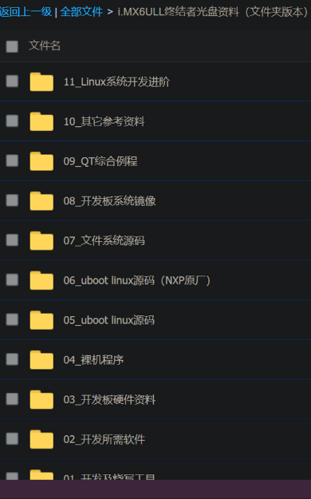
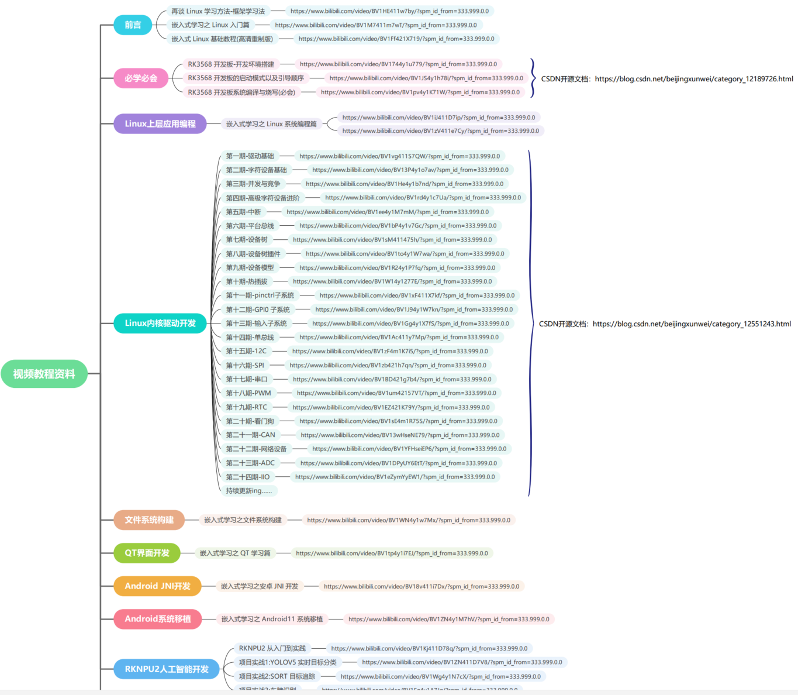
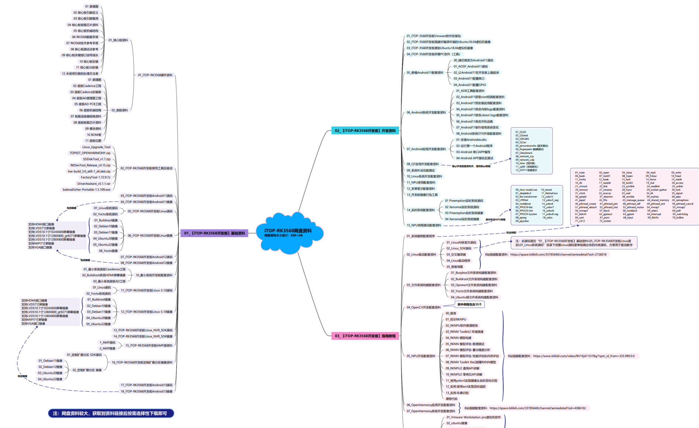
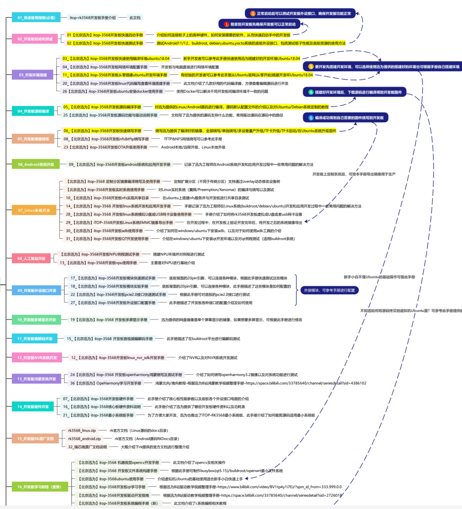

# 备注(声明)：


# 一、i.MX6ULL开发资料

## i.MX6ULL终结者开发资料
### 1 、i.MX6ULL终结者视频教程
```cardlink
url: https://pan.baidu.com/s/1qWv0xmAbEzy9Yw-oGnILSw
title: "百度网盘 请输入提取码"
description: "百度网盘为您提供文件的网络备份、同步和分享服务。空间大、速度快、安全稳固，支持教育网加速，支持手机端。注册使用百度网盘即可享受免费存储空间"
host: pan.baidu.com
```
 提取码：fw6f


### 2 、i.MX6ULL终结者开发板使用手册

```cardlink
url: https://pan.baidu.com/s/1ebll7ZoEmn8_PtFs8UD1uA#list/path=%2F
title: "百度网盘 请输入提取码"
description: "百度网盘为您提供文件的网络备份、同步和分享服务。空间大、速度快、安全稳固，支持教育网加速，支持手机端。注册使用百度网盘即可享受免费存储空间"
host: pan.baidu.com
```


### 3 、i.MX6ULL终结者光盘资料（文件夹版本）
```cardlink
url: https://pan.baidu.com/s/1bnwO2svt69ECN_FB7h9b9A#list/path=%2F
title: "百度网盘 请输入提取码"
description: "百度网盘为您提供文件的网络备份、同步和分享服务。空间大、速度快、安全稳固，支持教育网加速，支持手机端。注册使用百度网盘即可享受免费存储空间"
host: pan.baidu.com
```


### 4 、


# 二、RK3568开发资料

## 【iTOP-RK3568开发板】迅为网盘资料
[【iTOP-RK3568开发板】指南教程](onenote:https://d.docs.live.net/52d4b76bb0ffcf51/Documents/网盘链接/linux驱动学习资料.one#【iTOP-RK3568开发板】指南教程&section-id={21438A02-AFA5-46E7-875F-B7435F3F7802}&page-id={6BF5601E-3F8E-4678-8E9E-1024A84F821B}&end)  ([Web 视图](https://onedrive.live.com/view.aspx?resid=52D4B76BB0FFCF51%21sc3c9077b69b041c3a6c850e37b2aeee0&id=documents&wd=target%28linux%E9%A9%B1%E5%8A%A8%E5%AD%A6%E4%B9%A0%E8%B5%84%E6%96%99.one%7C21438A02-AFA5-46E7-875F-B7435F3F7802%2F%E3%80%90iTOP-RK3568%E5%BC%80%E5%8F%91%E6%9D%BF%E3%80%91%E6%8C%87%E5%8D%97%E6%95%99%E7%A8%8B%7C6BF5601E-3F8E-4678-8E9E-1024A84F821B%2F%29&wdpartid=%7bEAFCE22F-4835-4C2D-B0D6-55D84592056C%7d%7b1%7d&wdsectionfileid=52D4B76BB0FFCF51!s137e7d617c3a431a94b2dcd7a9053537))

## RK3568核心板 — 正点原子资料下载中心 1.0.0 文档
[RK3568核心板 — 正点原子资料下载中心 1.0.0 文档](onenote:https://d.docs.live.net/52d4b76bb0ffcf51/Documents/网盘链接/linux驱动学习资料.one#RK3568核心板%20—%20正点原子资料下载中心%201.0.0%20文档&section-id={21438A02-AFA5-46E7-875F-B7435F3F7802}&page-id={86C37BF9-ABC1-4D97-A889-A451165B532D}&end)  ([Web 视图](https://onedrive.live.com/view.aspx?resid=52D4B76BB0FFCF51%21sc3c9077b69b041c3a6c850e37b2aeee0&id=documents&wd=target%28linux%E9%A9%B1%E5%8A%A8%E5%AD%A6%E4%B9%A0%E8%B5%84%E6%96%99.one%7C21438A02-AFA5-46E7-875F-B7435F3F7802%2FRK3568%E6%A0%B8%E5%BF%83%E6%9D%BF%20%E2%80%94%20%E6%AD%A3%E7%82%B9%E5%8E%9F%E5%AD%90%E8%B5%84%E6%96%99%E4%B8%8B%E8%BD%BD%E4%B8%AD%E5%BF%83%201.0.0%20%E6%96%87%E6%A1%A3%7C86C37BF9-ABC1-4D97-A889-A451165B532D%2F%29&wdpartid=%7b65CE873D-C128-03F1-192D-73FF3F490CB3%7d%7b1%7d&wdsectionfileid=52D4B76BB0FFCF51!s137e7d617c3a431a94b2dcd7a9053537))

## RK3568开发板 — 正点原子资料下载中心 1.0.0 文档
[RK3568开发板 — 正点原子资料下载中心 1.0.0 文档](onenote:https://d.docs.live.net/52d4b76bb0ffcf51/Documents/网盘链接/linux驱动学习资料.one#RK3568开发板%20—%20正点原子资料下载中心%201.0.0%20文档&section-id={21438A02-AFA5-46E7-875F-B7435F3F7802}&page-id={AAE00A19-7903-4B37-A4E2-B4768DC62F72}&end)  ([Web 视图](https://onedrive.live.com/view.aspx?resid=52D4B76BB0FFCF51%21sc3c9077b69b041c3a6c850e37b2aeee0&id=documents&wd=target%28linux%E9%A9%B1%E5%8A%A8%E5%AD%A6%E4%B9%A0%E8%B5%84%E6%96%99.one%7C21438A02-AFA5-46E7-875F-B7435F3F7802%2FRK3568%E5%BC%80%E5%8F%91%E6%9D%BF%20%E2%80%94%20%E6%AD%A3%E7%82%B9%E5%8E%9F%E5%AD%90%E8%B5%84%E6%96%99%E4%B8%8B%E8%BD%BD%E4%B8%AD%E5%BF%83%201.0.0%20%E6%96%87%E6%A1%A3%7CAAE00A19-7903-4B37-A4E2-B4768DC62F72%2F%29&wdpartid=%7b3CF7863C-378A-0748-2AE5-974C5F12D9FA%7d%7b1%7d&wdsectionfileid=52D4B76BB0FFCF51!s137e7d617c3a431a94b2dcd7a9053537))

## IMX415摄像头模块 - 正点原子资料下载中心 1.0.0 文档
[IMX415摄像头模块 — 正点原子资料下载中心 1.0.0 文档](onenote:https://d.docs.live.net/52d4b76bb0ffcf51/Documents/网盘链接/linux驱动学习资料.one#IMX415摄像头模块%20—%20正点原子资料下载中心%201.0.0%20文档&section-id={21438A02-AFA5-46E7-875F-B7435F3F7802}&page-id={9196A640-7AA3-40BA-AC06-899C19E6FCA3}&end)  ([Web 视图](https://onedrive.live.com/view.aspx?resid=52D4B76BB0FFCF51%21sc3c9077b69b041c3a6c850e37b2aeee0&id=documents&wd=target%28linux%E9%A9%B1%E5%8A%A8%E5%AD%A6%E4%B9%A0%E8%B5%84%E6%96%99.one%7C21438A02-AFA5-46E7-875F-B7435F3F7802%2FIMX415%E6%91%84%E5%83%8F%E5%A4%B4%E6%A8%A1%E5%9D%97%20%E2%80%94%20%E6%AD%A3%E7%82%B9%E5%8E%9F%E5%AD%90%E8%B5%84%E6%96%99%E4%B8%8B%E8%BD%BD%E4%B8%AD%E5%BF%83%201.0.0%20%E6%96%87%E6%A1%A3%7C9196A640-7AA3-40BA-AC06-899C19E6FCA3%2F%29&wdpartid=%7bD42E5635-96FD-05B2-3389-E6B75039280D%7d%7b1%7d&wdsectionfileid=52D4B76BB0FFCF51!s137e7d617c3a431a94b2dcd7a9053537))


## wifi驱动以及Wireless Toolsl工具移植
[wifi驱动以及Wireless Toolsl工具移植](onenote:https://d.docs.live.net/52d4b76bb0ffcf51/Documents/网盘链接/linux驱动学习资料.one#wifi驱动以及Wireless%20Toolsl工具移植&section-id={21438A02-AFA5-46E7-875F-B7435F3F7802}&page-id={415229A4-3462-4A28-8D29-BD3EB2D4BA5C}&end)  ([Web 视图](https://onedrive.live.com/view.aspx?resid=52D4B76BB0FFCF51%21sc3c9077b69b041c3a6c850e37b2aeee0&id=documents&wd=target%28linux%E9%A9%B1%E5%8A%A8%E5%AD%A6%E4%B9%A0%E8%B5%84%E6%96%99.one%7C21438A02-AFA5-46E7-875F-B7435F3F7802%2Fwifi%E9%A9%B1%E5%8A%A8%E4%BB%A5%E5%8F%8AWireless%20Toolsl%E5%B7%A5%E5%85%B7%E7%A7%BB%E6%A4%8D%7C415229A4-3462-4A28-8D29-BD3EB2D4BA5C%2F%29&wdpartid=%7bB63E2FDA-8769-05F9-1D34-1C5F41B54680%7d%7b1%7d&wdsectionfileid=52D4B76BB0FFCF51!s137e7d617c3a431a94b2dcd7a9053537))

## 迅为CSDN开源文档

```cardlink
url: https://blog.csdn.net/beijingxunwei/category_12189726_3.html
title: "iTOP-RK3568开发板开发_北京迅为的博客-CSDN博客"
description: "RK3568驱动指南｜第十篇 热插拔-第114章 内核发送事件到用户空间的方法,RK3568驱动指南｜第十篇 热插拔-第113章 内核是如何发送事件到用户空间,RK3568驱动指南｜第十篇 热插拔-第112章 热插拔简介,嵌入式硬件"
host: blog.csdn.net
```


# 三、linux开发扩展资料

## 麦子学院嵌入式开发工程师
[麦子学院嵌入式开发工程师](onenote:https://d.docs.live.net/52d4b76bb0ffcf51/Documents/网盘链接/linux驱动学习资料.one#麦子学院嵌入式开发工程师&section-id={21438A02-AFA5-46E7-875F-B7435F3F7802}&page-id={9B266CE2-FB1D-4CE9-B071-BFC73F43E425}&end)  ([Web 视图](https://onedrive.live.com/view.aspx?resid=52D4B76BB0FFCF51%21sc3c9077b69b041c3a6c850e37b2aeee0&id=documents&wd=target%28linux%E9%A9%B1%E5%8A%A8%E5%AD%A6%E4%B9%A0%E8%B5%84%E6%96%99.one%7C21438A02-AFA5-46E7-875F-B7435F3F7802%2F%E9%BA%A6%E5%AD%90%E5%AD%A6%E9%99%A2%E5%B5%8C%E5%85%A5%E5%BC%8F%E5%BC%80%E5%8F%91%E5%B7%A5%E7%A8%8B%E5%B8%88%7C9B266CE2-FB1D-4CE9-B071-BFC73F43E425%2F%29&wdpartid=%7bF4F74A68-1CBC-0300-16CC-DB23AF2E3C1C%7d%7b1%7d&wdsectionfileid=52D4B76BB0FFCF51!s137e7d617c3a431a94b2dcd7a9053537))


## 粤嵌嵌入式2025开发课程(介绍)
[粤嵌嵌入式2025开发课程(介绍)](onenote:https://d.docs.live.net/52d4b76bb0ffcf51/Documents/网盘链接/linux驱动学习资料.one#粤嵌嵌入式2025开发课程\(介绍\)&section-id={21438A02-AFA5-46E7-875F-B7435F3F7802}&page-id={71BFCF67-A56D-471B-B0FE-422E63EA6BF6}&end)  ([Web 视图](https://onedrive.live.com/view.aspx?resid=52D4B76BB0FFCF51%21sc3c9077b69b041c3a6c850e37b2aeee0&id=documents&wd=target%28linux%E9%A9%B1%E5%8A%A8%E5%AD%A6%E4%B9%A0%E8%B5%84%E6%96%99.one%7C21438A02-AFA5-46E7-875F-B7435F3F7802%2F%E7%B2%A4%E5%B5%8C%E5%B5%8C%E5%85%A5%E5%BC%8F2025%E5%BC%80%E5%8F%91%E8%AF%BE%E7%A8%8B%28%E4%BB%8B%E7%BB%8D%5C%29%7C71BFCF67-A56D-471B-B0FE-422E63EA6BF6%2F%29&wdpartid=%7b56AC8B15-3736-0AB8-29ED-E3ED4FB9B518%7d%7b1%7d&wdsectionfileid=52D4B76BB0FFCF51!s137e7d617c3a431a94b2dcd7a9053537))

## 内核学习资料
[内核学习资料](onenote:https://d.docs.live.net/52d4b76bb0ffcf51/Documents/网盘链接/linux驱动学习资料.one#内核学习资料&section-id={21438A02-AFA5-46E7-875F-B7435F3F7802}&page-id={92BB27C8-D8DC-4E2C-8703-2D501D4B7394}&end)  ([Web 视图](https://onedrive.live.com/view.aspx?resid=52D4B76BB0FFCF51%21sc3c9077b69b041c3a6c850e37b2aeee0&id=documents&wd=target%28linux%E9%A9%B1%E5%8A%A8%E5%AD%A6%E4%B9%A0%E8%B5%84%E6%96%99.one%7C21438A02-AFA5-46E7-875F-B7435F3F7802%2F%E5%86%85%E6%A0%B8%E5%AD%A6%E4%B9%A0%E8%B5%84%E6%96%99%7C92BB27C8-D8DC-4E2C-8703-2D501D4B7394%2F%29&wdpartid=%7bF20FD6D1-A02E-08F1-17C9-1EFC45D6EF64%7d%7b1%7d&wdsectionfileid=52D4B76BB0FFCF51!s137e7d617c3a431a94b2dcd7a9053537))


## OpenEdv-开源电子网-正点原子论坛
```cardlink
url: http://www.openedv.com/
title: "OpenEdv-��Դ������-����ԭ����̳"
description: "OpenEdv-��Դ������,��Դ������̳,ԭ�Ӹ���̳,STM32ѧϰ��̳,����ԭ����̳�����Ӽ�����Դ������רעSTM32/8������,FPGA,ARM Linux,51��Ƭ��,ARM,FPGA,DSP�Ȱ�顣"
host: www.openedv.com
```


## Qt综合项目开发教程(订阅的链接)
[Qt综合项目开发教程(订阅的链接)](onenote:https://d.docs.live.net/52d4b76bb0ffcf51/Documents/网盘链接/linux驱动学习资料.one#Qt综合项目开发教程\(订阅的链接\)&section-id={21438A02-AFA5-46E7-875F-B7435F3F7802}&page-id={D0EEEBAD-5078-4689-966F-F55694095F2B}&end)  ([Web 视图](https://onedrive.live.com/view.aspx?resid=52D4B76BB0FFCF51%21sc3c9077b69b041c3a6c850e37b2aeee0&id=documents&wd=target%28linux%E9%A9%B1%E5%8A%A8%E5%AD%A6%E4%B9%A0%E8%B5%84%E6%96%99.one%7C21438A02-AFA5-46E7-875F-B7435F3F7802%2FQt%E7%BB%BC%E5%90%88%E9%A1%B9%E7%9B%AE%E5%BC%80%E5%8F%91%E6%95%99%E7%A8%8B%28%E8%AE%A2%E9%98%85%E7%9A%84%E9%93%BE%E6%8E%A5%5C%29%7CD0EEEBAD-5078-4689-966F-F55694095F2B%2F%29&wdpartid=%7bC28E5E95-7F93-0DB0-1837-ABB4F4269376%7d%7b1%7d&wdsectionfileid=52D4B76BB0FFCF51!s137e7d617c3a431a94b2dcd7a9053537))

# 四、常用资料整理与归纳

## 视频资料
### 1 、视频教程总览
> [!PDF|important] [[RK3568（linux学习）/rk3568芯片开发/开发资料收集与整理/assets/开发资料收集与介绍/file-20250810171713232.pdf#page=1&selection=0,6,0,6&color=important|视频教程总览, p.1]]
> > 视频教程资料
> 
> 
[[RK3568（linux学习）/rk3568芯片开发/开发资料收集与整理/assets/开发资料收集与介绍/file-20250810171713263.png|Open: Pasted image 20250720211401.png]]


### 2 、开发板视频教程介绍
> [!PDF|red] [[RK3568（linux学习）/rk3568芯片开发/开发资料收集与整理/assets/开发资料收集与介绍/file-20250810171713425.pdf#page=17&selection=124,1,126,7&color=red|itop-rk3568指导手册-资料介绍v1.1, p.17]]
> > .3 开发板视频教程
> 
> 


## 网盘资料
### 1 、网盘资料总揽
> [!PDF|important] [[RK3568（linux学习）/rk3568芯片开发/开发资料收集与整理/assets/开发资料收集与介绍/file-20250810171713493.pdf#page=1&selection=14,1,14,15&color=important|网盘资料, p.1]]
> > TOP-RK3568网盘资料
> 
> [[RK3568（linux学习）/rk3568芯片开发/开发资料收集与整理/assets/开发资料收集与介绍/file-20250810171713559.png|Open: Pasted image 20250720211434.png]]



### 2 、开发板网盘资料介绍
> [!PDF|red] [[RK3568（linux学习）/rk3568芯片开发/开发资料收集与整理/assets/开发资料收集与介绍/file-20250810171713425.pdf#page=13&selection=0,10,215,7&color=red|itop-rk3568指导手册-资料介绍v1.1, p.13]]
> >。 2.2 开发板网盘资料
> 
> 


## 文档资料
### 1 、文档资料总揽
> [!PDF|important] [[RK3568（linux学习）/rk3568芯片开发/开发资料收集与整理/assets/开发资料收集与介绍/file-20250810171713733.pdf#page=1&selection=0,22,6,16&color=important|文档总览, p.1]]
> > 新手小白不懂Ubuntu的基础操作可看此手册不知道如何将源码拷贝到虚拟机Ubuntu里？可参考此手册提供的方法开发板上定制系统后，可按本手册导出镜像用于生产 iTOP-RK3568开发板手册
> 
> [[RK3568（linux学习）/rk3568芯片开发/开发资料收集与整理/assets/开发资料收集与介绍/file-20250810171713799.png|Open: Pasted image 20250720211736.png]]



### 2 、开发板使用手册介绍
> [!PDF|red] [[RK3568（linux学习）/rk3568芯片开发/开发资料收集与整理/assets/开发资料收集与介绍/file-20250810171713425.pdf#page=6&selection=26,0,28,7&color=red|itop-rk3568指导手册-资料介绍v1.1, p.6]]
> > 2.1 开发板使用手册
> 
> 


# 五、

## b站up主
### 1 、立芯嵌入式

```cardlink
url: https://space.bilibili.com/1798598537
title: "立芯嵌入式的个人空间-立芯嵌入式个人主页-哔哩哔哩视频"
description: "哔哩哔哩立芯嵌入式的个人空间，提供立芯嵌入式分享的视频、音频、文章、动态、收藏等内容，关注立芯嵌入式账号，第一时间了解UP主动态。嵌入式 | 零基础入门 | 驱动架构 | 内核研究 | 大厂开发方法论 | 诊断方法 | 嵌入式英语 | LVGL"
host: space.bilibili.com
```


### 2 、


### 3 、


### 4 、


### 5、


### 6、


### 7、


### 8、


## 

### 1 、


### 2 、


### 3 、

### 4 、
### 5、


### 6、


### 7、


### 8、


## 
### 1 、


### 2 、


### 3 、

### 4 、

### 5、


### 6、


### 7、


### 8、


