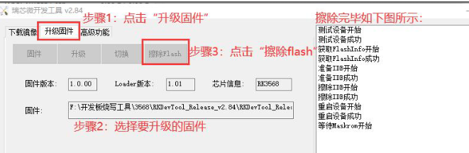
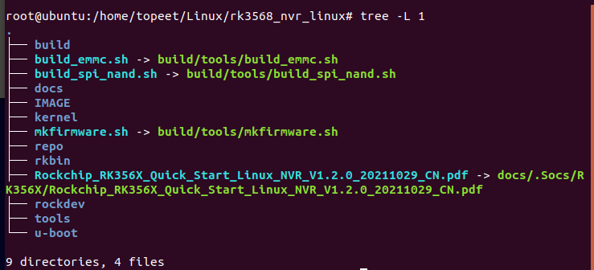
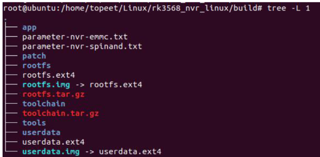

# 备注(声明)：

## 视频链接 -  RK3568 开发板学习系统编译与烧写系列教程
> [!PDF|important] [[05_【北京迅为】itop-3568开发板源码编译手册【底板v1.7版】v1.9.pdf#page=169&selection=18,0,20,4&color=important|05_【北京迅为】itop-3568开发板源码编译手册【底板v1.7版】v1.9, p.169]]
> > 附录一视频链接
> 
> 


# 一、基础知识（通用）

## RK3568开发板启动模式以及引导顺序
### 1 、开发板的三种启动模式
[“RK3568开发板启动模式以及引导顺序”页上的图片](onenote:https://d.docs.live.net/52d4b76bb0ffcf51/Documents/\(RK3568\)Linux驱动开发/RK3568开发板系统编译与烧写（必会）.one#RK3568开发板启动模式以及引导顺序&section-id={BDB91247-4F14-45C9-B991-69FAE69228C8}&page-id={33AD0DDE-9C99-45F6-8E15-8205AD764521}&object-id={30FD7B61-BD42-4E61-89F2-0D7F0B25138E}&27)  ([Web 视图](https://onedrive.live.com/view.aspx?resid=52D4B76BB0FFCF51%21se8c325913f784bf694d429e5ee2ab2be&id=documents&wd=target%28RK3568%E5%BC%80%E5%8F%91%E6%9D%BF%E7%B3%BB%E7%BB%9F%E7%BC%96%E8%AF%91%E4%B8%8E%E7%83%A7%E5%86%99%EF%BC%88%E5%BF%85%E4%BC%9A%EF%BC%89.one%7CBDB91247-4F14-45C9-B991-69FAE69228C8%2FRK3568%E5%BC%80%E5%8F%91%E6%9D%BF%E5%90%AF%E5%8A%A8%E6%A8%A1%E5%BC%8F%E4%BB%A5%E5%8F%8A%E5%BC%95%E5%AF%BC%E9%A1%BA%E5%BA%8F%7C33AD0DDE-9C99-45F6-8E15-8205AD764521%2F%29&wdpartid=%7b2C32C29C-9EB1-468E-8230-34E69632FFD2%7d%7b1%7d&wdsectionfileid=52D4B76BB0FFCF51!sbbd4d1fac7c842aa8c3052c9791cfa83))

### 2 、RK3568引导顺序（?）
[“RK3568开发板启动模式以及引导顺序”页上的图片](onenote:https://d.docs.live.net/52d4b76bb0ffcf51/Documents/\(RK3568\)Linux驱动开发/RK3568开发板系统编译与烧写（必会）.one#RK3568开发板启动模式以及引导顺序&section-id={BDB91247-4F14-45C9-B991-69FAE69228C8}&page-id={33AD0DDE-9C99-45F6-8E15-8205AD764521}&object-id={30FD7B61-BD42-4E61-89F2-0D7F0B25138E}&30)  ([Web 视图](https://onedrive.live.com/view.aspx?resid=52D4B76BB0FFCF51%21se8c325913f784bf694d429e5ee2ab2be&id=documents&wd=target%28RK3568%E5%BC%80%E5%8F%91%E6%9D%BF%E7%B3%BB%E7%BB%9F%E7%BC%96%E8%AF%91%E4%B8%8E%E7%83%A7%E5%86%99%EF%BC%88%E5%BF%85%E4%BC%9A%EF%BC%89.one%7CBDB91247-4F14-45C9-B991-69FAE69228C8%2FRK3568%E5%BC%80%E5%8F%91%E6%9D%BF%E5%90%AF%E5%8A%A8%E6%A8%A1%E5%BC%8F%E4%BB%A5%E5%8F%8A%E5%BC%95%E5%AF%BC%E9%A1%BA%E5%BA%8F%7C33AD0DDE-9C99-45F6-8E15-8205AD764521%2F%29&wdpartid=%7b2C32C29C-9EB1-468E-8230-34E69632FFD2%7d%7b1%7d&wdsectionfileid=52D4B76BB0FFCF51!sbbd4d1fac7c842aa8c3052c9791cfa83))

### 3 、


## TF卡烧写（适用Linux和Android系统）

- 1 使用 TF 卡升级固件
> [!PDF|important] [[06_【北京迅为】itop-3568开发板快速烧写手册【底板v1.7版】v1.3.pdf#page=47&selection=18,0,28,5&color=important|06_【北京迅为】itop-3568开发板快速烧写手册【底板v1.7版】v1.3, p.47]]
> > 第 6 章使用 TF 卡升级固件
> 
> 

### 1 、下载sd卡烧写工具
[“38.TF卡烧写（适用Linux和Android系统）”页上的图片](onenote:https://d.docs.live.net/52d4b76bb0ffcf51/Documents/\(RK3568\)Linux驱动开发/RK3568开发板系统编译与烧写（必会）.one#38.TF卡烧写（适用Linux和Android系统）&section-id={BDB91247-4F14-45C9-B991-69FAE69228C8}&page-id={ACABE6BA-0B05-4B28-A91D-F0D09B119695}&object-id={AF6FF7D0-918C-4C23-A539-9A3C832023D1}&12)  ([Web 视图](https://onedrive.live.com/view.aspx?resid=52D4B76BB0FFCF51%21se8c325913f784bf694d429e5ee2ab2be&id=documents&wd=target%28RK3568%E5%BC%80%E5%8F%91%E6%9D%BF%E7%B3%BB%E7%BB%9F%E7%BC%96%E8%AF%91%E4%B8%8E%E7%83%A7%E5%86%99%EF%BC%88%E5%BF%85%E4%BC%9A%EF%BC%89.one%7CBDB91247-4F14-45C9-B991-69FAE69228C8%2F38.TF%E5%8D%A1%E7%83%A7%E5%86%99%EF%BC%88%E9%80%82%E7%94%A8Linux%E5%92%8CAndroid%E7%B3%BB%E7%BB%9F%EF%BC%89%7CACABE6BA-0B05-4B28-A91D-F0D09B119695%2F%29&wdpartid=%7bADBEA446-B6A7-46E9-A133-F5FFED9BF620%7d%7b1%7d&wdsectionfileid=52D4B76BB0FFCF51!sbbd4d1fac7c842aa8c3052c9791cfa83))

### 2 、格式化sd卡  - 16G、FAT32格式
[“38.TF卡烧写（适用Linux和Android系统）”页上的图片](onenote:https://d.docs.live.net/52d4b76bb0ffcf51/Documents/\(RK3568\)Linux驱动开发/RK3568开发板系统编译与烧写（必会）.one#38.TF卡烧写（适用Linux和Android系统）&section-id={BDB91247-4F14-45C9-B991-69FAE69228C8}&page-id={ACABE6BA-0B05-4B28-A91D-F0D09B119695}&object-id={AF6FF7D0-918C-4C23-A539-9A3C832023D1}&12)  ([Web 视图](https://onedrive.live.com/view.aspx?resid=52D4B76BB0FFCF51%21se8c325913f784bf694d429e5ee2ab2be&id=documents&wd=target%28RK3568%E5%BC%80%E5%8F%91%E6%9D%BF%E7%B3%BB%E7%BB%9F%E7%BC%96%E8%AF%91%E4%B8%8E%E7%83%A7%E5%86%99%EF%BC%88%E5%BF%85%E4%BC%9A%EF%BC%89.one%7CBDB91247-4F14-45C9-B991-69FAE69228C8%2F38.TF%E5%8D%A1%E7%83%A7%E5%86%99%EF%BC%88%E9%80%82%E7%94%A8Linux%E5%92%8CAndroid%E7%B3%BB%E7%BB%9F%EF%BC%89%7CACABE6BA-0B05-4B28-A91D-F0D09B119695%2F%29&wdpartid=%7bADBEA446-B6A7-46E9-A133-F5FFED9BF620%7d%7b1%7d&wdsectionfileid=52D4B76BB0FFCF51!sbbd4d1fac7c842aa8c3052c9791cfa83))

### 3 、烧写镜像到sd卡
[“38.TF卡烧写（适用Linux和Android系统）”页上的图片](onenote:https://d.docs.live.net/52d4b76bb0ffcf51/Documents/\(RK3568\)Linux驱动开发/RK3568开发板系统编译与烧写（必会）.one#38.TF卡烧写（适用Linux和Android系统）&section-id={BDB91247-4F14-45C9-B991-69FAE69228C8}&page-id={ACABE6BA-0B05-4B28-A91D-F0D09B119695}&object-id={AF6FF7D0-918C-4C23-A539-9A3C832023D1}&18)  ([Web 视图](https://onedrive.live.com/view.aspx?resid=52D4B76BB0FFCF51%21se8c325913f784bf694d429e5ee2ab2be&id=documents&wd=target%28RK3568%E5%BC%80%E5%8F%91%E6%9D%BF%E7%B3%BB%E7%BB%9F%E7%BC%96%E8%AF%91%E4%B8%8E%E7%83%A7%E5%86%99%EF%BC%88%E5%BF%85%E4%BC%9A%EF%BC%89.one%7CBDB91247-4F14-45C9-B991-69FAE69228C8%2F38.TF%E5%8D%A1%E7%83%A7%E5%86%99%EF%BC%88%E9%80%82%E7%94%A8Linux%E5%92%8CAndroid%E7%B3%BB%E7%BB%9F%EF%BC%89%7CACABE6BA-0B05-4B28-A91D-F0D09B119695%2F%29&wdpartid=%7bADBEA446-B6A7-46E9-A133-F5FFED9BF620%7d%7b1%7d&wdsectionfileid=52D4B76BB0FFCF51!sbbd4d1fac7c842aa8c3052c9791cfa83))

### 4 、TF卡连接到开发板上烧写
[“38.TF卡烧写（适用Linux和Android系统）”页上的图片](onenote:https://d.docs.live.net/52d4b76bb0ffcf51/Documents/\(RK3568\)Linux驱动开发/RK3568开发板系统编译与烧写（必会）.one#38.TF卡烧写（适用Linux和Android系统）&section-id={BDB91247-4F14-45C9-B991-69FAE69228C8}&page-id={ACABE6BA-0B05-4B28-A91D-F0D09B119695}&object-id={AF6FF7D0-918C-4C23-A539-9A3C832023D1}&2A)  ([Web 视图](https://onedrive.live.com/view.aspx?resid=52D4B76BB0FFCF51%21se8c325913f784bf694d429e5ee2ab2be&id=documents&wd=target%28RK3568%E5%BC%80%E5%8F%91%E6%9D%BF%E7%B3%BB%E7%BB%9F%E7%BC%96%E8%AF%91%E4%B8%8E%E7%83%A7%E5%86%99%EF%BC%88%E5%BF%85%E4%BC%9A%EF%BC%89.one%7CBDB91247-4F14-45C9-B991-69FAE69228C8%2F38.TF%E5%8D%A1%E7%83%A7%E5%86%99%EF%BC%88%E9%80%82%E7%94%A8Linux%E5%92%8CAndroid%E7%B3%BB%E7%BB%9F%EF%BC%89%7CACABE6BA-0B05-4B28-A91D-F0D09B119695%2F%29&wdpartid=%7bADBEA446-B6A7-46E9-A133-F5FFED9BF620%7d%7b1%7d&wdsectionfileid=52D4B76BB0FFCF51!sbbd4d1fac7c842aa8c3052c9791cfa83))

- 1 制作好的TF卡连接到开发板上，启动开发版的过程中，它会自动使用TF卡给我们手写安卓或者Linux系统。
- 1 烧写成功以后，我们先给开发板断电，然后将TF卡拔出来，
### 5、


## 使用虚拟机ubuntu系统给开发板烧写系统镜像
- 1 通过Ubuntu 系统升级固件
> [!PDF|important] [[06_【北京迅为】itop-3568开发板快速烧写手册【底板v1.7版】v1.3.pdf#page=57&selection=18,0,26,6&color=important|06_【北京迅为】itop-3568开发板快速烧写手册【底板v1.7版】v1.3, p.57]]
> > 第 8 章 Ubuntu 系统升级固件
> 
> 


- 1 开发板要进到loader模式或ma room模式
### 1 、解压烧写工具源码
[“39.使用虚拟机ubuntu系统给开发板烧写系统镜像”页上的图片](onenote:https://d.docs.live.net/52d4b76bb0ffcf51/Documents/\(RK3568\)Linux驱动开发/RK3568开发板系统编译与烧写（必会）.one#39.使用虚拟机ubuntu系统给开发板烧写系统镜像&section-id={BDB91247-4F14-45C9-B991-69FAE69228C8}&page-id={0E47CB5D-DDE1-48AB-9B31-BB4D8080D8DF}&object-id={AFFA1344-D89F-447A-AFBE-432B121F6283}&33)  ([Web 视图](https://onedrive.live.com/view.aspx?resid=52D4B76BB0FFCF51%21se8c325913f784bf694d429e5ee2ab2be&id=documents&wd=target%28RK3568%E5%BC%80%E5%8F%91%E6%9D%BF%E7%B3%BB%E7%BB%9F%E7%BC%96%E8%AF%91%E4%B8%8E%E7%83%A7%E5%86%99%EF%BC%88%E5%BF%85%E4%BC%9A%EF%BC%89.one%7CBDB91247-4F14-45C9-B991-69FAE69228C8%2F39.%E4%BD%BF%E7%94%A8%E8%99%9A%E6%8B%9F%E6%9C%BAubuntu%E7%B3%BB%E7%BB%9F%E7%BB%99%E5%BC%80%E5%8F%91%E6%9D%BF%E7%83%A7%E5%86%99%E7%B3%BB%E7%BB%9F%E9%95%9C%E5%83%8F%7C0E47CB5D-DDE1-48AB-9B31-BB4D8080D8DF%2F%29&wdpartid=%7bE20E0233-D970-4086-97DF-3597900C7CAB%7d%7b1%7d&wdsectionfileid=52D4B76BB0FFCF51!sbbd4d1fac7c842aa8c3052c9791cfa83))

### 2 、拷贝镜像文件进去源码目录
[“39.使用虚拟机ubuntu系统给开发板烧写系统镜像”页上的图片](onenote:https://d.docs.live.net/52d4b76bb0ffcf51/Documents/\(RK3568\)Linux驱动开发/RK3568开发板系统编译与烧写（必会）.one#39.使用虚拟机ubuntu系统给开发板烧写系统镜像&section-id={BDB91247-4F14-45C9-B991-69FAE69228C8}&page-id={0E47CB5D-DDE1-48AB-9B31-BB4D8080D8DF}&object-id={3456A2FD-12E7-4487-90AB-0ACE8985AE12}&A)  ([Web 视图](https://onedrive.live.com/view.aspx?resid=52D4B76BB0FFCF51%21se8c325913f784bf694d429e5ee2ab2be&id=documents&wd=target%28RK3568%E5%BC%80%E5%8F%91%E6%9D%BF%E7%B3%BB%E7%BB%9F%E7%BC%96%E8%AF%91%E4%B8%8E%E7%83%A7%E5%86%99%EF%BC%88%E5%BF%85%E4%BC%9A%EF%BC%89.one%7CBDB91247-4F14-45C9-B991-69FAE69228C8%2F39.%E4%BD%BF%E7%94%A8%E8%99%9A%E6%8B%9F%E6%9C%BAubuntu%E7%B3%BB%E7%BB%9F%E7%BB%99%E5%BC%80%E5%8F%91%E6%9D%BF%E7%83%A7%E5%86%99%E7%B3%BB%E7%BB%9F%E9%95%9C%E5%83%8F%7C0E47CB5D-DDE1-48AB-9B31-BB4D8080D8DF%2F%29&wdpartid=%7bE20E0233-D970-4086-97DF-3597900C7CAB%7d%7b1%7d&wdsectionfileid=52D4B76BB0FFCF51!sbbd4d1fac7c842aa8c3052c9791cfa83))

### 3 、开发板连接到虚拟机
[“39.使用虚拟机ubuntu系统给开发板烧写系统镜像”页上的图片](onenote:https://d.docs.live.net/52d4b76bb0ffcf51/Documents/\(RK3568\)Linux驱动开发/RK3568开发板系统编译与烧写（必会）.one#39.使用虚拟机ubuntu系统给开发板烧写系统镜像&section-id={BDB91247-4F14-45C9-B991-69FAE69228C8}&page-id={0E47CB5D-DDE1-48AB-9B31-BB4D8080D8DF}&object-id={AFFA1344-D89F-447A-AFBE-432B121F6283}&45)  ([Web 视图](https://onedrive.live.com/view.aspx?resid=52D4B76BB0FFCF51%21se8c325913f784bf694d429e5ee2ab2be&id=documents&wd=target%28RK3568%E5%BC%80%E5%8F%91%E6%9D%BF%E7%B3%BB%E7%BB%9F%E7%BC%96%E8%AF%91%E4%B8%8E%E7%83%A7%E5%86%99%EF%BC%88%E5%BF%85%E4%BC%9A%EF%BC%89.one%7CBDB91247-4F14-45C9-B991-69FAE69228C8%2F39.%E4%BD%BF%E7%94%A8%E8%99%9A%E6%8B%9F%E6%9C%BAubuntu%E7%B3%BB%E7%BB%9F%E7%BB%99%E5%BC%80%E5%8F%91%E6%9D%BF%E7%83%A7%E5%86%99%E7%B3%BB%E7%BB%9F%E9%95%9C%E5%83%8F%7C0E47CB5D-DDE1-48AB-9B31-BB4D8080D8DF%2F%29&wdpartid=%7bE20E0233-D970-4086-97DF-3597900C7CAB%7d%7b1%7d&wdsectionfileid=52D4B76BB0FFCF51!sbbd4d1fac7c842aa8c3052c9791cfa83))

### 4 、两种运行模式
[“39.使用虚拟机ubuntu系统给开发板烧写系统镜像”页上的图片](onenote:https://d.docs.live.net/52d4b76bb0ffcf51/Documents/\(RK3568\)Linux驱动开发/RK3568开发板系统编译与烧写（必会）.one#39.使用虚拟机ubuntu系统给开发板烧写系统镜像&section-id={BDB91247-4F14-45C9-B991-69FAE69228C8}&page-id={0E47CB5D-DDE1-48AB-9B31-BB4D8080D8DF}&object-id={AFFA1344-D89F-447A-AFBE-432B121F6283}&3C)  ([Web 视图](https://onedrive.live.com/view.aspx?resid=52D4B76BB0FFCF51%21se8c325913f784bf694d429e5ee2ab2be&id=documents&wd=target%28RK3568%E5%BC%80%E5%8F%91%E6%9D%BF%E7%B3%BB%E7%BB%9F%E7%BC%96%E8%AF%91%E4%B8%8E%E7%83%A7%E5%86%99%EF%BC%88%E5%BF%85%E4%BC%9A%EF%BC%89.one%7CBDB91247-4F14-45C9-B991-69FAE69228C8%2F39.%E4%BD%BF%E7%94%A8%E8%99%9A%E6%8B%9F%E6%9C%BAubuntu%E7%B3%BB%E7%BB%9F%E7%BB%99%E5%BC%80%E5%8F%91%E6%9D%BF%E7%83%A7%E5%86%99%E7%B3%BB%E7%BB%9F%E9%95%9C%E5%83%8F%7C0E47CB5D-DDE1-48AB-9B31-BB4D8080D8DF%2F%29&wdpartid=%7bE20E0233-D970-4086-97DF-3597900C7CAB%7d%7b1%7d&wdsectionfileid=52D4B76BB0FFCF51!sbbd4d1fac7c842aa8c3052c9791cfa83))

### 5、命令讲解
[“39.使用虚拟机ubuntu系统给开发板烧写系统镜像”页上的图片](onenote:https://d.docs.live.net/52d4b76bb0ffcf51/Documents/\(RK3568\)Linux驱动开发/RK3568开发板系统编译与烧写（必会）.one#39.使用虚拟机ubuntu系统给开发板烧写系统镜像&section-id={BDB91247-4F14-45C9-B991-69FAE69228C8}&page-id={0E47CB5D-DDE1-48AB-9B31-BB4D8080D8DF}&object-id={AFFA1344-D89F-447A-AFBE-432B121F6283}&57)  ([Web 视图](https://onedrive.live.com/view.aspx?resid=52D4B76BB0FFCF51%21se8c325913f784bf694d429e5ee2ab2be&id=documents&wd=target%28RK3568%E5%BC%80%E5%8F%91%E6%9D%BF%E7%B3%BB%E7%BB%9F%E7%BC%96%E8%AF%91%E4%B8%8E%E7%83%A7%E5%86%99%EF%BC%88%E5%BF%85%E4%BC%9A%EF%BC%89.one%7CBDB91247-4F14-45C9-B991-69FAE69228C8%2F39.%E4%BD%BF%E7%94%A8%E8%99%9A%E6%8B%9F%E6%9C%BAubuntu%E7%B3%BB%E7%BB%9F%E7%BB%99%E5%BC%80%E5%8F%91%E6%9D%BF%E7%83%A7%E5%86%99%E7%B3%BB%E7%BB%9F%E9%95%9C%E5%83%8F%7C0E47CB5D-DDE1-48AB-9B31-BB4D8080D8DF%2F%29&wdpartid=%7bE20E0233-D970-4086-97DF-3597900C7CAB%7d%7b1%7d&wdsectionfileid=52D4B76BB0FFCF51!sbbd4d1fac7c842aa8c3052c9791cfa83))

### 6、烧写命令 - 完整固件
[“39.使用虚拟机ubuntu系统给开发板烧写系统镜像”页上的图片](onenote:https://d.docs.live.net/52d4b76bb0ffcf51/Documents/\(RK3568\)Linux驱动开发/RK3568开发板系统编译与烧写（必会）.one#39.使用虚拟机ubuntu系统给开发板烧写系统镜像&section-id={BDB91247-4F14-45C9-B991-69FAE69228C8}&page-id={0E47CB5D-DDE1-48AB-9B31-BB4D8080D8DF}&object-id={AFFA1344-D89F-447A-AFBE-432B121F6283}&96)  ([Web 视图](https://onedrive.live.com/view.aspx?resid=52D4B76BB0FFCF51%21se8c325913f784bf694d429e5ee2ab2be&id=documents&wd=target%28RK3568%E5%BC%80%E5%8F%91%E6%9D%BF%E7%B3%BB%E7%BB%9F%E7%BC%96%E8%AF%91%E4%B8%8E%E7%83%A7%E5%86%99%EF%BC%88%E5%BF%85%E4%BC%9A%EF%BC%89.one%7CBDB91247-4F14-45C9-B991-69FAE69228C8%2F39.%E4%BD%BF%E7%94%A8%E8%99%9A%E6%8B%9F%E6%9C%BAubuntu%E7%B3%BB%E7%BB%9F%E7%BB%99%E5%BC%80%E5%8F%91%E6%9D%BF%E7%83%A7%E5%86%99%E7%B3%BB%E7%BB%9F%E9%95%9C%E5%83%8F%7C0E47CB5D-DDE1-48AB-9B31-BB4D8080D8DF%2F%29&wdpartid=%7bE20E0233-D970-4086-97DF-3597900C7CAB%7d%7b1%7d&wdsectionfileid=52D4B76BB0FFCF51!sbbd4d1fac7c842aa8c3052c9791cfa83))

### 7、烧写命令 - 单独烧写Linux系统固件命令
[“39.使用虚拟机ubuntu系统给开发板烧写系统镜像”页上的图片](onenote:https://d.docs.live.net/52d4b76bb0ffcf51/Documents/\(RK3568\)Linux驱动开发/RK3568开发板系统编译与烧写（必会）.one#39.使用虚拟机ubuntu系统给开发板烧写系统镜像&section-id={BDB91247-4F14-45C9-B991-69FAE69228C8}&page-id={0E47CB5D-DDE1-48AB-9B31-BB4D8080D8DF}&object-id={AFFA1344-D89F-447A-AFBE-432B121F6283}&9F)  ([Web 视图](https://onedrive.live.com/view.aspx?resid=52D4B76BB0FFCF51%21se8c325913f784bf694d429e5ee2ab2be&id=documents&wd=target%28RK3568%E5%BC%80%E5%8F%91%E6%9D%BF%E7%B3%BB%E7%BB%9F%E7%BC%96%E8%AF%91%E4%B8%8E%E7%83%A7%E5%86%99%EF%BC%88%E5%BF%85%E4%BC%9A%EF%BC%89.one%7CBDB91247-4F14-45C9-B991-69FAE69228C8%2F39.%E4%BD%BF%E7%94%A8%E8%99%9A%E6%8B%9F%E6%9C%BAubuntu%E7%B3%BB%E7%BB%9F%E7%BB%99%E5%BC%80%E5%8F%91%E6%9D%BF%E7%83%A7%E5%86%99%E7%B3%BB%E7%BB%9F%E9%95%9C%E5%83%8F%7C0E47CB5D-DDE1-48AB-9B31-BB4D8080D8DF%2F%29&wdpartid=%7bE20E0233-D970-4086-97DF-3597900C7CAB%7d%7b1%7d&wdsectionfileid=52D4B76BB0FFCF51!sbbd4d1fac7c842aa8c3052c9791cfa83))

### 8、烧写命令 - 单独烧写Android系统固件命令。
[“39.使用虚拟机ubuntu系统给开发板烧写系统镜像”页上的图片](onenote:https://d.docs.live.net/52d4b76bb0ffcf51/Documents/\(RK3568\)Linux驱动开发/RK3568开发板系统编译与烧写（必会）.one#39.使用虚拟机ubuntu系统给开发板烧写系统镜像&section-id={BDB91247-4F14-45C9-B991-69FAE69228C8}&page-id={0E47CB5D-DDE1-48AB-9B31-BB4D8080D8DF}&object-id={AFFA1344-D89F-447A-AFBE-432B121F6283}&A8)  ([Web 视图](https://onedrive.live.com/view.aspx?resid=52D4B76BB0FFCF51%21se8c325913f784bf694d429e5ee2ab2be&id=documents&wd=target%28RK3568%E5%BC%80%E5%8F%91%E6%9D%BF%E7%B3%BB%E7%BB%9F%E7%BC%96%E8%AF%91%E4%B8%8E%E7%83%A7%E5%86%99%EF%BC%88%E5%BF%85%E4%BC%9A%EF%BC%89.one%7CBDB91247-4F14-45C9-B991-69FAE69228C8%2F39.%E4%BD%BF%E7%94%A8%E8%99%9A%E6%8B%9F%E6%9C%BAubuntu%E7%B3%BB%E7%BB%9F%E7%BB%99%E5%BC%80%E5%8F%91%E6%9D%BF%E7%83%A7%E5%86%99%E7%B3%BB%E7%BB%9F%E9%95%9C%E5%83%8F%7C0E47CB5D-DDE1-48AB-9B31-BB4D8080D8DF%2F%29&wdpartid=%7bE20E0233-D970-4086-97DF-3597900C7CAB%7d%7b1%7d&wdsectionfileid=52D4B76BB0FFCF51!sbbd4d1fac7c842aa8c3052c9791cfa83))

## 救砖模式
- 1 救砖方法
> [!PDF|important] [[06_【北京迅为】itop-3568开发板快速烧写手册【底板v1.7版】v1.3.pdf#page=64&selection=18,0,24,4&color=important|06_【北京迅为】itop-3568开发板快速烧写手册【底板v1.7版】v1.3, p.64]]
> > 第 10 章救砖方法
> 
> 

### 1 、救砖操作
[“40.救砖模式”页上的图片](onenote:https://d.docs.live.net/52d4b76bb0ffcf51/Documents/\(RK3568\)Linux驱动开发/RK3568开发板系统编译与烧写（必会）.one#40.救砖模式&section-id={BDB91247-4F14-45C9-B991-69FAE69228C8}&page-id={1697FCB4-3372-40C1-A01B-22E4B9A8A7E2}&object-id={8CEB26AB-F256-40C0-82A1-24E6E025EDD4}&18)  ([Web 视图](https://onedrive.live.com/view.aspx?resid=52D4B76BB0FFCF51%21se8c325913f784bf694d429e5ee2ab2be&id=documents&wd=target%28RK3568%E5%BC%80%E5%8F%91%E6%9D%BF%E7%B3%BB%E7%BB%9F%E7%BC%96%E8%AF%91%E4%B8%8E%E7%83%A7%E5%86%99%EF%BC%88%E5%BF%85%E4%BC%9A%EF%BC%89.one%7CBDB91247-4F14-45C9-B991-69FAE69228C8%2F40.%E6%95%91%E7%A0%96%E6%A8%A1%E5%BC%8F%7C1697FCB4-3372-40C1-A01B-22E4B9A8A7E2%2F%29&wdpartid=%7bD824A287-488C-428D-98AF-2AF5F6946007%7d%7b1%7d&wdsectionfileid=52D4B76BB0FFCF51!sbbd4d1fac7c842aa8c3052c9791cfa83))


- 1 进不到Mac的roomm模式，你可以多试几次
- 1 进到这个模式以后，我们将正确的ubert镜像少写到开发板中，然后再使用手写工具将完整固件update.img烧写到开发板即可


## 如何修改默认配置并保存（config文件）
> [!PDF|important] [[05_【北京迅为】itop-3568开发板源码编译手册【底板v1.7版】v1.9.pdf#page=156&selection=18,0,24,11&color=important|05_【北京迅为】itop-3568开发板源码编译手册【底板v1.7版】v1.9, p.156]]
> > 第 8 章如何修改默认配置并保存
> 
> 
### 1 、默认配置的使用原理

- 1 在使用 make menuconfig 进行配置之前，先使用命令“make XXX_defconfig”生成.config

- 1 修改完图形化配置界面的设置并保存，那么.config 文件会被更新，需将修改后的.config 覆盖回默认配置文件。

- 1 build.sh 编译脚本编译内核和 uboot 时会先 make 内核和 uboot 的默认的配置文件生产.config，然后使用.config 文件里面的配置来编译内核和 uboot 镜像

### 2 、Android11/12/Linux 默认配置文件位置
- 1 Android11 的默认配置文件
- 2 内核：kernel/arch/arm64/configs/rockchip_defconfig 
- 2 Uboot：u-boot/configs/rk3568_defconfig 

- 1 Android12 的默认配置文件
- 2 内核：kernel-4.19/arch/arm64/configs/rockchip_defconfig 
- 2 Uboot：u-boot/configs/rk3568_defconfig 

- 1 Linux 的默认配置文件
- 2 内核：kernel/arch/arm64/configs/rockchip_linux_defconfig 
- 2 Uboot：u-boot/configs/rk3568_defconfig

### 3 、


## TF 启动
> [!PDF|important] [[06_【北京迅为】itop-3568开发板快速烧写手册【底板v1.7版】v1.3.pdf#page=51&selection=18,0,26,2&color=important|06_【北京迅为】itop-3568开发板快速烧写手册【底板v1.7版】v1.3, p.51]]
> > 第 7 章 TF 启动
> 
> 

### 


### 

## 多设备量产升级固件 - FactoryTool 
> [!PDF|important] [[06_【北京迅为】itop-3568开发板快速烧写手册【底板v1.7版】v1.3.pdf#page=42&selection=18,0,24,9&color=important|06_【北京迅为】itop-3568开发板快速烧写手册【底板v1.7版】v1.3, p.42]]
> > 第 5 章多设备量产升级固件
> 
> 

### 


### 


## RKDevTool 常用功能 - 解包 update.img
> [!PDF|important] [[06_【北京迅为】itop-3568开发板快速烧写手册【底板v1.7版】v1.3.pdf#page=21&selection=18,0,26,4&color=important|06_【北京迅为】itop-3568开发板快速烧写手册【底板v1.7版】v1.3, p.21]]
> > 第 3 章 RKDevTool 常用功能
> 
> 

### 


### 


## 注意（补充）
### 1 、编译时耗系统盘
- 1 在编译源码和系统运行的时候，电脑会占用C盘的内存，所以一定要保证C盘内存的充足再进行编译等操作

### 2 、Windows 安装 RKTool 驱动
> [!PDF|important] [[06_【北京迅为】itop-3568开发板快速烧写手册【底板v1.7版】v1.3.pdf#page=9&selection=18,0,30,2&color=important|06_【北京迅为】itop-3568开发板快速烧写手册【底板v1.7版】v1.3, p.9]]
> > 第 1 章 Windows 安装 RKTool 驱动
> 
> 


### 3 、 账号密码
- 1 输入用户名 root，密码 topeet     一般


### 4、使用命令进入 loader 模式
 - 1 调试串口进入 uboot 命令行模式，可以执行以下命令进入 loader 模式： 
>  `rockusb 0 mmc 0 

 - 1 除此之外，在板子开机状态下，进入系统后在调试串口或者adb命令行模式下执行以下命令也可进入 loader模式： 
>  `reboot loader

# 二、Linux系统编译与烧写（ARCH=arm64）

- 1 编译 Linux 源码包（编译各个文件系统通过）
> [!PDF|important] [[05_【北京迅为】itop-3568开发板源码编译手册【底板v1.7版】v1.9.pdf#page=46&selection=18,0,28,3&color=important|05_【北京迅为】itop-3568开发板源码编译手册【底板v1.7版】v1.9, p.46]]
> > 第 4 章编译 Linux 源码包
> 
> 

## Linux源码包介绍
### 1 、SDK包介绍
[“25.Linux源码包介绍”页上的图片](onenote:https://d.docs.live.net/52d4b76bb0ffcf51/Documents/\(RK3568\)Linux驱动开发/RK3568开发板系统编译与烧写（必会）.one#25.Linux源码包介绍&section-id={BDB91247-4F14-45C9-B991-69FAE69228C8}&page-id={4707CCFA-5CC4-4369-8BCE-61B2BA892745}&object-id={CF7506A5-8766-460A-9E75-24B8B3C81D45}&1D)  ([Web 视图](https://onedrive.live.com/view.aspx?resid=52D4B76BB0FFCF51%21se8c325913f784bf694d429e5ee2ab2be&id=documents&wd=target%28RK3568%E5%BC%80%E5%8F%91%E6%9D%BF%E7%B3%BB%E7%BB%9F%E7%BC%96%E8%AF%91%E4%B8%8E%E7%83%A7%E5%86%99%EF%BC%88%E5%BF%85%E4%BC%9A%EF%BC%89.one%7CBDB91247-4F14-45C9-B991-69FAE69228C8%2F25.Linux%E6%BA%90%E7%A0%81%E5%8C%85%E4%BB%8B%E7%BB%8D%7C4707CCFA-5CC4-4369-8BCE-61B2BA892745%2F%29&wdpartid=%7bA4F21D0F-DC88-4A63-A9A4-70B0E4CEA230%7d%7b1%7d&wdsectionfileid=52D4B76BB0FFCF51!sbbd4d1fac7c842aa8c3052c9791cfa83))

### 2 、


## 编译Linux源码说明
### 1 、Linux系统镜像组成与编译
[“26.编译Linux源码说明”页上的图片](onenote:https://d.docs.live.net/52d4b76bb0ffcf51/Documents/\(RK3568\)Linux驱动开发/RK3568开发板系统编译与烧写（必会）.one#26.编译Linux源码说明&section-id={BDB91247-4F14-45C9-B991-69FAE69228C8}&page-id={513D385C-152D-4751-9B90-DFFA701664D1}&object-id={8E93FE22-3528-42BF-B824-42F7743D3F97}&1D)  ([Web 视图](https://onedrive.live.com/view.aspx?resid=52D4B76BB0FFCF51%21se8c325913f784bf694d429e5ee2ab2be&id=documents&wd=target%28RK3568%E5%BC%80%E5%8F%91%E6%9D%BF%E7%B3%BB%E7%BB%9F%E7%BC%96%E8%AF%91%E4%B8%8E%E7%83%A7%E5%86%99%EF%BC%88%E5%BF%85%E4%BC%9A%EF%BC%89.one%7CBDB91247-4F14-45C9-B991-69FAE69228C8%2F26.%E7%BC%96%E8%AF%91Linux%E6%BA%90%E7%A0%81%E8%AF%B4%E6%98%8E%7C513D385C-152D-4751-9B90-DFFA701664D1%2F%29&wdpartid=%7b1ADD52B0-7C18-4F55-96C2-E78BF78E363F%7d%7b1%7d&wdsectionfileid=52D4B76BB0FFCF51!sbbd4d1fac7c842aa8c3052c9791cfa83))

- 1 buildroot、debian和yocto系统使用的是相同的uboot源码和内核源码
### 2 、


## 获取Linux源码
### 1 、解压Linux源码
[“27.获取Linux源码”页上的图片](onenote:https://d.docs.live.net/52d4b76bb0ffcf51/Documents/\(RK3568\)Linux驱动开发/RK3568开发板系统编译与烧写（必会）.one#27.获取Linux源码&section-id={BDB91247-4F14-45C9-B991-69FAE69228C8}&page-id={AEA7DDFB-3AE6-4B48-9C3F-F109FF52E3C8}&object-id={7118ECBB-62A4-4D80-918D-25DB1623EA11}&2D)  ([Web 视图](https://onedrive.live.com/view.aspx?resid=52D4B76BB0FFCF51%21se8c325913f784bf694d429e5ee2ab2be&id=documents&wd=target%28RK3568%E5%BC%80%E5%8F%91%E6%9D%BF%E7%B3%BB%E7%BB%9F%E7%BC%96%E8%AF%91%E4%B8%8E%E7%83%A7%E5%86%99%EF%BC%88%E5%BF%85%E4%BC%9A%EF%BC%89.one%7CBDB91247-4F14-45C9-B991-69FAE69228C8%2F27.%E8%8E%B7%E5%8F%96Linux%E6%BA%90%E7%A0%81%7CAEA7DDFB-3AE6-4B48-9C3F-F109FF52E3C8%2F%29&wdpartid=%7b4ACC53B5-6CAC-41AF-B9BA-DAFD97E2BEF4%7d%7b1%7d&wdsectionfileid=52D4B76BB0FFCF51!sbbd4d1fac7c842aa8c3052c9791cfa83))

- 1 tar -vxf rk356x_linux_XXXXXXX.tar.gz
### 2 、获取Linux源码 - 百度网盘
[“27.获取Linux源码”页上的图片](onenote:https://d.docs.live.net/52d4b76bb0ffcf51/Documents/\(RK3568\)Linux驱动开发/RK3568开发板系统编译与烧写（必会）.one#27.获取Linux源码&section-id={BDB91247-4F14-45C9-B991-69FAE69228C8}&page-id={AEA7DDFB-3AE6-4B48-9C3F-F109FF52E3C8}&object-id={7118ECBB-62A4-4D80-918D-25DB1623EA11}&33)  ([Web 视图](https://onedrive.live.com/view.aspx?resid=52D4B76BB0FFCF51%21se8c325913f784bf694d429e5ee2ab2be&id=documents&wd=target%28RK3568%E5%BC%80%E5%8F%91%E6%9D%BF%E7%B3%BB%E7%BB%9F%E7%BC%96%E8%AF%91%E4%B8%8E%E7%83%A7%E5%86%99%EF%BC%88%E5%BF%85%E4%BC%9A%EF%BC%89.one%7CBDB91247-4F14-45C9-B991-69FAE69228C8%2F27.%E8%8E%B7%E5%8F%96Linux%E6%BA%90%E7%A0%81%7CAEA7DDFB-3AE6-4B48-9C3F-F109FF52E3C8%2F%29&wdpartid=%7b4ACC53B5-6CAC-41AF-B9BA-DAFD97E2BEF4%7d%7b1%7d&wdsectionfileid=52D4B76BB0FFCF51!sbbd4d1fac7c842aa8c3052c9791cfa83))

### 3 、Linux源码下目录介绍
[“27.获取Linux源码”页上的图片](onenote:https://d.docs.live.net/52d4b76bb0ffcf51/Documents/\(RK3568\)Linux驱动开发/RK3568开发板系统编译与烧写（必会）.one#27.获取Linux源码&section-id={BDB91247-4F14-45C9-B991-69FAE69228C8}&page-id={AEA7DDFB-3AE6-4B48-9C3F-F109FF52E3C8}&object-id={7118ECBB-62A4-4D80-918D-25DB1623EA11}&3C)  ([Web 视图](https://onedrive.live.com/view.aspx?resid=52D4B76BB0FFCF51%21se8c325913f784bf694d429e5ee2ab2be&id=documents&wd=target%28RK3568%E5%BC%80%E5%8F%91%E6%9D%BF%E7%B3%BB%E7%BB%9F%E7%BC%96%E8%AF%91%E4%B8%8E%E7%83%A7%E5%86%99%EF%BC%88%E5%BF%85%E4%BC%9A%EF%BC%89.one%7CBDB91247-4F14-45C9-B991-69FAE69228C8%2F27.%E8%8E%B7%E5%8F%96Linux%E6%BA%90%E7%A0%81%7CAEA7DDFB-3AE6-4B48-9C3F-F109FF52E3C8%2F%29&wdpartid=%7b4ACC53B5-6CAC-41AF-B9BA-DAFD97E2BEF4%7d%7b1%7d&wdsectionfileid=52D4B76BB0FFCF51!sbbd4d1fac7c842aa8c3052c9791cfa83))

### 4 、


## 整体编译buildroot，debian，yocto系统（update.img）

- 1 编译系统时一定要使用普通权限编译。
- 1 不要编译ubuntu，好像有问题。


### 1 、设置屏幕
[“28.整体编译buildroot，debian，yocto系统(必看)”页上的图片](onenote:https://d.docs.live.net/52d4b76bb0ffcf51/Documents/\(RK3568\)Linux驱动开发/RK3568开发板系统编译与烧写（必会）.one#28.整体编译buildroot，debian，yocto系统\(必看\)&section-id={BDB91247-4F14-45C9-B991-69FAE69228C8}&page-id={5048FC75-88F2-449B-8A05-EFC895BC6B98}&object-id={26CB8581-3409-404C-BAB9-A113B38F9CB6}&12)  ([Web 视图](https://onedrive.live.com/view.aspx?resid=52D4B76BB0FFCF51%21se8c325913f784bf694d429e5ee2ab2be&id=documents&wd=target%28RK3568%E5%BC%80%E5%8F%91%E6%9D%BF%E7%B3%BB%E7%BB%9F%E7%BC%96%E8%AF%91%E4%B8%8E%E7%83%A7%E5%86%99%EF%BC%88%E5%BF%85%E4%BC%9A%EF%BC%89.one%7CBDB91247-4F14-45C9-B991-69FAE69228C8%2F28.%E6%95%B4%E4%BD%93%E7%BC%96%E8%AF%91buildroot%EF%BC%8Cdebian%EF%BC%8Cyocto%E7%B3%BB%E7%BB%9F%28%E5%BF%85%E7%9C%8B%5C%29%7C5048FC75-88F2-449B-8A05-EFC895BC6B98%2F%29&wdpartid=%7b178221CF-72CC-4EE3-8B03-272E59C07434%7d%7b1%7d&wdsectionfileid=52D4B76BB0FFCF51!sbbd4d1fac7c842aa8c3052c9791cfa83))

- 2 topeet_screen_choose.dtsi

### 2 、编译脚本的帮助信息
[“28.整体编译buildroot，debian，yocto系统(必看)”页上的图片](onenote:https://d.docs.live.net/52d4b76bb0ffcf51/Documents/\(RK3568\)Linux驱动开发/RK3568开发板系统编译与烧写（必会）.one#28.整体编译buildroot，debian，yocto系统\(必看\)&section-id={BDB91247-4F14-45C9-B991-69FAE69228C8}&page-id={5048FC75-88F2-449B-8A05-EFC895BC6B98}&object-id={26CB8581-3409-404C-BAB9-A113B38F9CB6}&2A)  ([Web 视图](https://onedrive.live.com/view.aspx?resid=52D4B76BB0FFCF51%21se8c325913f784bf694d429e5ee2ab2be&id=documents&wd=target%28RK3568%E5%BC%80%E5%8F%91%E6%9D%BF%E7%B3%BB%E7%BB%9F%E7%BC%96%E8%AF%91%E4%B8%8E%E7%83%A7%E5%86%99%EF%BC%88%E5%BF%85%E4%BC%9A%EF%BC%89.one%7CBDB91247-4F14-45C9-B991-69FAE69228C8%2F28.%E6%95%B4%E4%BD%93%E7%BC%96%E8%AF%91buildroot%EF%BC%8Cdebian%EF%BC%8Cyocto%E7%B3%BB%E7%BB%9F%28%E5%BF%85%E7%9C%8B%5C%29%7C5048FC75-88F2-449B-8A05-EFC895BC6B98%2F%29&wdpartid=%7b178221CF-72CC-4EE3-8B03-272E59C07434%7d%7b1%7d&wdsectionfileid=52D4B76BB0FFCF51!sbbd4d1fac7c842aa8c3052c9791cfa83))

### 3 、 方法一：整体编译
#### 设置要编译的文件系统（环境）
[“28.整体编译buildroot，debian，yocto系统(必看)”页上的图片](onenote:https://d.docs.live.net/52d4b76bb0ffcf51/Documents/\(RK3568\)Linux驱动开发/RK3568开发板系统编译与烧写（必会）.one#28.整体编译buildroot，debian，yocto系统\(必看\)&section-id={BDB91247-4F14-45C9-B991-69FAE69228C8}&page-id={5048FC75-88F2-449B-8A05-EFC895BC6B98}&object-id={26CB8581-3409-404C-BAB9-A113B38F9CB6}&33)  ([Web 视图](https://onedrive.live.com/view.aspx?resid=52D4B76BB0FFCF51%21se8c325913f784bf694d429e5ee2ab2be&id=documents&wd=target%28RK3568%E5%BC%80%E5%8F%91%E6%9D%BF%E7%B3%BB%E7%BB%9F%E7%BC%96%E8%AF%91%E4%B8%8E%E7%83%A7%E5%86%99%EF%BC%88%E5%BF%85%E4%BC%9A%EF%BC%89.one%7CBDB91247-4F14-45C9-B991-69FAE69228C8%2F28.%E6%95%B4%E4%BD%93%E7%BC%96%E8%AF%91buildroot%EF%BC%8Cdebian%EF%BC%8Cyocto%E7%B3%BB%E7%BB%9F%28%E5%BF%85%E7%9C%8B%5C%29%7C5048FC75-88F2-449B-8A05-EFC895BC6B98%2F%29&wdpartid=%7b178221CF-72CC-4EE3-8B03-272E59C07434%7d%7b1%7d&wdsectionfileid=52D4B76BB0FFCF51!sbbd4d1fac7c842aa8c3052c9791cfa83))

#### 编译和打包镜像
[“28.整体编译buildroot，debian，yocto系统(必看)”页上的图片](onenote:https://d.docs.live.net/52d4b76bb0ffcf51/Documents/\(RK3568\)Linux驱动开发/RK3568开发板系统编译与烧写（必会）.one#28.整体编译buildroot，debian，yocto系统\(必看\)&section-id={BDB91247-4F14-45C9-B991-69FAE69228C8}&page-id={5048FC75-88F2-449B-8A05-EFC895BC6B98}&object-id={26CB8581-3409-404C-BAB9-A113B38F9CB6}&33)  ([Web 视图](https://onedrive.live.com/view.aspx?resid=52D4B76BB0FFCF51%21se8c325913f784bf694d429e5ee2ab2be&id=documents&wd=target%28RK3568%E5%BC%80%E5%8F%91%E6%9D%BF%E7%B3%BB%E7%BB%9F%E7%BC%96%E8%AF%91%E4%B8%8E%E7%83%A7%E5%86%99%EF%BC%88%E5%BF%85%E4%BC%9A%EF%BC%89.one%7CBDB91247-4F14-45C9-B991-69FAE69228C8%2F28.%E6%95%B4%E4%BD%93%E7%BC%96%E8%AF%91buildroot%EF%BC%8Cdebian%EF%BC%8Cyocto%E7%B3%BB%E7%BB%9F%28%E5%BF%85%E7%9C%8B%5C%29%7C5048FC75-88F2-449B-8A05-EFC895BC6B98%2F%29&wdpartid=%7b178221CF-72CC-4EE3-8B03-272E59C07434%7d%7b1%7d&wdsectionfileid=52D4B76BB0FFCF51!sbbd4d1fac7c842aa8c3052c9791cfa83))

- 1 编译buildroot, 它是需要联网下载
#### 生成镜像的位置

- 1 会在rockdev日录下生成updateJimg

### 4 、方法二 ：全自动编译（图形化）
[“28.整体编译buildroot，debian，yocto系统(必看)”页上的图片](onenote:https://d.docs.live.net/52d4b76bb0ffcf51/Documents/\(RK3568\)Linux驱动开发/RK3568开发板系统编译与烧写（必会）.one#28.整体编译buildroot，debian，yocto系统\(必看\)&section-id={BDB91247-4F14-45C9-B991-69FAE69228C8}&page-id={5048FC75-88F2-449B-8A05-EFC895BC6B98}&object-id={DB223587-A568-475D-9FDC-5C480A88ED44}&21)  ([Web 视图](https://onedrive.live.com/view.aspx?resid=52D4B76BB0FFCF51%21se8c325913f784bf694d429e5ee2ab2be&id=documents&wd=target%28RK3568%E5%BC%80%E5%8F%91%E6%9D%BF%E7%B3%BB%E7%BB%9F%E7%BC%96%E8%AF%91%E4%B8%8E%E7%83%A7%E5%86%99%EF%BC%88%E5%BF%85%E4%BC%9A%EF%BC%89.one%7CBDB91247-4F14-45C9-B991-69FAE69228C8%2F28.%E6%95%B4%E4%BD%93%E7%BC%96%E8%AF%91buildroot%EF%BC%8Cdebian%EF%BC%8Cyocto%E7%B3%BB%E7%BB%9F%28%E5%BF%85%E7%9C%8B%5C%29%7C5048FC75-88F2-449B-8A05-EFC895BC6B98%2F%29&wdpartid=%7b178221CF-72CC-4EE3-8B03-272E59C07434%7d%7b1%7d&wdsectionfileid=52D4B76BB0FFCF51!sbbd4d1fac7c842aa8c3052c9791cfa83))

#### 生成镜像的位置

- 1 会在rockdev日录下生成updateJimg
### 5、自动全编译 -  buildroot 文件系统
[“28.整体编译buildroot，debian，yocto系统(必看)”页上的图片](onenote:https://d.docs.live.net/52d4b76bb0ffcf51/Documents/\(RK3568\)Linux驱动开发/RK3568开发板系统编译与烧写（必会）.one#28.整体编译buildroot，debian，yocto系统\(必看\)&section-id={BDB91247-4F14-45C9-B991-69FAE69228C8}&page-id={5048FC75-88F2-449B-8A05-EFC895BC6B98}&object-id={DB223587-A568-475D-9FDC-5C480A88ED44}&3B)  ([Web 视图](https://onedrive.live.com/view.aspx?resid=52D4B76BB0FFCF51%21se8c325913f784bf694d429e5ee2ab2be&id=documents&wd=target%28RK3568%E5%BC%80%E5%8F%91%E6%9D%BF%E7%B3%BB%E7%BB%9F%E7%BC%96%E8%AF%91%E4%B8%8E%E7%83%A7%E5%86%99%EF%BC%88%E5%BF%85%E4%BC%9A%EF%BC%89.one%7CBDB91247-4F14-45C9-B991-69FAE69228C8%2F28.%E6%95%B4%E4%BD%93%E7%BC%96%E8%AF%91buildroot%EF%BC%8Cdebian%EF%BC%8Cyocto%E7%B3%BB%E7%BB%9F%28%E5%BF%85%E7%9C%8B%5C%29%7C5048FC75-88F2-449B-8A05-EFC895BC6B98%2F%29&wdpartid=%7b178221CF-72CC-4EE3-8B03-272E59C07434%7d%7b1%7d&wdsectionfileid=52D4B76BB0FFCF51!sbbd4d1fac7c842aa8c3052c9791cfa83))

#### 生成镜像的位置

- 1 会在rockdev日录下生成updateJimg
### 6、修改buildroot后再编译要
[cp .config ./configs/rockchip_rk3568_defconfig](onenote:https://d.docs.live.net/52d4b76bb0ffcf51/Documents/\(RK3568\)Linux驱动开发/RK3568开发板系统编译与烧写（必会）.one#28.整体编译buildroot，debian，yocto系统\(必看\)&section-id={BDB91247-4F14-45C9-B991-69FAE69228C8}&page-id={5048FC75-88F2-449B-8A05-EFC895BC6B98}&object-id={B39C858D-649F-0D18-17B9-4F2AEEC6A8CA}&10)  ([Web 视图](https://onedrive.live.com/view.aspx?resid=52D4B76BB0FFCF51%21se8c325913f784bf694d429e5ee2ab2be&id=documents&wd=target%28RK3568%E5%BC%80%E5%8F%91%E6%9D%BF%E7%B3%BB%E7%BB%9F%E7%BC%96%E8%AF%91%E4%B8%8E%E7%83%A7%E5%86%99%EF%BC%88%E5%BF%85%E4%BC%9A%EF%BC%89.one%7CBDB91247-4F14-45C9-B991-69FAE69228C8%2F28.%E6%95%B4%E4%BD%93%E7%BC%96%E8%AF%91buildroot%EF%BC%8Cdebian%EF%BC%8Cyocto%E7%B3%BB%E7%BB%9F%28%E5%BF%85%E7%9C%8B%5C%29%7C5048FC75-88F2-449B-8A05-EFC895BC6B98%2F%29&wdpartid=%7b178221CF-72CC-4EE3-8B03-272E59C07434%7d%7b1%7d&wdsectionfileid=52D4B76BB0FFCF51!sbbd4d1fac7c842aa8c3052c9791cfa83))

- 1 cp .config ./configs/rockchip_rk3568_defconfig
- 1 buildingroot文件系统他也要在编译之前的时候进行一个覆覆盖config文件


#### 实际编译用到的config文件位置
- 1 /home/topeet/Linux/rk356x_linux/buildroot/configs/rockchip_rk3568_defconfig

### 7、


## 单独编译uboot
### 1 、单独编译uboot
[“29.单独编译uboot”页上的图片](onenote:https://d.docs.live.net/52d4b76bb0ffcf51/Documents/\(RK3568\)Linux驱动开发/RK3568开发板系统编译与烧写（必会）.one#29.单独编译uboot&section-id={BDB91247-4F14-45C9-B991-69FAE69228C8}&page-id={C1D88438-5743-4547-B1A6-BFFEFABAADDA}&object-id={88471709-3753-41D6-BDC0-6FE49D24E72B}&12)  ([Web 视图](https://onedrive.live.com/view.aspx?resid=52D4B76BB0FFCF51%21se8c325913f784bf694d429e5ee2ab2be&id=documents&wd=target%28RK3568%E5%BC%80%E5%8F%91%E6%9D%BF%E7%B3%BB%E7%BB%9F%E7%BC%96%E8%AF%91%E4%B8%8E%E7%83%A7%E5%86%99%EF%BC%88%E5%BF%85%E4%BC%9A%EF%BC%89.one%7CBDB91247-4F14-45C9-B991-69FAE69228C8%2F29.%E5%8D%95%E7%8B%AC%E7%BC%96%E8%AF%91uboot%7CC1D88438-5743-4547-B1A6-BFFEFABAADDA%2F%29&wdpartid=%7b009F7CB6-ED30-453F-866A-5202906A3817%7d%7b1%7d&wdsectionfileid=52D4B76BB0FFCF51!sbbd4d1fac7c842aa8c3052c9791cfa83))

- 1 ./build.sh uboot
- 1 在u-boot日录下生成uboot.img镜像文件

### 2 、修改完配置文件以后编译uboot
- **保存配置再编译**
- 1 cp .config configs/rk3568_defconfig       在u-boot目录下

### 3 、


## 单独编译内核和设备树
### 1 、直接编译
[“30.单独编译内核和设备树”页上的图片](onenote:https://d.docs.live.net/52d4b76bb0ffcf51/Documents/\(RK3568\)Linux驱动开发/RK3568开发板系统编译与烧写（必会）.one#30.单独编译内核和设备树&section-id={BDB91247-4F14-45C9-B991-69FAE69228C8}&page-id={7A81D7F5-193C-487E-AC76-41FF5FA497F2}&object-id={6070D4D2-89E6-41C6-A403-3B264A2C15CC}&12)  ([Web 视图](https://onedrive.live.com/view.aspx?resid=52D4B76BB0FFCF51%21se8c325913f784bf694d429e5ee2ab2be&id=documents&wd=target%28RK3568%E5%BC%80%E5%8F%91%E6%9D%BF%E7%B3%BB%E7%BB%9F%E7%BC%96%E8%AF%91%E4%B8%8E%E7%83%A7%E5%86%99%EF%BC%88%E5%BF%85%E4%BC%9A%EF%BC%89.one%7CBDB91247-4F14-45C9-B991-69FAE69228C8%2F30.%E5%8D%95%E7%8B%AC%E7%BC%96%E8%AF%91%E5%86%85%E6%A0%B8%E5%92%8C%E8%AE%BE%E5%A4%87%E6%A0%91%7C7A81D7F5-193C-487E-AC76-41FF5FA497F2%2F%29&wdpartid=%7bD17081F9-357A-4EC7-B87C-05A8D32CB4B9%7d%7b1%7d&wdsectionfileid=52D4B76BB0FFCF51!sbbd4d1fac7c842aa8c3052c9791cfa83))

- 1 ./build.sh kernel                会打包成 boot.img 放到kernel日录

### 2 、修改完配置文件以后编译内核
[“30.单独编译内核和设备树”页上的图片](onenote:https://d.docs.live.net/52d4b76bb0ffcf51/Documents/\(RK3568\)Linux驱动开发/RK3568开发板系统编译与烧写（必会）.one#30.单独编译内核和设备树&section-id={BDB91247-4F14-45C9-B991-69FAE69228C8}&page-id={7A81D7F5-193C-487E-AC76-41FF5FA497F2}&object-id={6070D4D2-89E6-41C6-A403-3B264A2C15CC}&18)  ([Web 视图](https://onedrive.live.com/view.aspx?resid=52D4B76BB0FFCF51%21se8c325913f784bf694d429e5ee2ab2be&id=documents&wd=target%28RK3568%E5%BC%80%E5%8F%91%E6%9D%BF%E7%B3%BB%E7%BB%9F%E7%BC%96%E8%AF%91%E4%B8%8E%E7%83%A7%E5%86%99%EF%BC%88%E5%BF%85%E4%BC%9A%EF%BC%89.one%7CBDB91247-4F14-45C9-B991-69FAE69228C8%2F30.%E5%8D%95%E7%8B%AC%E7%BC%96%E8%AF%91%E5%86%85%E6%A0%B8%E5%92%8C%E8%AE%BE%E5%A4%87%E6%A0%91%7C7A81D7F5-193C-487E-AC76-41FF5FA497F2%2F%29&wdpartid=%7bD17081F9-357A-4EC7-B87C-05A8D32CB4B9%7d%7b1%7d&wdsectionfileid=52D4B76BB0FFCF51!sbbd4d1fac7c842aa8c3052c9791cfa83))

- 1 cp .config arch/arm64/configs/rockchip_linux_defconfig                                保存修改配置到默认配置文件再编译                      在kernel目录下


### 3 、


## 单独编译recovery
### 1 、直接编译
[“31.单独编译recovery”页上的图片](onenote:https://d.docs.live.net/52d4b76bb0ffcf51/Documents/\(RK3568\)Linux驱动开发/RK3568开发板系统编译与烧写（必会）.one#31.单独编译recovery&section-id={BDB91247-4F14-45C9-B991-69FAE69228C8}&page-id={C5E9A195-EF5A-4DD4-8053-3536108B131F}&object-id={637A5766-8F74-4D74-9EC6-F25DB439127C}&1C)  ([Web 视图](https://onedrive.live.com/view.aspx?resid=52D4B76BB0FFCF51%21se8c325913f784bf694d429e5ee2ab2be&id=documents&wd=target%28RK3568%E5%BC%80%E5%8F%91%E6%9D%BF%E7%B3%BB%E7%BB%9F%E7%BC%96%E8%AF%91%E4%B8%8E%E7%83%A7%E5%86%99%EF%BC%88%E5%BF%85%E4%BC%9A%EF%BC%89.one%7CBDB91247-4F14-45C9-B991-69FAE69228C8%2F31.%E5%8D%95%E7%8B%AC%E7%BC%96%E8%AF%91recovery%7CC5E9A195-EF5A-4DD4-8053-3536108B131F%2F%29&wdpartid=%7b0D5155AF-4581-4FA5-A735-8DE3E15E377F%7d%7b1%7d&wdsectionfileid=52D4B76BB0FFCF51!sbbd4d1fac7c842aa8c3052c9791cfa83))

- 1 ./build.sh recovery        在rockdev目录下生成recovery.img镜像文件

### 2 、


## 单独编译Linux文件系统（rootfs.img）
### 1 、选择开发板的板级配置
[“32.单独编译Linux文件系统”页上的图片](onenote:https://d.docs.live.net/52d4b76bb0ffcf51/Documents/\(RK3568\)Linux驱动开发/RK3568开发板系统编译与烧写（必会）.one#32.单独编译Linux文件系统&section-id={BDB91247-4F14-45C9-B991-69FAE69228C8}&page-id={0DCEF16D-E0DF-45A2-A306-FD514D38A005}&object-id={42488707-9885-4A08-B87E-1691931A6F72}&26)  ([Web 视图](https://onedrive.live.com/view.aspx?resid=52D4B76BB0FFCF51%21se8c325913f784bf694d429e5ee2ab2be&id=documents&wd=target%28RK3568%E5%BC%80%E5%8F%91%E6%9D%BF%E7%B3%BB%E7%BB%9F%E7%BC%96%E8%AF%91%E4%B8%8E%E7%83%A7%E5%86%99%EF%BC%88%E5%BF%85%E4%BC%9A%EF%BC%89.one%7CBDB91247-4F14-45C9-B991-69FAE69228C8%2F32.%E5%8D%95%E7%8B%AC%E7%BC%96%E8%AF%91Linux%E6%96%87%E4%BB%B6%E7%B3%BB%E7%BB%9F%7C0DCEF16D-E0DF-45A2-A306-FD514D38A005%2F%29&wdpartid=%7b76895FE6-0DEA-4964-8ED5-ADBD0C255D0B%7d%7b1%7d&wdsectionfileid=52D4B76BB0FFCF51!sbbd4d1fac7c842aa8c3052c9791cfa83))

### 2 、编译文件系统
[“32.单独编译Linux文件系统”页上的图片](onenote:https://d.docs.live.net/52d4b76bb0ffcf51/Documents/\(RK3568\)Linux驱动开发/RK3568开发板系统编译与烧写（必会）.one#32.单独编译Linux文件系统&section-id={BDB91247-4F14-45C9-B991-69FAE69228C8}&page-id={0DCEF16D-E0DF-45A2-A306-FD514D38A005}&object-id={42488707-9885-4A08-B87E-1691931A6F72}&26)  ([Web 视图](https://onedrive.live.com/view.aspx?resid=52D4B76BB0FFCF51%21se8c325913f784bf694d429e5ee2ab2be&id=documents&wd=target%28RK3568%E5%BC%80%E5%8F%91%E6%9D%BF%E7%B3%BB%E7%BB%9F%E7%BC%96%E8%AF%91%E4%B8%8E%E7%83%A7%E5%86%99%EF%BC%88%E5%BF%85%E4%BC%9A%EF%BC%89.one%7CBDB91247-4F14-45C9-B991-69FAE69228C8%2F32.%E5%8D%95%E7%8B%AC%E7%BC%96%E8%AF%91Linux%E6%96%87%E4%BB%B6%E7%B3%BB%E7%BB%9F%7C0DCEF16D-E0DF-45A2-A306-FD514D38A005%2F%29&wdpartid=%7b76895FE6-0DEA-4964-8ED5-ADBD0C255D0B%7d%7b1%7d&wdsectionfileid=52D4B76BB0FFCF51!sbbd4d1fac7c842aa8c3052c9791cfa83))

- 1 ./build.sh rootfs
### 3 、生成文件系统锐像位置
[“32.单独编译Linux文件系统”页上的图片](onenote:https://d.docs.live.net/52d4b76bb0ffcf51/Documents/\(RK3568\)Linux驱动开发/RK3568开发板系统编译与烧写（必会）.one#32.单独编译Linux文件系统&section-id={BDB91247-4F14-45C9-B991-69FAE69228C8}&page-id={0DCEF16D-E0DF-45A2-A306-FD514D38A005}&object-id={42488707-9885-4A08-B87E-1691931A6F72}&26)  ([Web 视图](https://onedrive.live.com/view.aspx?resid=52D4B76BB0FFCF51%21se8c325913f784bf694d429e5ee2ab2be&id=documents&wd=target%28RK3568%E5%BC%80%E5%8F%91%E6%9D%BF%E7%B3%BB%E7%BB%9F%E7%BC%96%E8%AF%91%E4%B8%8E%E7%83%A7%E5%86%99%EF%BC%88%E5%BF%85%E4%BC%9A%EF%BC%89.one%7CBDB91247-4F14-45C9-B991-69FAE69228C8%2F32.%E5%8D%95%E7%8B%AC%E7%BC%96%E8%AF%91Linux%E6%96%87%E4%BB%B6%E7%B3%BB%E7%BB%9F%7C0DCEF16D-E0DF-45A2-A306-FD514D38A005%2F%29&wdpartid=%7b76895FE6-0DEA-4964-8ED5-ADBD0C255D0B%7d%7b1%7d&wdsectionfileid=52D4B76BB0FFCF51!sbbd4d1fac7c842aa8c3052c9791cfa83))

- 1 cp rootfs.ext4 rootfs.img
### 4 、修改buildroot后再编译要
[cp .config ./configs/rockchip_rk3568_defconfig](onenote:https://d.docs.live.net/52d4b76bb0ffcf51/Documents/\(RK3568\)Linux驱动开发/RK3568开发板系统编译与烧写（必会）.one#28.整体编译buildroot，debian，yocto系统\(必看\)&section-id={BDB91247-4F14-45C9-B991-69FAE69228C8}&page-id={5048FC75-88F2-449B-8A05-EFC895BC6B98}&object-id={B39C858D-649F-0D18-17B9-4F2AEEC6A8CA}&10)  ([Web 视图](https://onedrive.live.com/view.aspx?resid=52D4B76BB0FFCF51%21se8c325913f784bf694d429e5ee2ab2be&id=documents&wd=target%28RK3568%E5%BC%80%E5%8F%91%E6%9D%BF%E7%B3%BB%E7%BB%9F%E7%BC%96%E8%AF%91%E4%B8%8E%E7%83%A7%E5%86%99%EF%BC%88%E5%BF%85%E4%BC%9A%EF%BC%89.one%7CBDB91247-4F14-45C9-B991-69FAE69228C8%2F28.%E6%95%B4%E4%BD%93%E7%BC%96%E8%AF%91buildroot%EF%BC%8Cdebian%EF%BC%8Cyocto%E7%B3%BB%E7%BB%9F%28%E5%BF%85%E7%9C%8B%5C%29%7C5048FC75-88F2-449B-8A05-EFC895BC6B98%2F%29&wdpartid=%7b178221CF-72CC-4EE3-8B03-272E59C07434%7d%7b1%7d&wdsectionfileid=52D4B76BB0FFCF51!sbbd4d1fac7c842aa8c3052c9791cfa83))

- 1 cp .config ./configs/rockchip_rk3568_defconfig
- 1 buildingroot文件系统他也要在编译之前的时候进行一个覆覆盖config文件


### 5、其他 Linux 系统固件烧写
> [!PDF|important] [[06_【北京迅为】itop-3568开发板快速烧写手册【底板v1.7版】v1.3.pdf#page=62&selection=18,0,28,6&color=important|06_【北京迅为】itop-3568开发板快速烧写手册【底板v1.7版】v1.3, p.62]]
> > 第 9 章其他 Linux 系统固件烧写
> 
> 

- 1 些系统只是文件系统不一样，也就是 rootfs.img 不一样，其他的如 uboot，内核是不是都是一样的呢


## 打包系统镜像
### 1 、打包系统镜像
[“33.打包buuldroot，yocto，de...”页上的图片](onenote:https://d.docs.live.net/52d4b76bb0ffcf51/Documents/\(RK3568\)Linux驱动开发/RK3568开发板系统编译与烧写（必会）.one#33.打包buuldroot，yocto，de...&section-id={BDB91247-4F14-45C9-B991-69FAE69228C8}&page-id={7EFE5795-D0EE-4B48-8FD6-9709E7A840B8}&object-id={F9CC7948-157F-43B8-89F7-14C62966F8B6}&1D)  ([Web 视图](https://onedrive.live.com/view.aspx?resid=52D4B76BB0FFCF51%21se8c325913f784bf694d429e5ee2ab2be&id=documents&wd=target%28RK3568%E5%BC%80%E5%8F%91%E6%9D%BF%E7%B3%BB%E7%BB%9F%E7%BC%96%E8%AF%91%E4%B8%8E%E7%83%A7%E5%86%99%EF%BC%88%E5%BF%85%E4%BC%9A%EF%BC%89.one%7CBDB91247-4F14-45C9-B991-69FAE69228C8%2F33.%E6%89%93%E5%8C%85buuldroot%EF%BC%8Cyocto%EF%BC%8Cde...%7C7EFE5795-D0EE-4B48-8FD6-9709E7A840B8%2F%29&wdpartid=%7b69F63293-224D-4E43-92AA-88DE91766A33%7d%7b1%7d&wdsectionfileid=52D4B76BB0FFCF51!sbbd4d1fac7c842aa8c3052c9791cfa83))

- 1 /build.sh firmware                                                                                        ./build.sh updateimg

- 1 单独编译完所有镜像以后，可以打包成update.img镜像进行烧写
### 2 、


## 编译ubuntu文件系统
### 1 、解压ubuntu源码到system目录
[“34.编译ubuntu文件系统”页上的图片](onenote:https://d.docs.live.net/52d4b76bb0ffcf51/Documents/\(RK3568\)Linux驱动开发/RK3568开发板系统编译与烧写（必会）.one#34.编译ubuntu文件系统&section-id={BDB91247-4F14-45C9-B991-69FAE69228C8}&page-id={6A89879E-6191-48CC-975D-DE96315EA0E7}&object-id={AA00B13A-0E64-4F38-B3C6-E31A0B910EF3}&E)  ([Web 视图](https://onedrive.live.com/view.aspx?resid=52D4B76BB0FFCF51%21se8c325913f784bf694d429e5ee2ab2be&id=documents&wd=target%28RK3568%E5%BC%80%E5%8F%91%E6%9D%BF%E7%B3%BB%E7%BB%9F%E7%BC%96%E8%AF%91%E4%B8%8E%E7%83%A7%E5%86%99%EF%BC%88%E5%BF%85%E4%BC%9A%EF%BC%89.one%7CBDB91247-4F14-45C9-B991-69FAE69228C8%2F34.%E7%BC%96%E8%AF%91ubuntu%E6%96%87%E4%BB%B6%E7%B3%BB%E7%BB%9F%7C6A89879E-6191-48CC-975D-DE96315EA0E7%2F%29&wdpartid=%7b18DFCF56-7179-4FA2-B651-313DAF1491FE%7d%7b1%7d&wdsectionfileid=52D4B76BB0FFCF51!sbbd4d1fac7c842aa8c3052c9791cfa83))

- 1 sudo tar -vxf ubuntu.tar.gz -c system/

### 2 、安装qwmu
[“34.编译ubuntu文件系统”页上的图片](onenote:https://d.docs.live.net/52d4b76bb0ffcf51/Documents/\(RK3568\)Linux驱动开发/RK3568开发板系统编译与烧写（必会）.one#34.编译ubuntu文件系统&section-id={BDB91247-4F14-45C9-B991-69FAE69228C8}&page-id={6A89879E-6191-48CC-975D-DE96315EA0E7}&object-id={AA00B13A-0E64-4F38-B3C6-E31A0B910EF3}&13)  ([Web 视图](https://onedrive.live.com/view.aspx?resid=52D4B76BB0FFCF51%21se8c325913f784bf694d429e5ee2ab2be&id=documents&wd=target%28RK3568%E5%BC%80%E5%8F%91%E6%9D%BF%E7%B3%BB%E7%BB%9F%E7%BC%96%E8%AF%91%E4%B8%8E%E7%83%A7%E5%86%99%EF%BC%88%E5%BF%85%E4%BC%9A%EF%BC%89.one%7CBDB91247-4F14-45C9-B991-69FAE69228C8%2F34.%E7%BC%96%E8%AF%91ubuntu%E6%96%87%E4%BB%B6%E7%B3%BB%E7%BB%9F%7C6A89879E-6191-48CC-975D-DE96315EA0E7%2F%29&wdpartid=%7b18DFCF56-7179-4FA2-B651-313DAF1491FE%7d%7b1%7d&wdsectionfileid=52D4B76BB0FFCF51!sbbd4d1fac7c842aa8c3052c9791cfa83))

### 3 、拷呗网络脚本到ubuntu系统中
[“34.编译ubuntu文件系统”页上的图片](onenote:https://d.docs.live.net/52d4b76bb0ffcf51/Documents/\(RK3568\)Linux驱动开发/RK3568开发板系统编译与烧写（必会）.one#34.编译ubuntu文件系统&section-id={BDB91247-4F14-45C9-B991-69FAE69228C8}&page-id={6A89879E-6191-48CC-975D-DE96315EA0E7}&object-id={AA00B13A-0E64-4F38-B3C6-E31A0B910EF3}&13)  ([Web 视图](https://onedrive.live.com/view.aspx?resid=52D4B76BB0FFCF51%21se8c325913f784bf694d429e5ee2ab2be&id=documents&wd=target%28RK3568%E5%BC%80%E5%8F%91%E6%9D%BF%E7%B3%BB%E7%BB%9F%E7%BC%96%E8%AF%91%E4%B8%8E%E7%83%A7%E5%86%99%EF%BC%88%E5%BF%85%E4%BC%9A%EF%BC%89.one%7CBDB91247-4F14-45C9-B991-69FAE69228C8%2F34.%E7%BC%96%E8%AF%91ubuntu%E6%96%87%E4%BB%B6%E7%B3%BB%E7%BB%9F%7C6A89879E-6191-48CC-975D-DE96315EA0E7%2F%29&wdpartid=%7b18DFCF56-7179-4FA2-B651-313DAF1491FE%7d%7b1%7d&wdsectionfileid=52D4B76BB0FFCF51!sbbd4d1fac7c842aa8c3052c9791cfa83))

### 4 、编写mount.sh挂载脚本
[“34.编译ubuntu文件系统”页上的图片](onenote:https://d.docs.live.net/52d4b76bb0ffcf51/Documents/\(RK3568\)Linux驱动开发/RK3568开发板系统编译与烧写（必会）.one#34.编译ubuntu文件系统&section-id={BDB91247-4F14-45C9-B991-69FAE69228C8}&page-id={6A89879E-6191-48CC-975D-DE96315EA0E7}&object-id={AA00B13A-0E64-4F38-B3C6-E31A0B910EF3}&18)  ([Web 视图](https://onedrive.live.com/view.aspx?resid=52D4B76BB0FFCF51%21se8c325913f784bf694d429e5ee2ab2be&id=documents&wd=target%28RK3568%E5%BC%80%E5%8F%91%E6%9D%BF%E7%B3%BB%E7%BB%9F%E7%BC%96%E8%AF%91%E4%B8%8E%E7%83%A7%E5%86%99%EF%BC%88%E5%BF%85%E4%BC%9A%EF%BC%89.one%7CBDB91247-4F14-45C9-B991-69FAE69228C8%2F34.%E7%BC%96%E8%AF%91ubuntu%E6%96%87%E4%BB%B6%E7%B3%BB%E7%BB%9F%7C6A89879E-6191-48CC-975D-DE96315EA0E7%2F%29&wdpartid=%7b18DFCF56-7179-4FA2-B651-313DAF1491FE%7d%7b1%7d&wdsectionfileid=52D4B76BB0FFCF51!sbbd4d1fac7c842aa8c3052c9791cfa83))

- 1 将它的权限改成777。
### 5、使用脚本进行挂载
[“34.编译ubuntu文件系统”页上的图片](onenote:https://d.docs.live.net/52d4b76bb0ffcf51/Documents/\(RK3568\)Linux驱动开发/RK3568开发板系统编译与烧写（必会）.one#34.编译ubuntu文件系统&section-id={BDB91247-4F14-45C9-B991-69FAE69228C8}&page-id={6A89879E-6191-48CC-975D-DE96315EA0E7}&object-id={AA00B13A-0E64-4F38-B3C6-E31A0B910EF3}&27)  ([Web 视图](https://onedrive.live.com/view.aspx?resid=52D4B76BB0FFCF51%21se8c325913f784bf694d429e5ee2ab2be&id=documents&wd=target%28RK3568%E5%BC%80%E5%8F%91%E6%9D%BF%E7%B3%BB%E7%BB%9F%E7%BC%96%E8%AF%91%E4%B8%8E%E7%83%A7%E5%86%99%EF%BC%88%E5%BF%85%E4%BC%9A%EF%BC%89.one%7CBDB91247-4F14-45C9-B991-69FAE69228C8%2F34.%E7%BC%96%E8%AF%91ubuntu%E6%96%87%E4%BB%B6%E7%B3%BB%E7%BB%9F%7C6A89879E-6191-48CC-975D-DE96315EA0E7%2F%29&wdpartid=%7b18DFCF56-7179-4FA2-B651-313DAF1491FE%7d%7b1%7d&wdsectionfileid=52D4B76BB0FFCF51!sbbd4d1fac7c842aa8c3052c9791cfa83))

- 1 在这种状态下即可实现下载和更新，实现对ubuntu图的定制
- 1 注意确保网络是通的。

### 6、更新及安装
[“34.编译ubuntu文件系统”页上的图片](onenote:https://d.docs.live.net/52d4b76bb0ffcf51/Documents/\(RK3568\)Linux驱动开发/RK3568开发板系统编译与烧写（必会）.one#34.编译ubuntu文件系统&section-id={BDB91247-4F14-45C9-B991-69FAE69228C8}&page-id={6A89879E-6191-48CC-975D-DE96315EA0E7}&object-id={AA00B13A-0E64-4F38-B3C6-E31A0B910EF3}&2C)  ([Web 视图](https://onedrive.live.com/view.aspx?resid=52D4B76BB0FFCF51%21se8c325913f784bf694d429e5ee2ab2be&id=documents&wd=target%28RK3568%E5%BC%80%E5%8F%91%E6%9D%BF%E7%B3%BB%E7%BB%9F%E7%BC%96%E8%AF%91%E4%B8%8E%E7%83%A7%E5%86%99%EF%BC%88%E5%BF%85%E4%BC%9A%EF%BC%89.one%7CBDB91247-4F14-45C9-B991-69FAE69228C8%2F34.%E7%BC%96%E8%AF%91ubuntu%E6%96%87%E4%BB%B6%E7%B3%BB%E7%BB%9F%7C6A89879E-6191-48CC-975D-DE96315EA0E7%2F%29&wdpartid=%7b18DFCF56-7179-4FA2-B651-313DAF1491FE%7d%7b1%7d&wdsectionfileid=52D4B76BB0FFCF51!sbbd4d1fac7c842aa8c3052c9791cfa83))

- 1 apt-get update
- 1 apt-get upgrade
### 7、定制好后退出
[安装完了之后，我们直接输入exit命令退出。那现在我们回到的这个控制台呢，就是我们虚拟机无班图的，刚才这个控制台呢，是我们解压的这个无班图源码，](onenote:https://d.docs.live.net/52d4b76bb0ffcf51/Documents/\(RK3568\)Linux驱动开发/RK3568开发板系统编译与烧写（必会）.one#34.编译ubuntu文件系统&section-id={BDB91247-4F14-45C9-B991-69FAE69228C8}&page-id={6A89879E-6191-48CC-975D-DE96315EA0E7}&object-id={AA00B13A-0E64-4F38-B3C6-E31A0B910EF3}&7C)  ([Web 视图](https://onedrive.live.com/view.aspx?resid=52D4B76BB0FFCF51%21se8c325913f784bf694d429e5ee2ab2be&id=documents&wd=target%28RK3568%E5%BC%80%E5%8F%91%E6%9D%BF%E7%B3%BB%E7%BB%9F%E7%BC%96%E8%AF%91%E4%B8%8E%E7%83%A7%E5%86%99%EF%BC%88%E5%BF%85%E4%BC%9A%EF%BC%89.one%7CBDB91247-4F14-45C9-B991-69FAE69228C8%2F34.%E7%BC%96%E8%AF%91ubuntu%E6%96%87%E4%BB%B6%E7%B3%BB%E7%BB%9F%7C6A89879E-6191-48CC-975D-DE96315EA0E7%2F%29&wdpartid=%7b18DFCF56-7179-4FA2-B651-313DAF1491FE%7d%7b1%7d&wdsectionfileid=52D4B76BB0FFCF51!sbbd4d1fac7c842aa8c3052c9791cfa83))

- 1 exit
- 1 ./mount.sh -u system/           取消挂载
- 1 刚才这个控制台呢，是我们解压的这个无班图源码目录
### 8、总结
[这节课给大家讲解的就是在我们构建好的这个无班图文件系统的啊基础上，你怎么加一些自己的东西，](onenote:https://d.docs.live.net/52d4b76bb0ffcf51/Documents/\(RK3568\)Linux驱动开发/RK3568开发板系统编译与烧写（必会）.one#34.编译ubuntu文件系统&section-id={BDB91247-4F14-45C9-B991-69FAE69228C8}&page-id={6A89879E-6191-48CC-975D-DE96315EA0E7}&object-id={AA00B13A-0E64-4F38-B3C6-E31A0B910EF3}&88)  ([Web 视图](https://onedrive.live.com/view.aspx?resid=52D4B76BB0FFCF51%21se8c325913f784bf694d429e5ee2ab2be&id=documents&wd=target%28RK3568%E5%BC%80%E5%8F%91%E6%9D%BF%E7%B3%BB%E7%BB%9F%E7%BC%96%E8%AF%91%E4%B8%8E%E7%83%A7%E5%86%99%EF%BC%88%E5%BF%85%E4%BC%9A%EF%BC%89.one%7CBDB91247-4F14-45C9-B991-69FAE69228C8%2F34.%E7%BC%96%E8%AF%91ubuntu%E6%96%87%E4%BB%B6%E7%B3%BB%E7%BB%9F%7C6A89879E-6191-48CC-975D-DE96315EA0E7%2F%29&wdpartid=%7b18DFCF56-7179-4FA2-B651-313DAF1491FE%7d%7b1%7d&wdsectionfileid=52D4B76BB0FFCF51!sbbd4d1fac7c842aa8c3052c9791cfa83))

- 1 修改完了之后你才需要对它单独编译，整体编译也是可以的，但是整体编译时间长呀。那我们额外给大家构建好了，并且给大家在网盘资料中提供了


## 自己制作ubuntu系统镜像（要翻墙）（太小了，还缺很多东西，可以用迅为的）
### 1 、制作ubuntu文件系统镜像
[“35.打包ubuntu系统镜像”页上的图片](onenote:https://d.docs.live.net/52d4b76bb0ffcf51/Documents/\(RK3568\)Linux驱动开发/RK3568开发板系统编译与烧写（必会）.one#35.打包ubuntu系统镜像&section-id={BDB91247-4F14-45C9-B991-69FAE69228C8}&page-id={23BEB028-828C-4B7D-AA8A-16632D12E1D6}&object-id={BA1774E3-B3C0-4C83-A06F-56C8E33F0D5E}&12)  ([Web 视图](https://onedrive.live.com/view.aspx?resid=52D4B76BB0FFCF51%21se8c325913f784bf694d429e5ee2ab2be&id=documents&wd=target%28RK3568%E5%BC%80%E5%8F%91%E6%9D%BF%E7%B3%BB%E7%BB%9F%E7%BC%96%E8%AF%91%E4%B8%8E%E7%83%A7%E5%86%99%EF%BC%88%E5%BF%85%E4%BC%9A%EF%BC%89.one%7CBDB91247-4F14-45C9-B991-69FAE69228C8%2F35.%E6%89%93%E5%8C%85ubuntu%E7%B3%BB%E7%BB%9F%E9%95%9C%E5%83%8F%7C23BEB028-828C-4B7D-AA8A-16632D12E1D6%2F%29&wdpartid=%7b5415D66C-73A3-4275-8234-3B4F1AB6AC66%7d%7b1%7d&wdsectionfileid=52D4B76BB0FFCF51!sbbd4d1fac7c842aa8c3052c9791cfa83))

- 1 把system制作成rootfs.img
### 2 、获取打包工具源码（Pack_Firmware_Tool）
[“35.打包ubuntu系统镜像”页上的图片](onenote:https://d.docs.live.net/52d4b76bb0ffcf51/Documents/\(RK3568\)Linux驱动开发/RK3568开发板系统编译与烧写（必会）.one#35.打包ubuntu系统镜像&section-id={BDB91247-4F14-45C9-B991-69FAE69228C8}&page-id={23BEB028-828C-4B7D-AA8A-16632D12E1D6}&object-id={BA1774E3-B3C0-4C83-A06F-56C8E33F0D5E}&2A)  ([Web 视图](https://onedrive.live.com/view.aspx?resid=52D4B76BB0FFCF51%21se8c325913f784bf694d429e5ee2ab2be&id=documents&wd=target%28RK3568%E5%BC%80%E5%8F%91%E6%9D%BF%E7%B3%BB%E7%BB%9F%E7%BC%96%E8%AF%91%E4%B8%8E%E7%83%A7%E5%86%99%EF%BC%88%E5%BF%85%E4%BC%9A%EF%BC%89.one%7CBDB91247-4F14-45C9-B991-69FAE69228C8%2F35.%E6%89%93%E5%8C%85ubuntu%E7%B3%BB%E7%BB%9F%E9%95%9C%E5%83%8F%7C23BEB028-828C-4B7D-AA8A-16632D12E1D6%2F%29&wdpartid=%7b5415D66C-73A3-4275-8234-3B4F1AB6AC66%7d%7b1%7d&wdsectionfileid=52D4B76BB0FFCF51!sbbd4d1fac7c842aa8c3052c9791cfa83))

### 3 拆包buildroot系统镜像(完整固件update.mg)
[“35.打包ubuntu系统镜像”页上的图片](onenote:https://d.docs.live.net/52d4b76bb0ffcf51/Documents/\(RK3568\)Linux驱动开发/RK3568开发板系统编译与烧写（必会）.one#35.打包ubuntu系统镜像&section-id={BDB91247-4F14-45C9-B991-69FAE69228C8}&page-id={23BEB028-828C-4B7D-AA8A-16632D12E1D6}&object-id={BA1774E3-B3C0-4C83-A06F-56C8E33F0D5E}&33)  ([Web 视图](https://onedrive.live.com/view.aspx?resid=52D4B76BB0FFCF51%21se8c325913f784bf694d429e5ee2ab2be&id=documents&wd=target%28RK3568%E5%BC%80%E5%8F%91%E6%9D%BF%E7%B3%BB%E7%BB%9F%E7%BC%96%E8%AF%91%E4%B8%8E%E7%83%A7%E5%86%99%EF%BC%88%E5%BF%85%E4%BC%9A%EF%BC%89.one%7CBDB91247-4F14-45C9-B991-69FAE69228C8%2F35.%E6%89%93%E5%8C%85ubuntu%E7%B3%BB%E7%BB%9F%E9%95%9C%E5%83%8F%7C23BEB028-828C-4B7D-AA8A-16632D12E1D6%2F%29&wdpartid=%7b5415D66C-73A3-4275-8234-3B4F1AB6AC66%7d%7b1%7d&wdsectionfileid=52D4B76BB0FFCF51!sbbd4d1fac7c842aa8c3052c9791cfa83))

- 1 ./unpack.sh
### 4 、将拆包中文件系统镜像换成ubuntu镜像。
[“35.打包ubuntu系统镜像”页上的图片](onenote:https://d.docs.live.net/52d4b76bb0ffcf51/Documents/\(RK3568\)Linux驱动开发/RK3568开发板系统编译与烧写（必会）.one#35.打包ubuntu系统镜像&section-id={BDB91247-4F14-45C9-B991-69FAE69228C8}&page-id={23BEB028-828C-4B7D-AA8A-16632D12E1D6}&object-id={BA1774E3-B3C0-4C83-A06F-56C8E33F0D5E}&45)  ([Web 视图](https://onedrive.live.com/view.aspx?resid=52D4B76BB0FFCF51%21se8c325913f784bf694d429e5ee2ab2be&id=documents&wd=target%28RK3568%E5%BC%80%E5%8F%91%E6%9D%BF%E7%B3%BB%E7%BB%9F%E7%BC%96%E8%AF%91%E4%B8%8E%E7%83%A7%E5%86%99%EF%BC%88%E5%BF%85%E4%BC%9A%EF%BC%89.one%7CBDB91247-4F14-45C9-B991-69FAE69228C8%2F35.%E6%89%93%E5%8C%85ubuntu%E7%B3%BB%E7%BB%9F%E9%95%9C%E5%83%8F%7C23BEB028-828C-4B7D-AA8A-16632D12E1D6%2F%29&wdpartid=%7b5415D66C-73A3-4275-8234-3B4F1AB6AC66%7d%7b1%7d&wdsectionfileid=52D4B76BB0FFCF51!sbbd4d1fac7c842aa8c3052c9791cfa83))

### 5、打包
[“35.打包ubuntu系统镜像”页上的图片](onenote:https://d.docs.live.net/52d4b76bb0ffcf51/Documents/\(RK3568\)Linux驱动开发/RK3568开发板系统编译与烧写（必会）.one#35.打包ubuntu系统镜像&section-id={BDB91247-4F14-45C9-B991-69FAE69228C8}&page-id={23BEB028-828C-4B7D-AA8A-16632D12E1D6}&object-id={BA1774E3-B3C0-4C83-A06F-56C8E33F0D5E}&4E)  ([Web 视图](https://onedrive.live.com/view.aspx?resid=52D4B76BB0FFCF51%21se8c325913f784bf694d429e5ee2ab2be&id=documents&wd=target%28RK3568%E5%BC%80%E5%8F%91%E6%9D%BF%E7%B3%BB%E7%BB%9F%E7%BC%96%E8%AF%91%E4%B8%8E%E7%83%A7%E5%86%99%EF%BC%88%E5%BF%85%E4%BC%9A%EF%BC%89.one%7CBDB91247-4F14-45C9-B991-69FAE69228C8%2F35.%E6%89%93%E5%8C%85ubuntu%E7%B3%BB%E7%BB%9F%E9%95%9C%E5%83%8F%7C23BEB028-828C-4B7D-AA8A-16632D12E1D6%2F%29&wdpartid=%7b5415D66C-73A3-4275-8234-3B4F1AB6AC66%7d%7b1%7d&wdsectionfileid=52D4B76BB0FFCF51!sbbd4d1fac7c842aa8c3052c9791cfa83))

- 1 ./pack.sh

### 6、打包好的镜像文件位置
[“35.打包ubuntu系统镜像”页上的图片](onenote:https://d.docs.live.net/52d4b76bb0ffcf51/Documents/\(RK3568\)Linux驱动开发/RK3568开发板系统编译与烧写（必会）.one#35.打包ubuntu系统镜像&section-id={BDB91247-4F14-45C9-B991-69FAE69228C8}&page-id={23BEB028-828C-4B7D-AA8A-16632D12E1D6}&object-id={BA1774E3-B3C0-4C83-A06F-56C8E33F0D5E}&57)  ([Web 视图](https://onedrive.live.com/view.aspx?resid=52D4B76BB0FFCF51%21se8c325913f784bf694d429e5ee2ab2be&id=documents&wd=target%28RK3568%E5%BC%80%E5%8F%91%E6%9D%BF%E7%B3%BB%E7%BB%9F%E7%BC%96%E8%AF%91%E4%B8%8E%E7%83%A7%E5%86%99%EF%BC%88%E5%BF%85%E4%BC%9A%EF%BC%89.one%7CBDB91247-4F14-45C9-B991-69FAE69228C8%2F35.%E6%89%93%E5%8C%85ubuntu%E7%B3%BB%E7%BB%9F%E9%95%9C%E5%83%8F%7C23BEB028-828C-4B7D-AA8A-16632D12E1D6%2F%29&wdpartid=%7b5415D66C-73A3-4275-8234-3B4F1AB6AC66%7d%7b1%7d&wdsectionfileid=52D4B76BB0FFCF51!sbbd4d1fac7c842aa8c3052c9791cfa83))

### 7、完整步骤总结
- 1 制作ubuntu文件系统
> 
> topeet@ubuntu:~/Linux/ubuntu$ `mkdir system
-<span style="background:#affad1">解压源码到system目录</span>
> `root`@ubuntu:/home/topeet/Linux/ubuntu# `cp -rfp /usr/bin/qemu-aarch64-static system/usr/bin/
> `root`@ubuntu:/home/topeet/Linux/ubuntu# `cp -b /etc/resolv.conf system/etc/resolv.conf
> root@ubuntu:/home/topeet/Linux/ubuntu# `chmod 777 mount.sh 
> root@ubuntu:/home/topeet/Linux/ubuntu# `./mount.sh -m system/
> MOUNTING
> 
> 
> `apt-get install iputils-ping -y
> root@ubuntu:/# `ping www.topeetboard.com
> PING www.topeetboard.com (198.18.0.9) 56(84) bytes of data.
> 64 bytes from 198.18.0.9 (198.18.0.9): icmp_seq=1 ttl=229 time=187 ms
> 64 bytes from 198.18.0.9 (198.18.0.9): icmp_seq=2 ttl=229 time=184 ms
> 64 bytes from 198.18.0.9 (198.18.0.9): icmp_seq=3 ttl=229 time=185 ms
> ^C
> --- www.topeetboard.com ping statistics ---
> 3 packets transmitted, 3 received, 0% packet loss, time 2001ms
> rtt min/avg/max/mdev = 184.423/185.802/187.877/1.534 ms
> 
> 
> root@ubuntu:/# `apt-get update
> 
> root@ubuntu:/# `exit          
> exit
> root@ubuntu:/home/topeet/Linux/ubuntu# `./mount.sh -u system/
> UNMOUNTING

- 1 制作ubuntu文件系统镜像
> topeet@ubuntu:~/Linux/ubuntu$ `mkdir rootfs
> topeet@ubuntu:~/Linux/ubuntu$ `dd if=/dev/zero of=rootfs.img bs=1M count=5120
> 记录了5120+0 的读入
> 记录了5120+0 的写出
> 5368709120 bytes (5.4 GB, 5.0 GiB) copied, 19.7493 s, 272 MB/s
> topeet@ubuntu:~/Linux/ubuntu$ `mkfs.ext4 rootfs.img
> mke2fs 1.44.1 (24-Mar-2018)
> 丢弃设备块： 完成                            
> 创建含有 1310720 个块（每块 4k）和 327680 个inode的文件系统
> 文件系统UUID：2b3c5894-a2ca-4b02-b8bf-2eb1c5c9bbec
> 超级块的备份存储于下列块： 
> 	32768, 98304, 163840, 229376, 294912, 819200, 884736
> 
> 正在分配组表： 完成                            
> 正在写入inode表： 完成                            
> 创建日志（16384 个块） 完成
> 写入超级块和文件系统账户统计信息： 已完成
> 
> topeet@ubuntu:~/Linux/ubuntu$ `sudo mount rootfs.img rootfs/
> [sudo] topeet 的密码： 
> topeet@ubuntu:~/Linux/ubuntu$ `sudo cp -rfp system/* rootfs/
> topeet@ubuntu:~/Linux/ubuntu$ `sudo umount rootfs/
> topeet@ubuntu:~/Linux/ubuntu$ `e2fsck -p -f rootfs.img
> rootfs.img：3257/327680 文件（0.1% 为非连续的）， 117590/1310720 块
> topeet@ubuntu:~/Linux/ubuntu$ `resize2fs -M rootfs.img
> resize2fs 1.44.1 (24-Mar-2018)
> 将 rootfs.img 上的文件系统调整为 172943 个块（每块 4k）。
> rootfs.img 上的文件系统现在为 172943 个块（每块 4k）。
> 


## 烧写完整固件update.img
### 1 、设置拨码开关为烧写模式，并且连接好硬件
[“36.烧写完整固件update.img”页上的图片](onenote:https://d.docs.live.net/52d4b76bb0ffcf51/Documents/\(RK3568\)Linux驱动开发/RK3568开发板系统编译与烧写（必会）.one#36.烧写完整固件update.img&section-id={BDB91247-4F14-45C9-B991-69FAE69228C8}&page-id={6A28D73A-A5CC-4FE9-8EEC-F5B1E5A240B8}&object-id={8A3DCE96-2C48-41B1-BBF9-BB60190A6745}&18)  ([Web 视图](https://onedrive.live.com/view.aspx?resid=52D4B76BB0FFCF51%21se8c325913f784bf694d429e5ee2ab2be&id=documents&wd=target%28RK3568%E5%BC%80%E5%8F%91%E6%9D%BF%E7%B3%BB%E7%BB%9F%E7%BC%96%E8%AF%91%E4%B8%8E%E7%83%A7%E5%86%99%EF%BC%88%E5%BF%85%E4%BC%9A%EF%BC%89.one%7CBDB91247-4F14-45C9-B991-69FAE69228C8%2F36.%E7%83%A7%E5%86%99%E5%AE%8C%E6%95%B4%E5%9B%BA%E4%BB%B6update.img%7C6A28D73A-A5CC-4FE9-8EEC-F5B1E5A240B8%2F%29&wdpartid=%7b867456EB-7018-4EB2-A84D-98BE2CB83251%7d%7b1%7d&wdsectionfileid=52D4B76BB0FFCF51!sbbd4d1fac7c842aa8c3052c9791cfa83))

### 2 、烧写工具RKDevTool Release_v2.84
[“36.烧写完整固件update.img”页上的图片](onenote:https://d.docs.live.net/52d4b76bb0ffcf51/Documents/\(RK3568\)Linux驱动开发/RK3568开发板系统编译与烧写（必会）.one#36.烧写完整固件update.img&section-id={BDB91247-4F14-45C9-B991-69FAE69228C8}&page-id={6A28D73A-A5CC-4FE9-8EEC-F5B1E5A240B8}&object-id={8A3DCE96-2C48-41B1-BBF9-BB60190A6745}&12)  ([Web 视图](https://onedrive.live.com/view.aspx?resid=52D4B76BB0FFCF51%21se8c325913f784bf694d429e5ee2ab2be&id=documents&wd=target%28RK3568%E5%BC%80%E5%8F%91%E6%9D%BF%E7%B3%BB%E7%BB%9F%E7%BC%96%E8%AF%91%E4%B8%8E%E7%83%A7%E5%86%99%EF%BC%88%E5%BF%85%E4%BC%9A%EF%BC%89.one%7CBDB91247-4F14-45C9-B991-69FAE69228C8%2F36.%E7%83%A7%E5%86%99%E5%AE%8C%E6%95%B4%E5%9B%BA%E4%BB%B6update.img%7C6A28D73A-A5CC-4FE9-8EEC-F5B1E5A240B8%2F%29&wdpartid=%7b867456EB-7018-4EB2-A84D-98BE2CB83251%7d%7b1%7d&wdsectionfileid=52D4B76BB0FFCF51!sbbd4d1fac7c842aa8c3052c9791cfa83))

### 3 、把镜像文件放到image文件夹下
[“36.烧写完整固件update.img”页上的图片](onenote:https://d.docs.live.net/52d4b76bb0ffcf51/Documents/\(RK3568\)Linux驱动开发/RK3568开发板系统编译与烧写（必会）.one#36.烧写完整固件update.img&section-id={BDB91247-4F14-45C9-B991-69FAE69228C8}&page-id={6A28D73A-A5CC-4FE9-8EEC-F5B1E5A240B8}&object-id={8A3DCE96-2C48-41B1-BBF9-BB60190A6745}&2A)  ([Web 视图](https://onedrive.live.com/view.aspx?resid=52D4B76BB0FFCF51%21se8c325913f784bf694d429e5ee2ab2be&id=documents&wd=target%28RK3568%E5%BC%80%E5%8F%91%E6%9D%BF%E7%B3%BB%E7%BB%9F%E7%BC%96%E8%AF%91%E4%B8%8E%E7%83%A7%E5%86%99%EF%BC%88%E5%BF%85%E4%BC%9A%EF%BC%89.one%7CBDB91247-4F14-45C9-B991-69FAE69228C8%2F36.%E7%83%A7%E5%86%99%E5%AE%8C%E6%95%B4%E5%9B%BA%E4%BB%B6update.img%7C6A28D73A-A5CC-4FE9-8EEC-F5B1E5A240B8%2F%29&wdpartid=%7b867456EB-7018-4EB2-A84D-98BE2CB83251%7d%7b1%7d&wdsectionfileid=52D4B76BB0FFCF51!sbbd4d1fac7c842aa8c3052c9791cfa83))

### 4 、烧写完整固件的软件操作
[“36.烧写完整固件update.img”页上的图片](onenote:https://d.docs.live.net/52d4b76bb0ffcf51/Documents/\(RK3568\)Linux驱动开发/RK3568开发板系统编译与烧写（必会）.one#36.烧写完整固件update.img&section-id={BDB91247-4F14-45C9-B991-69FAE69228C8}&page-id={6A28D73A-A5CC-4FE9-8EEC-F5B1E5A240B8}&object-id={8A3DCE96-2C48-41B1-BBF9-BB60190A6745}&45)  ([Web 视图](https://onedrive.live.com/view.aspx?resid=52D4B76BB0FFCF51%21se8c325913f784bf694d429e5ee2ab2be&id=documents&wd=target%28RK3568%E5%BC%80%E5%8F%91%E6%9D%BF%E7%B3%BB%E7%BB%9F%E7%BC%96%E8%AF%91%E4%B8%8E%E7%83%A7%E5%86%99%EF%BC%88%E5%BF%85%E4%BC%9A%EF%BC%89.one%7CBDB91247-4F14-45C9-B991-69FAE69228C8%2F36.%E7%83%A7%E5%86%99%E5%AE%8C%E6%95%B4%E5%9B%BA%E4%BB%B6update.img%7C6A28D73A-A5CC-4FE9-8EEC-F5B1E5A240B8%2F%29&wdpartid=%7b867456EB-7018-4EB2-A84D-98BE2CB83251%7d%7b1%7d&wdsectionfileid=52D4B76BB0FFCF51!sbbd4d1fac7c842aa8c3052c9791cfa83))

- 1 我们先按住开发板的音量加按键，不要松手，然后给开发板上电，我们耐心的等待1~2秒钟，此时烧写工具就会识别开发版。
- 1 发现了一个loader设备如果发现一个mask room设备也是可以烧写的，这两个模式都可以

### 5、


### 6、


### 7、


### 8、


## 单独烧写kernel等单独镜像

- 1 烧录单个升级固件
> [!PDF|important] [[06_【北京迅为】itop-3568开发板快速烧写手册【底板v1.7版】v1.3.pdf#page=25&selection=18,0,24,8&color=important|06_【北京迅为】itop-3568开发板快速烧写手册【底板v1.7版】v1.3, p.25]]
> > 第 4 章烧录单个升级固件
> 
> 


### 1 、烧写步骤总揽
[“37.单独烧写uboot内核设...”页上的图片](onenote:https://d.docs.live.net/52d4b76bb0ffcf51/Documents/\(RK3568\)Linux驱动开发/RK3568开发板系统编译与烧写（必会）.one#37.单独烧写uboot内核设...&section-id={BDB91247-4F14-45C9-B991-69FAE69228C8}&page-id={2B1FCB0A-4176-40A6-B01D-464C2BD5D1BB}&object-id={CE1F6B2C-8C02-4F12-8C1B-633F1D37E547}&33)  ([Web 视图](https://onedrive.live.com/view.aspx?resid=52D4B76BB0FFCF51%21se8c325913f784bf694d429e5ee2ab2be&id=documents&wd=target%28RK3568%E5%BC%80%E5%8F%91%E6%9D%BF%E7%B3%BB%E7%BB%9F%E7%BC%96%E8%AF%91%E4%B8%8E%E7%83%A7%E5%86%99%EF%BC%88%E5%BF%85%E4%BC%9A%EF%BC%89.one%7CBDB91247-4F14-45C9-B991-69FAE69228C8%2F37.%E5%8D%95%E7%8B%AC%E7%83%A7%E5%86%99uboot%E5%86%85%E6%A0%B8%E8%AE%BE...%7C2B1FCB0A-4176-40A6-B01D-464C2BD5D1BB%2F%29&wdpartid=%7b014BC504-84A1-418C-B9C4-4D66C93AA082%7d%7b1%7d&wdsectionfileid=52D4B76BB0FFCF51!sbbd4d1fac7c842aa8c3052c9791cfa83))

### 2 、把镜像文件放到image文件夹下
[“37.单独烧写uboot内核设...”页上的图片](onenote:https://d.docs.live.net/52d4b76bb0ffcf51/Documents/\(RK3568\)Linux驱动开发/RK3568开发板系统编译与烧写（必会）.one#37.单独烧写uboot内核设...&section-id={BDB91247-4F14-45C9-B991-69FAE69228C8}&page-id={2B1FCB0A-4176-40A6-B01D-464C2BD5D1BB}&object-id={CE1F6B2C-8C02-4F12-8C1B-633F1D37E547}&97)  ([Web 视图](https://onedrive.live.com/view.aspx?resid=52D4B76BB0FFCF51%21se8c325913f784bf694d429e5ee2ab2be&id=documents&wd=target%28RK3568%E5%BC%80%E5%8F%91%E6%9D%BF%E7%B3%BB%E7%BB%9F%E7%BC%96%E8%AF%91%E4%B8%8E%E7%83%A7%E5%86%99%EF%BC%88%E5%BF%85%E4%BC%9A%EF%BC%89.one%7CBDB91247-4F14-45C9-B991-69FAE69228C8%2F37.%E5%8D%95%E7%8B%AC%E7%83%A7%E5%86%99uboot%E5%86%85%E6%A0%B8%E8%AE%BE...%7C2B1FCB0A-4176-40A6-B01D-464C2BD5D1BB%2F%29&wdpartid=%7b014BC504-84A1-418C-B9C4-4D66C93AA082%7d%7b1%7d&wdsectionfileid=52D4B76BB0FFCF51!sbbd4d1fac7c842aa8c3052c9791cfa83))

### 3 、导入配置（配好后以后不用了）
[“37.单独烧写uboot内核设...”页上的图片](onenote:https://d.docs.live.net/52d4b76bb0ffcf51/Documents/\(RK3568\)Linux驱动开发/RK3568开发板系统编译与烧写（必会）.one#37.单独烧写uboot内核设...&section-id={BDB91247-4F14-45C9-B991-69FAE69228C8}&page-id={2B1FCB0A-4176-40A6-B01D-464C2BD5D1BB}&object-id={CE1F6B2C-8C02-4F12-8C1B-633F1D37E547}&3C)  ([Web 视图](https://onedrive.live.com/view.aspx?resid=52D4B76BB0FFCF51%21se8c325913f784bf694d429e5ee2ab2be&id=documents&wd=target%28RK3568%E5%BC%80%E5%8F%91%E6%9D%BF%E7%B3%BB%E7%BB%9F%E7%BC%96%E8%AF%91%E4%B8%8E%E7%83%A7%E5%86%99%EF%BC%88%E5%BF%85%E4%BC%9A%EF%BC%89.one%7CBDB91247-4F14-45C9-B991-69FAE69228C8%2F37.%E5%8D%95%E7%8B%AC%E7%83%A7%E5%86%99uboot%E5%86%85%E6%A0%B8%E8%AE%BE...%7C2B1FCB0A-4176-40A6-B01D-464C2BD5D1BB%2F%29&wdpartid=%7b014BC504-84A1-418C-B9C4-4D66C93AA082%7d%7b1%7d&wdsectionfileid=52D4B76BB0FFCF51!sbbd4d1fac7c842aa8c3052c9791cfa83))

- 1 配置文件应该是用来配置烧写分区地址的。
[如果要单独烧写的话，你最好是先少写一个update.mg，让系统可以正常启动，然后你再去手写boot或者是手写文件系统](onenote:https://d.docs.live.net/52d4b76bb0ffcf51/Documents/\(RK3568\)Linux驱动开发/RK3568开发板系统编译与烧写（必会）.one#37.单独烧写uboot内核设...&section-id={BDB91247-4F14-45C9-B991-69FAE69228C8}&page-id={2B1FCB0A-4176-40A6-B01D-464C2BD5D1BB}&object-id={CE1F6B2C-8C02-4F12-8C1B-633F1D37E547}&D9)  ([Web 视图](https://onedrive.live.com/view.aspx?resid=52D4B76BB0FFCF51%21se8c325913f784bf694d429e5ee2ab2be&id=documents&wd=target%28RK3568%E5%BC%80%E5%8F%91%E6%9D%BF%E7%B3%BB%E7%BB%9F%E7%BC%96%E8%AF%91%E4%B8%8E%E7%83%A7%E5%86%99%EF%BC%88%E5%BF%85%E4%BC%9A%EF%BC%89.one%7CBDB91247-4F14-45C9-B991-69FAE69228C8%2F37.%E5%8D%95%E7%8B%AC%E7%83%A7%E5%86%99uboot%E5%86%85%E6%A0%B8%E8%AE%BE...%7C2B1FCB0A-4176-40A6-B01D-464C2BD5D1BB%2F%29&wdpartid=%7b014BC504-84A1-418C-B9C4-4D66C93AA082%7d%7b1%7d&wdsectionfileid=52D4B76BB0FFCF51!sbbd4d1fac7c842aa8c3052c9791cfa83))

### 4 、烧写镜像的软件操作
[“37.单独烧写uboot内核设...”页上的图片](onenote:https://d.docs.live.net/52d4b76bb0ffcf51/Documents/\(RK3568\)Linux驱动开发/RK3568开发板系统编译与烧写（必会）.one#37.单独烧写uboot内核设...&section-id={BDB91247-4F14-45C9-B991-69FAE69228C8}&page-id={2B1FCB0A-4176-40A6-B01D-464C2BD5D1BB}&object-id={CE1F6B2C-8C02-4F12-8C1B-633F1D37E547}&45)  ([Web 视图](https://onedrive.live.com/view.aspx?resid=52D4B76BB0FFCF51%21se8c325913f784bf694d429e5ee2ab2be&id=documents&wd=target%28RK3568%E5%BC%80%E5%8F%91%E6%9D%BF%E7%B3%BB%E7%BB%9F%E7%BC%96%E8%AF%91%E4%B8%8E%E7%83%A7%E5%86%99%EF%BC%88%E5%BF%85%E4%BC%9A%EF%BC%89.one%7CBDB91247-4F14-45C9-B991-69FAE69228C8%2F37.%E5%8D%95%E7%8B%AC%E7%83%A7%E5%86%99uboot%E5%86%85%E6%A0%B8%E8%AE%BE...%7C2B1FCB0A-4176-40A6-B01D-464C2BD5D1BB%2F%29&wdpartid=%7b014BC504-84A1-418C-B9C4-4D66C93AA082%7d%7b1%7d&wdsectionfileid=52D4B76BB0FFCF51!sbbd4d1fac7c842aa8c3052c9791cfa83))

### 5、


### 6、


### 7、


### 8、
## 编译 Linux 源码问题总结
> [!PDF|important] [[05_【北京迅为】itop-3568开发板源码编译手册【底板v1.7版】v1.9.pdf#page=152&selection=18,0,28,6&color=important|05_【北京迅为】itop-3568开发板源码编译手册【底板v1.7版】v1.9, p.152]]
> > 第 6 章编译 Linux 源码问题总结
> 
> 
### 1 、


### 2 、


### 3 、

### 4 、

### 5、


### 6、


### 7、


### 8、

## 常见烧写问题解决
> [!PDF|important] [[06_【北京迅为】itop-3568开发板快速烧写手册【底板v1.7版】v1.3.pdf#page=65&selection=18,0,24,6&color=important|06_【北京迅为】itop-3568开发板快速烧写手册【底板v1.7版】v1.3, p.65]]
> > 第 11 章常见烧写问题
> 
> 

### 如果烧写失败，可以尝试在识别设备以后先擦除 FLash，在重复上述步骤烧写系统
[[RK3568（linux学习）/rk3568芯片开发/assets/系统编译与烧写/file-20250810171710560.png|Open: Pasted image 20250721160834.png]]



# 三、Android11系统编译与烧写
- 1 编译 Android11 源码包
> [!PDF|important] [[05_【北京迅为】itop-3568开发板源码编译手册【底板v1.7版】v1.9.pdf#page=11&selection=18,0,28,3&color=important|05_【北京迅为】itop-3568开发板源码编译手册【底板v1.7版】v1.9, p.11]]
> > 第 1 章编译 Android11 源码包
> 
> 


## 
### 1 、


### 2 、


### 3 、

### 4 、

### 5、


### 6、


### 7、


### 8、


## 
### 1 、


### 2 、


### 3 、

### 4 、
### 5、


### 6、


### 7、


### 8、


## 编译 Android11 问题总结
> [!PDF|important] [[05_【北京迅为】itop-3568开发板源码编译手册【底板v1.7版】v1.9.pdf#page=28&selection=18,0,28,4&color=important|05_【北京迅为】itop-3568开发板源码编译手册【底板v1.7版】v1.9, p.28]]
> > 第 2 章编译 Android11 问题总结
> 
> 

### 1 、


### 2 、


### 3 、

### 4 、

### 5、


### 6、


### 7、


### 8、

# 四、编译 Linux_NVR_SDK 源码（ Ubuntu18.04）
> [!PDF|important] [[05_【北京迅为】itop-3568开发板源码编译手册【底板v1.7版】v1.9.pdf#page=159&selection=18,0,28,2&color=important|05_【北京迅为】itop-3568开发板源码编译手册【底板v1.7版】v1.9, p.159]]
> > 第 9 章编译 Linux_NVR_SDK 源码
> 
> 

## 1、Linux_NVR_SDK 简介
### Linux_NVR_SDK 功能
- 1 Linux_NVR_SDK 简介易用，优化存储，内存资源占用，并对多路视屏并发解码拼接显示等功能做专项优化。

### 源码目录结构解释
[[RK3568（linux学习）/rk3568芯片开发/assets/系统编译与烧写/file-20250810171710801.png|Open: Pasted image 20250720220842.png]]



> build：存放<span style="background:#d3f8b6">编译脚本，根文件系统以及工具链</span>等。 
> build_emmc.sh：编译 EMMC 脚本 
> build_spi_nand.sh：编译 NAND 脚本 
> docs：<span style="background:#d3f8b6">存放开发指导文件，平台支持列表，工具使用文档，Linux 开发指南</span>等。 
> IMAGE：存放<span style="background:#affad1">每次完整编译产生的镜像</span>，补丁，编译信息等。
> kernel：存放 kernel 代码 
> mkfirmware.sh 
> repo：存放版本 repo 信息 
> rkbin：存放 Rockchip 相关 Binary 和工具 
> Rockchip_RK356X_Quick_Start_Linux_NVR_V1.2.0_20211029_CN.pdf 
> rockdev：存放<span style="background:#affad1">编译输出的分立固件 </span>
> tools：存放 SDK 配套的工具 
> u-boot：存放 uboot 代码
> 

### build 目录结构解释
[[RK3568（linux学习）/rk3568芯片开发/assets/系统编译与烧写/file-20250810171710948.png|Open: Pasted image 20250720221312.png]]


> app:用于<span style="background:#d3f8b6">应用程序编译</span>，默认带 RKMPI 发布版本以及 CMAKE 编译脚本 
> parameter-nvr-emmc.txt：EMMC 设备参考分区表 
> parameter-nvr-spinand.txt：SPI NAND 设备参考分区表 
> patch：源码默认自带的 Patch,目前主要用于设置 uboot 的 toolchain 路径 
> rootfs：<span style="background:#affad1">文件系统</span> 
> rootfs.ext4：文件系统 ext4 格式 
> rootfs.img：文件系统 img 格式 
> rootfs.tar.gz：提供的参考的 rootfs,包括基础的 C 库，以及 gdb,ubifs,nfs 调试库等。 
> toolchain：工具链，用于编译源码以及应用 
> toolchain.tar.gz：工具链压缩包 
> tools：<span style="background:#d3f8b6">用于打包 rootfs 的脚本，编译脚本等。</span> 
> userdata：用于打包 data.img，可用于调试
> serdata.ext4：userdata ext4 格式 
> userdata.img：userdata ext4 img 格式
> 


### 


## 2、编译源码（以 EMMC 编译为例）
- 2 Linux_NVR_SDK 编译源码 Linux_NVR_SDK 源码根据存储介质的不同，区分为 EMMC 和 SPI NAND 俩种编译配置。 iTOP-RK3568 开发板核心板上存储介质为 EMMC

### 解压源码
> topeet@ubuntu:~/Linux$ `tar -vxf rk3568_nvr_linux_20231103.tar.gz


###  ./build_emmc.sh -h（查看编译命令并总结）
> root@ubuntu:/home/topeet/Linux/rk3568_nvr_linux# ./build_emmc.sh -h
> This script is executed directly...
> /usr/bin/fakeroot
> ============Start check sdk env ============
> patching file Makefile
> Reversed (or previously applied) patch detected!  Skipping patch.
> 1 out of 1 hunk ignored -- saving rejects to file Makefile.rej
> patching file make.sh
> Reversed (or previously applied) patch detected!  Skipping patch.
> 1 out of 1 hunk ignored -- saving rejects to file make.sh.rej
> Running check_env succeeded.
> processing option: -h
> Usage: build.sh [OPTIONS]
> uboot              -build uboot
> kernel             -build kernel
> userdata           -build userdata
> rootfs             -build default rootfs, currently build buildroot as default
> all                -build uboot, kernel, rootfs, userdata image
> cleanall           -clean uboot, kernel, rootfs, userdata
> update             -pack update image
> env	 	         -check sdk env
> cleanenv           -clean sdk env
> 
> Default option is 'all'.

| 选项         | 作用                   | 示例命令                       |
| ---------- | -------------------- | -------------------------- |
| `uboot`    | 构建 U-Boot            | `./build_emmc.sh uboot`    |
| `kernel`   | 构建内核                 | `./build_emmc.sh kernel`   |
| `userdata` | 构建用户数据镜像             | `./build_emmc.sh userdata` |
| `rootfs`   | 构建默认根文件系统（Buildroot） | `./build_emmc.sh rootfs`   |
| `all`      | 构建所有组件（默认）           | `./build_emmc.sh all`      |
| `cleanall` | 清理所有构建产物             | `./build_emmc.sh cleanall` |
| `update`   | 打包更新镜像（用于烧录升级）       | `./build_emmc.sh update`   |
| `env`      | 检查 SDK 环境（应用补丁）      | `./build_emmc.sh env`      |
| `cleanenv` | 清理 SDK 环境（删除补丁）      | `./build_emmc.sh cleanenv` |

### 编译源码
- 1 ./build_emmc.sh
- 2 编译生成的镜像统一放在 rockdev 目录下


### 增删根文件系统内容方法
- 1 单独编译根文件系统          ./build_emmc.sh rootfs
- 2 会将 build/rootfs 目录打包成特定格式的 img 镜像。客户可以在 build/rootfs/ 目录下自行增删根文件系统内容。


## 3、Linux_NVR_SDK 编译应用
### 注意
- 1 在源码 build/app 目录下有发布版本的 RKMPI 以及编译配置，目前的编译方式只支持 Cmake 脚本。
- 2 如果要编译其他应用，可以参考 build/app/build/build.sh 脚本配置编译工具链。
### 编译 RKMPI 应用程序
- 1 使能 sdk 环境(同一个终端只需执行一次)
> root@ubuntu:/home/topeet/Linux/rk3568_nvr_linux# `./build_emmc.sh env
> /usr/bin/fakeroot
> processing option: env
> ============Start check sdk env ============
> patching file Makefile
> Reversed (or previously applied) patch detected!  Skipping patch.
> 1 out of 1 hunk ignored -- saving rejects to file Makefile.rej
> patching file make.sh
> Reversed (or previously applied) patch detected!  Skipping patch.
> 1 out of 1 hunk ignored -- saving rejects to file make.sh.rej
> Running check_env succeeded.

- 1 编译 RKMPI
> root@ubuntu:/home/topeet/Linux/rk3568_nvr_linux# `cd build/app/build
> root@ubuntu:/home/topeet/Linux/rk3568_nvr_linux/build/app/build# `ls
> aarch64.linux.cross.cmake  CMakeCache.txt  cmake_install.cmake  Makefile
> build.sh                   CMakeFiles      example              sdk
> root@ubuntu:/home/topeet/Linux/rk3568_nvr_linux/build/app/build# `./build.sh ../RKMPI_Release/SDK/rockit/
> 
- 2 编译生成的可执行文件会在 build/app/RKMPI_ Release/SDK/bin 目录下

### 添加可执行文件到镜像
- 1 可执行文件拷贝到 Linux_ NVR_ SDK 源码的 build/rootfs/usr/bin 目录
- 2 重新编译 Linux_ NVR_ SDK 源码
- 2 在开发板的/usr/bin 目录下可以看到之前编译生成的可执行文件


## 4、
### 


### 


### 


## 5、
### 


### 


### 


# 四、其他源码包的编译（未）

## 编译 Android12 源码包
> [!PDF|important] [[05_【北京迅为】itop-3568开发板源码编译手册【底板v1.7版】v1.9.pdf#page=30&selection=18,0,28,3&color=important|05_【北京迅为】itop-3568开发板源码编译手册【底板v1.7版】v1.9, p.30]]
> > 第 3 章编译 Android12 源码包
> 
> 

### 1 、


### 2 、


### 3 、

### 4 、

### 5、


### 6、


### 7、


### 8、


## 编译 Linux-5.10 内核源码包（编译各个文件系统通过）
> [!PDF|important] [[05_【北京迅为】itop-3568开发板源码编译手册【底板v1.7版】v1.9.pdf#page=102&selection=18,0,28,5&color=important|05_【北京迅为】itop-3568开发板源码编译手册【底板v1.7版】v1.9, p.102]]
> > 第 5 章编译 Linux-5.10 内核源码包
> 
> 

### 1 、


### 2 、


### 3 、

### 4 、
### 5、


### 6、


### 7、


### 8、


## 
### 1 、

### 2 、


### 3 、

### 4 、

### 5、


### 6、


### 7、


### 8、
## 定制 Ubuntu 和 Debian 系统到开发板（使用迅为配置好的ubuntu再开发）
> [!PDF|important] [[05_【北京迅为】itop-3568开发板源码编译手册【底板v1.7版】v1.9.pdf#page=167&selection=18,0,32,2&color=important|05_【北京迅为】itop-3568开发板源码编译手册【底板v1.7版】v1.9, p.167]]
> > 第 10 章定制 Ubuntu 和 Debian 系统
> 
> 

### 1 、先编译ubuntu20（要翻墙）（要sudo）
```
export url='https://fastly.jsdelivr.net/gh/juewuy/ShellCrash@master' && wget -q --no-check-certificate -O /tmp/install.sh $url/install.sh  && bash /tmp/install.sh && source /etc/profile &> /dev/null
```

- 1 sudo ./build.sh ubuntu20
- 2 在 ubuntu 目录下生成名为 rootfs.img 的文件系统烧写镜像

### 2 、向系统中添加文件或文件夹
> topeet@ubuntu:~/Linux/rk356x_linux/ubuntu/binary$ `sudo mkdir app
> [sudo] topeet 的密码： 
> topeet@ubuntu:~/Linux/rk356x_linux/ubuntu/binary$ 
> 
> 
### 3 、在系统上添加软件（要进入root用户）
> root@ubuntu:/home/topeet/Linux/rk356x_linux/ubuntu# `cp -rfp /usr/bin/qemu-aarch64-static binary/usr/bin/
> root@ubuntu:/home/topeet/Linux/rk356x_linux/ubuntu# `cp -b /etc/resolv.conf binary/etc/resolv.conf
> root@ubuntu:/home/topeet/Linux/rk356x_linux/ubuntu#`chmod 777 mount.sh 
>root@ubuntu:/home/topeet/Linux/rk356x_linux/ubuntu# `./mount.sh -m binary/
> MOUNTING
- 1 **进入chroot环境**:
- 2 sudo chroot binary/ /bin/bash
> 
root@ubuntu:/# apt-get install vim
Reading package lists... Done
Building dependency tree       
Reading state information... Done
The following additional packages will be installed:
  vim-common vim-runtime
Suggested packages:
  ctags vim-doc vim-scripts
`E: Archives directory /var/cache/apt/archives/partial is missing. - Acquire (2: No such file or directory)
root@ubuntu:/# `mkdir -p /var/cache/apt/archives/partial
root@ubuntu:/# `mkdir -p /var/lib/apt/lists/partial
root@ubuntu:/# `chmod 755 /var/cache/apt/archives
root@ubuntu:/# `chmod 755 /var/lib/apt/lists
> root@ubuntu:/# `apt update
> 
> root@ubuntu:/# `apt-get install vim
> 
> 
> root@ubuntu:/# `exit          
> exit
> root@ubuntu:/home/topeet/Linux/rk356x_linux/ubuntu# `./mount.sh -u binary/
UNMOUNTING


### 4 、制作ubuntu文件系统镜像
> topeet@ubuntu:~/Linux/ubuntu$ `mkdir rootfs
> topeet@ubuntu:~/Linux/ubuntu$ `dd if=/dev/zero of=rootfs.img bs=1M count=5120
> 记录了5120+0 的读入
> 记录了5120+0 的写出
> 5368709120 bytes (5.4 GB, 5.0 GiB) copied, 19.7493 s, 272 MB/s
> topeet@ubuntu:~/Linux/ubuntu$ `mkfs.ext4 rootfs.img
> mke2fs 1.44.1 (24-Mar-2018)
> 丢弃设备块： 完成                            
> 创建含有 1310720 个块（每块 4k）和 327680 个inode的文件系统
> 文件系统UUID：2b3c5894-a2ca-4b02-b8bf-2eb1c5c9bbec
> 超级块的备份存储于下列块： 
> 	32768, 98304, 163840, 229376, 294912, 819200, 884736
> 
> 正在分配组表： 完成                            
> 正在写入inode表： 完成                            
> 创建日志（16384 个块） 完成
> 写入超级块和文件系统账户统计信息： 已完成
> 
> topeet@ubuntu:~/Linux/ubuntu$ `sudo mount rootfs.img rootfs/
> [sudo] topeet 的密码： 
> topeet@ubuntu:~/Linux/ubuntu$ `sudo cp -rfp binary/* rootfs/
> topeet@ubuntu:~/Linux/ubuntu$ `sudo umount rootfs/
> topeet@ubuntu:~/Linux/ubuntu$ `e2fsck -p -f rootfs.img
> rootfs.img：3257/327680 文件（0.1% 为非连续的）， 117590/1310720 块
> topeet@ubuntu:~/Linux/ubuntu$ `resize2fs -M rootfs.img
> resize2fs 1.44.1 (24-Mar-2018)
> 将 rootfs.img 上的文件系统调整为 172943 个块（每块 4k）。
> rootfs.img 上的文件系统现在为 172943 个块（每块 4k）。
> 

#### 直接使用脚本制作ubuntu文件系统镜像
```
#!/bin/bash -e

TARGET_ROOTFS_DIR=./binary
ROOTFSIMAGE=rootfs.img
file=rootfs

echo Making rootfs!

if [ -e ${ROOTFSIMAGE} ]; then
        rm ${ROOTFSIMAGE}
fi

if [ -e "$file" ]; then
    echo "文件存在"
else
    mkdir rootfs
fi

dd if=/dev/zero of=rootfs.img bs=1M count=5120

mkfs.ext4 rootfs.img


sudo mount rootfs.img rootfs/

sudo cp -rfp $TARGET_ROOTFS_DIR/* rootfs/

sudo umount rootfs/

e2fsck -p -f rootfs.img

resize2fs -M rootfs.img


```


### 5、


### 6、


### 7、


### 8、

# 五、OTA升级镜像（未）

## Android 系统 - OTA 升级包编译
> [!PDF|important] [[23【北京迅为】itop-3568开发板OTA升级使用手册_v1.1.pdf#page=9&selection=55,0,59,5&color=important|23【北京迅为】itop-3568开发板OTA升级使用手册_v1.1, p.9]]
> > 1.1 OTA 升级包编译
> 
> 


- 1 OTA （over the air）升级是 Android 系统提供的标准软件升级方式。它功能强大，提供了完全升级（完整包）、增量升级模式（差异包），可以通过本地升级，也可以通过网络升级。

### 1 、 ✅ 为什么用 OTA 而不是直接刷机？

|机制|OTA 更新|直接刷机|
|---|---|---|
|**分区安全**|支持双系统，有回滚机制|单分区容易失败变砖|
|**增量更新**|下载量小，安装快|全量镜像大，耗时久|
|**后台写入**|几乎不中断使用|操作时设备不可用|
|**签名校验**|严格验证，安全性高|通常无验证，易被替换|
|**管理流程**|可批量推送，便于统一管理|需逐台操作，成本高|


### 2 、


### 3 、

### 4 、

### 5、


## Android 系统 - OTA 本地升级
> [!PDF|important] [[23【北京迅为】itop-3568开发板OTA升级使用手册_v1.1.pdf#page=12&selection=98,0,102,4&color=important|23【北京迅为】itop-3568开发板OTA升级使用手册_v1.1, p.12]]
> > 1.2 OTA 本地升级
> 
> 

### 1 、


### 2 、


### 3 、


## Android 系统 - OTA 远程升级
> [!PDF|important] [[23【北京迅为】itop-3568开发板OTA升级使用手册_v1.1.pdf#page=15&selection=30,0,34,4&color=important|23【北京迅为】itop-3568开发板OTA升级使用手册_v1.1, p.15]]
> > 1.3 OTA 远程升级
> 
> 

### 1 、


### 2 、


## Linux 系统 OTA 本地升级
> [!PDF|important] [[23【北京迅为】itop-3568开发板OTA升级使用手册_v1.1.pdf#page=22&selection=19,0,31,4&color=important|23【北京迅为】itop-3568开发板OTA升级使用手册_v1.1, p.22]]
> > 第 2 章 Linux 系统 OTA 本地升级
> 
> 

- 1 默认 Ubuntu 系统不支持 ota 升级，buildroot 和 Debian 系统 OTA 升级教程如下。
- 1 升级过程中设备将会进入 recovery 模式，并进行自动升级，升级成功后会进入到系统。
### 1 、


### 2 、


### 3 、

### 4 、


# 六、TFTP&NFS网络烧写（未）

## 1、安装 TFTP 服务端

> [!PDF|important] [[08_【北京迅为】itop-3568开发板nfs&tftp烧写手册【底板V1.7版】v1.0.pdf#page=9&selection=115,0,121,3&color=important|08_【北京迅为】itop-3568开发板nfs&tftp烧写手册【底板V1.7版】v1.0, p.9]]
> > 1.1 安装 TFTP 服务端
> 
> 

### 


### 


### 


## 2、安装 NFS 服务
> [!PDF|important] [[08_【北京迅为】itop-3568开发板nfs&tftp烧写手册【底板V1.7版】v1.0.pdf#page=10&selection=57,0,63,2&color=important|08_【北京迅为】itop-3568开发板nfs&tftp烧写手册【底板V1.7版】v1.0, p.10]]
> > 1.2 安装 NFS 服务
> 
> 


### 


### 


### 


## 3、配置开发板网络
> [!PDF|important] [[08_【北京迅为】itop-3568开发板nfs&tftp烧写手册【底板V1.7版】v1.0.pdf#page=12&selection=190,0,192,7&color=important|08_【北京迅为】itop-3568开发板nfs&tftp烧写手册【底板V1.7版】v1.0, p.12]]
> > 1.3 配置开发板网络
> 
> 

### 


### 


### 


## 4、tftp 加载内核和设备树

> [!PDF|important] [[08_【北京迅为】itop-3568开发板nfs&tftp烧写手册【底板V1.7版】v1.0.pdf#page=14&selection=66,0,70,8&color=important|08_【北京迅为】itop-3568开发板nfs&tftp烧写手册【底板V1.7版】v1.0, p.14]]
> > 1.4 tftp 加载内核和设备树
> 
> 

### 


### 


### 


## 5、nfs 挂载文件系统
> [!PDF|important] [[08_【北京迅为】itop-3568开发板nfs&tftp烧写手册【底板V1.7版】v1.0.pdf#page=15&selection=36,0,40,6&color=important|08_【北京迅为】itop-3568开发板nfs&tftp烧写手册【底板V1.7版】v1.0, p.15]]
> > 1.5 nfs 挂载文件系统
> 
> 


### 


### 


### 


