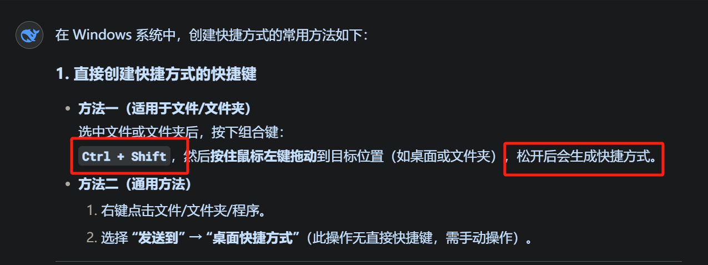

# 备注(声明)：


# 一、开发过程中常用命令

## 
### 1 、常用开发命令
- 1 export ARCH=arm64                     设置arm64环境

- 1 make menuconfig                           

- 1 /usr/local/arm64/gcc-linaro-6.3.1-2017.05-x86_64_aarch64-linux-gnu/bin/aarch64-linux-gnu-gcc app.c -o app        交叉编译c文件

- 1 aarch64-linux-gnu-      交叉编译器前缀

- 1 cp .config arch/arm64/configs/rockchip_linux_defconfig                                                                                                              保存内核配置
- 
- 1 make clean                    
- 
- 1 export CROSS_COMPILE=/home/topeet/Linux/rk356x_linux/prebuilts/gcc/linux-x86/aarch64/gcc-linaro-6.3.1-2017.05-x86_64_aarch64-linux-gnu/bin/aarch64-linux-gnu-    导出交叉编译器环境（编译内核前）         
- 
- 1 ./build.sh kernel                 编译内核
- 
- 1  chmod 777 app                  设置文件权限为777
- 
- 1 /home/topeet/Linux/rk356x_linux/kernel/scripts/dtc/dtc -I dts -O dtb -o a.dtb test.dts            编译设备树
- 
- 1 
- 
- 1 
- 
- 1 
- 

### 2 、进到目录
- 1 /home/topeet/Linux_Exercise/Drive_test             驱动练习文件
- 
- 1 /home/topeet/Linux_Exercise/Linux_Driver        驱动练习文件
- 
- 1 /home/topeet/Linux_Exercise/file_system          文件系统构建
- 
- 1 /home/topeet/Linux/rk356x_linux/kernel           内核源码目录
- 
- 1 /home/topeet/Linux/rk356x_linux/kernel/arch/arm64/boot/dts/rockchip                                                                     设备树源码路径
- 
- 1 /home/topeet/Android11                                       有repo文件
- 
- 1 /home/topeet/rk3568/rk_android11.0_sdk_211130        安卓11源码
- 
- 1 /home/topeet/Linux_Exercise/qt                          qt开发环境
- 
- 1 
- 
- 1 
- 
- 1 
- 
- 1 
- 
- 1 
- 
- 1 
- 
- 1 


### 3 、linux复制粘贴的快捷键


### 4 、


### 5、


### 6、


### 7、


### 8、


## 
### 1 、


### 2 、


### 3 、

### 4 、
### 5、


### 6、


### 7、


### 8、


## 
### 1 、


### 2 、


### 3 、

### 4 、

### 5、


### 6、


### 7、


### 8、


# 二、好用网站记录

## 
### 1 、清华大学开源软件镜像站
[清华大学开源软件镜像站 | Tsinghua Open Source Mirror](https://mirrors.tuna.tsinghua.edu.cn/)

### 2 、北京迅为电子有限公司
[专注于嵌入式开发提供ARM开发板,核心板,方案定制-北京迅为电子有限公司](http://www.topeetboard.com/sydymfl/About.html)

### 3 、瑞芯微开源仓库
2. 文档获取途径
- GitHub 仓库：  
    该文档存在于瑞芯微开源文档仓库中，路径为 CAMERA/ISP2X/Rockchip_Driver_Guide_VI_CN_v1.0.8.pdf1。
- 可直接访问 [rkdocs GitHub](https://github.com/15658150157/rkdocs/blob/main/docs_list.txt) 查看文件列表。
- 瑞芯微官方资源：  
    部分开发板配套资料中可能包含此文档（如易百纳 RV1126 开发板的“瑞芯微原厂相关手册”目录）9
- 1 瑞芯微在GitHub的官方仓库为 [rockchip-linux](https://github.com/rockchip-linux)


### 4 、Linux 内核社区

```cardlink
url: https://www.kernel.org/doc/html/latest/
title: "The Linux Kernel documentation — The Linux Kernel  documentation"
host: www.kernel.org
```


### 5、


### 6、


### 7、


### 8、


## 
### 1 、


### 2 、


### 3 、

### 4 、
### 5、


### 6、


### 7、


### 8、


## 
### 1 、


### 2 、


### 3 、

### 4 、

### 5、


### 6、


### 7、


### 8、


# 三、

## 
### 1 、ASCII 码表
[ASCII 码表](onenote:https://d.docs.live.net/52d4b76bb0ffcf51/Documents/\(RK3568\)Linux驱动开发/记录.one#ASCII%20码表&section-id={85D26C6C-8708-43BD-A8E6-E3731284E01F}&page-id={D36650DF-558B-489F-90E0-1B3203087C76}&end)  ([Web 视图](https://onedrive.live.com/view.aspx?resid=52D4B76BB0FFCF51%21se8c325913f784bf694d429e5ee2ab2be&id=documents&wd=target%28%E8%AE%B0%E5%BD%95.one%7C85D26C6C-8708-43BD-A8E6-E3731284E01F%2FASCII%20%E7%A0%81%E8%A1%A8%7CD36650DF-558B-489F-90E0-1B3203087C76%2F%29&wdpartid=%7b8467B5B5-88BC-0B17-3A1D-59DE84E73C99%7d%7b1%7d&wdsectionfileid=52D4B76BB0FFCF51!sda50f1e3d4314bd7a8b6469de58efa8f))

### 2 、进指简写
HEX     16

DEC    10

OCT    8

BIN      2


### 3 、

### 4 、

### 5、


### 6、


### 7、


### 8、


## 


## 
### 1 、头文件定义跳转模板(.vscode)
> [!note] 头文件位置
> 
>       "includePath": [
>         "${workspaceFolder}/**"
>         "E:\\Linux\\kernel\\include",
>         "E:\\Linux\\kernel\\include\\linux",
>         "E:\\Linux\\kernel\\arch\\arm64\\boot\\dts\\rockchip",
>         "E:\\Linux\\kernel\\lib",
>         "E:\\Linux\\kernel\\drivers\\base",
>         "E:\\Linux\\kernel\\include\\media",
>         "E:\\Linux\\kernel\\drivers\\media",
>         "E:\\Linux\\kernel\\drivers\\media\\v412-core"
>       ],
> 


### 2 、


### 3 、

### 4 、

### 5、


### 6、


### 7、


### 8、
## 
### 1 、windos创建快捷方式的快捷键


### 2 、


### 3 、

### 4 、

### 5、


### 6、


### 7、


### 8、


## 
### 1 、


### 2 、


### 3 、

### 4 、

### 5、


### 6、


### 7、


### 8、


## 
### 1 、


### 2 、


### 3 、

### 4 、

### 5、


### 6、


### 7、


### 8、


# 四、

## 
### 1 、


### 2 、


### 3 、

### 4 、

### 5、


### 6、


### 7、


### 8、


## 
### 1 、


### 2 、


### 3 、

### 4 、
### 5、


### 6、


### 7、


### 8、


## 
### 1 、


### 2 、


### 3 、

### 4 、

### 5、


### 6、


### 7、


### 8、


# 五、

## 
### 1 、


### 2 、


### 3 、

### 4 、

### 5、


### 6、


### 7、


### 8、


## 
### 1 、


### 2 、


### 3 、

### 4 、
### 5、


### 6、


### 7、


### 8、


## 
### 1 、


### 2 、


### 3 、

### 4 、

### 5、


### 6、


### 7、


### 8、


