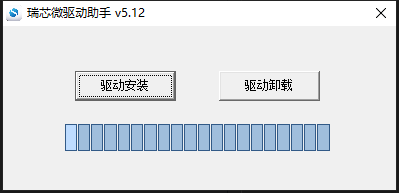
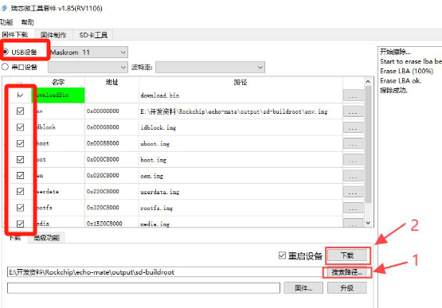
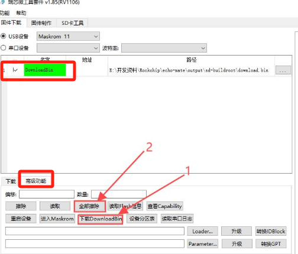

# 随记：


# 一、入门
## 1、RK驱动下载
下载并安装[RK瑞芯微驱动助手](https://no-chicken.com/resources/Echo-Mate/DriverAssitant_v5.12.zip)




## 2、开发环境搭建
### 安装依赖环境
```bash
    sudo apt-get install repo git ssh make gcc gcc-multilib g++-multilib module-assistant expect g++ gawk texinfo libssl-dev bison flex fakeroot cmake unzip gperf autoconf device-tree-compiler libncurses5-dev pkg-config
```

- 2 当然, 还有一些完整软件demo需要安装一些库, 后面再说.
    
### 下拉完整项目(SDK和软件demo)
    
```
    git clone https://github.com/No-Chicken/Echo-Mate.git
    cd Echo-Mate
    git submodule update --init --recursive
```
    
### 如果要递归更新所有子模块，请执行：
    
```bash
    git submodule update --remote --merge --recursive
```

### 安装Git LFS

```bash
sudo apt update
sudo apt install git-lfs

//初始化 Git LFS    这会为你的 Git 仓库设置必要的 `clean` 和 `smudge` 钩子
git lfs install
```

### 由于子仓库有大文件LFS，需要执行：
```
    # 下拉lfs
    git lfs pull
    # 下拉所有lfs
    git submodule foreach --recursive 'git lfs pull'
```


## 3、SSH登录开发板（USB 连接使⽤静态 IP）
### 账号与密码
- 1 登录账号: root 登录密码: root

### SSH登录操作
> [!PDF|note] [[RV1106（桌面机器人Echo）/assets/Echo-AI桌面机器人开发/file-20250810171811356.pdf#page=2&selection=92,4,94,1&color=note|5、开发板使用操作, p.2]]
> > SSH登录
> 
> 

###  ⽂件传输
> [!PDF|note] [[RV1106（桌面机器人Echo）/assets/Echo-AI桌面机器人开发/file-20250810171811356.pdf#page=8&selection=151,0,153,1&color=note|5、开发板使用操作, p.8]]
> > ⽂件传输
> 
> 


## 5、初始化系统配置
### WIFI连接
- 1  vi /etc/wpa_supplicant.conf ，配置wifi名和密码。
```
network={ 
	ssid="农业机器人实验室-2.4G" 
	psk="12345678" 
	key_mgmt=WPA-PSK 
}
```

- 1 启动wpa_supplicant 服务，配置ip
```
        # 启用 wlan0 网络接口
        ifconfig wlan0 up

        # 创建 wpa_supplicant 的运行目录
        mkdir -p /var/run/wpa_supplicant

        # 在后台启动 wpa_supplicant 服务，使用指定的配置文件和接口
        wpa_supplicant -B -c /etc/wpa_supplicant.conf -i wlan0

        # 建议等待一会，确保 wpa_supplicant 服务已成功启动并连接到无线网络
        sleep 5

        # 使用 udhcpc 动态获取 IP 地址
        udhcpc -i wlan0
```
- 2 udhcpc 动态获取 IP 地址，可能要晚点再执行。还不行，重启开发板

- 1 ifconfig记录
```bash
wlan0     Link encap:Ethernet  HWaddr 8C:BD:37:36:50:14
          inet addr:192.168.1.155  Bcast:192.168.1.255  Mask:255.255.255.0
          UP BROADCAST RUNNING MULTICAST  MTU:1500  Metric:1
          RX packets:526 errors:0 dropped:689 overruns:0 frame:0
          TX packets:75 errors:0 dropped:0 overruns:0 carrier:0
          collisions:0 txqueuelen:1000
          RX bytes:135307 (132.1 KiB)  TX bytes:10144 (9.9 KiB)
```


### 时区设置
- 1 vi /etc/profile     添加内容
- 2 export TZ=CST-8


### ⾃启动设置（好像会自己执行）
- 1 /etc/init.d/ ⽬录⾥新建⼀个 S99xxxx 的脚本
- 2 S99echo_defconfig        不会自己执行，要自己后面掉用
- 2 /etc/init.d/S99echo_defconfig start
```
#!/bin/sh

# 设置音频配置的函数
set_audio_config() {

    # 设置 ADC HPF CUT-OFF 为 ON，'1' 表示开启高通滤波器截止频率

    amixer -c 0 cset name='ADC HPF Cut-off' 1

    # 设置 ADC-MIC-RIGHT 开关为关闭状态，'1' 在此上下文中表示关闭（mute）

    amixer -c 0 cset name='ADC MIC Right Switch' 1

    # 设置 ADC Digital Left 音量级别 (范围: 0-255)，这里设置为 211

    amixer -c 0 cset name='ADC Digital Left Volume' 211

    # 设置 ADC MIC Left 增益级别 (范围: 0-3)，这里设置为最大增益 3

    amixer -c 0 cset name='ADC MIC Left Gain' 3

    # 设置 ADC ALC Left 自动电平控制音量 (范围: 0-31)，这里设置为 16

    amixer -c 0 cset name='ADC ALC Left Volume' 16

    # 设置扬声器音量 (范围: 0~30)，这里设置为 25

    amixer -c 0 cset name='DAC LINEOUT Volume' 25

}

  

# 加载内核模块的函数

set_insmod() {

    # 给 insmod_ko.sh 和 insmod_wifi.sh 脚本赋予可执行权限

    chmod +x /oem/usr/ko/insmod_ko.sh

    chmod +x /oem/usr/ko/insmod_wifi.sh

    # 执行 insmod_ko.sh 脚本来加载所需的内核模块

    /oem/usr/ko/insmod_ko.sh

}

  

# 根据传入的第一个参数决定执行哪个函数

case $1 in

    start)

        # 如果参数是 'start'，则设置音频配置并加载内核模块

        set_audio_config

        set_insmod

        # WIFI连接

        # 启用 wlan0 网络接口

        ifconfig wlan0 up

        # 创建 wpa_supplicant 的运行目录

        mkdir -p /var/run/wpa_supplicant

        # 在后台启动 wpa_supplicant 服务，使用指定的配置文件和接口

        wpa_supplicant -B -c /etc/wpa_supplicant.conf -i wlan0

        # 建议等待一会，确保 wpa_supplicant 服务已成功启动并连接到无线网络

        sleep 5

        # 使用 udhcpc 动态获取 IP 地址

        udhcpc -i wlan0

        ;;

    *)

        # 如果没有提供参数或提供的参数不是 'start'，则退出脚本

        exit 1

        ;;

esac

```
- 2 sleep 5 可能不够，后面可以在加


## 3、运⾏桌⾯机器⼈（AI聊天）（直接用作者的程序）
### 更改 bin/system_para.conf 
- 1 ⾼德API key和阿⾥云百炼API key输⼊
- 1 server_url就是填写你能够ping得通服务器主机的地址（ipconfig）     192.168.1.160

```
year=2025
month=1
day=1
hour=0
minute=0
brightness=50
sound=50
wifi_connected=false
auto_time=true
auto_location=false
city=东城区
adcode=440100
gaode_api_key=8558b6b18a3ea48825130883e4f52197
AIChat_server_url=192.168.1.160
AIChat_server_port=8765
AIChat_server_token=123456
AIChat_Client_ID=00:11:22:33:44:55
aliyun_api_key=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
AIChat_protocol_version=1
AIChat_sample_rate=16000
AIChat_channels=1
AIChat_frame_duration=40
~
```


### 获取api key
[[linux开发工具软件#2、cursor]]
- 1 Qwen：Qwen3 4B（免费）阿里云
- 2 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


- 1 高德api key获取
[申请高德地图API的Key并加以接口调用的方法\_高德地图key-CSDN博客](https://blog.csdn.net/zhebushibiaoshifu/article/details/139373736)
- 2 8558b6b18a3ea48825130883e4f52197
- 2 [高德控制台](https://console.amap.com/dev/key/app)

- 1 city-code
- 2 440100


### 运行程序
- 1 /etc/init.d/S99echo_defconfig start
- 2 udhcpc -i wlan0

- 1 .\main.exe --access_token="123456"        主机服务器

- 1 ./main           开发板在bin目录下


# 二、镜像烧录

## 1、NAND镜像烧录
### 注意
- 1 建议不使⽤拓展坞，直接USB连电脑，有群友反馈拓展坞烧录时会出问题

### 开发板进入烧录模式
- 1 打开瑞芯微的SocToolKit，进⼊，选择RV1106, 按住boot键然后USB插上电脑, 插上电脑后松开boot, 就会出现Maskrom.

### 选择固件烧录
[[RV1106（桌面机器人Echo）/assets/Echo-AI桌面机器人开发/file-20250810171811516.png|Open: Pasted image 20250712170500.png]]

### NAND Flash擦除
- 1 若SD卡作为启动介质时，必须让NAND Flash清空！
[[RV1106（桌面机器人Echo）/assets/Echo-AI桌面机器人开发/file-20250810171811667.png|Open: Pasted image 20250712170619.png]]



## 2、SD卡镜像烧录
> [!PDF|red] [[RV1106（桌面机器人Echo）/assets/Echo-AI桌面机器人开发/file-20250810171811769.pdf#page=2&selection=35,3,40,1&color=red|4、镜像烧录, p.2]]
> > SD卡镜像烧录
> 
> 
### 


### 


### 


## 3、

### 


## 4、
### 


### 


### 


## 5、
### 


### 


### 


# 三、

## 1、
### 


### 


### 


## 2、

### 


### 


### 


## 3、
### 


### 


### 


## 4、
### 


### 


### 


## 5、
### 


### 


### 


# 四、

## 1、
### 


### 


### 


## 2、

### 


### 


### 


## 3、
### 


### 


### 


## 4、
### 


### 


### 


## 5、
### 


### 


### 


# 五、

## 1、
### 


### 


### 


## 2、

### 


### 


### 


## 3、
### 


### 


### 


## 4、
### 


### 


### 


## 5、
### 


### 


### 


# 六、

## 1、
### 


### 


### 


## 2、

### 


### 


### 


## 3、
### 


### 


### 


## 4、
### 


### 


### 


## 5、
### 


### 


### 
