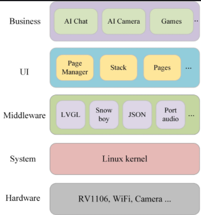

# 随记：

# 一、了解AI桌面机器人-Echo
## 1、Echo-Mate 介绍

### 含概知识面
[[RV1106（桌面机器人Echo）/assets/了解AI桌面机器人-Echo/file-20250810171802442.png|Open: Pasted image 20250711150619.png]]

### 主要外设
[[RV1106（桌面机器人Echo）/assets/了解AI桌面机器人-Echo/file-20250810171802734.png|Open: Pasted image 20250711152222.png]]

### AI聊天原理
[[RV1106（桌面机器人Echo）/assets/了解AI桌面机器人-Echo/file-20250810171802856.png|Open: Pasted image 20250711152240.png]]

### 工程的软件框架如下：
[[RV1106（桌面机器人Echo）/assets/了解AI桌面机器人-Echo/file-20250810171802940.png|Open: Pasted image 20250711154734.png]]

### 可提升的课后作业
[[RV1106（桌面机器人Echo）/assets/了解AI桌面机器人-Echo/file-20250810171803088.png|Open: Pasted image 20250711152618.png]]

## 2、  RV1106开发板参数

### 单核 32 位 CPU Cortex-A7
- 1 丰富的接口扩展，适用于AI部署,、计算机视觉、物联网设备、智能音频、智能显示等。
[[RV1106（桌面机器人Echo）/assets/了解AI桌面机器人-Echo/file-20250810171803218.png|Open: Pasted image 20250711154850.png]]

### 总结

| 参数        | Value                  |
| --------- | ---------------------- |
| 芯片        | RV1106                 |
| 处理器       | 单核Cortex A7            |
| NPU       | 1TOPS,支持int4、in8、int16 |
| 内存        | 256MB DDR3L            |
| Wi-Fi+蓝牙  | RTL8723bs              |
| 屏幕接口      | 显示 SPI + 触摸 IIC        |
| 屏幕型号      | P024C128-CTP           |
| 喇叭 MIC 接口 | MX1.25mm               |
| 存储介质      | SD卡 或 NAND FLASH       |
| 空闲GPIO    | 8个GPIO引出排针             |
|           |                        |

### 

## 3、
### 

### 

### 

## 4、
### 

### 

### 

## 5、
### 

### 

### 

# 二、复刻下单

## 1、pcb下单经验总结
### 原器件下单
[首页-深圳市优信电子科技有限公司-淘宝网](https://shop131282813.taobao.com/?weexShopTab=allitemsbar&weexShopSubTab=allitems&shopFrameworkType=native&sourceType=other&suid=4e349c13-684d-4715-b453-6a9e44a2f518&shareUniqueId=31038654602&ut_sk=1.Z7GLws%2FtRmEDADkwNU7vFcvz_21646297_1743504347669.TaoPassword-WeiXin.shop&un=7d56063ca3a57ba1c13d3024cdebb3ef&share_crt_v=1&un_site=0&spm=a2159r.13376460.0.0&sp_tk=NnV3TmVETGl3T1o%3D&cpp=1&shareurl=true&short_name=h.6VxXnLhCvDh2stD&bxsign=scdRCNUPVFVsCK-r-7In3mTIsBVp3ukF5pOFl1yNUKm_HlY-Y1YasrOcdG6Ad4IhVhOkK-8HtfOW-J0P7KUvYcTbO8FfkS1YAlegd-Jo_-Lo6xIn-yhUjhgS7FOmradIXZz&app=chrome)

> 金成发电子商行--维修备件
> 深圳安鑫的小店--捡垃圾天堂
> 玉佳电子--超级便宜的元件和模块，包装很好，就是有时不贴标签
> 小林电子套件--便宜diy仪器
> 闲鱼--找便宜设备（记得找那种淘宝引流的经销商）
> 立创商城--树莓派，万用表等等几率超低价

> risym和telesky不专门坑人的吗，东西死贵
> 这两家店优点就是几块钱的件也包邮，临时缺小件去这两家买还是不错

- 1 电阻、电容。大小相同和封装大小相同（如0402/0602）就可
[[RV1106（桌面机器人Echo）/assets/了解AI桌面机器人-Echo/file-20250810171803378.png|Open: Pasted image 20250711152840.png]]

### pcb焊接找元件位置（立创焊接辅助工具）
[[RV1106（桌面机器人Echo）/assets/了解AI桌面机器人-Echo/file-20250810171803513.png|Open: Pasted image 20250711153335.png]]

### 

## 2、实验室3d打印机使用

### 打印机配置
[[RV1106（桌面机器人Echo）/assets/了解AI桌面机器人-Echo/file-20250810171803603.png|Open: Pasted image 20250711153239.png]]

### 

### 

## 3、
### 

### 

### 

## 4、
### 

### 

### 

## 5、
### 

### 

### 

# 三、

## 1、
### 

### 

### 

## 2、

### 

### 

### 

## 3、
### 

### 

### 

## 4、
### 

### 

### 

## 5、
### 

### 

### 

# 四、

## 1、
### 

### 

### 

## 2、

### 

### 

### 

## 3、
### 

### 

### 

## 4、
### 

### 

### 

## 5、
### 

### 

### 

# 五、

## 1、
### 

### 

### 

## 2、

### 

### 

### 

## 3、
### 

### 

### 

## 4、
### 

### 

### 

## 5、
### 

### 

### 

# 六、

## 1、
### 

### 

### 

## 2、

### 

### 

### 

## 3、
### 

### 

### 

## 4、
### 

### 

### 

## 5、
### 

### 

### 
