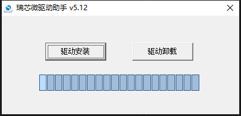

### 1\. 必要设备 [​](https://no-chicken.com/content/Echo-Mate/#_1-%E5%BF%85%E8%A6%81%E8%AE%BE%E5%A4%87)

1. windows电脑一台
2. Echo rv1106 开发板
3. USB连接线
4. SD卡, 读卡器
5. usb转ttl串口模块 (非必须)

### 2\. RK驱动下载 [​](https://no-chicken.com/content/Echo-Mate/#_2-rk%E9%A9%B1%E5%8A%A8%E4%B8%8B%E8%BD%BD)

下载并安装[RK瑞芯微驱动助手](https://no-chicken.com/resources/Echo-Mate/DriverAssitant_v5.12.zip)



### 3\. 开发环境搭建 [​](https://no-chicken.com/content/Echo-Mate/#_3-%E5%BC%80%E5%8F%91%E7%8E%AF%E5%A2%83%E6%90%AD%E5%BB%BA)

默认使用ubuntu进行SDK和相关APP的开发, 可以在电脑上安装vmware, 再安装Ubuntu22.04虚拟机. Ubuntu22.04的虚拟机的安装可以参考网上的文章.

为了正常能够编译luckfox提供的rv1106的SDK, 需要在ubuntu22.04上安装:

1. 安装依赖环境
	sh
	```
	sudo apt-get install repo git ssh make gcc gcc-multilib g++-multilib module-assistant expect g++ gawk texinfo libssl-dev bison flex fakeroot cmake unzip gperf autoconf device-tree-compiler libncurses5-dev pkg-config
	```
	1  
	当然, 还有一些完整软件demo需要安装一些库, 后面再说.
2. 下拉完整项目(SDK和软件demo)
	sh
	```
	git clone https://github.com/No-Chicken/Echo-Mate.git
	cd Echo-Mate
	git submodule update --init --recursive
	```
	1  
	2  
	3
3. 如果要递归更新所有子模块，请执行：
	shell
	```
	git submodule update --remote --merge --recursive
	```
	1
4. 由于子仓库有大文件LFS，需要执行：
	shell
	```
	# 下拉lfs
	git lfs pull
	# 下拉所有lfs
	git submodule foreach --recursive 'git lfs pull'
	```
	1  
	2  
	3  
	4

SDK和软件demo的说明会放到后续章节