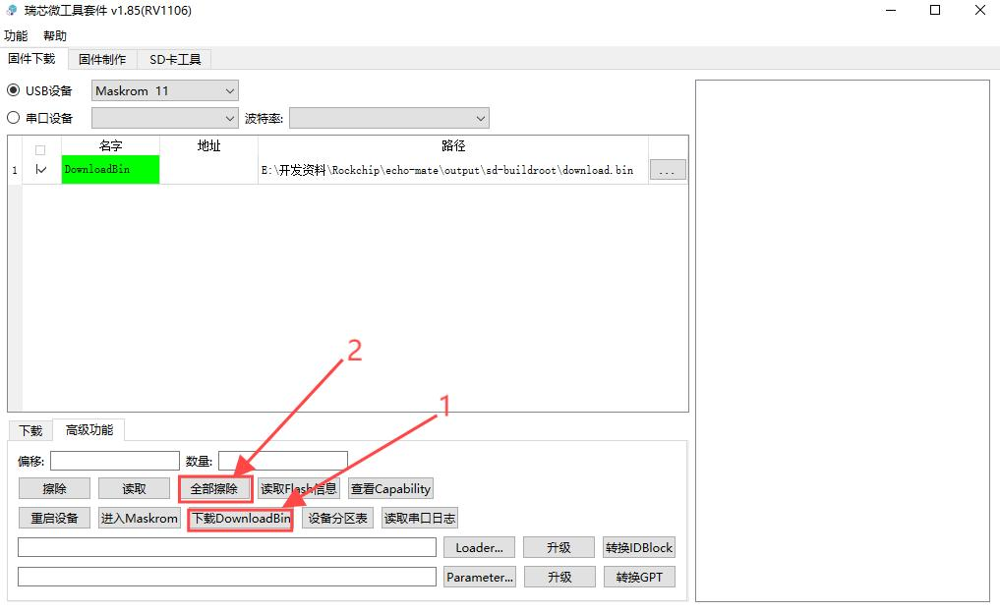
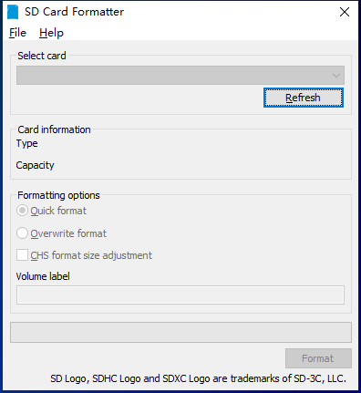
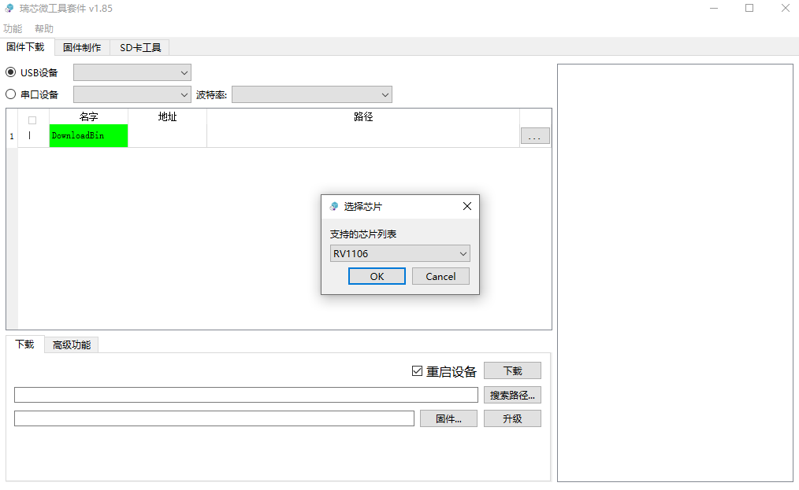
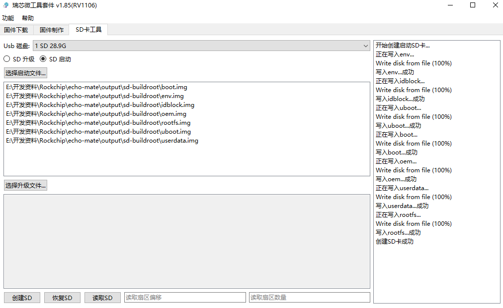

# 

镜像烧录

[​](https://no-chicken.com/content/Echo-Mate/#%E9%95%9C%E5%83%8F%E7%83%A7%E5%BD%95)

小贴士

如果使用SD卡作为启动介质，那么请跳过NAND烧录部分~

Echo开发板有预留两个存储介质, SPI NAND FLASH和SD卡, 推荐使用SD卡方便又快捷. 驱动等环境安装好后, 设备准备好后则可进行下面的操作.

### 1\. NAND镜像烧录 [​](https://no-chicken.com/content/Echo-Mate/#_1-nand%E9%95%9C%E5%83%8F%E7%83%A7%E5%BD%95)

注意

建议不使用拓展坞，直接USB连电脑，有群友反馈拓展坞烧录时会出问题

1. 打开瑞芯微的SocToolKit，进入，选择RV1106, 按住boot键然后USB插上电脑, 插上电脑后松开boot, 就会出现Maskrom.
2. 然后选择你的[NAND固件](https://no-chicken.com/resources/Echo-Mate/nand-buildroot_250509_img.zip)路径, 点击下载即可
	

### 2\. NAND Flash擦除 [​](https://no-chicken.com/content/Echo-Mate/#_2-nand-flash%E6%93%A6%E9%99%A4)

若SD卡作为启动介质时，必须让NAND Flash清空！

### 3\. SD卡镜像烧录 [​](https://no-chicken.com/content/Echo-Mate/#_3-sd%E5%8D%A1%E9%95%9C%E5%83%8F%E7%83%A7%E5%BD%95)

注意

SD卡做启动介质时，需要保证NAND Flash是清空没固件的，因为默认首用NAND的

1. 准备一张SD卡, SD卡不要太大, 16G以内就行, 不然有可能不行, 再准备一个读卡器, 使用[SD Card Formatter](https://no-chicken.com/resources/Echo-Mate/SDCardFormatterv5_WinEN.zip)等工具进行格式化清空
	
2. 下载安装[RK瑞芯微烧录工具](https://no-chicken.com/resources/Echo-Mate/SocToolKit_v1.98_20240705_01_win.zip)准备进行烧录，注意使用管理员身份打开！
	
3. 首先使用读卡器,把SD卡插到电脑上, 没有出现就重新插一下, 再将打包好的[镜像](https://no-chicken.com/resources/Echo-Mate/sd-buildroot_250509_img.zip)烧录到SD卡. 主要不要选`update.img`这个文件, 创建时会报错是因为这个问题.
	
4. 然后插卡到板子上，上电即可用~

Pager

[上一篇环境搭建](https://no-chicken.com/content/Echo-Mate/3.%E7%8E%AF%E5%A2%83%E6%90%AD%E5%BB%BA.html)

[下一篇开发板使用操作](https://no-chicken.com/content/Echo-Mate/5.%E5%BC%80%E5%8F%91%E6%9D%BF%E6%93%8D%E4%BD%9C.html)