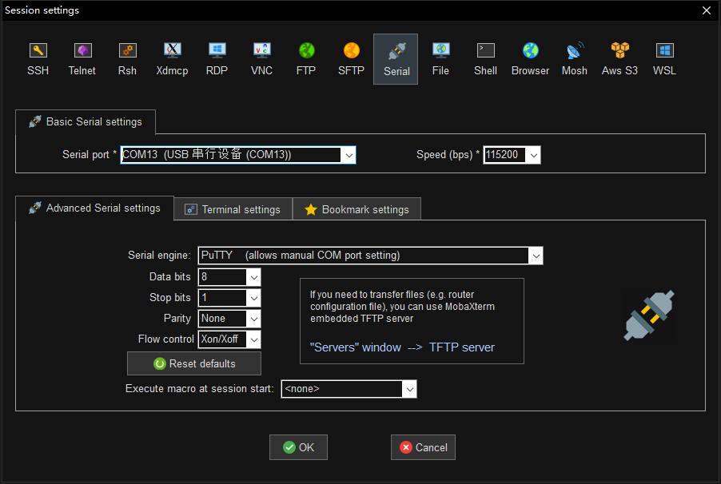
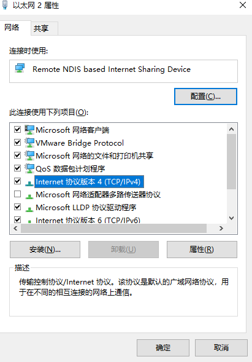
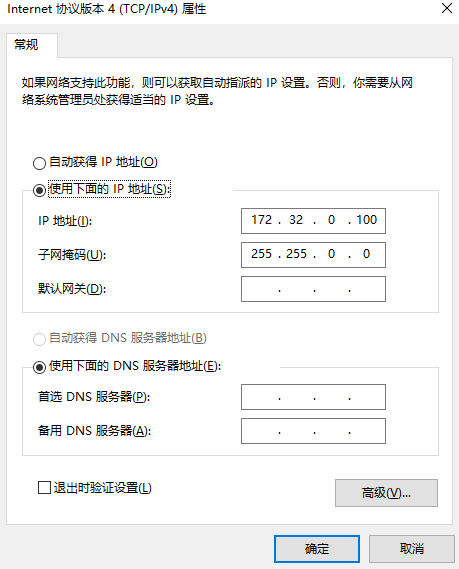
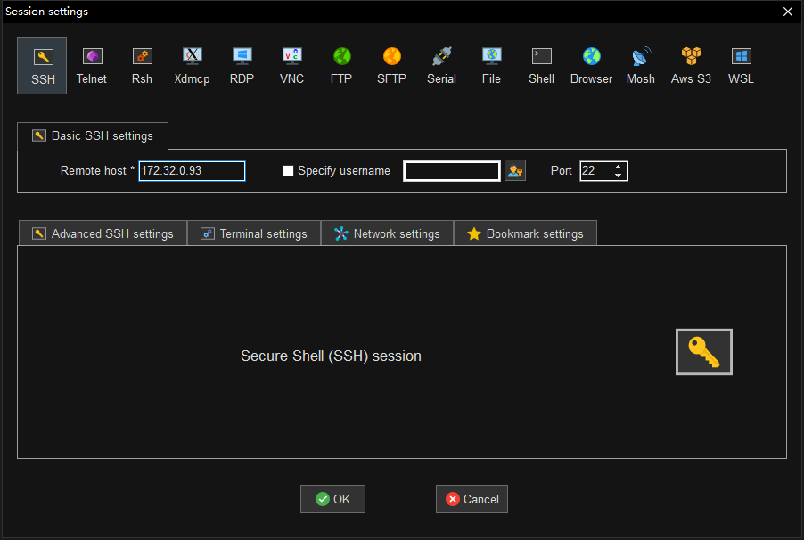
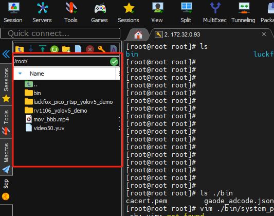

# 

开发板使用操作

[​](https://no-chicken.com/content/Echo-Mate/#%E5%BC%80%E5%8F%91%E6%9D%BF%E4%BD%BF%E7%94%A8%E6%93%8D%E4%BD%9C)

小贴士

熟悉命令行的同学可以跳过本章学习~

### 1\. 开发板连接与登录 [​](https://no-chicken.com/content/Echo-Mate/#_1-%E5%BC%80%E5%8F%91%E6%9D%BF%E8%BF%9E%E6%8E%A5%E4%B8%8E%E7%99%BB%E5%BD%95)

首先需要在网上下载`MobaXterm`终端工具, 进行开发板的调试.

#### 1.1 串口登录 [​](https://no-chicken.com/content/Echo-Mate/#_1-1-%E4%B8%B2%E5%8F%A3%E7%99%BB%E5%BD%95)

将串口转TTL连接至开发板的RX TX后，进入`MobaXterm`，创建一个session选择serial，选择好波特率115200进入即可.

```
登录账号: root
登录密码: root
```

1  
2  



#### 1.2 SSH登录 [​](https://no-chicken.com/content/Echo-Mate/#_1-2-ssh%E7%99%BB%E5%BD%95)

不连接WIFI的情况，可以通过 USB 连接使用静态 IP 进行登录.

```
登录账号: root
登录密码: root
USB静态IP地址: 172.32.0.93
```

1  
2  
3  

想要使用USB虚拟网卡, 初始配置的时候, 需要关闭防火墙（配置完以后就正常打开就行）


然后插上开发板，识别到一个NDIS的东西


进入网络中的`更改适配器选项`, 右键属性, 然后设置IPV4地址设置为 172.32.0.100





然后进入`MobaXterm`，创建一个session选择SSH，进入即可，然后进入后输入账号密码登录.



### 2\. WIFI连接 [​](https://no-chicken.com/content/Echo-Mate/#_2-wifi%E8%BF%9E%E6%8E%A5)

1. 开启wifi
	```
	ifconfig wlan0 up
	```
	1
2. 进入wpa conf，`vi /etc/wpa_supplicant.conf`，配置wifi名和密码。
	bash
	```
	ctrl_interface=/var/run/wpa_supplicant
	ap_scan=1
	update_config=1
	network={
	        ssid="wifi-name"
	        psk="12345678"
	        key_mgmt=WPA-PSK
	}
	```
	1  
	2  
	3  
	4  
	5  
	6  
	7  
	8  
	9
3. 创建一个socket文件
	bash
	```
	mkdir -p /var/run/wpa_supplicant
	```
	1
4. 然后使用`wpa_supplicant -B -c /etc/wpa_supplicant.conf -i wlan0`连接wifi，然后需要等待一会，如果是串口调试，会输出以下内容（SSH调试不会自动出现，需要使用dmesg命令查看更多log）：
	bash
	```
	[root@root ]# wpa_supplicant -B -c /etc/wpa_supplicant.conf -i wlan0
	Successfully initialized wpa_supplicant
	rfkill: Cannot open RFKILL control device
	[  670.124975] RTL8723BS: rtw_set_802_11_connect(wlan0)  fw_state = 0x00000008
	[  678.988193] RTL8723BS: rtw_set_802_11_connect(wlan0)  fw_state = 0x00000008
	[  688.127631] RTL8723BS: rtw_set_802_11_connect(wlan0)  fw_state = 0x00000008
	[  697.804890] RTL8723BS: rtw_set_802_11_connect(wlan0)  fw_state = 0x00000008
	[  698.446240] RTL8723BS: start auth
	[  698.466241] RTL8723BS: auth success, start assoc
	[  698.521065] RTL8723BS: rtw_cfg80211_indicate_connect(wlan0) BSS not found !!
	[  698.521119] RTL8723BS: assoc success
	[  698.598174] RTL8723BS: send eapol packet
	[  698.643221] RTL8723BS: send eapol packet
	[  698.644951] RTL8723BS: set pairwise key camid:4, addr:9e:a4:d3:f5:da:8d, kid:0, type:AES
	[  698.647953] RTL8723BS: set group key camid:5, addr:9e:a4:d3:f5:da:8d, kid:1, type:AES
	```
	1  
	2  
	3  
	4  
	5  
	6  
	7  
	8  
	9  
	10  
	11  
	12  
	13  
	14  
	15  
	16
5. 上面的wpa\_supplicant服务启动后，建议等待一会，再配置IP
	bash
	```
	udhcpc -i wlan0
	```
	1
6. 然后你就可以ping一下baidu等网站测下网络了
7. 如果想要切换`WiFi`，需要重启 `wpa_supplicant` 服务，需要运行
	bash
	```
	killall -9 wpa_supplicant
	```
	1

### 3\. 时区设置 [​](https://no-chicken.com/content/Echo-Mate/#_3-%E6%97%B6%E5%8C%BA%E8%AE%BE%E7%BD%AE)

1. 打开文件
	```
	vi /etc/profile
	```
	1
2. 添加内容
	```
	export TZ=CST-8
	```
	1

### 4\. 屏幕测试 [​](https://no-chicken.com/content/Echo-Mate/#_4-%E5%B1%8F%E5%B9%95%E6%B5%8B%E8%AF%95)

1. 调节背光
	bash
	```
	echo 49 > /sys/class/backlight/backlight/brightness
	```
	1
2. 测试花屏和清屏
	bash
	```
	cat /dev/urandom > /dev/fb0
	cat /dev/zero > /dev/fb0
	```
	1  
	2

### 5\. 调节音量 [​](https://no-chicken.com/content/Echo-Mate/#_5-%E8%B0%83%E8%8A%82%E9%9F%B3%E9%87%8F)

bash
```
# 设置扬声器音量(0~30)
amixer -c 0 cset name='DAC LINEOUT Volume' 18
```

1  
2  

### 6\. 文件传输 [​](https://no-chicken.com/content/Echo-Mate/#_6-%E6%96%87%E4%BB%B6%E4%BC%A0%E8%BE%93)

1. 在`MobaXterm`使用SSH，连接上后，文件拖入即可.



2. 使用SSH, 使用命令
	bash
	```
	# 传输文件
	scp ./send_file.txt root@172.32.0.93:/root
	# 传输文件夹
	scp -r ./send_files root@172.32.0.93:/root
	```
	1  
	2  
	3  
	4
3. 其他 samba, ADB这些详见网上教程

### 7\. 自启动设置 [​](https://no-chicken.com/content/Echo-Mate/#_7-%E8%87%AA%E5%90%AF%E5%8A%A8%E8%AE%BE%E7%BD%AE)

1. 需要在 /etc/init.d/ 目录里新建一个 S99xxxx 的脚本
2. 例如默认创建了一个`S99echo_defconfig`内容如下:
	bash
	```
	#!/bin/sh
	# 设置音频配置的函数
	set_audio_config() {
	   # 设置 ADC HPF CUT-OFF 为 ON
	   amixer -c 0 cset name='ADC HPF Cut-off' 1
	   # 设置 ADC-MIC-RIGHT 为 mute 关闭
	   amixer -c 0 cset name='ADC MIC Right Switch' 1
	   # 设置 ADC Digital Left (0-255)
	   amixer -c 0 cset name='ADC Digital Left Volume' 211
	   # 设置 ADC MIC Left gain (0-3)
	   amixer -c 0 cset name='ADC MIC Left Gain' 3
	   # 设置 ADC ALC Left(0-31)
	   amixer -c 0 cset name='ADC ALC Left Volume' 16
	   # 设置扬声器音量(0~30)
	   amixer -c 0 cset name='DAC LINEOUT Volume' 25
	}
	# insmod
	set_insmod() {
	   chmod +x /oem/usr/ko/insmod_ko.sh
	   chmod +x /oem/usr/ko/insmod_wifi.sh
	   /oem/usr/ko/insmod_ko.sh
	}
	case $1 in
	start)
	   set_audio_config
	   set_insmod
	   ;;
	*)
	   exit 1
	   ;;
	esac
	```
	1  
	2  
	3  
	4  
	5  
	6  
	7  
	8  
	9  
	10  
	11  
	12  
	13  
	14  
	15  
	16  
	17  
	18  
	19  
	20  
	21  
	22  
	23  
	24  
	25  
	26  
	27  
	28  
	29  
	30  
	31  
	32  
	33  
	34  
	35  
	36  
	37
3. 重新启动即可

### 8\. 其他 [​](https://no-chicken.com/content/Echo-Mate/#_8-%E5%85%B6%E4%BB%96)

。。。

Pager

[上一篇镜像烧录](https://no-chicken.com/content/Echo-Mate/4.%E9%95%9C%E5%83%8F%E7%83%A7%E5%BD%95.html)

[下一篇](https://no-chicken.com/content/Echo-Mate/6.%E8%BF%90%E8%A1%8C%E6%A1%8C%E9%9D%A2%E6%9C%BA%E5%99%A8%E4%BA%BA.html)