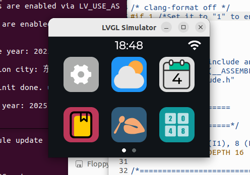
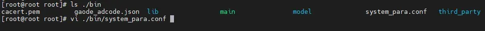
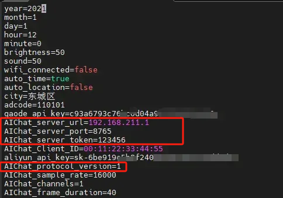
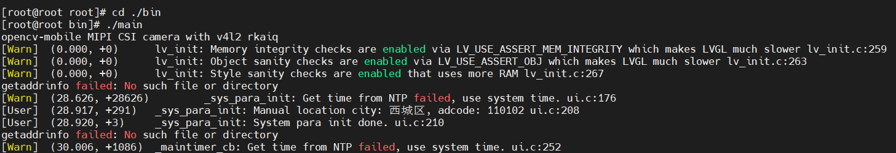
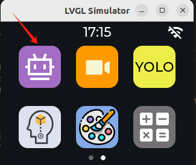
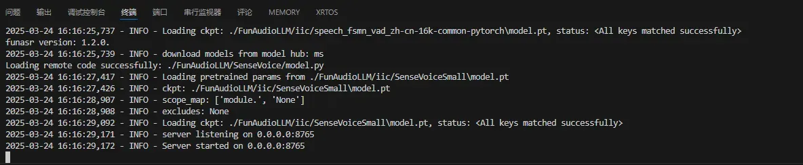
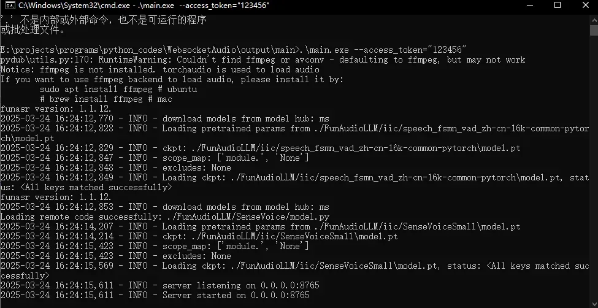

# 

运行桌面机器人

[​](https://no-chicken.com/content/Echo-Mate/#%E8%BF%90%E8%A1%8C%E6%A1%8C%E9%9D%A2%E6%9C%BA%E5%99%A8%E4%BA%BA)

### 0\. 前提条件 [​](https://no-chicken.com/content/Echo-Mate/#_0-%E5%89%8D%E6%8F%90%E6%9D%A1%E4%BB%B6)

想要`Desk_Bot`所有的功能齐全，需要保证：

- 正常登录开发板
- WIFI连接网络 (非必须，跟自动更新时间等有关系)
- AI chat `Server`端有运行

### 1\. 虚拟机仿真运行 (没有开发板可以玩这个) [​](https://no-chicken.com/content/Echo-Mate/#_1-%E8%99%9A%E6%8B%9F%E6%9C%BA%E4%BB%BF%E7%9C%9F%E8%BF%90%E8%A1%8C-%E6%B2%A1%E6%9C%89%E5%BC%80%E5%8F%91%E6%9D%BF%E5%8F%AF%E4%BB%A5%E7%8E%A9%E8%BF%99%E4%B8%AA)

小提醒

由于有的同学没有开发板，那就可以直接在虚拟机进行仿真运行

注意

如果重新编译有问题, 直接删除build文件夹再重新创建一个再编译就行

1. 下拉仓库并更新
	作者使用的`ubuntu22.04 LTS`
	sh
	```
	git clone https://github.com/No-Chicken/Echo-Mate.git
	cd Echo-Mate
	git submodule update --init --recursive
	```
	1  
	2  
	3
2. 安装Demo所需要的库
	- 安装SDL2 (LVGL仿真需要)
		sh
		```
		sudo apt-get install libsdl2-dev
		```
		1
	- 安装jsoncpp和json-c
		sh
		```
		sudo apt-get install libjsoncpp-dev
		sudo apt install libjson-c-dev
		```
		1  
		2
	- 安装opus
		sh
		```
		sudo apt install libopus-dev
		```
		1
	- 安装portaudio(依赖ALSA)
		sh
		```
		sudo apt-get install libasound-dev
		sudo apt-get -y install libportaudio2
		```
		1  
		2
	- 安装websocketpp(依赖boost)
		sh
		```
		sudo apt-get install libboost-dev
		git clone https://github.com/zaphoyd/websocketpp.git
		cd websocketpp #进入目录
		cmake CMakeLists.txt #执行cmake
		sudo make
		sudo make install
		```
		1  
		2  
		3  
		4  
		5  
		6
	如果编译时还报错缺少库, 请自行查阅安装~
3. 进入Demo, 进行编译
	注意更改`DeskBot_demo/conf/dev_conf`中, 将`LV_USE_SIMULATOR`置`1`
	sh
	```
	cd ./Demo
	cd ./DeskBot_demo
	mkdir ./build
	cd ./build
	cmake ..
	make
	```
	1  
	2  
	3  
	4  
	5  
	6  
	然后就可以在ubuntu上运行了, 需要进入bin文件夹执行, 有相对路径的依赖
	sh
	```
	cd ../bin
	./main
	```
	1  
	2  
	

### 2\. 开发板上执行桌面机器人程序 [​](https://no-chicken.com/content/Echo-Mate/#_2-%E5%BC%80%E5%8F%91%E6%9D%BF%E4%B8%8A%E6%89%A7%E8%A1%8C%E6%A1%8C%E9%9D%A2%E6%9C%BA%E5%99%A8%E4%BA%BA%E7%A8%8B%E5%BA%8F)

注意

如果重新编译有问题, 直接删除build文件夹再重新创建一个再编译就行

1. 首先编译好git中，DeskBot这个工程，如果不想交叉编译，可以直接使用我编译好的[bin](https://no-chicken.com/resources/Echo-Mate/bin_250601.zip)文件夹，打包传到开发板即可。注意，自己编译的时候记得改代码，注意更改conf/dev\_conf, 将`LV_USE_SIMULATOR`置`0`，在电脑使用仿真的时候，用的SDL，不使用SIMULATOR的时候，才是使用的fbdev设备。
2. 更改`system_para.conf`, 将高德API key和阿里云百炼API key输入. 注意修改红色框中的设置, 对不上就连不上写的server的, V2版本是8000端口，protocol版本是2。server\_url就是填写你能够ping得通服务器主机的地址，可以使用ifconfig查看，不知道的可以在网上搜一下~
	
	
3. 然后再进入bin文件夹内，执行main即可，必须进入bin文件夹中执行，因为有文件依赖:
	

### 3\. AI聊天 app使用 [​](https://no-chicken.com/content/Echo-Mate/#_3-ai%E8%81%8A%E5%A4%A9-app%E4%BD%BF%E7%94%A8)

如果点击这个紫色的小机器人APP，服务server没有启动的话，会无法用这个APP，目前服务为了方便全面学习，是跑在你的电脑上的。后续可以使用小智或者涂鸦智能等服务，更加方便快捷~



1. 然后需要运行AI chat `Server`端, 如果已经按照仓库的[README](https://github.com/No-Chicken/Demo4Echo/tree/main/AIChat_demo/Server)搭建好了环境, 进入虚拟环境运行即可
	sh
	```
	python ./main.py --access_token="123456"
	```
	1  
	
2. 如果你不想搭建python环境, 直接运行我打包好的`.exe`也可以（有点大2个G）, 解压完AiChatServer-Win-exe-V1.0.rar, 新版本为2.0, 进入main文件夹，然后在这个文件中进入cmd，运行即可：
	网盘链接: [https://pan.baidu.com/s/1\_s\_79DHZS9EZjnfybqlNJw?pwd=r7f7](https://pan.baidu.com/s/1_s_79DHZS9EZjnfybqlNJw?pwd=r7f7) 提取码: r7f7
	sh
	```
	.\main.exe --access_token="123456"
	```
	1  
	

Pager

[上一篇开发板使用操作](https://no-chicken.com/content/Echo-Mate/5.%E5%BC%80%E5%8F%91%E6%9D%BF%E6%93%8D%E4%BD%9C.html)

[下一篇](https://no-chicken.com/content/Echo-Mate/7.Linux%E5%9F%BA%E7%A1%80%E7%9F%A5%E8%AF%86/7.1.Linux%E5%9F%BA%E7%A1%80%E5%91%BD%E4%BB%A4.html)