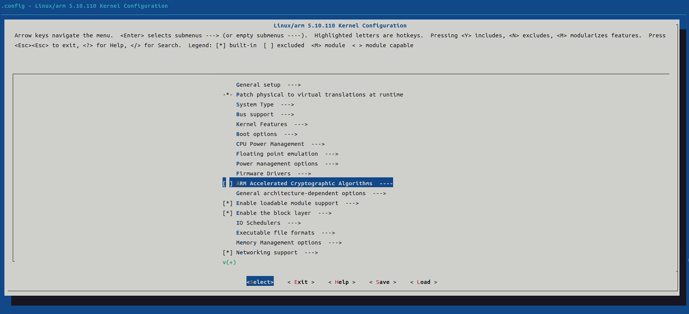

更多的细节可以直接参看luckfox-pico的说明。

下拉仓库, 并递归初始化子模块:

sh
```
git clone https://github.com/No-Chicken/Echo-Mate.git
cd Echo-Mate
git submodule update --init --recursive
```


如果要递归更新所有子模块，请执行:

sh
```
git submodule update --remote --merge --recursive
```

## 1\. Ubuntu22.04环境下编译 [​](https://no-chicken.com/content/Echo-Mate/#_1-ubuntu22-04%E7%8E%AF%E5%A2%83%E4%B8%8B%E7%BC%96%E8%AF%91)

1. 安装依赖环境：
	```
	sudo apt-get install repo git ssh make gcc gcc-multilib g++-multilib module-assistant expect g++ gawk texinfo libssl-dev bison flex fakeroot cmake unzip gperf autoconf device-tree-compiler libncurses5-dev pkg-config
	```
	1
2. 选择开发板并编译
	```
	./build.sh lunch
	./build.sh
	```

3. SDK 目录说明
	```
	├── build.sh -> project/build.sh ---- SDK编译脚本
	├── media --------------------------- 多媒体编解码、ISP等算法相关（可独立SDK编译）
	├── sysdrv -------------------------- U-Boot、kernel、rootfs目录（可独立SDK编译）
	├── project ------------------------- 参考应用、编译配置以及脚本目录
	├── output -------------------------- SDK编译后镜像文件存放目录
	└── tools --------------------------- 烧录镜像打包工具以及烧录工具
	```

	```
	output/
	├── image
	│   ├── download.bin ---------------- 烧录工具升级通讯的设备端程序，只会下载到板子内存
	│   ├── env.img --------------------- 包含分区表和启动参数
	│   ├── uboot.img ------------------- uboot镜像
	│   ├── idblock.img ----------------- loader镜像
	│   ├── boot.img -------------------- kernel镜像
	│   ├── rootfs.img ------------------ kernel镜像
	│   └── userdata.img ---------------- userdata镜像
	└── out
	    ├── app_out --------------------- 参考应用编译后的文件
	    ├── media_out ------------------- media相关编译后的文件
	    ├── rootfs_xxx ------------------ 文件系统打包目录
	    ├── S20linkmount ---------------- 分区挂载脚本
	    ├── sysdrv_out ------------------ sysdrv编译后的文件
	```
	1  

## 2\. 如何修改内核设置 kernel config [​](https://no-chicken.com/content/Echo-Mate/#_2-%E5%A6%82%E4%BD%95%E4%BF%AE%E6%94%B9%E5%86%85%E6%A0%B8%E8%AE%BE%E7%BD%AE-kernel-config)

首先进入`/rv1106-sdk/sysdrv/source/kernel`, 然后终端中输入

sh
```
make ARCH=arm menuconfig
```

1  



可以参考[luckfox的文档](https://wiki.luckfox.com/zh/Luckfox-Pico/Luckfox-Pico-SDK#6-%E5%86%85%E6%A0%B8%E9%85%8D%E7%BD%AE)进行学习，这里也进行了一些搬运.

按键操作：

- `↑` `↓` `PgUp` `PgDn`：浏览、选择内核功能
- `←` `→`：选择Select、Exit等操作
- `Enter`：进入子菜单
- `Y`：选中这项功能
- `N`：排除这项功能
- `M`：以模块的形式选择
- `Esc`：双击Esc返回上一级菜单
- `?`：查看这项功能的帮助信息
- `/`：搜索

图例说明：

- `[*]` ：已选中的项目
- `[ ]` ：未选中的项目
- `<M>` ：已选中的项目（以模块形式）
- `< >` ：未选中的项目（以模块形式）

然后更改完，保存退出，执行：

sh
```
make ARCH=arm savedefconfig
cp defconfig ./arch/arm/configs/echo_rv1106_linux_defconfig
```

1  
2  

然后重新编译即可。

## 3\. 如何在buildroot加入包 [​](https://no-chicken.com/content/Echo-Mate/#_3-%E5%A6%82%E4%BD%95%E5%9C%A8buildroot%E5%8A%A0%E5%85%A5%E5%8C%85)

如果你想加入一些包，例如`json-cpp`，`websocketpp`等等，可以进入buildroot menuconfig进行添加，当然这些我默认已经都加上了~

首先进入`rv1106-sdk/sysdrv/source/buildroot/buildroot-2023.02.6`这个文件夹，终端打开

如果没有默认配置，可以使用echo的默认配置：

sh
```
make echo_mate_defconfig
```

1  

在你的配置基础上，想进行包的增加，打开menuconfig:

sh
```
make menuconfig
```

1  

然后增加完改完之后，保存：

sh
```
make savedefconfig
```

1  

最后重新编译即可

## 4\. 设备树的位置说明 [​](https://no-chicken.com/content/Echo-Mate/#_4-%E8%AE%BE%E5%A4%87%E6%A0%91%E7%9A%84%E4%BD%8D%E7%BD%AE%E8%AF%B4%E6%98%8E)

设备树的位置在：`rv1106-sdk/sysdrv/source/kernel/arch/arm/boot/dts/rv1106g-echo-mate.dts`以及`rv1106-echo-mate-ipc.dtsi`，可以自行操作更改。

Pager

[上一篇快速上手一个C和C++程序](https://no-chicken.com/content/Echo-Mate/7.Linux%E5%9F%BA%E7%A1%80%E7%9F%A5%E8%AF%86/7.4.%E5%BF%AB%E9%80%9F%E4%B8%8A%E6%89%8B%E4%B8%80%E4%B8%AAC%E5%92%8CC++%E7%A8%8B%E5%BA%8F.html)

[下一篇整体软件说明](https://no-chicken.com/content/Echo-Mate/9.%E8%BD%AF%E4%BB%B6%E8%AF%B4%E6%98%8E.html)