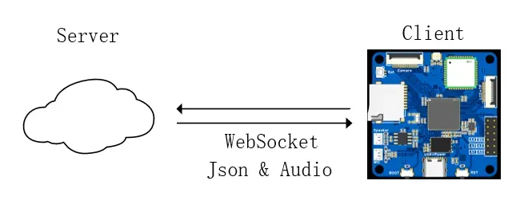

### 0\. 框架说明 [​](https://no-chicken.com/content/Echo-Mate/#_0-%E6%A1%86%E6%9E%B6%E8%AF%B4%E6%98%8E)

整体软件框架如下图所示:


1. UI层使用LVGL，PageManager仍然使用栈，进行多页面的管理，相比之前的OV-Watch手表项目，这个项目中的PageManager更加完善，可以直接使用char字符来注册和查询页面，相比直接用变量更加方便管理，开源界面空间有限不过多赘述。详细可以到手册或者代码去看。
2. UI层中，创建APP的逻辑就是，进入页面后，开启一个线程运行APP，主线程还是UI线程，详细内容见仓库代码.
3. 业务层，就是这些APP的实际实现的具体功能了，例如UI中AI Chat聊天APP的功能，或者AI相机，yolov5的推理，这些运行的结果可以在UI层进行显示，即UI层与具体业务层进行交互。
4. DeskBot\_demo的目录结构说明:
	```
	DeskBot_demo/
	├── bin/                   # 可执行文件
	├── build/                 # build缓存
	├── common/                # 通用层
	│   ├── sys_manager/       # 开发板硬件对应的管理
	│   └── xxx_manager/       # xxx对应的管理
	├── conf/                  # 系统设置
	├── gui_app/               # UI层的软件
	│   ├── common/            # UI层扩展lib
	│   ├── font/              # UI字体
	│   ├── images/            # UI图片
	│   ├── pages/             # UI层主要pages
	│   └── ui.c/h             #
	├── lvgl/                  # lvgl核心组件
	├── utils                  # 其他
	├── lv_conf.h              # lvgl设置
	└── main.c
	```

5. AI Chat的原理图如下图所示
	- 关键词触发client端唤醒后，语音通过websocket发送至server端；
	- 然后进行VAD检测，能够识别发生说话中断或没有说话；
	- 识别到说话中断后，语音送入SenceVoice模型进行文字识别；
	- 识别的文字送入大模型，进行意图识别（主要为`MCP`和`function call`），进行意图执行；
	- 识别的文字也送入大模型进行对话，对话包含了意图结果；
	- 最后流式生成的文字送入CosyVoice等模型进行流式语音生成；语音一直通过websocket发回client端.





Pager

[上一篇SDK说明](https://no-chicken.com/content/Echo-Mate/8.SDK%E8%AF%B4%E6%98%8E.html)

[下一篇DeskBot例程说明](https://no-chicken.com/content/Echo-Mate/10.deskbot.html)