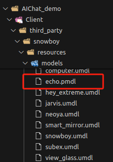

# 

DeskBot例程说明

[​](https://no-chicken.com/content/Echo-Mate/#deskbot%E4%BE%8B%E7%A8%8B%E8%AF%B4%E6%98%8E)

这个`DeskBot_demo`例程详见demo仓库的文件夹，他依赖了`AIChat_demo`这个子工程，如果在Echo ARM开发板上运行的话，还会依赖`yolov5_demo`这个例程，跑AI相机。

## 1.上手编译使用 [​](https://no-chicken.com/content/Echo-Mate/#_1-%E4%B8%8A%E6%89%8B%E7%BC%96%E8%AF%91%E4%BD%BF%E7%94%A8)

### 1.1.编译deskbot [​](https://no-chicken.com/content/Echo-Mate/#_1-1-%E7%BC%96%E8%AF%91deskbot)

1. **在电脑上运行SDL仿真**
	注意更改conf/dev\_conf, 将`LV_USE_SIMULATOR`置`1`
	sh
	```
	cd ./DeskBot_demo
	mkdir ./build
	cd ./build
	cmake ..
	make
	```
	1  
	2  
	3  
	4  
	5  
	然后就可以在ubuntu上运行了
	sh
	```
	cd ../bin
	./main
	```
	1  
	2
2. **编译到开发板上运行**
	注意更改`conf/dev_conf`, 将`LV_USE_SIMULATOR`置`0`
	sh
	```
	cd ./build
	cmake .. -DTARGET_ARM=ON
	make
	```
	1  
	2  
	3  
	然后把可执行文件所在的文件夹`/bin`, 复制到开发板, 在开发板上就能运行了
	**注意:**
	sh
	```
	cd ../bin
	./main
	```
	1  
	2

### 1.2.Server运行 [​](https://no-chicken.com/content/Echo-Mate/#_1-2-server%E8%BF%90%E8%A1%8C)

python环境搭建详见[AI语言助手demo(Server端)](https://github.com/No-Chicken/Demo4Echo/tree/main/AIChat_demo/Server), 然后进入你搭好的虚拟环境中，运行即可

sh
```
python ./main.py --access_token="123456"
```

1  

### 1.3.注意 [​](https://no-chicken.com/content/Echo-Mate/#_1-3-%E6%B3%A8%E6%84%8F)

**!! 使用前请先修改`./bin/system_para.conf`中的内容 !!**

1. `./bin/system_para.conf`中有高德API key，需要换成你的API key，用于天气等数据的获取
2. 每个page可视为一个APP, 想要自行添加可以参考模版添加
3. 你的个人电脑运行服务端`server`时, 需要跟开发板`Client`端, 连接到同一个网络下, AI chat才能正常访问. 当然, 你也可以使用电脑进行网络共享(默认开发板是172.32.0.93, 电脑是172.32.0.100).

## 2.如何修改唤醒词 [​](https://no-chicken.com/content/Echo-Mate/#_2-%E5%A6%82%E4%BD%95%E4%BF%AE%E6%94%B9%E5%94%A4%E9%86%92%E8%AF%8D)

首先进入[snowboy唤醒词网站](https://snowboy.hahack.com/)，录制唤醒词，然后生成之后只需要把文件下载的`xxxx.pmdl`文件放到model目录下即可，我这里生成了`echo.pmdl`，然后放入到`AIChat_demo/Client/third_party/snowboy/resources/models`这个文件夹即可，编译的时候，我的Cmake会复制这个文件到你的`bin`特定文件夹中的，可以自行看一下cmake中怎么写的。



然后进入`AIChat_demo/Client/Application/UserStates/Idle.cc`这个文件，更换你的`.pmdl`唤醒词文件，然后就可以了

cpp
```
void IdleState::Run(Application* app) {
    USER_LOG_INFO("Idle state run.");
    SnowboyDetect* detector = SnowboyDetectConstructor("third_party/snowboy/resources/common.res",
                                                     "third_party/snowboy/resources/models/echo.pmdl");
    SnowboyDetectSetSensitivity(detector, "0.5");
    SnowboyDetectSetAudioGain(detector, 1);
    SnowboyDetectApplyFrontend(detector, false);
    std::vector<int16_t> data;
    while (state_running_.load() == true) {
        if(app->audio_processor_.recordedQueueIsEmpty() == false) {
            app->audio_processor_.getRecordedAudio(data);
            // 检测唤醒词
            int result = SnowboyDetectRunDetection(detector, data.data(), data.size(), false);
            if (result > 0) {
                // 发生唤醒事件
                USER_LOG_INFO("Wake detected.");
                app->eventQueue_.Enqueue(static_cast<int>(AppEvent::wake_detected));
                break;
            }
        }
    }
    SnowboyDetectDestructor(detector);
}
```

1  
2  
3  
4  
5  
6  
7  
8  
9  
10  
11  
12  
13  
14  
15  
16  
17  
18  
19  
20  
21  
22  
23  

Pager

[上一篇整体软件说明](https://no-chicken.com/content/Echo-Mate/9.%E8%BD%AF%E4%BB%B6%E8%AF%B4%E6%98%8E.html)