# 内核工程师和驱动工程师的区别
[[linux内核开发/assets/Linux内核编程：入门指南/file-20250810171451850.png|Open: Pasted image 20250722161742.png]]
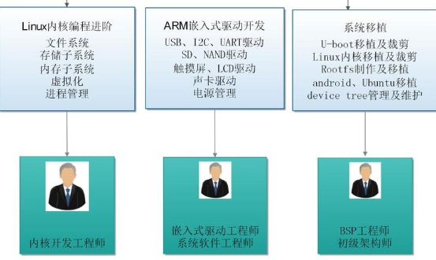

[[linux内核开发/assets/Linux内核编程：入门指南/file-20250810171451943.png|Open: Pasted image 20250722164009.png]]
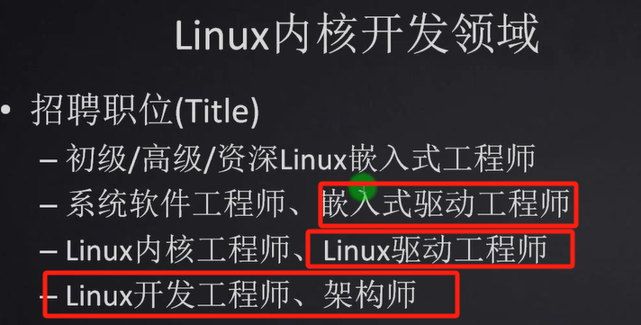

## 驱动工程师的技能数

[[linux内核开发/assets/Linux内核编程：入门指南/file-20250810171452029.png|Open: Pasted image 20250722164308.png]]
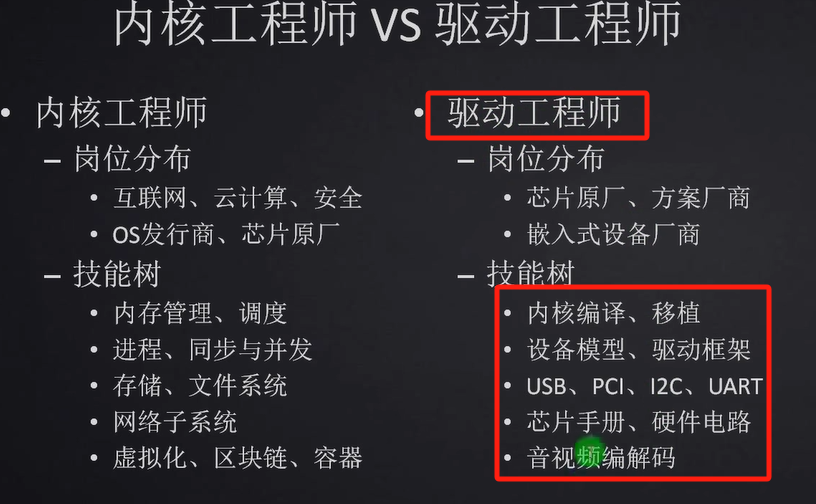

# 学习驱动能找什么工作？

## 就业公司
[[linux内核开发/assets/Linux内核编程：入门指南/file-20250810171452117.png|Open: Pasted image 20250722164943.png]]
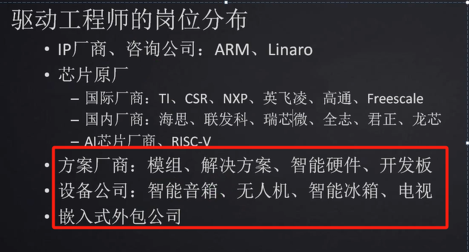

[[linux内核开发/assets/Linux内核编程：入门指南/file-20250810171452200.png|Open: Pasted image 20250722165138.png]]
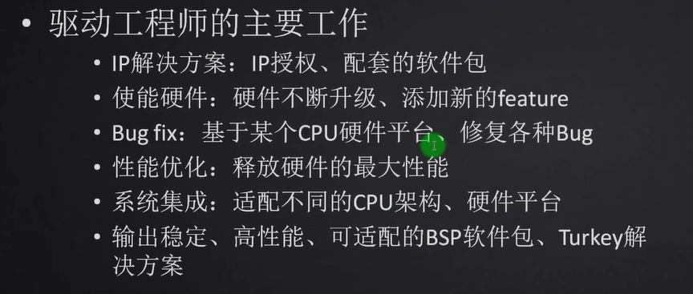

[[linux内核开发/assets/Linux内核编程：入门指南/file-20250810171452282.png|Open: Pasted image 20250722165520.png]]
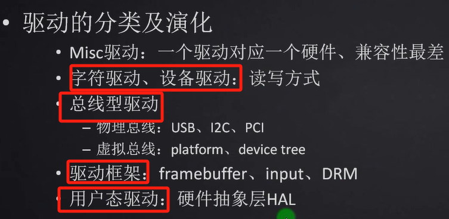

# 学习内核能找什么工作？
[[linux内核开发/assets/Linux内核编程：入门指南/file-20250810171452367.png|Open: Pasted image 20250722165720.png]]
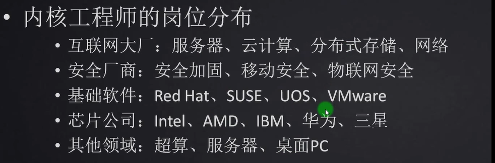

[[linux内核开发/assets/Linux内核编程：入门指南/file-20250810171452451.png|Open: Pasted image 20250722165855.png]]
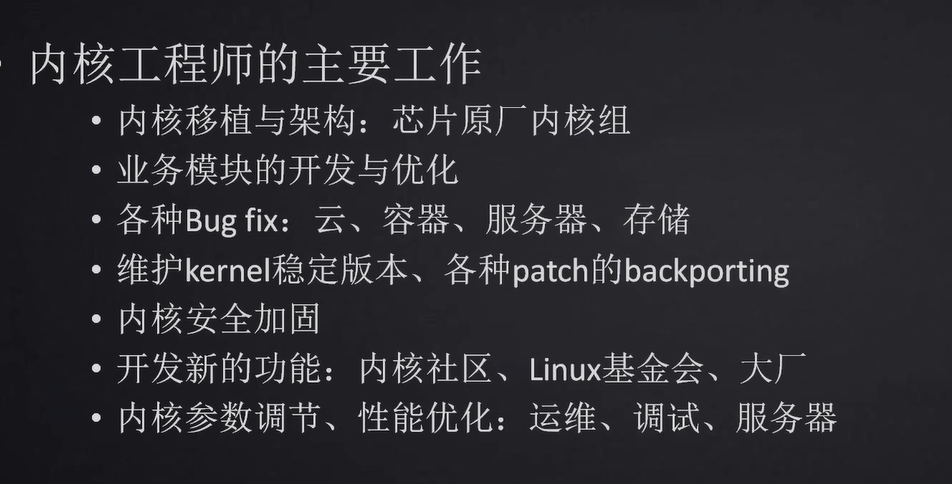

[[linux内核开发/assets/Linux内核编程：入门指南/file-20250810171452537.png|Open: Pasted image 20250722170226.png]]
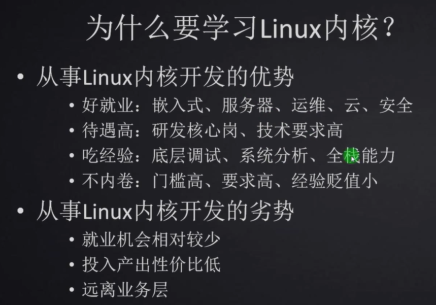

# Linux内核驱动开发生态
[[linux内核开发/assets/Linux内核编程：入门指南/file-20250810171452623.png|Open: Pasted image 20250722170859.png]]
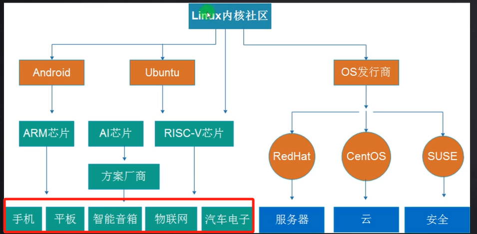

[[linux内核开发/assets/Linux内核编程：入门指南/file-20250810171452704.png|Open: Pasted image 20250722171110.png]]
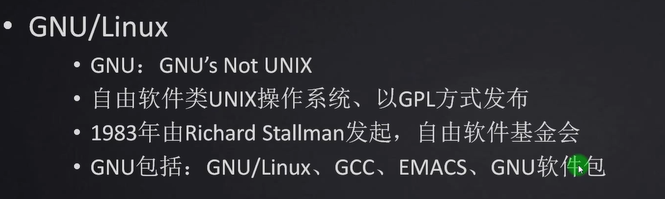

## 不同的职位不同的技能树
[[linux内核开发/assets/Linux内核编程：入门指南/file-20250810171452786.png|Open: Pasted image 20250722171222.png]]
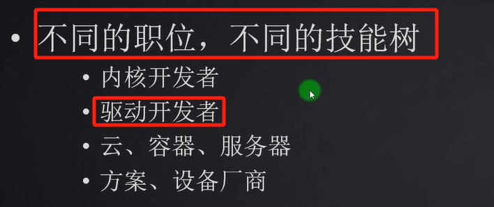

# 掌握科学的学习方法

## 系统化的学习，模仿
[[linux内核开发/assets/Linux内核编程：入门指南/file-20250810171452878.png|Open: Pasted image 20250722171635.png]]
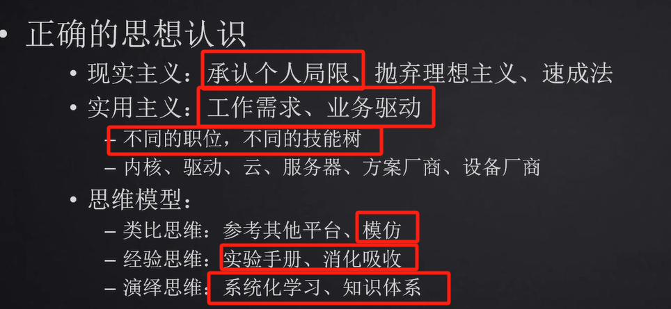

## 分层模块化思维
[[linux内核开发/assets/Linux内核编程：入门指南/file-20250810171452976.png|Open: Pasted image 20250722172128.png]]
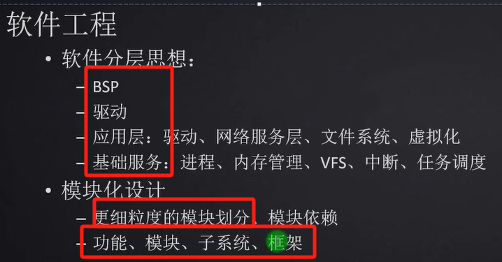

## 面向对象的思维

[[linux内核开发/assets/Linux内核编程：入门指南/file-20250810171453073.png|Open: Pasted image 20250722172231.png]]
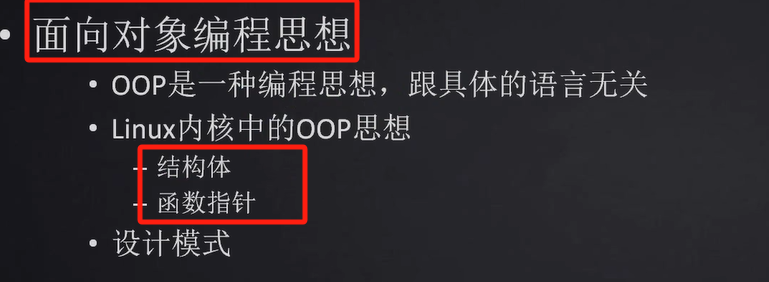

[[linux内核开发/assets/Linux内核编程：入门指南/file-20250810171453161.png|Open: Pasted image 20250722172429.png]]
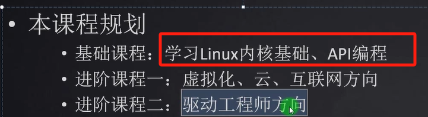

# [宅学部落的个人空间-  C语言零基础入门](https://space.bilibili.com/382223675/lists/522657?type=series)

# Linux内核的学习难点

[[linux内核开发/assets/Linux内核编程：入门指南/file-20250810171453259.png|Open: Pasted image 20250722193103.png]]
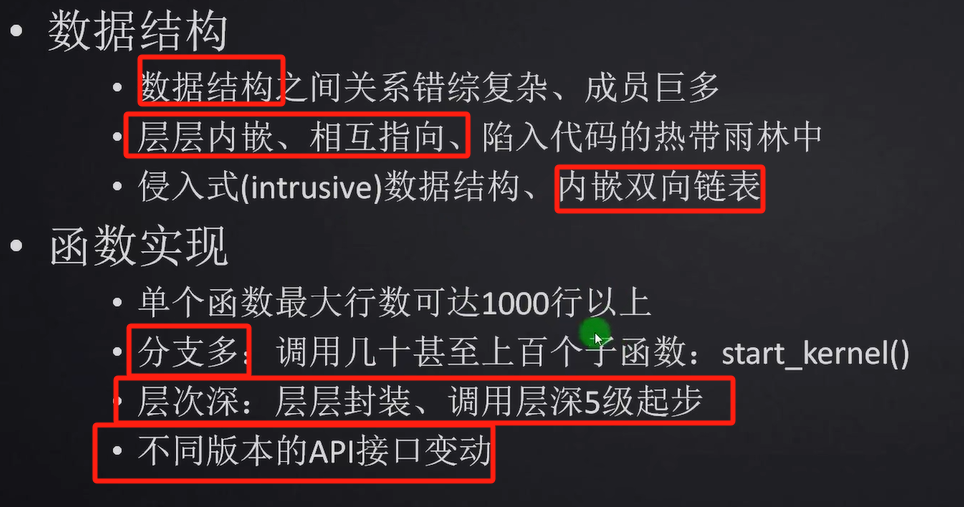

[[linux内核开发/assets/Linux内核编程：入门指南/file-20250810171453353.png|Open: Pasted image 20250722193650.png]]
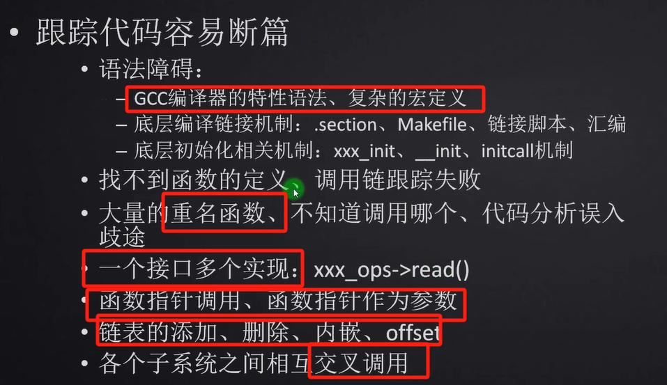

## 以需求和解决问题为导向学习
[[linux内核开发/assets/Linux内核编程：入门指南/file-20250810171453442.png|Open: Pasted image 20250722194143.png]]
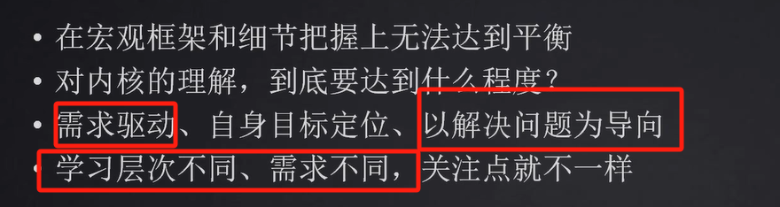

# 需要的
[[linux内核开发/assets/Linux内核编程：入门指南/file-20250810171453532.png|Open: Pasted image 20250723135334.png]]
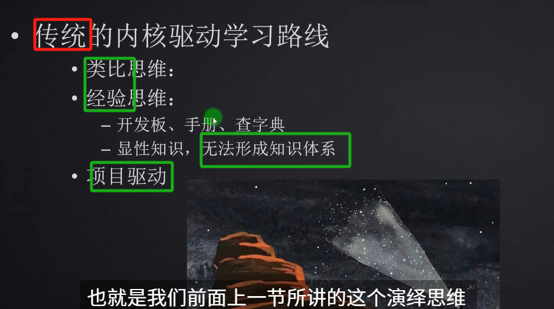

## 理论基础决定上层技术
[[linux内核开发/assets/Linux内核编程：入门指南/file-20250810171453618.png|Open: Pasted image 20250723135831.png]]
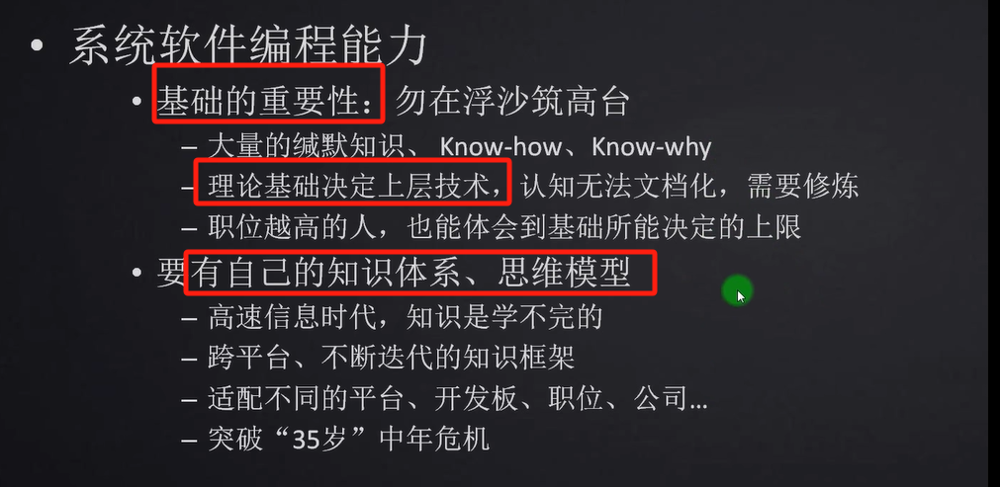

## 要会的理论知识和技能❤
[[linux内核开发/assets/Linux内核编程：入门指南/file-20250810171453708.png|Open: Pasted image 20250723140313.png]]
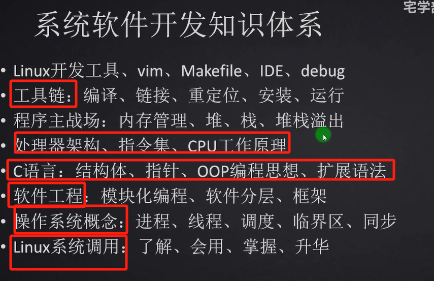

> Linux开发工具、vim、Makefile、IDE、debug工具链:编译、链接、重定位、安装、运行程序主战场:内存管理、堆、栈、堆栈溢出处理器架构、指令集、CPU工作原理C语言:结构体、指针、OOP编程思想、扩展语法软件工程:模块化编程、软件分层、框架操作系统概念:进程、线程、调度、临界区、同步Linux系统调用:了解、会用、掌握、升华

[[linux内核开发/assets/Linux内核编程：入门指南/file-20250810171453805.png|Open: Pasted image 20250723140639.png]]
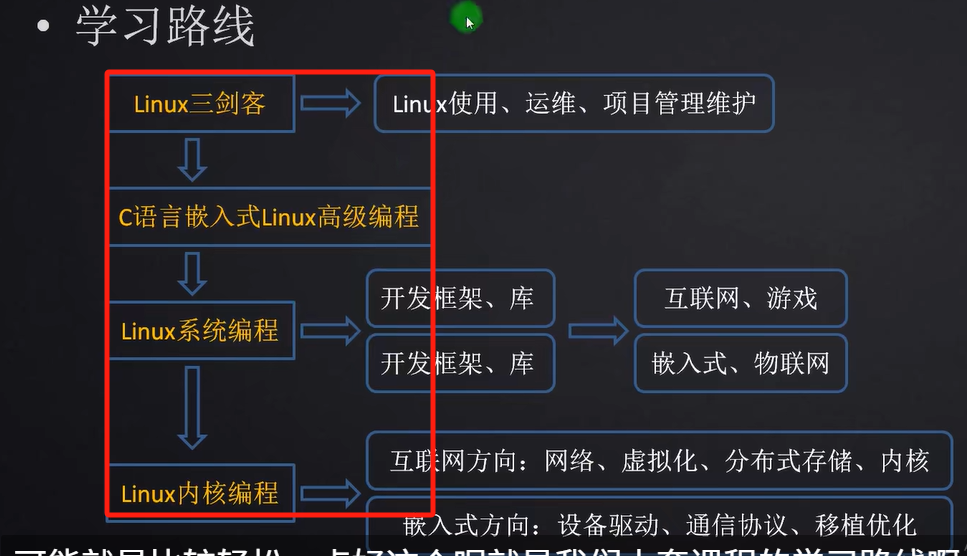

# Linux内核编码风格
  [[linux内核开发/assets/Linux内核编程：入门指南/file-20250810171453888.png|Open: Pasted image 20250723141651.png]]
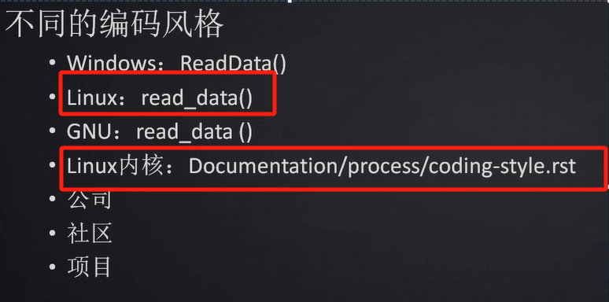

[[linux内核开发/assets/Linux内核编程：入门指南/file-20250810171454077.png|Open: Pasted image 20250723142154.png]]
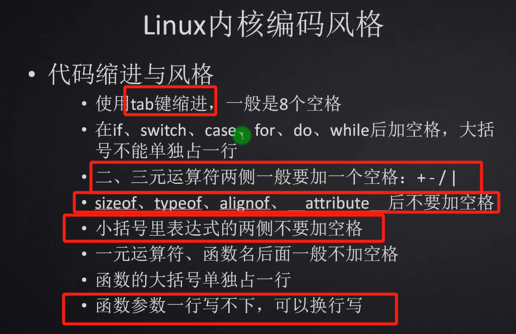

[[linux内核开发/assets/Linux内核编程：入门指南/file-20250810171454180.png|Open: Pasted image 20250723142427.png]]
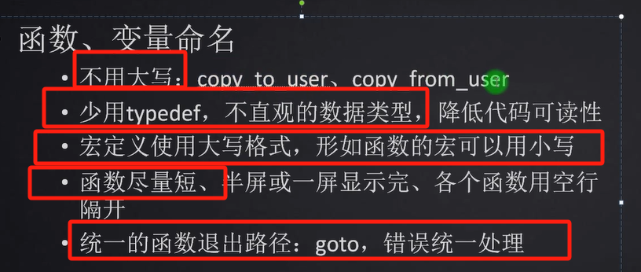

## 格式化工具：indent
[[linux内核开发/assets/Linux内核编程：入门指南/file-20250810171454271.png|Open: Pasted image 20250723142650.png]]
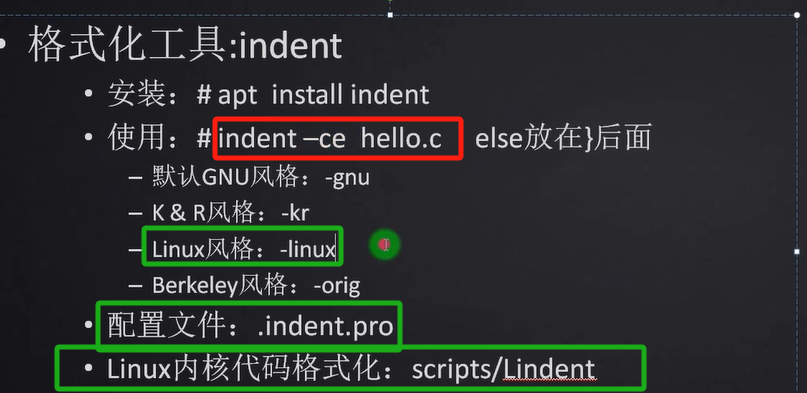

[[linux内核开发/assets/Linux内核编程：入门指南/file-20250810171454367.png|Open: Pasted image 20250723143031.png]]
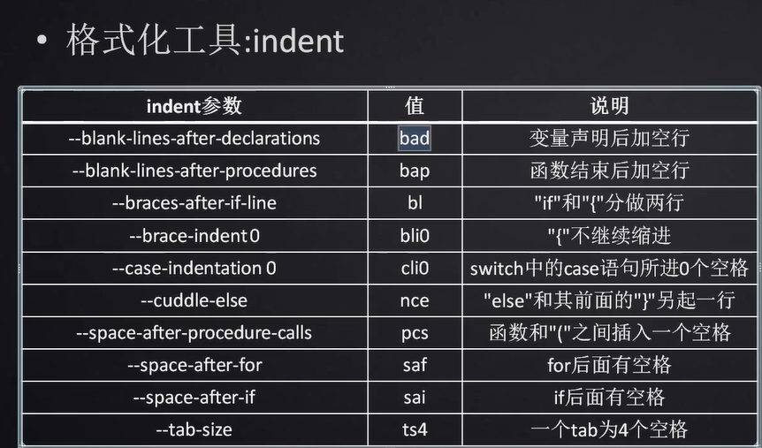

# 内核调试函数

[[linux内核开发/assets/Linux内核编程：入门指南/file-20250810171454457.png|Open: Pasted image 20250723143533.png]]
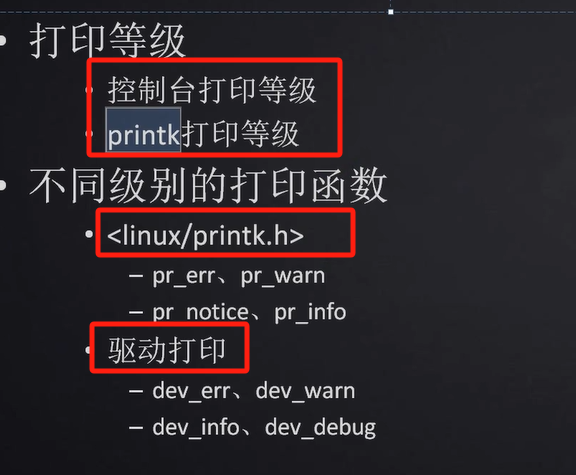

[[linux内核开发/assets/Linux内核编程：入门指南/file-20250810171454556.png|Open: Pasted image 20250723143631.png]]
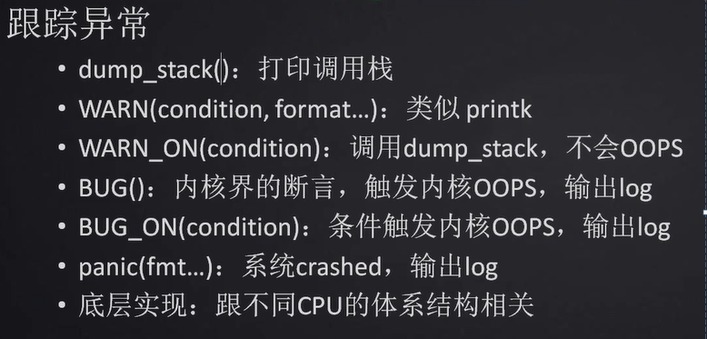

[Ubuntu-20.04使用手册 - QEMU教程 \| 宅学部落](https://www.zhaixue.cc/qemu/qemu-ubuntu-20-04-man.html)

