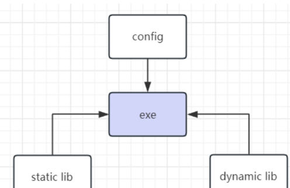
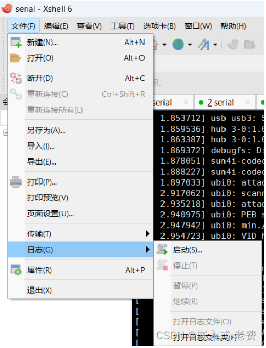

# 随记：


# 一、linux应⽤的⼏个场景
## 1、linux应⽤优势
### linux应⽤优势
- 1 相⽐较mcu⽽⾔，linux⽣态完整，拥有很多的第三⽅库，这对于使⽤者来说是 ⾮常⽅便的。


## 2、影⾳设备类应⽤（android设备）

### 娱乐设备居多
- 1 以娱乐设备居多，特别是android设备。听歌、上⽹、看电影

### 


### 


## 3、交互类应⽤（屏幕）
### 设备和⼈的交互
- 3 ⼀般都会带⼀个屏幕。有了屏幕，就可以实现设备和⼈的交互。
- 2 不管是⼯业、医疗还是其他领域，⽤linux来做交互类的设备特别的多。
### 


### 


## 4、⽹络协议类应⽤
### 各个设备的对接
- 3  这个⽹络协议，不⼀定是http，也可能是⼯业⽣产上⾯各个设备的对接
- 2 ⽐如说 modbus，⽐如嵌⼊式和plc的对接、嵌⼊式和io设备的对接、嵌⼊式和机械⼿的对接等等。
### 


### 


## 5、图像类应⽤
### camera
- 3  简单的图像处理，⽤cpu就可以了。但是复杂⼀点，或者对实时性要求⾼⼀点，就要引⼊fpga和gpu了
- 2 camera不仅仅⽤来美颜美图，还是很重要的⼯业传感器。识别、定位、检测，都可以通过图像去完成的。
### 


### 

## 6、其他算法类
### slam、ai
- 3 这类算法很多，⼀般都是传感器先采集数据，通过算法解算，再通过控制器进⾏外设控制。
- 2 现在机器⼈领域很⽕的slam、ai就是这么 ⼀个情况
- 2 只要能解决⾃⼰的问题就⾏。这个时候， ⼀般是先在嵌⼊式设备上写好算法，然后⽤上位机进⾏标定，标定完毕后，嵌⼊式设备就可以愉快地独⽴运⾏了。
### 


### 

## 7、其他
### ⼀定要掌握⾏业知识
- 1 但是⽐嵌⼊式技能更重要的，⼤ 家⼀定要掌握⾏业知识，这才是⾃⼰的核⼼竞争⼒，嵌⼊式本⾝不是核⼼竞争⼒，除⾮ 你的职能就是硬件开发、bsp开发。毕竟嵌⼊式是拿来⽤的，拿来解决实际问题的。

### 


### 


# 二、程序、静态库、动态库、配置⽂件

## 1、初入程序
### 程序使用的基本步骤
- 1 基本步骤就是，⾸先编写好程序代码，接着⽤交叉编译器编译出来，最后将这个程序拷⻉到嵌⼊式设备上。
- 2 通过console控制台的⽅式将这个程序运⾏起来

### 稍微复杂⼀点的程序
- 2 ⾸先要看，这个程序是否有关联的静态库需要编译
- 2 接着看是否有关联的动态库需要编译
- 2 最后⼀步就是查看⼀下和程序关联的配置⽂件

- 1 当然这⾥ 没有提到设备接⼝，因为我们默认设备驱动都是ok的

[[全志V3s芯片开发/全志V3s开发记录/assets/应用开发/file-20250810171443219.png|Open: Pasted image 20250704165223.png]]



## 2、程序 - main函数所在的⼯程
### 如果程序只是在x86上⾯运⾏
- 3 gcc demo.c -g -o demo

### 在嵌⼊式设备运⾏
- 3 根据我们⾃⼰的设备选择arm-linux-gnueabi-gcc这个编译器，
- 2 arm-linux-gnueabi-gcc demo.c -g -o demo
- 2 **`-g`**：这个选项告诉编译器在输出的可执行文件中包含调试信息。


## 3、静态库

### 静态库的便利性
- 1 静态库编译完成后，不需要拷⻉到嵌⼊式设备上，因为相关的的代码已经被合并到exe ⽂件⾥⾯去了

### 编译生成静态库（libadd.a）
- 1 arm-linux-gnueabi-gcc -c add.c -o add.o        ⽣成.o⽂件
- 1 arm-linux-gnueabi-ar rc libadd.a add.o      第⼆步⽣成.a⽂
- 

### 使用静态库编译程序
- 3 arm-linux-gnueabi-gcc demo.c -g -o demo ./libadd.a       把.a⽂件放到最后就好了


## 4、动态库
### 动态库处理报错的优势
- 1  试想⼀下，如果静态库出现了问题，那么所有⽤到静态库的程序，都需要重新编译⼀遍。⽽这个时候如果⽤到的是动态库，那么我们<span style="background:#affad1">只需要把动态库编译⼀下，然后把它拷⻉到嵌⼊式开发板上就⾏了</span>，这就是最⼤ 的区别。

### 编译成动态库
- 1 arm-linux-gnueabi-gcc -shared -fPIC -o libadd.so add.c

###  使用动态库编译程序
- 1 arm-linux-gnueabi-gcc demo.c -g -o demo ./libadd.so

- 3 ⼀定要把libadd.so拷⻉到嵌⼊式开发板上，设置好环境变量，demo才能运⾏起来的。
- 2 LD_LIBRARY_PATH是一个环境变量，主要用于指定动态链接器在尝试加载共享库时搜索的路径列表。


## 5、配置⽂件
### 配置⽂件类型
- 1 算法参数，功能参数

### 简单的参数
- 1 简单的参数，我们可以通过命令⾏，在程序启动的时候直接就给它了

### 复杂⼀点的参数
- 1 但是复杂⼀点的参数，⽐如哪些功能需要打开、是否需要打印调试、算法中的参数是否需要重新标定，这些都是可以⽤ 配置⽂件来完成的。

- 2 试想⼀下，如果没有配置⽂件会怎么样？那就是我们对程序所作的任何⼀点修改， 都需要重新编译、重新下载、重新测试 
- 2 如果有这样的配置⽂件，那么测试和标定的同学，就可以通过配置和修改后⾯的参数，独⽴进⾏后⾯的⼯作

# 三、嵌⼊式调试⽅法

## 1、直接⽤gdb调试
### 先在pc上⾯调试
- 1 如果不是特别复杂的代码或者⽚段，我们可以先在pc上⾯调试，确认没问题之后，再port到嵌⼊式设备上

[GDB调试命令详解(csdn)](https://blog.csdn.net/qq_28351609/article/details/114855630)
### gdb调试实例
> (base) topeet@ubuntu:~/V3s/test$ `gdb iterate`
GNU gdb (Ubuntu 9.2-0ubuntu1~20.04.1) 9.2
Copyright (C) 2020 Free Software Foundation, Inc.
License GPLv3+: GNU GPL version 3 or later <http://gnu.org/licenses/gpl.html>
This is free software: you are free to change and redistribute it.
There is NO WARRANTY, to the extent permitted by law.
Type "show copying" and "show warranty" for details.
This GDB was configured as "x86_64-linux-gnu".
Type "show configuration" for configuration details.
For bug reporting instructions, please see:
<http://www.gnu.org/software/gdb/bugs/>.
Find the GDB manual and other documentation resources online at:
    <http://www.gnu.org/software/gdb/documentation/>.
For help, type "help".
Type "apropos word" to search for commands related to "word"...
Reading symbols from iterate...
(gdb) `b main`
Breakpoint 1 at 0x401183: file iterate.c, line 9.
(gdb) `c`
The program is not being run.
(gdb) `r`
Starting program: /home/topeet/V3s/test/iterate 
Breakpoint 1, main (argc=1, argv=0x7fffffffdd58) at iterate.c:9
9		printf("%d\n", iterate(10)); 
(gdb) `quit`
A debugging session is active.
	Inferior 1 [process 4067] will be killed.
Quit anyway? (y or n) `y`


### gdb调试实例分析
1. **启动GDB并加载程序**：首先，你通过命令`gdb iterate`启动了GDB，并加载了`iterate`这个可执行文件。
2. **设置断点**：使用命令`b main`在`main`函数处设置了断点。这允许你在程序开始执行时暂停，以便于逐行调试代码。
3. **继续执行（c）**：输入`c`后提示"The program is not being run."，这是因为程序尚未启动，因此不存在继续执行的说法。在这种情况下，你需要使用`r`来运行程序。
4. **运行程序（r）**：使用命令`r`启动程序，程序会在设定的断点（即`main`函数内的第9行）处暂停。
5. **程序暂停**：程序在`main`函数的第9行暂停，这里有一个调用`iterate(10)`的语句，它将打印出`iterate(10)`的结果。
6. **退出GDB**：最后，你选择了`quit`退出GDB。由于存在一个活跃的调试会话，GDB询问是否要终止当前进程。输入`y`确认退出并杀死调试中的进程。


## 2、利⽤gdb-server调试

### gdb-server调试了解
- 1 直接在板⼦上⾯进⾏调试

- 2 第⼀，gdbserver是运⾏在开发板上的
- 2 第二，armlinux-gnueabi-gdb是运⾏在pc上⾯的。

- 3 [gdb+gdbserver远程调试技术（csdn）)](https://blog.csdn.net/zhaoxd200808501/article/details/77838933)
### 开发环境准备
- 3 利⽤交叉编译器⽣成带调试信息的可执⾏⽂ 件，
- 2 arm-linux-gnueabi-gcc iterate.c -g -o iterate

- 3 在开发板上⾯⽤gdbserver启动程序，
- 2 gdbserver 192.168.0.99:12345 iterate
### ⽤arm-linux-gnueabi-gdb开始调试
- 2 rm-linux-gnueabi-gdb ./iterate
- 2 target remote 192.168.0.99:12345


## 3、基于控制台的调试
### 打印信息调试
- 1 如果是c语⾔，⼀般就是printf打印
- 1 如果是c++，⼀般就是std::cout打印

### 借助于对应的控制台软件，将打印⽇志完整地保存下来分析
[[全志V3s芯片开发/全志V3s开发记录/assets/应用开发/file-20250810171443340.png|Open: Pasted image 20250705163949.png]]


### 基于⽇志⽂件的调试
- 1  常⻅的参数问题、配置问题、流程问题，都是可以通过⽇志⽂件来进⾏分析处理的。


## 4、录屏⼯具的参与
### ocam
- 3 常⻅的开源录屏⼯具有ocam，使⽤也是很⽅便的。

### 视频资料优势
- 1 ⽇志⽂件⼀般⽐较抽象⼀点，⽽录屏可以让我们第⼀时间知道现场发⽣了什么，视频资料会<span style="background:#affad1">让我们的调试更加地⽅便、更加地有效率</span>


## 5、基于coredump的调试 - 程序的闪退问题调试
### 调试原理
- 1 ⽣成coredump⽂件，然后借助于gdb、执⾏⽂件、 coredump来分析程序崩溃的原因

### ⽣成 coredump
- 3 ulimit -c unlimited

### 文章学习
[gdb调试coredump(使用篇)](https://blog.csdn.net/qq_39759656/article/details/82858101)

## 6、重定向调试（>>）

### run_app中的所有⽇志信息都会转到log.txt当中去了
- 3 ./run_app >> log.txt &

### 


# 四、程序构建 - make
- 1 ⽬前除了命令⾏、makefile，很多公司都开始使⽤cmake来构建、编译程序，这样⼀样，编译脚本的⼯作量就⼤⼤减少了。

## 1、使⽤命令⾏编译⽂件
### gcc编译
- 1 gcc demo.c -g -o demo

- 1 g++ demo.c -g -o demo


## 2、使⽤makefile进⾏编译

### 简单的Makefile编译脚本
```
.PHONY: all clean 
all: demo 

demo: demo.o 
	gcc demo.o -o demo 
	
demo.o: demo.c 
	gcc -c demo.c -o demo.o 
	
clean: 
	rm -rf demo.o demo
```

### 编译 - make


### 清除中间程序重新编译 - make clean


## 3、使⽤cmake进⾏编译
### 最简单的cmake脚本CMakeLists.txt
```
# 设置CMake的最低版本要求为2.8，确保使用的是兼容版本的CMake。
cmake_minimum_required (VERSION 2.8) 
# 定义项目的名称为'demo'。这个名称会用在生成的输出文件和其他与项目相关的标识中。
project (demo) 
# 添加一个可执行文件目标'demo'，它将会从源文件'demo.c'编译生成。 
# 'demo'是生成的可执行文件的名字，而'demo.c'是源代码文件的路径。
add_executable(demo demo.c)
```

### cmake⽣成 makefile 
> (base) topeet@ubuntu:~/V3s/test$ `touch CMakeLists.txt
(base) topeet@ubuntu:~/V3s/test$ `mkdir build
(base) topeet@ubuntu:~/V3s/test$ `cd build/
(base) topeet@ubuntu:~/V3s/test/build$ `cmake ..
-- The C compiler identification is GNU 5.4.0
-- The CXX compiler identification is GNU 5.4.0
-- Check for working C compiler: /usr/bin/cc
-- Check for working C compiler: /usr/bin/cc -- works
-- Detecting C compiler ABI info
-- Detecting C compiler ABI info - done
-- Detecting C compile features
-- Detecting C compile features - done
-- Check for working CXX compiler: /usr/bin/c++
-- Check for working CXX compiler: /usr/bin/c++ -- works
-- Detecting CXX compiler ABI info
-- Detecting CXX compiler ABI info - done
-- Detecting CXX compile features
-- Detecting CXX compile features - done
-- Configuring done
-- Generating done
-- Build files have been written to: /home/topeet/V3s/test/build
(base) topeet@ubuntu:~/V3s/test/build$ 


### make编译生成可执⾏⽂件
> (base) topeet@ubuntu:~/V3s/test/build$ `make
Scanning dependencies of target demo
[ 50%] Building C object CMakeFiles/demo.dir/demo.c.o
[100%] Linking C executable demo
[100%] Built target demo


# 五、qt界⾯开发(windos下)
- 3  还是希望⼤家不要在界⾯上投⼊过多的经历，它不是你的核 ⼼竞争⼒，除⾮你的主要⼯作就是做这个的。

## 1、linux界⾯开发⽅案
### lvgl


### minigui


### ftk


### qt


## 2、注意

- 1 对于这种界⾯开发，建议⼤家还是<span style="background:#d3f8b6">不要花费太多的时间</span>。因为它的开发过程实在和嵌⼊式的关系不是太⼤。
- 1 毕竟他不是⾃⼰的核⼼竞争 ⼒。相当于你⽤，别⼈也可以⽤。

## 3、下载、安装qt软件
> [!PDF|note] [[全志V3s芯片开发/全志V3s开发记录/assets/应用开发/file-20250810171443457.pdf#page=2&selection=622,0,629,1&color=note|5、qt界面开发, p.2]]
> > 下载、安装qt软件
> 
> 
### 


### 


### 


## 4、下载、安装qt VisualStudio tools插件
> [!PDF|note] [[全志V3s芯片开发/全志V3s开发记录/assets/应用开发/file-20250810171443457.pdf#page=2&selection=661,0,668,1&color=note|5、qt界面开发, p.2]]
> > 下载、安装qt VisualStudio tools插件
> 
> 
### 


### 


### 


## 5、开始创建qt⼯程
> [!PDF|note] [[全志V3s芯片开发/全志V3s开发记录/assets/应用开发/file-20250810171443457.pdf#page=3&selection=80,0,86,1&color=note|5、qt界面开发, p.3]]
> > 开始创建qt⼯程
> 
> 
### 


### 


### 


## 6、运⾏⼯程
> [!PDF|note] [[全志V3s芯片开发/全志V3s开发记录/assets/应用开发/file-20250810171443457.pdf#page=7&selection=70,1,74,1&color=note|5、qt界面开发, p.7]]
> > 运⾏⼯程
> 
> 

### 


### 


### 

## 7、代码分析
> [!PDF|note] [[全志V3s芯片开发/全志V3s开发记录/assets/应用开发/file-20250810171443457.pdf#page=8&selection=78,0,83,1&color=note|5、qt界面开发, p.8]]
> > 5、代码分析
> 
> 

### 


### 


### 
## 8、关于界⾯部分
> [!PDF|note] [[全志V3s芯片开发/全志V3s开发记录/assets/应用开发/file-20250810171443457.pdf#page=9&selection=434,0,441,1&color=note|5、qt界面开发, p.9]]
> > 6、关于界⾯部分
> 
> 

- 1 qt既⽀持ui代码设计，也⽀持ui脚本设计，⼤家可以根据⾃ ⼰的习惯灵活做出调整。当然不管是哪⼀种⽅法，⽬前⽐较流⾏的框架基本都是基于 grid来进⾏的

- 2 另外由于qt界⾯需要c++，需要进⾏windows上位机开发的同学其实可以选择c# & wpf，这也是⽐较⽅便的⼀个做法。当然，如果是⾮常简单的应⽤，纯粹是为了演⽰或者⼯具使⽤的话，那么直接python+qt也是可以的。
### 


### 


### 


# 六、boost库应⽤（跨平台，应用层库）
- 1 好⽤的、跨平台的、⾼效的函数库，⽽boost就是这⾥⾯的佼佼者。

- 1 既可以在windows平台编译，参与上位机开发，也可以在linux平台下⾯开发和使⽤，⼗分⽅便。
## 1、ubuntu下⾯安装boost库
> [!PDF|note] [[全志V3s芯片开发/全志V3s开发记录/assets/应用开发/file-20250810171443476.pdf#page=2&selection=442,0,448,1&color=note|6、boost库应用, p.2]]
> > ubuntu下⾯安装boost库
> 
> 
### 


### 


### 


## 2、编写代码测试boost库
> [!PDF|note] [[全志V3s芯片开发/全志V3s开发记录/assets/应用开发/file-20250810171443476.pdf#page=2&selection=472,0,479,9&color=note|6、boost库应用, p.2]]
> > 测试第⼀个代码demo1.cpp
> 
> 
### 


### 


### 


## 3、总结
### ⼤家在嵌⼊式开发的时候，尽量多多使⽤boost这样的开发库
- 2 可以⼤⼤提⾼开发效率，把主要的精⼒放在算法、或者是业务逻辑上去。


# 七、其他第三⽅库
## 1、linux库
### 通⽤库
- 1 前⾯我们介绍的qt、boost这些都是通⽤库。也就是说，不管什么样的场景，这些库都可以拿过来使⽤。

### 第三⽅库（专用库）
- 1 在实际开发中还有⼀些第三⽅库，它是需要和实际场景联系在⼀起的。取决于客⼾⾃⼰的开发⽬标是什么。

- 2 ⼀旦搭上了linux，相当于拥有了整个linux⽣态，⼤量的第三⽅软件可以拿过来使 ⽤和学习。


## 2、第三⽅库举例

### libz压缩库
- 1 使⽤压缩相关的功能，libz基本是标配

### openssl加密库


### png、jpeg图像库
- 1 bitmap（位图）⼀般需要⾃⼰写，png和jpeg都有对应的函数库可以选择。

- 1 只是打开、关闭、显⽰图像

### 视频、⾳频库（ffmpeg）
- 1 ffmpeg基本是⾳频、视频处理的标配。

- 2 需要注意的就是，怎么把ffmpeg中的编码、解码模块换成对应soc的硬编码、硬解码，这是需要注意的，当然这也是消费电 ⼦上⾯⾮常常规的操作

### xmlrpc - ⽹络通信
- 1 有⽹络通信的需求，但是⼜不想⾃定义复杂的⽹络报⽂协议

### sqlite - 数据库管理
- 1 嵌⼊式设备⼀般容量都不⼤，但是它本⾝也有数据库管理的需要。
- 2 前使⽤的sqlite版本⼀般是sqlite3。它本⾝也⽀持sql 语句，⽀持第三⽅软件的配置、管理，因此使⽤上⾯⼗分⽅便。

### lighttpd - Web服务器软件
- 1 很多嵌⼊式设备是需要交由客⼾进⾏配置的。如果不想开发上位机，那么做成web 设置也是不错的⼀个想法。

- 2 这个时候⼀般都会在嵌⼊式设备⾥⾯放⼀个web server。 lighttpd就是不错的⼀个选择
- 2 除了常规的⽹⻚访问之外，它还⽀持cgi开发。⽐如⽤c语 ⾔开发合适的cgi，这也⾮常符合我们要求的。

### opencv库 - 图像处理
- 3 对这些图像进⾏处理， 将图像变成⼀个传感器，从中获取我们感兴趣的数据

### pcl库- 三维建图
- 3 物体表面或环境的“三维快照”，用来恢复空间几何。

- 2 ⽬前机器⼈、⾃动驾驶越来越⽕，⽽3d lidar就是其中的⼀个重要环节；
### 供应商提供的第三⽅库 - 和具体的设备相关
- 3 好⼀点的供应商，会提供具体的sdk，这样使⽤者就不需要⾃⼰开发了

- 3 普通⼀点的供应商也会提供具体的协议，还有就是什么接⼝， 232、485、ethernet、can等等都有可能，看具体应⽤场景了。

### ros库

- 2 ⽬前为⽌，已经看到很多的⼚ 家直接把ros port到嵌⼊式设备上做应⽤了。这样，相当于直接使⽤第三⽅框架的流程，就不再需要⾃⼰重新搞⼀套架构了。公司把重点focus在业务逻辑和算法上即可


## 3、总结
### 遇到再学
- 1 ⼤家本着⽤到什么学什么的思路，没必要了解每⼀个lib的实现细节。遇到了再来学也是来得及的。

### 重点
- 3 对于个⼈⽽⾔，把嵌⼊式设备的硬件⽤起来，把第三⽅库port进来，配和产品要求去实现需求、实现算法，才是我们最最需要关⼼的事情。


# 八、数据标定和调试
- 1 嵌⼊式设备设计好，编译好固件烧⼊之后，接下来要⾛的⼀般就是数据标定和调试。

## 1、pid标定（举例）
- 1 第⼀步就是确定输⼊量和输出量

- 1 第⼆ 步，调试⽐例参数，直到形成稳态误差；

- 1 第三步，添加积分参数，逐步消除控制误差；

- 1 第四步，添加微分参数，逐步减⼩超调量，注意这个数值需要控制地⾮常⼩。

## 2、打印调试 - 把这些打印的数据⽤合适的⽅法绘制出来

### 安装matplotlib
> [!PDF|note] [[全志V3s芯片开发/全志V3s开发记录/assets/应用开发/file-20250810171443504.pdf#page=2&selection=511,0,513,10&color=note|8、数据标定和调试, p.2]]
> > 安装matplotlib
> 
> 

### 尝试第⼀个打印程序（画⼀条直线）
> [!PDF|note] [[全志V3s芯片开发/全志V3s开发记录/assets/应用开发/file-20250810171443504.pdf#page=2&selection=551,0,559,1&color=note|8、数据标定和调试, p.2]]
> > 尝试第⼀个打印程序
> 
> 

### 绘制pid数据反馈图（python3 & matplotlib）
> [!PDF|note] [[全志V3s芯片开发/全志V3s开发记录/assets/应用开发/file-20250810171443504.pdf#page=3&selection=172,0,179,1&color=note|8、数据标定和调试, p.3]]
> > 绘制pid数据反馈图
> 
> 

- 2 串⼝打印的数据当中⼀般有输⼊量和输出量。那么只需要把这两个量绘制出来，其实就可以看到我们实际pid的控制效果了。

- 3 通过串口获取PID控制过程中的输入和输出数据，利用Python的Matplotlib库绘制曲线，从而直观验证PID控制效果。


# 九、发现需求和提升价值
## 1、一个具体的产品作用

- 1  ⼀个产品，从设计、开发、⽣产、销售出去，只有完成了整个的商品的流转，这个产品才有了价值。产品有了价值，技术才有价值，开发技术的⼈本 ⾝也才有价值。这是⼀个基本的规律。

## 2、发现需求

### 要做什么样的产品？
> 1）这个产品是市场需要的吗？
> 2）这个产品有⻔槛吗？ 
> 3）这个产品适合⾃⼰做吗？和⾃⼰以前做的产品有没有关联？

### 发现需求渠道
- 1 。⼀⽅⾯，这样的需求， 可以通过和⼈不断地交流中获取

- 1 另外⼀⽅⾯，我们可以通过电商、app这样的途径去主动获取⼀些市场信息。
- 2 当然，这样的产品⼀定要和⾃⼰的个⼈能⼒定位相匹配
- 2 当然，除了能⼒，时间上⾯是否来得及也是很重要的。


### 筛选和设计
- 3 经过各种渠道获取的信息，下⾯就是对它进⾏筛选和设计。
- 2 ⽐如可以看看⽬前做的最好的产品是什么样的，还有哪些不⾜，成本上是不是有可以优化的地⽅。
- 2  ⼀个需要注意的点就是，尽量做产品化、做差异化，过度红海的领域就不要参与了，没必要搅这个局。
- 2 另外做什么事情都是需要有⻛险控制的意识，产品的前期规划和设计也是⼀样要规避⻛险。

## 3、提升价值
### 利润最简单的公式
$利润 = （销售-成本）*数量$

### 提⾼利润，主要的⽅法
- 3 提⾼产品销售的单价、降低产品的成本、增加销售的数量

### ⽐较容易想到的有这两个好⽅法
- 1 第⼀，⽤便宜、可替代的硬件代替复杂的soc，⽐如mcu+fpga替代 soc，⽤低端soc+fpga替代⾼端soc，⽤低端soc+mcu代替dsp等等。
- 2 前提是⾃⼰对准备⽤于替代的技术也有⽐较好的掌握

- 1 第⼆，个⼈具有深厚的⾏业背景，利⽤个⼈对⾏业的了解，把相关的⾏ 业知识转换成代码和软件，这样也可以脱离硬件的苦海，提升产品的附加值。
- 2 这⾥⾯可以是算法，可以是流程，只要是和⾏业相关，都可以。


## 4、总结

- 1 当我们销售出去的时候，⾏业⾥⾯的⼈看⼀下pcb和bom，基本就都知道成本了。
- 3 但是如果能利⽤技术能⼒降成本、利⽤软件实现⾏业需求，这才是⾃ ⼰的核⼼竞争⼒，

- 1 ⼀个东西要卖上价，那么就要体现⾃⼰的专业性，显⽰出⽐较明显的差别，同时在成本控制上有两把刷⼦，这才能让⾃⼰的产品脱颖⽽出。
- 2 别⼈有的，你也有；别⼈没有的，你也有，⻓此以往，不断改进和复盘，⼀定可以慢慢培养起⾃⼰的产品意识、成本意识，在竞争中获得优势的


# 十、上位机配合

## 1、上位机方法和通信
### ⽬前上位机开发的⽅法
- 1 早期的mfc，后来的c# form、qt、python qt等等，

- 2 特别推荐c# & wfc的⽅法来进⾏上位机开发。c# 不仅仅语法⽐较简单，容易上⼿，界⾯绘制也全部是⽤脚本完成的。
- 2 整个上位机就像是在开发⽹站，脚本和界⾯相当于前端开发，⽽c#则相当于后端开发。
### 上位机和嵌⼊式通信的⽅式
- 1 主要就是232、485、can、usb和以太⽹，其中usb稍微复杂点，⼀般需要libusb 等库配合。


## 2、 创建c# & wpf⼯程
> [!PDF|note] [[全志V3s芯片开发/全志V3s开发记录/assets/应用开发/file-20250810171443521.pdf#page=2&selection=580,0,584,1&color=note|上位机配合, p.2]]
> > 创建c# & wpf⼯程
> 
> 
### 创建c# & wpf的前提
- 3 需要安装visual studio开发包，以及c#开发包。

### 


### 


## 3、代码分析
> [!PDF|note] [[全志V3s芯片开发/全志V3s开发记录/assets/应用开发/file-20250810171443521.pdf#page=3&selection=71,0,74,1&color=note|上位机配合, p.3]]
> > 代码分析
> 
> 
### 


### 


### 


## 4、添加⼀个进度圈功能
> [!PDF|red] [[全志V3s芯片开发/全志V3s开发记录/assets/应用开发/file-20250810171443521.pdf#page=5&selection=303,0,311,1&color=red|上位机配合, p.5]]
> > 添加⼀个进度圈功能
> 
> 
### 


### 


### 


