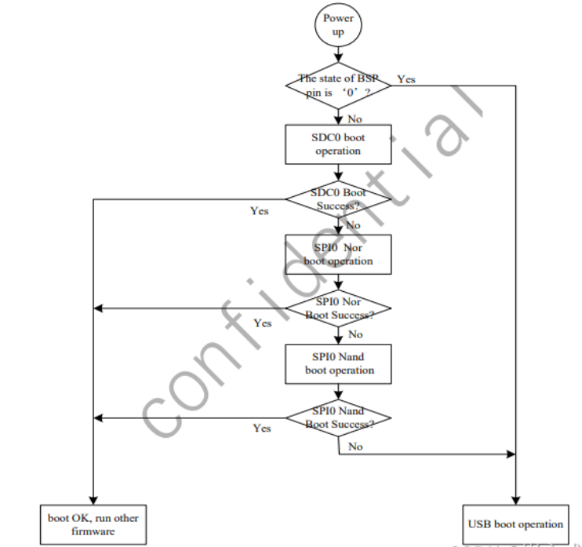

# 随记：

# 一、芯片知识了解

## 1、芯片硬件知识
### soc、ddr、 emc、pwic、ethernet phy介绍
- 1 linux的核⼼板⽆⾮就是soc、ddr、 emc、pwic这些

- 1 SoC是指将计算机的所有主要部件，包括中央处理器(CPU)、图形处理单元(GPU)、内存控制器、外设接口等集成到一个单一芯片上的集成电路。
- 1 DDR作为主内存使用，为SoC提供运行程序和数据交换所需的临时存储空间。
- 1 EMC通常指的是增强型内存控制器，它是SoC的一部分，负责管理和优化与外部存储器（如DDR SDRAM）之间的数据传输。
- 1  PMIC是一种专门设计用于管理电子设备电源需求的集成电路，包括电压调节、电池充电、电源路径管理等功能、
- 1 Ethernet PHY是指实现以太网通信标准物理层规范的硬件组件

### mmu和cache。
- 1  MMU是处理器架构中的一个硬件组件，负责管理虚拟地址到物理地址之间的映射，并提供内存保护等功能。

- 1   Cache是一种高速存储器，位于CPU和主存之间，用于暂时存放最常用的数据和指令，以加快数据访问速度。
### 
- 1 毕竟⼤多数mcu都是⽤于⼯业上使⽤，⽽soc还是⽤在消费品居多

## 2、启动顺序

### 启动顺序优先级
- 1 V3S中SD卡的启动顺序优先级是最⾼的，如果SD卡启动失败，才会进⾏其他⽅式的选择。

### 摘抄⾃V3S的芯⽚⼿ 册，Page 60
[[全志V3s芯片开发/全志V3s开发记录/assets/开发准备/file-20250810171440604.png|Open: Pasted image 20250621202650.png]]

### 

## 3、串⼝和type C线
### 
- 1 usb转ttl的模块
- 1 type C线主要是⽤来进⾏电源供电使⽤的。
### 
- 1 V3S的cpu是arm

### 
- 1 拿到电路图、熟悉芯⽚⼿册、按照linux框架编写驱动代码、测试代码，这才是真正驱动开发的开始。这中间还会涉及到很多的问题，⽐如硬件的测量、板⼦的虚焊、驱动的bug，这都是避免不了的，慢慢往前做就好了。

# 二、⼊⻔

## 1、驱动的了解
### 驱动的本质
- 1 所谓的驱动，就是对硬件（如IP Core）进行初始化和配置，使之可以正常地和外界进⾏数据的交互，仅此⽽已。

### 嵌⼊式驱动和操作系统的关系
- 1 嵌⼊式驱动和操作系统没有⼀点点关系。⽐如说，⼀个i2c的存储芯⽚， 可以在uboot下⾯写驱动，也可以在linux下⾯写驱动，同样也可以在android下⾯写驱动，甚⾄于不需要任何的平台，直接裸写驱动也是可以的

- 1 只不过各个平台为了⾃⼰的 ⽅便，把驱动中通过的代码抽象成了⼀个⼀个的框架，开发的同学只需要了解这个框架，做对应的代码适配就好了，⽆需重头开始写代码。
### 嵌⼊式驱动（内核层、应⽤层）
- 1 有的⼚家把⼀部分驱动放在了内核层，⼀部分放在应⽤层。处于内核层的驱动代码就开源出来，⽽不想开源的代码就⽤动态库的⽅法提供给开发者

- 1 纯应⽤层的。这⼀类的驱动包括串⼝RS232、以太⽹都属于这⼀类，⽐如gps、相机这⼀类设备的访问，就很⼤程度上依赖于⼚家提供的sdk代码。

### 驱动的作⽤
- 1 把外界的设备添加到当前的平台中

- 1 把ddr 的⼀部分内存预留出来，单独做成驱动给camera访问，这样做成buffer之后，可以供消费者快速浏览和处理图⽚使⽤。通过驱动实现协处理器的功能，加速代码的执⾏过程。

- 1 驱动在软件开发中的⻆⾊，就相当于⼈的各个感知器官和执⾏机构。

### 写好驱动需要涉及的⼏个关键点
- 1 1）会读原理图，不会读原理图，不会量电压、测信号，什么也做不了

- 1 2）会读芯⽚⼿册，很多时候驱动只是把⼚家的流程描绘成代码⽽已

- 1 3）会使⽤平台给出的驱动框架，不管是linux平台还是windows平台；

- 1 4）会测试代码，很多时候测试完全靠⾃⼰，不可能依赖于别⼈来帮⾃⼰进⾏测试

- 1 5）要充分发挥驱动的优势，寻找驱动可以充分发挥⾃⼰应⽤场景的地⽅

- 1 我们学习是为了应⽤，绝不是为了学习驱动⽽学习，怎么⽤起来才是最重要的

## 2、开发软件搭建

### 串⼝⼯具
- 1 SecureCRT或者Xshell、MobaXterm。

### 安装⽂本编辑器notepad++
- 1 Notepad++就很好。

### 虚拟机和ubuntu配置
> [!PDF|note] [[全志V3s芯片开发/全志V3s开发记录/assets/开发准备/file-20250810171440704.pdf#page=2&selection=747,0,754,1&color=note|00、开发软件搭建, p.2]]
> > 3、安装virtualbox虚拟机
> 
> 

# 三、看原理图
- 1 别⼈已经设计好的原理图，⾃⼰还是要看得懂、读的明⽩的。
## 1、荔枝派硬件原理图
> [!PDF|important] [[全志V3s芯片开发/全志V3s开发记录/assets/开发准备/file-20250810171440730.pdf#page=1&selection=1691,0,1695,1&color=important|CherryPi-PC-V3S_V1.2, p.1]]
> > 板子上使用的是MX35LF1GE4AB-Z4（1Gbit）
> 
> 
### 荔枝派各个外设硬件原理图
> [!PDF|important] [[全志V3s芯片开发/全志V3s开发记录/assets/开发准备/file-20250810171440780.pdf#page=2&selection=265,0,272,1&color=important|1.看原理图, p.2]]
> > 1、V3S的soc原理图
> 
> 

- 1  V3S⽀持SPI存储
### 

### 

## 2、

### 

### 

### 

## 3、
### 

### 

### 

## 4、
### 

### 

### 

## 5、
### 

### 

### 

