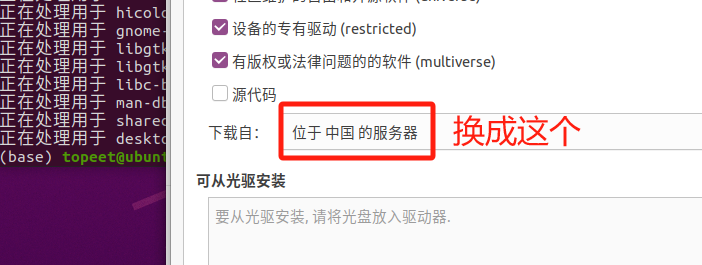

# 随记：


# 一、uboot开发
## 1、E: 仓库 “https://apt.packages.shiftkey.dev/ubuntu any Release” 没有 Release 文件
### 报错现象
```
E: 无法下载 https://mirrors.tuna.tsinghua.edu.cn/ubuntu-ports/dists/focal/main/binary-amd64/Packages  404  Not Found [IP: 101.6.15.130 443]
E: 无法下载 https://mirrors.tuna.tsinghua.edu.cn/ubuntu-ports/dists/focal-updates/main/binary-i386/Packages  404  Not Found [IP: 101.6.15.130 443]
E: 无法下载 https://mirrors.tuna.tsinghua.edu.cn/ubuntu-ports/dists/focal-backports/main/binary-amd64/Packages  404  Not Found [IP: 101.6.15.130 443]
E: 无法下载 https://mirrors.tuna.tsinghua.edu.cn/ubuntu-ports/dists/focal-security/main/binary-i386/Packages  404  Not Found [IP: 101.6.15.130 443]
E: 部分索引文件下载失败。如果忽略它们，那将转而使用旧的索引文件。
```

### 原因 - （因为下载时添加了一些软件源，但是这些软件源有问题）
- 1 下载源的问题。


- 1 这两个命令有问题，会到致出错。
- 1 $ wget -qO - [https://packagecloud.io/shiftkey/desktop/gpgkey](https://packagecloud.io/shiftkey/desktop/gpgkey) | sudo tee /etc/apt/trusted.gpg.d/shiftkey-desktop.asc > /dev/null  
- 1 $ sudo sh -c 'echo "deb [arch=amd64] [https://packagecloud.io/shiftkey/desktop/any/](https://packagecloud.io/shiftkey/desktop/any/) any main" > /etc/apt/sources.list.d/packagecloud-shiftky-desktop.list'


### 解决（弃掉这些特殊的软件源）（同时更改软件源）


```bash
sudo vim  /etc/apt/sources.list   一般改这个


//下面的专门的下载源，有些ubuntu没有
sudo vim /etc/apt/sources.list.d/packagecloud-shiftky-desktop.list
sudo vim /etc/apt/sources.list.d/packagecloud-shiftky-desktop.list.save
```

#### 更改sources.list配置文件更改软件源
[Ubuntu 更换软件源为国内源\_ubuntu官方源为国内源-CSDN博客](https://blog.csdn.net/m0_46259216/article/details/121325145)

- 1 阿里源

- 1 不要运行sudo apt upgrade    会更新所有软件，很麻烦。

## 2、cc1: error: bad value (‘armv5’) for ‘-march=’ switch
### 报错现象
> [!note]
> cc1: error: bad value (‘armv5’) for ‘-march=’ switch
> cc1: note: valid arguments to ‘-march=’ switch are: nocona core2 nehalem corei7 westmere sandybridge corei7-avx ivybridge core-avx-i haswell core-avx2 broadwell skylake skylake-avx512 cannonlake icelake-client icelake-server cascadelake tigerlake bonnell atom silvermont slm goldmont goldmont-plus tremont knl knm x86-64 eden-x2 nano nano-1000 nano-2000 nano-3000 nano-x2 eden-x4 nano-x4 k8 k8-sse3 opteron opteron-sse3 athlon64 athlon64-sse3 athlon-fx amdfam10 barcelona bdver1 bdver2 bdver3 bdver4 znver1 znver2 btver1 btver2 native
> make[1]: *** [Kbuild:44：lib/asm-offsets.s] 错误 1
> make: *** [Makefile:1282：prepare0] 错误 2
> 

### 原因
- 1 是因为你 **使用的是 x86 的本地 gcc 编译器**，而不是针对 ARM 的交叉编译器，所以它无法识别 `-`


### 解决
- **在Makefile文件下增加环境**
- 1 export ARCH=arm
- 1 export CROSS_COMPILE=arm-linux-gnueabihf-

## 3、`SyntaxError: Missing parentheses in call to 'print'` 
### 报错现象
```
CAT u-boot-dtb.bin COPY u-boot.bin MKIMAGE u-boot.img BINMAN u-boot-sunxi-with-spl.bin File "/home/topeet/V3s/u-boot-master/./tools/binman/binman", line 50 print result ^^^^^^^^^^^^ SyntaxError: Missing parentheses in call to 'print'. Did you mean print(...)? make: *** [Makefile:1106：u-boot-sunxi-with-spl.bin] 错误 1
```

### 原因
- 1 由于 `binman` 脚本中的 `print` 语句语法不符合 Python3 的规范导致的。

### 解决
找到 `binman` 脚本的位置（路径为错误信息中的 `/home/topeet/V3s/u-boot-master/tools/binman/binman`），并修改其内容：
- 将文件第一行：
    ```
    #!/usr/bin/env python
    ```
    改为：
    ```
    #!/usr/bin/env python2
    ```


## 4、make：arm-linux-gnueabi-gcc：命令未找到

### 报错现象
```
(base) topeet@ubuntu:~/V3s/v3s_lichee/lichee/linux-3.4$ bash ./scripts/build_tiger-cdr.sh CROSS_COMPILE=arm-linux-gnueabihf-
Building kernel
/home/topeet/V3s/v3s_lichee/lichee/linux-3.4/output/lib/modules/3.4.39
make：arm-linux-gnueabi-gcc：命令未找到
  CHK     include/linux/version.h
  CHK     include/generated/utsrelease.h
  CC      scripts/mod/empty.o
/bin/sh: 1: arm-linux-gnueabi-gcc: not found
make[2]: *** [scripts/Makefile.build:308：scripts/mod/empty.o] 错误 127
make[2]: *** 正在等待未完成的任务....
make[1]: *** [scripts/Makefile.build:443：scripts/mod] 错误 2
make[1]: *** 正在等待未完成的任务....
make: *** [Makefile:509：scripts] 错误 2
```

### 原因 - 缺少 ARM 的交叉编译器
- 1 系统缺少 ARM 的交叉编译器（`arm-linux-gnueabi-gcc`）


### 解决 - 剥离camdriod所⽤的lichee内核（添加交叉编译器）


## 5、


# 二、BSP内核开发
## 1、include/linux/compiler-gcc.h:100:1: fatal error: linux/compiler-gcc9.h: 没有那个文件或目录

### 报错现象
```
make[1]: “include/generated/mach-types.h”已是最新。 CC kernel/bounds.s In file included from include/linux/compiler.h:48, from include/linux/stddef.h:4, from include/linux/posix_types.h:4, from include/linux/types.h:17, from include/linux/page-flags.h:8, from kernel/bounds.c:9: include/linux/compiler-gcc.h:100:1: fatal error: linux/compiler-gcc9.h: 没有那个文件或目录 100 | #include gcc_header(__GNUC__) | ^~~~ compilation terminated. make[1]: *** [/home/topeet/V3s/v3s_lichee/lichee/linux-3.4/./Kbuild:36：kernel/bounds.s] 错误 1 make: *** [Makefile:988：prepare0] 错误 2
```

### 原因 -  Linux 3.4 兼容的 GCC 一般是 4.9 或者 5.x
- 1 Linux 3.4 兼容的 GCC 一般是 4.9 或者 5.x，使用过新的 GCC（如 9.x）会导致找不到 `compiler-gcc9.h`，并伴随其他不兼容问题

### 解决 - 安装低版本的GCC（gcc-5=5.4.0）
[Fetching Data#6p5f](https://blog.csdn.net/FRIGIDWINTER/article/details/138393473)

#### 切换gcc版本
- 1 sudo update-alternatives --config gcc

- 1 sudo update-alternatives --config g++


### 扩展 - gcc和g++区分
- 1 默认情况下，`gcc`不会自动链接C++标准库，如果你用`gcc`编译C++代码，你可能需要手动添加链接C++标准库的选项。

- 1 - 对于纯C++项目，`g++`提供了更为便捷的途径，因为它自动处理了大多数C++相关的细节，比如链接正确的库和使用适当的编译选项。


## 2、
### 报错现象


### 原因


### 解决


## 3、
### 报错现象


### 原因


### 解决


## 4、
### 报错现象


### 原因


### 解决


## 5、
### 报错现象


### 原因


### 解决


# 三、根⽂件系统开发
## 1、E: 仓库 “http://ftp2.cn.debian.org/debian stretch Release” 没有 Release 文件。
### 报错现象
```
Cache=/home/topeet/V3s/emdebian/mindb/target-rootfs/var/cache/apt/ update
忽略:1 http://mirrors.tuna.tsinghua.edu.cn/debian stretch InRelease
错误:2 http://mirrors.tuna.tsinghua.edu.cn/debian stretch Release
  404  Not Found [IP: 101.6.15.130 80]
正在读取软件包列表... 完成
E: 仓库 “http://ftp2.cn.debian.org/debian stretch Release” 没有 Release 文件。
N: 无法安全地用该源进行更新，所以默认禁用该源。
N: 参见 apt-secure(8) 手册以了解仓库创建和用户配置方面的细节。
apt update failed. Exit value: 100

```

### 原因 
- 1 Debian Stretch 已经不再位于常规镜像站点（包括清华 TUNA 镜像），而统一迁移到 Debian 归档服务器（archive.debian.org）


### 解决 - 修改 multistrap_mindb.conf 内容
```
[Debian]
source=http://archive.debian.org/debian/
suite=stretch
components=main contrib non-free
packages=apt kmod lsof
keyring=debian-archive-keyring

[Net]
source=http://archive.debian.org/debian/
suite=stretch
packages=netbase net-tools ethtool udev iproute iputils-ping ifupdown isc-dhcp-client ssh

[Utils]
source=http://archive.debian.org/debian/
suite=stretch
packages=locales adduser vim less wget dialog usbutils

```


## 2、Buildroot 正在尝试对 GCC 的源码目录应用一个过时补丁，但其目标文件路径与你实际的 GCC 4.3.5 源代码不匹配，所以 `patch` 命令找不到要修改的行。
### 报错现象
```
(base) topeet@ubuntu:~/V3s/v3s_lichee/lichee/buildroot$ make
# Apply any files named gcc-*.patch from the source directory to gcc
toolchain/patch-kernel.sh /home/topeet/V3s/v3s_lichee/lichee/buildroot/output/toolchain/gcc-4.3.5 toolchain/gcc/4.3.5 \*.patch 

Applying 301-missing-execinfo_h.patch using plaintext: 
can't find file to patch at input line 3
Perhaps you used the wrong -p or --strip option?
The text leading up to this was:
--------------------------
|--- gcc-4.0.0/boehm-gc/include/gc.h-orig	2005-04-28 22:28:57.000000000 -0500
|+++ gcc-4.0.0/boehm-gc/include/gc.h	2005-04-28 22:30:38.000000000 -0500
--------------------------
File to patch: 

```

### 原因
- 1 你遇到的 `301-missing-execinfo_h.patch` 应用失败，是因为 Buildroot 正在尝试对 GCC 的源码目录应用一个过时补丁，但其目标文件路径与你实际的 GCC 4.3.5 源代码不匹配，所以 `patch` 命令找不到要修改的行。

### 解决
- **禁用过时补丁（推荐）**


## 3、`makedevs.c` 中定义了一个变量 `ret`，但从未使用它。而编译器因为启用了 `-Werror`，将警告视为错误，从而导致构建失败。
### 报错现象
```
t-makedevs/makedevs.c:374:6: error: variable ‘ret’ set but not used [-Werror=unused-but-set-variable] int ret = EXIT_SUCCESS; ^ cc1: all warnings being treated as errors make: *** [package/makedevs/makedevs.mk:31：/home/topeet/V3s/v3s_lichee/lichee/buildroot/output/build/host-makedevs/makedevs] 错误 1
```

### 原因
- 1 这是因为 `makedevs.c` 中定义了一个变量 `ret`，但从未使用它。而编译器因为启用了 `-Werror`，将警告视为错误，从而导致构建失败。你有两个选择来修复它：

### 解决
- 1 在 `main()` 函数末尾，把 `return 0;` 修改为 `return ret;`，以确保 `ret` 被使用。例如：
```
return ret;
```

## 4、
### 报错现象


### 原因


### 解决


## 5、
### 报错现象


### 原因


### 解决

# 四、
## 1、
### 报错现象


### 原因


### 解决


## 2、
### 报错现象


### 原因


### 解决


## 3、
### 报错现象


### 原因


### 解决


## 4、
### 报错现象


### 原因


### 解决


## 5、
### 报错现象


### 原因


### 解决


