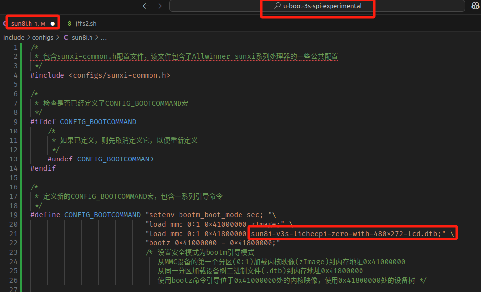
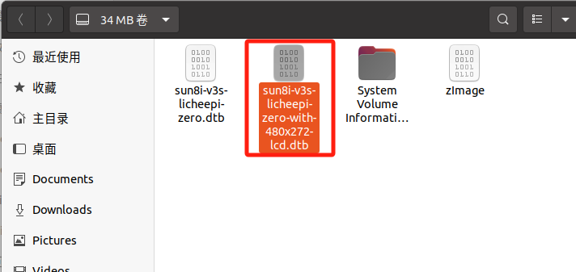
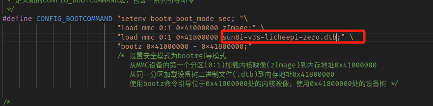
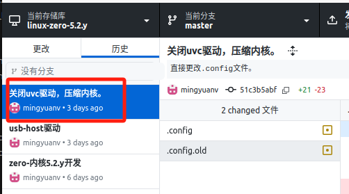

# 随记：


# 二、系统开发
## 1、烧录uboot时卡住
### 报错现象
- 1 sudo dd if=u-boot-sunxi-with-spl.bin of=/dev/sdb bs=1024 seek=8

### 原因
- 1 不知道为什么uboot镜像变成5g大小了，导致烧录时分区一被损坏。

### 解决
- 1 更换uboot镜像。

### 扩展 - 格式化
- 1 格式化并不能把分区去掉。两个分区都要格式化。最好用好的sd卡。
- 1 


# 三、flash烧录
## 1、没有在dev目录下生成mtd节点  - 要学会自己查看打印信息分析错误
### 报错现象
- 1 SPI Nor Flash 已成功识别并被加载：没有在dev目录下生成mtd节点

### 原因 - 启动了错误的设备树
```
U-Boot 2017.01-rc2-gb4093f6-dirty (Jun 29 2025 - 00:24:13 -0700) Allwinner Technology

CPU:   Allwinner V3s (SUN8I 1681)
Model: Lichee Pi Zero
DRAM:  64 MiB
MMC:   SUNXI SD/MMC: 0
SF: Detected mx25l25635f with page size 256 Bytes, erase size 64 KiB, total 32 MiB
*** Warning - bad CRC, using default environment

In:    serial@01c28000
Out:   serial@01c28000
Err:   serial@01c28000
Net:   No ethernet found.
starting USB...
No controllers found
Hit any key to stop autoboot:  0
reading zImage
4359232 bytes read in 227 ms (18.3 MiB/s)
reading sun8i-v3s-licheepi-zero-with-480x272-lcd.dtb
11762 bytes read in 27 ms (424.8 KiB/s)
## Flattened Device Tree blob at 41800000
   Booting using the fdt blob at 0x41800000
   Loading Device Tree to 42dfa000, end 42dffdf1 ... OK

```
`reading sun8i-v3s-licheepi-zero-with-480x272-lcd.dtb`

[[全志V3s芯片开发/全志V3s开发记录/assets/报错与解决/file-20250810171440183.png|Open: Pasted image 20250702144946.png]]

[[全志V3s芯片开发/全志V3s开发记录/assets/报错与解决/file-20250810171440291.png|Open: f9c8c9c9e8bb72fb5dd4d82bb2d7112.png]]


### 解决
- 1 删除sun8i-v3s-licheepi-zero-with-480x272-lcd.dtb
- 1 并改回sun8i-v3s-licheepi-zero.dtb。
[[全志V3s芯片开发/全志V3s开发记录/assets/报错与解决/file-20250810171440399.png|Open: Pasted image 20250702150026.png]]



## 2、# jffs2: jffs2_scan_eraseblock(): Magic bitmask 0x1985 not found at 0x000a0000: 0x3030 instead 问题(未)
[[烧录与启动#6、完整镜像的烧入]]

### 报错现象
> [   74.247308] jffs2: Further such events for this erase block will not be printed
[   74.255377] jffs2: Node at 0x00275f70 with length 0x00000144 would run over the end of the erase block
[   74.264700] jffs2: Perhaps the file system was created with the wrong erase size?
[   74.272403] jffs2: jffs2_scan_eraseblock(): Magic bitmask 0x1985 not found at 0x00276000: 0x53e2 instead
[   74.281903] jffs2: jffs2_scan_eraseblock(): Magic bitmask 0x1985 not found at 0x00276004: 0xfd89 instead
[   74.291443] jffs2: jffs2_scan_eraseblock(): Magic bitmask 0x1985 not found at 0x00276008: 0x9802 instead
[   74.300930] jffs2: jffs2_scan_eraseblock(): Magic bitmask 0x1985 not found at 0x0027600c: 0xc4f3 instead
[   74.310410] jffs2: jffs2_scan_eraseblock(): Magic bitmask 0x1985 not found at 0x00276010: 0x963e instead
[   74.319884] jffs2: jffs2_scan_eraseblock(): Magic bitmask 0x1985 not found at 0x00276014: 0x46d5 instead
[   74.329360] jffs2: jffs2_scan_eraseblock(): Magic bitmask 0x1985 not found at 0x00276018: 0x074c instead
[   74.338835] jffs2: jffs2_scan_eraseblock(): Magic bitmask 0x1985 not found at 0x0027601c: 0xd288 instead
[   74.348300] jffs2: jffs2_scan_eraseblock(): Magic bitmask 0x1985 not found at 0x00276020: 0xc296 instead
[   74.357775] jffs2: jffs2_scan_eraseblock(): Magic bitmask 0x1985 not found at 0x00276024: 0x2665 instead


### 原因  - 当前 eraseblock 是 **4 KiB**（4096 字节），低于 JFFS2 最低建议的 **8 KiB**。
```
# cat /proc/mtd
> dev:    size   erasesize  name
mtd0: 02000000 00001000 "spi0.0"
```

- 1 JFFS2 对擦除块大小有最低限制，官方要求是至少 **8 KiB**，因为每个 erase-block 至少要能放下一个完整的数据节点

- 1 像你的设备使用 **4 KiB** 擦除块，可能会导致：
- 2 JFFS2 显示警告或无法挂载；
- 2 性能极差甚至失败挂载。


### 解决 - 之前乱改导致一个内核选项改错。（原教程没问题）
- 3 取消选择`CONFIG_MTD_SPI_NOR_USE_4K_SECTORS` | 支持 4KB 擦除粒度（W25适用）        <span style="background:#d3f8b6">会导致erasesize=4 KiB</span>


## 3、Starting kernel ...启动卡在内核了
### 报错现象
> aSF: 5242880 bytes @ 0x110000 Read: OK
> 
>  Flattened Device Tree blob at 41800000
> 
> Booting using the fdt blob at 0x41800000
> 
> Loading Device Tree to 42dfa000, end 42dffc04 ... OK
> 
> Starting kernel ...启动卡在内核了

### 原因 - zImage 大小超过5M了，覆盖了dtb
```
/* 定义启动命令，用于引导加载程序执行一系列操作。
 * 首先探测SPI Flash设备是否可用（ID为0）；
 *表⽰选择第⼀个 nor flash；
/* 从flash 0x100000的位置拷⻉64k 到内存0x41800000的位置； */
/* 从flash 0x110000的位置拷⻉ 5M到内存0x41000000的位置； */
/* 使用bootz命令，告诉cpu kernel和dtb位于这两个位置， 稍后cpu会跳到kernel的位置继续执⾏。 */
#define CONFIG_BOOTCOMMAND \
    "sf probe 0; " \
    "sf read 0x41800000 0x100000 0x10000; " \
    "sf read 0x41000000 0x110000 0x500000; " \
    "bootz 0x41000000 - 0x41800000"
```

### 解决 -  去掉usb摄像头驱动就可
[[全志V3s芯片开发/全志V3s开发记录/assets/报错与解决/file-20250810171440481.png|Open: Pasted image 20250704162532.png]]



## 4、U盘在虚拟机ubuntu系统上能看到两个分并能挂载，但在我自己制作的buildroot系统上看不到sda1和sda2分区，且挂载不了。（U盘问题，放文件sda1进里面在插芯片就可）
### 报错现象


### 原因（不是主要问题，改不改没事）
确保你的 Linux kernel 配置里包含：
> CONFIG_USB=y 
> CONFIG_USB_STORAGE=m 或 y 
> CONFIG_SCSI=y 
> CONFIG_BLK_DEV_SD=y 
> `CONFIG_PARTITION_ADVANCED=y   没有
> `CONFIG_PARTITION=y            没有


### 解决 - U盘问题，放文件sda1进里面在插芯片就可


## 5、glibc 版本低于 2.28（如 Ubuntu 18.04 默认为 2.27）（未）
### 报错现象

```
# ./wpa_supplicant -D wext -c /mnt/wpa_supplicant.conf -i wlan0 & 
# ./wpa_supplicant: /lib/libc.so.6: version `GLIBC_2.28' not found (required by ./wpa_supplicant)` ./wpa_supplicant: /lib/libc.so.6: version `GLIBC_2.28' not found (required by /mnt/lib/libnl-3.so.200)`
```
### 原因


### 解决


# 四、
## 1、
### 报错现象


### 原因


### 解决


## 2、
### 报错现象


### 原因


### 解决


## 3、
### 报错现象


### 原因


### 解决


## 4、
### 报错现象


### 原因


### 解决


## 5、
### 报错现象


### 原因


### 解决


