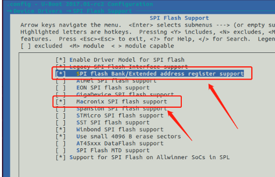
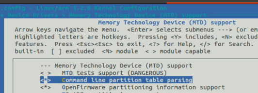
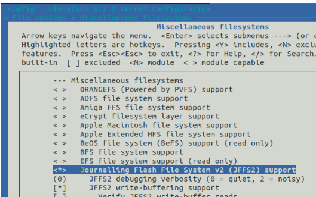
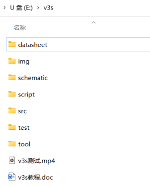
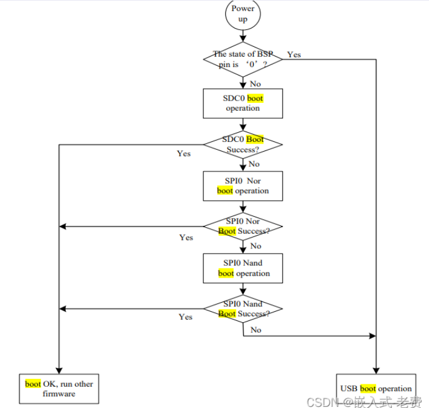
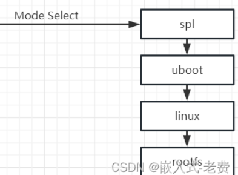

# 随记：


# 一、基于usb otg的spi nand镜像烧⼊（PhoenixSuit）
## 1、基础知识
### nor flash和nand flash有什么区分
- **选NOR Flash**：需直接执行代码（XIP）、高可靠性、小容量场景（如BIOS、IoT设备）。
- **选NAND Flash**：需大容量、低成本、高速写入场景（如手机存储、SSD）。

- 1 现代系统常结合两者（NOR存储引导程序，NAND存储主数据），例如<span style="background:#affad1">嵌入式设备中NOR用于启动，NAND用于存储操作系统和用户数据</span>。


## 2、让v3s进⼊usb boot状态

### 再次学习v3s的系统启动⽅式
> [!PDF|note] [[全志V3s芯片开发/全志V3s开发记录/assets/烧录与启动/file-20250810171442110.pdf#page=2&selection=344,1,356,1&color=note|26、基于usb otg的spi-nand镜像烧入, p.2]]
> > 再次学习v3s的系统启动⽅式
> 
> 

- 1 第⼀种，就是查看到v3s的⼀根pin状态为0的时候；
- 1 第⼆种就是sdc0、spi0 nor、spi0 nand都失败的情况下，也会进⼊到usb boot状态


### 第⼀种方法 - 理论讲解
> [!PDF|note] [[全志V3s芯片开发/全志V3s开发记录/assets/烧录与启动/file-20250810171442110.pdf#page=4&selection=2,0,19,0&color=note|26、基于usb otg的spi-nand镜像烧入, p.4]]
> > 从电路图上可以看出，这⾥有⼀个s6开
> 
> 

### 第⼀种方法 - 实际操作

> [!PDF|note] [[全志V3s芯片开发/全志V3s开发记录/assets/烧录与启动/file-20250810171442110.pdf#page=4&selection=319,0,327,1&color=note|26、基于usb otg的spi-nand镜像烧入, p.4]]
> > 实操让v3s进⼊usb boot状态
> 
> 


### 第二种方法
- 1 如果sd卡启动检测失败（没有sd卡或者sd卡中没有启动ubootspl），然后spiflash也启动检测失败（<span style="background:#affad1">没有spiflash或者spiflash中没有启动ubootspl），那么会⾃动进⼊fel模式。</span>


- 1 如果你的<span style="background:#b1ffff">spiflash已经有了启动镜像</span>，那么需要<span style="background:#affad1">在sd卡中烧⼊⼀个sunxi提供的启动 ⼯具（ dd if=fel-sdboot.sunxi of=/dev/mmcblk0 bs=1024 seek=8 ）</span>，那么插⼊该 sd卡启动会进⼊fel模式；还有另⼀种⽅法，<span style="background:#affad1">擦除spiflash内容上点也会进⼊fel模式</span>

### 进入usb状态后逻辑
- 1 进⼊usb状态之后，⼀⽅⾯它会从usb otg获取数据，另外⼀⽅⾯可以把数据通过spi烧⼊到nand flash上⾯

- 1 ⼤家可以把这个过程看成是v3s有⼀段默认的固化逻辑，这部分是芯⽚⾃带的流程，不需要外界的参与


## 3、安装PhoenixSuit软件
### PhoenixSuit软件下载
- 1 [PhoenixSuit下载-PhoenixSuit(一键刷机工具)官方版下载 v1.10-当快软件园](https://www.downkuai.com/soft/71844.html)

### USB设备(VID_1f3a_PID_efe8)驱动下载（解决报错）
- 1 给usb安装驱动

```cardlink
url: https://gitcode.com/open-source-toolkit/cf972/?utm_source=tools_gitcode&index=bottom&type=card
title: "GitCode - 全球开发者的开源社区,开源代码托管平台"
description: "GitCode是面向全球开发者的开源社区,包括原创博客,开源代码托管,代码协作,项目管理等。与开发者社区互动,提升您的研发效率和质量。"
host: gitcode.com
favicon: https://cdn-static.gitcode.com/static/images/logo-favicon.png
image: https://cdn-static.gitcode.com/static/images/logo-favicon.png
```

- 1 如果我们希望⽤PhoenixSuit进 ⾏镜像⽂件下载的话，最好还是选⽤PhoenixSuit提供的usb驱动，这样可以避免很多⿇ 烦、少⾛很多的弯路（<span style="background:#ff4d4f">不行有报错</span>）
### 


## 4、烧写镜像⽂件
### 使用PhoenixSui软件烧入
- 1 打开PhoenixSuit，选择⼀键刷机，设置好img⽂件的位置，注意最好同时选择格式化，单击⽴即升级。
- 1 中间弹出的各种告警信息都可以忽略

## 5、spi-nand image制作与烧录

### 准备xfel⼯具
> [!PDF|note] [[全志V3s芯片开发/全志V3s开发记录/assets/烧录与启动/file-20250810171442198.pdf#page=2&selection=451,1,456,1&color=note|30、spi-nand image制作, p.2]]
> > 准备xfel⼯具
> 
> 

### 下载和编译新的uboot代码
> [!PDF|note] [[全志V3s芯片开发/全志V3s开发记录/assets/烧录与启动/file-20250810171442198.pdf#page=3&selection=524,0,531,1&color=note|30、spi-nand image制作, p.3]]
> > 下载和编译uboot代码
> 
> 

- 1 早期的uboot是不⽀持spi-nand启动的

> [!PDF|note] [[全志V3s芯片开发/全志V3s开发记录/assets/烧录与启动/file-20250810171442198.pdf#page=6&selection=20,1,25,1&color=note|30、spi-nand image制作, p.6]]
> > menuconfig的设置。
> 
> 

### 利⽤sh脚本修改u-boot-sunxi-with-spl.bin⽂件
> [!PDF|note] [[全志V3s芯片开发/全志V3s开发记录/assets/烧录与启动/file-20250810171442198.pdf#page=11&selection=206,0,215,1&color=note|30、spi-nand image制作, p.11]]
> > 利⽤sh脚本修改u-boot-sunxi-with-spl.bin⽂件
> 
> 

- 1 让v3s⽀持1个page是2k byte的nand flash
### 利⽤xfel烧⼊splt.bin⽂件
> [!PDF|note] [[全志V3s芯片开发/全志V3s开发记录/assets/烧录与启动/file-20250810171442198.pdf#page=12&selection=235,0,242,1&color=note|30、spi-nand image制作, p.12]]
> > 利⽤xfel烧⼊splt.bin⽂件
> 
> 

### 修改和烧⼊kernel⽂件
> [!PDF|note] [[全志V3s芯片开发/全志V3s开发记录/assets/烧录与启动/file-20250810171442198.pdf#page=12&selection=287,0,294,1&color=note|30、spi-nand image制作, p.12]]
> > 修改和烧⼊kernel⽂件
> 
> 

> [!PDF|note] [[全志V3s芯片开发/全志V3s开发记录/assets/烧录与启动/file-20250810171442198.pdf#page=15&selection=46,0,53,1&color=note|30、spi-nand image制作, p.15]]
> > ⽤xfel进⾏烧⼊处理
> 
> 

> [!PDF|note] [[全志V3s芯片开发/全志V3s开发记录/assets/烧录与启动/file-20250810171442198.pdf#page=15&selection=79,1,104,1&color=note|30、spi-nand image制作, p.15]]
> > 除了xfel之外，⽤uboot⾃⾝的mtd命令和y modem协议也是可以烧⼊的


### 编译和烧⼊根⽂件系统
> [!PDF|note] [[全志V3s芯片开发/全志V3s开发记录/assets/烧录与启动/file-20250810171442198.pdf#page=17&selection=267,1,277,1&color=note|30、spi-nand image制作, p.17]]
> > 编译和烧⼊根⽂件系统
> 
> 

- 1 nandflash⼀般⽤ubifs⽂件系统⽐较多。

> [!PDF|note] [[全志V3s芯片开发/全志V3s开发记录/assets/烧录与启动/file-20250810171442198.pdf#page=17&selection=120,1,126,1&color=note|30、spi-nand image制作, p.17]]
> > ⽤xfel⼯具烧⼊


### 整体测试
> [!PDF|note] [[全志V3s芯片开发/全志V3s开发记录/assets/烧录与启动/file-20250810171442198.pdf#page=18&selection=214,1,218,1&color=note|30、spi-nand image制作, p.18]]
> > 整体测试
> 
> 


### 有参考意义的两个链接地址
感谢⽹友的帮助， 
1） https://whycan.com/t_8184.html 
2） https://whycan.com/t_9244.html#p86894


### 


# 二、基于usb otg的spi nor镜像烧⼊（sunxi-fel）（开发板使用的是这个）

## 1、flash了解
### nor flash和nand flash有什么区分
- **选NOR Flash**：需直接执行代码（XIP）、高可靠性、小容量场景（如BIOS、IoT设备）。
- **选NAND Flash**：需大容量、低成本、高速写入场景（如手机存储、SSD）。

- 1 现代系统常结合两者（NOR存储引导程序，NAND存储主数据），例如<span style="background:#affad1">嵌入式设备中NOR用于启动，NAND用于存储操作系统和用户数据</span>。

- 1 ⼀般来说nandflash⼤⼀点，会有512m、1g、2g这样的⼏个规格。⽽norflash 则⼩得多，⼀般也就是128m、256m⽐较常⻅。
### W25Q128JVSIQ   Flash芯片
- 1 全新原装 W25Q128JVSIQ 25Q128JVSQ SOP-8   3V <span style="background:rgba(140, 140, 140, 0.12)"><span style="background:rgba(140, 140, 140, 0.12)">1</span>28Mbit串行闪存</span>  相当于<span style="background:#affad1"> 16M </span>字节


## 2、安装sunxi-tools⼯具

### 了解
- 1 ⽤linux版本的sunxi-tools来实现spi nor flash的烧⼊。涉及到libusb这个库。

### 安装sunxi-tools⼯具
- 3 准备  下载
- 1 [GitHub - Icenowy/sunxi-tools at v3s-spi](https://github.com/Icenowy/sunxi-tools/tree/v3s-spi)
- 1 sudo apt-get install libusb-1.0-0-dev

- 3 编译    ⽣成sunxi-fel⼯具
- 1 make

## 3、编译spi norflash的uboot
### 下载uboot-spi代码
 - 1 [GitHub - Lichee-Pi/u-boot at v3s-spi-experimental](https://github.com/Lichee-Pi/u-boot/tree/v3s-spi-experimental)

### 基础配置
- 1 make ARCH=arm CROSS_COMPILE=arm-linux-gnueabihf- LicheePi_Zero_defconfig

- 3 让uboot⽀ 持⼤容量的norflash，即超过16M的flash。                                                第⼆个，就是让uboot⽀持mxic的 norflash，因为默认uboot只⽀持winbond品牌。
- 1  make ARCH=arm menuconfig 
[[全志V3s芯片开发/全志V3s开发记录/assets/烧录与启动/file-20250810171442275.png|Open: Pasted image 20250626224525.png]]


### 编译
- 3 make ARCH=arm CROSS_COMPILE=arm-linux-gnueabihf-

- 2 生成u-boot-sunxi-with-spl.bin

## 4、烧⼊、运⾏新的uboot
### 确认usb接⼊、spi flash设备被识别

> (base) topeet@ubuntu:~/V3s/sunxi-tools-3s-spi$ `sudo ../sunxi-tools-3s-spi/sunxi-fel version`
[sudo] topeet 的密码： 
AWUSBFEX soc=00001681(V3s) 00000001 ver=0001 44 08 scratchpad=00007e00 00000000 00000000
(base) topeet@ubuntu:~/V3s/sunxi-tools-3s-spi$ `sudo ../sunxi-tools-3s-spi/sunxi-fel spiflash-info`
Manufacturer: Winbond (EFh), model: 40h, size: 16777216 bytes.


### spi flash-write⼦命令来进⾏烧⼊、spiflash-read读出flash
> (base) topeet@ubuntu:~/V3s/u-boot-3s-spi-experimental$ `sudo ../sunxi-tools-3s-spi/sunxi-fel -p spiflash-write 0x0 u-boot-sunxi-with-spl.bin`
100% [================================================]   411 kB,   53.4 kB/s 
(base) topeet@ubuntu:~/V3s/u-boot-3s-spi-experimental$ `sudo ../sunxi-tools-3s-spi/sunxi-fel -p spiflash-read 0x0 0x1000 4k.bin`
100% [================================================]     4 kB,   41.7 kB/s 


### uboot下擦除flash - sf命令
> => `sf probe 0; 
> SF: Detected mx25l25635f with page size 256 Bytes, erase size 64 KiB, total 32MiB 
> => `sf erase 0x0 0x100000; 
> SF: 1048576 bytes @ 0x0 Erased: OK 
> => `reset 
> resetting ...

- 1 把norflash的前⾯1M空间重新擦除

## 5、spi-nor image制作
### rootfs的⼤⼩是
- 1 32M-1M-64K-5M=0x19F0000

- 2 0x0~0x100000是uboot空间，0x100000~0x110000是dtb空间， 0x110000~0x610000是kernel空间，剩下来的0x610000~都是rootfs的空间

### mtd-utils⼯具安装
- 1 sudo apt-get install mtd-utils
- 2 于创建JFFS2文件系统的工具，JFFS2是一种专门为闪存设备设计的日志文件系统。
### 创建系统镜像⽂件（jffs2）
- 3 sudo chown root * -R
- 2 `root`: 指定新的文件所有者为root用户。
- 2 `*`: 表示当前目录下的所有文件和子目录。
- 2 `-R`: 表示递归地应用该命令到所有子目录及其内容中。

- 3 sudo mkfs.jffs2 -s 0x100 -e 0x1000 -p 0x19F0000 -d workdir/ -o jffs2.img
- 2 `-s 0x100`: 设置擦除块大小（erase block size）
- 2 `-e 0x10000`: 设置擦除区大小（erase zone size），即每个擦除块的大小，
- 2 - `-p 0x19F0000`: 指定输出文件的大小，这里是`0x9F0000`字节。这定义了生成的JFFS2镜像文件的大小。0x9F0000只是表⽰它可以占领这么⼤的空间。
- 2 `-d workdir/`: 指定包含要打包到文件系统中的文件和目录的源目录，
- 
### 修改uboot - 引导启动内核
- 3  include/configs/sun8i.h下，在“#include <configs/sunxi-common.h> ”的前边添加
```
/* 定义启动命令，用于引导加载程序执行一系列操作。
 * 首先探测SPI Flash设备是否可用（ID为0）；
 *表⽰选择第⼀个 nor flash；
/* 从flash 0x100000的位置拷⻉64k 到内存0x41800000的位置； */
/* 从flash 0x110000的位置拷⻉ 5M到内存0x41000000的位置； */
/* 使用bootz命令，告诉cpu kernel和dtb位于这两个位置， 稍后cpu会跳到kernel的位置继续执⾏。 */
#define CONFIG_BOOTCOMMAND \
    "sf probe 0; " \
    "sf read 0x41800000 0x100000 0x10000; " \
    "sf read 0x41000000 0x110000 0x500000; " \
    "bootz 0x41000000 - 0x41800000"

/* 定义启动参数，传递给内核以配置系统的初始化设置。 */
/* 设置控制台输出端口和波特率；启用早期打印功能；
 * 设置panic时自动重启的时间为5秒；等待根文件系统准备就绪；
 * 对MTD分区进行定义：spi0.0代表设备名，后面的数字代表分区大小及名称。
 * 其中uboot、dtb和kernel分区被设置为只读，而rootfs分区是可写的。
 * 最后指定根文件系统的挂载信息，包括mtd编号和文件系统类型。
 * 5.2.y的新kernel⼀定要写成spi0.0形式
 */
#define CONFIG_BOOTARGS \
    "console=ttyS0,115200 earlyprintk panic=5 rootwait " \
    "mtdparts=spi0.0:1M(uboot)ro,64k(dtb)ro,5M(kernel)ro,-(rootfs) " \
    "root=31:03 rw rootfstype=jffs2"
```

### 修改kernel - 让kernel⽀持jffs2⽂件系统
- 3 make menuconfig ARCH=arm
[[全志V3s芯片开发/全志V3s开发记录/assets/烧录与启动/file-20250810171442353.png|Open: Pasted image 20250629114655.png]]


[[全志V3s芯片开发/全志V3s开发记录/assets/烧录与启动/file-20250810171442438.png|Open: Pasted image 20250629114713.png]]


- 2 spi的部分，复⽤之前spi-nor驱动的修改就⾏，不需要修改设备树


### spi-nor image制作脚本 - sudo ./jffs2.sh
- 3 sudo ./jffs2.sh
```
# 第一步：初始化一个32MB大小的空镜像文件，填充为零。
# 使用 if=/dev/zero 作为输入文件（无限提供零字节的特殊文件），of=flashimg.bin 指定输出文件名。
# bs=1M 设置块大小为1MB，count=32 表示写入32个这样的块，总共32MB。
dd if=/dev/zero of=flashimg.bin bs=1M count=32

# 第二步：将U-Boot引导加载程序（u-boot-sunxi-with-spl.bin）写入到flashimg.bin的开头。
# bs=1K 设置块大小为1KB，conv=notrunc 参数确保不截断输出文件（即保留flashimg.bin的其余部分）。
# 注意：这个操作会覆盖掉flashimg.bin开始的部分数据，因此它应该在创建flashimg.bin后立即执行。
dd if=u-boot-sunxi-with-spl.bin of=flashimg.bin bs=1K conv=notrunc

# 第三步：将设备树二进制文件（sun8i-v3s-licheepi-zero-with-480x272-lcd.dtb）写入到flashimg.bin中偏移量1024KB的位置。
# seek=1024 表示跳过前面的1024KB，从第1025KB开始写入数据，conv=notrunc 避免截断文件。
# 这样做是为了确保引导加载程序和设备树二进制文件不会相互覆盖。
dd if=sun8i-v3s-licheepi-zero.dtb of=flashimg.bin bs=1K seek=1024 conv=notrunc

# 第四步：将内核镜像（zImage）写入到flashimg.bin中偏移量1088KB的位置。
# seek=1088 跳过了前1088KB的数据，从第1089KB开始写入zImage，conv=notrunc 确保整个文件不会被截断。
# 此步骤保证了内核镜像与之前写入的引导加载程序及设备树不会发生冲突。
dd if=zImage of=flashimg.bin bs=1K seek=1088 conv=notrunc

# 第五步：将JFFS2根文件系统映像（jffs2.img）写入到flashimg.bin中偏移量6208KB的位置。
# seek=6208 指定了起始写入位置，bs=1K 设置块大小为1KB，conv=notrunc 防止文件被截断。
# 这一步骤将文件系统放置于指定位置，确保其独立于其他组件，避免相互覆盖。
dd if=jffs2.img of=flashimg.bin bs=1K seek=6208 conv=notrunc
```
## 6、完整镜像的烧入
### 烧录镜像到flash - sunxi-fel烧⼊（慢）
[[烧录与启动#spi flash-write⼦命令来进⾏烧⼊、spiflash-read读出flash]]
- 3 先擦除整个flash先
> => `sf probe 0;    探测并初始化 SPI Flash 设备，0表示第一个 SPI 设备（如 spi0.0）。
> SF: Detected mx25l25635f with page size 256 Bytes, erase size 64 KiB, total 32MiB 
> => `sf erase 0x0 0x1000000;     擦除16MB区域大小
> SF: 1048576 bytes @ 0x0 Erased: OK 
> => `reset 
> resetting ...

- 3 烧录镜像到flash
> (base) topeet@ubuntu:~/V3s/output$ `sudo ../sunxi-tools-3s-spi/sunxi-fel version`
AWUSBFEX soc=00001681(V3s) 00000001 ver=0001 44 08 scratchpad=00007e00 00000000 00000000
(base) topeet@ubuntu:~/V3s/output$ `sudo ../sunxi-tools-3s-spi/sunxi-fel -p spiflash-write 0x0 flashimg.bin`


### 烧⼊flashimg.bin和启动v3s（从sd卡烧入到flash）
> [!PDF|note] [[全志V3s芯片开发/全志V3s开发记录/assets/烧录与启动/file-20250810171442514.pdf#page=7&selection=551,0,556,3&color=note|29、spi-nor image制作, p.7]]
> > 烧⼊flashimg.bin和启动v3s
> 
> 

`sudo mkfs.jffs2 -s 0x100 -e 0x10000 -p 0x19F0000 -d workdir/ -o jffs2.img

- 3 拷呗境像到rootfs/root目录下
> (base) topeet@ubuntu:~/V3s/output-flash$ `sudo cp ./flashimg.bin ../output-sd/workdir/root/`
> `cd ~/V3s/output-sd`
> (base) topeet@ubuntu:~/V3s/output-sd$ `sudo tar cf rootfs.tar -C workdir .`
> (base) topeet@ubuntu:~/V3s/output-sd$ `./sd.sh`
kernel
> 
- 3 sf erase命令erase掉整个flash
> => `sf probe 0`
SF: Detected mx25l25635f with page size 256 Bytes, erase size 64 KiB, total 32 MiB
=> `sf erase 0x0 0x2000000`
SF: 33554432 bytes @ 0x0 Erased: OK
=> `reset`
resetting ...
- 3 dd拷⻉flashimg.bin即可
> `dd if=flashimg.bin of=/dev/mtd0`


## 7、nor flash启动测试
- 3 看⼀下mtd的布局
ls -l /dev/mtd*


- 3 再确认⼀下，留给客⼾的mtd空间⼤约还剩下多少
df


# 三、基于uboot和y modem的镜像烧⼊⽅法（串口烧入）

## 1、uboot+y modem烧⼊的优势
- 1 测试sunxi-fel，如果烧⼊的⽂件很⼤，⽐如说整个⽂件有16M、32M，那么失败的⻛险很⾼。
- 2 鉴于此，我们提出了使⽤uboot+y modem来实现镜像⽂件烧⼊的⽅法。
## 2、安装和配置minicom（ubuntu下）
> `sudo apt-get install minicom              安装好minicom          
> (base) topeet@ubuntu:~/V3s$ `ls -l /dev/ttyUSB*
crw-rw---- 1 root dialout 188, 0 6月  26 19:37 /dev/ttyUSB0
(base) topeet@ubuntu:~/V3s$ `sudo minicom -s       配置minicom    `        
- 2 选择“Serial Port Setup”，修改好端⼝名称      输入大写字母就可以跳转，回车确认
- 2 保存为dfl，接着Exit from Minicom


## 3、使用minicom烧入

> `sudo minicom       进⾏串⼝通信  如果需要退出的话，输⼊ctrl + a、z，接着输⼊x即可。
> 输⼊`loady 0x41800000，接着输⼊ctrl+a(单击一下)、s，选择y modem。
- 2 通过上下移动选择⽂件，空格单击确认⽂件，单击回⻋后就可以开始传输了。如果是选择⽬录，那么空格双击就好了。选择[..]目录跳转到上一级。

- 1 当然这个操作，只是把数据从pc经过串⼝传递到了v3s的ddr空间。如果需要把镜像 copy到flash上⾯，<span style="background:#affad1">还需要sf命令的帮忙</span>，这样才能真正烧⼊到nor flash或者nandflash 当中

- 3 esc退出


# 四、基于sd卡的镜像烧⼊⽅法

## 1、烧⼊sd卡启动
[[全志V3s芯片开发/全志V3s开发记录/系统开发#四、烧⼊sd卡启动]]


## 2、系统image创建和烧⼊ - 在windows下⾯ 烧⼊镜像⽂件。
[[全志V3s芯片开发/全志V3s开发记录/系统开发#五、系统image创建和烧⼊ - 在windows下⾯ 烧⼊镜像⽂件。]]


# 五、基于sd卡和linux系统的镜像输⼊（从sd卡烧入flash）

[[烧录与启动#烧⼊flashimg.bin和启动v3s（从sd卡烧入到flash）]]

# 六、windows平台镜像烧⼊

## 1、利⽤sd卡烧⼊（做过）
[[全志V3s芯片开发/全志V3s开发记录/系统开发#五、系统image创建和烧⼊ - 在windows下⾯ 烧⼊镜像⽂件。]]
## 2、利⽤xfel⼯具烧⼊（windos版）（同时⽀持 spi-nor和spi-nand）
> [!PDF|important] [[全志V3s芯片开发/全志V3s开发记录/assets/烧录与启动/file-20250810171442531.pdf#page=2&selection=527,0,533,1&color=important|31、windows平台镜像烧入, p.2]]
> > 利⽤xfel⼯具烧⼊
> 
> 

- 1 命令执⾏也有⼀定的失败机会，⼀般来说多测试⼏次就好了。成功的概率还是不错的
### 


### 


### 


## 3、xfel+y modem（SecureCRT软件）安装
> [!PDF|important] [[全志V3s芯片开发/全志V3s开发记录/assets/烧录与启动/file-20250810171442531.pdf#page=4&selection=417,0,421,1&color=important|31、windows平台镜像烧入, p.4]]
> > 利⽤xfel+y modem安装
> 
> 

- 1 ⽤xfel烧⼊uboot⽂件。
- 1 uboot最好还是慎重⼀些，不是特别紧急的变更，最好不要修改。
### 


### 


### 


# 七、full image制作和资料汇总（spi-nor启动）
- 1 加上app代码的构建

## 1、full image制作脚本（包含编译源码）（看看就行了）
```
#!/bin/sh

# 进入u-boot源码目录并编译u-boot
cd ../u-boot-3s-spi-experimental/
make ARCH=arm CROSS_COMPILE=arm-linux-gnueabihf-
cd ..

# 构建内核（注意：原代码中'nakeARCH=aLm'似乎是拼写错误，应为'make ARCH=arm'）
tbuild kernel
cd ../linux-zero-5.2.y
make ARCH=arm CROSS_COMPILE=arm-linux-gnueabihf-
cd ..

# 构建rootfs (根文件系统)
fbuild rootfs
cd ../buildroot-2017.08
sudo make
cd ..

# 构建应用程序，并将demo应用复制到rootfs
tbuild app, for different use cd/app
make
cd -
# 复制demo应用到rootfs
sudo cp ../app/demo ../buildroot-2017.08/output/target/root
echo ../buildroot-2017.08/output

# 创建jffs2格式的文件系统镜像
sudo mkfs.jffs2 -s 0x100 -e 0x10000 -p 0x190000 -d target/ -o jffs2.img
cd ..

# 将所有必要的映像文件和设备树二进制文件复制到当前工作目录
cp ../u-boot-3s-spi-experimental/u-boot-sunxi-with-spl.bin .
cp ../linux-zero-5.2.y/arch/arm/boot/zImage .
cp ../linux-zero-5.2.y/arch/arm/boot/dts/sun8i-v3s-licheepi-zero-with-480x272-1cd.dtb .
cp ../buildroot-2017.08/output/jffs2.img .

# 生成最终的flash映像文件
dd if=/dev/zero of=flashimg.bin bs=1M count=32
dd if=u-boot-sunxi-with-spl.bin of=flashimg.bin bs=1K conv=notrunc
dd if=sun8i-v3s-licheepi-zero-with-480x272-1cd.dtb of=flashimg.bin bs=1K seek=1024
dd if=zImage of=flashimg.bin bs=1K seek=1088 conv=notrunc
dd if=jffs2.img of=flashimg.bin bs=1K seek=6208 conv=notrunc
```

## 2、开发过程中积累的⽂档资料整理归类 - 方法论

[[全志V3s芯片开发/全志V3s开发记录/assets/烧录与启动/file-20250810171442554.png|Open: Pasted image 20250629164320.png]]


- 2 `datasheet`中包含了电路的主要元器件的⼿册⽂ 件，⽐如soc、nandflash、wifi模块等等。
- 2 `schematic`则包含了主要的原理图⽂件
- 2 `script`则保存了full image的⽣成脚本
- 2 `src`是源代码区域，⾥⾯包含了uboot、kernel、buildroot、tinyalsa等开源代码。
- 2 `test`是上位机代码和程序的位置。
- 2 `tool`保存了使⽤中遇到的各种⼯具，⽐如virtualbox、ubuntu、 notepad++、sunxi-fel、xfel、zadig、PhonixSuit软件
- 3  保存好了这些资料，后续再次学习和使⽤的时候就很⽅便了。


# 八、四种启动⽅式
> [!PDF|important] [[全志V3s芯片开发/全志V3s开发记录/assets/烧录与启动/file-20250810171442633.pdf#page=1&selection=153,1,159,1&color=important|38、四种启动方式, p.1]]
> > 四种启动⽅式

## 1、启动顺序
### 启动顺序图
[[全志V3s芯片开发/全志V3s开发记录/assets/烧录与启动/file-20250810171442649.png|Open: Pasted image 20250702011631.png]]


### USB boot operation（USB启动状态）
- 1 ⾸先，看BSP的 pin有没有短接，如果短接了，就直接跳转到USB boot operation
- 2 这个短接pin其实就 38、四种启动⽅式 2 / 7 是spi接⼝上的短接pin。
- 1 注意看，如果上⾯三个还是不成功，也同样会进⼊到USB boot operation。

- 2  进⼊USB的状态之后， 我们就可以⽤sunxi-fel或者xfel命令进⾏操作了。
### 有介质的启动
- 1 依次看sd0、spi nor、spi nand的启动顺序

## 2、uboot加载（烧入）方式
- 3 uboot是linux系统中⾮常重要的内容，不同启动⽅式uboot是不能⼀样的
### 对USB来说
- 1 `sudo ../sunxi-tools-3s-spi/sunxi-fel uboot u-boot-sunxi-with-spl.bin`
### micro sd卡
- 1 依赖ubuntu的`dd`命令来解决。
### spi-nor flash
- 1 需要先通过`sunxi-fel`写⼊uboot内容，然后才能从spi-nor加载成功

### spi-nand flash
- 1 需要的命令是`xfel`，当然也是需要先写⼊uboot，才能从spi-nand正确加载的。

### 


## 3、uboot组成（启动打印）
- 3 v3s来说，它还有⼀个很重要的地⽅。那就是，它的uboot⽂件，其实是两个uboot合并起来的
### U-Boot SPL
```
U-Boot SPL 2017.01-rc2-00058-g464ddd683a7-dirty (Jun 28 2025 - 07:14:30)
DRAM: 64 MiB
Trying to boot from MMC1
```

### U-Boot 2022.04 
```
U-Boot 2017.01-rc2-00058-g464ddd683a7-dirty (Jun 28 2025 - 07:14:30 -0700) Allwinner Technology

CPU:   Allwinner V3s (SUN8I 1681)
Model: Lichee Pi Zero
DRAM:  64 MiB
MMC:   SUNXI SD/MMC: 0
*** Warning - bad CRC, using default environment

In:    serial@01c28000
Out:   serial@01c28000
Err:   serial@01c28000


U-Boot 2017.01-rc2-00058-g464ddd683a7-dirty (Jun 28 2025 - 07:14:30 -0700) Allwinner Technology

CPU:   Allwinner V3s (SUN8I 1681)
Model: Lichee Pi Zero
DRAM:  64 MiB
MMC:   SUNXI SD/MMC: 0
*** Warning - bad CRC, using default environment

In:    serial@01c28000
Out:   serial@01c28000
Err:   serial@01c28000
Net:   No ethernet found.
starting USB...
No controllers found
Hit any key to stop autoboot:  0
reading zImage
4359232 bytes read in 227 ms (18.3 MiB/s)
reading sun8i-v3s-licheepi-zero-with-480x272-lcd.dtb
11762 bytes read in 27 ms (424.8 KiB/s)
## Flattened Device Tree blob at 41800000
   Booting using the fdt blob at 0x41800000
   Loading Device Tree to 42dfa000, end 42dffdf1 ... OK

```


### 整个加载的过程
[[全志V3s芯片开发/全志V3s开发记录/assets/烧录与启动/file-20250810171442733.png|Open: Pasted image 20250702013554.png]]



## 4、uboot加载以后的处理(烧入kernel、rootfs)
### ymodem命令来解决
- 1  进 ⼊uboot之后，⼀般需要烧⼊kernel、dtb和rootfs，⾮常建议⼤家⽤uboot⾃带的 ymodem命令来解决，⾮常⽅便，只是速度慢⼀点。

### dd命令烧⼊
- 1 micro sd卡⼀般还是通过ubuntu 的dd命令烧⼊，不受影响。


### 


## 5、dtb⽂件的区别

### 主要区别

- 3 不同启动方式的dtb主要区别就是arch/arm/boot/dts/sun8i-v3s-licheepi-zero.dts

- 1  第⼀就是是否注释bootargs
```
/*bootargs = "console=ttyS0,115200 earlyprintk panic=5 rootwait mtdparts=spi0.0:1M(uboot)ro,128k(dtb)ro,5M(kernel)ro,-(rootfs) ubi.mtd=3 root=ubi0:rootfs rw rootfstype=ubifs";*/
```

- 3 第⼆就是spi的驱动提⽰。
### micro sd卡
- 1 对于micro sd卡启动来说，为了⽅便，我们⼀般默认选⽤和spi-nor⼀样的dtb⽂件就可以了。
- 3 如果micro sd卡启动后，发现板⼦上有⼀块spi-nand，其实dtb也可以修改成这样
```
&spi0 { // 引用并配置spi0节点
    pinctrl-names = "default"; // 定义pinctrl状态名称为"default"
    pinctrl-0 = <&spi0_pins>; // 指定"default"状态下的引脚控制配置，这里引用了spi0_pins定义的引脚配置
    status = "okay"; // 状态设置为"okay"表示该设备被启用

    flash@0 { // 定义一个连接在spi0总线上的flash设备，地址为0
        #address-cells = <1>; // 子地址单元格的数量，这里设置为1，意味着每个子地址使用一个32位单元格来描述
        #size-cells = <1>; // 子大小单元格的数量，这里设置为1，意味着每个子区域大小也使用一个32位单元格来描述
        compatible = "spi-nand"; // 兼容性字符串，指示驱动程序可以处理SPI NAND Flash类型的设备
        reg = <0>; // 设备寄存器基址，这里是0
        spi-max-frequency = <40000000>; // SPI最大频率，这里是40MHz

        partitions { // 定义分区信息
            compatible = "fixed-partitions"; // 兼容性字符串，指示这些分区是固定的
            #address-cells = <1>; // 分区地址单元格的数量，这里设置为1
            #size-cells = <1>; // 分区大小单元格的数量，这里设置为1
            
            partition@0 { // 定义第一个分区，地址为0
                label = "all"; // 分区标签，这里标记为"all"
                reg = <0x000000 0x8000000>; // 分区起始地址和大小，起始于0x000000，大小为0x8000000 (128MB)
            };
        };
    };
};

```

### spi-nor
```
&spi0 { // 引用并配置spi0节点
    status = "okay"; // 状态设置为"okay"表示该设备被启用

    mx25l25645g: mx25l25645g@0 { // 定义一个名为mx25l25645g的子节点，地址为0，通常代表SPI NOR Flash设备
        compatible = "jedec,spi-nor"; // 兼容性字符串，指示驱动程序可以处理JEDEC标准的SPI NOR Flash设备
        reg = <0x0>; // 设备寄存器基址，这里是0
        spi-max-frequency = <50000000>; // SPI最大频率，这里是50MHz

        #address-cells = <1>; // 子地址单元格的数量，这里设置为1，意味着每个子地址使用一个32位单元格来描述
        #size-cells = <1>; // 子大小单元格的数量，这里设置为1，意味着每个子区域大小也使用一个32位单元格来描述
    };
};

```

### spi-nand
```
&spi0 { // 引用并配置spi0节点
    status = "okay"; // 状态设置为"okay"表示该设备被启用

    spi_nand: spi_nand@0 { // 定义一个名为spi_nand的子节点，地址为0
        #address-cells = <1>; // 子地址单元格的数量，这里设置为1
        #size-cells = <1>; // 子大小单元格的数量，这里设置为1
        compatible = "spi-nand"; // 兼容性字符串，指示驱动程序可以处理此设备
        reg = <0>; // 设备寄存器基址，这里是0
        spi-max-frequency = <50000000>; // SPI最大频率，这里是50MHz

        partition@0 { // 定义第一个分区，起始地址为0
            label = "uboot"; // 分区标签为"uboot"
            reg = <0x0 0x100000>; // 分区起始地址和大小，这里是0x0到0x100000
            read-only; // 标记该分区为只读
        };

        partition@100000 { // 定义第二个分区，起始地址为0x100000
            label = "dtb"; // 分区标签为"dtb"(设备树二进制文件)
            reg = <0x100000 0x20000>; // 分区起始地址和大小，这里是0x100000到0x20000之后
            read-only; // 标记该分区为只读
        };

        partition@120000 { // 定义第三个分区，起始地址为0x120000
            label = "kernel"; // 分区标签为"kernel"(内核)
            reg = <0x120000 0x500000>; // 分区起始地址和大小，这里是0x120000到0x500000之后
            read-only; // 标记该分区为只读
        };

        partition@620000 { // 定义第四个分区，起始地址为0x620000
            label = "rootfs"; // 分区标签为"rootfs"(根文件系统)
            reg = <0x620000 0x79E0000>; // 分区起始地址和大小，这里是0x620000到0x79E0000之后
        };
    };
};

```


### 


## 6、kernel没区别（使用方法）
- 3 不管哪种启动⽅式，kernel都是⼀样的

- 1 第⼀，就是注意控制zImage的⼤ ⼩，⼀些不需要的功能可以不编译；
- 1 第⼆，对于⽐较⼤的驱动模块，可以从kernel脱离，放到⽂件系统当中


## 7、rootfs的使用

- 1 rootfs，则可以通过vsftpd、telnet这样的软件，实现相关程序、库、配置⽂件的修改，这样也是⽐较⽅便的。

- 1 此外，spi-nor⼀般较⼩，spi-nand和sd卡则空间富裕。这个时候，可以`把相关程序、⽂件拷⻉到u盘上⾯执⾏`，等到最后发布的时候再灵活决定，这样是⽐较合适的⼀种做法。
