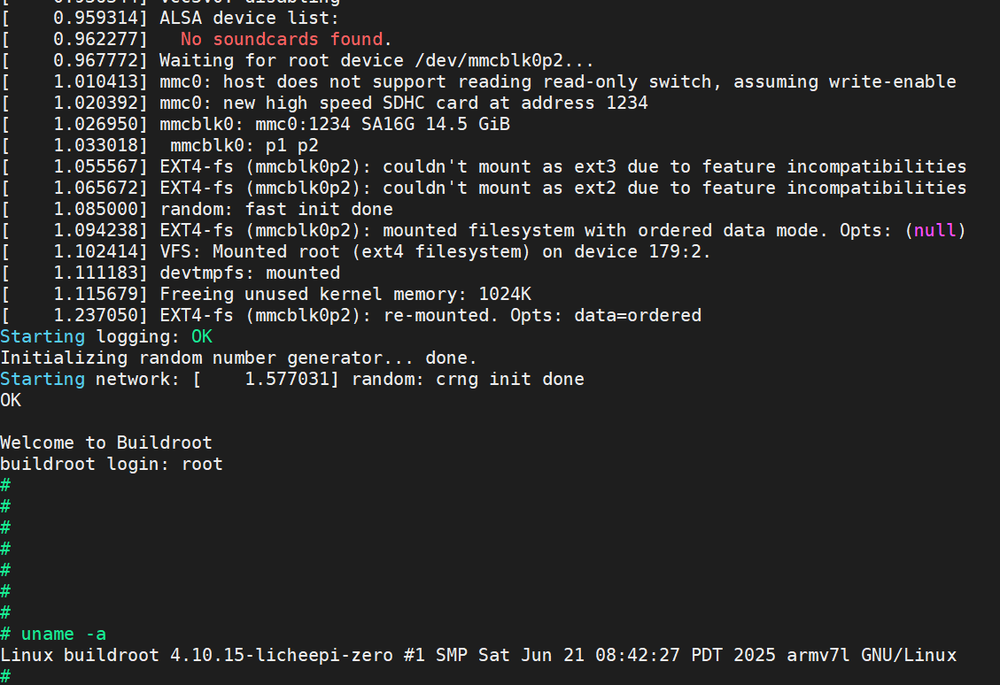

# 随记：
- 1 第⼀，下载好uboot代码；第 ⼆，安装交叉编译⼯具；第三，编译uboot；第四，选择好sd卡，将uboot的bin⽂件烧 ⼊到sd卡。


# 一、uboot移植
> [!PDF|important] [[全志V3s芯片开发/全志V3s开发记录/assets/系统开发/file-20250810171442858.pdf#page=1&selection=125,0,127,1&color=important|2.uboot移植, p.1]]
> > 2.uboot移植
> 
> 
## 1、编译uboot
### uboot作用
- 1 uboot完成⼀些基本硬件的初始化，⽐如cpu频率设置、ddr初始化、加载linux等等。

- 1 串⼝波特率除⾮特殊说明， ⼀般都是115200。

- 1 系统启动后uboot运行在ddr中
### 配置交叉编译⼯具
- 1 sudo vim /etc/bash.bashrc
- 1 PATH="$PATH:/home/topeet/V3s/gcc-linaro-6.3.1-2017.05-i686_arm-linux-gnueabihf/bin"
- 1 source /etc/bash.bashrc
### 编译uboot
- 1 make LicheePi_Zero_defconfig

- 1 make ARCH=arm CROSS_COMPILE=arm-linux-gnueabihf-
## 2、烧⼊sd卡

### 烧入命令
- 1 sudo dd if=u-boot-sunxi-with-spl.bin of=/dev/sdb bs=1024 seek=8
 
- 1 `/media/topeet/AEF1-F233` 是设备 `/dev/sdb1` 的挂载点，但目标设备文件应为 `/dev/sdb`（整个磁盘，而非分区）。

### 命令介绍
- 1 `dd`: 用于转换和复制文件，在这里用来把一个文件系统映像写入到物理存储介质。
- 1 `if`代表输入文件（input file），指定要写入的数据来源。
- 1 `of`表示输出文件（output file），即数据将被写入的目标位置。
- 1 `bs`指的是块大小（block size），<span style="background:#affad1">定义了每次读取和写入操作的数据量</span>。这里的设置意味着每次传输1024字节。
- 1 `seek=8`: 在开始写入之前<span style="background:#affad1">跳过输出文件的前8个块</span>（每个块的大小由`bs`定义），这意味着数据将从第8 X 1024=8192字节的位置开始写入
### 


# 二、移植linux kernel和 rootfs

- 1 不同⼚家的soc，⼀般<span style="background:#affad1">对uboot和kernel，他们⾃⼰都已经移植好了，⽤⼾只需要到对应的地址下载代码编译即可</span>。 ⽽<span style="background:#affad1">对于rootfs，如果本⾝没有特殊的需求，可以考虑直接使⽤别⼈做好的rootfs.tar</span>，这样效率会⾼很多
## 1、下载linux kernel
### 方法一：`git clone`命令来克隆仓库（受限于科学网络，时行时不行）
- 1 保证你拥有完整的版本历史记录，还能更方便地进行后续的更新和修改操作

- 1 git clone https://github.com/Lichee-Pi/linux.git -b zero-4.10.y

- 1 `-b zero-4.10.y`: 这个选项指定了要检出的分支名称，将克隆并自动切换到名为`zero-4.10.y`的分支。

### 方法二：自己到github上下载下来，再传输到ubuntu上（本次用这个）
- 1 **缺少版本控制**：  **不便更新**：  **增加工作量**：

### 


## 2、编译

### 编译内核
- 1 make ARCH=arm licheepi_zero_defconfig
- 1 make ARCH=arm CROSS_COMPILE=arm-linux-gnueabihf-

- 2  在arch/arm/boot/ 下生成 zImage镜像
### 编译设备树
- 1 make ARCH=arm CROSS_COMPILE=arm-linux-gnueabihf- dtbs

- 2 在arch/arm/boot/dts 下生成 sun8i-v3s-licheepi-zero.dtb设备树文件。
### ⽣成驱动modules
- 1 make ARCH=arm CROSS_COMPILE=arm-linux-gnueabihf- INSTALL_MOD_PATH=out modules

- 2 **`INSTALL_MOD_PATH=out`指定内核模块的安装路径为当前目录下的 `out` 文件夹。

- 2 **`modules`**   仅编译内核模块（不会编译完整内核镜像）。
> [!note] 其他常见目标：
> 其他常见目标：
> zImage：编译压缩内核镜像（ARM）。
> Image：编译通用内核镜像（ARM64）。
> dtbs：编译设备树文件（.dtb）。
> modules_install：安装模块到指定路径。仅编译内核模块（不会编译完整内核镜像）。


# 三、编译rootfs

## 1、buildroot文件系统配置

- 1 ⼀般都是⽤buildroot进⾏配置编译的，比如buildroot-2017.08.tar.gz
### 使⽤别⼈编译好的根⽂件系统（方便）
- 1 建议使⽤别⼈编译好的根⽂件系统，差别不⼤。
- 1 编译好之后，<span style="background:#affad1">在./output/images⽬录下⾯，会有⼀个rootfs.tar⽂件</span>， 这就是我们需要的根⽂件系统

```cardlink
url: https://download.csdn.net/download/feixiaoxing/87816983
title: "根文件系统压缩包简介 资源-CSDN文库"
description: "资源浏览查阅143次。rootfs更多下载资源、学习资料请访问CSDN文库频道."
host: download.csdn.net
```


## 2、自己配置buildroot文件系统
> [!PDF|important] [[全志V3s芯片开发/全志V3s开发记录/assets/系统开发/file-20250810171442898.pdf#page=1&selection=135,0,153,1&color=important|5、制作根文件系统, p.1]]
> > 全志V3S嵌⼊式驱动开发（制作根⽂件系统）
> 
> 

### 可以直接用.config文件
- 1 如果不想记住这么多配置，那么可以把buildroot下⾯的.config⽂件保存下来，到时候直接拷⻉粘贴也可以的。这样也能省略很多不必要的烦恼，提⾼⼀下开发的效率

- 2 在out/images⽬录下⾯，就有⼀个rootfs.tar ⽂件。
### 添加文件到rootfs或修改里面文件(不要改rootfs文件的权限，会出错)
- 1 当然，如果后期客⼾需要添加⾃⼰的程序，只需要把rootfs.tar解压⼀下，同时把⾃ ⼰的程序重新copy到对应的⽬录，再次压缩⼀下就可以了

```
mkdir workdir
cd workdir
sudo tar xf ../rootfs.tar
```

- 3 添加文件
- 1 cp /path/to/your/programs/hello ./usr/local/bin/
- 1 chmod +x ./usr/local/bin/hello

- 3 修改文件
- 1 sudo vim /etc/inittab

- 3 重新打包，压缩
- 1 cd ..
- 1 sudo tar cf rootfs.tar -C workdir .


### 

- 2 sudo cp ./lib/* ../workdir/lib/ -r

- 2 sudo tar cf rootfs.tar -C workdir .

# 四、烧⼊sd卡启动

### **1 分区**
#### **操作步骤**
1. **启动 `fdisk` 工具**  
   ```bash
   sudo fdisk /dev/sdb
   ```

2. **删除旧分区（如有）**  
   - 输入 `d` 删除现有分区，直到无残留。

3. **创建第一个分区（32MB，FAT32格式）**  
   - 输入 `n` 创建新分区：  
     ```
     Partition type: p (primary)  
     Partition number: 1  
     First sector: 回车（默认 2048，确保与 U-Boot 隔离）  
     Last sector: +32M  
     ```

4. **创建第二个分区（剩余空间，ext4格式）**  
   - 再次输入 `n`：  
     ```
     Partition type: p (primary)  
     Partition number: 2  
     First sector: 回车（默认 8192，自动对齐）  
     Last sector: 回车（使用剩余全部空间）  
     ```

5. **验证分区表**  
   - 输入 `p` 查看分区信息：  
     ```
     Device       Boot Start     End Sectors  Size Id Type  
     /dev/sdb1        2048    67583   65536   32M  c W95 FAT32 (LBA)  
     /dev/sdb2       67584 15552479 15484996  7.4G 83 Linux  
     ```

6. **保存并退出**  
   - 输入 `w` 保存分区表。

#### **关键说明**
- **分区对齐**：第一个分区从 `2048` 扇区开始（1MiB 对齐），避免与 U-Boot 冲突。
- **大小限制**：第一个分区为 `32M`，需输入 `+32M` 明确指定大小。

---

### **2 构建文件系统**
#### **操作步骤**
1. **格式化第一个分区（FAT32）**  
   ```bash
   sudo mkfs.vfat /dev/sdb1
   ```

2. **格式化第二个分区（ext4）**  
   ```bash
   sudo mkfs.ext4 /dev/sdb2
   ```

#### **关键说明**
- **文件系统选择**：  
  - `vfat`（FAT32）兼容性强，适合存放内核和设备树文件。  
  - `ext4` 支持大文件和高效读写，适合根文件系统（rootfs）。

---

### **3 重新插拔SD卡**
#### **操作步骤**
```bash
sudo sync          # 确保数据完全写入
sudo eject /dev/sdb  # 安全弹出设备
```

#### **关键说明**
- **数据同步**：`sync` 确保缓存数据写入磁盘，避免断电导致文件损坏。
- **设备卸载**：使用 `eject` 可安全移除设备，防止文件系统错误。

---

### **4 拷贝文件**
#### **操作步骤**
1. **挂载分区**  
   ```bash
   sudo mkdir /mnt/sd1 /mnt/sd2
   sudo mount /dev/sdb1 /mnt/sd1
   sudo mount /dev/sdb2 /mnt/sd2
   ```

2. **拷贝内核和设备树**  
   ```bash
   cp zImage sun8i-v3s-licheepi-zero.dtb /mnt/sd1/
   ```

3. **解压根文件系统**  
   ```bash
   sudo tar -xvf rootfs.tar -C /mnt/sd2/
   ```

4. **卸载分区**  
   ```bash
   sudo umount /mnt/sd1 /mnt/sd2
   ```

#### **关键说明**
- **路径检查**：确保 `rootfs.tar` 解压到 `/mnt/sd2` 根目录，而非子目录。
- **文件完整性**：拷贝后验证文件数量和大小，避免传输中断。

---

### **5 烧录 U-Boot**
#### **操作步骤**
```bash
sudo dd if=u-boot-sunxi-with-spl.bin of=/dev/sdb bs=1024 seek=8
```

#### **关键说明**
- **偏移量（seek=8）**：U-Boot 通常从第 8 个扇区开始写入（每个扇区 512 字节，共 4KiB 偏移）。
- **设备确认**：确保 `/dev/sdb` 是目标 SD 卡，避免误操作其他磁盘。

---

### **6 启动开发板**
- 1 因为uboot中我们没有对代码进⾏修改，所以uboot启动后，需要输⼊下⾯这些命令，才能启动kernel
#### **U-Boot 命令**
```bash
setenv bootm_boot_mode sec
load mmc 0:1 0x41000000 zImage
load mmc 0:1 0x41800000 sun8i-v3s-licheepi-zero.dtb
setenv bootargs console=ttyS0,115200 panic=5 rootwait root=/dev/mmcblk0p2 earlyprintk rw vt.global_cursor_default=0
bootz 0x41000000 - 0x41800000
```

#### **关键说明**
- **设备编号**：`mmc 0:1` 表示第一个 MMC 设备（SD 卡）的第一个分区。
- **内存地址**：`0x41000000` 和 `0x41800000` 是内核和设备树的加载地址，需与硬件手册一致。

---

### 7、**注意事项**
1. **数据备份**：操作前务必备份 SD 卡数据，分区和格式化会清除所有内容。
2. **设备识别**：在虚拟机中确保 SD 卡直通给 Ubuntu，避免设备无法识别。
3. **权限问题**：使用 `sudo` 确保操作权限，尤其是挂载和卸载分区时。
4. **U-Boot 验证**：如果开发板无法启动，检查 U-Boot 是否正确烧录，或尝试重新烧录。

完成以上步骤后，SD 卡即可用于启动嵌入式系统。


### 8、实验现象
- 1 因为⽬前驱动的内容⽐较少，上层软件也不多，所以不到2s就启动结束，这⾥输⼊ rootfs之后，⻢上就进⼊根⽂件系统了，
- 
[[全志V3s芯片开发/全志V3s开发记录/assets/系统开发/file-20250810171443080.png|Open: Pasted image 20250622161746.png]]

### 9、编写烧入脚本
```
#!/bin/bash
set -euo pipefail  # 设置错误处理，遇到未定义变量、命令出错或管道命令中任何一个失败即退出


# 定义变量，分别存储用户输入的uboot、内核映像文件路径、设备树二进制文件路径和根文件系统压缩包路径
UBOOT="u-boot-sunxi-with-spl.bin"
ZIMAGE="zImage"
DTB="sun8i-v3s-licheepi-zero-with-480x272-lcd.dtb"
ROOTFS="rootfs.tar"

#  挂载分区：创建挂载点并将相应的分区挂载到系统上
sudo mount /dev/sdb1 /mnt/sd1
sudo mount /dev/sdb2 /mnt/sd2

#  复制 kernel 和 dtb：将内核映像文件和设备树二进制文件复制到第一个分区（启动分区）
sudo cp "$ZIMAGE" "$DTB" /mnt/sd1/
echo "kernel"

sudo tar -xvf "$ROOTFS" -C /mnt/sd2
echo "rootfs 解压完成"
sleep 2  # 暂停1秒以确保文件系统稳定

#  卸载：完成操作后卸载之前挂载的两个分区
sudo umount /mnt/sd1 /mnt/sd2

#  写入 U-Boot：最后一步，将U-Boot引导加载程序写入设备的特定位置
sudo dd if=u-boot-sunxi-with-spl.bin of=/dev/sdb bs=1024 seek=8
echo "uboot"

sudo sync          # 确保数据完全写入
sudo eject /dev/sdb

echo "烧录完成，请拔出 SD 卡重新插入进行验证。"  # 同步数据并提示用户操作完成


```


# 五、系统image创建和烧⼊

## 1、准备镜像⽂件

### 1）创建image⽂件，⼤⼩为420M
- 1 sudo dd if=/dev/zero of=demo.img bs=1M count=420


### 2）开始分区
- 1 sudo parted demo.img --script -- mklabel msdos
- 1 sudo parted demo.img --script -- mkpart primary fat16 4096s 65783s
- 1 sudo parted demo.img --script -- mkpart primary ext4 65784s -1


### 3）查看⼀下分区是否正确
- 1  sudo parted demo.img

```
(parted) print                                                            
型号： (file)
磁盘 /home/topeet/V3s/output/demo.img: 440MB
扇区大小 (逻辑/物理)：512B/512B
分区表：msdos
磁盘标志：

编号  起始点  结束点  大小    类型     文件系统  标志
 1    2097kB  33.7MB  31.6MB  primary            lba
 2    33.7MB  439MB   406MB   primary

```


### 4）挂在到设备节点

- 3 先查看可⽤的设备节点。
- 1 sudo losetup -f
```
/dev/loop18
```

- 3 开始挂载
- 1 sudo losetup /dev/loop18 demo.img
- 1 sudo kpartx -av /dev/loop18

```
(base) topeet@ubuntu:~/V3s/output$ ls -l /dev/mapper
总用量 0
crw------- 1 root root 10, 236 6月  21 23:41 control
lrwxrwxrwx 1 root root       7 6月  22 01:44 loop18p1 -> ../dm-0
lrwxrwxrwx 1 root root       7 6月  22 01:44 loop18p2 -> ../dm-1

```

### 5）创建⽂件系统
- 1 sudo mkfs.msdos /dev/mapper/loop18p1
- 1  sudo mkfs.ext4 /dev/mapper/loop18p2


### 6）先拷⻉uboot⽂件，挂在到/dev/loop18下⾯
- 1  sudo dd if=u-boot-sunxi-with-spl.bin of=/dev/loop18 bs=1024 seek=8


### 7）拷⻉dtb⽂件和kernel⽂件
- 1  sudo mount /dev/mapper/loop18p1 /mnt
- 1 sudo cp zImage /mnt
- 1 sudo cp sun8i-v3s-licheepi-zero.dtb /mnt
- 1 sudo umount /mnt

- 2 挂载一个分区到mnt目录下
###  拷⻉根⽂件系统
- 1 sudo mount /dev/mapper/loop18p2 /mnt
- 1 sudo cp rootfs.tar /mnt

- 2  cd /mnt
- 2  sudo tar xvf rootfs.tar
- 2 sudo rm rootfs.tar
- 2  cd ~/V3s/output

- 1 sudo umount /mnt

### 9）卸载磁盘
- 1 sudo kpartx -d demo.img


## 2、windows下⾯镜像⽂件烧⼊

### win32diskimager的软件
- 1 将micro sd卡插⼊读卡器，连接电脑，选择好镜像⽂件和盘符，这样就可以烧⼊了。

## 3、linux下⾯镜像⽂件烧⼊
### 烧⼊命令
- 1 sudo dd if=demo.img of=/dev/sdb bs=1M count=420


