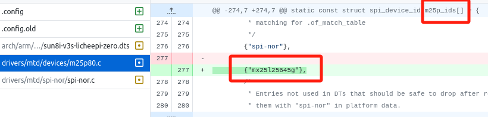
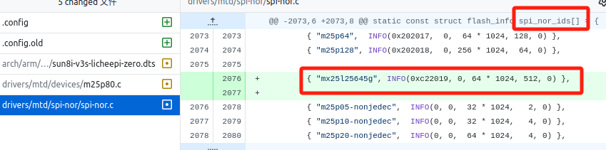
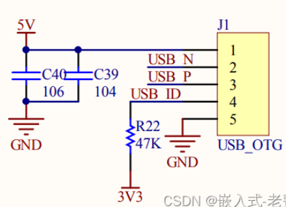
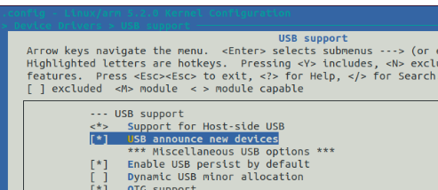
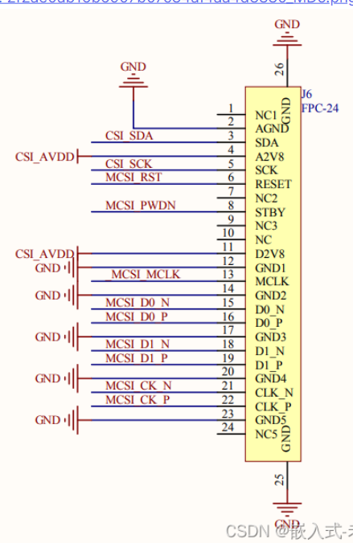
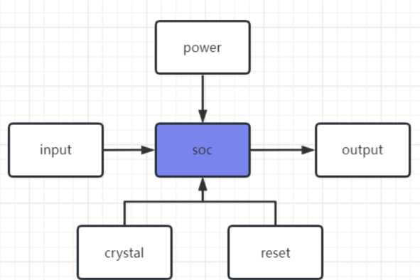
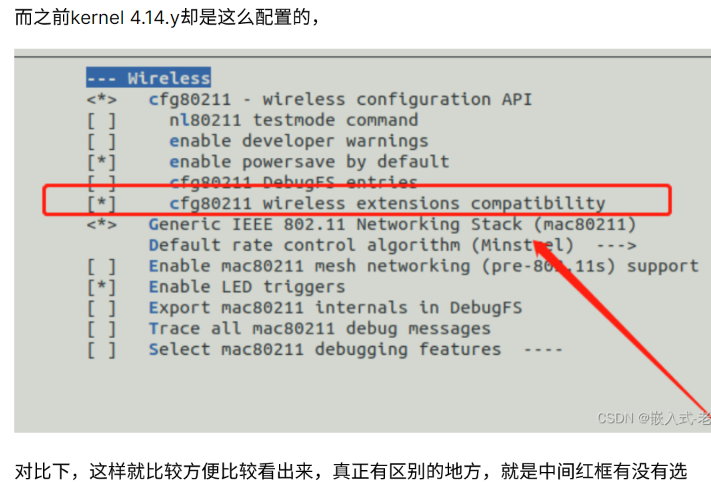

# 随记：


# 一、驱动开发准备
## 1、研读芯片手册
### 了解外部驱动芯⽚⼿册
- 1 要把对应芯⽚的资料找过来，好好读⼀读。⾥⾯协议的内容， 就是我们将来编程的依据
- 1 了解外部芯⽚主要是解决<span style="background:#affad1">发送内容的问题</span>
- 
### 了解soc芯⽚⼿册
- 1 会告诉我们<span style="background:#affad1">怎么发送这些内容</span>。⽐如，它是iic接⼝，还是spi接⼝，还是普通的uart接⼝等等。

### 


## 2、熟悉操作系统API

### 操作系统(os)驱动框架的学习
- 2 android系统甚⾄于把⼀部分驱动代码放到了应⽤层
- 
- 1 如果需要编写驱动，那么要做的就是熟悉对应系统的驱动框架
- 1 ⼤部分驱动代码都是差不多的，没有必要从0开始写，可以找⼀个差不多的模板代码，根据芯⽚⼿册改⼀下内容，基本就可以⽤了。
- 1 串⼝232、485也经常⽤，不过这⼀类的驱动就不写在底层，⼀般是通过上层app去写，这⼀点和⽹络设备的驱动有点类似
### 熟悉os kernel API
- 1 ⼀般来说，编写驱动的时候，我们也会⽤到内核的API
- 
- 2 在真正使⽤API的时候，⼀定要理解了之后再使⽤，驱动的⼀些故障、特别是⼀些低概率的故障还是⽐较难调试的。

### 


## 3、会一点软件和硬件
### 适当编写上层代码
 - 1 驱动写好了，是需要<span style="background:#affad1">搭配上层代码进⾏配套测试</span>的。如果公司不是很⼤，这部分也是需要驱动⼯程师⾃⼰去完成的。


- 1 上⾯说的都是软件的⼯作，有时候驱动⼯程师<span style="background:#affad1">还需要⾃⼰量电压、测信号</span>。<span style="background:#affad1">不需要很懂，但是可以解决最低级的故障</span>。根据2/8原则来说，我们会的硬件知识也许不多， 但是掌握了常⻅的套路之后，它已经⾜够可以解决80%的问题。这样遇到难题，也不会受制于⼈，效率上不打折扣。
### 


# 二、
## 1、⽹卡驱动
- 3 v3s⾃⼰集成了mac和phy
### 把内核切到4.14.y
- 1 在之前4.10.y版本⾥⾯，sun8i-v3s.dtsi⽂件当中根本没有emac的内容，但是在4.14.y当中，我们看到了相关的脚本，所以果断把内核切到4.14.y，

- 2 重新编译内核和dtb⽂件
### 使用wifi也需要mac
- 1 CPU 芯片（SoC）集成 MAC，搭配外部 PHY 模块，实现 Wi‑Fi 功能


### 配置网络，启动节点
> [!PDF|note] [[全志V3s芯片开发/全志V3s开发记录/assets/驱动开发/file-20250810171440851.pdf#page=3&selection=121,0,132,1&color=note|7、网卡驱动, p.3]]
> > 2、启动开发板，插上⽹线
> 
> 

### 通过网络实现windos电脑向开发板传输文件
> [!PDF|note] [[全志V3s芯片开发/全志V3s开发记录/assets/驱动开发/file-20250810171440851.pdf#page=6&selection=15,0,74,0&color=note|7、网卡驱动, p.6]]
> > 编译好了，关键是我们怎么把程序从虚拟机拷⻉到开发板呢。关于这个流程，可以这么来做，⾸先，把程序从虚拟机拷⻉到windows⽬录下
> 
> 

#### 


#### 


#### 


#### 


## 2、编译文件

### 交叉编译应用文件命令
- 1 arm-linux-gnueabihf-gcc hello.c -g -o hello

- 2 - **-g**：这个选项告诉编译器在生成的目标文件中<span style="background:#affad1">包含调试信</span>息。这允许你使用调试器（如GDB）来调试程序，查看变量值、设置断点等。

### 编写Makefile编译驱动文件
```
 # 如果 KERNELRELEASE 环境变量不为空，则进入内核模块编译模式
ifneq ($(KERNELRELEASE),)
    # 定义 obj-m 变量为目标模块 hello.o 的生成规则
    obj-m := hello.o

else
    # 获取当前工作目录并存储在 PWD 变量中
    PWD := $(shell pwd)

    # 设置Linux内核源码目录 KDIR
    KDIR := /home/feixiaoxing/Desktop/linux-zero-4.14.y
    
    # 定义all目标，即默认执行的操作
    all:
    	# 使用 make 命令进入内核源码目录进行模块编译
    	# -C 指定内核源码目录，M=指定模块源码目录，modules表示编译模块
        $(MAKE) -C $(KDIR) M=$(PWD) modules CROSS_COMPILE=arm-linuxgnueabihf- ARCH=arm

    # 定义clean目标，用于清理编译产生的临时文件
    clean:
    	# 删除所有编译过程中生成的文件和目录
        rm -rf .*.cmd *.o *.mod.c *.ko .tmp_versions *.order *.symvers
endif
```


## 3、多按键输⼊驱动
### 查找电路图
> [!PDF|note] [[全志V3s芯片开发/全志V3s开发记录/assets/驱动开发/file-20250810171440877.pdf#page=2&selection=353,0,357,1&color=note|8、多按键输入驱动, p.2]]
> > 查找电路图
> 
> 

### 查找设备树
> [!PDF|note] [[全志V3s芯片开发/全志V3s开发记录/assets/驱动开发/file-20250810171440877.pdf#page=2&selection=361,0,365,1&color=note|8、多按键输入驱动, p.2]]
> > 查找设备树
> 
> 

### 查找驱动代码，准备测试程序
> [!PDF|note] [[全志V3s芯片开发/全志V3s开发记录/assets/驱动开发/file-20250810171440877.pdf#page=4&selection=290,1,303,1&color=note|8、多按键输入驱动, p.4]]
> > 查找驱动代码，准备测试程序
> 
> 

### 编写应⽤程序测试
> [!PDF|note] [[全志V3s芯片开发/全志V3s开发记录/assets/驱动开发/file-20250810171440877.pdf#page=4&selection=183,0,191,0&color=note|8、多按键输入驱动, p.4]]
> > 编写⼀个应⽤程序
> 
> 

### 发现问题、解决问题
> [!PDF|note] [[全志V3s芯片开发/全志V3s开发记录/assets/驱动开发/file-20250810171440877.pdf#page=6&selection=381,0,389,1&color=note|8、多按键输入驱动, p.6]]
> > 发现问题、解决问题
> 
> 


## 4、串⼝驱动
- 1 UART1的pin和其他功能是复⽤的。
- 1 hell命令，因此就会占⽤⼀个串⼝UART0
- 1 有外接设备需要对接的话，⼀般⽤ UART2

### 电路图分析
> [!PDF|note] [[全志V3s芯片开发/全志V3s开发记录/assets/驱动开发/file-20250810171440911.pdf#page=2&selection=366,0,370,1&color=note|9、串口驱动, p.2]]
> > 电路图分析
> 
> 

### 添加设备树配置
> [!PDF|note] [[全志V3s芯片开发/全志V3s开发记录/assets/驱动开发/file-20250810171440911.pdf#page=3&selection=260,0,266,1&color=note|9、串口驱动, p.3]]
> > 添加设备树配置
> 
> 

- 1 默认UART0是配置好的，不然在启动启动的时候，也看不到那么多的 ⽇志信息

- 2 需要使⽤UART2的话，那么需要分别在 sun8i-v3s.dtsi（通用设备树）添加。在 sun8i-v3s-licheepi-zero.dts（针对开发板专用设备树）添加


### 驱动⽂件
> [!PDF|note] [[全志V3s芯片开发/全志V3s开发记录/assets/驱动开发/file-20250810171440911.pdf#page=4&selection=124,0,127,1&color=note|9、串口驱动, p.4]]
> > 驱动⽂件
> 
> 

- 1 可以到内核drivers/tty⽬录下，借助于find . -name "`*.o`"的⽅法，看看哪⼀个驱动最像我们要找的那个⽂件。

- 2 应该就是这个⽂件。有兴趣的同学可以通过调试和打印，加深⼀下印象

### 准备测试代码、开始测试
> [!PDF|note] [[全志V3s芯片开发/全志V3s开发记录/assets/驱动开发/file-20250810171440911.pdf#page=6&selection=200,0,210,1&color=note|9、串口驱动, p.6]]
> > 准备测试代码、开始测试
> 
> 

- 1 准备⼀个ttyS2的读写程序，此外再准备两个usb2ttl，⼀个⽤作shell输⼊，⼀个⽤作效果验证。
- 2 ⽹上关于linux串⼝编程的代码很多，可以找⼀个适合我们的查看下即可

### 


## 5、pwm驱动
### 原理图分析
> [!PDF|note] [[全志V3s芯片开发/全志V3s开发记录/assets/驱动开发/file-20250810171440946.pdf#page=2&selection=306,1,309,4&color=note|10、pwm驱动, p.2]]
> > pwm0和pwm1


- 1 ⽬前V3S⽀持两个pwm输出，分别是pwm0和pwm1
### 修改设备树配置⽂件，使能pwm功能
> [!PDF|note] [[全志V3s芯片开发/全志V3s开发记录/assets/驱动开发/file-20250810171440946.pdf#page=2&selection=313,0,335,1&color=note|10、pwm驱动, p.2]]
> > 要使能pwm功能，最主要就是修改设备树配置⽂ 件，
> 
> 

### pwm驱动⽂件分析
> [!PDF|note] [[全志V3s芯片开发/全志V3s开发记录/assets/驱动开发/file-20250810171440946.pdf#page=3&selection=334,0,338,1&color=note|10、pwm驱动, p.3]]
> > pwm驱动⽂件
> 
> 

- 1 之前这份驱动已经包含在了zImage⾥⾯，所以不需要重新编译内核。

### 通过sysfs系统调试PWM
> [!PDF|note] [[全志V3s芯片开发/全志V3s开发记录/assets/驱动开发/file-20250810171440946.pdf#page=3&selection=384,1,388,1&color=note|10、pwm驱动, p.3]]
> > 开始调试
> 
> 

### 通过示波器验证PWM
> [!PDF|note] [[全志V3s芯片开发/全志V3s开发记录/assets/驱动开发/file-20250810171440946.pdf#page=5&selection=655,0,661,1&color=note|10、pwm驱动, p.5]]
> > 实际测量和验证
> 
> 

## 6、gpio输出
- 1 在芯⽚领域，很多引脚功能都是复⽤的，⾄于选⽤哪⼀个功能完全看客⼾⾃⼰的选择，很多时候只能2选1，或者3选1。
### 全志的芯⽚⼿册
- 1 Allwinner_V3s_Datasheet_V1.0.pdf中的第53⻚，我们看到v3s中很多的功能也是复⽤ 的

### spi接⼝原理图分析
> [!PDF|note] [[全志V3s芯片开发/全志V3s开发记录/assets/驱动开发/file-20250810171440972.pdf#page=3&selection=68,0,76,1&color=note|11、gpio输出, p.3]]
> > 使⽤spi接⼝当成gpio⼝
> 
> 

- 1 ⽤作norflash访问使⽤的。现在因为所有系统都保存在sd卡⾥⾯，因此完全可以⽤这个当成gpio使⽤
### 配置设备树设置引脚复用
> [!PDF|note] [[全志V3s芯片开发/全志V3s开发记录/assets/驱动开发/file-20250810171440972.pdf#page=4&selection=256,0,260,1&color=note|11、gpio输出, p.4]]
> > 修改sun8i-v3s.dtsi⽂件
> 
> 

### 挂载debugfs系统查看引脚映射关系
> [!PDF|note] [[全志V3s芯片开发/全志V3s开发记录/assets/驱动开发/file-20250810171440972.pdf#page=4&selection=519,0,525,1&color=note|11、gpio输出, p.4]]
> > 3、重启开发板
> 
> 

### 引脚端口号计算方法
> [!PDF|note] [[全志V3s芯片开发/全志V3s开发记录/assets/驱动开发/file-20250810171440972.pdf#page=5&selection=304,0,312,1&color=note|11、gpio输出, p.5]]
> > 创建通道，开始设备外设

- 1 看Allwinner_V3s_Datasheet_V1.0.pdf中的第54⻚，获取引脚名称，
- 1 所有的端⼝⼀般都是`channel = 32*x+y `来实现的。PA、PB、PC...，这些代表x，分别是0、1、2...。⽽PC2中的2就代表y，如果是PB9，那么y就是9。

### 通过sysfs系统调试GPIO
> [!PDF|note] [[全志V3s芯片开发/全志V3s开发记录/assets/驱动开发/file-20250810171440972.pdf#page=6&selection=63,0,75,0&color=note|11、gpio输出, p.6]]
> > 说了这么多，下⾯开始实验

- 1  可以通过电压表测量验证。


## 7、⾳频输出和⾳频录制

- 1 要驱动⾳频，需要两部分，⼀部分就是底层驱动，⼀部分就是alsa上层接⼝，两者缺⼀不可。
- 1 荔枝派来说，底层的驱动其实都已经包含在linux kernel⾥⾯了，<span style="background:#affad1">客 ⼾只要⾃⼰port好⼀个alsa库</span>，或者类alsa库，就可以开始播放⾳频、录制⾳频了。
### ⻨克⻛和耳机电路分析
> [!PDF|note] [[全志V3s芯片开发/全志V3s开发记录/assets/驱动开发/file-20250810171441024.pdf#page=2&selection=410,0,413,1&color=note|12、音频输出和音频录制, p.2]]
> > 1、电路
> 
> 

- 1 电路中并没有⾳频电路经常出现的iis接⼝。v3s和⽹卡⼀样，本⾝已经集成了数模转换和功放功能了，不需要额外芯⽚了。
- 2 这种情况，⼀般soc⼚商都会⾃⼰默默把驱动代码准备好，省着使⽤者去⼆次开发了。
### 设备树配置声卡驱动
> [!PDF|note] [[全志V3s芯片开发/全志V3s开发记录/assets/驱动开发/file-20250810171441024.pdf#page=3&selection=221,1,224,1&color=note|12、音频输出和音频录制, p.3]]
> > 设备树
> 
> 

- 1 sun8i-v3s-licheepizero-dock.dts
- 1 sun8i-v3s.dtsi

### 判断声卡是否正确加载
> [!PDF|note] [[全志V3s芯片开发/全志V3s开发记录/assets/驱动开发/file-20250810171441024.pdf#page=4&selection=574,0,583,1&color=note|12、音频输出和音频录制, p.4]]
> > 判断声卡是否正确加载
> 
> 

- 1 第⼀，就是看内核启动⽇志；第⼆，就是看/dev/snd下⾯的节点有没有正确⽣成；第三，也可以查看下/sys/class/sound下⾯的节点

### 编译安装TinyAlsa
> [!PDF|note] [[全志V3s芯片开发/全志V3s开发记录/assets/驱动开发/file-20250810171441024.pdf#page=5&selection=580,0,584,7&color=note|12、音频输出和音频录制, p.5]]
> > 编译安装TinyAls

- 1 TinyAlsa就是⽐较适合使⽤的那个库。

- 2 通过观察编译⽇志，发现四个程序都是静态链接libtinyalsa.a，所以直接拷⻉四个 ⽂件即可，不需要拷⻉其他动态库。

### 寻找⾳频⽂件播放
> [!PDF|note] [[全志V3s芯片开发/全志V3s开发记录/assets/驱动开发/file-20250810171441024.pdf#page=8&selection=282,0,289,1&color=note|12、音频输出和音频录制, p.8]]
> > 5、寻找⾳频⽂件
> 
> 

- 1 tinyalsa的⼯具只能播放wav文。
- 1 [熊猫无损音乐网-mp3歌曲免费下载\|无损音乐分享网站](https://www.xmwav.com/)

### 播放⾳频
> [!PDF|note] [[全志V3s芯片开发/全志V3s开发记录/assets/驱动开发/file-20250810171441024.pdf#page=8&selection=315,0,320,1&color=note|12、音频输出和音频录制, p.8]]
> > 6.1 播放⾳频
> 
> 

- 1 测试的时候，发现不是所有的⾳频都能放出来的，所以我们找了⼀个“挖呀挖”的 wav⽂件，44100Hz，播放是没问题的，链接地址如下，[桃子老师花开富贵-花园种花mp3歌曲免费下载\|歌曲下载\|无损音乐下载-熊猫无损音乐](https://www.xmwav.com/mscdetail/133829.html)
### 录制⾳频
> [!PDF|note] [[全志V3s芯片开发/全志V3s开发记录/assets/驱动开发/file-20250810171441024.pdf#page=9&selection=268,0,272,1&color=note|12、音频输出和音频录制, p.9]]
> >  录制⾳频
> 
> 

- 1 如果想要确认录制的⾳频有没有问题，那么直接⽤tinyplay播放下即可，


## 8、lcd屏幕驱动
### 重新编译uboot
> [!PDF|note] [[全志V3s芯片开发/全志V3s开发记录/assets/驱动开发/file-20250810171441055.pdf#page=2&selection=456,0,460,5&color=note|13、lcd屏幕驱动, p.2]]
> > 重新编译uboot
> 
> 

- 1 需要驱动lcd屏，`480*272`的分辨率为例，就要使⽤LicheePi_Zero_480x272LCD_defconfig这个⽂件
###  配置dts⽂件
> [!PDF|note] [[全志V3s芯片开发/全志V3s开发记录/assets/驱动开发/file-20250810171441055.pdf#page=2&selection=550,1,555,1&color=note|13、lcd屏幕驱动, p.2]]
> > 配置dts⽂件
> 
> 

- 1 sun8i-v3s-licheepi-zero-withlcd.dtsi
- 1 sun8i-v3s.dtsi⽂件,这⾥修改成60M，主要是为了6分频成10M，保持和uboot中的lcd频率⼀致。

- 2 这次sd卡⾥⾯烧⼊的应该是sun8i-v3s-licheepi-zero-with-480x272-lcd.dtb⽂件
### 分析电路图点亮LCD屏幕
> [!PDF|note] [[全志V3s芯片开发/全志V3s开发记录/assets/驱动开发/file-20250810171441055.pdf#page=4&selection=380,1,385,1&color=note|13、lcd屏幕驱动, p.4]]
> > 、点亮屏幕

- 1 ⽬前为⽌LCD还没有点亮，说的其实就是VLED-、VLED+还没有信号驱动，它的信号来⾃于芯⽚PT4103，这个芯⽚的开关就在EN这个地⽅，⽽EN⼜是友PB2来控制的。在sysfs系统使能输出就可。
### 验证驱动是否加载
> [!PDF|note] [[全志V3s芯片开发/全志V3s开发记录/assets/驱动开发/file-20250810171441055.pdf#page=6&selection=390,0,397,1&color=note|13、lcd屏幕驱动, p.6]]
> > 验证驱动是否加载
> 
> 

- 1 先查看是否有/dev/fb0这样⼀个设备节点，有，且linux kernel启动正常，⼀般就代表驱动ok了。

### ⾃⼰编写应用程序验证（控制/dev/fb0节点）
> [!PDF|note] [[全志V3s芯片开发/全志V3s开发记录/assets/驱动开发/file-20250810171441055.pdf#page=7&selection=89,0,96,1&color=note|13、lcd屏幕驱动, p.7]]
> > ⾃⼰编写程序验证
> 
> 

- 1  使⽤者只需要把数据写到ddr buffer⾥⾯，刷新的事情，其实都是gpu或者ip驱动后台帮助我们默默完成的。
### 


## 9、触摸屏驱动
### 查看lcd和ns2009电路图
> [!PDF|note] [[全志V3s芯片开发/全志V3s开发记录/assets/驱动开发/file-20250810171441084.pdf#page=2&selection=352,0,357,1&color=note|14、触摸屏驱动, p.2]]
> > 查看lcd电路图
> 
> 

- 1 TPX1、TPY1、TPX2、TPY2，四根信号线。这四根线并没有直接连接到soc上⾯，⽽ 是先连接到ns2009，然后再通过i2c的形式连接到soc上⾯
### 触摸屏节点在设备树中的编写
> [!PDF|note] [[全志V3s芯片开发/全志V3s开发记录/assets/驱动开发/file-20250810171441084.pdf#page=4&selection=244,0,246,1&color=note|14、触摸屏驱动, p.4]]
> > 设备树
> 
> 

- 1 只要是linux 4.14.y内核，就不需要⾃⼰再动 ⼿配置⼀遍了
### 触摸屏驱动代码
> [!PDF|note] [[全志V3s芯片开发/全志V3s开发记录/assets/驱动开发/file-20250810171441084.pdf#page=5&selection=332,1,339,1&color=note|14、触摸屏驱动, p.5]]
> > 、查看驱动代码
> 
> 

- 1 只需要在 drivers/input/touchscreen下⾯查找下，有没有类似于ns2009的驱动就好
- 1 这部分代码因为是包含在zImage⾥⾯的，因此也就不需要重新编译、重新烧⼊了
### 下载、安装tslib库
> [!PDF|note] [[全志V3s芯片开发/全志V3s开发记录/assets/驱动开发/file-20250810171441084.pdf#page=5&selection=502,0,508,1&color=note|14、触摸屏驱动, p.5]]
> > 下载、安装tslib库
> 
> 

- 1 可以帮助我们对触摸屏做出⼀些参数标定，还可以⽤它做接⼝，做⼀些测试或者定制应⽤开发

### 测试验证tslib（串口终端）
> [!PDF|note] [[全志V3s芯片开发/全志V3s开发记录/assets/驱动开发/file-20250810171441084.pdf#page=6&selection=520,1,525,5&color=note|14、触摸屏驱动, p.6]]
> > 测试验证tslib
> 
> 

### 


## 10、sd卡驱动
- 1 ⾸先，<span style="background:#affad1">v3s本⾝是识别sd卡</span>的，不然⽆法加载uboot的bin⽂件；第⼆，<span style="background:#affad1">uboot可以驱动</span>sd卡的，不然没有办法加载zImage和dtb⽂件；第三，<span style="background:#affad1">linux kernel本⾝也可以驱动</span> sd卡，不然就不能在根⽂件⽬录下⾯正常添加、删除⽂件了。
### uboot打印信息分析（看uboot是怎么加载sd卡⾥⾯的内容）
> [!PDF|note] [[全志V3s芯片开发/全志V3s开发记录/assets/驱动开发/file-20250810171441103.pdf#page=2&selection=436,0,445,1&color=note|15、sd卡驱动, p.2]]
> > 了解之前uboot的加载命令

- 1 v3s可以识别sd卡，<span style="background:#affad1">通过标准的硬件协议来加载uboot bin⽂件</span>。这⼀点和spi norflash、spi nandflash很相似。


### sd卡电路分析
> [!PDF|note] [[全志V3s芯片开发/全志V3s开发记录/assets/驱动开发/file-20250810171441103.pdf#page=3&selection=148,1,152,1&color=note|15、sd卡驱动, p.3]]
> > sd卡电路
> 
> 

### 设备树配置
> [!PDF|note] [[全志V3s芯片开发/全志V3s开发记录/assets/驱动开发/file-20250810171441103.pdf#page=3&selection=156,0,160,1&color=note|15、sd卡驱动, p.3]]
> > 设备树配置
> 
> 

- 1 sun8i-v3s-licheepi-zero.dts ⽂ 件
- 1 有两组sd信号的，⼀组给了sd卡，命名为mmc0；另外⼀组是给了⽆ 线wifi esp 8089。具体的pin脚参考⽂件sun8i-v3s.dtsi。

### 驱动⽂件
> [!PDF|note] [[全志V3s芯片开发/全志V3s开发记录/assets/驱动开发/file-20250810171441103.pdf#page=5&selection=183,0,188,1&color=note|15、sd卡驱动, p.5]]
> > 4、驱动⽂件
> 
> 

- 1 linux-zero-4.14.y/drivers/mmc/host/sunxi-mmc.c，有兴趣的同学可以去看看代码。

### 确认驱动加载正常
> [!PDF|note] [[全志V3s芯片开发/全志V3s开发记录/assets/驱动开发/file-20250810171441103.pdf#page=5&selection=567,1,574,1&color=note|15、sd卡驱动, p.5]]
> > 确认驱动加载正常
> 
> 

- 1 查看`/dev/mmc*节点`

- 1 升级内核和修改dtb数据的话，完全就可以把/dev/mmcblk0p1加载到/mnt上⾯，直接替换就可以了，⾮常⽅便
## 11、看⻔狗驱动
- 1 ⼯业级别的嵌⼊式设备，差的环境下，要保证系统持续稳定地运⾏，这就需要引⼊看⻔狗这个武器。
### 查看数据手册 - 了解看门狗寄存器
> [!PDF|note] [[全志V3s芯片开发/全志V3s开发记录/assets/驱动开发/file-20250810171441128.pdf#page=2&selection=502,0,505,1&color=note|16、看门狗驱动, p.2]]
> > ⽂档说明
> 
> 

> [!PDF|yellow] [[Allwinner_V3s_Datasheet_V1.0.pdf#page=111&selection=119,0,147,22&color=yellow|Allwinner_V3s_Datasheet_V1.0, p.111]]
> > WDOG_IRQ_EN_REG 0xA0 Watchdog IRQ Enable Register WDOG_IRQ_STA_REG 0xA4 Watchdog Status Register WDOG_CTRL_REG 0xB0 Watchdog Control Register WDOG_CFG_REG 0xB4 Watchdog Configuration Register WDOG_MODE_REG 0xB8 Watchdog Mode Register

- 1 相关的寄存器不多，主要就是5个。第⼀个是中断开关，第⼆个是状态，第三个是控制，第四个是配置，第五个是模式。

### 电路（没有）
- 1 看⻔狗完全是soc内部的模块设置，因此这个部分也就没有电路图，没有外部引脚的信号需要考虑。

### 设备树节点分析
> [!PDF|note] [[全志V3s芯片开发/全志V3s开发记录/assets/驱动开发/file-20250810171441128.pdf#page=3&selection=307,0,311,1&color=note|16、看门狗驱动, p.3]]
> > 设备树⽂件
> 
> 

### 查看驱动c⽂件
> [!PDF|note] [[全志V3s芯片开发/全志V3s开发记录/assets/驱动开发/file-20250810171441128.pdf#page=3&selection=397,0,403,1&color=note|16、看门狗驱动, p.3]]
> > 查看驱动c⽂件
> 
> 

- 1 对于驱动开发者来说，他所要做的就是把对应的回调函数填完就可以了，

### 查看数据手册 - 了解看门狗的配置
> [!PDF|note] [[Allwinner_V3s_Datasheet_V1.0.pdf#page=120&selection=49,0,51,50&color=note|Allwinner_V3s_Datasheet_V1.0, p.120]]
> > 4.5.4.20. Watchdog Mode Register (Default Value: 0x00000000)
> 
> 12000 cycles<span style="background:#affad1"> (16s)</span>

- 1 发现⽬前来说看⻔狗的最⻓喂狗时间是16s

###  验证和使⽤
> [!PDF|note] [[全志V3s芯片开发/全志V3s开发记录/assets/驱动开发/file-20250810171441128.pdf#page=4&selection=187,1,192,1&color=note|16、看门狗驱动, p.4]]
> > 验证和使⽤
> 
> 

- 1 第⼀，查看`ls -l /dev/w*`下⾯有没有watchdog这个节点；第⼆， 给watchdog发送⼀个1的数据，即`echo 1 > /dev/watchdog`⼀段时间之后，如果发⽣了系统重启，那么代表看⻔狗⽣效


## 12、esp8089 wifi驱动（买的开发板wifi是RTL8723BS）
### 原理图分析
> [!PDF|note] [[全志V3s芯片开发/全志V3s开发记录/assets/驱动开发/file-20250810171441147.pdf#page=2&selection=425,0,427,1&color=note|18、esp8089 wifi驱动, p.2]]
> > 原理图
> 
> 

### 修改dtsi⽂件
> [!PDF|note] [[全志V3s芯片开发/全志V3s开发记录/assets/驱动开发/file-20250810171441147.pdf#page=3&selection=196,0,200,1&color=note|18、esp8089 wifi驱动, p.3]]
> > 修改dtsi⽂件
> 
> 

- 1 关闭led，因为和wifi模块有冲突。使能mmc1。
### 准备驱动⽂件
> [!PDF|note] [[全志V3s芯片开发/全志V3s开发记录/assets/驱动开发/file-20250810171441147.pdf#page=4&selection=292,0,297,1&color=note|18、esp8089 wifi驱动, p.4]]
> > 准备驱动⽂件
> 
> 

- 1 把es8089.ko拷⻉到sd卡的root⽬录下，等待准备驱动安装了。
###  编译wpa_supplicant
> [!PDF|note] [[全志V3s芯片开发/全志V3s开发记录/assets/驱动开发/file-20250810171441147.pdf#page=5&selection=1010,0,1012,14&color=note|18、esp8089 wifi驱动, p.5]]
> > 编译wpa_supplicant
> 
> 

- 1 建议把`libnl-3.2.23/__install/lib/`⽬录下 ⾯的所有⽂件拷⻉到root⽬录下
### 配置wifi，让wifi跑起来
> [!PDF|note] [[全志V3s芯片开发/全志V3s开发记录/assets/驱动开发/file-20250810171441147.pdf#page=7&selection=561,0,564,1&color=note|18、esp8089 wifi驱动, p.7]]
> > 准备测试
> 
> 

- 1 /etc/wpa_supplicant.conf这个⽂件，ssid和密码，

- 2 第⼀步就是连上wifi，这个⼯作由wpa_supplicant完成
- 2 第⼆步就是⽤ifconfig对wlan0进⾏ip设置
### 


## 13、spi-nand驱动，升级到5.2 kernel

### nand flash存储介质介绍
- 1 有nvme ssd、有sata ssd、有emmc、还有今天所说的spi nand flash。这些产品的共同特点就是，都使⽤了nand flash，但是外部的接⼝是不⼀样的

- 1 综合来说，很多⼚家都会选择 spi nandflash当成启动和存储系统数据的基本介质，⽤⼾⾃⼰的sd卡可以作为补充，保存⼀些⾃⼰的资料，待v3s启动之后，mount到系统上⾯即可。
### 原理图
> [!PDF|note] [[全志V3s芯片开发/全志V3s开发记录/assets/驱动开发/file-20250810171441171.pdf#page=4&selection=187,0,189,1&color=note|21、spi-nand驱动，升级到5.2 kernel, p.4]]
> > 原理图
> 
> 

- 1 芯⽚是mx35lf1ge4ab
### ⼿动添加spi节点
> [!PDF|note] [[全志V3s芯片开发/全志V3s开发记录/assets/驱动开发/file-20250810171441171.pdf#page=4&selection=193,0,197,1&color=note|21、spi-nand驱动，升级到5.2 kernel, p.4]]
> > 设备树⽂件
> 
> 

### 驱动代码
> [!PDF|note] [[全志V3s芯片开发/全志V3s开发记录/assets/驱动开发/file-20250810171441171.pdf#page=5&selection=474,0,477,1&color=note|21、spi-nand驱动，升级到5.2 kernel, p.5]]
> > 驱动代码
> 
> 

- 1 分成两部分，⼀部分是spi、⼀部分是nandflash
- 1 在kernel 4.19之后，spi nandflash被作为独 ⽴的⼀个class，在驱动⾥⾯被单独分割了出来。从某种意义上说，只要升级kernel，修改⼀下.config配置⽂件，就可以实现相关的驱动加载了。

### 内核升级到5.2.y后还需要进⾏两个设置
> [!PDF|note] [[全志V3s芯片开发/全志V3s开发记录/assets/驱动开发/file-20250810171441171.pdf#page=6&selection=66,0,69,1&color=note|21、spi-nand驱动，升级到5.2 kernel, p.6]]
> > menuconfig配置表
> 
> 

### 烧⼊image和dtb⽂件
> [!PDF|note] [[全志V3s芯片开发/全志V3s开发记录/assets/驱动开发/file-20250810171441171.pdf#page=7&selection=164,0,170,1&color=note|21、spi-nand驱动，升级到5.2 kernel, p.7]]
> > 烧⼊image和dtb⽂件
> 
> 

### 开始测试和验证 - mtd驱动是否加载
> [!PDF|note] [[全志V3s芯片开发/全志V3s开发记录/assets/驱动开发/file-20250810171441171.pdf#page=8&selection=216,0,222,1&color=note|21、spi-nand驱动，升级到5.2 kernel, p.8]]
> > 开始测试和验证
> 
> 
### 后续可以扩展
> [!PDF|note] [[全志V3s芯片开发/全志V3s开发记录/assets/驱动开发/file-20250810171441171.pdf#page=8&selection=472,0,476,1&color=note|21、spi-nand驱动，升级到5.2 kernel, p.8]]
> > 后续的⼯作
> 
> 

- 1 有兴趣的朋友可以移植⼀下mtd-utils⼯具，进⼀步对/dev/mtd0进⾏操作
## 14、spi-nor驱动（MX25L25645G）

### MX25L25645G flash芯片
- 3 uboot使用的是u-boot-3s-spi-experimental中的。
- 1 结合之前的uboot spi改造结果，就可以完完全全构建⼀个适配spi nor的full image
- 1 对设备树和内核做⼀点修改，其他部分⼏乎不需要动
### 修改sun8i-v3s-licheepi-zero.dts⽂件
- 3 使⽤的spi nor还是mxic公司的MX25L25645G。

```
&spi0 { // 引用并修改已存在的spi0节点
    status ="okay"; // 设置状态为"okay"，表示这个设备是启用的

    mx25l25645g:mx25l25645g@0 { // 定义一个子节点，名称为mx25l25645g，地址为0
        compatible = "jedec,spi-nor"; // 设备兼容性字符串，这里指明这是一个遵循JEDEC标准的SPI NOR Flash
        reg = <0x0>; // 寄存器地址，这里是0，意味着该设备位于SPI总线上的第一个位置
        spi-max-frequency = <50000000>; // SPI的最大工作频率，这里是50MHz
        #address-cells = <1>; // 子节点中描述地址时使用的32位单元格数量，通常为1
        #size-cells = <1>; // 子节点中描述大小时使用的32位单元格数量，通常为1
    };
};

```

### 修改内核代码（kernel 5.2.y）
> [!PDF|note] [[全志V3s芯片开发/全志V3s开发记录/assets/驱动开发/file-20250810171441189.pdf#page=2&selection=536,0,541,1&color=note|21.5、spi-nor驱动, p.2]]
> > 修改内核代码
> 
> 
- 3 drivers/mtd/devices/m25p80.c⽂件
[[全志V3s芯片开发/全志V3s开发记录/assets/驱动开发/file-20250810171441217.png|Open: Pasted image 20250702142019.png]]


- 3 drivers/mtd/spi-nor/spi-nor.c
[[全志V3s芯片开发/全志V3s开发记录/assets/驱动开发/file-20250810171441299.png|Open: Pasted image 20250702142048.png]]

- 1 查看mx25l25645g的芯⽚⼿册填写参数。
- 2 0xc22019表⽰RDID的内容，641024 表⽰ sector 的数量，512 表⽰每⼀个sector 中byte 的个数。所以总的⼤⼩就是 `64*1024*512=32M byte，256M bit`，
- 2 https://www.tme.eu/Document/b050a55b550e3061ddd7611588a5a8b0/MX25L25645G,%203V,%20256Mb,%20v1.7.pdf
- 2 最后的flag改为0 ：将m25p80设备驱动默认擦除扇区由4KB改为64KB
### make menuconfig配置(一般都是配好的)

- 1 make ARCH=arm licheepi_zero_defconfig

| 配置项                               | 用途                                                                                                                    |
| --------------------------------- | --------------------------------------------------------------------------------------------------------------------- |
| CONFIG_MTD                        | MTD 总开关                                                                                                               |
| CONFIG_SPI_MASTER                 | SPI 主控驱动                                                                                                              |
| CONFIG_MTD_SPI_NOR                | SPI‑NOR 框架                                                                                                            |
| CONFIG_MTD_CMDLINE_PARTS          | 位于 `drivers/mtd/parsers/Kconfig` 中，是一个三态选项（`Y/M`），前置依赖项是 `CONFIG_MTD`。- 启用后，内核会解析并生效类似 `mtdparts=` 的命令行分区参数，支持多个闪存设备。 |
| CONFIG_MTD_M25P80                 | 于启用 **M25P80 SPI NOR Flash 存储器** 的驱动支持。                                                                               |

- 3 编译
- 2 make ARCH=arm CROSS_COMPILE=arm-linux-gnueabihf-
### 检验spi norflash是否已经被linux kernel发现
- 1 第⼀， 就是看下启动起来的时候，⽇志⾥⾯有没有nor flash被正确加载的打印
- 1 第二，可以`ls -l /dev/mtd*`
> # ls -l /dev/mtd*
crw-------    1 root     root       90,   0 Jan  1 00:00 /dev/mtd0
crw-------    1 root     root       90,   1 Jan  1 00:00 /dev/mtd0ro

## 15、u盘写读（USB HOST驱动）
### usb功能了解
- 1 otg模式，则可以把usb看成是⼀种传输媒介，⽐如可以把usb看成是⼀条<span style="background:#affad1">虚拟⽹线</span>，⽤usb模拟出⽹线的效果，实现相应的开发模式。

- 1 micro usb虽然⽐较⼩，但是特别容易插坏。所以建议⼤家在开始今天的实验之前， 先准备⼀个<span style="background:#affad1">转接器</span>。
### 原理图分析
[[全志V3s芯片开发/全志V3s开发记录/assets/驱动开发/file-20250810171441376.png|Open: Pasted image 20250630222228.png]]


- 2 USB_ID其实是⼀个gpio⼝，主要⽤USB⼝检测的，后⾯的设备树会看到这部分。

### 设备树修改
- 3 sun8i-v3s-licheepi-zero.dts
> &usb_otg {
	`dr_mode = "host";`
	status = "okay";
};

### 修改驱动配置(kernel)
- 3 打开usb设备插⼊的打印通知，这样⽅便我们调试和测试
[[全志V3s芯片开发/全志V3s开发记录/assets/驱动开发/file-20250810171441461.png|Open: Pasted image 20250630224113.png]]


- 2 升级后5.2.y中，配置的内容多了很多。⼤部分和usb、u 盘相关的配置都已经被设置好

### 测试V3s主机功能
- 3 当我们插⼊u盘的时候，可以看到这样的打印
> [   94.891393] usb 1-1: new high-speed USB device number 3 using ehci-platform
[   95.093193] usb 1-1: New USB device found, idVendor=14cd, idProduct=1212, bcdDevice= 1.00
[   95.101544] usb 1-1: New USB device strings: Mfr=1, Product=3, SerialNumber=2
[   95.108767] usb 1-1: Product: Mass Storage Device
[   95.113622] usb 1-1: Manufacturer: Generic
[   95.117784] usb 1-1: SerialNumber: 121220160204
[   95.126073] usb-storage 1-1:1.0: USB Mass Storage device detected
[   95.133212] scsi host1: usb-storage 1-1:1.0
[   96.164012] scsi 1:0:0:0: Direct-Access     Mass     Storage Device   1.00 PQ: 0 ANSI: 0 CCS
[   96.256850] sd 1:0:0:0: [sdb] 61030400 512-byte logical blocks: (31.2 GB/29.1 GiB)
[   96.265871] sd 1:0:0:0: [sdb] Write Protect is off
[   96.272480] sd 1:0:0:0: [sdb] No Caching mode page found
[   96.277892] sd 1:0:0:0: [sdb] Assuming drive cache: write through
[   96.409593]  sdb: sdb1 sdb2
[   96.419267] sd 1:0:0:0: [sdb] Attached SCSI removable disk

- 3 把u盘mount到⽬录上⾯
- 2 mount /dev/sda1 /mnt

- 2 umount /mnt

- 1  usb⾮常重要，很多v3s没有的驱动，都可以通过 usb驱动来解决的。这或许就是usb最⼤的优点。


## 16、USB camera驱动
### v3s的摄像头接口
- 1 v3s本⾝⽀持csi接⼝和mipi csi2接⼝。但是两者不能同时使用

### mipi csi2电路图（ 对应的摄像头是AR0330 ）
> [!PDF|note] [[全志V3s芯片开发/全志V3s开发记录/assets/驱动开发/file-20250810171441553.pdf#page=2&selection=366,1,382,1&color=note|23、USB camera驱动, p.2]]
> > mipi csi2电路图（ 对应的摄像头是AR0330 ）
> 
> [[全志V3s芯片开发/全志V3s开发记录/assets/驱动开发/file-20250810171441573.png|Open: Pasted image 20250701140041.png]]


- 2 CK_P & CK_N是时钟差分。
- 2 D0_P & D0_N、D1_P & D1_N是数据差分
- 2 另外三个信号是MCLK、PWDN和RST
- 2 AVDD是电压信号，2.8V。
- 2 控制信号线则⽐较简单， 主要就是IIC接⼝，即SCK和SDA。

- 3 使⽤频率⽐较⾼的mipi csi2⼜没有相关的驱动⽀持。另外⼀个⽅向，⼤家可以试试usb camera

### 使⽤usb camera有⼏个好处
- 1 第⼀，本⾝linux kernel 就对usb camera uvc⽀持，不需要做额外的⼯作，就可以适配很多的第三⽅摄像头
- 1 第 ⼆；相关的摄像头也⽐较容易采购，选择余地较多
- 1 第三，有了驱动之后，⼤家也⽅便对/dev/video0进⾏操作，进⾏图⽚的后续处理，或者相关视频的开发⼯作。


### 设备树配置（同USB host）
- 3 sun8i-v3s-licheepi-zero.dts
> &usb_otg {
	`dr_mode = "host";`
	status = "okay";
};

- 2 只要v3s是作为host访问，基本设备树这边的修改都是这样的。
### uvc驱动的修改（kernel）
- 3 diff .config .config.old    直接更改.config文件更方便
```
CONFIG_VIDEO_TUNER=y
CONFIG_V4L2_FWNODE=y

CONFIG_USB_VIDEO_CLASS=y

CONFIG_USB_GSPCA=y

CONFIG_VIDEO_EM28XX=y
CONFIG_VIDEO_EM28XX_V4L2=y

CONFIG_VIDEO_MUX=y

CONFIG_VIDEO_SUN6I_CSI=y

CONFIG_VIDEO_TVEEPROM=y

CONFIG_VIDEOBUF2_CORE=y
CONFIG_VIDEOBUF2_V4L2=y
CONFIG_VIDEOBUF2_MEMOPS=y
CONFIG_VIDEOBUF2_DMA_CONTIG=y
CONFIG_VIDEOBUF2_VMALLOC=y

CONFIG_VIDEO_MSP3400=y

CONFIG_VIDEO_SAA711X=y
CONFIG_VIDEO_TVP5150=y

CONFIG_VIDEO_OV2640=y
CONFIG_VIDEO_MT9V011=y

CONFIG_MULTIPLEXER=y


```

- 2 因此对于我们来说，唯⼀需要修改的，就是把Multimedia support下⾯所有的M选项，修改成y选项。
### 编写测试程序
- 3 对/dev/video节点进⾏访问，查看是否可以进⾏截图操作。
[请进行安全验证(Security Verification)](https://blog.csdn.net/zhangdaxia2/article/details/72763847)
- 1 new_video.c        链接地址的最后直接给出了源代码
- 2 arm-linux-gnueabihf-gcc new_video.c -g -o new_video

### 实践 - 通过usb摄像头拍照片并储存到U盘
- 3 当usb camera插⼊的时候
```
[   12.878902] usb 1-1: new high-speed USB device number 2 using ehci-platform
[   13.140997] usb 1-1: New USB device found, idVendor=05a3, idProduct=9230, bcdDevice= 1.00
[   13.149232] usb 1-1: New USB device strings: Mfr=2, Product=1, SerialNumber=3
[   13.156371] usb 1-1: Product: HD USB CAMERA
[   13.160598] usb 1-1: Manufacturer: VTI.cro Corp
[   13.165134] usb 1-1: SerialNumber: 0000000A
[   13.172821] uvcvideo: Found UVC 1.00 device HD USB CAMERA (05a3:9230)
[   13.180840] uvcvideo: Failed to query (GET_INFO) UVC control 16 on unit 1: 0 (exp. 1).
[   13.201276] uvcvideo 1-1:1.0: Entity type for entity Extension 3 was not initialized!
[   13.209210] uvcvideo 1-1:1.0: Entity type for entity Processing 2 was not initialized!
[   13.217137] uvcvideo 1-1:1.0: Entity type for entity Camera 1 was not initialized!
[   13.225567] input: HD USB CAMERA: HD USB CAMERA as /devices/platform/soc/1c1a000.usb/usb1/1-1/1-1:1.0/input/input1

```
- 3 查看对应的video设备节点有没有⽣成
> # `ls -l /dev/video*`
crw-------    1 root     root       81,   0 Jan  1 00:00 /dev/video0
crw-------    1 root     root       81,   1 Jan  1 00:00 /dev/video1

- 3 运行应用程序截图
 - 2 `./new_video 0`

- 3 拷呗到U盘
- 2 mount /dev/sda1 /mnt
- 2 cp ./rgb0.bmp /mnt
- 2 umount /mnt

[[全志V3s芯片开发/全志V3s开发记录/assets/驱动开发/file-20250810171441658.png|Open: Pasted image 20250701220344.png]]

## 17、交叉编译器升级到7.5
> [!PDF|important] [[全志V3s芯片开发/全志V3s开发记录/assets/驱动开发/file-20250810171441744.pdf#page=1&selection=133,0,151,1&color=important|25、编译器升级到7.5, p.1]]
> > 全志V3S嵌⼊式驱动开发（编译器升级到7.5）
> 
> 
### 
- 1 这⼏年c++的标准⼀直在修改。这也导致了很多开源软件的写法也在同步修改。所以就有可能出现这样 ⼀种状况，那就是⽤⽼的编译器⽆法编译新的开源代码，这就是⾮常遗憾的⼀件事情。所以为了解决这⼀问题，我们也同样对编译器进⾏了升级，从6.3.1升级到7.5。

- 1 编译器最好和kernel时间⽐较匹配
- 2 ⽐如kernel 5.2.y是在2019年发布的，所以我们可以选择在2019年release出来的gcc交叉编译器，⽐如7.5
- 2 https://releases.linaro.org/components/toolchain/binaries/7.5-2019.12/arm-linux-gnueabihf/

### 


### 


### 


### 


## 18、rtl8723bs wifi驱动（sd插座的wifi模块）
### 驱动模块
- 3 ./drivers/staging/rtl8723bs/r8723bs.ko
- 2 内核已经帮忙编译好了。
### 准备rtl8723模块的firmware固件（rtl8723bs_nic.bin）
- 2 [Site Unreachable](https://raw.githubusercontent.com/wkennington/linux-firmware/master/rtlwifi/rtl8723bs_nic.bin)
- 1 拷⻉到开发板的/lib/firmware/rtlwifi⽬录下即可。

### 得到wpa_supplicant
> [!PDF|note] [[全志V3s芯片开发/全志V3s开发记录/assets/驱动开发/file-20250810171441147.pdf#page=5&selection=1009,1,1012,14&color=note|18、esp8089 wifi驱动, p.5]]
> > 编译wpa_supplicant
> 
> 
- 1 为什么不⽤buildroot去尝试编译wpa_supplicant，省的⾃⼰⿇ 烦。主要是我们确实去尝试了，⽆奈编译出错，所以只好⼜搭建交叉编译环境来⽣成 wps_supplicant⽂件了。


- 3 wpa_supplicant ⼜依赖于libnl和openssl这两个库，所以我们需要把这三个⽂件⼀起下载下。
- 2 [Fetching Title#rr13](https://codeload.github.com/openssl/openssl/tar.gz/OpenSSL_1_0_2-stable)
- 2 [Fetching Title#ubo9](https://www.infradead.org/~tgr/libnl/files/libnl-3.2.23.tar.gz)
- 2 [Fetching Title#jxj6](https://w1.fi/releases/wpa_supplicant-2.9.tar.gz)

#### ⾸先编译libnl
> (base) topeet@ubuntu:~/V3s/wpa_supplicant/libnl-3.2.23$ `mkdir __install
> (base) topeet@ubuntu:~/V3s/wpa_supplicant/libnl-3.2.23$ `./configure --host=arm-linux-gnueabihf --prefix=/home/topeet/V3s/wpa_supplicant/libnl-3.2.23/__install/`
> (base) topeet@ubuntu:~/V3s/wpa_supplicant/libnl-3.2.23$ `make 
> (base) topeet@ubuntu:~/V3s/wpa_supplicant/libnl-3.2.23$ `make install

#### 其次，编译openssl
> (base) topeet@ubuntu:~/V3s/wpa_supplicant/openssl-OpenSSL_1_0_2-stable$ `mkdir __install
(base) topeet@ubuntu:~/V3s/wpa_supplicant/openssl-OpenSSL_1_0_2-stable$ `./Configure os/compiler:arm-linux-gnueabihf-gcc --prefix=/home/topeet/V3s/wpa_supplicant/openssl-OpenSSL_1_0_2-stable/__install/
> (base) topeet@ubuntu:~/V3s/wpa_supplicant/openssl-OpenSSL_1_0_2-stable$ `make
> (base) topeet@ubuntu:~/V3s/wpa_supplicant/openssl-OpenSSL_1_0_2-stable$  `make install

#### 编译wpa_supplicant

- 3  修改.config文件
> (base) topeet@ubuntu:~/V3s/wpa_supplicant/wpa_supplicant-2.9/wpa_supplicant$ `cp defconfig .config

- 1 添加路经
```
CC=arm-linux-gnueabihf-gcc
CFLAGS += -I/home/topeet/V3s/wpa_supplicant/libnl-3.2.23/__install/include
CFLAGS += -I/home/topeet/V3s/wpa_supplicant/openssl-OpenSSL_1_0_2-stable/__install/include

LIBS += -L/home/topeet/V3s/wpa_supplicant/libnl-3.2.23/__install/lib
LIBS += -L/home/topeet/V3s/wpa_supplicant/openssl-OpenSSL_1_0_2-stable/__install/lib
``` 
- 1 还需要注销DBUS的内容，不然编译有错误，
```
# Add support for new DBus control interface
# (fi.w1.hostap.wpa_supplicant1)
# CONFIG_CTRL_IFACE_DBUS_NEW=y

# Add introspection support for new DBus control interface
# CONFIG_CTRL_IFACE_DBUS_INTRO=y
```

- 3 重新设置PKG_CONFIG_PATH，开始编译
> (base) topeet@ubuntu:~/V3s/wpa_supplicant/wpa_supplicant-2.9/wpa_supplicant$ `export PKG_CONFIG_PATH=/home/topeet/V3s/wpa_supplicant/libnl-3.2.23/__install/lib/pkgconfig:$PKG_CONFIG_PATH
> (base) topeet@ubuntu:~/V3s/wpa_supplicant/wpa_supplicant-2.9/wpa_supplicant$ `make

#### 把wpa_supplicant和wpa_cli拷⻉到root⽬录下（或者U盘也可）
- 2 因为wpa_supplicant依赖libnl的动态库⽂件，建议把`libnl-3.2.23/__install/lib/`⽬录下 ⾯的所有⽂件拷⻉到root⽬录下

> (base) topeet@ubuntu:~/V3s/wpa_supplicant/wpa_supplicant-2.9/wpa_supplicant$ `sudo cp ./wpa_supplicant ~/V3s/output-sd/workdir/root/
[sudo] topeet 的密码： 
(base) topeet@ubuntu:~/V3s/wpa_supplicant/wpa_supplicant-2.9/wpa_supplicant$ `sudo cp ./wpa_cli ~/V3s/output-sd/workdir/root/


### 实验-启动wifi
- 1 驱动和wpa_supplicant都放在u盘上。
- 3 安装驱动
> mount /dev/sda1 /mnt
> cd /mnt/v3s 
> insmod libarc4.ko 
> insmod cfg80211.ko 
> insmod mac80211.ko
> 
> insmod r8723bs.ko
- 3 环境变量的设置
> export LD_LIBRARY_PATH=$LD_LIBRARY_PATH:/mnt/lib
> ifconfig wlan0 up
> mkdir -p /var/run/wpa_supplicant
- 3 准备密码     /etc/wpa_supplicant.conf文件
> ctrl_interface=/var/run/wpa_supplicant 
> network={ 
> 	ssid="xiaoyan_home"
> 	psk="88888888"
> }
- 3 进⾏wifi的连接
> ./wpa_supplicant -D wext -c /mnt/wpa_supplicant.conf -i wlan0 &


- 3 第⼆步就是⽤ifconfig对wlan0进⾏ip设置
> ifconfig wlan0 192.168.1.231 netmask 255.255.255.0 broadcast 192.168.1.1


- 3 可以ping主机测试
- 2 ping 192.168.1.160


### 
```
mkdir -p /lib/firmware/rtlwifi
```
mount /dev/sda2 /mnt


umount /mnt

 cp ./rtl8723bs_nic.bin /lib/firmware/rtlwifi


sudo mount /dev/sdc2 /mnt/sd2


# 三、开发环境再升级
- 1  实际使⽤的时候，不要删除ftp账⼾。假设root账⼾⽆法登录，这个时候之前创建的ftp账⼾还可以派上⽤场，可以先⽤ftp登录，然后su到root上⾯去。

- 1 就是⼤家上传可执⾏⽂件的时候，⼀定要先压缩再解压，这样基本肯定不会出问题

- 1 sudo tar cf rootfs.tar -C workdir .
## 1、解决uboot不能正常启动linux kernel的问题
### 增加CONFIG_BOOTCOMMAND和 CONFIG_BOOTARGS这两个宏
- 3 添加到u-boot/include/configs/sun8i.h这个⽂件下⾯   下面是sun8i.h的完整内容。

```
/*
 * 包含sunxi-common.h配置文件，该文件包含了Allwinner sunxi系列处理器的一些公共配置
 */
#include <configs/sunxi-common.h>

/*
 * 检查是否已经定义了CONFIG_BOOTCOMMAND宏
 */
#ifdef CONFIG_BOOTCOMMAND
    /*
     * 如果已定义，则先取消定义它，以便重新定义
     */
    #undef CONFIG_BOOTCOMMAND
#endif

/*
 * 定义新的CONFIG_BOOTCOMMAND宏，包含一系列引导命令
 */
#define CONFIG_BOOTCOMMAND "setenv bootm_boot_mode sec; "\
                           "load mmc 0:1 0x41000000 zImage;" \
                           "load mmc 0:1 0x41800000 sun8i-v3s-licheepi-zero-with-480x272-lcd.dtb;" \
                           "bootz 0x41000000 - 0x41800000;"
                           /* 设置安全模式为bootm引导模式
                              从MMC设备的第一个分区(0:1)加载内核映像(zImage)到内存地址0x41000000
                              从同一分区加载设备树二进制文件(.dtb)到内存地址0x41800000
                              使用bootz命令引导位于0x41000000处的内核映像，使用0x41800000处的设备树 */

/*
 * 同样检查是否定义了CONFIG_BOOTARGS宏
 */
#ifdef CONFIG_BOOTARGS
    /*
     * 如果已定义，则先取消定义它
     */
    #undef CONFIG_BOOTARGS
#endif

/*
 * 定义新的CONFIG_BOOTARGS宏，指定引导参数
 */
#define CONFIG_BOOTARGS "console=ttyS0,115200 panic=5 rootwait root=/dev/mmcblk0p2 earlyprintk rw vt.global_cursor_default=0"
                            /* 配置串口控制台(console)为ttyS0，波特率为115200
                               系统panic后等待5秒
                               等待根文件系统准备就绪(rootwait)
                               根文件系统位于第二分区(/dev/mmcblk0p2)
                               开启早期打印信息(earlyprintk)，允许读写访问(rw)
                               关闭全局光标显示(vt.global_cursor_default=0) */
/*
 * (C) Copyright 2014 Chen-Yu Tsai <wens@csie.org>
 *
 * Configuration settings for the Allwinner A23 (sun8i) CPU
 *
 * SPDX-License-Identifier:	GPL-2.0+
 */

#ifndef __CONFIG_H
#define __CONFIG_H

/*
 * A23 specific configuration
 */

#ifdef CONFIG_USB_EHCI
#define CONFIG_USB_EHCI_SUNXI
#endif

#ifdef CONFIG_MACH_SUN8I_H3
	#define CONFIG_SUNXI_USB_PHYS	4
#elif defined CONFIG_MACH_SUN8I_A83T
	#define CONFIG_SUNXI_USB_PHYS	3
#elif defined CONFIG_MACH_SUN8I_V3S
	#define CONFIG_SUNXI_USB_PHYS	1
#else
	#define CONFIG_SUNXI_USB_PHYS	2
#endif

/*
 * Include common sunxi configuration where most the settings are
 */
#include <configs/sunxi-common.h>

#endif /* __CONFIG_H */

```

### 重新编译uboot并烧入
- 1 make ARCH=arm CROSS_COMPILE=arm-linux-gnueabihf-
- 1 sudo dd if=u-boot-sunxi-with-spl.bin of=/dev/sdb bs=1024 seek=8

## 2、解决开机后需要输⼊root⽤⼾名的问题

### 修改/etc/inittab文件内容
```
# Put a getty on the serial port 
#console::respawn:/sbin/getty -L console 0 vt100# GENERIC_SERIAL             ttyS0::once:/bin/login root
```

### 可以在vscode中更改，最后以root身份运行就可。

## 3、添加开机启动脚本的问题
### 压缩文件系统
- 1 sudo tar cf rootfs.tar -C workdir .

### 添加开机启动脚本auto.sh
> [!PDF|note] [[全志V3s芯片开发/全志V3s开发记录/assets/驱动开发/file-20250810171441762.pdf#page=5&selection=0,0,16,1&color=note|17、开发环境再升级, p.5]]
> > 第⼀步，在/etc/init.d/rcS最后⼀⾏添加这么⼀句，
> 
> 

### 


## 4、添加⽹卡
> [!PDF|note] [[全志V3s芯片开发/全志V3s开发记录/assets/驱动开发/file-20250810171441762.pdf#page=5&selection=289,0,292,1&color=note|17、开发环境再升级, p.5]]
> > 添加⽹卡
> 
> 
### 


### 


### 


## 5、安装ftp软件
> [!PDF|note] [[全志V3s芯片开发/全志V3s开发记录/assets/驱动开发/file-20250810171441762.pdf#page=7&selection=455,0,459,1&color=note|17、开发环境再升级, p.7]]
> > 安装ftp软件
> 
> 


### 


### 


## 6、设置telnetd - 脱离串⼝，pc电脑也可以离开开发板
> [!PDF|note] [[全志V3s芯片开发/全志V3s开发记录/assets/驱动开发/file-20250810171441762.pdf#page=9&selection=466,0,468,7&color=note|17、开发环境再升级, p.9]]
> > 设置telnetd
> 
> 
### 


### 


### 


## 7、快速升级zImage和dtb⽂件 - 开发板上操作
> [!PDF|note] [[全志V3s芯片开发/全志V3s开发记录/assets/驱动开发/file-20250810171441762.pdf#page=11&selection=185,0,193,1&color=note|17、开发环境再升级, p.11]]
> > 快速升级zImage和dtb⽂件
> 
> 
### 


### 


### 


# 四、扩展 - 解决报错

## 1、开机脚本、程序运⾏
### ⽰例脚本
```
#echo "begin to run script" 
# 注释掉的打印信息，用于指示脚本开始执行

# 运行服务器程序
/usr/sbin/vsftpd & # 在后台启动vsftpd FTP服务器
/home/ftp/busybox telnetd -l /bin/sh & # 使用busybox工具启动telnet服务，并使用/bin/sh作为登录shell

# 挂载SD卡
mount /dev/mmcblk0p1 /mnt # 将/dev/mmcblk0p1设备挂载到/mnt目录下，mmcblk0p1通常是指第一个分区的SD卡

# 设置LCD背光
echo 34 > /sys/class/gpio/export # 导出GPIO编号34，准备对其进行控制
echo out > /sys/class/gpio/gpio34/direction # 设置GPIO 34为输出模式
echo 1 > /sys/class/gpio/gpio34/value # 设置GPIO 34输出高电平，开启背光

# 等待一段时间
sleep 1 # 暂停1秒，给硬件一些反应时间

# 添加一些环境变量定义
export TSLIB_TSDEVICE=/dev/input/event1 # 触摸屏事件设备文件路径
export TSLIB_CONFFILE=/etc/ts.conf # tslib配置文件路径
export TSLIB_PLUGINDIR=/lib/ts # tslib插件目录路径
export TSLIB_CALIBFILE=/etc/pointercal # 校准数据文件路径
export TSLIB_CONSOLEDEVICE=none # 控制台设备设置为none，表示不直接与控制台交互
export TSLIB_FBDEVICE=/dev/fb0 # 帧缓冲设备文件路径，用于图形显示

# 运行演示程序
/bin/ts_test & # 在后台运行触摸屏测试程序ts_test

#echo "finish script executing"
# 注释掉的打印信息，用于指示脚本结束执行
```

### 脚本分析
- 3 第⼀⾏和最后⼀⾏都是⼀个echo语句
> ⾸先第⼀⾏和最后⼀⾏都是⼀个echo语句，虽然我们暂时已经注释掉了，但是还是很有⽤的，特别是分析调试的时候。
> 它的作⽤主要有两个，第⼀，就是<span style="background:#affad1">确认脚本有没有被执⾏</span>；
> 第⼆，确认脚本<span style="background:#affad1">有没有执⾏结束</span>。
> 如果希望查找中间的某⼀段内容有没有被执 ⾏到，还可以添加新的echo语句。 
- 3 启动相关的服务器程序
> run server这个部分，主要是启动相关的服务器程序。
> 这⾥主要启动了两个 server，⼀个是<span style="background:#affad1">ftp</span>，⼀个是<span style="background:#affad1">telnet</span>。实际⽣产当中，还有可能会开启⼀个<span style="background:#affad1">http</span>程序，这个根据⾃⼰的需求⽽定。
- 3 mount sd
> 接着就是mount sd。这句脚本也是很典型的。实际产品中，有⼀部分软件或者称之为固件是烧⼊在spi norflash或者spi nandflash，⽽客⼾在使⽤的时候还需要插⼊⾃⼰ 的sd卡，这个时候就可以把sd卡mount到指定的⽬录上⾯，⽅便继续读取⾥⾯的⽂件和数据。 
- 3 打开lcd的背光
> run lcd backlight。这⼏句作⽤是为了打开lcd的背光，<span style="background:#d3f8b6">配合后⾯的demo程序使 ⽤</span>。
> 在我们⾃⼰实际的<span style="background:#affad1">产品中，很多时候，每完成⼀个步骤，就需要点亮⼀盏灯</span>，或者更换灯的颜⾊，这都是很普遍的。等所有的初始化流程都结束了，就需要把所有的灯点亮，或者变换成某⼀种安全的颜⾊，⽐如绿⾊。 
- 3 sleep等待。
> sleep，也就是等待。有些<span style="background:#affad1">程序初始化话⽐较慢，特别是和其他设备沟通</span>，或者⾃ ⾝有⼀部分<span style="background:#affad1">机械装置</span>的时候，这个sleep是少不了的。因为和电⼦、软件⽐起来，机械部分要慢得多。 
- 3 增加环境变量
> export语句，这⾥主要是增加环境变量。有⼀些程序会需要设置⼀些额外的环境变量，⽐如LD_LIBRARY_PATH、PATH这样的，不然程序⽆法运⾏。
> 所以⽤export添加必要的环境变量也是⼗分有必要的
- 3 添加产品需要启动的服务器程序
>  run demo program，此时就是添加产品需要启动的服务器程序了。
> 需要<span style="background:#affad1">⻓时间运 ⾏的程序，就在最后添加⼀个&</span>，只运⾏⼀次的程序，就不需要添加这个&，稍微注意⼀ 下。
> 如果需要运⾏的程序⽐较多，相互之间存在依赖关系，可以适当地添加sleep，不过这样⽐较影响系统启动地速度，有利有弊。
> 这⾥的服务器程序或应⽤程序，和之前的 ftp、telnet还是不同的，上⾯那部分⼀般都是通⽤的开源代码，
> ⽽现在<span style="background:#d3f8b6">这部分就是和产品、业务相关的私有代码</span>了。
- 3 最后⼀个echo
> 最后⼀个echo之前已经说过了，就是告知当前脚本全部执⾏完毕，通常在串⼝调试的时候会⽐较注意。时间⻓了，这⼀⾏和开头的那⼀⾏基本就被注释掉了，看多了也觉得⿇烦。

- 1 实际启动的时候，为了加快运⾏，还会去掉uboot的等待时间，不过这部分因⼈⽽ 异。
### 


## 2、解决屏幕花屏的问题
> [!PDF|important] [[全志V3s芯片开发/全志V3s开发记录/assets/驱动开发/file-20250810171441792.pdf#page=1&selection=155,1,165,1&color=important|20、解决屏幕花屏的问题, p.1]]
> > 解决屏幕花屏的问题
> 
> 

### 


### 


### 


## 3、解决32M spi-nor⽆ 法复位问题
> [!PDF|important] [[全志V3s芯片开发/全志V3s开发记录/assets/驱动开发/file-20250810171441812.pdf#page=1&selection=145,0,154,1&color=important|32、解决32M spi-nor无法复位问题, p.1]]
> > 解决32M spi-nor⽆ 法复位问题
> 
> 
### 


### 


### 


## 4、解决kernel 5.2.y ⽹ 卡驱动问题
> [!PDF|important] [[全志V3s芯片开发/全志V3s开发记录/assets/驱动开发/file-20250810171441836.pdf#page=2&selection=524,0,534,1&color=important|34、解决kernel 5.2.y 网卡驱动问题, p.2]]
> > 先直接套⽤4.14.y的修改模式
> 
> 
### 


### 


### 


## 5、解决kernel 5.2.y wifi驱动问题
> [!PDF|important] [[全志V3s芯片开发/全志V3s开发记录/assets/驱动开发/file-20250810171441851.pdf#page=2&selection=645,0,653,1&color=important|35、解决kernel 5.2.y wifi驱动问题, p.2]]
> > 重新编译esp 8089驱动代码
> 
> 

### 


### 


### 


## 6、软、硬件调试⽅法总结
### soc电源⼗分重要
- 1 好⼀点的soc，⼚家会搭配⼀个pmu。如果没有pmu，也会⽤ea3036这样的芯 ⽚，做⼀个简单的电源管理电路。实在没有办法了，才会选⽤不同的dcdc，调制不同的电压。


- 1 如果板⼦不⼯作了，我们的第⼀个反应往往也是⽤万⽤表查⼀下电压，看看哪⾥短路了，哪⾥断路了

### 晶振
- 3 v3s板⼦上⾯有三个晶振。两个是soc的，⼀个是wifi电路的。⼀个是作为倍频pll使⽤，⼀个是作为rtc使⽤。
- 2  在电商⽹站上⾯很容易买到假的晶振，这个也是经常发⽣的现象。解决的办法就是去正规旗舰店购买，贵⼀点，

- 3 电源、晶振、复位、输⼊、输出，这是系统 boot起来的5个基本条件。
[[全志V3s芯片开发/全志V3s开发记录/assets/驱动开发/file-20250810171441879.png|Open: Pasted image 20250702003226.png]]


- 2 电源前⾯已经谈过，复位⽐较简单，输⼊输出可以⽤按键和点灯代替，所以这⾥如果搞定了晶振，⽤⽰波器测出了晶振的信号，那么整个最⼩电路基本就ok了。


### 基于sd卡开发linux
- 3 ⽬前主要的soc基本都⽀持micro sd卡启动
- 2 除了micro sd卡，他们也⽀持 spi-nor、spi-nand、usb、emmc、jtag等启动⽅法

- 1 等micro sd卡port好linux、rootfs之后，就可以慢慢引⼊spi-nor、spi-nand驱动， 直到⽣成⽀持spi-nor、spi-nand的uboot和image，这个时候再从flash启动uboot和 linux系统，开发过程就会容易很多。

### 不要把所有的驱动都放在zImage
- 1 ⼀个最⼤的坏处就是，这个zImage会越来越⼤。这样就要求我们在后期移植spi-nor、spi-nand的时候，需要不停调整image的布局

- 3  于内核功能和驱动这⼀部分，可以把不常⽤的驱动、或者⽐较⼤的驱动放在⽂件系统⾥⾯，或者挂载到外⾯存储设备，等rootfs后⾯起来之后，动态加载。


### 基于u盘的⽤⼾程序调试
- 3 运动的嵌⼊式设备、或者⼯业设备，这个micro sd卡还是存在⼀定的 ⻛险的。但是spi-nor和spi-nand⼜⽐较⼩，空间也不⼤。

- 3 ⼀个⽐较好的⽅法，就是把程序、动态库和配置⽂件copy到u盘上。等嵌⼊式起来之后，把u盘mount到/mnt⽬录，这样就可以继续后⾯的测试了。
> [!PDF|note] [[全志V3s芯片开发/全志V3s开发记录/assets/驱动开发/file-20250810171441965.pdf#page=4&selection=750,0,773,1&color=note|36、软、硬件调试方法总结, p.4]]
> > 中间依赖的动态库如果也在u盘上⾯，那么LD_LIBRARY_PATH也要做修改
> 
> 
- 2 做到了上⾯这些内容，基本上u盘上⾯的程序也可以正常运⾏了，使⽤还是很⽅便的。
### 勤⽤对⽐法看驱动问题
- 3 勤⽤对⽐法，看看之前的配置是什么，现在的配置是什么，两者有什么差别。⽐如之前wifi驱动的问题，关于配置这块，如果⽤对⽐ 法，其实很容易看出区别的
[[全志V3s芯片开发/全志V3s开发记录/assets/驱动开发/file-20250810171441980.png|Open: Pasted image 20250702004320.png]]



### 


