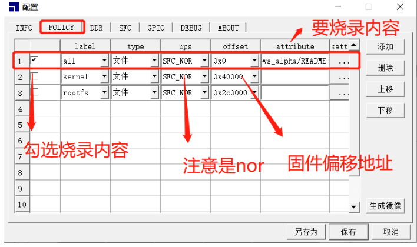

# 随记：


# 一、基础系统环境搭建

## 1.系统分区设置及说明

> [!PDF|important] [[Ingenic_Zeratul_T23_SDK使用说明.pdf#page=7&selection=19,1,20,9&color=important|Ingenic_Zeratul_T23_SDK使用说明, p.7]]
> > 系统分区设置及说明
> 
> 

<span style="background:#b1ffff">分区设置依旧遵循电池类 Camera 系统</span>，具体分区大小如下：
boot tag kernel rootfs recovery system config 
0.25M 352K 4M~5M 2M~3M 2M~2.5M 4512K 512K
<span style="background:#fdbfff">● boot 分区</span>存放 bootloader
●<span style="background:#fdbfff"> tag 分区</span>存放<span style="background:#b1ffff">系统启动参数</span>，包括 cmdline，Senso init setting，env 参数，bootinfo 等。
● <span style="background:#fdbfff">kernel 分区</span>存放内核镜像 uImage 
<span style="background:#fdbfff">● rootfs 分区</span>存放根文件系统。rootfs 使用<span style="background:#b1ffff"> lzo 压缩，通过 initrd 的方式挂载</span>。initrd 类似于 initramfs 方式，也是一种 ramdisk，存放在内存上，因此在系统中创建或修改的文件，仅是存在于内存中，下次启动后内容会复原。
<span style="background:#fdbfff">● system 分区</span>存放<span style="background:#b1ffff">系统资源</span>，比如字体库，图片资源，三方库等等。使用<span style="background:#b1ffff"> squashfs</span>。使用 squashfs 的原因是系统资源往往比较大因此需要压缩，同时以 ro 方式挂载避免数据损坏。同样由于使用了 squashfs 挂载，<span style="background:#d3f8b6">为了不影响启动速度，会在系统主程序运行后才进行挂载，因此 system 分区中存放的数据一般是系统初始化不依赖的资源</span>，如果存放系统初始化依赖的资源或程序，则会影响系统主要业务的启动速度
<span style="background:#fdbfff">● config 分区</span>为<span style="background:#b1ffff"> rw 的 jffs2 文件系统</span>，用来<span style="background:#d3f8b6">存放配置信息等临时数据</span>。config 分区是<span style="background:#d3f8b6">在系统首次启动时创建的</span>
<span style="background:#fdbfff">● recovery 分区</span>存放 recovery_os，其中 recovery 分区也是一个<span style="background:#b1ffff">小型完整的 os</span>， 包含 vmlinux + initramfs_root，使用 lzma 压缩。电子产品往往需要更新升级，并且具有恢复数据等功能。Camera 的 os 分区和 system 分区大小较大，如果在线直接烧写得话可能存在写中断和异常掉电的可能，因此 recovery 分区即是提供一种方式，启动另一个小型的 os，<span style="background:#affad1">可以升级设备或者恢复损坏的文件系统</span>。


## 2.Toolchain 安装使用

> [!PDF|important] [[Ingenic_Zeratul_T23_SDK使用说明.pdf#page=8&selection=39,0,42,9&color=important|Ingenic_Zeratul_T23_SDK使用说明, p.8]]
> > 5.2 .如何安装 Toolchain
> 
> 

 .安装 Toolchain Toolchain 的位置在”/tools/toolchain”
Step 1：安装 7z 解压工具
`sudo apt update sudo
`apt install -y p7zip-full p7zip-rar # 安装完整版及RAR支持

Step 2：根据 Host 机 CPU 位宽选择 mips-gcc540-glibc222-32bit-r3.3.0.tar.gz 或者 mips-gcc540-glibc222-64bit-r3.3.0.tar.gz 进行解压。例如：
`tar -jxvf mips-gcc540-glibc222-64bit-r3.3.0.smaller.tar.bz2

### **常见命令格式总结**

| 文件类型           | 压缩命令                         | 解压命令                     |
| -------------- | ---------------------------- | ------------------------ |
| **`.tar.gz`**  | `tar -czvf file.tar.gz dir`  | `tar -xzvf file.tar.gz`  |
| **`.tar.bz2`** | `tar -cjvf file.tar.bz2 dir` | `tar -jxvf file.tar.bz2` |
| **`.tar.xz`**  | `tar -cJvf file.tar.xz dir`  | `tar -Jxvf file.tar.xz`  |


### 添加环境变量
```
Step 3：通过 export PATH=xxxx:$PATH 命令，将 toolchain 下的 bin 目录添加到 PATH 环境变量中或者在~/.bashrc 中加上下面一句永久改变
vim ~/.bashrc 
export PATH=/home/ming/workspace_jzt23zn/Ingenic_Zeratul_T23_V3.0.0_20240803/Zeratul_Release_20240803/Software/tools/toolchain/gcc_540/mips-gcc540-glibc222-64bit-r3.3.0.smaller/bin/:$PATH

```

<span style="background:#affad1">把T23N的交叉编译器改成了T23ZN的</span>


## 3.Zeratul-T23 基础系统搭建

> [!PDF|important] [[Ingenic_Zeratul_T23_SDK使用说明.pdf#page=9&selection=72,0,80,7&color=important|Ingenic_Zeratul_T23_SDK使用说明, p.9]]
> > 安装 toolchain 后就可以编译 SDK 了。步骤如下：
> 
> 

注意：
 使<span style="background:#b1ffff">用 build_camera_all.sh 进行全部编译实际是调用各个分区脚本</span>，如果 out/camera 目录下有相应分区的文件，默认使用则不重新编译。如果需要重新编译，只要将 out/camera 目录下相应的分区内容删除再执行脚本即可。
 使用 build_camera_all.sh 编译<span style="background:#d3f8b6">会使用 SDK 基础配置，强制覆盖修改内容。如果需要修改分区内容，需要进行手动编译，不推荐再用 build_camera_all.sh 脚本编译，防止覆盖修改内容</span>。 
 初次使用 SDK 可能需要安装其他命令具体安装方法查看本文“<span style="background:#affad1">SDK 编译常见问题</span>”


### Step 1：source build/env_setup_zeratul.sh 
<span style="background:#affad1">根据提示选择完成后，设置了基础的环境变量</span>，根据这些选项，脚本会自动编译相应的内容。
<span style="background:#fdbfff">每次开启新的终端进行编译，都要重新设置一次基础的环境变量。</span>

`cd /home/ming/workspace_jzt23zn/Ingenic_Zeratul_T23_V3.0.0_20240803/Zeratul_Release_20240803/Software

```

please enter the num of jobs(build threads)(defalt 1): 4
要设置构建环境（如 Zeratul 的 `devp` 环境）时，输入构建线程数（jobs）的建议如下：
- **平衡性能**：`4`（假设你的 CPU 是常见的 4 核心）。


  [1] release
  [2] debug
please enter the system build type(defalt 1): 2
- **推荐选择**：  
    如果你是 **开发者/测试者**，需要调试代码，选择 **`2`（debug）**。  
    如果是 **生产环境部署** 或需要 **高性能**，选择默认的 **`1`（release）**。


please enter the FW sub version(pad to the end of the version string), or leave this empty as default: 3.0.0-20250426
* 建议直接用Ingenic_Zeratul_T23_V3.0.0_20240803.7z版本开发.
**推荐填写**：  
如果希望与提供的版本 **`V3.0.0`** 严格一致，直接填写 `3.0.0`。  
如果需要包含日期信息，可以填写 `3.0.0-20240803`（或 `3.0.0+20240803`）。


Supproted SOC Types:
  [1] SOC_T23ZN
  [2] SOC_T23DN
  [3] SOC_T23DL
  [4] SOC_T23ZX
please enter the SOC type index(defalt 1): 1


Supproted SOC Types:
  [1] NOR
  [2] NAND
please enter the flash type index(defalt 1): 1
#### **推荐选择 NOR（选项 1）的情况**：
- 如果你的项目需要：
    - 存储 **系统引导代码** 或 **固件**（如 Zeratul 的开发环境）。
    - 快速启动和直接执行代码（如工业控制、智能终端）。
    - 小容量存储（如 16MB~128MB）。


Supproted camare mode:
  [1] one
  [2] two
  [3] three
please enter the SENSOR num(defalt 1): 1


Supproted sensors:
  [1] gc2053
  [2] gc2063
  [3] gc3003
  [4] sc3235
  [5] jxf37
  [6] sc201cs
  [7] imx327
  [8] sc301IOT
  [9] gc2083
  [10] sc2331
  [11] sc3336p
  [12] jxh63p
please enter the Camera Sensor index(defalt 1): 2


Supported IVDC mode:
  [1] un-direct mode
  [2] direct mode
please enter the ivdc mode index(defalt 1): 1
 **推荐选择 `[1] un-direct mode` 的情况**：
- 如果你的项目：
    - 需要 **传统流程**（如编译后执行、稳定运行）。
    - 硬件或驱动对直接模式支持有限。
    - 默认配置已满足需求，无需额外优化。
```


### Step 2：./build/unpack_all.sh
<span style="background:#d3f8b6">查看并解压 SDK 中所有的压缩包</span>，若已经解压跳过此步骤

**选择 `(A)lways` 自动替换所有后续文件**
### Step 3：<span style="background:#b1ffff"> ./build/build_camera_all.sh</span>
在顶层路径使用脚本<span style="background:#b1ffff">编译整个固件</span>
结束后在“out/” 目录下生成<span style="background:#d3f8b6"> ZRT_CAMERA_FW.bin 整个固件</span>。在“out/camera/”目录下生成各个分区的内容

- 1 并不是调用所有其他编译脚本编译全部。并没有改变out/camero/__rootfs_camero目录下的内容。

- 1 要改变out/camero/**__rootfs_camero**目录下的内容。还是要调用rootfs 编译脚本。


<span style="background:#b1ffff">./build/build_camera_all.sh</span>
./build/build_camera_all.sh


# 二、烧录-Ingenic_Zeratul_T23_烧录说明.pdf

## 简介：
固件编译完成可以<span style="background:#b1ffff">烧录</span>
往下进行IMP库中sample的使用方法。可继续查看系统常用的调试、SDK编译常见问题等。 
## USBCloner 烧录工具
> [!PDF|important] [[Ingenic_Zeratul_T23_烧录说明.pdf#page=10&selection=24,0,26,4&color=important|Ingenic_Zeratul_T23_烧录说明, p.10]]
> > 3.1 USBCloner 烧录工具
> 
> 

## 1.USB2.0接口---原理图与实物对应


## 2.USBCloner 烧录工具的配置解析

###  POLICY 选择烧录分区


### 设置各个烧录分区的位置（方便单独烧录）


### 去掉“全部擦除”。


## 3.分区配置

### 君正T23N烧录分区备份


### 君正T23-ZN烧录分区备份


### 烧录步骤

> [!note] 烧录步骤
> Step6、设置完成点击保存，保存配置信息后，点击开始界面会显示进度提示如下图，烧录完成点击停止
> <span style="background:#affad1">（注意先点击开始，按住 bootsel 按键，然后上电）</span>


# 三、SDK分析

## 1.SDK 结构示意图
> [!PDF|important] [[Ingenic_Zeratul_T23_SDK使用说明.pdf#page=4&selection=19,1,23,3&color=important|Ingenic_Zeratul_T23_SDK使用说明, p.4]]
> > SDK 结构示意图
> 
> 


# 四、新建会话--Xshell


# 五、T23 INDUS 开发板使用说明
- 1 RD_T23_INDUS V1.1开发板


## 1. 设备连接
> [!PDF|important] [[Ingenic_Zeratul_T23_INDUS开发板使用说明.pdf#page=4&selection=30,0,32,4&color=important|Ingenic_Zeratul_T23_INDUS开发板使用说明, p.4]]
> > 1.1 设备连接
> 
> 


## 2.挂载 SD 卡

> [!PDF|note] [[Ingenic_Zeratul_T23_INDUS开发板使用说明.pdf#page=9&selection=23,0,29,1&color=note|Ingenic_Zeratul_T23_INDUS开发板使用说明, p.9]]
> > 2.3 挂载 SD 卡
> 
> 

> [!note] 挂载sd卡
> [root@Zeratul:tmp]# <span style="background:#b1ffff">insmod_mmc</span>
> [root@Zeratul:tmp]# <span style="background:#b1ffff">mount</span>
> rootfs on / type rootfs (rw)
> proc on /proc type proc (rw,relatime)
> devpts on /dev/pts type devpts (rw,relatime,gid=5,mode=620,ptmxmode=000)
> tmpfs on /dev/shm type tmpfs (rw,relatime,mode=777)
> sysfs on /sys type sysfs (rw,relatime)
> /dev/mtdblock6 on /config type jffs2 (rw,relatime)
> /dev/mtdblock5 on /system type squashfs (ro,relatime)
> /dev/mmcblk0p1 on /tmp/mnt/sdcard type vfat (rw,relatime,fmask=0000,dmask=0000,allow_utime=0022,codepage=437,iocharset=iso8859-1,shortname=mixed,errors=remount-ro)
> [root@Zeratul:tmp]# 
> [root@Zeratul:tmp]# 
> [root@Zeratul:tmp]# 
> [root@Zeratul:tmp]# ls
> bootup_time  mnt          ttff
> [root@Zeratul:tmp]# cd mnt
> [root@Zeratul:mnt]# ls
> <span style="background:#affad1">sdcard</span>
> [root@Zeratul:mnt]# cd sdcard/
> [root@Zeratul:sdcard]# ls
> System Volume Information  T23N_sdk
> T23N????                   T23ZN_sdk
> 

- 1 不支持热拔插，插入sd卡后，需手动挂载。关机后再插卡。

- 1 tmp/mnt/sdcard
## 3.登陆密码


# 六、


## 1.

## 2.

## 3.


