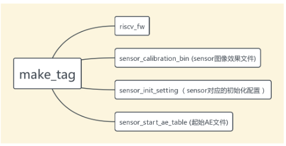
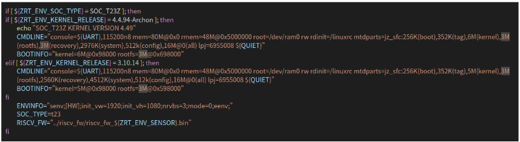
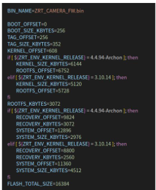

# 随记：

<span style="background:#fdbfff">先把全部编译通过，保存后，再进行更改</span>


# 一、系统各个分区的编译方法
<span style="background:#affad1">固件默认没有启动程序，如果需要测试，则需要手动将程序拷贝到 rootfs 中，并修改对应启动项即可</span>

## 1.uboot 使用

> [!PDF|note] [[Ingenic_Zeratul_T23_SDK使用说明.pdf#page=12&selection=22,0,24,2&color=note|Ingenic_Zeratul_T23_SDK使用说明, p.12]]
> 7.1 .uboot 使用

uboot 所在目录为“os/uboot”,
uboot 默认会使用我们已经编译好的兼容 16M flash 版本 uboot。
如需使用更高容量的 flash 需要重新编译。 
<span style="background:#d3f8b6">bin 目录：编译好的 zeratul uboot,不开源代码</span>。 
u-boot 目录：常规的 uboot 代码，开源代码。


## 2.tag 编译

> [!PDF|important] [[Ingenic_Zeratul_T23_SDK使用说明.pdf#page=12&selection=62,0,64,2&color=important|Ingenic_Zeratul_T23_SDK使用说明, p.12]]
> > 7.2 .tag 编译
> 
> 


### “tools/make_tag”目录

“tools/make_tag”目录下有如图 7-1 内容，描述如上，<span style="background:#b1ffff">如果需要添加新的 sensor， 需要按照上述目录下文件进行制作对应的 bin 文件</span>。说明参考如下： <span style="background:#affad1">要添加新的 sensor-jx38p</span>

1、<span style="background:#fdbfff">riscv_fw：</span>文件的内容是<span style="background:#d3f8b6"> riscv 初始化对应 sensor 的固件</span>。` 
`2、sensor_init_setting：存放 sensor 初始化配置文件，<sensor>_<t31>_init.c 是需要手动制作的文件,其命名必须是按照<sensor>_<t31>_init.c 。`
3、<span style="background:#fdbfff">sensor_calibration_bin：</span>存放 <span style="background:#d3f8b6">sensor 的图像效果文件</span> 
4、<span style="background:#fdbfff">sensor_start_ae_table：</span>可以根据实际 sensor 使用进行添加修改。其中包括<span style="background:#d3f8b6"> IRCUT、IRLED、引脚定义，ADC 阈值设置等。具体使用可以参考目录下源码</span>。


### 7.2.1 .使用脚本生成 TAG 
上述文件正确的情况下，在顶层目录下输入以下命令编译 tag：
`./build/build_camera_tag.sh`

### 7.2.2 更改 cmdline 分区大小
进入目录“tools/make_tag/tag_generator”。打开 build_tag_t23.sh 


CMDLINE 定义了 mem 和 rmem 的分配,其中@后面跟的偏移地址，
jz_sfc 后面是默认分区大小情况 
BOOTINFO 定义了 kernel 和 rootfs 的大小和偏移地址.
例如上图的 kernel=5M@0x98000 举例：5M 代表 kernel 的大小，并且要和 CMDLINE 中的 kernel 情况一致。0x98000 代表 256k(boot)+352k(tag)偏移地址。
这里注意的是，<span style="background:#affad1">如果修改了 cmdline 大小，build_camera_all.sh 也需要同步修改</span>。



## 3.Kernel 编译

> [!PDF|important] [[Ingenic_Zeratul_T23_SDK使用说明.pdf#page=14&selection=18,0,20,2&color=important|Ingenic_Zeratul_T23_SDK使用说明, p.14]]
> > 7.3 .Kernel 编译
> 
> 

### 手动编译 kernel
进入”os/kernel”目录,列出使用内容
`ls arch/mips/configs

```
ming@ming:~/workspace_jzt23zn/Ingenic_Zeratul_T23_V3.0.0_20240803/Zeratul_Release_20240803/Software/os/kernel$ ls arch/mips/configs

1. **zeratul_SOC_T23_NAND_camera_IIC_V1_DEBUG_defconfig**
    
    - `SOC_T23`：指定使用T23型号的系统芯片（SoC）。
    - `NAND`：表示使用NAND类型的Flash存储。
    - `camera_IIC`：表示相机模块使用IIC接口。
    - `V1`：可能是该配置的版本号。
    - `DEBUG`：指明这是一个调试版本的配置。
2. **zeratul_SOC_T23_NAND_camera_IIC_V1_defconfig**
    
    - 与第一个类似，但没有`DEBUG`标记，表明它是一个非调试版本的标准配置。
3. **zeratul_SOC_T23_NAND_camera_recovery_V1_defconfig**
    
    - 这个配置专门针对恢复模式（recovery mode），可能包含特定于恢复操作的设置。
4. **zeratul_SOC_T23_NOR_camera_IIC_V1_DEBUG_defconfig**
    
    - 类似于第一个配置，但是Flash类型是NOR而不是NAND。
5. **zeratul_SOC_T23_NOR_camera_IIC_V1_defconfig**
    
    - NOR Flash类型的标准配置，无调试功能。
6. **zeratul_SOC_T23_NOR_camera_multi_sensor_IIC_V1_defconfig**
    
    - 支持多传感器的配置，适用于具有多个相机传感器的情况。
7. **zeratul_SOC_T23_NOR_camera_recovery_V1_defconfig**
    
    - NOR Flash上的恢复模式配置。
8. **zeratul_SOC_T23_NOR_dualcamera_IIC_V1_defconfig**
    
    - 特定于双摄像头配置，使用NOR Flash和IIC接口。
9. **zeratul_SOC_T23_NOR_triplecamera_IIC_V1_defconfig**
    
    - 针对三摄像头配置，同样使用NOR Flash和IIC接口。
```

`make zeratul_SOC_T23_NOR_camera_IIC_V1_defconfig

然后输入命令： `make uImage 
最后生成在目录<span style="background:#b1ffff"> arch/mips/boot/生成四种文件</span>
uImage.zrt                       未压缩的原始 kernel 固件
uImage.lzo                       标准 lzo 压缩的 kerenl 固件
<span style="background:#affad1">uImage.jzlzma  </span>                 君正 lzma 协议压缩的 kernel 固件 
uImage.lzma                  标准 lzma 压缩的 kernel 固件

推荐使用 jzlzma 格式 kernel。uImage.lzma 仅 recovery 系统支持。

<span style="background:#fdbfff">每次开启新的终端进行编译，都要重新设置一次基础的环境变量。</span>
[[君正T23-ZN芯片开发/君正T23-ZN/1.开发环境准备#Step 1：source build/env_setup_zeratul.sh|1.开发环境准备]]
`cd /home/ming/workspace_jzt23zn/Ingenic_Zeratul_T23_V3.0.0_20240803/Zeratul_Release_20240803/Software

`source build/env_setup_zeratul.sh 


### 使用脚本编译 kernel

> [!PDF|yellow] [[Ingenic_Zeratul_T23_SDK使用说明.pdf#page=14&selection=138,0,142,6&color=yellow|Ingenic_Zeratul_T23_SDK使用说明, p.14]]
> > 7.3.2 使用脚本编译 kernel

`cd /home/ming/workspace_jzt23zn/Ingenic_Zeratul_T23_V3.0.0_20240803/Zeratul_Release_20240803/Software

`./build/build_camera_uImage.sh

<span style="background:#affad1">-jx参数使用多线程编译默认使用-j1</span>

> [!note] ./build/build_camera_uImage.sh
> ming@ming:~/workspace_jzt23zn/Ingenic_Zeratul_T23_V3.0.0_20240803/Zeratul_Release_20240803/Software$ ./build/build_camera_uImage.sh
> [INFO]build camera uImage:
> [INFO]*
> *Start compiling the kernel:<span style="background:#affad1">zeratul_SOC_T23_NOR_camera_IIC_V1_defconfig</span>
> *
> [INFO]build without make defconfig
>   CHK     include/generated/uapi/linux/version.h
>   CHK     include/generated/utsrelease.h

默认使用 arch/mips/configs 下的默认配置，

编译完成同时拷贝到 “out/camera”目录下。


## 4、rootfs 编译
SDK 中提供了 7.2.0 工具链编译好的根文件系统，根据实际选择相应版本。所以在实际的使用过程中，只要将相应版本的文件系统进行压缩就可以使用。
> [!PDF|important] [[Ingenic_Zeratul_T23_SDK使用说明.pdf#page=15&selection=42,0,44,11&color=important|Ingenic_Zeratul_T23_SDK使用说明, p.15]]
> > 7.4.1 使用脚本生成根文件系统
> 

### 用脚本生成根文件系统
`cd /home/ming/workspace_jzt23zn/Ingenic_Zeratul_T23_V3.0.0_20240803/Zeratul_Release_20240803/Software

`./build/build_camera_rootfs.sh -f

脚本实际操作是对 rootfs/rootfs_camera 目录的内容进行操作后拷贝到 out/camera/重新命名为_rootfs_camera，然后将_rootfs_camera 进行 jzlzma 压缩生成 rootfs_camera.cpio.jzlzma。rootfs_camera.cpio.jzlzma 就是实际烧录进 rootfs 分区的内容。
这里注意的是，如果我们单独使用 build_camera_rootfs.sh 脚本编译可能会丢失一些驱动，可以加上 -f 参数来拷贝必要的 ko 文件。

<span style="background:#d3f8b6">rootfs/rootfs_camera ----->拷贝到out/camera/重新命名为_rootfs_camera---->压缩生成 rootfs_camera.cpio.jzlzma(实际烧录)</span>

脚本执行参数描述如下：
<span style="background:#fdbfff">-o 参数  </span>  删除 out/camera/rootfs_camera.cpio.jzlzma,只对其目录下_rootfs_camera 重新压缩。方便往_rootfs_camera 添加其他内容 
<span style="background:#fdbfff">-f 参数  </span>  <span style="background:#affad1">重新对驱动进行编译</span>，并拷贝到_rootfs_camera 后，再压缩。<span style="background:#affad1">要先编译好内核</span>。

## 5、recovery 编译

> [!PDF|important] [[Ingenic_Zeratul_T23_SDK使用说明.pdf#page=15&selection=122,0,124,2&color=important|Ingenic_Zeratul_T23_SDK使用说明, p.15]]
> > 7.5 .recovery 编译
> 
> 

  recovery 是分区名称，<span style="background:#d3f8b6">实际烧录的是一个完整 OS 系统</span>，所以编译 recovery 的时候<span style="background:#d3f8b6">类似编译内核</span>一样，详细介绍看系统分区设置一章。
  如果需要更高的压缩率，可以选择 LZMA 压缩方式。但是需要注意 LZMA 工具版本

### 手动编译 recovery 
进入 os/kernel 目录，输入以下命令列出选项.
 `ls arch/mips/configs/ 
 例如 T23Z 使用 nor flash。在 PC 终端的输入如下命令：
  `make zeratul_SOC_T23Z_camera_recovery_V1_defconfig 
  然后输入如下命令，进行编译： 
  `make uImage 
  生成的 uImage 文件即烧录到 recovery 分区文件。


<span style="background:#fdbfff">每次开启新的终端进行编译，都要重新设置一次基础的环境变量。</span>
[[君正T23-ZN芯片开发/君正T23-ZN/1.开发环境准备#Step 1：source build/env_setup_zeratul.sh|1.开发环境准备]]
`cd /home/ming/workspace_jzt23zn/Ingenic_Zeratul_T23_V3.0.0_20240803/Zeratul_Release_20240803/Software

`source build/env_setup_zeratul.sh 
### 脚本编译
在顶层目录输入如下命令使用脚本进行编译：
`./build/build_camera_recovery.sh 
“out/camera”下生成 recovery.bin 文件
<span style="background:#b1ffff">-r 参数</span>将 os/kernel 路径下的配置文件<span style="background:#d3f8b6">.config 备份一份</span>，然后 distclean。编译完成后再还原.config 文件
<span style="background:#b1ffff">-jx参数</span>使用多线程编译

## 6、 system 编译
<span style="background:#b1ffff">先编译好内核再编译system</span>,<span style="background:#affad1">优其是有-f参数的更是要先编译好内核。</span>

- 1 编译内核最好用脚本编译，手动遍译后。再编译system可能会报错。

> [!PDF|important] [[Ingenic_Zeratul_T23_SDK使用说明.pdf#page=16&selection=107,5,109,2&color=important|Ingenic_Zeratul_T23_SDK使用说明, p.16]]
> > system 编译
> 
> 


6 .system 编译 <span style="background:#affad1">system 脚本执行编译默认会删除 out/camera 下的 system 文件夹</span>，所以直接在其文件夹内添加其他内容是无效的。
如果<span style="background:#b1ffff">添加补充文件可以在 os/rootfs/工具链/camera/system 目录下</span>。在顶层目录下执行脚本：
```
./build/build_camera_system.sh -f
```

或者对添加其他内容后的<span style="background:#b1ffff"> out/camera/system 文件夹</span>，进行手动的压缩，然后重新烧录 system 分区来达到添加其他文件目的。
具体命令为：
```
mksquashfs system system.bin -comp xz
```

<span style="background:#affad1">system分区的内容并不会合并到rootfs分区中。</span>


# 二、

## 1.


## 2.


## 3.


