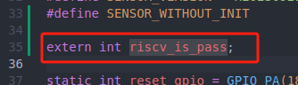
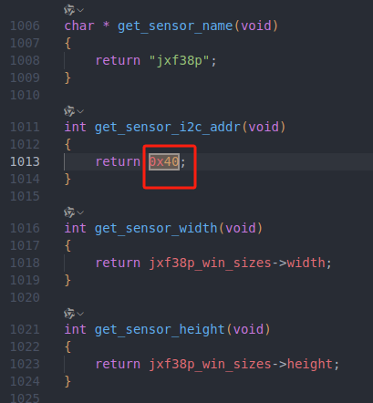
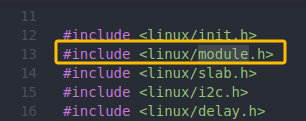
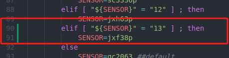
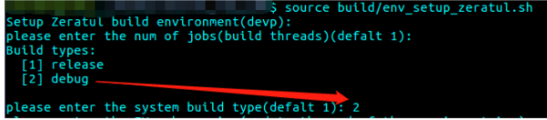
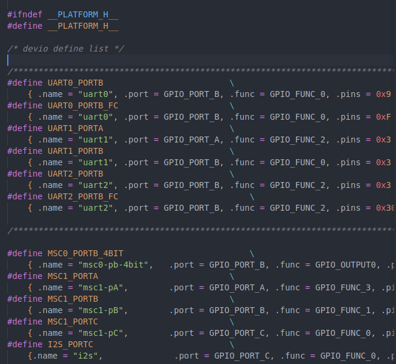
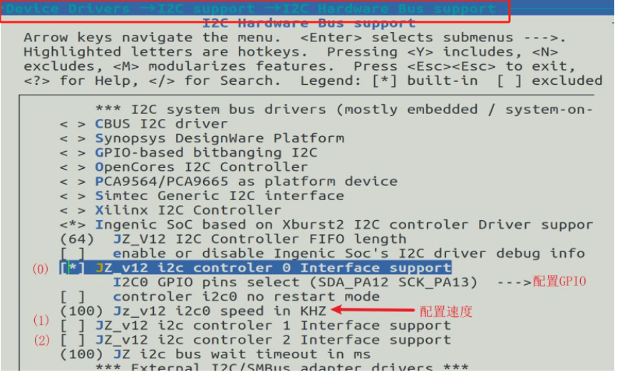
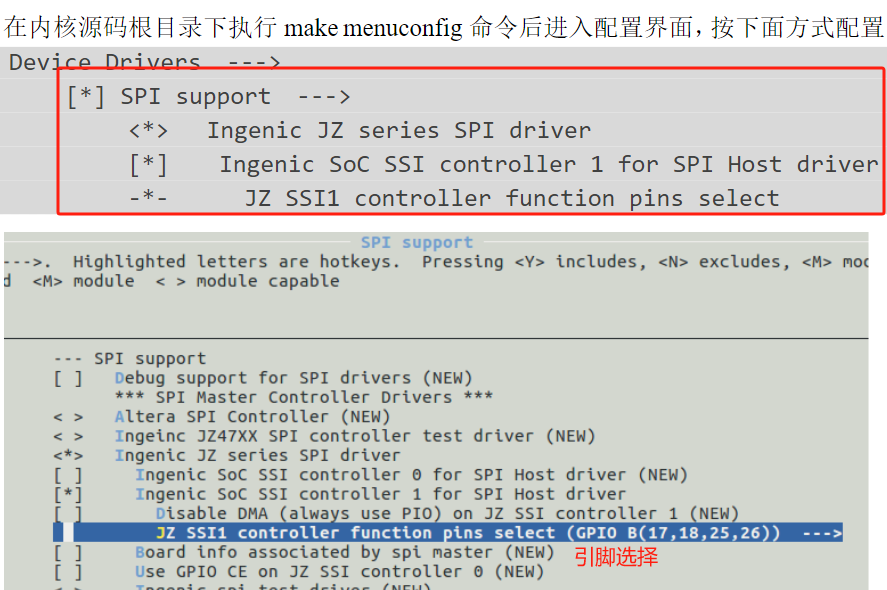

# 随记：


# 一、其他（一般用不到）

## 1.ISP 驱动
ISP 驱动代码路径位于os/drivers/tx-isp-t23 文件夹中。主要由 tx-isp-fast.c 文件代码来实现。

<span style="background:#b1ffff">/os/kernel/arch/mips/xburst/lib/isp-t23</span>
### 编译

> [!PDF|important] [[Ingenic_Zeratul_T23_开发指南.pdf#page=27&selection=71,0,73,2&color=important|Ingenic_Zeratul_T23_开发指南, p.27]]
> > 6.11.4 编译
> 
> 

ISP 驱动编译结构默认是做好的，只需要执行：
`make clean && make && make release 
即可将 ISP 驱动编译并拷贝到内核中。

然后再进入到内核中<span style="background:#d3f8b6">重新编译内核</span>即可。


## 2.MCU_WDT 功能
 > [!PDF|important] [[Ingenic_Zeratul_T23_开发指南.pdf#page=13&selection=18,0,20,2&color=important|Ingenic_Zeratul_T23_开发指南, p.13]]
> > 5. MCU_WDT 功能
> 
> 


## 3.


# 二、sensor移植调试说明

A：如果使用的是电池平台（Zeratul） 不同于 isvp。zeratul 平台的 <span style="background:#affad1">sensor 相关驱动是直接编译进内核的</span>，不需要手动加载相关 sensor 驱动。当选择相应的 sensor 型号，直接编译进内核
## 1.Sensor 移植基本流程

> [!PDF|important] [[Ingenic_Zeratul_T23_sensor移植调试说明.pdf#page=4&selection=20,0,23,4&color=important|Ingenic_Zeratul_T23_sensor移植调试说明, p.4]]
> > Sensor 移植基本流程
> 
> 


### 1.1、Step 1-添加sensor.hex 

<span style="background:#d3f8b6">Source 环境</span>选择一款目前支持的 sensor，然后手动编译内核 

1.2 小节<span style="background:#d3f8b6">移植</span> sensor 驱动源码 

1.3 小节<span style="background:#d3f8b6">编译</span> sensor 驱动

1.4 <span style="background:#affad1">添加脚本内容</span>

<span style="background:#d3f8b6">重新 source 环境选择添加的 sensor </span>

<span style="background:#d3f8b6">手动编译内核</span>看是否能够编译通过。若不通过，重新从第一步开始。


### 1.2、Step 2-添加 tag 内容
参考 1.5 小节<span style="background:#affad1">添加 tag 所需文件</span>

<span style="background:#affad1">重新 source 环境选择用户自己添加的sensor </span>

<span style="background:#affad1">运行脚本 build/build_camera_tag.sh 看是否编译通过</span>。

## 2. Sensor 移植

<span style="background:#b1ffff">移植完后编译重新内核</span>
[[2.系统分区编译#使用脚本编译 kernel]]

> [!PDF|important] [[Ingenic_Zeratul_T23_sensor移植调试说明.pdf#page=5&selection=20,0,22,2&color=important|Ingenic_Zeratul_T23_sensor移植调试说明, p.5]]
> > Sensor 移植
> 
> 


### 移植 Sensor 需要文件概述
 Zeratul 平台的 sensor 移植过程就是制作这些文件的过程。
 
 以 gc2053 为例：
#### 1、sensor 驱动和编译驱动的 Makefile 


#### 2、tag 所需文件部分：


   libz_gc2053.c                     起始 AE 等内容的定义 
   gc2053_t23_init.c                初始化 
   sensor                                 寄存器列表
   riscv_fw_gc2053.bin riscv         固件 
   gc2053_t23.bin sensor           效果文件


### sensor 驱动-jxf38p.c

<span style="background:#b1ffff">os/drivers/sensor-t23/zeratul/single_camera/jxf38p/jxf38p.c</span>

<span style="background:#b1ffff">参照 Zeratul 下的 gc2053驱动源码</span>,其实用jxf37驱动源码更好。

#### 添加宏 SENSOR_WITHOUT_INIT
宏 SENSOR_WITHOUT_INIT 对 Sensor 源码的部分进行了选择编译，在调试 Sensor 时候可以注释掉。如图所示，宏 SENSOR_WITHOUT_INIT 具体放置的位置可以参照 Zeratul 下的其他 Sensor 驱动源码。


#### 函数名称修改：


#### 其他添加部分：risk_is_pass




#### 其他添加部分：函数模块



#### 更改函数返回类型，解决报错：
[[君正T23-ZN芯片开发/君正T23-ZN/报错与解决#1.undefined reference to `init_sensor']]


#### 去掉所有带有 module 的内容（图中未全部列出，查找删除即可）

<span style="background:#affad1">除了这三个地方，其他全部注释掉。</span>




### 编译驱动的 Makefile 
<span style="background:#b1ffff">os/drivers/sensor-t23/zeratul/single_camera/jxf38p/Makefile</span>
这里 Makefile 文件可以使用已经提供的 zeratul 平台其他 sensor 源码中的 Makefile，
确定好路径修改 sensor 名称即可。
在编译 sensor 驱动之前要注意先编译一遍 kernel。

输入命令 <span style="background:#affad1">make 编译</span> sensor 驱动。
输入命令<span style="background:#affad1"> make release 完成</span> sensor 驱动的添加。


<span style="background:#b1ffff">使用已经提供的 zeratul 平台其他 sensor 源码中的 Makefile，修改 sensor 名称即可。</span>


### 修改编译脚本
添加一款新的 sensor，必须也要<span style="background:#b1ffff">改/build/env_setup_zeratul.sh</span>,使其能够正确检索到我们添加的 sensor 文件。





述<span style="background:#affad1">添加完成后，重新 source 环境</span>。终端输入 export 命令，可以看到如下打印，找到“ZRT_ENV_SENSOR”。即为环境sensor，这里sensor是必不可少的


终端输入<span style="background:#b1ffff"> export 命令-检查</span>


## 3.添加 Sensor 所需 TAG 文件

<span style="background:#b1ffff">移植完后编译重新tag</span>
[[2.系统分区编译#7.2.1 .使用脚本生成 TAG]]

### 进入”tools/make_tag”,找到要添加文件的目录：


riscv_fw
sensor_init_setting 
sensor_calibration_bin
sensor_start_ae_table 
```

<1>、Sensor riscv 固件：命名规则为 riscv_fw_<sensor>.bin，拷贝到 riscv_fw 目录下。
<2>、Sensor 初始化配置：命名规则为<sensor>_<txx>_init.c 拷贝到 sensor_init_setting 目录下，并且在 Makefile 中添加 sensor 编译。
<3>、Sensor 效果文件：命名规则为<sensor>_<txx>.bin，将其拷贝到 sensor_calibration_bin 目录下。
<4>、Sensor libz 文件：命名规则为 libz_<sensor>.c,将其拷贝到 sensor_start_ae_table 目录下。

```


### ①jxf38p_t23_init.c---->sensor_init_setting 目录下
<span style="background:#b1ffff">是必添加项</span>


#### Step 1、创建 gc2053_t23_init.c（我们需要的文件） 


#### Step 2、对比已有的 jxf37p_t23_init.c（已有的一款 sensor）结构。
tools/make_tag/sensor_init_setting/jxf37p_t23_init.c

将 Sensor 驱动源码(jxf38p.c)中部分代码添加到我们创建的  jxf37p_t23_init.c（我们需要的文件）文件中。需要添加的内容如下图所示：

<span style="background:#b1ffff">几乎一样，就除了下面两个涂色的</span>


<span style="background:#affad1">static struct regval_list jxf38p_init_regs_1920_1080_12fps_mipi_sync3[] = {</span>
CONFIG_REG_ADDR_SIZE、CONFIG_REG_VALUE_SIZE 定义的大小根据 regval_list 里内容大小进行修改比如 0xfe 对应 1，0xffffe 对应 2。 CONFIG_I2C_ADDR 代表 I2C 地址，要根据 I2C 实际地址选择。


<span style="background:#affad1">#define CONFIG_I2C_ADDR				0x40</span>


#### Step 3、sensor_init_setting 目录下 Makefile 增加jxf38p_t23_init内容
添加 Makefile 内容使得 step 2 中创建的文件可以生成sensor_txx_init.bin 文件。 


#### Step 4、输入命令 make jxf38p_t23_init 生成sensor_txx_init.bin 文件。


### ②riscv_fw_jxf38p.bin--->riscv_fw 目录下

<span style="background:#b1ffff">不是必要项，暂时不添加</span>

### ③jxf38p_t23.bin------>sensor_calibration_bin 目录下。
<span style="background:#b1ffff">可以由其他的 sensor 效果文件拷贝过来</span>。例如 jxf37_t23.bin 拷贝成 gc2053_t23.bin

<span style="background:#affad1"> jxf37p_t23.bin 拷贝成 jxf38p_t23.bin</span>
### ④libz_jxf38p.c---->sensor_start_ae_table 目录下。
<span style="background:#b1ffff">可以由其他的 sensor libz 文件拷贝过来</span>，例如 libz_jxf37.c 拷贝成 libz_gc2053.c
<span style="background:#affad1">libz_jxf37p.c 拷贝成 libz_jxf38p.c</span>
### 


# 三、君正配套wifi的使用

## 1.WIFI 模块使用

> [!PDF|important] [[Ingenic_Zeratul_T23_SDK使用说明.pdf#page=17&selection=69,0,75,2&color=important|Ingenic_Zeratul_T23_SDK使用说明, p.17]]
> > 8.1 添加 WIFI 内容
> 
> 

### Step 1、
找到 os/drivers/wifi，<span style="background:#b1ffff">进入”wifi/build”目录</span>运行脚本输入如下命令，
例如如下图 9-1 选择 cyw43438：
`./build_camera_wifi.sh

### Step 2、
重新烧录 rootfs 分区内容
（注意这里只是在 out/camera 下面的<span style="background:#affad1"> rootfs 进行了添加 wifi 驱动和重新压缩 rootfs 的动作</span>，而没有更新 out 目录下的 ZRT_CAMERA_FW.bin 固件），参考本文烧录章节

## 2.测试 WIFI 功能
> [!PDF|important] [[Ingenic_Zeratul_T23_SDK使用说明.pdf#page=18&selection=24,0,28,2&color=important|Ingenic_Zeratul_T23_SDK使用说明, p.18]]
> > 测试 WIFI 功能
> 
> 

## 3.T23 系统常用调试

Zeratul-T23 系统的 release 版本屏蔽了大部分串口打印，<span style="background:#b1ffff">用户如果想要通过了解更多打印信息或者系统在哪卡死</span>。可以通过打开 kernel 的 Early printk 和去掉 tag 的 quiet 模式。 kernel 选择 Early printk
> [!PDF|important] [[Ingenic_Zeratul_T23_SDK使用说明.pdf#page=21&selection=54,0,58,12&color=important|Ingenic_Zeratul_T23_SDK使用说明, p.21]]
> > kernel 选择 Early printk
> 
> 

### 具体步骤如下：
Step 1 选择 debug 编译类型，如下图 13-2 图 13-2 

Step 2 <span style="background:#affad1">手动打开 Early printk</span> 如上图 13-1，然后重新编译内核 

Step 3 使用 tag 脚本编译，就可以得到 debug 版本 tag
Step 4 <span style="background:#affad1">重新烧录 kernel、tag 分区</span>即可


# 四、GPIO 配置

## 0、板级文件配置-GPIO定义和复用
主要目录在 <span style="background:#b1ffff">os/kernel/arch/mips/xburst/soc-t23 下</span>，其中 GPIO 大部分的定义和使用主要用到如下三个文件：
### 板级文件说明
> [!PDF|note] [[Ingenic_Zeratul_T23_系统资源及GPIO配置.pdf#page=4&selection=39,0,41,6&color=note|Ingenic_Zeratul_T23_系统资源及GPIO配置, p.4]]
> > 1.1 板级文件说明
> 
> 
#### （1）include/mach/platform.h
<span style="background:#affad1">主要配置 GPIO 硬件资源功能，其中命名的宏会在 platform.c 被使用。</span>
以 uart 为例说明宏定义的含义：例如定义 UART1 的 PB23、PB24



.name : 定义的名字
.port :所属组，PA 是 GPIO_PORT_A,以此类推
.func :GPIO 的功能定义，实际要按照 GPIO 手册来定义
.pins :定义 UART1 的 PB23，PB24。<span style="background:#d3f8b6">通过位运算来实现，置某一位对应一个 pin</span>

#### （2）chip-t23/isvp/Pike/board.h
<span style="background:#b1ffff">主要配置的是自定义 GPIO 资源，例如模拟 I2C 等。</span>


#### （3）common/platform.c
<span style="background:#b1ffff">根据 config 的配置来对 platform.h 的宏定义进行选择。</span>


### GPIO 调整办法
> [!PDF|note] [[Ingenic_Zeratul_T23_系统资源及GPIO配置.pdf#page=6&selection=21,3,23,4&color=note|Ingenic_Zeratul_T23_系统资源及GPIO配置, p.6]]
> >  GPIO 调整办法
> 
> 

在调整 GPIO 使用时，建议开启系统 debug 模式。具体开启方法，请查看文档《Zeratul_T23_SDK 使用说明》—T23 系统常用调试章节。

然后将 soc-t23 下的二个文件 <span style="background:#b1ffff">platform.h，board.h 打开。</span>
<span style="background:#affad1">找到冲突 GPIO 定义的位置，注释掉或者设置成-1 即可。</span>


例如<span style="background:#b1ffff">具体 GPIO 调整办法</span>请查看，如下文档： <span style="background:#affad1">《Zeratul_Development_Manual》--GPIO 冲突常见处理方法</span>
[[君正T23-ZN芯片开发/君正T23-ZN/报错与解决#1、GPIO 冲突常见处理方法]]
## 1、UART 使用

### 配置 UART

> [!PDF|note] [[Ingenic_Zeratul_T23_系统资源及GPIO配置.pdf#page=8&selection=27,0,29,22&color=note|Ingenic_Zeratul_T23_系统资源及GPIO配置, p.8]]
> > UART 主要引脚选择如下，其中相同一组不能重复复用，

3 UART 使用 UART 主要引脚选择如下，
其中相同一组不能重复复用，例如 uart1 使能了 PA7 PA6 就不能再使能 PB23,PB24 的 UART 功能。 
UART0 : PB19(RXD)、PB20(CTS)、PB21(RTS)、PB22(TXD)；PC8(TXD)、 PC9(RXD);PC15(CTS)、PC16(RTS) 
UART1 : PA6(TXD)、PA7(RXD);PB23(TXD)、PB24(RXD) 
UART2 : PA10(TXD)、PA11(RXD) ;PC11(CTS)、 PC12(RTS) 、PC13(TXD)、 PC14(RXD) 
使用<span style="background:#affad1"> make menuconfig 配置 </span>UART；
save 后退出 Device Drivers > Character devices > Serial drivers


### 测试 UART
> [!PDF|note] [[Ingenic_Zeratul_T23_系统资源及GPIO配置.pdf#page=8&selection=98,0,100,4&color=note|Ingenic_Zeratul_T23_系统资源及GPIO配置, p.8]]
> > 测试 UART
> 
> 


## 2、I2C 使用

### 配置步骤

> [!PDF|note] [[Ingenic_Zeratul_T23_系统资源及GPIO配置.pdf#page=10&selection=29,0,29,4&color=note|Ingenic_Zeratul_T23_系统资源及GPIO配置, p.10]]
> > 配置步骤



### 测试代码

> [!PDF|note] [[Ingenic_Zeratul_T23_系统资源及GPIO配置.pdf#page=10&selection=42,0,44,3&color=note|Ingenic_Zeratul_T23_系统资源及GPIO配置, p.10]]
> > 测试 I2C
> 
> 


## 3、SPI 使用

### 配置步骤

> [!PDF|note] [[Ingenic_Zeratul_T23_系统资源及GPIO配置.pdf#page=12&selection=27,0,29,4&color=note|Ingenic_Zeratul_T23_系统资源及GPIO配置, p.12]]
> > 5.1 配置步骤


如上图所示选择了 SPI1 为例,这里用的是 PB17 PB18 PB25 PB26。配置完成重新编译内核烧录后。会出现<span style="background:#b1ffff">设备节点/dev/spidev1.0</span>。


### 测试代码
> [!PDF|note] [[Ingenic_Zeratul_T23_系统资源及GPIO配置.pdf#page=13&selection=35,0,42,31&color=note|Ingenic_Zeratul_T23_系统资源及GPIO配置, p.13]]
> > 测试代码位置：userland/base_code 
> > 根据 SPI 测试代码，编译运行，发送数据并用逻辑分析仪抓图如下则测验证成功
> 
> 


### SPI 无设备节点情况
> [!PDF|note] [[Ingenic_Zeratul_T23_系统资源及GPIO配置.pdf#page=13&selection=44,4,46,7&color=note|Ingenic_Zeratul_T23_系统资源及GPIO配置, p.13]]
> > SPI 无设备节点情况
> 
> 

2 SPI 无设备节点情况因为默认 SPI1 作为与 7682 通信，所以<span style="background:#b1ffff">如果不用 7682 wifi 可以修改内核代码使用 SPI1</span>．具体操作步骤如下，然后重新 make menuconfig 配置后即可


## 4、PWM 使用
/home/ming/workspace_jzt23zn/Ingenic_Zeratul_T23_V3.0.0_20240803/Zeratul_Release_20240803/Software/<span style="background:#b1ffff">userland/base_code/sample_pwm/ReadMe.txt</span>
### menuconfig配置如下
#### 1.选择PWM依赖的TCU模块


#### 2.选择通道和使用的GPIO


### 使用方法


#### 1.导出 PWM 通道 N:
  echo N > /sys/class/pwm/pwmchip0/export

#### 2.取消导出的 PWM 通道 N:
  echo N > /sys/class/pwm/pwmchip0/unexport

#### 3.导出 PWM 通道 N 后，进入/sys/class/pwm/pwmchip0/pwmN 目录，可以看到一些属性文件，通过他们来控制PWM输出。

enable: 写入"0"表示禁止PWM输出；写入"1"表示使能PWM输出。读取该文件可获取 PWM 当前使能状态。
  echo 0 > enable #禁止 PWM 输出
  echo 1 > enable #使能 PWM 输出

period: 用于配置 PWM 周期。单位ns。
  配置 PWM 周期为 10us:
    echo 10000 > period

duty_cycle: 用于配置 PWM 的占空比(有效电平)时间。单位ns。
  配置 PWM 占空比为 5us：
    echo 5000 > duty_cycle

polarity: 用于设置极性，可读可写，可写入的值如下：
  echo normal > polarity   #默认极性
  echo inversed > polarity #极性反转


启动时PWM驱动会打印出周期(period)的取值范围(单位ns)，如下：
	pwm: period_ns:max=2730666,min=42


### 注意：
TCU是硬件定时器模块，T21 T23 T31 T40的PWM或bypass或定时器功能与TCU共享通道，
<span style="background:#affad1">通道用作PWM功能后就不能再作为其他功能使用。</span>
T41的PWM是独立的，不依赖TCU。


> [!PDF|note] [[Ingenic_Zeratul_T23_系统资源及GPIO配置.pdf#page=15&selection=54,0,54,4&color=note|Ingenic_Zeratul_T23_系统资源及GPIO配置, p.15]]
> > 驱动参考


## 5、ADC使用

### 配置ADC

> [!PDF|note] [[Ingenic_Zeratul_T23_系统资源及GPIO配置.pdf#page=16&selection=25,0,27,4&color=note|Ingenic_Zeratul_T23_系统资源及GPIO配置, p.16]]
> > 7.1 使用步骤
> 
> 


### 调试代码

> [!PDF|note] [[Ingenic_Zeratul_T23_系统资源及GPIO配置.pdf#page=16&selection=61,0,63,6&color=note|Ingenic_Zeratul_T23_系统资源及GPIO配置, p.16]]
> > 7.1.1 应用例程参考
> 
> 


# 五、打开Zeratul-T23 系统的debug模式


> [!note] debug模式开启
> 具体步骤如下： Step 1 选择 debug 编译类型，如下图 13-2 图 
> 
> Step 2 手动打开 Early printk ，然后重新编译内核
> 
>  Step 3 使用 tag 脚本编译，就可以得到 debug 版本 tag
>  Step 4<span style="background:#affad1"> 重新烧录 kernel、tag 分区</span>即可


# 六、sample测试
/home/ming/workspace_jzt23zn/Ingenic_Zeratul_T23_V3.0.0_20240803/Zeratul_Release_20240803/Software<span style="background:#b1ffff">/userland/5.4.0/imp-t23/samples</span>

[[5.T31驱动移植及加载、测试#六、sample测试]]

## 1.目录结构

### libimp-samples
本质上，**libimp-samples** 是一套由 gtxaspec 维护的示例代码，演示了如何在英集成（Ingenic）SoC（如 A1、T20、T21、T23、T30、T31、T40、T41 等）上使用 **IMP (Ingenic Media Platform)** 库进<span style="background:#affad1">行多媒体、系统及智视（IVS）功能的调用</span> [GitHub](https://github.com/gtxaspec/libimp-samples-musl)；它通过 `build.sh` 脚本自动识别目标平台并依次编译 `libimp`、`libsysutils` 与 `libivs_inf` 三大模块下的示例，帮助开发者快速入门 [GitHub](https://github.com/gtxaspec/libimp-samples-musl/blob/master/build.sh)

### libsysutils-samples

首先，**libsysutils-samples** 是英集成（Ingenic）板级支持包（Board SDK）中针对 **libsysutils** 库的一组示例代码，<span style="background:#affad1">演示了系统工具库的核心功能，包括基础系统调用、加解密、ADC 采样及其他杂项功能</span> [GitHub](https://github.com/aws-samples/amazon-kinesis-video-streams-media-interface/blob/main/3rdparty/README.md?utm_source=chatgpt.com)[JMichault](https://jmichault.github.io/ipcam-100-dok/en/includes.en/html/?utm_source=chatgpt.com)。


## 2.ADC
参考代码<span style="background:#b1ffff">在“samples/libsysutils-samples/sample-adc.c”</span>
<span style="background:#affad1">有些文件名中下划线改成了负号。</span>


参考代码在 sample-adc.c。Zeatul T23 默认使用 ADC 的基准电压为 1.8V。
注意：参考代码中<span style="background:#affad1"> ADC_PATH 表示选择哪个 ADC</span>；
<span style="background:#affad1">STD_VAL_VOLATAGE 表示参考电压，单位为 mv！</span>


## 3.sensor的sample测试

> [!note] sample-Encoder-video .c 
> sample-Encoder-video .c 
> 获取一段对应格式的视频流 
> ./sample-Encoder-video 会在 /tmp 下产生对应编码格式的视频


