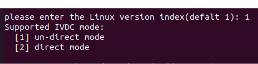

# 随记：

# 一、

## 1.ISP
### 分辨率和 buffer 配置

> [!PDF|note] [[Ingenic_Zeratul_T23_开发指南.pdf#page=26&selection=54,0,60,2&color=note|Ingenic_Zeratul_T23_开发指南, p.26]]
> > 6.11.2 分辨率和 buffer 配置
> 
> 

## 2.
 

## 3.

# 二、Camera 快速启动优化
> [!PDF|important] [[Ingenic_Zeratul_T23_开发指南.pdf#page=14&selection=18,3,20,6&color=important|Ingenic_Zeratul_T23_开发指南, p.14]]
> > Camera 快速启动优化
> 
> 

## 1.

## 2.
 

## 3.

# 三、媒体内存优化
方案 B:内核阶段不缓存 yuv 数据，400w 分辨率相比方案 A 的 nrvbs 为 2 的情况下，可节省内存
方案 B source 环境时选择 direct mode

## 1.驱动层设置：

> [!PDF|note] [[Ingenic_Zeratul_T23_媒体内存优化说明.pdf#page=4&selection=0,6,0,6&color=note|Ingenic_Zeratul_T23_媒体内存优化说明, p.4]]
> > 驱动层设置：
> 
> 

## 2.直通/非直通模式下次码流缓存
> [!PDF|note] [[Ingenic_Zeratul_T23_媒体内存优化说明.pdf#page=4&selection=18,0,20,11&color=note|Ingenic_Zeratul_T23_媒体内存优化说明, p.4]]
> > 直通/非直通模式下次码流缓存
> 
> 

## 3. Mempool size 大小计算
> [!PDF|note] [[Ingenic_Zeratul_T23_媒体内存池使用说明.pdf#page=7&selection=15,4,17,4&color=note|Ingenic_Zeratul_T23_媒体内存池使用说明, p.7]]
> > Mempool size 大小计算
> 
> 

## 4、

## 5、

## 6、

## 7、

## 8、

