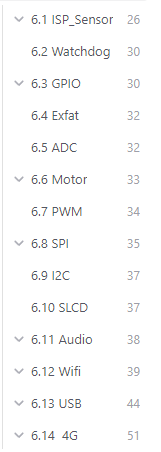

# 备注(声明)：
* patch-20240415-20240803.7z是基于Ingenic_Zeratul_T23_V2.0.0_20240415.7z版本的patch.
* 可以基于Ingenic_Zeratul_T23_V2.0.0_20240415.7z版本打patch.
* 建议直接用Ingenic_Zeratul_T23_V3.0.0_20240803.7z版本开发.
* Zeratul_Release_20240803
* 16787ac38d7ecf66b310a2e2b7f09cdb  patch-20240415-20240803.7z
* 76b916964d6a4d11d16bde5238d3b766  Zeratul_Release_20240803.7z

# 补充：

# 一、文档资料

## 简介:

## 补充：

## 1.README_T23
**使用sdk之前，请优先阅读此文本作为步骤引导及文档指南**

## 2.Ingenic_Zeratul_T23_INDUS开发板使用说明
### 2.1 介绍
认识开发板各个模块、设备的连接、固件烧录、配网、SD卡挂载，然后进行程序的运行，视频的预览等。

### 2.2 设备连接
> [!PDF|important] [[Ingenic_Zeratul_T23_INDUS开发板使用说明.pdf#page=4&selection=30,0,32,4&color=important|Ingenic_Zeratul_T23_INDUS开发板使用说明, p.4]]
> > 1.1 设备连接
> 
> 

### 2.3 USB 转以太网说明
> [!PDF|important] [[Ingenic_Zeratul_T23_INDUS开发板使用说明.pdf#page=7&selection=23,0,26,5&color=important|Ingenic_Zeratul_T23_INDUS开发板使用说明, p.7]]
> > 2.1 USB 转以太网说明
> 
> 

### 2.4 

## 3.Ingenic_Zeratul_T23_SDK使用说明

### 3.2 简介
认识zeratul的SDK结构、系统的分区信息，然后进行toolchain工具链的安装、zeratul—T41基础环境的搭建（uboot、tag、kernel等编译）。

### 3.3 SDK 结构示意图
> [!PDF|important] [[Ingenic_Zeratul_T23_SDK使用说明.pdf#page=4&selection=19,1,23,3&color=important|Ingenic_Zeratul_T23_SDK使用说明, p.4]]
> > SDK 结构示意图
> 
> 

### 3.4 系统分区设置及说明
> [!PDF|important] [[Ingenic_Zeratul_T23_SDK使用说明.pdf#page=7&selection=19,1,20,9&color=important|Ingenic_Zeratul_T23_SDK使用说明, p.7]]
> > 系统分区设置及说明
> 
> 

### 3.5、Toolchain 安装使用
> [!PDF|important] [[Ingenic_Zeratul_T23_SDK使用说明.pdf#page=8&selection=39,0,42,9&color=important|Ingenic_Zeratul_T23_SDK使用说明, p.8]]
> > 5.2 .如何安装 Toolchain
> 
> 

### 3.6、Zeratul-T23 基础系统搭建
> [!PDF|important] [[Ingenic_Zeratul_T23_SDK使用说明.pdf#page=9&selection=72,0,80,7&color=important|Ingenic_Zeratul_T23_SDK使用说明, p.9]]
> > 安装 toolchain 后就可以编译 SDK 了。步骤如下：
> 
> 

### 3.7、uboot 使用
> [!PDF|note] [[Ingenic_Zeratul_T23_SDK使用说明.pdf#page=12&selection=22,0,24,2&color=note|Ingenic_Zeratul_T23_SDK使用说明, p.12]]
> 7.1 .uboot 使用

### 3.8、tag 编译
> [!PDF|important] [[Ingenic_Zeratul_T23_SDK使用说明.pdf#page=12&selection=62,0,64,2&color=important|Ingenic_Zeratul_T23_SDK使用说明, p.12]]
> > 7.2 .tag 编译
> 
> 

### 3.9、Kernel 编译
> [!PDF|important] [[Ingenic_Zeratul_T23_SDK使用说明.pdf#page=14&selection=18,0,20,2&color=important|Ingenic_Zeratul_T23_SDK使用说明, p.14]]
> > 7.3 .Kernel 编译
> 
> 

### 3.10、rootfs 编译
SDK 中提供了 7.2.0 工具链编译好的根文件系统，根据实际选择相应版本。所以在实际的使用过程中，只要将相应版本的文件系统进行压缩就可以使用。
> [!PDF|important] [[Ingenic_Zeratul_T23_SDK使用说明.pdf#page=15&selection=42,0,44,11&color=important|Ingenic_Zeratul_T23_SDK使用说明, p.15]]
> > 7.4.1 使用脚本生成根文件系统
> 
> 

### 3.11、recovery 编译
> [!PDF|important] [[Ingenic_Zeratul_T23_SDK使用说明.pdf#page=15&selection=122,0,124,2&color=important|Ingenic_Zeratul_T23_SDK使用说明, p.15]]
> > 7.5 .recovery 编译
> 
> 

### 3.12、 system 编译
> [!PDF|important] [[Ingenic_Zeratul_T23_SDK使用说明.pdf#page=16&selection=107,5,109,2&color=important|Ingenic_Zeratul_T23_SDK使用说明, p.16]]
> > system 编译
> 
> 

### 3.13、WIFI 模块使用
> [!PDF|important] [[Ingenic_Zeratul_T23_SDK使用说明.pdf#page=17&selection=69,0,75,2&color=important|Ingenic_Zeratul_T23_SDK使用说明, p.17]]
> > 8.1 添加 WIFI 内容
> 
> 

### 3.14、T23 系统常用调试
Zeratul-T23 系统的 release 版本屏蔽了大部分串口打印，用户如果想要通过了解更多打印信息或者系统在哪卡死。可以通过打开 kernel 的 Early printk 和去掉 tag 的 quiet 模式。 kernel 选择 Early printk
> [!PDF|important] [[Ingenic_Zeratul_T23_SDK使用说明.pdf#page=21&selection=54,0,58,12&color=important|Ingenic_Zeratul_T23_SDK使用说明, p.21]]
> > kernel 选择 Early printk
> 
> 

### 3.15、SDK 编译常见问题
> [!PDF|yellow] [[Ingenic_Zeratul_T23_SDK使用说明.pdf#page=22&selection=29,0,29,33&color=yellow|Ingenic_Zeratul_T23_SDK使用说明, p.22]]
> > 10.1. “mkimage” command not found
> 
> 

> [!PDF|yellow] [[Ingenic_Zeratul_T23_SDK使用说明.pdf#page=22&selection=46,0,46,29&color=yellow|Ingenic_Zeratul_T23_SDK使用说明, p.22]]
> > 10.2. lzop: command not found
> 
> 

## 4、Ingenic_Zeratul_T23_烧录说明

### 简介：
固件编译完成可以烧录
往下进行IMP库中sample的使用方法。可继续查看系统常用的调试、SDK编译常见问题等。
### USBCloner 烧录工具
> [!PDF|important] [[Ingenic_Zeratul_T23_烧录说明.pdf#page=10&selection=24,0,26,4&color=important|Ingenic_Zeratul_T23_烧录说明, p.10]]
> > 3.1 USBCloner 烧录工具
> 
> 

## 5、Ingenic_Zeratul_T23_开发指南

### 简介：

了解zeratul的产品架构、搭建camera基础环境、调试阶段文件系统的更新与固件的烧录、MCU_WTD功能、Camera快速启动相关操作、ISP驱动的介绍，
 Zeratul 是基于君正 T 系列芯片的电池类 IPC 开发平台，通过 Zeratul，开发者可以快速开展电池类产品开发。 Zeratul 基于 ISVP（君正 T 系列智能视频开发平台），并封装了电池类 IPC 特殊的功能接口，比如 WIFI 连接、电源管理、关机唤醒等等功能。
### 如何制作并进入 Normal u-boot
> [!PDF|note] [[Ingenic_Zeratul_T23_开发指南.pdf#page=9&selection=55,7,78,1&color=note|Ingenic_Zeratul_T23_开发指南, p.9]]
> > 如果客户需要进入 u-boot 的命令行进行 debug 或者执行客户订制程序（如 TF 卡升级），可以在系统启动后，在命令行输入 recovery 进入 Normal u-boot。
> 
> 
### Camera 快速启动优化
> [!PDF|important] [[Ingenic_Zeratul_T23_开发指南.pdf#page=14&selection=29,0,29,16&color=important|Ingenic_Zeratul_T23_开发指南, p.14]]
> > 快速启动优化主要有以下几个方向：
> 
> 
### ISP 驱动介绍
> [!PDF|important] [[Ingenic_Zeratul_T23_开发指南.pdf#page=27&selection=71,0,73,2&color=important|Ingenic_Zeratul_T23_开发指南, p.27]]
> > 6.11.4 编译
> 
> 

### TAG 分区内容详解
> [!PDF|note] [[Ingenic_Zeratul_T23_开发指南.pdf#page=31&selection=18,0,20,6&color=note|Ingenic_Zeratul_T23_开发指南, p.31]]
> > 6.12 TAG 分区内容详解
> 
> 

## 6、Ingenic_Zeratul_T23_sensor移植调试说明

### 简介：
- 如需要把ISVP中的sensor移植到zeratul中或者新的sensor的添加，可以查看
- 文档中说明了ISVP与Zeratul驱动的区别、移植流程、移植过程中的一下异常问题。

### Sensor 移植基本流程
> [!PDF|important] [[Ingenic_Zeratul_T23_sensor移植调试说明.pdf#page=4&selection=20,0,23,4&color=important|Ingenic_Zeratul_T23_sensor移植调试说明, p.4]]
> > Sensor 移植基本流程
> 
> 

### Sensor 移植
> [!PDF|important] [[Ingenic_Zeratul_T23_sensor移植调试说明.pdf#page=5&selection=20,0,22,2&color=important|Ingenic_Zeratul_T23_sensor移植调试说明, p.5]]
> > Sensor 移植
> 
> 

### sensor 问题调试说明
> [!PDF|note] [[Ingenic_Zeratul_T23_sensor移植调试说明.pdf#page=13&selection=24,0,28,3&color=note|Ingenic_Zeratul_T23_sensor移植调试说明, p.13]]
> > 2.1 sensor 常见 FAQ

> [!PDF|note] [[Ingenic_Zeratul_T23_sensor移植调试说明.pdf#page=16&selection=34,3,36,6&color=note|Ingenic_Zeratul_T23_sensor移植调试说明, p.16]]
> >  sensor 不出图像排查
> 
> 

### 

## 7、Ingenic_Zeratul_T23_TAG-ZRT_UBOOT使用说明

### 简介：
进行一些tag、uboot相关的一些操作，可阅读
文档包括tag中gpio、adc、pwm、白光灯、IRLD&IRCUT操作方法，双系统/SFC/分区大小设置、tag备份使用、sensor时序调节、recovery按键复发、系统升级、uboot flash clk及uboot debug相关说明。

> [!PDF|important] [[君正T23-ZN芯片开发/君正T23-ZN/assets/sdk资料整理归纳/file-20250810171414584.pdf#page=16&selection=32,0,36,2&color=important|Ingenic_Zeratul_T23_TAG-ZRT_UBOOT使用说明, p.16]]
> > Uboot DEBUG 模式
> 
> 

## 8、Ingenic_Zeratul_T23_USB接口配置说明

### 简介：
进行USB的一些转接配置可阅读
文档主要包括USB转以太网、USB转U盘、USB转RNDIS、USB转4G、USB转串口操作。

> [!PDF|important] [[君正T23-ZN芯片开发/君正T23-ZN/assets/sdk资料整理归纳/file-20250810171414632.pdf#page=3&selection=20,0,22,4&color=important|Ingenic_Zeratul_T23_USB接口配置说明, p.3]]
> > USB 接口配置
> 
> 

### 

## 9、Ingenic_Zeratul_T23 系统资源及 GPIO 配置

### 简介：
包含了GPIO使用、UART配置、I2c配置、SPI使用、PWM使用、ADC配置等内容

### GPIO 查询设置工具
为了方便用户测试 GPIO 状态，提供 GPIO 工具。目前工具支持查询 GPIO 的状态、设置 GPIO 功能。路径“tools/debug/gpiotool”。具体用法请看 READM

### UART 使用
> [!PDF|note] [[Ingenic_Zeratul_T23_系统资源及GPIO配置.pdf#page=8&selection=27,0,29,22&color=note|Ingenic_Zeratul_T23_系统资源及GPIO配置, p.8]]
> > UART 主要引脚选择如下，其中相同一组不能重复复用，
> 
> 

### I2C 使用
> [!PDF|note] [[Ingenic_Zeratul_T23_系统资源及GPIO配置.pdf#page=10&selection=29,0,29,4&color=note|Ingenic_Zeratul_T23_系统资源及GPIO配置, p.10]]
> > 配置步骤

> [!PDF|note] [[Ingenic_Zeratul_T23_系统资源及GPIO配置.pdf#page=10&selection=42,0,44,3&color=note|Ingenic_Zeratul_T23_系统资源及GPIO配置, p.10]]
> > 测试 I2C
> 
> 

### SPI 使用
> [!PDF|note] [[Ingenic_Zeratul_T23_系统资源及GPIO配置.pdf#page=12&selection=27,0,29,4&color=note|Ingenic_Zeratul_T23_系统资源及GPIO配置, p.12]]
> > 5.1 配置步骤

> [!PDF|note] [[Ingenic_Zeratul_T23_系统资源及GPIO配置.pdf#page=13&selection=44,4,46,7&color=note|Ingenic_Zeratul_T23_系统资源及GPIO配置, p.13]]
> > SPI 无设备节点情况
> 
> 

### PWM 使用
> [!PDF|note] [[Ingenic_Zeratul_T23_系统资源及GPIO配置.pdf#page=15&selection=27,0,29,4&color=note|Ingenic_Zeratul_T23_系统资源及GPIO配置, p.15]]
> > (1) 内核配置
> 
> 

> [!PDF|note] [[Ingenic_Zeratul_T23_系统资源及GPIO配置.pdf#page=15&selection=54,0,54,4&color=note|Ingenic_Zeratul_T23_系统资源及GPIO配置, p.15]]
> > 驱动参考
> 
> 
### ADC使用
> [!PDF|note] [[Ingenic_Zeratul_T23_系统资源及GPIO配置.pdf#page=16&selection=25,0,27,4&color=note|Ingenic_Zeratul_T23_系统资源及GPIO配置, p.16]]
> > 7.1 使用步骤
> 
> 

> [!PDF|note] [[Ingenic_Zeratul_T23_系统资源及GPIO配置.pdf#page=16&selection=61,0,63,6&color=note|Ingenic_Zeratul_T23_系统资源及GPIO配置, p.16]]
> > 7.1.1 应用例程参考
> 
> 

## 10、Ingenic_Zeratul_T23媒体内存优化说明

### 简介：
 进行媒体内存优化相关了解，可参考
> [!PDF|important] [[Ingenic_Zeratul_T23_媒体内存优化说明.pdf#page=4&selection=0,0,0,6&color=important|Ingenic_Zeratul_T23_媒体内存优化说明, p.4]]
> > 驱动层设置：
> 
> 
### 

### 

## 11、Ingenic_Zeratul_T23媒体内存池使用说明

### 简介：
进行媒体内存池相关操作
文档包括RMEM内存池的简介、mempool的概念及使用方法等。

### Mempool size 大小计算
> [!PDF|important] [[Ingenic_Zeratul_T23_媒体内存池使用说明.pdf#page=7&selection=0,7,17,4&color=important|Ingenic_Zeratul_T23_媒体内存池使用说明, p.7]]
> > 媒体内存池说明媒体内存池文档 4 Copyright® 2005-2020 Ingenic Semiconductor Co., Ltd. All rights reserved. 1.4 Mempool size 大小计算
> 
> 

### 

## 12、Ingenic_Zeratul_T23常见问题FAQ

### 简介：
在使用过程中的一些容易出现的问题都在这
文档中有相关说明，包括节点错乱、pad normal uboot无法启动、不出流、编译内核报错、帧率异常等等。
### GPIO 冲突常见处理方法
> [!PDF|note] [[Ingenic_Zeratul_T23_常见问题FAQ.pdf#page=7&selection=18,0,24,2&color=note|Ingenic_Zeratul_T23_常见问题FAQ, p.7]]
> > 3.4.1 如何确定是哪个 GPIO 冲突

> [!PDF|note] [[Ingenic_Zeratul_T23_常见问题FAQ.pdf#page=7&selection=78,0,80,6&color=note|Ingenic_Zeratul_T23_常见问题FAQ, p.7]]
> > 3.4.2 如何解决冲突
> 
> 

### 修改分区后，无法启动的问题
> [!PDF|note] [[Ingenic_Zeratul_T23_常见问题FAQ.pdf#page=12&selection=42,0,44,13&color=note|Ingenic_Zeratul_T23_常见问题FAQ, p.12]]
> > 3.8 修改分区后，无法启动的问题
> 
> 
### 编译内核出错
> [!PDF|note] [[Ingenic_Zeratul_T23_常见问题FAQ.pdf#page=14&selection=121,0,138,18&color=note|Ingenic_Zeratul_T23_常见问题FAQ, p.14]]
> > 编译内核出现如下现象现象 1: Load Address: ffffffff 现象 2: Load address error, please upgrade \"mkimage\" command and recompile 如果出现如上现象，mkimage 工具版本比较老，需要重新更新到新版本
> 
> 
### 编译的 boot 无法运行
> [!PDF|note] [[Ingenic_Zeratul_T23_常见问题FAQ.pdf#page=16&selection=144,0,159,10&color=note|Ingenic_Zeratul_T23_常见问题FAQ, p.16]]
> > 在使用过程中会遇到编译的卡起 boot，或者 normal boot 无法运行，出现在 boot 启动卡死情况，或者出现进入到 boot 入口就没有打印的情况
> 
> 
### 卡起 uboot 单独更新某个分区后系统无法启动
> [!PDF|note] [[Ingenic_Zeratul_T23_常见问题FAQ.pdf#page=19&selection=105,0,109,15&color=note|Ingenic_Zeratul_T23_常见问题FAQ, p.19]]
> > 卡起 uboot 单独更新某个分区后系统无法启动
> 
> 
### 

## 13、Ingenic_Zeratul_T23快起环境搭建

### 简介：
文主要介绍拿到 SDK 后，如何自行编译 SDK 并创建快起以及功耗测试环境。
来搭建快启的环境
### SDK 编译
SDK 编译请参考《Ingenic_Zeratul_T23_SDK 使用说明》文档介绍。SDK 编译完成后，将固件烧录到开发板上即可，固件默认没有启动程序，如果需要测试，则需要手动将程序拷贝到 rootfs 中，并修改对应启动项即可。

### 编译测试程序
> [!PDF|note] [[Ingenic_Zeratul_T23快起环境搭建.pdf#page=5&selection=46,0,59,2&color=note|Ingenic_Zeratul_T23快起环境搭建, p.5]]
> > 测试 sample 位于 SDK 的 userland/5.4.0/imp-t23/samples/libimp-samples/ 路径下。
> 
> 
### 快速启动测试说明
> [!PDF|note] [[Ingenic_Zeratul_T23快起环境搭建.pdf#page=11&selection=20,0,20,6&color=note|Ingenic_Zeratul_T23快起环境搭建, p.11]]
> > 没有专业设备
> 
> 
### 

## 14、Ingenic_Zeratul_T23快起效果调试说明

### 简介：
如需进行快起效果调试可参考
文档包括起始EV介绍、RISCV介绍、测试环境及IRCUT、IRLED的处理方法。
> [!PDF|important] [[君正T23-ZN芯片开发/君正T23-ZN/assets/sdk资料整理归纳/file-20250810171414760.pdf#page=4&selection=20,0,22,2&color=important|Ingenic_Zeratul_T23_快起效果调试说明, p.4]]
> > 起始 EV
> 
> 
### 

### 

## 15、Ingenic_Zeratul_T23系统调试命令集

### 简介：
了解系统调试的命令
获取时钟频率、sensor帧率、ISP基本信息等。
### impdbg
> [!PDF|yellow] [[Ingenic_Zeratul_T23_系统调试命令集.pdf#page=3&selection=20,1,26,14&color=yellow|Ingenic_Zeratul_T23_系统调试命令集, p.3]]
> >  impdbg --enc_info o 获取编码器参数，实时帧率信息
> 
> 
### touch
> [!PDF|yellow] [[Ingenic_Zeratul_T23_系统调试命令集.pdf#page=3&selection=88,1,104,2&color=yellow|Ingenic_Zeratul_T23_系统调试命令集, p.3]]
> >  touch /tmp/fsattr o 程序执行前 touch o 获取初始化的 framesource 参数
> 
> 
### cat
> [!PDF|yellow] [[Ingenic_Zeratul_T23_系统调试命令集.pdf#page=4&selection=37,1,46,4&color=yellow|Ingenic_Zeratul_T23_系统调试命令集, p.4]]
> > cat /proc/jz/isp/isp-m0 o 获取 ISP 基本信息
> 
> 
### 

## 16、Ingenic_Zeratul_T23_白光灯红外灯使用说明

### 简介：
 如果有使用白光灯或者红外灯的需求，可以参考
按照文档配置使用。
> [!PDF|important] [[君正T23-ZN芯片开发/君正T23-ZN/assets/sdk资料整理归纳/file-20250810171414793.pdf#page=3&selection=20,0,20,4&color=important|Ingenic_Zeratul_T23_白光灯红外灯使用说明, p.3]]
> > 相关介绍
> 
> 
### 

### 

## 17、Ingenic_Zeratul_T23_软光敏调试说明

### 简介：
使用软光敏可以在牺牲一部分出图速度的条件下节省一颗硬件光敏元器件,产品外壳无需开孔以及增加透镜，进行相关开发。
> [!PDF|important] [[君正T23-ZN芯片开发/君正T23-ZN/assets/sdk资料整理归纳/file-20250810171414812.pdf#page=5&selection=20,0,20,5&color=important|Ingenic_Zeratul_T23_软光敏调试说明, p.5]]
> > 软光敏原理
> 
> 
### 

### 

## 18、Ingenic_Zeratul_T23_视频编码常见问题

### 简介：
包含了：编码初始化接口、码控方式、编码方式切换以及动态设置编码参数、jpeg编码等等编码相关的介绍。

> [!PDF|important] [[君正T23-ZN芯片开发/君正T23-ZN/assets/sdk资料整理归纳/file-20250810171414826.pdf#page=3&selection=18,0,20,11&color=important|Ingenic_Zeratul_T23_视频编码常见问题, p.3]]
> > 1. 编码参数初始化接口分析
> 
> 
### 

## 19、Ingenic_Zeratul_T23_BSP开发指南

### 简介：与T23N几乎一致
如要进行BSP相关的开发操作，可参考
文档主要包括系统资源的使用与调试，如：ISP_Sensor驱动、Audio驱动的介绍，GPIO使用、UART配置、I2c配置、SPI使用、PWM使用、ADC配置、Watch dog配置、Motor、GMAC、SD/EMMC/SDIO、USB等配置使用。
### 开发资源介绍
> [!PDF|note] [[君正T23-ZN芯片开发/君正T23-ZN/assets/sdk资料整理归纳/file-20250810171414846.pdf#page=6&selection=38,0,42,2&color=note|Ingenic_Zeratul_T23_BSP开发指南, p.6]]
> > 1.1 SDK 介绍
> 
> 
### Toolchain 安装使用
> [!PDF|note] [[君正T23-ZN芯片开发/君正T23-ZN/assets/sdk资料整理归纳/file-20250810171414846.pdf#page=9&selection=140,0,145,9&color=note|Ingenic_Zeratul_T23_BSP开发指南, p.9]]
> > 2.2.2 如何安装 Toolchain
> 
> 
### Uboot 编译
> [!PDF|note] [[君正T23-ZN芯片开发/君正T23-ZN/assets/sdk资料整理归纳/file-20250810171414846.pdf#page=12&selection=47,0,51,5&color=note|Ingenic_Zeratul_T23_BSP开发指南, p.12]]
> > 1. Uboot 编译流程：
> 
> 
###  Kernel 编译
> [!PDF|note] [[君正T23-ZN芯片开发/君正T23-ZN/assets/sdk资料整理归纳/file-20250810171414846.pdf#page=14&selection=269,0,271,13&color=note|Ingenic_Zeratul_T23_BSP开发指南, p.14]]
> > kernel 可单独编译，不依赖其他代码
> 
> 
### Busybox 编译
> [!PDF|note] [[君正T23-ZN芯片开发/君正T23-ZN/assets/sdk资料整理归纳/file-20250810171414846.pdf#page=15&selection=165,8,189,4&color=note|Ingenic_Zeratul_T23_BSP开发指南, p.15]]
> > 需要先 make defconfig 再 make，之后 make install 会默认把安装文件生成busybox/_install目录下。
> 
> 
### 应用程序编译
> [!PDF|note] [[君正T23-ZN芯片开发/君正T23-ZN/assets/sdk资料整理归纳/file-20250810171414846.pdf#page=16&selection=39,0,41,8&color=note|Ingenic_Zeratul_T23_BSP开发指南, p.16]]
> > 应用程序编译注意有以下几点：
> 
> 

### T23 需要加载的驱动
> [!PDF|note] [[君正T23-ZN芯片开发/君正T23-ZN/assets/sdk资料整理归纳/file-20250810171414846.pdf#page=16&selection=188,0,191,2&color=note|Ingenic_Zeratul_T23_BSP开发指南, p.16]]
> > T23 需要加载的驱动
> 
> 
### 根文件系统介绍
> [!PDF|note] [[君正T23-ZN芯片开发/君正T23-ZN/assets/sdk资料整理归纳/file-20250810171414846.pdf#page=17&selection=42,0,62,5&color=note|Ingenic_Zeratul_T23_BSP开发指南, p.17]]
> > Linux 的目录结构的最顶层是一个被称为 “ . ” 的根目录。系统加载 Linux 内核之后，就会挂载一个设备到根目录上。存在于这个设备中的文件系统被称为根文件系统。所有的系统命令、系统配置以及其他文件系统的挂载点都位于这个根文件系统中。
> 
> 
### Demo rootfs 简单说明
> [!PDF|note] [[君正T23-ZN芯片开发/君正T23-ZN/assets/sdk资料整理归纳/file-20250810171414846.pdf#page=18&selection=186,0,192,6&color=note|Ingenic_Zeratul_T23_BSP开发指南, p.18]]
> > ISVP 的 Demo 分区方式为：
> 
> 
### Uboot 配置
> [!PDF|note] [[君正T23-ZN芯片开发/君正T23-ZN/assets/sdk资料整理归纳/file-20250810171414846.pdf#page=23&selection=36,0,38,2&color=note|Ingenic_Zeratul_T23_BSP开发指南, p.23]]
> > Uboot 配置
> 
> 

### 系统资源使用与调试

> [!PDF|note] [[君正T23-ZN芯片开发/君正T23-ZN/assets/sdk资料整理归纳/file-20250810171414846.pdf#page=26&selection=60,0,63,2&color=note|Ingenic_Zeratul_T23_BSP开发指南, p.26]]
> >  ISP 驱动
> 
> 

### wpa_supplicant 使用方法

> [!PDF|note] [[君正T23-ZN芯片开发/君正T23-ZN/assets/sdk资料整理归纳/file-20250810171414846.pdf#page=57&selection=40,0,46,4&color=note|Ingenic_Zeratul_T23_BSP开发指南, p.57]]
> > wpa_supplicant 及 wpa_cli 使用方法
> 
> 

## 20、rmem的计算方法

## 21、win10禁用数字签名方法

## 22、GPIO 冲突常见处理方法（未找到）

## 23、GPIO 手册（未找到）

# 二、文件资料
## 简介:

 
## 补充：

## 1.OS(完整系统)
### 1.1 uboot(默认提供已经完成的bin文件)

### 1.2 buzybox

### 1.3 driver

- sensor-t23(sensor源码)

- tx-isp-t23(ISP驱动)

- wifi (wifi驱动)

- 其他驱动

### 1.4 kernel

### 1.5、roofts5.4.0(工具链版本)
#### rootfs

#### system

#### rootfs_recovery

## 2.build(编译脚本}
### 2.1 env_setup_zeratul(环境配置)

### 2.2 build_camera_xxx(os内容编译)

### 2.3 

## 3.tool(使用的工具)
### 3.1 make_tag(tag相关)

### 3.2 **toolchain(工具链)**

### 3.3 其他工具

### 3.4 

## 4、firmware(固件放置位置)
### sdcard_uboot(卡启uboot团件)

### sensor_settings(sensor效果文件)

### 

## 5、userland(相关应用库)
### 5.4.0(IMP应用库)

### base_code(UART，SPI，I2C，PWM例程)

### camera-t23

