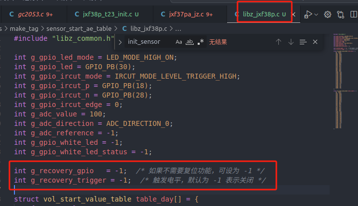

# 随记：


# 一、编译内核时的报错

## 1. lzop: not found

> [!PDF|yellow] [[Ingenic_Zeratul_T23_SDK使用说明.pdf#page=22&selection=46,1,46,29&color=yellow|Ingenic_Zeratul_T23_SDK使用说明, p.22]]
> > 0.2. lzop: command not found
> 
> 

```
sudo apt-get update
sudo apt-get install lzop
```


## 2.手动编译kernel-     make uImage 
 

```
#if defined CONFIG_INGENIC_ZRT_TRIPLE_CAMERA || defined CONFIG_INGENIC_ZRT_DUAL_CAMERA
#include "isp-t23-multicamera/include/fast_start_common.h"
#else
#include "arch/mips/xburst/lib/isp-t23/include/fast_start_common.h"
#endif

```

<span style="background:#fdbfff">每次开启新的终端进行编译，都要重新设置一次基础的环境变量。</span>
[[君正T23-ZN芯片开发/君正T23-ZN/1.开发环境准备#Step 1：source build/env_setup_zeratul.sh|1.开发环境准备]]
`source build/env_setup_zeratul.sh 


## 3. crc32: 未找到命令

```
sudo apt update
sudo apt install -y libarchive-zip-perl
crc32 --help
```


# 二、SDK 编译常见问题（pdf）

## 1.“mkimage” command not found

> [!PDF|yellow] [[Ingenic_Zeratul_T23_SDK使用说明.pdf#page=22&selection=29,0,29,33&color=yellow|Ingenic_Zeratul_T23_SDK使用说明, p.22]]
> > 10.1. “mkimage” command not found
> 
> 


## 2.. lzop: command not found
 

> [!PDF|yellow] [[Ingenic_Zeratul_T23_SDK使用说明.pdf#page=22&selection=46,0,46,29&color=yellow|Ingenic_Zeratul_T23_SDK使用说明, p.22]]
> > 10.2. lzop: command not found
> 
> 


## 3.


# 三、sensor 问题调试说明

## 1.sensor 常见 FAQ
> [!PDF|note] [[Ingenic_Zeratul_T23_sensor移植调试说明.pdf#page=13&selection=24,0,28,3&color=note|Ingenic_Zeratul_T23_sensor移植调试说明, p.13]]
> > 2.1 sensor 常见 FAQ


## 2.sensor 不出图像排查

> [!PDF|note] [[Ingenic_Zeratul_T23_sensor移植调试说明.pdf#page=16&selection=34,3,36,6&color=note|Ingenic_Zeratul_T23_sensor移植调试说明, p.16]]
> >  sensor 不出图像排查
> 
> 


## 3.


# 四、 移植sensor驱动过程中报错

## 1.undefined reference to `init_sensor'
```

arch/mips/xburst/lib/isp-t23/built-in.o: In function `tx_isp_probe': tx-isp-device.c:(.text+0x16c94): undefined reference to `init_sensor' tx-isp-device.c:(.text+0x16c98): undefined reference to `init_sensor' make: *** [Makefile:781：vmlinux] 错误 1 [ERROR]Camera build uImage error
```


### 修改要点

1. **返回类型**：由原来的`static`（隐式返回`int`）或无返回类型（即`void`）改为明确指定返回`int`，用于指示函数执行的结果。
2. **错误处理**：通常使用`0`表示成功，非零值表示不同的错误代码。这是一种广泛接受的做法。
3. **保持函数可见性**：<span style="background:#affad1">去掉`static`关键字后，使得`init_sensor`可以在其他源文件中被调用，增强了其通用性和复用性。</span>

## 2.undeclared identifier g_recovery_trigger,

```
ming@ming:~/workspace_jzt23zn/Ingenic_Zeratul_T23_V3.0.0_20240803/Zeratul_Release_20240803/Software$ ./build/build_camera_tag.sh build camera tag: echo "#include "libz_jxf38p.c"" > config.h gcc -O2 -Wall main.c -o ae_table_jxf38p main.c: In function ‘main’: main.c:123:26: error: ‘g_recovery_gpio’ undeclared (first use in this function) 123 | .recovery_gpio = g_recovery_gpio, | ^~~~~~~~~~~~~~~ main.c:123:26: note: each undeclared identifier is reported only once for each function it appears in main.c:124:35: error: ‘g_recovery_trigger’ undeclared (first use in this function) 124 | .recovery_trigger_level = g_recovery_trigger, | ^~~~~~~~~~~~~~~~~~ make: *** [Makefile:11：jxf38p] 错误 1 [ERROR]make sensor ae table failed error: build tag failed
```




## 3.
 


# 五、Ingenic_Zeratul_T23常见问题FAQ（pdf）


## 1、GPIO 冲突常见处理方法
> [!PDF|note] [[Ingenic_Zeratul_T23_常见问题FAQ.pdf#page=7&selection=18,0,24,2&color=note|Ingenic_Zeratul_T23_常见问题FAQ, p.7]]
> > 3.4.1 如何确定是哪个 GPIO 冲突

> [!PDF|note] [[Ingenic_Zeratul_T23_常见问题FAQ.pdf#page=7&selection=78,0,80,6&color=note|Ingenic_Zeratul_T23_常见问题FAQ, p.7]]
> > 3.4.2 如何解决冲突
> 
> 


## 2、修改分区后，无法启动的问题
> [!PDF|note] [[Ingenic_Zeratul_T23_常见问题FAQ.pdf#page=12&selection=42,0,44,13&color=note|Ingenic_Zeratul_T23_常见问题FAQ, p.12]]
> > 3.8 修改分区后，无法启动的问题


## 3、编译的 boot 无法运行
> [!PDF|note] [[Ingenic_Zeratul_T23_常见问题FAQ.pdf#page=16&selection=144,0,159,10&color=note|Ingenic_Zeratul_T23_常见问题FAQ, p.16]]
> > 在使用过程中会遇到编译的卡起 boot，或者 normal boot 无法运行，出现在 boot 启动卡死情况，或者出现进入到 boot 入口就没有打印的情况


## 4、卡起 uboot 单独更新某个分区后系统无法启动
> [!PDF|note] [[Ingenic_Zeratul_T23_常见问题FAQ.pdf#page=19&selection=105,0,109,15&color=note|Ingenic_Zeratul_T23_常见问题FAQ, p.19]]
> > 卡起 uboot 单独更新某个分区后系统无法启动


## 5、编译内核出错
> [!PDF|note] [[Ingenic_Zeratul_T23_常见问题FAQ.pdf#page=14&selection=121,0,138,18&color=note|Ingenic_Zeratul_T23_常见问题FAQ, p.14]]
> > 编译内核出现如下现象现象 1: Load Address: ffffffff 现象 2: Load address error, please upgrade \"mkimage\" command and recompile 如果出现如上现象，mkimage 工具版本比较老，需要重新更新到新版本


# 六、编译system报错


## 1.[drivers/hid/usbhid/usbhid.ko] undefined! ERROR: "usb_alloc_urb"

> [!note] ERROR: 
> ERROR: "usb_alloc_urb" [drivers/hid/usbhid/usbhid.ko] undefined!
> make[1]: *** [/home/ming/workspace_jzt23zn/Ingenic_Zeratul_T23_V3.0.0_20240803/Zeratul_Release_20240803/Software/os/kernel/scripts/Makefile.modpost:88：__modpost] 错误 1
> make: *** [Makefile:948：modules] 错误 2
> [ERROR]Camera build in kernel source drivers error
> [ERROR]Camera build drivers error

- 1 编译内核最好用脚本编译，手动遍译后。再编译system可能会报错。


# 七、驱动移植后sample测试中报错

## 1、Usb 烧录常见异常
> [!note]
> Boot 阶段 40% —— spl 初始化异常。
> Boot 阶段 60% —— uboot 运行异常。
> 烧录阶段 0% —— flash 擦除或写入错误


## 2、IMP_Sync_Client_ChannelCreate(0) failed

> [!note] 为编码通道 0 建立同步时，找不到该通道或资源不足，因此返回失败。
> Create client success  
> All channel create start  
> IMP_Sync_Client_ChannelCreate(0) failed

- 1 "Sync Client"（同步客户端）,### 应用场景及用途**云服务同步**:
- 1 应该是要连wifi才行。


## 3、`Failed to register i2c client gc2053 at 0x37 (-16)`，错误码 `-16` 表示地址已被占用）。

> [!note] 地址冲突
> 根据 dmesg 日志，您遇到的 I2C 地址冲突 问题非常明确：
> 
> gc2063 芯片已成功注册到 I2C 总线地址 0x37（日志中的 gc2063 chip found @ 0x37）。
> gc2053 尝试注册到相同地址 0x37 时失败（Failed to register i2c client gc2053 at 0x37 (-16)，错误码 -16 表示地址已被占用）。


> [!note] 解决
><span style="background:#affad1"> sensor是gc2053，不是gc063。</span>
<span style="background:#affad1">> sensor底板上的标号gc2063是错误的</span>。


## 4、


# 八、wifi开发过程中报错
## 1、Syntax error: "(" unexpected
> [!note] 路径中包含括号 (1)，导致 shell 解析时出现语法错误
> ming@ming:~/workspace_jzt23zn/taixin-smac-linux-driver-v2.3.2-32108_20241219113541(1)/taixin-smac-linux-driver-v2.3.2-32108$ make smac_usb
> mkdir -p ko
> make -C /home/ming/workspace_jzt23zn/Ingenic_Zeratul_T23_V3.0.0_20240803/Zeratul_Release_20240803/Software/os/kernel M=/home/ming/workspace_jzt23zn/taixin-smac-linux-driver-v2.3.2-32108_20241219113541(1)/taixin-smac-linux-driver-v2.3.2-32108/hgic_smac ARCH=mips CROSS_COMPILE=mips-linux-gnu- CONFIG_HGICS=m CONFIG_HGIC_USB=y EXTRA_CFLAGS="-DCONFIG_HGIC_2G -DCONFIG_SDIO_REINIT -DCONFIG_HGIC_USB" modules
> /bin/sh: 1: Syntax error: "(" unexpected
> make: *** [Makefile:88：smac_usb] 错误 2


> [!success] 解决方案-重命名目录（推荐）
>  进入上级目录
> cd ~/workspace_jzt23zn/
> 
>  <span style="background:#affad1">重命名目录（移除括号）</span>
> mv taixin-smac-linux-driver-v2.3.2-32108_20241219113541\(1\) taixin-smac-linux-driver-v2.3.2-32108


## 2、


## 3、


