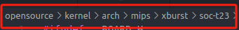
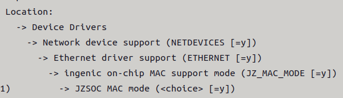
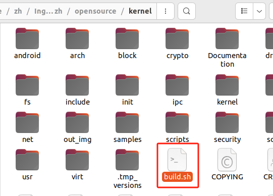
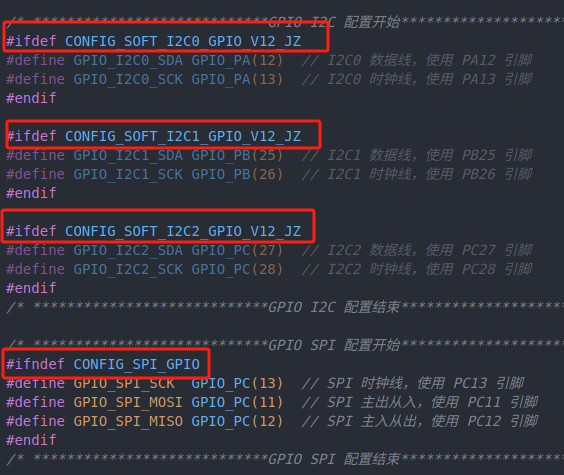
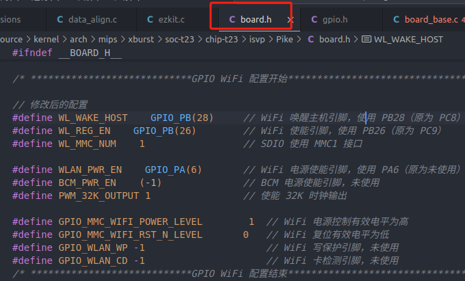

# 随记：


<span style="background:#fdbfff">君正t23芯片的主要配置文件</span>

# 一、内核分析

## 1.kernel/arch/mips/xburst/soc-t23/chip-t23/isvp/Pike/board.h

<span style="background:#affad1">这个文件主要定义了各种外设的 GPIO 引脚配置</span>，包括：
1. I2C 接口配置
2. SPI 接口配置
3. MMC/SD 卡接口配置
4. USB 接口配置
5. 摄像头接口配置
6. 音频接口配置
7. 以太网接口配置
8. WiFi 接口配置

特别注意到 WiFi 配置部分有修改：
- 将唤醒主机引脚从 PC8 改为 PB28
- 将使能引脚从 PC9 改为 PB26
- 添加了 WiFi 电源使能引脚 PA6
- 配置了 SDIO 使用 MMC1 接口
- 设置了相关的电源和复位电平




## 2.编译脚本
[[君正T23N芯片开发/【君正T23N_IPC】/BSP驱动开发/assets/1、君正t23内核分析理解/file-20250810171416767.sh]]



## 3.好像是<span style="background:#b1ffff">直接对.config文件进行图形化界面</span>


# 二、引脚复用怎么设置
## 重点：
- 君正的<span style="background:#b1ffff">引脚设置大部分都是通过图形化界面进行配置的，只有少部分才需要到对应的文件中进行修改</span>，比如：

<span style="background:#affad1">这些都是通过图形化界面配置。</span>


- 还有一些比较特殊的，比如<span style="background:#b1ffff">WiFi是直接就在内核的图形化界面和那两个特殊的文件中进行设置</span>，比如：



- 如果<span style="background:#b1ffff">在驱动源码目录下直接有对应的驱动，那么引脚的设置一般也是在对应的硬件驱动文件下进行设置的</span>


## 1.怎么设置GPIO_PB(26)引脚的复用从I2C到gpio（没啥用）
在 Ingenic T23 芯片中，要设置 GPIO_PB(26) 从 I2C 功能切换到 GPIO 功能，需要修改 GPIO 复用寄存器。让我们查找相关的配置：

Ran tool
根据搜索结果，我发现要设置 GPIO_PB(26) 从 I2C 功能切换到 GPIO 功能，<span style="background:#b1ffff">需要使用 `jzgpio_set_func` 函数。这个函数在 Ingenic T23 芯片中用于设置 GPIO 的复用功能。</span>

具体步骤如下：

1. 首先需要包含相关头文件：
```c
#include <linux/gpio.h>
#include <linux/jzgpio.h>
```

<span style="background:#b1ffff">2. 使用 `jzgpio_set_func` 函数设置 GPIO 功能：</span>
```c
jzgpio_set_func(GPIO_PORT_B, GPIO_FUNC_0, (1 << 26));
```

这里解释一下参数：
- `GPIO_PORT_B`: 表示要设置的是 B 组 GPIO
- `GPIO_FUNC_0`: 表示设置为 GPIO 功能（普通 GPIO 模式）
- `(1 << 26)`: 表示要设置的是 PB26 引脚

3. 设置完成后，还需要配置 GPIO 的方向和电平：
```c
gpio_direction_output(GPIO_PB(26), 0);  // 设置为输出模式，初始电平为低
// 或者
gpio_direction_input(GPIO_PB(26));      // 设置为输入模式
```

4. 如果是在设备树中配置，需要在相应的设备节点中添加：
```dts
&pinctrl {
    wifi_reset: wifi-reset {
        ingenic,pins = <PB26>;
        ingenic,pinmux = <0>;  // GPIO_FUNC_0
        ingenic,pull = <0>;    // 无上拉
    };
};
```

注意事项：
1. 在切换 GPIO 功能之前，确保 I2C 功能已经禁用
2. 切换后需要重新配置 GPIO 的方向和电平
3. 如果是在驱动中动态切换，需要注意同步问题
4. 建议在切换前先保存当前状态，以便需要时可以恢复

您需要我帮您实现具体的代码修改吗？


## 2.君正T23设置引脚复用的文件是那个？
 让我查找君正T23的引脚复用配置文件：

Ran tool
根据搜索结果，我发现君正T23的引脚复用配置主要通过以下几个文件：

<span style="background:#b1ffff">1. 主要配置文件：</span>
<span style="background:#b1ffff">- `opensource/kernel/drivers/tx-isp-t23/include/txx-funcs.h` - 定义了引脚复用相关的函数和枚举</span>
<span style="background:#b1ffff">- `opensource/kernel/drivers/tx-isp-t23/include/sensor-common.h` - 包含了传感器相关的引脚复用配置</span>

/home/ming/workspace/ISVP-T23-1.1.2-20240204/software/zh/Ingenic-SDK-T23-1.1.2-20240204-zh/opensource/kernel/arch/mips/xburst/soc-t23/chip-t23<span style="background:#affad1">/isvp/Pike/board.h</span>

/home/ming/workspace/ISVP-T23-1.1.2-20240204/software/zh/Ingenic-SDK-T23-1.1.2-20240204-zh/opensource/kernel/arch/mips/xburst/soc-t23/chip-t23<span style="background:#affad1">/isvp/common/mmc.c</span>


2. 关键函数：
```c
int jzgpio_set_func(enum gpio_port port, enum gpio_function func, unsigned long pins);
```

3. 引脚复用功能定义：
```c
enum gpio_function {
    GPIO_FUNC_0,  // 普通GPIO功能
    GPIO_FUNC_1,  // 功能1
    GPIO_FUNC_2,  // 功能2
    GPIO_FUNC_3   // 功能3
};
```

4. 使用示例：
```c
// 设置PB26为普通GPIO功能
jzgpio_set_func(GPIO_PORT_B, GPIO_FUNC_0, (1 << 26));

// 设置PB26为I2C功能
jzgpio_set_func(GPIO_PORT_B, GPIO_FUNC_1, (1 << 26));
```

所以，要将GPIO_PB(26)从I2C功能切换到GPIO功能，需要：

<span style="background:#b1ffff">1. 在驱动代码中调用：</span>
```c
jzgpio_set_func(GPIO_PORT_B, GPIO_FUNC_0, (1 << 26));
```

2. 或者在设备树中配置：
```dts
&pinctrl {
    wifi_reset: wifi-reset {
        ingenic,pins = <PB26>;
        ingenic,pinmux = <0>;  // GPIO_FUNC_0
    };
};
```

需要注意的是：
1. 切换功能前需要确保I2C功能已经禁用
2. 切换后需要重新配置GPIO的方向和电平
3. 建议在切换前保存当前状态，以便需要时可以恢复
4. 如果是在驱动中动态切换，需要注意同步问题

您需要我帮您实现具体的代码修改吗？


## 3.设备树,在那


<span style="background:#b1ffff">1. 主要配置文件：</span>
- `opensource/kernel/arch/mips/xburst/soc-t23/chip-t23/isvp/Pike/board.h` - 定义了GPIO引脚配置
- `opensource/kernel/arch/mips/xburst/soc-t23/chip-t23/isvp/common/board_base.c` - 定义了平台设备配置
- `opensource/kernel/arch/mips/xburst/soc-t23/chip-t23/isvp/common/board_base.h` - 定义了平台设备声明


# 三、GPIO


## 1.sysfs GPIO
> [!PDF|important] [[T23 BSP开发参考V1.1.pdf#page=31&selection=197,0,203,6&color=important|T23 BSP开发参考V1.1, p.31]]
> > 6.3.2.2<span style="background:#fdbfff"> sysfs GPIO 的申请与释放</span>
> 
> 

申请/释放 GPIO 方法如下： $ cd /sys/class/gpio 
$ echo [gpio_num] > export #申请 GPIO 
$ echo [gpio_num] > unexport #释放 GPIO

[3-使用命令通过sysfs文件系统控制GPIO](onenote:https://d.docs.live.net/52D4B76BB0FFCF51/Documents/\(RK3568\)Linux驱动开发/第十二期_GPIO子系统.one#3-使用命令通过sysfs文件系统控制GPIO&section-id={70166D78-0FC7-4512-B1CF-4A4481F8C206}&page-id={471F55C3-0F87-4888-BC65-7A714608E9A3}&end)  ([Web 视图](https://onedrive.live.com/view.aspx?resid=52D4B76BB0FFCF51%21se8c325913f784bf694d429e5ee2ab2be&id=documents&wd=target%28%E7%AC%AC%E5%8D%81%E4%BA%8C%E6%9C%9F_GPIO%E5%AD%90%E7%B3%BB%E7%BB%9F.one%7C70166D78-0FC7-4512-B1CF-4A4481F8C206%2F3-%E4%BD%BF%E7%94%A8%E5%91%BD%E4%BB%A4%E9%80%9A%E8%BF%87sysfs%E6%96%87%E4%BB%B6%E7%B3%BB%E7%BB%9F%E6%8E%A7%E5%88%B6GPIO%7C471F55C3-0F87-4888-BC65-7A714608E9A3%2F%29&wdpartid=%7b6260DF4F-45D8-47AA-89D1-7DBACA718547%7d%7b1%7d&wdsectionfileid=52D4B76BB0FFCF51!s379e81f769634ad2a8a457194a5b5af6))
## 2.linux下怎么查看所有引脚的复用情况
<span style="background:#affad1">君正的有点麻烦，不行</span>
### 通过 sysfs（可选）查看

部分 SoC 驱动在 sysfs 下也提供 pinmux 视图，例如：

`ls /sys/devices/platform/omap_ocp/44e10800.pinmux/pinmux-pins`

或

`cat /sys/devices/platform/omap_ocp/44e10800.pinmux/functions`

不同平台路径有所差异，<span style="background:#affad1">需自行查找 `/sys/devices/platform/` 下包含 `pinctrl` 或 `pinmux` 字样的目录</span>


# 六、make


## 1.make distclean
<span style="background:#affad1">会清除make menuconfig的设置</span>


## 2.

## 3.


