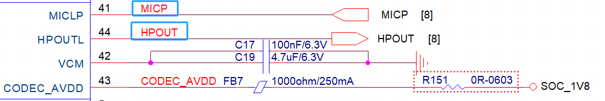

# 随记：

# 一、音频（麦克风和扬声器）
[[君正T23芯片上的资源#11、AUDIO CODEC]]

[[君正T23芯片上的资源#28、 **SPK 接口（音频扬声器接口）]]

| 功能名称       | 对应引脚 | 电压域        | 功能描述                                                           |
| ---------- | ---- | ---------- | -------------------------------------------------------------- |
| MICLP      | —    | CODEC_AVDD | 麦克风左声道输入，用于接收外部模拟音频信号。 |
| HPOUTL     | —    | CODEC_AVDD | 耳机左声道输出，用于输出模拟音频信号至耳机。 |
| VCM        | —    | CODEC_AVDD | 共模电压参考，为模拟音频信号提供稳定的参考电压。                                       |
| CODEC_AVDD | —    | —          | 音频编解码器模拟电源输入，为音频编解码器的模拟部分供电。                                   |

## 1.pike 板上

## 2.IPC上
 
引脚同pick板上的，驱动配置不用改。

## 3.

# 二、

## 1.

## 2.
 

## 3.

# 三、

## 1.

## 2.

## 3.

# 四、

## 1.

## 2.

## 3.
 

# 五、

## 1.

## 2.

## 3.

# 六、

## 1.

## 2.

## 3.

